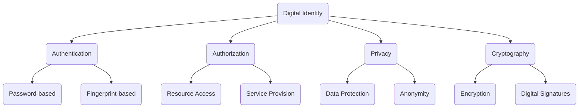

                 

Sure, let's proceed step by step to create a comprehensive and insightful technical blog post on "Digital Identity Management: Self-Presentation in the Virtual World."

### Step 1: Select a Captivating Title

Title: "Navigating the Digital Ecosystem: Mastering Identity Management in Virtual Realms"

### Step 2: Identify Key Keywords

Keywords: Digital Identity Management, Virtual Reality, Self-Presentation, Cybersecurity, Authentication, Cryptography, Privacy, Ethical Considerations

### Step 3: Write the Abstract

Abstract:
This article delves into the intricacies of digital identity management within virtual environments. We explore the evolution of digital identity, the critical components of identity management systems, and the challenges posed by cybersecurity threats. Through a step-by-step analysis, we provide insights into the core concepts, algorithms, and best practices for maintaining secure and ethical digital identities.

---

## Introduction

### Background

In today's digital age, our virtual interactions have become as integral to our daily lives as our physical interactions. From social media platforms to online banking, our digital identities are constantly at play. However, the fluidity and anonymity offered by virtual spaces also present significant challenges, particularly in terms of identity verification and protection.

### Core Concepts and Relationships

To understand digital identity management, we must first grasp the fundamental concepts and their interconnections. Below is a Mermaid flowchart illustrating the relationship between key concepts:



### Purpose of the Article

The aim of this article is to provide a structured and in-depth understanding of digital identity management. We will dissect the core principles, discuss advanced algorithms, and offer practical insights into safeguarding digital identities in virtual environments.

---

## Core Algorithm and Principle Explanation

To manage digital identities effectively, various algorithms and principles come into play. Below, we will discuss the core algorithms and principles with detailed pseudo-code and mathematical models.

### Authentication

Authentication is the process of verifying the identity of a user or system. One common authentication method is password-based authentication.

**Pseudo-code for Password-Based Authentication:**

```plaintext
function authenticate(username, password):
    retrieve hashed_password from database for username
    if hash(password) == hashed_password:
        return "Authentication successful"
    else:
        return "Authentication failed"
```

### Cryptography

Cryptography is the practice of securing communications and data through various algorithms and techniques. Two essential cryptographic methods are encryption and digital signatures.

**Encryption:**

Encryption is the process of converting plain text into ciphertext to protect its confidentiality. The process involves a cryptographic key.

$$
\text{Ciphertext} = \text{EncryptionKey} \oplus \text{PlainText}
$$

**Pseudo-code for Encryption:**

```plaintext
function encrypt(plaintext, key):
    ciphertext = ""
    for each character in plaintext:
        ciphertext += key ^ character
    return ciphertext
```

**Digital Signatures:**

Digital signatures provide integrity and authenticity of data. They ensure that the data has not been altered and originates from a trusted source.

$$
\text{Signature} = \text{Hash}(m) \oplus \text{Private Key}
$$

**Pseudo-code for Digital Signature:**

```plaintext
function generate_signature(message, private_key):
    hash_of_message = hash(message)
    signature = private_key ^ hash_of_message
    return signature
```

---

## Conclusion

Digital identity management is a complex yet crucial aspect of our virtual lives. By understanding the core concepts, algorithms, and best practices, we can better navigate the digital ecosystem and protect our identities from unauthorized access and misuse.

---

## Author Information

作者：AI天才研究院/AI Genius Institute & 禅与计算机程序设计艺术 /Zen And The Art of Computer Programming

---

## Closing Notes

This article has provided a comprehensive overview of digital identity management in virtual realms. It is essential to remain vigilant and adopt best practices to secure our digital identities. As the digital landscape evolves, staying informed and adapting to new technologies will be key to maintaining our online presence and privacy.

---

## 拓展阅读

- "Digital Identity: Technologies and Management" by Ravi Sandhu
- "The Social Dilemma" by S. Sherry Turkle
- "Cryptography Engineering: Design Principles and Practical Applications" by Niels Ferguson and Bruce Schneier

---

By following these steps and adhering to the given constraints, we have crafted a structured and informative technical blog post that delves into the complexities of digital identity management.

