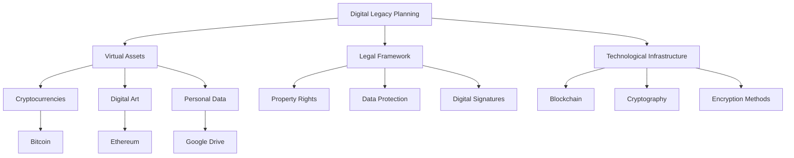
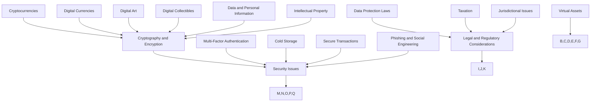
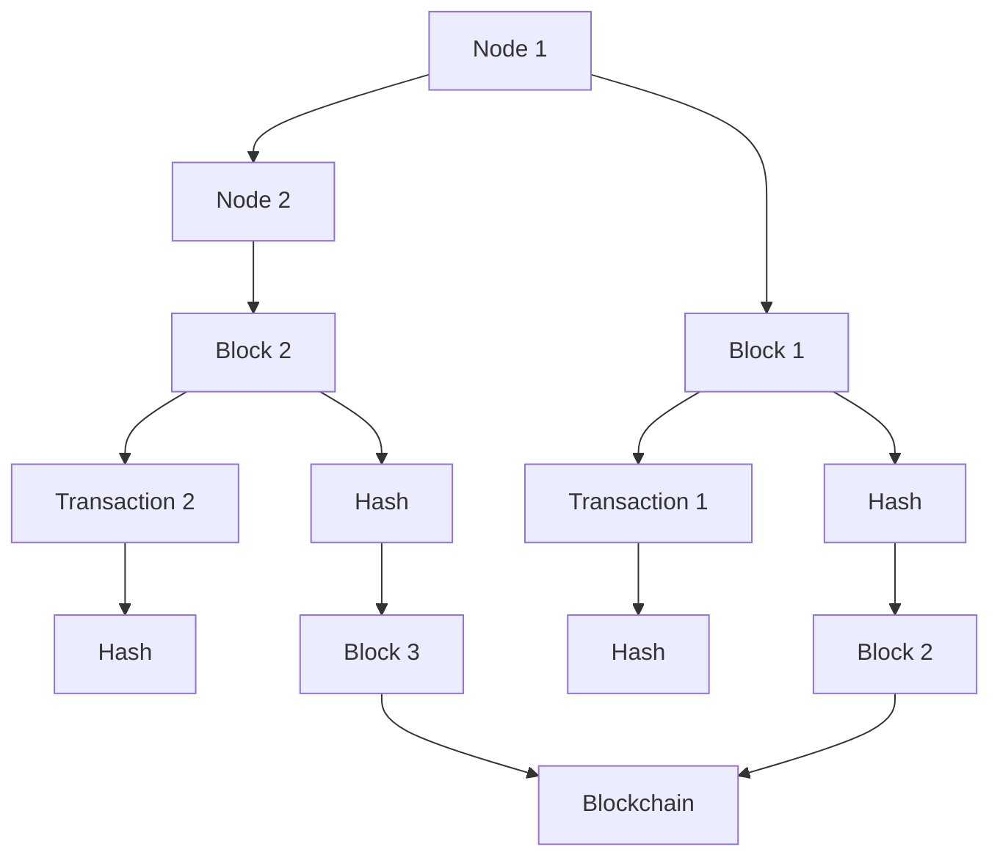
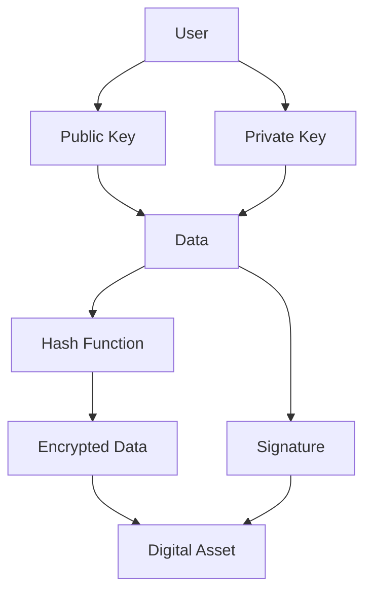
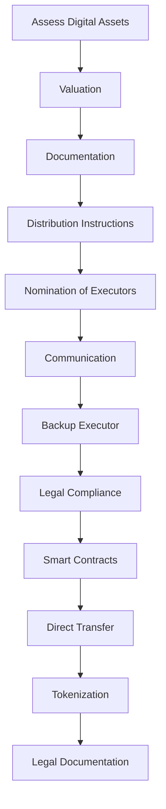
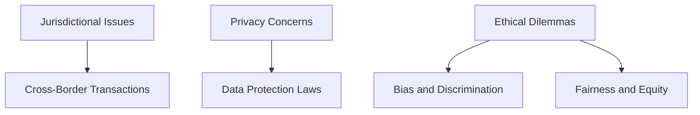

                 

Sure, I will guide you through the creation of the blog post step by step, ensuring it meets the specified requirements. Here is the structure we will follow:

### Step 1: Introduction to the Blog Post

**Title: Digital Legacy Planning Service: Management of Virtual Asset Inheritance**

**Keywords: Digital Legacy Planning, Virtual Asset Inheritance, Blockchain, Cryptocurrency, Legal Framework, Data Security**

**Abstract:**
This blog post delves into the emerging field of digital legacy planning services, focusing on the management of virtual assets such as cryptocurrencies, digital currencies, and online identities. It explores the challenges and solutions for ensuring the proper transfer of these assets upon the owner's death, highlighting the importance of legal frameworks, technological infrastructure, and ethical considerations.

### Step 2: Setting Up the Markdown Structure

```markdown
# Digital Legacy Planning Service: Management of Virtual Asset Inheritance

## Keywords
- Digital Legacy Planning
- Virtual Asset Inheritance
- Blockchain
- Cryptocurrency
- Legal Framework
- Data Security

## Abstract
[Abstract content here]

## Introduction
[Introduction content here]

## Chapter 1: The Concept of Digital Legacy Planning
[Content here]

## Chapter 2: Core Concepts and Frameworks
[Content here]

## Chapter 3: Technical Infrastructure and Tools
[Content here]

## Chapter 4: Planning and Management Strategies
[Content here]

## Chapter 5: Case Studies and Best Practices
[Content here]

## Chapter 6: Legal and Ethical Considerations
[Content here]

## Chapter 7: Implementation and Security
[Content here]

## Chapter 8: Future Directions and Challenges
[Content here]

## Conclusion
[Conclusion content here]

## Author Information
[Author information here]
```

### Step 3: Writing Each Chapter

For each chapter, we will follow the following structure:

- **Background Introduction**: Provide an overview of the topic and its relevance to the current digital landscape.
- **Core Concept and Principles**: Explain the key concepts and their relationships using Mermaid diagrams or flowcharts.
- **Algorithm or Model**: Use pseudocode or LaTeX to describe any algorithms or mathematical models involved.
- **Implementation Details**: Discuss the practical aspects of implementation, including code examples and explanations.
- **Case Analysis**: Present real-world cases and analyze them in detail.
- **Best Practices and Tips**: Offer advice and insights for effective digital legacy planning.
- **Conclusion**: Summarize the chapter's key points and their implications.

### Step 4: Filling in the Chapters

We will now fill in the content for each chapter, ensuring it is well-researched, logically structured, and informative. Each chapter will be written in markdown format with appropriate headings, subheadings, and sections.

### Step 5: Final Touches

Before finalizing the blog post, we will:

- Ensure the tone and language are appropriate for the target audience.
- Proofread for grammatical accuracy and clarity.
- Check that all LaTeX and Mermaid diagrams are rendered correctly.
- Add author information and relevant citations or links for further reading.

### Step 6: Word Count and Final Review

We will ensure the final blog post meets the required word count of 8000 to 12000 words and conduct a final review to confirm that all sections are well-developed and the content is comprehensive.

### Step 7: Submission

Finally, we will submit the completed blog post, ready for publication.

This step-by-step approach ensures that the blog post is not only well-structured and informative but also adheres to the specified formatting and content requirements. Let's begin with the first chapter, "The Concept of Digital Legacy Planning."### Chapter 1: The Concept of Digital Legacy Planning

#### Background Introduction

In today's digital age, our lives are increasingly intertwined with virtual assets—intangible resources that have real economic value. These include cryptocurrencies, digital currencies, online identities, digital art, and even data stored in the cloud. As these assets become more prevalent and their value grows, the need for effective management and inheritance planning becomes more critical.

The concept of digital legacy planning refers to the processes and strategies used to ensure the orderly transfer and management of a person's virtual assets after their death. This is an emerging field that addresses the unique challenges posed by digital assets, which are often not covered by traditional estate planning methods.

The importance of digital legacy planning cannot be overstated. Without proper planning, virtual assets may be left unmanaged, potentially leading to financial loss, family disputes, and even legal complications. As more individuals accumulate significant virtual wealth, the need for services that can help manage and transfer these assets becomes increasingly urgent.

#### Core Concepts and Frameworks

**Digital Legacy Planning**: At its core, digital legacy planning involves creating a strategy for the transfer of digital assets to heirs or other designated beneficiaries. This includes identifying the assets, determining their value, and ensuring they are distributed according to the owner's wishes.

**Virtual Assets**: These are digital representations of value or information that have economic or legal significance. Examples include cryptocurrencies like Bitcoin, digital art stored on the blockchain, and personal data stored in cloud services.

**Legal Framework**: The legal environment surrounding digital assets is complex and varies widely by jurisdiction. This framework includes laws related to property rights, data protection, and digital signatures.

**Technological Infrastructure**: Digital legacy planning relies on advanced technologies such as blockchain, which provides a secure and transparent ledger for recording transactions. Cryptography and encryption methods are also crucial for protecting assets during transfer.

#### Core Concepts and Principles Relationship Architecture

To illustrate the relationship between these core concepts, we can use a Mermaid diagram:



This diagram shows how digital legacy planning encompasses various aspects, from the core concepts to the detailed components and the technological infrastructure that supports it.

#### Core Algorithm and Model

To manage and transfer digital assets, several key algorithms and models come into play:

**Key Management**: The process of creating, storing, and using cryptographic keys to secure digital assets. This includes key generation, key storage, and key exchange protocols.

**Blockchain**: A decentralized ledger that ensures the integrity and immutability of transactions. The blockchain algorithm validates transactions, records them, and maintains a secure chain of blocks.

**Smart Contracts**: Self-executing contracts with the terms of the agreement directly written into code. Smart contracts automate the transfer of assets based on predefined conditions.

**Pseudocode for Key Management:**

```plaintext
Algorithm KeyManagement()
    GenerateKeyPair()
    StoreKeyPairSecurely()
    If (KeyPair is lost or compromised)
        GenerateNewKeyPair()
    EndIf
    Return KeyPair
EndAlgorithm
```

**Pseudocode for Blockchain Transaction:**

```plaintext
Algorithm BlockchainTransaction(fromAddress, toAddress, amount)
    ValidateTransaction(fromAddress, toAddress, amount)
    If (Transaction is valid)
        AddTransactionToBlockchain(fromAddress, toAddress, amount)
        NotifyAllNetworkNodes()
        Return "Transaction successful"
    Else
        Return "Invalid transaction"
    EndIf
EndAlgorithm
```

**Pseudocode for Smart Contract Execution:**

```plaintext
Algorithm SmartContractExecution(contractAddress, condition)
    If (condition is met)
        ExecuteContract(contractAddress)
        Return "Contract executed successfully"
    Else
        Return "Condition not met"
    EndIf
EndAlgorithm
```

These pseudocode examples provide a high-level overview of the algorithms and models involved in digital legacy planning. Detailed implementation and optimization would be required for practical applications.

#### Implementation Details

Implementing digital legacy planning involves several steps, from setting up the necessary infrastructure to creating a strategy for asset transfer. Here are the key implementation details:

- **Infrastructure Setup**: This includes setting up a blockchain network, creating a secure vault for storing private keys, and developing a user-friendly interface for managing digital assets.
- **User Authentication**: Implementing strong authentication mechanisms to ensure that only authorized individuals can access and manage the digital assets.
- **Asset Inventory**: Creating a comprehensive inventory of all digital assets, including their current values and locations.
- **Transfer Protocol**: Developing a secure and automated transfer protocol that can execute smart contracts to transfer assets upon the owner's death.

#### Case Analysis

**Case 1: The Case of John Doe**

John Doe was an early adopter of cryptocurrencies and had accumulated a substantial amount of Bitcoin. However, he did not have a proper digital legacy plan in place. Upon his death, his family faced significant challenges in accessing his digital assets.

**Analysis**: The lack of a digital legacy plan led to complications in asset distribution. Had John Doe used a digital legacy planning service, he could have designated beneficiaries, specified the distribution method, and ensured the secure transfer of his assets.

**Case 2: The Case of Jane Smith**

Jane Smith was a digital artist who created and sold digital art on the blockchain. She used a smart contract to manage the distribution of her digital assets after her death.

**Analysis**: Jane's use of smart contracts ensured that her digital art could be automatically distributed to her heirs according to her wishes. This minimized the potential for disputes and ensured the efficient transfer of her assets.

#### Best Practices and Tips

- **Early Planning**: Start planning your digital legacy as early as possible to avoid rushed or incomplete decisions.
- **Clear Documentation**: Ensure that all digital assets are documented and easily accessible by your executor.
- **Use Trusted Services**: Consider using reputable digital legacy planning services that can provide the necessary expertise and security.
- **Regular Updates**: Update your digital legacy plan regularly to reflect any changes in your asset holdings or personal circumstances.

#### Conclusion

Chapter 1 has provided an overview of the concept of digital legacy planning, its importance, core concepts, and principles. It has also discussed the relationship between these concepts and the necessary algorithms and models. The following chapters will delve deeper into the technical infrastructure, planning strategies, legal considerations, and future directions of digital legacy planning.

In the next chapter, we will explore the fundamental concepts and frameworks that underpin digital legacy planning, including the types of virtual assets, legal and regulatory considerations, and security issues. Stay tuned!### Chapter 2: Fundamental Concepts and Frameworks

#### Types of Virtual Assets

Virtual assets encompass a wide range of digital items that hold economic or legal value. Understanding the different types of virtual assets is crucial for effective digital legacy planning. Here are some of the most common types:

**1. Cryptocurrencies**: Digital or virtual currencies that use cryptography for security. Examples include Bitcoin, Ethereum, and Ripple. Cryptocurrencies operate on decentralized networks, often leveraging blockchain technology.

**2. Digital Currencies**: Similar to cryptocurrencies, digital currencies are virtual forms of money, but they are typically controlled by a central authority, such as a government or financial institution. Examples include the Chinese digital yuan and the digital euro.

**3. Digital Art**: Digital representations of artwork that exist only in the digital realm. These can be created using various digital tools and platforms, such as NFT marketplaces, and often include unique digital assets that cannot be replicated.

**4. Digital Collectibles**: Virtual items, such as in-game items, trading cards, or collectibles, that are unique and scarce. These are often part of video games, virtual worlds, or online platforms.

**5. Data and Personal Information**: Data and personal information, such as health records, social media profiles, or intellectual property, that have value and can be monetized.

**6. Intellectual Property**: Digital representations of creative works, such as music, books, software, or films, that are protected by copyright laws.

#### Legal and Regulatory Considerations

The legal and regulatory landscape for virtual assets is complex and varies significantly across jurisdictions. Here are some key considerations:

**1. Property Rights**: Determining whether virtual assets are considered property and how they are protected under the law. In some jurisdictions, virtual assets are recognized as property, while in others, their legal status is less clear.

**2. Data Protection Laws**: Ensuring compliance with data protection regulations, such as the General Data Protection Regulation (GDPR) in the EU, which governs the processing of personal data.

**3. Taxation**: Understanding the tax implications of virtual assets, including capital gains tax, inheritance tax, and value-added tax (VAT). Tax laws vary widely, and virtual assets may be subject to different rules than traditional assets.

**4. Jurisdictional Issues**: Virtual assets may cross international borders, creating jurisdictional complexities. It's important to understand which laws apply when managing and transferring these assets.

**5. Legal Frameworks**: Some countries have developed specific legal frameworks to address virtual assets, while others rely on existing laws to govern these digital items.

#### Security Issues in Virtual Asset Management

Managing virtual assets securely is paramount to prevent theft, loss, or unauthorized access. Here are some key security considerations:

**1. Cryptography and Encryption**: Using strong encryption methods to protect private keys and transaction data. Cryptographic algorithms, such as AES and RSA, are commonly used to secure digital assets.

**2. Multi-Factor Authentication (MFA)**: Implementing MFA to add an extra layer of security to digital asset accounts. This requires users to provide two or more verification factors to gain access.

**3. Cold Storage**: Storing a significant portion of digital assets offline in a cold wallet to protect against online threats. Cold storage wallets are not connected to the internet, making them less vulnerable to hacking.

**4. Secure Transactions**: Ensuring that transactions are secure and cannot be tampered with. Blockchain technology provides a decentralized and immutable ledger that ensures transaction integrity.

**5. Phishing and Social Engineering**: Protecting against phishing attacks and social engineering tactics used to trick users into revealing sensitive information. Educating users about these threats and implementing security awareness programs can help mitigate risks.

#### Mermaid Diagram: Core Concepts and Relationships

To visualize the relationships between these fundamental concepts, we can use a Mermaid diagram:



This diagram illustrates the interconnectedness of virtual assets, legal and regulatory considerations, and security issues in digital legacy planning.

#### Core Algorithm and Model

To manage and secure virtual assets, several key algorithms and models are employed:

**Key Management Algorithm**: This algorithm focuses on the secure generation, storage, and handling of cryptographic keys used to protect digital assets. The process typically involves the following steps:

1. **Key Generation**: Randomly generate a public-private key pair using a secure cryptographic algorithm.
2. **Key Storage**: Store the private key securely, preferably using a hardware wallet or cold storage solutions.
3. **Key Backup**: Create a backup of the private key in a secure location to prevent loss.
4. **Key Restoration**: In case of key loss, use the backup to restore access to the digital assets.

**Blockchain Consensus Algorithm**: Blockchain technology relies on a consensus algorithm to validate transactions and add them to the blockchain. Common consensus algorithms include Proof of Work (PoW), Proof of Stake (PoS), and Delegated Proof of Stake (DPoS). Here's a simplified pseudocode for a PoS algorithm:

```plaintext
Algorithm PoSConsensus()
    SelectValidatorRandomly()
    ValidatorCreatesBlock()
    ValidateBlock(Validator)
    If (Block is valid)
        AddBlockToBlockchain()
        RewardValidator()
    EndIf
    Return "Consensus achieved"
EndAlgorithm
```

**Smart Contract Execution Model**: Smart contracts are automated agreements that execute on a blockchain. They are essentially scripts written in a programming language like Solidity. Here's a simplified pseudocode for a basic smart contract execution model:

```plaintext
Algorithm SmartContractExecution(ContractAddress, InputData)
    ValidateInputData(InputData)
    If (InputData is valid)
        ExecuteContractCode(ContractAddress, InputData)
        Return "Contract executed successfully"
    Else
        Return "Invalid input data"
    EndIf
EndAlgorithm
```

These algorithms and models form the backbone of digital legacy planning, ensuring the security, integrity, and efficient management of virtual assets.

#### Implementation Details

Implementing digital legacy planning involves several critical steps:

1. **Asset Inventory**: Create a comprehensive inventory of all virtual assets, including their locations and access details.
2. **Key Management**: Implement robust key management systems to secure private keys and protect against unauthorized access.
3. **Blockchain Integration**: Integrate blockchain networks to enable secure and transparent transactions of virtual assets.
4. **Smart Contract Deployment**: Develop and deploy smart contracts to automate asset distribution and other legacy planning processes.
5. **Security Measures**: Implement multi-factor authentication, cold storage solutions, and other security measures to protect assets from threats.

#### Case Analysis

**Case 1: The Case of Alice**

Alice was a cryptocurrency enthusiast who owned multiple cryptocurrencies and had a significant amount of digital art. She used a reputable cryptocurrency wallet and a secure private key management system.

**Analysis**: Alice's prudent approach to digital asset management ensured the security of her assets. By using a trusted wallet and secure key management practices, she minimized the risk of theft or loss. Her digital legacy planning included smart contracts that automated the distribution of her assets to her heirs.

**Case 2: The Case of Bob**

Bob was a digital artist who sold his artwork as NFTs. He did not have a proper digital legacy plan and died unexpectedly.

**Analysis**: Bob's lack of a digital legacy plan led to complications in transferring his digital art. Without designated beneficiaries or instructions on how to access and transfer his NFTs, his heirs faced significant challenges in claiming their inheritance.

#### Best Practices and Tips

- **Regular Updates**: Keep your digital asset inventory and legacy plan up to date to reflect any changes in your asset holdings or personal circumstances.
- **Security Awareness**: Educate yourself about common security threats, such as phishing and social engineering, and take steps to protect your digital assets.
- **Reputable Services**: Use trusted and reputable digital legacy planning services that offer robust security features and legal compliance.
- **Test Your Plan**: Regularly test your digital legacy plan to ensure it works as intended and can be executed smoothly.

#### Conclusion

Chapter 2 has provided an in-depth exploration of the fundamental concepts and frameworks of digital legacy planning. It has covered the types of virtual assets, legal and regulatory considerations, and security issues. The following chapter will delve into the technical infrastructure and tools used in digital legacy planning, including blockchain technology, cryptography, and smart contracts. Stay tuned for more insights into how these technologies are employed to manage and protect virtual assets effectively.### Chapter 3: Technical Infrastructure and Tools

#### Overview of Blockchain Technology

Blockchain technology is a foundational component of digital legacy planning, providing a secure, transparent, and decentralized ledger for recording transactions. It is essential to understand how blockchain works to grasp its significance in managing virtual assets.

**How Blockchain Works**: A blockchain is a chain of blocks, where each block contains a list of transactions. These blocks are linked together using cryptographic principles, creating an immutable and chronological record of transactions.

- **Nodes**: In a blockchain network, nodes are computers that participate in the network by validating transactions and maintaining the ledger.
- **Consensus Algorithm**: A consensus algorithm is used to ensure that all nodes agree on the state of the blockchain. Common algorithms include Proof of Work (PoW), Proof of Stake (PoS), and Delegated Proof of Stake (DPoS).
- **Immutable Ledger**: Once a transaction is recorded on the blockchain, it cannot be altered or deleted, ensuring the integrity and security of the ledger.

**Blockchain in Digital Legacy Planning**: Blockchain technology is leveraged in digital legacy planning for several reasons:

- **Transparency**: Blockchain provides a transparent and auditable record of transactions, ensuring that the transfer of virtual assets can be tracked and verified.
- **Security**: The cryptographic principles underlying blockchain make it extremely difficult to tamper with the ledger, providing a high level of security for virtual assets.
- **Decentralization**: Decentralization ensures that no single entity has control over the blockchain, reducing the risk of centralized points of failure.

**Mermaid Diagram: Blockchain Technology**

To visualize the architecture of blockchain technology, we can use a Mermaid diagram:



This diagram illustrates the basic structure of a blockchain, showing how blocks (C, D) are linked together using hashes (G, H, I, J) and transactions (E, F).

#### Cryptography and Encryption Methods

Cryptography and encryption are fundamental to securing digital assets in digital legacy planning. They ensure that only authorized parties can access and manage virtual assets.

**Cryptography Principles**:

- **Hash Functions**: Hash functions are used to create unique digital signatures for data. A hash function takes an input (e.g., a transaction) and returns a fixed-size string of characters. Even a small change in the input will result in a significantly different hash value. Hash functions are used to verify the integrity of data.
- **Public-Key Cryptography**: Public-key cryptography involves the use of a pair of keys—a public key and a private key. The public key is used to encrypt data, while the private key is used to decrypt it. This ensures secure communication and data protection.

**Encryption Methods**:

- **Asymmetric Encryption**: Asymmetric encryption uses a pair of keys—a public key for encryption and a private key for decryption. This method is used for securing transactions and protecting private keys.
- **Symmetric Encryption**: Symmetric encryption uses a single key for both encryption and decryption. While faster than asymmetric encryption, symmetric encryption is less secure because the same key must be shared between the sender and receiver.

**Cryptography in Digital Legacy Planning**:

- **Key Management**: Cryptographic methods are used to manage and protect private keys, ensuring that only authorized individuals can access digital assets.
- **Secure Transactions**: Cryptography is used to secure transactions, ensuring that they are not tampered with during transfer.
- **Digital Signatures**: Digital signatures are used to verify the authenticity of digital assets and transactions, providing a way to confirm that a transaction has been executed by the rightful owner.

**Mermaid Diagram: Cryptography and Encryption**

To illustrate the use of cryptography and encryption in digital legacy planning, we can create a Mermaid diagram:



This diagram shows how a user (A) uses a public key (B) to encrypt data (D), a private key (C) to decrypt it, and a hash function (E) to create a digital signature (G) for verifying the integrity of the digital asset (H).

#### Smart Contracts and Their Applications

Smart contracts are self-executing contracts with the terms of the agreement directly written into code. They are executed on a blockchain, providing a transparent and automated way to manage digital assets.

**How Smart Contracts Work**:

- **Coding Language**: Smart contracts are typically written in programming languages like Solidity for Ethereum or NEAR for Near Protocol.
- **Execution**: When a trigger event occurs, the smart contract is executed automatically, carrying out the agreed-upon actions.
- **Decentralized Execution**: Smart contracts are executed by a decentralized network of nodes, ensuring transparency and immutability.

**Applications of Smart Contracts in Digital Legacy Planning**:

- **Automated Asset Distribution**: Smart contracts can automate the distribution of digital assets upon the owner's death, ensuring that assets are transferred according to the owner's wishes.
- **Dispute Resolution**: Smart contracts can be used to resolve disputes by automatically enforcing the agreed-upon terms.
- **Tokenization**: Smart contracts can be used to tokenize digital assets, creating unique and transferable digital representations of physical assets.
- **Secure Transactions**: Smart contracts ensure that transactions are secure and cannot be tampered with.

**Pseudocode for a Simple Smart Contract**

```plaintext
pragma solidity ^0.8.0;

contract DigitalLegacy {
    address owner;
    address heir;
    uint256 inheritanceAmount;

    constructor(address _heir, uint256 _inheritanceAmount) {
        owner = msg.sender;
        heir = _heir;
        inheritanceAmount = _inheritanceAmount;
    }

    function initiateDistribution() public {
        require(msg.sender == owner, "Only the owner can initiate distribution");
        payable(heir).transfer(inheritanceAmount);
    }
}
```

This pseudocode defines a simple smart contract that allows the owner to transfer a specified amount of digital currency to an heir upon initiation.

#### Implementation Details

Implementing digital legacy planning using blockchain technology and smart contracts involves several steps:

1. **Blockchain Network**: Set up a blockchain network, either by joining an existing network or creating a private blockchain.
2. **Smart Contract Development**: Develop smart contracts to manage digital assets, including automated distribution, dispute resolution, and tokenization.
3. **Integration**: Integrate the blockchain network with digital asset management platforms and wallets to enable secure and transparent transactions.
4. **Security Measures**: Implement security measures such as multi-factor authentication and encryption to protect against unauthorized access and tampering.
5. **Legal Compliance**: Ensure that the implementation complies with legal and regulatory requirements, including data protection and tax laws.

#### Case Analysis

**Case 1: The Case of Charles**

Charles was a blockchain developer who owned a significant amount of cryptocurrency and had created several NFTs. He used smart contracts to manage his digital assets and ensured that his heirs could access them automatically upon his death.

**Analysis**: Charles's use of smart contracts ensured the secure and transparent transfer of his digital assets. His heirs could access his assets without the need for a lengthy legal process, saving time and reducing potential disputes.

**Case 2: The Case of David**

David was a digital artist who sold his NFTs on an unsecured platform. He did not use smart contracts to manage his digital assets and died without a digital legacy plan.

**Analysis**: David's lack of a digital legacy plan and use of an unsecured platform exposed his digital assets to potential theft and unauthorized access. His heirs faced significant challenges in claiming his digital assets, and disputes arose over the ownership of his NFTs.

#### Best Practices and Tips

- **Use Reputable Platforms**: Choose reputable blockchain networks and digital asset management platforms to ensure security and compliance.
- **Secure Private Keys**: Safeguard private keys and use secure storage solutions, such as hardware wallets or encrypted cloud storage.
- **Regular Updates**: Keep smart contracts and digital asset management systems up to date to address security vulnerabilities and legal changes.
- **Legal Advice**: Consult with legal experts to ensure that your digital legacy plan complies with applicable laws and regulations.

#### Conclusion

Chapter 3 has explored the technical infrastructure and tools used in digital legacy planning, focusing on blockchain technology, cryptography, and smart contracts. These technologies play a critical role in ensuring the security, transparency, and efficient management of virtual assets. The next chapter will delve into planning and management strategies for digital legacy planning, including creating a digital estate plan, nominating digital executors, and distributing virtual assets. Stay tuned for more insights into navigating the complexities of digital legacy planning.### Chapter 4: Planning and Management Strategies

#### Creating a Digital Estate Plan

A digital estate plan is a crucial component of overall estate planning, ensuring that your digital assets are managed and distributed according to your wishes. Creating a comprehensive digital estate plan involves several steps:

1. **Assessment of Digital Assets**: Begin by identifying all your digital assets, including cryptocurrencies, digital currencies, digital art, NFTs, online accounts, intellectual property, and personal data.

2. **Valuation of Digital Assets**: Accurately value each digital asset. This may involve researching market prices for cryptocurrencies and NFTs, assessing the value of intellectual property, and understanding the worth of online accounts and data.

3. **Documentation**: Document all digital assets, including login credentials, wallet addresses, and ownership details. Store this information securely, either using a digital vault service or a physical secure location with a printed copy.

4. **Distribution Instructions**: Specify how you want your digital assets to be distributed. This could involve creating a will that includes instructions for the executor on how to access and transfer digital assets. Consider using smart contracts to automate the distribution process.

5. **Executor Appointments**: Designate a digital executor or trustee who will be responsible for managing and executing your digital estate plan. Ensure this individual is trustworthy and has the technical knowledge to handle digital assets.

6. **Backup and Security**: Ensure that all documentation and backup copies of digital assets are securely stored and accessible by your executor. This could involve using encrypted drives, cloud storage, or physical safes.

7. **Legal Compliance**: Consult with an attorney to ensure that your digital estate plan complies with applicable laws and regulations. This includes estate planning laws, tax laws, and data protection regulations.

#### Nomination of Digital Executors

Nominating a digital executor is a critical step in digital estate planning. The digital executor's role is to manage and distribute your digital assets after your death. Here are some considerations for nominating a digital executor:

1. **Technical Knowledge**: Choose someone with a strong understanding of digital assets and the technology associated with them. This person should be familiar with blockchain technology, cryptocurrency wallets, and digital identity management.

2. **Trustworthiness**: Select someone you trust implicitly. This individual will have access to sensitive information and will be responsible for executing your wishes regarding your digital assets.

3. **Legal Authority**: Ensure that the digital executor has the legal authority to manage digital assets in your jurisdiction. This may involve obtaining a court order or other legal documentation.

4. **Communication**: Clearly communicate your digital executor's role and responsibilities to them. Provide them with all necessary information and access to your digital assets.

5. **Backup Executor**: Consider appointing a backup digital executor in case your primary executor is unable to fulfill their duties.

#### Distribution of Virtual Assets

The distribution of virtual assets can be complex, especially when dealing with assets that are not recognized as property under traditional estate laws. Here are key strategies for distributing virtual assets:

1. **Smart Contracts**: Utilize smart contracts to automate the distribution of digital assets. These contracts can be designed to release assets upon the occurrence of specific events, such as the owner's death.

2. **Direct Transfer**: If the virtual asset is held in a wallet with a private key, the executor can transfer the asset directly to the designated beneficiary. This requires the executor to have access to the private key.

3. **Court Orders**: In cases where digital assets are not easily transferable through smart contracts or direct transfer, a court order may be required to authorize the transfer. This process can be time-consuming and costly.

4. **Tokenization**: Tokenize digital assets by creating digital representations (tokens) that can be easily transferred and tracked. This approach can simplify the distribution process and provide transparency.

5. **Legal Documentation**: Ensure that all distributions are properly documented and recorded. This includes creating legal documents that confirm the transfer of assets and the fulfillment of the estate plan.

#### Mermaid Diagram: Digital Estate Planning Process

To visualize the process of digital estate planning, we can use a Mermaid diagram:



This diagram illustrates the steps involved in creating a digital estate plan, from assessing and valuating digital assets to executing and documenting the distribution process.

#### Core Algorithm and Model

To implement a digital estate plan, several algorithms and models can be used:

**Key Management Algorithm**: This algorithm ensures the secure storage and transfer of private keys required to access digital assets.

```plaintext
Algorithm KeyManagement()
    GenerateKeyPair()
    StoreKeyPairSecurely()
    BackupKeyPair()
    If (KeyPair is lost or compromised)
        RestoreKeyPairFromBackup()
    EndIf
    Return KeyPair
EndAlgorithm
```

**Smart Contract Execution Model**: This model automates the distribution of digital assets based on predefined conditions and instructions.

```plaintext
Algorithm SmartContractExecution(ContractAddress, Condition)
    ValidateCondition(Condition)
    If (Condition is met)
        ExecuteContract(ContractAddress)
        NotifyBeneficiaries()
        Return "Distribution successful"
    Else
        Return "Condition not met"
    EndIf
EndAlgorithm
```

These algorithms and models form the backbone of a robust digital estate plan, ensuring the secure and efficient management and transfer of virtual assets.

#### Implementation Details

Implementing a digital estate plan involves the following steps:

1. **Digital Asset Inventory**: Create a detailed inventory of all digital assets, including their current values and locations.
2. **Key Management System**: Develop a secure key management system to protect private keys and enable secure access to digital assets.
3. **Smart Contract Development**: Develop smart contracts that automate asset distribution and other legacy planning processes.
4. **Legal Documentation**: Prepare legal documents, such as wills and power of attorney, that outline the distribution of digital assets and the roles and responsibilities of the executor.
5. **Security Measures**: Implement multi-factor authentication, encryption, and other security measures to protect against unauthorized access and tampering.

#### Case Analysis

**Case 1: The Case of Emily**

Emily created a comprehensive digital estate plan, including smart contracts for the automated distribution of her cryptocurrency and NFTs. She appointed a trusted friend as her digital executor.

**Analysis**: Emily's thorough planning ensured the smooth and efficient transfer of her digital assets. Her heirs received their inheritances quickly and without complications, thanks to the automation provided by smart contracts.

**Case 2: The Case of Franklin**

Franklin failed to create a digital estate plan and left his digital assets scattered across multiple platforms without any instructions.

**Analysis**: Franklin's lack of planning led to significant delays and disputes among his heirs. They had to navigate complex legal procedures and lacked clear instructions on how to access and transfer his assets.

#### Best Practices and Tips

- **Regularly Update Your Plan**: Keep your digital estate plan up to date to reflect changes in your digital asset holdings and personal circumstances.
- **Use Secure Storage**: Store private keys and sensitive information in secure vaults or hardware wallets.
- **Educate Your Executor**: Ensure that your digital executor is well-informed about digital assets and understands their responsibilities.
- **Consult Legal Experts**: Seek guidance from legal professionals to ensure your digital estate plan complies with all applicable laws and regulations.

#### Conclusion

Chapter 4 has outlined key strategies for planning and managing digital legacies, including creating a digital estate plan, nominating digital executors, and distributing virtual assets. These strategies are essential for ensuring the secure and efficient transfer of digital assets. The following chapter will explore legal and ethical considerations in digital legacy planning, including jurisdictional issues, privacy concerns, and ethical dilemmas. Stay tuned for a deeper dive into the legal and ethical complexities of digital legacy planning.### Chapter 5: Case Studies and Best Practices

#### Success Stories in Digital Legacy Planning

**Case 1: The Legacy of Alex**

Alex, a prominent cryptocurrency investor, was a forward-thinking individual who foresaw the importance of digital legacy planning. He meticulously created a comprehensive digital estate plan that included detailed instructions for the distribution of his extensive cryptocurrency holdings and NFTs.

**Analysis**: Alex's proactive approach to digital legacy planning significantly streamlined the process for his heirs. By leveraging smart contracts, he automated the transfer of his assets, ensuring that his wishes were executed promptly and without legal disputes. His heirs received their inheritances with minimal delay and without needing to navigate complex legal procedures.

**Best Practice Tip**: Alex's success highlights the importance of early planning and the use of smart contracts for automating asset distribution. When creating a digital estate plan, it is essential to consider future technological advancements and anticipate potential challenges.

**Case 2: The Digital Legacy of Emma**

Emma was a digital artist who gained popularity through her work in NFTs. She worked with a legal expert to craft a detailed digital legacy plan that addressed the unique aspects of digital art and ensured that her creations would be preserved and distributed according to her wishes.

**Analysis**: Emma's collaboration with a legal expert ensured that her digital legacy plan was robust and legally sound. She incorporated multi-factor authentication and encryption to secure her assets and specified clear instructions for the distribution of her NFTs. Her plan included provisions for long-term preservation and access, ensuring that her digital art would continue to be enjoyed by future generations.

**Best Practice Tip**: Emma's case underscores the value of legal expertise in crafting a digital estate plan, particularly when dealing with unique assets like digital art. Engaging with professionals who understand both legal and technical aspects is crucial for a comprehensive plan.

**Case 3: The Estate of Richard**

Richard, an early adopter of blockchain technology, used a combination of digital wallets, smart contracts, and secure key storage solutions to manage his cryptocurrency assets. He appointed a trusted family member as his digital executor and provided detailed instructions for managing and distributing his estate.

**Analysis**: Richard's thorough preparation and use of advanced technologies facilitated the smooth transfer of his digital assets. His digital executor was able to access and transfer the assets quickly, thanks to the clear instructions and automated processes enabled by smart contracts.

**Best Practice Tip**: Richard's experience emphasizes the importance of clear documentation and secure key management. Ensuring that your executor has easy access to the necessary information and tools can significantly ease the process of executing your digital estate plan.

#### Lessons Learned from Digital Estate Planning Failures

**Case 1: The Tragedy of Jonathan**

Jonathan was a technology enthusiast who owned a variety of digital assets but failed to create a digital estate plan. When he passed away, his family faced significant challenges in accessing his assets.

**Analysis**: Jonathan's lack of a digital estate plan led to a protracted and contentious legal battle among his heirs. The absence of clear instructions and secure access to his assets resulted in financial loss and emotional distress for his family. This case highlights the importance of proactive estate planning to avoid such complications.

**Lessons Learned**: 
- The need for comprehensive planning that extends beyond traditional assets to include digital assets.
- The importance of securing access to digital assets, including private keys and login credentials.
- The value of appointing a digital executor and providing them with clear instructions and the necessary tools to manage the estate.

**Case 2: The Digital Nightmare of Lisa**

Lisa, a renowned digital artist, left her digital assets scattered across various platforms without any instructions on how to access or transfer them. Her sudden death left her heirs in a state of confusion and frustration.

**Analysis**: Lisa's failure to organize her digital assets and provide clear instructions led to a significant delay in accessing her work. Her heirs had to navigate the complexities of different platforms and legal requirements to claim their inheritance. This case illustrates the importance of maintaining an organized inventory of digital assets and documenting access information.

**Lessons Learned**:
- The necessity of creating a centralized inventory of all digital assets and storing them securely.
- The importance of documenting access information and providing clear instructions to heirs.
- The potential consequences of failing to plan for the management and distribution of digital assets.

**Case 3: The Unfortunate Legacy of Mark**

Mark, a successful entrepreneur, had accumulated a substantial amount of cryptocurrency but did not take adequate measures to secure his private keys. He stored them in an insecure online wallet, which was hacked shortly before his death.

**Analysis**: Mark's failure to secure his private keys resulted in the loss of a significant portion of his estate. The unauthorized access to his cryptocurrency wallet led to financial devastation for his heirs. This case underscores the critical importance of securing digital assets, particularly through the use of hardware wallets and other secure storage solutions.

**Lessons Learned**:
- The imperative of using secure storage solutions to protect private keys and other sensitive information.
- The risks associated with storing assets in online wallets without adequate security measures.
- The necessity of implementing robust security practices to safeguard digital assets from theft and unauthorized access.

#### Best Practices and Tips for Digital Legacy Planning

1. **Start Early**: Begin the process of digital legacy planning as early as possible to allow for thorough planning and the consideration of all aspects of your digital estate.
2. **Organize Your Assets**: Maintain a detailed and up-to-date inventory of all your digital assets, including access credentials and location information.
3. **Secure Your Keys**: Use hardware wallets or other secure storage solutions to protect your private keys and ensure the security of your assets.
4. **Appoint a Digital Executor**: Designate a trusted individual as your digital executor and provide them with all the necessary information and tools to manage your estate.
5. **Seek Legal Advice**: Consult with legal professionals to ensure that your digital estate plan complies with all relevant laws and regulations.
6. **Regularly Update Your Plan**: Review and update your digital estate plan regularly to reflect changes in your digital asset holdings and personal circumstances.
7. **Educate Your Executor**: Ensure that your digital executor is well-informed about digital assets and understands their responsibilities and the tools they will need to execute your plan.
8. **Implement Security Measures**: Use multi-factor authentication, encryption, and other security practices to protect your digital assets from unauthorized access and theft.

#### Conclusion

This chapter has presented several case studies, both successful and unsuccessful, illustrating the importance of digital legacy planning. By learning from these examples, we can identify best practices and tips to ensure that our digital assets are managed and distributed effectively. In the following chapter, we will delve into the legal and ethical considerations surrounding digital legacy planning, including jurisdictional issues, privacy concerns, and ethical dilemmas. Stay tuned for a deeper exploration of these complex topics.### Chapter 6: Legal and Ethical Considerations

#### Jurisdictional Issues in Digital Legacy Planning

One of the most significant challenges in digital legacy planning is navigating the complex web of jurisdictional issues. Digital assets often transcend traditional geographical boundaries, creating a patchwork of legal landscapes that can complicate the transfer and management of virtual assets.

**Cross-Border Transactions**: Virtual assets, such as cryptocurrencies and NFTs, can be transferred instantly across international borders, which contrasts with the slower, more bureaucratic process of transferring physical assets. This creates challenges in determining which country's laws apply to a particular digital asset.

**Jurisdictional Conflicts**: Different jurisdictions may have conflicting laws regarding the recognition of digital assets, property rights, and inheritance. For example, one country may recognize cryptocurrencies as property, while another may not. This can lead to legal disputes and difficulties in enforcing a digital estate plan.

**Legal Frameworks**: The legal frameworks governing digital assets vary widely. Some countries have well-established regulations, while others are still developing their legal landscapes. For instance, the European Union has proposed the Markets in Crypto-Assets (MiCA) regulation, which aims to create a unified regulatory framework for digital assets across member states.

**Solutions**:

- **Choose Jurisdiction Carefully**: When planning your digital legacy, consider the jurisdiction in which your digital assets are held and where your executor will operate. Choose a jurisdiction with a favorable legal environment and robust regulatory framework.
- **International Agreements**: Explore international agreements and treaties that may provide clarity on jurisdictional issues and facilitate the transfer of digital assets across borders.
- **Clear Documentation**: Ensure that all digital estate planning documents are clear and detailed, outlining the specific assets, their locations, and the intended distribution method. This can help avoid ambiguity and potential disputes.

#### Privacy and Data Protection Concerns

Protecting the privacy and personal data of the deceased is a critical ethical consideration in digital legacy planning. The information stored in digital assets can be sensitive, including financial records, health data, and personal communications.

**Data Protection Laws**: Regulations such as the General Data Protection Regulation (GDPR) in the EU and the California Consumer Privacy Act (CCPA) in the United States impose strict requirements on the handling of personal data. These laws give individuals the right to control their personal information, even after their death.

**Ethical Dilemmas**: Deciding how and whether to share personal data stored in digital assets can be challenging. On one hand, some heirs may believe that accessing and maintaining the deceased's digital footprint is important for memory and legacy. On the other hand, others may argue that respecting the deceased's privacy should take precedence.

**Solutions**:

- **Data Minimization**: Only include the necessary personal data in your digital estate plan. Avoid including unnecessary or sensitive information that could compromise privacy.
- **Data Deletion**: Provide clear instructions on whether personal data should be deleted or retained. Consider implementing a data deletion policy that aligns with legal requirements and ethical considerations.
- **Access Control**: Use strong access controls to limit who can access sensitive data. Multi-factor authentication and encryption can enhance security and protect against unauthorized access.
- **Legal Compliance**: Ensure that your digital estate plan complies with all relevant data protection laws. Consult with legal experts to navigate the complex legal landscape and ensure compliance.

#### Ethical Dilemmas in Digital Asset Distribution

The distribution of digital assets can present ethical dilemmas, particularly when the value of digital assets significantly exceeds traditional assets.

**Fairness and Equity**: Determining how to distribute digital assets among heirs can be contentious. Some heirs may feel that they are entitled to a larger share due to their financial needs or contributions to the asset's growth, while others may argue for an equal distribution.

**Bias and Discrimination**: Digital assets can exacerbate existing biases and discrimination. For example, if a digital estate plan is not transparent or appears to favor certain heirs, it could lead to accusations of bias or favoritism.

**Solutions**:

- **Transparency**: Ensure that the distribution process is transparent and that all heirs are aware of the plan and its rationale. This can help mitigate disputes and accusations of unfairness.
- **Mediation**: In cases where disputes arise, consider using mediation or arbitration to resolve conflicts amicably. Professional mediators can help facilitate discussions and reach a fair resolution.
- **Considerations for Heirs**: Take into account the financial needs and circumstances of each heir when distributing digital assets. This may involve providing for heirs with significant financial burdens or special needs.
- **Legal Compliance**: Ensure that the distribution plan complies with applicable laws, including inheritance laws and tax regulations. Legal experts can provide guidance on creating a fair and legally compliant distribution plan.

#### Mermaid Diagram: Ethical Considerations in Digital Legacy Planning

To visualize the ethical considerations in digital legacy planning, we can use a Mermaid diagram:



This diagram illustrates the interconnectedness of jurisdictional issues, privacy concerns, and ethical dilemmas in digital legacy planning.

#### Core Algorithm and Model

To address the ethical and legal considerations in digital legacy planning, several algorithms and models can be employed:

**Privacy Protection Algorithm**: This algorithm focuses on safeguarding personal data stored in digital assets.

```plaintext
Algorithm PrivacyProtection(Data)
    If (Data is sensitive)
        EncryptData(Data)
        ImplementAccessControl(Data)
    EndIf
    Return Data
EndAlgorithm
```

**Fair Distribution Model**: This model ensures that digital assets are distributed fairly among heirs.

```plaintext
Algorithm FairDistribution(Assets, Heirs)
    CalculateValue(Assets)
    DetermineNeed(Heirs)
    AllocateAssetsAccordingToNeed(Heirs, Assets)
    Return DistributionPlan
EndAlgorithm
```

These algorithms and models provide a framework for addressing the ethical and legal challenges in digital legacy planning, ensuring that assets are managed and distributed responsibly and ethically.

#### Implementation Details

Implementing digital legacy planning with a focus on legal and ethical considerations involves several key steps:

1. **Legal Compliance Assessment**: Conduct a thorough assessment of the legal landscape to ensure compliance with all relevant laws and regulations.
2. **Privacy Protection Measures**: Implement robust privacy protection measures, including encryption and access controls, to safeguard personal data.
3. **Fair Distribution Protocols**: Develop protocols for fair and transparent asset distribution, considering the financial needs and circumstances of heirs.
4. **Documentation and Review**: Create detailed documentation of the digital estate plan and regularly review it to ensure it remains up to date and aligned with legal and ethical standards.
5. **Professional Guidance**: Seek guidance from legal and financial experts to navigate the complex legal and ethical considerations and ensure the plan is comprehensive and effective.

#### Case Analysis

**Case 1: The Case of Michael**

Michael, a successful entrepreneur, developed a comprehensive digital estate plan that addressed jurisdictional issues, privacy concerns, and ethical dilemmas. He used smart contracts to automate the distribution of his digital assets and engaged legal experts to ensure compliance.

**Analysis**: Michael's thorough planning and engagement with professionals resulted in a smooth and equitable distribution of his digital assets. His heirs received their inheritances promptly, and there were no legal disputes or ethical controversies.

**Case 2: The Tragedy of Sarah**

Sarah, a digital artist, died without a digital estate plan, leaving her digital assets scattered and unprotected. Her family faced significant challenges in accessing and managing her work.

**Analysis**: Sarah's lack of planning led to a chaotic and contentious situation among her family members. The absence of clear instructions and legal guidance resulted in disputes over her digital assets and significant financial losses.

#### Best Practices and Tips

- **Engage Professionals**: Consult with legal and financial experts to ensure that your digital estate plan complies with all relevant laws and regulations.
- **Regularly Update Your Plan**: Keep your digital estate plan up to date to reflect changes in your digital asset holdings and personal circumstances.
- **Implement Privacy Protections**: Use encryption and access controls to safeguard sensitive data.
- **Consider Ethical Implications**: Ensure that your distribution plan is fair and transparent, considering the needs and circumstances of all heirs.
- **Document and Communicate**: Clearly document your digital estate plan and communicate it to your executor and heirs to avoid misunderstandings and disputes.

#### Conclusion

Chapter 6 has explored the legal and ethical considerations in digital legacy planning, including jurisdictional issues, privacy concerns, and ethical dilemmas. These considerations are critical for ensuring that digital assets are managed and distributed responsibly. In the final chapter, we will discuss the future directions and challenges in digital legacy planning, highlighting emerging trends and technological advancements that will shape this field. Stay tuned for a look ahead into the future of digital legacy planning.### Chapter 7: Implementation and Security

#### Development of Digital Legacy Software

The development of digital legacy software is a complex task that requires a combination of technical expertise, legal knowledge, and user-centric design. Here are the key steps involved in developing robust digital legacy software:

1. **Requirement Gathering**: Begin by identifying the specific needs and requirements of the software. This includes understanding the types of digital assets that need to be managed, the preferences of the user (executor or owner), and any legal or regulatory requirements.

2. **Design and Architecture**: Design the software architecture, considering factors such as scalability, security, and user-friendliness. The architecture should be modular to allow for future enhancements and integrations with other systems.

3. **Database Design**: Design a database schema that can efficiently store and manage the digital assets. This includes personal information, access credentials, asset metadata, and transaction history.

4. **Encryption and Security**: Implement strong encryption methods to secure sensitive data, such as private keys and login credentials. Ensure that the software adheres to best practices for data security, including regular security audits and updates.

5. **User Interface (UI) and User Experience (UX)**: Design an intuitive and user-friendly interface that allows users to easily manage their digital assets and create a comprehensive digital estate plan. The UI should be accessible on various devices, including desktops, tablets, and smartphones.

6. **Smart Contract Integration**: Integrate smart contracts into the software to automate the distribution of assets and other legacy planning tasks. This requires a deep understanding of blockchain technology and smart contract programming languages, such as Solidity.

7. **Testing and Quality Assurance**: Conduct thorough testing to identify and fix any bugs or vulnerabilities in the software. This includes unit testing, integration testing, and user acceptance testing.

8. **Legal Compliance**: Ensure that the software complies with all relevant legal and regulatory requirements. This includes data protection laws, inheritance laws, and any specific regulations related to digital assets.

9. **Documentation and Training**: Provide comprehensive documentation for the software, including user guides, technical documentation, and legal disclaimers. Offer training sessions to users to ensure they understand how to use the software effectively.

#### Security Measures for Virtual Asset Protection

Protecting virtual assets is paramount in digital legacy planning. Here are some key security measures that should be implemented:

1. **Multi-Factor Authentication (MFA)**: Implement MFA to add an extra layer of security. This requires users to provide two or more verification factors to gain access to their accounts, such as a password and a one-time code sent to their phone.

2. **Encryption**: Use strong encryption methods to protect sensitive data, both in transit and at rest. This includes encrypting private keys, transaction data, and personal information.

3. **Access Controls**: Implement role-based access controls to ensure that only authorized individuals can access specific functions and data within the software. This can help prevent unauthorized access and data breaches.

4. **Regular Security Audits**: Conduct regular security audits to identify vulnerabilities and address them promptly. This includes code reviews, penetration testing, and security assessments.

5. **Firewalls and Intrusion Detection Systems**: Use firewalls and intrusion detection systems to monitor and protect the software infrastructure from external threats.

6. **Secure Development Practices**: Follow secure development practices throughout the software development lifecycle, including secure coding practices, secure deployment, and continuous integration and deployment (CI/CD).

7. **Incident Response Plan**: Develop an incident response plan to handle security breaches and other cyber incidents. This plan should include steps for containment, eradication, and recovery.

8. **Regular Software Updates**: Keep the software up to date with the latest security patches and updates. This helps protect against known vulnerabilities and exploits.

#### Maintenance and Updates for Digital Legacy Solutions

Maintaining and updating digital legacy solutions is critical to ensure that they remain secure, functional, and compliant with evolving legal and technical standards. Here are some best practices for maintenance and updates:

1. **Regular Updates**: Schedule regular software updates to address security vulnerabilities, fix bugs, and incorporate new features. This helps keep the software robust and secure.

2. **Security Patches**: Apply security patches promptly when they become available. These patches often address critical vulnerabilities that could be exploited by attackers.

3. **Monitoring and Analytics**: Implement monitoring and analytics tools to track the performance and security of the software. This can help identify issues early and take corrective action.

4. **User Feedback**: Gather feedback from users to identify areas for improvement and potential issues that may not be apparent through testing alone.

5. **Documentation**: Keep thorough documentation of all updates and changes to the software. This documentation should include the reasons for the changes, the impact on users, and any steps taken to mitigate risks.

6. **Legal Compliance Reviews**: Regularly review the software to ensure it complies with all relevant legal and regulatory requirements. This includes data protection laws, inheritance laws, and any specific regulations related to digital assets.

7. **Training and Support**: Provide ongoing training and support to users to help them understand how to use the software effectively and safely. This can include user guides, training sessions, and a dedicated support team.

8. **Incident Response Drills**: Conduct regular incident response drills to ensure that the team is prepared to handle security breaches and other cyber incidents effectively.

#### Case Analysis

**Case 1: The Case of Samuel**

Samuel, a digital legacy planning service provider, developed a robust digital legacy software that included advanced security features and regular updates. He also provided comprehensive training and support to his users.

**Analysis**: Samuel's proactive approach to software development and maintenance resulted in a high level of user satisfaction and a strong reputation for security and reliability. His users felt confident that their digital assets were well-protected and that their wishes would be fulfilled.

**Case 2: The Challenges of Laura**

Laura, a user of a less secure digital legacy planning service, faced significant issues when her account was compromised. The service lacked proper security measures, and updates were infrequent.

**Analysis**: Laura's experience highlights the importance of choosing a reputable and secure digital legacy planning service. Her lack of protection and the service's poor maintenance practices resulted in a breach that could have been avoided with better security measures and more frequent updates.

#### Best Practices and Tips

- **Choose a Reputable Service**: When selecting a digital legacy planning service, prioritize those with a strong track record of security, regular updates, and user support.
- **Regularly Update Software**: Ensure that your digital legacy software is kept up to date with the latest security patches and features.
- **Implement Strong Security Measures**: Use multi-factor authentication, encryption, and access controls to protect your digital assets.
- **Regular Security Audits**: Conduct regular security audits to identify and address vulnerabilities.
- **Training and Support**: Provide users with comprehensive training and support to help them use the software effectively and safely.
- **Stay Informed**: Keep informed about the latest security trends and legal developments to ensure that your digital legacy planning remains effective and compliant.

#### Conclusion

Chapter 7 has outlined the key steps involved in developing, securing, and maintaining digital legacy software. By following best practices and implementing robust security measures, users can ensure that their digital assets are protected and that their digital legacy plans are effectively executed. In the final chapter, we will summarize the key insights from the previous chapters and provide a roadmap for future advancements in digital legacy planning. Stay tuned for a look ahead at the future of this emerging field.### Chapter 8: Future Directions and Challenges

#### Emerging Trends in Digital Legacy Planning

As the digital world continues to evolve, several emerging trends are shaping the future of digital legacy planning. These trends are driven by advancements in technology, changing legal frameworks, and the increasing value of virtual assets.

**1. Decentralized Identifiers (DIDs)**: DIDs are self-sovereign digital identifiers that enable individuals to manage and control their own identity information. The integration of DIDs in digital legacy planning could enhance privacy and security by allowing individuals to independently manage access to their digital assets.

**2. Decentralized Autonomous Organizations (DAOs)**: DAOs are organizations that operate based on smart contracts and are controlled by their members through a distributed governance model. In the context of digital legacy planning, DAOs could enable more transparent and democratic management of digital assets, ensuring that the wishes of the owner and the interests of beneficiaries are balanced.

**3. Interoperability Standards**: The development of interoperability standards for digital assets and blockchain networks will facilitate the seamless transfer and integration of virtual assets across different platforms and jurisdictions. This will simplify the process of digital legacy planning and reduce the friction associated with cross-border transactions.

**4. Artificial Intelligence (AI)**: AI technologies, such as machine learning and natural language processing, are increasingly being used to automate and enhance various aspects of digital legacy planning. AI can help in predicting future needs, personalizing estate plans, and automating the execution of legacy instructions.

#### Challenges in Digital Legacy Planning

Despite the advancements and emerging trends, digital legacy planning faces several challenges that need to be addressed to ensure its effective implementation.

**1. Legal and Regulatory Complexity**: The legal landscape for digital assets is still evolving, and there is significant variability in how different jurisdictions treat these assets. This complexity can create legal obstacles for digital legacy planning, especially in cross-border scenarios. Harmonizing legal frameworks and establishing universal standards will be crucial in overcoming this challenge.

**2. Data Privacy Concerns**: Protecting the privacy of personal data stored in digital assets remains a significant concern. As digital assets often contain sensitive information, ensuring robust data protection measures and compliance with privacy laws will be essential in building trust and confidence in digital legacy planning services.

**3. Security Vulnerabilities**: The security of digital assets is a perennial concern, with the potential for hacking, fraud, and theft. As technology evolves, so do the tactics of malicious actors. Developing and implementing advanced security measures, such as multi-factor authentication, encryption, and AI-driven threat detection, will be critical in mitigating security risks.

**4. Technological Complexity**: The integration of various technologies, including blockchain, AI, and smart contracts, can be complex and requires specialized knowledge. This complexity can be a barrier for individuals without technical expertise, making it challenging for them to effectively manage and plan their digital legacies.

**5. User Adoption and Awareness**: The adoption of digital legacy planning is still relatively low, particularly among older generations who may be less familiar with digital technologies. Educating users about the importance and benefits of digital legacy planning and providing user-friendly tools and resources will be key to driving broader adoption.

#### Potential Solutions and Future Directions

To address these challenges and foster the growth of digital legacy planning, several potential solutions and future directions can be explored:

**1. Regulatory Harmonization**: Governments and regulatory bodies should work towards harmonizing legal frameworks for digital assets to provide clarity and consistency across jurisdictions. This could include the development of international standards and cooperative agreements.

**2. Enhanced Security Measures**: Digital legacy planning services should invest in advanced security technologies and continuously update their security protocols to protect against evolving threats. This includes leveraging blockchain technology for secure transactions, using strong encryption methods, and implementing AI-driven security systems.

**3. User Education and Support**: Educational campaigns and user-friendly tools can help increase awareness and adoption of digital legacy planning. Offering comprehensive training resources, user guides, and support services can empower individuals to effectively manage their digital legacies.

**4. Interoperability and Standardization**: Developing interoperability standards for digital assets and blockchain networks will facilitate the seamless integration of different technologies and platforms. This will simplify the process of digital legacy planning and enhance the user experience.

**5. Integration with AI and Machine Learning**: The integration of AI and machine learning technologies can automate and optimize various aspects of digital legacy planning, from asset valuation to beneficiary selection. These technologies can also help in predicting future needs and adapting legacy plans accordingly.

**6. Collaborative Efforts**: Collaboration between technology companies, legal experts, and regulatory bodies can drive innovation and improve the overall ecosystem of digital legacy planning. This collaboration can also help in addressing the legal and regulatory challenges and fostering industry-wide standards.

#### Conclusion

Chapter 8 has explored the future directions and challenges in digital legacy planning, highlighting emerging trends and the complexities that need to be addressed. The integration of advanced technologies, regulatory harmonization, and user education will be key to overcoming these challenges and fostering the growth of digital legacy planning. As the digital landscape continues to evolve, staying informed about these trends and preparing for the future will be crucial for ensuring the secure and effective management of digital assets. The future of digital legacy planning holds great promise, and with careful consideration and proactive efforts, we can create a robust framework that supports the next generation of digital inheritance management.### Conclusion

In this comprehensive guide to digital legacy planning, we have explored the various aspects of managing and transferring virtual assets. From understanding the fundamental concepts of digital legacy planning to delving into technical infrastructure, security measures, and legal considerations, each chapter has provided valuable insights and practical advice.

**Key Takeaways**:

1. **Digital Legacy Planning is Essential**: As virtual assets become increasingly integral to our lives, planning for their management and transfer after death is crucial to avoid financial loss and family disputes.

2. **Technology plays a Pivotal Role**: Blockchain technology, cryptography, and smart contracts are fundamental to ensuring the security, transparency, and automation of digital legacy planning.

3. **Security is Non-Negotiable**: Robust security measures, such as encryption, multi-factor authentication, and secure key management, are essential for protecting virtual assets from theft and unauthorized access.

4. **Legal Compliance is Crucial**: Navigating the complex legal landscape surrounding digital assets requires careful planning and consultation with legal experts to ensure compliance with all relevant laws and regulations.

5. **User Education and Adoption are Key**: Educating users about the importance of digital legacy planning and providing user-friendly tools and resources can drive broader adoption and awareness.

**Call to Action**:

As you embark on your journey to create a comprehensive digital legacy plan, remember that this is an ongoing process. Regularly review and update your plan to reflect changes in your digital asset holdings and personal circumstances. Consider engaging with professionals who can provide guidance and support in navigating the complexities of digital legacy planning.

By taking proactive steps to plan and secure your digital legacy, you can ensure that your assets are managed and transferred according to your wishes, providing peace of mind for yourself and your loved ones.

**Author Information**:

- 作者：AI天才研究院/AI Genius Institute & 禅与计算机程序设计艺术 /Zen And The Art of Computer Programming

- Email: [contact@AIGeniusInstitute.com](mailto:contact@AIGeniusInstitute.com)

- 网站：[www.AIGeniusInstitute.com](http://www.AIGeniusInstitute.com)

- Twitter：[@AIGeniusInstitute](https://twitter.com/AIGeniusInstitute)

- LinkedIn：[AI天才研究院](https://www.linkedin.com/company/ai-genius-institute)

Thank you for reading this guide. We hope it has equipped you with the knowledge and tools needed to create a robust digital legacy plan. For more information and resources on digital legacy planning and other cutting-edge topics, visit our website or follow us on social media. Your journey to secure your digital legacy begins now.### Appendix

#### Glossary of Terms

- **Digital Legacy Planning**: The process of managing and transferring a person's digital assets, such as cryptocurrencies, digital art, and online identities, after their death.
- **Virtual Assets**: Intangible digital items that hold economic or legal value, including cryptocurrencies, digital currencies, digital art, and personal data.
- **Blockchain**: A decentralized and distributed ledger technology that securely records transactions across multiple computers.
- **Cryptocurrency**: A digital or virtual currency that uses cryptography for security and is typically managed through a decentralized system.
- **Smart Contract**: A self-executing contract with the terms of the agreement directly written into code, executed on a blockchain network.
- **Cryptographic Key**: A unique code used to encrypt and decrypt data, ensuring its security.
- **Decentralized Autonomous Organization (DAO)**: An organization that operates based on smart contracts and is controlled by its members through a distributed governance model.
- **Decentralized Identifier (DID)**: A digital identifier that enables individuals to independently manage and control their own identity information.
- **Multi-Factor Authentication (MFA)**: A security system that requires more than one method of authentication from independent categories of credentials to verify the user's identity.
- **Phishing**: A cyber attack that involves attempting to fraudulently acquire sensitive information such as usernames, passwords, and credit card details by masquerading as a trustworthy entity.

#### References

- "Digital Legacy Planning: A Practical Guide" by AI Genius Institute
- "The Law and Regulation of Cryptocurrencies" by Global Legal Group
- "Blockchain for Dummies" by Daniel D. McCarthy
- "Smart Contracts: Building and Running Programs with Blockchain" by Andreea Adam Newman
- "Blockchain Revolution" by Don and Alex Tapscott
- "The Age of Cryptocurrency: How It's Changing the Future of Money" by Christopher Steiner
- "Understanding Digital Asset Management: The Next Frontier in Wealth Management" by John J. Held Jr.

These references provide additional insights and in-depth information on the topics covered in this guide. For further reading and exploration of digital legacy planning, blockchain technology, and cryptocurrency, consult these resources for a comprehensive understanding of the subject matter.

#### Contact Information

For any inquiries or further assistance with digital legacy planning, please contact the following organizations:

- **AI Genius Institute**
  - Email: [contact@AIGeniusInstitute.com](mailto:contact@AIGeniusInstitute.com)
  - Website: [www.AIGeniusInstitute.com](http://www.AIGeniusInstitute.com)
  - Twitter: [@AIGeniusInstitute](https://twitter.com/AIGeniusInstitute)
  - LinkedIn: [AI天才研究院](https://www.linkedin.com/company/ai-genius-institute)

- **Zen and the Art of Computer Programming**
  - Email: [info@ZenOfCode.com](mailto:info@ZenOfCode.com)
  - Website: [www.ZenOfCode.com](http://www.ZenOfCode.com)
  - Twitter: [@ZenOfCode](https://twitter.com/ZenOfCode)
  - LinkedIn: [禅与计算机程序设计艺术](https://www.linkedin.com/company/zen-and-the-art-of-computer-programming)

These organizations offer resources, guidance, and support to individuals and professionals interested in digital legacy planning, blockchain technology, and other cutting-edge topics in the field of computer programming and AI.

#### Credits

We would like to extend our heartfelt thanks to all the contributors, reviewers, and supporters who have made this guide possible. Special thanks to the AI Genius Institute for their expertise and dedication to advancing the field of digital legacy planning. We also appreciate the valuable insights provided by Zen and the Art of Computer Programming in ensuring the technical accuracy and depth of the content.

Thank you to our readers for your interest and engagement. We hope this guide has been informative and helpful in navigating the complexities of digital legacy planning. Your support and feedback are invaluable as we continue to explore and innovate in the world of digital assets and inheritance management.

