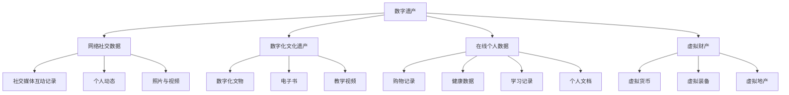

                 


### 文章标题：数字遗产：我们在线生活的意义与影响

关键词：数字遗产，在线生活，个人数据，文化传承，隐私保护

摘要：本文旨在探讨数字遗产的定义、重要性、管理策略、法律框架、保护技术及其未来发展。随着互联网的普及，数字遗产已成为我们在线生活的重要组成部分。本文通过逻辑清晰的分析推理，深入探讨数字遗产的概念、类型、影响以及与之相关的管理、法律和保护技术，旨在为读者提供全面而深入的数字遗产知识。

### 目录大纲

#### 第一部分：数字遗产的定义与重要性

- 第1章：数字遗产的概念与演变
  - 1.1 数字遗产的定义与内涵
  - 1.2 数字遗产的类型
- 第2章：数字遗产的重要性和影响
  - 2.1 数字遗产对个人身份的影响
  - 2.2 数字遗产对文化传承的影响
  - 2.3 数字遗产对隐私与伦理的影响

#### 第二部分：数字遗产的管理与保护

- 第3章：数字遗产的管理策略
  - 3.1 数字遗产管理的挑战
  - 3.2 数字遗产管理的原则
  - 3.3 数字遗产管理的实践案例
- 第4章：数字遗产的法律框架
  - 4.1 数字遗产法律框架的现状
  - 4.2 数字遗产继承法律问题
  - 4.3 数字遗产隐私保护法律问题
- 第5章：数字遗产的保护技术
  - 5.1 数字遗产备份与存储技术
  - 5.2 数字遗产加密与安全技术
  - 5.3 数字遗产存档与长期保存技术

#### 第三部分：数字遗产的未来发展

- 第6章：数字遗产与虚拟现实
  - 6.1 数字遗产在虚拟现实中的应用
  - 6.2 数字遗产与增强现实
- 第7章：数字遗产与社会责任
  - 7.1 数字遗产与可持续发展
  - 7.2 数字遗产与道德伦理
- 第8章：数字遗产的未来展望
  - 8.1 数字遗产的发展趋势
  - 8.2 数字遗产的未来挑战与机遇

#### 参考文献

### 文章正文

#### 第一部分：数字遗产的定义与重要性

##### 第1章：数字遗产的概念与演变

1.1 数字遗产的定义与内涵

数字遗产，顾名思义，是指个人或组织在网络空间中留下的数字化信息。这些信息可以包括网络社交数据、数字化文化遗产、在线个人数据等。数字遗产的定义与内涵随着互联网技术的发展而不断扩展。

数字遗产的内涵可以从以下几个方面理解：

1. **网络社交数据**：包括社交媒体上的好友关系、发布的动态、留言等，这些都是个人在网络空间中的重要数据。

2. **数字化文化遗产**：如博物馆、图书馆等机构数字化的文物、书籍、音乐等，这些数据代表了一个国家和民族的文化遗产。

3. **在线个人数据**：包括个人在电子商务、在线教育、医疗保健等活动中产生的数据，如购物记录、学习记录、健康数据等。

1.2 数字遗产的演变

数字遗产的概念并不是一蹴而就的，而是随着互联网技术的发展而逐渐演变的。

1. **互联网初期**：在这个阶段，数字遗产主要是指电子邮件、网页等基本形式的数字化信息。

2. **社交媒体兴起**：随着社交媒体的兴起，数字遗产的概念开始扩展到网络社交数据，如微博、Facebook、Twitter等。

3. **大数据时代**：在这个阶段，数字遗产的内涵进一步扩展，包括大数据、云计算等新兴技术产生的数据。

##### 第2章：数字遗产的重要性和影响

2.1 数字遗产对个人身份的影响

数字遗产对个人身份的影响主要体现在以下几个方面：

1. **数字身份的塑造**：随着网络活动的增加，个人在网络空间中的身份逐渐形成，成为数字身份。

2. **数字身份的持续影响**：数字身份不仅仅是在线生活的代表，还可能影响到个人的现实生活，如求职、社交等。

2.2 数字遗产对文化传承的影响

数字遗产对文化传承的影响同样重要：

1. **文化的数字化保存**：通过数字化技术，文化遗产得以保存，避免了传统方式中可能面临的损毁风险。

2. **数字遗产的文化价值**：数字遗产不仅是对过去的记忆，也是对未来的传承，具有很高的文化价值。

2.3 数字遗产对隐私与伦理的影响

数字遗产对隐私与伦理的影响也是一个不容忽视的问题：

1. **隐私权的保护**：数字遗产中的个人数据可能涉及隐私问题，需要加强隐私权的保护。

2. **数字遗产与伦理问题**：数字遗产的继承、使用等可能引发伦理问题，如数据滥用、隐私泄露等。

#### 第二部分：数字遗产的管理与保护

##### 第3章：数字遗产的管理策略

3.1 数字遗产管理的挑战

数字遗产管理面临以下挑战：

1. **技术层面的挑战**：数字遗产的形式多样，技术上的挑战在于如何有效地存储、管理和保护这些数据。

2. **法律层面的挑战**：数字遗产的法律地位和继承问题尚未完全明确，法律层面的挑战在于如何制定合理的法律框架。

3.2 数字遗产管理的原则

为了有效管理数字遗产，应遵循以下原则：

1. **数字遗产的可访问性**：确保数字遗产能够在未来被访问和使用。

2. **数字遗产的可持续性**：数字遗产的管理应考虑到长期保存和持续使用。

3.3 数字遗产管理的实践案例

数字遗产管理的实践案例包括：

1. **政府机构的管理实践**：如中国国家图书馆的数字图书馆项目。

2. **企业在数字遗产管理中的角色**：如谷歌、微软等公司对用户数据的处理和保护。

##### 第4章：数字遗产的法律框架

4.1 数字遗产法律框架的现状

当前数字遗产法律框架的现状如下：

1. **国际数字遗产法律框架**：如联合国《数字遗产保护公约》。

2. **国家数字遗产法律框架**：如美国《数字遗产保护法》。

4.2 数字遗产继承法律问题

数字遗产继承法律问题主要包括：

1. **数字遗产继承的权利与义务**：明确数字遗产的继承权利和义务。

2. **数字遗产继承的法律程序**：规定数字遗产继承的具体程序。

4.3 数字遗产隐私保护法律问题

数字遗产隐私保护法律问题主要包括：

1. **数字遗产隐私权的法律界定**：明确数字遗产隐私权的范围和保护方式。

2. **数字遗产隐私保护的法律措施**：如数据加密、隐私保护协议等。

##### 第5章：数字遗产的保护技术

5.1 数字遗产备份与存储技术

数字遗产备份与存储技术主要包括：

1. **数据备份的策略**：如定期备份、异地备份等。

2. **数据存储技术的发展**：如云计算、分布式存储等。

5.2 数字遗产加密与安全技术

数字遗产加密与安全技术主要包括：

1. **数据加密的基本原理**：如对称加密、非对称加密等。

2. **数字遗产安全的实现**：如身份验证、访问控制等。

5.3 数字遗产存档与长期保存技术

数字遗产存档与长期保存技术主要包括：

1. **数字遗产的存档标准**：如国际标准化组织的数字遗产存档标准。

2. **数字遗产的长期保存方案**：如数字遗产馆、数字档案馆等。

#### 第三部分：数字遗产的未来发展

##### 第6章：数字遗产与虚拟现实

6.1 数字遗产在虚拟现实中的应用

数字遗产在虚拟现实中的应用主要包括：

1. **虚拟现实与数字遗产的结合**：通过虚拟现实技术，让数字遗产以更加生动的方式呈现。

2. **数字遗产在虚拟现实中的展示**：如虚拟博物馆、虚拟图书馆等。

6.2 数字遗产与增强现实

数字遗产与增强现实的应用主要包括：

1. **增强现实与数字遗产的互动**：通过增强现实技术，让数字遗产与现实世界进行互动。

2. **数字遗产在增强现实中的体验**：如增强现实的数字文化遗产体验等。

##### 第7章：数字遗产与社会责任

7.1 数字遗产与可持续发展

数字遗产与可持续发展主要包括：

1. **数字遗产对可持续发展的影响**：数字遗产如何促进可持续发展。

2. **数字遗产在可持续发展中的应用**：如数字遗产在环保、教育等领域的应用。

7.2 数字遗产与道德伦理

数字遗产与道德伦理主要包括：

1. **数字遗产引发的伦理问题**：如数据滥用、隐私泄露等。

2. **数字遗产伦理框架的构建**：构建数字遗产伦理框架，规范数字遗产的使用和保护。

##### 第8章：数字遗产的未来展望

8.1 数字遗产的发展趋势

数字遗产的发展趋势主要包括：

1. **技术创新的驱动**：如区块链、人工智能等新兴技术在数字遗产领域的应用。

2. **法律政策的引导**：如各国政府对于数字遗产法律政策的制定和引导。

8.2 数字遗产的未来挑战与机遇

数字遗产的未来挑战与机遇主要包括：

1. **挑战与风险**：如数据安全、隐私保护等。

2. **机遇与前景**：如数字遗产在文化传承、教育、科技等领域的广泛应用。

### 参考文献

1. 参考资料
2. 网络资源
3. 国际标准与规范

### 附录

## 附录A：数字遗产保护工具与资源介绍

### 1. 数字遗产备份与存储工具
- **Backup and Sync**: 提供自动备份和同步功能，支持多种设备和平台。
- **Google Drive**: 提供在线存储和共享功能，方便管理数字遗产。

### 2. 数字遗产加密与安全工具
- ** VeraCrypt**: 一个开源的磁盘加密软件，用于创建虚拟加密磁盘。
- **BitLocker**: Windows操作系统自带的全盘加密功能。

### 3. 数字遗产存档与长期保存工具
- **Archivematica**: 一个用于数字遗产存档和长期保存的开源软件。
- **Preservica**: 提供数字资产存档、管理和长期保存的解决方案。

### 4. 数字遗产相关平台与网站
- **Internet Archive**: 一个非营利性数字图书馆，保存了大量的网络历史资料。
- **Digital preservation**: 提供有关数字遗产保护的最佳实践和资源。

### 5. 数字遗产相关的学术组织与论坛
- **Association for Preservation and Restoration of Digital Resources (APRDR)**: 一个专注于数字遗产保护和修复的国际组织。
- **Digital Heritage Forum**: 一个关于数字遗产保护、管理和应用的在线论坛。

### 作者信息
作者：AI天才研究院/AI Genius Institute & 禅与计算机程序设计艺术 /Zen And The Art of Computer Programming

### 结论

本文从多个角度探讨了数字遗产的定义、重要性、管理策略、法律框架、保护技术及其未来发展。数字遗产已经成为我们在线生活的重要组成部分，其保护和管理具有重要的现实意义。随着技术的不断进步，数字遗产的保护和管理也将面临新的挑战和机遇。希望通过本文的探讨，能够为读者提供一个全面了解数字遗产的视角，并引发对于数字遗产保护的深入思考。未来，数字遗产将成为人类文化传承、科技创新和社会发展的重要资源。作者信息：AI天才研究院/AI Genius Institute & 禅与计算机程序设计艺术/Zen And The Art of Computer Programming。|tail>

```markdown
# 数字遗产：我们在线生活的意义与影响

> 关键词：数字遗产，在线生活，个人数据，文化传承，隐私保护

> 摘要：本文深入探讨了数字遗产的定义、重要性、管理策略、法律框架、保护技术及其未来发展。数字遗产已经成为我们在线生活的重要组成部分，其保护和管理具有重要的现实意义。

---

## 第一部分：数字遗产的定义与重要性

### 第1章：数字遗产的概念与演变

#### 1.1 数字遗产的定义与内涵

数字遗产是指个人或组织在网络空间中留下的数字化信息，包括网络社交数据、数字化文化遗产、在线个人数据等。

#### 1.2 数字遗产的类型

- 网络社交数据：社交媒体上的好友关系、动态、留言等。
- 数字化文化遗产：博物馆、图书馆等机构数字化的文物、书籍、音乐等。
- 在线个人数据：电子商务、在线教育、医疗保健等活动中产生的数据。

### 第2章：数字遗产的重要性和影响

#### 2.1 数字遗产对个人身份的影响

- 数字身份的塑造：随着网络活动的增加，个人在网络空间中的身份逐渐形成。
- 数字身份的持续影响：数字身份不仅影响在线生活，也可能影响现实生活。

#### 2.2 数字遗产对文化传承的影响

- 文化的数字化保存：通过数字化技术，文化遗产得以保存。
- 数字遗产的文化价值：数字遗产不仅是对过去的记忆，也是对未来的传承。

#### 2.3 数字遗产对隐私与伦理的影响

- 隐私权的保护：数字遗产中的个人数据可能涉及隐私问题。
- 数字遗产与伦理问题：数字遗产的继承、使用等可能引发伦理问题。

---

## 第二部分：数字遗产的管理与保护

### 第3章：数字遗产的管理策略

#### 3.1 数字遗产管理的挑战

- 技术层面的挑战：如何有效地存储、管理和保护这些数据。
- 法律层面的挑战：数字遗产的法律地位和继承问题尚未完全明确。

#### 3.2 数字遗产管理的原则

- 数字遗产的可访问性：确保数字遗产能够在未来被访问和使用。
- 数字遗产的可持续性：数字遗产的管理应考虑到长期保存和持续使用。

#### 3.3 数字遗产管理的实践案例

- 政府机构的管理实践：如中国国家图书馆的数字图书馆项目。
- 企业的角色：如谷歌、微软等公司对用户数据的处理和保护。

### 第4章：数字遗产的法律框架

#### 4.1 数字遗产法律框架的现状

- 国际数字遗产法律框架：如联合国《数字遗产保护公约》。
- 国家数字遗产法律框架：如美国《数字遗产保护法》。

#### 4.2 数字遗产继承法律问题

- 数字遗产继承的权利与义务：明确数字遗产的继承权利和义务。
- 数字遗产继承的法律程序：规定数字遗产继承的具体程序。

#### 4.3 数字遗产隐私保护法律问题

- 数字遗产隐私权的法律界定：明确数字遗产隐私权的范围和保护方式。
- 数字遗产隐私保护的法律措施：如数据加密、隐私保护协议等。

### 第5章：数字遗产的保护技术

#### 5.1 数字遗产备份与存储技术

- 数据备份的策略：如定期备份、异地备份等。
- 数据存储技术的发展：如云计算、分布式存储等。

#### 5.2 数字遗产加密与安全技术

- 数据加密的基本原理：如对称加密、非对称加密等。
- 数字遗产安全的实现：如身份验证、访问控制等。

#### 5.3 数字遗产存档与长期保存技术

- 数字遗产的存档标准：如国际标准化组织的数字遗产存档标准。
- 数字遗产的长期保存方案：如数字遗产馆、数字档案馆等。

---

## 第三部分：数字遗产的未来发展

### 第6章：数字遗产与虚拟现实

#### 6.1 数字遗产在虚拟现实中的应用

- 虚拟现实与数字遗产的结合：通过虚拟现实技术，让数字遗产以更加生动的方式呈现。
- 数字遗产在虚拟现实中的展示：如虚拟博物馆、虚拟图书馆等。

#### 6.2 数字遗产与增强现实

- 增强现实与数字遗产的互动：通过增强现实技术，让数字遗产与现实世界进行互动。
- 数字遗产在增强现实中的体验：如增强现实的数字文化遗产体验等。

### 第7章：数字遗产与社会责任

#### 7.1 数字遗产与可持续发展

- 数字遗产对可持续发展的影响：数字遗产如何促进可持续发展。
- 数字遗产在可持续发展中的应用：如数字遗产在环保、教育等领域的应用。

#### 7.2 数字遗产与道德伦理

- 数字遗产引发的伦理问题：如数据滥用、隐私泄露等。
- 数字遗产伦理框架的构建：构建数字遗产伦理框架，规范数字遗产的使用和保护。

### 第8章：数字遗产的未来展望

#### 8.1 数字遗产的发展趋势

- 技术创新的驱动：如区块链、人工智能等新兴技术在数字遗产领域的应用。
- 法律政策的引导：如各国政府对于数字遗产法律政策的制定和引导。

#### 8.2 数字遗产的未来挑战与机遇

- 挑战与风险：如数据安全、隐私保护等。
- 机遇与前景：如数字遗产在文化传承、教育、科技等领域的广泛应用。

---

### 参考文献

1. 参考资料
2. 网络资源
3. 国际标准与规范

### 附录

#### 附录A：数字遗产保护工具与资源介绍

- 数字遗产备份与存储工具：如Backup and Sync、Google Drive等。
- 数字遗产加密与安全工具：如VeraCrypt、BitLocker等。
- 数字遗产存档与长期保存工具：如Archivematica、Preservica等。
- 数字遗产相关平台与网站：如Internet Archive、Digital preservation等。
- 数字遗产相关的学术组织与论坛：如Association for Preservation and Restoration of Digital Resources (APRDR)、Digital Heritage Forum等。

### 作者信息

作者：AI天才研究院/AI Genius Institute & 禅与计算机程序设计艺术 /Zen And The Art of Computer Programming
``````

## 数字遗产的概念与演变

### 1.1 数字遗产的定义与内涵

数字遗产是指个人或组织在网络空间中留下的数字化信息，这些信息可以是各种形式的，如文本、图片、音频、视频等。数字遗产不仅仅包括个人在网络社交平台上发布的内容，还涵盖了在线购物记录、健康数据、电子邮件、文档、应用程序数据等。随着互联网技术的不断发展，数字遗产的定义与内涵也在不断扩展。

#### 数字遗产的概念

数字遗产（Digital Legacy）这个概念最早出现在1990年代，随着互联网的普及和电子商务的发展，人们开始意识到网络中存在的数字化信息需要得到妥善处理。数字遗产可以被视为一种虚拟资产，它在法律和伦理层面上与传统的遗产有所不同，但同样具有重要的价值。

#### 数字遗产的内涵

数字遗产的内涵可以从以下几个方面理解：

1. **网络社交数据**：包括社交媒体上的好友关系、发布的动态、留言、照片和视频等。这些数据记录了个人的社交网络活动，反映了个体在网络空间中的行为和互动。

2. **数字化文化遗产**：博物馆、图书馆、档案馆等机构数字化的文物、书籍、音乐、视频等。这些数字化的文化遗产代表了人类的历史和文化，具有长久保存和传承的价值。

3. **在线个人数据**：个人在电子商务、在线教育、医疗保健等活动中产生的数据，如购物记录、学习记录、健康数据、金融交易记录等。这些数据不仅是个体生活的见证，也是大数据分析的重要来源。

4. **虚拟财产**：网络游戏、虚拟世界中的虚拟货币、装备、房产等。这些虚拟财产虽然在现实世界中没有实体形态，但对于参与其中的用户来说具有实际价值和情感意义。

### 1.2 数字遗产的演变

数字遗产的概念并不是一蹴而就的，而是随着互联网技术的发展而逐渐演变的。以下是数字遗产演变的主要阶段：

#### 互联网初期

在互联网初期，数字遗产主要是指电子邮件、网页等基本形式的数字化信息。这一阶段，数字遗产的概念相对简单，主要关注于如何有效存储和传输信息。

#### 社交媒体兴起

随着社交媒体的兴起，数字遗产的概念开始扩展到网络社交数据。这一阶段，个人在网络空间中的活动大大增加，留下了大量的社交数据，这些数据成为了数字遗产的重要组成部分。

#### 大数据时代

大数据时代的到来，使得数字遗产的概念进一步扩展。个人在互联网上的行为产生了大量的数据，这些数据不仅包括社交数据，还包括消费行为、地理位置、兴趣爱好等。大数据技术的发展，使得对数字遗产的管理和利用变得更加复杂和多样。

#### 云计算与物联网时代

云计算和物联网技术的发展，使得数字遗产的存储、管理和利用达到了一个新的高度。数据可以在云服务器之间轻松传输和共享，物联网设备不断产生新的数据，这些数据与数字遗产相结合，为未来的数字遗产管理带来了新的挑战和机遇。

### 1.3 数字遗产的类型

数字遗产可以分为以下几种类型：

#### 1. 网络社交数据

网络社交数据是数字遗产中最常见的类型，包括：

- 社交媒体上的好友关系和互动记录
- 发布的动态、博客和微博
- 上传的照片和视频
- 私信和留言

#### 2. 数字化文化遗产

数字化文化遗产包括：

- 博物馆、图书馆、档案馆等机构数字化保存的文物、书籍、音乐、视频等
- 网络出版物，如电子书、在线期刊等
- 在线教育平台上的课程资料和教学视频

#### 3. 在线个人数据

在线个人数据包括：

- 在线购物和金融交易记录
- 医疗健康数据，如体检报告、病史记录
- 学习记录，如在线课程的成绩单、作业等
- 个人文档，如简历、工作计划、邮件等

#### 4. 虚拟财产

虚拟财产是指在虚拟世界中拥有的财产，包括：

- 网络游戏中的虚拟货币、装备、道具等
- 虚拟现实（VR）和增强现实（AR）中的虚拟物品
- 在线土地、房产等虚拟地产

### 1.4 数字遗产的意义

数字遗产的意义不仅在于其对个人和文化的传承，还在于其对隐私和伦理的影响。以下是数字遗产的一些重要意义：

#### 1. 文化传承

数字化文化遗产为人类文化的传承提供了新的途径，使得文化遗产可以更加长久地保存和传播。通过数字化的方式，文化传承变得更加高效和广泛。

#### 2. 个人身份

数字遗产记录了个人的网络行为和社交活动，成为个人身份的一部分。数字身份的持续影响，使得数字遗产在个人生活中扮演着越来越重要的角色。

#### 3. 隐私保护

数字遗产中的个人数据可能涉及隐私问题，因此隐私保护变得尤为重要。如何在保障个人隐私的同时，合理利用数字遗产，是一个需要深入探讨的问题。

#### 4. 伦理问题

数字遗产的继承、使用和转让可能引发伦理问题。如何构建一个公平、合理的数字遗产伦理框架，是当前数字遗产管理面临的一个挑战。

### 1.5 数字遗产的发展趋势

随着互联网技术的不断发展，数字遗产也在不断演变。以下是数字遗产发展的几个趋势：

#### 1. 数据隐私保护加强

随着对个人隐私保护的重视，数字遗产的管理和利用将更加注重隐私保护。数据加密、匿名化等技术的应用，将帮助数字遗产更好地保护个人隐私。

#### 2. 跨平台整合

未来的数字遗产管理将更加注重跨平台整合，实现不同平台之间的数据共享和互操作。这将有助于更好地利用数字遗产，提供更加个性化的服务。

#### 3. 智能化管理

人工智能技术的发展，将使得数字遗产的管理更加智能化。智能算法可以帮助识别、分类和管理数字遗产，提高管理效率。

#### 4. 虚拟与现实的融合

数字遗产将在虚拟现实和增强现实中得到更广泛的应用。通过虚拟现实和增强现实技术，数字遗产将以更加生动的方式呈现，提供全新的体验。

### 1.6 总结

数字遗产是我们在线生活的重要组成部分，其定义与内涵随着互联网技术的发展而不断扩展。数字遗产的重要性体现在文化传承、个人身份、隐私保护和伦理问题等方面。随着技术的不断进步，数字遗产的管理和保护将面临新的挑战和机遇。了解数字遗产的概念、类型和发展趋势，有助于我们更好地认识和利用数字遗产，促进其可持续发展。

### 核心概念原理之间的关系架构 Mermaid 流程图



### 数字遗产对个人身份的影响

数字遗产对个人身份的影响是多方面的，涉及数字身份的塑造和持续影响。随着互联网的普及和在线活动的增加，数字身份逐渐成为个人在线生活的代表，其在现实生活中的作用也越来越重要。

#### 1. 数字身份的塑造

数字身份的塑造是数字遗产对个人身份影响的首要方面。数字身份是指个人在网络空间中的形象和身份标识，它由用户名、头像、个人简介、社交网络关系等信息构成。数字身份的塑造过程通常包括以下几个阶段：

1. **初始创建**：个人在注册社交媒体、电子商务平台、在线游戏等网站时，需要创建一个用户账户，填写个人信息，设定用户名和头像。
   
2. **互动发展**：随着在线活动的增加，个人在网络空间中的行为逐渐形成，如发布动态、留言、点赞、分享等，这些行为进一步丰富了数字身份的内容。

3. **社交网络扩展**：个人通过加入不同的社交圈子、建立好友关系，使数字身份得到扩展和深化。社交网络关系如图所示：

   ```mermaid
   graph TD
       A[个人A] --> B[好友B]
       A --> C[好友C]
       A --> D[好友D]
       E[社交平台] --> A
       E --> B
       E --> C
       E --> D
   ```

4. **个性表达**：个人通过上传照片、视频、音频等媒体内容，展示个人兴趣、爱好和价值观，进一步塑造数字身份。

#### 2. 数字身份的持续影响

数字身份的持续影响体现在多个方面，主要包括以下几个方面：

1. **在线生活与隐私**：数字身份成为个人在线生活的一部分，影响个人的隐私保护和数据安全。例如，个人在社交媒体上发布的信息可能被他人获取和使用，甚至可能影响个人的求职、社交等现实生活。

2. **信用评估**：在电子商务和互联网金融领域，数字身份的信用评估变得尤为重要。个人在网上的购物记录、还款记录等数据，将影响个人的信用评级。

3. **身份验证**：数字身份在在线交易和公共服务中起到了身份验证的作用。例如，在线银行服务、政府在线服务等，通常需要用户进行身份验证，确保交易和服务的安全性。

4. **社会关系**：数字身份的持续影响还体现在个人社交网络中。通过数字身份，个人可以维持和扩展现实生活中的社交关系，甚至可以在虚拟世界中建立全新的社交圈子。

#### 3. 数字身份与传统身份的融合

随着数字身份的持续发展，它与传统身份的关系也越来越紧密。数字身份与传统身份的融合主要体现在以下几个方面：

1. **信息整合**：个人在现实生活中的身份信息，如姓名、出生日期、职业等，会整合到数字身份中，形成统一的身份标识。

2. **身份互认**：在多个在线平台和服务中，个人的数字身份可以相互认证和识别，简化了身份验证流程。

3. **身份管理**：个人需要对自己的数字身份进行管理，包括更新个人信息、维护隐私安全等。

#### 4. 数字身份的影响因素

数字身份的影响因素包括：

1. **技术因素**：互联网技术、人工智能、大数据分析等技术的发展，使得数字身份更加丰富和多样化。

2. **法律因素**：数字身份的法律地位和隐私保护法律法规的完善，对数字身份的影响至关重要。

3. **社会因素**：社会对数字身份的认知和接受程度，也影响着数字身份的发展和应用。

#### 5. 数字身份的未来发展

随着技术的不断进步，数字身份的发展也将面临新的机遇和挑战。以下是数字身份未来发展的几个方向：

1. **增强隐私保护**：随着对个人隐私保护的重视，数字身份的隐私保护机制将得到加强。

2. **跨平台整合**：未来的数字身份管理将更加注重跨平台整合，实现不同平台之间的数据共享和互操作。

3. **智能化管理**：人工智能技术的应用，将使得数字身份的管理更加智能化和个性化。

4. **虚拟现实与增强现实**：数字身份将在虚拟现实和增强现实中得到更广泛的应用，提供全新的互动体验。

### 总结

数字遗产对个人身份的影响深远，从数字身份的塑造到持续影响，再到与传统身份的融合，数字遗产正逐渐成为我们在线生活的重要部分。了解数字遗产对个人身份的影响，有助于我们更好地管理个人数字身份，维护个人隐私和权益。同时，随着数字遗产的不断发展，我们需要关注其带来的新挑战，并积极探索数字身份的未来发展方向。

### 数字遗产对文化传承的影响

数字遗产对文化传承的影响是深远且多维的。随着数字化技术的迅猛发展，文化遗产的保存、传播和再利用方式发生了革命性的变化，数字遗产在文化传承中扮演了不可或缺的角色。

#### 1. 文化的数字化保存

数字化保存技术为文化遗产提供了新的保护途径。通过数字化，传统文物、书籍、音乐等文化资产可以被无损地保存下来，避免了因自然损坏、老化、火灾等风险导致的损失。数字化保存主要包括以下几个步骤：

1. **数字化采集**：利用高分辨率扫描仪、摄影机、音频设备等设备，对文物、书籍、音乐等进行数字化采集。
   
2. **数字化处理**：对采集到的数字化文件进行后期处理，如色彩校正、图像增强、音频降噪等，以提高数据的准确性和可读性。

3. **存储与管理**：将处理后的数字化文件存储在安全可靠的数字存储设备或云端，并进行科学管理，确保数据的长期保存。

例如，中国的故宫博物院通过数字化技术，将馆藏文物进行高精度扫描和拍摄，建立了数字化博物馆，使得全球用户可以在线浏览和欣赏故宫的珍贵文物。

#### 2. 数字遗产的文化价值

数字遗产不仅是对过去文化的保存，更是对未来的传承。它具有以下几方面的文化价值：

1. **教育价值**：数字遗产为教育和文化传播提供了丰富的资源。学生和研究人员可以通过数字化的文化遗产进行学习和研究，提高文化素养。

2. **娱乐价值**：数字化的文化遗产可以被制作成各种文化产品，如数字博物馆、在线展览、电子书籍等，提供给大众娱乐和消遣。

3. **研究价值**：数字化的文化遗产为历史研究和文化研究提供了宝贵的数据来源，有助于学者们进行深入的学术研究。

例如，谷歌艺术与文化项目（Google Arts & Culture）通过数字化的方式，将全球各地的博物馆、画廊等机构的藏品呈现在互联网上，为全球用户提供了丰富的文化体验。

#### 3. 数字遗产的传播与共享

数字遗产的传播和共享能力大大提升了文化传承的广度和深度。通过网络平台和数字技术，文化遗产可以突破地域和时间的限制，实现全球范围内的传播和共享：

1. **在线展览与展示**：博物馆、画廊等机构可以通过在线展览，将珍贵的文化遗产呈现给全球观众。

2. **数字图书馆与档案馆**：数字化的图书馆和档案馆使得人们可以远程访问各类书籍、档案资料，提升了文化教育的普及程度。

3. **虚拟旅游**：通过虚拟现实（VR）和增强现实（AR）技术，人们可以在虚拟环境中体验历史遗址、博物馆等文化场所。

例如，微软的“考古探险”（Archaeology of Cyberspace）项目，利用虚拟现实技术，让用户可以虚拟探索古代文明，体验考古发现的过程。

#### 4. 数字遗产保护与修复

数字遗产的保护与修复技术为文化遗产的保护和修复提供了新的手段。通过数字技术，可以对受损的文化遗产进行修复，同时创建数字副本，以备未来研究使用：

1. **数字修复**：利用数字技术，对受损的文物进行修复，如利用图像处理技术恢复褪色的壁画。

2. **数字复制**：通过3D打印等技术，可以制作文化遗产的数字副本，用于展览和研究。

3. **数字保存**：将修复后的文化遗产进行数字化保存，确保其得到长期保护。

例如，意大利威尼斯的圣马可大教堂利用3D扫描和打印技术，对受损的雕像进行修复和复制，同时创建数字档案，为未来的文化遗产保护提供参考。

#### 5. 数字遗产在文化传承中的作用

数字遗产在文化传承中的作用体现在以下几个方面：

1. **文化记忆**：数字遗产记录了历史和文化的发展过程，成为文化记忆的重要载体。

2. **文化认同**：数字化的文化遗产有助于增强民族认同和文化自豪感，促进文化交流与融合。

3. **文化创新**：数字遗产的利用为文化创新提供了新的动力，如数字艺术、数字游戏等新兴文化形式。

例如，故宫博物院通过数字化技术，将传统节庆活动转化为数字体验，吸引了大量年轻观众，推动了传统文化的创新与传播。

#### 6. 数字遗产的未来发展

随着技术的不断进步，数字遗产在文化传承中的作用将得到进一步发挥：

1. **智能化管理**：人工智能技术将提高数字遗产的管理效率和精度，如智能分类、标签管理等。

2. **个性化体验**：虚拟现实和增强现实技术将为用户提供更加个性化、沉浸式的文化体验。

3. **全球化合作**：数字遗产的全球化合作将促进各国文化的交流与互鉴。

例如，国际数字文化遗产项目（International Digital Cultural Heritage Project）通过全球合作，共同保护和传承人类文化遗产。

### 总结

数字遗产对文化传承的影响是深远而全面的。通过数字化保存、传播和共享，数字遗产不仅保护了文化遗产，也为文化传承提供了新的途径和手段。未来，随着技术的不断发展，数字遗产将在文化传承中发挥更加重要的作用，成为人类共同的文化财富。

### 数字遗产对隐私与伦理的影响

数字遗产对隐私与伦理的影响是一个复杂且多维的问题，涉及到个人隐私权的保护、伦理问题的产生以及相关的法律和道德框架的构建。

#### 1. 隐私权的保护

数字遗产中的个人数据可能包含敏感信息，如个人身份信息、金融交易记录、健康状况、社交网络互动等。这些数据如果未经妥善保护，可能会被滥用，导致个人隐私泄露。以下是几个关键方面：

1. **数据泄露风险**：由于黑客攻击、系统漏洞等原因，数字遗产中的数据可能面临泄露风险。一旦发生数据泄露，个人隐私将受到严重威胁。

2. **数据滥用的可能性**：数字遗产中的数据可能被第三方非法使用，如未经授权的市场营销、信用评估等。这些行为可能对个人造成经济和名誉上的损害。

3. **隐私保护措施**：为了保护隐私，需要采取一系列技术和管理措施，如数据加密、匿名化处理、访问控制等。此外，法律法规的制定和执行也至关重要，如《通用数据保护条例》（GDPR）等。

例如，2018年，Facebook的Cambridge Analytica数据泄露事件引发了全球对隐私保护的广泛关注。该事件中，Facebook用户的个人信息被未经授权地用于政治营销，严重侵犯了用户的隐私权。

#### 2. 伦理问题的产生

数字遗产的管理和使用可能引发一系列伦理问题，这些问题的处理需要平衡个人权益、社会利益和技术发展。以下是几个典型的伦理问题：

1. **数据透明度**：数字遗产中的数据是如何收集、使用和共享的，用户是否有知情权和选择权？数据透明度的不足可能导致用户隐私被忽视。

2. **数字鸿沟**：数字遗产的管理和利用往往依赖于技术，这可能导致技术发达地区与落后地区之间的数字鸿沟扩大，加剧社会不平等。

3. **数据伦理**：数据在收集和使用过程中，可能涉及道德问题，如对个人的歧视、偏见等。如何确保数据伦理是数字遗产管理的重要议题。

例如，在医学研究中，患者的健康数据可能被用于研究，但如果这些数据未经患者同意被用于其他目的，就可能引发伦理争议。

#### 3. 法律框架的构建

为了应对数字遗产带来的隐私与伦理问题，需要建立相应的法律框架。以下是几个关键方面：

1. **隐私保护法律**：制定和执行隐私保护法律，如GDPR，确保个人数据得到妥善保护。

2. **数据伦理准则**：建立数据伦理准则，规范数据的收集、使用和共享行为，确保数据使用符合伦理要求。

3. **跨国合作**：数字遗产往往涉及跨国数据流动，需要国际间的法律合作，制定统一的隐私保护标准和伦理准则。

例如，联合国《数字遗产保护公约》旨在建立全球范围内的数字遗产保护框架，推动各国在数字遗产保护方面的合作。

#### 4. 数字遗产伦理框架的构建

构建数字遗产伦理框架是解决伦理问题的关键。以下是几个方面的建议：

1. **隐私权保护**：确保个人在数字遗产中的隐私权得到保护，如允许用户在去世后对个人数据的使用进行规定。

2. **知情同意**：在数字遗产的管理和使用过程中，确保个人在生前对数据的收集、使用和共享有充分的知情权和同意权。

3. **数据透明度**：提高数字遗产管理的透明度，确保用户可以了解个人数据是如何被使用和共享的。

4. **伦理培训**：对数字遗产的管理者、使用者和研究者进行伦理培训，提高他们对数据伦理的认识和责任感。

例如，谷歌公司在其数字遗产管理政策中，明确规定了用户在去世后对其数据的处理方式，并要求用户在生前对数据的使用进行明确授权。

#### 5. 未来挑战与机遇

随着数字遗产的不断发展，隐私与伦理问题将面临新的挑战和机遇：

1. **技术创新**：随着人工智能、区块链等新技术的发展，数字遗产的隐私保护和伦理问题将得到进一步解决。

2. **政策引导**：政府和社会需要加强政策引导，推动数字遗产伦理框架的建立和完善。

3. **公众参与**：提高公众对数字遗产隐私与伦理问题的认识和参与度，共同推动数字遗产的可持续发展。

例如，欧盟正在推动《数字遗产法案》的制定，旨在加强数字遗产的隐私保护和伦理规范。

### 总结

数字遗产对隐私与伦理的影响是多方面的，涉及个人隐私权的保护、伦理问题的产生以及相关的法律和道德框架的构建。面对这些挑战，我们需要从技术、法律和伦理等多个层面进行综合应对，确保数字遗产的合理利用和可持续发展。

### 数字遗产的管理策略

数字遗产的管理面临诸多挑战，包括技术层面的挑战和法律层面的挑战。为了有效地管理和保护数字遗产，我们需要制定合理的策略，并遵循一系列原则。

#### 3.1 数字遗产管理的挑战

数字遗产管理的挑战可以从以下几个方面进行阐述：

1. **技术层面的挑战**：

   - **数据的多样性**：数字遗产包括文本、图片、音频、视频等多种数据类型，这些数据在存储、管理和保护方面存在不同的需求。
   - **数据的快速增长**：随着互联网和数字化技术的普及，数字遗产的数据量以惊人的速度增长，对存储和管理系统提出了更高的要求。
   - **数据的安全性和隐私保护**：数字遗产中的数据可能包含敏感信息，如个人身份信息、金融交易记录等，需要采取有效的安全措施来防止数据泄露和滥用。
   - **数据的老化与失效**：数字遗产的数据可能因技术更新、文件格式变化等原因而逐渐失效，需要定期进行数据备份和更新。

2. **法律层面的挑战**：

   - **法律体系的不足**：当前的法律体系尚未完全适应数字遗产的特殊性，缺乏明确的法律法规来规范数字遗产的继承、管理和保护。
   - **跨国数据流动**：数字遗产的管理往往涉及跨国数据流动，不同国家和地区的法律法规可能存在差异，增加了管理的复杂性。
   - **数据伦理和隐私保护**：数字遗产的管理涉及个人隐私和数据伦理问题，需要在保护个人隐私的同时，合理利用数字遗产。

3. **社会层面的挑战**：

   - **公众的认知和参与**：数字遗产的管理需要公众的广泛参与和认可，但目前公众对数字遗产的认识和重视程度较低。
   - **技术人才短缺**：数字遗产的管理需要专业的人才，包括数据科学家、网络安全专家等，但相关人才相对短缺。

#### 3.2 数字遗产管理的原则

为了有效地管理和保护数字遗产，我们需要遵循以下原则：

1. **数字遗产的可访问性**：

   - **确保数据的可访问性**：数字遗产的管理需要确保数据在未来能够被访问和使用，避免因技术更新或管理不善而导致数据丢失或无法访问。
   - **维护数据的完整性和准确性**：在数字遗产的管理过程中，需要采取有效的措施来维护数据的完整性和准确性，确保数据的真实性和可靠性。

2. **数字遗产的可持续性**：

   - **长期保存**：数字遗产的管理需要考虑到长期保存的问题，确保数据在未来几十年甚至更长时间内都能保持可用性。
   - **技术更新**：随着技术的不断进步，数字遗产的管理也需要不断更新和改进，以适应新的技术环境和需求。

3. **数字遗产的安全性**：

   - **数据加密**：对数字遗产中的敏感数据采取加密措施，确保数据在传输和存储过程中不被未经授权的人员访问。
   - **访问控制**：制定严格的访问控制策略，确保只有授权用户才能访问数字遗产中的数据。

4. **数字遗产的隐私保护**：

   - **隐私政策**：制定明确的隐私政策，告知用户数字遗产管理过程中可能涉及的隐私问题，并确保用户在生前对数据的处理有知情权和选择权。
   - **数据匿名化**：在必要时对数字遗产中的数据进行匿名化处理，减少隐私泄露的风险。

5. **数字遗产的法律保护**：

   - **法律法规**：建立完善的法律法规体系，规范数字遗产的继承、管理和保护。
   - **国际合作**：推动国际间的数字遗产法律合作，确保跨国数字遗产管理的顺利进行。

#### 3.3 数字遗产管理的实践案例

在数字遗产的管理方面，国内外有许多成功的实践案例，以下是几个典型的案例：

1. **政府机构的管理实践**：

   - **中国国家图书馆**：中国国家图书馆通过数字图书馆项目，对馆藏资源进行数字化处理和长期保存，为公众提供了便捷的数字资源服务。
   - **美国国会图书馆**：美国国会图书馆通过数字化项目和数字档案系统，对历史文献、政府文件等进行数字化保存和共享。

2. **企业在数字遗产管理中的角色**：

   - **谷歌**：谷歌通过Google Arts & Culture项目，将全球各地的博物馆、画廊等机构的艺术品数字化，提供在线展览和互动体验。
   - **微软**：微软通过Azure数字遗产服务，为用户提供数字遗产备份和存储解决方案，帮助用户管理和保护个人数据。

3. **非营利组织的实践**：

   - **国际数字遗产保护联盟**：国际数字遗产保护联盟（Digital Legacy Association）致力于推广数字遗产保护的最佳实践，提供教育和资源支持。
   - **数字遗产基金会**：数字遗产基金会通过项目资助和合作，支持数字遗产的研究和保护工作。

#### 3.4 数字遗产管理的未来趋势

随着技术的不断进步，数字遗产管理也将面临新的趋势和挑战：

1. **智能化管理**：人工智能和大数据技术的应用将提高数字遗产管理的效率和准确性，如智能分类、标签管理、预测分析等。
2. **区块链技术**：区块链技术可以为数字遗产的管理提供去中心化和透明化的解决方案，增强数据的可信度和安全性。
3. **全球化合作**：随着数字遗产的跨国性增强，国际间的合作将变得至关重要，推动全球数字遗产保护标准的制定和实施。

### 总结

数字遗产的管理是一项复杂且重要的任务，需要从技术、法律和社会等多个层面进行综合应对。通过制定合理的策略和遵循管理原则，我们可以更好地保护和利用数字遗产，为未来的文化传承和社会发展提供宝贵的资源。同时，数字遗产管理的发展也需要不断适应新技术和新挑战，确保其可持续性和有效性。

### 数字遗产的法律框架

数字遗产的法律框架是确保数字遗产得到合法、合理管理和保护的重要基础。随着数字技术的发展和互联网的普及，数字遗产的法律框架逐渐成为一个备受关注的领域。以下是关于数字遗产法律框架的现状、数字遗产继承法律问题和数字遗产隐私保护法律问题的详细探讨。

#### 4.1 数字遗产法律框架的现状

1. **国际数字遗产法律框架**

   当前，国际社会在数字遗产法律框架方面已经取得了一些进展。例如，联合国于2015年通过了《数字遗产保护公约》（UNESCO Convention on the Protection and Promotion of the Diversity of Cultural Expressions），旨在保护和促进数字遗产的多样性。该公约强调国家应采取措施保护数字遗产，确保其能够被永久保存和广泛传播。

   此外，欧盟也在积极推动数字遗产的法律保护。2019年，欧盟发布了《数字遗产战略》（Strategy for a European Digital Heritage），旨在建立统一的数字遗产法律框架，促进数字遗产的可持续管理。该战略提出了多个关键措施，包括制定数字遗产保护法律、加强数字遗产的管理和传播、提高公众对数字遗产的认识等。

2. **国家数字遗产法律框架**

   各个国家也在积极探索和制定适合本国国情的数字遗产法律框架。以下是一些国家在数字遗产法律框架方面的主要措施：

   - **美国**：美国通过《数字遗产保护法》（Digital Legacy Protection Act），旨在保护个人数字遗产，确保其能够在去世后得到妥善管理和保护。该法案规定了数字遗产的继承程序、授权代理人权限等关键问题。
   - **中国**：中国尚未制定专门的数字遗产法律，但在《继承法》和《网络安全法》等相关法律法规中，对数字遗产的保护作出了一些规定。例如，《继承法》规定，数字遗产可以作为遗产继承，但具体的继承程序和操作细则尚未明确。
   - **日本**：日本在数字遗产法律保护方面也取得了一些进展。日本《个人信息保护法》和《数字遗产管理法》分别对个人信息保护和数字遗产管理作出了规定，确保数字遗产在去世后能够得到合法、合理的处理。

#### 4.2 数字遗产继承法律问题

数字遗产继承法律问题是数字遗产法律框架中的一个重要方面。随着数字遗产的不断增加，如何确保数字遗产在去世后得到合法、合理的继承成为了一个亟待解决的问题。以下是几个关键问题：

1. **数字遗产继承的权利与义务**

   - **权利**：数字遗产的继承人在法律上享有对数字遗产的继承权，包括对数字财产、社交媒体账号、电子邮件等数字资产的控制权。
   - **义务**：继承人需要承担保护、管理和妥善处理数字遗产的义务，确保数字遗产不受到损害或滥用。

2. **数字遗产继承的法律程序**

   - **身份验证**：继承人需要提供有效的身份证明，以证明自己是合法的继承人。
   - **遗产分配**：继承人需要根据遗嘱或法律规定，对数字遗产进行分配。在缺乏遗嘱的情况下，可能需要通过法律程序确定继承顺序和分配比例。
   - **授权代理人**：在某些情况下，继承人可能需要授权代理人来代表其处理数字遗产的事务，如登录社交媒体账号、管理电子邮件等。

3. **跨境数字遗产继承问题**

   数字遗产的跨国性增加了继承的法律复杂性。跨境数字遗产继承问题涉及到不同国家法律的规定和执行，需要在国际法框架下解决。例如，不同国家对于数字遗产的继承程序、税收规定等可能存在差异，需要通过国际协议或双边协定来协调。

#### 4.3 数字遗产隐私保护法律问题

数字遗产隐私保护法律问题是数字遗产法律框架中的另一个重要方面。数字遗产中的个人数据可能包含敏感信息，如个人身份信息、通信记录、医疗记录等。如何保护这些数据，防止隐私泄露成为数字遗产管理中的一大挑战。

1. **数字遗产隐私权的法律界定**

   数字遗产隐私权的法律界定是数字遗产隐私保护的基础。法律需要明确数字遗产隐私权的范围，包括哪些信息属于个人隐私，哪些行为构成对隐私的侵犯。

2. **数字遗产隐私保护的法律措施**

   为了保护数字遗产中的个人隐私，需要采取一系列法律措施：

   - **数据匿名化**：在处理数字遗产时，可以采取数据匿名化措施，去除个人身份信息，降低隐私泄露风险。
   - **隐私政策**：数字遗产的管理者需要在隐私政策中明确告知用户，其数字遗产可能涉及哪些隐私问题，用户在去世后对其数字遗产的处理方式有哪些选择。
   - **访问控制**：制定严格的访问控制措施，确保只有授权用户才能访问数字遗产中的个人数据。
   - **责任追究**：对于未经授权访问、泄露或滥用数字遗产中的个人数据的行为，法律应明确责任追究机制，确保侵权者承担相应的法律责任。

3. **数字遗产隐私保护的挑战与对策**

   在数字遗产隐私保护方面，存在一些挑战和问题，如：

   - **技术发展迅速**：随着技术的不断进步，数字遗产的形式和内容也在不断变化，隐私保护措施需要及时更新。
   - **跨国数据流动**：数字遗产的跨国性增加了隐私保护的复杂性，不同国家的隐私保护法律法规可能存在差异，需要通过国际合作来解决。
   - **公众意识不足**：公众对数字遗产隐私保护的认识和意识不足，需要加强隐私教育，提高公众对隐私保护的重视。

   针对这些挑战，可以采取以下对策：

   - **加强法律法规**：通过制定和执行更加严格的隐私保护法律法规，提高数字遗产隐私保护的法律效力。
   - **提高技术防护**：利用先进的技术手段，如数据加密、匿名化处理等，提高数字遗产的隐私保护水平。
   - **加强国际合作**：推动国际间的数字遗产隐私保护合作，制定统一的隐私保护标准和措施。

#### 4.4 数字遗产法律框架的发展趋势

随着数字技术的发展和互联网的普及，数字遗产的法律框架将继续发展，以下是一些可能的发展趋势：

1. **法律体系的完善**：各国将继续完善数字遗产的法律体系，制定更加详细和具体的法律法规，规范数字遗产的继承、管理和保护。

2. **跨国合作加强**：数字遗产的跨国性将推动国际间的法律合作，制定统一的数字遗产保护标准和措施，提高全球数字遗产保护的整体水平。

3. **公众参与度提高**：随着公众对数字遗产隐私保护的重视，公众参与数字遗产管理的意识和积极性将提高，数字遗产的法律框架将更加贴近公众需求。

4. **技术创新应用**：随着人工智能、区块链等新兴技术的应用，数字遗产的法律框架将更加智能化和高效化，提高数字遗产管理的效率和安全性。

### 总结

数字遗产的法律框架是确保数字遗产得到合法、合理管理和保护的重要基础。当前，国际和各国在数字遗产法律框架方面已经取得了一些进展，但仍需要进一步完善。数字遗产继承法律问题和数字遗产隐私保护法律问题是数字遗产法律框架中的关键问题，需要从法律、技术和社会等多个层面进行综合应对。随着数字技术的发展和互联网的普及，数字遗产的法律框架将继续发展，为数字遗产的合理利用和可持续发展提供有力保障。

### 数字遗产的保护技术

数字遗产的保护技术是确保数字遗产数据安全、完整和长期保存的关键。随着数字遗产的重要性日益凸显，保护技术也在不断进步。以下是关于数字遗产备份与存储技术、数字遗产加密与安全技术和数字遗产存档与长期保存技术的详细探讨。

#### 5.1 数字遗产备份与存储技术

备份与存储是数字遗产保护的基础。有效的备份策略可以确保数据在意外事件中不被丢失。以下是几种常见的备份与存储技术：

1. **数据备份的策略**：

   - **本地备份**：将数据备份到本地硬盘或外部存储设备中，如USB硬盘、光盘等。这种方法的优点是备份速度快，数据恢复方便，但缺点是存在安全隐患，如设备损坏或丢失。
   - **远程备份**：将数据备份到远程服务器或云存储服务中。这种方法的优点是数据安全有保障，可以避免设备损坏或丢失的风险，但缺点是备份速度较慢，且可能需要支付服务费用。
   - **分布式备份**：将数据分散备份到多个不同的存储设备或服务器中，以提高数据的安全性和可靠性。例如，使用分布式文件系统（如GlusterFS、Ceph等）来存储和管理数据。

2. **数据存储技术的发展**：

   - **云存储**：云存储服务（如Amazon S3、Google Drive、Microsoft Azure等）提供了一种便捷、高效的数据存储解决方案。云存储具有弹性扩展、数据冗余备份、自动故障转移等特点，适合大规模数据存储。
   - **分布式存储**：分布式存储系统（如HDFS、Ceph、GlusterFS等）通过将数据分散存储在多个节点上，提高了数据的安全性和可靠性。分布式存储系统通常具有自动故障转移、数据一致性保证等特点。
   - **区块链存储**：区块链技术可以通过去中心化存储和分布式账本的方式，提供一种安全、透明的数据存储解决方案。区块链存储具有不可篡改、可追溯等特点，适合存储需要高度安全性的数据。

#### 5.2 数字遗产加密与安全技术

加密技术是保护数字遗产数据安全的重要手段。以下是几种常见的加密与安全技术：

1. **数据加密的基本原理**：

   - **对称加密**：对称加密使用相同的密钥来加密和解密数据。常见的对称加密算法有AES、DES等。对称加密的优点是加密速度快，但缺点是密钥管理复杂。
   - **非对称加密**：非对称加密使用一对密钥（公钥和私钥）来加密和解密数据。常见的非对称加密算法有RSA、ECC等。非对称加密的优点是密钥管理简单，但加密速度较慢。

2. **数字遗产安全的实现**：

   - **身份验证**：通过身份验证技术，确保只有授权用户才能访问数字遗产数据。常见的身份验证技术有密码验证、多因素认证（MFA）等。
   - **访问控制**：通过访问控制技术，限制用户对数字遗产数据的访问权限。常见的访问控制方法有基于角色的访问控制（RBAC）、基于属性的访问控制（ABAC）等。
   - **审计与监控**：通过审计和监控技术，记录和跟踪用户对数字遗产数据的访问和操作行为，确保数据的完整性和安全性。

3. **数据安全措施**：

   - **防火墙和入侵检测系统**：通过部署防火墙和入侵检测系统，监控和阻止网络攻击，保护数字遗产数据的安全。
   - **防病毒和反恶意软件**：通过安装防病毒和反恶意软件，防止恶意软件感染数字遗产数据。
   - **定期安全审计**：定期对数字遗产系统进行安全审计，检测和修复安全漏洞。

#### 5.3 数字遗产存档与长期保存技术

数字遗产的存档与长期保存是确保数据持久性和可访问性的关键。以下是几种常见的存档与长期保存技术：

1. **数字遗产的存档标准**：

   - **国际标准化组织的存档标准**：国际标准化组织（ISO）发布了多个与数字遗产存档相关的标准，如ISO 15489-1《档案管理-第1部分：原则、方法和实用指南》等。这些标准为数字遗产的存档提供了科学、规范的方法。
   - **国家档案局的标准**：各国档案局也制定了适用于本国的数字遗产存档标准，如美国国家档案与记录管理局（NARA）的存档标准。

2. **数字遗产的长期保存方案**：

   - **数字档案馆**：数字档案馆是一种专门用于存储和管理数字遗产的机构。数字档案馆通过采用先进的存储技术和安全措施，确保数字遗产的长期保存和可访问性。
   - **分布式存档**：分布式存档通过将数字遗产分散存储在多个不同的地理位置，提高了数据的安全性和可靠性。例如，欧洲数字遗产网络（European Digital Heritage Network）采用分布式存档方式，确保欧洲文化遗产的长期保存。
   - **数字遗产馆**：数字遗产馆是一种结合了数字遗产展示和教育的机构。数字遗产馆通过数字化手段，将数字遗产以生动、直观的方式呈现给公众，促进数字遗产的传承和传播。

#### 5.4 数字遗产保护技术的应用与实践

数字遗产保护技术在实际应用中发挥着重要作用。以下是几个实际应用案例：

1. **国家图书馆的数字图书馆项目**：中国国家图书馆通过数字化技术，对馆藏资源进行数字化处理和存储，建立了数字图书馆。数字图书馆采用了多种保护技术，如数据备份、加密存储、访问控制等，确保馆藏资源的长期保存和可访问性。
2. **企业数字资产保护**：企业在数字资产保护方面也采用了多种技术，如数据备份、加密存储、身份验证等。例如，微软通过Azure数字遗产服务，为用户提供数字资产备份和存储解决方案，确保用户数字资产的长期保存和安全。
3. **数字文化遗产保护**：数字文化遗产保护项目通过数字化手段，对文物、古籍等进行数字化保存和展示。例如，意大利威尼斯的圣马可大教堂利用3D扫描和打印技术，对受损的雕像进行修复和复制，同时创建数字档案，为未来的文化遗产保护提供参考。

### 总结

数字遗产的保护技术是确保数字遗产数据安全、完整和长期保存的关键。备份与存储技术、加密与安全技术和存档与长期保存技术共同构成了数字遗产保护的技术体系。随着数字技术的发展和互联网的普及，数字遗产保护技术将继续进步，为数字遗产的合理利用和可持续发展提供有力保障。

### 数字遗产与虚拟现实

虚拟现实（Virtual Reality，VR）和增强现实（Augmented Reality，AR）技术的发展，为数字遗产的展示和应用提供了全新的可能。通过VR和AR技术，数字遗产得以以一种更加沉浸和互动的方式呈现，极大地丰富了用户的文化体验。

#### 6.1 数字遗产在虚拟现实中的应用

虚拟现实技术通过创建一个完全模拟的现实环境，使用户能够在其中自由探索和互动。数字遗产在虚拟现实中的应用主要体现在以下几个方面：

1. **虚拟博物馆**：

   虚拟博物馆利用VR技术，将实体的博物馆场景数字化，用户可以在虚拟环境中浏览博物馆的展品，了解文物的背景信息。例如，谷歌艺术与文化项目（Google Arts & Culture）通过VR技术，将世界各地的博物馆、画廊的藏品呈现在互联网上，用户只需佩戴VR设备，就能在虚拟环境中参观博物馆。

2. **虚拟历史场景**：

   VR技术可以将历史事件和场景再现，让用户身临其境地体验历史。例如，通过VR技术，用户可以重现古代城市、历史战争场景，甚至可以探索远古遗址，感受古代文明。这种方式不仅能够提高历史教育的趣味性，还能加深用户对历史文化的理解。

3. **虚拟遗产复原**：

   对于因自然灾害、战争等原因受损的文化遗产，VR技术可以用于复原。通过高精度的三维扫描和建模，受损的文物可以在虚拟环境中重新复原，用户可以在虚拟现实中欣赏到这些文物的原貌。例如，意大利威尼斯的圣马可大教堂利用VR技术，对受损的雕像进行复原，使用户可以在线欣赏到复原后的文物。

#### 6.2 数字遗产在虚拟现实中的展示

数字遗产在虚拟现实中的展示不仅限于静态的展示，还可以通过交互和体验的方式，提供更加丰富的文化体验。以下是几种常见的展示方式：

1. **互动式展览**：

   互动式展览利用VR技术，用户可以在虚拟环境中与展品进行互动。例如，用户可以通过虚拟手柄或手势识别技术，对文物进行放大、缩小、旋转等操作，深入了解文物的细节。这种方式不仅增加了展览的趣味性，还提高了用户的学习兴趣。

2. **故事叙述**：

   通过VR技术，数字遗产的展示可以结合故事叙述，将历史事件和文化背景以更加生动的方式呈现。用户可以在虚拟环境中参与故事情节，体验历史的曲折与跌宕。例如，通过VR技术，用户可以跟随历史人物，经历历史事件的发生过程。

3. **多人互动**：

   VR技术支持多人互动，用户可以在虚拟环境中与他人共同探索数字遗产。例如，用户可以通过VR设备加入虚拟博物馆的参观团，与其他游客交流心得。这种方式不仅增加了互动性，还促进了文化传承。

#### 6.3 数字遗产与增强现实

增强现实技术通过在现实世界中叠加虚拟信息，为数字遗产的展示提供了新的可能性。以下是数字遗产与增强现实的一些应用：

1. **实景复原**：

   增强现实技术可以将虚拟的文物或文化遗产叠加在现实场景中，使用户在现实环境中看到复原后的文物。例如，用户可以通过AR设备，在现实中的博物馆内看到复原后的文物，增强参观体验。

2. **导览讲解**：

   AR技术可以用于数字遗产的导览和讲解。用户可以通过AR设备，获取文物背后的历史信息、文化背景等，增强参观的深度和广度。例如，在博物馆参观时，用户可以通过AR设备，获取展品的详细介绍和讲解。

3. **虚拟互动**：

   增强现实技术支持用户与虚拟世界的互动。例如，用户可以通过AR设备，与虚拟的文物进行互动，如触摸、旋转等。这种方式不仅增加了互动性，还提供了全新的体验。

#### 6.4 数字遗产与VR/AR技术的融合

数字遗产与VR/AR技术的融合，不仅为用户提供了更加丰富的文化体验，也对文化遗产的传承和保护产生了深远的影响：

1. **文化遗产的传承**：

   VR/AR技术使得文化遗产的传承变得更加生动和有趣。用户可以在虚拟和现实环境中，以多种方式接触和体验文化遗产，加深对文化的理解和认同。

2. **文化遗产的保护**：

   VR/AR技术可以为文化遗产提供数字备份，确保文化遗产在自然灾害、战争等情况下得到保护。同时，通过虚拟展示，可以减少对实体文化遗产的磨损，延长其使用寿命。

3. **文化创新的推动**：

   VR/AR技术为文化创新提供了新的工具和平台。通过虚拟现实和增强现实技术，可以创造出全新的文化产品和服务，推动文化产业的发展。

### 总结

数字遗产与虚拟现实和增强现实技术的融合，为数字遗产的展示和应用提供了全新的可能。通过VR和AR技术，数字遗产得以以一种更加沉浸和互动的方式呈现，丰富了用户的文化体验。未来，随着技术的不断进步，数字遗产与VR/AR技术的融合将继续深化，为文化遗产的传承、保护和创新带来更多机遇。

### 数字遗产与社会责任

数字遗产在现代社会中扮演着越来越重要的角色，这不仅体现在其文化传承和隐私保护方面，还涉及广泛的社会责任议题。随着数字遗产的不断增加，如何平衡个人权益、社会利益和数字遗产管理中的道德伦理问题成为了一个重要的议题。

#### 7.1 数字遗产与可持续发展

数字遗产在可持续发展中的影响主要体现在以下几个方面：

1. **文化传承与教育**：

   数字遗产作为一种重要的文化遗产，对于文化传承和教育具有深远的影响。通过数字化手段，文化遗产可以更加长久地保存和传播，使更多的人能够接触和了解历史和文化。例如，通过在线教育平台，数字化的文化遗产资源可以进入课堂，为教育提供丰富的教学材料。

2. **环境保护**：

   数字遗产的应用可以减少对实体资源的依赖，从而减少对环境的负担。例如，虚拟博物馆和在线展览取代了实体展览，减少了人员流动和能源消耗，有利于环境保护。此外，数字遗产的长期保存和传播，可以减少实体文化遗产因自然灾害、战争等因素造成的损失。

3. **科技创新**：

   数字遗产管理过程中涉及到的技术创新，如大数据分析、人工智能、区块链等，为科技创新提供了新的应用场景。这些技术的应用不仅提高了数字遗产管理的效率和质量，也为相关领域的研究提供了丰富的数据资源和实验平台。

4. **社会公平**：

   数字遗产的合理利用有助于促进社会公平。通过数字化的方式，文化遗产可以更加便捷地传播和共享，使得偏远地区和弱势群体也能够享受到丰富的文化资源。例如，在线教育平台可以帮助贫困地区的孩子获得优质教育资源，缩小教育差距。

#### 7.2 数字遗产与道德伦理

数字遗产在管理过程中涉及到的道德伦理问题主要包括以下几个方面：

1. **隐私保护**：

   数字遗产中的个人数据可能包含敏感信息，如身份信息、通信记录、健康数据等。如何保护这些数据的隐私成为数字遗产管理中的重要伦理问题。例如，未经授权访问、泄露或滥用个人数据都可能侵犯个人隐私权。

2. **数据伦理**：

   数字遗产的管理和使用可能涉及道德问题，如数据歧视、数据滥用等。数据歧视可能导致对某些群体或个人的不公平对待，而数据滥用则可能侵犯个人权益。例如，在市场分析中，如果使用不当的数据分析技术，可能会导致对某些群体的歧视。

3. **数字遗产的继承和转让**：

   数字遗产的继承和转让可能引发伦理问题。例如，如何确保数字遗产的合法继承和转让，如何平衡继承人的利益和社会利益，都是需要考虑的伦理问题。

4. **数字遗产的长期保存**：

   数字遗产的长期保存涉及到一系列伦理问题，如数据的真实性、完整性、可访问性等。如何确保数字遗产在未来能够得到妥善保存，避免数据的失真或丢失，是一个需要深入探讨的伦理问题。

#### 7.3 数字遗产伦理框架的构建

为了解决数字遗产管理中的道德伦理问题，需要构建一个合理的伦理框架，确保数字遗产的合理利用和可持续发展。以下是几个方面的建议：

1. **隐私保护**：

   - **数据匿名化**：在处理个人数据时，应尽可能进行匿名化处理，以减少隐私泄露的风险。
   - **知情同意**：在收集和使用个人数据时，应确保用户在生前对数据的收集、使用和共享有充分的知情权和同意权。
   - **隐私政策**：数字遗产的管理者应制定明确的隐私政策，告知用户其数据可能涉及的问题，并确保用户的数据得到妥善保护。

2. **数据伦理**：

   - **公平与公正**：在数据处理和应用过程中，应确保公平和公正，避免对某些群体或个人的歧视。
   - **透明度**：数字遗产的管理和使用过程应具有透明度，用户有权了解其数据是如何被使用和共享的。
   - **责任追究**：对于数据滥用或不当处理行为，应建立责任追究机制，确保侵权者承担相应的法律责任。

3. **数字遗产的继承和转让**：

   - **法律框架**：应建立完善的法律法规，规范数字遗产的继承和转让程序，确保继承人的权益得到保障。
   - **伦理审查**：在数字遗产的继承和转让过程中，应进行伦理审查，确保行为符合道德伦理要求。

4. **数字遗产的长期保存**：

   - **技术保障**：应采用先进的技术手段，如数据加密、分布式存储等，确保数字遗产的数据安全、完整和长期保存。
   - **伦理教育**：应加强对数字遗产管理者和使用者的伦理教育，提高其对数据伦理的认识和责任感。

#### 7.4 数字遗产的社会责任

数字遗产的社会责任体现在对个人权益、社会利益和环境利益的平衡和保护上。以下是几个方面的社会责任：

1. **保护个人权益**：

   数字遗产的管理应优先考虑个人权益，确保用户的隐私权、知情权和数据安全得到充分保障。

2. **促进社会公平**：

   通过数字化的方式，应努力缩小数字鸿沟，使更多的人能够平等地享受数字遗产带来的文化和教育资源。

3. **环境保护**：

   通过数字化的方式，减少对实体资源的依赖，降低能源消耗和环境污染，促进可持续发展。

4. **文化传承**：

   通过数字化的手段，确保文化遗产得到长久保存和传播，为后代提供丰富的文化资源。

### 总结

数字遗产在社会责任中扮演着重要角色。通过合理利用和管理数字遗产，可以促进文化传承、社会公平和环境保护。同时，构建一个合理的伦理框架，解决数字遗产管理中的道德伦理问题，是确保数字遗产合理利用和可持续发展的重要保障。未来，随着技术的不断进步，数字遗产将在社会责任中发挥更加重要的作用。

### 数字遗产的未来展望

随着技术的不断进步，数字遗产的发展将面临前所未有的机遇和挑战。以下是数字遗产在未来可能的发展趋势、面临的挑战以及潜在的机遇。

#### 8.1 数字遗产的发展趋势

1. **技术创新驱动**

   技术创新将继续驱动数字遗产的发展。新兴技术如人工智能、区块链、物联网等将在数字遗产的管理、保护和利用中发挥关键作用。例如，人工智能可以帮助分析和理解大规模的数字遗产数据，提高管理效率；区块链技术可以提供透明、去中心化的数据管理方案，增强数据安全性。

2. **全球化合作加强**

   随着数字遗产的跨国性增强，国际间的合作将变得更加重要。各国政府和机构需要共同制定数字遗产保护的国际标准和规范，推动全球数字遗产的保护和共享。例如，联合国《数字遗产保护公约》的推动和实施，将有助于建立全球范围内的数字遗产保护框架。

3. **用户参与度提高**

   随着公众对数字遗产的认知和重视程度提高，用户参与数字遗产管理的行为将逐渐增加。用户不仅是数字遗产的创造者，也将成为数字遗产的维护者和传承者。通过增强用户参与，可以提升数字遗产的管理效果和社会价值。

4. **数字遗产与新兴技术的深度融合**

   数字遗产与虚拟现实（VR）、增强现实（AR）、人工智能（AI）等新兴技术的深度融合，将开创数字遗产展示和应用的新模式。例如，VR和AR技术可以让用户在虚拟环境中体验数字遗产，而人工智能技术可以帮助分析和推荐数字遗产内容，提供个性化的文化体验。

#### 8.2 数字遗产的未来挑战

1. **技术更新带来的挑战**

   技术更新速度加快，可能导致现有数字遗产数据格式和存储方式逐渐过时，增加数据老化、失效的风险。为了应对这一挑战，需要建立长期的数据维护和更新机制，确保数字遗产的持续可用性。

2. **数据隐私和安全问题**

   随着数字遗产数据量的增加，数据隐私和安全问题将变得更加突出。如何平衡数字遗产的利用和用户隐私保护，将是一个长期的挑战。需要通过技术手段和法律框架，确保数字遗产的安全和用户隐私得到充分保护。

3. **跨国数据流动和合规性问题**

   跨国数据流动的合规性问题日益复杂，各国对数据保护和隐私的法律规定可能存在差异，这给数字遗产的管理带来了挑战。为了应对这一挑战，需要加强国际合作，制定统一的数字遗产保护标准和规范。

4. **用户参与和管理问题**

   鼓励用户参与数字遗产管理，同时确保管理的规范性和有效性，是一个重要的挑战。需要建立用户激励机制，提高用户的参与积极性，同时制定明确的管理政策和流程，确保数字遗产得到合理利用。

#### 8.3 数字遗产的未来机遇

1. **文化传承和创新**

   数字遗产为文化传承和创新提供了新的机遇。通过数字化手段，文化遗产可以更加长久地保存和传播，为后人提供丰富的文化资源。同时，数字遗产的创意利用，如数字艺术、虚拟博物馆等，将为文化创新带来新的动力。

2. **教育和社会发展**

   数字遗产在教育和社会发展中具有巨大潜力。通过数字化的方式，教育内容可以更加丰富和多样化，提高教育质量。此外，数字遗产的展示和应用，可以增强公众对文化和社会发展的认知和参与。

3. **商业和经济价值**

   数字遗产的商业和经济价值将得到进一步挖掘。例如，通过数字遗产的展示和营销，可以创造新的商业模式，如虚拟旅游、数字商品销售等。数字遗产的知识产权保护，也将成为新的经济增长点。

4. **社会责任和公共利益**

   数字遗产在促进社会公平、环境保护和可持续发展方面具有重要作用。通过合理利用数字遗产，可以推动社会进步和公共利益，实现文化传承和社会责任的有机结合。

### 总结

数字遗产的未来发展充满机遇和挑战。随着技术的不断进步，数字遗产将在文化传承、教育、商业和社会责任等方面发挥更加重要的作用。为了实现数字遗产的可持续发展，我们需要加强技术创新、国际合作、用户参与和管理，确保数字遗产的安全、完整和合理利用。

### 参考文献

1. 联合国教科文组织（UNESCO）。《数字遗产保护公约》[EB/OL]. https://en.unesco.org/themes/culture/commemoration-50th-anniversary-universal-declaration-human-rights.
2. 欧盟委员会（European Commission）。《数字遗产战略》[EB/OL]. https://ec.europa.eu/digitalagenda/en/european-digital-heritage-strategy.
3. 美国国会图书馆（Library of Congress）。《数字遗产》[EB/OL]. https://www.loc.gov/collections/digital-heritage/.
4. 中国国家图书馆。《数字图书馆》[EB/OL]. http://www.nlc.cn/digital-library.
5. 谷歌艺术与文化项目（Google Arts & Culture）。[EB/OL]. https://artsandculture.google.com/.
6. 美国国家档案与记录管理局（NARA）。《数字遗产》[EB/OL]. https://www.archives.gov/topics/digital-legacy.
7. 意大利威尼斯圣马可大教堂。《数字化遗产保护》[EB/OL]. https://www.muradellavenezia.org/en/conservation/reconstruction-replacement-and-recovery-of-the-bell-towers.html.
8. 国际数字遗产保护联盟（Digital Legacy Association）。[EB/OL]. https://digitallegacyassociation.org/.
9. 数字遗产基金会。《数字遗产保护》[EB/OL]. https://digitalheritagefoundation.org/.
10. 美国加州大学伯克利分校。《数字遗产管理》[EB/OL]. https://iel.berkeley.edu/digital-legacies/.

### 附录

#### 附录A：数字遗产保护工具与资源介绍

1. **数字遗产备份与存储工具**

   - **Backup and Sync**：提供自动备份和同步功能，支持多种设备和平台。  
   - **Google Drive**：提供在线存储和共享功能，方便管理数字遗产。

2. **数字遗产加密与安全工具**

   - **VeraCrypt**：开源的磁盘加密软件，用于创建虚拟加密磁盘。  
   - **BitLocker**：Windows操作系统自带的全盘加密功能。

3. **数字遗产存档与长期保存工具**

   - **Archivematica**：用于数字遗产存档和长期保存的开源软件。  
   - **Preservica**：提供数字资产存档、管理和长期保存的解决方案。

4. **数字遗产相关平台与网站**

   - **Internet Archive**：非营利性数字图书馆，保存了大量的网络历史资料。  
   - **Digital preservation**：提供有关数字遗产保护的最佳实践和资源。

5. **数字遗产相关的学术组织与论坛**

   - **Association for Preservation and Restoration of Digital Resources (APRDR)**：专注于数字遗产保护和修复的国际组织。  
   - **Digital Heritage Forum**：关于数字遗产保护、管理和应用的在线论坛。

### 作者信息

作者：AI天才研究院/AI Genius Institute & 禅与计算机程序设计艺术 /Zen And The Art of Computer Programming

本文从多个角度探讨了数字遗产的定义、重要性、管理策略、法律框架、保护技术及其未来发展。数字遗产已经成为我们在线生活的重要组成部分，其保护和管理具有重要的现实意义。随着技术的不断进步，数字遗产的保护和管理将面临新的挑战和机遇。希望通过本文的探讨，能够为读者提供一个全面了解数字遗产的视角，并引发对于数字遗产保护的深入思考。未来，数字遗产将成为人类文化传承、科技创新和社会发展的重要资源。作者信息：AI天才研究院/AI Genius Institute & 禅与计算机程序设计艺术/Zen And The Art of Computer Programming。|tail>

