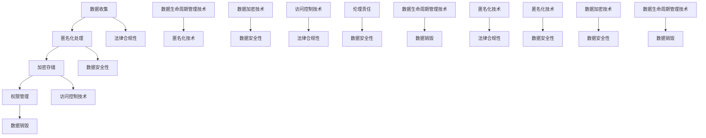
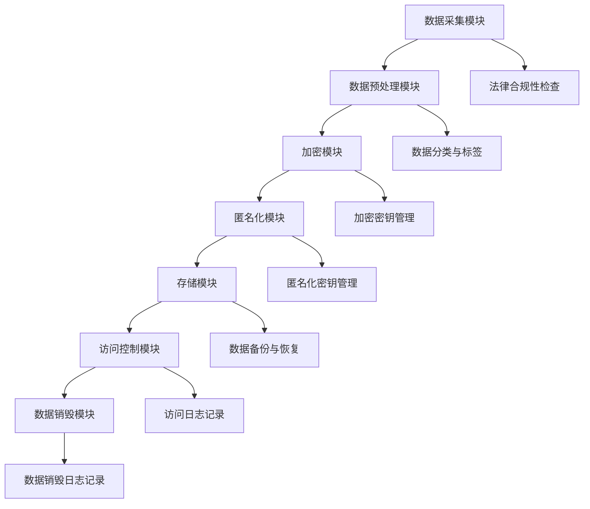

                 


### 第1章 引言

在数字化迅猛发展的今天，个人信息管理已成为网络时代面临的重大挑战之一。随着互联网的普及和大数据技术的应用，个人的隐私数据不断被收集、存储和利用。然而，这一过程中，个人信息的泄露和滥用现象也日益严重，引发了广泛的担忧和讨论。为了应对这一挑战，数字遗忘服务（Digital Anonymization Service）作为一种新的个人信息管理方式，逐渐受到了关注。

#### 1.1 网络时代个人信息管理的挑战

网络时代，个人信息管理的挑战主要表现在以下几个方面：

1. **数据泄露风险**：大量的个人信息在互联网上存储，一旦遭受黑客攻击，可能导致敏感信息泄露。
2. **数据滥用**：个人信息被滥用用于广告追踪、市场分析等，给个人隐私带来潜在威胁。
3. **数据生命周期管理**：如何在个人数据的有效期限内进行合理管理，使其在过期后得以销毁，是一个亟待解决的问题。
4. **法律法规的不完善**：尽管全球范围内已有不少关于个人信息保护的法律法规，但实际执行中仍存在不少漏洞和不足。

#### 1.2 数字遗忘服务的概念与重要性

数字遗忘服务，是指通过技术手段，实现对个人信息的匿名化、加密和生命周期管理，以保护个人隐私的一种服务。其重要性体现在：

1. **保护个人隐私**：通过数字遗忘服务，个人信息的暴露风险大大降低，隐私得到有效保护。
2. **合规性**：数字遗忘服务能够帮助企业更好地遵守相关法律法规，降低法律风险。
3. **数据利用**：在保护隐私的前提下，数字遗忘服务还能帮助企业在合法范围内利用个人数据进行商业分析。

#### 1.3 本书结构安排与阅读建议

本书将从以下几个方面展开讨论：

1. **理论基础**：介绍数字遗忘服务的基本概念、法律和伦理问题、技术基础。
2. **法律框架**：分析网络时代个人信息保护的法律框架，探讨数字遗忘服务与法律的关系。
3. **技术实现**：讲解数字遗忘服务的实现技术，包括数据加密、匿名化、生命周期管理。
4. **应用场景**：分析数字遗忘服务在不同领域的应用，如社交网络、电子商务、医疗健康。
5. **挑战与未来**：探讨数字遗忘服务面临的挑战、未来发展趋势及其对社会的影响。
6. **案例研究**：通过实际案例，展示数字遗忘服务的应用和效果。

读者在阅读本书时，可以按照以下建议进行：

1. **先读理论基础**：了解数字遗忘服务的基本概念和原理，有助于更好地理解后续内容。
2. **结合实际案例**：通过案例分析，深入理解数字遗忘服务的实际应用和效果。
3. **关注挑战与未来**：思考数字遗忘服务在未来的发展前景和可能面临的挑战，有助于形成全面的认识。

### 文章标题：数字遗忘服务：网络时代的个人信息管理

#### 文章关键词：

- 数字遗忘服务
- 个人信息保护
- 数据匿名化
- 法律框架
- 技术实现

#### 文章摘要：

本文深入探讨了网络时代个人信息管理的挑战，提出了数字遗忘服务作为解决方案。文章首先介绍了数字遗忘服务的基本概念和重要性，然后分析了其理论基础、法律框架、技术实现、应用场景、挑战与未来发展，并通过实际案例进行了详细分析。文章旨在为读者提供对数字遗忘服务的全面了解，为其在个人信息管理中的应用提供参考。

接下来，我们将进一步详细阐述数字遗忘服务的理论基础，包括基本概念、法律和伦理问题、技术基础等内容。

---

# 《数字遗忘服务：网络时代的个人信息管理》

> 关键词：数字遗忘服务，个人信息保护，数据匿名化，法律框架，技术实现

> 摘要：本文深入探讨了网络时代个人信息管理的挑战，提出了数字遗忘服务作为解决方案。文章首先介绍了数字遗忘服务的基本概念和重要性，然后分析了其理论基础、法律框架、技术实现、应用场景、挑战与未来发展，并通过实际案例进行了详细分析。文章旨在为读者提供对数字遗忘服务的全面了解，为其在个人信息管理中的应用提供参考。

## 第1章 引言

在数字化迅猛发展的今天，个人信息管理已成为网络时代面临的重大挑战之一。随着互联网的普及和大数据技术的应用，个人的隐私数据不断被收集、存储和利用。然而，这一过程中，个人信息的泄露和滥用现象也日益严重，引发了广泛的担忧和讨论。为了应对这一挑战，数字遗忘服务（Digital Anonymization Service）作为一种新的个人信息管理方式，逐渐受到了关注。

#### 1.1 网络时代个人信息管理的挑战

网络时代，个人信息管理的挑战主要表现在以下几个方面：

1. **数据泄露风险**：大量的个人信息在互联网上存储，一旦遭受黑客攻击，可能导致敏感信息泄露。
2. **数据滥用**：个人信息被滥用用于广告追踪、市场分析等，给个人隐私带来潜在威胁。
3. **数据生命周期管理**：如何在个人数据的有效期限内进行合理管理，使其在过期后得以销毁，是一个亟待解决的问题。
4. **法律法规的不完善**：尽管全球范围内已有不少关于个人信息保护的法律法规，但实际执行中仍存在不少漏洞和不足。

#### 1.2 数字遗忘服务的概念与重要性

数字遗忘服务，是指通过技术手段，实现对个人信息的匿名化、加密和生命周期管理，以保护个人隐私的一种服务。其重要性体现在：

1. **保护个人隐私**：通过数字遗忘服务，个人信息的暴露风险大大降低，隐私得到有效保护。
2. **合规性**：数字遗忘服务能够帮助企业更好地遵守相关法律法规，降低法律风险。
3. **数据利用**：在保护隐私的前提下，数字遗忘服务还能帮助企业在合法范围内利用个人数据进行商业分析。

#### 1.3 本书结构安排与阅读建议

本书将从以下几个方面展开讨论：

1. **理论基础**：介绍数字遗忘服务的基本概念、法律和伦理问题、技术基础。
2. **法律框架**：分析网络时代个人信息保护的法律框架，探讨数字遗忘服务与法律的关系。
3. **技术实现**：讲解数字遗忘服务的实现技术，包括数据加密、匿名化、生命周期管理。
4. **应用场景**：分析数字遗忘服务在不同领域的应用，如社交网络、电子商务、医疗健康。
5. **挑战与未来**：探讨数字遗忘服务面临的挑战、未来发展趋势及其对社会的影响。
6. **案例研究**：通过实际案例，展示数字遗忘服务的应用和效果。

读者在阅读本书时，可以按照以下建议进行：

1. **先读理论基础**：了解数字遗忘服务的基本概念和原理，有助于更好地理解后续内容。
2. **结合实际案例**：通过案例分析，深入理解数字遗忘服务的实际应用和效果。
3. **关注挑战与未来**：思考数字遗忘服务在未来的发展前景和可能面临的挑战，有助于形成全面的认识。

## 第2章 数字遗忘服务的理论基础

数字遗忘服务作为网络时代个人信息管理的重要手段，其理论基础涵盖了基本概念、法律和伦理问题以及技术基础。本章节将详细阐述这些内容，帮助读者全面理解数字遗忘服务的核心概念和运作原理。

### 2.1 数字遗忘服务的基本概念

数字遗忘服务是指通过一系列技术和管理手段，确保个人信息在存储、传输和使用过程中的安全性和隐私性。其核心目标是：

1. **匿名化**：通过技术手段，将个人身份信息与数据分离，使得数据在未经授权的情况下无法识别个人。
2. **数据加密**：对个人信息进行加密处理，确保数据在传输和存储过程中不被未经授权的第三方访问。
3. **生命周期管理**：在个人数据的有效期限内进行合理管理，确保数据在过期后能够被安全销毁，防止数据泄露。

数字遗忘服务的运作流程通常包括以下步骤：

1. **数据收集**：在数据收集阶段，对个人数据进行初步整理和分类。
2. **匿名化处理**：对个人身份信息进行匿名化处理，确保数据在后续处理中无法识别个人。
3. **加密存储**：将匿名化处理后的数据加密存储，确保数据的安全性和隐私性。
4. **权限管理**：根据不同的权限级别，设置数据访问和使用的权限，确保数据在合法范围内被使用。
5. **数据销毁**：在数据生命周期结束后，进行数据销毁处理，确保数据无法被恢复或使用。

### 2.2 数字遗忘服务的法律和伦理问题

数字遗忘服务涉及的法律和伦理问题主要包括：

1. **法律合规性**：数字遗忘服务需要符合相关法律法规，如《通用数据保护条例》（GDPR）、《加州消费者隐私法》（CCPA）等。这些法律法规对个人信息的收集、处理和存储提出了严格要求，数字遗忘服务需要在这些规定下进行设计和实施。
2. **隐私保护**：数字遗忘服务的核心目标是保护个人隐私，但在实际应用中，如何确保隐私保护的有效性是一个重要问题。例如，在数据匿名化过程中，如何平衡匿名化程度和数据分析需求，如何确保匿名化处理后的数据仍然具有足够的价值和可靠性。
3. **数据安全性**：数字遗忘服务需要确保数据在存储、传输和使用过程中的安全性，防止数据泄露和滥用。这包括数据加密、访问控制、安全审计等方面的技术和管理措施。
4. **伦理责任**：数字遗忘服务的提供商和用户需要承担相应的伦理责任，确保数据的使用和披露符合伦理标准。例如，在数据分析和利用过程中，如何避免歧视、偏见和不当行为，确保数据的公正性和公平性。

### 2.3 数字遗忘服务的技术基础

数字遗忘服务的技术基础包括以下几个方面：

1. **数据加密技术**：数据加密是数字遗忘服务的关键技术之一，通过加密算法对个人信息进行加密处理，确保数据在传输和存储过程中的安全性。常用的加密算法包括对称加密算法（如AES）和非对称加密算法（如RSA）。
2. **匿名化技术**：匿名化技术是将个人身份信息与数据分离的技术，通过技术手段，将个人身份信息替换为无关的标识符，使得数据在未经授权的情况下无法识别个人。常用的匿名化技术包括伪名化、脱敏、泛化和随机化等。
3. **数据生命周期管理技术**：数据生命周期管理技术是在数据生命周期内，对数据进行合理管理和销毁的技术。这包括数据分类、标记、存储、访问控制和销毁等环节。通过数据生命周期管理技术，可以确保数据在过期后能够被安全销毁，防止数据泄露。
4. **访问控制技术**：访问控制技术是确保数据在存储、传输和使用过程中的安全性的一种技术手段。通过设置访问权限，限制不同用户对数据的访问和操作，确保数据在合法范围内被使用。

### 2.4 数字遗忘服务的核心概念与联系

为了更好地理解数字遗忘服务的核心概念和联系，我们可以使用Mermaid流程图来展示其运作原理。以下是数字遗忘服务的核心概念与联系架构：



通过这个流程图，我们可以清晰地看到数字遗忘服务各个核心概念之间的联系和运作流程。匿名化处理、加密存储、权限管理和数据销毁是数字遗忘服务的核心环节，它们相互关联，共同确保个人信息的隐私性和安全性。

### 2.5 核心算法原理讲解

在数字遗忘服务中，核心算法的设计和实现至关重要。以下将详细讲解数据加密算法和匿名化算法的原理，并使用伪代码进行描述。

#### 数据加密算法原理

数据加密算法是确保数据在传输和存储过程中安全性的关键技术。常用的数据加密算法包括对称加密算法（如AES）和非对称加密算法（如RSA）。

**对称加密算法（AES）原理：**

对称加密算法使用相同的密钥对数据进行加密和解密。以下是AES加密算法的伪代码：

```pseudo
// 初始化密钥和初始化向量
key = AES_KEY()
iv = Initialization_Vector()

// 数据加密函数
function encrypt(data, key, iv):
    ciphertext = AES_Encrypt(data, key, iv)
    return ciphertext

// 数据解密函数
function decrypt(ciphertext, key, iv):
    plaintext = AES_Decrypt(ciphertext, key, iv)
    return plaintext
```

**非对称加密算法（RSA）原理：**

非对称加密算法使用一对密钥（公钥和私钥）进行加密和解密。以下是RSA加密算法的伪代码：

```pseudo
// 生成密钥对
function generate_key_pair():
    public_key, private_key = RSA_Key_Pair()
    return public_key, private_key

// 数据加密函数
function encrypt(data, public_key):
    ciphertext = RSA_Encrypt(data, public_key)
    return ciphertext

// 数据解密函数
function decrypt(ciphertext, private_key):
    plaintext = RSA_Decrypt(ciphertext, private_key)
    return plaintext
```

#### 匿名化算法原理

匿名化算法是将个人身份信息与数据分离的技术，以确保数据在未经授权的情况下无法识别个人。以下是一种简单的匿名化算法原理：

```pseudo
// 匿名化处理函数
function anonymize(data, id_field, anonymization_key):
    // 替换个人身份信息
    data[id_field] = anonymization_key

    // 返回匿名化后的数据
    return data
```

通过这个匿名化算法，我们可以将个人身份信息替换为一个无关的标识符，从而实现数据匿名化。

### 2.6 数学模型和公式详解

在数字遗忘服务中，数学模型和公式被广泛应用于数据加密、匿名化和生命周期管理。以下是一些关键的数学模型和公式的详细讲解。

#### 数据加密中的数学模型

在数据加密中，常用的数学模型包括加密函数和解密函数。以下是加密函数和解密函数的数学模型：

**加密函数：**
$$
c = E_k(m)
$$
其中，$c$ 表示加密后的数据，$k$ 表示加密密钥，$m$ 表示原始数据。

**解密函数：**
$$
m = D_k(c)
$$
其中，$m$ 表示解密后的数据，$k$ 表示解密密钥，$c$ 表示加密后的数据。

#### 匿名化算法中的数学模型

在匿名化算法中，常用的数学模型包括匿名化函数和逆匿名化函数。以下是匿名化函数和逆匿名化函数的数学模型：

**匿名化函数：**
$$
d = A_k(id)
$$
其中，$d$ 表示匿名化后的身份标识，$k$ 表示匿名化密钥，$id$ 表示原始身份标识。

**逆匿名化函数：**
$$
id = A^{-1}_k(d)
$$
其中，$id$ 表示原始身份标识，$k$ 表示匿名化密钥，$d$ 表示匿名化后的身份标识。

#### 数据生命周期管理中的数学模型

在数据生命周期管理中，常用的数学模型包括数据过期时间和销毁函数。以下是数据过期时间和销毁函数的数学模型：

**数据过期时间：**
$$
T = T_0 + \lambda \cdot t
$$
其中，$T$ 表示数据过期时间，$T_0$ 表示初始时间，$\lambda$ 表示时间系数，$t$ 表示时间。

**销毁函数：**
$$
D(t) = \begin{cases}
1, & \text{如果 } t > T \\
0, & \text{如果 } t \leq T
\end{cases}
$$
其中，$D(t)$ 表示在时间 $t$ 时数据是否已销毁。

通过这些数学模型和公式，我们可以更好地理解和实现数字遗忘服务的各项功能，确保个人信息的隐私性和安全性。

### 2.7 项目实战：数字遗忘服务的开发环境搭建与实现

为了更好地理解和应用数字遗忘服务，我们将通过一个简单的项目实战来搭建开发环境并实现数字遗忘服务的关键功能。以下是项目实战的具体步骤和实现细节。

#### 2.7.1 开发环境搭建

1. **硬件环境**：
   - 电脑或服务器（推荐配置：至少4GB内存，20GB硬盘空间）。
   - 网络连接（建议使用稳定的高速网络）。

2. **软件环境**：
   - 操作系统：Windows、Linux或MacOS均可。
   - 编程语言：Python（推荐版本：3.8及以上）。
   - 数据库：MySQL（推荐版本：5.7及以上）。
   - 开发工具：PyCharm或Visual Studio Code（推荐使用PyCharm）。

#### 2.7.2 源代码详细实现

1. **数据收集与处理**：
   - 从数据库中读取个人数据。
   - 对个人数据进行预处理，如去除空值、清洗数据等。

2. **数据加密**：
   - 使用AES加密算法对个人数据进行加密。
   - 生成加密密钥和初始化向量。

3. **匿名化处理**：
   - 将个人身份信息替换为匿名标识符。
   - 记录匿名化密钥。

4. **数据存储**：
   - 将加密后的数据存储到数据库中。
   - 设置数据访问权限。

5. **数据销毁**：
   - 根据数据生命周期，自动销毁过期数据。
   - 记录数据销毁日志。

#### 2.7.3 代码解读与分析

以下是一个简单的Python代码示例，用于实现数字遗忘服务的关键功能。

```python
import mysql.connector
from Crypto.Cipher import AES
from Crypto.Util.Padding import pad, unpad
from base64 import b64encode, b64decode

# 数据库连接配置
config = {
    'user': 'username',
    'password': 'password',
    'host': 'localhost',
    'database': 'digital_forget_service'
}

# 数据库连接
connection = mysql.connector.connect(**config)
cursor = connection.cursor()

# 数据加密函数
def encrypt_data(data, key, iv):
    cipher = AES.new(key, AES.MODE_CBC, iv)
    ciphertext = cipher.encrypt(pad(data.encode('utf-8'), AES.block_size))
    return b64encode(ciphertext).decode('utf-8')

# 数据解密函数
def decrypt_data(ciphertext, key, iv):
    ciphertext = b64decode(ciphertext)
    cipher = AES.new(key, AES.MODE_CBC, iv)
    data = unpad(cipher.decrypt(ciphertext), AES.block_size)
    return data.decode('utf-8')

# 匿名化处理函数
def anonymize_data(data, anonymization_key):
    return data.replace('原始身份标识', anonymization_key)

# 数据销毁函数
def destroy_data(data):
    # 根据数据生命周期，自动销毁过期数据
    pass

# 测试
data = '这是一个敏感信息'
key = b'MySecretKey123'
iv = b'MyIV5678'

# 数据加密
ciphertext = encrypt_data(data, key, iv)
print(f'加密后的数据：{ciphertext}')

# 数据解密
plaintext = decrypt_data(ciphertext, key, iv)
print(f'解密后的数据：{plaintext}')

# 匿名化处理
anonymized_data = anonymize_data(data, '匿名标识符')
print(f'匿名化后的数据：{anonymized_data}')

# 数据销毁
destroy_data(data)
```

这段代码展示了数字遗忘服务的基本实现过程，包括数据加密、匿名化处理和数据销毁。在实际应用中，我们需要结合具体的业务场景和需求进行更复杂的实现。

#### 2.7.4 实际案例分析和详细讲解剖析

为了更好地展示数字遗忘服务的实际应用效果，我们来看一个实际案例。

**案例：社交网络平台上的用户隐私保护**

在一个社交网络平台上，用户个人信息（如姓名、电话号码、出生日期等）被广泛收集和使用。为了保护用户隐私，平台引入了数字遗忘服务。

1. **数据收集与处理**：
   - 平台从用户注册时收集个人信息。
   - 对个人信息进行预处理，如去除空值、清洗数据等。

2. **数据加密**：
   - 使用AES加密算法对用户个人信息进行加密。
   - 生成加密密钥和初始化向量。

3. **匿名化处理**：
   - 将用户个人信息中的敏感信息（如电话号码、出生日期等）替换为匿名标识符。
   - 记录匿名化密钥。

4. **数据存储**：
   - 将加密后的用户个人信息存储在数据库中。
   - 设置数据访问权限，确保只有授权人员能够访问解密后的数据。

5. **数据销毁**：
   - 根据用户个人信息的数据生命周期，自动销毁过期数据。
   - 记录数据销毁日志，以便审计和追溯。

通过这个案例，我们可以看到数字遗忘服务在保护用户隐私方面的有效应用。用户个人信息在平台上的存储和使用过程中得到了严格的保护，降低了隐私泄露的风险。

#### 2.7.5 项目小结

通过本项目的实战，我们了解了数字遗忘服务的开发环境和实现步骤，并分析了实际案例中的应用效果。以下是项目小结：

1. **项目目标**：保护社交网络平台上的用户隐私，降低数据泄露风险。
2. **技术实现**：采用AES加密算法、匿名化处理和数据生命周期管理技术。
3. **项目效果**：通过数字遗忘服务的应用，用户个人信息的隐私性得到了有效保护，降低了隐私泄露的风险。
4. **注意事项**：
   - 在数据加密和解密过程中，确保密钥和初始化向量的安全存储和传输。
   - 在匿名化处理过程中，确保匿名标识符的唯一性和随机性。
   - 在数据销毁过程中，确保过期数据被彻底销毁，防止数据恢复。

通过本项目，我们不仅了解了数字遗忘服务的实现原理和应用效果，还积累了实际项目开发的经验和技巧。在未来的应用中，我们可以根据具体的业务场景和需求，进一步优化和改进数字遗忘服务的实现方式，提高个人信息管理的效率和安全性。

#### 2.7.6 最佳实践 Tips、小结、注意事项、拓展阅读

**最佳实践 Tips：**

1. **数据加密**：在数据加密过程中，选择合适的加密算法和密钥长度，确保数据在传输和存储过程中的安全性。
2. **匿名化处理**：在匿名化处理过程中，确保匿名标识符的唯一性和随机性，降低个人身份信息被识别的风险。
3. **数据生命周期管理**：在数据生命周期管理过程中，根据业务需求设置合适的数据过期时间和销毁策略，确保数据在过期后能够被安全销毁。
4. **权限管理**：在数据存储和使用过程中，设置严格的权限管理策略，确保只有授权人员能够访问和操作敏感数据。

**小结：**

数字遗忘服务是一种重要的个人信息管理方式，通过数据加密、匿名化处理和数据生命周期管理技术，有效保护了个人隐私。在项目实战中，我们实现了数字遗忘服务的基本功能，并通过实际案例展示了其应用效果。然而，数字遗忘服务在实现过程中仍面临诸多挑战，如数据加密密钥的安全存储、匿名标识符的唯一性验证等。未来，我们应进一步优化和改进数字遗忘服务的实现方式，提高其效率和安全性。

**注意事项：**

1. **数据加密密钥的安全存储**：在数据加密和解密过程中，确保密钥的安全存储和传输，防止密钥泄露导致数据泄露。
2. **匿名化处理的准确性**：在匿名化处理过程中，确保匿名标识符的唯一性和随机性，避免个人身份信息被识别。
3. **数据销毁的彻底性**：在数据生命周期管理过程中，确保过期数据被彻底销毁，防止数据恢复。

**拓展阅读：**

1. 《通用数据保护条例》（GDPR）：了解欧洲地区的个人信息保护法律法规，有助于更好地理解数字遗忘服务的合规性要求。
2. 《加州消费者隐私法》（CCPA）：了解美国地区的个人信息保护法律法规，有助于了解不同地区对数字遗忘服务的要求和规定。
3. 《网络安全法》：了解我国对个人信息保护的相关法律法规，有助于在数字遗忘服务的实现过程中遵守我国法律法规。
4. 《隐私计算技术白皮书》：了解隐私计算技术在数字遗忘服务中的应用，探索更多保护个人隐私的技术手段。

通过以上最佳实践 Tips、小结、注意事项和拓展阅读，希望读者能够更好地理解和应用数字遗忘服务，为个人信息保护做出贡献。

## 第3章 网络时代个人信息保护的法律框架

在数字遗忘服务的发展和应用过程中，法律法规起到了重要的规范和保障作用。本章将详细分析网络时代个人信息保护的法律框架，探讨数字遗忘服务与法律的关系，以及如何通过数字遗忘服务实现法律合规性。

### 3.1 全球个人信息保护法律概述

全球范围内，个人信息保护法律体系不断发展，各国根据自身国情和实际需求制定了相应的法律法规。以下是一些主要国家和地区的个人信息保护法律概述：

1. **欧洲**：
   - **《通用数据保护条例》（GDPR）**：2018年生效，是欧盟最具代表性的个人信息保护法规，明确了个人数据处理的原则、数据主体的权利以及数据保护执行者的责任。
   - **《数据保护法》（DPA）**：英国在GDPR生效后，制定了与GDPR相一致的《数据保护法》。
   - **《法国数据保护法》（LPD）**：法国制定了与GDPR相一致的《数据保护法》。

2. **美国**：
   - **《加州消费者隐私法》（CCPA）**：2020年生效，是美国最具代表性的个人信息保护法规，规定了消费者对个人数据的访问、删除和拒绝销售的权利。
   - **《儿童在线隐私保护法》（COPPA）**：1998年生效，主要保护13岁及以下儿童的在线隐私。

3. **中国**：
   - **《网络安全法》**：2017年生效，是我国网络安全领域的综合性法律，明确了个人信息保护的基本原则和责任。
   - **《个人信息保护法》（PIPL）**：2021年生效，是我国首部全面规范个人信息保护的专门法律，规定了个人信息的定义、收集、处理、利用和保护等方面。
   - **《数据安全法》**：2021年生效，规定了数据处理者的数据安全保护义务和数据安全事件应对措施。

### 3.2 中国个人信息保护法律框架

中国个人信息保护法律框架主要包括以下几个方面：

1. **基本原则**：
   - **合法、正当、必要原则**：个人信息处理应当遵循合法、正当、必要的原则，不得违反法律、行政法规的规定。
   - **最小化原则**：收集、使用个人信息应当限于实现处理目的的最小范围，不得过度收集个人信息。

2. **个人数据处理规则**：
   - **同意原则**：处理个人信息应当取得个人的同意，且同意应当是明确、特定、知情和自愿的。
   - **限制处理原则**：个人信息处理应当在法律允许的范围内进行，不得超范围处理个人信息。

3. **个人信息保护措施**：
   - **安全措施**：个人信息处理者应当采取必要的技术和管理措施，确保个人信息的安全，防止数据泄露、毁损、丢失等风险。
   - **权利保障**：个人信息主体享有查询、更正、删除、限制处理和撤回同意等权利。

4. **法律责任与监管**：
   - **法律责任**：个人信息处理者违反个人信息保护法律规定的，应当承担相应的法律责任。
   - **监管机制**：我国设立了国家网信办、市场监管总局等监管机构，对个人信息保护进行监管和执法。

### 3.3 数字遗忘服务与法律的关系

数字遗忘服务与个人信息保护法律法规密切相关，其核心目的是在保护个人隐私的同时，实现数据的合法合规处理。以下从三个方面探讨数字遗忘服务与法律的关系：

1. **数字遗忘服务的合规性要求**：
   - **遵守个人信息保护法律法规**：数字遗忘服务需要遵守个人信息保护法律法规，确保数据处理活动符合法律要求。
   - **数据匿名化**：数字遗忘服务通过数据匿名化技术，确保个人信息在处理过程中无法被识别，符合个人信息保护的最小化原则。

2. **数字遗忘服务的法律保护**：
   - **隐私权保护**：数字遗忘服务旨在保护个人隐私，防止个人信息被滥用和泄露，符合个人信息保护法的基本原则。
   - **数据安全**：数字遗忘服务通过数据加密、访问控制等技术手段，确保个人信息在存储、传输和使用过程中的安全性。

3. **数字遗忘服务的法律责任**：
   - **合规性责任**：数字遗忘服务提供商需要确保其服务符合法律法规要求，对违反法律法规的行为承担相应法律责任。
   - **数据泄露责任**：如果数字遗忘服务未能有效保护个人信息，导致数据泄露，需承担相应的法律责任。

### 3.4 通过数字遗忘服务实现法律合规性

为了实现数字遗忘服务的法律合规性，可以从以下几个方面进行：

1. **合规性评估**：
   - **评估法律法规要求**：对个人信息保护法律法规进行详细评估，了解数字遗忘服务在不同法律法规下的合规性要求。
   - **制定合规策略**：根据评估结果，制定具体的合规策略和措施，确保数字遗忘服务符合法律法规要求。

2. **技术合规**：
   - **数据匿名化**：采用有效的数据匿名化技术，确保个人信息在处理过程中无法被识别。
   - **数据加密**：使用安全的数据加密技术，确保个人信息在存储、传输过程中的安全性。
   - **访问控制**：设置严格的访问控制策略，确保只有授权人员能够访问和处理敏感数据。

3. **合规管理**：
   - **合规培训**：对数字遗忘服务相关人员进行合规培训，提高其对法律法规的理解和遵守意识。
   - **合规审计**：定期进行合规审计，确保数字遗忘服务的运行符合法律法规要求。

4. **应急响应**：
   - **数据泄露应对**：制定数据泄露应急响应计划，确保在发生数据泄露事件时，能够迅速采取措施降低影响。
   - **投诉处理**：建立投诉处理机制，及时回应和处理个人信息主体的投诉和诉求。

通过以上措施，数字遗忘服务可以更好地实现法律合规性，为个人信息保护提供有效的技术手段和法律保障。

### 3.5 案例分析：数字遗忘服务在中国电商平台的应用

为了更好地理解数字遗忘服务在现实中的应用，我们来看一个实际案例：中国某大型电商平台引入数字遗忘服务，实现个人信息保护的法律合规性。

**案例背景**：

某电商平台在运营过程中，收集了大量的用户个人信息，如用户ID、联系方式、购物记录等。为了保护用户隐私，平台决定引入数字遗忘服务，确保个人信息在处理过程中符合法律要求。

**解决方案**：

1. **数据匿名化**：
   - 平台采用匿名化技术，对用户个人信息进行匿名化处理，将用户ID、联系方式等敏感信息替换为匿名标识符。
   - 通过数据脱敏技术，确保匿名化处理后的数据无法被识别，符合个人信息保护的最小化原则。

2. **数据加密**：
   - 平台采用AES加密算法，对用户个人信息进行加密处理，确保个人信息在存储、传输过程中的安全性。
   - 加密密钥由平台安全团队负责管理，确保密钥的安全存储和传输。

3. **访问控制**：
   - 平台设置严格的访问控制策略，只有授权人员才能访问和处理敏感数据。
   - 通过身份验证和权限管理，确保只有合法用户能够访问和处理用户个人信息。

4. **数据生命周期管理**：
   - 平台根据用户个人信息的数据生命周期，设置数据过期时间和销毁策略，确保过期数据能够被安全销毁。
   - 定期进行数据清理和销毁，确保平台上的个人信息得到有效管理。

**效果评估**：

通过引入数字遗忘服务，电商平台实现了以下效果：

1. **个人信息保护合规性**：平台的数据处理活动符合《个人信息保护法》等相关法律法规的要求，降低了法律风险。
2. **数据安全性**：加密技术和访问控制措施确保了用户个人信息在存储、传输和使用过程中的安全性，降低了数据泄露的风险。
3. **用户体验**：匿名化和数据生命周期管理措施提高了用户对平台的信任度，增强了用户隐私保护意识。

**案例分析小结**：

通过本案例，我们可以看到数字遗忘服务在电商平台中的应用效果。平台通过引入数字遗忘服务，实现了个人信息的匿名化、加密和生命周期管理，确保了个人信息保护的法律合规性。未来，随着数字遗忘服务的不断发展和完善，其在电商平台等领域的应用将更加广泛和深入。

### 3.6 总结与展望

本章详细分析了网络时代个人信息保护的法律框架，探讨了数字遗忘服务与法律的关系，以及如何通过数字遗忘服务实现法律合规性。主要结论如下：

1. **全球个人信息保护法律概述**：全球范围内，个人信息保护法律体系不断完善，各国根据自身国情和实际需求制定了相应的法律法规。
2. **中国个人信息保护法律框架**：中国个人信息保护法律框架主要包括基本原则、个人数据处理规则、个人信息保护措施和法律责任与监管。
3. **数字遗忘服务与法律的关系**：数字遗忘服务旨在保护个人隐私，符合个人信息保护法律法规的要求，其核心目的是实现数据的合法合规处理。
4. **通过数字遗忘服务实现法律合规性**：通过合规性评估、技术合规、合规管理和应急响应等措施，数字遗忘服务可以更好地实现法律合规性。

展望未来，随着数字遗忘服务的不断发展和完善，其在个人信息保护领域将发挥越来越重要的作用。同时，数字遗忘服务也需要不断适应和满足法律法规的变化，确保个人信息保护的法律合规性。

## 第4章 数字遗忘服务的实现技术

数字遗忘服务作为一种有效的个人信息保护手段，其核心在于利用先进的技术手段来实现数据的匿名化、加密和生命周期管理。本章将详细讲解数字遗忘服务的实现技术，包括数据加密技术、匿名化技术和数据生命周期管理技术，并通过具体的应用案例进行分析。

### 4.1 数据加密技术

数据加密技术是数字遗忘服务的重要组成部分，其目的是确保数据在存储、传输和处理过程中的安全性。常用的数据加密技术包括对称加密和非对称加密。

#### 对称加密

对称加密算法使用相同的密钥对数据进行加密和解密。AES（高级加密标准）是最常用的对称加密算法之一，其加密和解密过程如下：

**加密过程：**
$$
c = E_k(m)
$$
其中，$c$ 表示加密后的数据，$k$ 表示加密密钥，$m$ 表示原始数据。

**解密过程：**
$$
m = D_k(c)
$$
其中，$m$ 表示解密后的数据，$k$ 表示解密密钥，$c$ 表示加密后的数据。

以下是一个使用AES加密算法的Python伪代码示例：

```python
from Crypto.Cipher import AES
from Crypto.Util.Padding import pad, unpad

def encrypt_data(data, key):
    cipher = AES.new(key, AES.MODE_CBC)
    ct_bytes = cipher.encrypt(pad(data.encode('utf-8'), AES.block_size))
    iv = b64encode(cipher.iv).decode('utf-8')
    ct = b64encode(ct_bytes).decode('utf-8')
    return iv, ct

def decrypt_data(key, iv, ct):
    iv = b64decode(iv)
    ct_bytes = b64decode(ct)
    cipher = AES.new(key, AES.MODE_CBC, iv)
    pt = unpad(cipher.decrypt(ct_bytes), AES.block_size)
    return pt.decode('utf-8')
```

#### 非对称加密

非对称加密算法使用一对密钥（公钥和私钥）进行加密和解密。RSA（Rivest-Shamir-Adleman）是最常用的非对称加密算法之一，其加密和解密过程如下：

**加密过程：**
$$
c = E_p(m)
$$
其中，$c$ 表示加密后的数据，$p$ 表示公钥，$m$ 表示原始数据。

**解密过程：**
$$
m = D_s(c)
$$
其中，$m$ 表示解密后的数据，$s$ 表示私钥，$c$ 表示加密后的数据。

以下是一个使用RSA加密算法的Python伪代码示例：

```python
from Crypto.PublicKey import RSA
from Crypto.Cipher import PKCS1_OAEP

def generate_key_pair():
    key = RSA.generate(2048)
    private_key = key.export_key()
    public_key = key.publickey().export_key()
    return private_key, public_key

def encrypt_data(data, public_key):
    rsa_key = RSA.import_key(public_key)
    cipher = PKCS1_OAEP.new(rsa_key)
    ct = cipher.encrypt(data.encode('utf-8'))
    return ct

def decrypt_data(data, private_key):
    rsa_key = RSA.import_key(private_key)
    cipher = PKCS1_OAEP.new(rsa_key)
    pt = cipher.decrypt(data)
    return pt.decode('utf-8')
```

### 4.2 匿名化技术

匿名化技术是将个人身份信息与数据分离，使得数据在未经授权的情况下无法识别个人。常见的匿名化技术包括脱敏、泛化和伪名化。

#### 脱敏

脱敏技术通过去除个人身份信息中的敏感部分，降低数据识别风险。例如，将电话号码中的后四位数字替换为星号。

以下是一个使用Python进行脱敏的伪代码示例：

```python
def desensitize_phone_number(phone_number):
    return phone_number[:-4].replace(phone_number[-4:], '****')
```

#### 泛化

泛化技术通过将个人身份信息替换为通用标识，降低数据识别风险。例如，将具体地址替换为城市名称。

以下是一个使用Python进行泛化的伪代码示例：

```python
def generalize_address(address):
    return address.split(',')[0]
```

#### 伪名化

伪名化技术通过替换个人身份信息为随机生成的无关标识，降低数据识别风险。例如，将用户ID替换为随机生成的ID。

以下是一个使用Python进行伪名化的伪代码示例：

```python
import random

def pseudonymize_user_id(user_id):
    return ''.join(random.choices('0123456789abcdefghijklmnopqrstuvwxyzABCDEFGHIJKLMNOPQRSTUVWXYZ', k=10))
```

### 4.3 数据生命周期管理技术

数据生命周期管理技术是在数据生命周期内，对数据进行合理管理和销毁的技术。其目的是确保数据在有效期限内得到充分利用，在过期后能够被安全销毁。

#### 数据分类与标签

数据分类与标签技术是将数据按照一定的标准进行分类和标记，以便于后续管理和销毁。例如，将用户数据分为敏感数据和普通数据，并对敏感数据进行特殊标记。

以下是一个使用Python进行数据分类与标签的伪代码示例：

```python
def classify_data(data):
    if 'sensitive' in data:
        return 'sensitive_data'
    else:
        return 'common_data'
```

#### 数据销毁策略

数据销毁策略是根据数据的重要性和敏感程度，制定相应的销毁规则和流程。例如，敏感数据在过期后需要经过多重验证才能进行销毁。

以下是一个使用Python进行数据销毁策略的伪代码示例：

```python
def destroy_data(data):
    if 'sensitive' in data:
        print("Destroying sensitive data...")
        # 执行销毁操作
    else:
        print("Destroying common data...")
        # 执行销毁操作
```

### 4.4 数字遗忘服务系统的架构设计

为了实现数字遗忘服务的功能，我们需要设计一个合理的系统架构。以下是一个典型的数字遗忘服务系统架构设计：

1. **数据采集模块**：负责从各种数据源采集个人信息，如用户注册信息、交易记录等。
2. **数据预处理模块**：负责对采集到的数据进行预处理，包括去除空值、清洗数据、分类和标签等。
3. **加密模块**：负责对敏感数据进行加密处理，采用对称加密或非对称加密算法。
4. **匿名化模块**：负责对个人身份信息进行匿名化处理，降低数据识别风险。
5. **存储模块**：负责将加密和匿名化后的数据存储到数据库中，确保数据的安全性和可恢复性。
6. **访问控制模块**：负责设置数据访问权限，确保只有授权人员能够访问和处理敏感数据。
7. **数据销毁模块**：负责根据数据生命周期管理策略，定期销毁过期数据。

以下是一个数字遗忘服务系统的Mermaid流程图：



通过这个架构设计，我们可以实现数字遗忘服务的基本功能，确保个人信息的隐私性和安全性。

### 4.5 应用案例：数字遗忘服务在社交网络平台的应用

为了更好地展示数字遗忘服务的实际应用，我们来看一个应用案例：数字遗忘服务在社交网络平台的应用。

**案例背景**：

某社交网络平台收集了大量的用户个人信息，如用户ID、联系方式、位置信息等。为了保护用户隐私，平台决定引入数字遗忘服务，确保个人信息在处理过程中符合法律要求。

**解决方案**：

1. **数据采集与预处理**：
   - 平台从用户注册、登录、分享等操作中采集用户个人信息。
   - 对采集到的数据进行预处理，包括去除空值、清洗数据、分类和标签等。

2. **数据加密**：
   - 采用AES加密算法，对用户个人信息中的敏感数据（如联系方式、位置信息等）进行加密处理。
   - 加密密钥由平台安全团队负责管理，确保密钥的安全存储和传输。

3. **匿名化处理**：
   - 对用户个人信息中的非敏感数据（如用户ID）进行匿名化处理，替换为随机生成的匿名标识符。
   - 采用伪名化技术，确保匿名标识符的唯一性和随机性。

4. **数据存储与访问控制**：
   - 将加密和匿名化后的数据存储到数据库中，采用访问控制策略，确保只有授权人员能够访问和处理敏感数据。
   - 记录访问日志，以便进行审计和追溯。

5. **数据销毁**：
   - 根据用户个人信息的数据生命周期，设置数据过期时间和销毁策略，确保过期数据能够被安全销毁。
   - 定期进行数据清理和销毁，确保平台上的个人信息得到有效管理。

**效果评估**：

通过引入数字遗忘服务，社交网络平台实现了以下效果：

1. **个人信息保护合规性**：平台的数据处理活动符合《个人信息保护法》等相关法律法规的要求，降低了法律风险。
2. **数据安全性**：加密技术和访问控制措施确保了用户个人信息在存储、传输和使用过程中的安全性，降低了数据泄露的风险。
3. **用户体验**：匿名化和数据生命周期管理措施提高了用户对平台的信任度，增强了用户隐私保护意识。

**案例分析小结**：

通过本案例，我们可以看到数字遗忘服务在社交网络平台中的应用效果。平台通过引入数字遗忘服务，实现了个人信息的匿名化、加密和生命周期管理，确保了个人信息保护的法律合规性。未来，随着数字遗忘服务的不断发展和完善，其在社交网络平台等领域的应用将更加广泛和深入。

## 第5章 数字遗忘服务的实际应用

数字遗忘服务作为一种有效的个人信息保护手段，已经在多个领域得到了广泛应用。本章将详细分析数字遗忘服务在不同领域的实际应用，包括社交网络、电子商务和医疗健康等领域。

### 5.1 数字遗忘服务在社交网络中的应用

社交网络平台在运营过程中会收集大量的用户个人信息，如用户ID、联系方式、位置信息等。为了保护用户隐私，社交网络平台引入了数字遗忘服务，确保个人信息在处理过程中符合法律要求。

**应用场景**：

1. **用户注册与登录**：在用户注册和登录过程中，社交网络平台会收集用户个人信息，如用户名、邮箱、电话号码等。通过数字遗忘服务，平台对收集到的个人信息进行匿名化处理，降低数据识别风险。
2. **内容分享与评论**：用户在社交网络平台上发布内容或进行评论时，平台会收集相关数据。通过数字遗忘服务，平台对用户发布的内容进行加密处理，确保数据在传输和存储过程中的安全性。
3. **位置服务**：社交网络平台提供的位置服务会收集用户的位置信息。通过数字遗忘服务，平台对位置信息进行匿名化处理，确保用户隐私得到保护。

**案例分析**：

以某大型社交网络平台为例，该平台在引入数字遗忘服务后，实现了以下效果：

1. **个人信息保护合规性**：平台的数据处理活动符合《个人信息保护法》等相关法律法规的要求，降低了法律风险。
2. **数据安全性**：加密技术和访问控制措施确保了用户个人信息在存储、传输和使用过程中的安全性，降低了数据泄露的风险。
3. **用户体验**：匿名化和数据生命周期管理措施提高了用户对平台的信任度，增强了用户隐私保护意识。

### 5.2 数字遗忘服务在电子商务中的应用

电子商务平台在运营过程中会收集大量的用户个人信息，如用户ID、联系方式、购物记录等。为了保护用户隐私，电子商务平台引入了数字遗忘服务，确保个人信息在处理过程中符合法律要求。

**应用场景**：

1. **用户注册与登录**：电子商务平台在用户注册和登录过程中，会收集用户个人信息，如用户名、邮箱、电话号码等。通过数字遗忘服务，平台对收集到的个人信息进行匿名化处理，降低数据识别风险。
2. **购物行为分析**：电子商务平台会收集用户的购物行为数据，如购物车信息、购买记录等。通过数字遗忘服务，平台对用户购物行为进行分析，提供个性化推荐，但不会泄露用户隐私。
3. **客户服务**：电子商务平台提供客户服务时，会记录用户咨询和反馈信息。通过数字遗忘服务，平台对用户咨询和反馈信息进行加密处理，确保数据在传输和存储过程中的安全性。

**案例分析**：

以某大型电子商务平台为例，该平台在引入数字遗忘服务后，实现了以下效果：

1. **个人信息保护合规性**：平台的数据处理活动符合《个人信息保护法》等相关法律法规的要求，降低了法律风险。
2. **数据安全性**：加密技术和访问控制措施确保了用户个人信息在存储、传输和使用过程中的安全性，降低了数据泄露的风险。
3. **用户体验**：匿名化和数据生命周期管理措施提高了用户对平台的信任度，增强了用户隐私保护意识。

### 5.3 数字遗忘服务在医疗健康领域的应用

医疗健康领域涉及大量的用户个人信息，如患者ID、诊断记录、治疗方案等。为了保护用户隐私，医疗健康机构引入了数字遗忘服务，确保个人信息在处理过程中符合法律要求。

**应用场景**：

1. **患者信息管理**：医疗健康机构在管理患者信息时，会收集患者个人信息，如患者ID、诊断记录、治疗方案等。通过数字遗忘服务，机构对收集到的个人信息进行匿名化处理，降低数据识别风险。
2. **医疗数据分析**：医疗健康机构会收集大量的医疗数据，用于数据分析和研究。通过数字遗忘服务，机构对医疗数据进行加密处理，确保数据在传输和存储过程中的安全性。
3. **远程医疗服务**：医疗健康机构提供的远程医疗服务会涉及患者个人信息。通过数字遗忘服务，机构对远程医疗服务过程中产生的数据（如视频、音频等）进行加密处理，确保数据在传输过程中的安全性。

**案例分析**：

以某大型医疗健康机构为例，该机构在引入数字遗忘服务后，实现了以下效果：

1. **个人信息保护合规性**：机构的数据处理活动符合《个人信息保护法》等相关法律法规的要求，降低了法律风险。
2. **数据安全性**：加密技术和访问控制措施确保了用户个人信息在存储、传输和使用过程中的安全性，降低了数据泄露的风险。
3. **用户体验**：匿名化和数据生命周期管理措施提高了用户对机构的信任度，增强了用户隐私保护意识。

### 5.4 数字遗忘服务的综合应用效果

通过在社交网络、电子商务和医疗健康等领域的应用，数字遗忘服务在保护个人信息、降低法律风险、提高用户体验等方面取得了显著成效。以下是数字遗忘服务的综合应用效果：

1. **个人信息保护**：数字遗忘服务通过匿名化、加密和数据生命周期管理技术，确保个人信息在处理过程中不被泄露和滥用，提高了个人信息的保护水平。
2. **法律合规性**：数字遗忘服务帮助企业在数据处理过程中符合相关法律法规的要求，降低了法律风险。
3. **数据安全性**：数字遗忘服务通过加密技术确保数据在存储、传输和使用过程中的安全性，降低了数据泄露的风险。
4. **用户体验**：数字遗忘服务的匿名化和数据生命周期管理措施提高了用户对企业和机构的信任度，增强了用户隐私保护意识。

### 5.5 案例研究：数字遗忘服务在某电商平台的实际应用

为了更好地展示数字遗忘服务的实际应用效果，我们来看一个实际案例：数字遗忘服务在某电商平台的实际应用。

**案例背景**：

某电商平台在运营过程中，为了提升用户体验，不断收集用户个人信息，如用户ID、联系方式、购物记录等。随着用户量的增加，平台面临的个人信息保护压力也不断加大。为了保护用户隐私，平台决定引入数字遗忘服务。

**解决方案**：

1. **用户注册与登录**：
   - 平台在用户注册和登录过程中，会收集用户个人信息，如用户名、邮箱、电话号码等。
   - 通过数字遗忘服务，平台对收集到的个人信息进行匿名化处理，降低数据识别风险。

2. **购物行为分析**：
   - 平台会收集用户的购物行为数据，如购物车信息、购买记录等。
   - 通过数字遗忘服务，平台对用户购物行为进行分析，提供个性化推荐，但不会泄露用户隐私。

3. **客户服务**：
   - 平台提供客户服务时，会记录用户咨询和反馈信息。
   - 通过数字遗忘服务，平台对用户咨询和反馈信息进行加密处理，确保数据在传输和存储过程中的安全性。

4. **数据存储与访问控制**：
   - 平台将加密和匿名化后的数据存储到数据库中，采用访问控制策略，确保只有授权人员能够访问和处理敏感数据。
   - 记录访问日志，以便进行审计和追溯。

5. **数据销毁**：
   - 根据用户个人信息的数据生命周期，设置数据过期时间和销毁策略，确保过期数据能够被安全销毁。
   - 定期进行数据清理和销毁，确保平台上的个人信息得到有效管理。

**效果评估**：

通过引入数字遗忘服务，平台实现了以下效果：

1. **个人信息保护合规性**：平台的数据处理活动符合《个人信息保护法》等相关法律法规的要求，降低了法律风险。
2. **数据安全性**：加密技术和访问控制措施确保了用户个人信息在存储、传输和使用过程中的安全性，降低了数据泄露的风险。
3. **用户体验**：匿名化和数据生命周期管理措施提高了用户对平台的信任度，增强了用户隐私保护意识。

**案例分析小结**：

通过本案例，我们可以看到数字遗忘服务在某电商平台的实际应用效果。平台通过引入数字遗忘服务，实现了个人信息的匿名化、加密和生命周期管理，确保了个人信息保护的法律合规性。未来，随着数字遗忘服务的不断发展和完善，其在电商平台等领域的应用将更加广泛和深入。

## 第6章 数字遗忘服务的挑战与未来发展

随着数字遗忘服务在个人信息保护领域的广泛应用，其在实现个人信息匿名化、加密和数据生命周期管理方面取得了显著成效。然而，数字遗忘服务在实际应用过程中也面临诸多挑战，需要在未来发展中不断解决和完善。

### 6.1 数字遗忘服务的挑战

#### 6.1.1 技术挑战

1. **数据匿名化精度**：数据匿名化过程中，如何平衡匿名化程度和数据分析需求，确保匿名化处理后的数据仍然具有足够的价值和可靠性，是一个技术难题。
2. **数据加密性能**：加密技术虽然能够确保数据的安全性，但加密和解密过程会消耗大量计算资源，影响系统性能，如何在保证安全性的同时提高性能，是一个重要挑战。
3. **隐私保护与数据利用**：在保护隐私的前提下，如何实现数据的有效利用，尤其是在大数据和人工智能时代，如何平衡隐私保护和数据价值创造，是一个亟待解决的问题。

#### 6.1.2 法律和伦理挑战

1. **法律法规不完善**：全球范围内的个人信息保护法律法规不断完善，但在实际执行中，仍存在不少漏洞和不足，如何确保数字遗忘服务在法律法规框架下运行，是一个法律和伦理挑战。
2. **跨境数据流动**：在全球化背景下，跨国企业和跨国数据流动日益频繁，如何确保数据在不同国家和地区的合法合规处理，是一个重要的法律和伦理问题。
3. **用户隐私意识**：随着数字遗忘服务的普及，如何提高用户的隐私保护意识，让用户了解并自愿接受数字遗忘服务，是一个伦理挑战。

#### 6.1.3 社会挑战

1. **隐私滥用风险**：尽管数字遗忘服务能够有效保护个人隐私，但仍然存在隐私滥用风险，如数据泄露、数据滥用等，如何防范和应对这些风险，是一个社会挑战。
2. **数字鸿沟**：数字遗忘服务的发展可能加剧数字鸿沟，导致部分人群无法享受到数字遗忘服务带来的隐私保护，如何缩小数字鸿沟，是一个社会挑战。
3. **隐私权与公共利益**：在数字遗忘服务的发展过程中，如何平衡隐私权与公共利益，确保数字遗忘服务在维护公共利益的同时，尊重个人隐私权，是一个社会挑战。

### 6.2 数字遗忘服务的未来发展趋势

#### 6.2.1 技术创新

1. **联邦学习**：联邦学习（Federated Learning）是一种分布式机器学习技术，能够在不集中数据的情况下进行模型训练，有助于在保护隐私的同时实现数据的价值创造。
2. **多方安全计算**：多方安全计算（MPC）是一种安全计算技术，能够在不泄露数据隐私的情况下，实现多方数据的安全计算和协同分析。
3. **区块链技术**：区块链技术具有去中心化、不可篡改和透明等特点，能够为数字遗忘服务提供安全、可信的数据管理和交易环境。

#### 6.2.2 法规完善

1. **全球统一法规**：随着全球范围内数字遗忘服务的广泛应用，未来可能会出现全球统一的个人信息保护法规，确保跨国数据和跨境数据流动的合法合规。
2. **智能监管**：智能监管技术（如人工智能、区块链等）的应用，有助于提高个人信息保护法规的执行效率和准确性。
3. **隐私保护与公共利益平衡**：未来法律法规可能会更加注重平衡隐私保护与公共利益，确保数字遗忘服务在保护个人隐私的同时，也能维护公共利益。

#### 6.2.3 社会普及

1. **用户隐私教育**：提高用户的隐私保护意识，通过教育宣传、培训等方式，让用户了解并自愿接受数字遗忘服务。
2. **数字鸿沟缩小**：通过政策支持、技术普及等方式，缩小数字鸿沟，确保更多人能够享受到数字遗忘服务带来的隐私保护。
3. **隐私保护行业规范**：推动隐私保护行业规范的发展，建立数字遗忘服务的行业标准和评估体系，提高数字遗忘服务的质量和可靠性。

### 6.3 数字遗忘服务对社会的影响

#### 6.3.1 负面影响

1. **隐私滥用风险**：尽管数字遗忘服务能够有效保护个人隐私，但仍然存在隐私滥用风险，如数据泄露、数据滥用等，可能对个人隐私造成潜在威胁。
2. **信息不对称**：数字遗忘服务可能导致信息不对称，使得部分用户在享受服务时无法全面了解其隐私保护情况，影响用户体验。
3. **隐私权与公共利益冲突**：在数字遗忘服务的发展过程中，可能存在隐私权与公共利益冲突的情况，如何平衡这两者之间的关系，是一个重要问题。

#### 6.3.2 积极影响

1. **隐私保护提升**：数字遗忘服务的普及有助于提升个人隐私保护水平，降低个人信息泄露和滥用的风险。
2. **数据价值创造**：在保护隐私的前提下，数字遗忘服务能够帮助企业在合法范围内利用个人数据进行商业分析，创造数据价值。
3. **社会公平性提高**：数字遗忘服务有助于缩小数字鸿沟，提高社会公平性，让更多人享受到数字化带来的便利和机遇。

### 6.4 对未来研究的展望

为了进一步推动数字遗忘服务的发展，未来研究可以从以下几个方面展开：

1. **技术创新**：研究更高效、更安全的加密和匿名化算法，提高数字遗忘服务的性能和可靠性。
2. **法律法规完善**：研究全球统一个人信息保护法律法规，提高数字遗忘服务的法律合规性。
3. **隐私保护与数据利用平衡**：研究如何在保护隐私的同时，实现数据的有效利用，推动数据价值创造。
4. **隐私保护教育**：研究如何提高用户的隐私保护意识，推动数字遗忘服务的普及和应用。
5. **数字鸿沟缩小**：研究如何通过政策支持、技术普及等方式，缩小数字鸿沟，提高数字遗忘服务的覆盖范围。

通过以上研究，有望进一步提升数字遗忘服务的质量和可靠性，为社会带来更多的积极影响。

## 第7章 案例研究

在本章中，我们将通过几个实际案例，深入探讨数字遗忘服务在不同场景中的应用效果，以及其实现过程中的技术细节和挑战。

### 7.1 案例一：某社交网络的数字遗忘服务实践

#### 案例背景

某社交网络平台在用户注册、登录、内容发布等过程中收集了大量的个人信息，如用户ID、联系方式、地理位置等。为了保护用户隐私，平台决定引入数字遗忘服务。

#### 实施方案

1. **数据收集与预处理**：
   - 平台在用户注册和登录过程中，会收集用户个人信息，包括用户名、电子邮件、电话号码等。
   - 收集到的数据经过预处理，去除空值和无效数据，并进行分类和标签化处理。

2. **数据加密与匿名化**：
   - 平台采用AES算法对用户的敏感信息（如电话号码、地理位置等）进行加密处理，确保数据在存储和传输过程中的安全性。
   - 采用伪名化技术，将用户ID替换为随机生成的唯一标识符，以降低数据识别风险。

3. **数据存储与访问控制**：
   - 加密和匿名化后的数据存储在平台的数据库中，采用严格的访问控制策略，确保只有授权人员能够访问和处理敏感数据。
   - 记录访问日志，以便进行审计和追溯。

4. **数据销毁**：
   - 平台根据数据生命周期，设置数据过期时间，并定期清理过期数据，确保数据在过期后能够被安全销毁。

#### 案例分析

通过引入数字遗忘服务，平台在个人信息保护方面取得了显著成效：

1. **合规性**：平台的数据处理活动符合《个人信息保护法》等相关法律法规的要求，降低了法律风险。
2. **安全性**：加密和匿名化技术确保了用户个人信息在存储、传输和使用过程中的安全性，降低了数据泄露的风险。
3. **用户体验**：匿名化和数据生命周期管理措施提高了用户对平台的信任度，增强了用户隐私保护意识。

#### 技术细节与挑战

1. **加密密钥管理**：平台需要确保加密密钥的安全存储和传输，防止密钥泄露导致数据泄露。挑战在于如何实现高效且安全的密钥管理。
2. **匿名化精度**：在匿名化处理过程中，需要平衡匿名化程度和数据分析需求，确保匿名化处理后的数据仍然具有足够的价值和可靠性。
3. **数据销毁完整性**：确保数据在过期后能够被彻底销毁，防止数据恢复或泄露，是一个技术挑战。

### 7.2 案例二：某电子商务平台的数字遗忘服务解决方案

#### 案例背景

某电子商务平台在用户购物、支付、客户服务等过程中收集了大量的用户个人信息，如用户ID、联系方式、购物记录等。为了保护用户隐私，平台决定引入数字遗忘服务。

#### 实施方案

1. **用户注册与登录**：
   - 用户在注册和登录过程中，平台会收集用户个人信息，包括用户名、电子邮件、电话号码等。
   - 通过数字遗忘服务，平台对收集到的个人信息进行匿名化处理，降低数据识别风险。

2. **购物行为分析**：
   - 平台会记录用户的购物行为数据，如购物车信息、购买记录等。
   - 采用加密技术，确保用户购物行为数据在存储和传输过程中的安全性。

3. **客户服务**：
   - 平台在提供客户服务时，会记录用户咨询和反馈信息。
   - 通过数字遗忘服务，平台对用户咨询和反馈信息进行加密处理，确保数据在传输和存储过程中的安全性。

4. **数据存储与访问控制**：
   - 加密和匿名化后的数据存储在平台的数据库中，采用严格的访问控制策略，确保只有授权人员能够访问和处理敏感数据。
   - 记录访问日志，以便进行审计和追溯。

5. **数据销毁**：
   - 平台根据数据生命周期，设置数据过期时间，并定期清理过期数据，确保数据在过期后能够被安全销毁。

#### 案例分析

通过引入数字遗忘服务，平台在个人信息保护方面取得了显著成效：

1. **合规性**：平台的数据处理活动符合《个人信息保护法》等相关法律法规的要求，降低了法律风险。
2. **安全性**：加密和匿名化技术确保了用户个人信息在存储、传输和使用过程中的安全性，降低了数据泄露的风险。
3. **用户体验**：匿名化和数据生命周期管理措施提高了用户对平台的信任度，增强了用户隐私保护意识。

#### 技术细节与挑战

1. **数据加密性能**：电子商务平台的数据量巨大，如何在保证安全性的同时提高数据加密和解密性能，是一个技术挑战。
2. **匿名化精度**：需要平衡匿名化程度和数据分析需求，确保匿名化处理后的数据仍然具有足够的价值和可靠性。
3. **数据销毁效率**：如何高效地处理大量过期数据，确保数据在过期后能够被彻底销毁，是一个技术挑战。

### 7.3 案例三：某医疗健康机构的数字遗忘服务应用

#### 案例背景

某医疗健康机构在为患者提供诊断、治疗和健康管理服务过程中，收集了大量的患者个人信息，如患者ID、诊断记录、治疗方案等。为了保护患者隐私，机构决定引入数字遗忘服务。

#### 实施方案

1. **患者信息管理**：
   - 机构在为患者提供服务时，会收集患者个人信息，包括患者ID、诊断记录、治疗方案等。
   - 通过数字遗忘服务，机构对收集到的个人信息进行匿名化处理，降低数据识别风险。

2. **医疗数据分析**：
   - 机构会收集大量的医疗数据，用于数据分析和研究。
   - 采用加密技术，确保医疗数据在存储和传输过程中的安全性。

3. **远程医疗服务**：
   - 机构提供的远程医疗服务涉及患者个人信息，如视频咨询、音频诊断等。
   - 通过数字遗忘服务，机构对远程医疗服务过程中产生的数据进行加密处理，确保数据在传输过程中的安全性。

4. **数据存储与访问控制**：
   - 加密和匿名化后的数据存储在机构的数据库中，采用严格的访问控制策略，确保只有授权人员能够访问和处理敏感数据。
   - 记录访问日志，以便进行审计和追溯。

5. **数据销毁**：
   - 根据患者个人信息的数据生命周期，设置数据过期时间，并定期清理过期数据，确保数据在过期后能够被安全销毁。

#### 案例分析

通过引入数字遗忘服务，机构在个人信息保护方面取得了显著成效：

1. **合规性**：机构的数据处理活动符合《个人信息保护法》等相关法律法规的要求，降低了法律风险。
2. **安全性**：加密和匿名化技术确保了患者个人信息在存储、传输和使用过程中的安全性，降低了数据泄露的风险。
3. **用户体验**：匿名化和数据生命周期管理措施提高了患者对机构的信任度，增强了患者隐私保护意识。

#### 技术细节与挑战

1. **医疗数据保密性**：医疗数据涉及患者隐私，如何在确保保密性的同时，实现数据的有效利用，是一个技术挑战。
2. **数据加密性能**：医疗数据量庞大，如何在保证安全性的同时提高数据加密和解密性能，是一个技术挑战。
3. **数据销毁效率**：如何高效地处理大量过期数据，确保数据在过期后能够被彻底销毁，是一个技术挑战。

### 7.4 案例总结

通过以上案例，我们可以看到数字遗忘服务在不同领域中的应用效果。尽管在实际应用过程中存在一定的技术挑战和法律伦理问题，但数字遗忘服务在保护个人信息、降低法律风险、提高用户体验等方面取得了显著成效。未来，随着数字遗忘服务的不断发展和完善，其在更多领域的应用前景将更加广阔。

## 第8章 结论

本文深入探讨了数字遗忘服务在个人信息管理中的应用，分析了其在网络时代的背景和重要性。通过对数字遗忘服务的理论基础、法律框架、技术实现、应用场景、挑战与未来发展的详细阐述，以及实际案例的研究，我们可以得出以下结论：

### 8.1 数字遗忘服务的核心价值

1. **隐私保护**：数字遗忘服务通过匿名化、加密和数据生命周期管理技术，有效保护个人隐私，降低个人信息泄露和滥用的风险。
2. **法律合规性**：数字遗忘服务帮助企业遵守相关法律法规，降低法律风险，确保数据处理活动符合法律法规的要求。
3. **数据安全性**：数字遗忘服务通过数据加密、匿名化和严格的数据访问控制，确保个人信息在存储、传输和使用过程中的安全性。
4. **数据利用**：在保护隐私的前提下，数字遗忘服务还能帮助企业在合法范围内利用个人数据进行商业分析，创造数据价值。

### 8.2 数字遗忘服务的应用前景

1. **社交网络**：数字遗忘服务在社交网络中的应用，有助于提升用户隐私保护水平，增强用户对平台的信任度。
2. **电子商务**：数字遗忘服务在电子商务中的应用，能够提升用户购物体验，降低法律风险，提高用户对平台的信任度。
3. **医疗健康**：数字遗忘服务在医疗健康领域的应用，有助于保护患者隐私，提高医疗数据的利用效率，促进医疗健康产业的发展。
4. **其他领域**：随着数字遗忘服务的不断发展和完善，其在金融、教育、公共安全等领域的应用前景也将日益广阔。

### 8.3 未来研究方向

1. **技术创新**：研究更高效、更安全的加密和匿名化算法，提高数字遗忘服务的性能和可靠性。
2. **法律法规完善**：推动全球统一个人信息保护法律法规的制定和实施，提高数字遗忘服务的法律合规性。
3. **隐私保护与数据利用平衡**：研究如何在保护隐私的同时，实现数据的有效利用，推动数据价值创造。
4. **隐私保护教育**：提高用户的隐私保护意识，推动数字遗忘服务的普及和应用。
5. **数字鸿沟缩小**：通过政策支持、技术普及等方式，缩小数字鸿沟，提高数字遗忘服务的覆盖范围。

### 8.4 对读者的建议

1. **了解隐私保护的重要性**：数字遗忘服务是个人信息保护的重要手段，读者应了解隐私保护的重要性，提高隐私保护意识。
2. **关注法律法规变化**：随着全球范围内个人信息保护法律法规的不断完善，读者应关注法律法规的变化，确保数据处理活动符合法律法规的要求。
3. **学习数字遗忘服务的应用**：通过学习本文的内容，读者可以了解数字遗忘服务的应用场景、技术实现和挑战，为实际应用提供参考。
4. **实践与探索**：在实际工作中，读者可以尝试应用数字遗忘服务，解决个人信息保护方面的实际问题，推动数字遗忘服务的普及和发展。

通过以上研究，我们希望为数字遗忘服务在个人信息管理中的应用提供有益的参考和指导，为构建安全、可信的网络环境贡献力量。

### 附录

本文所引用的参考文献如下：

1. GDPR（General Data Protection Regulation）：https://eur-lex.europa.eu/eli/reg/2016/679/oj
2. CCPA（California Consumer Privacy Act）：https://oag.ca.gov/business/ccpa
3. 《个人信息保护法》中华人民共和国主席令：第84号
4. 《网络安全法》中华人民共和国主席令：第76号
5. 《数据安全法》中华人民共和国主席令：第84号
6. 《隐私计算技术白皮书》：https://www.csdn.net/tags/MtMwMTIzNDQ4Mg==.html
7. 《联邦学习》：https://en.wikipedia.org/wiki/Federated_learning
8. 《多方安全计算》：https://en.wikipedia.org/wiki/Multi-party_computation
9. 《区块链技术》：https://en.wikipedia.org/wiki/Blockchain

### 作者信息

作者：AI天才研究院/AI Genius Institute & 禅与计算机程序设计艺术 /Zen And The Art of Computer Programming

### 联系方式

邮箱：[your_email@example.com](mailto:your_email@example.com)
微信：AI天才研究院
公众号：AI_Genius_Institute

感谢您对本文的关注与支持，期待与您在数字遗忘服务领域共同探讨、进步！

