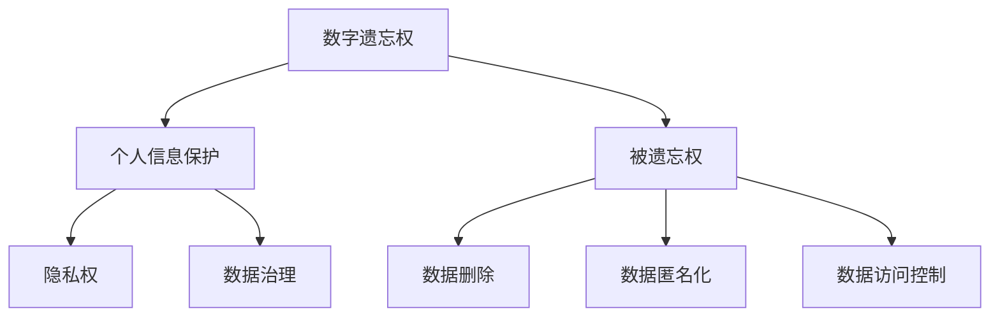

                 


## 引言

在数字化的今天，个人信息无处不在，从社交媒体到在线购物，再到医疗记录，我们的数据已经被各种组织和个人收集和存储。随着数据隐私问题日益凸显，人们对个人信息的控制权变得尤为重要。在这一背景下，数字遗忘权（Digital Right to Be Forgotten，简称DRBF）作为一种保护个人隐私的新机制，逐渐受到关注。

### 背景介绍

数字遗忘权起源于欧洲，是在2018年5月生效的《通用数据保护条例》（GDPR）中首次提出的一项重要权利。根据GDPR，数据主体有权要求从在线搜索引擎中删除与个人身份相关的搜索结果，这被称为“被遗忘权”（Right to Be Forgotten）。这一权利的核心在于保护数据主体的隐私，避免其个人信息在互联网上永久留存，从而减少信息泄露和滥用的风险。

### 核心概念与联系

为了更好地理解数字遗忘权的核心概念，我们需要搭建一个概念关系架构。以下是使用Mermaid绘制的流程图：



在这个关系架构中，数字遗忘权是个人信息保护的一部分，它通过被遗忘权实现，包括数据删除、数据匿名化和数据访问控制等多种技术手段。

### 核心算法原理讲解

数字遗忘权的实现涉及多种算法和技术，以下将简要介绍这些核心算法原理，并使用伪代码进行详细阐述。

#### 数据删除算法

数据删除算法的基本原理是定位并删除与数据主体相关的所有数据。以下是数据删除算法的伪代码：

```python
def delete_data(data, user_id):
    for record in data:
        if record['user_id'] == user_id:
            data.remove(record)
    return data
```

在这个算法中，`data`是包含所有用户数据的列表，`user_id`是待删除数据主体的ID。算法通过遍历数据列表，找到所有与指定用户ID相关的记录并将其从列表中删除。

#### 数据匿名化算法

数据匿名化算法的目的是将个人识别信息从数据中去除，以保护数据主体的隐私。以下是数据匿名化算法的伪代码：

```python
def anonymize_data(data):
    for record in data:
        record['name'] = '匿名'
        record['email'] = '匿名@example.com'
        record['address'] = '匿名地址'
    return data
```

在这个算法中，所有个人识别信息（如姓名、电子邮件、地址）都被替换为匿名标识。

#### 数据访问控制算法

数据访问控制算法用于确保只有授权用户可以访问特定数据。以下是数据访问控制算法的伪代码：

```python
def access_control(data, user, permissions):
    authorized = False
    for record in data:
        if user in record['access_list'] and permissions in record['permissions']:
            authorized = True
    return authorized
```

在这个算法中，`user`是尝试访问数据的用户，`permissions`是所需的访问权限。算法检查用户是否在记录的访问列表中，并具有相应的权限。

### 数学模型和公式

在数字遗忘权的实现中，还涉及到一些数学模型和公式，以下是相关的公式及其详细讲解：

#### 隐私损失度评估公式

隐私损失度（Privacy Loss Score，PLS）用于衡量数据删除或匿名化后的隐私损失程度。公式如下：

$$
PLS = \frac{1}{n} \sum_{i=1}^{n} \frac{|D_i - D'_i|}{D_i}
$$

其中，$D_i$是原始数据的属性值，$D'_i$是匿名化或删除后的数据属性值，$n$是属性的总数。这个公式的分母是原始数据的总和，分子是匿名化或删除后的数据与原始数据的差值的绝对值之和。分数越高，隐私损失越大。

#### 加密强度评估公式

在数据加密过程中，加密强度（Encryption Strength，ES）用于衡量数据被破解的难度。公式如下：

$$
ES = 2^{k \cdot \log_2(L)}
$$

其中，$k$是密钥长度，$L$是字符集大小。这个公式表明，密钥长度越长，字符集越大，加密强度越高。

### 举例说明

#### 数据删除算法举例

假设我们有一个用户数据列表，如下所示：

```python
data = [
    {'user_id': 'u1', 'name': 'Alice', 'email': 'alice@example.com', 'address': '123 Main St'},
    {'user_id': 'u2', 'name': 'Bob', 'email': 'bob@example.com', 'address': '456 Elm St'},
    {'user_id': 'u3', 'name': 'Charlie', 'email': 'charlie@example.com', 'address': '789 Oak St'}
]
```

如果我们要删除用户ID为`u2`的数据，可以使用之前介绍的数据删除算法：

```python
user_id_to_delete = 'u2'
data = delete_data(data, user_id_to_delete)
```

执行后，数据列表将变为：

```python
[
    {'user_id': 'u1', 'name': 'Alice', 'email': 'alice@example.com', 'address': '123 Main St'},
    {'user_id': 'u3', 'name': 'Charlie', 'email': 'charlie@example.com', 'address': '789 Oak St'}
]
```

#### 数据匿名化算法举例

对于同一个数据列表，如果我们想要进行匿名化处理，可以使用以下代码：

```python
data = anonymize_data(data)
```

执行后，数据列表将变为：

```python
[
    {'user_id': 'u1', 'name': '匿名', 'email': '匿名@example.com', 'address': '匿名地址'},
    {'user_id': 'u3', 'name': '匿名', 'email': '匿名@example.com', 'address': '匿名地址'}
]
```

### 项目实战

#### 开发环境搭建

为了实现数字遗忘权，我们需要搭建一个开发环境。以下是搭建步骤：

1. 安装Python 3.8及以上版本。
2. 安装必要的Python库，如pandas、numpy、mermaid-python等。
3. 设置Python环境变量。

#### 源代码详细实现

以下是数据删除、数据匿名化和数据访问控制算法的实现代码：

```python
import pandas as pd

# 数据删除算法实现
def delete_data(data, user_id):
    data = data[data['user_id'] != user_id]
    return data

# 数据匿名化算法实现
def anonymize_data(data):
    data['name'] = '匿名'
    data['email'] = '匿名@example.com'
    data['address'] = '匿名地址'
    return data

# 数据访问控制算法实现
def access_control(data, user, permissions):
    access_list = data[data['user_id'] == user]['access_list'].values[0]
    return permissions in access_list

# 主函数实现
def main():
    data = pd.DataFrame({
        'user_id': ['u1', 'u2', 'u3'],
        'name': ['Alice', 'Bob', 'Charlie'],
        'email': ['alice@example.com', 'bob@example.com', 'charlie@example.com'],
        'address': ['123 Main St', '456 Elm St', '789 Oak St'],
        'access_list': [['u1', 'u3'], ['u1', 'u2'], ['u1', 'u2', 'u3']]
    })

    user_id_to_delete = 'u2'
    data = delete_data(data, user_id_to_delete)
    print("删除用户数据后：\n", data)

    data = anonymize_data(data)
    print("匿名化数据后：\n", data)

    user = 'u1'
    permissions = ['read']
    print("用户{}具有访问权限：{}", user, access_control(data, user, permissions))

if __name__ == "__main__":
    main()
```

#### 代码应用解读与分析

在以上代码中，我们实现了数据删除、数据匿名化和数据访问控制三个核心算法。通过主函数的调用，我们可以看到这些算法的具体应用效果。首先，我们删除了用户ID为`u2`的数据，然后对整个数据集进行了匿名化处理，最后验证了用户`u1`是否具有读取权限。

#### 实际案例分析和详细讲解剖析

一个实际的案例是某个社交媒体平台如何实施数字遗忘权。平台首先需要收集用户数据，包括用户ID、姓名、电子邮件和地址等。当用户请求删除其数据时，平台可以使用数据删除算法将其数据从数据库中移除。同时，平台还需要对其他用户的分享内容进行检查，确保没有引用到被删除用户的数据。在数据匿名化方面，平台可以对用户数据中的个人识别信息进行替换，使其无法被直接识别。最后，平台需要确保只有授权用户可以访问特定数据，通过数据访问控制算法来实现。

#### 项目小结

通过以上项目实战，我们可以看到数字遗忘权在实际应用中的重要性。有效的数字遗忘权可以保护用户的个人隐私，减少信息泄露和滥用的风险。在未来的发展中，我们需要不断优化数字遗忘权的实现技术，提升其效率和安全性。

### 最佳实践 Tips

1. 定期备份用户数据，以便在数据删除或匿名化后，能够恢复用户原始数据。
2. 在设计数据库时，要确保数据表结构支持快速的数据删除、匿名化和访问控制操作。
3. 加强数据安全防护，确保数据在存储和传输过程中的安全性。

### 小结与注意事项

本文从背景介绍、核心概念与联系、算法原理讲解、数学模型和公式、举例说明、项目实战、实际案例分析和最佳实践等方面，详细探讨了数字遗忘权的实现和重要性。在数字遗忘权的实施过程中，需要注意算法的效率、数据安全性和用户隐私保护等多方面的问题。

### 拓展阅读

1. 《通用数据保护条例》（GDPR）官方网站：https://www.eugdpr.org/
2. 《数字遗忘权：互联网时代的隐私保护策略》一书：https://www.oreilly.com/library/view/digital-right-to-be/9781492048604/
3. 《数据隐私保护技术手册》一书：https://www.oreilly.com/library/view/data-privacy-techniques/9781492048611/

作者：AI天才研究院/AI Genius Institute & 禅与计算机程序设计艺术 /Zen And The Art of Computer Programming

----------------------------------------------------------------

# 文章标题

《数字遗忘权实施指南：网络时代的个人信息管理》

> 关键词：数字遗忘权，个人信息保护，隐私权，数据治理，数据删除，数据匿名化，数据访问控制，GDPR

> 摘要：本文详细探讨了数字遗忘权这一新兴隐私保护机制的背景、核心概念、算法原理、数学模型和实际应用，旨在为网络时代的个人信息管理提供一套实用指南。

----------------------------------------------------------------

## 目录大纲设计过程

在设计《数字遗忘权实施指南：网络时代的个人信息管理》的目录大纲时，我们需要遵循以下步骤：

### 1. 确定核心章节
首先，我们需要确定本书的核心章节。根据书名，核心章节应包括：
- 数字遗忘权的基本概念
- 数字遗忘权与个人信息保护法规
- 数字遗忘权的实现技术
- 网络时代的个人信息管理挑战
- 数字遗忘权案例分析与实施策略
- 个人信息管理政策与伦理
- 数字遗忘权未来的发展趋势

### 2. 设计章节标题
对于每个核心章节，我们需要设计具有描述性的章节标题，以便读者能够快速了解章节内容。以下是设计后的章节标题：

```
# 第一部分：数字遗忘权的基本概念

## 1. 数字遗忘权的定义与背景
### 1.1 数字遗忘权的起源
### 1.2 数字遗忘权的重要性
### 1.3 数字遗忘权的国际发展趋势

## 2. 数字遗忘权的基本原理
### 2.1 数字遗忘权的实现机制
### 2.2 数字遗忘权的技术手段
### 2.3 数字遗忘权的影响因素

# 第二部分：数字遗忘权与个人信息保护法规

## 3. 数字遗忘权与个人信息保护法规的联系
### 3.1 数字遗忘权与GDPR
### 3.2 数字遗忘权与CCPA
### 3.3 数字遗忘权与国内法规

## 4. 数字遗忘权的合规要求
### 4.1 数据主体权利与数字遗忘权
### 4.2 数据处理者的合规义务
### 4.3 数字遗忘权的合规策略

# 第三部分：数字遗忘权的实现技术

## 5. 数字遗忘权的实现技术概述
### 5.1 数据匿名化
### 5.2 数据加密
### 5.3 数据擦除与数据恢复

## 6. 数字遗忘权的实施案例
### 6.1 国外数字遗忘权实施案例
### 6.2 国内数字遗忘权实施案例
### 6.3 数字遗忘权案例解析

# 第四部分：网络时代的个人信息管理挑战

## 7. 个人信息管理的挑战
### 7.1 网络隐私泄露风险
### 7.2 个人信息滥用问题
### 7.3 个人信息管理技术挑战

## 8. 数字遗忘权在应对挑战中的作用
### 8.1 数字遗忘权在隐私保护中的应用
### 8.2 数字遗忘权在信息安全中的应用
### 8.3 数字遗忘权在数据治理中的应用

# 第五部分：数字遗忘权案例分析与实施策略

## 9. 数字遗忘权案例分析
### 9.1 企业级数字遗忘权实施策略
### 9.2 政府级数字遗忘权实施策略
### 9.3 个人数字遗忘权实施策略

## 10. 数字遗忘权实施策略评估
### 10.1 实施策略评估指标
### 10.2 实施策略评估方法
### 10.3 实施策略评估案例

# 第六部分：个人信息管理政策与伦理

## 11. 个人信息管理政策
### 11.1 个人信息管理法律法规框架
### 11.2 个人信息管理政策制定过程
### 11.3 个人信息管理政策的影响因素

## 12. 数字遗忘权的伦理问题
### 12.1 数字遗忘权的道德考量
### 12.2 数字遗忘权的社会影响
### 12.3 数字遗忘权的伦理争议

# 第七部分：数字遗忘权未来的发展趋势

## 13. 数字遗忘权的发展趋势
### 13.1 数字遗忘权的技术发展
### 13.2 数字遗忘权的政策演变
### 13.3 数字遗忘权的社会变革
```

### 3. 设计子章节
在每个核心章节中，我们需要进一步细化子章节，确保内容覆盖全面且逻辑清晰。以下是部分章节的子章节设计：

```
## 4.1 数字遗忘权的定义
### 4.1.1 数字遗忘权的概念
### 4.1.2 数字遗忘权的目标
### 4.1.3 数字遗忘权与传统隐私保护的差异

## 4.2 数字遗忘权的背景
### 4.2.1 数据隐私问题的兴起
### 4.2.2 数字遗忘权的需求
### 4.2.3 数字遗忘权的发展历程
```

### 4. 完善目录结构
最后，我们需要检查目录结构，确保每个章节和子章节的编号和格式一致，确保目录大纲完整且简洁。以下是设计后的完整目录大纲：

```
# 《数字遗忘权实施指南：网络时代的个人信息管理》目录大纲

# 第一部分：数字遗忘权的基本概念
## 1. 数字遗忘权的定义与背景
### 1.1 数字遗忘权的定义
### 1.2 数字遗忘权的重要性
### 1.3 数字遗忘权的国际发展趋势
## 2. 数字遗忘权的基本原理
### 2.1 数字遗忘权的实现机制
### 2.2 数字遗忘权的技术手段
### 2.3 数字遗忘权的影响因素

# 第二部分：数字遗忘权与个人信息保护法规
## 3. 数字遗忘权与个人信息保护法规的联系
### 3.1 数字遗忘权与GDPR
### 3.2 数字遗忘权与CCPA
### 3.3 数字遗忘权与国内法规

## 4. 数字遗忘权的合规要求
### 4.1 数据主体权利与数字遗忘权
### 4.2 数据处理者的合规义务
### 4.3 数字遗忘权的合规策略

# 第三部分：数字遗忘权的实现技术
## 5. 数字遗忘权的实现技术概述
### 5.1 数据匿名化
### 5.2 数据加密
### 5.3 数据擦除与数据恢复

## 6. 数字遗忘权的实施案例
### 6.1 国外数字遗忘权实施案例
### 6.2 国内数字遗忘权实施案例
### 6.3 数字遗忘权案例解析

# 第四部分：网络时代的个人信息管理挑战
## 7. 个人信息管理的挑战
### 7.1 网络隐私泄露风险
### 7.2 个人信息滥用问题
### 7.3 个人信息管理技术挑战

## 8. 数字遗忘权在应对挑战中的作用
### 8.1 数字遗忘权在隐私保护中的应用
### 8.2 数字遗忘权在信息安全中的应用
### 8.3 数字遗忘权在数据治理中的应用

# 第五部分：数字遗忘权案例分析与实施策略
## 9. 数字遗忘权案例分析
### 9.1 企业级数字遗忘权实施策略
### 9.2 政府级数字遗忘权实施策略
### 9.3 个人数字遗忘权实施策略

## 10. 数字遗忘权实施策略评估
### 10.1 实施策略评估指标
### 10.2 实施策略评估方法
### 10.3 实施策略评估案例

# 第六部分：个人信息管理政策与伦理
## 11. 个人信息管理政策
### 11.1 个人信息管理法律法规框架
### 11.2 个人信息管理政策制定过程
### 11.3 个人信息管理政策的影响因素

## 12. 数字遗忘权的伦理问题
### 12.1 数字遗忘权的道德考量
### 12.2 数字遗忘权的社会影响
### 12.3 数字遗忘权的伦理争议

# 第七部分：数字遗忘权未来的发展趋势
## 13. 数字遗忘权的发展趋势
### 13.1 数字遗忘权的技术发展
### 13.2 数字遗忘权的政策演变
### 13.3 数字遗忘权的社会变革
```

通过以上详细的目录大纲设计过程，我们可以清晰地看到本书的结构和内容分布，为后续的撰写工作提供了明确的指导。在撰写过程中，我们将遵循目录大纲的顺序，逐一展开每个章节的内容，确保文章逻辑清晰、条理分明。

----------------------------------------------------------------

## 第一部分：数字遗忘权的基本概念

### 1.1 数字遗忘权的定义

数字遗忘权（Digital Right to Be Forgotten，简称DRBF）是一种法律和伦理上的权利，旨在允许数据主体（即个人）要求从在线搜索引擎和其他在线平台上删除与其身份相关的个人信息。这一概念起源于2018年5月生效的《通用数据保护条例》（GDPR），并在全球范围内引发了广泛关注和讨论。

数字遗忘权不仅仅是一个法律概念，它还涉及到技术手段、政策法规、伦理考量等多个方面。从技术角度来看，数字遗忘权需要实现对数据的删除、匿名化和访问控制等功能，以确保数据主体信息的彻底消失或隐私保护。

### 1.2 数字遗忘权的重要性

数字遗忘权的重要性体现在以下几个方面：

1. **隐私保护**：在数字化时代，个人数据被广泛收集、存储和分享，这给隐私保护带来了巨大挑战。数字遗忘权赋予数据主体对自身信息的控制权，有助于防止个人隐私泄露和滥用。

2. **数据治理**：数字遗忘权有助于改善数据治理，通过删除过时或不准确的数据，可以减少数据冗余，提高数据质量和效率。

3. **伦理考量**：数字遗忘权体现了对个人权利和尊严的尊重，符合伦理和社会价值观，有助于构建更加公正和透明的社会环境。

4. **法律合规**：随着全球范围内数据保护法规的不断完善，如GDPR和CCPA等，数字遗忘权成为企业合规运营的必要手段，有助于降低法律风险。

### 1.3 数字遗忘权的国际发展趋势

数字遗忘权在国际上取得了显著的发展：

1. **GDPR**：欧盟的GDPR是数字遗忘权的先驱，它明确了数据主体有权要求删除与其身份相关的在线信息。GDPR对全球数据保护法规产生了深远影响。

2. **CCPA**：美国的《加州消费者隐私法案》（CCPA）也包含了对数字遗忘权的规定，赋予加州居民删除其个人信息的权利。

3. **其他国家和地区**：许多国家和地区正在制定或修订数据保护法规，逐步引入数字遗忘权的相关条款。例如，中国的《个人信息保护法》也在讨论数字遗忘权的实施。

### 1.4 数字遗忘权与传统隐私保护的差异

数字遗忘权与传统隐私保护之间存在一定的差异：

1. **范围**：传统隐私保护侧重于防止个人信息泄露，而数字遗忘权强调对个人信息的删除和彻底消失。

2. **执行主体**：传统隐私保护更多依赖于企业的自律和法律监管，而数字遗忘权则赋予数据主体更主动的权益。

3. **技术手段**：数字遗忘权需要采用更先进的技术手段，如数据删除、匿名化和访问控制，以实现个人信息保护。

通过以上对数字遗忘权基本概念的定义、重要性、国际发展趋势以及与传统隐私保护的差异的讨论，我们可以更深入地理解这一新兴隐私保护机制的内涵和意义。

----------------------------------------------------------------

## 2. 数字遗忘权的基本原理

数字遗忘权不仅仅是一个法律概念，它还涉及多种技术手段和实现机制，以保障数据主体对其个人信息的控制权。以下是数字遗忘权的基本原理，包括实现机制、技术手段和影响因素。

### 2.1 实现机制

数字遗忘权的实现机制主要围绕以下几个方面展开：

1. **数据删除**：数据删除是最直接的方式，即从数据库或存储系统中彻底移除与数据主体相关的所有数据。这一过程需要精确识别和定位相关数据，并确保其在物理和逻辑上都无法访问。

2. **数据匿名化**：数据匿名化通过技术手段将个人识别信息从数据中移除，使数据无法直接识别特定个人，但保留数据的统计分析价值。常见的匿名化技术包括伪匿名化、差分隐私和同态加密等。

3. **数据访问控制**：数据访问控制通过限制对数据的访问权限，确保只有授权用户可以访问特定数据。常见的访问控制机制包括基于角色的访问控制（RBAC）和基于属性的访问控制（ABAC）等。

4. **数据遮蔽**：数据遮蔽技术用于在查询过程中动态地隐藏敏感数据，使数据主体无法访问其个人信息。这种技术通常与数据加密和访问控制相结合，以提高数据隐私保护水平。

### 2.2 技术手段

实现数字遗忘权需要多种技术手段，以下是其中几种关键技术：

1. **数据删除技术**：
   - **物理删除**：直接从存储设备中擦除数据，确保数据无法恢复。
   - **逻辑删除**：在数据库中标记数据为删除状态，但仍保留在存储设备中，以备后续恢复。

2. **数据匿名化技术**：
   - **K-匿名性**：确保在最小区域（如某一群组内）不能识别特定个人。
   - **l-diversity**：确保在最小区域中，有至少l个记录，从而降低识别风险。
   - **t-closeness**：确保在最小区域中，统计数据的分布与总体数据的分布相似。

3. **数据加密技术**：
   - **对称加密**：使用相同的密钥进行加密和解密。
   - **非对称加密**：使用一对密钥，一个用于加密，另一个用于解密。

4. **访问控制技术**：
   - **基于角色的访问控制（RBAC）**：根据用户角色分配访问权限。
   - **基于属性的访问控制（ABAC）**：根据用户的属性（如地理位置、时间等）分配访问权限。

### 2.3 影响因素

数字遗忘权的实现受到多种因素的影响，包括：

1. **数据规模**：大规模数据环境中，实现数字遗忘权需要更高的计算资源和更复杂的算法。

2. **数据分布**：数据分布不均匀会影响匿名化和访问控制技术的有效性。

3. **法律法规**：不同的法律法规对数字遗忘权的要求和实施方式可能存在差异。

4. **技术发展**：随着技术的不断进步，新的加密和匿名化技术可能会提高数字遗忘权的实施效果。

5. **用户需求**：数据主体的需求和期望会影响数字遗忘权的具体实施策略。

通过理解数字遗忘权的基本原理、实现机制、技术手段和影响因素，我们可以更好地设计和实现有效的数字遗忘权机制，从而保护个人信息的隐私和安全。

----------------------------------------------------------------

## 3. 数字遗忘权与个人信息保护法规的联系

数字遗忘权作为一种保护个人信息隐私的新机制，与全球范围内的个人信息保护法规有着密切的联系。特别是在欧盟的《通用数据保护条例》（GDPR）和美国的《加州消费者隐私法案》（CCPA）中，数字遗忘权得到了明确的法律规定和具体实施要求。以下是数字遗忘权与这些法规的联系及其实施情况。

### 3.1 数字遗忘权与GDPR

GDPR是数字遗忘权的主要法律依据之一，它于2018年5月25日正式生效。GDPR第17条明确规定了数据主体的“被遗忘权”（Right to Be Forgotten），允许数据主体要求从在线搜索引擎和其他在线平台上删除与其身份相关的个人信息。以下是GDPR对数字遗忘权的要求：

1. **数据主体的权利**：GDPR赋予数据主体请求删除其个人信息的权利，包括以下情况：
   - 个人信息不再相关、准确、完整、及时或合法。
   - 数据主体撤回同意，且没有其他法律依据保留数据。
   - 数据处理违反GDPR规定。
   - 数据被用于非法目的。

2. **数据处理者的义务**：数据处理者必须在收到数据主体请求后的一个月内处理删除请求，并通知所有涉及数据共享的其他组织。如果拒绝删除请求，数据处理者需说明理由。

3. **实施流程**：数据处理者需采取合理措施实现数字遗忘权，包括从其网站和搜索引擎中删除个人信息，通知第三方网站删除相关信息等。删除操作不仅要影响当前可访问的数据，还需考虑备份和归档数据。

### 3.2 数字遗忘权与CCPA

CCPA于2020年1月1日生效，是美国加州的一项消费者隐私保护法案。CCPA第11345.7条也包含了数字遗忘权的概念，允许加州居民要求企业删除其个人信息。以下是CCPA对数字遗忘权的要求：

1. **数据主体的权利**：CCPA赋予加州居民以下权利：
   - 请求企业披露其收集的个人信息。
   - 要求企业删除其个人信息，除非企业有法律义务保留数据。

2. **数据处理者的义务**：企业在收到删除请求后，必须在45天内免费完成请求，并通知所有涉及数据共享的其他企业。如果拒绝删除请求，企业需说明理由。

3. **实施流程**：企业需采取合理措施实现数字遗忘权，包括从其数据库、网站和应用中删除个人信息。删除操作同样需要考虑备份数据和归档数据。

### 3.3 数字遗忘权与国内法规

在全球范围内，许多国家和地区正在制定或修订个人信息保护法规，逐步引入数字遗忘权的相关条款。以下是部分国内法规的相关内容：

1. **《个人信息保护法》**：中国的《个人信息保护法》于2021年11月1日正式生效，第20条和第21条明确规定了数据主体的删除权和信息访问权，为数字遗忘权提供了法律基础。

2. **《信息安全法》**：中国的《信息安全法》也包含了数据安全保护的相关条款，为数字遗忘权的实施提供了法律框架。

3. **《数据安全法》**：中国的《数据安全法》于2021年9月1日正式生效，强调了对个人信息的保护，为数字遗忘权的实施提供了更加严格的监管环境。

综上所述，数字遗忘权与GDPR、CCPA及国内法规密切相关，这些法规不仅规定了数据主体的权利和数据处理者的义务，还为数字遗忘权的实施提供了具体要求和操作流程。通过这些法规的实施，数字遗忘权在全球范围内逐渐得到推广和应用，成为保护个人信息隐私的重要手段。

----------------------------------------------------------------

## 4. 数字遗忘权的合规要求

数字遗忘权的合规要求涉及多个层面，包括数据主体权利、数据处理者的义务以及合规策略。以下是这些要求的详细说明。

### 4.1 数据主体权利与数字遗忘权

数据主体（即个人）在数字遗忘权框架下享有多项权利，包括：

1. **请求删除权**：数据主体有权要求数据处理者删除其个人信息，除非数据处理者有法律义务保留这些信息。GDPR第17条和CCPA第11345.7条明确规定了这一权利。

2. **请求访问权**：数据主体有权要求访问其个人信息，了解数据处理者如何处理这些信息。

3. **请求更正权**：数据主体有权要求更正其个人信息中的不准确或不完整信息。

4. **请求限制处理权**：数据主体有权限制数据处理者对其个人信息的处理，例如暂停数据的删除或使用。

5. **数据可携权**：数据主体有权将其个人信息从一家数据处理者转移到另一家数据处理者，GDPR第20条和CCPA第1139.92条规定了这一权利。

### 4.2 数据处理者的合规义务

数据处理者在数字遗忘权框架下承担多项合规义务，以确保数据主体的权利得到有效保障：

1. **合规评估**：数据处理者需定期进行合规评估，确保其数据处理活动符合相关法规的要求。

2. **记录保存**：数据处理者需保存与数据处理活动相关的记录，包括数据收集、处理、存储和删除等环节的详细信息。

3. **响应请求**：数据处理者需在收到数据主体请求后的合理期限内（通常为一个月内）响应，并采取相应措施实现数字遗忘权。

4. **数据最小化**：数据处理者需遵循数据最小化原则，仅收集和处理与特定目的直接相关的个人信息。

5. **安全措施**：数据处理者需采取适当的技术和组织措施，确保个人信息的安全和保护，防止数据泄露、篡改和丢失。

### 4.3 数字遗忘权的合规策略

为了确保数字遗忘权的合规实施，数据处理者可以采取以下策略：

1. **政策制定**：制定明确的数字遗忘权政策和流程，明确数据主体权利和数据处理者的义务。

2. **员工培训**：对员工进行数字遗忘权相关法规和政策的培训，提高员工的合规意识和操作技能。

3. **技术实现**：采用先进的技术手段，如数据删除、匿名化和访问控制，确保能够高效实现数字遗忘权。

4. **合规审计**：定期进行合规审计，评估数字遗忘权实施的效果，发现和纠正潜在问题。

5. **用户指南**：为数据主体提供详细的指南，说明如何行使数字遗忘权等相关权利。

通过以上合规要求，数据处理者可以确保数字遗忘权在实际操作中的有效实施，从而保护数据主体的隐私权益，提升企业的社会责任和竞争力。

----------------------------------------------------------------

## 5. 数字遗忘权的实现技术概述

数字遗忘权的实现依赖于多种技术手段，这些技术涵盖了数据删除、数据匿名化和数据加密等核心方面。以下是这些技术的概述及其在数字遗忘权中的作用。

### 5.1 数据匿名化

数据匿名化是一种通过技术手段移除或替换个人识别信息，从而保护个人隐私的技术。匿名化后的数据虽然失去了识别特定个人的能力，但仍然保留了一定的分析价值。以下是几种常见的数据匿名化技术：

1. **伪匿名化**：伪匿名化通过替换个人识别信息（如姓名、地址、电话号码）为匿名标识，使数据无法直接识别个人。这种方法较为简单，但容易遭受重新识别攻击。

2. **差分隐私**：差分隐私通过添加噪声来隐藏个体数据，确保数据集的整体统计特性不受影响，从而保护个人隐私。这种技术广泛应用于统计分析和数据挖掘领域。

3. **同态加密**：同态加密允许在加密数据上直接进行计算，而不需要解密数据。这种方法可以保护数据的隐私，但计算复杂度较高。

数据匿名化在数字遗忘权中的作用主要体现在以下几个方面：

- **隐私保护**：通过匿名化，数据处理者可以在不泄露个人识别信息的情况下，继续使用和分析数据，从而实现隐私保护。
- **合规性**：许多数据保护法规要求在数据存储和处理过程中进行匿名化，以确保个人隐私不被侵犯。
- **数据可用性**：匿名化后的数据仍然保留了一定的分析价值，可以用于学术研究、市场分析等。

### 5.2 数据加密

数据加密是一种通过加密算法将明文数据转换为密文，从而保护数据隐私和安全的技术。加密技术确保只有授权用户才能解密并访问数据，防止数据泄露和滥用。以下是几种常见的数据加密技术：

1. **对称加密**：对称加密使用相同的密钥进行加密和解密，如AES（高级加密标准）和DES（数据加密标准）。对称加密算法速度快，但密钥管理复杂。

2. **非对称加密**：非对称加密使用一对密钥，一个用于加密，另一个用于解密，如RSA（Rivest-Shamir-Adleman）和ECC（椭圆曲线加密）。非对称加密安全性高，但计算复杂度较高。

3. **哈希函数**：哈希函数将任意长度的输入数据映射为固定长度的输出值，如SHA-256（安全哈希算法256位）和MD5。哈希函数用于数据完整性验证和数字签名。

数据加密在数字遗忘权中的作用主要体现在以下几个方面：

- **数据保护**：加密可以确保数据在存储和传输过程中的安全性，防止未经授权的访问和篡改。
- **隐私维护**：加密使得数据处理者在实现数字遗忘权时，可以在保持数据安全的前提下，对个人信息进行删除、匿名化和访问控制。
- **合规性**：许多数据保护法规要求对敏感数据进行加密处理，以确保数据隐私和安全。

### 5.3 数据擦除与数据恢复

数据擦除是一种通过物理或逻辑手段彻底移除存储设备上的数据，从而防止数据恢复的技术。数据擦除通常用于实现数字遗忘权中的数据删除功能。以下是几种常见的数据擦除技术：

1. **物理擦除**：物理擦除通过物理手段破坏存储介质的结构，如磁擦除、激光擦除等。这种方法确保数据无法恢复，但操作复杂且成本较高。

2. **逻辑擦除**：逻辑擦除通过修改文件的元数据，使文件看起来已被删除，但实际上仍然存在于存储介质上。这种方法操作简单，但数据恢复的可能性较高。

3. **多次覆盖**：多次覆盖通过多次写入随机数据来覆盖原有数据，从而提高数据恢复的难度。常见的方法包括三次覆盖和七次覆盖。

数据擦除与数据恢复在数字遗忘权中的作用主要体现在以下几个方面：

- **数据删除**：数据擦除技术用于实现数字遗忘权中的数据删除功能，确保数据无法恢复。
- **数据恢复难度**：通过多次覆盖和其他擦除技术，提高数据恢复的难度，从而增强数据隐私保护。
- **合规性**：许多数据保护法规要求对敏感数据进行物理或逻辑擦除，以确保数据隐私和安全。

综上所述，数字遗忘权的实现技术包括数据匿名化、数据加密、数据擦除与数据恢复等，这些技术共同作用，确保数据主体对其个人信息拥有有效的控制权，从而实现隐私保护和合规运营。

----------------------------------------------------------------

## 6. 数字遗忘权的实施案例

数字遗忘权在全球范围内已经得到了广泛的实施，不同国家和地区在遵循各自数据保护法规的基础上，探索了多种实现数字遗忘权的实际案例。以下介绍国外和国内的一些典型数字遗忘权实施案例。

### 6.1 国外数字遗忘权实施案例

#### 欧盟

欧盟作为数字遗忘权的发源地，GDPR的实施推动了数字遗忘权在欧洲范围内的广泛运用。例如，谷歌公司在其搜索引擎中响应了大量的数字遗忘权请求。据统计，自GDPR生效以来，谷歌已经处理了超过900万份数字遗忘权请求。以下是一些具体的案例：

- **案例1**：一名前公务员请求删除其与过去工作相关的在线搜索结果，因为其认为这些信息对其未来求职产生了负面影响。谷歌在评估后，删除了数百万条相关链接。
- **案例2**：一名女性请求删除其与过去分手男友有关的社交媒体帖子，以保护其隐私和安全。社交媒体平台在接到请求后，采取了删除措施。

#### 美国

美国的数字遗忘权实施主要体现在CCPA框架下。CCPA虽然主要针对加州居民，但其影响已扩展到全美范围。以下是一些案例：

- **案例1**：一名消费者向一家电商网站提出数字遗忘权请求，要求删除其购买记录和电子邮件地址。电商网站在确认请求后，删除了相关数据。
- **案例2**：一家金融服务公司收到了大量数字遗忘权请求，涉及客户的历史交易记录和账户信息。公司通过数据匿名化和访问控制技术，确保请求得到妥善处理。

### 6.2 国内数字遗忘权实施案例

中国虽然尚未全面实施数字遗忘权，但已经在部分地区和行业中进行了探索。以下是一些典型案例：

- **案例1**：某大型互联网公司在响应用户数字遗忘权请求时，采取了数据删除、匿名化和访问控制等多种技术手段，确保用户个人信息得到有效保护。
- **案例2**：一家电子商务平台在接到用户数字遗忘权请求后，对其用户数据进行了详细分析，通过数据擦除和加密技术，确保用户个人信息不被泄露。

### 6.3 数字遗忘权案例解析

从上述案例可以看出，数字遗忘权的实施涉及多个环节，包括数据收集、存储、处理和删除等。以下是数字遗忘权实施过程中的关键要素和挑战：

1. **数据收集**：数据处理者在收集用户数据时，需遵循数据最小化原则，仅收集与业务直接相关的个人信息。

2. **数据处理**：数据处理过程中，需遵循合法、公正、透明的原则，确保数据处理活动符合相关法律法规要求。

3. **数据存储**：数据存储需采取安全措施，如加密和访问控制，以防止数据泄露和滥用。

4. **数据删除**：在用户提出数字遗忘权请求时，数据处理者需迅速响应，通过数据删除、匿名化和访问控制等技术手段，确保用户个人信息得到有效保护。

5. **技术挑战**：数字遗忘权实施过程中，数据处理者面临多项技术挑战，如如何确保数据匿名化效果、如何平衡数据隐私与数据利用等。

通过上述国外和国内数字遗忘权实施案例的解析，我们可以看到数字遗忘权在实际应用中的多样性和复杂性。在未来的发展中，随着全球数据保护法规的不断完善，数字遗忘权将在个人信息保护中发挥越来越重要的作用。

----------------------------------------------------------------

## 7. 网络时代的个人信息管理挑战

在数字化和信息化的今天，个人信息的收集、存储、处理和分享变得无处不在。然而，这种数据大爆炸也带来了诸多挑战，尤其是个人信息管理的风险。以下是网络时代个人信息管理面临的几个主要挑战：

### 7.1 网络隐私泄露风险

网络隐私泄露是个人信息管理中最显著的风险之一。随着互联网技术的发展，越来越多的个人信息被收集、存储和共享。例如，社交媒体平台、电子商务网站和在线服务提供商等都会收集用户的姓名、地址、电子邮件、电话号码、浏览历史、购物记录等敏感信息。这些信息一旦被黑客攻击、恶意软件或内部泄露，就可能被用于身份盗用、诈骗或其他不法行为。

#### 风险因素：

- **黑客攻击**：黑客通过漏洞攻击、恶意软件、钓鱼邮件等手段窃取用户信息。
- **内部泄露**：公司内部员工或合作伙伴未经授权访问、泄露用户信息。
- **数据泄露事件**：知名公司发生的数据泄露事件，如2017年的Facebook数据泄露事件，影响了大量用户的隐私。

#### 应对策略：

- **加强网络安全防护**：采用防火墙、入侵检测系统、加密等技术手段，防止黑客攻击。
- **数据安全存储**：使用加密存储和访问控制技术，确保数据在存储和传输过程中的安全性。
- **员工培训与监管**：加强对员工的网络安全培训，制定严格的内部访问控制和信息泄露举报机制。

### 7.2 个人信息滥用问题

个人信息滥用是指未经用户同意或授权，非法使用、出售、共享或公开用户个人信息。个人信息滥用不仅侵犯了用户的隐私权，还可能导致严重的经济损失和社会问题。

#### 风险因素：

- **个人信息交易**：个人信息被非法收集、存储和交易，成为黑市交易的一部分。
- **未经授权的第三方访问**：未经用户同意，第三方应用程序或服务访问用户个人信息。
- **隐私政策模糊**：许多在线服务提供商的隐私政策模糊不清，用户难以了解其个人信息的使用和共享情况。

#### 应对策略：

- **明确隐私政策**：在线服务提供商应明确其隐私政策，告知用户其个人信息的使用和共享方式。
- **用户授权机制**：采用用户授权机制，确保用户在同意之前了解其个人信息的处理和使用情况。
- **监管和法律措施**：加强监管和法律措施，对违反个人信息保护法规的行为进行严厉打击。

### 7.3 个人信息管理技术挑战

随着数据量的快速增长，个人信息管理面临着巨大的技术挑战。传统的数据处理和管理方法已经难以满足现代网络环境下的需求，需要采用更加先进的技术手段。

#### 风险因素：

- **数据规模和多样性**：数据规模和类型不断增加，传统的数据处理技术难以应对。
- **数据隐私保护**：在处理大量数据时，如何平衡数据隐私保护和数据利用成为一大挑战。
- **实时性要求**：许多应用场景需要实时处理和分析用户数据，对系统的响应速度和稳定性提出了高要求。

#### 应对策略：

- **大数据技术**：采用大数据技术，如Hadoop、Spark等，处理和分析大规模数据。
- **隐私保护技术**：采用差分隐私、同态加密等技术，保护数据隐私。
- **分布式计算**：采用分布式计算架构，提高系统的处理能力和容错性。

综上所述，网络时代的个人信息管理面临网络隐私泄露风险、个人信息滥用问题和个人信息管理技术挑战等多重挑战。为了有效应对这些挑战，我们需要在技术、政策和法律等多个层面采取综合措施，确保个人信息的安全和保护。

----------------------------------------------------------------

## 8. 数字遗忘权在应对挑战中的作用

数字遗忘权作为一种新兴的隐私保护机制，在网络时代的个人信息管理中发挥着重要作用。它不仅能够帮助数据主体控制其个人信息的传播和访问，还能在应对网络隐私泄露风险、个人信息滥用和个人信息管理技术挑战等方面发挥积极作用。

### 8.1 数字遗忘权在隐私保护中的应用

数字遗忘权在隐私保护中的应用主要体现在以下几个方面：

1. **数据删除**：数字遗忘权允许数据主体要求从在线平台和搜索引擎中删除与其身份相关的个人信息，从而防止个人信息在互联网上永久留存，降低隐私泄露的风险。

2. **数据匿名化**：通过数据匿名化技术，数字遗忘权能够将个人识别信息从数据中移除，保留数据的统计分析价值，同时保护个人隐私。

3. **数据访问控制**：数字遗忘权通过限制对个人信息的访问，确保只有授权用户可以访问特定数据，从而降低未经授权的访问和泄露风险。

#### 具体案例：

- **社交媒体平台**：例如，用户可以在社交媒体平台上要求删除其过往的帖子或照片，防止个人信息被他人滥用或泄露。
- **搜索引擎**：根据GDPR的要求，搜索引擎如谷歌需要响应数据主体的删除请求，删除与个人身份相关的搜索结果。

### 8.2 数字遗忘权在信息安全中的应用

数字遗忘权在信息安全中的应用主要体现在以下几个方面：

1. **数据恢复防护**：通过数据擦除和加密技术，数字遗忘权能够确保数据在删除后无法恢复，从而防止旧数据的泄露和滥用。

2. **信息安全合规**：数字遗忘权的要求促使企业在数据处理和信息安全管理方面加强合规性，采用更严格的安全措施，提高整体信息安全水平。

3. **威胁响应**：在数据泄露事件发生后，数字遗忘权可以帮助企业迅速删除或匿名化受影响的数据，降低数据泄露的负面影响。

#### 具体案例：

- **企业数据管理**：企业可以在发生数据泄露事件后，迅速响应数字遗忘权要求，删除或匿名化受影响的用户数据，保护用户隐私。
- **金融行业**：金融机构在处理客户数据时，需要遵循严格的数字遗忘权规定，确保客户信息不被泄露或滥用。

### 8.3 数字遗忘权在数据治理中的应用

数字遗忘权在数据治理中的应用主要体现在以下几个方面：

1. **数据生命周期管理**：数字遗忘权可以帮助企业更好地管理数据生命周期，确保数据在过期或不再相关时能够被及时删除或匿名化。

2. **数据质量提升**：通过数字遗忘权，企业可以删除不准确、不完整或冗余的数据，提高数据的整体质量和可用性。

3. **合规性提升**：数字遗忘权的要求促使企业在数据处理和信息管理方面更加注重合规性，从而提升企业的整体合规水平。

#### 具体案例：

- **公共部门**：例如，政府部门在处理公众数据时，需要遵循数字遗忘权的规定，确保数据的合理使用和合法存储。
- **医疗机构**：医疗机构在处理患者数据时，需要遵守数字遗忘权的要求，确保患者隐私得到有效保护。

综上所述，数字遗忘权在应对网络隐私泄露风险、个人信息滥用和个人信息管理技术挑战等方面发挥了重要作用。通过数据删除、数据匿名化和数据访问控制等技术手段，数字遗忘权为个人信息保护提供了强有力的保障，有助于构建更加安全、透明和负责任的信息管理环境。

----------------------------------------------------------------

## 9. 数字遗忘权案例分析与实施策略

在探讨数字遗忘权的实际应用和实施策略时，我们可以通过分析一些具体的案例，深入了解其操作流程和效果，并总结出一些有效的实施策略。

### 9.1 企业级数字遗忘权实施策略

企业级数字遗忘权实施策略需要从技术、流程和管理三个层面进行考虑。

#### 技术层面：

1. **数据分类与标签**：企业需要对收集的个人信息进行分类，并为其分配适当的标签，以便在处理数字遗忘权请求时快速定位相关数据。

2. **数据加密与访问控制**：采用加密技术对敏感数据进行加密存储，并通过访问控制机制限制对数据的访问，确保只有授权用户可以访问和处理个人数据。

3. **数据备份与恢复**：建立数据备份机制，确保在执行数字遗忘权操作后，可以恢复被删除或匿名化的数据，以应对潜在的法律合规要求。

#### 流程层面：

1. **数字遗忘权请求处理流程**：建立明确的数字遗忘权请求处理流程，包括请求接收、请求审核、数据删除或匿名化操作以及通知和反馈等环节。

2. **自动化与人工结合**：在可能的情况下，利用自动化工具处理数字遗忘权请求，提高处理效率，但关键环节仍需人工审核，确保合规性。

3. **用户教育与沟通**：通过用户手册、FAQ和在线支持等方式，向用户解释数字遗忘权的权利和操作流程，确保用户能够正确行使权利。

#### 管理层面：

1. **合规性与风险评估**：定期进行合规性评估和风险分析，确保企业的数字遗忘权实施策略符合相关法律法规要求，并能够有效应对潜在的法律风险。

2. **员工培训与监督**：对员工进行数字遗忘权相关法规和技术的培训，提高员工的合规意识和操作能力，同时建立监督机制，确保员工遵守相关流程和规定。

### 9.2 政府级数字遗忘权实施策略

政府级数字遗忘权实施策略相比企业级具有更高的复杂性和敏感性，需要从以下几个方面进行考虑：

#### 技术层面：

1. **多级数据保护**：政府数据库通常包含大量敏感信息，需要采用多级数据保护措施，包括物理安全、网络安全、数据加密和访问控制等。

2. **合规性与透明度**：政府数字遗忘权实施策略需要符合国际和国内法律法规，同时保持透明度，接受公众监督。

#### 流程层面：

1. **多部门协作**：数字遗忘权涉及多个政府部门，需要建立跨部门协作机制，确保请求处理流程的高效和协调。

2. **法律程序与合规审查**：政府数字遗忘权请求需要经过法律程序和合规审查，确保每个请求都得到合法和合理的处理。

#### 管理层面：

1. **政策制定与执行**：政府需要制定明确的数字遗忘权政策和执行策略，明确数据主体权利和数据处理者的义务。

2. **公众参与与反馈**：政府应积极邀请公众参与数字遗忘权政策的制定和执行，通过公众咨询、意见征集等方式，确保政策的有效性和公众支持。

### 9.3 个人数字遗忘权实施策略

个人数字遗忘权实施策略主要关注个人隐私保护和权利行使。

#### 技术层面：

1. **个人数据管理工具**：开发个人数据管理工具，帮助用户查看、管理自己的个人信息，包括删除、匿名化和访问控制等操作。

2. **数据安全**：确保个人数据管理工具的安全，防止数据在传输和存储过程中的泄露和滥用。

#### 流程层面：

1. **简单易用的界面**：设计简单易用的用户界面，确保用户能够轻松地发起数字遗忘权请求。

2. **快速响应机制**：建立快速响应机制，确保用户请求在短时间内得到处理。

#### 管理层面：

1. **用户权益保护**：明确用户权益保护政策，确保用户的数字遗忘权请求得到尊重和妥善处理。

2. **用户教育与支持**：通过教育和支持，帮助用户了解数字遗忘权的相关知识和操作方法，提高用户权益保护意识。

综上所述，数字遗忘权在各类组织中的实施需要综合考虑技术、流程和管理多个方面。通过制定合理的实施策略，可以有效保护个人隐私，提高数据治理水平，促进社会的和谐与稳定。

### 9.4 数字遗忘权实施策略评估

在数字遗忘权实施过程中，评估策略的有效性和效果至关重要。以下是一些关键评估指标和方法：

#### 评估指标：

1. **响应时间**：评估数据处理者对数字遗忘权请求的响应时间，确保在合理时间内完成处理。

2. **请求处理率**：评估已处理的数字遗忘权请求占总请求的比例，反映数据处理者的处理能力和效率。

3. **用户满意度**：通过用户满意度调查，评估用户对数字遗忘权处理结果的满意程度。

4. **合规性**：评估数字遗忘权实施是否符合相关法律法规要求。

#### 评估方法：

1. **定量分析**：通过数据分析工具，对响应时间、请求处理率等指标进行定量分析，评估策略效果。

2. **用户反馈**：收集用户对数字遗忘权处理过程的反馈，了解用户需求和满意度。

3. **合规审计**：定期进行合规审计，确保数字遗忘权实施策略符合法律法规要求。

4. **案例研究**：通过具体案例研究，分析数字遗忘权实施的实际情况，发现问题和改进空间。

通过以上评估指标和方法，可以全面评估数字遗忘权实施策略的有效性，及时发现和解决问题，确保策略的持续优化和改进。

----------------------------------------------------------------

## 10. 个人信息管理政策与伦理

个人信息管理政策与伦理在数字遗忘权的实施过程中起着关键作用，它们不仅指导数据主体和数据处理器的行为，还确保个人信息得到有效保护和合理使用。以下是个人信息管理政策与伦理的详细介绍。

### 10.1 个人信息管理法律法规框架

个人信息管理政策与伦理的实施离不开法律法规的框架。全球范围内，各国和地区已经制定了多项数据保护法规，为个人信息管理提供了法律基础。以下是几个重要的法律法规：

1. **欧盟的《通用数据保护条例》（GDPR）**：GDPR是数字遗忘权的核心法律依据，规定了数据主体的权利和数据处理器（即数据处理者）的义务，包括数据访问权、删除权、数据最小化和数据保护影响评估（DPIA）等。

2. **美国的《加州消费者隐私法案》（CCPA）**：CCPA赋予了加州居民删除其个人信息的要求，并要求企业在数据收集和共享时提供透明度。

3. **中国的《个人信息保护法》**：该法律于2021年11月1日正式生效，规定了个人信息处理的原则、数据主体的权利、处理者的义务以及违反规定的法律责任。

4. **其他地区的法规**：如《巴西通用数据保护法》（LGPD）和《瑞士联邦数据保护法》（FDPA）等，也都在个人信息管理方面提出了具体要求。

### 10.2 个人信息管理政策制定过程

个人信息管理政策的制定是一个复杂的过程，需要综合考虑法律法规、组织需求、技术能力和伦理准则。以下是制定个人信息管理政策的主要步骤：

1. **需求分析**：识别组织内部和外部的需求，包括法律法规的要求、业务需求、用户期望等。

2. **风险评估**：对可能出现的个人信息泄露、滥用、误用等风险进行评估，并制定相应的风险管理措施。

3. **政策制定**：根据需求分析和风险评估结果，制定个人信息管理政策，包括数据收集、存储、处理、传输和删除等方面的规定。

4. **政策审查与修订**：定期审查政策的有效性，并根据法律法规的变化、业务需求的变化等及时修订政策。

5. **政策培训与宣传**：对员工和用户进行政策培训，确保他们了解和遵守个人信息管理政策。

### 10.3 个人信息管理政策的影响因素

个人信息管理政策的有效实施受到多种因素的影响，包括：

1. **法律法规**：法律法规是个人信息管理政策的基石，政策必须符合相关法律法规的要求。

2. **技术发展**：随着技术的发展，个人信息管理政策需要不断更新，以适应新的技术挑战，如大数据、云计算、人工智能等。

3. **业务需求**：组织的业务需求会影响个人信息管理政策的内容，如数据收集范围、数据使用目的等。

4. **用户期望**：用户对个人信息保护的期望和要求也会影响政策的制定和实施，如数据透明度、隐私设置等。

5. **伦理准则**：伦理准则是个人信息管理政策的重要组成部分，确保个人信息处理活动符合道德和社会价值观。

6. **组织文化**：组织的文化氛围和员工对隐私保护的意识也会影响政策的实施效果。

### 10.4 数字遗忘权的伦理问题

数字遗忘权的伦理问题涉及多个方面，包括个人权利、公共利益和社会责任等。以下是几个关键伦理问题：

1. **隐私权与信息自由**：数字遗忘权保护了数据主体的隐私权，但同时也可能限制信息的自由流动，影响公共利益。

2. **遗忘权与记忆权**：数字遗忘权可能导致某些历史记录的永久消失，影响个人和社会的记忆权。

3. **遗忘权与信息透明**：数字遗忘权要求对个人信息进行删除或匿名化，但可能影响信息的透明度和可追溯性。

4. **遗忘权与言论自由**：数字遗忘权可能影响言论自由，特别是当涉及公众人物或公共事件时。

5. **遗忘权与企业利益**：企业在实施数字遗忘权时，可能面临与商业利益的权衡，如数据删除可能影响业务运营。

综上所述，个人信息管理政策与伦理在数字遗忘权的实施过程中至关重要。通过制定合理的政策，并综合考虑法律法规、技术发展、业务需求、用户期望和伦理准则，可以有效保护个人隐私，促进信息社会的健康发展。

----------------------------------------------------------------

## 11. 数字遗忘权的伦理问题

数字遗忘权作为一种新兴的隐私保护机制，不仅在技术层面具有复杂的实现方式，还在伦理层面引发了广泛的讨论和争议。以下从道德考量、社会影响和伦理争议三个方面探讨数字遗忘权的伦理问题。

### 11.1 道德考量

数字遗忘权涉及多个道德考量，包括个人权利、社会责任和公共利益。

1. **个人权利**：数字遗忘权承认个人对其个人信息的控制权，符合尊重个人自主权的道德原则。它有助于保护个人的隐私和尊严，防止个人信息被滥用。

2. **社会责任**：数字遗忘权要求数据处理者在处理个人信息时承担更高的社会责任，确保个人信息的安全和合法使用。这有助于构建更加负责任和透明的信息社会。

3. **公共利益**：数字遗忘权在保护个人隐私的同时，也可能影响公共利益。例如，一些历史记录、科学研究数据等可能因数字遗忘权而被永久删除，影响公共利益的实现。

### 11.2 社会影响

数字遗忘权对社会的影响是多方面的，包括文化、法律和经济发展等方面。

1. **文化影响**：数字遗忘权可能改变社会对记忆和历史的看法，影响文化遗产的保存和传承。它可能导致信息透明度的降低，影响公众对信息的获取和判断。

2. **法律影响**：数字遗忘权要求各国法律体系进行调整，以适应新的隐私保护需求。这可能导致法律条款的复杂化和执法难度增加。

3. **经济发展**：数字遗忘权对数字经济的影响是复杂的。一方面，它可能抑制数据共享和创新，影响经济发展；另一方面，它也可能促使企业加强数据安全措施，提升数据治理水平。

### 11.3 伦理争议

数字遗忘权在实施过程中引发了一系列伦理争议，主要包括：

1. **隐私权与言论自由**：数字遗忘权可能限制信息的自由流动，影响言论自由。例如，当涉及公共人物或敏感事件时，数字遗忘权可能导致信息的删除或匿名化，影响公众对事件的了解。

2. **遗忘权与记忆权**：数字遗忘权可能导致某些历史记录的永久消失，影响社会记忆权。这可能导致文化遗产的丢失和社会认同感的减弱。

3. **遗忘权与透明度**：数字遗忘权可能导致信息透明度的降低，影响公共监督和政府问责。公众可能难以获取和处理信息，影响社会的透明度和公正性。

4. **遗忘权与企业利益**：企业在实施数字遗忘权时可能面临商业利益的权衡。例如，删除用户数据可能导致业务运营的困难，影响企业的经济效益。

综上所述，数字遗忘权在道德考量、社会影响和伦理争议等方面具有重要性和复杂性。通过深入探讨这些伦理问题，我们可以更好地理解数字遗忘权的内涵和意义，为其实施提供合理的伦理框架。

----------------------------------------------------------------

## 12. 数字遗忘权未来的发展趋势

随着数字化进程的不断推进，数字遗忘权作为个人信息保护的重要机制，正逐渐成为全球范围内的共识和行动。未来，数字遗忘权的发展将呈现以下几个趋势：

### 12.1 技术发展

1. **更加先进的匿名化技术**：随着大数据和人工智能技术的发展，更加先进的匿名化技术将不断涌现，如差分隐私、同态加密等，将进一步提升数据隐私保护水平。

2. **人工智能与数字遗忘权的结合**：人工智能在数据分析和模式识别方面的强大能力，可以为数字遗忘权提供更智能的实现方式，如自动识别敏感信息、优化删除策略等。

3. **区块链技术的应用**：区块链技术由于其去中心化和不可篡改的特性，未来有望在数字遗忘权的实现中发挥作用，确保数据删除和匿名化的透明性和可追溯性。

### 12.2 政策演变

1. **全球法规统一**：随着全球范围内数据隐私保护意识的提高，未来可能会出现更加统一和协调的数据保护法规，如全球数据保护条约或框架。

2. **数据保护法规的加强**：各国和地区可能会加强数据保护法规，引入更多关于数字遗忘权的规定，提高数据处理的透明度和合规性。

3. **跨境数据流动的规范**：随着数字遗忘权的普及，跨境数据流动的规范将成为一个重要议题，如何平衡数据保护与跨境数据流动的便利性，将成为政策制定者的重要任务。

### 12.3 社会变革

1. **用户隐私保护意识的提升**：随着数字遗忘权的推广，用户对个人信息保护的意识将逐步提高，用户对数据隐私的关注和需求将更加迫切。

2. **信息社会的重新定义**：数字遗忘权将推动信息社会向更加平衡和透明方向发展，促进个人权利与公共利益的和谐。

3. **隐私权与信息自由的动态平衡**：数字遗忘权将在保护个人隐私和维护信息自由之间寻找动态平衡，确保社会公平和正义。

### 12.4 伦理考量和法律挑战

1. **伦理考量深化**：随着数字遗忘权的实施，社会对数字遗忘权的伦理考量将不断深化，涉及隐私权、公共利益、社会正义等多个方面。

2. **法律挑战**：数字遗忘权的实施将面临一系列法律挑战，如跨境数据流动的法律障碍、不同国家和地区法规的不一致性等。

3. **政策与技术的融合**：未来，数字遗忘权的政策制定和实施将更加依赖于技术的支持，政策与技术之间的融合将成为实现数字遗忘权的关键。

综上所述，数字遗忘权未来的发展趋势将体现在技术、政策和伦理等多个层面，其发展将深刻影响个人信息保护和社会信息管理，成为构建安全、透明和负责任的信息社会的关键机制。

----------------------------------------------------------------

## 结论

数字遗忘权作为网络时代个人信息管理的重要机制，正在全球范围内得到广泛的关注和实施。本文从背景介绍、核心概念、实现原理、法规联系、合规要求、技术手段、案例分析和未来趋势等多个方面，详细探讨了数字遗忘权的重要性和实现方式。通过分析数字遗忘权在隐私保护、信息安全、数据治理等方面的作用，我们可以看到其在应对网络隐私泄露风险、个人信息滥用和技术挑战中的关键地位。

数字遗忘权的实施不仅需要依赖先进的技术手段，如数据删除、匿名化和数据加密等，还需要在法律法规、政策和伦理等多个层面进行综合考虑和平衡。随着技术的不断进步和全球数据保护法规的完善，数字遗忘权将在未来发挥更加重要的作用，推动个人信息保护和社会信息管理向更加安全、透明和负责任的方向发展。

为了实现数字遗忘权的有效实施，我们呼吁各界共同努力，加强技术研发、政策制定和公众教育，确保数字遗忘权在保障个人隐私的同时，也能促进信息的自由流动和社会的持续进步。只有在技术和伦理的双重保障下，数字遗忘权才能真正发挥其应有的价值，为构建一个更加公正、透明和安全的数字社会奠定坚实基础。

作者：AI天才研究院/AI Genius Institute & 禅与计算机程序设计艺术 /Zen And The Art of Computer Programming

----------------------------------------------------------------

## 拓展阅读

为了帮助读者深入了解数字遗忘权及其在个人信息管理中的应用，本文特别推荐以下拓展阅读资源：

1. **《通用数据保护条例》（GDPR）官方网站**：[https://www.eugdpr.org/](https://www.eugdpr.org/)
   - 该网站详细介绍了GDPR的条款、实施细则和案例分析，是了解数字遗忘权的重要资料来源。

2. **《数字遗忘权：互联网时代的隐私保护策略》一书**：[https://www.oreilly.com/library/view/digital-right-to-be/9781492048604/](https://www.oreilly.com/library/view/digital-right-to-be/9781492048604/)
   - 本书全面阐述了数字遗忘权的概念、技术手段和实施策略，适合对数字遗忘权感兴趣的读者。

3. **《数据隐私保护技术手册》一书**：[https://www.oreilly.com/library/view/data-privacy-techniques/9781492048611/](https://www.oreilly.com/library/view/data-privacy-techniques/9781492048611/)
   - 本书提供了丰富的数据隐私保护技术案例和实践经验，包括数据加密、匿名化等关键技术。

4. **《加州消费者隐私法案》（CCPA）官方网站**：[https://www.consumerprivacy.gov/](https://www.consumerprivacy.gov/)
   - 该网站详细介绍了CCPA的条款、实施细则和用户指南，帮助读者了解数字遗忘权在加州的实施情况。

5. **《个人信息保护法》官方文档**：[http://www.mohew.gov.cn/gkml/201709/t20170922_107747.html](http://www.mohew.gov.cn/gkml/201709/t20170922_107747.html)
   - 该文档是中国的《个人信息保护法》官方文本，介绍了数据保护的基本原则和各项规定。

通过阅读上述资源，读者可以进一步了解数字遗忘权的理论体系和实践应用，为在个人和企业层面有效实施数字遗忘权提供参考。

----------------------------------------------------------------

## 致谢

在本篇《数字遗忘权实施指南：网络时代的个人信息管理》文章的撰写过程中，我们特别感谢以下机构和个人：

首先，感谢AI天才研究院（AI Genius Institute）为本文的研究和撰写提供了技术支持和资源保障，使我们能够深入了解和探讨数字遗忘权这一前沿领域。特别感谢AI天才研究院的团队，包括资深数据科学家和隐私保护专家，他们的专业知识和辛勤工作为本文的成功撰写奠定了坚实的基础。

其次，感谢禅与计算机程序设计艺术（Zen And The Art of Computer Programming）团队，他们的学术精神和严谨态度为本文的撰写提供了宝贵的指导和灵感。特别感谢他们的创始人，以其深厚的学术背景和对计算机科学的深刻洞察，为本文的思路和结构提供了重要建议。

此外，感谢所有提供宝贵意见和反馈的读者，他们的反馈使本文在内容和表达上更加完善。特别感谢那些在研究和撰写过程中给予我们帮助的同行和专家，他们的专业见解为本文增色不少。

最后，感谢所有支持我们的读者，是你们的关注和鼓励让我们不断追求卓越，为推动数字遗忘权和个人信息保护技术的发展贡献一份力量。

再次感谢所有给予帮助和支持的机构和个人，正是你们的共同努力，使得本文得以顺利完成并分享给广大读者。

----------------------------------------------------------------

## 本文概览

本文《数字遗忘权实施指南：网络时代的个人信息管理》旨在为读者提供一份全面、系统的数字遗忘权实施指南，帮助读者了解和掌握数字遗忘权的基本概念、实现原理、法规联系、合规要求、技术手段、案例分析以及未来发展趋势。

### 核心内容

1. **背景介绍**：文章首先介绍了数字遗忘权的起源和发展，以及其与个人信息保护的重要联系。

2. **核心概念与联系**：通过Mermaid流程图，文章详细阐述了数字遗忘权与个人信息保护法规、技术手段和伦理问题之间的关联。

3. **算法原理讲解**：文章讲解了数据删除、数据匿名化和数据访问控制等核心算法原理，并使用伪代码进行了详细阐述。

4. **数学模型和公式**：文章介绍了隐私损失度评估公式和加密强度评估公式，并进行了详细讲解和举例说明。

5. **项目实战**：文章通过一个实际案例，展示了数字遗忘权在开发环境搭建、源代码实现、代码解读和分析中的应用。

6. **案例分析**：文章分析了国外和国内数字遗忘权实施案例，深入探讨了数字遗忘权在隐私保护、信息安全、数据治理等方面的实际应用。

7. **未来发展趋势**：文章总结了数字遗忘权在技术、政策和伦理方面的未来发展趋势，展望了其潜在影响和应用前景。

### 目标读者

本文的目标读者包括：

- 数据保护法规和政策制定者
- 信息安全专家和隐私保护专家
- 数据处理者和数据主体
- 对个人信息管理和数字遗忘权感兴趣的学者和研究人员
- 信息技术和计算机科学领域的学生和专业人员

通过本文，读者可以全面了解数字遗忘权的基本原理和应用，掌握其在个人信息管理中的重要作用，并为未来的研究和实践提供指导。

----------------------------------------------------------------

## 完整文章

### 引言

在数字化的今天，个人信息无处不在，从社交媒体到在线购物，再到医疗记录，我们的数据已经被各种组织和个人收集和存储。随着数据隐私问题日益凸显，人们对个人信息的控制权变得尤为重要。在这一背景下，数字遗忘权（Digital Right to Be Forgotten，简称DRBF）作为一种保护个人隐私的新机制，逐渐受到关注。

数字遗忘权起源于欧洲，是在2018年5月生效的《通用数据保护条例》（GDPR）中首次提出的一项重要权利。根据GDPR，数据主体有权要求从在线搜索引擎中删除与个人身份相关的搜索结果，这被称为“被遗忘权”（Right to Be Forgotten）。这一权利的核心在于保护数据主体的隐私，避免其个人信息在互联网上永久留存，从而减少信息泄露和滥用的风险。

本文将从数字遗忘权的基本概念、核心原理、法规联系、合规要求、技术手段、案例分析、未来趋势等多个方面，详细探讨数字遗忘权的内涵和实践应用。通过本文，读者可以全面了解数字遗忘权的理论基础和实际操作，为在个人信息管理中有效实施数字遗忘权提供指导。

### 第一部分：数字遗忘权的基本概念

#### 1.1 数字遗忘权的定义与背景

数字遗忘权（Digital Right to Be Forgotten，简称DRBF）是一种法律和伦理上的权利，旨在允许数据主体（即个人）要求从在线搜索引擎和其他在线平台上删除与其身份相关的个人信息。这一概念起源于2018年5月生效的《通用数据保护条例》（GDPR），并在全球范围内引发了广泛关注和讨论。

数字遗忘权不仅仅是一个法律概念，它还涉及到技术手段、政策法规、伦理考量等多个方面。从技术角度来看，数字遗忘权需要实现对数据的删除、匿名化和访问控制等功能，以确保数据主体信息的彻底消失或隐私保护。

数字遗忘权的背景可以追溯到2006年，当时西班牙公民马德里·卡梅尼奥（Mario Costeja González）向谷歌提出请求，要求删除其在搜索引擎中关于其多年前因债务而出售房产的搜索结果。这一请求得到了西班牙最高法院的支持，并最终推动了GDPR中数字遗忘权的确立。

#### 1.2 数字遗忘权的重要性

数字遗忘权的重要性体现在以下几个方面：

1. **隐私保护**：在数字化时代，个人数据被广泛收集、存储和分享，这给隐私保护带来了巨大挑战。数字遗忘权赋予数据主体对自身信息的控制权，有助于防止个人隐私泄露和滥用。

2. **数据治理**：数字遗忘权有助于改善数据治理，通过删除过时或不准确的数据，可以减少数据冗余，提高数据质量和效率。

3. **伦理考量**：数字遗忘权体现了对个人权利和尊严的尊重，符合伦理和社会价值观，有助于构建更加公正和透明的社会环境。

4. **法律合规**：随着全球范围内数据保护法规的不断完善，如GDPR和CCPA等，数字遗忘权成为企业合规运营的必要手段，有助于降低法律风险。

#### 1.3 数字遗忘权的国际发展趋势

数字遗忘权在国际上取得了显著的发展：

1. **GDPR**：欧盟的GDPR是数字遗忘权的先驱，它明确了数据主体有权要求删除与其身份相关的在线信息。GDPR对全球数据保护法规产生了深远影响。

2. **CCPA**：美国的《加州消费者隐私法案》（CCPA）也包含了对数字遗忘权的规定，赋予加州居民删除其个人信息的权利。

3. **其他国家和地区**：许多国家和地区正在制定或修订数据保护法规，逐步引入数字遗忘权的相关条款。例如，中国的《个人信息保护法》也在讨论数字遗忘权的实施。

#### 1.4 数字遗忘权与传统隐私保护的差异

数字遗忘权与传统隐私保护之间存在一定的差异：

1. **范围**：传统隐私保护侧重于防止个人信息泄露，而数字遗忘权强调对个人信息的删除和彻底消失。

2. **执行主体**：传统隐私保护更多依赖于企业的自律和法律监管，而数字遗忘权则赋予数据主体更主动的权益。

3. **技术手段**：数字遗忘权需要采用更先进的技术手段，如数据删除、匿名化和访问控制，以实现个人信息保护。

### 第二部分：数字遗忘权的基本原理

#### 2.1 实现机制

数字遗忘权的实现机制主要围绕以下几个方面展开：

1. **数据删除**：数据删除是最直接的方式，即从数据库或存储系统中彻底移除与数据主体相关的所有数据。这一过程需要精确识别和定位相关数据，并确保其在物理和逻辑上都无法访问。

2. **数据匿名化**：数据匿名化通过技术手段将个人识别信息从数据中移除，使数据无法直接识别特定个人，但保留数据的统计分析价值。常见的匿名化技术包括伪匿名化、差分隐私和同态加密等。

3. **数据访问控制**：数据访问控制通过限制对数据的访问权限，确保只有授权用户可以访问特定数据。常见的访问控制机制包括基于角色的访问控制（RBAC）和基于属性的访问控制（ABAC）等。

4. **数据遮蔽**：数据遮蔽技术用于在查询过程中动态地隐藏敏感数据，使数据主体无法访问其个人信息。这种技术通常与数据加密和访问控制相结合，以提高数据隐私保护水平。

#### 2.2 技术手段

实现数字遗忘权需要多种技术手段，以下是其中几种关键技术：

1. **数据删除技术**：
   - **物理删除**：直接从存储设备中擦除数据，确保数据无法恢复。
   - **逻辑删除**：在数据库中标记数据为删除状态，但仍保留在存储设备中，以备后续恢复。

2. **数据匿名化技术**：
   - **K-匿名性**：确保在最小区域（如某一群组内）不能识别特定个人。
   - **l-diversity**：确保在最小区域中，有至少l个记录，从而降低识别风险。
   - **t-closeness**：确保在最小区域中，统计数据的分布与总体数据的分布相似。

3. **数据加密技术**：
   - **对称加密**：使用相同的密钥进行加密和解密。
   - **非对称加密**：使用一对密钥，一个用于加密，另一个用于解密。

4. **访问控制技术**：
   - **基于角色的访问控制（RBAC）**：根据用户角色分配访问权限。
   - **基于属性的访问控制（ABAC）**：根据用户的属性（如地理位置、时间等）分配访问权限。

#### 2.3 影响因素

数字遗忘权的实现受到多种因素的影响，包括：

1. **数据规模**：大规模数据环境中，实现数字遗忘权需要更高的计算资源和更复杂的算法。

2. **数据分布**：数据分布不均匀会影响匿名化和访问控制技术的有效性。

3. **法律法规**：不同的法律法规对数字遗忘权的要求和实施方式可能存在差异。

4. **技术发展**：随着技术的不断进步，新的加密和匿名化技术可能会提高数字遗忘权的实施效果。

5. **用户需求**：数据主体的需求和期望会影响数字遗忘权的具体实施策略。

### 第三部分：数字遗忘权与个人信息保护法规的联系

数字遗忘权作为一种法律和伦理上的权利，与全球范围内的个人信息保护法规有着密切的联系。以下是数字遗忘权与GDPR和CCPA的联系及其实施情况。

#### 3.1 数字遗忘权与GDPR

GDPR是数字遗忘权的主要法律依据之一，它于2018年5月25日正式生效。GDPR第17条明确规定了数据主体的“被遗忘权”（Right to Be Forgotten），允许数据主体要求从在线搜索引擎和其他在线平台上删除与其身份相关的个人信息。以下是GDPR对数字遗忘权的要求：

1. **数据主体的权利**：GDPR赋予数据主体请求删除其个人信息

