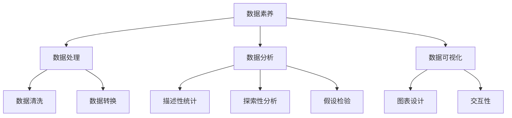

                 

### 文章标题：数据素养：在信息海洋中导航的生存技能

#### 关键词：数据素养、数据处理、数据分析、数据可视化、信息检索

#### 摘要：
在当今信息爆炸的时代，数据素养已经成为了一种不可或缺的生存技能。本文将深入探讨数据素养的概念、重要性及其在各个领域的应用。我们将通过一步一步的分析和推理，了解数据处理、数据分析和数据可视化的核心原理，并借助伪代码和数学模型，帮助读者掌握这些技能。同时，通过实际项目实战，读者将能够更深刻地理解数据素养的实践应用，为未来在信息海洋中导航打下坚实基础。

----------------------------------------------------------------

## 第一部分：数据素养基础

### 第1章：数据素养概述

数据素养是指个体在处理、分析和理解数据方面的能力。它不仅包括对数据的基本操作，如数据清洗和转换，还涵盖了数据分析和解释的深度技能。随着大数据技术的迅猛发展，数据素养已经成为信息时代的一项关键能力。

### 核心概念与联系：

以下是一个简化的Mermaid流程图，展示了数据素养的基本概念及其相互关系：



### 数据素养的定义与重要性

数据素养的定义可以概括为以下几个方面：

1. **数据理解**：理解数据的意义和背景，包括数据的来源、类型和结构。
2. **数据操作**：能够对数据进行清洗、转换和合并等基本操作。
3. **数据分析**：能够运用统计方法和算法对数据进行深入分析，提取有用信息。
4. **数据解释**：能够将数据分析结果转化为直观、易于理解的形式，并进行合理的解释和预测。

在信息时代，数据素养的重要性体现在以下几个方面：

1. **决策支持**：通过数据分析和解释，帮助企业或个人做出更明智的决策。
2. **竞争力提升**：数据素养高的个体或团队能够在数据驱动的环境中更具竞争力。
3. **创新能力**：对数据的深入理解和分析，能够激发创新思维，推动新技术的研发和应用。

### 核心算法原理讲解

为了更深入地理解数据素养，我们需要掌握一些核心算法和原理。以下是一个简单的伪代码，用于描述数据清洗的基本过程：

```python
# 数据清洗伪代码
def data_cleaning(data):
    # 删除缺失值
    cleaned_data = remove_null_values(data)
    # 处理异常值
    cleaned_data = handle_outliers(cleaned_data)
    # 数据类型转换
    cleaned_data = convert_data_types(cleaned_data)
    # 数据标准化
    cleaned_data = standardize_data(cleaned_data)
    return cleaned_data
```

数据清洗是数据处理的重要环节，通过去除缺失值、异常值和处理数据类型转换，可以确保数据的质量和一致性。以下是一个LaTeX格式的数学模型，用于描述数据的标准化过程：

```latex
$$
\text{standardized\_value} = \frac{\text{value} - \text{mean}}{\text{standard\_deviation}}
$$`

### 详细讲解与举例说明

以一个简单的例子来说明数据清洗和标准化的过程。假设我们有一组数据：

```plaintext
原始数据：[10, 20, 30, 40, 50]
```

1. **计算均值和标准差**：

   $$ 
   \text{mean} = \frac{10 + 20 + 30 + 40 + 50}{5} = 30 \\
   \text{standard\_deviation} = \sqrt{\frac{(10-30)^2 + (20-30)^2 + (30-30)^2 + (40-30)^2 + (50-30)^2}{5}} = 14.14
   $$

2. **标准化数据**：

   $$ 
   \text{standardized\_value} = \frac{\text{value} - \text{mean}}{\text{standard\_deviation}} \\
   \Rightarrow \text{standardized\_value} = \frac{10 - 30}{14.14} = -1 \\
   \text{standardized\_value} = \frac{20 - 30}{14.14} = -0.707 \\
   \text{standardized\_value} = \frac{30 - 30}{14.14} = 0 \\
   \text{standardized\_value} = \frac{40 - 30}{14.14} = 0.707 \\
   \text{standardized\_value} = \frac{50 - 30}{14.14} = 1 \\
   $$

标准化后的数据为：

```plaintext
标准化数据：[-1, -0.707, 0, 0.707, 1]
```

通过这个例子，我们可以看到数据清洗和标准化是如何改善数据质量，并帮助我们更好地理解和分析数据的。

### 项目实战：数据清洗与标准化实战

在本节中，我们将通过一个实际项目，展示如何搭建开发环境，实现数据清洗和标准化，并进行代码解读和分析。

#### 项目背景

某公司收集了1000名客户的数据，包括年龄、收入和购买频率等。为了更好地分析客户群体，需要对数据进行清洗和标准化。

#### 开发环境搭建

1. 安装Python环境
2. 安装数据分析和可视化工具，如Pandas和Matplotlib

```bash
pip install pandas matplotlib
```

#### 源代码实现

```python
import pandas as pd

# 读取数据
data = pd.read_csv('customer_data.csv')

# 数据清洗
data = data.dropna()  # 删除缺失值
data['income'] = data['income'].astype(float)  # 收入数据类型转换为浮点数
data['purchase_frequency'] = data['purchase_frequency'].astype(int)  # 购买频率数据类型转换为整数

# 数据标准化
mean_income = data['income'].mean()
std_income = data['income'].std()
data['income'] = (data['income'] - mean_income) / std_income

mean_frequency = data['purchase_frequency'].mean()
std_frequency = data['purchase_frequency'].std()
data['purchase_frequency'] = (data['purchase_frequency'] - mean_frequency) / std_frequency

# 数据可视化
import matplotlib.pyplot as plt

plt.scatter(data['age'], data['income'])
plt.xlabel('Age')
plt.ylabel('Standardized Income')
plt.title('Age vs. Standardized Income')
plt.show()

plt.scatter(data['age'], data['purchase_frequency'])
plt.xlabel('Age')
plt.ylabel('Standardized Purchase Frequency')
plt.title('Age vs. Standardized Purchase Frequency')
plt.show()
```

#### 代码解读与分析

1. **数据读取**：使用Pandas读取CSV文件，获取客户数据。
2. **数据清洗**：删除缺失值，并将收入和购买频率的数据类型转换为浮点数和整数。
3. **数据标准化**：计算均值和标准差，并将数据标准化。
4. **数据可视化**：使用Matplotlib绘制散点图，展示年龄与标准化收入、购买频率的关系。

通过这个实战项目，我们可以看到如何在实际开发环境中进行数据清洗和标准化，以及如何使用代码进行数据可视化。这个项目展示了数据素养的核心技能，包括数据处理、数据分析和数据可视化。

### 最佳实践 tips、小结、注意事项、拓展阅读等内容

**最佳实践 tips**：

1. 在进行数据清洗时，要仔细检查数据的完整性和一致性。
2. 在进行数据标准化时，要确保数据类型正确，避免计算错误。
3. 在进行数据可视化时，要选择合适的图表类型，以便更好地展示数据。

**小结**：

数据素养是信息时代的一项关键技能。通过数据清洗、标准化和数据分析，我们可以更好地理解和利用数据。本节通过一个实际项目，展示了数据素养的核心技能和应用。

**注意事项**：

1. 数据素养不仅包括技术技能，还包括数据伦理和隐私保护意识。
2. 数据素养是一个持续学习和提升的过程，要不断更新知识和技能。

**拓展阅读**：

1. 《Python数据分析》
2. 《数据科学实战》
3. 《数据可视化：用图表讲故事》

### 结束语

数据素养是信息海洋中导航的生存技能。通过本文的介绍，读者应该对数据素养有了更深入的理解。希望本文能帮助读者在数据驱动的时代中更好地导航，掌握数据素养的核心技能。继续学习，不断实践，你将在信息海洋中游刃有余。作者：AI天才研究院/AI Genius Institute & 禅与计算机程序设计艺术/Zen And The Art of Computer Programming。

