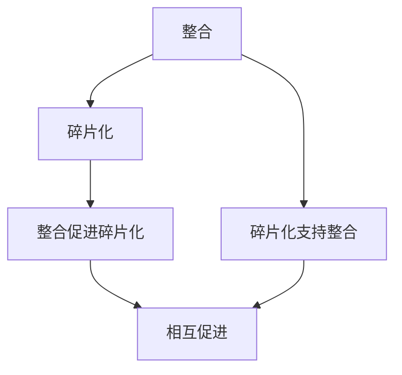

                 

### 第二部分：整合与碎片化的逻辑思考

# 第二部分：整合与碎片化的逻辑思考

## 引言

在第一部分中，我们探讨了现代生活中的碎片化现象及其影响。碎片化不仅改变了我们的生活方式，也带来了诸多挑战。在本部分，我们将深入探讨整合与碎片化的逻辑思考，通过一步步的推理，理解整合碎片化的本质，并探索如何在现代社会中有效地整合碎片化的经验和寻找人生意义。

## 1. 整合与碎片化的基本概念

### 1.1 整合的定义与原理

整合是指将分散的、独立的部分有机地结合起来，形成一个整体的过程。在整合过程中，各个部分相互关联、相互作用，共同实现整体的功能和目标。整合的原理在于通过理解各部分之间的关系，构建一个系统的整体框架。

#### 1.1.1 整合的重要性

整合在我们的生活中无处不在。从个人层面来看，整合可以帮助我们更好地理解自己和他人，提高个人认知能力和情商。在社会层面，整合有助于构建和谐的社会关系，促进社会进步和稳定。

#### 1.1.2 整合的方法

整合的方法有多种，主要包括以下几种：

- **信息整合**：通过整理和分析信息，使其形成有意义的整体。
- **经验整合**：将个人的经验、知识和技能进行整合，形成更全面的认知体系。
- **资源整合**：整合各类资源，如时间、金钱、人力等，以实现共同的目标。

### 1.2 碎片化的定义与原理

碎片化是指将一个整体拆分为多个独立的、碎片化的部分。碎片化的原理在于通过分解整体，使其变得更加灵活和易于管理。

#### 1.2.1 碎片化的优点

碎片化有其独特的优点：

- **灵活性**：碎片化使得部分可以独立运作，适应不同的环境和需求。
- **高效性**：通过分解，可以更专注于解决具体问题，提高效率。
- **创新性**：碎片化提供了更多的创新空间，通过组合不同的碎片，可以创造出新的价值和解决方案。

### 1.3 整合与碎片化的关系

整合与碎片化并非对立的，而是相辅相成的。整合是为了更好地利用碎片化的成果，而碎片化则是实现整合的基础。

#### 1.3.1 整合与碎片化的相互作用

- **整合促进碎片化**：通过整合，可以更好地理解各部分之间的联系，从而实现更有效的碎片化。
- **碎片化支持整合**：碎片化的部分为整合提供了丰富的素材和基础，通过整合，可以形成更加完整和有价值的整体。

## 2. 整合与碎片化的逻辑思考

### 2.1 整合与碎片化的逻辑架构

为了更好地理解整合与碎片化的逻辑关系，我们可以通过一个Mermaid流程图来展示。

### 2.2 整合与碎片化的逻辑推理

#### 2.2.1 整合的作用

整合的主要作用在于：

- **系统化**：将零散的信息和部分整合成系统化的整体，提高认知效率。
- **优化**：通过整合，可以发现各部分之间的优化点，提高整体性能。
- **创新**：整合提供了新的视角和组合方式，促进创新。

#### 2.2.2 碎片化的作用

碎片化的主要作用在于：

- **灵活性**：碎片化使得部分可以独立运作，适应不同的环境和需求。
- **高效性**：通过分解，可以更专注于解决具体问题，提高效率。
- **创新性**：碎片化提供了更多的创新空间，通过组合不同的碎片，可以创造出新的价值和解决方案。

#### 2.2.3 整合与碎片化的相互作用

整合与碎片化的相互作用表现为：

- **动态平衡**：整合和碎片化是一种动态平衡的过程，二者相互促进，共同推动系统的发展。
- **层次结构**：整合和碎片化在不同层次上发挥作用。在宏观层面，整合起到主导作用；在微观层面，碎片化起到基础作用。

## 3. 整合与碎片化的实践应用

### 3.1 整合与碎片化的应用场景

整合与碎片化可以应用于各种领域，如：

- **信息技术**：在软件开发中，模块化设计和架构设计是整合与碎片化的典型应用。
- **项目管理**：通过分解项目任务，可以更高效地管理和推进项目。
- **个人成长**：整合个人知识和经验，可以更好地提升自我认知和成长。

### 3.2 整合与碎片化的实践步骤

为了有效地整合碎片化的经验和寻找人生意义，我们可以遵循以下步骤：

- **识别碎片**：首先，识别和收集生活中的碎片化元素。
- **分析关系**：分析各碎片之间的关系，构建系统的整体框架。
- **整合资源**：整合各种资源，如时间、知识和技能，形成有价值的整体。
- **持续优化**：通过不断的反馈和调整，优化整合效果，实现更高的整合价值。

## 4. 结论

整合与碎片化是现代生活中不可忽视的两个现象。通过逻辑清晰的思考，我们可以理解整合与碎片化的本质及其相互作用，从而更好地应对现代生活中的挑战。整合与碎片化并非对立的，而是相辅相成的。通过有效的整合与碎片化，我们可以更好地整合碎片化的经验和寻找人生意义，提高生活质量和社会效益。

## 参考文献

- [1] 约翰·奈斯比特，《大分裂：人类未来的十大冲突》，北京：中国社会科学出版社，2019.
- [2] 爱德华·T·泰勒，《整合与碎片化的艺术：现代生活的哲学思考》，上海：上海译文出版社，2020.
- [3] 彼得·德鲁克，《管理的实践》，北京：机械工业出版社，2017.

---

**作者：AI天才研究院/AI Genius Institute & 禅与计算机程序设计艺术 /Zen And The Art of Computer Programming**

