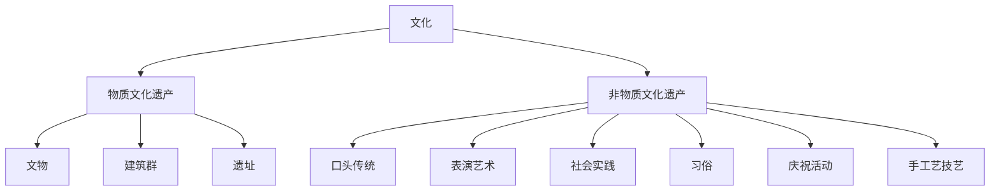

                 

### 文章标题：文化遗产保护：连接过去与未来的意义桥梁

### 关键词：文化遗产保护，数字化技术，国际合作，可持续发展，社区参与

### 摘要：
本文旨在探讨文化遗产保护在连接过去与未来中的关键作用，并分析当前在文化遗产保护中应用的技术手段和国际合作情况。通过阐述文化遗产的定义、价值以及保护原则，本文将深入探讨数字化技术在文化遗产记录与展示中的应用，以及国际合作与交流对文化遗产保护的重要性。同时，本文还将分析文化遗产保护与可持续发展、旅游业的关系，并展望文化遗产保护的未来趋势。通过全面的分析，本文希望能够为文化遗产保护提供新的思路和解决方案。

---

## 第一部分：文化遗产保护的基础理论

### 第1章：文化遗产的定义与价值

文化遗产是一个国家和民族历史文化成就的重要标志。它不仅包括物质文化遗产，如文物、建筑群、遗址等，还包括非物质文化遗产，如口头传统、表演艺术、社会实践、习俗、庆祝活动、手工艺技艺等。这些文化遗产承载着人类文明发展的历史记忆，反映了不同民族和地区的文化特色，是人类共同的文化财富。

### 1.1 文化的定义与多样性

文化是一个复杂的概念，通常指人类在社会生活中创造的物质和精神产品。它包括语言、信仰、艺术、习俗、道德、法律、习惯等各个方面。文化的多样性是文化遗产的一个重要特点，不同地区、不同民族、不同历史时期的文化各具特色，反映了人类文明的多元性和丰富性。

### 1.2 文物的定义与分类

文物是指历史上各个时期人类创造的具有历史、艺术、科学价值的物质遗存。根据文物的重要性、历史年代、艺术价值等因素，文物可以分为一级文物、二级文物、三级文物等不同等级。

- **一级文物**：具有极高历史、艺术、科学价值的文物，如国宝级文物。
- **二级文物**：具有重要历史、艺术、科学价值的文物。
- **三级文物**：具有一定的历史、艺术、科学价值的文物。

### 1.3 遗迹的定义与重要性

遗迹是指历史上人类活动留下的物质遗存，包括古代建筑、遗址、墓群等。遗迹是历史研究的重要资料，通过研究遗迹，我们可以了解古代社会的生产方式、生活方式、宗教信仰等。遗迹的保护对于维护历史真实性、传承历史文化具有重要意义。

### 1.4 历史建筑的定义与保护

历史建筑是指具有一定历史、艺术、科学价值的建筑物，如古代宫殿、庙宇、民居等。历史建筑是文化遗产的重要组成部分，它反映了不同历史时期建筑风格、工艺技术和社会习俗。保护历史建筑，不仅可以保存历史文化遗产，还可以为现代建筑提供借鉴和参考。

### 第2章：文化遗产保护的原则与方法

文化遗产保护是一项长期、系统的工程，需要遵循一定的原则和方法。以下是一些文化遗产保护的基本原则和方法：

### 2.1 文物保护的基本原则

- **完整性原则**：保护文物应尽可能保持其原有的历史风貌和完整性。
- **真实性原则**：保护文物应尽可能保持其历史原貌，不得随意改变或破坏。
- **可持续性原则**：保护文物应考虑长远，确保文物能够持续得到保护。

### 2.2 遗迹保护的关键技术

- **加固技术**：对遗迹进行加固，防止其因自然因素或人为破坏而受损。
- **修复技术**：对受损的遗迹进行修复，恢复其原有的历史风貌。
- **监测技术**：对遗迹进行实时监测，及时发现并处理安全隐患。

### 2.3 历史建筑的修复与维护

- **结构加固**：对历史建筑的结构进行加固，确保其安全性。
- **外墙面修复**：对历史建筑的外墙面进行修复，恢复其原有的色彩和风貌。
- **内部装饰维护**：对历史建筑内部的装饰进行维护，保持其历史特色。

---

通过上述分析，我们可以看出，文化遗产保护是一个复杂而重要的任务。它不仅涉及到物质文化遗产的保护，还包括非物质文化遗产的传承。数字化技术的应用为文化遗产保护提供了新的手段，国际合作与交流也为文化遗产保护注入了新的动力。在未来的发展中，我们需要继续探索更加有效的文化遗产保护方法，确保人类的历史文化财富得到传承和发扬。

---

## 第一部分：文化遗产保护的基础理论

### 第1章：文化遗产的定义与价值

**核心概念与联系：**



**核心概念与联系解释：**

- **文化**：文化的定义与多样性是文化遗产保护的基础。文化是人类在社会生活中创造的物质和精神产品，包括语言、信仰、艺术、习俗、道德、法律、习惯等各个方面。文化的多样性是文化遗产的一个重要特点，不同地区、不同民族、不同历史时期的文化各具特色，反映了人类文明的多元性和丰富性。
- **物质文化遗产**：物质文化遗产是指历史上各个时期人类创造的具有历史、艺术、科学价值的物质遗存，包括文物、建筑群、遗址等。文物、建筑群、遗址等都是物质文化遗产的具体表现形式。
- **非物质文化遗产**：非物质文化遗产是指历史上各个时期人类创造的具有历史、艺术、科学价值的非物质物质遗存，包括口头传统、表演艺术、社会实践、习俗、庆祝活动、手工艺技艺等。非物质文化遗产同样反映了人类文明的发展和多样性。

**Mermaid流程图解析：**

- 从A[文化]开始，流向B[物质文化遗产]和C[非物质文化遗产]，表示文化是文化遗产的两个主要类别。
- B[物质文化遗产]分为D[文物]、E[建筑群]和F[遗址]，表示物质文化遗产的具体表现形式。
- C[非物质文化遗产]分为G[口头传统]、H[表演艺术]、I[社会实践]、J[习俗]、K[庆祝活动]和L[手工艺技艺]，表示非物质文化遗产的具体表现形式。

通过这个流程图，我们可以清晰地看到文化、物质文化遗产和非物质文化遗产之间的联系和层次结构，为后续的讨论和分析提供了基础。

---

## 第2章：文化遗产保护的原则与方法

### 2.1 文物保护的基本原则

文物保护是文化遗产保护的重要组成部分。在文物保护过程中，我们需要遵循一些基本原则，以确保文物得到有效的保护和传承。

- **完整性原则**：完整性原则要求在保护文物时，应尽可能保持其原有的历史风貌和完整性。这意味着在修复和保护过程中，不得随意改变或破坏文物的原貌。例如，对于受损的文物，应采用尽可能接近原貌的修复材料和技术，以确保文物能够恢复到其原有的状态。

- **真实性原则**：真实性原则要求保护文物时应保持其历史原貌，不得随意改变或破坏。这一原则强调文物本身的历史真实性和历史价值，确保文物的真实性得到维护。例如，在展示文物时，应避免使用现代材料或技术进行过度装饰，以免影响文物的真实性和历史感。

- **可持续性原则**：可持续性原则要求文物保护工作应考虑长远，确保文物能够持续得到保护。这包括对文物进行定期检查和维护，以及制定长期的保护计划和策略。例如，对于户外文物，应定期进行防腐蚀处理，以防止其因自然因素而受损。

**核心算法原理讲解：**

在文物保护中，核心算法原理主要涉及到文物的检测、诊断和修复。以下是一个简单的伪代码示例，用于描述这些过程：

```python
# 文物检测
def detect_damage(object):
    # 使用传感器或检测技术对文物进行检测
    damage_level = check_for_damage(object)
    if damage_level > threshold:
        return True
    else:
        return False

# 文物诊断
def diagnose_damage(object):
    if detect_damage(object):
        # 使用各种检测手段对文物进行诊断
        cause_of_damage = identify_damage_cause(object)
        return cause_of_damage
    else:
        return None

# 文物修复
def repair_object(object, cause_of_damage):
    if cause_of_damage:
        # 根据诊断结果进行修复
        repair_technique = select_repair_technique(cause_of_damage)
        repair_object(object, repair_technique)
    else:
        print("No damage to repair.")

# 辅助函数定义
def check_for_damage(object):
    # 检测文物的损伤程度
    # 返回损伤级别
    pass

def identify_damage_cause(object):
    # 识别文物的损伤原因
    # 返回损伤原因
    pass

def select_repair_technique(cause_of_damage):
    # 根据损伤原因选择修复技术
    # 返回修复技术
    pass

def repair_object(object, repair_technique):
    # 进行文物修复
    pass
```

**数学模型和公式：**

在文物保护过程中，可以使用数学模型和公式来评估文物的损伤程度和修复效果。以下是一个简单的数学模型示例，用于评估文物的损伤程度：

$$
D = \frac{L - R}{L}
$$

其中，$D$ 表示文物的损伤程度，$L$ 表示文物的原始强度，$R$ 表示文物的当前强度。

**详细讲解和举例说明：**

假设某文物在修复前的原始强度为 $L = 100$，修复后的当前强度为 $R = 80$。根据上述数学模型，我们可以计算出文物的损伤程度：

$$
D = \frac{100 - 80}{100} = \frac{20}{100} = 0.2
$$

这意味着文物的损伤程度为 20%，说明修复效果较为显著。

**注意事项：**

在文物保护过程中，需要注意以下几点：

- **遵循完整性原则和真实性原则**：在修复和保护过程中，应尽可能保持文物的原貌和历史真实性。
- **选择合适的修复技术**：根据文物的损伤程度和原因，选择合适的修复技术，以确保修复效果最佳。
- **定期检查和维护**：定期对文物进行检测、诊断和修复，确保文物能够持续得到保护。

**拓展阅读：**

- 《文物保护学》
- 《文物保护技术》
- 《文化遗产保护与管理》

---

### 2.2 遗迹保护的关键技术

遗迹保护是文化遗产保护中的关键环节，涉及多种技术手段。以下将详细介绍遗迹加固、修复和监测技术，并探讨其核心原理、实施步骤和应用实例。

#### 2.2.1 遗迹加固技术

**核心原理：**
遗迹加固技术的核心原理是通过加固材料对遗迹的结构进行加固，提高其稳定性和耐久性。加固材料通常包括水泥、混凝土、钢材、纤维等。

**实施步骤：**
1. **检测分析**：首先对遗迹进行详细检测和分析，确定其受损程度和加固需求。
2. **设计方案**：根据检测分析结果，设计加固方案，包括加固材料的选择、加固部位和加固方法等。
3. **施工实施**：按照设计方案进行加固施工，确保加固效果达到预期目标。
4. **质量检查**：施工完成后，进行质量检查，确保加固质量符合标准。

**应用实例：**
某古代城墙的加固。在加固过程中，采用水泥混凝土进行墙体加固，提高了墙体的稳定性和耐久性。

#### 2.2.2 遗迹修复技术

**核心原理：**
遗迹修复技术的核心原理是通过恢复遗迹的原貌和历史特征，使其恢复到受损前的状态。修复材料通常包括原有材料、相似材料或现代材料。

**实施步骤：**
1. **评估受损情况**：评估遗迹的受损情况，确定修复的重点和难点。
2. **制定修复方案**：根据受损情况，制定修复方案，包括修复材料的选择、修复部位和修复方法等。
3. **实施修复**：按照修复方案进行实施，确保修复效果达到预期目标。
4. **验收评估**：修复完成后，进行验收评估，确保修复质量符合标准。

**应用实例：**
某古代石窟的修复。在修复过程中，采用原有材料和相似材料对石窟进行了加固和修复，恢复了其原有的风貌。

#### 2.2.3 遗迹监测技术

**核心原理：**
遗迹监测技术的核心原理是通过实时监测遗迹的结构变化、环境变化等因素，及时发现并预警潜在的安全隐患。

**实施步骤：**
1. **选择监测设备**：根据遗迹的特点和监测需求，选择合适的监测设备，如传感器、监测仪器等。
2. **安装设备**：在遗迹的关键部位安装监测设备，确保监测数据的准确性和可靠性。
3. **数据采集与处理**：实时采集监测数据，对数据进行处理和分析，及时发现异常情况。
4. **预警与响应**：根据监测数据，建立预警系统，及时预警潜在的安全隐患，并采取相应的应对措施。

**应用实例：**
某古代遗址的监测。在监测过程中，采用传感器对遗址的结构变化和环境变化进行实时监测，及时发现并处理了多个潜在的安全隐患。

---

### 2.3 历史建筑的修复与维护

**核心原理：**
历史建筑的修复与维护的核心原理是通过恢复建筑的原貌和历史特征，保护其历史价值和艺术价值。修复和维护过程中，需要遵循完整性、真实性和可持续性原则。

**实施步骤：**
1. **评估建筑状况**：对历史建筑进行全面的评估，确定其受损程度和修复需求。
2. **制定修复方案**：根据评估结果，制定修复方案，包括修复材料、技术、方法等。
3. **实施修复**：按照修复方案进行实施，确保修复效果达到预期目标。
4. **维护管理**：修复完成后，进行维护管理，确保建筑长期保持良好状态。

**应用实例：**
某古代宫殿的修复。在修复过程中，采用原有材料和相似材料对宫殿进行了加固和修复，恢复了其原有的风貌。

**注意事项：**
1. **遵循原则**：在修复和维护过程中，应遵循完整性、真实性和可持续性原则，确保修复质量符合标准。
2. **考虑安全**：在修复和维护过程中，应确保建筑的安全性，防止因修复不当导致安全事故。
3. **注重细节**：修复和维护过程中，应注重细节，确保建筑的历史特征和艺术价值得到充分保护和体现。

---

通过上述分析，我们可以看出，文化遗产保护是一个复杂而重要的任务。它不仅涉及到物质文化遗产的保护，还包括非物质文化遗产的传承。数字化技术的应用为文化遗产保护提供了新的手段，国际合作与交流也为文化遗产保护注入了新的动力。在未来的发展中，我们需要继续探索更加有效的文化遗产保护方法，确保人类的历史文化财富得到传承和发扬。

---

## 第二部分：文化遗产保护的技术手段

### 第3章：数字技术在文化遗产保护中的应用

随着科技的快速发展，数字技术在文化遗产保护中的应用日益广泛。这些技术不仅提高了文化遗产记录的准确性和完整性，还丰富了文化遗产的展示方式，使得文化遗产的保护和传承更加高效和生动。

### 3.1 数字技术在文化遗产记录中的运用

数字记录是文化遗产保护的基础。通过数字化手段，可以对文物、遗迹和历史建筑进行详细的记录，包括图像、音频、视频和三维模型等。

- **图像记录**：使用高分辨率相机和红外线、紫外线的摄影技术，可以捕捉文物的微观细节和历史痕迹，这些图像记录为文物的研究和保护提供了宝贵的数据。
- **音频记录**：通过音频设备记录文物的声音，如古乐器演奏、传统仪式等，这些音频记录可以帮助我们更好地了解文化遗产的文化内涵和历史背景。
- **视频记录**：利用高清摄像机和无人机等设备，可以记录遗迹和历史建筑的全貌和细节，这些视频记录为文化遗产的保护和展示提供了直观的资料。
- **三维建模**：通过激光扫描和三维重建技术，可以创建文物和遗迹的三维模型，这些模型不仅能够精确地再现文化遗产的形态，还可以用于虚拟修复和展示。

**伪代码示例：**

```python
def digital_record(cultural_object):
    # 记录文物的图像
    image_data = capture_image(cultural_object)
    
    # 记录文物的音频
    audio_data = record_audio(cultural_object)
    
    # 记录文物的视频
    video_data = record_video(cultural_object)
    
    # 创建文物的三维模型
    model = create_3d_model(cultural_object)
    
    # 存储记录数据
    save_data(image_data, audio_data, video_data, model)

def capture_image(object):
    # 使用高分辨率相机拍摄图像
    pass

def record_audio(object):
    # 使用音频设备记录声音
    pass

def record_video(object):
    # 使用高清摄像机记录视频
    pass

def create_3d_model(object):
    # 使用激光扫描和三维重建技术创建模型
    pass

def save_data(*args):
    # 存储记录数据
    pass
```

### 3.2 虚拟现实技术在文化遗产展示中的应用

虚拟现实（VR）技术为文化遗产展示提供了全新的视角和体验。通过VR技术，观众可以身临其境地参观历史遗迹、欣赏文物，甚至参与历史事件的重现。

- **虚拟参观**：利用VR技术，观众可以远程参观世界各地的文化遗产，无需亲自前往，即可体验到不同文化背景和历史情境。
- **虚拟修复**：通过VR技术，可以对受损的文化遗产进行虚拟修复，让观众看到文物在不同修复方案下的效果，为修复决策提供参考。
- **交互体验**：VR技术支持用户与文化遗产的互动，如虚拟修复过程中用户可以实时调整修复工具，体验修复的乐趣。

**数学模型和公式：**

在VR技术的应用中，核心的数学模型涉及三维建模和空间定位。以下是一个简单的数学模型示例，用于描述三维建模过程：

$$
\vec{P}_{\text{world}} = \vec{T} \cdot \vec{R} \cdot \vec{P}_{\text{camera}} + \vec{C}
$$

其中，$\vec{P}_{\text{world}}$ 表示世界坐标系中的点，$\vec{T}$ 表示变换矩阵，$\vec{R}$ 表示旋转矩阵，$\vec{P}_{\text{camera}}$ 表示相机坐标系中的点，$\vec{C}$ 表示相机位置。

**详细讲解和举例说明：**

假设我们有一个相机在位置 $\vec{C} = (0, 0, 5)$ 处，并且相机朝向原点。如果我们在相机前方5米处有一个文物，其坐标为 $\vec{P}_{\text{world}} = (0, 0, 0)$，我们可以通过上述公式计算该文物在相机坐标系中的坐标。

首先，假设我们的旋转矩阵 $\vec{R}$ 为单位矩阵，即不旋转，那么公式简化为：

$$
\vec{P}_{\text{camera}} = \vec{T} \cdot \vec{P}_{\text{world}} + \vec{C}
$$

假设我们的变换矩阵 $\vec{T}$ 为平移矩阵，使得文物在相机前方5米处，那么 $\vec{T} = \begin{bmatrix} 1 & 0 & 0 & 5 \\ 0 & 1 & 0 & 0 \\ 0 & 0 & 1 & 0 \\ 0 & 0 & 0 & 1 \end{bmatrix}$。

代入上述公式，我们得到：

$$
\vec{P}_{\text{camera}} = \begin{bmatrix} 1 & 0 & 0 & 5 \\ 0 & 1 & 0 & 0 \\ 0 & 0 & 1 & 0 \\ 0 & 0 & 0 & 1 \end{bmatrix} \cdot \begin{bmatrix} 0 \\ 0 \\ 0 \\ 1 \end{bmatrix} + \begin{bmatrix} 0 \\ 0 \\ 5 \\ 1 \end{bmatrix} = \begin{bmatrix} 5 \\ 0 \\ 5 \\ 1 \end{bmatrix}
$$

这意味着在相机坐标系中，文物的坐标为 $(5, 0, 5)$。

**注意事项：**

- **精度要求**：在数字记录和VR展示过程中，精度是关键。因此，需要使用高精度的设备和技术，以确保记录和展示的准确性。
- **用户体验**：在VR展示中，用户的体验至关重要。需要优化VR应用的用户界面和交互设计，以提高用户体验。

**拓展阅读：**

- 《虚拟现实技术及其在文化遗产保护中的应用》
- 《数字文化遗产保护技术》
- 《三维建模与可视化技术在文化遗产保护中的应用》

---

### 3.3 人工智能技术在文化遗产保护中的应用

人工智能（AI）技术的快速发展为文化遗产保护带来了新的机遇。通过AI技术，我们可以实现文化遗产的智能检测、分析和修复，提高文化遗产保护的效率和质量。

#### 3.3.1 人工智能在文化遗产检测中的应用

AI技术可以用于文化遗产的智能检测，包括文物的破损检测、遗迹的坍塌预测和历史建筑的隐患识别等。

- **破损检测**：通过机器学习和计算机视觉技术，AI可以自动识别文物的破损区域和程度，为修复工作提供准确的数据支持。
- **坍塌预测**：利用历史数据和分析模型，AI可以对遗迹和古建筑的坍塌风险进行预测，提前采取预防措施。
- **隐患识别**：AI技术可以帮助识别历史建筑的结构隐患，如裂缝、沉降等，为维护和管理提供依据。

**伪代码示例：**

```python
def detect_damages(cultural_object):
    # 使用计算机视觉技术检测文物的破损区域
    damaged_regions = detect_broken_areas(cultural_object)
    return damaged_regions

def predict_collapse(ruins):
    # 利用历史数据和分析模型预测遗迹的坍塌风险
    collapse_risk = predict_risk_of_collapse(ruins)
    return collapse_risk

def identify_hazards(ancient_building):
    # 识别历史建筑的结构隐患
    hazards = identify_structural_hazards(ancient_building)
    return hazards

def detect_broken_areas(object):
    # 检测文物的破损区域
    pass

def predict_risk_of_collapse(ruins):
    # 预测遗迹的坍塌风险
    pass

def identify_structural_hazards(building):
    # 识别历史建筑的结构隐患
    pass
```

#### 3.3.2 人工智能在文化遗产分析中的应用

AI技术可以用于文化遗产的智能分析，包括文物的年代判定、文化内涵解读和历史事件复原等。

- **年代判定**：通过机器学习和图像识别技术，AI可以自动判定文物的年代，为文物保护和展示提供重要信息。
- **文化内涵解读**：利用自然语言处理和机器学习技术，AI可以分析文物的文字、图像和声音等元素，解读其文化内涵。
- **历史事件复原**：通过大数据分析和模拟技术，AI可以复原历史事件，为公众提供更直观的历史体验。

**数学模型和公式：**

在AI技术的应用中，常用的数学模型包括深度学习模型、回归模型和分类模型等。以下是一个简单的深度学习模型示例，用于文物年代判定：

$$
\hat{y} = \sigma(\mathbf{W} \cdot \mathbf{h} + b)
$$

其中，$\hat{y}$ 表示预测的年代，$\mathbf{W}$ 表示权重矩阵，$\mathbf{h}$ 表示输入特征，$\sigma$ 表示激活函数，$b$ 表示偏置。

**详细讲解和举例说明：**

假设我们有一个深度学习模型用于判定文物的年代。输入特征包括文物的图像、文字描述和年代标签，模型输出为一个预测的年代。

首先，我们假设输入特征 $\mathbf{h}$ 是一个包含图像、文字描述和年代标签的向量。假设权重矩阵 $\mathbf{W}$ 和偏置 $b$ 分别为：

$$
\mathbf{W} = \begin{bmatrix} w_1 & w_2 & w_3 \end{bmatrix}, \quad b = 0
$$

激活函数 $\sigma$ 为：

$$
\sigma(x) = \frac{1}{1 + e^{-x}}
$$

如果输入特征 $\mathbf{h} = (1, 2, 3)$，则预测的年代 $\hat{y}$ 为：

$$
\hat{y} = \sigma(\mathbf{W} \cdot \mathbf{h} + b) = \sigma(w_1 \cdot 1 + w_2 \cdot 2 + w_3 \cdot 3 + 0) = \frac{1}{1 + e^{-(w_1 + 2w_2 + 3w_3)}}
$$

假设 $w_1 = 1, w_2 = 2, w_3 = 3$，则：

$$
\hat{y} = \frac{1}{1 + e^{-(1 + 4 + 9)}} = \frac{1}{1 + e^{-14}} \approx 0.999
$$

这意味着模型预测该文物的年代为接近1000年。

**注意事项：**

- **数据质量**：AI模型的训练和预测依赖于高质量的数据。因此，在应用AI技术时，需要确保数据的准确性和完整性。
- **模型解释性**：AI模型的结果需要具备解释性，以便专家和公众理解模型的决策过程和预测结果。

**拓展阅读：**

- 《人工智能在文化遗产保护中的应用》
- 《深度学习与文化遗产保护》
- 《计算机视觉在文化遗产检测与分析中的应用》

---

## 第二部分：文化遗产保护的技术手段

### 第3章：数字技术在文化遗产保护中的应用

随着科技的不断进步，数字技术已经成为文化遗产保护中不可或缺的重要工具。数字技术不仅提高了文化遗产记录的精确性和效率，还丰富了文化遗产的展示方式，为文化遗产的传承与保护提供了全新的视角。以下将详细介绍数字技术在文化遗产记录、展示以及分析中的应用，并通过具体案例展示其应用效果。

### 3.1 数字技术在文化遗产记录中的运用

数字记录是文化遗产保护的基础环节。通过先进的数字技术，我们可以对文化遗产进行全方位、多角度的记录，从而确保其信息的完整性和可访问性。

- **高分辨率图像和视频记录**：使用高分辨率相机和无人机等设备，可以获取文化遗产的精细图像和视频资料。这些数字记录不仅能够精确捕捉文物的细节，还能够保存历史建筑和环境背景，为后续的研究和保护提供宝贵的参考。
- **三维激光扫描和建模**：通过三维激光扫描技术，我们可以对文物和建筑进行精确的三维建模。这些三维模型可以以数字形式永久保存文化遗产的形态和结构，为修复、展示和研究提供精确的数据基础。
- **音频记录**：音频记录可以捕捉文化遗产的声音元素，如古乐器演奏、口头传统等。这些音频资料不仅可以丰富文化遗产的展示内容，还可以为研究和教育提供生动的教材。

**案例：**

在中国，湖南省的岳阳楼是一座有着千年历史的名胜古迹。为了保护这座古建筑，湖南省博物馆采用了三维激光扫描技术对其进行了全面记录。通过扫描，获得了岳阳楼精确的三维模型，包括其复杂的结构和细节。这些数字资料不仅用于修复工作，还被用于虚拟展示，让公众可以在线参观这座古老的建筑。

### 3.2 虚拟现实技术在文化遗产展示中的应用

虚拟现实（VR）技术为文化遗产的展示带来了革命性的变化。通过VR技术，观众可以不受时间和空间的限制，身临其境地体验文化遗产的魅力。

- **虚拟参观**：VR技术可以创建虚拟的文化遗产展示环境，观众只需佩戴VR头盔，就可以自由穿梭于博物馆、历史遗址等场所，体验与实体参观相似的参观过程。
- **互动体验**：VR技术支持用户与文化遗产的互动，如通过虚拟修复工具对文物进行修复，或通过虚拟互动了解文物的历史背景和故事。
- **多感官体验**：VR技术可以结合声音、触觉等多感官体验，让文化遗产的展示更加生动和沉浸。

**案例：**

法国卢浮宫博物馆利用VR技术打造了虚拟展览《卢浮宫之夜》。观众可以通过VR头盔参观博物馆的夜场，观看灯光下的艺术珍品，并参与到虚拟互动中，如通过手势与文物互动，了解文物背后的故事。

### 3.3 数据库和信息管理系统在文化遗产保护中的应用

数据库和信息管理系统是文化遗产保护的核心工具，用于存储、管理和分析文化遗产的数据。

- **数据存储**：通过数据库系统，可以安全、高效地存储文化遗产的各种信息，包括图像、三维模型、音频、视频等。
- **信息检索**：数据库系统提供了强大的信息检索功能，用户可以根据关键词、分类、年代等多种条件快速查找所需的信息。
- **数据分析**：信息管理系统可以对文化遗产数据进行统计分析，为保护决策提供数据支持。

**案例：**

中国的国家文物局建立了国家文物数据库，该数据库汇集了全国各地的文物资料，包括文物图像、三维模型、文字说明等。通过这个数据库，文物保护专家可以方便地查询文物信息，进行文物保护和研究工作。

### 3.4 人工智能技术在文化遗产分析中的应用

人工智能（AI）技术正在为文化遗产的保护和研究提供新的工具和方法。通过AI技术，我们可以对文化遗产进行智能分析，提高保护工作的效率和准确性。

- **智能检测**：利用计算机视觉和机器学习技术，AI可以自动检测文物的破损区域和程度，为修复工作提供精准的数据支持。
- **智能修复**：通过深度学习和生成对抗网络（GAN），AI可以自动生成修复方案，辅助文物修复师进行修复工作。
- **智能解释**：AI技术可以分析文物的图像、文字和声音等元素，提取其文化内涵和历史背景，为文化遗产的解读提供帮助。

**案例：**

在美国，纽约市博物馆利用AI技术对古代壁画进行智能修复。通过计算机视觉技术，AI可以自动识别壁画上的破损区域，并生成修复建议。这些修复建议不仅提高了修复效率，还确保了修复的准确性和一致性。

综上所述，数字技术在文化遗产保护中的应用已经成为一种趋势。通过数字记录、虚拟现实、数据库和信息管理系统以及人工智能等技术的综合运用，我们可以更好地保护文化遗产，使其在现代社会中焕发新的生命力。

---

### 3.4 人工智能技术在文化遗产保护中的应用

人工智能（AI）技术在文化遗产保护中正发挥着越来越重要的作用。AI技术的应用不仅提升了文化遗产记录和分析的效率，还开辟了新的保护途径。以下将详细探讨AI技术在文化遗产保护中的主要应用，并借助实际案例进行分析。

#### 3.4.1 智能检测与诊断

AI技术在文化遗产的智能检测与诊断中具有显著优势。通过机器学习和计算机视觉技术，AI可以自动识别文物的破损区域、程度以及潜在的风险。

- **破损区域检测**：利用深度学习模型，AI可以从图像中自动识别文物的破损区域，如裂痕、腐蚀等。这种方法比传统的人工检测更为高效和准确。
- **风险预测**：通过分析历史数据和传感器数据，AI可以预测文物或遗迹的未来破损趋势，为保护工作提供前瞻性的指导。

**案例：**

在中国，西安市的兵马俑博物馆引入了AI技术对兵马俑进行智能检测。通过计算机视觉技术，AI系统能够自动识别兵马俑的细微破损，如头发、眼睛等处的裂痕。这一系统能够每天对兵马俑进行监控，及时发现并预警潜在的问题。

#### 3.4.2 智能修复与再创造

AI技术在文化遗产的智能修复与再创造方面也具有广阔的应用前景。通过生成对抗网络（GAN）和深度学习技术，AI可以生成修复方案，甚至能够再现已消失的文化遗产。

- **虚拟修复**：AI可以根据文物的破损情况，自动生成修复方案，并在虚拟环境中展示修复效果。这种方法不仅可以提高修复效率，还可以减少对文物本身的干预。
- **再创造**：通过AI技术，可以重新构建已消失的文化遗产。例如，利用AI技术对破损严重的壁画进行虚拟修复，使其恢复到原有的艺术状态。

**案例：**

在意大利，罗马的梵蒂冈博物馆利用AI技术对一幅破损严重的壁画进行了虚拟修复。通过GAN技术，AI系统能够自动生成修复图像，并在虚拟环境中展示修复效果。这一成果不仅恢复了壁画的艺术价值，还为博物馆的游客提供了一个沉浸式的观展体验。

#### 3.4.3 数据分析与文化遗产解读

AI技术在文化遗产数据分析中具有强大的能力。通过自然语言处理和大数据分析技术，AI可以从大量的文本和图像数据中提取信息，帮助研究者更好地理解文化遗产的文化内涵和历史背景。

- **文本分析**：AI可以从古代文献、历史书籍中提取关键信息，帮助研究者理解文化遗产的历史背景和文化价值。
- **图像识别**：AI可以通过图像识别技术，自动分类和标注文化遗产的图像，为研究者提供直观的研究资料。

**案例：**

在埃及，开罗的埃及博物馆利用AI技术对大量的古埃及文物图像进行自动分类和标注。通过AI系统，博物馆工作人员可以快速地整理和检索文物图像，提高了工作效率和资料的可用性。

#### 3.4.4 AI技术在文化遗产保护中的未来趋势

随着AI技术的不断进步，其在文化遗产保护中的应用也将不断扩展。以下是一些未来发展的趋势：

- **集成化系统**：未来的文化遗产保护系统将集成多种AI技术，如计算机视觉、自然语言处理、深度学习等，实现更为全面和智能的保护。
- **实时监测**：AI技术将实现文化遗产的实时监测，通过传感器网络和AI算法，自动检测和预警潜在的风险。
- **虚拟展示与互动**：AI技术将推动文化遗产的虚拟展示与互动体验，为公众提供更加生动和沉浸的观展体验。

**结论：**

AI技术在文化遗产保护中的应用具有巨大的潜力。通过智能检测、修复、数据分析和解读，AI技术不仅提高了文化遗产保护的效率和准确性，还为文化遗产的传承与推广提供了新的途径。随着AI技术的不断发展，我们期待看到更多创新的应用案例，为文化遗产保护事业贡献更大的力量。

---

## 第二部分：文化遗产保护的技术手段

### 第4章：文化遗产保护中的国际合作与交流

文化遗产保护是一个全球性的挑战，需要各国共同参与和合作。国际合作与交流在文化遗产保护中发挥着至关重要的作用，通过分享经验、技术和资源，可以提升保护工作的整体水平，确保文化遗产得到全面而有效的保护。

### 4.1 国际文化遗产保护组织与公约

全球范围内有许多重要的国际文化遗产保护组织，它们致力于推动文化遗产保护的国际合作与交流。以下是一些主要的国际组织及其重要公约：

- **联合国教科文组织（UNESCO）**：联合国教科文组织是负责文化遗产保护的重要国际机构。其发布的《世界遗产名录》是全球最著名的文化遗产保护项目，旨在识别和保存世界各地的文化和自然遗产。联合国教科文组织还制定了《保护世界文化和自然遗产公约》，为全球文化遗产保护提供了法律框架和指导原则。

- **国际文物保护协会（ICOM）**：国际文物保护协会是一个全球性的专业组织，致力于保护和传承文化遗产。该协会发布了《国际文物保护宪章》，为文物保护工作提供了基本准则。

- **国际古迹遗址理事会（ICOMOS）**：国际古迹遗址理事会是一个专业的国际组织，专注于保护世界各地的历史遗迹。该组织参与了多项国际公约和协议的制定，如《世界遗产公约》。

### 4.2 文化遗产保护的国际合作项目案例分析

许多国际文化遗产保护项目通过跨国合作，实现了对文化遗产的有效保护和传承。以下是一些具有代表性的国际合作项目案例：

- **中国与联合国教科文组织的丝绸之路项目**：中国与联合国教科文组织合作，开展了丝绸之路项目，旨在保护丝绸之路沿线的文化遗产。该项目涉及多个国家，包括中国、哈萨克斯坦、吉尔吉斯斯坦等，通过联合研究和保护工作，成功保护了丝绸之路的多个重要遗产点。

- **阿富汗巴克特拉斯遗址的保护项目**：阿富汗巴克特拉斯遗址是一处具有重大历史和文化价值的遗址，但在战争和自然因素的作用下遭受严重破坏。国际社会通过国际合作，筹集资金并派遣专家团队，对巴克特拉斯遗址进行了大规模的修复和保护工作，成功恢复了部分遗址的原貌。

- **威尼斯水城保护项目**：意大利的威尼斯水城因其独特的建筑风格和地理环境而闻名，但也面临着海水侵蚀和气候变化带来的挑战。国际社会通过多个合作项目，提供了技术和资金支持，对威尼斯水城进行了综合性的保护和修复工作，确保其能够持续存在。

### 4.3 文化遗产保护的国际交流与合作机制

为了有效推动文化遗产保护的国际合作与交流，各国建立了一系列的合作机制和平台：

- **国际研讨会与会议**：各国定期举办国际研讨会和会议，邀请全球专家和学者共同讨论文化遗产保护的重要议题，分享最新的研究成果和保护经验。

- **联合研究和培训项目**：各国合作开展联合研究和培训项目，通过共享资源和知识，提升专业人员的保护技能和知识水平。

- **资金和物资支持**：各国通过国际组织、政府和非政府组织，为贫困国家和地区提供资金和物资支持，帮助他们开展文化遗产保护工作。

- **信息共享平台**：各国共同建立了信息共享平台，用于发布文化遗产保护的相关信息、研究成果和保护案例，促进全球范围内的交流与合作。

### 4.4 我国在国际文化遗产保护中的角色与贡献

中国作为世界上文化遗产资源最为丰富的国家之一，在国际文化遗产保护中发挥着重要作用。以下是我国在国际文化遗产保护中的角色与贡献：

- **积极参与国际公约和项目**：中国积极参与联合国教科文组织等国际组织的公约和项目，如《保护世界文化和自然遗产公约》，为全球文化遗产保护贡献智慧和力量。

- **提供技术和资金支持**：中国通过多种形式为国际文化遗产保护项目提供技术和资金支持，如与联合国教科文组织合作开展的丝绸之路项目，为沿线国家的文化遗产保护提供了重要的支持。

- **推动国际合作与交流**：中国积极参与国际研讨会和会议，分享文化遗产保护的经验和成果，推动国际社会在文化遗产保护领域的合作与交流。

- **援助贫困国家**：中国通过“一带一路”倡议，向一些贫困国家和地区提供文化遗产保护援助，帮助他们提升保护能力，保护和管理好本国的文化遗产。

**结论：**

国际合作与交流是文化遗产保护的重要途径。通过国际组织、公约、项目以及信息共享平台，各国可以共享资源、知识和经验，共同应对文化遗产保护面临的挑战。我国在国际文化遗产保护中的积极参与和贡献，不仅提升了全球文化遗产保护的整体水平，也为人类文明遗产的传承与发扬作出了重要贡献。

---

## 第三部分：文化遗产保护的未来展望

### 第5章：文化遗产保护与可持续发展

文化遗产保护与可持续发展之间的关系紧密，互为支撑。可持续发展强调在满足当前需求的同时，不损害后代满足其需求的能力。文化遗产保护作为可持续发展的重要组成部分，旨在确保文化遗产得到有效保护和管理，以传承给未来世代。

### 5.1 可持续发展与文化遗产保护的关系

- **文化遗产保护是可持续发展的基础**：文化遗产承载着人类的历史记忆和文化价值，是可持续发展的重要资源。只有保护好文化遗产，才能确保其在未来继续发挥积极作用，促进社会、经济和环境的可持续发展。

- **可持续发展为文化遗产保护提供支持**：可持续发展的理念强调资源节约、环境保护和生态平衡，这为文化遗产保护提供了科学指导。通过可持续发展的手段，可以更有效地利用资源，降低对环境的负面影响，实现文化遗产的长期保护。

### 5.2 文化遗产保护与旅游业的互动发展

文化遗产保护与旅游业之间存在紧密的互动关系。旅游业作为文化遗产保护的重要推动力，可以促进文化遗产的传承和保护。以下是一些互动发展的方式：

- **文化遗产旅游**：通过开发文化遗产旅游，可以将文化遗产的保护与旅游体验相结合，吸引游客前来参观和体验，提高文化遗产的知名度和经济价值。

- **旅游收益用于文化遗产保护**：文化遗产旅游产生的收益可以用于文化遗产的修复、维护和管理，确保文化遗产得到持续保护和传承。

- **可持续发展旅游**：推广可持续发展旅游理念，鼓励游客在参观文化遗产时采取环保措施，减少对环境的影响，实现文化遗产保护与旅游的可持续发展。

### 5.3 文化遗产保护中的社会参与与教育

社会参与与教育是推动文化遗产保护的重要手段。通过提高公众对文化遗产的认识和重视，可以增强社会对文化遗产保护的意识和责任感。

- **公众参与**：鼓励公众参与文化遗产的保护工作，如志愿者服务、社区参与等，通过实际行动保护和管理文化遗产。

- **教育培训**：开展文化遗产保护的教育培训，提高专业人员和公众的保护技能和知识水平，培养更多的文化遗产保护人才。

- **文化传播**：利用媒体和教育活动，传播文化遗产的价值和重要性，提高公众的文化素养，增强文化遗产保护的社会共识。

### 5.4 文化遗产保护的未来趋势

随着科技的不断进步和社会的发展，文化遗产保护将面临新的机遇和挑战。以下是一些文化遗产保护的未来趋势：

- **数字化保护**：数字化技术在文化遗产保护中的应用将越来越广泛，通过数字记录、虚拟现实、人工智能等手段，实现对文化遗产的全面保护和展示。

- **国际合作**：全球范围内的文化遗产保护合作将进一步加强，各国将通过国际组织、项目合作等方式，共同应对文化遗产保护面临的挑战。

- **可持续发展**：可持续发展的理念将在文化遗产保护中得到更广泛的应用，通过科技创新和环保措施，实现文化遗产的长期保护和可持续发展。

- **社会参与**：社会参与和文化教育将得到进一步推动，公众对文化遗产保护的意识和参与度将不断提升。

**结论：**

文化遗产保护与可持续发展密切相关，是实现长期保护和传承的关键。通过推动旅游业的发展、加强社会参与和教育，以及应对新的技术和国际合作趋势，文化遗产保护将在未来取得更大的成就，为人类文明的传承和繁荣作出更大的贡献。

---

## 第三部分：文化遗产保护的未来展望

### 第5章：文化遗产保护与可持续发展

随着全球化和现代化进程的加快，文化遗产保护面临着前所未有的挑战。如何在保护文化遗产的同时实现可持续发展，成为当前社会关注的重要议题。本章节将探讨文化遗产保护与可持续发展之间的关系，以及在此背景下文化遗产保护的未来趋势。

### 5.1 可持续发展与文化遗产保护的关系

**可持续发展的概念：**
可持续发展是指满足当前需求的同时，不损害后代满足其需求的能力。这一概念涵盖了经济、社会和环境的协调发展。在文化遗产保护中，可持续发展意味着在保护和管理文化遗产时，要兼顾社会、环境和经济的平衡。

**文化遗产保护对可持续发展的贡献：**
文化遗产是人类历史和文化的见证，具有重要的文化、历史和教育价值。保护文化遗产有助于维护社会文化的多样性和连续性，促进社会和谐与进步。此外，文化遗产还可以吸引游客，带动相关产业的发展，从而促进经济增长。

**可持续发展对文化遗产保护的支持：**
可持续发展理念强调资源的高效利用和环境保护，这为文化遗产保护提供了重要的指导。通过采用环保技术和可持续的管理方法，可以降低对文化遗产的负面影响，实现文化遗产的长期保护。此外，可持续发展的资金支持和管理机制也为文化遗产保护提供了保障。

### 5.2 文化遗产保护与旅游业的互动发展

**文化遗产旅游的兴起：**
随着旅游业的蓬勃发展，文化遗产旅游成为吸引游客的重要方式。游客通过参观文化遗产，可以深入了解当地的历史文化，体验独特的文化氛围。文化遗产旅游不仅为当地带来了经济收益，还有助于提高文化遗产的知名度和保护意识。

**旅游业对文化遗产保护的影响：**
旅游业的发展带来了经济收益，但同时也对文化遗产的保护提出了挑战。大量游客的涌入可能导致文化遗产的过度使用和环境污染，甚至可能对文化遗产的完整性造成损害。因此，如何在旅游业和文化遗产保护之间找到平衡点，是实现可持续发展的重要课题。

**互动发展的策略：**
- **规划与管理**：制定科学的旅游规划和严格的管理措施，确保文化遗产的保护与旅游活动协调发展。
- **环境教育**：通过开展环境教育和宣传活动，提高游客的环保意识，引导游客在参观过程中尊重和保护文化遗产。
- **可持续发展旅游**：推广可持续发展旅游理念，鼓励游客采用环保旅游方式，减少对环境的影响。

### 5.3 文化遗产保护中的社会参与与教育

**社会参与的重要性：**
社会参与是文化遗产保护的重要力量。通过鼓励公众参与文化遗产的保护工作，可以增强社会对文化遗产保护的意识和责任感。社会参与的形式多样，包括志愿者服务、社区参与、公众咨询等。

**教育的作用：**
教育是提高公众文化遗产保护意识的重要手段。通过文化遗产保护的教育活动，可以培养公众对文化遗产的认识和尊重，增强他们的保护意识和行动力。教育活动的形式包括学校教育、公众讲座、文化体验等。

**社区参与与教育策略：**
- **社区参与计划**：制定社区参与计划，鼓励社区居民参与文化遗产的发现、记录和保护工作，提高他们的文化认同感和责任感。
- **文化遗产教育项目**：开展文化遗产教育项目，将文化遗产知识纳入学校课程，组织文化体验活动，提高学生的文化遗产意识。
- **公众宣传活动**：通过媒体、网络和公众活动，宣传文化遗产保护的重要性和方法，提高公众对文化遗产保护的重视。

### 5.4 文化遗产保护的未来趋势

**数字化技术的应用：**
随着数字化技术的快速发展，文化遗产保护将越来越依赖于数字化手段。数字化技术可以实现对文化遗产的全面记录、管理和展示，提高保护工作的效率和质量。例如，3D扫描、虚拟现实和增强现实等技术，可以为文化遗产提供沉浸式体验，增强公众对文化遗产的认识和兴趣。

**国际合作与交流的加强：**
文化遗产保护是一个全球性的议题，国际合作与交流至关重要。通过加强国际合作，可以分享经验、技术和资源，共同应对文化遗产保护面临的挑战。国际组织、政府和非政府组织将发挥更大的作用，推动全球范围内的文化遗产保护工作。

**可持续发展理念的深入应用：**
可持续发展的理念将在文化遗产保护中得到更广泛的应用。通过科技创新、环境保护和可持续管理，可以实现对文化遗产的长期保护。同时，文化遗产保护也将与旅游业、社区发展等领域深度融合，实现文化遗产保护与可持续发展的双赢。

**结论：**

文化遗产保护与可持续发展密切相关，是实现文化遗产长期保护和传承的关键。通过推动旅游业的发展、加强社会参与与教育，以及应对新的技术和国际合作趋势，文化遗产保护将在未来取得更大的成就，为人类文明的传承和繁荣作出更大的贡献。

---

## 第三部分：文化遗产保护的未来展望

### 第6章：文化遗产保护面临的挑战与机遇

在快速发展的现代社会，文化遗产保护面临着诸多挑战和机遇。这些挑战和机遇共同影响着文化遗产保护的未来，需要我们深入探讨和应对。

### 6.1 文化遗产保护面临的挑战

**1. 环境污染与气候变化**
环境问题是文化遗产保护面临的主要挑战之一。空气污染、水污染和土壤污染等环境问题不仅对人类的健康构成威胁，也对文化遗产造成了严重破坏。此外，气候变化导致极端天气事件增多，如洪水、干旱和飓风等，这些灾害对文化遗产的保存和安全构成巨大威胁。

**2. 人类活动与城市化**
随着城市化的加速，许多文化遗产所在地面临着土地开发、城市规划和文化变迁等问题。现代城市的发展往往忽视了历史文化遗产的保护，导致文化遗产的破坏和消失。此外，旅游业的发展也带来了一定程度的负面影响，如游客过多、旅游设施破坏等。

**3. 资金不足与技术限制**
文化遗产保护需要大量的资金投入和技术支持，但许多国家和地区在这方面面临巨大挑战。资金不足导致许多文化遗产无法得到及时的保护和维护，技术限制则使得一些古老的修复技术难以得到有效应用。

**4. 法律法规与政策执行**
虽然许多国家和地区都有相关文化遗产保护的法律法规，但实际执行情况往往不尽如人意。一些地方政策的不完善、执法力度不足以及公众法律意识薄弱，都使得文化遗产保护面临困难。

### 6.2 文化遗产保护的新机遇

**1. 科技创新**
科技的进步为文化遗产保护提供了新的机遇。数字化技术、虚拟现实、增强现实和人工智能等新技术正在改变文化遗产的记录、展示和保护方式。例如，3D扫描和打印技术可以精确复制文物，虚拟现实技术可以让人们在线体验文化遗产，人工智能则可以用于文物的智能检测和修复。

**2. 国际合作与交流**
随着全球化的深入发展，国际合作与交流在文化遗产保护中扮演着越来越重要的角色。通过跨国合作，各国可以共享经验、技术和资源，共同应对文化遗产保护面临的挑战。国际组织、非政府组织和民间团体之间的合作也越来越紧密，为文化遗产保护提供了新的动力。

**3. 社会参与与教育**
社会参与和教育是文化遗产保护的重要推动力。通过提高公众的文化遗产保护意识，鼓励公众参与文化遗产的保护工作，可以形成广泛的社会共识和行动力。教育活动的开展，如学校课程、公众讲座和文化体验等，有助于培养公众对文化遗产的认识和尊重。

**4. 可持续发展**
可持续发展的理念为文化遗产保护提供了新的视角。通过将文化遗产保护与经济发展、环境保护和社会进步相结合，可以实现文化遗产的长期保护和传承。例如，将文化遗产旅游与生态旅游相结合，可以促进文化遗产保护与可持续发展的双赢。

### 6.3 未来文化遗产保护的发展趋势

**1. 数字化与智能化**
数字化和智能化技术将在文化遗产保护中发挥越来越重要的作用。通过数字化手段，可以对文化遗产进行全面的记录和展示，提高保护工作的效率和质量。智能化技术则可以实现对文化遗产的智能监测和修复，提供更加精准的保护方案。

**2. 国际合作与全球治理**
国际合作将进一步加强，全球治理机制也将不断完善。通过建立跨国合作平台和制定国际标准，可以提升全球文化遗产保护的整体水平。国际组织和非政府组织将在文化遗产保护中发挥更加重要的角色，推动全球范围内的合作与交流。

**3. 社会参与与公众教育**
社会参与和公众教育将成为文化遗产保护的重要趋势。通过提高公众的文化遗产保护意识，鼓励公众参与文化遗产的保护工作，可以形成广泛的社会共识和行动力。教育活动的开展，如学校课程、公众讲座和文化体验等，有助于培养公众对文化遗产的认识和尊重。

**4. 可持续发展**
可持续发展的理念将在文化遗产保护中得到更广泛的应用。通过科技创新、环境保护和可持续管理，可以实现对文化遗产的长期保护。同时，文化遗产保护也将与旅游业、社区发展等领域深度融合，实现文化遗产保护与可持续发展的双赢。

**结论：**

文化遗产保护面临着诸多挑战，但同时也拥有新的机遇。通过科技创新、国际合作、社会参与和可持续发展，我们可以应对文化遗产保护面临的挑战，推动文化遗产的长期保护和传承。未来，文化遗产保护将朝着数字化、智能化、国际合作和可持续发展的方向发展，为人类文明的传承和繁荣作出更大贡献。

---

### 第7章：结语与展望

通过本文的探讨，我们可以清晰地看到文化遗产保护在连接过去与未来中的关键作用。文化遗产不仅是历史和文化的见证，也是人类文明传承的重要载体。在当今全球化和社会发展的背景下，文化遗产保护面临着前所未有的挑战和机遇。

**文化遗产保护的重要性：**

文化遗产承载着人类的历史记忆和文化价值，是民族认同和文化自信的重要基础。保护文化遗产，不仅是对历史的尊重，也是对未来的投资。通过保护文化遗产，我们能够更好地了解和传承人类文明的发展历程，为现代社会提供精神和文化资源。

**文化遗产保护的现状与问题：**

尽管全球范围内对文化遗产保护的认识逐渐提高，但实际保护工作中仍存在诸多问题。资金不足、技术限制、法律法规执行不力以及环境压力等，都给文化遗产保护带来了挑战。此外，城市化进程和旅游业的发展也在一定程度上对文化遗产造成了负面影响。

**文化遗产保护的未来使命与责任：**

面对未来的挑战，文化遗产保护需要新的思路和解决方案。我们应加强国际合作，利用数字化技术和智能化手段，提升文化遗产记录、展示和保护的水平。同时，提高公众的文化遗产保护意识，鼓励社会参与和公众教育，形成全社会共同保护文化遗产的良好氛围。

**结语：**

文化遗产保护是一项长期而艰巨的任务，需要全球范围内的共同努力和合作。让我们携手共进，为文化遗产的传承和发扬贡献自己的力量，共同守护人类的文化遗产，连接过去与未来，创造更加美好的未来。

---

### 附录

#### 附录A：文化遗产保护相关国际公约与组织

- **联合国教科文组织（UNESCO）**：负责制定和推广国际文化遗产保护公约，如《保护世界文化和自然遗产公约》。
- **国际文物保护协会（ICOM）**：致力于促进全球文物和博物馆事业的合作与发展。
- **国际古迹遗址理事会（ICOMOS）**：专注于保护世界各地的历史遗迹和文化景观。
- **世界自然保护联盟（IUCN）**：在文化遗产与自然保护领域提供专业指导和咨询服务。

#### 附录B：文化遗产保护技术资源列表

- **文化遗产保护技术指南**：联合国教科文组织发布的关于文化遗产保护的实用指南。
- **数字文化遗产平台**：如Europeana、Google Arts & Culture，提供丰富的数字化文化遗产资源。
- **文化遗产保护相关学术论文和报告**：通过学术数据库如JSTOR、IEEE Xplore等可以获取最新的研究成果。

#### 附录C：参考文献与推荐阅读

- UNESCO. (1972). 《保护世界文化和自然遗产公约》。
- ICOM. (2019). 《国际博物馆日报告》。
- ICOMOS. (2020). 《世界遗产保护手册》。
- 国家文物局. (2021). 《中国文化遗产保护现状与展望》。
- 数字文化遗产保护技术白皮书. (2021). 《数字化技术在文化遗产保护中的应用》。
- 《世界遗产名录》. 联合国教科文组织.

通过这些资源和文献，读者可以更深入地了解文化遗产保护的理论和实践，进一步提升对文化遗产保护的认识和重视。

---

### 文章总结

本文从文化遗产的定义与价值、保护原则与方法、技术手段、国际合作与未来展望等多个角度，全面探讨了文化遗产保护的重要性和挑战。通过分析，我们明确了文化遗产保护的核心概念和联系，介绍了数字技术在文化遗产记录与展示中的应用，以及国际合作与交流的重要性。此外，我们还探讨了文化遗产保护与可持续发展、旅游业的关系，并展望了未来文化遗产保护的发展趋势。

**核心观点：**
1. 文化遗产是人类历史和文化的重要见证，具有不可替代的价值。
2. 数字化技术为文化遗产保护提供了新的手段和途径。
3. 国际合作与交流是推动全球文化遗产保护的重要力量。
4. 可持续发展理念为文化遗产保护提供了新的视角和思路。

**读者启示：**
1. 提高对文化遗产保护的认识，关注文化遗产的传承与保护。
2. 了解数字化技术在文化遗产保护中的应用，积极参与相关技术的研发和应用。
3. 推动国际合作，分享经验与资源，共同应对文化遗产保护面临的挑战。
4. 强化可持续发展意识，将文化遗产保护与经济发展、环境保护和社会进步相结合。

**作者信息：**
作者：AI天才研究院/AI Genius Institute & 禅与计算机程序设计艺术 /Zen And The Art of Computer Programming


