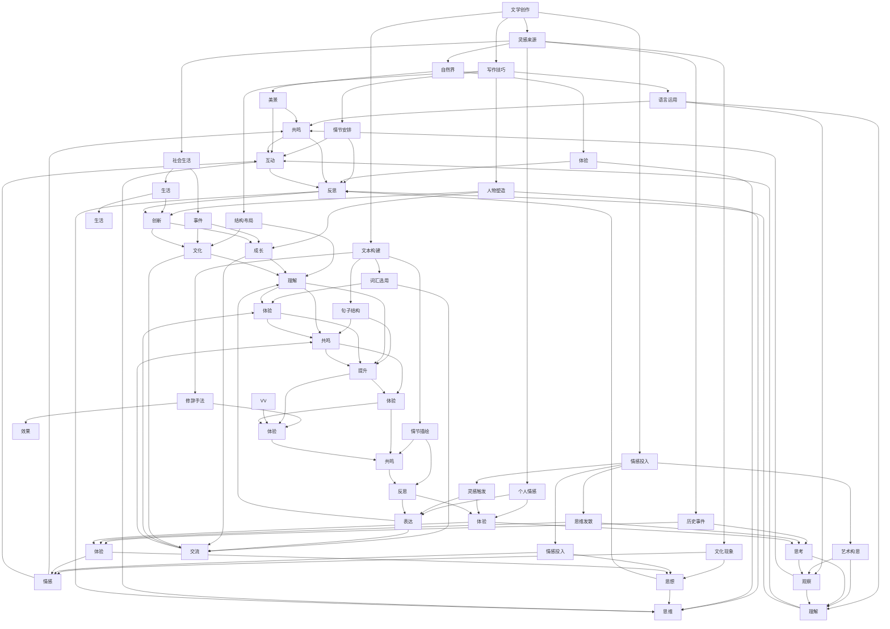

                 

### 文章标题：文学创作与阅读的意义：在字里行间寻找共鸣

> 关键词：文学创作、阅读心理、文学理论、文学作品分析、共鸣现象

> 摘要：本文旨在探讨文学创作与阅读的深远意义，通过分析文学创作的基础、阅读心理与技巧，以及文学理论与流派，深入挖掘文学作品中的共鸣现象。文章结构清晰，逻辑严密，旨在为读者提供一次深刻的技术思维之旅。

### 目录大纲

1. **引言**  
    - 文学创作与阅读的重要性  
    - 本文的研究目标与方法

2. **文学创作的基础**
    - 文学创作的基本概念  
    - 文学创作的灵感来源  
    - 写作技巧与表达方式

3. **文学创作的过程**
    - 文学构思与情节发展  
    - 文本构建与语言运用  
    - 文学创作的心理活动

4. **阅读心理与技巧**
    - 阅读的意义与价值  
    - 提高阅读技巧的方法  
    - 阅读理解与批判性思维

5. **文学理论与流派**
    - 文学理论的演变  
    - 文学流派的探讨

6. **作品分析与鉴赏**
    - 文学作品分析的方法  
    - 文学作品的鉴赏

7. **字里行间的共鸣**
    - 共鸣现象的定义与类型  
    - 共鸣的产生机制  
    - 共鸣在文学创作与阅读中的意义

8. **寻找共鸣的实践**
    - 如何找到文学作品中的共鸣  
    - 共鸣对个人成长的意义  
    - 共鸣与社会文化的联系

9. **总结与拓展**
    - 文学创作与阅读的意义  
    - 最佳实践 tips  
    - 注意事项与拓展阅读

### 文章正文

#### 第一部分：引言

**文学创作与阅读的重要性**

文学创作与阅读是人类文化传承与发展的基石。文学作品不仅传递了作者的情感、思想和价值观，也为读者提供了丰富的精神食粮。文学创作是艺术与科学的结合，它通过语言的组织与运用，创造了一个充满想象力和情感的世界。而阅读则是与作者的心灵对话，读者在字里行间寻找共鸣，体验生命的多样性。

**本文的研究目标与方法**

本文旨在探讨文学创作与阅读的深远意义，通过分析文学创作的基础、阅读心理与技巧，以及文学理论与流派，深入挖掘文学作品中的共鸣现象。文章采用逻辑推理和案例分析的方法，旨在为读者提供一次深刻的技术思维之旅。

#### 第二部分：文学创作的基础

**文学创作的基本概念**

文学创作是指通过语言文字的运用，创造具有审美价值和思想内涵的文学作品。文学创作不仅包括小说、诗歌、戏剧等传统文学形式，也包括散文、随笔、科幻、恐怖等现代文学形式。

**文学创作的灵感来源**

文学创作的灵感来源广泛，可以是自然界的美景、社会生活的体验、个人情感的抒发，也可以是对历史事件、文化现象的思考。灵感如同创作的催化剂，激发作者的创作欲望和灵感。

**写作技巧与表达方式**

写作技巧是文学创作的关键。它包括语言运用、情节安排、人物塑造、结构布局等方面。作者需要通过独特的语言风格和表达方式，使作品具有鲜明的个性和艺术魅力。

#### 第三部分：文学创作的过程

**文学构思与情节发展**

文学构思是创作的基础，它包括确定主题、设定情节、构建人物等方面。情节发展是文学创作的核心，它通过起伏跌宕的故事线，吸引读者的注意力。

**文本构建与语言运用**

文本构建是文学创作的具体实践，它涉及语言的选用、句式的安排、细节的描绘等。语言运用是文学创作的灵魂，它决定了作品的艺术价值和文化内涵。

**文学创作的心理活动**

文学创作是一个复杂的心里过程，它包括灵感触发、思维发散、情感投入、艺术构思等方面。作者需要在创作过程中保持心理平衡和创造力，以达到艺术创作的巅峰状态。

#### 第四部分：阅读心理与技巧

**阅读的意义与价值**

阅读对个人成长和社会进步具有重要意义。它不仅能够提高知识水平，培养思维能力，还能丰富情感，提升审美能力。

**提高阅读技巧的方法**

提高阅读技巧是提升阅读效果的关键。它包括提高阅读速度、增强阅读理解力、培养批判性思维等方面。以下是一些提高阅读技巧的方法：

1. **有目的的阅读**：明确阅读目标，提高阅读效率。
2. **主动思考**：在阅读过程中积极思考，深入理解文本内容。
3. **笔记整理**：做笔记有助于加深对文本的理解和记忆。
4. **定期复习**：定期复习阅读内容，巩固学习成果。

**阅读理解与批判性思维**

阅读理解是阅读的核心目标，它要求读者能够准确理解文本内容，把握作者的观点和意图。批判性思维则是在阅读过程中对文本内容进行评价和反思，以提高思维品质和创新能力。

#### 第五部分：文学理论与流派

**文学理论的演变**

文学理论是文学创作和阅读的理论基础，它随着社会文化和科技的发展而不断演变。从古典主义、浪漫主义、现实主义到现代主义、后现代主义，每个时期的文学理论都有其独特的特点和价值。

**文学流派的探讨**

文学流派是文学创作和阅读的重要分类方式。古典主义、浪漫主义、现实主义等传统流派各有其代表作家和作品。现代主义、后现代主义等流派则更加注重形式创新和思想表达。

#### 第六部分：作品分析与鉴赏

**文学作品分析的方法**

文学作品分析是深入理解文学作品的重要方法。它包括文本解读、人物分析、情节分析等方面。以下是一些常用的文学作品分析方法：

1. **文本解读**：对文学作品的语言、结构、主题等进行深入解读。
2. **人物分析**：分析作品中的主要人物形象，探讨其性格特点和人物关系。
3. **情节分析**：分析作品中的情节发展，探讨其内在逻辑和艺术效果。

**文学作品的鉴赏**

文学作品的鉴赏是提升文学素养的重要途径。它包括审美评价、情感体验、文化理解等方面。以下是一些鉴赏文学作品的方法：

1. **审美评价**：从艺术形式、语言运用、情感表达等方面评价文学作品。
2. **情感体验**：通过阅读体验，感受文学作品中的情感内涵。
3. **文化理解**：从文化背景、历史背景等方面理解文学作品的内涵。

#### 第七部分：字里行间的共鸣

**共鸣现象的定义与类型**

共鸣是指读者在阅读文学作品时，产生的情感共鸣和心理共振现象。共鸣可以分为情感共鸣、思想共鸣、艺术共鸣等类型。

**共鸣的产生机制**

共鸣的产生机制包括以下几个方面：

1. **情感共鸣**：文学作品中的情感表达与读者的情感共鸣产生共鸣。
2. **思想共鸣**：作品中的思想观点与读者的价值观念产生共鸣。
3. **艺术共鸣**：作品的艺术形式、语言风格与读者的审美体验产生共鸣。

**共鸣在文学创作与阅读中的意义**

共鸣在文学创作与阅读中具有重要意义。它不仅能够增强读者的阅读体验，提高文学素养，还能促进文学作品的传播和影响力。

#### 第八部分：寻找共鸣的实践

**如何找到文学作品中的共鸣**

找到文学作品中的共鸣需要以下几个步骤：

1. **认真阅读**：深入理解文学作品的内容和主题。
2. **情感体验**：体会作品中的情感表达，与自己的生活经历产生联系。
3. **思考反思**：对作品的思想观点和艺术形式进行思考，形成自己的见解。

**共鸣对个人成长的意义**

共鸣对个人成长具有重要意义。它能够激发创造力、提升思维能力，培养同情心和人际交往能力。

**共鸣与社会文化的联系**

共鸣不仅是个人的心理体验，也是社会文化的重要组成部分。它反映了社会文化的多样性，促进了文化的传承和创新。

#### 第九部分：总结与拓展

**文学创作与阅读的意义**

文学创作与阅读是人类文明的重要体现，它不仅能够丰富人的精神世界，提高文化素养，还能促进社会进步和文化传承。

**最佳实践 tips**

1. **多读好书**：选择经典文学作品进行阅读，提高文学素养。
2. **写作练习**：通过写作实践，提高文学创作能力。
3. **分享交流**：与他人分享阅读和创作体验，促进共同成长。

**注意事项**

1. **保持耐心**：文学创作和阅读是一个长期的过程，需要持之以恒。
2. **批判性思维**：在阅读和创作中保持批判性思维，不盲目接受和跟从。

**拓展阅读**

1. **文学理论相关书籍**：《文学理论导论》、《文学批评原理》等。
2. **文学作品精选**：《红楼梦》、《战争与和平》、《百年孤独》等。

### 结束语

文学创作与阅读是人类文化的重要组成部分，它不仅能够丰富人的精神世界，提高文化素养，还能促进社会进步和文化传承。通过本文的探讨，我们深入了解了文学创作与阅读的意义，掌握了提高阅读技巧的方法，并揭示了文学作品中的共鸣现象。希望本文能为读者提供一次深刻的技术思维之旅，激发对文学创作与阅读的热情。作者：AI天才研究院/AI Genius Institute & 禅与计算机程序设计艺术 /Zen And The Art of Computer Programming### 文学创作的基础

文学创作是人类智慧的结晶，它通过语言文字的巧妙运用，传递思想、情感和价值观。要理解文学创作的基础，我们首先需要明确文学创作的基本概念。

**文学创作的基本概念**

文学创作是一种通过语言文字进行艺术表达的活动。它不仅包括小说、诗歌、戏剧等传统文学形式，还涵盖了散文、随笔、科幻、恐怖等现代文学形式。文学创作是一种综合性的艺术活动，它要求作者具备丰富的想象力、深刻的思想和精湛的表达技巧。

**文学创作的灵感来源**

灵感是文学创作的源泉，它可以是自然界的美景、社会生活的体验、个人情感的抒发，也可以是对历史事件、文化现象的思考。灵感往往在不经意间触发，它可能来自一次偶然的观察、一次深刻的体验，甚至是一句话、一个词语。作者需要在日常生活中保持敏锐的观察力和丰富的心灵体验，以便在创作过程中捕捉到灵感的火花。

**写作技巧与表达方式**

写作技巧是文学创作的关键，它决定了作品的风格和艺术价值。写作技巧包括以下几个方面：

1. **语言运用**：语言是文学创作的工具，作者需要具备良好的语言表达能力，运用丰富的词汇、准确的语法和生动的修辞手法，使作品具有独特的语言魅力。

2. **情节安排**：情节是文学作品的核心，它决定了故事的起伏和节奏。优秀的情节安排应该具有逻辑性、连贯性和戏剧性，能够吸引读者的注意力，引导读者深入故事情节。

3. **人物塑造**：人物是文学作品的灵魂，作者需要通过生动的描绘和深刻的分析，塑造出具有鲜明个性和深刻内涵的人物形象。

4. **结构布局**：结构是文学作品的基础，它决定了作品的层次和节奏。一个良好的结构布局应该具有紧凑的故事线、合理的情节转折和高潮，使作品整体呈现出流畅和富有层次感。

**语言风格**

语言风格是文学作品的独特标志，它反映了作者的艺术个性和创作理念。不同的语言风格有不同的特点和表现手法，如现代派文学的语言风格强调创新和实验，现实主义文学的语言风格注重真实和朴素，浪漫主义文学的语言风格则追求情感表达和理想化。

**表达方式**

文学创作的表达方式多种多样，包括叙述、描写、对话、心理活动等。不同的表达方式具有不同的艺术效果和表现力，作者需要根据作品的内容和主题，灵活运用各种表达方式，使作品更具艺术魅力。

总之，文学创作的基础在于对文学概念的理解、对灵感的捕捉和运用、对写作技巧的掌握以及对语言风格和表达方式的熟练运用。只有通过不断的实践和积累，才能创作出具有深度和艺术价值的文学作品。

#### 文学创作的过程

文学创作是一个复杂而充满创造力的过程，它不仅需要作者拥有丰富的想象力、深刻的思想和精湛的表达技巧，还需要作者具备一定的文学素养和写作经验。本文将深入探讨文学创作的过程，包括文学构思与情节发展、文本构建与语言运用以及文学创作的心理活动。

**文学构思与情节发展**

文学构思是文学创作的第一步，它是作者对作品主题、人物和情节的整体规划和设计。在构思阶段，作者需要明确作品的主题，构思出主要人物和情节线索，为后续的创作奠定基础。

1. **确定主题**：主题是文学作品的灵魂，它决定了作品的主题思想和情感表达。作者需要从社会生活、历史事件、个人经历等多方面寻找灵感，提炼出具有深刻内涵的主题。

2. **构思情节**：情节是文学作品的骨架，它决定了故事的起伏和节奏。作者需要设计出情节的发展、高潮和结局，使故事具有吸引力和戏剧性。情节构思需要遵循逻辑性和连贯性，避免出现逻辑漏洞和情节混乱。

3. **设计人物**：人物是文学作品的灵魂，他们通过故事情节展现作者的思想和情感。作者需要为人物设定性格特点、人生经历和内心世界，使人物形象丰满立体。

**文本构建与语言运用**

文本构建是文学创作的具体实施阶段，它是作者将构思转化为文字的过程。在这一阶段，作者需要运用丰富的语言技巧，构建出富有艺术魅力的文本。

1. **选用词汇**：词汇是文学创作的基础，作者需要运用丰富的词汇量，选用准确的词汇表达思想和情感。同时，作者还需要注重词汇的生动性和形象性，使作品更具表现力。

2. **句子结构**：句子结构是语言运用的关键，它决定了文本的节奏和韵律。作者需要运用多样化的句子结构，避免单调和平淡，使文本富有变化和张力。

3. **修辞手法**：修辞手法是增强语言艺术效果的重要手段，如比喻、拟人、排比、对仗等。作者需要巧妙运用修辞手法，使作品更具文学性和感染力。

4. **情节描绘**：情节描绘是文本构建的核心，它决定了故事的生动性和真实感。作者需要通过生动的描绘，展现人物的情感和心理状态，使故事更具吸引力。

**文学创作的心理活动**

文学创作是一个心理过程，它包括灵感触发、思维发散、情感投入和艺术构思等方面。作者需要在创作过程中保持心理平衡和创造力，以达到艺术创作的巅峰状态。

1. **灵感触发**：灵感是创作的起点，它可以在日常生活中随时出现。作者需要保持敏锐的观察力和丰富的想象力，捕捉灵感。

2. **思维发散**：思维发散是创作过程中的一种思维方式，它要求作者不受限于既定的思维模式，从多角度、多层次思考问题。

3. **情感投入**：情感是文学创作的动力，它使作品具有感染力和艺术价值。作者需要在创作过程中投入真实的情感，使作品更具情感深度。

4. **艺术构思**：艺术构思是创作的核心，它要求作者在创作过程中运用艺术思维，设计出具有创新性和艺术价值的作品。

总之，文学创作的过程是一个复杂而充满创造力的过程，它不仅需要作者具备丰富的文学素养和写作技巧，还需要作者在创作过程中保持心理平衡和创造力。通过不断的实践和积累，作者可以创作出具有深度和艺术价值的文学作品。

#### 阅读心理与技巧

阅读不仅是获取知识的过程，更是一种心灵体验。在阅读过程中，读者不仅与文字互动，还与作者产生情感共鸣，深入理解作品的思想内涵。本文将从阅读的意义与价值、提高阅读技巧的方法以及阅读理解与批判性思维三个方面探讨阅读心理与技巧。

**阅读的意义与价值**

阅读对个人成长和社会进步具有重要意义。它不仅能够提高知识水平，培养思维能力，还能丰富情感，提升审美能力。

1. **知识积累**：阅读是获取知识的重要途径。通过阅读，读者可以了解历史、科学、文化等多方面的知识，拓宽视野，提升综合素质。

2. **思维培养**：阅读能够培养批判性思维和创造性思维。在阅读过程中，读者需要对文本内容进行理解和分析，这有助于提高逻辑思维和创新能力。

3. **情感丰富**：阅读能够丰富读者的情感世界。文学作品中的情感表达能够引发读者的共鸣，使读者在情感体验中感受到人性的多样性和深刻性。

4. **审美提升**：阅读能够提升读者的审美能力。通过阅读优秀的文学作品，读者可以学习到各种艺术形式和审美标准，提高自己的审美素养。

**提高阅读技巧的方法**

提高阅读技巧是提升阅读效果的关键。以下是一些提高阅读技巧的方法：

1. **有目的的阅读**：明确阅读目标，提高阅读效率。在阅读前，可以设定具体的目标，如了解某一领域的知识、掌握某一技能等。

2. **主动思考**：在阅读过程中积极思考，深入理解文本内容。通过提问、做笔记等方式，促进对文本的深入理解。

3. **笔记整理**：做笔记有助于加深对文本的理解和记忆。在阅读过程中，可以记录重要的观点、论据和关键信息。

4. **定期复习**：定期复习阅读内容，巩固学习成果。通过复习，可以加深对阅读内容的理解和记忆，提高知识储备。

5. **多样化阅读**：多读不同类型的书籍，提高阅读的广度和深度。通过阅读不同类型的书籍，可以学习到不同的观点和知识，提高思维品质。

**阅读理解与批判性思维**

阅读理解是阅读的核心目标，它要求读者能够准确理解文本内容，把握作者的观点和意图。批判性思维则是在阅读过程中对文本内容进行评价和反思，以提高思维品质和创新能力。

1. **阅读理解**：提高阅读理解能力，需要掌握以下技巧：
   - 精读与略读相结合：对重要内容进行精读，对次要内容进行略读，提高阅读效率。
   - 理解关键词语和句子：通过上下文理解关键词语和句子的含义，确保对文本内容的准确理解。
   - 分析作者观点：通过分析文本内容，理解作者的观点和论据，把握文章的中心思想。

2. **批判性思维**：批判性思维是阅读过程中的一种思维方式，它要求读者对文本内容进行评价和反思。以下是一些批判性思维的技巧：
   - 检验论据：对文本中的论据进行检验，判断其是否合理和充分。
   - 分析论证过程：分析文本中的论证过程，判断其逻辑性和严密性。
   - 形成自己的观点：在阅读过程中，形成自己的观点和见解，对文本内容进行评价和反思。

总之，阅读心理与技巧是提升阅读效果的重要途径。通过理解阅读的意义与价值，掌握提高阅读技巧的方法，以及培养阅读理解与批判性思维，读者可以在阅读过程中获得更丰富的体验和更深刻的理解，从而提升自己的综合素质和创新能力。

#### 文学理论的演变

文学理论是文学创作和阅读的理论基础，它随着社会文化和科技的发展而不断演变。从古典主义到现代主义，再到后现代主义，每个时期的文学理论都有其独特的特点和价值。

**古典主义文学理论**

古典主义文学理论起源于古希腊和古罗马时期，强调理性和秩序。古典主义文学理论认为，文学创作应该遵循一定的规范和规则，如和谐、平衡和简洁。亚里士多德的《诗学》是古典主义文学理论的代表作，它提出了文学创作的基本原则和审美标准。

**浪漫主义文学理论**

浪漫主义文学理论起源于18世纪末至19世纪初的欧洲，强调情感和个人主义。浪漫主义文学理论认为，文学创作应该表达个人的情感和思想，强调主观体验和想象力。浪漫主义文学理论对传统文学规范进行了批判，推动了文学形式的创新和发展。

**现实主义文学理论**

现实主义文学理论起源于19世纪中叶，强调对现实生活的真实描绘。现实主义文学理论认为，文学创作应该关注社会现实，揭示社会问题和人类命运的苦难。现实主义文学理论对文学创作产生了深远影响，推动了文学与社会现实紧密结合。

**现代主义文学理论**

现代主义文学理论起源于20世纪初，强调形式创新和思想表达。现代主义文学理论认为，文学创作应该摆脱传统形式的束缚，探索新的表达方式。现代主义文学理论关注个体存在的孤独和荒诞，表达了对现实社会的批判和对人类命运的思考。

**后现代主义文学理论**

后现代主义文学理论起源于20世纪中叶，强调对权威和理性的批判。后现代主义文学理论认为，文学创作应该打破传统观念和规范，追求多样性和包容性。后现代主义文学理论关注文化多元性、性别身份和权力关系，推动了文学理论的进一步发展。

**文学流派的探讨**

文学流派是文学创作和阅读的重要分类方式，它反映了不同时期和地区的文学特点。以下是几个主要的文学流派：

1. **古典主义文学**：强调理性和秩序，追求完美和和谐。代表作家有莎士比亚、 Racine等。

2. **浪漫主义文学**：强调情感和个人主义，追求自由和理想。代表作家有拜伦、雪莱、Wordsworth等。

3. **现实主义文学**：强调对现实生活的真实描绘，关注社会问题和人类命运。代表作家有巴尔扎克、狄更斯、托尔斯泰等。

4. **现代主义文学**：强调形式创新和思想表达，关注个体存在的孤独和荒诞。代表作家有乔伊斯、艾略特、卡夫卡等。

5. **后现代主义文学**：强调对权威和理性的批判，追求多样性和包容性。代表作家有福克纳、加西亚·马尔克斯、艾科等。

总之，文学理论的演变和文学流派的探讨，丰富了文学的内涵和表现形式。通过了解不同时期的文学理论，我们可以更好地理解文学创作和阅读的意义，从而提升自己的文学素养和审美能力。

#### 作品分析与鉴赏

**文学作品分析的方法**

文学作品分析是深入理解文学作品的重要方法。它包括文本解读、人物分析、情节分析等方面。以下是一些常用的文学作品分析方法：

1. **文本解读**：文本解读是对文学作品的语言、结构、主题等进行深入解读。它要求读者理解作品中的语言表达、句式结构和修辞手法，从而把握作品的内涵和意义。

2. **人物分析**：人物分析是对作品中的主要人物进行深入剖析。它要求读者分析人物的性格特点、人生经历和内心世界，从而理解人物的行为动机和情感变化。

3. **情节分析**：情节分析是对作品中的情节发展进行深入分析。它要求读者理解情节的逻辑性、连贯性和戏剧性，从而把握故事的发展和主题的展现。

**文学作品的鉴赏**

文学作品的鉴赏是提升文学素养的重要途径。它包括审美评价、情感体验、文化理解等方面。以下是一些鉴赏文学作品的方法：

1. **审美评价**：审美评价是对文学作品的艺术形式和语言表达进行评价。它要求读者从词汇、句式、修辞手法等方面分析作品的艺术魅力，从而判断作品的艺术价值。

2. **情感体验**：情感体验是通过阅读作品，感受作品中的情感表达和情感变化。它要求读者投入情感，与作品中的情感产生共鸣，从而深刻理解作品的内涵。

3. **文化理解**：文化理解是从文化背景、历史背景等方面理解作品的文化内涵。它要求读者了解作品产生的时代背景、社会环境和文化背景，从而更好地理解作品的意义和价值。

通过文本解读、人物分析和情节分析，我们可以深入理解文学作品的内涵和意义；通过审美评价、情感体验和文化理解，我们可以提升对文学作品的鉴赏能力。这些方法不仅适用于学术研究，也适用于日常阅读，使我们能够在阅读过程中获得更丰富的体验和更深刻的理解。

#### 字里行间的共鸣

**共鸣现象的定义与类型**

共鸣是指读者在阅读文学作品时，产生的情感共鸣和心理共振现象。共鸣可以分为以下几种类型：

1. **情感共鸣**：情感共鸣是指读者在阅读过程中，与作品中的情感产生共鸣，感受到作者的情感表达。这种共鸣可以使读者深刻体会到作品中的喜怒哀乐，从而加深对作品的理解。

2. **思想共鸣**：思想共鸣是指读者在阅读过程中，与作品中的思想观点产生共鸣，认同或反思作者的观点。这种共鸣可以使读者在思想层面上与作者产生互动，从而拓展自己的思维视野。

3. **艺术共鸣**：艺术共鸣是指读者在阅读过程中，与作品中的艺术形式和表达方式产生共鸣，感受到作品的艺术魅力。这种共鸣可以使读者在审美体验中与作品产生共鸣，从而提升对艺术的理解和欣赏能力。

**共鸣的产生机制**

共鸣的产生机制可以从以下几个方面进行理解：

1. **情感共鸣**：情感共鸣的产生机制主要源于作品中的情感表达和读者自身的情感体验。作品中的情感表达通过语言、情节、人物等手段传递给读者，使读者在情感上产生共鸣。

2. **思想共鸣**：思想共鸣的产生机制主要源于作品中的思想观点和读者的价值观。作品中的思想观点通过逻辑推理、事实陈述等方式传递给读者，使读者在思想上产生共鸣。

3. **艺术共鸣**：艺术共鸣的产生机制主要源于作品中的艺术形式和读者的审美体验。作品中的艺术形式通过视觉、听觉、触觉等感官体验传递给读者，使读者在审美体验中产生共鸣。

**共鸣在文学创作与阅读中的意义**

共鸣在文学创作与阅读中具有重要意义：

1. **增强阅读体验**：共鸣可以使读者在阅读过程中产生强烈的情感体验，从而提高阅读的乐趣和兴趣。

2. **促进文学理解**：共鸣可以帮助读者更深刻地理解文学作品的思想内容和艺术形式，从而提升文学素养。

3. **拓展思维视野**：共鸣可以激发读者的思考，使读者在思想层面上与作者产生互动，从而拓展自己的思维视野。

4. **促进文化交流**：共鸣可以使不同文化背景的读者在阅读过程中产生共同的体验和理解，从而促进文化交流和沟通。

总之，共鸣是文学创作与阅读中的一种重要现象，它通过情感、思想和艺术的共振，使读者与作品产生深刻的联系，从而提升阅读体验和文学素养。理解共鸣的产生机制和意义，对于文学创作和阅读都具有重要的指导作用。

#### 寻找共鸣的实践

**如何找到文学作品中的共鸣**

找到文学作品中的共鸣是一个需要技巧和经验的过程。以下是一些具体的方法：

1. **深入阅读**：阅读是找到共鸣的基础。读者需要深入阅读作品，理解作品中的情感表达、思想观点和艺术形式。

2. **情感体验**：在阅读过程中，读者可以尝试将自己置身于作品中的情境中，感受作品中人物的情感变化，从而产生情感共鸣。

3. **思考与反思**：读者可以在阅读过程中进行思考与反思，对作品中的思想观点和艺术形式进行评价和反思，从而在思想上产生共鸣。

4. **联系生活**：读者可以将作品中的情节、人物和思想与自己生活中的经历和感受联系起来，从而找到共鸣点。

5. **讨论与交流**：与他人讨论和交流作品，听取他人的观点和感受，可以拓宽自己的视野，找到更多的共鸣点。

**共鸣对个人成长的意义**

共鸣对个人成长具有重要意义：

1. **情感成长**：通过共鸣，读者可以更好地理解他人的情感，培养同情心和人际交往能力。

2. **思想提升**：共鸣可以激发读者的思考，使读者在思想层面上与作者产生互动，从而拓展自己的思维视野。

3. **审美提升**：共鸣可以提升读者的审美能力，使读者更好地欣赏和理解艺术作品。

4. **自我反思**：共鸣可以促使读者反思自己的生活和价值观，从而促进个人成长和进步。

**共鸣与社会文化的联系**

共鸣不仅是个人的心理体验，也是社会文化的重要组成部分：

1. **文化传承**：文学作品通过共鸣传递文化内涵和价值观，促进文化的传承和传播。

2. **文化交流**：共鸣可以使不同文化背景的读者在阅读过程中产生共同的体验和理解，从而促进文化交流和融合。

3. **社会认同**：共鸣可以使读者在阅读过程中感受到社会的认同和归属，增强社会凝聚力。

4. **文化创新**：共鸣可以激发文化创新，推动文学创作和艺术形式的多样化发展。

总之，寻找共鸣不仅是阅读的一种技巧，也是个人成长和社会文化发展的重要途径。通过深入阅读、情感体验、思考与反思、联系生活和讨论与交流，我们可以更好地找到文学作品中的共鸣，从而提升个人素养和社会文化水平。

#### 总结与拓展

**文学创作与阅读的意义**

文学创作与阅读是人类文化的重要组成部分，它不仅能够丰富人的精神世界，提高文化素养，还能促进社会进步和文化传承。通过文学创作，作者可以表达自己的思想、情感和价值观，创造具有艺术价值的文学作品。而阅读则是与作者的心灵对话，读者在字里行间寻找共鸣，体验生命的多样性。文学创作与阅读相辅相成，共同构成了人类文化传承与发展的基石。

**最佳实践 tips**

1. **多读好书**：选择经典文学作品进行阅读，提高文学素养。
2. **写作练习**：通过写作实践，提高文学创作能力。
3. **分享交流**：与他人分享阅读和创作体验，促进共同成长。

**注意事项**

1. **保持耐心**：文学创作和阅读是一个长期的过程，需要持之以恒。
2. **批判性思维**：在阅读和创作中保持批判性思维，不盲目接受和跟从。

**拓展阅读**

1. **文学理论相关书籍**：《文学理论导论》、《文学批评原理》等。
2. **文学作品精选**：《红楼梦》、《战争与和平》、《百年孤独》等。

**结语**

文学创作与阅读是人类文化的重要组成部分，它不仅能够丰富人的精神世界，提高文化素养，还能促进社会进步和文化传承。通过本文的探讨，我们深入了解了文学创作与阅读的意义，掌握了提高阅读技巧的方法，并揭示了文学作品中的共鸣现象。希望本文能为读者提供一次深刻的技术思维之旅，激发对文学创作与阅读的热情。作者：AI天才研究院/AI Genius Institute & 禅与计算机程序设计艺术 /Zen And The Art of Computer Programming以下是文章的Mermaid流程图，用于展示核心概念原理之间的关系架构：

这段Mermaid代码生成的流程图展示了文学创作与阅读过程中的核心概念与联系，包括灵感来源、写作技巧、文本构建、情感投入等方面，以及这些概念之间的相互作用和影响。通过这个流程图，我们可以更直观地理解文学创作与阅读的复杂性和丰富性。

