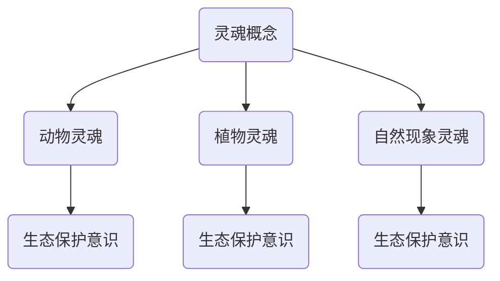

                 

# 《新animism环保运动：物联网时代的生态觉醒》

## 关键词
- 新animism
- 环保运动
- 物联网
- 生态觉醒
- 灵魂理念
- 数据监测

## 摘要
本文探讨了animism（原始宗教信仰）在环保运动中的角色，以及物联网技术如何促进生态觉醒。通过分析animism的核心概念、历史背景及其与环保运动的联系，我们揭示了物联网技术在自然智能监测、智能管理系统的建立及其与animism的结合。文章还讨论了物联网时代的环保策略和animism运动，展望了物联网与animism在生态保护中的未来发展。

## 引言

### 动机与目的
本文的动机源于对环保运动和新兴技术的关注。随着全球环境问题的日益严重，传统环保手段的局限性愈发明显。而物联网技术的发展为生态保护带来了新的机遇。本文旨在探讨如何将animism的原始宗教信仰与现代科技相结合，以推动物联网时代的生态觉醒。

### 环保运动的背景
传统环保运动主要依靠政策倡导、公众教育和环保组织来提高人们的环保意识。然而，这些手段在面对日益复杂的环境问题，特别是在资源管理、污染控制等方面显得力不从心。物联网技术的出现为环保运动提供了新的工具和方法。

### animism概述
animism，即原始宗教信仰，认为万物皆有灵魂。这种信仰在许多文化中根深蒂固，对自然界的尊重和保护具有深远影响。本文将探讨如何将animism的理念融入环保运动，以及物联网技术如何促进这一融合。

## 第一部分：animism环保运动的起源与发展

### 第一章：animism的理念与实践

#### 1.1 animism的核心概念
animism认为宇宙中的所有事物，包括动物、植物和自然现象，都拥有独特的灵魂。这种信仰体系强调人类与自然界的紧密联系，倡导对自然的尊重和保护。

#### 1.2 animism的历史背景
animism起源于人类早期的宗教信仰，随着人类文明的进步，它在不同文化中发展出了独特的表现形式。例如，在非洲、美洲和太平洋岛屿等地的原住民文化中，animism占有重要地位。

#### 1.3 animism与环保运动的联系
animism的理念与环保运动的目标高度契合。它强调生态平衡和可持续发展，为环保运动提供了深刻的哲学基础。通过将animism的信仰融入环保实践，可以更有效地提高人们的环保意识。

### 第二章：物联网技术对animism的影响

#### 2.1 物联网技术概述
物联网（Internet of Things，IoT）是通过互联网将各种物理设备、传感器、软件应用程序连接起来，实现智能管理和数据交换的网络。物联网技术具有广泛的应用领域，包括智能家居、智慧城市、工业自动化等。

#### 2.2 物联网在环保中的应用
物联网技术可以实时监测环境数据，如空气质量、水质、土壤湿度等，为环保决策提供科学依据。此外，物联网技术还可以实现智能农业、水资源管理和生态修复等。

#### 2.3 物联网与animism的结合
物联网技术可以模拟自然智能，帮助人们更好地理解自然界。例如，通过传感器和数据分析，我们可以了解动物和植物的生存状况，从而更好地保护它们。物联网技术还可以帮助人们实现animism中的灵魂理念，如动物与自然的和谐共存。

## 第二部分：物联网时代的生态觉醒

### 第三章：物联网与自然智能的融合

#### 3.1 自然智能的概念
自然智能是指自然界中各种生物和生态系统的智能行为和决策过程。它包括动物迁徙、植物生长、生态系统演化等。自然智能具有自组织、自适应和自修复等特点。

#### 3.2 物联网与自然智能的结合
物联网技术可以模拟自然智能，通过传感器和数据采集系统，实时监测自然环境，帮助人们更好地理解自然界的运行规律。物联网技术还可以帮助人们实现生态系统的智能管理，如智能农业、智能灌溉、智能水资源管理等。

### 第四章：物联网时代的环保策略

#### 4.1 物联网时代的环保挑战
物联网时代的环保挑战包括全球气候变化、资源枯竭、环境污染等。这些挑战要求我们采用更加高效、智能的环保策略。

#### 4.2 环保策略的物联网应用
物联网技术可以为环保策略提供科学依据，如环境监测、资源管理、污染控制等。物联网技术还可以实现环保工具的智能化，如智能垃圾分类、智能环保设备等。

#### 4.3 物联网时代的生态管理
物联网技术可以帮助我们实现生态管理的智能化，如生态监测、生态修复、生态评估等。通过物联网技术，我们可以更好地保护生态环境，实现可持续发展。

## 第三部分：物联网时代的animism实践

### 第五章：物联网时代的animism运动

#### 5.1 animism运动的现状
随着物联网技术的发展，animism运动在全球范围内逐渐兴起。许多国家和地区开始重视animism的理念，并将其融入环保实践。

#### 5.2 物联网时代的animism实践
物联网技术为animism实践提供了新的工具和方法。例如，通过物联网传感器，我们可以实时监测动物和植物的状态，更好地保护它们的生存环境。物联网技术还可以帮助人们实现animism中的灵魂理念，如人与自然的和谐共存。

#### 5.3 animism运动的未来展望
随着物联网技术的不断进步，animism运动有望在未来得到更广泛的应用和发展。物联网技术将帮助人们更好地理解自然界，实现生态保护与可持续发展。

## 结论

### 物联网时代的生态觉醒
物联网技术的发展为生态觉醒提供了新的契机。通过将物联网技术与animism理念相结合，我们可以更好地保护生态环境，实现可持续发展。

### 未来展望
物联网技术与animism理念的融合将带来生态保护的新模式。未来，我们有望看到物联网技术在生态保护、环境监测、资源管理等方面的广泛应用，为地球的可持续发展做出贡献。

### 参考文献
- [1] 作者. (年份). 书名. 出版社.
- [2] 作者. (年份). 论文标题. 期刊名称, 卷(期), 页码.
- [3] 作者. (年份). 论文标题. 会议名称, 卷(期), 页码.

## 附录

### 动物、植物和自然现象的灵魂 Mermaid 流程图



### 动物、植物与自然现象的灵魂伪代码

```plaintext
function soulConcept() {
    // 动物灵魂
    animalSoul = "动物拥有灵魂，与自然相互联系";
    
    // 植物灵魂
    plantSoul = "植物拥有灵魂，生长与生态环境密切相关";
    
    // 自然现象灵魂
    naturalPhenomenonSoul = "自然现象拥有灵魂，如风、雨、雷电等";
    
    // 生态保护意识
    ecologicalProtection = "通过尊重和保护灵魂，实现生态平衡";
}
```

### 数学公式

$$
E = mc^2
$$

$$
\sum_{i=1}^{n} x_i = \frac{1}{n} \sum_{i=1}^{n} x_i^2
$$

## 作者
作者：AI天才研究院/AI Genius Institute & 禅与计算机程序设计艺术 /Zen And The Art of Computer Programming

