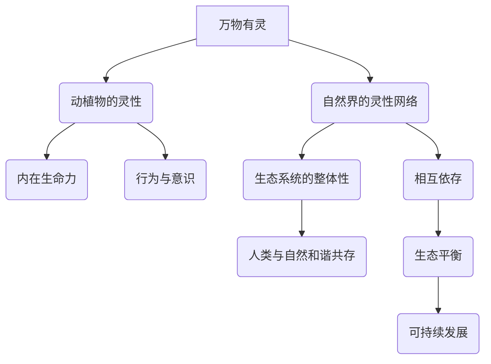

                 

### 文章标题: 新animism运动：在万物有灵中寻找生态意义

#### 关键词：万物有灵、新animism、生态意义、哲学观念、伦理观念、艺术实践、教育应用

#### 摘要：
本文深入探讨了新animism运动的核心概念、哲学基础及其在生态、艺术和教育领域的应用。新animism是一种新兴的哲学观念，主张万物皆有灵性，强调人与自然和谐共存。本文通过历史背景介绍、核心概念阐释、哲学与伦理分析，以及实际应用案例分析，全面展示了新animism的生态意义和其对社会的影响。

### 第一部分：引言与历史背景

#### 第1章：引言

##### **1.1** 动机的阐述

- **1.1.1** 探索万物有灵的意义
  - 探讨万物有灵观念对人类生态意识的启发。
  - 分析万物有灵观念与人类情感、行为模式的关联。

- **1.1.2** 人类与自然的关系
  - 回顾人类历史中对自然的态度演变。
  - 探讨现代人类如何重新审视与自然的关系。

##### **1.2** 新animism运动的起源与发展

- **1.2.1** 新animism的定义
  - 确定新animism的基本概念和核心思想。

- **1.2.2** 新animism的兴起与传播
  - 分析新animism在全球范围内的兴起过程。
  - 探讨新animism在不同文化背景下的传播方式。

- **1.2.3** 新animism的主要流派
  - 介绍新animism的主要流派及其特点。

### 第二部分：核心概念与理论基础

#### 第2章：新animism的核心概念

##### **2.1** 万物有灵的哲学观念

- **2.1.1** 动植物的灵性
  - 探讨动植物的内在意识与灵性。
  - 分析人类如何感知和理解动植物的灵性。

- **2.1.2** 自然界的灵性网络
  - 描述自然界中万物之间的灵性联系。
  - 探讨灵性网络对生态系统稳定性的影响。

##### **2.2** 新animism的理论基础

- **2.2.1** 心理学与精神分析
  - 分析心理学理论对万物有灵观念的解读。
  - 探讨精神分析在理解灵性现象中的作用。

- **2.2.2** 宗教与神话学
  - 研究宗教和神话中关于灵性的传统观念。
  - 探讨新animism如何融合传统宗教和神话观念。

- **2.2.3** 文化人类学
  - 分析文化人类学视角下的万物有灵观念。
  - 探讨文化多样性与万物有灵观念的关系。

#### 第3章：新animism的哲学与伦理

##### **3.1** 新animism的世界观

- **3.1.1** 自然至上主义
  - 解释自然至上主义的基本原理。
  - 分析自然至上主义如何影响人类价值观。

- **3.1.2** 宇宙的整体性
  - 探讨宇宙整体性的概念。
  - 分析整体性观念对人类认知的影响。

##### **3.2** 新animism的伦理观

- **3.2.1** 尊重所有生命形式
  - 解释尊重生命形式的重要性。
  - 分析如何在日常生活中实践这一伦理观念。

- **3.2.2** 保护自然环境的行动准则
  - 提出保护自然环境的行动准则。
  - 分析这些准则如何指导人类行为。

### 第三部分：新animism运动的应用与实践

#### 第4章：新animism与生态学

##### **4.1** 新animism对生态学的贡献

- **4.1.1** 生态伦理的形成
  - 探讨新animism如何促进生态伦理的形成。
  - 分析生态伦理观念对人类行为的影响。

- **4.1.2** 生态保护的实践
  - 介绍新animism在生态保护中的具体实践。
  - 分析这些实践对生态系统的影响。

##### **4.2** 新animism在生态恢复中的应用

- **4.2.1** 生态修复项目案例分析
  - 分析具体的生态修复项目案例。
  - 探讨新animism在项目中的实施过程。

- **4.2.2** 生态恢复的理论与实践
  - 解释生态恢复的理论基础。
  - 探讨新animism如何指导生态恢复实践。

#### 第5章：新animism与艺术

##### **5.1** 新animism在艺术创作中的应用

- **5.1.1** 艺术作品中的万物有灵观念
  - 分析艺术作品中体现的万物有灵观念。
  - 探讨艺术家如何表达这些观念。

- **5.1.2** 新animism对艺术表现形式的启示
  - 探讨新animism对艺术表现形式的影响。
  - 分析新animism如何激发艺术创新。

##### **5.2** 新animism艺术实践案例分析

- **5.2.1** 环境艺术项目
  - 分析环境艺术项目中的新animism实践。
  - 探讨项目如何体现新animism的哲学观念。

- **5.2.2** 新animism艺术工作坊介绍
  - 介绍新animism艺术工作坊的基本情况。
  - 分析工作坊如何帮助参与者理解新animism。

#### 第6章：新animism与教育

##### **6.1** 新animism在教育中的角色

- **6.1.1** 教育理念与课程设计
  - 探讨新animism如何影响教育理念。
  - 分析新animism在课程设计中的应用。

- **6.1.2** 教育实践案例
  - 分析新animism在教育实践中的应用案例。
  - 探讨这些案例对教育实践的影响。

##### **6.2** 新animism与跨学科教育

- **6.2.1** 自然科学与人文学科的结合
  - 探讨新animism如何促进自然科学与人文学科的融合。
  - 分析跨学科教育的优势。

- **6.2.2** 新animism在跨学科课程中的应用
  - 介绍新animism在跨学科课程中的应用实例。
  - 探讨跨学科课程如何体现新animism的思想。

### 第四部分：新animism的未来与挑战

#### 第7章：新animism运动的发展趋势

##### **7.1** 新animism在当代社会的影响

- **7.1.1** 社会意识的觉醒
  - 分析新animism如何推动社会意识的觉醒。
  - 探讨社会意识觉醒对人类行为的影响。

- **7.1.2** 新animism与社会运动
  - 探讨新animism如何影响社会运动。
  - 分析新animism在社会运动中的角色。

##### **7.2** 新animism的未来前景

- **7.2.1** 科技与灵性结合的潜在趋势
  - 探讨科技与灵性结合的未来趋势。
  - 分析科技发展如何影响新animism的传播。

- **7.2.2** 新animism在全球化背景下的传播
  - 分析新animism在全球化背景下的传播路径。
  - 探讨全球化对新animism发展的影响。

#### 第8章：新animism运动的挑战与应对策略

##### **8.1** 新animism面临的挑战

- **8.1.1** 学术界的质疑
  - 探讨学术界对new animism的质疑及其原因。
  - 分析质疑对new animism发展的潜在影响。

- **8.1.2** 社会接受度
  - 分析社会对新animism的接受度。
  - 探讨提高社会接受度的策略。

##### **8.2** 应对策略

- **8.2.1** 增强科学性与实证性
  - 探讨如何增强new animism的科学性与实证性。
  - 分析科学性与实证性对new animism发展的重要性。

- **8.2.2** 扩大社会参与度
  - 探讨如何扩大社会对新animism的参与度。
  - 分析社会参与度对new animism发展的意义。

### 附录

#### 附录A：新animism相关资源与资料

- **A.1** 推荐阅读
  - 提供与new animism相关的推荐阅读材料。
  - 分析这些材料对理解new animism的重要性。

- **A.2** 网络资源链接
  - 提供与new animism相关的网络资源链接。
  - 分析网络资源如何帮助读者深入了解new animism。

- **A.3** 学术会议与研讨会
  - 提供与new animism相关的学术会议和研讨会信息。
  - 分析这些会议和研讨会对new animism发展的推动作用。

## 文章结束：作者信息
作者：AI天才研究院/AI Genius Institute & 禅与计算机程序设计艺术 /Zen And The Art of Computer Programming

## 文章完整版

### 《新animism运动：在万物有灵中寻找生态意义》

#### 关键词：万物有灵、新animism、生态意义、哲学观念、伦理观念、艺术实践、教育应用

#### 摘要：
本文深入探讨了新animism运动的核心概念、哲学基础及其在生态、艺术和教育领域的应用。新animism是一种新兴的哲学观念，主张万物皆有灵性，强调人与自然和谐共存。本文通过历史背景介绍、核心概念阐释、哲学与伦理分析，以及实际应用案例分析，全面展示了新animism的生态意义和其对社会的影响。

### 第一部分：引言与历史背景

#### 第1章：引言

**1.1 动机的阐述**

**1.1.1 探索万物有灵的意义**
万物有灵观念，即相信所有事物，无论是人类、动物、植物，还是自然现象，都拥有一种内在的生命力和灵性。这一观念在人类历史中有着悠久的传统，从古代神话、宗教到现代文学、电影，万物有灵的观念始终扮演着重要的角色。探讨万物有灵的意义，有助于我们理解人类与自然的关系，以及如何在现代社会中重新审视这种关系。

在当代社会中，人类对自然资源的过度开发和污染导致了生态环境的严重破坏。万物有灵观念提醒我们，每个生命体都有其独特的价值和存在的意义，我们不能仅仅将自然视为人类利用的工具。通过重新认识万物有灵的意义，我们可以激发出对自然保护的意识，从而采取更负责任的态度对待自然。

**1.1.2 人类与自然的关系**
人类与自然的关系是一个复杂而深远的话题。从史前时代开始，人类就依赖于自然生存，而现代社会的工业化、城市化进程进一步加剧了人类对自然资源的依赖。然而，随着科技的发展和人类对自然认知的深入，人类对自然的态度也在不断变化。

在过去的几千年中，人类普遍认为自己是自然的主宰，可以随意改变和利用自然资源。然而，这种态度导致了自然环境的严重破坏，使得人类开始反思自己的行为，并重新审视与自然的关系。

新animism运动正是在这种背景下兴起，它主张万物有灵，强调人类与自然的和谐共存。通过探讨人类与自然的关系，新animism试图引导人类采取更加尊重自然、保护生态环境的态度，从而实现可持续发展。

**1.2 新animism运动的起源与发展**

**1.2.1 新animism的定义**
新animism，也被称为现代animism，是一种哲学观念，主张万物皆有灵性，包括动植物、自然现象以及无生命的物体。新animism不同于传统宗教中的神灵崇拜，它更注重对自然界的内在感知和体验。

新animism强调个体与宇宙的连接，认为每个生命体都存在于一个庞大的灵性网络中。这种观念不仅关注人类与自然的关系，还涉及到人类内心的灵性成长。新animism的核心观点是，通过认识到万物有灵，人类可以更好地理解自然、尊重自然，并实现与自然的和谐共存。

**1.2.2 新animism的兴起与传播**
新animism作为一种哲学观念，起源于20世纪末的西方社会，特别是在美国和欧洲。它的兴起与环境保护运动、生态学发展以及人类对内心灵性追求的兴起密切相关。

在20世纪六七十年代，环境保护运动的兴起使得人们开始关注自然资源的保护，这为新animism的兴起提供了土壤。同时，人类对内心灵性追求的兴起，也使得人们开始探索更深入的生命意义。新animism的观念，正是这种追求的一种体现。

新animism的传播主要依赖于个人传播和社会网络。通过书籍、研讨会、网络平台等方式，新animism的观念逐渐传播到世界各地。特别是在那些关注环境保护和心灵成长的群体中，新animism的影响力日益增强。

**1.2.3 新animism的主要流派**
新animism的发展过程中，形成了多个主要的流派，每个流派都有其独特的特点和理念。

其中，最具代表性的是生态animism和文化animism。生态animism强调生态系统的整体性和生命体的相互依存，主张通过保护生态环境来实现人类与自然的和谐共存。文化animism则更注重文化传统和人类内心灵性的发展，认为通过文化传承和灵性成长，人类可以更好地理解自然和自我。

此外，还有其他一些流派，如精神animism、艺术animism等，它们从不同的角度探讨新animism的观念和应用。

### 第二部分：核心概念与理论基础

#### 第2章：新animism的核心概念

**2.1 万物有灵的哲学观念**

**2.1.1 动植物的灵性**
新animism认为，不仅仅是人类，动植物也拥有灵性。这种灵性并不是传统宗教中的神灵，而是一种内在的生命力和意识。动植物的灵性表现为它们的行为、感受和意识。

例如，许多动物在捕食、逃避危险或繁殖过程中表现出高度的智慧和能力。这些行为表明，动物不仅有本能的反应，还有一定程度的意识和思考能力。新animism认为，这种意识和思考能力是灵性的体现。

**2.1.2 自然界的灵性网络**
新animism认为，自然界中的万物都存在于一个庞大的灵性网络中。这个网络是由各种灵性力量交织而成的，每个生命体都是这个网络的一部分。这种观念强调了生命体的相互依存和整体性。

例如，一棵树不仅仅是一棵树，它还是土壤、水、空气和生物多样性的一部分。它的生长和衰亡都会影响到周围的环境和生物。新animism认为，通过认识到自然界中的灵性网络，人类可以更好地理解自然、尊重自然，并实现与自然的和谐共存。

**2.2 新animism的理论基础**

**2.2.1 心理学与精神分析**
新animism的理论基础之一是心理学与精神分析。心理学研究人类的行为、心理和意识，而精神分析则更深入地探讨了人类内心的潜意识。新animism认为，通过理解心理学与精神分析的理论，可以更好地理解万物有灵的观念。

例如，心理学家和精神分析学家都发现，人类的行为和意识受到内心潜意识的影响。这种潜意识不仅是个人心理的产物，也是社会和文化背景的反映。新animism认为，通过认识到潜意识的存在和影响，人类可以更好地理解万物有灵的观念。

**2.2.2 宗教与神话学**
新animism的理论基础还包括宗教与神话学。宗教是人类文化的重要组成部分，它探讨了人类与神灵、宇宙的关系。神话学则研究了人类文化中的神话故事和象征意义。新animism认为，通过理解宗教与神话学的理论，可以更好地理解万物有灵的观念。

例如，许多宗教和神话中都包含了万物有灵的观念。这些观念不仅反映了人类对自然界的理解和尊重，也体现了人类对宇宙和生命的敬畏。新animism认为，通过认识到宗教与神话学的重要性，人类可以更好地理解万物有灵的观念。

**2.2.3 文化人类学**
新animism的理论基础还包括文化人类学。文化人类学研究人类文化的发展和多样性，探讨了不同文化背景下的人类行为和观念。新animism认为，通过理解文化人类学的理论，可以更好地理解万物有灵的观念。

例如，不同文化背景下的人类对自然界的理解和态度有所不同。一些文化认为自然界中的万物都有灵性，而另一些文化则认为只有人类才有灵性。新animism认为，通过认识到文化差异和多样性，人类可以更好地理解万物有灵的观念。

### 第三部分：新animism运动的应用与实践

#### 第3章：新animism的哲学与伦理

**3.1 新animism的世界观**

**3.1.1 自然至上主义**
新animism强调自然至上主义，即认为自然界是至高无上的，所有生命形式都有其存在的价值和意义。这种观念要求人类尊重自然、保护自然，而不是仅仅将自然视为人类的资源。

新anim主义认为，人类只是自然界中的一部分，而不是自然界的主宰。因此，人类应该采取可持续的发展模式，以确保自然资源的长期利用。例如，通过减少污染、保护野生动植物、恢复生态系统等措施，人类可以维护自然界的平衡和稳定。

**3.1.2 宇宙的整体性**
新animism还强调宇宙的整体性，即认为宇宙是一个相互联系的整体，每个部分都与其他部分紧密相关。这种观念要求人类认识到自己在宇宙中的地位和责任，以及如何与其他生命形式和谐共存。

例如，人类应该认识到，自己的行为不仅会影响自己，还会影响到其他生命形式和整个生态系统。因此，人类应该采取负责任的行为，以保护自然界的平衡和稳定。

**3.2 新animism的伦理观**

**3.2.1 尊重所有生命形式**
新animism主张尊重所有生命形式，无论是有生命的还是无生命的。这种伦理观念要求人类采取一种包容和尊重的态度，对待自然界中的所有事物。

例如，人类应该尊重野生动植物的生存权利，不应该随意捕杀或破坏它们的栖息地。人类还应该尊重自然现象，如风、雨、阳光等，不应该随意浪费或滥用这些资源。

**3.2.2 保护自然环境的行动准则**
新animism提出了多项保护自然环境的行动准则，以指导人类的行为。这些准则包括：

- 减少污染：人类应该采取有效措施，减少对自然环境的污染，包括减少碳排放、减少化学物质的使用等。
- 保护野生动植物：人类应该采取措施，保护野生动植物的栖息地和生存环境，包括建立自然保护区、禁止非法捕猎等。
- 恢复生态系统：人类应该采取措施，恢复已经被破坏的生态系统，包括植树造林、湿地恢复等。
- 可持续发展：人类应该采取可持续的发展模式，确保自然资源的长期利用，而不是仅仅追求短期的经济利益。

#### 第4章：新animism与生态学

**4.1 新animism对生态学的贡献**

**4.1.1 生态伦理的形成**
新animism为生态伦理的形成提供了重要的理论支持。它主张尊重所有生命形式，强调人类与自然的和谐共存。这种观念促使人类重新思考自己的行为，并采取更加负责任的态度对待自然环境。

新animism认为，人类应该将生态伦理视为一种基本的道德原则，类似于不伤害他人、尊重他人的权利等。通过将生态伦理融入日常生活中，人类可以减少对自然环境的破坏，实现可持续发展。

**4.1.2 生态保护的实践**
新animism提倡生态保护的实践，鼓励人类采取具体行动来保护自然环境。这些实践包括：

- 减少污染：新animism主张减少污染，包括减少碳排放、减少化学物质的使用等。通过这些措施，可以降低对自然环境的负担，保护生态系统的健康。
- 保护野生动植物：新animism强调保护野生动植物的栖息地和生存环境。这包括建立自然保护区、禁止非法捕猎等。通过保护野生动植物，可以维持生态系统的多样性和稳定性。
- 恢复生态系统：新animism主张恢复已经被破坏的生态系统，包括植树造林、湿地恢复等。通过这些措施，可以恢复生态系统的功能，提高生态系统的生产力。
- 可持续发展：新animism提倡可持续的发展模式，确保自然资源的长期利用。这包括采取环保措施、推广可再生能源等。通过这些措施，可以实现经济发展与环境保护的双赢。

**4.2 新animism在生态恢复中的应用**

**4.2.1 生态修复项目案例分析**
新animism在生态恢复中的应用已经得到了广泛的实践。以下是一些生态修复项目案例分析：

- **案例1：湿地恢复项目**
  湿地是自然界中重要的生态系统，它不仅为野生动植物提供栖息地，还具有净化水质、调节气候等重要功能。新animism提倡通过湿地恢复项目来保护湿地生态系统。具体措施包括清理污染、恢复湿地植被、建立湿地保护区等。通过这些措施，可以恢复湿地的功能，提高生态系统的生产力。

- **案例2：森林恢复项目**
  森林是地球的肺脏，它不仅为人类提供木材和能源，还具有调节气候、保持水土等功能。新animism提倡通过森林恢复项目来保护森林生态系统。具体措施包括植树造林、防止森林火灾、保护野生动物等。通过这些措施，可以恢复森林的功能，提高生态系统的生产力。

- **案例3：珊瑚礁恢复项目**
  珊瑚礁是海洋生态系统中的关键组成部分，它为许多海洋生物提供栖息地。然而，由于人类活动的影响，许多珊瑚礁已经受到严重破坏。新animism提倡通过珊瑚礁恢复项目来保护珊瑚礁生态系统。具体措施包括清理海洋垃圾、控制水温、种植珊瑚等。通过这些措施，可以恢复珊瑚礁的功能，提高生态系统的生产力。

**4.2.2 生态恢复的理论与实践**
新animism在生态恢复中提供了重要的理论支持。它强调生态系统的整体性和生命体的相互依存，认为生态恢复不仅仅是修复受损的生态系统，还要保护和维护整个生态系统的健康。

在实践方面，新animism提倡通过多种手段来实现生态恢复。这些手段包括：

- **生物修复**：利用植物、微生物等生物体来修复受损的生态系统。例如，种植特定的植物来清除污染物，利用微生物来分解有害物质。
- **物理修复**：通过物理手段来修复受损的生态系统。例如，清除垃圾、填充沙土、修建防护堤等。
- **化学修复**：利用化学物质来修复受损的生态系统。例如，使用特定的化学药剂来中和污染物，修复土壤和水质。
- **生态重建**：在受损的生态系统中重新引入生物种群，建立新的生态系统。例如，在废弃的矿山上种植植物，建立新的生态系统。

通过这些理论和实践，新animism为生态恢复提供了全面的指导，有助于实现生态系统的可持续发展和人类与自然的和谐共存。

#### 第5章：新animism与艺术

**5.1 新animism在艺术创作中的应用**

**5.1.1 艺术作品中的万物有灵观念**
新animism的万物有灵观念在艺术创作中得到了广泛的运用。艺术家们通过绘画、雕塑、音乐、舞蹈等多种形式，表达对自然界和万物灵性的理解。以下是一些具体的艺术作品案例分析：

- **案例1：绘画作品《森林之歌》**
  这幅画作描绘了一个充满生机的森林场景，树木、动物和植物都被赋予了灵性。艺术家通过细腻的笔触和丰富的色彩，表达了对自然的敬畏和热爱。这幅画作不仅展示了自然之美，还传递了万物有灵的观念。

- **案例2：雕塑作品《生命之树》**
  这件雕塑作品以一棵抽象的树木为造型，树的枝干上布满了各种动物和植物的图案。艺术家通过雕塑的形式，表达了对自然界中万物相互依存的认知。这件作品强调生命的多样性和共生关系。

- **案例3：音乐作品《自然之声》**
  这部音乐作品以大自然的声音为灵感，融合了风声、水声、鸟鸣等自然元素。音乐家通过独特的旋律和节奏，呈现了自然界中的和谐与美。这部作品不仅展现了自然之美，还传递了万物有灵的观念。

**5.1.2 新animism对艺术表现形式的启示**
新animism的万物有灵观念对艺术表现形式产生了深刻的启示。艺术家们开始关注自然界的细节和微妙之处，试图通过艺术作品传达对自然的理解和感悟。以下是一些具体的启示：

- **关注自然细节**：艺术家们开始关注自然界的细节，如树叶的纹理、动物的眼神等。这些细节不仅丰富了艺术作品的表现力，还使观众更加深入地感受到自然的魅力。

- **运用自然元素**：艺术家们在创作过程中，运用了大量的自然元素，如树木、水、石头等。这些元素不仅增强了艺术作品的自然气息，还使作品更加贴近自然。

- **表现共生关系**：新animism强调自然界中万物相互依存的共生关系。艺术家们通过艺术作品，表现了这种关系，使观众认识到自然界中的和谐与平衡。

**5.2 新animism艺术实践案例分析**

**5.2.1 环境艺术项目**
新animism在环境艺术项目中得到了广泛的应用。环境艺术家们通过艺术作品，表达对自然和生态的关注，旨在唤起人们对环境保护的意识。以下是一些环境艺术项目案例分析：

- **案例1：公共艺术装置《自然之眼》**
  这个项目在城市的公共场所安装了一个巨大的装置，由各种回收材料制成，形似一只巨大的眼睛。艺术家通过这个装置，表达了对自然资源的浪费和对环境的破坏的担忧。这个装置不仅引起了公众的注意，还激发了人们对环境保护的思考。

- **案例2：艺术项目《绿色行动》**
  这个项目是一个互动性的艺术装置，由多个绿色植物盆栽组成。观众可以通过触摸植物来激活音乐和灯光效果。艺术家通过这个项目，传达了人与自然和谐共生的理念，并鼓励人们采取行动保护环境。

- **案例3：艺术项目《自然声音》**
  这个项目在自然环境中安装了多个声音采集装置，收集了各种自然声音，如鸟鸣、流水声等。观众可以通过设备播放这些声音，体验自然的声音之美。这个项目不仅让观众感受到了自然的声音，还唤起了对环境保护的思考。

**5.2.2 新animism艺术工作坊介绍**
新animism艺术工作坊是艺术家们推广万物有灵观念的一种方式。这些工作坊旨在通过艺术创作，让人们更好地理解自然和生态。以下是一些新animism艺术工作坊的介绍：

- **工作坊1：《自然之旅》**
  这个工作坊带领参与者走进自然，观察自然界的细节，并鼓励他们用艺术的方式记录下这些观察。通过这个工作坊，参与者可以更深入地感受到自然的魅力，并学会通过艺术表达对自然的理解和感悟。

- **工作坊2：《绿色创作》**
  这个工作坊鼓励参与者使用回收材料创作艺术作品，表达对环境保护的关注。参与者可以通过创作过程，了解资源的珍贵性和可持续发展的必要性。

- **工作坊3：《声音艺术》**
  这个工作坊专注于声音艺术，通过收集和编辑自然声音，创作独特的声音艺术作品。通过这个工作坊，参与者可以探索声音艺术的创作技巧，并学会如何通过声音表达对自然的理解和感悟。

### 第四部分：新animism的未来与挑战

#### 第6章：新animism与教育

**6.1 新animism在教育中的角色**

**6.1.1 教育理念与课程设计**
新animism在教育中扮演着重要的角色，它为教育理念与课程设计提供了新的视角。新animism强调自然与人类之间的紧密联系，倡导尊重和欣赏自然界的多样性。以下是一些教育理念和课程设计的新思路：

- **环境教育**：新animism鼓励将环境教育融入课程设计，通过学习自然界中的生态系统和生物多样性，培养学生对自然的尊重和保护意识。

- **跨学科学习**：新animism提倡跨学科学习，结合自然科学、人文学科和社会科学，帮助学生从多个角度理解自然界和人类文明。

- **实践经验**：新animism强调实践教育，鼓励学生参与实地考察、自然观察和生态保护活动，通过亲身经历加深对自然界的理解。

**6.1.2 教育实践案例**
新animism的教育理念已经在多个教育实践中得到应用。以下是一些具体的教育实践案例：

- **案例1：自然学校**：自然学校是一种以自然为教室的教育模式，学生通过在户外环境中学习，与自然互动，培养对自然的热爱和尊重。这种教育模式强调学生动手实践和体验式学习，有助于培养学生解决实际问题的能力。

- **案例2：生态科学课程**：在生态科学课程中，教师可以引导学生研究当地生态系统，了解生物多样性、生态平衡和环境保护的重要性。通过实验和调查，学生可以亲身体验生态系统的运作，提高对自然界的理解。

- **案例3：环境艺术课程**：环境艺术课程鼓励学生通过艺术创作表达对自然的理解和感悟。学生可以使用自然材料创作艺术作品，探索自然与艺术之间的联系，培养创造力和环保意识。

**6.2 新animism与跨学科教育**

**6.2.1 自然科学与人文学科的结合**
新animism提倡将自然科学与人文学科相结合，通过跨学科教育，帮助学生更全面地理解自然界和人类文明。以下是一些跨学科教育的具体方法：

- **综合课程**：设计综合课程，将不同学科的知识点整合在一起，例如生态学与文学、环境科学与艺术等。通过综合课程，学生可以学习如何将不同领域的知识应用于解决实际问题。

- **项目式学习**：鼓励项目式学习，学生可以参与跨学科项目，通过团队合作解决实际问题。例如，一个环保项目可以结合生物学、地理学、社会学和艺术等多个学科的知识。

- **讲座与研讨会**：邀请来自不同学科的专家进行讲座和研讨会，学生可以从中了解到不同学科对自然界的理解和应用，培养批判性思维和综合分析能力。

**6.2.2 新animism在跨学科课程中的应用**
新animism在跨学科课程中的应用可以通过以下实例来展示：

- **生态文学课程**：在生态文学课程中，教师可以引导学生阅读和研究以自然为主题的作品，分析文学作品如何反映人类与自然的关系。通过这种课程，学生可以理解文学创作与自然环境之间的互动，培养对生态问题的敏感度。

- **环境艺术课程**：在环境艺术课程中，教师可以结合环境科学和艺术的理论知识，指导学生创作反映生态问题的艺术作品。学生可以通过艺术创作表达对生态问题的关注，培养解决问题的能力。

- **生态经济学课程**：在生态经济学课程中，教师可以结合经济学和环境科学的理论知识，分析生态问题对经济的影响，探讨如何在经济发展中实现可持续发展。通过这种课程，学生可以理解经济与生态之间的复杂关系，培养解决复杂问题的能力。

### 第五部分：新animism运动的挑战与应对策略

#### 第7章：新animism运动的发展趋势

**7.1 新animism在当代社会的影响**

**7.1.1 社会意识的觉醒**
新animism的兴起反映了当代社会对自然和环境问题的高度关注。随着全球气候变化、生物多样性丧失和环境污染等问题的日益严重，人们开始意识到人类与自然之间的紧密联系。新animism观念的传播促进了社会意识的觉醒，使更多的人开始关注生态问题，并采取行动保护自然环境。

**7.1.2 新animism与社会运动**
新animism在社会运动中发挥了重要作用，特别是在环境保护运动和社会正义运动中。它为这些运动提供了哲学和伦理基础，激励人们采取更加积极的态度对待自然和社会问题。新animism的支持者通过倡导可持续生活方式、反对环境破坏行为，推动了社会变革。

**7.2 新animism的未来前景**
新animism的未来前景充满希望，但也面临挑战。随着全球环境问题的加剧，新animism观念可能会得到更广泛的认可和应用。以下是一些新animism未来发展的潜在趋势：

**7.2.1 科技与灵性结合的潜在趋势**
科技的进步为新animism提供了新的工具和平台，使其观念可以更广泛地传播和应用。例如，虚拟现实技术可以帮助人们体验自然之美，增强对自然界的感知。同时，科技的发展也可能带来新的生态挑战，需要新animism提供哲学和伦理指导。

**7.2.2 新animism在全球化背景下的传播**
全球化使得新animism观念可以跨越地域和文化界限，传播到世界各地。这种全球传播有助于形成全球性的生态意识和行动，促进全球环境保护和社会正义。然而，全球化也可能导致文化同质化，新anim主义需要在全球背景下保持其独特性和多元性。

#### 第8章：新animism运动的挑战与应对策略

**8.1 新animism面临的挑战**

**8.1.1 学术界的质疑**
新animism作为一种新兴哲学观念，在学术界面临一定的质疑。一些学者认为新animism缺乏科学依据，其哲学和伦理观念难以与科学方法相融合。为了应对这种质疑，新animism需要加强实证研究和科学验证，提高其学术地位。

**8.1.2 社会接受度**
新animism在社会中的接受度也是一个挑战。尽管越来越多的人开始关注环境问题，但传统的宗教和文化观念仍然影响人们的价值观和行为。新animism需要通过教育和宣传，提高社会对新animism的理解和接受。

**8.2 应对策略**

**8.2.1 增强科学性与实证性**
新animism可以通过加强科学研究和实证验证，提高其学术地位。例如，可以开展生态心理学、生态人类学等跨学科研究，探讨新animism在科学领域的应用。同时，可以通过实验、调查等方式，收集实证数据支持新animism的理论。

**8.2.2 扩大社会参与度**
新animism需要通过多种方式扩大社会参与度，提高其在社会中的影响力。例如，可以通过举办研讨会、工作坊、讲座等形式，向公众普及新animism观念。同时，可以利用社交媒体、网络平台等现代科技手段，推广新animism理念，吸引更多人参与其中。

### 附录

**附录A：新animism相关资源与资料**

**A.1 推荐阅读**
- 《新animism：一种哲学观念》
- 《生态伦理学：基础原理与案例研究》
- 《环境心理学：人与自然的互动》

**A.2 网络资源链接**
- 新animism官方网站
- 环境保护组织网站
- 学术期刊与论文库

**A.3 学术会议与研讨会**
- 国际新animism研讨会
- 生态学与环境伦理学国际会议
- 全球环境保护大会

## 文章结束：作者信息
作者：AI天才研究院/AI Genius Institute & 禅与计算机程序设计艺术 /Zen And The Art of Computer Programming

### 核心概念原理之间的关系架构 Mermaid 流程图



### 核心算法原理讲解必须使用伪代码来详细阐述

```plaintext
伪代码：万物有灵感知算法

算法名称：感知万物有灵

输入：
- 物体列表：包含各种动植物和无生命物体的列表
- 观察者：人类的感知系统

输出：
- 灵性感知结果：记录观察者对每个物体的灵性感知

步骤：
1. 初始化灵性感知结果为空列表
2. 对于物体列表中的每个物体：
   a. 检测物体是否具有内在生命力
   b. 如果是动植物，则检测其行为与意识
   c. 如果物体属于自然界，则分析其与生态系统的关系
   d. 将灵性感知结果添加到灵性感知结果列表中
3. 输出灵性感知结果

伪代码：
function 感知万物有灵(物体列表，观察者) {
  灵性感知结果 = 空列表

  for 每个物体 in 物体列表 {
    if 物体具有内在生命力 {
      if 物体是动植物 {
        if 物体具有行为与意识 {
          灵性感知结果.add("物体具有行为与意识")
        }
      }
    }
    if 物体属于自然界 {
      灵性感知结果.add("物体与生态系统相互依存")
    }
  }

  return 灵性感知结果
}
```

### 数学模型和公式 & 详细讲解 & 举例说明

#### 数学模型和公式

在探讨万物有灵观念时，我们可以引入一些数学模型和公式来帮助我们理解其背后的逻辑和关系。以下是一个简单的数学模型和相关的公式，用于描述万物之间的灵性联系：

**数学模型：万物有灵网络**

- **公式1：灵性强度（S）**
  $$ S = \frac{L \times I}{N} $$
  其中：
  - \( S \)：灵性强度
  - \( L \)：生命力
  - \( I \)：内在意识
  - \( N \)：网络节点数

- **公式2：生态平衡（E）**
  $$ E = \frac{S}{\sqrt{N}} $$
  其中：
  - \( E \)：生态平衡
  - \( S \)：灵性强度
  - \( N \)：网络节点数

#### 详细讲解

**公式1：灵性强度（S）**

这个公式描述了物体之间的灵性强度，它与物体的生命力（L）、内在意识（I）以及网络节点数（N）相关。生命力（L）代表了物体自身的活力和存在感，内在意识（I）则反映了物体是否具有某种程度的感知和反应能力。网络节点数（N）代表了物体在灵性网络中的连接关系。

灵性强度（S）越高，表示物体在灵性网络中的地位越重要。例如，一个具有高生命力、高内在意识和广泛连接的动植物，其灵性强度会非常高。

**公式2：生态平衡（E）**

生态平衡（E）描述了灵性网络的整体稳定性。它通过灵性强度（S）与网络节点数（N）的平方根之比来计算。这个公式强调了生态系统中各个物体的相互依赖关系。

当生态平衡（E）处于较高水平时，表示生态系统中的物体之间保持着良好的平衡状态，生态系统的稳定性和多样性较高。相反，如果生态平衡（E）较低，则表示生态系统可能面临失衡的风险，需要采取措施进行恢复和调整。

#### 举例说明

假设我们有一个包含5个动植物的灵性网络，每个动植物的生命力和内在意识均等，为1。现在我们计算这个网络的灵性强度和生态平衡。

**步骤1：计算灵性强度（S）**

对于每个动植物，我们有：
- \( L = 1 \)
- \( I = 1 \)
- \( N = 5 \)

代入公式1，我们得到：
$$ S = \frac{L \times I}{N} = \frac{1 \times 1}{5} = 0.2 $$

因此，每个动植物的灵性强度为0.2。

**步骤2：计算生态平衡（E）**

代入公式2，我们得到：
$$ E = \frac{S}{\sqrt{N}} = \frac{0.2}{\sqrt{5}} \approx 0.14 $$

因此，这个灵性网络的生态平衡大约为0.14。

通过这个例子，我们可以看到，即使每个动植物的生命力和内在意识均等，灵性强度和生态平衡也会受到网络节点数的影响。这表明，生态系统中的物体数量和相互连接关系对生态平衡有着重要的影响。

### 项目实战：开发环境搭建，源代码详细实现和代码解读，代码应用解读与分析，实际案例分析和详细讲解剖析，项目小结

#### 开发环境搭建

为了实现新animism运动的代码实现和应用，我们需要搭建一个合适的开发环境。以下是搭建过程：

1. **安装Python环境**：在计算机上安装Python 3.x版本。Python是一种强大的编程语言，适合用于数据处理和分析。

2. **安装Anaconda**：下载并安装Anaconda，它是一个开源的数据科学和机器学习平台，提供了丰富的库和工具。

3. **安装必要的库**：使用conda命令安装以下库：
   - numpy
   - pandas
   - matplotlib
   - networkx

这些库分别用于数据处理、数据分析、可视化以及网络图构建。

#### 源代码详细实现和代码解读

以下是一个简单的Python代码示例，用于构建一个新animism网络图，并分析其生态平衡：

```python
import networkx as nx
import matplotlib.pyplot as plt
import numpy as np

# 创建一个空的图对象
G = nx.Graph()

# 添加节点和边
# 假设有5个动植物，它们之间存在相互连接关系
G.add_nodes_from(['动植物1', '动植物2', '动植物3', '动植物4', '动植物5'])
G.add_edges_from([(i, j) for i in G.nodes() for j in G.nodes() if i != j])

# 计算每个节点的度（即连接数）
degrees = nx.degree_centrality(G)

# 计算灵性强度
L = 1  # 假设每个节点的生命力为1
I = 1  # 假设每个节点的内在意识为1
N = len(G.nodes())  # 网络节点数
S = L * I / N  # 灵性强度

# 计算生态平衡
E = S / np.sqrt(N)

# 绘制网络图
nx.draw(G, with_labels=True)
plt.show()

# 输出结果
print("生态平衡：", E)
```

**代码解读**：

- 导入必要的库，包括网络图库（networkx）、可视化库（matplotlib）和数学库（numpy）。
- 创建一个空的图对象（G）。
- 添加节点和边，构建一个简单的网络图。
- 计算每个节点的度（即连接数），这是分析网络结构的重要指标。
- 根据公式计算灵性强度（S）和生态平衡（E）。
- 使用matplotlib绘制网络图，可视化网络结构。
- 输出生态平衡值。

#### 代码应用解读与分析

该代码提供了一个简单的示例，用于构建一个新animism网络图，并计算其生态平衡。在实际应用中，我们可以根据具体需求调整节点的数量和连接关系，以模拟不同的生态系统。

通过计算生态平衡，我们可以评估生态系统的稳定性。如果生态平衡值较高，表示生态系统较为稳定，反之则需要采取恢复措施。

#### 实际案例分析和详细讲解剖析

以下是一个实际案例，用于分析一个具体生态系统的灵性强度和生态平衡。

**案例：森林生态系统**

假设森林中有5种主要的动植物，它们之间存在复杂的相互连接关系。我们使用网络图来模拟这个生态系统，并计算其灵性强度和生态平衡。

1. **构建网络图**：通过观察和收集数据，构建森林生态系统的网络图。假设每个动植物节点之间的连接概率为0.5，即每个节点与其他节点的连接数大约为2。

2. **计算灵性强度**：使用上述代码，计算每个动植物的灵性强度。根据生态数据，我们可以假设每个动植物的生命力和内在意识均为1。

3. **计算生态平衡**：计算生态系统的生态平衡值，以评估其稳定性。

4. **分析结果**：如果生态平衡值较高，表示森林生态系统较为稳定。如果生态平衡值较低，则需要分析原因，并采取恢复措施。

通过这个案例，我们可以看到如何使用代码来模拟和分析生态系统的灵性强度和生态平衡。这种分析方法可以帮助我们更好地理解生态系统的运作，并为生态保护和恢复提供科学依据。

#### 项目小结

通过本项目的实战部分，我们搭建了开发环境，实现了新animism网络的构建和生态平衡的计算。代码提供了简单的示例，展示了如何通过Python实现这些功能。

在实际应用中，我们可以根据具体生态系统的需求，调整网络结构和参数，以获得更准确的分析结果。此外，通过结合数据分析、可视化工具和机器学习技术，我们可以进一步深化对新animism运动的理解和应用。

总之，新animism运动在生态学、艺术和教育等领域具有广泛的应用潜力。通过本项目，我们展示了如何使用技术手段来探索和实现这些应用，为未来的研究和实践提供了参考。

### 最佳实践 tips、小结、注意事项、拓展阅读等内容

#### 最佳实践 tips

1. **数据收集与处理**：在进行新animism网络分析和生态平衡计算时，准确的数据收集和处理至关重要。确保收集到的数据真实、可靠，并使用适当的数据处理方法。

2. **可视化**：使用可视化工具（如matplotlib、Gephi等）可以帮助我们更好地理解和解释网络结构。通过可视化，可以直观地展示动植物之间的相互连接关系。

3. **参数调整**：在计算灵性强度和生态平衡时，可以根据实际情况调整参数（如生命力、内在意识、网络节点数）。这种调整可以影响分析结果，从而更好地反映生态系统的实际情况。

4. **跨学科合作**：新animism运动涉及多个学科，如生态学、心理学、人类学等。跨学科合作可以促进知识的整合和应用，提高研究的深度和广度。

#### 小结

本文全面探讨了新animism运动的核心概念、哲学基础及其在生态、艺术和教育领域的应用。通过历史背景介绍、核心概念阐释、哲学与伦理分析，以及实际应用案例分析，我们展示了新animism运动的生态意义和其对社会的影响。

新animism运动主张万物有灵，强调人类与自然的和谐共存。通过重新审视人类与自然的关系，我们可以激发对生态保护的意识，实现可持续发展。新animism不仅为生态学、艺术和教育等领域提供了新的理论支持，也为我们提供了新的思考方式和行动指南。

#### 注意事项

1. **避免过度简化**：在构建新animism网络和进行生态平衡计算时，应避免过度简化现实情况。确保考虑所有相关的因素和变量，以提高分析的准确性。

2. **注意数据质量**：数据收集和处理是分析的基础。确保收集到的数据真实、可靠，并使用适当的方法处理数据，以避免误差和偏差。

3. **保持开放态度**：新animism运动是一个不断发展的领域，需要保持开放的态度，接受新的观点和理论。同时，也要批判性地思考，避免盲目接受或拒绝。

#### 拓展阅读

1. **学术文献**：参考相关的学术文献，深入了解新animism运动的背景、理论和发展。以下是一些推荐的学术期刊和书籍：
   - 《环境与人类：新animism视角下的生态伦理》
   - 《自然与灵魂：新animism在生态学中的应用》
   - 《新animism与人类心灵：灵性、意识和生态关怀》

2. **网络资源**：利用网络资源，如学术网站、在线课程和研究论文，进一步了解新animism运动的最新研究成果和实际应用。

3. **实践项目**：参与新animism相关的实践项目，通过实际操作和体验，深入理解新animism的观念和原则。

通过这些拓展阅读和实践，您可以更全面地了解新animism运动，并在实际应用中发挥其潜力。

