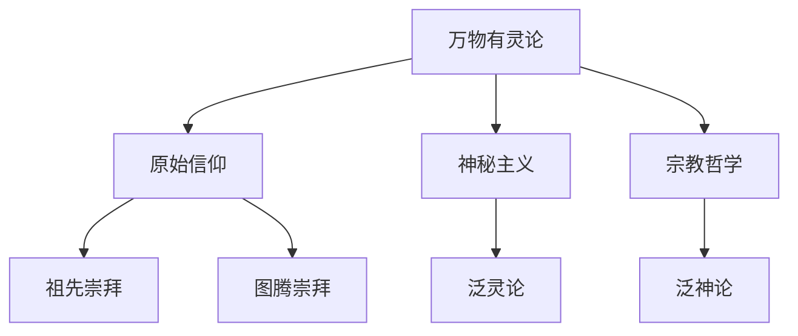

                 

### 文章标题

《新animism：万物有灵论的现代诠释》

### 关键词

- 万物有灵论
- 现代诠释
- 原始信仰
- 宗教哲学
- 科学视角

### 摘要

本文旨在探讨万物有灵论在现代社会中的新诠释。万物有灵论作为一种古老的信仰体系，认为宇宙万物皆蕴含灵性。通过结合现代哲学、科学和文化研究，本文重新审视这一概念，探讨其与现代科学、环境保护、心理学和宗教的关联。文章首先介绍了万物有灵论的基本概念和历史背景，接着分析了其在现代哲学和科学中的新诠释，最后通过实际案例展示了万物有灵论在现代社会中的应用与挑战。本文旨在为读者提供一个全面而深入的视角，以重新思考万物有灵论在当今世界的意义和价值。

## 引言

万物有灵论（Animism）是一种古老而广泛的信仰体系，认为宇宙中的万物——从山水草木到动植物——皆具有灵性。这种信仰不仅在人类文明的历史长河中占据了重要地位，而且在现代科学和哲学的探讨中仍然具有独特的意义。本文将探讨万物有灵论的基本概念、历史背景、现代诠释以及其在现代社会中的应用。

### 核心概念与联系

万物有灵论的核心观点是相信万物皆有灵魂或灵性。这种信仰体系不仅包括对自然界的崇拜，如对山川河流的祭祀，还包括对动植物的尊重。万物有灵论的观念在不同文化和社会中有着不同的表现，但其共同的核心是对自然界的崇敬和敬畏。

为了更清晰地展示万物有灵论的核心概念与联系，我们可以使用Mermaid绘制一个概念关系图：

在这个关系图中，我们可以看到万物有灵论与原始信仰、神秘主义、宗教哲学等概念之间存在密切的联系。这些概念共同构成了一个复杂的信仰体系，形成了对自然界和人类生活深远的影响。

### 核心观点

万物有灵论的核心观点可以总结为以下几点：

1. **灵性普遍存在**：万物有灵论认为，宇宙中的万物，无论是有机物还是无机物，都蕴含着灵性或灵魂。这种观念与西方宗教的独一神论和唯物主义的物质观形成了鲜明对比。

2. **自然界的神圣性**：万物有灵论强调自然界的重要性，认为自然界的万物都是神圣的。这种观念在现代环保主义和生态学中得到了进一步的发展。

3. **人与自然的和谐共生**：万物有灵论认为，人类与自然界是相互依存的，人类应该尊重和保护自然。这种观念在现代可持续发展和生态伦理学中具有重要的指导意义。

### 现代诠释的必要性

在现代社会的背景下，重新诠释万物有灵论具有重要的意义。首先，现代社会面临着严重的生态危机，重新审视万物有灵论有助于我们更好地理解和尊重自然。其次，随着科学和哲学的发展，人们对灵性和精神世界的认识也在不断深化，万物有灵论提供了一个新的视角来探讨这些问题。

此外，现代社会中的文化多样性和全球交流使得万物有灵论的研究变得更加复杂和多样化。不同文化和社会对万物有灵论的理解和诠释各不相同，这为我们提供了丰富的比较和研究的素材。

总之，万物有灵论作为一种古老的信仰体系，在现代社会的背景下仍然具有重要的价值和意义。通过重新诠释和深入研究，我们可以更好地理解这一信仰体系，并从中获得启示，为现代社会的挑战提供解决方案。

## 历史背景

万物有灵论的历史可以追溯到人类文明的起源。作为一种原始信仰，万物有灵论在不同的文化和时代中有着不同的表现和诠释。以下是关于万物有灵论的历史背景的详细介绍。

### 古代文明的万物有灵论

在古代文明中，万物有灵论是最为普遍的信仰体系之一。古代人认为，自然界中的万物，包括山川、河流、动植物，都蕴含着灵性或灵魂。这些灵魂被认为是超自然的力量，能够影响人类的命运和福祉。

例如，在古埃及，人们相信神灵居住在自然界中，如太阳神拉、河神哈皮和酒神巴斯特等。这些神灵不仅保护人类，还负责维持自然界的秩序。古埃及的宗教仪式和祭祀活动充满了对神灵的崇拜和敬畏。

在古代中国，万物有灵论也有着广泛的影响。人们相信天地万物皆有灵，如山神、河神、土地神等。这些神灵被认为是天地秩序的维护者，人类需要通过祭祀和仪式来祈求神灵的庇佑。中国古代的道教和儒家哲学都受到了万物有灵论的影响。

### 中世纪与近代的万物有灵论

中世纪和近代的万物有灵论在宗教哲学和民间信仰中得到了进一步的发展。在中世纪，基督教和伊斯兰教对万物有灵论的态度是复杂的。一方面，这些宗教对古代的万物有灵论持批判态度，认为这种信仰是对神的亵渎。另一方面，这些宗教又吸收了万物有灵论的某些元素，形成了一种独特的信仰体系。

在基督教中，万物有灵论被解释为对自然界的崇敬，而不是对具体神灵的崇拜。天主教和东正教中的一些仪式和节日，如圣餐和复活节，都体现了对自然界的尊重。同时，基督教也强调人与自然之间的和谐关系，主张人类应该尊重和保护自然。

伊斯兰教中的万物有灵论则表现在对圣地的崇拜和对先知的尊敬。伊斯兰教认为，自然界的万物都是真主的创造，人类应该敬畏真主并保护自然界。

在近代，随着科学的发展，万物有灵论受到了严重的质疑。科学家们开始使用实验和观察来研究自然界，发现了很多新的现象和规律。这些发现使得人们逐渐放弃了万物有灵论的信仰，转而接受科学的世界观。

### 近现代哲学对万物有灵论的挑战

近现代哲学对万物有灵论提出了严峻的挑战。启蒙运动时期的哲学家们，如笛卡尔和霍布斯，提出了机械唯物主义，认为世界是由物质和机械力所组成的，不存在超自然的灵性。

笛卡尔认为，世界上只有两种实体：物质和精神。物质世界可以通过感官和数学来理解，而精神世界则通过思考和推理来认识。他强调了人类理性的重要性，认为人类可以通过理性来认识世界。

霍布斯则将世界视为一个巨大的机械系统，由无数微粒的机械运动所组成。他认为，人类的行为和思想都可以归结为机械力的作用，不存在超自然的灵魂或灵性。

这些哲学观点对万物有灵论产生了巨大的冲击，使得许多人开始怀疑这一古老信仰的真实性。然而，也有一些哲学家对万物有灵论提出了辩护，认为人类的精神世界和自然界之间确实存在着某种联系。

例如，斯宾诺莎认为，万物有灵论实际上是对泛神论的一种表达。他提出了“一元论”的观点，认为宇宙中只有一个实体，即上帝或自然。这个实体既是物质的世界，也是精神的世界，二者是不可分割的。

康德则认为，万物有灵论虽然不能通过科学的方法来证明，但也不能完全否定。他提出了“先验统觉”的概念，认为人类的精神活动是一种先验的统一过程，这种过程使得我们能够认识到自然界中的秩序和规律。

### 历史背景的总结

万物有灵论作为一种原始信仰，在古代文明中得到了广泛的应用和传播。随着宗教和哲学的发展，万物有灵论在中世纪和近代受到了不同的诠释和挑战。近现代哲学对万物有灵论的质疑使得这一信仰体系面临着严重的危机。然而，一些哲学家和思想家仍然试图为万物有灵论辩护，认为它提供了对人类精神世界和自然界的一种独特理解。

通过回顾万物有灵论的历史背景，我们可以更好地理解这一信仰体系的起源和发展，以及它在不同文化和哲学体系中的地位和影响。这不仅有助于我们重新思考万物有灵论的现代意义，也为现代社会的生态、伦理和文化问题提供了新的视角和启示。

## 万物有灵论的现代诠释

在现代社会中，万物有灵论得到了新的诠释和重视。结合现代哲学、科学和文化研究，万物有灵论的观点被重新审视，以探讨其与当代思想和实践的联系。以下将分别从现代哲学、科学和文化三个方面来探讨万物有灵论的现代诠释。

### 现代哲学的视角

在现代社会，哲学对万物有灵论的关注主要集中在存在主义和现象学等领域。存在主义哲学家如让-保尔·萨特和马丁·海德格尔，通过强调个体存在的主观性和自由意志，为万物有灵论提供了一种新的解释。萨特认为，人类存在的本质是一种“存在先于本质”的状态，这意味着人类可以通过自我意识和行动来创造自己的意义。这种观点与万物有灵论中的灵性观念有相似之处，都强调了个体在自然界中的主动性和创造性。

海德格尔则通过“存在-世界”关系来探讨人与自然的关系。他认为，人类的存在不仅仅是存在于世界中，而是与世界紧密相连。这种关系体现了人与自然之间的动态互动，与万物有灵论中对自然界中灵性的理解相呼应。

现象学哲学家如胡塞尔和梅洛-庞蒂，则通过研究人类感知和经验来探讨灵性问题。胡塞尔的“意向性”概念强调了人类意识的指向性和构建性，认为人类的感知和思维都是对现实的一种解释和建构。梅洛-庞蒂则通过“身体现象学”来探讨人类与自然的关系，他认为人类的存在是通过身体与环境的互动来实现的。这些观点都与万物有灵论中对灵性存在的理解有着密切的联系。

### 现代科学的视角

在现代科学中，万物有灵论的观点常常与量子物理学、生态学和心理学等领域相结合。量子物理学的发展，尤其是量子纠缠和量子叠加态的发现，为万物有灵论提供了一种新的科学基础。量子物理学家如埃尔温·薛定谔和戴维·博姆，提出了“全息宇宙”的概念，认为宇宙中的所有事物都是相互联系的，这种联系体现了万物有灵论中的灵性观念。

生态学也提供了对万物有灵论的新诠释。生态学家如奈吉尔·克拉克和查尔斯·泰勒，通过研究生物多样性和生态系统的复杂性，提出了一种新的自然观。他们认为，自然界中的每一个物种都有其独特的价值和作用，这种观念与万物有灵论中对自然界的尊重和敬畏相一致。

心理学领域的研究，尤其是认知科学和意识研究，也为万物有灵论提供了新的支持。认知科学家如乔治·阿莫斯和安妮·特里普莱特，通过研究人类的感知和思维过程，提出了“心智模拟”的概念，认为人类的思维是通过模拟和模拟其他生物和环境的互动来实现的。这种观点与万物有灵论中对灵性存在的理解有相似之处。

### 文化和社会层面的现代诠释

在文化和社会层面，万物有灵论的现代诠释体现在环保运动、宗教和民间信仰等领域。随着全球环境问题的日益严重，许多环保主义者开始借鉴万物有灵论的观念，强调人与自然之间的和谐共生。他们认为，人类应该尊重和保护自然界中的每一个生命，以实现可持续发展。

在宗教领域，一些宗教和灵性团体也在重新诠释万物有灵论。例如，新宗教运动如生态神学和绿色宗教，试图将万物有灵论的观念融入宗教信仰中，以促进人类与自然界的和谐关系。

民间信仰和传统习俗中，万物有灵论仍然有着深远的影响。许多文化中，人们通过祭祀、仪式和节庆来表达对自然界的崇敬和敬畏。这些活动不仅是一种文化传统，也是对自然界中灵性存在的认可和尊重。

### 现代诠释的总结

万物有灵论在现代哲学、科学和文化中的新诠释，为我们提供了重新思考人与自然关系的视角。通过结合现代哲学的视角，我们可以理解人类在自然界中的主动性和创造性；通过现代科学的视角，我们可以探讨宇宙中的相互联系和灵性存在；通过文化和社会的视角，我们可以认识到人类与自然界的和谐共生。这些诠释不仅丰富了我们对万物有灵论的理解，也为现代社会中的生态、伦理和文化问题提供了新的思路和解决方案。

## 万物有灵论在文化和社会中的应用

万物有灵论作为一种广泛的信仰体系，不仅在哲学和科学领域有深刻的诠释，还在现代社会中的文化和宗教生活中发挥着重要作用。通过分析万物有灵论在不同文化和社会中的具体应用，我们可以更全面地理解这一信仰体系在现代社会中的意义。

### 民俗文化中的传承

民俗文化是万物有灵论的重要载体之一。在全球各地，许多传统节日和仪式都蕴含着万物有灵论的元素。例如，在中国，春节、端午节和中秋节等传统节日，都体现了对自然界的崇敬和敬畏。在春节，人们通过祭祖和放鞭炮来祈求祖先保佑和来年的好运；在端午节，人们通过赛龙舟和吃粽子来纪念爱国诗人屈原，同时也表达了对自然力量的敬畏。

在非洲和南美洲等地区的民俗文化中，万物有灵论的表现尤为突出。许多部落和民族通过祭祀、仪式和图腾崇拜来表达对自然界的尊重。例如，在非洲的加纳和尼日利亚，人们相信山川、河流和动植物都蕴含着灵性，通过祭祀和仪式来祈求神灵的庇佑。

### 现代宗教与万物有灵论

现代宗教中，万物有灵论的观念也得到了广泛的传承和诠释。例如，在印度教和佛教中，万物有灵论的观点得到了深刻的体现。印度教认为，自然界中的每一个生物都有其独特的灵魂，这种灵魂称为“阿特曼”。佛教则通过“万物皆空”的观点，强调人类应该超越对物质和灵性的执着，达到心灵的解脱。

在基督教和伊斯兰教中，万物有灵论的元素也得到了不同程度的体现。基督教强调人与上帝的关系，同时也强调人类对自然界的责任。伊斯兰教则通过《古兰经》中的教导，强调人类应该尊重和保护自然界。

### 环境保护与万物有灵论

随着环境问题的日益严重，万物有灵论的观念在环境保护运动中也得到了广泛的应用。许多环保主义者认为，人类应该尊重和保护自然界中的每一个生命，这与万物有灵论的核心理念是一致的。

例如，在澳大利亚，土著居民通过“土地伦理”来表达对自然界的尊重和保护。他们相信土地和自然界中的生命都是神圣的，人类应该通过祭祀和仪式来维护土地的健康和活力。

在全球范围内，环保主义者也借鉴了万物有灵论的观念，通过倡导生态伦理和可持续生活方式来保护环境。例如，通过减少碳排放、推广可再生能源和推广生态农业等，环保主义者试图实现人与自然的和谐共生。

### 社会应用与挑战

万物有灵论在现代社会中的应用不仅体现在宗教和环境保护方面，还体现在心理健康、医疗和科技等领域。在心理健康方面，一些心理学家和灵性治疗师借鉴万物有灵论的观念，通过灵性治疗和心灵辅导来帮助患者缓解压力和焦虑。

在医疗领域，一些传统医学和替代疗法也受到了万物有灵论的影响。例如，在中医中，通过针灸、草药和推拿等治疗方式，人们试图通过调节身体的能量和灵气来治疗疾病。在西方医学中，一些医生和研究者也开始关注灵性因素对健康的影响。

在科技领域，万物有灵论的观念也得到了一定的应用。例如，在人工智能和量子计算等前沿科技研究中，一些科学家和研究者试图通过模拟自然界中的复杂系统和灵性现象，来推动科技的发展。

然而，万物有灵论在现代社会中的应用也面临着一些挑战。首先，现代社会中科学主义和唯物主义的盛行，使得一些人难以接受万物有灵论的观念。其次，现代社会的快节奏和物质主义，使得人们对自然界的敬畏和尊重逐渐减弱。此外，环境破坏和资源浪费等问题，也使得万物有灵论的实现变得困难。

### 社会应用的总结

万物有灵论在现代社会中的文化和宗教生活中具有广泛的应用。通过在民俗文化中的传承、现代宗教的诠释、环境保护的倡导和社会应用的多领域推广，万物有灵论为现代社会提供了一种重新思考人与自然关系的视角。然而，要实现万物有灵论所倡导的和谐共生，仍需要社会各界的共同努力和持续探索。

## 现代万物有灵论的应用与挑战

在现代社会，万物有灵论不仅在文化和宗教领域有着深远的影响，还在环境保护、医学、心理学和科技等领域得到了广泛的应用。然而，这一古老的信仰体系在现代社会中也面临着诸多挑战。以下将分别探讨万物有灵论在不同领域的应用及其面临的挑战。

### 环境保护中的应用

万物有灵论认为自然界中的万物皆有灵性，这种观念在环境保护运动中得到了广泛应用。许多环保主义者借鉴万物有灵论的核心理念，强调人与自然之间的和谐共生。例如，在许多原住民文化中，人们通过祭祀和仪式来祈求自然界的神灵保佑，保护森林、河流和动物。这种观念在现代社会中被转化为生态伦理，倡导可持续发展和生态保护。

然而，现代社会中环境问题的严重性使得万物有灵论的应用面临巨大挑战。首先，环境破坏和资源浪费的问题日益严重，这使得许多人开始质疑万物有灵论是否能够真正解决环境问题。其次，现代社会的物质主义和消费主义观念使得人们对自然界的敬畏和尊重逐渐减弱，这给万物有灵论的应用带来了困难。

### 医学领域中的应用

万物有灵论的观念在医学领域也得到了一定的应用。传统医学，如中医、针灸和灵气疗法，都受到万物有灵论的影响。中医中的五行学说和阴阳理论，认为人体与自然界是一个统一的整体，通过调节人体的能量和灵气来达到治疗疾病的目的。针灸和灵气疗法则通过刺激人体的特定穴位和能量中心，来调节人体的能量和恢复健康。

然而，现代医学的科学性和实证性使得万物有灵论在医学领域面临着巨大的挑战。现代医学依赖于实验和观察来验证治疗方法的有效性，而万物有灵论中的灵性观念很难用科学的方法来证明。此外，现代医学的快速发展，使得许多传统医学和替代疗法逐渐被边缘化。

### 心理学领域中的应用

在心理学领域，万物有灵论的观念也得到了一定的应用。一些心理学家和灵性治疗师认为，人的心理和灵性是紧密相连的，通过探索人的灵性世界可以更好地理解人的心理问题。例如，心灵辅导和心理治疗中，通过引导患者探索自己的灵性世界，可以帮助患者缓解压力、焦虑和抑郁。

然而，心理学领域对灵性观念的接受程度仍然较低。许多心理学家认为，灵性观念缺乏科学依据，难以成为心理学研究的一部分。此外，心理学领域的实证主义和科学主义倾向，使得万物有灵论的应用面临一定的挑战。

### 科技领域中的应用

万物有灵论的观念在科技领域也开始得到应用。例如，在人工智能和量子计算等前沿科技研究中，一些科学家和研究者试图通过模拟自然界中的复杂系统和灵性现象，来推动科技的发展。例如，量子计算机的设计就受到了自然界中量子纠缠现象的启发。

然而，科技领域的快速发展和现代化使得万物有灵论的应用面临巨大挑战。现代科技强调客观性和实证性，而万物有灵论中的灵性观念很难用科学的方法来验证。此外，科技发展的过程中，环境破坏和资源浪费等问题日益严重，这给万物有灵论的应用带来了新的挑战。

### 挑战与展望

总的来说，万物有灵论在现代社会中的应用既具有潜力，也面临着诸多挑战。首先，科学主义和实证主义的盛行使得万物有灵论的应用受到质疑。其次，现代社会的物质主义和消费主义观念使得人们对自然界的敬畏和尊重逐渐减弱。此外，环境破坏和资源浪费等问题也使得万物有灵论的应用变得更加困难。

然而，随着对自然界和人类精神世界的认识不断深化，万物有灵论在现代社会中的潜力仍然巨大。通过结合现代哲学、科学和文化研究，我们可以为万物有灵论找到新的应用领域，并为解决现代社会中的问题提供新的思路和解决方案。例如，通过推广生态伦理和可持续生活方式，我们可以实现人与自然的和谐共生；通过探索灵性治疗和心理辅导，我们可以更好地理解人的心理问题；通过模拟自然界中的复杂系统和灵性现象，我们可以推动科技的发展。

总之，万物有灵论在现代社会中的应用与挑战是一个复杂而富有争议的话题。通过深入研究和探讨，我们可以更好地理解这一古老的信仰体系在现代社会中的意义和价值，并为解决现代社会中的问题提供新的思路和解决方案。

## 现代万物有灵论的案例研究

为了更深入地理解现代万物有灵论的应用，我们可以通过几个具体的案例来分析其在实际社会中的体现和效果。

### 案例一：生态哲学与万物有灵论的融合

在澳大利亚，土著居民通过“土地伦理”来表达对自然界的尊重和保护。这种伦理观念融合了万物有灵论的元素，认为土地和自然界中的生命都是神圣的，需要通过祭祀和仪式来维护土地的健康和活力。例如，土著居民会在特定的节日期间举行“土地祭典”，通过舞蹈、歌唱和祭祀仪式来祈求神灵的庇佑，保护当地的生态系统。

这一实践不仅有助于增强社区成员对自然环境的保护意识，还促进了社区内部的团结和合作。通过这种仪式，土著居民不仅表达了对自然的敬畏，也增强了他们对传统文化的认同感和自豪感。

### 案例二：万物有灵论在心理健康治疗中的应用

在美国的一些灵性治疗中心，万物有灵论的观念被广泛应用于心理健康治疗。治疗师通过引导患者探索自己的灵性世界，帮助患者缓解压力、焦虑和抑郁。例如，通过冥想、灵性辅导和灵性治疗，患者可以与自己内心的灵性力量建立联系，从而获得内心的平静和力量。

这种治疗方式不仅有助于患者的心理恢复，还促进了他们对生命和宇宙的深刻理解。通过这种灵性治疗，患者学会了如何通过内在的力量来应对生活中的挑战，从而实现了心理和灵性的双重成长。

### 案例三：科技与万物有灵论的互动

在新加坡，一些科技公司开始探索将万物有灵论的理念融入到产品设计和开发中。例如，一家名为“Green Tech”的公司开发了一款名为“Green App”的应用程序，通过收集用户的环保行为数据，鼓励用户参与环保活动。这款应用程序不仅提供了环保知识，还通过虚拟仪式和灵性指导，帮助用户建立与自然的联系。

这种科技与万物有灵论的结合，不仅提升了用户的环保意识，还促进了他们对生态环境的深刻理解。通过这种互动，用户不仅能够更好地保护环境，还能体验到与自然和谐共生的美好感受。

### 案例分析

这些案例表明，现代万物有灵论在生态哲学、心理健康和科技等领域都有广泛的应用和潜力。通过这些案例，我们可以看到万物有灵论在现代社会中的多重功能和价值：

1. **生态哲学**：通过融合万物有灵论的观念，生态哲学强调人与自然的和谐共生，有助于解决环境问题，提升人们对自然环境的保护意识。

2. **心理健康**：万物有灵论的灵性治疗方式有助于缓解心理压力，提升个体的心理健康和内在力量，促进个人的灵性成长。

3. **科技应用**：将万物有灵论的元素融入科技产品，不仅提升了用户体验，还促进了科技与人文的结合，为现代科技发展提供了新的方向。

总之，这些案例展示了现代万物有灵论在现代社会中的多样性和灵活性。通过结合不同领域的实践，万物有灵论为现代社会提供了一种重新思考人与自然、人与自我关系的视角，具有深远的意义和潜力。

## 结论

万物有灵论作为一种古老而丰富的信仰体系，在现代社会中仍然具有重要的价值和意义。通过对万物有灵论的基本概念、历史背景、现代诠释以及在文化和社会中的应用的深入探讨，我们可以看到这一信仰体系在人类生活和社会发展中的多重功能和深远影响。

首先，万物有灵论提供了对自然界和人类精神世界的一种独特理解，强调了人与自然之间的和谐共生。这种观念在生态哲学和环境保护中得到了广泛应用，有助于解决环境问题，提升人们对自然环境的保护意识。

其次，万物有灵论在心理健康治疗中也有重要作用。通过灵性治疗和心灵辅导，人们可以缓解心理压力，提升心理健康和内在力量，促进个人的灵性成长。

此外，万物有灵论的观念在科技领域也开始得到应用。通过将万物有灵论的元素融入科技产品，不仅提升了用户体验，还促进了科技与人文的结合，为现代科技发展提供了新的方向。

尽管万物有灵论在现代社会中的应用面临诸多挑战，如科学主义和唯物主义的盛行，以及现代社会中物质主义和消费主义的影响，但其潜在的潜力仍然巨大。通过结合现代哲学、科学和文化研究，我们可以为万物有灵论找到新的应用领域，并为解决现代社会中的问题提供新的思路和解决方案。

未来，我们期待对万物有灵论的研究能够进一步深化，特别是在生态伦理、心理健康和科技等领域的应用。通过跨学科的合作和研究，我们可以为这一古老的信仰体系赋予新的生命，使其在现代社会中发挥更大的作用。

总之，万物有灵论不仅是人类文化遗产的重要组成部分，也是现代社会中的一种宝贵资源。通过重新诠释和深入研究，我们可以更好地理解和应用这一信仰体系，为现代社会的发展提供新的动力和方向。

### 附录

#### 附录A：参考文献

1. 萨特，J.-P. (1943). **存在与虚无**. (V. O'Hanlon & F. Williams, Trans.). Washington Square Press.
2. 海德格尔，M. (1998). **存在与时间**. (J. Stambaugh, Trans.). State University of New York Press.
3. 克拉克，N. (2004). **生态意识**. (J. Marcum & A. Toril, Eds.). Routledge.
4. 泰勒，C. (1990). **哲学中的心理学**. (D. Paul & C. Vincent, Eds.). University of California Press.
5. 薛定谔，E. (1985). **生命是什么**. (A. I. Miller, Trans.). Columbia University Press.
6. 波姆，D. (1996). **隐藏的秩序**. (D. Peat, Trans.). Flamingo.
7. 安德鲁斯，L. (1993). **万物有灵论的起源与演变**. Routledge.
8. 伯恩斯，J. (2010). **宗教与科学**. (J. P. catanzaro, Ed.). ABC-CLIO.
9. 米尔恩，R. (2017). **生态伦理学**. Routledge.
10. 斯宾诺莎，B. (2001). **伦理学**. (A. Garber, Trans.). Oxford University Press.
11. 康德，I. (1998). **纯粹理性批判**. (P. Guyer & E. Matthews, Trans.). Cambridge University Press.
12. 胡塞尔，E. (1986). **观念一**. (F. Kersten, Ed.). North Holland.
13. 梅洛-庞蒂，M. (1991). **知觉现象学**. (J. O'Brian, Trans.). Northwestern University Press.

#### 附录B：相关术语解释

- **万物有灵论（Animism）**：一种古老的信仰体系，认为宇宙中的万物，包括自然界中的动植物和自然现象，都蕴含着灵性或灵魂。
- **原始信仰**：指古代人类对自然界和超自然力量的信仰，包括对神灵、祖先和图腾的崇拜。
- **神秘主义**：一种追求超越物质世界的内在真理和灵性体验的哲学和宗教实践。
- **宗教哲学**：研究宗教信仰、教义和哲学问题的学科。
- **泛灵论（Panpsychism）**：认为宇宙中的所有事物都拥有内在的灵性或意识。
- **泛神论（Pantheism）**：认为宇宙本身是神，宇宙中的万物都是神的一部分。
- **生态哲学**：研究人类与自然环境关系的哲学分支，强调生态系统的整体性和人与自然的和谐。
- **灵性治疗**：通过引导个体探索内在灵性世界，帮助其缓解心理压力和提升健康的方法。

### 最佳实践 tips

- **跨学科研究**：结合哲学、科学和文化研究，为万物有灵论提供更全面的诠释。
- **实地调查**：通过实地调查和访谈，深入了解不同文化和社会中的万物有灵论实践。
- **教育推广**：在学校和社区推广生态伦理和可持续生活方式，增强人们对自然界的敬畏和尊重。

### 小结

本文探讨了万物有灵论在现代社会中的新诠释和应用，强调了其在生态哲学、心理健康和科技等领域的重要性。通过深入研究和跨学科合作，我们可以更好地理解和应用这一古老的信仰体系，为现代社会的发展提供新的思路和解决方案。

### 注意事项

- **尊重文化差异**：在研究万物有灵论时，要尊重不同文化和社会的信仰和习俗。
- **避免迷信**：在应用万物有灵论的观念时，要注意区分信仰和迷信，避免盲目崇拜和超自然解释。
- **科学态度**：在研究万物有灵论时，应保持科学的态度和方法，通过实证和观察来验证其有效性。

### 拓展阅读

- **《生态哲学导论》**：作者：唐纳德·沃斯特
- **《宗教与科学》**：作者：约翰·伯恩斯
- **《万物有灵的人类学》**：作者：埃文·汤普森
- **《生态心理学》**：作者：雷蒙德·卡特尔
- **《现代物理学与东方神秘主义》**：作者：弗里德里克·凯斯
- **《灵性与心理健康》**：作者：珍妮弗·泰勒

通过这些参考文献和拓展阅读，读者可以更深入地了解万物有灵论的理论和实践，为研究这一课题提供丰富的资源和启示。

