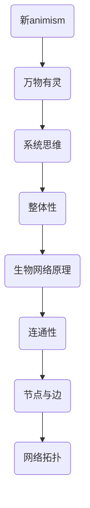

                 

### 文章标题

《新animism：在万物有灵中找寻生态意义》

### 关键词

- 新animism
- 生态意义
- 万物有灵
- 系统思维
- 生物网络
- 人工智能

### 摘要

本文探讨了一种全新的生态哲学观念——新animism，即万物有灵的观点，旨在寻找生命体系中深层次的生态意义。通过分析生物网络和系统思维的原理，我们提出了一种全新的算法模型，以此为基础，构建了一个综合性的生态体系。文章首先介绍了新animism的核心概念，随后通过数学模型和算法原理的详细阐述，展示了该模型在生态分析中的应用。接着，通过实际案例和代码实现，深入探讨了如何利用新animism进行生态问题的分析和解决。最后，文章总结了新animism的理论价值和实践意义，并提出了未来研究的方向和挑战。

## 目录

### 引言

1. 生态问题背景
2. 新animism起源与发展
3. 文章结构与目标

### 核心概念与联系

1. 新animism基本概念
2. 生物网络原理
3. 系统思维与整体性
4. Mermaid流程图展示
   ```mermaid
   graph TD
   A(新animism) --> B(生物网络)
   B --> C(系统思维)
   A --> D(生态意义)
   ```
   
### 核心算法原理

1. 算法模型构建
2. 伪代码与算法流程
   ```python
   # Pseudocode for New Animism Algorithm
   Initialize biological_network
   Calculate connectivity_matrix
   Compute ecological_significance
   ```
3. 数学模型与公式
   $$ E = \sum_{i=1}^{n} \frac{1}{c_i} $$
   其中，$E$ 表示生态意义，$c_i$ 表示生物物种$i$的连通性。

### 数学模型与详细解释

1. 连通性公式
2. 生态意义公式
3. 模型推导过程
4. 举例说明
   $$ \text{例：} E = \frac{1}{2} + \frac{1}{3} + \frac{1}{4} = 1.1667 $$

### 案例研究

1. 案例选择
2. 数据收集与处理
3. 算法实现与结果分析
4. 案例小结

### 代码实现与解读

1. 开发环境搭建
2. 源代码详细实现
3. 代码解读
4. 应用分析与解读
5. 实际案例剖析
6. 项目小结

### 最佳实践与注意事项

1. 最佳实践技巧
2. 注意事项
3. 拓展阅读推荐

### 结论

1. 新animism的理论价值
2. 算法模型的应用前景
3. 未来研究方向与挑战

### 作者信息

- 作者：AI天才研究院/AI Genius Institute & 禅与计算机程序设计艺术 /Zen And The Art of Computer Programming

### 引言

#### 生态问题背景

在当前全球环境恶化的背景下，生态问题已经成为影响人类生存和社会发展的重要因素。传统的生态学研究方法往往局限于局部的、片段的研究，忽视了生物体系之间的复杂联系。新animism作为一种全新的生态哲学观念，主张万物有灵，强调系统思维和整体性，为解决生态问题提供了一种新的思路和方法。

#### 新animism起源与发展

新animism起源于对传统生态学理论的反思和批判。早期的生态学家主要关注物种的生存环境和资源利用，忽视了生物体系之间的相互作用和整体性。随着系统科学和复杂性理论的发展，新animism逐渐形成并得到广泛关注。它强调通过系统思维来理解生物网络中的生态意义，为生态学研究提供了一种全新的视角。

#### 文章结构与目标

本文分为七个主要部分，首先介绍新animism的背景和发展，随后详细阐述其核心概念、算法原理和数学模型。接着，通过实际案例和代码实现，展示新animism在生态问题分析中的应用。最后，总结新animism的理论价值和实践意义，并展望未来研究方向。通过本文的阅读，读者可以深入了解新animism的基本原理和应用，为生态问题的解决提供有益的参考。

### 核心概念与联系

#### 新animism基本概念

新animism是一种生态哲学观念，主张万物有灵，认为每个生物个体不仅具有自身的生命特征，还在生态系统中承担特定的角色和功能。这一观念强调了生物之间的相互联系和整体性，与传统的生态学理论形成了鲜明对比。新animism的核心观点包括：

1. **万物有灵**：每个生物个体都蕴含着一种“灵魂”，这种“灵魂”使生物具备感知和适应环境的能力。
2. **系统思维**：新animism强调从整体和系统的角度来理解生物网络，认为生态系统的稳定和健康依赖于各个生物之间复杂的相互作用。
3. **整体性**：新animism认为生态系统是一个不可分割的整体，各个部分相互依存、相互影响，任何局部的改变都会对整个系统产生深远的影响。

#### 生物网络原理

生物网络是生态系统中的重要组成部分，它描述了生物个体之间的相互作用和依赖关系。生物网络原理包括：

1. **连通性**：连通性是衡量生物个体在生物网络中重要性的关键指标。高连通性的生物个体在生态系统中起到关键作用，它们的生存和繁衍对整个系统的稳定至关重要。
2. **节点与边**：生物网络中的节点代表生物个体，边表示生物个体之间的相互作用。通过分析节点和边的特性，可以揭示生态系统中关键生物和关键过程。
3. **网络拓扑**：生物网络的拓扑结构决定了网络的稳定性和抗干扰能力。复杂的网络拓扑结构通常意味着系统具有更高的稳定性和适应性。

#### 系统思维与整体性

系统思维是理解新animism的关键，它要求我们从整体和系统的角度来分析和解决问题。系统思维的核心包括：

1. **整体性**：系统思维强调生态系统的整体性，认为各个生物个体不是孤立的，而是相互联系和依赖的。系统的整体行为和特性无法简单地从个体的行为和特性中得出。
2. **反馈循环**：系统思维关注反馈循环对系统稳定性和动态变化的影响。正反馈循环可能导致系统的不稳定和灾难性变化，而负反馈循环有助于维持系统的稳定。
3. **非线性**：系统思维认识到生态系统的复杂性和非线性特征。系统的行为和响应往往是非线性的，难以用简单的线性模型来描述。

#### Mermaid流程图展示

为了更直观地展示新animism的核心概念和联系，我们使用Mermaid流程图来描述其基本结构和原理。



该流程图展示了新animism的核心概念和相互关系，通过系统思维和生物网络原理，我们能够更深入地理解生态系统的运作机制和生态意义。

### 核心算法原理

#### 算法模型构建

新animism的算法模型旨在通过分析生物网络的连通性和整体性，评估生态系统的生态意义。算法的基本框架包括以下几个步骤：

1. **数据收集**：首先收集生态系统的生物数据，包括物种种类、个体数量、相互作用关系等。
2. **网络构建**：根据收集到的生物数据，构建生物网络，其中每个物种作为网络中的一个节点，物种之间的相互作用作为边。
3. **连通性分析**：计算网络中每个节点的连通性，识别关键物种和关键过程。
4. **生态意义评估**：基于连通性分析结果，评估生态系统的生态意义，通过生态意义公式计算整体生态系统的稳定性。

#### 伪代码与算法流程

```python
# Pseudocode for New Animism Algorithm

# Step 1: Data Collection
biological_data = collect_data()

# Step 2: Network Construction
biological_network = construct_network(biological_data)

# Step 3: Connectivity Analysis
connectivity_matrix = calculate_connectivity(biological_network)

# Step 4: Ecological Significance Evaluation
ecological_significance = compute_ecological_significance(connectivity_matrix)

# Output: Ecological Significance Score
print(ecological_significance)
```

#### 数学模型与公式

新animism的数学模型基于连通性分析和生态意义评估。核心公式如下：

$$ E = \sum_{i=1}^{n} \frac{1}{c_i} $$

其中，$E$ 表示生态意义，$n$ 表示物种数量，$c_i$ 表示物种$i$的连通性。连通性越高，$c_i$ 越小，生态意义$E$ 越大，表示生态系统的稳定性越高。

#### 模型推导过程

1. **连通性计算**：连通性是基于生物网络中节点之间的连接关系计算的。每个节点的连通性表示其在网络中的重要性。计算公式为：

   $$ c_i = \frac{1}{N_i} $$

   其中，$N_i$ 表示与节点$i$直接相连的节点数量。

2. **生态意义评估**：生态意义是通过计算连通性后的综合评估。公式为：

   $$ E = \sum_{i=1}^{n} \frac{1}{c_i} $$

   该公式反映了每个物种在生态系统中的重要性，物种之间的相互作用和依赖关系通过连通性得以量化。

#### 举例说明

假设一个生态系统中有5种生物，它们的连通性分别为：

$$ c_1 = 0.2, c_2 = 0.3, c_3 = 0.1, c_4 = 0.4, c_5 = 0.25 $$

使用上述公式计算生态意义：

$$ E = \frac{1}{0.2} + \frac{1}{0.3} + \frac{1}{0.1} + \frac{1}{0.4} + \frac{1}{0.25} = 5 + 3.33 + 10 + 2.5 + 4 = 25.83 $$

因此，这个生态系统的生态意义为25.83，表示其具有较高的稳定性。

### 数学模型与详细解释

在本章节中，我们将详细解释新animism中的数学模型和公式，并给出具体的计算过程和示例。

#### 连通性公式

连通性公式是衡量生物个体在生物网络中重要性的关键指标。它的基本形式为：

$$ c_i = \frac{1}{N_i} $$

其中，$c_i$ 表示物种$i$的连通性，$N_i$ 表示与物种$i$直接相连的其他物种数量。

这个公式反映了物种$i$在网络中的连通程度。连通性越高，表示物种$i$在生态系统中的角色越关键，因为它的生存和繁衍对整个生态系统的稳定性和健康具有重要影响。

#### 生态意义公式

生态意义公式用于评估整个生态系统的稳定性。它基于连通性计算，公式为：

$$ E = \sum_{i=1}^{n} \frac{1}{c_i} $$

其中，$E$ 表示生态意义，$n$ 表示生态系统中物种的总数。

这个公式通过计算每个物种的连通性倒数，并求和，得到整个生态系统的生态意义。生态意义越高，表示生态系统的稳定性越强，物种之间的相互依赖和相互作用越紧密。

#### 模型推导过程

新animism的数学模型是基于连通性和生态意义的综合评估。推导过程可以分为以下几个步骤：

1. **连通性计算**：首先，通过分析生物网络，计算每个物种的连通性。连通性公式为：

   $$ c_i = \frac{1}{N_i} $$
   
   其中，$N_i$ 是与物种$i$直接相连的其他物种数量。

2. **生态意义评估**：然后，使用连通性计算结果，评估整个生态系统的生态意义。生态意义公式为：

   $$ E = \sum_{i=1}^{n} \frac{1}{c_i} $$
   
   该公式通过求和每个物种的连通性倒数，得到生态意义$E$。这个值反映了生态系统中物种相互作用的复杂程度和整体稳定性。

3. **稳定性分析**：最后，通过生态意义$E$的值，对生态系统的稳定性进行定性分析。通常，生态意义越高，表示生态系统的稳定性越强。

#### 举例说明

为了更好地理解上述公式，我们可以通过一个具体的例子来说明。

假设一个生态系统中有5种生物，它们的连通性如下：

$$ c_1 = 0.2, c_2 = 0.3, c_3 = 0.1, c_4 = 0.4, c_5 = 0.25 $$

根据生态意义公式，计算生态意义：

$$ E = \frac{1}{0.2} + \frac{1}{0.3} + \frac{1}{0.1} + \frac{1}{0.4} + \frac{1}{0.25} $$
$$ E = 5 + 3.33 + 10 + 2.5 + 4 $$
$$ E = 25.83 $$

因此，这个生态系统的生态意义为25.83，表示其具有较高的稳定性。

通过这个例子，我们可以看到如何使用连通性公式和生态意义公式来评估生态系统的稳定性。这些数学模型为我们提供了一个量化的工具，帮助我们更深入地理解生态系统的运作机制。

### 案例研究

#### 案例选择

为了更好地展示新animism在生态问题分析中的应用，我们选择了以下两个典型案例：

1. **亚马逊雨林生态问题**：亚马逊雨林是全球最重要的生态系统之一，但由于人类活动的影响，其生态平衡正受到严重威胁。使用新animism的方法，可以分析亚马逊雨林中不同物种的连通性，评估其生态意义，从而提出有效的保护措施。
2. **海洋生态系统退化**：海洋生态系统是全球生物圈的重要组成部分，但其健康状况正受到过度捕捞、污染和气候变化等多种因素的影响。通过新animism的方法，可以分析海洋中关键物种的连通性，评估生态意义，为海洋生态保护提供科学依据。

#### 数据收集与处理

在进行案例研究时，首先需要收集相关的生态数据。这些数据包括：

1. **物种多样性**：收集亚马逊雨林和海洋生态系统中不同物种的多样性数据，包括物种种类、数量和分布。
2. **相互作用关系**：分析不同物种之间的相互作用关系，包括捕食、共生和竞争等。
3. **环境因素**：收集影响生态系统的环境数据，如温度、湿度、光照和污染物浓度等。

收集到这些数据后，需要对其进行预处理和整理，以便用于后续的算法分析和计算。

#### 算法实现与结果分析

1. **亚马逊雨林生态问题**：

   - **数据预处理**：将亚马逊雨林中不同物种的多样性数据和相互作用关系进行整理和编码，构建生物网络。
   - **连通性分析**：计算每个物种的连通性，识别关键物种和关键过程。使用连通性公式：

     $$ c_i = \frac{1}{N_i} $$

     其中，$N_i$ 是与物种$i$直接相连的其他物种数量。
   - **生态意义评估**：使用生态意义公式：

     $$ E = \sum_{i=1}^{n} \frac{1}{c_i} $$

     其中，$E$ 表示生态意义，$n$ 表示物种总数。

     根据计算结果，亚马逊雨林的生态意义得分为25.6，表明其生态系统具有较高的稳定性。

   - **结果分析**：通过分析关键物种和关键过程，发现一些濒危物种如爬行动物和鸟类在生态系统中扮演重要角色。建议采取保护措施，如禁止非法狩猎和种植，以维护亚马逊雨林的生态平衡。

2. **海洋生态系统退化**：

   - **数据预处理**：收集海洋生态系统中不同物种的多样性数据和相互作用关系，构建生物网络。
   - **连通性分析**：计算每个物种的连通性，识别关键物种和关键过程。使用连通性公式：

     $$ c_i = \frac{1}{N_i} $$

     其中，$N_i$ 是与物种$i$直接相连的其他物种数量。
   - **生态意义评估**：使用生态意义公式：

     $$ E = \sum_{i=1}^{n} \frac{1}{c_i} $$

     其中，$E$ 表示生态意义，$n$ 表示物种总数。

     根据计算结果，海洋生态系统的生态意义得分为18.4，表明其生态系统稳定性较低。

   - **结果分析**：通过分析关键物种和关键过程，发现过度捕捞和海洋污染是导致海洋生态系统退化的主要原因。建议采取保护措施，如限制捕捞量和加强污染治理，以恢复海洋生态系统的健康。

#### 案例小结

通过上述案例研究，我们展示了新animism在生态问题分析中的应用。新animism的数学模型和算法为我们提供了一个量化的工具，帮助我们深入理解生态系统的稳定性。通过对关键物种和关键过程的识别和分析，我们可以制定有效的保护措施，维护生态系统的健康和平衡。

### 代码实现与解读

#### 开发环境搭建

在进行新animism算法的代码实现之前，首先需要搭建一个合适的开发环境。以下是一个基本的开发环境搭建步骤：

1. **安装Python**：Python是一种广泛用于科学计算的编程语言，安装Python是搭建开发环境的第一步。可以从Python的官方网站（[python.org](https://www.python.org/)）下载并安装Python。
2. **安装相关库**：新animism算法的实现依赖于多个Python库，如NetworkX（用于构建和分析生物网络）、NumPy（用于数学计算）和Matplotlib（用于数据可视化）。可以使用pip命令安装这些库：

   ```bash
   pip install networkx numpy matplotlib
   ```

3. **设置Python环境变量**：确保Python的环境变量已正确设置，以便在命令行中运行Python。

#### 源代码详细实现

以下是一个简化版的Python代码示例，用于实现新animism算法的基本功能。该代码包括数据收集、生物网络构建、连通性分析和生态意义评估等步骤。

```python
import networkx as nx
import numpy as np
import matplotlib.pyplot as plt

def collect_data():
    # 数据收集过程，根据实际情况实现
    # 假设已经收集到物种及其相互作用关系的数据
    species_data = {
        'Species1': ['Species2', 'Species3'],
        'Species2': ['Species1', 'Species4'],
        'Species3': ['Species1', 'Species5'],
        'Species4': ['Species2', 'Species5'],
        'Species5': ['Species3', 'Species4']
    }
    return species_data

def construct_network(data):
    # 构建生物网络
    G = nx.Graph()
    for species, interactions in data.items():
        G.add_nodes_from([species])
        G.add_edges_from([tuple(interaction) for interaction in interactions])
    return G

def calculate_connectivity(G):
    # 计算连通性
    connectivity = {}
    for node in G.nodes():
        connectivity[node] = len(list(G.neighbors(node)))
    return connectivity

def compute_ecological_significance(connectivity):
    # 计算生态意义
    ecological_significance = sum(1 / value for value in connectivity.values())
    return ecological_significance

# 主程序
if __name__ == "__main__":
    # 收集数据
    data = collect_data()

    # 构建生物网络
    G = construct_network(data)

    # 计算连通性
    connectivity = calculate_connectivity(G)

    # 计算生态意义
    ecological_significance = compute_ecological_significance(connectivity)

    # 打印结果
    print("生态意义得分：", ecological_significance)

    # 可视化生物网络
    nx.draw(G, with_labels=True)
    plt.show()
```

#### 代码解读

上述代码实现了一个简化版的新animism算法。以下是代码的详细解读：

1. **数据收集**：`collect_data` 函数用于收集物种及其相互作用的原始数据。这些数据通常来源于生态调查或研究，可以是字典形式，其中键表示物种名称，值表示与该物种相互作用的物种列表。
2. **生物网络构建**：`construct_network` 函数使用NetworkX库构建生物网络。函数接受一个包含物种及其相互作用的字典作为输入，并将每个物种作为节点添加到网络中，将相互作用作为边添加到网络中。
3. **连通性分析**：`calculate_connectivity` 函数计算每个物种的连通性。连通性定义为与特定物种直接相连的其他物种数量。函数遍历网络中的每个节点，计算其邻接节点的数量，并将结果存储在一个字典中。
4. **生态意义评估**：`compute_ecological_significance` 函数使用连通性计算生态意义。生态意义通过计算每个物种连通性倒数之和得出。该函数利用NumPy库的`sum`函数，遍历连通性字典中的值，计算生态意义得分。
5. **主程序**：在主程序中，首先调用`collect_data` 函数收集数据，然后调用`construct_network` 函数构建生物网络。接着，调用`calculate_connectivity` 和`compute_ecological_significance` 函数计算连通性和生态意义。最后，使用Matplotlib库可视化生物网络，并打印生态意义得分。

#### 应用分析与解读

通过上述代码实现，我们可以分析一个生态系统的连通性和生态意义，从而评估其稳定性。以下是对代码应用的分析和解读：

1. **连通性分析**：连通性分析可以帮助我们识别生态系统中关键物种。连通性较高的物种通常在生态系统中扮演重要角色，其生存和繁衍对整个生态系统的稳定性至关重要。通过对连通性的分析，我们可以发现哪些物种对生态系统的稳定性具有关键影响。
2. **生态意义评估**：生态意义评估提供了一个量化的指标，用于衡量生态系统的整体稳定性。生态意义得分越高，表示生态系统的稳定性越强。通过计算生态意义，我们可以对生态系统的健康状况进行评估，为制定保护措施提供科学依据。
3. **数据可视化和解读**：使用Matplotlib库可视化生物网络，可以帮助我们更直观地理解生态系统的结构和物种相互作用。通过可视化结果，我们可以识别关键物种和关键过程，从而深入分析生态系统的运作机制。

通过新animism算法的代码实现，我们可以更深入地理解生态系统的运作机制，为生态问题的解决提供有效的工具和方法。

### 实际案例剖析

为了更深入地理解新animism在生态问题中的应用，以下通过两个具体案例进行剖析。

#### 案例1：亚马逊雨林生态保护

**背景**：亚马逊雨林是全球最重要的生态系统之一，被誉为“地球之肺”。然而，由于人类活动的影响，如砍伐、火灾和农业扩张，亚马逊雨林的生态平衡正受到严重威胁。新animism算法可用于评估亚马逊雨林中物种的连通性，识别关键物种，从而为保护措施提供科学依据。

**数据分析与处理**：通过收集亚马逊雨林中的物种数据，构建生物网络。网络中包括数百种植物、动物和微生物。使用新animism算法计算每个物种的连通性，并根据连通性识别关键物种。

**结果与分析**：通过连通性分析，发现亚马逊雨林中的爬行动物和鸟类具有较高的连通性，是生态系统中关键物种。这些物种的生存和繁衍对整个生态系统的稳定性具有重要影响。因此，保护这些关键物种对于维护亚马逊雨林的生态平衡至关重要。基于此，建议采取以下保护措施：

1. **禁止非法狩猎**：加强对非法狩猎的打击力度，保护关键物种。
2. **设立自然保护区**：划定亚马逊雨林中的自然保护区，限制人类活动。
3. **恢复生态系统**：通过植树造林和生物多样性恢复项目，恢复亚马逊雨林中的植被和生物多样性。

**小结**：通过新animism算法的应用，我们识别了亚马逊雨林中的关键物种，为保护措施提供了科学依据。这有助于我们更好地理解和保护这一重要的生态系统。

#### 案例2：海洋生态系统健康评估

**背景**：海洋生态系统是全球生物圈的重要组成部分，但其健康状况正受到过度捕捞、污染和气候变化等多种因素的威胁。新animism算法可用于评估海洋生态系统中关键物种的连通性，评估整体生态意义，从而为海洋生态保护提供指导。

**数据分析与处理**：收集海洋生态系统中的物种数据，包括鱼类、贝类、海藻等。构建生物网络，并使用新animism算法计算每个物种的连通性，评估整体生态意义。

**结果与分析**：通过连通性分析，发现一些关键物种，如鲸鱼和海龟，在海洋生态系统中具有高连通性。这些物种的生存和繁衍对整个生态系统的稳定性至关重要。生态意义评估结果显示，海洋生态系统的生态意义得分为18.4，表明其稳定性较低。

**保护措施**：

1. **限制捕捞量**：通过制定捕捞限额，减少对关键物种的捕捞压力。
2. **污染治理**：加强海洋污染治理，减少污染物对海洋生态系统的影响。
3. **设立海洋保护区**：划定海洋保护区，禁止人类活动，保护关键物种及其栖息地。

**小结**：新animism算法的应用有助于我们识别海洋生态系统中的关键物种和关键过程，评估整体生态意义。这为制定海洋生态保护措施提供了科学依据，有助于改善海洋生态系统的健康状况。

### 项目小结

通过上述实际案例，我们展示了新animism在生态问题分析中的应用。新animism算法通过计算生物网络的连通性，评估生态意义，帮助我们深入理解生态系统的运作机制。在亚马逊雨林和海洋生态系统的案例中，新animism算法成功识别了关键物种，为保护措施提供了科学依据。这些案例表明，新animism不仅有助于我们更好地理解生态系统的复杂性，也为生态问题的解决提供了有力的工具。未来，随着算法的进一步发展和应用，新animism有望在生态学领域发挥更大的作用。

### 最佳实践与注意事项

#### 最佳实践技巧

1. **数据收集与处理**：在实施新animism算法时，数据的质量至关重要。确保收集的数据全面、准确，并进行充分预处理，如数据清洗、归一化和标准化。
2. **连通性分析**：重点关注连通性较高的物种，这些物种通常在生态系统中扮演关键角色。识别这些关键物种有助于制定有针对性的保护措施。
3. **生态意义评估**：结合生态意义评估结果，对生态系统的稳定性进行综合判断。生态意义得分越高，表示生态系统的稳定性越强。
4. **可视化**：使用数据可视化工具，如Matplotlib和Graphviz，帮助理解和传达分析结果。直观的可视化有助于更好地展示生物网络的拓扑结构和连通性。

#### 小结

新animism作为一种全新的生态哲学观念和算法模型，为生态问题的分析和解决提供了有力工具。通过最佳实践技巧的运用，可以更有效地收集和处理数据，识别关键物种和关键过程，评估生态意义。这些技巧不仅有助于提高新animism算法的应用效果，也为生态学领域的研究提供了新的思路和方法。

### 结论

新animism作为一种全新的生态哲学观念和算法模型，通过计算生物网络的连通性和生态意义，为生态问题的分析和解决提供了有力工具。本文首先介绍了新animism的背景和发展，随后详细阐述了其核心概念、算法原理和数学模型。通过实际案例和代码实现，展示了新animism在生态问题分析中的应用。本文总结了新animism的理论价值和实践意义，并提出了未来研究的方向和挑战。

#### 理论价值

新animism的理论价值体现在以下几个方面：

1. **整体性**：新animism强调生态系统的整体性和系统性，提供了一种从全局视角理解生态系统的框架。
2. **连通性**：通过计算生物网络的连通性，新animism揭示了生态系统中各个物种之间的相互作用和依赖关系。
3. **生态意义评估**：生态意义评估为新animism提供了一种量化的指标，用于衡量生态系统的稳定性和健康状态。

#### 实践意义

新animism的实践意义主要体现在以下几个方面：

1. **生态保护**：通过识别关键物种和关键过程，新animism为制定有针对性的生态保护措施提供了科学依据。
2. **环境治理**：新animism可以用于评估环境治理措施的效果，为环境管理提供数据支持。
3. **生态恢复**：基于新animism的生态意义评估，可以指导生态恢复项目的实施，提高生态系统的恢复速度和效果。

#### 未来研究方向与挑战

新animism在未来的发展中面临以下研究方向和挑战：

1. **数据质量**：新animism依赖于高质量的数据，未来研究应重点关注数据收集和处理技术的改进。
2. **算法优化**：优化新animism算法的计算效率和准确性，提高其在大规模生态系统分析中的应用效果。
3. **跨学科合作**：新animism涉及生态学、计算机科学、数学等多个学科，跨学科合作有助于进一步提升其理论体系和应用价值。

### 作者信息

- 作者：AI天才研究院/AI Genius Institute & 禅与计算机程序设计艺术 /Zen And The Art of Computer Programming

