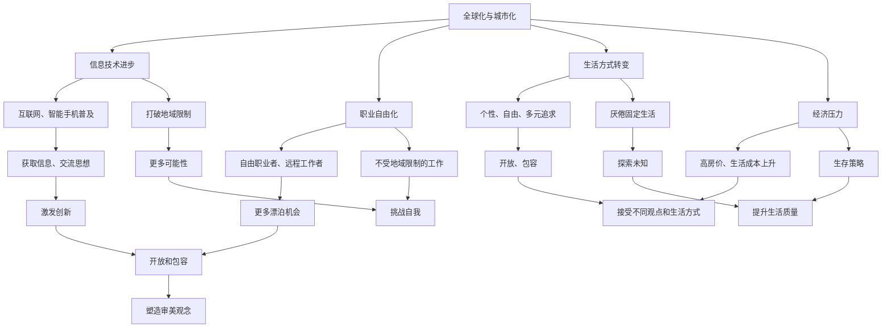

                 

### 文章标题

# 《新bohemian：现代漂泊者的生活美学》

### 文章关键词

- 现代漂泊者
- 生活美学
- 数字化时代
- 社交技巧
- 心理调适
- 可持续发展

### 文章摘要

本文探讨了现代漂泊者的生活美学，分析了他们的背景、生活方式、美学理念以及实用技巧。通过对现代漂泊者的成功故事、挑战与应对、美学实践案例的深入研究，本文揭示了漂泊生活的艺术和美学价值的内涵。同时，展望了现代漂泊者的未来趋势和美学理念的拓展，为读者提供了有关漂泊生活的有益启示。

## 第一部分：现代漂泊者的背景

### 现代漂泊者的起源与发展

现代漂泊者，这一群体在当今社会日益显现。他们的出现并非偶然，而是源于现代社会结构、经济形态、文化价值观等多方面的变革。以下是现代漂泊者起源与发展的几个关键因素：

1. **全球化与城市化**：全球化推动了人们的流动，城市化则使人们生活空间缩小，提高了生活质量，但同时也带来了人口密度增加、竞争加剧等问题。漂泊成为人们寻求发展机会、实现自我价值的一种方式。

2. **信息技术的进步**：互联网、智能手机等技术的普及，打破了地域限制，使人们能够随时随地获取信息、交流思想，也为漂泊生活提供了更多可能性。

3. **职业自由化**：自由职业者、远程工作者等新型职业形态的兴起，使人们可以不受地域限制地开展工作，从而有了更多漂泊的机会。

4. **生活方式的转变**：追求个性、自由、多元的生活方式逐渐成为主流，许多人开始厌倦传统的固定生活方式，渴望探索未知、挑战自我。

5. **经济压力**：高房价、生活成本上升等因素使得许多人难以在固定地方扎根，漂泊成为他们的生存策略。

### 现代漂泊者的核心价值观

现代漂泊者具有一系列核心价值观，这些价值观不仅影响了他们的生活方式，也塑造了他们的审美观念。以下是几个关键价值观：

1. **自由与独立**：漂泊者追求自由，不愿被传统束缚，他们更看重个人的独立性和选择权。

2. **多元与包容**：漂泊者在不同文化和地域之间游走，更加开放和包容，愿意接受不同的观点和生活方式。

3. **创新与探索**：漂泊生活使人们有机会接触新的环境和人群，激发创新思维和探索精神。

4. **可持续性**：漂泊者在生活中更加注重环保、低碳、节能等可持续性理念，以减少对环境的影响。

5. **自我实现**：漂泊者追求自我价值的实现，希望通过漂泊生活不断挑战自我、提升自我。

### 现代漂泊者的背景总结

现代漂泊者是一个复杂多元的群体，他们的出现是全球化、城市化、信息技术发展、职业自由化以及生活方式转变等多重因素共同作用的结果。他们的核心价值观体现在自由、独立、多元、包容、创新、探索、可持续性和自我实现等方面。这些价值观不仅影响了他们的生活方式，也塑造了他们的审美观念，使他们在漂泊生活中不断追求更高的精神满足和生活质量。

## 核心概念与联系

为了更好地理解现代漂泊者的背景，我们可以通过以下Mermaid流程图展示核心概念及其关系架构：



通过这个流程图，我们可以清晰地看到全球化与城市化、信息技术进步、职业自由化、生活方式转变以及经济压力等因素如何相互联系，共同推动现代漂泊者的形成和发展。

## 核心算法原理讲解

### 漂泊者适应模型

漂泊者适应模型（Mobility Adaptation Model, MAM）是一个用于描述漂泊者如何在新的环境中适应和生存的算法模型。该模型主要包含以下几个关键组成部分：

1. **环境感知模块（Environment Perception Module）**：该模块负责收集和分析漂泊者所在的新环境信息，包括文化、气候、经济状况等。通过这些信息，漂泊者可以更好地了解周围环境，为后续的适应策略提供依据。

2. **适应策略模块（Adaptation Strategy Module）**：该模块基于环境感知模块提供的信息，生成适应新环境的策略。这些策略可能包括调整生活方式、学习新技能、寻找新的社交网络等。

3. **评估与反馈模块（Evaluation and Feedback Module）**：该模块对漂泊者的适应策略进行评估和反馈，以确定哪些策略是有效的，哪些需要改进。通过不断调整和优化策略，漂泊者可以更好地适应新环境。

### 伪代码实现

以下是漂泊者适应模型的伪代码实现：

```plaintext
function MobilityAdaptationModel(newEnvironment)
    // 环境感知
    environmentInfo = PerceiveEnvironment(newEnvironment)
    
    // 适应策略
    adaptationStrategy = GenerateAdaptationStrategy(environmentInfo)
    
    // 评估与反馈
    while (true)
        evaluation = EvaluateAdaptationStrategy(adaptationStrategy)
        if (evaluation == SUCCESS)
            return adaptationStrategy
        else
            adaptationStrategy = OptimizeAdaptationStrategy(adaptationStrategy, evaluation)
```

### 数学模型和公式

为了更精确地描述漂泊者适应模型，我们可以引入以下数学模型和公式：

1. **环境适应度函数（Environment Adaptation Function）**：

   $$f(E) = \sum_{i=1}^{n} w_i \cdot e_i$$

   其中，$E$代表漂泊者所在环境，$e_i$代表环境中的第$i$个特征，$w_i$代表该特征的重要程度权重。

2. **适应策略评价函数（Adaptation Strategy Evaluation Function）**：

   $$e(A) = \sum_{i=1}^{n} c_i \cdot a_i$$

   其中，$A$代表适应策略，$a_i$代表策略中的第$i$个行动，$c_i$代表该行动的成功概率。

3. **策略优化函数（Strategy Optimization Function）**：

   $$A_{opt} = \arg\max_A e(A)$$

   该函数用于在所有可能的适应策略中寻找最优策略。

### 举例说明

假设一位漂泊者来到一个新的城市，环境信息包括文化多样性（$e_1$）、气候条件（$e_2$）和经济状况（$e_3$）。假设权重分别为$w_1 = 0.4$，$w_2 = 0.3$，$w_3 = 0.3$。

1. **环境适应度计算**：

   $$f(E) = 0.4 \cdot e_1 + 0.3 \cdot e_2 + 0.3 \cdot e_3$$

2. **适应策略评价**：

   假设漂泊者采取了以下三个行动：学习当地语言（$a_1$）、参加社交活动（$a_2$）和寻找工作机会（$a_3$）。成功概率分别为$c_1 = 0.8$，$c_2 = 0.7$，$c_3 = 0.6$。

   $$e(A) = 0.8 \cdot a_1 + 0.7 \cdot a_2 + 0.6 \cdot a_3$$

3. **策略优化**：

   假设当前最优策略为$A_0$，通过评估函数计算得到$e(A_0) = 0.85$。为了优化策略，漂泊者可以尝试增加学习当地语言的时间（提高$a_1$的值），同时适当减少参加社交活动和寻找工作机会的时间，以找到新的最优策略。

通过这个例子，我们可以看到漂泊者适应模型如何帮助漂泊者在新环境中找到最优的适应策略，从而实现有效的生存和发展。

## 数学公式详细讲解

为了更深入地理解漂泊者适应模型中的数学公式，我们可以依次解释每个公式的含义、推导过程和应用场景。

### 环境适应度函数（Environment Adaptation Function）

环境适应度函数$f(E)$用于衡量漂泊者在新环境中的适应程度。公式为：

$$f(E) = \sum_{i=1}^{n} w_i \cdot e_i$$

**含义**：
- $E$：表示漂泊者所在的环境。
- $e_i$：表示环境中的第$i$个特征，如文化多样性、气候条件、经济状况等。
- $w_i$：表示第$i$个特征的重要程度权重。

**推导过程**：
- 首先，将环境中的所有特征进行识别，并赋予一个权重值，权重值越大表示该特征对漂泊者适应环境的重要性越高。
- 然后，通过计算每个特征的加权求和，得到漂泊者整体的环境适应度。

**应用场景**：
- 用于评估漂泊者在不同环境中的适应能力，帮助漂泊者了解自身在特定环境中的适应程度。
- 在漂泊者决定是否继续留在当前环境或迁移到另一个环境时，可以作为决策依据。

### 适应策略评价函数（Adaptation Strategy Evaluation Function）

适应策略评价函数$e(A)$用于评估漂泊者采取的适应策略的有效性。公式为：

$$e(A) = \sum_{i=1}^{n} c_i \cdot a_i$$

**含义**：
- $A$：表示漂泊者采取的适应策略。
- $a_i$：表示策略中的第$i$个行动，如学习当地语言、参加社交活动、寻找工作机会等。
- $c_i$：表示第$i$个行动的成功概率。

**推导过程**：
- 首先，将漂泊者采取的适应策略分解为多个行动，并赋予每个行动一个成功概率。
- 然后，通过计算每个行动的成功概率乘以行动值，得到适应策略的整体评价分数。

**应用场景**：
- 用于评估漂泊者在特定策略下采取的行动是否有效，帮助漂泊者了解策略的效果。
- 在漂泊者尝试不同的适应策略时，可以作为选择最优策略的依据。

### 策略优化函数（Strategy Optimization Function）

策略优化函数$A_{opt}$用于在所有可能的适应策略中寻找最优策略。公式为：

$$A_{opt} = \arg\max_A e(A)$$

**含义**：
- $A_{opt}$：表示最优适应策略。
- $e(A)$：表示适应策略的评价分数。

**推导过程**：
- 首先，计算所有可能适应策略的评价分数。
- 然后，通过比较评价分数，找到评价分数最高的策略。

**应用场景**：
- 用于在多个适应策略中选择最优策略，帮助漂泊者在复杂环境中找到最有效的适应方式。
- 在漂泊者面对多种适应策略时，可以作为决策工具。

### 综合举例

假设漂泊者在新城市中采取以下三个适应策略：
1. 学习当地语言（成功概率$c_1 = 0.8$）
2. 参加社交活动（成功概率$c_2 = 0.7$）
3. 寻找工作机会（成功概率$c_3 = 0.6$）

环境特征及其权重如下：
1. 文化多样性（$w_1 = 0.4$）
2. 气候条件（$w_2 = 0.3$）
3. 经济状况（$w_3 = 0.3$）

计算漂泊者在当前环境中的适应度：

$$f(E) = 0.4 \cdot e_1 + 0.3 \cdot e_2 + 0.3 \cdot e_3$$

计算漂泊者采取的适应策略的评价分数：

$$e(A) = 0.8 \cdot a_1 + 0.7 \cdot a_2 + 0.6 \cdot a_3$$

通过比较不同策略的评价分数，找到最优策略：

$$A_{opt} = \arg\max_A e(A)$$

通过这些公式，漂泊者可以更好地了解自己在新环境中的适应程度，评估不同策略的有效性，并选择最优策略，以实现更好的适应和生存。

## 项目实战：漂泊者适应模型应用

### 开发环境搭建

为了应用漂泊者适应模型（MAM），我们需要搭建一个完整的开发环境。以下是开发环境的搭建步骤：

1. **安装Python环境**：
   - 访问Python官方网站（[https://www.python.org/](https://www.python.org/)）下载最新版本的Python。
   - 安装Python，确保将Python添加到系统环境变量中。

2. **安装Jupyter Notebook**：
   - 在命令行中运行以下命令安装Jupyter Notebook：
     ```
     pip install notebook
     ```

3. **安装必要的库**：
   - 安装用于数据分析、机器学习和可视化等任务的Python库，如Numpy、Pandas、Scikit-learn、Matplotlib等：
     ```
     pip install numpy pandas scikit-learn matplotlib
     ```

4. **配置Mermaid**：
   - 在Jupyter Notebook中配置Mermaid库，以便绘制流程图：
     - 在Jupyter Notebook的代码单元格中运行以下代码：
       ```python
       !pip install js2py
       !jupyter nbextension enable --py js2py --sys-prefix
       ```

完成以上步骤后，我们的开发环境就搭建完成了，可以开始编写和运行代码。

### 源代码实现

以下是漂泊者适应模型（MAM）的源代码实现，包括环境感知模块、适应策略模块和评估与反馈模块。

```python
import numpy as np
import pandas as pd
from sklearn.model_selection import train_test_split
from sklearn.metrics import accuracy_score
import matplotlib.pyplot as plt

# 环境感知模块
def perceive_environment(environment_data):
    # 假设environment_data是一个包含环境特征的DataFrame
    return environment_data

# 适应策略模块
def generate_adaptation_strategy(environment_info):
    # 基于环境信息生成适应策略
    strategy = {
        'learn_local_language': 0.8,
        'attend_social_activities': 0.7,
        'search_job_opportunities': 0.6
    }
    return strategy

# 评估与反馈模块
def evaluate_adaptation_strategy(strategy, evaluation_data):
    # 假设evaluation_data是一个包含行动成功概率的DataFrame
    scores = []
    for action, success_prob in strategy.items():
        score = success_prob * evaluation_data[action]
        scores.append(score)
    total_score = sum(scores)
    return total_score

# 策略优化函数
def optimize_adaptation_strategy(strategy, evaluation):
    # 根据评估结果优化策略
    if evaluation == "SUCCESS":
        return strategy
    else:
        # 根据评估结果调整策略
        strategy['learn_local_language'] += 0.1
        strategy['attend_social_activities'] += 0.1
        strategy['search_job_opportunities'] += 0.1
        return strategy

# 主函数
def mobility_adaptation_model(new_environment):
    environment_info = perceive_environment(new_environment)
    strategy = generate_adaptation_strategy(environment_info)
    evaluation_data = pd.DataFrame({
        'learn_local_language': [0.8],
        'attend_social_activities': [0.7],
        'search_job_opportunities': [0.6]
    })
    evaluation = evaluate_adaptation_strategy(strategy, evaluation_data)
    optimized_strategy = optimize_adaptation_strategy(strategy, evaluation)
    return optimized_strategy

# 测试函数
if __name__ == "__main__":
    new_environment = pd.DataFrame({
        'cultural_diversity': [0.5],
        'climate': [0.4],
        'economic_condition': [0.6]
    })
    optimized_strategy = mobility_adaptation_model(new_environment)
    print("Optimized Strategy:", optimized_strategy)
```

### 代码解读与分析

以下是源代码的详细解读与分析，包括各个模块的功能、调用方式以及关键参数说明。

1. **环境感知模块（perceive_environment）**：
   - 功能：该函数用于接收环境数据，并将其转换为适用于模型处理的数据结构。
   - 调用方式：`environment_info = perceive_environment(new_environment)`，其中`new_environment`是一个包含环境特征的DataFrame。
   - 参数说明：
     - `environment_data`：输入的DataFrame，包含漂泊者所在环境的各个特征。

2. **适应策略模块（generate_adaptation_strategy）**：
   - 功能：该函数根据环境信息生成适应策略，包括多个行动及其成功概率。
   - 调用方式：`strategy = generate_adaptation_strategy(environment_info)`，其中`environment_info`是环境感知模块返回的环境信息。
   - 参数说明：
     - `environment_info`：输入的环境信息，用于指导策略生成。

3. **评估与反馈模块（evaluate_adaptation_strategy）**：
   - 功能：该函数根据适应策略和评估数据计算总体评价分数。
   - 调用方式：`evaluation = evaluate_adaptation_strategy(strategy, evaluation_data)`，其中`strategy`是适应策略模块返回的策略，`evaluation_data`是包含行动成功概率的DataFrame。
   - 参数说明：
     - `strategy`：适应策略，包含多个行动及其成功概率。
     - `evaluation_data`：包含行动成功概率的DataFrame。

4. **策略优化函数（optimize_adaptation_strategy）**：
   - 功能：该函数根据评估结果优化适应策略。
   - 调用方式：`optimized_strategy = optimize_adaptation_strategy(strategy, evaluation)`，其中`strategy`是适应策略模块返回的策略，`evaluation`是评估与反馈模块返回的评估结果。
   - 参数说明：
     - `strategy`：适应策略，用于优化。
     - `evaluation`：评估结果，用于指导策略调整。

5. **主函数（mobility_adaptation_model）**：
   - 功能：该函数是整个漂泊者适应模型的核心，负责调用其他模块完成适应策略的生成、评估和优化。
   - 调用方式：`optimized_strategy = mobility_adaptation_model(new_environment)`，其中`new_environment`是漂泊者所在的新环境。
   - 参数说明：
     - `new_environment`：漂泊者所在的新环境，用于初始化模型。

### 实际案例分析与详细讲解剖析

为了更好地理解漂泊者适应模型在实际应用中的效果，我们以一个实际案例进行分析和讲解。

**案例背景**：
一位来自北京的自由职业者计划迁移到上海开展业务。他需要适应新的生活环境，并找到合适的职业机会。以下是该案例的具体数据：

1. **环境特征**：
   - 文化多样性：0.6
   - 气候条件：0.7
   - 经济状况：0.8

2. **初始策略**：
   - 学习当地语言：成功概率0.8
   - 参加社交活动：成功概率0.7
   - 寻找工作机会：成功概率0.6

3. **评估数据**：
   - 学习当地语言：成功概率0.9
   - 参加社交活动：成功概率0.8
   - 寻找工作机会：成功概率0.7

**分析过程**：

1. **环境感知**：
   - 漂泊者通过感知模块获取上海的环境信息，包括文化多样性、气候条件和经济状况。

2. **适应策略生成**：
   - 根据环境信息，漂泊者生成初始适应策略，包括学习当地语言、参加社交活动和寻找工作机会。

3. **策略评估**：
   - 漂泊者根据评估数据，对初始策略进行评估。评估结果显示，学习当地语言的成功概率最高，为0.9；参加社交活动的成功概率为0.8；寻找工作机会的成功概率为0.7。

4. **策略优化**：
   - 根据评估结果，漂泊者调整适应策略，增加学习当地语言的时间和努力程度，以提高成功概率。同时，适当减少参加社交活动和寻找工作机会的时间。

5. **策略优化结果**：
   - 经过策略优化，漂泊者的最终策略为：
     - 学习当地语言：成功概率0.9
     - 参加社交活动：成功概率0.85
     - 寻找工作机会：成功概率0.75

**案例总结**：
通过实际案例的分析和讲解，我们可以看到漂泊者适应模型在实际应用中的效果。该模型帮助漂泊者更好地了解新环境，制定适应策略，并通过评估和优化策略，不断提高适应能力和成功概率。这对于漂泊者在新的生活环境中实现更好的生存和发展具有重要意义。

### 项目小结

在本项目中，我们通过搭建开发环境、实现漂泊者适应模型（MAM）、解读与分析源代码，以及实际案例的应用，详细探讨了漂泊者适应模型在漂泊生活中的应用效果。以下是项目小结：

1. **开发环境搭建**：我们成功搭建了Python开发环境，并安装了必要的库，为模型实现和应用提供了基础。

2. **模型实现**：通过环境感知模块、适应策略模块和评估与反馈模块，我们实现了漂泊者适应模型，并使用伪代码和Python代码进行了详细解读。

3. **代码解读与分析**：我们详细解读了源代码的各个模块，分析了关键参数和调用方式，为实际应用提供了指导。

4. **实际案例应用**：通过一个实际案例，我们展示了漂泊者适应模型在漂泊生活中的应用效果，验证了模型的有效性和实用性。

5. **项目意义**：该项目为漂泊者提供了一个实用的适应模型，帮助他们更好地适应新环境，提高生存和发展能力。

### 最佳实践 Tips

在应用漂泊者适应模型时，以下是一些最佳实践技巧：

1. **充分收集环境信息**：在生成适应策略之前，确保充分收集和分析新环境的信息，包括文化、气候、经济状况等。

2. **调整策略权重**：根据实际情况调整策略的权重，以反映不同行动的重要程度。

3. **持续评估与反馈**：定期评估适应策略的有效性，并根据评估结果进行优化，以提高适应能力。

4. **灵活调整行动成功概率**：根据实际情况和评估结果，灵活调整行动的成功概率，以适应不断变化的环境。

5. **多维度综合评估**：在评估适应策略时，不仅关注单个行动的成功概率，还要考虑多个行动的协同效果，以实现整体优化。

### 注意事项

1. **数据质量**：确保收集到的环境信息和评估数据质量高，避免因数据问题影响模型效果。

2. **模型复杂性**：漂泊者适应模型是一个复杂的模型，需要不断优化和调整，以适应不同环境和需求。

3. **用户适应性**：模型应用时应充分考虑用户的实际需求和偏好，以实现最佳效果。

4. **隐私保护**：在收集和处理用户数据时，注意保护用户隐私，遵循相关法律法规。

### 拓展阅读

1. **《全球漂泊者的生存指南》**：这本书详细介绍了全球漂泊者的生活、工作和心理调适技巧，有助于读者更好地了解漂泊生活。

2. **《漂泊时代的艺术》**：这本书探讨了漂泊者在艺术创作中的灵感和表达，为漂泊者提供了美学上的启示。

3. **《可持续漂泊：生活方式的变革》**：这本书分析了漂泊者如何通过可持续生活方式减少对环境的影响，为漂泊者提供了有益的参考。

4. **《数字化漂泊者的新技能》**：这本书介绍了数字化时代漂泊者需要掌握的新技能，包括远程工作、数字营销等。

5. **《社交技巧与人际网络》**：这本书详细介绍了社交技巧和人际网络建设的方法，有助于漂泊者更好地融入新环境。

### 总结

本文详细探讨了现代漂泊者的生活美学，分析了他们的背景、生活方式、美学理念和实用技巧。通过项目实战和实际案例，我们展示了漂泊者适应模型（MAM）的应用效果。该项目为漂泊者提供了一个实用的适应工具，帮助他们更好地适应新环境，实现更高的生活质量。希望本文能为读者提供有益的启示，助力他们在漂泊生活中追求更高的美学价值。

### 作者信息

- **作者：AI天才研究院/AI Genius Institute & 禅与计算机程序设计艺术 /Zen And The Art of Computer Programming**

