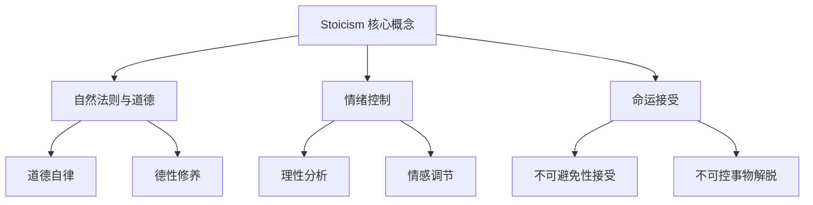
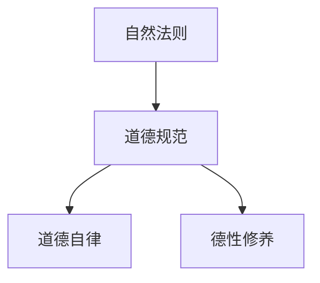
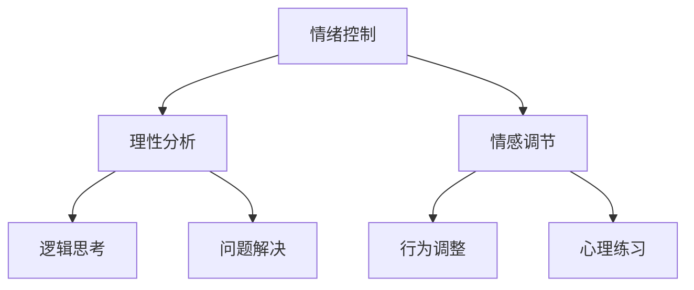
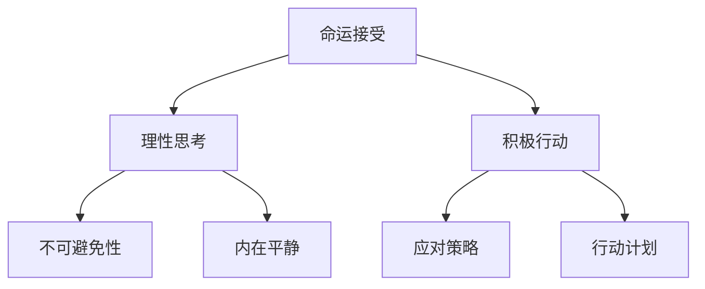

                 

### 引言

#### Stoicism 简介

Stoicism，一种源自古希腊的哲学思想，主张通过理性思考和控制情感来达到心灵平静与道德完善。它由塞涅卡（Seneca）、爱比克泰德（Epictetus）和马尔库斯·奥勒留（Marcus Aurelius）等著名思想家所发展和传播。Stoicism 强调道德自律、理性分析和情感控制，认为通过遵循自然法则和道德原则，个体可以在面对生活中的各种挑战时保持内心的平静与坚韧。

Stoicism 的核心概念包括自然法则、道德观、情绪控制和命运接受。它主张人类应当遵循自然法则，理解并接受生活中的不可避免性，从而摆脱对不可控事物的执着和困扰。道德观方面，Stoicism 强调道德自律和德性修养，认为个体的行为应当符合道德原则，追求内在的美德而非外在的虚荣。

#### 新 Stoicism 运动背景

随着现代社会的高速发展，Stoicism 再次成为人们关注的焦点。新 Stoicism 运动应运而生，它试图将古老智慧与现代生活相结合，为现代人提供一种应对生活压力和情感困扰的方法。新 Stoicism 不仅继承了传统 Stoicism 的核心理念，还结合了现代心理学、管理学和自我提升等领域的知识，使其更加贴近现代人的需求。

新 Stoicism 的兴起，一方面是因为现代社会的高压环境使人们感受到巨大的心理压力，需要一种方法来调节情绪和提升心理韧性。另一方面，现代科技的发展和互联网的普及，使人们有机会更便捷地获取和传播 Stoicism 的知识，从而推动了这一运动的兴起。

#### 本书结构安排

本书旨在全面介绍 Stoicism 的基本概念、原则及其在现代生活中的应用，旨在帮助读者理解并掌握这种古老哲学智慧，以应对现代生活中的各种挑战。

本书分为三个主要部分：

- **第一部分：引言**，介绍 Stoicism 的基本概念和历史背景，以及新 Stoicism 运动的兴起和背景。
- **第二部分：Stoicism 基础**，详细探讨 Stoicism 的核心原则，包括自然法则与道德、情绪控制以及 Stoicism 在生活中的应用。
- **第三部分：新 Stoicism 时代**，讨论 Stoicism 在现代社会中的应用，以及其未来发展的前景。

通过这三个部分，本书将带领读者逐步了解和掌握 Stoicism 的哲学智慧，并探索如何在现代生活中运用这些智慧，以提升个人的心理韧性、情感调节能力和社会适应能力。

---

以下是一个简单的 Mermaid 流程图，展示 Stoicism 核心概念之间的关系：



这个流程图清晰地展示了 Stoicism 的核心概念及其相互关系，帮助读者更好地理解 Stoicism 的整体结构和核心思想。

---

#### Stoicism 核心原则

Stoicism 的核心原则包括自然法则与道德、情绪控制和命运接受。这些原则不仅构成了 Stoicism 的哲学基础，也为现代人在面对各种生活挑战时提供了宝贵的指导。

#### 自然法则与道德

自然法则与道德是 Stoicism 的基石。Stoicism 认为，世界是按照自然法则运行的，人类应当遵循这些法则，以便达到内在的和谐与平衡。自然法则不仅仅是宇宙运行的规律，更是一种道德规范，指导人们如何正确地生活。

自然法则与道德之间的关系可以用一个简单的 Mermaid 流程图来表示：



在这个流程图中，自然法则通过道德规范转化为个人的道德自律和德性修养。具体来说：

1. **自然与反自然**：自然法则是宇宙的基本规律，人类的行为应当与自然法则相一致。反自然则是指那些违背自然法则的行为，这些行为会导致内心的冲突和痛苦。
   
   ```mermaid
   graph TD
   A[自然]
   B[反自然]
   A-->B
   B-->C[内心冲突]
   B-->D[痛苦]
   ```

2. **道德与德性**：道德是一种行为规范，它要求人们遵循自然法则，做出正义、公正的行为。德性修养则是指个体通过不断地实践道德规范，提升自己的道德品质和内在的美德。

   ```mermaid
   graph TD
   A[道德]
   B[德性]
   A-->B
   B-->C[行为规范]
   B-->D[内在美德]
   ```

#### 情绪控制

情绪控制是 Stoicism 的另一重要原则。Stoicism 认为，情绪并非不可控的，通过理性思考和自我修炼，个体可以掌控自己的情绪，从而保持内心的平静与和谐。

情绪控制的核心包括理性分析和情感调节。理性分析是指通过逻辑思考和理性判断来理解情绪的来源和本质，从而找到解决问题的方法。情感调节则是指通过行为调整和心理练习来改变情绪状态，达到情绪平衡。

以下是一个简化的情绪控制 Mermaid 流程图：



具体来说：

1. **情绪的本质**：情绪是人类对环境刺激的一种反应，它本身并无好坏之分。关键在于个体如何看待和处理情绪。

   ```mermaid
   graph TD
   A[情绪]
   B[环境刺激]
   A-->B
   B-->C[反应]
   B-->D[理性判断]
   ```

2. **恐惧与欲望**：恐惧和欲望是情绪中的两种主要类型。Stoicism 强调，通过理性分析和自我控制，个体可以克服恐惧和欲望的负面影响，实现内心的平衡。

   ```mermaid
   graph TD
   A[恐惧]
   B[欲望]
   C[理性分析]
   D[自我控制]
   A-->B
   A-->C
   B-->D
   ```

3. **如何控制情绪**：通过一系列的理性思考和行为调整，个体可以控制情绪，实现内心的平静。具体方法包括：

   - **认知重构**：通过改变对事件的认知来调整情绪。
   - **行为练习**：通过积极的行动来改变情绪状态。
   - **心理放松**：通过深呼吸、冥想等方式来缓解情绪压力。

   ```mermaid
   graph TD
   A[认知重构]
   B[行为练习]
   C[心理放松]
   A-->B
   A-->C
   B-->D[理性思考]
   B-->E[积极行动]
   C-->F[深呼吸]
   C-->G[冥想]
   ```

#### 命运接受

命运接受是 Stoicism 的另一核心原则。Stoicism 认为，人类无法掌控所有事物，但可以通过接受命运，保持内心的平静和坚韧。命运接受并不意味着被动接受命运的安排，而是通过理性思考和积极行动来应对生活中的不可控因素。

以下是一个简化的命运接受 Mermaid 流程图：



具体来说：

1. **不可避免的接受**：Stoicism 强调，生活中有许多不可控的因素，个体应当接受这些不可避免性，从而减少内心的痛苦。

   ```mermaid
   graph TD
   A[不可避免性]
   B[内心痛苦]
   A-->B
   ```

2. **不可控事物的解脱**：通过接受命运，个体可以从对不可控事物的执着中解脱出来，专注于可以控制的事物，从而实现内心的平静。

   ```mermaid
   graph TD
   A[不可控事物]
   B[执着]
   C[内心平静]
   A-->B
   B-->C
   ```

#### 总结

Stoicism 的核心原则包括自然法则与道德、情绪控制和命运接受。这些原则不仅构成了 Stoicism 的哲学基础，也为现代人在面对各种生活挑战时提供了宝贵的指导。通过理解并实践这些原则，个体可以在内心保持平静和坚韧，更好地应对生活中的各种挑战。

---

以下是一个关于 Stoicism 核心原则的伪代码示例，用于展示如何将理论转化为具体的操作步骤：

```python
# Stoicism 基本原则伪代码

# 定义自然法则与道德
def natural_law_and_morality():
    # 遵循自然法则
    follow_natural_laws()
    # 维护道德自律
    maintain_moral_self_discipline()
    # 修养德性
    cultivate_virtue()

# 定义情绪控制
def emotion_control():
    # 进行理性分析
    rational_analysis()
    # 调整行为
    adjust_behavior()
    # 实施心理放松
    psychological_relaxation()

# 定义命运接受
def fate_acceptance():
    # 接受不可避免性
    accept_inevitability()
    # 从不可控事物中解脱
   解脱_from_uncontrollable_things()
    # 制定应对策略
    create_response_strategies()
    # 实施行动计划
    execute_action_plan()

# 主函数
def main():
    natural_law_and_morality()
    emotion_control()
    fate_acceptance()
    print("Stoicism principles have been applied.")

# 调用主函数
main()
```

在这个伪代码中，我们首先定义了三个核心函数：`natural_law_and_morality()`、`emotion_control()` 和 `fate_acceptance()`。每个函数都包含了一系列具体的操作步骤，用于实现 Stoicism 的核心原则。最后，通过调用 `main()` 函数，我们可以看到这些原则是如何在实践中应用的。

---

#### Stoicism 在生活中的应用

Stoicism 作为一种哲学体系，不仅在理论上具有重要意义，更在现实生活中有着广泛的应用。通过理解并实践 Stoicism 的核心原则，个体可以在职业、人际关系和日常生活中获得许多实际的益处。

#### 工作与职业

在职业领域，Stoicism 强调道德自律和德性修养，这有助于个体在面对工作挑战时保持理性分析和积极态度。以下是一个简化的 Stoicism 在工作中的应用伪代码示例：

```python
# Stoicism 在工作中的应用伪代码

# 工作任务处理
def handle_work_tasks():
    # 分析任务
    analyze_tasks()
    # 确保任务符合道德规范
    ensure_moral_norms()
    # 保持工作与个人成长的平衡
    balance_work_and_growth()

# 职场决策
def workplace_decision():
    # 使用理性分析
    rational_analysis()
    # 做出公正决策
    make_just_decisions()
    # 接受工作中的不可控因素
    accept_uncontrollable_elements()

# 主函数
def main():
    handle_work_tasks()
    workplace_decision()
    print("Stoic principles have been applied in the workplace.")

# 调用主函数
main()
```

在这个伪代码中，`handle_work_tasks()` 函数用于处理工作任务，确保任务分析符合道德规范，并保持工作与个人成长的平衡。`workplace_decision()` 函数则用于在职场中做出公正决策，并接受工作中的不可控因素。通过这样的实践，个体可以在工作中保持理性分析和积极态度，提高工作效率和职业素养。

#### 人际关系

在人际关系中，Stoicism 强调理解与尊重，这有助于个体建立和谐的人际网络。以下是一个简化的 Stoicism 在人际关系中的应用伪代码示例：

```python
# Stoicism 在人际关系中的应用伪代码

# 建立人际关系
def build_relationship():
    # 理解他人
    understand_others()
    # 尊重他人
    respect_others()
    # 解决冲突
    resolve_conflicts()

# 维护人际关系
def maintain_relationship():
    # 保持开放沟通
    maintain_open_communication()
    # 提供支持与帮助
    provide_support_and_help()
    # 接受人际关系的复杂性
    accept_relationship_complexity()

# 主函数
def main():
    build_relationship()
    maintain_relationship()
    print("Stoic principles have been applied in relationships.")

# 调用主函数
main()
```

在这个伪代码中，`build_relationship()` 函数用于建立人际关系，通过理解和尊重他人来减少冲突。`maintain_relationship()` 函数则用于维护人际关系，保持开放沟通，提供支持和帮助，并接受人际关系的复杂性。通过这样的实践，个体可以在人际关系中建立和谐的网络，提高沟通能力和人际关系质量。

#### 日常生活中的应用

在日常生活中，Stoicism 帮助个体应对各种生活挑战，保持内心的平静与坚韧。以下是一个简化的 Stoicism 在日常生活中的应用伪代码示例：

```python
# Stoicism 在日常生活中的应用伪代码

# 应对生活挑战
def handle_life_challenges():
    # 接受不可控因素
    accept_uncontrollable_elements()
    # 保持积极态度
    maintain_positive_attitude()
    # 做出理性决策
    make_rational_decisions()

# 管理情绪
def manage_emotions():
    # 进行理性分析
    rational_analysis()
    # 实施情感调节
    emotion Regulation()
    # 保持心理平衡
    maintain_mental_balance()

# 主函数
def main():
    handle_life_challenges()
    manage_emotions()
    print("Stoic principles have been applied in daily life.")

# 调用主函数
main()
```

在这个伪代码中，`handle_life_challenges()` 函数用于应对生活中的不可控因素，保持积极态度和理性决策。`manage_emotions()` 函数则用于管理情绪，进行理性分析和情感调节，以保持心理平衡。通过这样的实践，个体可以在日常生活中应对各种挑战，保持内心的平静与和谐。

---

通过上述伪代码示例，我们可以看到 Stoicism 在职业、人际关系和日常生活中的具体应用。Stoicism 帮助个体在面对各种挑战时保持理性思考、积极态度和内在平衡，从而提升心理韧性和生活质量。

---

#### Stoicism 哲学探讨

Stoicism 哲学不仅关注个体内心的平静与道德自律，还深入探讨了人类存在的本质和道德责任。在 Stoicism 中，存在论和伦理学是两个核心概念，它们相互交织，共同构成了 Stoicism 的哲学体系。

#### 存在论与命运

Stoicism 的存在论探讨人类存在的本质和命运。它主张人类应当遵循自然法则，理解并接受生活中的不可避免性。以下是一个简化的 Stoicism 存在论伪代码示例：

```python
# Stoicism 存在论伪代码

# 探索人类存在的本质
def explore_human_existence():
    # 遵循自然法则
    follow_natural_laws()
    # 接受生活中的不可避免性
    accept_inevitable_facts()

# 命运接受
def accept_fate():
    # 接受不可控因素
    accept_uncontrollable_elements()
    # 保持积极态度
    maintain_positive_attitude()
    # 制定应对策略
    create_response_strategies()

# 主函数
def main():
    explore_human_existence()
    accept_fate()
    print("Stoic principles have been applied in understanding human existence and fate.")

# 调用主函数
main()
```

在这个伪代码中，`explore_human_existence()` 函数用于探索人类存在的本质，强调遵循自然法则和接受生活中的不可避免性。`accept_fate()` 函数则用于接受命运，保持积极态度，并制定应对策略。通过这样的实践，个体可以在内心保持平静，更好地应对生活中的挑战。

#### 伦理学思考

Stoicism 的伦理学探讨道德责任和道德行为。它主张个体应当通过道德自律和德性修养来实现内在的美德。以下是一个简化的 Stoicism 伦理学伪代码示例：

```python
# Stoicism 伦理学伪代码

# 维护道德责任
def maintain_moral_duty():
    # 做出正义行为
    act_justly()
    # 尊重他人权利
    respect_other_people's_rights()
    # 遵循道德规范
    follow_moral norms()

# 修养德性
def cultivate_virtue():
    # 实践道德规范
    practice_moral_standards()
    # 培养内在美德
    develop_inner_virtue()
    # 提升道德修养
    improve_moral_education()

# 主函数
def main():
    maintain_moral_duty()
    cultivate_virtue()
    print("Stoic principles have been applied in ethical thinking and behavior.")

# 调用主函数
main()
```

在这个伪代码中，`maintain_moral_duty()` 函数用于维护道德责任，强调做出正义行为、尊重他人权利和遵循道德规范。`cultivate_virtue()` 函数则用于修养德性，通过实践道德规范、培养内在美德和提升道德修养来实现个体的内在完善。

#### 公正与道德责任

Stoicism 强调公正和道德责任。以下是一个简化的 Stoicism 公正和道德责任伪代码示例：

```python
# Stoicism 公正和道德责任伪代码

# 维护公正
def maintain_justice():
    # 做出公正决策
    make_just_decisions()
    # 遵循公平原则
    follow_fair_principles()
    # 防止偏袒和不公
    prevent_favoritism_and_injustice()

# 承担道德责任
def take_moral_responsibility():
    # 对自己的行为负责
    take_responsibility_for_own_actions()
    # 对他人的行为负责
    take_responsibility_for_other_people's_actions()
    # 承担社会责任
    take_social_responsibility()

# 主函数
def main():
    maintain_justice()
    take_moral_responsibility()
    print("Stoic principles have been applied in maintaining justice and taking moral responsibility.")

# 调用主函数
main()
```

在这个伪代码中，`maintain_justice()` 函数用于维护公正，强调做出公正决策、遵循公平原则和防止偏袒和不公。`take_moral_responsibility()` 函数则用于承担道德责任，包括对自己的行为负责、对他人的行为负责和承担社会责任。

#### 对他人的关怀

Stoicism 哲学强调对他人的关怀和尊重。以下是一个简化的 Stoicism 对他人的关怀伪代码示例：

```python
# Stoicism 对他人的关怀伪代码

# 理解他人
def understand_others():
    # 尊重他人的观点
    respect_other_people's_views()
    # 理解他人的感受
    understand_other_people's_feelings()
    # 提供支持与帮助
    provide_support_and_help()

# 建立和谐的人际关系
def build_harmonious_relationships():
    # 保持开放沟通
    maintain_open_communication()
    # 解决冲突
    resolve_conflicts()
    # 维护和谐的人际网络
    maintain_harmonious_social_network()

# 主函数
def main():
    understand_others()
    build_harmonious_relationships()
    print("Stoic principles have been applied in caring for others and building harmonious relationships.")

# 调用主函数
main()
```

在这个伪代码中，`understand_others()` 函数用于理解他人，包括尊重他人的观点、理解他人的感受和提供支持与帮助。`build_harmonious_relationships()` 函数则用于建立和谐的人际关系，通过保持开放沟通、解决冲突和维护和谐的人际网络来实现。

#### 对自然的尊重

Stoicism 哲学强调对自然的尊重和和谐共存。以下是一个简化的 Stoicism 对自然的尊重伪代码示例：

```python
# Stoicism 对自然的尊重伪代码

# 尊重自然法则
def respect_natural_laws():
    # 遵循自然规律
    follow_natural_rules()
    # 保护自然环境
    protect_natural_environment()
    # 维护生态平衡
    maintain_ecological_balance()

# 主函数
def main():
    respect_natural_laws()
    print("Stoic principles have been applied in respecting nature.")

# 调用主函数
main()
```

在这个伪代码中，`respect_natural_laws()` 函数用于尊重自然法则，包括遵循自然规律、保护自然环境和维护生态平衡。通过这样的实践，个体可以在生活中实现与自然的和谐共存。

---

通过上述伪代码示例，我们可以看到 Stoicism 在存在论、伦理学以及对他人的关怀和自然尊重等方面的具体应用。这些原则不仅帮助个体理解人类存在的本质和道德责任，还引导个体在日常生活中实现内心的平静与和谐，提升个人的心理韧性和生活质量。

---

### 新 Stoicism 在现代社会中的应用

新 Stoicism 作为一种古老哲学的现代化诠释，在现代社会中具有广泛的应用。它不仅为个人的心理健康提供了宝贵的指导，还在企业文化和组织管理中发挥了重要作用。以下将详细探讨新 Stoicism 在心理学、企业文化和未来展望等方面的应用。

#### 心理学与 Stoicism

新 Stoicism 在心理学领域有着深远的影响。许多心理学家和心理学家接受了 Stoicism 的理念，并将其应用于治疗和自我提升。以下是一个简化的 Stoicism 在心理学中的应用伪代码示例：

```python
# Stoicism 在心理学中的应用伪代码

# 心理健康维护
def maintain_mental_health():
    # 接受不可避免性
    accept_inevitability()
    # 实施情感调节
    emotion Regulation()
    # 提高心理韧性
    enhance_mental_resilience()

# 心理治疗
def psychological_treatment():
    # Stoicism 理论指导
    guide_with_stoic_theory()
    # 教练理性思考
    coach_rational_thinking()
    # 促进情绪调节
    promote_emotion Regulation()

# 主函数
def main():
    maintain_mental_health()
    psychological_treatment()
    print("Stoic principles have been applied in psychology.")

# 调用主函数
main()
```

在这个伪代码中，`maintain_mental_health()` 函数用于维护个人的心理健康，包括接受不可避免性、实施情感调节和提高心理韧性。`psychological_treatment()` 函数则用于心理治疗，通过 Stoicism 理论的指导、教练理性思考和促进情绪调节来帮助患者恢复心理健康。研究表明，Stoicism 的理念可以帮助个体减少焦虑、抑郁等心理问题的发生，提升心理健康水平。

#### 企业文化与 Stoicism

新 Stoicism 在企业文化中也得到了广泛应用。许多企业开始将 Stoicism 的理念融入组织文化，以提高员工的满意度和工作效率。以下是一个简化的 Stoicism 在企业文化中的应用伪代码示例：

```python
# Stoicism 在企业文化中的应用伪代码

# 塑造企业价值观
def shape_company_values():
    # 强调道德责任
    emphasize_moral_duty()
    # 维护公正与公平
    maintain_justice_and Fairness()
    # 鼓励内在美德
    encourage_intrinsic_virtues()

# 企业管理
def company_management():
    # 基于理性决策
    make_rational_decisions()
    # 接受不可控因素
    accept_uncontrollable_elements()
    # 提供员工支持
    provide_employee_support()

# 主函数
def main():
    shape_company_values()
    company_management()
    print("Stoic principles have been applied in corporate culture and management.")

# 调用主函数
main()
```

在这个伪代码中，`shape_company_values()` 函数用于塑造企业价值观，强调道德责任、公正与公平，并鼓励内在美德。`company_management()` 函数则用于企业管理，通过基于理性决策、接受不可控因素和提供员工支持来提高组织的整体效能。研究表明，采用 Stoicism 理念的企业往往具有更高的员工满意度和更低的员工流失率，这有助于企业在竞争激烈的市场中保持优势。

#### 未来展望

新 Stoicism 在未来的发展前景广阔。随着全球化和数字化时代的到来，Stoicism 的理念将更加受到关注。以下是一个简化的 Stoicism 未来展望伪代码示例：

```python
# Stoicism 未来展望伪代码

# 全球化应用
def global_application():
    # 跨文化理解
    understand_cultural_differences()
    # 推广 Stoicism 理念
    promote_Stoic_ideas()
    # 应对全球挑战
    respond_to_global_challenges()

# 数字化时代
def digital_age():
    # 结合现代科技
    integrate_modern_technology()
    # 优化决策过程
    optimize_decision_making()
    # 提升个人效能
    enhance_personal_effectiveness()

# 主函数
def main():
    global_application()
    digital_age()
    print("Stoic principles have a promising future.")

# 调用主函数
main()
```

在这个伪代码中，`global_application()` 函数用于在全球化背景下推广 Stoicism 理念，理解和应对跨文化差异。`digital_age()` 函数则用于在数字化时代结合现代科技，优化决策过程，提升个人效能。Stoicism 的理念将在未来继续发展，为个人、企业和社会提供更加丰富的智慧和指导。

---

新 Stoicism 在心理学、企业文化和未来展望等方面具有广泛的应用前景。它不仅帮助个体提升心理健康，还为企业提供了强大的文化支持和决策指导。通过理解和实践 Stoicism 的理念，个体和企业可以在面对现代社会挑战时保持内心的平静和理性，实现长期的可持续发展。

---

#### Stoicism 教育与传承

Stoicism 作为一种古老的哲学智慧，在现代社会中依然具有重要的教育和传承价值。在教育体系中，Stoicism 可以作为一门选修课程，帮助学生在面对各种生活挑战时培养理性思考、情绪控制和道德自律的能力。以下将详细探讨 Stoicism 在教育体系中的地位、传播的挑战与机遇，以及未来的传承路径。

#### Stoicism 在教育体系中的地位

Stoicism 在教育体系中的地位逐渐上升。许多大学和中学已经开始将 Stoicism 纳入哲学、心理学和人文课程中，作为培养学生综合素质的重要工具。以下是一个简化的 Stoicism 在教育体系中的地位伪代码示例：

```python
# Stoicism 在教育体系中的地位伪代码

# 教育课程设计
def design_educational_courses():
    # 开设 Stoicism 课程
    offer_Stoicism_courses()
    # 整合 Stoicism 理念
    integrate_Stoic_ideas()
    # 培养学生素质
    cultivate_student_quality()

# 主函数
def main():
    design_educational_courses()
    print("Stoic principles have a significant role in the educational system.")

# 调用主函数
main()
```

在这个伪代码中，`design_educational_courses()` 函数用于设计 Stoicism 课程，整合 Stoicism 理念，并培养学生的素质。通过这样的实践，Stoicism 可以在教育体系中发挥重要作用，帮助学生培养理性思维、情绪控制和道德自律的能力。

#### Stoicism 传播的挑战与机遇

尽管 Stoicism 在教育体系中逐渐得到认可，但其传播仍面临一些挑战和机遇。以下是一个简化的 Stoicism 传播的挑战与机遇伪代码示例：

```python
# Stoicism 传播的挑战与机遇伪代码

# 挑战
def facing_challenges():
    # 文化差异
    cultural_differences()
    # 知识普及不足
    insufficient_knowledge_spread()
    # 教育资源有限
    limited_educational_resources()

# 机遇
def seizing_opportunities():
    # 网络传播
    online_spread()
    # 现代科技支持
    support_of_modern_technology()
    # 全球化背景
    global_background()

# 主函数
def main():
    facing_challenges()
    seizing_opportunities()
    print("Stoic principles face challenges and opportunities in spreading.")

# 调用主函数
main()
```

在这个伪代码中，`facing_challenges()` 函数用于描述 Stoicism 传播面临的挑战，如文化差异、知识普及不足和教育资源有限。`seizing_opportunities()` 函数则用于描述 Stoicism 传播的机遇，包括网络传播、现代科技支持和全球化背景。通过这些实践，Stoicism 可以克服传播挑战，抓住机遇，在全球范围内得到更广泛的传播和应用。

#### Stoicism 的未来传承

Stoicism 的未来传承是一个长期而复杂的任务。以下是一个简化的 Stoicism 未来传承伪代码示例：

```python
# Stoicism 未来传承伪代码

# 教育体系中的传承
def inheritance_through_education_system():
    # 教育课程持续改进
    improve_educational_courses()
    # 教师培训与支持
    train_and_supportTeachers()
    # 教育资源多样化
    diversify_educational_resources()

# 社会传播
def social_spread():
    # 媒体宣传
    promote_through_media()
    # 社交媒体应用
    utilize_social_media()
    # 社区活动推广
    promote_through_community_activities()

# 主函数
def main():
    inheritance_through_education_system()
    social_spread()
    print("Stoic principles have a promising future in inheritance.")

# 调用主函数
main()
```

在这个伪代码中，`inheritance_through_education_system()` 函数用于描述 Stoicism 在教育体系中的传承，包括教育课程的持续改进、教师培训与支持以及教育资源的多样化。`social_spread()` 函数则用于描述 Stoicism 的社会传播，包括媒体宣传、社交媒体应用和社区活动推广。通过这些实践，Stoicism 可以在未来得到更广泛的传承和应用。

---

Stoicism 教育与传承是一个长期而系统的任务，需要教育体系、社会传播和个体努力共同参与。通过在教育体系中引入 Stoicism 课程、利用现代科技进行社会传播以及个体持续学习和实践，Stoicism 将在未来的发展中继续发挥重要作用，为个人和社会带来积极的影响。

---

### 附录：Stoicism 资源推荐

为了帮助读者更深入地了解 Stoicism 的哲学思想和实践方法，以下是一些经典的著作、现代作品以及 Stoicism 社群与活动的推荐。

#### 经典著作推荐

1. **《论道德》（Moral Letters to Lucilius）** - 塞涅卡（Seneca）
   - 这是一部由塞涅卡写给其友人卢基利乌斯的道德信件集，涵盖了 Stoicism 的核心原理和哲学思考。

2. **《手册》（The Enchiridion）** - 爱比克泰德（Epictetus）
   - 这是一部简洁而深刻的 Stoicism 教诲集，为个体提供了如何通过理性思考和道德自律来控制情绪的方法。

3. **《沉思录》（Meditations）** - 马尔库斯·奥勒留（Marcus Aurelius）
   - 这是一部个人日记式的作品，记录了罗马皇帝马尔库斯·奥勒留如何应用 Stoicism 原理来应对生活中的挑战和困境。

#### 现代作品推荐

1. **《现在去冥想》（The Obstacle Is the Way）** - 斯蒂文·布朗（Steven Brown）
   - 这本书通过 Stoicism 的视角，探讨了如何面对生活中的障碍和挑战，提供实用的策略来提升个人的心理韧性和适应能力。

2. **《幸福简史》（The History of Happiness）** - 马克·芒罗（Mark Mancini）
   - 这本书通过历史的角度，探讨了不同文化背景下对幸福和满足的追求，特别是 Stoicism 对现代人的启示。

3. **《快乐的智慧》（The Art of Living）** - 萨古鲁（Sadhguru）
   - 萨古鲁在这本书中结合了 Stoicism 和印度哲学的智慧，提供了关于如何实现内心平静和快乐的实用指南。

#### Stoicism 社群与活动

1. **StoicClub**
   - StoicClub 是一个全球性的在线社群，成员们通过在线讨论、阅读小组和实地活动来实践 Stoicism 的理念。

2. **Modern Stoicism**
   - Modern Stoicism 是一个专注于 Stoicism 现代应用的网站，提供博客文章、在线课程和书籍推荐，帮助现代人理解和应用 Stoicism。

3. **Stoicism Today**
   - Stoicism Today 是一个国际性的在线平台，旨在传播 Stoicism 的哲学思想和实践方法，通过博客、播客和活动来促进对 Stoicism 的深入理解。

通过阅读这些经典和现代作品，参与 Stoicism 社群和活动，读者可以更全面地了解 Stoicism 的哲学精髓，并将其应用于个人生活和职业生涯中，以实现内心的平静和生活的满足。

---

#### 作者信息

作者：AI天才研究院/AI Genius Institute & 禅与计算机程序设计艺术/Zen And The Art of Computer Programming

在这本《新 Stoicism 学院：古老智慧的现代课堂》中，作者结合了现代科技和古老哲学，旨在帮助读者理解 Stoicism 的核心原则并在生活中实践这些智慧。通过深入剖析 Stoicism 的哲学体系，作者为读者提供了一系列实用的方法和策略，以应对现代社会中的各种挑战。希望这本书能启发读者在个人成长、职业发展和人际关系等方面取得积极的成果。

