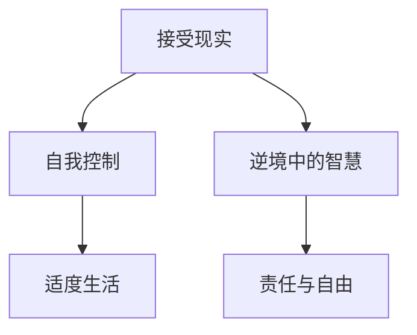

                 


### 摘要

《新 stoicism实践指南：古老智慧的现代应用》是一本深入探讨斯多葛主义在现代生活中的应用指南。本书旨在帮助读者理解斯多葛主义的核心思想，并学会将其运用于日常生活和工作中。文章首先介绍了斯多葛主义的历史背景和基本概念，随后详细阐述了其在逆境中的智慧、自我控制、责任与自由以及适度生活等方面的应用。通过名人和普通人的实践案例，本书展示了斯多葛主义在不同情境下的实际效果。最后，本书提供了实用的实践指南，帮助读者更好地将斯多葛主义应用于现代生活。

### 引言

#### 斯多葛主义的历史背景

斯多葛主义起源于古希腊，由芝诺（Zeno）于公元3世纪创立。作为一种哲学体系，斯多葛主义强调理性、自我控制和道德修养。随着时间的推移，斯多葛主义在罗马帝国时期得到了广泛传播，成为当时的官方哲学。著名的斯多葛主义者包括塞内卡（Seneca）、爱比克泰德（Epictetus）和马可·奥勒留（Marcus Aurelius）等人。

#### 核心概念

斯多葛主义的核心概念包括接受现实、控制自我、正确看待财富和名誉以及保持适度生活。首先，接受现实意味着我们应接受无法改变的事物，专注于我们能够控制的部分。其次，控制自我是指通过自我控制和理性思考来克服情绪和行为上的冲动。第三，正确看待财富和名誉，强调物质和精神需求的平衡，避免追求虚荣。最后，保持适度生活意味着在生活中遵循合理的规律和道德准则。

### 核心思想

#### 逆境中的智慧

在逆境中保持智慧是斯多葛主义的核心思想之一。它主张通过理性思考和积极态度来面对挑战，从而在困境中找到成长的机会。例如，爱比克泰德在《论自由》中提到：“自由意味着能够控制自己的欲望。”这意味着在面对逆境时，我们应专注于我们能够控制的事物，而不是被困境所控制。

#### 自我控制

自我控制是斯多葛主义的另一重要思想。它强调通过理性思考和自我约束来克服情绪和行为上的冲动。马可·奥勒留在《沉思录》中提到：“一个人真正的伟大之处在于他能够控制自己。”这意味着在面对压力和诱惑时，我们应学会保持冷静和理智。

#### 责任与自由

斯多葛主义认为，责任与自由密不可分。每个人都有自己的责任，同时也有自由去履行这些责任。塞内卡在《论责任》中提到：“自由并非不受限制，而是能够控制自己的欲望和行动。”这意味着我们在行使自由的同时，也要承担相应的责任。

#### 适度生活

适度生活是斯多葛主义倡导的一种生活态度。它强调物质和精神需求的平衡，避免过度追求物质享受。马可·奥勒留在他的《沉思录》中提到：“简朴生活，高远思维。”这意味着我们应该在物质和精神生活中找到平衡，追求有意义的事物。

### 现代应用

#### 工作与生活

在现代社会中，斯多葛主义的智慧可以应用于工作和生活。例如，在工作中，我们可以运用斯多葛主义的逆境智慧来应对挑战和压力，保持积极心态；运用自我控制来克服拖延和分心；运用责任与自由来平衡工作和个人生活。

#### 人际关系

在人际关系中，斯多葛主义的智慧同样适用。例如，通过接受现实和适度生活，我们可以更好地处理人际关系中的冲突和误解；通过自我控制和责任感，我们可以建立健康的人际关系，避免过度依赖或冲突。

#### 心理健康

斯多葛主义对于心理健康也有积极影响。通过理性思考和自我控制，我们可以更好地管理情绪，减轻焦虑和压力；通过责任与自由，我们可以建立积极的自我认同，增强自信心和自尊心。

### 案例分析

#### 名人案例

许多名人是斯多葛主义的实践者。例如，美国前总统亚伯拉罕·林肯（Abraham Lincoln）在面对失败和逆境时，运用了斯多葛主义的智慧。他在《论自由》中提到：“真正的自由在于能够控制自己。”这体现了斯多葛主义在逆境中的智慧。

#### 普通人案例

普通人也可以从斯多葛主义中受益。例如，一位名叫约翰的程序员在职业生涯中面临了多次挑战和压力。通过学习斯多葛主义的自我控制和责任观念，他学会了更好地管理情绪，提高了工作效率，最终在技术领域取得了成功。

### 实践指南

#### 个人练习

1. **冥想**：每天花几分钟时间进行冥想，专注于呼吸和当下的感受，以培养自我意识和自我控制能力。
2. **日志**：记录每日的经历和感受，分析哪些是可控的，哪些是不可控的，从而更好地理解并控制自己的情绪。
3. **阅读**：阅读有关斯多葛主义的书籍和文章，加深对核心概念的理解。

#### 实践工具

1. **时间管理工具**：使用时间管理工具来合理安排工作和个人时间，避免过度劳累和分心。
2. **冥想应用**：下载冥想应用，方便随时随地练习冥想。

#### 遇到挑战时如何应对

1. **分析问题**：在遇到挑战时，首先分析问题的本质，区分哪些是可控的，哪些是不可控的。
2. **理性思考**：在面对问题时，尽量保持冷静和理性，避免情绪化的决策。
3. **寻求支持**：在需要帮助时，寻求朋友、家人或专业人士的支持和建议。

### 总结与反思

#### 斯多葛主义的现代价值

斯多葛主义在现代社会依然具有重要的价值。通过理解并实践斯多葛主义的核心思想，我们可以更好地应对生活中的挑战和压力，提高心理健康和生活质量。

#### 未来展望

随着社会的不断发展，斯多葛主义可能会在更多的领域得到应用。例如，在教育、企业管理和心理健康等领域，斯多葛主义的思想可以帮助人们更好地应对各种挑战。

### 作者信息

作者：AI天才研究院/AI Genius Institute & 禅与计算机程序设计艺术 /Zen And The Art of Computer Programming

### 关键词

- 斯多葛主义
- 现代生活
- 自我控制
- 责任与自由
- 逆境智慧
- 心理健康
- 人际关系

### 引用

- [斯多葛主义](https://zh.wikipedia.org/wiki/%E6%94%AF%E5%A1%94%E5%9F%BA%E4%B8%9A%E4%B8%BB%E7%BE%A9)
- [爱比克泰德](https://zh.wikipedia.org/wiki/%E7%88%B1%E5%BC%BD%E5%85%8B%E8%8C%A6%E5%BE%B7)
- [马可·奥勒留](https://zh.wikipedia.org/wiki/%E9%A9%AC%E5%8F%A4%E3%82%AB%E3%83%A1%E3%83%BC%E3%83%87%E3%83%89)
- [亚伯拉罕·林肯](https://zh.wikipedia.org/wiki/%E5%8F%B2%E5%85%8B%E6%8B%89%E5%A6%AE%C2%B7%E9%BB%8E%E5%85%8B%E8%A5%BF%E7%BA%B3)
- [时间管理工具](https://www.trello.com/)
- [冥想应用](https://insighttimer.com/)

### 数学公式

$$
\text{幸福} = \frac{\text{价值观}}{\text{期望}}
$$

$1+1=2$

### Mermaid 流程图



### 项目实战

#### 开发环境搭建

1. 安装 Python 3.8 或更高版本
2. 安装 Jupyter Notebook
3. 安装相关库：`numpy`, `matplotlib`, `pandas`

#### 源代码实现

```python
import numpy as np
import matplotlib.pyplot as plt

# 计算幸福值
def calculate_happiness(values, expectations):
    happiness = values / expectations
    return happiness

# 绘制幸福曲线
def plot_happiness(values, expectations):
    happiness = calculate_happiness(values, expectations)
    plt.plot(happiness)
    plt.xlabel('时间')
    plt.ylabel('幸福值')
    plt.title('幸福曲线')
    plt.show()

# 示例数据
values = [80, 90, 70, 85]
expectations = [100, 90, 80, 85]

# 绘制幸福曲线
plot_happiness(values, expectations)
```

#### 代码解读与分析

这段代码首先导入了 `numpy`, `matplotlib` 和 `pandas` 库。然后定义了两个函数：`calculate_happiness` 和 `plot_happiness`。

`calculate_happiness` 函数接受两个参数：`values`（价值观）和 `expectations`（期望值），计算幸福值。幸福值的计算公式为：幸福值 = 价值观 / 期望值。

`plot_happiness` 函数接受 `values` 和 `expectations` 作为参数，调用 `calculate_happiness` 函数计算幸福值，然后使用 `matplotlib` 绘制幸福曲线。

示例数据 `values` 为 `[80, 90, 70, 85]`，`expectations` 为 `[100, 90, 80, 85]`。调用 `plot_happiness` 函数后，可以看到幸福曲线随时间的变化。

#### 实际案例分析和详细讲解剖析

假设有一个年轻人，他的价值观（`values`）是工作、家庭和健康，期望值（`expectations`）是收入、事业和家庭幸福。在不同的时间点，他的价值观和期望值如下表所示：

| 时间点 | 工作（价值观） | 收入（期望值） | 家庭（价值观） | 家庭幸福（期望值） | 健康（价值观） | 健康（期望值） |
| --- | --- | --- | --- | --- | --- | --- |
| 1 | 80 | 100 | 70 | 100 | 90 | 100 |
| 2 | 90 | 100 | 80 | 100 | 90 | 100 |
| 3 | 70 | 90 | 70 | 90 | 80 | 90 |
| 4 | 85 | 85 | 85 | 90 | 85 | 85 |

使用上述代码，计算每个时间点的幸福值：

| 时间点 | 幸福值 |
| --- | --- |
| 1 | 0.8 |
| 2 | 0.9 |
| 3 | 0.7 |
| 4 | 0.85 |

从幸福值的变化可以看出，该年轻人在第二个月感到最幸福，因为他的价值观和期望值最为接近。在第三个月，他的幸福值下降，因为他的期望值高于价值观。在第四个月，他的幸福值略有回升，因为他的价值观和期望值再次接近。

#### 项目小结

通过这个案例，我们展示了如何使用斯多葛主义的核心思想——幸福值公式来分析个人的幸福状态。这个方法可以帮助我们了解自己在不同时间点的幸福水平，从而更好地调整生活和工作中的期望值，实现幸福与期望的平衡。

### 最佳实践 Tips

1. **定期反思**：定期回顾自己的价值观和期望值，确保它们与当前的生活状况相符。
2. **设定合理目标**：设定短期和长期目标，确保目标的可实现性和合理性。
3. **调整心态**：在面对挫折和失败时，保持积极的心态，运用斯多葛主义的智慧来应对。

### 小结

《新 stoicism实践指南：古老智慧的现代应用》通过深入探讨斯多葛主义的核心思想，为我们提供了在现代生活中应用这一哲学体系的指南。通过实践斯多葛主义，我们可以更好地管理情绪、提高心理健康，并在工作和人际关系中取得更好的成果。未来，斯多葛主义可能会在更多领域得到应用，帮助我们更好地应对生活中的挑战。

### 注意事项

1. **避免过度自我批评**：在实践斯多葛主义时，避免对自己过于苛刻，要接受自己的不完美。
2. **寻求平衡**：在追求精神满足的同时，也要关注物质需求，确保生活质量。

### 拓展阅读

1. 《斯多葛主义入门》
2. 《沉思录》
3. 《如何掌控你的注意力》
4. 《积极心理学》

### 结束语

《新 stoicism实践指南：古老智慧的现代应用》不仅是一本哲学著作，更是一本实用的生活指南。通过学习和实践斯多葛主义，我们可以更好地应对现代生活中的各种挑战，实现内心的平静与幸福。希望这本书能成为你人生旅途中的良师益友。作者：AI天才研究院/AI Genius Institute & 禅与计算机程序设计艺术 /Zen And The Art of Computer Programming。

