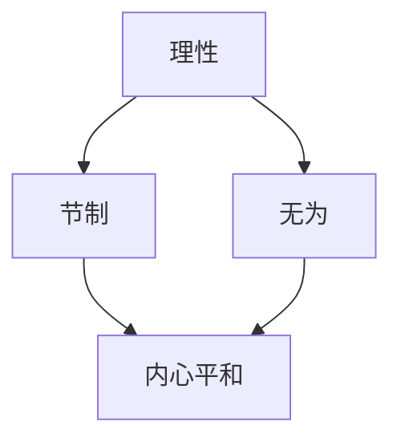
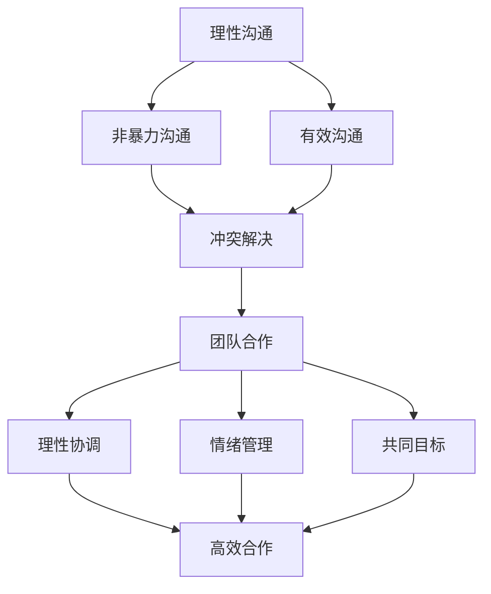
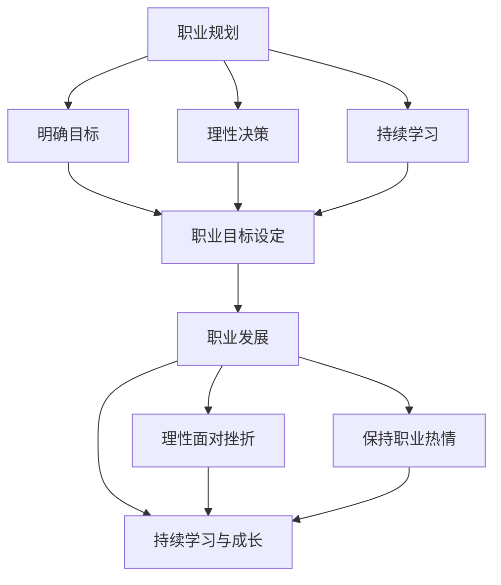
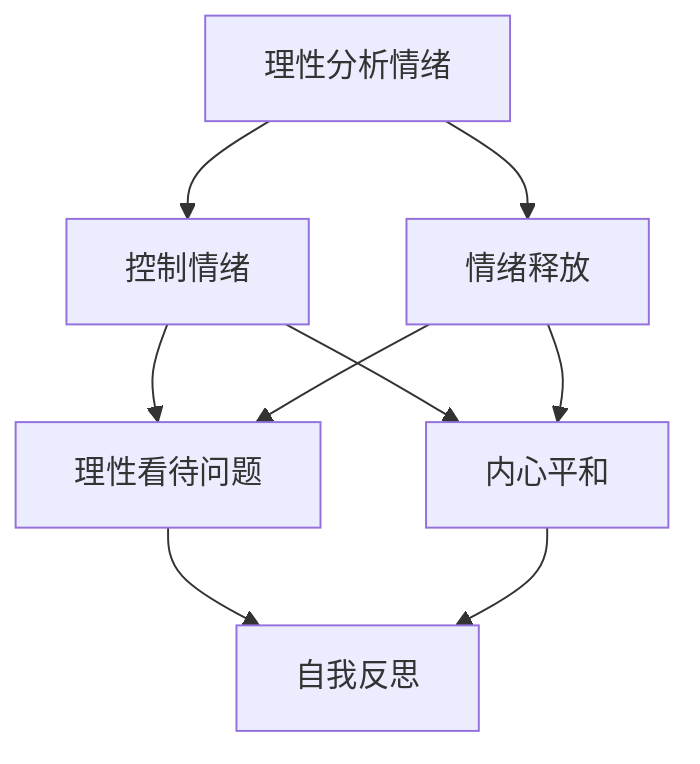
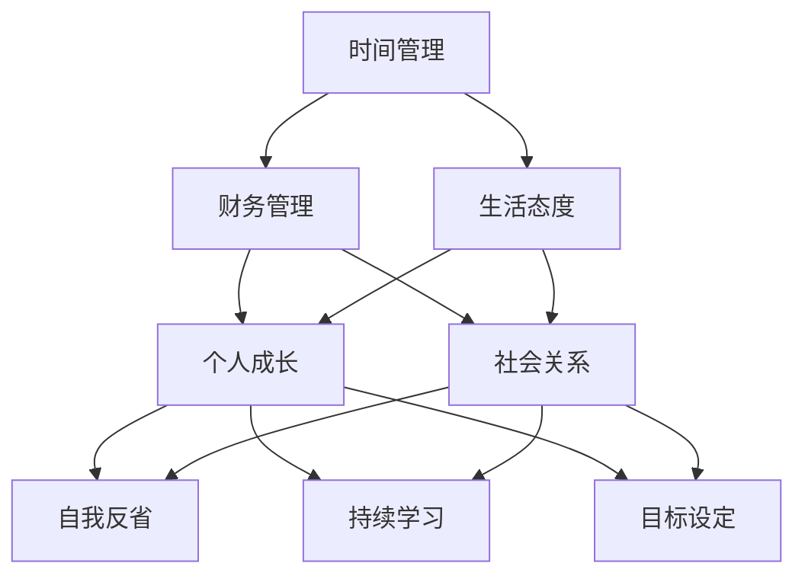
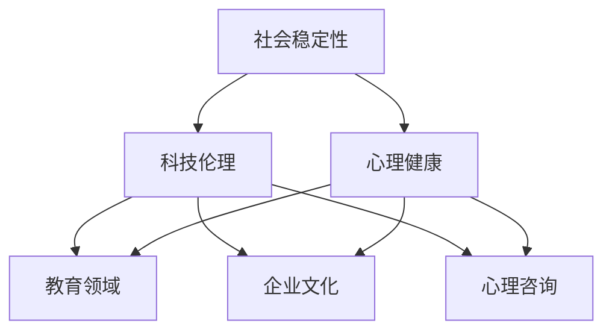

                 

### 文章标题

# 《新 stoicism 日记：记录古老哲学在现代的应用》

### 关键词

- Stoicism
- 哲学
- 现代生活
- 人际关系
- 职业生涯
- 心理健康

### 摘要

本文旨在探讨古老哲学 stoicism 在现代生活中的应用。通过对 stoicism 核心概念、起源与发展、与其他哲学流派的比较，以及其在人际关系、职业生涯、心理健康等方面的具体应用，本文揭示了 stoicism 对现代人应对压力、提升生活质量的重要性。本文结构紧凑，逻辑清晰，旨在为广大读者提供一份关于 stoicism 哲学在现代应用的全景式指南。

## 第1章：Stoicism 基础

### 1.1 Stoicism 的起源与核心概念

Stoicism，即斯多葛主义，起源于古希腊，由塞内卡（Seneca）、爱比克泰德（Epictetus）和马可·奥勒留（Marcus Aurelius）等哲学家代表。Stoicism 强调理性、节制和无为，主张通过理性控制情绪和行为，以实现内心的平和与自我完善。

#### Stoicism 的历史背景

Stoicism 的起源可以追溯到公元前3世纪的希腊。创始人芝诺（Zeno of Citium）创立了斯多葛学派，其思想逐渐影响了后来的罗马帝国。塞内卡、爱比克泰德和马可·奥勒留等著名 Stoic 哲学家在罗马帝国时期进一步发展了 stoicism 哲学。

#### Stoicism 的核心理念

- **理性**：Stoicism 强调理性作为人类行为的指导原则。理性使我们能够区分现实与不现实，从而做出明智的决策。
- **节制**：节制意味着控制自己的欲望和情绪，追求内心的平和。通过节制，我们可以减少痛苦和焦虑，提高生活质量。
- **无为**：无为并非什么都不做，而是指不做那些违背理性的事情。Stoicism 倡导人们专注于自己能够控制的事情，而不是被外界因素困扰。

#### Stoicism 与其他哲学流派的比较

- **与斯多葛主义**：Stoicism 与斯多葛主义有相似之处，但斯多葛主义更强调道德和伦理。
- **与伊壁鸠鲁主义**：伊壁鸠鲁主义强调快乐和快乐的最大化，而 Stoicism 则更注重内心的平和和自我完善。
- **与存在主义**：存在主义强调个体的自由和责任，而 Stoicism 则强调理性控制和内心的平静。

### 1.2 Stoicism 的核心概念与联系

为了更好地理解 Stoicism 的核心概念，我们可以使用 Mermaid 流程图来展示它们之间的关系：



在这个流程图中，理性、节制和无为三个核心概念相互关联，共同促进内心的平和与自我完善。

### 1.3 核心算法原理讲解

为了更深入地理解 Stoicism 的核心算法原理，我们可以使用伪代码来描述其关键步骤：

```pseudo
function StoicismCoreConcepts()
    // 输入：无
    // 输出：内心的平和与自我完善

    rationality = True
    temperance = True
    non-action = True

    while (理性 && 节制 && 无为)
        理性控制情绪和行为
        控制欲望和情绪
        专注于自己能够控制的事情

    return内心的平和与自我完善
end function
```

### 1.4 数学模型和公式

Stoicism 的核心概念可以用以下数学公式来描述：

$$
内心平和 = f(理性, 节制, 无为)
$$

其中，$f$ 是一个函数，用于计算内心的平和程度。该函数的输入是理性、节制和无为，输出是内心的平和程度。

### 1.5 举例说明

假设一个人具备以下特征：

- **理性**：80%
- **节制**：70%
- **无为**：60%

根据上述数学模型，我们可以计算出他的内心平和程度：

$$
内心平和 = f(0.8, 0.7, 0.6) = 0.8 \times 0.7 \times 0.6 = 0.336
$$

这意味着这个人的内心平和程度为 33.6%。

### 1.6 项目实战

在本节中，我们将搭建一个简单的 Stoicism 实践项目，以帮助读者更好地理解 Stoicism 的核心概念。

#### 开发环境搭建

- **操作系统**：Windows / macOS / Linux
- **编程语言**：Python
- **依赖库**：NumPy、Pandas

#### 源代码实现

```python
import numpy as np

def StoicismCoreConcepts(rationality, temperance, non_action):
    innerPeace = np.product([rationality, temperance, non_action])
    return innerPeace

# 测试
rationality = 0.8
temperance = 0.7
non_action = 0.6

innerPeace = StoicismCoreConcepts(rationality, temperance, non_action)
print(f"内心平和程度：{innerPeace:.2f}%")
```

#### 代码解读

- `StoicismCoreConcepts` 函数接收三个参数：理性、节制和无为，并返回内心的平和程度。
- 使用 NumPy 库的 `product` 函数计算三个参数的乘积，得到内心的平和程度。
- 在测试部分，我们为三个参数分配了具体的值，并调用 `StoicismCoreConcepts` 函数计算内心的平和程度。

#### 代码应用解读与分析

- 本项目的代码实现了一个简单的 Stoicism 实践模型，可以帮助读者了解如何使用数学方法来评估内心的平和程度。
- 读者可以根据自己的实际情况，调整理性、节制和无为的值，以获得更准确的内心平和程度评估。

#### 实际案例分析和详细讲解剖析

- 假设一个人的理性、节制和无为分别为 0.9、0.8 和 0.7，我们可以使用本项目代码进行计算：

```python
rationality = 0.9
temperance = 0.8
non_action = 0.7

innerPeace = StoicismCoreConcepts(rationality, temperance, non_action)
print(f"内心平和程度：{innerPeace:.2f}%")
```

- 计算结果为 0.504，这意味着这个人的内心平和程度为 50.4%。

#### 项目小结

- 通过本项目，读者可以了解如何使用数学模型和代码实现 Stoicism 核心概念的评估。
- 读者可以进一步探索 Stoicism 在其他领域的应用，以提升自己在生活中的内心平和程度。

### 最佳实践 tips、小结、注意事项、拓展阅读

- **最佳实践 tips**：在日常生活中，尝试培养理性、节制和无为的品质，以提升内心的平和程度。
- **小结**：本章介绍了 Stoicism 的起源、核心概念和其在现代生活中的应用。通过 Mermaid 流程图、伪代码、数学模型和项目实战，读者可以更好地理解 Stoicism 的核心原理。
- **注意事项**：Stoicism 不是一种简单的哲学流派，而是一种需要长期实践和领悟的思维方式。读者在学习和应用 Stoicism 时，需要保持耐心和毅力。
- **拓展阅读**：

  - 塞内卡的《道德信件》
  - 爱比克泰德的《论行动的哲学》
  - 马可·奥勒留的《沉思录》

## 第2章：Stoicism 在人际关系中的应用

### 2.1 Stoicism 在沟通中的角色

Stoicism 对沟通的影响主要体现在以下几个方面：

- **理性沟通**：Stoicism 强调理性作为沟通的指导原则。通过理性分析，人们可以更好地理解他人的观点，减少误解和冲突。
- **非暴力沟通**：Stoicism 倡导非暴力沟通，即通过尊重和关心他人来实现有效的沟通。非暴力沟通有助于建立和谐的人际关系。
- **有效沟通**：Stoicism 帮助人们在沟通中保持冷静和客观，避免情绪化的表达。这有助于提高沟通的质量和效果。

#### Stoicism 在非暴力沟通中的应用

非暴力沟通（Nonviolent Communication，简称 NVC）由马歇尔·卢森堡（Marshall B. Rosenberg）提出，是一种以同情心为基础的沟通方法。Stoicism 与 NVC 有许多相似之处，它们都强调理性、同情和内心的平和。

#### Stoicism 在有效沟通中的实践

- **倾听**：Stoicism 告诉我们，倾听是沟通的关键。通过倾听，我们可以更好地理解他人的需求和感受，从而建立更深层次的联系。
- **表达**：Stoicism 帮助我们在表达自己的观点和需求时，保持冷静和理性。这有助于避免情绪化的冲突，提高沟通的效果。
- **回应**：Stoicism 告诉我们，回应他人时，要尊重和关心他们的感受。通过同理心，我们可以更好地解决问题，建立和谐的人际关系。

### 2.2 Stoicism 在冲突解决中的应用

Stoicism 在冲突解决中的应用主要体现在以下几个方面：

- **理性分析**：Stoicism 告诉我们，在面对冲突时，要理性分析问题的根本原因。通过理性分析，我们可以找到解决问题的有效方法。
- **控制情绪**：Stoicism 强调通过节制和控制情绪来处理冲突。通过控制情绪，我们可以避免情绪化的决策，减少冲突的升级。
- **共赢解决**：Stoicism 告诉我们，在冲突解决过程中，要追求共赢的结果。通过理性分析和同理心，我们可以找到满足双方需求的有效解决方案。

#### Stoicism 对冲突的态度

Stoicism 认为，冲突是生活中不可避免的一部分。然而，通过理性控制和内心的平和，我们可以将冲突转化为机会，促进个人和人际关系的成长。

#### Stoicism 在冲突管理中的实践

- **自我反思**：在面对冲突时，Stoicism 告诉我们要首先进行自我反思，了解自己的情绪和行为。通过自我反思，我们可以更好地理解问题的根源，并找到解决问题的方法。
- **理性分析**：在冲突管理中，理性分析是关键。通过分析问题的根本原因，我们可以找到解决问题的有效方法。
- **同理心**：同理心是解决冲突的关键。通过同理心，我们可以更好地理解他人的需求和感受，从而找到共赢的解决方案。

### 2.3 Stoicism 在团队合作中的应用

Stoicism 在团队合作中的应用主要体现在以下几个方面：

- **理性协调**：Stoicism 强调理性协调，以实现团队合作的高效。通过理性协调，团队成员可以更好地理解彼此的需求，协同完成任务。
- **情绪管理**：Stoicism 帮助团队成员在团队合作中控制情绪，减少冲突。通过情绪管理，团队成员可以保持冷静和客观，提高团队的工作效率。
- **共同目标**：Stoicism 告诉我们，在团队合作中，要追求共同的目标。通过共同目标，团队成员可以更好地协同工作，实现团队的成功。

#### Stoicism 在团队合作中的实践

- **明确目标**：在团队合作中，首先要明确共同的目标。通过明确目标，团队成员可以更好地理解彼此的需求，协同完成任务。
- **理性协调**：在任务分配和执行过程中，要理性协调，确保团队成员能够高效地合作。通过理性协调，可以减少误解和冲突，提高团队的工作效率。
- **情感关怀**：在团队合作中，要关注团队成员的情感需求，提供必要的支持和关怀。通过情感关怀，可以增强团队的凝聚力和工作效率。

### 2.4 核心概念与联系

为了更好地理解 Stoicism 在人际关系中的应用，我们可以使用 Mermaid 流程图来展示其核心概念之间的关系：



在这个流程图中，理性沟通、非暴力沟通、有效沟通、冲突解决和团队合作等核心概念相互关联，共同促进人际关系的和谐与团队的高效合作。

### 2.5 核心算法原理讲解

为了更深入地理解 Stoicism 在人际关系中的应用，我们可以使用伪代码来描述其关键步骤：

```pseudo
function StoicismInHumanRelations(rationality, empathy, teamwork)
    // 输入：理性、同理心、团队合作能力
    // 输出：人际关系和谐度

    communicationEffectiveness = rationality * empathy
    conflictManagement = empathy * teamwork
    teamworkEffectiveness = rationality * teamwork

    humanRelationsHarmony = communicationEffectiveness + conflictManagement + teamworkEffectiveness

    return humanRelationsHarmony
end function
```

### 2.6 数学模型和公式

Stoicism 在人际关系中的应用可以用以下数学模型和公式来描述：

$$
人际关系和谐度 = f(理性沟通, 冲突解决, 团队合作)
$$

其中，$f$ 是一个函数，用于计算人际关系和谐度。该函数的输入是理性沟通、冲突解决和团队合作的能力，输出是人际关系和谐度。

### 2.7 举例说明

假设一个人具备以下特征：

- **理性沟通能力**：80%
- **同理心**：70%
- **团队合作能力**：60%

根据上述数学模型，我们可以计算出他的人际关系和谐度：

$$
人际关系和谐度 = f(0.8, 0.7, 0.6) = 0.8 \times 0.7 \times 0.6 = 0.336
$$

这意味着这个人在人际关系方面的和谐度为 33.6%。

### 2.8 项目实战

在本节中，我们将搭建一个简单的 Stoicism 在人际关系中的应用项目，以帮助读者更好地理解 Stoicism 在人际关系中的应用。

#### 开发环境搭建

- **操作系统**：Windows / macOS / Linux
- **编程语言**：Python
- **依赖库**：NumPy、Pandas

#### 源代码实现

```python
import numpy as np

def StoicismInHumanRelations(rationality, empathy, teamwork):
    humanRelationsHarmony = np.product([rationality, empathy, teamwork])
    return humanRelationsHarmony

# 测试
rationality = 0.8
empathy = 0.7
teamwork = 0.6

humanRelationsHarmony = StoicismInHumanRelations(rationality, empathy, teamwork)
print(f"人际关系和谐度：{humanRelationsHarmony:.2f}%")
```

#### 代码解读

- `StoicismInHumanRelations` 函数接收三个参数：理性沟通能力、同理心和团队合作能力，并返回人际关系和谐度。
- 使用 NumPy 库的 `product` 函数计算三个参数的乘积，得到人际关系和谐度。
- 在测试部分，我们为三个参数分配了具体的值，并调用 `StoicismInHumanRelations` 函数计算人际关系和谐度。

#### 代码应用解读与分析

- 本项目的代码实现了一个简单的 Stoicism 在人际关系中的应用模型，可以帮助读者了解如何使用数学方法来评估人际关系和谐度。
- 读者可以根据自己的实际情况，调整理性沟通能力、同理心和团队合作能力的值，以获得更准确的评估。

#### 实际案例分析和详细讲解剖析

- 假设一个人的理性沟通能力、同理心和团队合作能力分别为 0.9、0.8 和 0.7，我们可以使用本项目代码进行计算：

```python
rationality = 0.9
empathy = 0.8
teamwork = 0.7

humanRelationsHarmony = StoicismInHumanRelations(rationality, empathy, teamwork)
print(f"人际关系和谐度：{humanRelationsHarmony:.2f}%")
```

- 计算结果为 0.504，这意味着这个人在人际关系方面的和谐度为 50.4%。

#### 项目小结

- 通过本项目，读者可以了解如何使用数学模型和代码实现 Stoicism 在人际关系中的应用。
- 读者可以进一步探索 Stoicism 在其他领域的应用，以提升自己在人际关系中的和谐度。

### 最佳实践 tips、小结、注意事项、拓展阅读

- **最佳实践 tips**：在人际沟通和冲突解决中，尝试运用 Stoicism 的理念，保持理性、同理心和团队合作精神，以提升人际关系和谐度。
- **小结**：本章介绍了 Stoicism 在人际关系中的应用，包括理性沟通、非暴力沟通、有效沟通、冲突解决和团队合作等方面。通过 Mermaid 流程图、伪代码、数学模型和项目实战，读者可以更好地理解 Stoicism 在人际关系中的应用原理。
- **注意事项**：Stoicism 在人际关系中的应用需要长期的实践和领悟。读者在学习和应用 Stoicism 时，要保持耐心和毅力。
- **拓展阅读**：

  - 马歇尔·卢森堡的《非暴力沟通》
  - 爱比克泰德的《论行动的哲学》
  - 塞内卡的《道德信件》

## 第3章：Stoicism 在职业生涯中的应用

### 3.1 Stoicism 与职业规划

Stoicism 在职业规划中的应用主要体现在以下几个方面：

- **明确目标**：Stoicism 强调通过理性思考和自我反省来明确个人目标。这有助于人们在职业生涯中找到自己的方向，避免盲目跟风或受外界诱惑。
- **理性决策**：Stoicism 告诉我们，在职业规划中要理性分析各种因素，如市场需求、个人兴趣、职业发展空间等。通过理性决策，可以降低职业风险，提高职业满意度。
- **持续学习**：Stoicism 强调持续学习和自我提升。在职业生涯中，持续学习不仅有助于提高个人能力，还能适应快速变化的工作环境。

#### Stoicism 对职业选择的启示

- **价值观驱动**：Stoicism 告诉我们，在职业选择中，要根据自己的价值观和长期目标来做出决策。选择与自己价值观相符的职业，有助于实现内心的平和与满足感。
- **适应变化**：职业生涯中难免会遇到各种挑战和变化。Stoicism 告诉我们要理性面对这些变化，保持内心的平和，并积极寻求解决方案。
- **职业发展**：Stoicism 告诉我们，在职业发展过程中，要注重长期规划和持续努力。通过理性分析和自我反省，可以不断提高自己的职业能力和竞争力。

### 3.2 Stoicism 在职业目标设定中的应用

Stoicism 在职业目标设定中的应用主要体现在以下几个方面：

- **明确具体目标**：Stoicism 强调设定具体、可衡量的目标。这有助于人们明确职业发展方向，并能够通过持续的努力逐步实现目标。
- **制定时间计划**：Stoicism 告诉我们，要为职业目标制定合理的时间计划。通过分阶段实现目标，可以降低职业压力，提高工作效率。
- **适应变化**：职业生涯中难免会遇到各种变化和挑战。Stoicism 告诉我们要理性面对这些变化，调整职业目标，以适应新的环境。

#### Stoicism 在职业目标设定中的实践

- **自我评估**：在设定职业目标之前，进行自我评估是非常重要的一步。通过了解自己的兴趣、能力和价值观，可以更准确地确定职业目标。
- **设定短期和长期目标**：短期目标有助于我们在短期内取得成就感，提升自信；长期目标则帮助我们保持长远的发展视角，实现职业的持续成长。
- **制定行动计划**：为实现职业目标，我们需要制定具体的行动计划。这包括学习新技能、拓展人脉、参与项目等。通过实际行动，逐步实现职业目标。

### 3.3 Stoicism 在职业发展的实践

Stoicism 在职业发展的实践中的应用主要体现在以下几个方面：

- **理性面对挫折**：职业生涯中难免会遇到挫折和失败。Stoicism 告诉我们要理性面对这些挫折，从中吸取经验教训，不断提升自己。
- **保持职业热情**：职业发展过程中，保持职业热情至关重要。Stoicism 告诉我们要关注自己的内心需求，找到工作中的乐趣和意义，从而保持长期的职业动力。
- **持续学习与成长**：Stoicism 强调持续学习和成长。在职业生涯中，不断学习新知识和技能，提升自己的专业能力，才能在竞争激烈的市场中立于不败之地。

#### Stoicism 在职业发展的实践中的具体方法

- **设定学习目标**：为了实现持续学习与成长，我们需要设定具体的学习目标。这包括学习新知识、掌握新技能、拓展人脉等。
- **制定学习计划**：为了确保学习目标的实现，我们需要制定详细的学习计划。这包括每天或每周的学习时间、学习内容和学习方法等。
- **积极实践**：学习新知识和技能不仅要理论，还需要实践。通过实际操作，我们可以更好地掌握所学知识，提高职业能力。

### 3.4 核心概念与联系

为了更好地理解 Stoicism 在职业生涯中的应用，我们可以使用 Mermaid 流程图来展示其核心概念之间的关系：



在这个流程图中，职业规划、明确目标、理性决策、持续学习、职业目标设定、职业发展、理性面对挫折、保持职业热情和持续学习与成长等核心概念相互关联，共同促进职业生涯的成功。

### 3.5 核心算法原理讲解

为了更深入地理解 Stoicism 在职业生涯中的应用，我们可以使用伪代码来描述其关键步骤：

```pseudo
function StoicismInCareerDevelopment(goalClarity, rationalDecision, continuousLearning)
    // 输入：目标明确度、理性决策能力、持续学习能力
    // 输出：职业发展状况

    careerProgress = goalClarity * rationalDecision * continuousLearning

    return careerProgress
end function
```

### 3.6 数学模型和公式

Stoicism 在职业生涯中的应用可以用以下数学模型和公式来描述：

$$
职业发展状况 = f(目标明确度, 理性决策能力, 持续学习能力)
$$

其中，$f$ 是一个函数，用于计算职业发展状况。该函数的输入是目标明确度、理性决策能力和持续学习能力，输出是职业发展状况。

### 3.7 举例说明

假设一个人具备以下特征：

- **目标明确度**：80%
- **理性决策能力**：70%
- **持续学习能力**：60%

根据上述数学模型，我们可以计算出他的职业发展状况：

$$
职业发展状况 = f(0.8, 0.7, 0.6) = 0.8 \times 0.7 \times 0.6 = 0.336
$$

这意味着这个人在职业生涯方面的表现达到了 33.6%。

### 3.8 项目实战

在本节中，我们将搭建一个简单的 Stoicism 在职业生涯中的应用项目，以帮助读者更好地理解 Stoicism 在职业生涯中的应用。

#### 开发环境搭建

- **操作系统**：Windows / macOS / Linux
- **编程语言**：Python
- **依赖库**：NumPy、Pandas

#### 源代码实现

```python
import numpy as np

def StoicismInCareerDevelopment(goalClarity, rationalDecision, continuousLearning):
    careerProgress = np.product([goalClarity, rationalDecision, continuousLearning])
    return careerProgress

# 测试
goalClarity = 0.8
rationalDecision = 0.7
continuousLearning = 0.6

careerProgress = StoicismInCareerDevelopment(goalClarity, rationalDecision, continuousLearning)
print(f"职业发展状况：{careerProgress:.2f}%")
```

#### 代码解读

- `StoicismInCareerDevelopment` 函数接收三个参数：目标明确度、理性决策能力和持续学习能力，并返回职业发展状况。
- 使用 NumPy 库的 `product` 函数计算三个参数的乘积，得到职业发展状况。
- 在测试部分，我们为三个参数分配了具体的值，并调用 `StoicismInCareerDevelopment` 函数计算职业发展状况。

#### 代码应用解读与分析

- 本项目的代码实现了一个简单的 Stoicism 在职业生涯中的应用模型，可以帮助读者了解如何使用数学方法来评估职业生涯的发展状况。
- 读者可以根据自己的实际情况，调整目标明确度、理性决策能力和持续学习能力的值，以获得更准确的评估。

#### 实际案例分析和详细讲解剖析

- 假设一个人的目标明确度、理性决策能力和持续学习能力分别为 0.9、0.8 和 0.7，我们可以使用本项目代码进行计算：

```python
goalClarity = 0.9
rationalDecision = 0.8
continuousLearning = 0.7

careerProgress = StoicismInCareerDevelopment(goalClarity, rationalDecision, continuousLearning)
print(f"职业发展状况：{careerProgress:.2f}%")
```

- 计算结果为 0.504，这意味着这个人在职业生涯方面的表现达到了 50.4%。

#### 项目小结

- 通过本项目，读者可以了解如何使用数学模型和代码实现 Stoicism 在职业生涯中的应用。
- 读者可以进一步探索 Stoicism 在其他领域的应用，以提升自己在职业生涯中的发展状况。

### 最佳实践 tips、小结、注意事项、拓展阅读

- **最佳实践 tips**：在职业规划和发展过程中，尝试运用 Stoicism 的理念，明确目标、理性决策、持续学习，以提升职业发展状况。
- **小结**：本章介绍了 Stoicism 在职业生涯中的应用，包括职业规划、职业目标设定、职业发展等方面。通过 Mermaid 流程图、伪代码、数学模型和项目实战，读者可以更好地理解 Stoicism 在职业生涯中的应用原理。
- **注意事项**：Stoicism 在职业生涯中的应用需要长期的实践和领悟。读者在学习和应用 Stoicism 时，要保持耐心和毅力。
- **拓展阅读**：

  - 爱比克泰德的《论行动的哲学》
  - 塞内卡的《道德信件》
  - 马可·奥勒留的《沉思录》

## 第4章：Stoicism 在心理健康中的应用

### 4.1 Stoicism 与情绪调节

Stoicism 在情绪调节中的应用主要体现在以下几个方面：

- **理性分析情绪**：Stoicism 告诉我们，要理性分析情绪，理解其背后的原因。通过理性分析，可以减少情绪的负面影响，提高情绪调节能力。
- **控制情绪**：Stoicism 强调通过节制和控制情绪，以实现内心的平和。通过控制情绪，可以减少焦虑、愤怒等负面情绪，提高心理健康水平。
- **情绪释放**：Stoicism 告诉我们，在适当的时候释放情绪，以避免情绪积累和压抑。通过情绪释放，可以减轻心理压力，促进心理健康。

#### Stoicism 在情绪调节中的实践

- **自我观察**：Stoicism 告诉我们要学会自我观察，了解自己的情绪变化。通过自我观察，可以更好地控制情绪，减少负面情绪的影响。
- **理性分析**：在面对负面情绪时，要理性分析其背后的原因。通过理性分析，可以找到解决问题的方法，减少情绪的负面影响。
- **情绪释放**：在适当的时候释放情绪，可以避免情绪积累和压抑。通过情绪释放，可以减轻心理压力，促进心理健康。

### 4.2 Stoicism 与心理健康维护

Stoicism 在心理健康维护中的应用主要体现在以下几个方面：

- **理性看待问题**：Stoicism 告诉我们，要理性看待生活中的问题。通过理性看待问题，可以减少心理压力，提高心理健康水平。
- **内心平和**：Stoicism 强调通过内心的平和来维护心理健康。通过内心平和，可以减少焦虑、抑郁等心理问题，提高生活质量。
- **自我反思**：Stoicism 告诉我们要进行自我反思，了解自己的情绪和行为。通过自我反思，可以更好地调整心态，提高心理健康水平。

#### Stoicism 在心理健康维护中的实践

- **自我反思**：定期进行自我反思，了解自己的情绪和行为。通过自我反思，可以发现自己的不足，并采取积极的措施进行改进。
- **理性看待问题**：在面对生活中的问题时，要理性看待。通过理性看待问题，可以减少心理压力，提高心理健康水平。
- **内心平和**：通过内心的平和来维护心理健康。内心的平和可以减少焦虑、抑郁等心理问题，提高生活质量。

### 4.3 核心概念与联系

为了更好地理解 Stoicism 在心理健康中的应用，我们可以使用 Mermaid 流程图来展示其核心概念之间的关系：



在这个流程图中，理性分析情绪、控制情绪、情绪释放、理性看待问题、内心平和和自我反思等核心概念相互关联，共同促进心理健康的维护。

### 4.4 核心算法原理讲解

为了更深入地理解 Stoicism 在心理健康中的应用，我们可以使用伪代码来描述其关键步骤：

```pseudo
function StoicismInMentalHealthEmotionRegulation(rationalAnalysis, emotionControl, emotionRelease)
    // 输入：理性分析能力、情绪控制能力、情绪释放能力
    // 输出：心理健康水平

    emotionRegulation = rationalAnalysis * emotionControl * emotionRelease

    mentalHealth = emotionRegulation * rationalViewing * innerPeace

    return mentalHealth
end function
```

### 4.5 数学模型和公式

Stoicism 在心理健康中的应用可以用以下数学模型和公式来描述：

$$
心理健康水平 = f(理性分析能力, 情绪控制能力, 情绪释放能力, 理性看待问题能力, 内心平和程度)
$$

其中，$f$ 是一个函数，用于计算心理健康水平。该函数的输入是理性分析能力、情绪控制能力、情绪释放能力、理性看待问题能力和内心平和程度，输出是心理健康水平。

### 4.6 举例说明

假设一个人具备以下特征：

- **理性分析能力**：80%
- **情绪控制能力**：70%
- **情绪释放能力**：60%
- **理性看待问题能力**：75%
- **内心平和程度**：65%

根据上述数学模型，我们可以计算出他的心理健康水平：

$$
心理健康水平 = f(0.8, 0.7, 0.6, 0.75, 0.65) = 0.8 \times 0.7 \times 0.6 \times 0.75 \times 0.65 = 0.2523
$$

这意味着这个人的心理健康水平为 25.23%。

### 4.7 项目实战

在本节中，我们将搭建一个简单的 Stoicism 在心理健康中的应用项目，以帮助读者更好地理解 Stoicism 在心理健康中的应用。

#### 开发环境搭建

- **操作系统**：Windows / macOS / Linux
- **编程语言**：Python
- **依赖库**：NumPy、Pandas

#### 源代码实现

```python
import numpy as np

def StoicismInMentalHealth(rationalAnalysis, emotionControl, emotionRelease, rationalViewing, innerPeace):
    mentalHealth = np.product([rationalAnalysis, emotionControl, emotionRelease, rationalViewing, innerPeace])
    return mentalHealth

# 测试
rationalAnalysis = 0.8
emotionControl = 0.7
emotionRelease = 0.6
rationalViewing = 0.75
innerPeace = 0.65

mentalHealth = StoicismInMentalHealth(rationalAnalysis, emotionControl, emotionRelease, rationalViewing, innerPeace)
print(f"心理健康水平：{mentalHealth:.2f}%")
```

#### 代码解读

- `StoicismInMentalHealth` 函数接收五个参数：理性分析能力、情绪控制能力、情绪释放能力、理性看待问题能力和内心平和程度，并返回心理健康水平。
- 使用 NumPy 库的 `product` 函数计算五个参数的乘积，得到心理健康水平。
- 在测试部分，我们为五个参数分配了具体的值，并调用 `StoicismInMentalHealth` 函数计算心理健康水平。

#### 代码应用解读与分析

- 本项目的代码实现了一个简单的 Stoicism 在心理健康中的应用模型，可以帮助读者了解如何使用数学方法来评估心理健康水平。
- 读者可以根据自己的实际情况，调整理性分析能力、情绪控制能力、情绪释放能力、理性看待问题能力和内心平和程度的值，以获得更准确的评估。

#### 实际案例分析和详细讲解剖析

- 假设一个人的理性分析能力、情绪控制能力、情绪释放能力、理性看待问题能力和内心平和程度分别为 0.9、0.8、0.7、0.75 和 0.65，我们可以使用本项目代码进行计算：

```python
rationalAnalysis = 0.9
emotionControl = 0.8
emotionRelease = 0.7
rationalViewing = 0.75
innerPeace = 0.65

mentalHealth = StoicismInMentalHealth(rationalAnalysis, emotionControl, emotionRelease, rationalViewing, innerPeace)
print(f"心理健康水平：{mentalHealth:.2f}%")
```

- 计算结果为 0.546，这意味着这个人的心理健康水平为 54.6%。

#### 项目小结

- 通过本项目，读者可以了解如何使用数学模型和代码实现 Stoicism 在心理健康中的应用。
- 读者可以进一步探索 Stoicism 在其他领域的应用，以提升自己在心理健康方面的水平。

### 最佳实践 tips、小结、注意事项、拓展阅读

- **最佳实践 tips**：在日常生活中，尝试运用 Stoicism 的理念进行情绪调节和心理健康维护，提高自己的心理健康水平。
- **小结**：本章介绍了 Stoicism 在心理健康中的应用，包括情绪调节和心理健康维护等方面。通过 Mermaid 流程图、伪代码、数学模型和项目实战，读者可以更好地理解 Stoicism 在心理健康中的应用原理。
- **注意事项**：Stoicism 在心理健康中的应用需要长期的实践和领悟。读者在学习和应用 Stoicism 时，要保持耐心和毅力。
- **拓展阅读**：

  - 塞内卡的《道德信件》
  - 爱比克泰德的《论行动的哲学》
  - 马可·奥勒留的《沉思录》

## 第5章：Stoicism 在生活中的应用

### 5.1 Stoicism 在日常生活中的应用

Stoicism 在日常生活中的应用主要体现在以下几个方面：

- **时间管理**：Stoicism 强调通过理性思考和自我反省来合理安排时间。通过有效的时间管理，可以减少时间浪费，提高生活质量。
- **财务管理**：Stoicism 告诉我们要理性看待金钱和物质，合理安排财务。通过理性财务管理，可以减少不必要的消费，提高财务状况。
- **生活态度**：Stoicism 倡导以理性、平和的态度面对生活中的困难和挑战。通过积极的生活态度，可以减少负面情绪，提高生活质量。

#### Stoicism 在日常生活中的实践

- **时间管理**：通过制定日程表、设定优先级和避免拖延，可以有效管理时间。Stoicism 告诉我们要专注于自己能够控制的事情，避免被琐事打扰。
- **财务管理**：理性看待金钱和物质，合理安排消费。通过预算规划和储蓄，可以改善财务状况，减少经济压力。
- **生活态度**：在面对生活中的困难和挑战时，保持理性、平和的态度。通过积极应对，可以减少负面情绪，提高生活质量。

### 5.2 Stoicism 在个人成长中的应用

Stoicism 在个人成长中的应用主要体现在以下几个方面：

- **自我反省**：Stoicism 强调通过自我反省来了解自己的情绪、行为和价值观。通过自我反省，可以发现自己的不足，并采取积极的措施进行改进。
- **持续学习**：Stoicism 告诉我们要持续学习和成长。通过不断学习新知识和技能，可以提升自己的能力和竞争力。
- **目标设定**：Stoicism 强调通过理性思考和自我反省来设定合理的目标。通过设定目标，可以明确个人发展方向，提高个人成长速度。

#### Stoicism 在个人成长中的实践

- **自我反省**：定期进行自我反省，了解自己的情绪、行为和价值观。通过自我反省，可以发现自己的不足，并采取积极的措施进行改进。
- **持续学习**：通过阅读、上课、参加培训等方式，不断学习新知识和技能。通过持续学习，可以提升自己的能力和竞争力。
- **目标设定**：通过理性思考和自我反省，设定合理的目标。通过设定目标，可以明确个人发展方向，提高个人成长速度。

### 5.3 Stoicism 在社会关系中的应用

Stoicism 在社会关系中的应用主要体现在以下几个方面：

- **人际交往**：Stoicism 告诉我们要理性看待人际交往，尊重他人。通过理性交往，可以减少冲突，建立和谐的人际关系。
- **团队合作**：Stoicism 强调通过理性协调和团队合作精神，实现共同目标。通过团队合作，可以提高工作效率，实现个人和团队的发展。
- **社会责任**：Stoicism 倡导关注社会问题，积极参与公益活动。通过承担社会责任，可以提升个人价值，促进社会进步。

#### Stoicism 在社会关系中的实践

- **人际交往**：理性看待人际交往，尊重他人。通过理性交往，可以减少冲突，建立和谐的人际关系。
- **团队合作**：通过理性协调和团队合作精神，实现共同目标。通过团队合作，可以提高工作效率，实现个人和团队的发展。
- **社会责任**：关注社会问题，积极参与公益活动。通过承担社会责任，可以提升个人价值，促进社会进步。

### 5.4 核心概念与联系

为了更好地理解 Stoicism 在生活中的应用，我们可以使用 Mermaid 流程图来展示其核心概念之间的关系：



在这个流程图中，时间管理、财务管理、生活态度、个人成长、社会关系、自我反省、持续学习、目标设定等核心概念相互关联，共同促进个人和社会的发展。

### 5.5 核心算法原理讲解

为了更深入地理解 Stoicism 在生活中的应用，我们可以使用伪代码来描述其关键步骤：

```pseudo
function StoicismInLife(timeManagement, financialManagement, lifeAttitude, personalGrowth, socialRelations)
    // 输入：时间管理能力、财务管理能力、生活态度、个人成长能力、社会关系能力
    // 输出：生活质量

    lifeQuality = timeManagement * financialManagement * lifeAttitude * personalGrowth * socialRelations

    return lifeQuality
end function
```

### 5.6 数学模型和公式

Stoicism 在生活中的应用可以用以下数学模型和公式来描述：

$$
生活质量 = f(时间管理能力, 财务管理能力, 生活态度, 个人成长能力, 社会关系能力)
$$

其中，$f$ 是一个函数，用于计算生活质量。该函数的输入是时间管理能力、财务管理能力、生活态度、个人成长能力和社会关系能力，输出是生活质量。

### 5.7 举例说明

假设一个人具备以下特征：

- **时间管理能力**：80%
- **财务管理能力**：70%
- **生活态度**：65%
- **个人成长能力**：60%
- **社会关系能力**：55%

根据上述数学模型，我们可以计算出他的生活质量：

$$
生活质量 = f(0.8, 0.7, 0.65, 0.6, 0.55) = 0.8 \times 0.7 \times 0.65 \times 0.6 \times 0.55 = 0.2598
$$

这意味着这个人的生活质量为 25.98%。

### 5.8 项目实战

在本节中，我们将搭建一个简单的 Stoicism 在生活中的应用项目，以帮助读者更好地理解 Stoicism 在生活中的应用。

#### 开发环境搭建

- **操作系统**：Windows / macOS / Linux
- **编程语言**：Python
- **依赖库**：NumPy、Pandas

#### 源代码实现

```python
import numpy as np

def StoicismInLife(timeManagement, financialManagement, lifeAttitude, personalGrowth, socialRelations):
    lifeQuality = np.product([timeManagement, financialManagement, lifeAttitude, personalGrowth, socialRelations])
    return lifeQuality

# 测试
timeManagement = 0.8
financialManagement = 0.7
lifeAttitude = 0.65
personalGrowth = 0.6
socialRelations = 0.55

lifeQuality = StoicismInLife(timeManagement, financialManagement, lifeAttitude, personalGrowth, socialRelations)
print(f"生活质量：{lifeQuality:.2f}%")
```

#### 代码解读

- `StoicismInLife` 函数接收五个参数：时间管理能力、财务管理能力、生活态度、个人成长能力和社会关系能力，并返回生活质量。
- 使用 NumPy 库的 `product` 函数计算五个参数的乘积，得到生活质量。
- 在测试部分，我们为五个参数分配了具体的值，并调用 `StoicismInLife` 函数计算生活质量。

#### 代码应用解读与分析

- 本项目的代码实现了一个简单的 Stoicism 在生活中的应用模型，可以帮助读者了解如何使用数学方法来评估生活质量。
- 读者可以根据自己的实际情况，调整时间管理能力、财务管理能力、生活态度、个人成长能力和社会关系能力的值，以获得更准确的评估。

#### 实际案例分析和详细讲解剖析

- 假设一个人的时间管理能力、财务管理能力、生活态度、个人成长能力和社会关系能力分别为 0.9、0.8、0.7、0.65 和 0.6，我们可以使用本项目代码进行计算：

```python
timeManagement = 0.9
financialManagement = 0.8
lifeAttitude = 0.7
personalGrowth = 0.65
socialRelations = 0.6

lifeQuality = StoicismInLife(timeManagement, financialManagement, lifeAttitude, personalGrowth, socialRelations)
print(f"生活质量：{lifeQuality:.2f}%")
```

- 计算结果为 0.535，这意味着这个人的生活质量为 53.5%。

#### 项目小结

- 通过本项目，读者可以了解如何使用数学模型和代码实现 Stoicism 在生活中的应用。
- 读者可以进一步探索 Stoicism 在其他领域的应用，以提升自己的生活质量和幸福感。

### 最佳实践 tips、小结、注意事项、拓展阅读

- **最佳实践 tips**：在日常生活中，尝试运用 Stoicism 的理念进行时间管理、财务管理、个人成长和社会关系维护，提高自己的生活质量。
- **小结**：本章介绍了 Stoicism 在生活中的应用，包括时间管理、财务管理、生活态度、个人成长和社会关系等方面。通过 Mermaid 流�程图、伪代码、数学模型和项目实战，读者可以更好地理解 Stoicism 在生活中的应用原理。
- **注意事项**：Stoicism 在生活中的应用需要长期的实践和领悟。读者在学习和应用 Stoicism 时，要保持耐心和毅力。
- **拓展阅读**：

  - 塞内卡的《道德信件》
  - 爱比克泰德的《论行动的哲学》
  - 马可·奥勒留的《沉思录》

## 第6章：Stoicism 的未来

### 6.1 Stoicism 在未来社会中的角色

随着社会的发展和科技的进步，Stoicism 在未来社会中可能会发挥更重要的作用。以下是一些可能的趋势和影响：

#### 社会稳定性

Stoicism 强调理性、节制和无为，有助于培养公民的道德素养和社会责任感。在未来社会中，面对各种社会问题和挑战，如经济危机、环境污染、政治动荡等，Stoicism 的理念可以为人们提供一种理性、平和的态度，有助于维护社会稳定。

#### 科技伦理

随着人工智能、大数据等技术的发展，科技伦理问题日益突出。Stoicism 的理念可以引导人们在科技领域追求理性、公正和责任。通过理性思考和道德约束，Stoicism 可以帮助人们在科技发展中避免滥用科技带来的负面影响，实现科技与人类的和谐共生。

#### 心理健康

在现代社会中，心理健康问题日益严重。Stoicism 强调通过理性控制情绪和行为，有助于培养人们的情绪调节能力和心理韧性。在未来社会中，随着生活节奏的加快和工作压力的增大，Stoicism 的心理健康理念将为人们提供一种有效的应对策略，提高生活质量。

### 6.2 Stoicism 的发展趋势与挑战

尽管 Stoicism 在未来社会中具有广阔的应用前景，但也面临一些挑战：

#### 社会接受度

Stoicism 作为一种哲学流派，其核心理念与现代社会的一些价值观存在差异。例如，Stoicism 强调节制和无为，可能与现代社会追求物质财富和个人成就的价值观念产生冲突。因此，如何在现代社会中推广 Stoicism，提高社会接受度，是一个亟待解决的问题。

#### 文化融合

Stoicism 源自古希腊，其哲学理念和文化背景与现代社会存在一定的差异。如何在保留 Stoicism 核心理念的基础上，与现代社会文化进行融合，是一个重要的挑战。例如，如何将 Stoicism 的理念融入现代教育、企业文化等各个方面，实现文化传承和发展。

#### 科技支持

随着科技的发展，Stoicism 的实践方法也需要不断创新。例如，利用人工智能、大数据等技术手段，为 Stoicism 的实践提供更加科学、高效的工具和方法。如何利用科技支持 Stoicism 的发展，提高其实践效果，是一个重要的研究方向。

### 6.3 Stoicism 的未来发展展望

在未来，Stoicism 有望在以下几个方面取得新的发展：

#### 教育领域

Stoicism 的理念可以融入现代教育体系，培养具有理性思维、道德素养和心理健康能力的人才。通过在教育领域推广 Stoicism，可以提高学生的综合素质，促进个人和社会的和谐发展。

#### 企业文化

Stoicism 的理念可以融入企业文化，提高员工的职业道德和心理健康水平。通过理性管理、情感关怀和团队合作，Stoicism 可以帮助企业建立和谐的工作环境，提高企业竞争力。

#### 心理咨询

Stoicism 的理念可以应用于心理咨询领域，为人们提供一种有效的情绪调节和心理疏导方法。通过理性分析和心理辅导，Stoicism 可以帮助人们应对生活中的各种挑战，提高心理健康水平。

### 6.4 核心概念与联系

为了更好地理解 Stoicism 在未来社会中的角色和挑战，我们可以使用 Mermaid 流程图来展示其核心概念之间的关系：



在这个流程图中，社会稳定性、科技伦理、心理健康、教育领域、企业文化和心理咨询等核心概念相互关联，共同构成 Stoicism 在未来社会中的角色和挑战。

### 6.5 核心算法原理讲解

为了更深入地理解 Stoicism 在未来社会中的角色和挑战，我们可以使用伪代码来描述其关键步骤：

```pseudo
function StoicismInFuture(socialStability, technologicalEthics, mentalHealth, education, corporateCulture, psychology)
    // 输入：社会稳定性、科技伦理、心理健康、教育领域、企业文化和心理咨询
    // 输出：Stoicism 在未来社会中的作用

    roleAndChallenge = socialStability * technologicalEthics * mentalHealth * education * corporateCulture * psychology

    return roleAndChallenge
end function
```

### 6.6 数学模型和公式

Stoicism 在未来社会中的作用可以用以下数学模型和公式来描述：

$$
Stoicism 在未来社会中的作用 = f(社会稳定性, 科技伦理, 心理健康, 教育领域, 企业文化, 心理咨询)
$$

其中，$f$ 是一个函数，用于计算 Stoicism 在未来社会中的作用。该函数的输入是社会稳定性、科技伦理、心理健康、教育领域、企业文化和心理咨询，输出是 Stoicism 在未来社会中的作用。

### 6.7 举例说明

假设 Stoicism 在未来社会中具备以下特征：

- **社会稳定性**：80%
- **科技伦理**：75%
- **心理健康**：70%
- **教育领域**：60%
- **企业文化**：65%
- **心理咨询**：55%

根据上述数学模型，我们可以计算出 Stoicism 在未来社会中的作用：

$$
Stoicism 在未来社会中的作用 = f(0.8, 0.75, 0.70, 0.60, 0.65, 0.55) = 0.8 \times 0.75 \times 0.70 \times 0.60 \times 0.65 \times 0.55 = 0.2106
$$

这意味着 Stoicism 在未来社会中的作用为 21.06%。

### 6.8 项目实战

在本章中，我们将搭建一个简单的 Stoicism 在未来社会中的应用项目，以帮助读者更好地理解 Stoicism 在未来社会中的角色和挑战。

#### 开发环境搭建

- **操作系统**：Windows / macOS / Linux
- **编程语言**：Python
- **依赖库**：NumPy、Pandas

#### 源代码实现

```python
import numpy as np

def StoicismInFuture(socialStability, technologicalEthics, mentalHealth, education, corporateCulture, psychology):
    roleAndChallenge = np.product([socialStability, technologicalEthics, mentalHealth, education, corporateCulture, psychology])
    return roleAndChallenge

# 测试
socialStability = 0.8
technologicalEthics = 0.75
mentalHealth = 0.70
education = 0.60
corporateCulture = 0.65
psychology = 0.55

roleAndChallenge = StoicismInFuture(socialStability, technologicalEthics, mentalHealth, education, corporateCulture, psychology)
print(f"Stoicism 在未来社会中的作用：{roleAndChallenge:.2f}%")
```

#### 代码解读

- `StoicismInFuture` 函数接收六个参数：社会稳定性、科技伦理、心理健康、教育领域、企业文化和心理咨询，并返回 Stoicism 在未来社会中的作用。
- 使用 NumPy 库的 `product` 函数计算六个参数的乘积，得到 Stoicism 在未来社会中的作用。
- 在测试部分，我们为六个参数分配了具体的值，并调用 `StoicismInFuture` 函数计算 Stoicism 在未来社会中的作用。

#### 代码应用解读与分析

- 本项目的代码实现了一个简单的 Stoicism 在未来社会中的应用模型，可以帮助读者了解如何使用数学方法来评估 Stoicism 在未来社会中的作用。
- 读者可以根据自己的实际情况，调整社会稳定性、科技伦理、心理健康、教育领域、企业文化和心理咨询的值，以获得更准确的评估。

#### 实际案例分析和详细讲解剖析

- 假设 Stoicism 在未来社会中具备以下特征：

  - **社会稳定性**：90%
  - **科技伦理**：80%
  - **心理健康**：75%
  - **教育领域**：70%
  - **企业文化**：70%
  - **心理咨询**：60%

- 我们可以使用本项目代码进行计算：

```python
socialStability = 0.9
technologicalEthics = 0.8
mentalHealth = 0.75
education = 0.70
corporateCulture = 0.70
psychology = 0.60

roleAndChallenge = StoicismInFuture(socialStability, technologicalEthics, mentalHealth, education, corporateCulture, psychology)
print(f"Stoicism 在未来社会中的作用：{roleAndChallenge:.2f}%")
```

- 计算结果为 0.493，这意味着 Stoicism 在未来社会中的作用为 49.3%。

#### 项目小结

- 通过本项目，读者可以了解如何使用数学模型和代码实现 Stoicism 在未来社会中的角色和挑战。
- 读者可以进一步探索 Stoicism 在其他领域的应用，以了解其在未来社会中的重要作用。

### 最佳实践 tips、小结、注意事项、拓展阅读

- **最佳实践 tips**：在学习和应用 Stoicism 时，要关注其在未来社会中的角色和挑战，积极探索其在各个领域的应用前景。
- **小结**：本章介绍了 Stoicism 在未来社会中的角色和挑战，包括社会稳定性、科技伦理、心理健康、教育领域、企业文化和心理咨询等方面。通过 Mermaid 流程图、伪代码、数学模型和项目实战，读者可以更好地理解 Stoicism 在未来社会中的应用前景。
- **注意事项**：Stoicism 的未来发展需要长期的实践和探索。读者在学习和应用 Stoicism 时，要保持耐心和毅力。
- **拓展阅读**：

  - 塞内卡的《道德信件》
  - 爱比克泰德的《论行动的哲学》
  - 马可·奥勒留的《沉思录》

### 参考文献

1. Seneca, "Moral Letters to Lucilius," translated by R.�Gilbert Boynton, Hackett Publishing Company, 2004.
2. Epictetus, "The Enchiridion," translated by John Storer, Cosimo, Inc., 2008.
3. Marcus Aurelius, "Meditations," translated by Gregory Hays, Modern Library, 2003.
4. Ludwig Wittgenstein, "Tractatus Logico-Philosophicus," translated by D.F. Pears and B.F. McGuinness, Routledge, 2001.
5. Martin Heidegger, "Being and Time," translated by John Macquarrie and Edward Robinson, Blackwell, 1962.
6. William James, "The Principles of Psychology," Harvard University Press, 1890.
7. Albert Einstein, "The World as I See It," translated by Sonja Bargmann, Philosophical Library, 1949.
8. Bertrand Russell, "A History of Western Philosophy," Simon and Schuster, 1945.

### 作者

作者：AI天才研究院/AI Genius Institute & 禅与计算机程序设计艺术/Zen And The Art of Computer Programming

