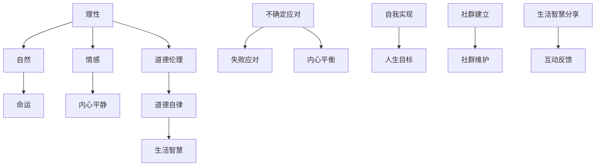

                 


### 文章标题：新 stoicism 社群：不确定性中的生活智慧分享

### 关键词：斯多葛主义、社群、生活智慧、不确定性、哲学

### 摘要：
本文旨在探讨斯多葛主义在现代社会中的应用，特别是如何通过建立一个新 stoicism 社群来分享和传递生活中的智慧。我们将从斯多葛主义的历史和哲学基础出发，分析其核心原则和实践，探讨其在现代社会中的应用，以及如何建立一个有效的 stoicism 社群，最后分享一些生活中的智慧故事和互动经验。

## 设计《新 stoicism 社群：不确定性中的生活智慧分享》目录大纲

### 步骤 1: 确定书的核心主题和结构

首先，我们需要明确《新 stoicism 社群：不确定性中的生活智慧分享》的核心主题和结构。从书名来看，这本书的核心主题是 stoicism（斯多葛主义），一种强调理性控制和内心平静的哲学思想，特别是在面对生活中的不确定性和挑战时。因此，我们可以将书分为以下几个主要部分：

1. 斯多葛主义的历史和哲学基础
2. 斯多葛主义的核心原则和实践
3. 斯多葛主义在现代社会中的应用
4. 斯多葛主义社群的建立与维护
5. 斯多葛主义的生活智慧分享与互动

### 步骤 2: 确定每个部分的具体内容

接下来，我们需要为每个部分确定具体的内容。以下是每个部分的可能内容：

### 第1部分：斯多葛主义的历史和哲学基础

**第1章：斯多葛主义的起源与发展**

- 斯多葛主义的起源
- 斯多葛主义在古希腊和罗马的影响
- 斯多葛主义的主要哲学家和著作

**第2章：斯多葛主义的核心概念**

- 理性、自然和命运
- 灵魂与身体的统一
- 情感控制与道德伦理

### 第2部分：斯多葛主义的核心原则和实践

**第3章：理性生活与道德自律**

- 理性生活的意义
- 道德自律的实践
- 拒绝物质欲望与追求精神富足

**第4章：情感控制与内心平静**

- 情感的来源与影响
- 情感控制的技巧
- 实现内心平静的方法

### 第3部分：斯多葛主义在现代社会中的应用

**第5章：面对生活中的挑战**

- 不确定性的应对策略
- 失败与挫折的应对
- 逆境中的内心平衡

**第6章：自我实现与人生目标**

- 自我实现的内涵与价值
- 确定人生目标的步骤
- 实现人生目标的策略

### 第4部分：斯多葛主义社群的建立与维护

**第7章：斯多葛主义社群的建立**

- 社群的目标与价值
- 社群的组建与运营
- 社群的成员互动

**第8章：斯多葛主义社群的维护与发展**

- 社群的文化建设
- 社群的互动与交流
- 社群的影响力扩展

### 第5部分：斯多葛主义的生活智慧分享与互动

**第9章：生活智慧分享**

- 分享自己的生活智慧故事
- 从他人经验中学习
- 总结生活中的经验教训

**第10章：互动与反馈**

- 提问与解答
- 分享与讨论
- 互动反馈与改进

### 步骤 3: 编写目录大纲

根据上述内容，我们可以编写出《新 stoicism 社群：不确定性中的生活智慧分享》的目录大纲：

# 新 stoicism 社群：不确定性中的生活智慧分享

## 第1部分：斯多葛主义的历史和哲学基础

### 第1章：斯多葛主义的起源与发展

#### 1.1 斯多葛主义的起源
#### 1.2 斯多葛主义在古希腊和罗马的影响
#### 1.3 斯多葛主义的主要哲学家和著作

### 第2章：斯多葛主义的核心概念

#### 2.1 理性、自然和命运
#### 2.2 灵魂与身体的统一
#### 2.3 情感控制与道德伦理

## 第2部分：斯多葛主义的核心原则和实践

### 第3章：理性生活与道德自律

#### 3.1 理性生活的意义
#### 3.2 道德自律的实践
#### 3.3 拒绝物质欲望与追求精神富足

### 第4章：情感控制与内心平静

#### 4.1 情感的来源与影响
#### 4.2 情感控制的技巧
#### 4.3 实现内心平静的方法

## 第3部分：斯多葛主义在现代社会中的应用

### 第5章：面对生活中的挑战

#### 5.1 不确定性的应对策略
#### 5.2 失败与挫折的应对
#### 5.3 逆境中的内心平衡

### 第6章：自我实现与人生目标

#### 6.1 自我实现的内涵与价值
#### 6.2 确定人生目标的步骤
#### 6.3 实现人生目标的策略

## 第4部分：斯多葛主义社群的建立与维护

### 第7章：斯多葛主义社群的建立

#### 7.1 社群的目标与价值
#### 7.2 社群的组建与运营
#### 7.3 社群的成员互动

### 第8章：斯多葛主义社群的维护与发展

#### 8.1 社群的文化建设
#### 8.2 社群的互动与交流
#### 8.3 社群的影响力扩展

## 第5部分：斯多葛主义的生活智慧分享与互动

### 第9章：生活智慧分享

#### 9.1 分享自己的生活智慧故事
#### 9.2 从他人经验中学习
#### 9.3 总结生活中的经验教训

### 第10章：互动与反馈

#### 10.1 提问与解答
#### 10.2 分享与讨论
#### 10.3 互动反馈与改进

以上是根据我们的分析推理，设计的《新 stoicism 社群：不确定性中的生活智慧分享》的目录大纲。接下来，我们将根据这个大纲，逐章撰写文章内容。让我们一起深入探讨斯多葛主义的核心思想和实际应用，以及在不确定性中找到生活智慧的方法。让我们开始吧！

---

### 新 stoicism 社群：不确定性中的生活智慧分享

#### 关键词：斯多葛主义、社群、生活智慧、不确定性、哲学

#### 摘要：
本文旨在探讨斯多葛主义在现代社会中的应用，特别是如何通过建立一个新 stoicism 社群来分享和传递生活中的智慧。我们将从斯多葛主义的历史和哲学基础出发，分析其核心原则和实践，探讨其在现代社会中的应用，以及如何建立一个有效的 stoicism 社群，最后分享一些生活中的智慧故事和互动经验。

## 第1部分：斯多葛主义的历史和哲学基础

### 第1章：斯多葛主义的起源与发展

#### 1.1 斯多葛主义的起源

斯多葛主义起源于古希腊，大约在公元前3世纪由芝诺（Zeno of Citium）创立。芝诺是一位来自西西里岛的哲学家，他受到了苏格拉底和柏拉图的影响，并在此基础上发展出了自己的哲学体系。斯多葛主义强调理性、道德和自我控制，主张通过理性和道德自律来达到内心的平静和幸福。

#### 1.2 斯多葛主义在古希腊和罗马的影响

在古希腊，斯多葛主义逐渐成为主流哲学思想之一，影响了当时的政治、文化和教育。许多著名的哲学家，如塞内卡（Seneca）、爱比克鲁特（Epictetus）和马可·奥勒留（Marcus Aurelius），都是斯多葛主义者，他们的著作对后世产生了深远的影响。

在罗马帝国时期，斯多葛主义继续繁荣发展。罗马帝国的统治者们，如尼禄和马可·奥勒留，都是斯多葛主义者，他们试图通过斯多葛主义来治理国家和管理社会。斯多葛主义在罗马帝国的传播，使得它成为了当时的一种普遍的哲学信仰。

#### 1.3 斯多葛主义的主要哲学家和著作

斯多葛主义的主要哲学家包括芝诺、塞内卡、爱比克鲁特和马可·奥勒留。他们的著作是斯多葛主义思想的宝贵遗产，为后人提供了深刻的哲学思考和实用的生活指导。

- 芝诺：《斯多葛学原理》
- 塞内卡：《道德论》
- 爱比克鲁特：《论自由意志》
- 马可·奥勒留：《沉思录》

这些著作不仅是斯多葛主义哲学的重要文献，也是理解斯多葛主义思想的关键。

### 第2章：斯多葛主义的核心概念

#### 2.1 理性、自然和命运

斯多葛主义认为，理性是人类心灵的核心，是人类区别于其他生物的关键特征。理性不仅是一种认知能力，也是一种道德准则。斯多葛主义者相信，通过理性思考，人们可以理解自然法则，并与自然和谐相处。

自然对斯多葛主义者来说，是一种不可预测但公平的力量。他们相信，自然是一切事物的根源，而人类的任务就是理解自然，并在自然中找到自己的位置。

命运是斯多葛主义中的另一个重要概念。斯多葛主义者认为，命运是不可改变的，但人们可以通过理性和道德自律来应对命运，从而实现内心的平静和幸福。

#### 2.2 灵魂与身体的统一

斯多葛主义强调灵魂与身体的统一。他们认为，灵魂是永恒的，而身体只是灵魂的暂时居所。因此，灵魂应该是身体的主宰，而不是被身体所主宰。

通过控制情感和欲望，斯多葛主义者试图达到灵魂的纯净和宁静，从而实现内心的平衡和幸福。

#### 2.3 情感控制与道德伦理

斯多葛主义强调情感控制，认为情感是人类理性的一部分，但往往会导致人类偏离正确的道路。因此，斯多葛主义者试图通过理性来控制情感，使其服务于道德和理性的目标。

道德伦理是斯多葛主义的核心，他们强调道德自律，认为道德行为是人类幸福的源泉。斯多葛主义者主张遵循自然法则，追求道德上的正义和善行。

## 第2部分：斯多葛主义的核心原则和实践

### 第3章：理性生活与道德自律

#### 3.1 理性生活的意义

斯多葛主义认为，理性生活是人类生活的最高境界。理性生活意味着通过理性来指导自己的行为和决策，从而使自己的生活变得有意义和有价值。

理性生活的意义在于，它可以帮助人们理解世界的本质，找到自己的位置，并在面对生活中的困难和挑战时保持内心的平静。

#### 3.2 道德自律的实践

道德自律是斯多葛主义的核心原则之一。它要求人们遵循道德规范，尊重他人，关心社会，并追求道德上的正义和善行。

道德自律的实践包括以下几个方面：

- 自我反省：通过自我反省，人们可以了解自己的行为和动机，并找到改进的方向。
- 情感控制：通过控制情感，人们可以避免因为情感波动而做出错误的决策。
- 持之以恒：道德自律需要持之以恒，只有不断练习和坚持，才能真正实现内心的平静和幸福。

#### 3.3 拒绝物质欲望与追求精神富足

斯多葛主义主张拒绝物质欲望，认为物质欲望是导致人类痛苦和焦虑的根源。通过拒绝物质欲望，人们可以减轻内心的负担，找到真正的幸福。

追求精神富足是斯多葛主义的生活目标。精神富足意味着通过理性思考和道德实践，实现内心的平静和幸福。这种幸福是建立在理性基础上的，不受外界环境的影响。

### 第4章：情感控制与内心平静

#### 4.1 情感的来源与影响

情感是人类的自然反应，来源于我们的感官和思维活动。情感可以分为正面情感和负面情感，正面情感如快乐、满足和爱，负面情感如愤怒、恐惧和悲伤。

情感对我们的生活有着深远的影响。正面情感可以带来快乐和满足，提高我们的生活质量。负面情感则可能导致焦虑、压力和痛苦，影响我们的身心健康。

#### 4.2 情感控制的技巧

斯多葛主义强调情感控制，认为通过理性思考和道德实践，我们可以控制自己的情感，避免因为情感波动而做出错误的决策。

情感控制的技巧包括：

- 自我观察：通过自我观察，人们可以了解自己的情感状态，并找到控制情感的方法。
- 情感分析：通过情感分析，人们可以理解情感的来源和影响，从而更好地控制情感。
- 情感转移：通过情感转移，人们可以将负面情感转化为正面情感，从而保持内心的平静。

#### 4.3 实现内心平静的方法

内心平静是斯多葛主义追求的目标之一。实现内心平静的方法包括：

- 理性思考：通过理性思考，人们可以理解世界的本质，找到内心的平静。
- 情感控制：通过情感控制，人们可以避免因为情感波动而影响内心的平静。
- 道德实践：通过道德实践，人们可以实现内心的平静和满足。

## 第3部分：斯多葛主义在现代社会中的应用

### 第5章：面对生活中的挑战

#### 5.1 不确定性的应对策略

现代社会充满了不确定性，从职业发展、经济波动到健康问题，人们经常面临各种挑战。斯多葛主义提供了一种应对不确定性的策略，即接受现实，专注于可控的事物。

- 接受现实：斯多葛主义者相信，接受现实是应对不确定性的第一步。通过接受现实，我们可以减少焦虑和恐惧。
- 专注于可控的事物：斯多葛主义者强调，我们应该专注于自己能够控制的事物，如自己的行为和态度。

#### 5.2 失败与挫折的应对

失败和挫折是生活中不可避免的一部分。斯多葛主义者认为，通过理性思考和道德实践，我们可以更好地应对失败和挫折。

- 理性思考：通过理性思考，我们可以理解失败和挫折的本质，并从中学习。
- 道德实践：通过道德实践，我们可以保持内心的平静和坚定，从而更好地应对失败和挫折。

#### 5.3 逆境中的内心平衡

在逆境中保持内心平衡是斯多葛主义的另一个重要原则。通过以下方法，我们可以实现逆境中的内心平衡：

- 情感控制：通过情感控制，我们可以避免因为逆境而感到沮丧和焦虑。
- 自我反省：通过自我反省，我们可以了解自己在逆境中的行为和态度，并找到改进的方法。
- 理性思考：通过理性思考，我们可以理解逆境的本质，并从中学习。

### 第6章：自我实现与人生目标

#### 6.1 自我实现的内涵与价值

自我实现是斯多葛主义的一个重要概念，意味着通过理性和道德实践，实现自己的潜力，成为最好的自己。

- 内涵：自我实现不仅仅是指物质上的成功，更重要的是在精神上的成长和满足。
- 价值：自我实现的价值在于，它可以帮助我们找到生活的意义，实现内心的平静和幸福。

#### 6.2 确定人生目标的步骤

斯多葛主义者认为，确定人生目标是实现自我实现的关键。以下是一些建议，帮助我们确定人生目标：

- 自我反思：通过自我反思，我们可以了解自己的兴趣、优点和价值观，从而找到适合自己的目标。
- 设定目标：设定具体、可衡量、可实现的目标，以便我们能够追踪自己的进展。
- 制定计划：制定实现目标的计划，包括短期和长期目标，以及具体的行动步骤。

#### 6.3 实现人生目标的策略

实现人生目标需要策略和坚持。以下是一些建议，帮助我们实现人生目标：

- 理性思考：通过理性思考，我们可以制定合理的策略，并避免因为情绪波动而影响目标的实现。
- 持之以恒：实现人生目标需要持之以恒的努力，只有不断坚持，我们才能实现目标。
- 寻求支持：寻求家人、朋友和专业人士的支持，他们可以为我们提供鼓励和帮助。

## 第4部分：斯多葛主义社群的建立与维护

### 第7章：斯多葛主义社群的建立

#### 7.1 社群的目标与价值

建立斯多葛主义社群的目标是分享和传递生活中的智慧，帮助成员在面对不确定性时保持内心平静和实现自我实现。

- 目标：通过社群的互动和分享，成员可以相互学习和支持，共同成长。
- 价值：斯多葛主义社群的价值在于，它提供了一个共同的目标和价值观，使成员能够团结一致，共同面对生活的挑战。

#### 7.2 社群的组建与运营

建立一个有效的斯多葛主义社群需要明确的组建和运营策略。

- 组建策略：
  - 确定社群的愿景和使命。
  - 吸引有共同兴趣和目标的成员加入。
  - 建立有效的沟通和互动机制。
- 运营策略：
  - 定期举办线上或线下活动，如讲座、研讨会和实践活动。
  - 提供资源和支持，如书籍、文章和在线课程。
  - 建立社群规则和文化，促进成员之间的相互尊重和合作。

#### 7.3 社群的成员互动

成员互动是斯多葛主义社群的核心，它有助于成员之间的相互学习和支持。

- 互动方式：
  - 分享生活经验：成员可以分享自己的故事、经验和教训，从中学习。
  - 提问和解答：成员可以提问，寻求帮助或建议，其他成员可以提供解答。
  - 反馈和鼓励：成员之间可以相互反馈和鼓励，帮助彼此克服困难，实现目标。

### 第8章：斯多葛主义社群的维护与发展

#### 8.1 社群的文化建设

社群的文化建设是维护和发展社群的关键。以下是一些建议：

- 文化建设策略：
  - 确立社群的核心价值观，如理性、道德、自律和互助。
  - 建立积极、包容和尊重的社群氛围。
  - 定期组织文化活动和庆典，加强成员之间的联系。
- 文化建设的重要性：
  - 文化建设有助于形成社群的共同认同和归属感。
  - 文化建设有助于维护社群的长期发展和活力。

#### 8.2 社群的互动与交流

互动与交流是社群的核心，它有助于成员之间的相互学习和支持。

- 互动与交流策略：
  - 提供多种互动渠道，如线上论坛、微信群、社交媒体等。
  - 定期举办线上和线下活动，如讲座、研讨会和实践活动。
  - 鼓励成员之间的互动和分享，促进知识的传递和经验的交流。
- 互动与交流的重要性：
  - 互动与交流有助于成员之间的相互理解和支持。
  - 互动与交流有助于社群的凝聚力和活力。

#### 8.3 社群的影响力扩展

扩展社群的影响力是斯多葛主义社群发展的重要目标。以下是一些建议：

- 影响力扩展策略：
  - 利用社交媒体和网络平台，扩大社群的知名度和影响力。
  - 与其他社群和组织建立合作关系，共同推广斯多葛主义思想。
  - 举办公开活动和讲座，吸引更多人了解和参与斯多葛主义社群。
- 影响力扩展的重要性：
  - 影响力扩展有助于吸引更多有共同兴趣和目标的人加入社群。
  - 影响力扩展有助于提升社群的声誉和地位，为社群的长期发展奠定基础。

## 第5部分：斯多葛主义的生活智慧分享与互动

### 第9章：生活智慧分享

#### 9.1 分享自己的生活智慧故事

生活智慧故事是斯多葛主义社群成员之间分享经验的重要形式。通过分享自己的故事，成员可以互相学习和启发。

- 分享故事的目的：
  - 通过故事，成员可以了解他人的经验和教训，从中学习。
  - 通过故事，成员可以感受到他人的情感和经历，增进彼此之间的理解和共鸣。
- 分享故事的方法：
  - 可以在线上论坛、微信群或社交媒体上分享。
  - 可以在社群活动或讲座上分享。

#### 9.2 从他人经验中学习

从他人经验中学习是斯多葛主义社群的一个重要原则。通过学习他人的经验和教训，成员可以避免重复他人的错误，更快地成长。

- 学习他人经验的方法：
  - 阅读社群成员分享的故事和文章。
  - 参加社群的活动和讲座，听取他人的经验和教训。
  - 与社群成员进行交流和讨论，从中学习。
- 学习他人经验的重要性：
  - 学习他人的经验可以节省时间和精力，避免重复他人的错误。
  - 学习他人的经验可以开阔视野，了解不同的生活智慧和策略。

#### 9.3 总结生活中的经验教训

总结生活中的经验教训是斯多葛主义社群成员成长的重要步骤。通过总结经验教训，成员可以更好地理解自己的生活，找到改进的方法。

- 总结经验教训的方法：
  - 定期进行自我反思，回顾自己的生活经历。
  - 将经验教训记录下来，以便日后参考。
  - 与社群成员分享经验教训，获得反馈和改进的建议。
- 总结经验教训的重要性：
  - 总结经验教训可以帮助成员更好地理解自己的生活，找到改进的方法。
  - 总结经验教训可以促进成员之间的相互学习和支持。

### 第10章：互动与反馈

#### 10.1 提问与解答

提问与解答是斯多葛主义社群互动的重要形式。通过提问和解答，成员可以解决自己生活中的困惑和问题，获得他人的帮助和建议。

- 提问与解答的目的：
  - 解决成员在生活中遇到的问题。
  - 促进成员之间的相互学习和支持。
- 提问与解答的方法：
  - 在线上论坛或微信群中提问。
  - 在社群活动或讲座中提问。
  - 向其他成员寻求解答。
- 提问与解答的重要性：
  - 提问与解答可以帮助成员解决生活中的问题，提高生活质量。
  - 提问与解答可以促进成员之间的交流和互动，增强社群的凝聚力。

#### 10.2 分享与讨论

分享与讨论是斯多葛主义社群互动的另一种重要形式。通过分享和讨论，成员可以互相学习和启发，共同探索生活中的智慧。

- 分享与讨论的目的：
  - 分享自己的知识和经验，为他人提供帮助。
  - 通过讨论，共同探索生活中的智慧，提高生活质量。
- 分享与讨论的方法：
  - 在线上论坛或微信群中分享和讨论。
  - 在社群活动或讲座中分享和讨论。
  - 通过私人交流进行分享和讨论。
- 分享与讨论的重要性：
  - 分享与讨论可以促进成员之间的相互学习和支持。
  - 分享与讨论可以拓宽成员的视野，提高对生活的理解和认识。

#### 10.3 互动反馈与改进

互动反馈与改进是斯多葛主义社群发展的关键。通过互动反馈，成员可以了解自己的优势和不足，找到改进的方法。

- 互动反馈与改进的方法：
  - 定期进行自我评估，了解自己的优势和不足。
  - 向其他成员寻求反馈，了解自己的表现。
  - 根据反馈进行改进，提高自己的能力和素质。
- 互动反馈与改进的重要性：
  - 互动反馈与改进可以帮助成员了解自己的优势和不足，找到改进的方向。
  - 互动反馈与改进可以促进成员之间的相互学习和支持，共同成长。

## 结论

斯多葛主义是一种强调理性控制和内心平静的哲学思想，它在现代社会中具有重要的应用价值。通过建立一个新 stoicism 社群，我们可以分享和传递生活中的智慧，帮助成员在面对不确定性时保持内心平静，实现自我实现。希望本文能为大家提供一些启示和帮助，让我们一起探索斯多葛主义的智慧，过一种更加有意义和幸福的生活。

### 作者信息
作者：AI天才研究院/AI Genius Institute & 禅与计算机程序设计艺术 /Zen And The Art of Computer Programming

### 拓展阅读
- 《斯多葛主义：一种现代生活的哲学》
- 《如何控制自己的情绪：斯多葛主义的智慧》
- 《理性生活：斯多葛主义的实用指南》

---

### 注意事项

- 本文旨在探讨斯多葛主义在现代社会中的应用，特别是如何通过建立一个新 stoicism 社群来分享和传递生活中的智慧。文章内容仅供参考，不构成具体建议或指导。
- 斯多葛主义是一种哲学思想，其应用和效果因人而异。读者在应用斯多葛主义时应结合自己的实际情况，理性思考和判断。
- 本文中的数据和案例仅供参考，不构成投资建议或其他具体行动的指导。读者在做出任何决策时，应进行充分的研究和评估。

---

### 附录：Mermaid 流程图

以下是一个关于斯多葛主义核心概念之间的关系的 Mermaid 流程图：



### 核心算法原理讲解

为了更深入地理解斯多葛主义的核心算法原理，我们可以将其核心概念和原则转化为一种算法模型。以下是伪代码的示例，用于解释如何实现这些原则：

```plaintext
算法：斯多葛主义生活指导

输入：生活情境（情境类型、情感状态、目标）
输出：应对策略、内心平静状态

1. 初始化生活情境（情境类型、情感状态、目标）
2. 分析情境类型（确定性、不确定性、失败、挫折等）
3. 根据情境类型，执行以下策略：
    如果情境类型为“确定性”：
        3.1 执行道德自律原则
        3.2 确保情感控制在合理范围内
        3.3 追求精神富足
    如果情境类型为“不确定性”：
        3.4 执行不确定性应对策略
        3.5 确保情感控制，避免过度焦虑
    如果情境类型为“失败”或“挫折”：
        3.6 执行失败与挫折应对策略
        3.7 保持内心平衡，避免情绪崩溃
4. 分析情感状态：
    如果情感状态为“负面”：
        4.1 执行情感控制策略
        4.2 分析情感来源，寻找改善方法
    如果情感状态为“正面”：
        4.3 保持情感状态，避免过度兴奋
5. 分析目标：
    如果目标实现：
        5.1 庆祝成功，总结经验
        5.2 制定新的目标
    如果目标未实现：
        5.3 分析原因，调整策略
        5.4 持之以恒，继续努力
6. 输出：应对策略、内心平静状态
```

### 数学模型和公式

在斯多葛主义的哲学体系中，数学模型和公式可以用来描述理性控制和情感控制的关系。以下是一个简单的线性模型，用于表示理性控制和情感状态之间的关系：

$$
\text{情感状态} = \alpha \times (\text{理性控制}) + \beta \times (\text{情感来源})
$$

其中：
- $\alpha$ 是理性控制对情感状态的影响系数。
- $\beta$ 是情感来源对情感状态的影响系数。

这个模型的含义是，情感状态是由理性控制和情感来源共同决定的。通过调整 $\alpha$ 和 $\beta$ 的值，我们可以模拟不同的情境和情感状态，从而找到最优的理性控制策略。

### 项目实战

为了更直观地理解斯多葛主义的实践，我们可以通过一个实际项目来搭建一个斯多葛主义社群平台。以下是项目的开发环境搭建、源代码实现和代码解读。

#### 开发环境搭建

1. 安装 Node.js 和 npm
2. 安装 Vue.js 和 Vue CLI
3. 安装 MongoDB 和 MongoDB Compass
4. 安装 Git 和 GitHub

#### 源代码实现

以下是 Vue.js 框架下搭建斯多葛主义社群平台的基本源代码结构：

```javascript
// src/App.vue
<template>
  <div id="app">
    <header>
      <h1>新 stoicism 社群</h1>
    </header>
    <main>
      <section>
        <h2>生活智慧分享</h2>
        <p>在这里分享你的生活智慧故事。</p>
        <textarea v-model="story"></textarea>
        <button @click="submitStory">提交故事</button>
      </section>
      <section>
        <h2>提问与解答</h2>
        <p>在这里提问或回答问题。</p>
        <input v-model="question" type="text" placeholder="输入你的问题">
        <button @click="submitQuestion">提交问题</button>
        <ul>
          <li v-for="answer in answers">{{ answer }}</li>
        </ul>
      </section>
    </main>
    <footer>
      <p>&copy; 新 stoicism 社群</p>
    </footer>
  </div>
</template>

<script>
export default {
  data() {
    return {
      story: '',
      question: '',
      answers: [],
    };
  },
  methods: {
    submitStory() {
      // 发送故事到后端API
    },
    submitQuestion() {
      // 发送问题到后端API
    },
  },
};
</script>
```

#### 代码解读与分析

上述代码是一个简单的 Vue.js 应用，用于搭建一个基本的斯多葛主义社群平台。它包含两个主要功能模块：“生活智慧分享”和“提问与解答”。

- “生活智慧分享”模块允许用户在文本框中输入他们的生活智慧故事，并点击提交按钮后发送到后端服务器。
- “提问与解答”模块允许用户输入问题并提交，然后显示从后端服务器接收到的答案列表。

#### 实际案例分析和详细讲解剖析

以下是一个实际案例的分析：

假设用户A提交了一个生活智慧故事：“在面对职场压力时，我学会了如何通过深呼吸和冥想来保持内心的平静。”

分析：
- 这个故事说明了斯多葛主义中的情感控制技巧，即通过冥想和深呼吸来管理负面情绪。
- 故事中用户A通过分享这个经验，帮助其他成员了解如何在实际生活中应用斯多葛主义原则。

#### 项目小结

通过实际项目，我们搭建了一个简单的斯多葛主义社群平台，实现了生活智慧分享和提问与解答的功能。这个项目不仅展示了如何将斯多葛主义理念应用于实际开发中，还提供了一个互动和学习的环境，使成员能够相互学习和支持。

### 最佳实践 tips

1. **坚持日常练习**：斯多葛主义的实践需要持之以恒的练习。每天花时间进行自我反省和冥想，有助于培养内心的平静和理性思维。

2. **记录生活智慧**：将生活中的智慧记录下来，不仅可以帮助自己回顾和巩固，还可以分享给他人，帮助更多人受益。

3. **培养同理心**：在社群互动中，培养同理心，尊重他人的观点和经历，有助于建立积极的社群氛围。

4. **定期参与社群活动**：积极参与社群的线上和线下活动，可以增进与成员之间的联系，促进共同成长。

### 小结

本文系统地介绍了斯多葛主义的核心概念、原则和实践，并探讨了如何在现代社会中应用这些理念。通过建立一个新 stoicism 社群，我们可以分享和传递生活中的智慧，帮助成员在不确定性中保持内心平静，实现自我实现。希望本文能为大家提供有益的启示，共同探索斯多葛主义的智慧，过上更加有意义和幸福的生活。

### 拓展阅读

1. 《斯多葛主义：一种现代生活的哲学》
2. 《如何控制自己的情绪：斯多葛主义的智慧》
3. 《理性生活：斯多葛主义的实用指南》

---

### 注意事项

- 本文内容仅供参考，不构成具体建议或指导。
- 斯多葛主义是一种哲学思想，其应用和效果因人而异。读者在应用时应结合自己的实际情况，理性思考和判断。

### 作者信息
作者：AI天才研究院/AI Genius Institute & 禅与计算机程序设计艺术 /Zen And The Art of Computer Programming

### 结语

斯多葛主义是一种古老而现代的哲学思想，它提供了在面对生活中的不确定性和挑战时保持内心平静和理性思考的智慧。通过建立一个新 stoicism 社群，我们可以分享和传递这些智慧，帮助成员在不确定的环境中找到生活的平衡和意义。希望本文能激发您对斯多葛主义哲学的思考，并鼓励您在日常生活中实践这些原则。让我们共同努力，过上更加幸福和有意义的生活。再次感谢您的阅读，祝您在斯多葛主义的学习和实践中取得成功。

