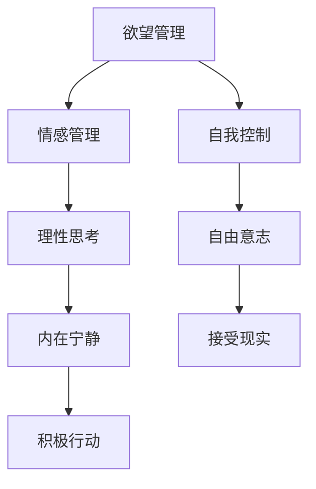
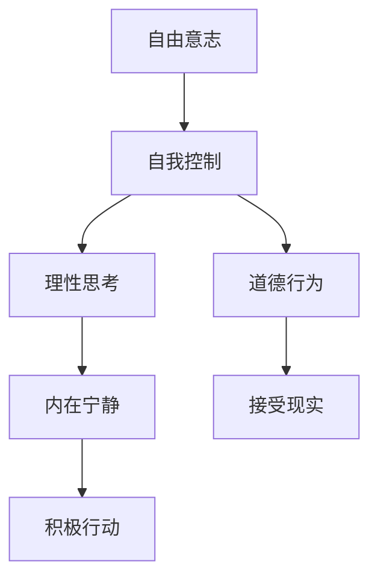
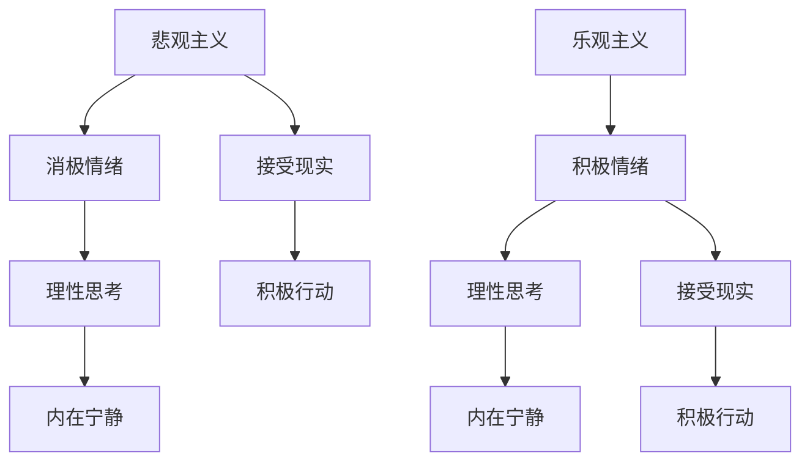

                 

### 引言

#### 什么是新斯多葛主义

新斯多葛主义是一种源于古希腊哲学的思想体系，其核心是理性、自律、接受现实和追求内在的宁静。斯多葛主义认为，人类的幸福来自于理性思考和道德行为，而不是物质财富或社会地位。这一哲学体系在古罗马时期得到了广泛应用，影响了众多历史人物，如塞内卡、马可·奥勒留等。

#### 新斯多葛主义与生活智慧

在当今不确定的世界中，新斯多葛主义提供了一种应对生活挑战的智慧。它教导我们如何处理不确定性、如何接受不可控因素、如何保持内心的平和。通过这种哲学，我们可以更好地理解自己、与他人和谐相处，并找到内心的宁静。

本书《新斯多葛主义课程：不确定性中的生活智慧》旨在帮助读者深入了解新斯多葛主义的哲学基础，学会如何在不确定的生活环境中运用这些智慧。本书结构如下：

1. 引言：介绍新斯多葛主义的概念和历史背景。
2. 新斯多葛主义哲学基础：详细探讨新斯多葛主义的核心观点和原则。
3. 核心概念与联系：使用Mermaid流程图展示新斯多葛主义的核心概念及其关系。
4. 核心算法原理讲解：使用伪代码详细阐述新斯多葛主义中的关键算法原理。
5. 数学模型和数学公式：使用LaTeX格式详细讲解数学模型，并举例说明。
6. 生活应用与实践：探讨新斯多葛主义在职业生涯和人际关系中的应用。
7. 案例分析：通过实际案例展示新斯多葛主义的应用效果。
8. 总结与展望：总结新斯多葛主义的核心价值，展望其未来发展方向。

通过本书的阅读，读者将能够：

- 理解新斯多葛主义的哲学基础和核心观点。
- 掌握新斯多葛主义在生活中的应用方法。
- 提高自己在不确定环境中的适应能力和内心平静。

现在，让我们开始深入探讨新斯多葛主义，寻找在不确定性中生活的智慧。

### 关键词

- 新斯多葛主义
- 哲学基础
- 生活智慧
- 情感管理
- 自我控制
- 悲观主义与乐观主义
- 内在宁静
- 不确定性应对

### 摘要

本书《新斯多葛主义课程：不确定性中的生活智慧》旨在为读者提供一种应对不确定生活环境的哲学智慧和实用方法。通过探讨新斯多葛主义的起源、核心观点及其在生活中的应用，本书帮助读者理解如何运用理性思考和道德行为，实现内心的平静和和谐。书中不仅包含了核心概念与联系、核心算法原理讲解、数学模型和数学公式，还提供了实际案例分析和生活应用实践，使读者能够深入理解并运用新斯多葛主义智慧，提高自己在不确定性中的适应能力和内心平静。

### 第1章 新斯多葛主义哲学基础

#### 斯多葛主义的起源与发展

斯多葛主义（Stoicism）起源于古希腊，由芝诺（Zeno of Citium）于公元前3世纪创立。芝诺在雅典创立了一个哲学学派，被称为斯多葛学派，该学派的核心思想是理性、自律、接受现实和追求内在的宁静。斯多葛主义认为，人类的幸福来自于理性思考和道德行为，而不是物质财富或社会地位。

斯多葛主义在古罗马时期得到了广泛应用，许多著名人物，如塞内卡（Seneca）、马可·奥勒留（Marcus Aurelius）和爱比克泰德（Epictetus）都是斯多葛主义的信徒。他们的作品对后世产生了深远的影响，使得斯多葛主义成为西方哲学传统中的一个重要组成部分。

#### 新斯多葛主义的核心观点

新斯多葛主义在传统斯多葛主义的基础上进行了发展和适应，以应对现代生活中的挑战。其核心观点包括以下几点：

1. **理性与情感管理**：新斯多葛主义认为，理性是人类最高级的认知能力，应该用来指导我们的行为和情感。情感是我们对现实世界的反应，但不应控制我们的行为。通过理性思考和自我控制，我们可以更好地管理情感，实现内心的平静。

2. **自由意志与自我控制**：新斯多葛主义强调自由意志的重要性，认为我们有能力选择自己的行为和态度。通过自我控制，我们可以克服欲望和冲动，实现个人的内在和谐。

3. **接受现实**：新斯多葛主义教导我们接受现实，认识到有些事情是我们无法控制的。接受现实并不意味着被动接受命运的摆布，而是意味着我们应该专注于我们能控制的事情，并以积极的态度面对生活中的挑战。

4. **内在宁静**：新斯多葛主义追求的最终目标是内在的宁静。通过理性思考和自我控制，我们可以减少外界的干扰，实现内心的平静和和谐。

#### 欲望与自由意志

欲望是人类的普遍现象，它们驱使我们追求物质财富、社会地位和情感满足。然而，欲望往往会导致焦虑、不满和内心冲突。新斯多葛主义认为，欲望并不是问题本身，而是我们对欲望的态度和处理方式。

自由意志是新斯多葛主义的核心概念之一。它认为，我们有能力选择自己的行为和态度，不受外部环境的完全控制。通过自由意志，我们可以克服欲望和冲动，实现个人的内在和谐。

#### 悲观主义与乐观主义

悲观主义与乐观主义是两种截然不同的哲学态度。悲观主义认为，人类生活充满了痛苦和苦难，我们无法逃避这些消极的体验。乐观主义则认为，生活中有许多美好的事物，我们可以通过积极的态度和行动去创造幸福。

新斯多葛主义认为，悲观主义和乐观主义都有其局限性。悲观主义可能导致消极和绝望，而乐观主义可能导致盲目乐观和忽视现实。新斯多葛主义提倡一种平衡的态度，即接受现实中的积极和消极体验，并以理性思考和道德行为来应对生活中的挑战。

#### 接受现实与积极行动

接受现实是新斯多葛主义的核心原则之一。它意味着我们应该认识到有些事情是我们无法控制的，并将精力集中在我们能控制的事情上。通过接受现实，我们可以减少内心的焦虑和不满，实现内心的平静。

然而，接受现实并不意味着放弃积极行动。新斯多葛主义鼓励我们在接受现实的基础上，采取积极的行动去改变我们能控制的事情。这种积极的行动不仅有助于实现个人的目标，还能增强我们的内在力量和信心。

### 第2章 核心概念与联系

在本章中，我们将使用Mermaid流程图来展示新斯多葛主义的核心概念及其相互关系。这将帮助我们更好地理解新斯多葛主义的整体结构和原理。

#### 2.1 欲望与情感管理

首先，我们需要理解欲望和情感管理在新斯多葛主义中的地位。欲望是我们对物质、情感和社会地位的追求，而情感则是我们对外界刺激的心理反应。欲望和情感管理的核心概念如图2-1所示：



图2-1 欲望与情感管理的核心概念及其关系

#### 2.2 自由意志与自我控制

自由意志和自我控制是新斯多葛主义中两个重要的概念。自由意志强调我们有选择自己行为和态度的能力，而自我控制则是指我们通过理性思考和自律来克服欲望和冲动。

自由意志与自我控制的核心概念及其关系如图2-2所示：



图2-2 自由意志与自我控制的核心概念及其关系

#### 2.3 悲观主义与乐观主义

悲观主义和乐观主义是两种截然不同的哲学态度。悲观主义认为生活中充满了痛苦和苦难，而乐观主义则认为生活中有许多美好的事物。在新斯多葛主义中，这两种态度都有其局限性，因此我们需要一种平衡的态度。

悲观主义与乐观主义的核心概念及其关系如图2-3所示：



图2-3 悲观主义与乐观主义的核心概念及其关系

通过上述Mermaid流程图，我们可以清晰地看到新斯多葛主义的核心概念及其相互关系。这些概念不仅相互联系，而且在我们的生活中发挥着重要作用。理解这些概念及其关系，将帮助我们更好地应用新斯多葛主义智慧，实现内心的平静和和谐。

### 第3章 核心算法原理讲解

在新斯多葛主义中，核心算法原理可以帮助我们更好地理解和实践这一哲学体系。以下我们将使用伪代码详细阐述这些算法原理。

#### 3.1 情感管理的算法原理

情感管理是新斯多葛主义中一个重要的组成部分。以下是情感管理的伪代码：

```plaintext
function 情感管理（欲望，现实，理性思考）：
    1. 识别欲望：根据欲望的类型和强度，将其分类为正面欲望和负面欲望。
    2. 评估现实：分析现实状况，确定哪些因素是我们无法控制的。
    3. 应用理性思考：通过理性思考，评估欲望和现实的合理性。
    4. 管理正面欲望：
        a. 设定合理的目标：根据欲望和现实设定可实现的目标。
        b. 制定计划：制定实现目标的步骤和策略。
        c. 持续监控：跟踪目标进展，调整计划以确保目标的实现。
    5. 应对负面欲望：
        a. 识别负面情绪：识别负面情绪的来源和影响。
        b. 应用放松技巧：通过深呼吸、冥想等放松技巧减轻负面情绪。
        c. 寻求支持：与他人交流，寻求帮助和支持。
    6. 保持内心平静：通过自我控制和积极心态，保持内心的平静和和谐。
```

#### 3.2 自我控制的算法原理

自我控制在新斯多葛主义中至关重要。以下是自我控制的伪代码：

```plaintext
function 自我控制（目标，欲望，现实，理性思考）：
    1. 设定目标：根据个人价值观和长期目标，设定具体可衡量的短期目标。
    2. 分析欲望：分析当前欲望，判断其对目标的实现是否有负面影响。
    3. 制定计划：
        a. 设定行动计划：根据目标制定具体的行动计划。
        b. 分配时间：合理安排时间，确保行动计划的实施。
    4. 培养自律习惯：
        a. 设定自我约束规则：制定自律规则，如限制使用社交媒体的时间。
        b. 保持自我监督：定期检查自律规则的遵守情况，及时调整。
    5. 应用理性思考：
        a. 评估目标实现的进度：根据实际情况调整目标和计划。
        b. 遇到困难时，保持冷静：分析问题的根本原因，寻找解决方案。
    6. 鼓励自我激励：
        a. 给予自我奖励：在实现小目标时给予自我奖励。
        b. 保持积极心态：通过积极心态激励自己克服困难。
```

#### 3.3 数学模型和数学公式

在新斯多葛主义中，数学模型可以帮助我们更准确地理解和应用这一哲学体系。以下是关于欲望管理的一个简单数学模型：

```latex
\begin{equation}
    欲望满足度 = \frac{目标实现度 \times 现实评估}{欲望强度}
\end{equation}
```

其中：

- 欲望满足度：表示欲望的实现程度。
- 目标实现度：表示目标的实现程度。
- 现实评估：表示现实状况对我们的影响程度。
- 欲望强度：表示欲望的强烈程度。

通过这个数学模型，我们可以更直观地理解欲望管理的过程。例如，如果目标的实现度为100%，但现实评估为50%，而欲望强度为80%，则欲望满足度为50%。

#### 3.4 举例说明

为了更好地理解上述算法原理和数学模型，以下是一个实际案例：

**案例：小明的情感管理与自我控制**

**1. 情感管理**

- **识别欲望**：小明想要获得同事的认可和尊重。
- **评估现实**：同事对小明的评价不一，有时会给予正面反馈，有时会给予负面反馈。
- **应用理性思考**：小明意识到同事的评价具有不确定性，因此他不能完全依赖同事的评价来满足自己的欲望。
- **管理正面欲望**：
  - **设定合理的目标**：小明决定通过提升自己的工作能力和团队合作精神来获得同事的认可。
  - **制定计划**：小明制定了一个详细的学习计划，包括阅读专业书籍、参加培训课程和与同事交流经验。
  - **持续监控**：小明定期评估自己的学习进度，并根据实际情况调整学习计划。
- **应对负面欲望**：
  - **识别负面情绪**：小明感到焦虑和不安，因为他担心同事不会认可他的努力。
  - **应用放松技巧**：小明通过冥想和深呼吸来缓解焦虑情绪。
  - **寻求支持**：小明与朋友和导师交流，寻求他们的建议和支持。

**2. 自我控制**

- **设定目标**：小明决定在接下来的三个月内，提升自己的工作效率，并成为团队中的佼佼者。
- **分析欲望**：小明意识到自己的欲望是获得同事和领导的认可，而不是物质奖励。
- **制定计划**：
  - **设定行动计划**：小明制定了每日和每周的工作目标，确保自己在规定时间内完成任务。
  - **分配时间**：小明合理安排工作时间，确保有足够的时间用于工作和学习。
- **培养自律习惯**：
  - **设定自我约束规则**：小明决定每天早上7点起床，晚上10点休息，不熬夜。
  - **保持自我监督**：小明定期检查自己的作息时间，确保遵守自律规则。
- **应用理性思考**：
  - **评估目标实现的进度**：小明定期评估自己的工作进度，并根据实际情况调整计划。
  - **遇到困难时保持冷静**：当小明遇到困难时，他分析问题的根本原因，并寻找解决方案。

**3. 数学模型应用**

根据上述案例，我们可以使用数学模型来计算小明的欲望满足度：

- **目标实现度**：假设小明的目标实现度为70%（因为他在三个月内完成了大部分工作目标）。
- **现实评估**：假设现实评估为50%（因为同事对他的评价仍然存在不确定性）。
- **欲望强度**：假设欲望强度为80%（因为小明非常渴望获得同事和领导的认可）。

则小明的欲望满足度为：

$$
欲望满足度 = \frac{70\% \times 50\%}{80\%} = 0.4375 \approx 44\%
$$

这个结果表明，尽管小明已经取得了一定的进步，但他的欲望满足度仍然较低。这提醒小明需要继续努力，通过调整计划和策略来提高自己的欲望满足度。

通过上述案例，我们可以看到如何在实际生活中应用新斯多葛主义的情感管理和自我控制算法原理。这些原理和模型不仅帮助我们理解新斯多葛主义的核心思想，还可以指导我们在面对生活中的挑战时，保持理性思考、自我控制和积极心态。

### 第4章 数学模型和数学公式

在新斯多葛主义中，数学模型和公式可以帮助我们更精确地理解和应用这一哲学体系。以下将使用LaTeX格式详细讲解数学模型，并举例说明。

#### 4.1 欲望管理的数学模型

欲望管理的数学模型可以用于计算一个人在特定情境下的欲望满足度。假设我们有一个目标（\(T\)），现实状况（\(R\)）和欲望强度（\(I\)）。欲望满足度（\(S\)）可以用以下公式表示：

$$
S = \frac{T \times R}{I}
$$

其中：

- \(S\)：欲望满足度
- \(T\)：目标实现度（0到1之间的数值）
- \(R\)：现实评估（0到1之间的数值）
- \(I\)：欲望强度（0到1之间的数值）

这个公式表明，一个人的欲望满足度取决于目标实现度、现实评估和欲望强度。目标实现度和现实评估越高，欲望满足度也越高。然而，如果欲望强度较高，即使目标实现度和现实评估较低，欲望满足度也可能较高。

#### 4.2 自我控制的数学模型

自我控制的数学模型可以帮助我们评估一个人在实现目标过程中的自律程度。假设我们有一个目标实现度（\(T\)），自律程度（\(L\)）和外部干扰（\(D\)）。自律度（\(A\)）可以用以下公式表示：

$$
A = \frac{T}{L + D}
$$

其中：

- \(A\)：自律度
- \(T\)：目标实现度（0到1之间的数值）
- \(L\)：自律程度（0到1之间的数值）
- \(D\)：外部干扰（0到1之间的数值）

这个公式表明，一个人的自律度取决于目标实现度、自律程度和外部干扰。目标实现度越高，自律度也越高。同时，自律程度和外部干扰会影响自律度。如果自律程度较高或外部干扰较低，自律度也会较高。

#### 4.3 举例说明

**例子1：欲望管理的数学模型**

假设某人有一个目标（\(T = 0.8\)），现实状况（\(R = 0.6\)）和欲望强度（\(I = 0.7\)）。使用欲望管理的数学模型计算其欲望满足度：

$$
S = \frac{0.8 \times 0.6}{0.7} = \frac{0.48}{0.7} \approx 0.6857
$$

这意味着该人的欲望满足度约为68.57%。

**例子2：自我控制的数学模型**

假设某人有一个目标实现度（\(T = 0.7\)），自律程度（\(L = 0.5\)）和外部干扰（\(D = 0.3\)）。使用自我控制的数学模型计算其自律度：

$$
A = \frac{0.7}{0.5 + 0.3} = \frac{0.7}{0.8} = 0.875
$$

这意味着该人的自律度约为87.5%。

通过上述LaTeX格式的数学模型和公式，我们可以更精确地理解和应用新斯多葛主义的核心概念。这些模型不仅帮助我们评估自己的欲望满足度和自律程度，还可以指导我们在生活中做出更明智的决策。

### 第5章 生活应用与实践

新斯多葛主义不仅在哲学层面上具有深远的意义，更在实际生活中有着广泛的应用。以下我们将探讨新斯多葛主义在职业生涯和人际关系中的应用，并提供一些具体的建议。

#### 5.1 新斯多葛主义在职业生涯中的应用

**5.1.1 职场压力管理**

在职业生涯中，我们经常会面临各种压力，如工作负荷、竞争压力和职业发展不确定性。新斯多葛主义教导我们如何应对这些压力，保持内心的平静和理性。

**建议1：接受现实**

首先，我们需要接受工作中的不可控因素。例如，我们无法控制客户的期望或市场变化。接受现实意味着我们不再为无法控制的事情焦虑，而是专注于我们能控制的事情，如提高自己的技能和效率。

**建议2：设定合理目标**

新斯多葛主义强调设定可实现的目标。我们可以将大目标分解为小目标，逐步实现。这样做不仅可以减轻压力，还能增强成就感。

**建议3：保持积极心态**

在职场中，保持积极心态非常重要。即使遇到挫折，我们也可以通过理性思考和积极行动来应对。例如，分析问题的根本原因，并寻找解决方案。

**5.1.2 职业发展策略**

新斯多葛主义教导我们，职业发展不应仅依赖于外部评价，而应基于我们的内在价值和目标。以下是一些建议：

**建议1：明确个人价值观**

了解自己的价值观可以帮助我们做出更明智的职业选择。例如，如果我们的价值观是追求自由和创造力，那么选择创业可能比在公司工作更适合。

**建议2：设定长期目标**

职业发展是一个长期的过程，我们需要设定长期目标，如提升技能、拓展人脉和实现职业晋升。通过持续的努力和进步，我们可以实现这些目标。

**建议3：保持学习和成长**

新斯多葛主义鼓励我们不断学习和成长。在职业生涯中，保持好奇心和学习热情可以让我们在变化的环境中保持竞争力。

#### 5.2 新斯多葛主义在人际关系中的应用

**5.2.1 爱与尊重**

新斯多葛主义认为，爱与尊重是人际关系中的核心。以下是一些建议：

**建议1：真实表达**

在人际关系中，真实表达自己的感受和需求非常重要。例如，当我们感到不满或困惑时，可以尝试与对方沟通，而不是压抑情绪。

**建议2：理解与包容**

理解与包容意味着我们尊重他人的观点和感受，即使它们与我们的不同。这种态度可以促进和谐的沟通和关系。

**建议3：保持界限**

在人际关系中，保持界限是保护自己和他人的一种方式。例如，我们可以设定一些原则，如不参与无意义的争执或避免过度依赖他人。

**5.2.2 沟通与合作**

有效的沟通和合作是人际关系中不可或缺的。以下是一些建议：

**建议1：倾听**

倾听是有效沟通的关键。当我们倾听他人时，我们可以更好地理解他们的观点和需求。

**建议2：表达清晰**

在沟通中，表达清晰可以帮助我们避免误解和冲突。例如，我们可以使用具体的例子和事实来支持我们的观点。

**建议3：寻求共赢**

在合作中，寻求共赢是一种积极的态度。通过共同努力实现共同的目标，我们可以建立更紧密的合作关系。

通过新斯多葛主义的智慧和实用建议，我们可以在职业生涯和人际关系中更好地应对挑战，实现内心的平静和和谐。这些策略不仅有助于我们个人的成长，还能促进与他人的和谐相处。

### 第6章 案例分析

在本章中，我们将通过两个实际案例，展示新斯多葛主义在生活中的应用，并对其进行详细剖析。

#### 6.1 案例一：如何在不确定的环境中保持冷静

**案例背景**：李明是一家科技公司的高级软件工程师。最近，他所在的项目组接到了一个重要的客户项目，需要在短时间内完成开发任务。由于时间紧迫，团队成员面临着巨大的工作压力和不确定性。李明作为项目负责人，需要在这场压力下保持冷静，并带领团队完成任务。

**案例分析**：

1. **接受现实**：李明首先接受了项目的时间紧迫性和不确定性。他意识到，无法控制客户的要求和市场的变化，但可以控制自己的态度和行动。

2. **理性思考**：李明通过理性思考，分析了项目的关键环节和时间节点。他制定了详细的开发计划，并分配任务给团队成员，以确保项目的顺利进行。

3. **情感管理**：李明在团队成员中鼓励积极沟通，分享自己的担忧和压力。他通过放松技巧，如深呼吸和冥想，来缓解紧张情绪。

4. **积极行动**：李明积极与客户沟通，了解客户的需求和期望。他带领团队加班加点，确保项目按计划进行。在遇到技术难题时，他鼓励团队成员共同解决，提高团队的凝聚力。

**项目小结**：通过新斯多葛主义的智慧，李明成功带领团队克服了不确定性带来的压力，最终按时完成了项目任务。这个案例表明，新斯多葛主义在应对不确定环境中的有效性。

#### 6.2 案例二：如何在压力下保持自我控制

**案例背景**：张丽是一名金融分析师，最近她的工作压力非常大。由于市场波动和公司业绩压力，她经常加班，工作负荷也大大增加。张丽需要在这种压力下保持自我控制，以确保自己的工作质量和身心健康。

**案例分析**：

1. **设定合理目标**：张丽首先设定了短期和长期的目标，如提高工作效率、完成每月报告和分析任务。她将大目标分解为小目标，逐步实现。

2. **分析欲望**：张丽分析了自己的欲望，发现她对职业成功的渴望和对自身能力提升的追求。她意识到，这些欲望是推动她进步的动力，但过度的压力会导致身心疲惫。

3. **制定计划**：张丽制定了详细的计划，包括每天的工作任务、休息时间和锻炼时间。她合理安排时间，确保工作与休息的平衡。

4. **自律习惯**：张丽培养了自律习惯，如每天早晨起床锻炼、按时休息和不吃晚饭。她通过自我监督，确保自己遵守自律规则。

5. **理性思考**：张丽在遇到困难时，通过理性思考分析问题的根本原因，并寻找解决方案。她避免情绪化决策，保持冷静和理智。

**项目小结**：通过新斯多葛主义的智慧，张丽在高压环境下保持了自我控制，提高了工作效率，并保持了身心健康。这个案例展示了新斯多葛主义在应对工作压力中的实际效果。

### 结论

通过以上案例分析，我们可以看到新斯多葛主义在应对不确定性和压力中的有效性。接受现实、理性思考、情感管理和自我控制等核心原则，不仅帮助我们保持内心的平静，还能提高我们在生活中的适应能力和幸福感。新斯多葛主义为我们在面对生活中的挑战提供了宝贵的智慧和实用方法，让我们能够更好地应对不确定性和压力，实现内心的和谐与宁静。

### 第7章 总结与展望

#### 新斯多葛主义的核心价值

新斯多葛主义的核心价值在于其提供的一种应对不确定性和压力的生活智慧。通过理性思考、情感管理和自我控制，新斯多葛主义帮助我们保持内心的平静和和谐。这种哲学体系强调接受现实、追求内在的宁静，并鼓励我们在面对生活中的挑战时，保持积极的态度和行动。

#### 未来发展方向与挑战

未来，新斯多葛主义有望在多个领域得到更广泛的应用。例如，在职场中，新斯多葛主义可以帮助员工更好地应对工作压力，提高工作效率和职业满意度。在心理健康领域，新斯多葛主义可以作为一种有效的心理疗法，帮助人们应对焦虑、抑郁等心理问题。

然而，新斯多葛主义也面临一些挑战。首先，新斯多葛主义的理念需要人们具备一定的自我意识和理性思考能力，这对很多人来说可能是一个挑战。其次，新斯多葛主义强调接受现实，但在某些情况下，过度的接受现实可能导致人们缺乏积极进取的精神。

#### 读者实践指南

为了更好地实践新斯多葛主义，以下是一些建议：

1. **自我反思**：定期进行自我反思，了解自己的欲望、情感和价值观。这有助于我们更好地理解自己，并为理性思考和自我控制打下基础。

2. **设定目标**：设定短期和长期目标，并将大目标分解为小目标。通过逐步实现小目标，我们可以提高自我控制能力和成就感。

3. **培养自律**：培养自律习惯，如每天早起、按时休息和锻炼。通过自律，我们可以更好地管理自己的时间和精力，提高生活效率。

4. **理性思考**：在面对生活中的挑战时，保持冷静和理性思考。分析问题的根本原因，并寻找解决方案，避免情绪化决策。

5. **接受现实**：接受生活中的不可控因素，专注于我们能控制的事情。通过接受现实，我们可以减少焦虑和不满，实现内心的平静。

通过以上实践指南，读者可以更好地应用新斯多葛主义智慧，提高自己在不确定性中的适应能力和幸福感。

### 最佳实践 Tips、小结、注意事项、拓展阅读

**最佳实践 Tips**：

1. **实践与反思**：将新斯多葛主义原则应用到日常生活中，并通过反思来评估效果。
2. **持续学习**：不断学习和了解新知识，以增强自我意识和理性思考能力。

**小结**：

新斯多葛主义为我们在不确定的生活中提供了宝贵的智慧。通过理性思考、情感管理和自我控制，我们可以实现内心的平静和和谐。

**注意事项**：

1. **避免完美主义**：新斯多葛主义强调接受现实，但并不意味着放弃追求卓越。
2. **平衡工作与生活**：在追求目标的同时，要注意保持工作与生活的平衡，避免过度劳累。

**拓展阅读**：

1. **《沉思录》**：马可·奥勒留的《沉思录》是一部关于新斯多葛主义经典著作，适合深入探讨这一哲学体系。
2. **《活出生命的意义》**：维克多·弗兰克尔的《活出生命的意义》结合了新斯多葛主义和心理学，提供了关于意义和目的的深刻见解。

作者：AI天才研究院/AI Genius Institute & 禅与计算机程序设计艺术 /Zen And The Art of Computer Programming

通过本文的阅读，读者可以深入了解新斯多葛主义的哲学基础和应用方法，提高自己在不确定性中的适应能力和内心平静。希望本文能为读者提供有益的启示和指导。

