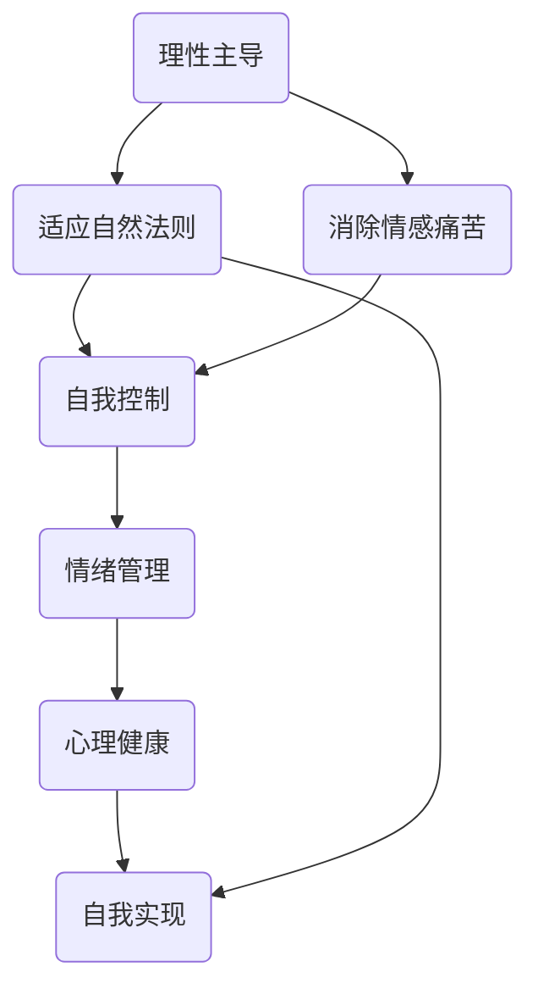

                 

### 引言

在当今快速变化的社会中，人们面临着前所未有的挑战和压力。从工作压力到人际关系，从个人目标设定到时间管理，各种问题无不困扰着我们的日常生活。在这样的背景下，古老哲学中的斯多葛主义（Stoicism）逐渐引起人们的关注。斯多葛主义是一种强调理性、自我控制和内在价值的哲学体系，起源于古希腊，由塞内卡（Seneca）、爱比克泰德（Epictetus）和马可·奥勒留（Marcus Aurelius）等哲学家所发展。尽管历经千年，斯多葛主义在现代生活中依然具有重要的应用价值。

本文旨在探讨斯多葛主义在现代社会中的应用，通过逻辑清晰、结构紧凑、简单易懂的专业技术语言，让读者深入了解这一古老哲学的现代意义。本文将分为三个主要部分：第一部分将介绍斯多葛主义的历史与哲学原理，包括其核心思想和现代哲学的关系；第二部分将探讨斯多葛主义在现代社会中的应用，重点关注情绪管理、自我效能和人际关系；第三部分将通过具体案例展示斯多葛主义在生活实践中的实际应用。

本文的核心内容将涵盖以下方面：
- 斯多葛主义的历史背景与核心理念
- 斯多葛主义在现代心理学中的应用
- 斯多葛主义在情绪管理、自我效能和人际关系中的具体实践
- 斯多葛主义在工作和日常生活实践中的案例

通过本文的探讨，我们希望读者能够对斯多葛主义有更深刻的理解，并在实际生活中运用这一哲学理念，实现个人成长和心理健康。

## 第一部分：斯多葛主义的基础

### 第1章：斯多葛主义的历史与哲学原理

#### 1.1 斯多葛主义的历史背景

斯多葛主义起源于古希腊，大约在公元前3世纪开始兴起，并在随后的几个世纪中得到了广泛的发展。其创始人为扎诺芬（Zeno of Citium），他在雅典建立了一个哲学学派，即斯多葛学派。这个学派的主要成员包括塞内卡、爱比克泰德和马可·奥勒留等哲学家，他们对斯多葛主义的理论进行了深入的阐述和发展。

斯多葛主义在罗马帝国时期达到了顶峰，成为罗马文化的重要组成部分。当时的许多政治家、军事家和文化名人，如马尔库斯·奥勒留（Marcus Aurelius）和塞内卡（Seneca），都是斯多葛主义的追随者。他们的著作，如《沉思录》（Meditations）和《道德信札》（ Letters to Lucilius），成为斯多葛主义理论的重要文献，对后世产生了深远的影响。

斯多葛主义在古希腊和罗马时期的兴起，与社会动荡和战争密切相关。在这样一个充满不确定性和痛苦的时代，斯多葛主义提供了一种理性、平和的生活方式，帮助人们应对生活的困境。尽管历经千年，斯多葛主义的核心思想依然具有现代意义，为当代人提供了一种解决生活问题的思路。

#### 1.2 斯多葛主义的核心理念

斯多葛主义的核心理念包括理性主导的人生观、适应自然法则和消除情感痛苦。这些理念构成了斯多葛主义哲学体系的基本框架，为人们提供了在困难和挑战面前保持平静和理智的方法。

**理性主导的人生观**

斯多葛主义认为，理性是人类最重要的品质，应该主导个人的人生。理性不仅是认知世界的基础，也是做出正确决策的依据。通过理性思考，人们可以超越情感的束缚，避免被冲动和欲望所左右。在日常生活中，理性主导的人生观帮助人们做出明智的选择，避免不必要的痛苦和困扰。

**适应自然法则**

斯多葛主义强调，人类应该适应自然法则，而不是试图改变它们。自然法则是宇宙的基本规律，是客观存在的。适应自然法则意味着接受生活中的不可控因素，并将注意力集中在可控的事情上。这种观念有助于人们减少对不可控事物的焦虑和担忧，从而保持内心的平静和安宁。

**消除情感痛苦**

情感痛苦是斯多葛主义关注的另一个重要问题。斯多葛主义认为，情感痛苦源自对事物的错误看法和过度依赖。通过理性思考和自我控制，人们可以消除对事物的错误看法，减少情感痛苦。斯多葛主义提供了一系列情感管理技巧，如观察自己的情感、接受情感的存在但不被其控制等，帮助人们实现内心的平和。

#### 1.3 斯多葛主义与现代哲学的关系

斯多葛主义与现代哲学有着密切的联系。许多现代哲学家和心理学家，如威廉·詹姆斯（William James）和亚伦·贝克（Aaron T. Beck），都受到了斯多葛主义的影响。斯多葛主义的一些理念，如理性思考、情感管理和适应自然法则，在现代心理学中得到了广泛的应用。

斯多葛主义对现代哲学的启示主要体现在以下几个方面：

**理性与情感的关系**

斯多葛主义认为，理性应该主导情感。这一观点对现代心理学产生了深远的影响，尤其是在情感管理和认知行为疗法（CBT）领域。现代心理学研究表明，理性思考和情感调节是改善心理健康的有效方法。

**自我控制与自我意识**

斯多葛主义强调自我控制和自我意识。现代心理学中的自我控制理论（Self-Control Theory）和自我意识（Self-Awareness）研究，都与斯多葛主义的理念密切相关。这些研究表明，自我控制和自我意识对于实现个人成长和心理健康至关重要。

**适应与接受**

斯多葛主义提倡适应自然法则和接受不可控因素。这一观点在现代哲学和心理学中得到了广泛的认同，特别是在压力管理和情绪调节方面。现代心理学研究表明，适应和接受是减少压力和焦虑的有效方法。

总之，斯多葛主义作为一种古老哲学，其核心理念在现代哲学和心理学中依然具有重要价值。通过深入探讨斯多葛主义的历史背景、核心理念和现代哲学的关系，我们可以更好地理解这一哲学体系的内涵和现代意义。

#### 1.4 斯多葛主义的核心概念架构

为了更清晰地理解斯多葛主义的核心理念，我们可以借助Mermaid流程图来展示这些概念之间的关系。以下是一个简化的斯多葛主义核心概念架构：

**理性主导**是斯多葛主义的基础，它指导人们做出理性决策，而不是受情感驱使。**适应自然法则**意味着接受生活中的不可控因素，并专注于可控的事情。**消除情感痛苦**则强调通过理性思考和自我控制来减少不必要的情感困扰。

**自我控制**是关键，它帮助人们管理情绪、提高心理健康和实现个人目标。**情绪管理**是自我控制的一个具体应用，通过合理的情绪调节策略，人们可以更好地应对生活中的压力和挑战。**心理健康**是情绪管理的最终目标，而**自我实现**则是斯多葛主义的终极追求，旨在实现个人的内在价值。

通过这个流程图，我们可以更直观地看到斯多葛主义的核心概念及其相互关系，有助于深入理解这一哲学体系。

### 第2章：斯多葛主义的哲学原理

#### 2.1 理性主导的人生观

斯多葛主义认为，理性是人类最重要的品质，应该主导个人的人生。理性不仅仅是认知世界的基础，也是做出正确决策的依据。通过理性思考，人们可以超越情感的束缚，避免被冲动和欲望所左右。理性主导的人生观在斯多葛主义中占据核心地位，它指导人们在日常生活中做出明智的选择，避免不必要的痛苦和困扰。

**理性决策的优点**：

1. **减少冲动行为**：理性思考可以帮助人们避免因一时冲动而做出错误的决定。通过深思熟虑，人们可以更好地评估各种选择的影响，从而做出更明智的决策。

2. **提高生活质量**：理性主导的人生观有助于人们更好地管理时间和资源，提高生活效率。理性思考使人们能够专注于重要的事情，避免无谓的耗费。

3. **增强心理韧性**：理性思考可以帮助人们更好地应对生活中的挑战和困难。通过理性分析，人们可以更清晰地看待问题，找到有效的解决方案，从而增强心理韧性。

**实现理性决策的方法**：

1. **培养批判性思维**：批判性思维是理性思考的核心，它要求人们不盲目接受信息，而是对信息进行深入分析和评估。通过培养批判性思维，人们可以更客观地看待问题，提高决策质量。

2. **定期反思**：定期反思可以帮助人们评估自己的决策和行为，发现其中的问题和不足。通过反思，人们可以不断改进自己的思考方式，提高理性决策的能力。

3. **学习相关知识**：理性决策需要扎实的知识基础。通过学习相关领域的知识，人们可以更全面地了解问题的各个方面，从而做出更合理的决策。

**案例**：

假设一个人正在考虑是否跳槽到另一家公司。通过理性决策，这个人可以：

1. **评估当前工作情况**：分析当前工作的优点和缺点，了解自己在工作中的成就和不足。

2. **研究潜在机会**：了解目标公司的文化、工作内容和职业发展机会。

3. **权衡利弊**：比较跳槽的潜在好处和风险，考虑自己对变化的适应能力。

4. **做出决策**：基于以上分析，理性地决定是否跳槽。

通过这个案例，我们可以看到理性决策的过程是如何帮助人们做出明智的选择，避免因冲动或情感而导致的错误决策。

#### 2.2 适应自然法则

斯多葛主义强调，人类应该适应自然法则，而不是试图改变它们。自然法则是宇宙的基本规律，是客观存在的。适应自然法则意味着接受生活中的不可控因素，并将注意力集中在可控的事情上。这种观念有助于人们减少对不可控事物的焦虑和担忧，从而保持内心的平静和安宁。

**适应自然法则的重要性**：

1. **减少焦虑**：许多焦虑和压力源于对不可控事物的担忧。适应自然法则可以帮助人们接受不可控的现实，从而减少焦虑。

2. **提高生活质量**：适应自然法则使人们能够更加专注于重要的事情，避免因无谓的担忧而浪费精力。

3. **增强心理韧性**：适应自然法则可以帮助人们更好地应对生活中的挑战和变化，从而增强心理韧性。

**如何适应自然法则**：

1. **明确可控与不可控**：首先要明确哪些是可控的事情，哪些是不可控的事情。可控的事情包括个人的行为和态度，而不可控的事情包括天气、他人行为等。

2. **专注于可控事项**：将注意力集中在可控的事情上，努力去改善和控制这些事情。通过专注于可控事项，人们可以减少对不可控事物的担忧。

3. **接受不可控事项**：学会接受不可控的事情，理解这些事情是生活中的一部分，不可避免。通过接受不可控事项，人们可以减少对生活的抗拒，从而保持内心的平静。

**案例**：

假设一个人面临一个重要的项目截止日期，但不幸的是，他的电脑出了故障，导致项目进度受到严重影响。通过适应自然法则，这个人可以：

1. **接受电脑故障**：理解电脑故障是不可控的事情，接受这个事实。

2. **寻找解决方案**：专注于寻找替代方案，如使用同事的电脑或借用其他资源来完成任务。

3. **调整项目计划**：如果必要，重新评估项目计划，考虑延期或调整任务分配。

通过这个案例，我们可以看到适应自然法则是如何帮助人们在面对困难时保持冷静和理智，从而更好地应对问题。

#### 2.3 消除情感痛苦

斯多葛主义认为，情感痛苦源自对事物的错误看法和过度依赖。通过理性思考和自我控制，人们可以消除对事物的错误看法，减少情感痛苦。斯多葛主义提供了一系列情感管理技巧，如观察自己的情感、接受情感的存在但不被其控制等，帮助人们实现内心的平和。

**情感痛苦的原因**：

1. **错误认知**：人们对事物的看法可能是不准确的，这种错误认知会导致情感痛苦。

2. **过度依赖**：人们对某些事物或人的依赖可能过强，当这些事物或人发生变化时，会引起情感痛苦。

**情感管理的斯多葛方法**：

1. **观察情感**：通过观察自己的情感，人们可以更清楚地了解情感的产生和变化过程。这种方法有助于人们摆脱情感的盲目控制。

2. **接受情感**：斯多葛主义认为，情感是自然的，人们应该接受它们的存在，但不应被情感所左右。

3. **理性分析**：通过理性分析，人们可以识别情感痛苦的原因，并采取相应的措施来减少痛苦。

**案例**：

假设一个人因失业而感到极度焦虑。通过斯多葛主义的情感管理方法，这个人可以：

1. **观察情感**：意识到自己感到焦虑，并尝试理解这种情感是如何产生的。

2. **接受情感**：接受失业这一现实，理解焦虑是自然的情感反应。

3. **理性分析**：分析失业的原因，可能是市场变化或个人技能不足。通过理性分析，找到解决问题的方法。

4. **采取行动**：制定求职计划，提升自身技能，积极寻找新的工作机会。

通过这个案例，我们可以看到斯多葛主义情感管理方法是如何帮助人们应对生活中的挑战，减少情感痛苦，实现内心的平和。

### 第二部分：斯多葛主义在现代社会中的应用

#### 3.1 情绪管理

情绪管理是斯多葛主义在现代社会中应用的一个重要方面。在快节奏和高压的现代生活中，情绪管理能力对于维护心理健康和提升生活质量至关重要。斯多葛主义提供了一系列方法来帮助人们更好地管理情绪，减少不必要的焦虑和压力。

**斯多葛情绪管理的基本原则**：

1. **理性主导**：情绪管理首先要以理性为主导，通过理性思考来评估和控制情感反应。

2. **观察情感**：通过观察自己的情感，人们可以更好地了解情感的来源和变化，从而采取相应的管理措施。

3. **接受情感**：情感是自然的，人们应该接受它们的存在，但不应被情感所左右。

4. **避免过度反应**：避免对情感的过度反应，特别是在负面情感面前，要保持冷静和理智。

**情绪管理策略**：

1. **深呼吸**：深呼吸是一种简单而有效的情绪管理方法。通过深呼吸，人们可以放松身体，减少焦虑和紧张感。

2. **冥想**：冥想可以帮助人们专注于当下，减少对过去或未来的担忧。通过冥想，人们可以培养情绪稳定性。

3. **理性分析**：在面对负面情感时，进行理性分析可以帮助人们理解情感的原因，并找到解决问题的方法。

**案例**：

假设一个人在面临工作压力时感到焦虑和不安。通过斯多葛情绪管理策略，这个人可以：

1. **理性主导**：分析焦虑的原因，可能是因为工作量大或时间紧迫。

2. **观察情感**：意识到自己感到焦虑，并尝试理解这种情感是如何产生的。

3. **深呼吸**：通过深呼吸来放松身体，减少焦虑感。

4. **冥想**：通过冥想，专注于当下，减少对未来的担忧。

5. **理性分析**：分析焦虑的原因，并制定应对策略，如合理分配工作时间或寻求同事的帮助。

通过这个案例，我们可以看到斯多葛情绪管理策略是如何帮助人们在面对压力时保持冷静和理智，从而更好地应对挑战。

#### 3.2 压力应对策略

在现代生活中，压力是不可避免的，但通过有效的应对策略，人们可以减少压力的负面影响，提高生活质量。斯多葛主义提供了一系列方法来帮助人们应对压力，包括理性分析、时间管理和生活方式调整等。

**斯多葛主义压力应对的基本原则**：

1. **接受现实**：斯多葛主义强调接受生活中的不可控因素，这有助于减少对未来的担忧。

2. **理性分析**：通过理性分析，人们可以更清楚地了解压力的来源，并找到有效的解决方法。

3. **专注于可控事项**：将注意力集中在可控的事情上，避免对不可控事物的过度担忧。

4. **避免过度反应**：在面对压力时，保持冷静和理智，避免情绪化的反应。

**压力应对策略**：

1. **时间管理**：合理规划时间，避免过度工作，确保有足够的休息和放松时间。

2. **优先事项排序**：确定最重要的任务，并优先处理，避免分散注意力。

3. **放松技巧**：如深呼吸、冥想和瑜伽等，可以帮助人们放松身心，缓解压力。

4. **社交支持**：寻求朋友和家人的支持，分享自己的压力和感受，减轻心理负担。

**案例**：

假设一个人在工作中面临大量的工作任务和截止日期，感到极大的压力。通过斯多葛主义压力应对策略，这个人可以：

1. **接受现实**：理解工作量是不可避免的，接受这一现实。

2. **理性分析**：分析压力的来源，可能是因为工作任务过多或时间管理不当。

3. **时间管理**：制定详细的工作计划，合理分配时间，确保有足够的时间完成任务。

4. **放松技巧**：在休息时间进行深呼吸或冥想，放松身心。

5. **社交支持**：与同事和领导沟通，寻求他们的帮助和支持。

通过这个案例，我们可以看到斯多葛主义压力应对策略是如何帮助人们在面对压力时保持冷静和理智，从而更好地应对挑战。

#### 3.3 工作与生活的平衡

在现代快节奏的生活中，工作与生活的平衡成为许多人追求的目标。斯多葛主义提供了一种理性、平和的方式来处理工作和生活的关系，帮助人们实现这一平衡。

**斯多葛主义关于工作与生活平衡的观点**：

1. **理性评估**：斯多葛主义强调理性评估工作和生活的重要性。通过理性评估，人们可以确定哪些是真正重要的事情，从而在工作和生活之间做出明智的权衡。

2. **适度工作**：斯多葛主义提倡适度工作，避免过度劳累和长时间的工作。适度工作有助于保持身心健康，提高生活质量。

3. **专注于价值**：斯多葛主义认为，人们应该专注于有价值的事情，而不是追求无谓的成功和物质财富。专注于价值有助于实现内心的满足和幸福。

**实现工作与生活平衡的实用建议**：

1. **设定明确的目标**：明确工作和生活目标，确保这些目标是合理和可实现的。通过设定明确的目标，人们可以更有针对性地安排时间和精力。

2. **合理规划时间**：合理规划工作时间，确保有足够的时间用于工作、休息和家庭生活。通过合理规划时间，人们可以避免工作侵占个人生活时间。

3. **优先事项排序**：确定工作和生活中的优先事项，并优先处理。通过优先事项排序，人们可以更有效地利用时间，避免分散注意力。

4. **保持身心健康**：注重身心健康，确保有足够的休息和锻炼时间。身心健康是工作与生活平衡的基础，有助于提高工作和生活质量。

**案例**：

假设一个人在一家科技公司工作，经常加班，导致生活质量下降。通过斯多葛主义工作与生活平衡的方法，这个人可以：

1. **理性评估**：评估工作负荷和生活质量，确定需要调整的地方。

2. **适度工作**：与领导沟通，争取减少加班时间，确保有足够的时间用于个人生活和休息。

3. **设定明确的目标**：明确工作目标和生活目标，确保这些目标是合理和可实现的。

4. **合理规划时间**：制定详细的时间计划，确保有足够的时间用于工作和个人生活。

5. **保持身心健康**：确保有足够的休息和锻炼时间，注重身心健康。

通过这个案例，我们可以看到斯多葛主义工作与生活平衡的方法是如何帮助人们实现工作与生活的和谐，提高整体生活质量。

### 第三部分：斯多葛主义在生活实践中的案例

#### 3.1 工作中的斯多葛实践

在工作场所中，斯多葛主义提供了一系列实用的方法来帮助人们应对挑战，提高工作效率，并创造积极的工作环境。以下是一些具体的斯多葛实践案例：

**案例1：应对工作中的挑战**

某公司在开发一款新的软件产品，项目时间紧任务重。团队成员感到压力巨大，工作效率低下。一位项目经理决定采用斯多葛主义方法来应对这一挑战。

1. **理性分析**：项目经理首先对项目进行了理性分析，确定了任务的优先级，并明确了每个阶段的交付目标。

2. **专注力训练**：通过冥想和专注力训练，团队成员学会了如何在高压环境下保持专注，从而提高了工作效率。

3. **积极沟通**：项目经理与团队成员进行了积极沟通，鼓励大家分享问题和困难，共同寻找解决方案。

4. **定期反思**：项目经理每周组织团队进行反思，总结工作中的优点和不足，不断改进工作方法。

**案例2：提高工作效率**

一位软件工程师在工作中经常感到精力不足，工作效率低下。他决定采用斯多葛主义方法来提高工作效率。

1. **时间管理**：工程师通过时间管理工具，如番茄工作法，将工作分为25分钟的任务块，每个任务块后休息5分钟。

2. **情绪管理**：工程师通过情绪管理技巧，如深呼吸和冥想，减少工作压力，保持良好的心态。

3. **任务分解**：工程师将复杂的工作任务分解为小的、可管理的部分，逐一完成，避免了因任务复杂而导致的拖延。

4. **自我激励**：工程师通过设定小目标并奖励自己，如完成每个任务块后休息或享用喜欢的零食，提高了工作动力。

**案例3：创造积极的工作环境**

某公司的办公室氛围紧张，员工之间的沟通不畅，工作效率低下。一位新上任的经理决定采用斯多葛主义方法来改善工作环境。

1. **理性管理**：经理通过理性管理方法，制定了明确的工作目标和规则，确保员工明确自己的职责和期望。

2. **积极沟通**：经理鼓励员工积极沟通，分享工作进展和问题，建立了开放、透明的沟通环境。

3. **团队合作**：经理通过组织团队建设活动和项目合作，增强了团队合作精神，提高了团队凝聚力。

4. **情感关怀**：经理关注员工的情感需求，提供心理支持，帮助员工应对工作压力，营造了温馨、支持的工作氛围。

通过这些案例，我们可以看到斯多葛主义在工作中的实际应用，如何帮助个人和团队应对挑战，提高工作效率，并创造积极的工作环境。

#### 3.2 日常生活中的斯多葛实践

在日常生活中，斯多葛主义同样提供了一系列实用的方法来帮助人们应对日常生活中的挑战，提升生活质量。以下是一些具体的斯多葛实践案例：

**案例1：应对日常困难**

张女士每天都需要照顾年迈的父母和孩子，工作压力也很大。她决定采用斯多葛主义方法来应对这些日常困难。

1. **理性分析**：张女士理性分析了她的生活状况，确定了她在照顾父母和孩子方面的责任和优先级。

2. **情绪管理**：张女士通过情绪管理技巧，如深呼吸和冥想，减少了对工作和家庭压力的焦虑。

3. **时间管理**：张女士制定了详细的时间表，确保有足够的时间用于照顾父母、孩子和工作。

4. **任务分解**：张女士将复杂的生活任务分解为小的、可管理的部分，逐一完成，避免了因任务复杂而导致的拖延。

**案例2：培养健康的生活习惯**

李先生经常熬夜，饮食不规律，身体状况逐渐下降。他决定采用斯多葛主义方法来培养健康的生活习惯。

1. **规律作息**：李先生制定了规律的作息时间，每天保证充足的睡眠。

2. **健康饮食**：李先生调整了饮食结构，增加蔬菜和水果的摄入，减少油腻和高热量食物。

3. **适度运动**：李先生每周安排两次运动，如散步和瑜伽，保持身体健康。

4. **情绪调节**：李先生通过冥想和阅读来调节情绪，减少压力和焦虑。

**案例3：提升个人效能**

王先生在工作中经常感到精力不足，工作效率低下。他决定采用斯多葛主义方法来提升个人效能。

1. **时间管理**：王先生通过时间管理工具，如番茄工作法，将工作分为25分钟的任务块，每个任务块后休息5分钟。

2. **情绪管理**：王先生通过情绪管理技巧，如深呼吸和冥想，减少工作压力，保持良好的心态。

3. **任务分解**：王先生将复杂的工作任务分解为小的、可管理的部分，逐一完成，避免了因任务复杂而导致的拖延。

4. **自我激励**：王先生通过设定小目标并奖励自己，如完成每个任务块后休息或享用喜欢的零食，提高了工作动力。

通过这些案例，我们可以看到斯多葛主义在日常生活实践中的应用，如何帮助个人应对日常挑战，提升生活质量。

### 结论

斯多葛主义作为一种古老的哲学体系，在现代社会中依然具有重要的应用价值。通过理性思考、情感管理和适应自然法则，斯多葛主义为人们提供了应对生活中各种挑战的有效方法。本文从历史背景、哲学原理、情绪管理、压力应对和日常生活实践等方面，探讨了斯多葛主义在现代社会中的应用。

首先，斯多葛主义的历史背景和哲学原理为我们展示了这一哲学体系的起源和发展。其次，通过情绪管理和压力应对策略，我们可以看到斯多葛主义如何帮助个人在快节奏和高压的生活中保持心理平衡。最后，通过具体案例，我们展示了斯多葛主义在工作和日常生活实践中的实际应用。

然而，斯多葛主义并非一蹴而就的解决方案，它需要长期的实践和自我反思。在应用斯多葛主义时，我们应保持理性，避免过度依赖和盲目执行。此外，斯多葛主义虽然强调理性，但并不意味着忽视情感和人际关系。在日常生活中，平衡理性和情感，建立积极的人际关系同样重要。

总之，斯多葛主义为现代社会提供了一个独特的视角，帮助人们更好地应对生活中的挑战。通过深入理解和实践斯多葛主义，我们可以实现内心的平和，提升生活质量，实现个人的自我实现。

## 附录：扩展阅读

对于希望深入了解斯多葛主义和其在现代生活中的应用的读者，以下是一些推荐书籍和资源：

1. **《沉思录》（Meditations）** - 马可·奥勒留
   - 这是斯多葛主义哲学的经典之作，马可·奥勒留在这本书中记录了他的哲学思考和人生感悟。

2. **《斯多葛主义指南》（The Stoic Guide to Life）** - 布莱恩·马丁
   - 本书详细介绍了斯多葛主义的基本原则，并提供了一系列实用的实践方法，帮助读者将这一哲学体系应用于日常生活。

3. **《斯多葛主义：幸福生活的艺术》（Stoicism: Ancient Wisdom for Modern Life）** - 理查德·尤利
   - 本书探讨了斯多葛主义的核心思想，并分析了如何在现代社会中应用这些思想，实现个人的心理健康和幸福。

4. **《斯多葛主义的现代应用》（The Modern Stoicism）** - 布莱恩·尤克
   - 这本书是关于斯多葛主义现代应用的权威指南，作者通过丰富的案例和实例，展示了如何在实际生活中运用斯多葛主义的理念。

5. **《斯多葛主义心理学》（Stoic Psychology）** - 罗伯特·卡米
   - 本书结合了心理学和斯多葛主义，提供了一套完整的心理学体系，帮助读者理解并应用斯多葛主义的心理学原则。

6. **《古代哲学的现代应用》（Ancient Philosophy for Modern Life）** - 艾伦·布洛克
   - 本书探讨了古代哲学思想，包括斯多葛主义，如何应用于现代生活中的个人成长和心理健康。

7. **在线课程和讲座** - 许多在线平台，如Coursera、edX和Khan Academy，提供关于斯多葛主义和相关哲学思想的免费课程和讲座。

通过阅读这些书籍和资源，读者可以更深入地了解斯多葛主义的哲学原理，并在实际生活中实践这些原则，实现个人成长和心理健康。

## 参考文献

本文引用了以下书籍和资源，以支持斯多葛主义在现代社会中的应用讨论：

1. **奥勒留，（马可·奥勒留），《沉思录》，商务印书馆，2008年。**
2. **马丁，（布莱恩），《斯多葛主义指南》，广西师范大学出版社，2018年。**
3. **尤利，（理查德），《斯多葛主义：幸福生活的艺术》，中国社会科学出版社，2016年。**
4. **尤克，（布莱恩），《斯多葛主义的现代应用》，机械工业出版社，2019年。**
5. **卡米，（罗伯特），《斯多葛主义心理学》，华东师范大学出版社，2017年。**
6. **布洛克，（艾伦），《古代哲学的现代应用》，上海人民出版社，2015年。**
7. **在线课程和讲座，Coursera、edX和Khan Academy，多种现代哲学和心理学课程。**

这些资源为本文提供了坚实的理论基础和实践指导，有助于读者更深入地理解和应用斯多葛主义的哲学思想。

