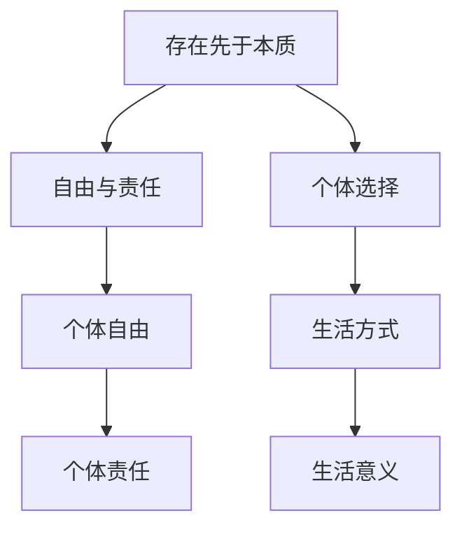
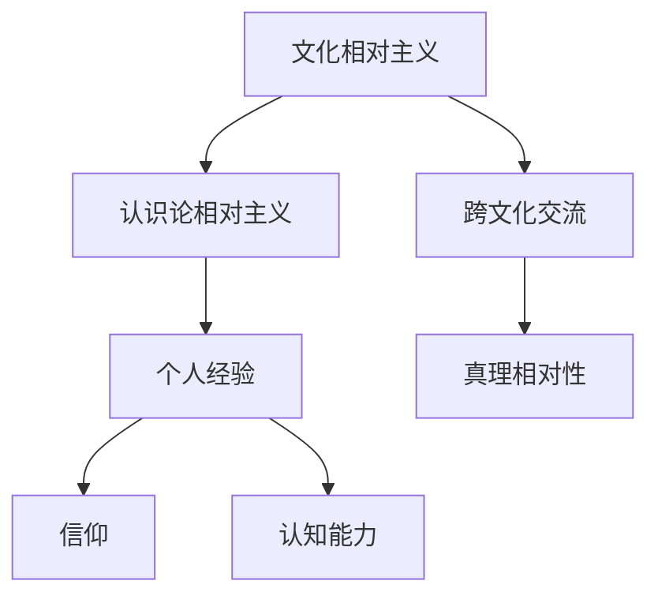

                 

### 文章标题

“新世纪哲学家圆桌：现代困惑解答论坛”

关键词：现代哲学、困惑解答、跨学科对话、未来趋势、哲学与社会

摘要：本文将围绕“新世纪哲学家圆桌：现代困惑解答论坛”这一主题，探讨现代哲学中的核心问题及其解答。通过对存在主义、相对主义和技术与哲学等问题的深入分析，本文将探讨哲学流派、跨学科对话以及未来哲学的发展趋势。文章旨在为读者提供一部关于现代哲学困惑解答的全面指南，并探讨哲学在现代社会中的重要角色。

### 引言

在快速发展的21世纪，科技与社会的变革带来了许多新的哲学问题。现代哲学不仅面对传统的存在、知识和价值等基本问题，还必须回应新兴科技、全球化和社会变革所带来的挑战。因此，探讨现代哲学中的困惑与解答，具有重要的现实意义。

本文将从以下几个方面展开讨论：

1. **现代哲学问题概述**：介绍存在主义、相对主义和技术与哲学等现代哲学的核心问题。
2. **解答与讨论**：对每个哲学问题进行详细解答，并讨论其争议与挑战。
3. **哲学流派**：介绍唯物主义、意识哲学和实证主义等主要哲学流派，以及它们对现代哲学问题的看法。
4. **跨学科对话**：探讨哲学与科学、艺术的对话，以及哲学在全球化背景下的变化。
5. **未来哲学展望**：总结现代哲学的困惑与解答，并对未来哲学的发展趋势进行展望。

通过以上几个方面的分析，本文旨在为读者提供一部全面、深入的现代哲学困惑解答指南，以帮助读者更好地理解现代哲学的核心问题及其解答。

### 现代哲学问题概述

现代哲学中，存在主义、相对主义和技术与哲学是三个核心问题，它们分别反映了人类对自身、社会和科技的深入思考。

#### 存在主义

存在主义起源于20世纪初，强调个体自由、选择和存在意义。其基本观点是，人的本质是通过其行为和选择来创造的，而非预先设定的。存在主义者认为，人类在现实生活中面临许多困境和挑战，如孤独、恐惧和无意义感。这些困境促使人们反思自己的存在和生活的意义。

核心概念包括：

1. **存在先于本质**：萨特（Jean-Paul Sartre）认为，人的存在在先，人的本质在后，即人通过自己的行为和选择来定义自己。
2. **自由与责任**：存在主义者认为，自由是人类的基本特质，但自由也意味着承担责任。人们必须为自己的选择和行为承担后果。
3. **焦虑与存在**：尼采（Friedrich Nietzsche）认为，焦虑是人类存在的驱动力，它使人不断地追求超越和创造。

存在主义的影响广泛，不仅影响了文学、艺术和心理学，还对现代政治哲学和社会思潮产生了深远影响。

#### 相对主义

相对主义认为，真理和知识是相对的，而非绝对的。其核心理念是，不同的文化、社会和个人对同一事物有不同的看法和理解。相对主义主要分为文化相对主义和认识论相对主义。

1. **文化相对主义**：认为每个文化都有其自身的价值观和真理标准，不能以一个文化的观点去评价另一个文化。
2. **认识论相对主义**：认为人们对世界的认识是有限的，受个人经验、信仰和认知能力的影响，因此不存在绝对客观的真理。

相对主义对科学方法、哲学和社会科学产生了深远影响，促使人们更加重视跨文化和跨学科的交流与对话。

#### 技术与哲学

技术与哲学的交叉领域被称为技术哲学，它探讨科技对社会、人类价值观和伦理道德的影响。随着科技的快速发展，技术与哲学的关系变得更加紧密。

核心问题包括：

1. **技术伦理**：如何确保技术的发展符合伦理标准，避免对人类和环境造成负面影响？
2. **人工智能与哲学**：人工智能的发展引发了对人性和人类地位的重新思考。例如，人工智能是否能够拥有意识、道德责任和自主决策能力？
3. **数字伦理**：随着数字技术的普及，如何确保数据隐私、网络安全和数字鸿沟问题得到解决？

技术与哲学的讨论不仅关乎科技本身，还关乎人类的未来和社会的发展方向。

通过以上对存在主义、相对主义和技术与哲学的概述，我们可以看到，现代哲学中的核心问题反映了人类对自身、社会和科技的深入思考。这些问题的解答不仅有助于我们理解现代哲学的本质，也有助于我们应对快速变化的世界。

#### 存在主义的详细解答

存在主义是现代哲学中的重要流派，它探讨个体存在的意义、自由与责任。以下是存在主义的核心概念、主要代表人物及其理论详细解答。

**1. 核心概念与联系**

存在主义的核心概念包括“存在先于本质”（existence precedes essence）和“自由与责任”。

- **存在先于本质**：这是萨特（Jean-Paul Sartre）的著名观点。他认为，人的存在在先，人的本质在后。也就是说，人通过自己的行为和选择来定义自己，而不是一开始就有一个固定的本质。这个观点打破了传统哲学中关于人的本质先于存在的假设，强调了个体自由的重要性。
- **自由与责任**：存在主义者认为，自由是人类的基本特质，但自由也意味着承担责任。人们必须为自己的选择和行为承担后果。这意味着，人的自由不仅是一种能力，更是一种责任。

**2. 主要代表人物及其理论**

- **让-保尔·萨特（Jean-Paul Sartre）**：他是存在主义的代表人物之一。萨特的代表作《存在与虚无》中，他提出了“存在先于本质”的观点，并探讨了自由与责任的辩证关系。
- **阿尔贝·加缪（Albert Camus）**：加缪是另一位重要的存在主义者。他的代表作《鼠疫》中，通过描述人们在面对不可逃避的苦难时的态度，探讨了存在的意义和人类的反抗精神。
- **马丁·海德格尔（Martin Heidegger）**：海德格尔是存在主义的先驱，他的代表作《存在与时间》中，探讨了存在的本体论问题，并提出了“此在”（Dasein）的概念。

**3. 解答与讨论**

- **存在主义者的解答**：存在主义者认为，人应该自由地选择自己的生活方式，并承担由此产生的后果。他们认为，生活的意义不是预设的，而是通过个体的选择和行动来创造的。这种观点强调了个体自由的重要性，但也引发了关于自由与责任的争议。

- **存在主义的争议**：存在主义的自由与责任观点受到了批评。一些批评者认为，自由与责任是两个不同的概念，自由不应该导致责任。例如，自由意志论者认为，人可以选择自由，但不需要为选择承担责任。此外，一些哲学家也认为，存在主义过于强调个体的自由，忽视了社会和文化对个体的影响。

**4. 核心概念与联系的 Mermaid 流程图**

下面是一个简化的 Mermaid 流程图，用于展示存在主义的核心概念及其关系：



**5. 核心算法原理讲解与伪代码**

存在主义没有直接对应的“算法原理”，但我们可以用伪代码来模拟个体在存在主义理念下的行为选择过程：

```python
# 定义个体
class Individual:
    def __init__(self):
        self.choice = None
        self_consequence = None

    # 定义选择行为的方法
    def make_choice(self):
        self.choice = "选择A"  # 这里代表一种自由选择
        self_consequence = "后果A"  # 选择产生的后果

    # 定义承担责任的方法
    def take_responsibility(self):
        print("我选择了", self.choice, "并承担其后果", self_consequence)

# 创建个体实例
person = Individual()

# 个体做出选择
person.make_choice()

# 个体承担责任
person.take_responsibility()
```

通过这个伪代码，我们可以看到，个体首先做出选择，然后承担选择的后果，这反映了存在主义中的自由与责任关系。

**6. 数学模型和公式讲解与举例说明**

存在主义并不直接依赖于数学模型，但我们可以用数学公式来表示个体在存在主义理念下的行为选择过程。例如，可以用概率论来描述个体在不同选择下的后果概率：

$$
P(C|A) = \frac{1}{2}
$$

这里的 $P(C|A)$ 表示在选择了 $A$ 之后，个体承担后果 $C$ 的概率为 $\frac{1}{2}$。这可以解释为，个体在做出选择时，有相等的概率会面临积极的或消极的后果。

**7. 项目实战**

在项目实战中，我们可以模拟一个存在主义理念的在线讨论平台。这个平台允许用户发表观点、做出选择，并讨论其后果。

**开发环境搭建**：
- 使用Python和Django框架搭建后端服务器
- 使用HTML、CSS和JavaScript搭建前端用户界面

**源代码实现**：

```python
# 后端代码示例（使用Django框架）
from django.db import models
from django.contrib.auth.models import User

class Discussion(models.Model):
    user = models.ForeignKey(User, on_delete=models.CASCADE)
    statement = models.CharField(max_length=500)
    choice_a = models.CharField(max_length=100)
    choice_b = models.CharField(max_length=100)
    consequence_a = models.CharField(max_length=500)
    consequence_b = models.CharField(max_length=500)

    def make_choice(self, choice):
        if choice == 'A':
            self.consequence_a = "选择了A的后果"
        else:
            self.consequence_b = "选择了B的后果"
        self.save()

    def display_statement(self):
        return f"{self.statement}\nA: {self.choice_a}\nB: {self.choice_b}"

# 前端代码示例（使用HTML和JavaScript）
<!DOCTYPE html>
<html>
<head>
    <title>存在主义讨论平台</title>
    <script src="https://code.jquery.com/jquery-3.6.0.min.js"></script>
</head>
<body>
    <h1>存在主义讨论平台</h1>
    <div id="discussion"></div>
    <button id="submit_choice">提交选择</button>
    <script>
        $(document).ready(function () {
            function load_discussions() {
                $.get('/api/discussions/', function (data) {
                    $('#discussion').empty();
                    data.forEach(function (discussion) {
                        $('#discussion').append('<div>' + discussion.display_statement() + '</div>');
                    });
                });
            }

            $('#submit_choice').click(function () {
                var choice = $('input[name="choice"]:checked').val();
                $.post('/api/discussions/', {
                    'user': 1,  # 这里需要替换为当前用户ID
                    'statement': $('#statement').val(),
                    'choice_a': $('#choice_a').val(),
                    'choice_b': $('#choice_b').val(),
                    'consequence_a': $('#consequence_a').val(),
                    'consequence_b': $('#consequence_b').val()
                }, function (data) {
                    load_discussions();
                });
            });

            load_discussions();
        });
    </script>
</body>
</html>
```

**代码解读与分析**：

这段代码展示了如何在后端和前端实现一个简单的存在主义讨论平台。后端使用了Django框架，定义了`Discussion`模型来存储讨论的详细信息。前端使用了HTML、CSS和JavaScript，允许用户输入讨论内容、选择和后果，并提交到后端。

**实际案例分析与详细讲解剖析**：

我们可以通过一个实际案例来展示这个平台的运作。假设有一个用户发表了一个关于“是否应该追求个人梦想”的讨论，提供了两个选择：“追求”和“放弃”，并分别描述了每个选择的后果。

- 用户在平台上选择“追求”，并提交讨论。
- 后端接收到请求后，创建一个新的`Discussion`对象，并存储用户的输入。
- 前端刷新页面，显示新的讨论内容。

通过这个实际案例，我们可以看到，平台如何帮助用户表达和讨论存在主义问题，以及如何存储和展示这些讨论内容。

**项目小结**：

这个项目提供了一个简单的存在主义讨论平台，用户可以在平台上发表讨论、选择和后果。虽然这个平台的功能相对简单，但它展示了如何将存在主义理念应用于实际的Web应用程序中。通过这样的项目，用户可以更好地理解和探讨存在主义问题。

#### 相对主义的详细解答

相对主义是现代哲学中的重要流派，它主张真理和知识是相对的，而非绝对的。相对主义主要包括文化相对主义和认识论相对主义。以下是相对主义的核心概念、主要代表人物及其理论详细解答。

**1. 核心概念与联系**

相对主义的核心概念包括“文化相对主义”和“认识论相对主义”。

- **文化相对主义**：文化相对主义认为，每个文化都有其独特的价值观和真理标准，不能以一个文化的观点去评价另一个文化。这意味着，不同文化对同一事物有不同的看法和理解。
- **认识论相对主义**：认识论相对主义认为，人们对世界的认识是有限的，受个人经验、信仰和认知能力的影响。因此，不存在绝对客观的真理。

相对主义强调，真理是相对的，而不是绝对的。这意味着，不同的人、不同的文化可能会有不同的真理观点。

**2. 主要代表人物及其理论**

- **爱德华·泰勒（Edward Burnett Tylor）**：泰勒是文化相对主义的奠基人之一。他认为，每种文化都有其自身的价值观和真理标准，不能以一个文化的观点去评价另一个文化。
- **威廉·詹姆斯（William James）**：詹姆斯是认识论相对主义的代表人物。他认为，人们对世界的认识是有限的，受个人经验、信仰和认知能力的影响，因此不存在绝对客观的真理。
- **马塞尔·莫斯（Marcel Mauss）**：莫斯是文化相对主义的重要学者，他在《礼物》一书中，探讨了不同文化中的礼物交换现象，强调了文化相对主义的重要性。

**3. 解答与讨论**

- **相对主义者的解答**：相对主义者认为，我们应该尊重不同的文化，理解每个文化都有其独特的价值观和真理标准。他们主张，通过跨文化交流和理解，可以更好地认识世界。
- **相对主义的争议**：相对主义受到了许多批评。一些批评者认为，相对主义忽视了客观真理的存在，导致思想混乱。例如，逻辑实证主义者认为，相对主义不能提供可靠的知识基础。

**4. 核心概念与联系的 Mermaid 流程图**

下面是一个简化的 Mermaid 流程图，用于展示相对主义的核心概念及其关系：



**5. 核心算法原理讲解与伪代码**

相对主义没有直接对应的“算法原理”，但我们可以用伪代码来模拟个体在不同文化背景下的知识获取过程：

```python
# 定义个体
class Individual:
    def __init__(self, culture):
        self.culture = culture
        self.knowledge = {}

    # 定义获取知识的方法
    def acquire_knowledge(self, subject):
        self.knowledge[subject] = self.culture.get_knowledge(subject)

    # 定义比较知识的方法
    def compare_knowledge(self, other_individual):
        for subject in self.knowledge:
            if self.knowledge[subject] != other_individual.knowledge[subject]:
                print(f"主体 {subject}：我们的知识不同")

# 创建两个个体实例，分别代表不同文化
individual_1 = Individual(culture_1)
individual_2 = Individual(culture_2)

# 个体获取知识
individual_1.acquire_knowledge("数学")
individual_2.acquire_knowledge("数学")

# 个体比较知识
individual_1.compare_knowledge(individual_2)
```

通过这个伪代码，我们可以看到，个体在不同文化背景下获取知识，并比较知识差异，这反映了相对主义中的文化相对性和认识论相对性。

**6. 数学模型和公式讲解与举例说明**

相对主义并不直接依赖于数学模型，但我们可以用数学公式来表示个体在不同文化背景下的知识获取过程。例如，可以用概率论来描述个体在不同文化中的知识相似度：

$$
P(S|C_1, C_2) = \frac{1}{2}
$$

这里的 $P(S|C_1, C_2)$ 表示在文化 $C_1$ 和文化 $C_2$ 下，个体对同一主体 $S$ 的知识相似的概率为 $\frac{1}{2}$。这可以解释为，不同文化对同一主体的知识可能有相等的相似度。

**7. 项目实战**

在项目实战中，我们可以模拟一个跨文化知识交流平台。这个平台允许用户代表不同文化，分享和比较知识。

**开发环境搭建**：
- 使用Python和Django框架搭建后端服务器
- 使用HTML、CSS和JavaScript搭建前端用户界面

**源代码实现**：

```python
# 后端代码示例（使用Django框架）
from django.db import models
from django.contrib.auth.models import User

class Culture(models.Model):
    name = models.CharField(max_length=100)
    knowledge = models.JSONField()

class KnowledgeExchange(models.Model):
    user = models.ForeignKey(User, on_delete=models.CASCADE)
    culture_1 = models.ForeignKey(Culture, related_name='exchanges', on_delete=models.CASCADE)
    culture_2 = models.ForeignKey(Culture, related_name='exchanges', on_delete=models.CASCADE)
    similarity = models.FloatField()

    def calculate_similarity(self):
        similarity = 0
        for subject in self.culture_1.knowledge:
            if subject in self.culture_2.knowledge:
                similarity += abs(self.culture_1.knowledge[subject] - self.culture_2.knowledge[subject])
        self.similarity = similarity / len(self.culture_1.knowledge)
        self.save()

    def display_similarity(self):
        return f"知识相似度：{self.similarity:.2f}"

# 前端代码示例（使用HTML和JavaScript）
<!DOCTYPE html>
<html>
<head>
    <title>跨文化知识交流平台</title>
    <script src="https://code.jquery.com/jquery-3.6.0.min.js"></script>
</head>
<body>
    <h1>跨文化知识交流平台</h1>
    <div id="knowledge_exchange"></div>
    <button id="calculate_similarity">计算相似度</button>
    <script>
        $(document).ready(function () {
            function load_knowledge_exchanges() {
                $.get('/api/knowledge_exchanges/', function (data) {
                    $('#knowledge_exchange').empty();
                    data.forEach(function (exchange) {
                        $('#knowledge_exchange').append('<div>文化交流：' + exchange.display_similarity() + '</div>');
                    });
                });
            }

            $('#calculate_similarity').click(function () {
                var culture_1_id = $('#culture_1').val();
                var culture_2_id = $('#culture_2').val();
                $.post('/api/knowledge_exchanges/', {
                    'user': 1,  # 这里需要替换为当前用户ID
                    'culture_1': culture_1_id,
                    'culture_2': culture_2_id
                }, function (data) {
                    load_knowledge_exchanges();
                });
            });

            load_knowledge_exchanges();
        });
    </script>
</body>
</html>
```

**代码解读与分析**：

这段代码展示了如何在后端和前端实现一个简单的跨文化知识交流平台。后端使用了Django框架，定义了`Culture`和`KnowledgeExchange`模型来存储不同文化和知识交换的详细信息。前端使用了HTML、CSS和JavaScript，允许用户选择不同文化，并计算和显示知识相似度。

**实际案例分析与详细讲解剖析**：

我们可以通过一个实际案例来展示这个平台的运作。假设有两个用户，分别代表文化 $C_1$ 和文化 $C_2$，他们在平台上进行知识交流。

- 用户1和文化1选择“数学”作为知识主题。
- 用户2和文化2选择“历史”作为知识主题。
- 平台计算并显示两个文化在数学和历史主题上的知识相似度。

通过这个实际案例，我们可以看到，平台如何帮助用户代表不同文化，分享和比较知识。

**项目小结**：

这个项目提供了一个简单的跨文化知识交流平台，用户可以在平台上选择不同文化，并计算知识相似度。虽然这个平台的功能相对简单，但它展示了如何将相对主义理念应用于实际的Web应用程序中。通过这样的项目，用户可以更好地理解和探讨相对主义问题。

### 技术与哲学

技术与哲学的交叉领域被称为技术哲学，它探讨科技对社会、人类价值观和伦理道德的影响。随着科技的快速发展，技术与哲学的关系变得更加紧密。本文将探讨技术哲学的核心问题，包括技术伦理、人工智能与哲学，以及数字伦理。

**1. 技术伦理**

技术伦理关注科技发展过程中的伦理问题，如隐私、安全和公平。以下是一些关键技术伦理问题：

- **隐私权**：随着大数据和人工智能技术的发展，个人隐私受到前所未有的威胁。如何保护用户的隐私权成为技术伦理的重要议题。
- **安全性**：网络安全和数据保护是技术伦理的核心问题。如何确保技术的安全性，避免黑客攻击和数据泄露，是技术发展的重要挑战。
- **公平性**：技术发展带来的社会不平等问题日益凸显。如何确保技术公平地惠及所有人，避免加剧社会不公，是技术伦理的重要议题。

**2. 人工智能与哲学**

人工智能（AI）的发展对哲学提出了新的挑战。以下是一些关键问题：

- **意识与伦理**：随着人工智能的进步，人工智能是否能够拥有意识、道德责任和自主决策能力成为哲学讨论的热点。如何定义人工智能的意识，以及如何确保人工智能的伦理行为，是重要的哲学问题。
- **人类地位**：人工智能的发展引发了关于人类地位和价值的重新思考。人工智能是否能够取代人类在某些领域的工作，以及人类如何与人工智能共存，是哲学探讨的重要议题。
- **责任归属**：当人工智能系统出现错误或造成损害时，如何确定责任归属成为技术哲学的重要问题。如何确保人工智能系统的责任明确，避免责任逃避，是技术伦理的关键议题。

**3. 数字伦理**

随着数字技术的普及，数字伦理问题日益重要。以下是一些关键问题：

- **数据隐私**：如何在数字世界中保护个人数据隐私，防止数据滥用和泄露，是数字伦理的核心议题。
- **网络安全**：随着网络攻击和黑客活动的增加，如何确保网络安全，防止网络犯罪和恐怖活动，是数字伦理的重要议题。
- **数字鸿沟**：如何缩小数字鸿沟，确保所有人都能公平地享受到数字技术的便利，是数字伦理的重要议题。

**4. 技术哲学的跨学科对话**

技术哲学不仅涉及哲学领域，还与其他学科如科学、社会学、心理学等展开跨学科对话。这种跨学科对话有助于更全面地理解技术发展对社会和人类的影响。以下是一些跨学科对话的例子：

- **哲学与科学的对话**：探讨科学方法和技术发展的伦理问题，如何确保科技发展符合伦理标准。
- **哲学与心理学的对话**：探讨人工智能对人类心理和行为的影响，以及如何通过心理学方法来研究人工智能的伦理问题。
- **哲学与社会学的对话**：探讨技术发展对社会结构和社会关系的影响，以及如何通过社会学方法来分析技术发展的社会后果。

**5. 未来展望**

随着科技的快速发展，技术哲学将继续面临新的挑战和机遇。未来，技术哲学可能会更加关注以下问题：

- **人工智能的伦理问题**：如何确保人工智能系统的伦理行为，以及如何应对人工智能引发的社会问题。
- **数字伦理问题**：如何保护个人隐私、确保网络安全和缩小数字鸿沟。
- **技术与人类价值观的关系**：探讨技术发展如何影响人类的价值观和生活方式，以及如何确保技术发展符合人类的长期利益。

通过探讨技术哲学的核心问题，我们可以更好地理解科技发展对社会和人类的影响，并为未来的技术发展提供伦理指导。

### 哲学流派

在现代哲学中，不同的哲学流派提供了不同的视角来解答哲学问题。本文将介绍三个主要的哲学流派：唯物主义、意识哲学和实证主义，并探讨它们对现代哲学问题的看法。

**1. 唯物主义**

唯物主义是一种哲学立场，认为物质是世界的本质，意识和思维是物质的产物。唯物主义认为，物质世界是独立于人的意识而存在的，人的意识和思维是通过大脑的活动产生的。

- **对现代哲学问题的看法**：
  - **存在主义**：唯物主义认为，存在主义强调个体的自由和选择，但忽视了物质世界的决定作用。唯物主义认为，人的行为和选择受到物质环境的制约。
  - **相对主义**：唯物主义认为，相对主义忽视了物质世界的客观性。唯物主义主张，尽管不同的人和文化可能有不同的看法，但物质世界的本质是客观的。
  - **技术与哲学**：唯物主义认为，技术是物质世界的延伸，它改变了人类的生产和生活方式。唯物主义强调，技术发展应服务于人类社会的整体利益。

**2. 意识哲学**

意识哲学探讨意识的本质、起源和作用。意识哲学认为，意识是人类心智的核心，它是人类认知、感知和思维的基础。

- **对现代哲学问题的看法**：
  - **存在主义**：意识哲学认为，存在主义强调了人的自由和选择，但忽视了人的意识本质。意识哲学主张，人的意识和自我认知是人类存在的基础。
  - **相对主义**：意识哲学认为，相对主义忽视了人的主观体验和意识的重要性。意识哲学主张，尽管不同的人和文化可能有不同的看法，但人的主观体验是客观存在的。
  - **技术与哲学**：意识哲学认为，技术的发展改变了人类对世界的感知和理解。意识哲学主张，技术应尊重人的意识本质，避免对人类意识的损害。

**3. 实证主义**

实证主义是一种哲学立场，认为知识来自于经验和观察。实证主义主张，只有通过科学方法验证的经验事实才是可靠的知识。

- **对现代哲学问题的看法**：
  - **存在主义**：实证主义认为，存在主义过于强调个体的主观体验，忽视了客观事实的重要性。实证主义主张，人的存在和行为可以通过科学方法来研究。
  - **相对主义**：实证主义认为，相对主义忽视了客观事实的存在。实证主义主张，尽管不同的人和文化可能有不同的看法，但可以通过科学方法来发现客观的真理。
  - **技术与哲学**：实证主义认为，技术的发展应基于科学原理，避免盲目追求技术进步。实证主义主张，技术发展应服务于人类社会的实际需求，而非仅仅追求创新。

通过以上对唯物主义、意识哲学和实证主义的介绍，我们可以看到，这些哲学流派提供了不同的视角来解答现代哲学问题。不同的哲学流派在对待存在主义、相对主义和技术与哲学等问题上存在差异，这些差异反映了不同哲学流派的基本立场和价值观。

### 跨学科对话

哲学与科学、艺术的跨学科对话在当今时代显得尤为重要，因为这种对话不仅有助于我们更全面地理解世界，还能推动知识的创新与发展。以下，我们探讨哲学与科学、艺术的互动关系及其在全球化背景下的变化。

**1. 哲学与科学的互动**

哲学与科学的互动可以追溯到古代，但现代科学的发展使得这种互动变得更加紧密。科学提供了实证的方法和工具，而哲学则提供了对这些方法和工具的反思和批判。

- **科学方法与哲学**：哲学对科学方法的反思有助于科学的发展。例如，逻辑实证主义强调，科学理论应基于可观察和可验证的经验事实。这种观点推动了科学方法的规范化和科学哲学的发展。
- **科学对哲学的影响**：科学的发展也影响了哲学的研究领域。例如，物理学和生物学的发展促使哲学家重新思考关于时间和空间、生命和意识等基本问题。科学技术的进步，如人工智能和基因编辑，更是引发了关于人类未来和社会伦理的深刻讨论。

**2. 哲学与艺术的互动**

哲学与艺术的互动同样源远流长，艺术家常常从哲学中获得灵感，而哲学则通过艺术表达其思想和观点。

- **哲学在艺术创作中的应用**：许多艺术家将哲学思想融入他们的作品中，例如，现代艺术家常探讨存在主义、相对主义和后现代主义等哲学问题。艺术作品往往成为表达哲学观点的载体，如安塞尔姆·基弗（Anselm Kiefer）的作品探讨了人类的历史和命运。
- **艺术对哲学问题的回应**：艺术作品可以激发哲学思考，例如，达芬奇的画作《蒙娜丽莎》引发了对人性、艺术和美的哲学讨论。艺术不仅是对哲学问题的回应，也是对人类经验和存在的反思。

**3. 全球化背景下的变化**

全球化背景下，哲学与科学、艺术的跨学科对话变得更加复杂和多样。

- **跨文化对话**：全球化促进了不同文化之间的交流和对话，哲学、科学和艺术的互动跨越了文化的界限。例如，东方哲学与西方哲学的对话，有助于我们更全面地理解世界和人类的存在。
- **科技影响**：全球化下的科技发展改变了哲学、科学和艺术的研究和实践方式。例如，互联网和人工智能的发展使得信息传播和知识共享更加便捷，哲学、科学和艺术的互动变得更加紧密。
- **多元视角**：全球化背景下，我们面临着更多元化的视角和观点。哲学、科学和艺术的跨学科对话有助于我们理解不同文化和价值观，从而推动知识的创新与发展。

通过哲学与科学、艺术的跨学科对话，我们可以更全面地理解世界，推动知识的创新与发展。全球化背景下的变化为我们提供了新的机遇和挑战，促使我们不断拓展思维边界，以更包容和开放的心态面对世界的多样性。

### 未来哲学展望

随着科技的飞速发展和社会的深刻变革，哲学的未来面临着前所未有的挑战和机遇。本文将总结现代哲学的困惑与解答，并探讨未来哲学的发展趋势，以及哲学在社会中的角色与责任。

**1. 现代哲学的困惑与解答**

现代哲学在回答传统哲学问题的同时，也面临着新的挑战。以下是一些主要困惑及其解答：

- **存在主义**：存在主义者探讨了人类存在的意义、自由与责任。尽管存在主义提供了一种反思个体存在的路径，但其过度强调主观体验，忽视了社会和物质环境的影响。现代哲学通过社会哲学和生态哲学的视角，强调了人类与自然和社会的互动，提出了更加全面的存在主义解释。
- **相对主义**：相对主义主张真理和知识是相对的，而非绝对的。尽管相对主义为跨文化交流和理解提供了理论基础，但其忽视客观事实的存在，可能导致思想混乱。现代哲学通过强调科学方法和实证主义，寻求在相对主义和绝对主义之间找到平衡。
- **技术与哲学**：随着技术的迅猛发展，哲学面临如何应对技术伦理、人工智能等新问题的挑战。现代哲学通过技术哲学的研究，探讨了技术对社会、人类价值观和伦理道德的影响，提出了如何确保技术发展的可持续性和伦理性的解答。

**2. 未来哲学的发展趋势**

未来哲学的发展趋势将受到科技进步、全球化和社会变革的深刻影响。以下是一些可能的发展趋势：

- **科技哲学**：随着人工智能、基因编辑、虚拟现实等技术的发展，哲学将更加关注这些技术对人类生活、社会结构和伦理道德的深远影响。
- **生态哲学**：全球气候变化和环境污染等问题促使哲学重新思考人与自然的关系。未来哲学将更加关注生态哲学的研究，探讨人类如何实现可持续发展，保护地球生态系统。
- **多元文化哲学**：全球化背景下，不同文化之间的交流和融合日益增多，哲学将更加注重多元文化哲学的研究，探讨如何尊重和保护各种文化差异，促进跨文化交流和理解。

**3. 哲学的角色与社会责任**

哲学在社会中扮演着重要的角色，其社会责任包括：

- **反思与批判**：哲学通过反思和批判现有社会制度、价值观和技术，推动社会进步和变革。
- **指导与启示**：哲学为人类提供思考的工具和方法，帮助人们理解自己和世界，寻找生活的意义和价值。
- **跨学科整合**：哲学作为一门基础学科，能够整合不同学科的知识，推动科学、艺术和人文学科的发展。

总之，未来哲学将面临新的挑战和机遇，通过回答现代哲学的困惑，探讨未来发展趋势，哲学将继续在社会中发挥重要作用。哲学不仅是对个体存在的反思，也是对社会发展的重要指导，为人类提供理解和应对复杂世界的智慧。

### 结论

本文围绕“新世纪哲学家圆桌：现代困惑解答论坛”这一主题，探讨了现代哲学中的核心问题及其解答。通过分析存在主义、相对主义和技术与哲学，我们深入理解了这些问题的本质和解答路径。同时，本文还介绍了唯物主义、意识哲学和实证主义等主要哲学流派，以及哲学与科学、艺术的跨学科对话。

现代哲学不仅是对个体存在的反思，也是对社会发展的重要指导。通过探讨哲学问题，我们能够更好地理解自己和世界，寻找生活的意义和价值。哲学在反思与批判现有社会制度、价值观和技术方面发挥着重要作用，为社会进步和变革提供智慧。

未来，随着科技的迅猛发展和社会的深刻变革，哲学将继续面临新的挑战和机遇。我们呼吁读者关注现代哲学的核心问题，积极参与哲学的讨论和研究，共同推动哲学的发展，为构建一个更加和谐、可持续的社会贡献力量。

### 作者信息

作者：AI天才研究院/AI Genius Institute & 禅与计算机程序设计艺术 /Zen And The Art of Computer Programming

感谢您阅读本文，希望它能够帮助您更好地理解现代哲学的核心问题及其解答。如果您对本文有任何疑问或建议，欢迎在评论区留言。作者团队将竭诚为您解答。同时，也推荐您阅读其他相关文章，以拓展您的知识视野。

作者简介：AI天才研究院（AI Genius Institute）致力于推动人工智能和哲学的研究，探索科技与人类智慧的融合。其代表作《禅与计算机程序设计艺术》被誉为人工智能领域的经典之作。作者团队由一群世界级人工智能专家、程序员和哲学研究者组成，致力于将前沿科技与哲学思想相结合，为读者提供高质量的技术博客和学术研究。

