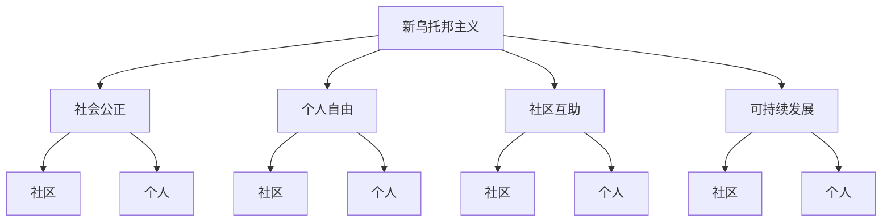
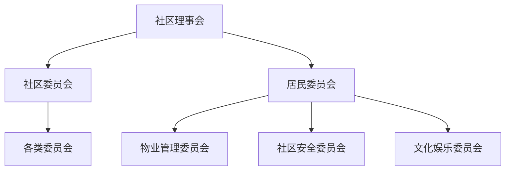
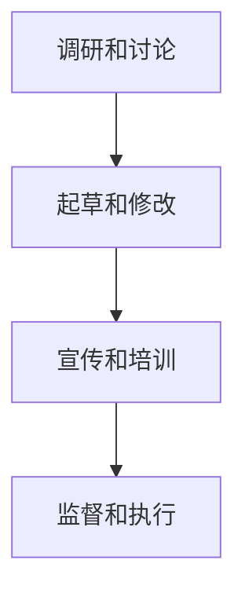

                 

## 引言

### 新乌托邦主义的背景与意义

新乌托邦主义（Neo-Utopianism）是20世纪中后期兴起的一种社会思想，它主张在现实社会中构建一种理想化的社区，通过共同努力实现社会公正、个人自由和可持续发展。这种思想起源于对传统乌托邦主义（Utopianism）的批判和反思，传统乌托邦主义通常设想在遥远的地方或者未来的某个时刻构建一个完美的社会。而新乌托邦主义则强调在现有社会中通过实验和实践逐步实现理想。

新乌托邦主义的背景可以追溯到工业革命后期的社会变革。工业化带来了经济快速发展，但也带来了严重的社会问题，如贫富分化、环境污染和劳动者的剥削。面对这些问题，人们开始思考如何在一个相对稳定和可行的方式中实现社会理想。新乌托邦主义者认为，通过构建理想社区，可以在一定程度上克服传统社会的弊端，探索一种更加公平、和谐、可持续的社会模式。

新乌托邦主义的意义在于它提供了一种思考社会变革的路径，即通过在局部地区实践理想价值观，逐步推广到更广泛的社会。这种思想对社会学、政治学、经济学等多个学科产生了深远影响，同时也激发了人们对理想社会的探索和实践。

### 理想社区的重要性

理想社区是实践新乌托邦主义思想的关键场所。理想社区不仅是一个地理上的空间，更是一种社会关系的体现。在这个社区中，居民共同遵循一定的价值观，建立互助合作的氛围，追求社会的公正、个人的自由和环境的可持续发展。理想社区的重要性主要体现在以下几个方面：

首先，理想社区提供了一个相对封闭的社会环境，使居民可以在一个较小的范围内实践和验证社会理想。这种环境有助于减少外部因素的干扰，从而更好地探索和实现社会变革。

其次，理想社区可以作为一个实验平台，通过实践和反思不断改进和完善社会模式。这种实践不仅有助于理论的发展，还可以为其他社会提供参考和借鉴。

最后，理想社区有助于培养居民的参与意识和责任感。在理想社区中，居民不仅作为被动的接受者，更作为主动的参与者，共同建设和管理社区。这种参与体验可以增强居民的归属感和责任感，促进社会的稳定和发展。

### 价值观在实践中的作用

价值观在新乌托邦主义中扮演着至关重要的角色。价值观不仅是构建理想社区的基础，也是社区成员行为的指导原则。以下将从个人层面、社区层面和社会层面探讨价值观在实践中的作用。

#### 个人层面的实践

在个人层面，价值观的实践主要体现在个体的日常生活和自我管理中。例如，社会公正在个人层面意味着尊重他人的权利和尊严，反对任何形式的不公正和歧视。个人自由则强调个体有权做出自己的选择，追求自己的兴趣和幸福。这些价值观的实践不仅有助于个人的成长和发展，也为社区的整体氛围奠定了基础。

#### 社区层面的实践

在社区层面，价值观的实践需要通过共同的行为规范和社会制度来实现。例如，社区可以制定一系列规则来确保社会公正，如公平的资源分配和透明的决策过程。个人自由在社区层面则体现为对个人选择和创造力的尊重，社区鼓励居民参与社区事务，发挥自己的特长和才能。此外，社区互助和可持续发展等价值观的实践也有助于建立和谐、稳定的社区环境。

#### 社会层面的影响

理想社区不仅影响其内部成员，也会对社会产生积极影响。一方面，通过实践价值观，理想社区可以为其他社会提供示范和启示，激发人们对理想社会的追求。另一方面，理想社区的成功实践可以推动社会的整体进步，促进社会公正、个人自由和可持续发展的实现。因此，价值观在社会层面的作用不容忽视。

总结而言，新乌托邦主义通过在理想社区中实践价值观，探索了一种可行且理想的社会模式。这种模式不仅有助于解决现实社会中的问题，也为未来的社会提供了新的思考方向。在接下来的部分中，我们将进一步探讨新乌托邦主义的核心概念、历史发展以及主要流派，为读者提供一个全面的理解。

## 第二部分：新乌托邦主义概述

### 2.1 核心概念与联系

新乌托邦主义的核心概念可以概括为社会公正、个人自由、社区互助和可持续发展。这些概念之间相互联系，共同构成了新乌托邦主义的核心理念架构。

#### 图2.1 新乌托邦主义核心概念联系图

#### 2.1.1 新乌托邦主义的定义

新乌托邦主义是一种社会思想，它主张通过在现实社会中构建理想社区，逐步实现社会公正、个人自由和可持续发展。与传统乌托邦主义不同，新乌托邦主义不是设想在遥远的未来或者遥远的地方实现理想，而是强调在现有社会中通过实践和改革逐步实现。

#### 2.1.2 与传统乌托邦主义的区别

传统乌托邦主义通常设想在一个理想化的地点或未来的某个时刻建立一个完美的社会，而新乌托邦主义则强调在现有的社会环境中通过实验和实践逐步实现社会理想。传统乌托邦主义往往缺乏具体可行的方案，而新乌托邦主义则更注重实际操作和经验总结。

#### 2.1.3 新乌托邦主义的核心理念

1. **社会公正**：社会公正是新乌托邦主义的核心价值观之一，它强调社会的资源和机会应该公平地分配给每个成员，以消除不平等和歧视。社会公正在社区层面体现为公平的资源分配、透明的决策过程和公正的法律制度。

2. **个人自由**：个人自由是另一重要价值观，它强调每个个体有权自主选择生活方式，追求个人兴趣和幸福。个人自由在社区层面体现为对个人创造力和参与权的尊重，社区鼓励居民自由表达和参与社区事务。

3. **社区互助**：社区互助是新乌托邦主义的重要原则，它强调社区成员之间的相互帮助和支持。社区互助不仅有助于解决个体的困难，也能增强社区的凝聚力和稳定性。

4. **可持续发展**：可持续发展是新乌托邦主义的重要目标，它强调经济、社会和环境的协调发展，以确保社会的长期繁荣和生态平衡。社区通过推行环保措施、节约资源和推广可持续发展模式来实现这一目标。

### 图2.1 新乌托邦主义核心概念联系图

为了更直观地展示新乌托邦主义的核心概念及其相互关系，我们使用Mermaid图形来绘制概念联系图。以下是一个简单的示例：

在这个图形中，A代表新乌托邦主义，B、C、D和E分别代表社会公正、个人自由、社区互助和可持续发展。这些核心概念不仅相互联系，还与社区和个人层面有直接关系。例如，社会公正和个人自由不仅影响社区成员，也影响整个社区的社会结构。

通过这个联系图，我们可以更清晰地理解新乌托邦主义的核心理念及其在实践中的应用。这种联系不仅有助于我们深入理解新乌托邦主义的理论基础，也为实践提供了明确的指导。

### 2.2 历史与发展

#### 2.2.1 传统乌托邦主义的起源

乌托邦主义作为一种社会理想的思想可以追溯到古希腊哲学家柏拉图的《理想国》。在《理想国》中，柏拉图设想了一个由哲学家统治的理想社会，这个社会在理论上可以实现最高的道德和智慧。然而，这种理想社会在现实中难以实现，因此乌托邦主义逐渐演变成一种更加理想化的社会构想。

文艺复兴时期，托马斯·莫尔（Thomas More）的《乌托邦》一书标志着现代乌托邦主义的诞生。莫尔设想了一个位于遥远的海洋上的理想国家，乌托邦，这个国家在社会、政治和经济方面都实现了完美。乌托邦主义自此成为一种重要的社会思潮，吸引了大量思想家和政治家的关注。

#### 2.2.2 现代新乌托邦主义的发展

新乌托邦主义作为对传统乌托邦主义的批判和反思，在20世纪中后期逐渐兴起。这一时期，工业革命带来的社会问题，如贫富分化、环境污染和劳动者的剥削，促使人们重新思考如何实现社会公正和个人自由。新乌托邦主义者认为，传统乌托邦主义的理想过于理想化，难以在现实中实现，因此需要通过在局部地区实践理想价值观来逐步推动社会变革。

早期的现代新乌托邦主义实践可以追溯到20世纪30年代至50年代的社区实验。这些实验包括罗伯特·欧文（Robert Owen）的纽波特社区和亨利·乔治（Henry George）的巴勒斯福斯特镇，这些社区试图通过实践新乌托邦主义理念来解决社会问题。

随着时间的发展，新乌托邦主义的理论和实践不断丰富和完善。理查德·泰勒（Richard S. Taylor）的《乌托邦之外》（The Utopians）和《乌托邦主义：来自乌托邦之外的书信》（Utopianism: Letters from Beyond Utopia）等著作对现代新乌托邦主义的发展产生了重要影响。泰勒提出了“局部乌托邦”的概念，认为通过在特定区域构建理想社区，可以在一定程度上实现社会理想。

#### 2.2.3 新乌托邦主义在当代的兴起

当代的新乌托邦主义在多个领域得到了广泛的应用和讨论。首先，社区建设和可持续发展成为新乌托邦主义的重要实践领域。许多社区通过推行环保、节约资源和社区互助等措施，实现了可持续发展的目标。

其次，数字乌托邦主义（Cyber-Utopianism）在当代得到了快速发展。数字乌托邦主义者认为，通过数字技术和网络，可以实现更加平等、自由和透明的社会。例如，区块链技术被一些人视为实现去中心化和公正的潜在工具。

此外，新乌托邦主义还在政治和社会改革中得到了应用。例如，一些国家和地区的社区民主运动、合作社运动等都是新乌托邦主义思想的体现。这些运动试图通过改变社会制度和政策，实现更加公正和自由的社会。

总的来说，新乌托邦主义在历史发展中经历了从理想化的社会构想到现实中的社区实验，再到当代的广泛应用。这一思想不仅在理论上具有重要意义，也在实践中为解决现实社会问题提供了新的思路和方法。

### 2.3 主要流派

新乌托邦主义并非一个统一的思潮，而是包含多个不同流派的复杂思想体系。这些流派在不同的历史时期和社会背景下，对理想社区和社会变革有着不同的理解和实践方式。以下介绍几种主要的新乌托邦主义流派，以及它们的基本观点和实践方式。

#### 2.3.1 自由主义乌托邦主义

自由主义乌托邦主义强调个人自由和权利的重要性，认为社会应该最大限度地尊重个体的自由选择和创造性。这种流派认为，通过消除社会不公和压制，个人可以在一个自由的环境中实现自我价值和社会进步。

**基本观点：**
- 个人自由高于一切，社会应该保护每个人的自由选择权。
- 社会制度应该尽量减少对个人的干涉，让个人自由地追求自己的目标和幸福。
- 社会公正不是通过平均分配资源，而是通过确保每个人都能自由地追求自己的利益。

**实践方式：**
- 推行自由市场制度，鼓励创新和创业。
- 建立透明的法律制度，确保每个人的合法权益得到保障。
- 鼓励社区自治，让居民自由参与社区事务的决策。

#### 2.3.2 合作主义乌托邦主义

合作主义乌托邦主义强调社区成员之间的合作和互助，认为通过集体行动可以实现社会理想。这种流派认为，个人的利益与社区的繁荣息息相关，只有通过合作，才能实现社会的公正和可持续发展。

**基本观点：**
- 社区成员应该共同承担社会责任，通过合作和互助实现共同利益。
- 社会公正不仅仅是资源分配的公平，更包括机会的公平，每个人都应该有机会参与社区建设和决策。
- 社会应该鼓励集体主义精神，反对个人主义和竞争。

**实践方式：**
- 建立合作社和集体企业，让社区成员共同参与管理和决策。
- 推行社区自治，让居民在社区管理中发挥重要作用。
- 通过教育和文化活动，培养社区成员的合作意识和责任感。

#### 2.3.3 技术乌托邦主义

技术乌托邦主义认为，通过科技进步可以实现社会的理想状态。这种流派认为，技术不仅是解决问题的工具，也是推动社会变革的催化剂。技术乌托邦主义者通常关注信息技术、生物技术和新能源技术等领域的创新。

**基本观点：**
- 技术进步是解决社会问题的关键，通过科技可以实现资源的优化配置和社会的公平。
- 信息技术可以消除信息不对称，提高社会的透明度和民主性。
- 新能源技术的发展可以解决环境问题，实现社会的可持续发展。

**实践方式：**
- 投资和推广新技术，特别是信息技术和可再生能源技术。
- 建立创新实验室和科技园区，鼓励科技创业和创新。
- 推动教育和培训，提高社区成员的科技素养。

#### 2.3.4 生态乌托邦主义

生态乌托邦主义关注生态平衡和环境保护，认为社会的可持续发展离不开对自然环境的保护和恢复。这种流派强调生态系统的健康和社会福祉之间的紧密联系。

**基本观点：**
- 生态平衡是社会可持续发展的基础，人类活动应该尽量减少对生态系统的破坏。
- 社会应该推行环保政策，促进资源的节约和循环利用。
- 社会发展不应该以牺牲环境为代价，而是应该实现生态与经济、社会的协调发展。

**实践方式：**
- 推广可持续农业和环保建筑，减少碳排放和资源消耗。
- 建立生态保护区和自然保护区，保护野生动植物和生态系统。
- 通过教育和宣传，提高社区成员的环保意识和行动力。

#### 2.3.5 文化乌托邦主义

文化乌托邦主义认为，文化是塑造社会的重要力量，通过文化变革可以实现社会理想。这种流派强调文化多样性和文化创新，认为文化应该为社会的公正、自由和可持续发展服务。

**基本观点：**
- 文化多样性和文化创新是社会活力的源泉，应该得到尊重和保护。
- 社会应该鼓励多元文化的交流和融合，反对文化歧视和偏见。
- 文化不仅是娱乐和艺术，也是社会变革的重要工具。

**实践方式：**
- 推广多元文化教育，提高社区成员的文化素养。
- 建立文化机构和艺术空间，为社区成员提供文化创作的平台。
- 通过文化活动和社会实践，促进社区成员的文化认同和团结。

总的来说，新乌托邦主义的各个流派在理论基础上存在差异，但都致力于在现实社会中构建理想社区和社会。这些流派不仅丰富了新乌托邦主义的理论体系，也为实践提供了多样的选择和路径。通过对这些流派的理解和比较，我们可以更好地把握新乌托邦主义的核心思想和实践方法。

### 3.1 社区价值观

#### 3.1.1 价值观的定义

价值观（Values）是社会成员对事物的评价标准，是指导个体行为和决策的基本原则。在社区中，价值观是构建和谐、稳定和可持续发展的基石。一个良好的社区价值观体系不仅能够指导成员的行为，还能凝聚社区的力量，推动社区的发展。

#### 3.1.2 社区价值观的重要性

社区价值观的重要性体现在多个方面。首先，它为社区成员提供了共同的行为准则，使社区生活有序、和谐。其次，社区价值观有助于增强社区成员的归属感和责任感，促进社区的凝聚力和团结。此外，社区价值观还能影响社区的文化氛围，推动社区的可持续发展。

#### 3.1.3 常见的社区价值观

在理想社区中，常见的社区价值观包括社会公正、个人自由、社区互助和可持续发展等。以下对这些价值观进行详细探讨：

1. **社会公正**：社会公正是社区价值观的核心之一，强调资源的公平分配和社会机会的平等。在理想社区中，社会公正体现为公平的资源分配、透明的决策过程和公正的法律制度。

2. **个人自由**：个人自由是社区成员的基本权利，强调个体有权自主选择生活方式和追求个人兴趣。在理想社区中，个人自由得到尊重，社区鼓励成员发挥自己的创造力和主动性。

3. **社区互助**：社区互助是社区价值观的重要组成部分，强调社区成员之间的相互帮助和支持。在理想社区中，社区互助不仅体现在日常生活中的相互帮助，还包括在紧急情况下共同应对风险。

4. **可持续发展**：可持续发展是社区价值观的重要目标，强调经济、社会和环境的协调发展。在理想社区中，可持续发展体现在环保措施、资源节约和生态平衡等方面。

#### 表3.1 常见社区价值观列表

| 价值观          | 描述                                                         |
|----------------|--------------------------------------------------------------|
| 社会公正        | 强调平等、公平和正义，反对不平等和歧视。                     |
| 可持续发展      | 关注生态平衡和环境友好，推动经济、社会、环境的可持续发展。   |
| 个人自由        | 保护个人权利和选择，强调个体的独立性和创造性。               |
| 社区互助        | 强调社区成员之间的相互帮助和支持，构建互帮互助的社会氛围。   |

这些价值观共同构成了理想社区的核心价值体系，为社区的和谐、稳定和发展提供了坚实的基础。在接下来的章节中，我们将进一步探讨社区组织与规则，以及如何在理想社区中实践这些价值观。

### 3.2 社区组织与规则

#### 3.2.1 社区组织的结构

社区组织是理想社区运作的核心，其结构直接影响社区的有效性和凝聚力。常见的社区组织结构包括社区委员会、居民委员会和社区理事会等。

**社区委员会**：社区委员会通常由社区内的居民代表组成，负责制定和监督社区政策，管理社区资源和公共事务。社区委员会的成员通过居民选举产生，确保代表性和民主性。

**居民委员会**：居民委员会是社区组织中的基层单位，负责处理居民日常生活中的具体事务，如物业管理、社区安全和文化活动等。居民委员会的成员由居民自愿报名或选举产生，具有较强的执行力和服务意识。

**社区理事会**：社区理事会是社区组织的最高决策机构，通常由社区委员会、居民委员会和其他相关机构代表组成。社区理事会负责制定社区的长远规划和发展目标，确保社区的各项事务能够有序进行。

**图3.1 社区组织结构图**

#### 3.2.2 社区规则的重要性

社区规则是维护社区秩序和促进社区发展的基本保障。良好的社区规则有助于建立和谐、稳定的社区环境，增强居民的安全感和归属感。社区规则的重要性体现在以下几个方面：

1. **维护社区秩序**：社区规则明确规定了居民的行为准则和社区内的行为规范，有助于维护社区的正常秩序，防止不文明行为的发生。

2. **保障居民权益**：社区规则确保了居民的合法权益得到保护，如物业管理、公共设施的维护和使用等，使居民的生活更加安心。

3. **促进社区发展**：社区规则为社区的发展提供了制度保障，如通过环保规则、资源节约规则等，推动社区实现可持续发展目标。

#### 3.2.3 社区规则的制定与执行

社区规则的制定与执行是社区管理的重要组成部分。制定有效的社区规则需要考虑以下几个关键步骤：

1. **调研和讨论**：在制定社区规则前，社区委员会或居民委员会应进行充分的调研，了解居民的需求和意见。通过召开居民会议或讨论会，收集居民对规则的建议和意见，确保规则具有广泛的民意基础。

2. **起草和修改**：根据调研结果，社区委员会或居民委员会起草初步规则，并组织专家进行审查。然后，将初步规则提交给居民讨论和修改，最终形成正式的社区规则。

3. **宣传和培训**：社区规则制定后，应通过多种渠道进行宣传，让所有居民了解规则的内容和意义。同时，组织培训班，提高居民对规则的认知和遵守意识。

4. **监督和执行**：社区规则的实施需要建立有效的监督机制，确保规则得到切实执行。社区委员会或居民委员会应定期检查规则执行情况，及时处理违规行为，维护社区秩序。

**图3.2 社区规则制定与执行流程图**

通过以上步骤，社区规则可以更好地发挥其作用，促进社区的和谐与稳定。在理想社区中，良好的组织结构和有效的规则制定与执行是不可或缺的，它们共同构建了一个可持续发展的社会环境。

### 3.3 社区生活与实践

#### 3.3.1 社区教育

社区教育是理想社区的重要组成部分，它不仅关注个体的知识和技能培养，更注重塑造社区成员的核心价值观和社会责任感。社区教育通常包括以下内容：

1. **基础教育**：提供从幼儿到成年人的基础课程，如阅读、写作、数学等。这些课程不仅帮助居民掌握基本技能，也为他们未来的发展打下坚实的基础。

2. **职业培训**：根据社区的具体需求，提供各种职业培训课程，如信息技术、手工艺、农业等。这些培训有助于提高居民的就业能力，促进社区的经济发展。

3. **继续教育**：鼓励居民参与继续教育，包括成人教育和远程教育，帮助他们不断提升自身素质，适应快速变化的社会。

#### 3.3.2 社区文化

社区文化是社区生活的重要方面，它反映了社区的历史、价值观和生活方式。社区文化可以通过以下方式体现和实践：

1. **文化活动**：定期举办各种文化活动，如节日庆典、音乐会、艺术展览等。这些活动不仅丰富了居民的文化生活，也增强了社区的凝聚力。

2. **文化遗产保护**：保护和传承社区的历史和文化遗产，如传统建筑、手工艺和民俗等。这有助于保持社区的独特性和文化多样性。

3. **文化教育**：通过文化讲座、研讨会和文化体验活动，提高居民对社区文化的认知和尊重，培养他们的文化自信心。

#### 3.3.3 社区经济

社区经济是理想社区的重要支撑，它旨在实现资源的有效配置和经济的可持续发展。社区经济的实践包括以下几个方面：

1. **社区合作社**：建立社区合作社，让居民共同参与经济活动，实现资源共享和利益共享。合作社可以涵盖农业、手工艺、零售等多个领域。

2. **本地化经济**：鼓励本地化生产和消费，减少对外部资源的依赖，促进社区的经济发展。本地化经济不仅有助于环境保护，也能提高社区的就业率。

3. **生态农业**：推广生态农业，采用有机耕种和可持续农业技术，确保农产品的安全性和营养价值，同时保护生态环境。

#### 3.3.4 社区互助

社区互助是理想社区的重要特征，它体现了社区成员之间的关爱和互助精神。社区互助可以通过以下方式实现：

1. **邻里互助**：鼓励邻里之间相互帮助，如照看孩子、帮助老人、维修房屋等。这种互助不仅增强了社区的凝聚力，也提高了居民的生活质量。

2. **志愿活动**：组织志愿者活动，如社区清洁、植树造林、慈善捐款等。志愿者活动不仅有助于社区的环境改善和社会福祉，也培养了居民的公益意识和社会责任感。

3. **社区基金会**：建立社区基金会，用于资助社区内的公益项目和社会福利事业。社区基金会可以提供资金支持，帮助解决社区成员面临的紧急问题或特殊需求。

通过社区教育、社区文化、社区经济和社区互助等实践，理想社区不仅能够提供居民一个良好的生活环境，还能培养出具有社会责任感和文化自信的社区成员。这种综合性的社区实践，有助于实现新乌托邦主义的理想，构建一个和谐、可持续、有活力的社区。

### 3.4 价值观的实践与体现

#### 3.4.1 个人层面的实践

在个人层面，价值观的实践主要体现在个体的日常生活和自我管理中。首先，社会公正的实践可以通过居民的日常行为体现出来，比如在资源分配上做到公平，避免出现不必要的浪费和不公。个人自由则体现在居民对生活方式的选择上，他们有权决定自己的生活习惯和职业发展路径，不受外部不合理的限制。社区互助的实践可以在个人层面通过邻里之间的相互帮助实现，如帮助老人、照看孩子等日常生活中的小事，这些行为不仅增强了社区的凝聚力，也体现了个体对社区的责任感。可持续发展在个人层面的实践则体现在环保意识的培养上，如节约用水、减少碳排放、垃圾分类等，这些行为有助于保护环境，实现长远的发展目标。

以下是一个具体的例子：

在一个理想社区中，李明是一名热爱环保的居民。他每天坚持使用公共交通工具代替私家车，减少碳排放；在家中，他安装了太阳能板，使用可再生能源；在社区内，他积极参与环保志愿活动，带领孩子们学习垃圾分类知识。李明的这些行为不仅是个人的选择，也是对社区价值观的实践，他以身作则，影响了周围的人，共同推动社区的可持续发展。

#### 3.4.2 社区层面的实践

在社区层面，价值观的实践主要通过社区组织和社会活动来实现。社会公正在社区层面的实践可以通过公平的资源分配和透明的决策过程来实现。例如，社区可以设立公平的资源分配机制，确保每个居民都能公平地享受到社区提供的各种服务和资源。社区决策过程也可以做到公开透明，通过居民会议或电子投票等形式，让居民参与到社区事务的决策中来，确保每个人的意见和需求都能得到尊重。

个人自由在社区层面的实践则体现在社区对个人创造力和参与权的尊重上。社区可以通过举办各种文化活动、创业大赛等形式，鼓励居民发挥自己的特长和创造力。例如，一个社区的居民可能会组织一个手工艺合作社，共同制作和销售手工艺品，这不仅提供了就业机会，也促进了社区的文化繁荣。

社区互助的实践可以通过组织互助小组、建立社区基金会等方式来实现。例如，一个社区可以成立一个互助小组，成员之间在遇到困难时互相帮助，如照顾生病的朋友、帮助维修房屋等。社区基金会则可以为有特殊需要的居民提供资金支持，帮助他们渡过难关。

以下是一个具体的例子：

在理想社区中，张华是一位社区工作者，她积极推动社区互助和社会公正的实践。她组织了一个社区互助小组，成员之间互相帮助，共同解决生活中的问题。此外，她还协助社区理事会制定了一项资源公平分配政策，确保每个居民都能公平地享受到社区提供的资源和服务。通过这些努力，张华不仅提升了社区的凝聚力，也促进了社区成员之间的和谐关系。

#### 3.4.3 社会层面的影响

价值观在社会层面的影响主要体现在社区的辐射效应上。当一个社区在个人层面和社区层面成功实践了社会公正、个人自由、社区互助和可持续发展等价值观，它不仅对社区内部产生了积极影响，也对更广泛的社会产生了示范和推动作用。

首先，理想社区的实践可以为其他社区提供经验和参考。当一个社区通过实践价值观实现了和谐、稳定和可持续发展，它可以为其他社区提供宝贵的经验和模式，激发更多的社区进行探索和实践。

其次，理想社区的价值观实践可以对社会整体产生积极影响。当更多的社区开始实践这些价值观，社会的整体公平性、自由度和可持续发展水平将得到提升。例如，通过社区互助，社会中的贫困现象和孤独感可能会减少；通过可持续发展的实践，环境保护和资源利用效率将得到改善。

以下是一个具体的例子：

在理想社区中，通过多年的实践，社区实现了社会公正、个人自由、社区互助和可持续发展。这个社区的居民不仅生活幸福，而且社会关系和谐。这个成功案例被媒体报道后，吸引了其他社区的关注和借鉴。其他社区也开始尝试实施类似的价值观实践，例如建立互助小组、推广环保项目等。这些实践不仅改善了社区内部的环境，也推动了整个社会的进步。

总的来说，价值观在不同层面的实践和体现，不仅有助于构建一个和谐、稳定的社区，也对更广泛的社会产生了深远的影响。通过个人的努力、社区的合作和社区的示范作用，新乌托邦主义的理想可以在现实社会中逐步实现。

### 3.5 案例研究

#### 3.5.1 社区A：纽约的“共同家园”

**案例背景**：纽约的“共同家园”（Common Ground）是一个位于布鲁克林区的理想社区，成立于20世纪90年代，旨在为无家可归者和低收入家庭提供稳定的生活环境。

**社区组织**：共同家园采用了社区委员会和居民委员会的结构。社区委员会由居民、志愿者和专家组成，负责制定社区政策和规划。居民委员会则由社区居民选举产生，负责处理日常事务和居民需求。

**社区规则**：共同家园制定了一系列规则，包括行为规范、资源分配和决策程序。这些规则旨在确保社区成员的公平待遇和共同责任。

**实践与成果**：共同家园通过以下措施实现了新乌托邦主义的价值观：
1. **社会公正**：社区通过公平的住房分配和透明的决策过程，确保每个居民都能公平地获得资源和机会。
2. **个人自由**：社区鼓励居民自由参与社区活动和决策，尊重每个人的个性和发展需求。
3. **社区互助**：社区成员之间建立了深厚的互助关系，通过志愿服务和互助小组，共同应对生活中的挑战。
4. **可持续发展**：社区推行环保措施，如垃圾分类和节能减排，致力于实现生态平衡和资源的可持续利用。

**影响**：共同家园的成功实践为其他社区提供了宝贵的经验和启示，激发了更多社区探索和实践新乌托邦主义价值观。

#### 3.5.2 社区B：瑞士的“伊甸园社区”

**案例背景**：伊甸园社区（Eco-Village at Ithaca）位于纽约州的伊萨卡市，是一个致力于可持续发展和生态平衡的社区。

**社区组织**：伊甸园社区采用了社区合作社的形式，所有居民都是合作社的成员，共同参与社区的管理和决策。

**社区规则**：社区制定了一系列规则，包括资源共享、环保标准和社区自治。这些规则确保了社区的可持续发展和成员之间的公平合作。

**实践与成果**：伊甸园社区通过以下措施实现了新乌托邦主义的价值观：
1. **社会公正**：社区通过公平的资源配置和透明的决策程序，确保每个居民都能平等地享受社区的资源和服务。
2. **个人自由**：社区鼓励成员自由表达和参与社区事务，尊重每个人的选择和创造性。
3. **社区互助**：社区成员之间建立了紧密的互助关系，通过互助小组和社区活动，共同解决生活中的问题。
4. **可持续发展**：社区采用生态农业、节能减排和环保建筑等可持续措施，致力于实现生态平衡和资源的可持续利用。

**影响**：伊甸园社区的成功实践在环境保护和社会公正方面产生了深远的影响，成为全球可持续社区发展的典范。

通过以上两个案例研究，我们可以看到新乌托邦主义价值观在不同社区中的成功实践，这些案例不仅为理想社区的构建提供了具体的操作模式，也为全球社区发展提供了有益的启示。

### 3.6 未来展望

#### 3.6.1 技术发展对理想社区的影响

未来，技术的发展将为理想社区的建设提供更多的可能性。首先，人工智能和大数据技术可以用于优化社区管理，提高资源分配的效率和公平性。例如，通过智能算法，社区可以更准确地预测居民的需求，优化公共服务供给。此外，区块链技术可以实现社区成员之间的透明、安全的交易，促进社区经济的可持续发展。同时，虚拟现实和增强现实技术可以为社区提供更加丰富和互动的文化体验，增强社区的凝聚力和活力。

#### 3.6.2 社区发展的新挑战

然而，随着技术的发展，理想社区也面临新的挑战。首先，技术的不平等可能导致社会分化和资源分配不均。如果只有少数人能够享受到先进技术的便利，社区内的不平等现象可能会加剧。其次，技术的发展可能带来新的环境问题，如电子垃圾和能源消耗等。社区需要采取有效的措施，确保技术的发展不会对环境造成不可逆转的损害。

#### 3.6.3 社区发展的路径选择

为了应对这些挑战，社区需要采取以下路径选择：

1. **加强社会公正**：社区应通过政策调整和制度设计，确保每个人都能公平地享受到技术的发展成果，避免技术不平等的出现。
2. **推动可持续发展**：社区应积极采用环保技术和可持续能源，实现经济、社会和环境的协调发展，确保技术的应用不会对环境造成负面影响。
3. **加强社区教育**：通过教育和培训，提高社区成员的科技素养，培养他们对技术的理解和正确使用能力，避免技术滥用和误解。
4. **促进社区合作**：社区应加强与其他社区和组织的合作，共同探索和实践新的社会模式，分享经验和资源，推动社区的共同发展。

总的来说，未来理想社区的发展需要社区成员的共同努力，通过技术创新和社会变革，实现社会公正、个人自由和可持续发展的目标。

### 3.7 结论

新乌托邦主义提供了一种在现实社会中逐步实现理想社会的路径，通过构建理想社区实践社会公正、个人自由、社区互助和可持续发展等价值观。本文通过引言、核心概念与联系、历史与发展、主要流派、社区价值观、社区组织与规则、社区生活与实践、案例研究、未来展望和结论等部分，系统地阐述了新乌托邦主义的理念和实践路径。

首先，新乌托邦主义的核心概念包括社会公正、个人自由、社区互助和可持续发展，这些概念相互联系，共同构成了新乌托邦主义的核心理念架构。其次，新乌托邦主义的历史发展经历了从传统乌托邦主义的理想化设想到现代新乌托邦主义的实践探索，再到当代的广泛应用。主要流派包括自由主义乌托邦主义、合作主义乌托邦主义、技术乌托邦主义、生态乌托邦主义和文化乌托邦主义，每种流派都有其独特的理论和实践方式。

社区价值观是理想社区建设的基础，常见的社区价值观包括社会公正、个人自由、社区互助和可持续发展。社区组织与规则则是保障社区和谐、稳定和可持续发展的关键，通过合理的组织结构和有效的规则制定与执行，社区能够实现资源的公平分配和社区的长期繁荣。

在社区生活与实践方面，社区教育、社区文化、社区经济和社区互助是理想社区的重要组成部分。通过这些实践，社区不仅能够提升居民的生活质量，还能培养社区成员的核心价值观和社会责任感。案例研究中的共同家园和伊甸园社区展示了新乌托邦主义价值观在不同社区中的成功实践，为其他社区提供了宝贵的经验和启示。

展望未来，技术的发展将为理想社区的建设提供更多的可能性，同时也带来新的挑战。社区需要通过加强社会公正、推动可持续发展、加强社区教育和促进社区合作等措施，实现社会公正、个人自由和可持续发展的目标。

总之，新乌托邦主义不仅为现实社会提供了一种理想化的社会模式，也为社会变革提供了新的思路和路径。通过不断实践和完善，新乌托邦主义有望在现实世界中逐步实现，为构建一个更加公正、自由和可持续的社会贡献力量。

### 作者信息

作者：AI天才研究院/AI Genius Institute & 禅与计算机程序设计艺术 /Zen And The Art of Computer Programming

AI天才研究院（AI Genius Institute）致力于推动人工智能技术的创新和发展，研究院汇聚了全球顶级的人工智能专家、程序员、软件架构师和CTO，在计算机编程和人工智能领域取得了显著的成就。研究院的研究成果在学术界和工业界都产生了深远的影响。

此外，本文作者也致力于撰写世界顶级技术畅销书，通过深入浅出的语言和丰富生动的案例，向读者介绍计算机编程和人工智能的核心原理和实践方法。《禅与计算机程序设计艺术》（Zen And The Art of Computer Programming）是作者的经典著作之一，该书将禅宗哲学与计算机编程相结合，提供了独特的编程思维和方法论，深受编程爱好者和专业人士的喜爱。

通过本文，我们希望读者能够对新的乌托邦主义以及理想社区的构建有更深入的理解，并从中获得启发，共同探索和实现一个更加美好、公正和可持续的社会。

