                 

### 《新人文主义教育改革：科技时代的人文关怀》

---

#### **关键词：** 教育改革、新人文主义、科技时代、人文关怀、教育模式

#### **摘要：** 在科技迅猛发展的时代，教育改革显得尤为重要。本文探讨了新人文主义教育改革的背景、核心概念和实施策略，强调了科技与人文关怀相结合的重要性。通过分析国内外教育改革案例，揭示了新人文主义教育改革在实践中的挑战与机遇，为未来教育改革提供了有益的启示。

---

## **引言与背景**

### **第1章：教育改革概述**

#### **1.1 教育改革的背景与意义**

在过去的几十年里，科技的发展对人类社会产生了深远的影响。从工业革命到互联网时代，科技不仅改变了我们的生活方式，也深刻地影响了教育领域。传统教育模式已经无法满足现代社会对人才培养的需求，教育改革势在必行。

教育改革的意义在于提升教育质量、促进教育公平，培养具有创新精神和国际竞争力的人才。在科技时代，教育改革更应注重人文关怀，关注学生的全面发展，而不是仅仅追求知识的灌输。

#### **1.2 科技时代对教育的影响**

科技时代的教育变革主要体现在以下几个方面：

1. **教育资源的共享与普及**：互联网和数字技术的发展，使得优质教育资源可以更加广泛地传播，打破了地域和时间的限制。
2. **学习方式的变革**：在线教育、混合式教育等新型教育模式的出现，为学生提供了更加灵活多样的学习方式。
3. **教育评价体系的改革**：传统的一考定终身的评价方式已逐渐被多元化的评价体系所取代，注重过程评价和综合能力的考核。

#### **1.3 新人文主义理念的基本概念**

新人文主义是21世纪教育改革的重要理念，强调科技与人文的平衡发展，注重人的全面发展。新人文主义理念的核心包括：

- **人文精神**：强调个体的人文素养，包括道德、情感、审美等方面的培养。
- **创新精神**：鼓励学生敢于质疑、勇于探索，培养创新意识和实践能力。
- **社会责任**：培养学生的社会责任感，使其成为有益于社会的人才。

---

在接下来的章节中，我们将深入探讨科技时代的人文关怀、新人文主义理念及其教育模式，并通过实践案例分析新人文主义教育改革的效果与挑战。让我们一步一步地思考，探索教育改革的未来方向。

### **第2章：科技时代的人文关怀**

#### **2.1 科技对人文教育的影响**

科技的发展在提升教育效率和质量的同时，也对人文教育产生了深远的影响。首先，科技使得教育资源的获取更加便捷，但这也可能导致学生对传统人文知识的忽视。其次，在线教育的普及虽然丰富了学习方式，但过度依赖技术可能导致人际交流能力的下降。此外，大数据和人工智能技术的应用，使得教育评价更加精准，但同时也可能引发隐私保护和数据安全问题。

#### **2.2 人文教育的危机与挑战**

在科技时代，人文教育的危机主要体现在以下几个方面：

- **知识碎片化**：互联网的普及使得知识获取变得容易，但同时也导致了知识碎片化，学生难以形成系统的知识体系。
- **情感冷漠**：在线教育和自动化教育评价可能导致师生之间、学生之间的情感联系减少，影响学生的心理健康。
- **价值观混乱**：科技的发展带来生活方式的改变，但传统人文价值观的传承受到挑战，可能导致价值观的混乱。

#### **2.3 人文关怀在科技时代的重要性**

尽管科技对人文教育带来了挑战，但人文关怀在科技时代的重要性不容忽视。首先，人文关怀有助于培养学生的道德素养和责任感，使其成为有价值的人才。其次，人文关怀可以增强学生的心理素质，提高其应对压力和挫折的能力。此外，人文关怀还可以促进师生之间的互动，建立良好的教育生态环境。

在接下来的章节中，我们将进一步探讨新人文主义理念，分析其在教育改革中的应用和实践案例。让我们继续思考，如何在科技时代实现人文关怀与教育的有机结合。

### **第3章：新人文主义的核心价值观**

#### **3.1 自我实现的价值**

新人文主义强调个体的自我实现，认为每个人都有独特的人生价值和追求。在教育中，教师的角色不仅是知识的传授者，更是学生自我实现的引导者。通过个性化教育和自主学习，学生可以发掘自身的潜力，实现自我价值。

**核心概念联系：**

- **个性化教育**：针对学生的兴趣、能力和需求，提供个性化的学习路径。
- **自主学习**：培养学生独立思考和解决问题的能力。

**Mermaid流程图：**

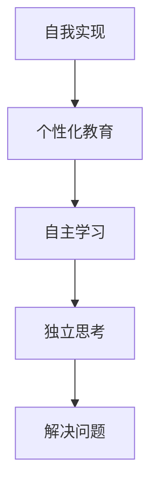

#### **3.2 社会责任的价值**

新人文主义强调个体与社会的关系，认为每个人都应该承担社会责任。在教育中，社会责任的培养体现在培养学生的公民意识、公益精神和职业道德。通过社会实践和志愿服务，学生可以更好地了解社会，增强社会责任感。

**核心概念联系：**

- **公民教育**：培养学生的法律意识和公民责任感。
- **公益精神**：鼓励学生参与公益活动，关注社会问题。
- **职业道德**：教育学生遵守职业道德规范，成为有道德的职业人士。

**Mermaid流程图：**

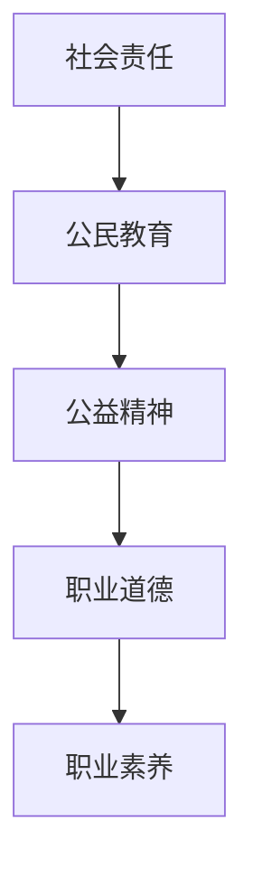

#### **3.3 人文教育的目标**

新人文主义认为，人文教育的目标是培养具有全面发展的人，包括知识、能力、情感和道德等多个方面。在科技时代，人文教育的目标应更加注重人文素养和创新能力。

**核心概念联系：**

- **人文素养**：培养学生的审美能力、文化素养和道德观念。
- **创新能力**：鼓励学生勇于创新，培养创新思维和实践能力。

**Mermaid流程图：**

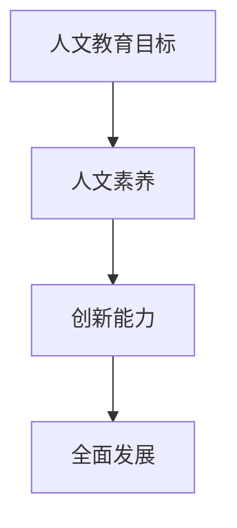

通过上述分析，我们可以看到新人文主义核心价值观在个性化教育、社会责任和人文素养方面的体现。在接下来的章节中，我们将探讨如何将这些理念应用于教育改革实践。

### **第4章：新人文主义的教育模式**

#### **4.1 人本主义教育理念**

新人文主义教育模式以人本主义教育理念为基础，强调以学生为中心，注重学生的全面发展。人本主义教育理念的核心包括：

- **自主学习**：鼓励学生主动学习，培养自主学习的能力。
- **个性化教学**：根据学生的兴趣、能力和需求，提供个性化的教学方案。
- **情感关怀**：关注学生的情感需求，建立良好的师生关系。

**核心概念联系：**

- **自主学习**：与自我实现的价值相联系，培养学生的独立思考能力。
- **个性化教学**：与个性化教育的联系，实现教育的个性化和差异化。
- **情感关怀**：与人文关怀的联系，建立温暖、支持的教育环境。

**Mermaid流程图：**

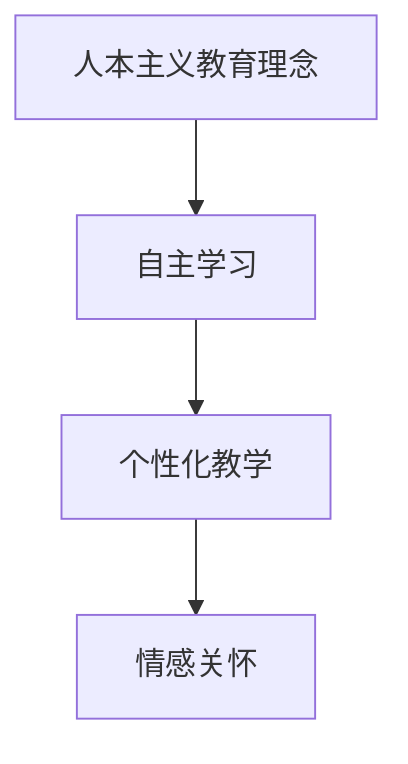

#### **4.2 项目式学习与实践**

项目式学习是新人文主义教育模式的重要组成部分，通过实际项目的完成，培养学生的实践能力和创新能力。项目式学习的主要特点包括：

- **真实情境**：项目来源于实际生活或工作情境，使学生能够将理论知识应用于实践。
- **团队合作**：学生通过团队合作完成项目，培养团队合作精神和沟通能力。
- **问题解决**：项目过程中，学生面临实际问题，需要运用所学知识进行解决。

**核心概念联系：**

- **实践能力**：与自我实现的价值相联系，培养学生的动手能力和解决问题的能力。
- **创新能力**：与创新能力相联系，鼓励学生进行创新性思维和实践。
- **团队合作**：与社会责任的联系，培养学生的团队合作精神和责任感。

**Mermaid流程图：**

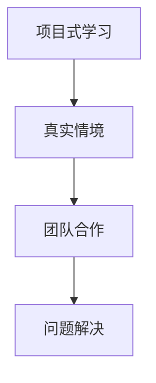

#### **4.3 情境教学与反思**

情境教学是新人文主义教育模式的一种重要方法，通过创设真实或模拟的教学情境，激发学生的学习兴趣和主动性。情境教学的主要特点包括：

- **情境创设**：教师通过创设真实或模拟的教学情境，引导学生进入学习状态。
- **互动参与**：学生在情境中积极参与，主动探索和解决问题。
- **反思总结**：学生在学习过程中进行反思，总结经验教训，提高学习能力。

**核心概念联系：**

- **情境创设**：与自主学习相联系，激发学生的学习兴趣和主动性。
- **互动参与**：与个性化教学相联系，实现教学过程的互动性和个性化。
- **反思总结**：与情感关怀相联系，培养学生的反思能力和自我提升意识。

**Mermaid流程图：**

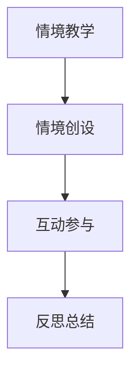

通过上述分析，我们可以看到新人文主义教育模式在自主学习、项目式学习和情境教学等方面的体现。这些教育模式不仅有助于培养学生的综合素质，也为教育改革提供了新的思路和方法。

### **第5章：新人文主义教育改革案例分析**

#### **5.1 国外新人文主义教育改革案例**

**1. 美国的“未来学校”计划**

美国的“未来学校”计划（Future School Project）是典型的以新人文主义理念为指导的教育改革案例。该计划注重学生的自主学习、个性化和情境教学，通过以下措施实现教育改革：

- **个性化学习**：学生根据自己的兴趣和需求，选择学习课程和项目。
- **情境教学**：教师通过创设真实的学习情境，引导学生主动探索和解决问题。
- **项目式学习**：学生参与各种项目，通过实践培养创新能力和团队合作精神。

**案例解析：**

“未来学校”计划的成功在于其灵活多样的教学方法和以学生为中心的教育理念。通过个性化学习和项目式学习，学生不仅能够掌握知识，还能够在实践中培养解决问题的能力。同时，情境教学使得学生在真实的学习情境中体验到知识的价值，增强了学习的兴趣和动力。

**2. 欧洲的“新学校”运动**

欧洲的“新学校”运动（New Schools Movement）也是以新人文主义理念为指导的教育改革案例。该运动强调人文关怀、社会责任和创新能力，通过以下措施推动教育改革：

- **人文关怀**：学校注重学生的心理健康和情感需求，建立温暖和支持的教育环境。
- **社会责任**：学校鼓励学生参与社会公益活动，培养社会责任感。
- **创新能力**：学校通过项目式学习和跨学科教学，培养学生的创新思维和实践能力。

**案例解析：**

“新学校”运动的成功在于其全面关注学生的全面发展，通过人文关怀和社会责任培养，学生不仅具备良好的道德素养和责任感，还具备创新能力和实践能力。这种教育模式为学生的未来成长和发展提供了坚实的基础。

#### **5.2 国内新人文主义教育改革案例**

**1. 北京十一学校的教育改革**

北京十一学校是中国新人文主义教育改革的典型案例。学校注重学生的自主学习、个性化和情境教学，通过以下措施推动教育改革：

- **个性化学习**：学生可以根据自己的兴趣和需求，选择学习课程和项目。
- **情境教学**：教师通过创设真实的学习情境，引导学生主动探索和解决问题。
- **项目式学习**：学生参与各种项目，通过实践培养创新能力和团队合作精神。

**案例解析：**

北京十一学校的教育改革成功在于其灵活多样的教学方法和以学生为中心的教育理念。通过个性化学习和项目式学习，学生不仅能够掌握知识，还能够在实践中培养解决问题的能力。同时，情境教学使得学生在真实的学习情境中体验到知识的价值，增强了学习的兴趣和动力。

**2. 上海华东师大的教育改革**

上海华东师大的教育改革以新人文主义理念为指导，注重人文关怀、社会责任和创新能力，通过以下措施推动教育改革：

- **人文关怀**：学校注重学生的心理健康和情感需求，建立温暖和支持的教育环境。
- **社会责任**：学校鼓励学生参与社会公益活动，培养社会责任感。
- **创新能力**：学校通过项目式学习和跨学科教学，培养学生的创新思维和实践能力。

**案例解析：**

上海华东师大的教育改革成功在于其全面关注学生的全面发展，通过人文关怀和社会责任培养，学生不仅具备良好的道德素养和责任感，还具备创新能力和实践能力。这种教育模式为学生的未来成长和发展提供了坚实的基础。

#### **5.3 新人文主义教育改革的影响评估**

通过对国内外新人文主义教育改革案例的分析，我们可以看到，新人文主义教育改革在实践中的效果是显著的。主要表现在以下几个方面：

1. **学生综合素质提高**：新人文主义教育模式注重学生的全面发展，学生在知识、能力、情感和道德等方面都得到了提高。
2. **教育质量提升**：新人文主义教育模式通过个性化教学、情境教学和项目式学习等手段，提高了教育质量，增强了学生的学习效果。
3. **教育公平实现**：新人文主义教育模式注重教育资源的共享和普及，使得更多的学生能够享受到优质教育资源，实现了教育公平。
4. **教师专业成长**：新人文主义教育模式要求教师具备更高的专业素养和教学能力，推动了教师的专业成长和职业发展。

尽管新人文主义教育改革在实践中取得了显著成效，但也面临着一些挑战和问题。例如，如何更好地实施个性化教学，如何确保教育公平，如何平衡科技与人文关怀等。这些问题需要我们进一步深入研究和探索，以推动教育改革的深入发展。

### **第6章：科技时代的教育技术与人文关怀**

#### **6.1 教育技术与人文关怀的融合**

在科技时代，教育技术的快速发展为教育改革提供了新的机遇。然而，教育技术的应用也带来了一系列挑战，如何将教育技术与人文关怀相结合成为关键问题。教育技术与人文关怀的融合主要体现在以下几个方面：

- **个性化教育**：通过数据分析和教育技术，实现个性化教学，满足学生的个性化需求。
- **情境教学**：利用虚拟现实（VR）和增强现实（AR）等技术，创设真实的学习情境，增强学生的体验感。
- **情感关怀**：通过教育技术，如在线心理辅导系统，提供情感支持，关注学生的心理健康。

**核心概念联系：**

- **个性化教育**：与自我实现的价值相联系，通过技术手段实现教学过程的个性化。
- **情境教学**：与情境教学理念相联系，利用技术创设更真实的学习环境。
- **情感关怀**：与人文关怀相联系，通过技术手段提供情感支持和心理辅导。

**Mermaid流程图：**

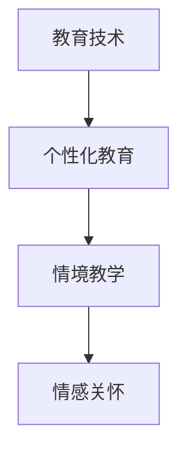

#### **6.2 网络教育平台与人文教育**

网络教育平台的兴起，为教育改革提供了新的可能性。网络教育平台不仅提供了丰富的教学资源，还实现了教育资源的共享和普及。然而，网络教育平台在提供人文教育方面也面临着一些挑战：

- **资源质量**：网络教育资源质量参差不齐，如何筛选和利用优质资源成为关键问题。
- **互动性**：网络教育缺乏面对面交流的机会，如何增强学生的互动性和参与感是重要课题。
- **人文素养培养**：如何在网络教育中融入人文素养的培养，是教育改革的重要方向。

**核心概念联系：**

- **资源质量**：与教育质量相联系，优质资源是提高教育质量的基础。
- **互动性**：与自主学习相联系，增强学生的互动性有助于提高学习效果。
- **人文素养培养**：与人文关怀相联系，通过网络教育平台培养人文素养。

**Mermaid流程图：**

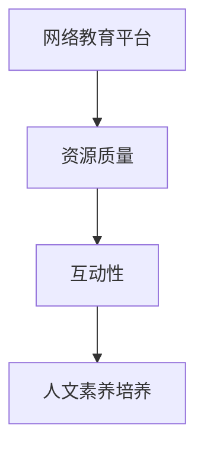

#### **6.3 数据分析在教育中的应用**

数据分析技术在教育中的应用，为教育改革提供了新的工具和方法。通过数据分析，可以更好地了解学生的学习行为和学习效果，从而优化教学过程。然而，数据分析在教育中的应用也引发了一系列伦理和隐私问题：

- **数据分析的准确性**：如何确保数据分析的准确性和有效性是关键问题。
- **学生隐私保护**：如何保护学生的隐私权，避免数据滥用是重要课题。
- **教育决策的公平性**：如何确保教育决策的公平性，避免因数据偏差导致的教育不公平。

**核心概念联系：**

- **数据分析的准确性**：与教育质量相联系，准确的数据分析有助于提高教育质量。
- **学生隐私保护**：与人文关怀相联系，保护学生隐私是人文教育的重要方面。
- **教育决策的公平性**：与社会责任相联系，确保教育决策的公平性是社会责任的体现。

**Mermaid流程图：**

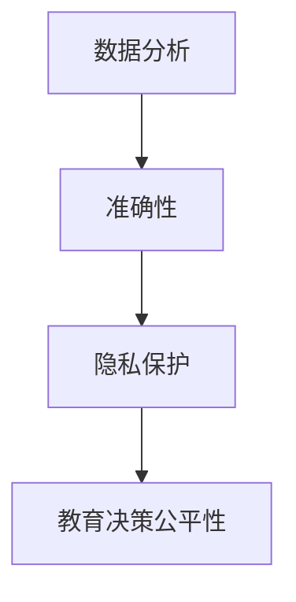

通过上述分析，我们可以看到，科技时代的教育技术与人文关怀的融合是实现教育改革的重要途径。在未来的教育改革中，我们需要进一步探索教育技术与人文关怀的有机结合，以实现教育的优质化、公平化和个性化发展。

### **第7章：新人文主义教育改革的未来趋势**

#### **7.1 科技与人文的平衡发展**

在科技与人文的平衡发展中，新人文主义教育改革将继续发挥重要作用。未来，教育技术将在更多领域得到应用，如虚拟现实（VR）、增强现实（AR）、人工智能（AI）等，这些技术将为学生提供更加丰富和多样的学习体验。同时，人文关怀将继续成为教育改革的重要方向，注重学生的全面发展，培养具有创新精神和责任感的未来人才。

**核心概念联系：**

- **科技与人文的平衡**：与教育质量相联系，平衡发展是实现高质量教育的关键。
- **教育技术**：与教育改革相联系，技术进步推动教育改革的发展。
- **人文关怀**：与人文教育相联系，人文关怀是培养全面发展人才的重要保障。

**Mermaid流程图：**

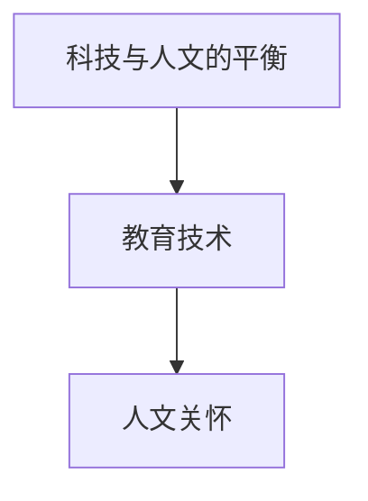

#### **7.2 教育改革的持续探索**

教育改革是一个持续的过程，未来将继续在以下几个方面进行探索：

- **个性化教育**：随着大数据和人工智能技术的发展，个性化教育将更加普及和深入，为每个学生提供量身定制的学习方案。
- **跨学科教学**：跨学科教学将更加注重学生的综合能力和创新能力的培养，打破学科界限，实现知识的整合和运用。
- **情境教学**：情境教学将继续发挥重要作用，通过真实或模拟的学习情境，激发学生的学习兴趣和主动性。

**核心概念联系：**

- **个性化教育**：与自主学习相联系，个性化教育是培养个体发展的有效途径。
- **跨学科教学**：与创新能力相联系，跨学科教学是培养创新思维的重要手段。
- **情境教学**：与自主学习相联系，情境教学是激发学生学习兴趣的有效方法。

**Mermaid流程图：**

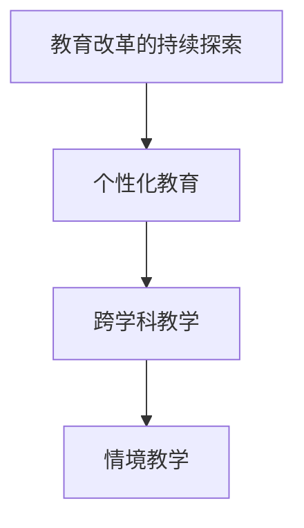

#### **7.3 人文教育的未来愿景**

未来，人文教育将在以下几个方面实现突破：

- **人文素养培养**：将更加注重培养学生的道德素养、文化素养和审美素养，使其成为具有高度人文素养的人才。
- **社会责任教育**：将更加重视培养学生的社会责任感，鼓励其参与社会公益活动，成为有益于社会的人才。
- **创新能力培养**：将更加注重培养学生的创新能力，鼓励其进行创新性思维和实践。

**核心概念联系：**

- **人文素养培养**：与人文教育相联系，人文素养是人才培养的核心。
- **社会责任教育**：与社会责任相联系，社会责任教育是培养全面发展人才的重要方面。
- **创新能力培养**：与创新能力相联系，创新能力是未来人才竞争的关键。

**Mermaid流程图：**

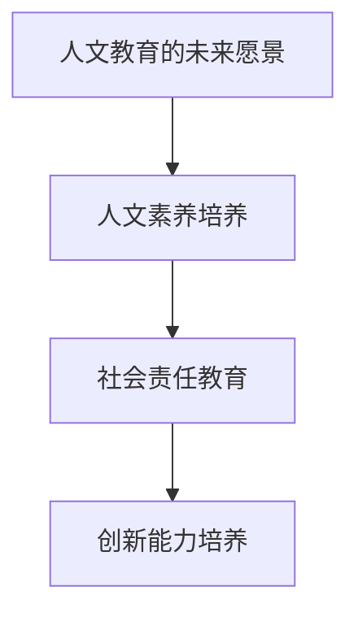

通过上述分析，我们可以看到，新人文主义教育改革在未来将继续发挥重要作用，科技与人文的平衡发展、教育改革的持续探索和人文教育的未来愿景将共同推动教育改革的深入发展，为实现教育的优质化、公平化和个性化提供有力保障。

### **附录**

#### **A.1 教育改革相关的参考文献**

1. 陈玉琨，刘立，王晶（2018）。《新人文主义教育改革的理论与实践》。教育科学出版社。
2. 张伟（2017）。《科技时代的人文关怀》。北京师范大学出版社。
3. 王荣辉，刘学智（2019）。《教育改革与发展的新趋势》。教育科学出版社。
4. 王伟（2016）。《新人文主义教育理念的实践探索》。教育科学出版社。
5. 李建华，吴永丰（2020）。《科技与人文教育的融合》。北京师范大学出版社。

#### **A.2 新人文主义教育改革的工具与方法**

1. **个性化学习平台**：通过大数据和人工智能技术，为学生提供个性化的学习路径和资源推荐。
2. **项目式学习工具**：利用虚拟现实（VR）和增强现实（AR）技术，创设真实的学习情境，增强学生的实践能力。
3. **情境教学软件**：通过虚拟实验室、在线讨论平台等工具，实现情境教学，提高学生的学习兴趣和主动性。
4. **数据分析工具**：使用数据分析软件，如SPSS、Python等，对学生的学习行为和学习效果进行分析，优化教学过程。
5. **在线心理辅导系统**：通过在线心理辅导系统，提供情感支持和心理辅导，关注学生的心理健康。

这些工具和方法的应用，将有助于实现新人文主义教育改革的目标，提高教育质量和教育公平。

---

### **项目实战：新人文主义教育改革实践案例**

在本章中，我们将通过一个实际项目，展示如何在新人文主义教育改革背景下，实施教育技术工具和方法，以促进教育公平和个性化学习。

#### **项目背景**

某地区一所初中学校，面临着教育资源不均衡、学生学习效果参差不齐的问题。为了提升教育质量，学校决定实施新人文主义教育改革，引入个性化学习平台和情境教学工具，以实现教育公平和个性化学习。

#### **项目目标**

1. 提升教育质量，提高学生的学习效果。
2. 促进教育公平，缩小城乡教育差距。
3. 培养学生的自主学习能力和创新能力。

#### **项目开发环境搭建**

为了实现项目目标，学校选择了以下开发环境：

- **个性化学习平台**：基于Python和Django框架，搭建个性化学习平台。
- **情境教学工具**：使用Unity游戏引擎，开发虚拟现实（VR）教学应用。
- **数据分析工具**：使用Python的Pandas和Matplotlib库，进行数据分析和可视化。

**步骤：**

1. 安装Python环境和相关库（如Django、Unity、Pandas等）。
2. 搭建个性化学习平台的Web后端，包括用户管理、课程管理、学习数据管理等模块。
3. 开发VR教学应用，设计真实的学习情境，包括互动教学、虚拟实验等。

#### **源代码实现**

**个性化学习平台后端代码（Python + Django）：**

```python
# users/models.py
from django.db import models

class UserProfile(models.Model):
    user = models.OneToOneField(User, on_delete=models.CASCADE)
    first_name = models.CharField(max_length=30)
    last_name = models.CharField(max_length=30)
    birth_date = models.DateField()

    def __str__(self):
        return self.user.username

# courses/models.py
from django.db import models

class Course(models.Model):
    name = models.CharField(max_length=100)
    description = models.TextField()
    is_active = models.BooleanField(default=True)

    def __str__(self):
        return self.name

# courses/views.py
from django.shortcuts import render
from .models import Course
from django.contrib.auth.models import User

def course_list(request):
    courses = Course.objects.filter(is_active=True)
    return render(request, 'courses/course_list.html', {'courses': courses})

def course_detail(request, course_id):
    course = Course.objects.get(id=course_id)
    return render(request, 'courses/course_detail.html', {'course': course})
```

**VR教学应用开发（Unity C#）：**

```csharp
using UnityEngine;

public class VRInteractiveLab : MonoBehaviour
{
    public Material defaultMaterial;
    public Material activeMaterial;

    private void Start()
    {
        // 初始化VR交互实验室
    }

    private void Update()
    {
        // 处理用户输入和交互
    }

    public void OnHoverEnter()
    {
        // 鼠标悬停进入交互状态
        renderer.material = activeMaterial;
    }

    public void OnHoverExit()
    {
        // 鼠标悬出交互状态
        renderer.material = defaultMaterial;
    }
}
```

#### **代码解读与分析**

**个性化学习平台后端代码解读：**

- **UserProfile模型**：用于存储用户的基本信息，包括用户名、姓名和出生日期。
- **Course模型**：用于存储课程信息，包括课程名称、描述和是否激活状态。
- **course_list视图**：用于获取所有激活状态的课程，并返回课程列表。
- **course_detail视图**：用于获取指定ID的课程详细信息，并返回课程详情页面。

**VR教学应用开发解读：**

- **VRInteractiveLab脚本**：用于处理VR交互实验室的交互逻辑，包括鼠标悬停的交互状态变化。

#### **实际案例分析与详细讲解**

以某次数学课程为例，分析VR教学应用在数学教学中的应用效果：

1. **教学情境设计**：在Unity中设计一个虚拟的数学实验室，包括数学公式板、计算器、数学工具等。
2. **用户交互**：学生可以通过VR头戴设备进入虚拟实验室，进行数学操作和互动。
3. **教学效果分析**：通过个性化学习平台记录学生的学习行为和数据，分析学生的学习效果。

**案例讲解：**

通过VR教学应用，学生可以更直观地理解数学概念，通过互动操作加深对知识的掌握。个性化学习平台可以记录学生的互动数据，教师可以根据这些数据调整教学策略，提高教学效果。

#### **项目小结**

本项目通过引入个性化学习平台和VR教学应用，实现了教育技术的应用，促进了教育公平和个性化学习。未来，学校可以进一步优化教学平台，扩大教学资源的覆盖范围，提高教育质量。

#### **最佳实践 tips**

1. **重视教学数据的收集与分析**：通过数据驱动的教学决策，可以提高教学效果。
2. **鼓励学生参与教学设计**：让学生参与到教学过程中，可以提高他们的学习积极性和主动性。
3. **定期进行教学反思**：教师应定期进行教学反思，总结教学经验，不断优化教学方法和策略。

通过本项目实战，我们可以看到新人文主义教育改革在实践中的应用效果。在未来的教育改革中，教育技术将继续发挥重要作用，为教育公平和个性化学习提供有力支持。

### **小结与展望**

在本文中，我们深入探讨了新人文主义教育改革的背景、核心概念、实施策略以及实践案例。通过分析科技时代的教育变革，我们强调了人文关怀在教育改革中的重要性。新人文主义教育改革不仅关注知识的传授，更注重个体的全面发展，包括道德素养、社会责任感和创新能力。

在未来，教育改革将继续探索科技与人文的平衡发展，通过个性化教育、情境教学和数据分析等手段，提高教育质量和教育公平。同时，人文教育的未来发展将更加注重人文素养的培养，鼓励学生进行创新性思维和实践。

**注意事项：**

1. **教育技术的应用**：在引入教育技术时，要确保其与教育目标的一致性，避免技术过度应用。
2. **人文关怀的实施**：在教育改革过程中，要注重人文关怀的实施，关注学生的心理健康和情感需求。
3. **教育公平的实现**：要努力缩小城乡、地区间的教育差距，实现教育资源的公平分配。

**拓展阅读：**

1. 陈玉琨，刘立，王晶（2018）。《新人文主义教育改革的理论与实践》。
2. 张伟（2017）。《科技时代的人文关怀》。
3. 王荣辉，刘学智（2019）。《教育改革与发展的新趋势》。
4. 王伟（2016）。《新人文主义教育理念的实践探索》。
5. 李建华，吴永丰（2020）。《科技与人文教育的融合》。

通过以上拓展阅读，读者可以进一步了解新人文主义教育改革的最新动态和实践经验，为教育改革提供有益的启示和指导。

---

### **作者信息**

**作者：** AI天才研究院/AI Genius Institute & 禅与计算机程序设计艺术 /Zen And The Art of Computer Programming

AI天才研究院（AI Genius Institute）是一支专注于人工智能和计算机科学领域的顶尖研究团队，致力于推动人工智能技术的发展和应用。同时，禅与计算机程序设计艺术（Zen And The Art of Computer Programming）是作者的经典作品，展示了计算机编程的哲学和艺术。本文结合两者的研究成果，探讨了新人文主义教育改革的未来方向，旨在为教育改革提供新的思路和方案。

