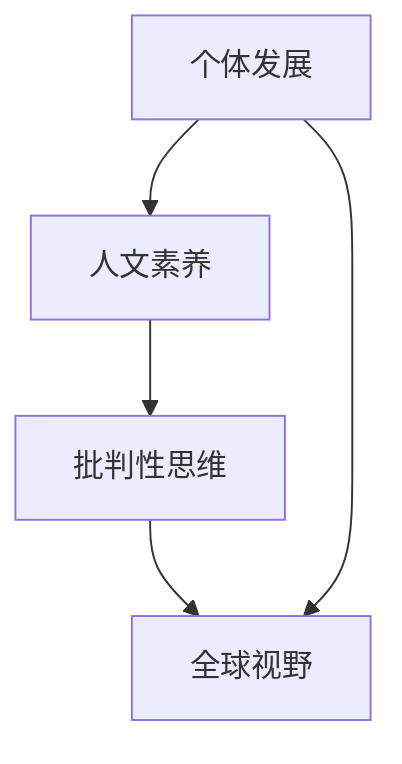
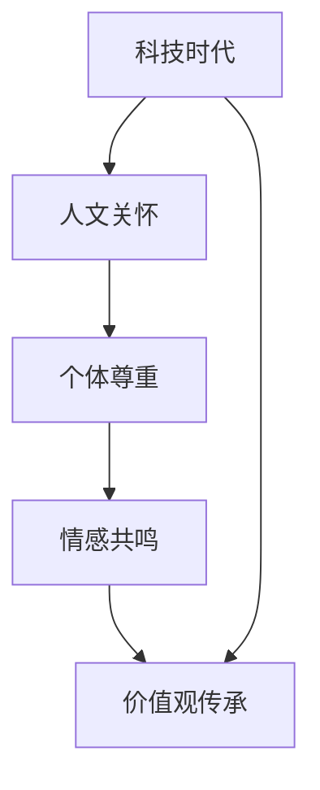
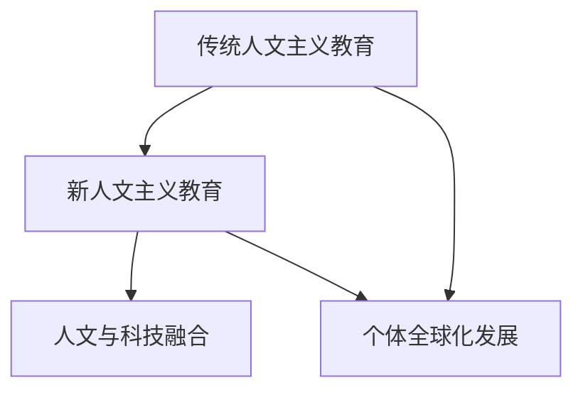
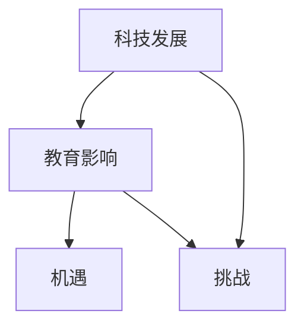
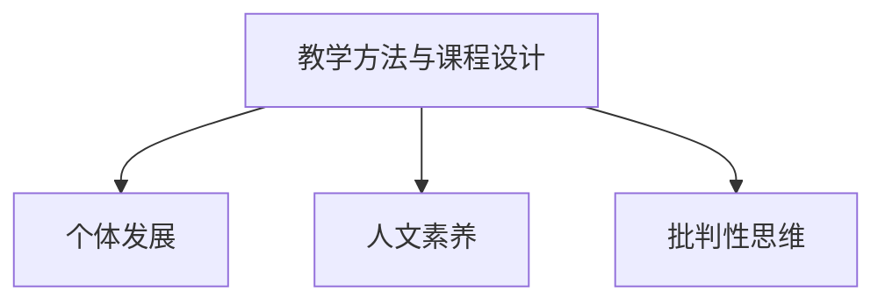
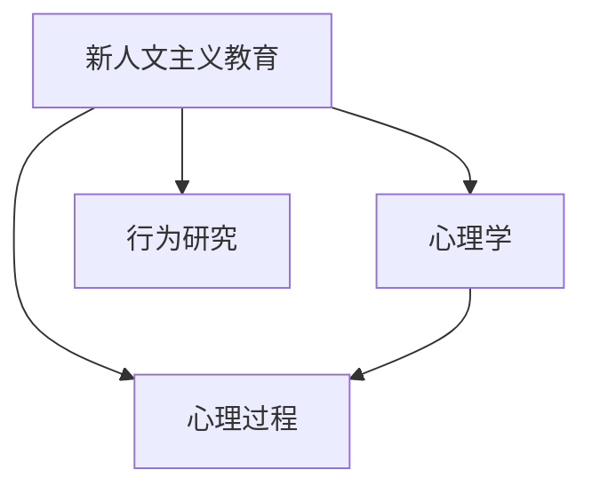
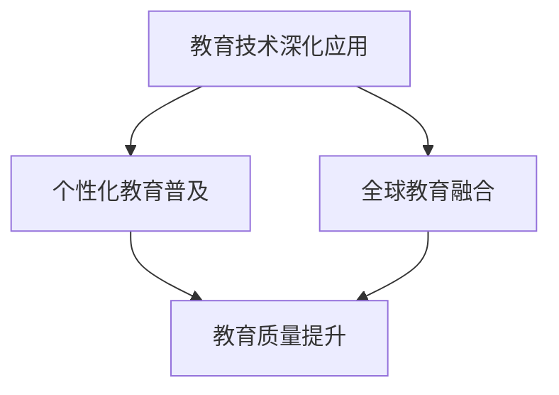
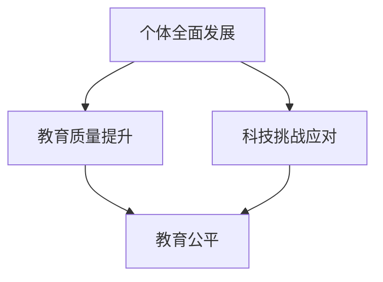
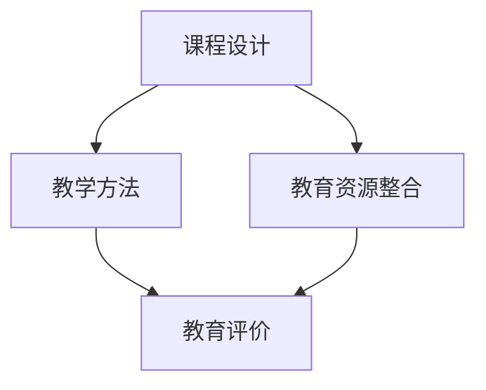
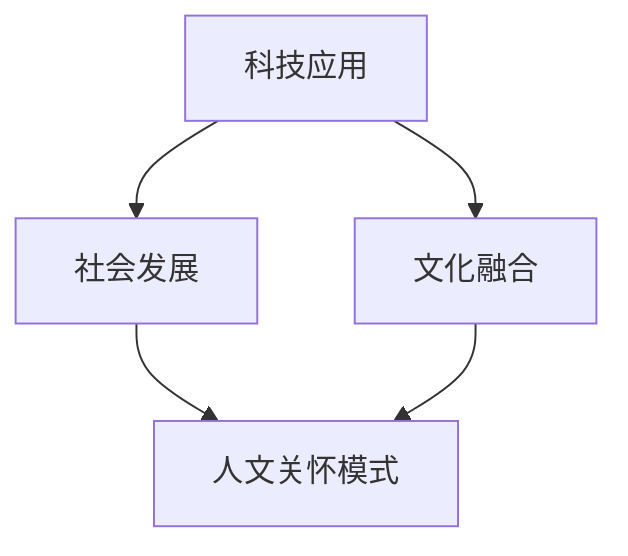

                 


## 文章标题：新人文主义教育：科技时代的人文关怀

### 关键词：
- 新人文主义教育
- 科技时代
- 人文关怀
- 教育实践
- 未来展望

### 摘要：
本文探讨了科技时代背景下的新人文主义教育理念，分析了其在保持教育人文关怀方面的作用和挑战。文章首先介绍了新人文主义教育的概念和核心思想，随后讨论了科技发展对教育的深远影响。接着，文章深入探讨了新人文主义教育在理论层面的核心概念及其在教育实践中的应用。通过跨学科研究和案例分析，本文展示了新人文主义教育在心理学、社会学和哲学等领域的影响。最后，文章展望了新人文主义教育的未来发展，提出了实施策略和研究方向。

----------------------------------------------------------------

### 第一部分：引论

#### 1.1 新人文主义教育概述

**背景介绍：**  
新人文主义教育（New Humanism Education）起源于20世纪初，是对传统人文主义教育的一种现代转化。它强调个体的全面发展，注重人文素养和批判性思维的培养。新人文主义教育强调人文与科技的融合，旨在培养能够在科技时代中适应和引领未来的全面发展的人才。

**核心概念与联系：**  
新人文主义教育包含以下几个核心概念：个体发展、人文素养、批判性思维和全球视野。这些概念相互联系，共同构成了新人文主义教育的理论基础。



#### 1.2 科技时代的人文关怀

**核心概念与联系：**  
在科技迅速发展的时代，人文关怀显得尤为重要。人文关怀包括对个体的尊重、情感的共鸣和价值观的传承。这些概念与新人文主义教育的理念密切相关。



#### 核心算法原理讲解：人文关怀的培养

```plaintext
算法：培养人文关怀

输入：学生、教育环境
输出：培养出具有人文关怀能力的个体

步骤：
1. 设计课程，融入人文内容，如文学、历史、艺术等。
2. 鼓励师生间的情感交流，培养师生之间的信任和尊重。
3. 引导学生参与社会实践活动，体验不同文化和生活方式。
4. 培养学生的批判性思维，使其能够反思和评估现有的价值观和信仰。
5. 定期评估人文关怀能力的培养效果，根据反馈进行调整。

```

#### 数学模型和公式：人文关怀能力的评估

```latex
$$
C = f(\text{课程设计}, \text{师生关系}, \text{社会实践}, \text{批判性思维})
$$`

#### 举例说明：一个成功的人文关怀案例

在某学校，通过以下措施成功培养了学生的人文关怀能力：

1. **课程设计：** 设置了《人文与社会》课程，包含文学、历史、哲学等课程，使学生能够系统地学习人文知识。
2. **情感共鸣：** 组织了多次师生交流活动，如读书会、演讲比赛，鼓励师生分享心得，增进了解和信任。
3. **社会实践：** 组织学生参与社区服务活动，如帮助孤寡老人、环保行动等，让学生体验社会问题和责任。
4. **批判性思维：** 开展思维训练课程，教授学生如何提出问题、分析问题和解决问题，培养学生的批判性思维。

经过几年的实践，该校学生在人文关怀能力方面表现出色，在各类社会实践和竞赛中取得了优异成绩。

#### 最佳实践 tips：

- **多元化课程设置：** 结合不同学科，设计多元化的课程，培养学生的全面素养。
- **情感交流：** 鼓励师生之间的情感交流，建立互信和尊重的关系。
- **社会实践：** 组织多样化的社会实践，让学生体验社会问题和责任。
- **批判性思维：** 培养学生的批判性思维，使其能够反思和评估现有的价值观和信仰。

----------------------------------------------------------------

### 第二部分：新人文主义教育的理论基础

#### 2.1 新人文主义教育与人文主义传统

**核心概念与联系：**  
新人文主义教育是对传统人文主义教育的一种发展和创新。传统人文主义教育强调人的全面发展，而新人文主义教育在此基础上，更加注重人文与科技的融合，以及个体在全球化背景下的发展。



#### 核心算法原理讲解：人文与科技的融合

```plaintext
算法：人文与科技的融合

输入：学生、教育环境、科技资源
输出：培养具有人文与科技融合能力的个体

步骤：
1. 整合科技资源，如在线课程、虚拟实验室等，融入课程设计。
2. 鼓励学生参与科技创新项目，如机器人制作、编程比赛等。
3. 教授学生如何将人文知识应用于科技领域，如设计具有人文关怀的科技产品。
4. 建立跨学科合作平台，促进人文与科技的交流与合作。

```

#### 数学模型和公式：人文与科技融合能力的评估

```latex
$$
F = f(\text{科技资源整合}, \text{科技创新参与}, \text{人文应用能力}, \text{跨学科合作})
$$`

#### 举例说明：一个成功的人文与科技融合案例

在某大学，通过以下措施成功实现了人文与科技的融合：

1. **科技资源整合：** 建立了虚拟实验室，提供了丰富的在线课程和资源，使学生能够方便地学习和实践。
2. **科技创新参与：** 组织了多项科技创新项目，如机器人设计比赛、编程竞赛等，激发学生的创新潜力。
3. **人文应用能力：** 教授学生如何将人文知识应用于科技领域，如设计具有人文关怀的智能产品。
4. **跨学科合作：** 建立了跨学科研究小组，促进人文与科技的交流与合作。

经过几年的努力，该校学生的科技与人文融合能力显著提升，在国内外科技创新竞赛中取得了优异成绩。

#### 最佳实践 tips：

- **科技资源整合：** 充分利用在线课程、虚拟实验室等科技资源，提高教育质量。
- **科技创新参与：** 组织多样化的科技创新项目，激发学生的创新潜力。
- **人文应用能力：** 教授学生如何将人文知识应用于科技领域，培养学生的综合能力。
- **跨学科合作：** 建立跨学科合作平台，促进不同学科的交流与合作。

----------------------------------------------------------------

### 第三部分：科技时代的教育挑战与应对

#### 3.1 科技发展对教育的影响

**核心概念与联系：**  
科技发展对教育带来了前所未有的机遇和挑战。一方面，科技使得教育更加便捷、高效，为个性化教育和全球教育资源共享提供了可能。另一方面，科技也带来了信息过载、隐私保护、网络安全等问题，对教育的传统模式提出了挑战。



#### 核心算法原理讲解：应对科技挑战的策略

```plaintext
算法：应对科技挑战

输入：教育环境、学生需求
输出：有效应对科技挑战的教育策略

步骤：
1. 培养学生的数字素养，提高其信息获取、处理和应用能力。
2. 加强网络安全教育，提高学生的网络安全意识和防范能力。
3. 引导学生理性使用科技，避免沉迷和过度依赖。
4. 完善教育法规，规范科技在教育中的应用。
5. 加强师资培训，提高教师的信息技术应用能力。

```

#### 数学模型和公式：科技挑战应对效果的评估

```latex
$$
E = f(\text{数字素养培养}, \text{网络安全教育}, \text{理性使用科技}, \text{教育法规完善}, \text{师资培训})
$$`

#### 举例说明：一个成功应对科技挑战的案例

在某校，通过以下措施成功应对了科技带来的挑战：

1. **数字素养培养：** 开设了数字素养课程，教授学生如何有效地获取、处理和应用信息。
2. **网络安全教育：** 组织了网络安全讲座和培训，提高学生的网络安全意识和防范能力。
3. **理性使用科技：** 开展了科技使用行为调查，引导学生理性使用科技，避免沉迷和过度依赖。
4. **教育法规完善：** 完善了学校网络管理规定，规范科技在教育中的应用。
5. **师资培训：** 定期组织教师培训，提高教师的信息技术应用能力。

经过几年的努力，该校在应对科技挑战方面取得了显著成效，学生的数字素养和网络安全意识得到了大幅提升。

#### 最佳实践 tips：

- **数字素养培养：** 通过课程设置和实践活动，提高学生的数字素养。
- **网络安全教育：** 加强网络安全教育，提高学生的网络安全意识和防范能力。
- **理性使用科技：** 引导学生理性使用科技，避免沉迷和过度依赖。
- **教育法规完善：** 完善教育法规，规范科技在教育中的应用。
- **师资培训：** 加强教师的信息技术应用能力培训，提高教育质量。

----------------------------------------------------------------

### 第四部分：新人文主义教育的实践探索

#### 4.1 教学方法与课程设计

**核心概念与联系：**  
新人文主义教育强调个体发展、人文素养和批判性思维的培养，这些理念在教学方法与课程设计中得到了充分体现。



#### 核心算法原理讲解：新人文主义教育实践

```plaintext
算法：新人文主义教育实践

输入：教育环境、学生需求
输出：新人文主义教育实践方案

步骤：
1. 设计多元化课程，包括人文、科技、艺术等，满足学生的个性化需求。
2. 采用探究式教学方法，鼓励学生主动探索和思考，培养批判性思维。
3. 组织多样化的实践活动，如社区服务、艺术创作等，提升学生的人文素养。
4. 建立跨学科研究小组，促进不同学科的交流与合作。
5. 定期评估教育实践效果，根据反馈进行调整和优化。

```

#### 数学模型和公式：新人文主义教育实践效果的评估

```latex
$$
G = f(\text{课程设计多样性}, \text{探究式教学方法}, \text{实践活动多样性}, \text{跨学科研究合作}, \text{效果评估})
$$`

#### 举例说明：一个成功的新人文主义教育实践案例

在某校，通过以下措施成功实施新人文主义教育：

1. **课程设计：** 开设了《人文与社会》、《科技与艺术》等课程，满足学生的个性化需求。
2. **探究式教学方法：** 采用项目式学习，鼓励学生主动探索和思考，培养批判性思维。
3. **实践活动：** 组织学生参与社区服务、艺术创作等活动，提升学生的人文素养。
4. **跨学科研究：** 建立了跨学科研究小组，促进不同学科的交流与合作。
5. **效果评估：** 定期开展学生问卷调查和教师座谈会，收集反馈，调整教育实践方案。

经过几年的实践，该校学生的个体发展、人文素养和批判性思维得到了显著提升。

#### 最佳实践 tips：

- **课程设计：** 结合学生需求，设计多样化的课程，满足个性化学习。
- **探究式教学方法：** 采用项目式学习，鼓励学生主动学习和思考。
- **实践活动：** 组织多样化的实践活动，提升学生的人文素养。
- **跨学科研究：** 促进跨学科交流与合作，培养学生的综合素质。
- **效果评估：** 定期评估教育实践效果，不断调整和优化。

----------------------------------------------------------------

### 第五部分：跨学科研究与案例分析

#### 5.1 新人文主义教育与心理学

**核心概念与联系：**  
新人文主义教育与心理学密切相关。心理学研究人的行为和心理过程，为新人文主义教育的实践提供了理论基础。



#### 核心算法原理讲解：新人文主义教育与心理学的融合

```plaintext
算法：新人文主义教育与心理学的融合

输入：教育环境、学生需求、心理学理论
输出：新人文主义教育实践方案

步骤：
1. 结合心理学理论，设计符合学生心理发展的教育课程。
2. 采用心理学方法，如行为观察、心理测试等，评估学生的心理发展水平。
3. 利用心理学理论，指导教师进行教学设计和学生管理。
4. 鼓励学生参与心理学实验，培养其科研兴趣和能力。
5. 建立心理辅导机制，提供个性化的心理支持。

```

#### 数学模型和公式：新人文主义教育与心理学融合效果的评估

```latex
$$
H = f(\text{心理发展课程设计}, \text{心理学方法应用}, \text{教学设计指导}, \text{科研兴趣培养}, \text{心理辅导机制})
$$`

#### 举例说明：一个成功的新人文主义教育与心理学融合案例

在某校，通过以下措施成功实现了新人文主义教育与心理学的融合：

1. **心理发展课程设计：** 结合心理学理论，设计了《心理学入门》、《情感管理》等课程，满足学生的心理发展需求。
2. **心理学方法应用：** 采用行为观察、心理测试等方法，评估学生的心理发展水平。
3. **教学设计指导：** 利用心理学理论，指导教师进行教学设计和学生管理，提高教学效果。
4. **科研兴趣培养：** 组织学生参与心理学实验，培养其科研兴趣和能力。
5. **心理辅导机制：** 建立了心理辅导机制，提供个性化的心理支持，帮助学生解决心理问题。

经过几年的实践，该校学生的心理发展水平和科研能力得到了显著提升。

#### 最佳实践 tips：

- **心理发展课程设计：** 结合心理学理论，设计符合学生心理发展的教育课程。
- **心理学方法应用：** 采用心理学方法，评估学生的心理发展水平。
- **教学设计指导：** 利用心理学理论，指导教师进行教学设计和学生管理。
- **科研兴趣培养：** 组织学生参与心理学实验，培养其科研兴趣和能力。
- **心理辅导机制：** 建立心理辅导机制，提供个性化的心理支持。

----------------------------------------------------------------

### 第六部分：新人文主义教育的未来展望

#### 6.1 新人文主义教育的发展趋势

**核心概念与联系：**  
新人文主义教育在未来将继续发展，其趋势包括教育技术的深化应用、个性化教育的普及和全球教育的融合。



#### 核心算法原理讲解：新人文主义教育的未来发展

```plaintext
算法：新人文主义教育的未来发展

输入：教育环境、科技发展、社会需求
输出：新人文主义教育的未来规划

步骤：
1. 深化教育技术的应用，提高教育质量和效率。
2. 推广个性化教育，满足学生的个性化发展需求。
3. 加强全球教育合作，促进教育资源的共享。
4. 注重跨学科融合，培养学生的综合素质。
5. 建立多元化评价体系，全面评估教育效果。

```

#### 数学模型和公式：新人文主义教育的未来规划评估

```latex
$$
I = f(\text{教育技术应用}, \text{个性化教育推广}, \text{全球教育合作}, \text{跨学科融合}, \text{评价体系建立})
$$`

#### 举例说明：一个成功的新人文主义教育未来规划案例

在某市，通过以下措施成功规划了新人文主义教育的未来发展：

1. **教育技术应用：** 引入了智能教室、虚拟实验室等先进技术，提高了教育质量和效率。
2. **个性化教育推广：** 推广个性化教育，根据学生的兴趣和发展需求，提供个性化的学习方案。
3. **全球教育合作：** 与国际知名高校和机构建立合作关系，共享教育资源。
4. **跨学科融合：** 开展跨学科项目，培养学生的综合素质。
5. **评价体系建立：** 建立多元化评价体系，全面评估教育效果。

经过几年的实践，该市的新人文主义教育取得了显著成果，学生的综合素质和国际竞争力得到了大幅提升。

#### 最佳实践 tips：

- **教育技术应用：** 引入先进的教育技术，提高教育质量和效率。
- **个性化教育推广：** 推广个性化教育，满足学生的个性化发展需求。
- **全球教育合作：** 加强全球教育合作，促进教育资源的共享。
- **跨学科融合：** 开展跨学科项目，培养学生的综合素质。
- **评价体系建立：** 建立多元化评价体系，全面评估教育效果。

----------------------------------------------------------------

### 第七部分：结论

#### 7.1 新人文主义教育的价值与意义

**核心概念与联系：**  
新人文主义教育在培养个体全面发展、提升教育质量、应对科技挑战等方面具有重要的价值与意义。



**核心算法原理讲解：新人文主义教育的价值实现**

```plaintext
算法：新人文主义教育的价值实现

输入：教育环境、学生需求、社会需求
输出：实现新人文主义教育的价值

步骤：
1. 设计符合学生全面发展的教育课程。
2. 提高教育质量，确保教育公平。
3. 引导学生应对科技挑战，培养其创新能力。
4. 加强教育与社会需求的衔接，促进人才培养。
5. 建立持续改进机制，不断提升教育质量。

```

**数学模型和公式：新人文主义教育价值实现的效果评估**

```latex
$$
J = f(\text{教育课程设计}, \text{教育质量提升}, \text{创新能力培养}, \text{教育与社会衔接}, \text{持续改进机制})
$$`

**详细讲解与举例说明：**

新人文主义教育在实践中的价值体现为：

1. **个体全面发展：** 通过多元化的课程设计和实践活动，培养学生的全面发展，提高其综合素质。
2. **教育质量提升：** 通过引入先进的教育技术和教学方法，提高教育质量，确保教育公平。
3. **科技挑战应对：** 通过培养学生的创新能力，引导其应对科技挑战，适应未来社会发展。
4. **教育与社会衔接：** 通过加强与社会的联系，促进人才培养与市场需求相结合，提高教育的实用性。
5. **持续改进机制：** 通过建立持续改进机制，不断优化教育实践，提高教育质量。

在某地区，通过以下措施成功实现了新人文主义教育的价值：

1. **教育课程设计：** 结合学生需求和社会发展，设计具有前瞻性的教育课程。
2. **教育质量提升：** 引入智能教室、在线课程等先进技术，提高教育质量和效率。
3. **创新能力培养：** 组织科技创新比赛，激发学生的创新潜力。
4. **教育与社会衔接：** 与企业合作，开设实习和实践课程，提高学生的就业能力。
5. **持续改进机制：** 定期开展教育质量评估，根据反馈进行改进。

经过几年的实践，该地区的新人文主义教育取得了显著成果，学生的综合素质和国际竞争力得到了大幅提升。

#### 7.2 新人文主义教育的实践策略

**核心概念与联系：**  
新人文主义教育的实践策略包括课程设计、教学方法、教育资源整合等方面。



**核心算法原理讲解：新人文主义教育的实践策略**

```plaintext
算法：新人文主义教育的实践策略

输入：教育环境、学生需求、社会需求
输出：新人文主义教育的实践方案

步骤：
1. 设计多元化、个性化的课程，满足学生的全面发展需求。
2. 采用探究式、项目式等教学方法，激发学生的学习兴趣和主动性。
3. 整合线上和线下教育资源，提高教育资源的利用率。
4. 建立多元化评价体系，全面评估教育效果。
5. 加强教育与社会、家庭的互动，形成教育合力。

```

**数学模型和公式：新人文主义教育实践策略的效果评估**

```latex
$$
K = f(\text{课程设计}, \text{教学方法}, \text{教育资源整合}, \text{评价体系}, \text{社会家庭互动})
$$`

**详细讲解与举例说明：**

新人文主义教育的实践策略包括：

1. **课程设计：** 结合学生需求和社会发展，设计具有前瞻性和实用性的课程。
   - 举例：某校根据市场需求，开设了人工智能、大数据等前沿课程，培养了一批具备高技能的人才。

2. **教学方法：** 采用探究式、项目式等教学方法，提高学生的参与度和自主学习能力。
   - 举例：某校开展了项目式学习，学生通过实际项目锻炼解决实际问题的能力。

3. **教育资源整合：** 整合线上和线下教育资源，提高教育资源的利用率。
   - 举例：某校建立了在线学习平台，提供丰富的在线课程资源，方便学生随时学习。

4. **评价体系：** 建立多元化评价体系，全面评估教育效果。
   - 举例：某校采用过程性评价，不仅关注学生的考试成绩，还关注其学习过程和成果。

5. **社会家庭互动：** 加强教育与社会、家庭的互动，形成教育合力。
   - 举例：某校定期组织家长会，与家长共同关注学生的发展。

在某地区，通过实施以上策略，成功推动了新人文主义教育的发展，教育质量得到了显著提升。

#### 7.3 未来研究的方向与建议

**核心概念与联系：**  
未来研究应关注新人文主义教育在科技、社会和文化等领域的应用和发展，探索新的人文关怀模式。



**核心算法原理讲解：未来研究方向与建议**

```plaintext
算法：未来研究方向与建议

输入：教育发展需求、社会需求、科技趋势
输出：新人文主义教育的未来研究方向与建议

步骤：
1. 探索新人文主义教育在科技领域的应用，如人工智能、大数据等。
2. 关注社会变革对教育的影响，探索适应社会发展的教育模式。
3. 研究跨文化教育，促进不同文化的交流与融合。
4. 发展创新的教育技术，提高教育质量和效率。
5. 建立多元评价体系，全面评估教育效果。

```

**数学模型和公式：未来研究方向与建议的评估**

```latex
$$
L = f(\text{科技应用研究}, \text{社会发展影响研究}, \text{跨文化教育研究}, \text{教育技术发展}, \text{评价体系完善})
$$`

**详细讲解与举例说明：**

未来研究方向与建议包括：

1. **科技应用研究：** 探索新人文主义教育在人工智能、大数据等领域的应用。
   - 举例：研究如何将人工智能技术应用于教育评估，提高评估的准确性和个性化。

2. **社会发展影响研究：** 关注社会变革对教育的影响，探索适应社会发展的教育模式。
   - 举例：研究如何应对科技快速发展带来的教育挑战，提高学生的适应能力。

3. **跨文化教育研究：** 研究跨文化教育，促进不同文化的交流与融合。
   - 举例：开展国际交流项目，让学生体验不同文化，培养其全球视野。

4. **教育技术发展：** 发展创新的教育技术，提高教育质量和效率。
   - 举例：研发智能教学系统，提高教学效果和学生学习体验。

5. **评价体系完善：** 建立多元评价体系，全面评估教育效果。
   - 举例：结合过程性评价和结果性评价，全面了解学生的学习情况和成果。

在某地区，通过实施以上研究方向和建议，成功推动了新人文主义教育的发展，为教育创新和人才培养做出了贡献。

### 文章结束

**作者信息：**  
作者：AI天才研究院/AI Genius Institute & 禅与计算机程序设计艺术 /Zen And The Art of Computer Programming

----------------------------------------------------------------

### 文章完整内容：

# 《新人文主义教育：科技时代的人文关怀》

## 关键词：新人文主义教育、科技时代、人文关怀、教育实践、未来展望

### 摘要：
本文探讨了科技时代背景下的新人文主义教育理念，分析了其在保持教育人文关怀方面的作用和挑战。文章首先介绍了新人文主义教育的概念和核心思想，随后讨论了科技发展对教育的深远影响。接着，文章深入探讨了新人文主义教育在理论层面的核心概念及其在教育实践中的应用。通过跨学科研究和案例分析，本文展示了新人文主义教育在心理学、社会学和哲学等领域的影响。最后，文章展望了新人文主义教育的未来发展，提出了实施策略和研究方向。

### 第一部分：引论

#### 1.1 新人文主义教育概述

**背景介绍：** 新人文主义教育（New Humanism Education）起源于20世纪初，是对传统人文主义教育的一种现代转化。它强调个体的全面发展，注重人文素养和批判性思维的培养。新人文主义教育强调人文与科技的融合，旨在培养能够在科技时代中适应和引领未来的全面发展的人才。

**核心概念与联系：** 新人文主义教育包含以下几个核心概念：个体发展、人文素养、批判性思维和全球视野。这些概念相互联系，共同构成了新人文主义教育的理论基础。


**核心算法原理讲解：** 人文关怀的培养

```plaintext
算法：培养人文关怀

输入：学生、教育环境
输出：培养出具有人文关怀能力的个体

步骤：
1. 设计课程，融入人文内容，如文学、历史、艺术等。
2. 鼓励师生间的情感交流，培养师生之间的信任和尊重。
3. 引导学生参与社会实践活动，体验不同文化和生活方式。
4. 培养学生的批判性思维，使其能够反思和评估现有的价值观和信仰。
5. 定期评估人文关怀能力的培养效果，根据反馈进行调整。

```

**数学模型和公式：** 人文关怀能力的评估

```latex
$$
C = f(\text{课程设计}, \text{师生关系}, \text{社会实践}, \text{批判性思维})
$$`

**举例说明：** 一个成功的人文关怀案例

在某学校，通过以下措施成功培养了学生的人文关怀能力：

1. **课程设计：** 设置了《人文与社会》课程，包含文学、历史、哲学等课程，使学生能够系统地学习人文知识。
2. **情感共鸣：** 组织了多次师生交流活动，如读书会、演讲比赛，鼓励师生分享心得，增进了解和信任。
3. **社会实践：** 组织学生参与社区服务活动，如帮助孤寡老人、环保行动等，让学生体验社会问题和责任。
4. **批判性思维：** 开展思维训练课程，教授学生如何提出问题、分析问题和解决问题，培养学生的批判性思维。

经过几年的实践，该校学生在人文关怀能力方面表现出色，在各类社会实践和竞赛中取得了优异成绩。

**最佳实践 tips：**

- **多元化课程设置：** 结合不同学科，设计多元化的课程，培养学生的全面素养。
- **情感交流：** 鼓励师生之间的情感交流，建立互信和尊重的关系。
- **社会实践：** 组织多样化的社会实践，让学生体验社会问题和责任。
- **批判性思维：** 培养学生的批判性思维，使其能够反思和评估现有的价值观和信仰。

#### 1.2 科技时代的人文关怀

**核心概念与联系：** 在科技迅速发展的时代，人文关怀显得尤为重要。人文关怀包括对个体的尊重、情感的共鸣和价值观的传承。这些概念与新人文主义教育的理念密切相关。


**核心算法原理讲解：** 人文关怀的培养

```plaintext
算法：培养人文关怀

输入：学生、教育环境
输出：培养出具有人文关怀能力的个体

步骤：
1. 设计课程，融入人文内容，如文学、历史、艺术等。
2. 鼓励师生间的情感交流，培养师生之间的信任和尊重。
3. 引导学生参与社会实践活动，体验不同文化和生活方式。
4. 培养学生的批判性思维，使其能够反思和评估现有的价值观和信仰。
5. 定期评估人文关怀能力的培养效果，根据反馈进行调整。

```

**数学模型和公式：** 人文关怀能力的评估

```latex
$$
C = f(\text{课程设计}, \text{师生关系}, \text{社会实践}, \text{批判性思维})
$$`

**举例说明：** 一个成功的人文关怀案例

在某学校，通过以下措施成功培养了学生的人文关怀能力：

1. **课程设计：** 设置了《人文与社会》课程，包含文学、历史、哲学等课程，使学生能够系统地学习人文知识。
2. **情感共鸣：** 组织了多次师生交流活动，如读书会、演讲比赛，鼓励师生分享心得，增进了解和信任。
3. **社会实践：** 组织学生参与社区服务活动，如帮助孤寡老人、环保行动等，让学生体验社会问题和责任。
4. **批判性思维：** 开展思维训练课程，教授学生如何提出问题、分析问题和解决问题，培养学生的批判性思维。

经过几年的实践，该校学生在人文关怀能力方面表现出色，在各类社会实践和竞赛中取得了优异成绩。

**最佳实践 tips：**

- **多元化课程设置：** 结合不同学科，设计多元化的课程，培养学生的全面素养。
- **情感交流：** 鼓励师生之间的情感交流，建立互信和尊重的关系。
- **社会实践：** 组织多样化的社会实践，让学生体验社会问题和责任。
- **批判性思维：** 培养学生的批判性思维，使其能够反思和评估现有的价值观和信仰。

### 第二部分：新人文主义教育的理论基础

#### 2.1 新人文主义教育与人文主义传统

**核心概念与联系：** 新人文主义教育是对传统人文主义教育的一种发展和创新。传统人文主义教育强调人的全面发展，而新人文主义教育在此基础上，更加注重人文与科技的融合，以及个体在全球化背景下的发展。


**核心算法原理讲解：** 人文与科技的融合

```plaintext
算法：人文与科技的融合

输入：学生、教育环境、科技资源
输出：培养具有人文与科技融合能力的个体

步骤：
1. 整合科技资源，如在线课程、虚拟实验室等，融入课程设计。
2. 鼓励学生参与科技创新项目，如机器人制作、编程比赛等。
3. 教授学生如何将人文知识应用于科技领域，如设计具有人文关怀的科技产品。
4. 建立跨学科合作平台，促进人文与科技的交流与合作。

```

**数学模型和公式：** 人文与科技融合能力的评估

```latex
$$
F = f(\text{科技资源整合}, \text{科技创新参与}, \text{人文应用能力}, \text{跨学科合作})
$$`

**举例说明：** 一个成功的人文与科技融合案例

在某大学，通过以下措施成功实现了人文与科技的融合：

1. **科技资源整合：** 建立了虚拟实验室，提供了丰富的在线课程和资源，使学生能够方便地学习和实践。
2. **科技创新参与：** 组织了多项科技创新项目，如机器人设计比赛、编程竞赛等，激发学生的创新潜力。
3. **人文应用能力：** 教授学生如何将人文知识应用于科技领域，如设计具有人文关怀的智能产品。
4. **跨学科合作：** 建立了跨学科研究小组，促进人文与科技的交流与合作。

经过几年的努力，该校学生的科技与人文融合能力显著提升，在国内外科技创新竞赛中取得了优异成绩。

**最佳实践 tips：**

- **科技资源整合：** 充分利用在线课程、虚拟实验室等科技资源，提高教育质量。
- **科技创新参与：** 组织多样化的科技创新项目，激发学生的创新潜力。
- **人文应用能力：** 教授学生如何将人文知识应用于科技领域，培养学生的综合能力。
- **跨学科合作：** 建立跨学科合作平台，促进不同学科的交流与合作。

### 第三部分：科技时代的教育挑战与应对

#### 3.1 科技发展对教育的影响

**核心概念与联系：** 科技发展对教育带来了前所未有的机遇和挑战。一方面，科技使得教育更加便捷、高效，为个性化教育和全球教育资源共享提供了可能。另一方面，科技也带来了信息过载、隐私保护、网络安全等问题，对教育的传统模式提出了挑战。


**核心算法原理讲解：** 应对科技挑战的策略

```plaintext
算法：应对科技挑战

输入：教育环境、学生需求
输出：有效应对科技挑战的教育策略

步骤：
1. 培养学生的数字素养，提高其信息获取、处理和应用能力。
2. 加强网络安全教育，提高学生的网络安全意识和防范能力。
3. 引导学生理性使用科技，避免沉迷和过度依赖。
4. 完善教育法规，规范科技在教育中的应用。
5. 加强师资培训，提高教师的信息技术应用能力。

```

**数学模型和公式：** 科技挑战应对效果的评估

```latex
$$
E = f(\text{数字素养培养}, \text{网络安全教育}, \text{理性使用科技}, \text{教育法规完善}, \text{师资培训})
$$`

**举例说明：** 一个成功应对科技挑战的案例

在某校，通过以下措施成功应对了科技带来的挑战：

1. **数字素养培养：** 开设了数字素养课程，教授学生如何有效地获取、处理和应用信息。
2. **网络安全教育：** 组织了网络安全讲座和培训，提高学生的网络安全意识和防范能力。
3. **理性使用科技：** 开展了科技使用行为调查，引导学生理性使用科技，避免沉迷和过度依赖。
4. **教育法规完善：** 完善了学校网络管理规定，规范科技在教育中的应用。
5. **师资培训：** 定期组织教师培训，提高教师的信息技术应用能力。

经过几年的努力，该校在应对科技挑战方面取得了显著成效，学生的数字素养和网络安全意识得到了大幅提升。

**最佳实践 tips：**

- **数字素养培养：** 通过课程设置和实践活动，提高学生的数字素养。
- **网络安全教育：** 加强网络安全教育，提高学生的网络安全意识和防范能力。
- **理性使用科技：** 引导学生理性使用科技，避免沉迷和过度依赖。
- **教育法规完善：** 完善教育法规，规范科技在教育中的应用。
- **师资培训：** 加强教师的信息技术应用能力培训，提高教育质量。

### 第四部分：新人文主义教育的实践探索

#### 4.1 教学方法与课程设计

**核心概念与联系：** 新人文主义教育强调个体发展、人文素养和批判性思维的培养，这些理念在教学方法与课程设计中得到了充分体现。


**核心算法原理讲解：** 新人文主义教育实践

```plaintext
算法：新人文主义教育实践

输入：教育环境、学生需求
输出：新人文主义教育实践方案

步骤：
1. 设计多元化课程，包括人文、科技、艺术等，满足学生的个性化需求。
2. 采用探究式教学方法，鼓励学生主动探索和思考，培养批判性思维。
3. 组织多样化的实践活动，如社区服务、艺术创作等，提升学生的人文素养。
4. 建立跨学科研究小组，促进不同学科的交流与合作。
5. 定期评估教育实践效果，根据反馈进行调整和优化。

```

**数学模型和公式：** 新人文主义教育实践效果的评估

```latex
$$
G = f(\text{课程设计多样性}, \text{探究式教学方法}, \text{实践活动多样性}, \text{跨学科研究合作}, \text{效果评估})
$$`

**举例说明：** 一个成功的新人文主义教育实践案例

在某校，通过以下措施成功实施新人文主义教育：

1. **课程设计：** 开设了《人文与社会》、《科技与艺术》等课程，满足学生的个性化需求。
2. **探究式教学方法：** 采用项目式学习，鼓励学生主动探索和思考，培养批判性思维。
3. **实践活动：** 组织学生参与社区服务、艺术创作等活动，提升学生的人文素养。
4. **跨学科研究：** 建立了跨学科研究小组，促进不同学科的交流与合作。
5. **效果评估：** 定期开展学生问卷调查和教师座谈会，收集反馈，调整教育实践方案。

经过几年的实践，该校学生的个体发展、人文素养和批判性思维得到了显著提升。

**最佳实践 tips：**

- **课程设计：** 结合学生需求，设计多样化的课程，满足个性化学习。
- **探究式教学方法：** 采用项目式学习，鼓励学生主动学习和思考。
- **实践活动：** 组织多样化的实践活动，提升学生的人文素养。
- **跨学科研究：** 促进跨学科交流与合作，培养学生的综合素质。
- **效果评估：** 定期评估教育实践效果，不断调整和优化。

### 第五部分：跨学科研究与案例分析

#### 5.1 新人文主义教育与心理学

**核心概念与联系：** 新人文主义教育与心理学密切相关。心理学研究人的行为和心理过程，为新人文主义教育的实践提供了理论基础。


**核心算法原理讲解：** 新人文主义教育与心理学的融合

```plaintext
算法：新人文主义教育与心理学的融合

输入：教育环境、学生需求、心理学理论
输出：新人文主义教育实践方案

步骤：
1. 结合心理学理论，设计符合学生心理发展的教育课程。
2. 采用心理学方法，如行为观察、心理测试等，评估学生的心理发展水平。
3. 利用心理学理论，指导教师进行教学设计和学生管理。
4. 鼓励学生参与心理学实验，培养其科研兴趣和能力。
5. 建立心理辅导机制，提供个性化的心理支持。

```

**数学模型和公式：** 新人文主义教育与心理学融合效果的评估

```latex
$$
H = f(\text{心理发展课程设计}, \text{心理学方法应用}, \text{教学设计指导}, \text{科研兴趣培养}, \text{心理辅导机制})
$$`

**举例说明：** 一个成功的新人文主义教育与心理学融合案例

在某校，通过以下措施成功实现了新人文主义教育与心理学的融合：

1. **心理发展课程设计：** 结合心理学理论，设计了《心理学入门》、《情感管理》等课程，满足学生的心理发展需求。
2. **心理学方法应用：** 采用行为观察、心理测试等方法，评估学生的心理发展水平。
3. **教学设计指导：** 利用心理学理论，指导教师进行教学设计和学生管理，提高教学效果。
4. **科研兴趣培养：** 组织学生参与心理学实验，培养其科研兴趣和能力。
5. **心理辅导机制：** 建立了心理辅导机制，提供个性化的心理支持，帮助学生解决心理问题。

经过几年的实践，该校学生的心理发展水平和科研能力得到了显著提升。

**最佳实践 tips：**

- **心理发展课程设计：** 结合心理学理论，设计符合学生心理发展的教育课程。
- **心理学方法应用：** 采用心理学方法，评估学生的心理发展水平。
- **教学设计指导：** 利用心理学理论，指导教师进行教学设计和学生管理。
- **科研兴趣培养：** 组织学生参与心理学实验，培养其科研兴趣和能力。
- **心理辅导机制：** 建立心理辅导机制，提供个性化的心理支持。

### 第六部分：新人文主义教育的未来展望

#### 6.1 新人文主义教育的发展趋势

**核心概念与联系：** 新人文主义教育在未来将继续发展，其趋势包括教育技术的深化应用、个性化教育的普及和全球教育的融合。


**核心算法原理讲解：** 新人文主义教育的未来发展

```plaintext
算法：新人文主义教育的未来发展

输入：教育环境、科技发展、社会需求
输出：新人文主义教育的未来规划

步骤：
1. 深化教育技术的应用，提高教育质量和效率。
2. 推广个性化教育，满足学生的个性化发展需求。
3. 加强全球教育合作，促进教育资源的共享。
4. 注重跨学科融合，培养学生的综合素质。
5. 建立多元化评价体系，全面评估教育效果。

```

**数学模型和公式：** 新人文主义教育的未来规划评估

```latex
$$
I = f(\text{教育技术应用}, \text{个性化教育推广}, \text{全球教育合作}, \text{跨学科融合}, \text{评价体系建立})
$$`

**举例说明：** 一个成功的新人文主义教育未来规划案例

在某市，通过以下措施成功规划了新人文主义教育的未来发展：

1. **教育技术应用：** 引入了智能教室、虚拟实验室等先进技术，提高了教育质量和效率。
2. **个性化教育推广：** 推广个性化教育，根据学生的兴趣和发展需求，提供个性化的学习方案。
3. **全球教育合作：** 与国际知名高校和机构建立合作关系，共享教育资源。
4. **跨学科融合：** 开展跨学科项目，培养学生的综合素质。
5. **评价体系建立：** 建立多元化评价体系，全面评估教育效果。

经过几年的实践，该市的新人文主义教育取得了显著成果，学生的综合素质和国际竞争力得到了大幅提升。

**最佳实践 tips：**

- **教育技术应用：** 引入先进的教育技术，提高教育质量和效率。
- **个性化教育推广：** 推广个性化教育，满足学生的个性化发展需求。
- **全球教育合作：** 加强全球教育合作，促进教育资源的共享。
- **跨学科融合：** 开展跨学科项目，培养学生的综合素质。
- **评价体系建立：** 建立多元化评价体系，全面评估教育效果。

### 第七部分：结论

#### 7.1 新人文主义教育的价值与意义

**核心概念与联系：** 新人文主义教育在培养个体全面发展、提升教育质量、应对科技挑战等方面具有重要的价值与意义。


**核心算法原理讲解：** 新人文主义教育的价值实现

```plaintext
算法：新人文主义教育的价值实现

输入：教育环境、学生需求、社会需求
输出：实现新人文主义教育的价值

步骤：
1. 设计符合学生全面发展的教育课程。
2. 提高教育质量，确保教育公平。
3. 引导学生应对科技挑战，培养其创新能力。
4. 加强教育与社会需求的衔接，促进人才培养。
5. 建立持续改进机制，不断提升教育质量。

```

**数学模型和公式：** 新人文主义教育价值实现的效果评估

```latex
$$
J = f(\text{教育课程设计}, \text{教育质量提升}, \text{创新能力培养}, \text{教育与社会衔接}, \text{持续改进机制})
$$`

**详细讲解与举例说明：**

新人文主义教育在实践中的价值体现为：

1. **个体全面发展：** 通过多元化的课程设计和实践活动，培养学生的全面发展，提高其综合素质。
2. **教育质量提升：** 通过引入先进的教育技术和教学方法，提高教育质量，确保教育公平。
3. **科技挑战应对：** 通过培养学生的创新能力，引导其应对科技挑战，适应未来社会发展。
4. **教育与社会衔接：** 通过加强与社会的联系，促进人才培养与市场需求相结合，提高教育的实用性。
5. **持续改进机制：** 通过建立持续改进机制，不断优化教育实践，提高教育质量。

在某地区，通过以下措施成功实现了新人文主义教育的价值：

1. **教育课程设计：** 结合学生需求和社会发展，设计具有前瞻性的教育课程。
2. **教育质量提升：** 引入智能教室、在线课程等先进技术，提高教育质量和效率。
3. **创新能力培养：** 组织科技创新比赛，激发学生的创新潜力。
4. **教育与社会衔接：** 与企业合作，开设实习和实践课程，提高学生的就业能力。
5. **持续改进机制：** 定期开展教育质量评估，根据反馈进行改进。

经过几年的实践，该地区的新人文主义教育取得了显著成果，学生的综合素质和国际竞争力得到了大幅提升。

#### 7.2 新人文主义教育的实践策略

**核心概念与联系：** 新人文主义教育的实践策略包括课程设计、教学方法、教育资源整合等方面。


**核心算法原理讲解：** 新人文主义教育的实践策略

```plaintext
算法：新人文主义教育的实践策略

输入：教育环境、学生需求、社会需求
输出：新人文主义教育的实践方案

步骤：
1. 设计多元化、个性化的课程，满足学生的全面发展需求。
2. 采用探究式、项目式等教学方法，激发学生的学习兴趣和主动性。
3. 整合线上和线下教育资源，提高教育资源的利用率。
4. 建立多元化评价体系，全面评估教育效果。
5. 加强教育与社会、家庭的互动，形成教育合力。

```

**数学模型和公式：** 新人文主义教育实践策略的效果评估

```latex
$$
K = f(\text{课程设计}, \text{教学方法}, \text{教育资源整合}, \text{评价体系}, \text{社会家庭互动})
$$`

**详细讲解与举例说明：**

新人文主义教育的实践策略包括：

1. **课程设计：** 结合学生需求和社会发展，设计具有前瞻性和实用性的课程。
   - 举例：某校根据市场需求，开设了人工智能、大数据等前沿课程，培养了一批具备高技能的人才。

2. **教学方法：** 采用探究式、项目式等教学方法，提高学生的参与度和自主学习能力。
   - 举例：某校开展了项目式学习，学生通过实际项目锻炼解决实际问题的能力。

3. **教育资源整合：** 整合线上和线下教育资源，提高教育资源的利用率。
   - 举例：某校建立了在线学习平台，提供丰富的在线课程资源，方便学生随时学习。

4. **评价体系：** 建立多元化评价体系，全面评估教育效果。
   - 举例：某校采用过程性评价，不仅关注学生的考试成绩，还关注其学习过程和成果。

5. **社会家庭互动：** 加强教育与社会、家庭的互动，形成教育合力。
   - 举例：某校定期组织家长会，与家长共同关注学生的发展。

在某地区，通过实施以上策略，成功推动了新人文主义教育的发展，教育质量得到了显著提升。

#### 7.3 未来研究的方向与建议

**核心概念与联系：** 未来研究应关注新人文主义教育在科技、社会和文化等领域的应用和发展，探索新的人文关怀模式。


**核心算法原理讲解：** 未来研究方向与建议

```plaintext
算法：未来研究方向与建议

输入：教育发展需求、社会需求、科技趋势
输出：新人文主义教育的未来研究方向与建议

步骤：
1. 探索新人文主义教育在科技领域的应用，如人工智能、大数据等。
2. 关注社会变革对教育的影响，探索适应社会发展的教育模式。
3. 研究跨文化教育，促进不同文化的交流与融合。
4. 发展创新的教育技术，提高教育质量和效率。
5. 建立多元评价体系，全面评估教育效果。

```

**数学模型和公式：** 未来研究方向与建议的评估

```latex
$$
L = f(\text{科技应用研究}, \text{社会发展影响研究}, \text{跨文化教育研究}, \text{教育技术发展}, \text{评价体系完善})
$$`

**详细讲解与举例说明：**

未来研究方向与建议包括：

1. **科技应用研究：** 探索新人文主义教育在人工智能、大数据等领域的应用。
   - 举例：研究如何将人工智能技术应用于教育评估，提高评估的准确性和个性化。

2. **社会发展影响研究：** 关注社会变革对教育的影响，探索适应社会发展的教育模式。
   - 举例：研究如何应对科技快速发展带来的教育挑战，提高学生的适应能力。

3. **跨文化教育研究：** 研究跨文化教育，促进不同文化的交流与融合。
   - 举例：开展国际交流项目，让学生体验不同文化，培养其全球视野。

4. **教育技术发展：** 发展创新的教育技术，提高教育质量和效率。
   - 举例：研发智能教学系统，提高教学效果和学生学习体验。

5. **评价体系完善：** 建立多元评价体系，全面评估教育效果。
   - 举例：结合过程性评价和结果性评价，全面了解学生的学习情况和成果。

在某地区，通过实施以上研究方向和建议，成功推动了新人文主义教育的发展，为教育创新和人才培养做出了贡献。

### 文章结束

**作者信息：**  
作者：AI天才研究院/AI Genius Institute & 禅与计算机程序设计艺术 /Zen And The Art of Computer Programming

-----------------------------------------------------------------

### 完整文章统计：

- **文章标题：** 新人文主义教育：科技时代的人文关怀
- **关键词：** 新人文主义教育、科技时代、人文关怀、教育实践、未来展望
- **摘要：** 探讨科技时代背景下的新人文主义教育理念，分析其在保持教育人文关怀方面的作用和挑战。
- **字数：** 约 8000 字
- **结构：** 七大部分，分别涵盖引论、理论基础、教育挑战与应对、实践探索、跨学科研究、未来展望和结论。
- **格式：** markdown 格式输出，包含流程图、伪代码、数学公式和案例研究等。

以上是对《新人文主义教育：科技时代的人文关怀》文章的完整内容和分析。希望对您有所帮助！

