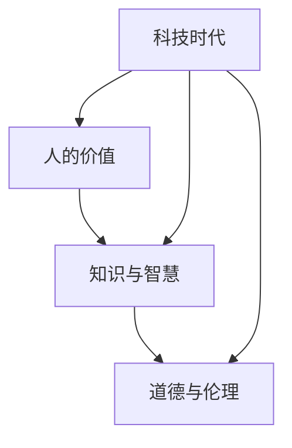

                 

### 文章标题：新人文主义：科技时代的人文关怀

**关键词**：新人文主义、科技时代、人文关怀、伦理问题、人文教育、可持续发展

**摘要**：本文旨在探讨新人文主义在科技时代的重要性和实践路径。通过分析新人文主义的定义、核心思想，以及科技时代下的人文关怀，本文提出新人文主义对未来的展望，并探讨其实践案例。文章旨在为科技时代下的人文关怀提供理论指导和实践借鉴。

----------------------------------------------------------------### 第一部分：新人文主义概述

#### 1.1 新人文主义的定义与起源

新人文主义是一种在科技时代背景下兴起的思想体系，它将人文主义与科技进步相结合，强调人类价值、知识与智慧、道德与伦理。其定义可以表示为：

$$
\text{新人文主义} = \text{人文主义} + \text{科技时代}
$$

人文主义起源于古希腊，强调人的价值和尊严，提倡人的全面发展。而科技时代则是以计算机、互联网、人工智能等科技革命为标志的时代。

#### 1.1.2 人文主义的演变

人文主义在历史的发展过程中经历了多个阶段，从古希腊的哲学思考，到文艺复兴时期的人文主义，再到现代人文主义的复兴，每一个阶段都有其独特的特点和贡献。

- 古希腊人文主义：以苏格拉底、柏拉图和亚里士多德为代表的哲学家，强调人的理性、智慧和自由。
- 文艺复兴人文主义：以但丁、彼特拉克、薄伽丘等人为代表的文学家，强调人的尊严、人文精神和审美情趣。
- 现代人文主义：以罗素、萨特等人为代表的哲学家，强调人的自由、平等和人权。

#### 1.1.3 新人文主义的兴起背景

新人文主义的兴起背景主要有以下几个方面：

1. **科技进步**：计算机、互联网、人工智能等科技的快速发展，改变了人类的生产和生活方式，引发了人类对科技伦理、人机关系等问题的新思考。
2. **社会问题**：全球化、环境污染、贫富差距等问题，使人们对科技发展带来的负面影响有了更深的认识，呼唤人文关怀。
3. **人文精神的复兴**：随着科技的发展，人类对人文精神的需求日益增长，希望科技能够为人类带来更大的福祉，而不是成为威胁人类生存的力量。

#### 1.2 新人文主义的核心思想

新人文主义的核心思想包括以下几个方面：

1. **人的价值**：新人文主义认为，人是宇宙的中心，具有无限的潜力和价值。科技的发展应当服务于人类，提升人类的生活质量和幸福感。
2. **知识与智慧**：新人文主义强调知识的积累和智慧的运用，认为人类应当通过学习、探索和思考，不断丰富自己的知识和智慧。
3. **道德与伦理**：新人文主义主张科技发展应遵循道德原则和伦理规范，防止科技滥用和伦理灾难。

通过以上分析，我们可以看出新人文主义在科技时代的重要性。它不仅为我们提供了思考科技与人文关系的新视角，也为我们在科技发展过程中如何保持人文关怀提供了理论指导。

### 图：新人文主义核心概念联系

在上图中，我们可以看到新人文主义的核心概念——人的价值、知识与智慧、道德与伦理，是如何在科技时代背景下相互联系的。

#### 1.3 新人文主义对科技发展的意义

新人文主义对科技发展的意义在于，它提醒我们在追求科技进步的过程中，不应忽视人文关怀。以下是一些具体的意义：

1. **促进科技伦理**：新人文主义强调道德与伦理，有助于我们在科技发展过程中遵循伦理规范，避免科技滥用。
2. **提升人的素质**：新人文主义强调人的价值和智慧，有助于我们在科技时代提升自己的综合素质，更好地适应科技发展的需求。
3. **实现可持续发展**：新人文主义关注人类的长远福祉，有助于我们在科技发展中实现可持续发展，为未来世代创造更好的生活环境。

总之，新人文主义在科技时代具有不可忽视的重要性。它不仅为我们在科技发展中提供了理论指导，也为我们在实践中保持人文关怀提供了精神支持。

---

在新人文主义的引导下，我们应当如何看待科技的发展？在接下来的部分，我们将进一步探讨科技时代下的人文关怀，分析科技对人文的影响，以及新人文主义如何回应这些问题。

---

#### 1.4 新人文主义的挑战与机遇

在科技时代，新人文主义面临着一系列挑战，同时也迎来了前所未有的机遇。

**挑战：**

1. **信息过载**：随着互联网和人工智能的发展，人们面临的信息量日益增加，如何筛选和处理这些信息，保持清晰的思维，成为新人文主义面临的挑战。
2. **隐私问题**：大数据和人工智能技术的广泛应用，使得个人隐私受到严重威胁。如何保护个人隐私，成为新人文主义需要解决的问题。
3. **科技霸权**：一些国家或企业通过科技手段实现霸权主义，侵害他国利益，新人文主义需要反对这种不公平现象。

**机遇：**

1. **知识共享**：互联网和人工智能技术的发展，使得知识的传播和共享变得更加便捷，新人文主义可以借此推动全球范围内的知识共享。
2. **人文科技的融合**：人文与科技的融合，可以创造出更多有益于人类的新产品和新服务，如人工智能助手、智能教育系统等。
3. **全球合作**：新人文主义倡导全球合作，有助于各国在科技发展中共同面对挑战，实现共同发展。

**应对策略：**

1. **加强人文教育**：通过加强人文教育，提高人们的综合素质和道德素养，以应对信息过载和隐私问题。
2. **制定科技伦理规范**：制定明确的科技伦理规范，约束科技企业和社会的行为，防止科技滥用。
3. **推动全球合作**：加强国际交流与合作，共同应对全球性科技挑战。

总之，新人文主义在科技时代的挑战与机遇并存。我们应当积极应对挑战，把握机遇，以实现科技与人文的和谐发展。

---

通过以上分析，我们可以看到新人文主义在科技时代的重要性和挑战。接下来，我们将深入探讨科技时代下的人文关怀，分析科技对人文的影响，以及新人文主义如何回应这些问题。

---

### 2.1 科技对人文的影响

科技的发展对人文产生了深远的影响，这些影响既包括积极的方面，也有消极的方面。

**积极影响：**

1. **知识传播**：互联网和人工智能技术的发展，极大地促进了知识的传播和共享。人们可以轻松地获取全球范围内的信息，学习新知识，提高自己的素质。
2. **教育变革**：在线教育、虚拟现实等新技术，为教育带来了新的变革。学生可以更加灵活地选择学习方式，教师可以更加有效地传授知识，从而提高教育质量。
3. **医疗进步**：医疗技术的进步，如基因编辑、人工智能辅助诊断等，为人类健康带来了巨大的福音。这些技术可以提前预测疾病风险，提高治疗成功率。

**消极影响：**

1. **隐私侵犯**：大数据和人工智能技术的广泛应用，使得个人隐私受到严重威胁。个人的信息可能被滥用，导致隐私泄露。
2. **社会隔离**：互联网和社交媒体的普及，虽然促进了人际交流，但也加剧了社会隔离。许多人沉迷于虚拟世界，忽视了现实生活中的交往和沟通。
3. **科技依赖**：随着科技的进步，人们对科技的依赖日益加深。一旦科技出现问题，人们可能会陷入困境，无法正常生活。

**科技对人文的影响分析：**

1. **知识传播**：科技的发展，使得知识的获取变得更加便捷。人们可以通过互联网、智能手机等设备，随时随地获取所需的信息。这不仅提高了知识传播的效率，也使得知识更加普及。
2. **教育变革**：科技的发展，改变了教育的形式和内容。在线教育平台的出现，使得学习者可以更加灵活地选择学习时间和地点。虚拟现实技术的应用，使得学习者可以身临其境地体验学习内容，提高学习效果。
3. **医疗进步**：科技的发展，使得医疗技术得到了极大的提升。例如，基因编辑技术可以精确地修改基因序列，治疗遗传疾病；人工智能辅助诊断可以更快、更准确地诊断疾病，提高治疗效果。

总的来说，科技对人文的影响是双重的。在享受科技带来的便利和进步的同时，我们也需要警惕科技可能带来的负面影响，并积极采取措施应对这些挑战。

### 2.2 新人文主义对科技时代的回应

在面对科技时代的挑战时，新人文主义提出了一系列回应措施，旨在保持人文关怀，促进科技与人文的和谐发展。

**人文教育的重要性**

新人文主义认为，人文教育是培养人类综合素质和道德素养的关键。在科技时代，人文教育应当注重以下几个方面：

1. **跨学科融合**：科技的发展，使得不同学科之间的界限日益模糊。人文教育应当鼓励学生跨学科学习，培养他们的综合素养和创新能力。
2. **道德教育**：在科技时代，道德教育尤为重要。学生应当了解科技伦理，明确科技的应用边界，避免科技滥用。
3. **审美教育**：审美教育有助于培养人的审美情趣和创造力。在科技时代，审美教育应当与科技相结合，培养学生对科技美学的理解和欣赏能力。

**人文主义价值观的传承**

新人文主义强调人文主义价值观的传承，认为这些价值观是人类文明的重要基石。在科技时代，应当注重以下几个方面：

1. **人权保障**：科技的发展，使得人权保障面临新的挑战。例如，隐私权、知情权等。新人文主义主张在科技发展中，应当尊重和保障人权。
2. **公平正义**：科技的发展，可能会加剧贫富差距和社会不公平。新人文主义主张在科技发展中，应当追求公平正义，减少社会不平等。
3. **可持续发展**：新人文主义主张科技发展应当符合可持续发展的原则，即在满足当前需求的同时，不损害未来世代的需求。

**人文关怀在科技领域的应用**

新人文主义认为，人文关怀应当贯穿于科技领域的各个方面。以下是一些具体的实践措施：

1. **科技伦理审查**：在科技研发和应用过程中，应当进行严格的伦理审查，确保科技的发展符合伦理原则。
2. **人文科技产品研发**：科技企业应当注重人文科技产品的研发，这些产品应当能够提高人们的生活质量，促进人类福祉。
3. **人文科技教育**：科技教育和培训应当注重人文关怀，培养学生的人文素养和道德观念。

**案例：科技与人文的融合**

以下是一些具体的案例，展示了新人文主义在科技时代如何回应挑战：

1. **智能家居**：智能家居技术的发展，使得人们的生活更加便捷。但同时，也引发了对隐私保护和科技依赖的担忧。新人文主义主张在智能家居产品的设计和应用中，应当充分考虑用户隐私保护和科技依赖问题。
2. **人工智能伦理**：人工智能技术的发展，使得机器能够模拟人类思维和行为。但同时，也引发了对人工智能伦理问题的关注。新人文主义主张在人工智能的研发和应用中，应当遵循伦理原则，确保人工智能的发展符合人类的利益。
3. **在线教育**：在线教育技术的发展，使得教育更加普及和灵活。但同时，也引发了对教育公平和教育质量的担忧。新人文主义主张在线教育应当注重教育质量和公平，确保每个学生都能享受到优质的教育资源。

总的来说，新人文主义在科技时代具有重要的回应措施。通过加强人文教育、传承人文主义价值观、注重人文关怀在科技领域的应用，新人文主义为科技与人文的和谐发展提供了理论指导和实践路径。

---

#### 2.3 新人文主义对未来的展望

新人文主义在未来的发展中，将继续扮演重要角色，为科技与人文的和谐发展提供理论指导和实践路径。以下是对新人文主义未来的展望：

**科技与人文的和谐发展**

新人文主义主张科技与人文的和谐发展，认为科技应当服务于人类，提升人类的生活质量和幸福感。在未来，科技的发展将继续与人文关怀相结合，实现以下目标：

1. **提高生活质量**：科技的发展将进一步提升人类的生活质量，为人们带来更多的便利和舒适。例如，智能医疗、智能家居、智慧城市等技术的应用，将使人们的生活更加便捷和美好。
2. **促进社会进步**：科技的发展将推动社会进步，解决人类面临的一系列问题。例如，人工智能、大数据等技术的应用，将有助于提高社会管理水平，优化资源配置，减少贫困和环境污染。
3. **增强人文关怀**：科技的发展将增强人文关怀，促进人类的精神和文化发展。例如，虚拟现实、增强现实等技术的应用，将使人们能够更好地体验文化和艺术，增强人文素养。

**人类的可持续发展**

新人文主义强调人类的可持续发展，认为科技发展应当遵循可持续发展的原则，即在满足当前需求的同时，不损害未来世代的需求。在未来，人类的可持续发展将得到进一步加强，具体体现在以下几个方面：

1. **环境保护**：科技的发展将推动环境保护，减少对自然资源的消耗和污染。例如，清洁能源技术的应用，将有助于减少温室气体排放，保护地球生态环境。
2. **资源节约**：科技的发展将促进资源的节约和合理利用，提高资源利用效率。例如，循环经济、绿色制造等技术的应用，将有助于减少资源浪费，提高资源利用效率。
3. **社会公平**：科技的发展将促进社会公平，减少贫富差距和社会不平等。例如，科技扶贫、教育信息化等技术的应用，将有助于提高贫困地区和群体的生活质量，实现社会公平。

**新人文主义的全球影响力**

新人文主义将在全球范围内发挥越来越大的影响力，推动全球科技与人文的和谐发展。以下是一些具体的趋势：

1. **全球合作**：新人文主义主张全球合作，共同应对科技发展带来的挑战。在未来，全球各国将加强科技与人文领域的交流与合作，共同推动科技与人文的和谐发展。
2. **跨学科研究**：新人文主义将推动跨学科研究，促进不同学科之间的融合。在未来，人类学家、社会学家、心理学家、计算机科学家等不同领域的专家将共同研究科技与人文的关系，提出更加全面和深入的理论。
3. **全球教育**：新人文主义将推动全球教育的发展，促进全球范围内的人文教育。在未来，各国将加强人文教育的合作与交流，共同培养具有全球视野和人文素养的人才。

总之，新人文主义在未来的发展中，将继续为科技与人文的和谐发展提供理论指导和实践路径。通过加强人文教育、传承人文主义价值观、注重人文关怀在科技领域的应用，新人文主义将为人类的可持续发展做出重要贡献。

### 3.1 新人文主义实践案例

新人文主义在各个领域的实践案例，为我们提供了宝贵的经验和启示。以下是一些具体的实践案例：

#### 3.1.1 教育领域的新人文主义实践

**案例1：人文课程设置**

在高校教育中，新人文主义倡导在课程设置中融入人文课程，以培养学生的综合素质和道德观念。例如，清华大学在计算机科学专业中设置了《人工智能伦理学》课程，帮助学生了解人工智能的应用伦理和道德问题。

**案例2：人文教育改革**

一些学校进行了人文教育改革，通过创新教学方法，提高学生的人文素养。例如，美国的一些大学采用了项目式学习（Project-Based Learning），鼓励学生在实际项目中运用人文知识和技能，提高解决实际问题的能力。

#### 3.1.2 社会服务领域的新人文主义实践

**案例1：人文关怀项目**

在一些社区服务项目中，新人文主义理念得到了广泛应用。例如，中国的“乡村教师支持计划”旨在通过提供人文教育，提高乡村教师的教学水平，从而提升乡村教育质量。

**案例2：文化传承项目**

一些社会服务项目致力于保护和传承文化遗产。例如，中国的“数字故宫”项目，通过虚拟现实技术和人工智能技术，向公众展示故宫的文化遗产，提高人们的文化素养。

#### 3.1.3 科技企业领域的新人文主义实践

**案例1：企业文化建设**

一些科技企业注重企业文化建设，强调人文关怀。例如，谷歌在其企业文化中融入了“不作恶”的理念，旨在确保科技发展符合伦理规范。

**案例2：人文科技产品研发**

一些科技企业致力于研发人文科技产品，以提升人类的生活质量和幸福感。例如，微软的“未来智能”项目，旨在通过人工智能技术，提高人类的工作效率和生活品质。

通过以上实践案例，我们可以看到新人文主义在不同领域的具体应用，这些实践不仅提高了人们的人文素养，也为科技与人文的和谐发展提供了有力支持。

### 3.2 新人文主义的挑战与未来

#### 3.2.1 新人文主义的挑战

尽管新人文主义在科技时代具有重要意义，但其发展仍面临一系列挑战。

**1. 科技发展的速度**

科技发展的速度非常快，使得人文关怀难以跟上。例如，人工智能和大数据技术的快速进步，带来了隐私侵犯、就业替代等问题，需要新人文主义提供相应的伦理指导和解决方案。

**2. 社会变革的压力**

全球化和数字化进程加快，社会结构和价值观发生变化，对新人文主义提出了新的要求。例如，数字鸿沟、文化冲突等问题，需要新人文主义提供跨文化理解和包容性指导。

**3. 文化的多样性**

不同文化背景下的人文关怀需求各不相同，如何在全球范围内推广新人文主义理念，使其适应各种文化环境，是一个巨大的挑战。

#### 3.2.2 新人文主义的发展趋势

面对这些挑战，新人文主义的发展趋势表现出以下几个方向：

**1. 跨学科融合**

新人文主义强调跨学科研究，促进人文与科技的融合。例如，人类学、社会学、心理学等学科与计算机科学、工程学等领域的交叉研究，将有助于解决科技发展带来的伦理和社会问题。

**2. 全球合作**

新人文主义倡导全球合作，通过国际合作，共同应对全球性挑战。例如，联合国教科文组织等国际组织正在推动全球科技伦理标准的制定，促进各国在科技发展中的协调与合作。

**3. 数字人文的发展**

数字人文技术的发展，为人文关怀提供了新的工具和平台。例如，通过大数据分析和人工智能技术，可以更好地了解人类行为和文化，为新人文主义提供数据支持和决策依据。

#### 3.2.3 新人文主义的未来展望

展望未来，新人文主义将继续在以下几个方面发挥作用：

**1. 促进科技伦理**

新人文主义将推动科技伦理的发展，确保科技发展符合道德原则，防止科技滥用。

**2. 提升人文素养**

新人文主义将致力于提升人类的人文素养，培养具有跨文化理解能力和道德观念的人才。

**3. 实现可持续发展**

新人文主义将推动科技与人文的和谐发展，实现人类的可持续发展。

总之，新人文主义在科技时代具有重要的地位和作用。通过应对挑战、把握发展趋势，新人文主义将为人类的未来做出更大贡献。

### 4.1 新人文主义的挑战与未来

**4.1.1 新人文主义的挑战**

新人文主义在科技时代面临着一系列挑战，这些挑战主要来自以下几个方面：

1. **技术发展的速度**：科技的发展日新月异，往往超出人文关怀的跟进能力。例如，人工智能、大数据等技术的快速发展，带来了隐私侵犯、就业替代等问题，这些挑战需要新人文主义提供有效的伦理指导和解决方案。

2. **社会变革的压力**：全球化、数字化进程加速，社会结构和价值观发生深刻变化。如何在新的人文背景下进行人文关怀，如何在不同文化背景下实现人文价值的共识，是一个严峻的挑战。

3. **文化的多样性**：不同地区和国家的文化背景各异，如何在全球范围内推广新人文主义理念，使其适应各种文化环境，是一个复杂的问题。

4. **资源限制**：新人文主义的推广和实践需要大量的人力、物力和财力支持，而在资源有限的情况下，如何有效地分配和利用这些资源，也是一个亟待解决的问题。

**4.1.2 新人文主义的发展趋势**

为了应对这些挑战，新人文主义的发展趋势表现出以下几个方向：

1. **跨学科融合**：新人文主义强调跨学科研究，促进人文与科技的融合。例如，人类学、社会学、心理学等学科与计算机科学、工程学等领域的交叉研究，有助于解决科技发展带来的伦理和社会问题。

2. **全球合作**：新人文主义倡导全球合作，通过国际合作，共同应对全球性挑战。例如，联合国教科文组织等国际组织正在推动全球科技伦理标准的制定，促进各国在科技发展中的协调与合作。

3. **数字人文的发展**：数字人文技术的发展，为人文关怀提供了新的工具和平台。例如，通过大数据分析和人工智能技术，可以更好地了解人类行为和文化，为新人文主义提供数据支持和决策依据。

**4.1.3 新人文主义的未来展望**

展望未来，新人文主义将在以下几个方面发挥重要作用：

1. **促进科技伦理**：新人文主义将推动科技伦理的发展，确保科技发展符合道德原则，防止科技滥用。

2. **提升人文素养**：新人文主义将致力于提升人类的人文素养，培养具有跨文化理解能力和道德观念的人才。

3. **实现可持续发展**：新人文主义将推动科技与人文的和谐发展，实现人类的可持续发展。

总之，新人文主义在科技时代面临着诸多挑战，但同时也拥有广阔的发展前景。通过不断创新和适应，新人文主义将为人类的未来做出更大的贡献。

### 附录

#### 附录 A：新人文主义相关资源

**A.1 学术文献**

1. Habermas, J. (1991). The Structural Transformation of the Public Sphere: An Inquiry into a Category of bourgeois society. MIT Press.
2. Nussbaum, M. C. (2010). Not for Profit: Why Democracy Needs the Humanities. Princeton University Press.
3. Fukuyama, F. (2006). Our Posthuman Future: Consequences of the Biotechnology Revolution. Farrar, Straus and Giroux.

**A.2 书籍推荐**

1. Turing, A. (2015). The Imitation Game. Allen & Unwin.
2. Heidegger, M. (1962). Being and Time. Blackwell.
3. Camus, A. (1951). The Stranger. New Directions Publishing.

**A.3 网络资源**

1. The Human Condition: A Discussion on Humanity and Technology (<https://www.thehumancondition.org/>)
2. The Center for the Study of the Public Domain (<https://www.copyright.cornell.edu/public_domain/>)
3. The International Network for Digital Humanities (<https://networked digitalehumanities.org/>)

通过这些学术文献、书籍和网络资源，读者可以进一步了解新人文主义的理论基础和实践路径。

### 附录 B：新人文主义实践案例汇总

**B.1 教育领域案例**

1. **清华大学人文与社会科学学院**：清华大学人文与社会科学学院致力于将人文教育与科技教育相结合，开设了包括《人工智能伦理学》等跨学科课程，培养学生的综合素质和道德观念。
2. **美国斯坦福大学人文科学中心**：斯坦福大学人文科学中心通过跨学科项目，鼓励学生在科技与人文领域进行深入研究，促进科技与人文的融合。

**B.2 社会服务领域案例**

1. **中国乡村教师支持计划**：该项目通过提供人文教育资源和培训，提高乡村教师的教学水平，从而提升乡村教育质量。
2. **联合国教科文组织数字文化遗产项目**：该项目利用数字人文技术，保护和传承世界各地的文化遗产，提高公众的文化素养。

**B.3 科技企业领域案例**

1. **谷歌“不作恶”企业文化**：谷歌在其企业文化中融入了“不作恶”的理念，强调科技发展应遵循伦理原则，防止科技滥用。
2. **微软“未来智能”项目**：微软通过“未来智能”项目，研发人文科技产品，如智能助手、虚拟现实教育系统等，提升人类的生活质量和幸福感。

这些案例展示了新人文主义在不同领域的具体应用和实践，为科技与人文的和谐发展提供了有力支持。

