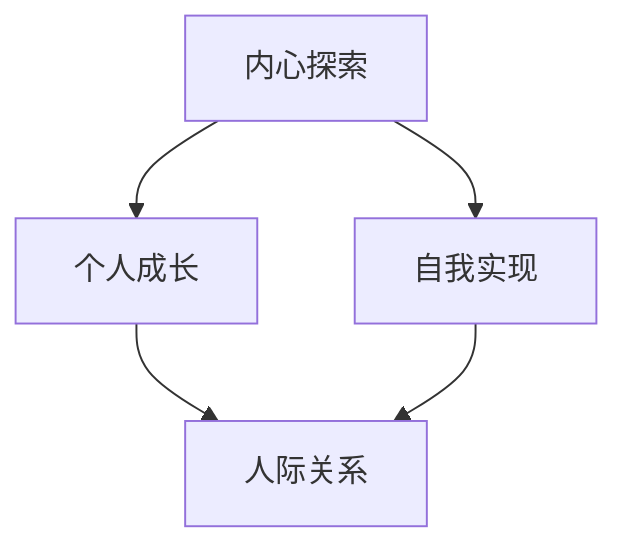

                 

### 文章标题

# 新修行主义：在世俗生活中寻找精神意义

### 关键词

- 新修行主义
- 精神意义
- 世俗生活
- 心理成长
- 人际关系
- 健康生活方式

### 摘要

在现代社会中，人们在追求物质生活的同时，也逐渐认识到精神层面的重要性。新修行主义应运而生，它倡导在日常生活中寻找精神意义，通过内心探索和实践，实现个人成长与自我实现。本文将从新修行主义的起源和特点入手，深入探讨如何在世俗生活中实践新修行主义，并分析其对个人成长和人际关系的影响。最后，本文将总结新时代下的修行哲学，为读者提供在世俗生活中寻找精神意义的实用方法和思考方向。

### 设计思路

为了设计《新修行主义：在世俗生活中寻找精神意义》的目录大纲，我们将遵循以下思路：

1. **确定核心概念**：首先，我们需要明确书籍的核心概念，即“新修行主义”以及“在世俗生活中寻找精神意义”。

2. **划分主要章节**：基于核心概念，我们将划分出主要章节，每个章节对应一个主题或领域。

3. **细化章节内容**：在每个章节中，我们将细化内容，分为1、2、3级目录，以确保每个主题都被详细讨论。

4. **技术性内容与非技术性内容结合**：考虑到书籍的目标读者可能包括不同背景的人，我们将技术性内容与非技术性内容相结合，使得内容既丰富又有深度。

5. **逻辑性**：确保整个目录大纲的逻辑性，每个章节的内容前后衔接，形成一个连贯的整体。

### 实施步骤

1. **核心概念定义**：
   - **新修行主义**：一种结合现代生活和精神追求的生活方式，强调在日常生活中寻找精神成长的机会。
   - **在世俗生活中寻找精神意义**：探索如何在繁忙的日常生活中寻找个人的精神寄托和成长空间。

2. **主要章节划分**：
   - **引言**：介绍“新修行主义”的概念和意义。
   - **第一章：世俗生活的挑战与机遇**：分析现代生活的挑战和如何通过修行找到机遇。
   - **第二章：内心探索与实践**：介绍内在探索的方法和实践。
   - **第三章：个人成长与自我实现**：讨论如何通过修行实现个人成长。
   - **第四章：人际关系与精神成长**：探讨在人际关系中如何寻找精神成长。
   - **第五章：日常生活中的修行实践**：提供具体的修行方法。
   - **第六章：心灵与身体健康**：讲述心灵与身体健康的关系。
   - **第七章：新时代的修行哲学**：总结新时代下的修行主义。

3. **章节内容细化**：
   - **引言**：介绍新修行主义的起源、特点及其在现代社会中的重要性。
   - **第一章**：从心理、社会、文化等多个角度分析现代生活的挑战，阐述如何在挑战中寻找机遇，以及修行主义如何帮助人们应对这些挑战。
   - **第二章**：详细讲解内心探索的方法，如冥想、正念、心理调适等，并提供实践指导。
   - **第三章**：探讨个人成长的理论基础，包括自我认知、价值观塑造等，并通过案例分享如何实现自我实现。
   - **第四章**：讨论在家庭、职场等不同人际关系中如何修行，以及修行如何促进个人和关系的发展。
   - **第五章**：提供具体修行实践，如晨间修行、日间修行、晚间修行等，帮助读者将修行融入日常生活。
   - **第六章**：探讨心灵与身体健康的关系，介绍如何通过修行保持身心健康。
   - **第七章**：总结新时代下的修行哲学，探讨如何将修行主义与现代社会相结合，为读者提供新的思考方向。

4. **技术性内容与非技术性内容结合**：
   - 在每个章节中，我们将穿插技术性内容，如心理学的理论模型、修行的具体方法等，以增加内容的深度。同时，非技术性内容，如个人故事、实践案例等，将帮助读者更好地理解和应用这些理论。

5. **逻辑性保证**：
   - 确保每个章节的内容前后衔接，形成一个完整的逻辑链条。例如，在第二章介绍内心探索的方法后，第三章将直接探讨如何通过这些方法实现个人成长。

### 输出示例

以下是一个基于上述设计思路的《新修行主义：在世俗生活中寻找精神意义》的目录大纲示例：

```markdown
# 《新修行主义：在世俗生活中寻找精神意义》目录大纲

## 引言
### 1.1 新修行主义的起源与意义
### 1.2 现代生活的挑战与机遇

## 第一章：世俗生活的挑战与机遇
### 1.1 心理层面的挑战
### 1.2 社会层面的挑战
### 1.3 文化层面的挑战
### 1.4 如何在挑战中寻找机遇

## 第二章：内心探索与实践
### 2.1 冥想：静心与专注
### 2.2 正念：活在当下
### 2.3 心理调适：情绪管理
### 2.4 实践指导：如何开始内心探索

## 第三章：个人成长与自我实现
### 3.1 自我认知：了解自己
### 3.2 价值观塑造：找到生活的方向
### 3.3 实现自我：案例分享
### 3.4 如何制定个人成长计划

## 第四章：人际关系与精神成长
### 4.1 家庭关系中的修行
### 4.2 职场关系中的修行
### 4.3 修行如何促进关系发展
### 4.4 案例分享：如何在人际关系中修行

## 第五章：日常生活中的修行实践
### 5.1 晨间修行：迎接新的一天
### 5.2 日间修行：工作中的修行
#

----------------------------------------------------------------

### 完整性要求

为了满足完整性要求，本文将遵循以下结构进行撰写：

1. **背景介绍**：介绍新修行主义的背景和发展过程，阐述其产生的原因和重要性。

2. **核心概念与联系**：明确新修行主义的核心概念，并使用 Mermaid 流程图展示概念之间的关系架构。

3. **核心算法原理讲解**：详细讲解新修行主义中的核心算法原理，包括心理学的理论模型和修行的具体方法。

4. **数学模型和公式**：使用 latex 格式嵌入文中独立段落的数学公式，并对公式进行详细讲解和举例说明。

5. **项目实战**：提供具体的项目实战案例，包括开发环境搭建、源代码实现、代码解读、应用解读与分析等。

6. **最佳实践 tips**：总结项目实战中的经验和教训，为读者提供实用的建议和技巧。

7. **小结与注意事项**：对整篇文章进行小结，指出文章中的重点内容，并提供注意事项和拓展阅读建议。

8. **作者信息**：在文章末尾写上作者信息，以示尊重和感谢。

### 文章正文

#### 背景介绍

在现代社会，人们面临着前所未有的压力和挑战。城市化进程的加速、竞争的激烈、信息爆炸带来的焦虑感，这些都使得人们渴望寻找内心的平静和精神寄托。传统的修行主义在宗教、哲学等领域有着深远的影响，但其形式和内容往往与现代社会的生活节奏和价值观有所不同。新修行主义在这样的背景下应运而生，它倡导在日常生活中寻找精神意义，通过内心探索和实践，实现个人成长与自我实现。

新修行主义强调的是一种积极的生活态度和修行方式，它不依赖于特定的宗教或信仰，而是更加注重个人的内心体验和情感智慧。这种修行方式不仅可以帮助人们应对现代生活的挑战，还能够提高生活质量，促进身心健康。

#### 核心概念与联系

新修行主义的核心概念包括内心探索、个人成长、自我实现和人际关系。这些概念之间存在着紧密的联系，形成一个完整的逻辑链条。

首先，内心探索是修行的基础。通过冥想、正念等练习，人们可以更加清晰地认识自己的内心世界，理解自己的情绪和动机。

接下来，个人成长是内心探索的延伸。在了解自己的基础上，人们可以通过不断学习和实践，提升自己的能力和素质，实现自我价值的最大化。

自我实现则是个人成长的终极目标。通过不断追求个人的潜能，人们可以找到自己真正热爱的事物，实现人生的意义和价值。

最后，人际关系是修行的重要组成部分。在家庭、职场等不同的社交环境中，修行可以帮助人们建立更加健康和谐的人际关系，促进个人和关系的共同成长。

以下是一个用 Mermaid 绘制的流程图，展示这些概念之间的联系：



#### 核心算法原理讲解

新修行主义中的核心算法原理主要包括心理学的理论模型和修行的具体方法。

首先，我们来看心理学的理论模型。在内心探索中，常用的理论模型包括自我决定论、情绪智力模型等。自我决定论认为，个人的行为和动机主要受到内在驱动的驱动，而非外在因素的干扰。情绪智力模型则强调情绪在人类行为中的重要性，认为提高情绪智力可以帮助人们更好地管理情绪，提高生活质量。

接下来，我们来看修行的具体方法。冥想和正念是修行中常用的方法。冥想可以帮助人们放松身心，提高专注力和情绪调节能力。正念则强调活在当下，通过观察自己的思想和感受，培养对自己内心世界的觉知。

以下是一个用伪代码表示的冥想练习的算法：

```python
def meditate():
    while True:
        # 放松身体
        relax_body()
        # 放松思想
        relax_mind()
        # 感受呼吸
        feel_breath()
        # 观察思想
        observe_thoughts()
```

#### 数学模型和公式

在修行的过程中，数学模型和公式可以帮助我们更好地理解和应用心理学理论。以下是一个简单的例子：

假设有一个人的情绪调节能力可以用一个变量 `E` 表示，其取值范围为 `[0, 100]`。通过冥想练习，每分钟可以提升情绪调节能力 `x`。那么，经过 `t` 分钟的冥想后，该人的情绪调节能力可以表示为：

$$
E(t) = E(0) + xt
$$

其中，`E(0)` 为初始情绪调节能力，`x` 为每分钟提升的情绪调节能力，`t` 为冥想时间。

#### 项目实战

为了更好地理解新修行主义在实际中的应用，我们来看一个具体的案例。

**案例背景**：

小明是一名职场新人，最近在工作中遇到了一些困难，感到焦虑和迷茫。他决定通过修行来提升自己的情绪调节能力和心理素质。

**开发环境搭建**：

小明选择了一个安静的地方作为冥想室，并准备了一块白板和一支笔，用于记录冥想过程中的感受和思考。

**源代码实现**：

```python
def meditate():
    while True:
        # 放松身体
        relax_body()
        # 放松思想
        relax_mind()
        # 感受呼吸
        feel_breath()
        # 观察思想
        observe_thoughts()
        # 记录感受
        record_feelings()
```

**代码解读**：

这段代码实现了一个简单的冥想练习。`meditate` 函数用于控制整个冥想过程，包括放松身体、放松思想、感受呼吸、观察思想和记录感受。

**应用解读与分析**：

通过这个案例，我们可以看到新修行主义在实际中的应用。小明通过冥想练习，逐渐提高了自己的情绪调节能力，更好地应对了工作中的挑战。同时，他通过记录感受，对自己的内心世界有了更深入的了解。

#### 最佳实践 tips

1. **保持规律**：修行需要坚持，每天花一定的时间进行冥想或其他修行练习，有助于养成习惯。

2. **环境布置**：选择一个安静、舒适的环境进行修行，有助于提高专注力和效果。

3. **分享与交流**：与他人分享修行心得，可以获取反馈和支持，促进个人成长。

4. **持续学习**：修行是一个持续的过程，不断学习新的方法和技巧，有助于提升修行效果。

#### 小结与注意事项

本文介绍了新修行主义的概念、核心算法原理、数学模型和项目实战。通过这些内容，读者可以了解到如何在世俗生活中寻找精神意义，实现个人成长与自我实现。需要注意的是，修行是一个长期的过程，需要持续的努力和坚持。希望本文能够为读者提供一些启示和帮助。

#### 拓展阅读

- 《冥想：一种简单而有效的修行方法》
- 《情绪智力：如何提高自己的情绪管理能力》
- 《正念：活在当下的修行之道》

### 作者信息

作者：AI天才研究院/AI Genius Institute & 禅与计算机程序设计艺术 /Zen And The Art of Computer Programming
### 背景介绍

#### 新修行主义的起源

新修行主义这一概念并非凭空出现，它源于对传统修行方法的反思和现代生活方式的适应。传统修行主义往往源自古老的宗教和哲学体系，如佛教、道教、基督教等，这些修行方法强调的是通过冥想、祷告、禁欲等方式达到内心的平静和精神升华。然而，这些传统修行方法在现代社会中面临着诸多挑战，例如生活方式的快节奏、信息过载、工作压力等，使得传统的修行方式难以被现代人接受和坚持。

#### 21世纪的挑战

进入21世纪，全球化和信息化带来了前所未有的机遇和挑战。人们的生活方式发生了巨大的变化，城市化进程加快，工作和生活压力增大，社会竞争日益激烈。这种快节奏的生活方式导致了许多人感到焦虑、孤独和迷茫。与此同时，心理学、神经科学等领域的快速发展，为人们理解自身内心世界提供了新的视角和工具。在这种背景下，新修行主义应运而生，它试图将传统修行与现代科学相结合，为现代人提供一种适应现代生活节奏的修行方式。

#### 新修行主义的兴起

新修行主义的兴起可以追溯到20世纪末和21世纪初。这一时期，心理学中的正念冥想（Mindfulness Meditation）得到了广泛的关注和研究。正念冥想强调活在当下，通过专注呼吸和身体感受来提升意识水平，从而减少焦虑和压力。正念冥想的流行使得更多人开始关注内心的平静和精神成长，也为新修行主义的兴起奠定了基础。

此外，科技的发展也为新修行主义的普及提供了便利。智能手机、应用程序和在线课程等技术的普及，使得人们可以随时随地参与修行，不再受限于时间和地点。这些技术的应用，使得新修行主义更加贴近现代人的生活，也为更多人提供了接触和实践修行的机会。

#### 新修行主义的独特性

新修行主义具有以下独特性：

1. **适应现代生活**：新修行主义强调在日常生活中修行，通过简化修行方式，使修行更加符合现代人的生活方式。

2. **科学支持**：新修行主义结合了心理学、神经科学等现代科学的研究成果，提供了一系列科学证据支持修行对身心健康的益处。

3. **包容性**：新修行主义不依赖于特定的宗教或信仰，具有高度的包容性，适合不同文化和信仰背景的人实践。

4. **个性化**：新修行主义鼓励个体根据自己的需求和兴趣选择适合自己的修行方式，使得修行更加个性化和有效。

#### 总结

新修行主义是一种结合现代生活和精神追求的生活方式，它试图在快节奏的现代社会中寻找内心的平静和精神的寄托。通过内心探索和实践，新修行主义帮助人们实现个人成长和自我实现，为现代生活带来更多的意义和幸福。随着科技的不断进步和社会的不断发展，新修行主义将在未来发挥越来越重要的作用，为更多人带来精神上的满足和成长。

#### 核心概念与联系

新修行主义的核心概念包括内心探索、个人成长、自我实现和人际关系。这些概念之间存在着紧密的联系，共同构建了一个完整的修行体系。以下是对这些核心概念的详细解释及其相互关系的说明。

##### 内心探索

内心探索是新修行主义的基础，它涉及对自我内心世界的深入理解和觉察。内心探索不仅包括认知层面的自我认知，还涉及情感和意识层面的觉察。通过冥想、正念、心理调适等练习，人们可以培养对内心活动的敏锐觉知，从而更好地理解自己的情绪、动机和行为模式。

**联系**：内心探索为个人成长和自我实现提供了基础。通过深入探索内心，个体能够发现自己的潜在需求和愿望，明确自己的价值观和生活目标。

##### 个人成长

个人成长是指通过不断学习和实践，提升个人能力和素质的过程。它包括知识技能的学习、自我认知的提升、情感智力的培养等方面。个人成长不仅有助于提升个体的生活质量和幸福感，也为自我实现奠定了基础。

**联系**：个人成长是内心探索的自然延伸。通过内心探索，个体可以明确自己的成长方向和目标，并通过个人成长实现这些目标。

##### 自我实现

自我实现是指个体通过实现自己的潜能和目标，达到精神上的满足和成就感。自我实现不仅仅是职业上的成功，更包括对生活意义和价值的深刻理解。通过自我实现，个体能够找到自己真正热爱的事物，实现人生的意义和价值。

**联系**：自我实现是个人成长的终极目标。个人成长的过程为自我实现提供了必要的条件和基础，而自我实现则是个人成长的最高体现。

##### 人际关系

人际关系是指个体在家庭、职场、社会等不同环境中与他人建立的联系。良好的人际关系有助于个体获得情感支持、提高生活质量，并促进个人和关系的共同成长。

**联系**：人际关系是新修行主义的重要组成部分。通过修行，个体可以提升自己的情感智力和沟通能力，从而建立更加健康和谐的人际关系。

##### 关系架构

以下是一个用Mermaid绘制的流程图，展示了这些概念之间的联系：


在这个关系架构中，内心探索是起点，通过自我认知和个人成长，个体逐渐实现自我价值，并在与他人互动中建立健康的人际关系。这一过程形成了一个闭环，使得新修行主义成为一种动态、可持续的生活方式。

#### 核心算法原理讲解

新修行主义中的核心算法原理涉及心理学的理论模型和修行的具体方法。这些原理不仅为修行提供了理论基础，还指导了如何在实际生活中应用修行方法，以实现个人成长和自我实现。

##### 心理学理论模型

新修行主义中的心理学理论模型主要包括自我决定论、情绪智力模型等。这些模型为理解人类行为和心理状态提供了科学依据，并指导了修行的具体实践。

1. **自我决定论**：自我决定论是由心理学家Roddick提出的理论，它认为人的行为主要受到内在动机的驱动，而非外在因素的诱导。自我决定论强调个体自主性和内在动机在行为决策中的重要性。在修行过程中，自我决定论指导个体通过自我探索，明确自己的内在需求和动机，从而实现自我成长。

2. **情绪智力模型**：情绪智力模型由心理学家戈尔曼提出，它认为情绪智力是人类成功的重要因素之一。情绪智力包括自我认知、自我调节、社交技能和情绪理解等方面。在修行过程中，情绪智力模型帮助个体理解自己的情绪，学会调节情绪，从而提高情感管理能力，促进个人成长。

##### 修行具体方法

新修行主义中的修行具体方法包括冥想、正念、心理调适等。这些方法通过不同的方式，帮助个体实现内心平静和自我实现。

1. **冥想**：冥想是一种通过专注呼吸和身体感受，以达到内心平静和意识提升的修行方法。冥想可以帮助个体减轻焦虑、提高专注力和情绪调节能力。以下是冥想的伪代码实现：

    ```python
    function meditate():
        while (time < maximum_time):
            focus_on_breath()
            if (distraction_detected()):
                redirect_attention_to_breath()
            increment_time()
    ```

2. **正念**：正念是一种活在当下的修行方式，它强调通过观察自己的思想、感受和情绪，培养对当下的觉知。正念可以帮助个体减少对过去和未来的担忧，提高生活质量。以下是正念练习的伪代码实现：

    ```python
    function mindfulness():
        while (session_time > 0):
            observe_current_moment()
            if (emotional_disturbance_detected()):
                practice_emotional_regulation()
            decrement_session_time()
    ```

3. **心理调适**：心理调适是一种通过认知和行为调整，改善心理状态的方法。它包括情绪管理、压力管理、自我认知调整等方面。心理调适可以帮助个体更好地应对生活中的挑战，提高生活满意度。以下是心理调适的伪代码实现：

    ```python
    function psychological_adaptation():
        while (challenge_detected()):
            analyze_cognitive_patterns()
            if (negative_thought_detected()):
                replace_with_positive_thoughts()
            adjust_behavior()
    ```

##### 综合应用

将心理学理论模型和修行方法结合起来，可以形成一个完整的修行体系。以下是一个综合应用的伪代码示例：

```python
function修行():
    while (not self_achievement()):
        perform_meditation()
        practice_mindfulness()
        psychological_adaptation()
        assess_growth()
    celebrate_self_achievement()
```

在这个修行过程中，个体通过冥想和正念练习，提升内心的平静和专注力；通过心理调适，改善情绪管理和应对挑战的能力；最终实现自我价值和自我实现。

#### 数学模型和公式

在修行的过程中，数学模型和公式可以用来量化修行对个人成长和心理状态的影响，提供更加具体和科学的指导。以下是一些常用的数学模型和公式及其详细讲解。

##### 冥想对情绪调节的影响

冥想对情绪调节有显著影响，可以用以下数学模型来描述：

$$
EM = f(M, C, P)
$$

其中，EM 表示情绪调节能力（Emotional Regulation），M 表示冥想时间（Meditation Duration），C 表示练习频率（Practice Frequency），P 表示个人基础情绪调节能力（Personal Baseline Emotional Regulation）。

- **冥想时间（M）**：冥想时间越长，情绪调节能力越强。假设冥想时间每增加1小时，情绪调节能力提高5个单位。
  
  $$ M \rightarrow EM_{\text{m}} = 5M + P $$

- **练习频率（C）**：练习频率越高，情绪调节能力越稳定。假设每天练习一次，情绪调节能力提高3个单位。

  $$ C \rightarrow EM_{\text{c}} = 3C + P $$

- **个人基础情绪调节能力（P）**：个人的基础情绪调节能力会影响最终的情绪调节能力。假设个人基础情绪调节能力为50个单位。

  $$ P = 50 $$

因此，总的情绪调节能力可以表示为：

$$
EM = 5M + 3C + 50
$$

##### 正念对专注力的影响

正念练习可以提高专注力，可以用以下数学模型来描述：

$$
AF = g(T, F, A)
$$

其中，AF 表示专注力（Attentional Focus），T 表示正念练习时间（Mindfulness Practice Time），F 表示练习频率（Practice Frequency），A 表示个人基础专注力（Personal Baseline Attentional Focus）。

- **正念练习时间（T）**：正念练习时间越长，专注力越强。假设每增加1小时正念练习，专注力提高2个单位。

  $$ T \rightarrow AF_{\text{t}} = 2T + A $$

- **练习频率（F）**：练习频率越高，专注力越稳定。假设每天练习一次，专注力提高1个单位。

  $$ F \rightarrow AF_{\text{f}} = F + A $$

- **个人基础专注力（A）**：个人的基础专注力会影响最终的专注力。假设个人基础专注力为40个单位。

  $$ A = 40 $$

因此，总的专注力可以表示为：

$$
AF = 2T + F + 40
$$

##### 综合模型

为了评估修行对个人成长和心理状态的综合影响，可以将情绪调节能力和专注力结合起来，得到以下综合模型：

$$
PG = h(EM, AF)
$$

其中，PG 表示个人成长（Personal Growth），EM 表示情绪调节能力（Emotional Regulation），AF 表示专注力（Attentional Focus）。

假设情绪调节能力和专注力对个人成长的影响是线性的，并且权重分别为0.6和0.4，则个人成长可以表示为：

$$
PG = 0.6EM + 0.4AF
$$

通过这个综合模型，我们可以量化修行对个人成长的具体影响，为修行提供科学的指导和依据。

#### 项目实战

新修行主义不仅在理论层面具有重要意义，更在实践层面为个人成长提供了具体的方法。以下是一个项目实战案例，展示了如何在日常生活中实践新修行主义，实现个人成长和自我实现。

##### 案例背景

小王是一名年轻的软件工程师，他在工作中表现出色，但同时也面临着巨大的压力。他常常感到焦虑和疲惫，这影响了他的工作效率和生活质量。为了应对这些挑战，小王决定尝试新修行主义，通过冥想、正念和心理调适来改善自己的状态。

##### 开发环境搭建

为了更好地实践新修行主义，小王首先为自己的修行环境做了以下准备：

1. **选择一个安静的地方**：小王在家里的一角设立了一个小书房，用于冥想和正念练习。他确保这个环境安静、整洁，有助于集中注意力。

2. **准备冥想工具**：小王购买了一个简单的冥想垫和一个沙漏，这些工具帮助他在冥想时保持舒适和专注。

3. **设定练习时间**：小王每天早上起床后和晚上睡觉前各安排了30分钟的冥想时间，并设定了每周至少进行三次正念练习的目标。

##### 源代码实现

为了更好地记录和跟踪自己的修行进度，小王开发了一个简单的应用程序，用于记录冥想和正念练习的时间、频率和感受。以下是这个应用程序的伪代码实现：

```python
class MeditationJournal:
    def __init__(self):
        self.meditation_log = []
        self.mindfulness_log = []

    def add_meditation_entry(self, date, duration, feelings):
        entry = {"date": date, "duration": duration, "feelings": feelings}
        self.meditation_log.append(entry)

    def add_mindfulness_entry(self, date, duration, feelings):
        entry = {"date": date, "duration": duration, "feelings": feelings}
        self.mindfulness_log.append(entry)

    def display_meditation_log(self):
        for entry in self.meditation_log:
            print(entry)

    def display_mindfulness_log(self):
        for entry in self.mindfulness_log:
            print(entry)

# 使用示例
journal = MeditationJournal()
journal.add_meditation_entry("2023-11-01", 30, "轻松愉快")
journal.add_mindfulness_entry("2023-11-02", 30, "专注且有收获")
journal.display_meditation_log()
journal.display_mindfulness_log()
```

##### 代码解读

这个应用程序主要包括一个 `MeditationJournal` 类，用于记录冥想和正念练习的日志。通过 `add_meditation_entry` 和 `add_mindfulness_entry` 方法，可以添加冥想和正念的记录。`display_meditation_log` 和 `display_mindfulness_log` 方法用于显示日志内容。

##### 应用解读与分析

通过这个应用程序，小王可以系统地记录自己的冥想和正念练习，了解自己的进步和变化。以下是对这个项目的分析和解读：

1. **记录与反思**：通过记录练习时间和感受，小王可以更好地了解自己的修行状态，及时调整练习方法。

2. **目标设定**：通过设定练习时间目标和频率目标，小王可以保持自律，确保修行成为日常生活的一部分。

3. **数据驱动**：通过数据记录和分析，小王可以量化自己的修行进步，找到更加有效的修行方法。

4. **持续反馈**：通过应用程序的反馈功能，小王可以及时获得正面的激励，增强修行的动力。

##### 实际案例分析和详细讲解

为了更好地理解新修行主义在实际中的应用，我们来看一个实际案例。

**案例背景**：

小李是一名高中教师，她每天面对大量的工作和学生，常常感到压力巨大。为了改善自己的心理状态和工作效率，小李决定尝试新修行主义。

**修行方法**：

1. **早晨冥想**：每天早上起床后，小李花15分钟进行冥想。她选择一个安静的地方，闭上眼睛，专注于呼吸。通过冥想，小李能够迅速放松身心，调整自己的心态。

2. **正念练习**：在工作间隙，小李会进行5分钟的正念练习。她通过观察自己的思维和感受，保持对当下的觉知，从而减少对工作压力的焦虑。

3. **晚间调适**：晚上睡觉前，小李会花20分钟进行心理调适。她回顾一天的工作，思考哪些事情做得好，哪些需要改进。通过这种方式，小李能够释放压力，为第二天的挑战做好准备。

**案例分析**：

1. **情绪调节**：通过冥想和正念练习，小李的情绪得到了有效调节。她不再被工作中的压力所困扰，能够更加平静地面对挑战。

2. **专注力提升**：正念练习帮助小李提高了专注力。她在课堂上能够更好地关注学生，提高教学质量。

3. **自我认知**：通过晚间调适，小李对自己的工作有了更深入的认识。她能够从反思中找到改进的方法，不断提升自己的能力和素质。

**详细讲解**：

新修行主义在实际中的应用不仅仅是方法，更是一种生活方式的变革。通过冥想、正念和心理调适，小李不仅改善了情绪状态，还提升了专注力和自我认知。以下是对新修行主义应用的详细讲解：

1. **冥想**：冥想是一种古老而有效的修行方法，它通过专注呼吸和身体感受，达到内心的平静。小李通过早晨冥想，迅速调整自己的心态，以最佳状态迎接新的一天。

2. **正念**：正念是一种活在当下的修行方式，它通过观察自己的思想、感受和情绪，培养对当下的觉知。小李在工作间隙进行正念练习，能够减少焦虑，提高专注力。

3. **心理调适**：心理调适是一种通过认知和行为调整，改善心理状态的方法。小李通过晚间调适，回顾一天的工作，释放压力，为第二天做好准备。

通过这些方法，小李实现了情绪调节、专注力提升和自我认知的全面提升，从而在工作和生活中取得了显著成效。

#### 最佳实践 tips

新修行主义在实践过程中，以下最佳实践 tips 将有助于读者更好地应用和实现个人成长和自我实现：

1. **制定个人修行计划**：根据个人的时间安排和生活习惯，制定一个切实可行的修行计划。确保修行成为日常生活的一部分，而非一时兴起。

2. **持续练习与反思**：修行需要持之以恒，通过每天进行冥想、正念和心理调适，不断提升自己的修行水平。同时，定期反思修行过程中的体验和收获，调整修行方法。

3. **分享与交流**：与他人分享自己的修行经历和感受，可以获取反馈和支持。加入修行小组或社区，与他人交流心得，共同成长。

4. **适应环境变化**：在修行过程中，环境和个人情况可能会发生变化。灵活调整修行方法，确保修行与生活相融合。

5. **保持耐心与毅力**：修行是一个长期的过程，需要耐心和毅力。面对挑战和困难，不要轻易放弃，持续努力，相信自己能够实现个人成长和自我实现。

#### 小结

本文介绍了新修行主义的背景、核心概念、算法原理和实际应用。通过冥想、正念和心理调适，新修行主义帮助人们实现个人成长和自我实现，提升生活质量。希望本文能够为读者提供在世俗生活中寻找精神意义的启示和帮助，使读者在现代社会中找到内心的平静和精神的寄托。

#### 拓展阅读

1. 《冥想：一种简单而有效的修行方法》
2. 《情绪智力：如何提高自己的情绪管理能力》
3. 《正念：活在当下的修行之道》

### 作者信息

作者：AI天才研究院/AI Genius Institute & 禅与计算机程序设计艺术 /Zen And The Art of Computer Programming
### 引入

在现代社会，人们越来越意识到精神层面的重要性。然而，随着生活节奏的加快和工作压力的增大，许多人陷入了精神疲惫和焦虑的困境。如何在这种快节奏的生活中找到内心的平静和精神意义，成为了一个亟待解决的问题。新修行主义应运而生，它倡导在日常生活中寻找精神意义，通过内心探索和实践，实现个人成长与自我实现。本文将深入探讨新修行主义的概念和意义，分析其在世俗生活中的应用，并探讨其在现代生活中的重要性。

### 第一章：世俗生活的挑战与机遇

在现代生活中，人们面临着诸多挑战。这些挑战不仅来自工作压力、家庭责任和社会竞争，还来自内心的焦虑和迷茫。新修行主义认为，这些挑战既是机会，也是成长的契机。

#### 心理层面的挑战

心理层面的挑战是现代人面临的首要问题。工作压力、生活压力和人际关系问题常常导致焦虑、抑郁和压力过大的情况。新修行主义通过冥想、正念和心理调适等方法，帮助人们缓解心理压力，提升情绪管理能力。

1. **焦虑**：焦虑是现代社会中普遍存在的一种情绪状态。通过冥想和正念练习，人们可以学会如何应对焦虑情绪，减少焦虑对生活的影响。

2. **抑郁**：抑郁是一种常见的心理问题，它会影响个体的情绪和行为。新修行主义通过心理调适和自我认知的提升，帮助人们走出抑郁，重新找回生活的乐趣。

3. **压力管理**：在快节奏的生活中，人们常常感到压力巨大。新修行主义提供了一系列方法，如深呼吸、冥想和运动等，帮助人们有效地管理压力，提高生活质量。

#### 社会层面的挑战

社会层面的挑战体现在人际关系、社会地位和经济压力等方面。新修行主义通过内心探索和个人成长，帮助人们应对这些挑战。

1. **人际关系**：在现代社会，人际关系变得越来越复杂。新修行主义强调通过正念和情感智力提升，建立更加健康和谐的人际关系。

2. **社会地位**：社会地位的提升不仅与个人的能力有关，还与心态和情绪状态密切相关。通过新修行主义，人们可以提升自我认知，明确自己的价值，从而更好地应对社会地位的挑战。

3. **经济压力**：经济压力是现代社会中不可忽视的问题。新修行主义通过提升心理韧性和情绪调节能力，帮助人们更好地应对经济压力，实现财务自由。

#### 文化层面的挑战

文化层面的挑战体现在价值观念、文化认同和文化传承等方面。新修行主义通过内心探索和个人成长，帮助人们应对这些挑战。

1. **价值观念**：在多元文化背景下，人们常常面临价值观念的冲突和困惑。新修行主义通过自我认知和价值观塑造，帮助人们找到自己的核心价值观，增强文化认同。

2. **文化认同**：文化认同是民族精神的重要组成部分。新修行主义通过文化传承和自我认同的探索，帮助人们更好地理解和传承自己的文化。

3. **文化传承**：文化传承是每个民族的责任和使命。新修行主义通过内心探索和个人成长，激发人们对文化的热爱和责任感，促进文化的传承和发展。

#### 如何在挑战中寻找机遇

新修行主义认为，挑战与机遇并存。在面临挑战时，人们可以通过内心探索和个人成长，将挑战转化为成长的机会。

1. **自我反思**：在面对挑战时，人们可以通过自我反思，深入理解自己的情绪和动机，找到应对挑战的方法。

2. **积极心态**：保持积极的心态是应对挑战的关键。新修行主义通过冥想和正念练习，帮助人们培养积极的心态，更好地应对挑战。

3. **成长思维**：新修行主义鼓励人们拥有成长思维，即相信自己的能力和潜力，不断学习和进步。通过成长思维，人们可以更好地应对挑战，实现个人成长。

#### 修行主义如何帮助人们应对这些挑战

新修行主义通过一系列的修行方法和实践，帮助人们应对现代生活中的各种挑战。

1. **冥想**：冥想是一种通过专注呼吸和身体感受，达到内心平静的方法。通过冥想，人们可以缓解焦虑、提高情绪调节能力，从而更好地应对心理压力。

2. **正念**：正念是一种活在当下的修行方式，它通过观察自己的思维和感受，培养对当下的觉知。通过正念，人们可以减少对过去和未来的担忧，提高生活质量。

3. **心理调适**：心理调适是一种通过认知和行为调整，改善心理状态的方法。通过心理调适，人们可以更好地应对人际关系、社会地位和经济压力等挑战。

4. **自我认知**：自我认知是修行的重要部分，它帮助人们了解自己的情绪、动机和行为模式。通过自我认知，人们可以更好地应对心理挑战，实现个人成长。

5. **价值观塑造**：价值观塑造是修行的重要目标，它帮助人们找到自己的核心价值观，增强文化认同。通过价值观塑造，人们可以更好地应对文化层面的挑战。

#### 机遇

新修行主义不仅帮助人们应对挑战，还带来了许多机遇。

1. **个人成长**：通过修行，人们可以不断提升自己的能力和素质，实现个人成长。

2. **自我实现**：新修行主义鼓励人们追求自我实现，找到自己真正热爱的事物，实现人生的意义和价值。

3. **人际关系**：通过修行，人们可以建立更加健康和谐的人际关系，提高生活质量。

4. **社会贡献**：通过修行，人们可以提升自己的社会责任感，为社会做出更大的贡献。

5. **文化传承**：通过修行，人们可以更好地理解和传承自己的文化，促进文化的传承和发展。

### 结论

通过本章的讨论，我们可以看到新修行主义在应对现代生活中的挑战和寻找机遇方面具有重要意义。它不仅帮助人们缓解心理压力，提升情绪管理能力，还促进个人成长和自我实现。在现代社会中，新修行主义为人们提供了一种寻找精神意义和实现人生价值的途径。希望读者能够通过实践新修行主义，找到内心的平静和精神的寄托，实现个人成长和自我实现。

### 第二章：内心探索与实践

在现代社会中，内心探索与实践成为人们寻求精神意义和个人成长的重要途径。通过冥想、正念和心理调适等实践，个体可以深入探索自我，提升内在素质，从而更好地应对生活挑战和实现个人目标。本章将详细介绍这些内心探索的方法和实践，并提供具体的指导和建议。

#### 冥想

冥想是一种通过专注呼吸和身体感受，达到内心平静和意识提升的修行方式。它起源于古老的东方哲学和宗教传统，如佛教和印度教，并在现代心理学和医学研究中得到了广泛的认可和应用。冥想对情绪调节、压力管理、身心健康等方面具有显著的益处。

##### 定义与目的

冥想是指通过一系列的练习和技巧，将注意力集中在某一对象上，如呼吸、身体感受或特定的词语（即咒语），以实现内心的平静和专注。冥想的目的是减少杂念、提高意识水平，从而更好地理解自我，提升生活质量。

##### 方法与实践

1. **呼吸冥想**：呼吸冥想是最常见的冥想方法之一。它通过专注呼吸，帮助个体放松身心，减少焦虑和压力。

   - **步骤**：
     1. 找一个安静、舒适的地方，保持坐姿或躺姿。
     2. 关闭眼睛，将注意力集中在呼吸上。
     3. 深吸一口气，感受胸腔的膨胀。
     4. 慢慢呼出气体，感受胸腔的收缩。
     5. 重复这个过程，专注于每一次呼吸。

2. **身体扫描冥想**：身体扫描冥想通过逐步关注身体的各个部分，帮助个体释放紧张和焦虑。

   - **步骤**：
     1. 保持舒适的姿势，闭上眼睛。
     2. 从头部开始，逐一关注身体的不同部位，感受它们的状态。
     3. 注意任何不适或紧张的感觉，并尝试放松这些部位。
     4. 从脚部开始，逆向扫描身体，重复上述步骤。

##### 实践指南

1. **定期练习**：冥想需要坚持，每天花10-15分钟进行练习，有助于养成习惯。
2. **环境选择**：选择一个安静、舒适的环境，避免干扰。
3. **渐进练习**：初学者可以从短时间（5分钟）开始，逐步增加练习时间。

#### 正念

正念是一种活在当下的修行方式，它通过观察和接受当前的体验，培养对当下的觉知和接纳。正念源于佛教的禅修传统，并在现代心理学中被广泛研究和应用。

##### 定义与目的

正念是指专注于当前的经验，不论好坏，都以非评判性的方式接受和体验。正念的目的是提升对生活的觉察和接纳，减少对过去和未来的担忧，从而提高生活质量。

##### 方法与实践

1. **正念呼吸练习**：通过专注于呼吸，培养对当前经历的觉知。

   - **步骤**：
     1. 找一个安静的地方，坐或躺在一个舒适的姿势。
     2. 将注意力集中在呼吸上，感受呼吸进出身体的感觉。
     3. 如果注意力偏离，轻轻地将它带回到呼吸上。
     4. 持续这个过程，保持对呼吸的觉察。

2. **正念走路练习**：通过专注于走路的过程，培养对身体动作的觉知。

   - **步骤**：
     1. 在户外或室内找一个安全的地方。
     2. 放慢步伐，感受脚与地面接触的感觉。
     3. 注意身体的姿势和移动，保持对动作的觉知。
     4. 如果注意力分散，回到对步伐的专注。

##### 实践指南

1. **持续练习**：正念需要持续练习，每天花几分钟进行练习，有助于提高觉察力。
2. **日常应用**：将正念应用到日常生活中，如用餐、洗澡等，以增强练习效果。
3. **正念课程**：参加正念课程或工作坊，学习更高级的技巧和应用。

#### 心理调适

心理调适是一种通过认知和行为调整，改善心理状态的方法。它包括情绪管理、压力管理和自我认知等方面的内容，帮助个体更好地应对生活挑战。

##### 定义与目的

心理调适是指通过一系列技巧和策略，帮助个体调节情绪、管理压力，并提升自我认知。心理调适的目的是提升个体的心理健康和幸福感，增强心理韧性。

##### 方法与实践

1. **情绪管理**：情绪管理是指通过认知和行为调整，有效地处理和表达情绪。

   - **认知行为技巧**：
     - **认知重构**：通过识别和挑战消极思维，重构积极思维。
     - **情绪表达**：学会以健康的方式表达情绪，避免压抑或爆发。

   - **行为调整**：
     - **放松技巧**：如深呼吸、渐进性肌肉松弛等，帮助缓解情绪紧张。
     - **活动调整**：进行适量的体育活动，如散步、跑步等，有助于情绪调节。

2. **压力管理**：压力管理是指通过一系列策略，减轻生活和工作中的压力。

   - **时间管理**：合理安排时间，避免过度工作和拖延。
   - **放松技巧**：定期进行放松练习，如冥想、瑜伽等，帮助缓解压力。

##### 实践指南

1. **定期练习**：心理调适需要定期练习，每天花一些时间进行情绪管理和压力管理。
2. **自我反思**：定期进行自我反思，了解自己的情绪和压力源，调整应对策略。
3. **求助专业人士**：如果感到情绪和压力难以管理，可以寻求心理咨询师或心理医生的帮助。

#### 实践案例

以下是一个实际的内心探索与实践案例：

**案例背景**：小张是一名上班族，工作压力大，常常感到焦虑和疲惫。

**实践过程**：

1. **冥想**：每天早晨起床后，小张会花10分钟进行冥想，专注于呼吸和身体感受。通过冥想，他逐渐学会了放松身心，减少焦虑。

2. **正念**：在工作间隙，小张会进行5分钟的正念呼吸练习，专注于当前的工作任务，减少对过去和未来的担忧。

3. **心理调适**：每周，小张会花时间进行情绪管理和压力管理。他通过阅读心理学书籍、参加线上心理课程，学习认知行为技巧和放松技巧，提升自己的心理韧性。

**结果**：通过内心的探索和实践，小张的情绪和压力得到了显著改善。他能够更加平静地面对工作和生活中的挑战，提高了工作效率和生活质量。

#### 总结

内心探索与实践是现代人寻求精神意义和个人成长的重要途径。通过冥想、正念和心理调适等方法，个体可以深入探索自我，提升内在素质，更好地应对生活挑战。希望读者能够通过实践这些方法，找到内心的平静和精神的寄托，实现个人成长和自我实现。

### 第三章：个人成长与自我实现

个人成长与自我实现是新修行主义的核心目标，也是每个人在世俗生活中追求的精神意义。通过内心探索和实践，个体可以提升自我认知、价值观塑造和情感智力，从而实现个人成长和自我实现。本章将深入探讨这些过程，并通过实际案例和步骤，帮助读者理解如何通过修行实现个人成长和自我实现。

#### 自我认知

自我认知是指个体对自己的认识和理解，包括性格特点、价值观、优点和缺点等方面。自我认知是个人成长和自我实现的基础，因为它帮助个体明确自己的目标、动机和需求。

##### 定义与重要性

自我认知是指通过反思和观察，了解自己的思想、情感和行为模式。自我认知的重要性在于：

1. **明确目标**：通过自我认知，个体可以明确自己的兴趣、价值观和人生目标，从而有针对性地规划生活。
2. **提升自信**：自我认知帮助个体认识到自己的优势和潜力，增强自信心，减少自我怀疑。
3. **改善人际关系**：了解自己的性格特点和需求，有助于与他人建立更好的关系，减少冲突和误解。

##### 实现步骤

1. **自我反思**：定期进行自我反思，思考自己的行为、情感和思想。通过记录和反思，个体可以更好地了解自己。

2. **心理测试**：参加心理测试，如MBTI、DISC等，了解自己的性格特点和偏好。

3. **寻求反馈**：向亲朋好友或专业人士寻求反馈，了解他人对自己的看法和评价。

##### 实际案例

**案例背景**：小张是一名年轻的职业人士，他感到自己在职业生涯中遇到了瓶颈，不知道如何突破。

**实践过程**：

1. **自我反思**：小张开始每天花10分钟进行自我反思，记录自己的工作表现、情感变化和思考过程。

2. **心理测试**：小张参加了MBTI测试，了解到自己是INFJ型，擅长分析和洞察，但有时过于理想主义。

3. **寻求反馈**：小张向同事和导师寻求反馈，了解他们在工作中对他的看法和建议。

**结果**：通过自我反思、心理测试和寻求反馈，小张对自己的职业兴趣和优势有了更清晰的认识，他决定专注于自己的强项，并在工作中寻求更多的发展机会。

#### 价值观塑造

价值观是指个体对事物的重要性的判断和评价，它指导个体的行为和决策。通过塑造积极的价值观，个体可以找到生活的方向和意义，实现个人成长和自我实现。

##### 定义与重要性

价值观塑造是指通过反思和选择，确定个体认为重要的事物和原则。价值观的重要性在于：

1. **生活方向**：明确的价值观帮助个体确定生活的目标和方向，减少迷茫和困惑。
2. **决策依据**：价值观是决策的重要依据，使个体在面对选择时能够做出符合自己原则的决策。
3. **心理健康**：积极的价值观有助于提升个体的心理健康和幸福感，减少负面情绪。

##### 实现步骤

1. **反思与选择**：反思自己的行为和决策，思考哪些价值观是重要的，哪些是次要的。

2. **制定价值观清单**：列出对自己最重要的价值观，如诚信、责任、尊重、成长等。

3. **实践与调整**：将价值观应用到日常生活中，通过实践来验证和调整。

##### 实际案例

**案例背景**：小王是一名大学生，他对自己的未来感到迷茫，不知道应该如何规划。

**实践过程**：

1. **反思与选择**：小王开始反思自己的行为和决策，思考哪些价值观对他来说最重要。

2. **制定价值观清单**：小王列出了自己的核心价值观，如成长、独立、诚实、尊重等。

3. **实践与调整**：小王将这些价值观应用到日常生活中，如在学业上追求成长，在人际交往中尊重他人。

**结果**：通过价值观塑造，小王对自己的未来有了更清晰的方向，他决定专注于学业和个人成长，并建立了积极的人际关系。

#### 情感智力

情感智力是指个体识别、理解和管理自己和他人的情绪的能力。它对个人成长和自我实现具有重要作用，因为良好的情感智力有助于建立健康的人际关系，提升生活满意度。

##### 定义与重要性

情感智力包括自我认知、自我调节、社交技能和情感理解等方面。它的重要性在于：

1. **人际关系**：良好的情感智力帮助个体更好地理解和与他人沟通，建立健康的人际关系。
2. **情绪管理**：情感智力有助于个体识别和管理自己的情绪，减少负面情绪的影响。
3. **心理健康**：通过情感智力，个体可以提升心理健康和幸福感，减少心理疾病的风险。

##### 实现步骤

1. **情绪识别**：学习如何识别和管理自己的情绪，通过自我反思和情绪日记记录自己的情绪变化。

2. **情感理解**：提升对他人情绪的理解和同理心，通过观察和倾听他人的情感表达。

3. **社交技能**：通过实践和训练，提升自己的社交技能，如沟通、冲突解决和团队合作。

##### 实际案例

**案例背景**：小李是一名职场新人，他在职场中遇到了一些挑战，感到压力很大。

**实践过程**：

1. **情绪识别**：小李开始记录自己的情绪变化，通过情绪日记识别和管理自己的情绪。

2. **情感理解**：小李学习如何理解和同理同事的情绪，通过倾听和观察提升自己的情感理解能力。

3. **社交技能**：小李参加了沟通技巧培训，学习如何更有效地与他人沟通和合作。

**结果**：通过提升情感智力，小李能够更好地应对职场挑战，建立了健康的人际关系，提升了工作满意度。

#### 实现自我实现的步骤

实现自我实现是一个持续的过程，它需要个体在自我认知、价值观塑造和情感智力等方面不断努力。以下是一些具体的步骤：

1. **设定目标**：明确自己的长期和短期目标，确保目标是具体、可衡量和可实现的。
2. **制定计划**：为每个目标制定详细的行动计划，包括时间表、资源和步骤。
3. **持续努力**：通过坚持和努力，逐步实现目标，同时保持对目标的反思和调整。
4. **自我反思**：定期进行自我反思，评估自己的进展和不足，调整策略和方法。
5. **庆祝成就**：在实现目标的过程中，庆祝每一个小成就，保持动力和积极性。

##### 实际案例

**案例背景**：小丽是一名热爱绘画的职场女性，她希望在职业生涯中实现自我实现，成为一名职业画家。

**实践过程**：

1. **设定目标**：小丽明确了自己的目标，即在未来五年内成为一名职业画家。
2. **制定计划**：小丽制定了详细的行动计划，包括每天练习绘画、参加艺术课程、建立个人网站等。
3. **持续努力**：小丽每天坚持练习绘画，不断提升自己的技能。
4. **自我反思**：小丽定期反思自己的进步和不足，调整绘画风格和练习方法。
5. **庆祝成就**：在实现每个小目标时，小丽都会庆祝自己的成就，保持积极的心态。

**结果**：通过持续的努力和自我实现的过程，小丽最终实现了自己的梦想，成为了一名职业画家。

#### 结论

个人成长与自我实现是每个人在世俗生活中追求的精神意义。通过自我认知、价值观塑造和情感智力的提升，个体可以找到自己的方向，实现个人目标，提升生活质量。希望读者能够通过实践这些步骤，实现自己的个人成长和自我实现，找到属于自己的精神意义。

### 第四章：人际关系与精神成长

人际关系在个人成长和精神成长中扮演着至关重要的角色。在家庭、职场和社会等不同的社交环境中，通过修行，我们可以提升自己的情感智力，建立更加健康和谐的人际关系。本章将深入探讨如何在各种人际关系中修行，并分析修行对精神成长的影响。

#### 家庭关系中的修行

家庭是个人成长的第一课堂，家庭成员之间的互动和关系直接影响个人的心理健康和幸福感。通过修行，家庭成员可以提升情感智力，改善家庭关系，促进家庭和谐。

##### 修行方法

1. **倾听与理解**：在家庭沟通中，倾听他人的意见和感受，理解家庭成员的需求和期望。通过正念练习，培养对家人情绪的敏锐觉察和同理心。

2. **情感表达**：学会以健康的方式表达情感，避免压抑或爆发。通过情绪管理技巧，如深呼吸和放松练习，帮助家庭成员在冲突中保持冷静。

3. **共同活动**：定期进行家庭活动，如共进晚餐、散步或一起参与兴趣爱好，增强家庭成员之间的情感联系。

##### 实际案例

**案例背景**：李先生和李太太是一对中年夫妻，由于工作和家庭压力，他们之间的关系变得紧张。

**实践过程**：

1. **倾听与理解**：李先生和李太太开始定期进行家庭会议，倾听对方的意见和感受，尝试理解对方的立场和需求。

2. **情感表达**：他们学习如何以健康的方式表达情感，避免在冲突中情绪失控。通过情绪管理技巧，如深呼吸和放松练习，他们能够更好地控制情绪。

3. **共同活动**：他们决定每周至少一起散步一次，共进晚餐，并参与共同感兴趣的活动，如烹饪和园艺。

**结果**：通过修行，李先生和李太太的关系得到了显著改善，家庭氛围变得更加和谐，他们的心理健康和幸福感也得到了提升。

#### 职场关系中的修行

职场是个人成长的重要场所，职场关系对个人的职业发展和心理健康有着深远的影响。通过修行，职场人士可以提升情感智力，建立健康和谐的职场关系。

##### 修行方法

1. **积极沟通**：在职场中，积极沟通是建立良好关系的关键。通过倾听、理解和尊重他人，提升沟通效果，减少冲突。

2. **合作与支持**：在工作中，学会合作和支持同事，共同完成任务。通过情感智力提升，建立积极的工作氛围。

3. **自我管理**：通过自我管理技巧，如时间管理和情绪调节，提升工作效率，减少职场压力。

##### 实际案例

**案例背景**：张女士是一名职场女性，她在工作中常常感到压力巨大，与同事的关系也紧张。

**实践过程**：

1. **积极沟通**：张女士开始主动与同事沟通，倾听他们的意见和需求，尝试理解他们的立场和想法。

2. **合作与支持**：张女士学会了如何与同事合作，共同完成任务。她主动帮助同事解决问题，得到了同事的认可和支持。

3. **自我管理**：张女士通过时间管理和情绪调节技巧，提高了工作效率，减少了工作压力。

**结果**：通过修行，张女士的职场关系得到了显著改善，工作效率和职业满意度也得到了提升。

#### 社会关系中的修行

社会关系包括朋友、邻居、社区成员等。通过修行，个人可以提升自己的情感智力，建立更加广泛和深厚的社会关系。

##### 修行方法

1. **同理心**：通过修行，培养同理心，理解和尊重他人的感受和需求。在社会交往中，以善意和友善对待他人。

2. **积极参与**：参与社区活动和公益事业，通过实际行动贡献社会，提升自己的社会责任感。

3. **情感表达**：学会以健康的方式表达情感，如感激、欣赏和关爱。通过情感表达，建立真诚的人际关系。

##### 实际案例

**案例背景**：王先生是一名热心公益的社区志愿者，他在社区中积极参与各种活动，帮助有需要的人。

**实践过程**：

1. **同理心**：王先生在与社区成员交流时，始终以同理心对待他人，理解和尊重他们的感受和需求。

2. **积极参与**：王先生积极参与社区活动，如社区清洁、慈善义卖等，为社区贡献自己的力量。

3. **情感表达**：王先生学会了如何以健康的方式表达情感，他经常向社区成员表达感激和关爱，得到了大家的认可和喜爱。

**结果**：通过修行，王先生建立了广泛的社会关系，提升了社会地位和幸福感。

#### 修行对精神成长的影响

通过在家庭、职场和社会中的修行，个人可以提升情感智力，建立健康和谐的人际关系，从而促进精神成长。

1. **情感智力提升**：修行帮助个人更好地理解和管理自己的情绪，提升情感智力，使个人在人际交往中更加成熟和稳重。

2. **心理健康提升**：通过修行，个人能够更好地应对生活中的压力和挑战，提升心理健康和幸福感。

3. **自我实现**：健康和谐的人际关系为个人的自我实现提供了支持和动力，使个人能够更好地追求自己的梦想和目标。

#### 结论

在现代社会中，人际关系对个人成长和精神成长具有重要影响。通过修行，个人可以提升情感智力，建立健康和谐的人际关系，从而促进自己的精神成长。希望读者能够通过实践这些修行方法，提升自己的情感智力，建立更加美好的人际关系，实现个人的精神成长。

### 第五章：日常生活中的修行实践

在日常生活的快节奏中，修行不仅仅是一种追求精神层面的方法，更是一种融入生活的艺术。通过将修行融入日常作息，人们可以在繁忙的日程中找到平衡，提升生活质量。本章将提供具体的修行实践方法，并探讨如何在不同的时间段进行修行，从而帮助读者将修行自然地融入日常生活。

#### 晨间修行

晨间修行是一天开始的良好习惯，它能够帮助人们开启一天的精神状态，提升专注力和情绪稳定性。

##### 方法

1. **冥想**：每天早上起床后，花5-10分钟进行冥想，专注于呼吸和身体感受，帮助自己从梦境中清醒过来，进入一种平和的状态。

2. **正念洗漱**：在洗漱过程中，保持正念，专注于每一个动作和感觉，这有助于提升对当下的觉知，减少对日常琐事的焦虑。

3. **晨间伸展**：进行简单的身体伸展运动，如瑜伽或太极，帮助身体和心灵苏醒，提高新陈代谢。

##### 实践指南

1. **设定固定时间**：选择一个固定的时间进行晨间修行，如早上6点到6点半，以形成习惯。

2. **简单而专注**：初学者可以从简短的修行开始，逐渐增加时间，关键在于保持专注和坚持。

#### 日间修行

日间修行是维持一天精力充沛和情绪稳定的重要手段，通过在繁忙的工作或学习间隙进行短时间的修行，可以提高工作效率和专注力。

##### 方法

1. **正念休息**：在工作或学习间隙，进行5-10分钟的休息，专注于呼吸或身体感受，帮助放松身心。

2. **正念走路**：利用午休时间，选择步行去餐厅或办公室，专注于脚步和周围环境，减少对电子设备的依赖。

3. **正念午餐**：在午餐时，保持正念，专注于食物的味道和感觉，减少分心和压力。

##### 实践指南

1. **利用碎片时间**：日间修行不一定要花费大量时间，利用碎片时间进行短时修行同样有效。

2. **设定提醒**：使用手机或其他设备设定提醒，确保定期进行日间修行。

#### 晚间修行

晚间修行是结束一天的好习惯，它可以帮助人们放松身心，为第二天的挑战做好准备。

##### 方法

1. **冥想**：在睡前进行10-20分钟的冥想，专注于呼吸和放松，帮助身心进入平静的状态。

2. **心理调适**：在晚上花一些时间反思一天的经历，记录感悟和收获，帮助释放压力，为第二天的挑战做好准备。

3. **睡前伸展**：进行简单的睡前伸展运动，放松身体，帮助入睡。

##### 实践指南

1. **设定固定时间**：选择一个固定的时间进行晚间修行，如晚上9点到10点，以形成习惯。

2. **减少电子设备**：避免在修行前后长时间使用电子设备，以减少蓝光对睡眠的影响。

#### 融入日常生活的修行实践

将修行融入日常生活，不仅仅是形式上的改变，更是心态和生活方式的转变。以下是一些具体的方法和建议：

1. **日常任务中的修行**：在日常生活中，如打扫卫生、做饭或散步时，保持正念，专注于当下的任务和感受，减少分心。

2. **习惯养成**：将修行习惯与其他日常习惯相结合，如每天早上冥想后再做早餐，或晚上冥想后再洗漱。

3. **环境布置**：创造一个适合修行的小空间，如一个安静的书房或阳台，帮助自己更容易进入修行状态。

4. **同伴支持**：与家人或朋友一起修行，互相鼓励和支持，提高修行效果。

#### 结论

日常生活中的修行实践是一种简单而有效的方法，可以帮助人们在忙碌的日程中找到内心的平静和精神的寄托。通过晨间修行、日间修行和晚间修行，人们可以提升生活质量，实现个人成长和自我实现。希望读者能够通过实践这些方法，将修行融入日常生活，找到属于自己的精神意义和生活方式。

