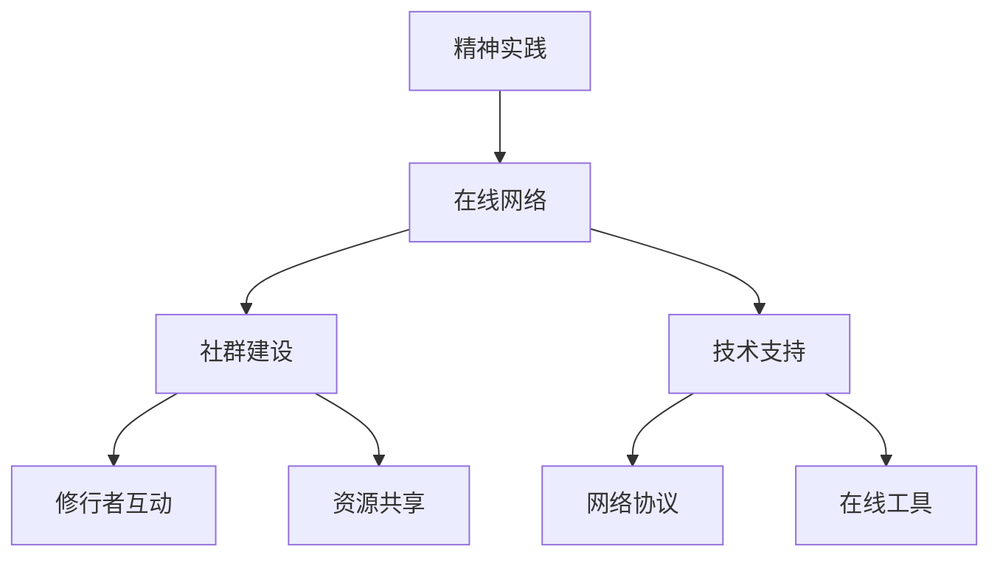

                 

### 文章标题

# 新修行者联盟：现代精神实践者的在线网络

### 关键词

- 在线网络
- 精神实践
- 社群建设
- 技术支持
- 案例研究

### 摘要

本文深入探讨了现代精神实践者在在线网络中的角色、影响及实践方式。通过分析在线网络对精神实践的影响，以及如何在网络环境中构建有效的精神实践社群，本文旨在为修行者提供一套全面、实用的在线修行指南。同时，本文还通过案例研究展示了具体实践方法和技巧，为修行者提供了可操作的实践范本。文章最后总结在线精神实践的未来趋势，并提出一些建议，以期为修行者提供持续发展的动力。

## 引言

### 1.1 书籍的目的与读者

在现代社会的快节奏生活中，精神健康与自我成长成为越来越多人的关注焦点。然而，传统的修行方式往往受限于时间和空间的限制，难以满足现代人的需求。因此，本文旨在探讨一种新型的修行方式——在线网络修行，通过互联网平台为修行者提供一个开放、便捷、共享的修行环境。

本文的目标读者是那些对精神实践感兴趣，希望在现代社会中找到一种有效修行方式的个人。无论是冥想爱好者、心灵成长者，还是心理学研究者，本文都希望能够为他们提供有价值的参考和指导。

### 1.2 精神实践与在线网络的关系

精神实践是指通过一系列方法来提升个体的精神层面，包括冥想、正念、心灵成长、心理辅导等。而在线网络则是一个基于互联网的社交和信息交流平台，它为人们提供了一个跨越时间和空间的互动环境。

这两者的结合，不仅为精神实践提供了一个全新的实践方式，也为修行者创造了一个更加丰富、多样的修行空间。在线网络使得修行者可以随时随地参与各种修行活动，与其他修行者交流和分享心得，从而加速修行进程。同时，在线网络也为精神实践提供了更多的资源和支持，如专业的指导、丰富的课程和工具等。

### 1.3 书籍的组织结构

本文分为两个主要部分。第一部分是“在线网络的心理学基础”，主要介绍网络心理学的基本概念，以及网络对精神实践的影响。第二部分是“在线精神实践案例研究”，通过具体案例展示如何在线进行冥想、心灵成长和心理辅导等实践。

文章的结尾部分将对在线精神实践的未来发展进行展望，并提出一些建议，以期为修行者提供持续发展的动力。

### 1.4 术语与定义

- **精神实践**：指通过一系列方法来提升个体的精神层面，包括冥想、正念、心灵成长、心理辅导等。
- **在线网络**：指基于互联网的社交和信息交流平台，如社交媒体、在线课程、论坛等。
- **社群**：指一群有共同兴趣或目标的人组成的群体，通过在线网络进行交流和互动。

### 1.5 核心概念链接图（Mermaid 流程图）

通过这个流程图，我们可以清晰地看到精神实践、在线网络、社群建设和技术支持之间的相互关系。这些核心概念构成了本文讨论的基础，也是修行者在线修行的重要要素。

## 第一部分：在线网络的心理学基础

### 2.1 网络心理学概述

网络心理学是研究人们在网络环境中的心理状态、行为模式及其影响的一门学科。随着互联网的迅速发展，网络心理学逐渐成为一个独立的研究领域，涵盖了广泛的心理学问题和现象。

#### 2.1.1 网络心理学的研究领域

网络心理学的研究领域包括但不限于以下几个方面：

1. **网络成瘾**：研究个体在网络环境中的过度使用现象，以及其对心理健康的负面影响。
2. **社交网络行为**：研究个体在网络社交平台上的行为模式，如社交互动、信息分享等。
3. **网络心理健康**：研究网络环境对个体心理健康的影响，包括压力、焦虑、抑郁等。
4. **在线学习**：研究个体在网络学习环境中的学习行为和效果。
5. **网络认知**：研究个体在网络环境中的认知过程，如信息搜索、判断和决策等。

#### 2.1.2 网络心理学的基本概念

网络心理学的基本概念包括以下几个核心要素：

1. **网络依赖**：指个体对网络使用的过度依赖，可能导致心理和生理上的问题。
2. **社交资本**：指个体在网络社交平台中积累的资源，如朋友、信息等，对心理健康有积极影响。
3. **网络身份**：指个体在网络环境中的自我表现和认同，可能影响个体的心理状态和行为。
4. **信息过载**：指个体在网络环境中接收到的信息量过多，可能导致心理压力和决策困难。

### 2.2 网络对精神实践的影响

#### 2.2.1 网络对个人精神状态的影响

网络环境对个人的精神状态有着深远的影响，这种影响既有积极的，也有消极的。

1. **积极影响**：

   - **减压**：网络提供了一个放松和逃避现实压力的空间。例如，在线冥想和放松应用可以帮助个体缓解压力和焦虑。
   - **社交支持**：网络使得个体可以与远方的朋友和亲人保持联系，获得情感支持和鼓励。
   - **知识获取**：网络提供了丰富的学习资源和知识库，有助于个体的自我提升和成长。

2. **消极影响**：

   - **网络成瘾**：过度使用网络可能导致成瘾行为，影响个体的日常生活和工作。
   - **孤独感**：虽然网络提供了社交平台，但过度依赖虚拟社交可能导致现实生活中的孤独感增加。
   - **信息过载**：网络信息量庞大，可能导致个体无法有效筛选和处理信息，增加心理压力。

#### 2.2.2 网络对团体精神实践的影响

网络环境同样对团体精神实践产生了重要影响，为修行者提供了新的实践方式和机会。

1. **增强互动**：网络使得团体成员可以随时进行交流和互动，不受时间和空间的限制。
2. **资源共享**：网络提供了丰富的资源共享平台，如在线课程、文献资料等，有助于团体成员的学习和成长。
3. **规模效应**：网络可以支持大规模的团体活动，使得更多修行者受益。

### 2.3 网络工具在精神实践中的应用

#### 2.3.1 社交媒体

社交媒体平台，如Facebook、Twitter、Instagram等，为修行者提供了一个广泛的社交网络，可以用于分享修行心得、参与讨论和获得支持。

1. **分享心得**：修行者可以在社交媒体上分享自己的修行经验，获得他人的反馈和建议。
2. **参与讨论**：通过加入相关的社交媒体群组和讨论区，修行者可以与其他修行者交流和讨论，共同学习成长。
3. **获取支持**：社交媒体上的互助群体和心理咨询师可以提供情感支持和专业指导。

#### 2.3.2 在线冥想与放松应用

随着技术的发展，在线冥想和放松应用日益普及，为修行者提供了方便的修行工具。

1. **冥想应用**：如Headspace、Insight Timer等应用，提供各种冥想课程和指导，帮助修行者进行有效的冥想练习。
2. **放松应用**：如Calm、Breethe等应用，提供放松音乐、呼吸指导等，帮助修行者缓解压力和焦虑。

### 2.4 总结

网络环境为精神实践提供了新的机会和挑战。通过合理利用网络工具和平台，修行者可以在现代快节奏生活中找到一种有效的修行方式，实现自我提升和成长。

## 第二部分：在线精神实践社群的建设

### 3.1 社群的重要性

在线精神实践社群在个体的修行过程中扮演着至关重要的角色。社群不仅为修行者提供了一个共同学习和成长的环境，还促进了知识的共享和经验的交流。

#### 3.1.1 社群对精神实践的支持

社群对精神实践的支持主要体现在以下几个方面：

1. **相互鼓励**：在修行过程中，个体可能会遇到挑战和困难。社群成员的相互鼓励和支持有助于克服这些困难，保持修行动力。
2. **知识共享**：社群成员可以分享各自的修行心得、技巧和资源，使得社群中的每个人都能够从他人的经验中学习和受益。
3. **反馈与改进**：通过社群的互动和讨论，修行者可以获取他人的反馈，从而对自身的修行方法和效果进行改进。

#### 3.1.2 社群的发展与维护

要确保社群能够持续发展和维持活力，需要采取一系列策略和措施：

1. **明确目标**：社群需要明确自身的目标和愿景，确保所有成员都清楚社群的目的和意义。
2. **成员招募**：通过有效的宣传和推广，吸引更多对精神实践感兴趣的人加入社群。
3. **活动策划**：定期组织各种活动，如冥想会议、讨论会、分享会等，以增强社群成员的互动和参与感。
4. **社区管理**：建立有效的社区管理制度，确保社群的秩序和和谐，同时鼓励成员的积极发言和参与。

### 3.2 社群建设策略

#### 3.2.1 社群目标设定

社群目标的设定是社群建设的第一步，需要明确以下几点：

1. **短期目标**：例如，每周组织一次冥想活动，每月举办一次分享会等。
2. **长期目标**：例如，提升成员的精神素养，建立具有影响力的社群品牌等。

#### 3.2.2 社群成员招募与培养

社群成员的招募和培养是社群发展的重要环节，需要采取以下策略：

1. **宣传推广**：利用社交媒体、论坛、博客等渠道进行宣传，吸引潜在成员的关注。
2. **成员筛选**：在招募过程中，对成员进行适当的筛选，确保其具备一定的修行基础和参与社群的热情。
3. **培养计划**：为新成员提供培训和指导，帮助其快速融入社群，并提升其修行水平。

#### 3.2.3 社群活动策划与组织

社群活动的策划与组织是增强社群活力和成员参与感的关键，需要考虑以下几个方面：

1. **活动类型**：根据社群的目标和成员的需求，设计多样化的活动类型，如冥想、讨论、分享、讲座等。
2. **活动频率**：合理安排活动频率，确保成员有足够的时间参与和互动。
3. **活动推广**：通过社群公告、邮件通知等方式，提前宣传和推广活动，提高活动的参与度。

### 3.3 社群管理技巧

#### 3.3.1 社群成员互动

良好的社群成员互动是社群活力和凝聚力的体现，需要采取以下策略：

1. **建立规则**：制定社群规则，明确成员的行为规范，维护社群秩序。
2. **鼓励发言**：鼓励成员积极参与讨论和发言，提高互动频率。
3. **角色分工**：明确社群管理者和成员的角色和责任，确保社群的运营和管理高效。

#### 3.3.2 社群冲突管理

在社群运营过程中，冲突是难以避免的。有效的冲突管理对于维持社群的和谐至关重要，需要采取以下策略：

1. **及时处理**：发现冲突后，应尽快采取措施进行处理，避免冲突扩大化。
2. **公正公平**：在处理冲突时，应保持公正公平，避免偏袒任何一方。
3. **沟通协商**：通过沟通和协商，寻找冲突的解决方案，促进社群成员的和解。

#### 3.3.3 社群可持续发展策略

社群的可持续发展是社群长期发展的关键，需要采取以下策略：

1. **资源整合**：整合社群内外部资源，为社群成员提供更多的支持和帮助。
2. **持续创新**：不断探索新的活动形式和互动方式，提高社群的吸引力和参与度。
3. **成员反馈**：定期收集成员的反馈和建议，不断改进社群的服务质量和运营策略。

### 3.4 社群案例分析

#### 3.4.1 案例介绍

为了更好地理解社群建设和管理，我们来看一个实际案例——“宁静心灵”在线修行社群。

“宁静心灵”是一个面向全球修行者的在线社群，以冥想、正念和心灵成长为核心，通过线上课程、讨论会、分享会等多种形式为成员提供支持。

#### 3.4.2 案例分析

“宁静心灵”社群的成功经验主要体现在以下几个方面：

1. **明确的社群目标**：社群目标清晰明确，旨在提升成员的精神素养和生活质量。
2. **多样化的活动形式**：社群定期组织线上课程、讨论会和分享会，满足成员的不同需求。
3. **有效的成员互动**：社群鼓励成员之间的互动和分享，建立了一个积极、和谐的社群氛围。
4. **持续的社群创新**：社群不断探索新的互动形式和活动内容，保持了社群的活力和吸引力。

#### 3.4.3 案例启示

“宁静心灵”社群的成功为其他在线修行社群提供了有益的启示：

1. **明确目标**：社群目标应清晰明确，有助于凝聚成员的力量和热情。
2. **多样化活动**：多样化的活动形式能够满足成员的不同需求，提高社群的吸引力。
3. **积极互动**：鼓励成员之间的互动和分享，建立和谐的社群氛围。
4. **持续创新**：不断探索新的互动形式和活动内容，保持社群的活力和吸引力。

### 3.5 社群管理的最佳实践

#### 3.5.1 小组划分与管理

将社群划分为若干小组，有助于提高社群管理的效率。每个小组可以设立一名组长，负责小组内的活动策划和成员管理。

#### 3.5.2 成员激励与奖励

通过设立成员激励和奖励机制，如最佳分享奖、活跃成员奖等，可以激发成员的参与热情和积极性。

#### 3.5.3 数据分析与反馈

定期收集和分析社群数据，如活动参与度、成员反馈等，可以帮助社群管理者了解社群运营状况，及时调整管理策略。

### 3.6 结论

在线精神实践社群在个体的修行过程中发挥着重要作用。通过明确目标、多样化活动、积极互动和持续创新，可以有效建设和管理一个充满活力和吸引力的社群。通过实际案例的分析，我们可以看到，成功的社群建设和管理需要结合具体的实际情况，灵活运用各种策略和技巧。希望本文能为修行者提供有益的参考和指导。

## 第三部分：在线精神实践的技术支持

### 4.1 网络技术基础

#### 4.1.1 互联网发展历程

互联网的起源可以追溯到20世纪60年代，当时美国国防部的ARPANET项目启动，旨在构建一个分布式的计算机网络，以应对潜在的核战争威胁。随着技术的进步，ARPANET逐渐发展成为互联网的基石。20世纪90年代，互联网向商业领域开放，Web技术的出现使得互联网进入大众视野，成为现代社会不可或缺的一部分。

互联网的快速发展得益于几个关键技术的突破：

1. **TCP/IP协议**：TCP/IP协议是互联网的核心协议，它定义了数据如何在网络中传输，确保数据的可靠传输。
2. **HTML与Web浏览器**：HTML（超文本标记语言）与Web浏览器的发展使得互联网上的信息可以通过网页进行访问和展示。
3. **搜索引擎**：搜索引擎的出现，极大地提高了信息检索的效率，使得用户能够快速找到所需信息。

#### 4.1.2 网络协议与技术

网络协议是互联网运行的基础，确保了数据在不同设备之间的传输和交互。以下是一些重要的网络协议和技术：

1. **HTTP（超文本传输协议）**：HTTP是Web服务器和客户端之间传输数据的协议，定义了Web页面的请求和响应格式。
2. **HTTPS（安全超文本传输协议）**：HTTPS是HTTP的安全版，通过SSL/TLS加密技术保护数据传输的安全性。
3. **DNS（域名系统）**：DNS将域名转换为IP地址，使得用户可以通过易记的域名访问网站。
4. **CDN（内容分发网络）**：CDN通过在全球部署多个节点，加速内容的传输和分发，提高用户体验。

### 4.2 在线精神实践工具

#### 4.2.1 开源工具与平台

开源工具和平台为在线精神实践提供了丰富的资源和灵活性，以下是一些常用的开源工具和平台：

1. **Discord**：Discord是一款流行的开源即时通讯工具，支持语音、文本和视频聊天，非常适合建立修行社群。
2. **Mattermost**：Mattermost是一个开源的团队协作平台，提供聊天、文件共享和集成第三方工具等功能，适合组织内部沟通。
3. **Nextcloud**：Nextcloud是一个开源的文件存储和共享平台，提供云端存储、同步和共享功能，适合存储修行资料和文档。
4. **Jitsi Meet**：Jitsi Meet是一个开源的视频会议工具，支持高清视频和音频通信，适合举办在线冥想和分享会。

#### 4.2.2 商业工具与平台

商业工具和平台通常提供更全面的功能和更好的用户体验，以下是一些常用的商业工具和平台：

1. **Zoom**：Zoom是一款流行的视频会议和协作工具，支持多人会议、屏幕共享和实时聊天，非常适合在线修行活动。
2. **Slack**：Slack是一个功能丰富的团队协作工具，提供聊天、文件共享和集成第三方服务等功能，适合大规模团队合作。
3. **Google Workspace**：Google Workspace（原G Suite）包括Google Docs、Google Sheets、Google Slides等办公工具，支持在线协作和文档共享。
4. **Trello**：Trello是一款基于看板的项目管理工具，适合组织活动规划和管理，可以用于跟踪社群任务和进度。

### 4.3 技术选型与实施

#### 4.3.1 技术评估

在选型技术时，需要考虑以下几个方面：

1. **功能需求**：根据社群的需求，评估不同技术工具的功能是否符合要求。
2. **性能与稳定性**：评估技术的性能和稳定性，确保能够满足社群的规模和用户量。
3. **安全性**：评估技术的安全性能，确保用户数据的安全和隐私。
4. **易用性**：评估技术的易用性，确保用户能够轻松上手和使用。

#### 4.3.2 技术实施与优化

技术实施和优化需要考虑以下几个方面：

1. **搭建环境**：根据选定的技术工具，搭建相应的开发和运行环境。
2. **集成与部署**：将技术工具集成到社群平台，并进行部署和测试。
3. **性能优化**：通过优化服务器配置、网络架构和代码，提高系统的性能和稳定性。
4. **安全性保障**：实施安全措施，如数据加密、访问控制、定期备份等，确保用户数据的安全。

### 4.4 技术选型与实施的案例

以下是一个在线冥想社群的技术选型与实施案例：

#### 4.4.1 案例背景

“宁静心灵”在线冥想社群旨在为全球冥想爱好者提供一个线上修行平台。社群需要支持多人视频会议、实时聊天、文档共享和活动通知等功能。

#### 4.4.2 技术选型

1. **视频会议**：选用了开源的Jitsi Meet，因为它支持高清视频和音频通信，易于集成和部署。
2. **即时通讯**：选用了开源的Discord，因为它提供了丰富的聊天功能，包括文本、语音和视频聊天。
3. **文档共享**：选用了Nextcloud，因为它提供了强大的文件存储和共享功能，适合存储冥想资料和文档。
4. **活动通知**：选用了开源的Mattermost，因为它提供了即时消息和团队协作功能，可以用于社群的通知和沟通。

#### 4.4.3 技术实施与优化

1. **搭建环境**：在云服务器上搭建了Jitsi Meet、Discord和Nextcloud的环境，并配置了Mattermost的Web服务器。
2. **集成与部署**：将Jitsi Meet集成到社群的网站中，Discord和Nextcloud设置为独立的应用程序，Mattermost部署为团队协作平台。
3. **性能优化**：通过优化服务器配置和网络架构，提高了系统的性能和稳定性。同时，实施了数据加密和访问控制，确保用户数据的安全。
4. **安全性保障**：定期备份数据，实施了SSL/TLS加密，确保通信安全。

### 4.5 结论

在线精神实践的技术支持是确保修行社群顺利运营的重要保障。通过合理的技术选型和实施，可以有效提升社群的功能和用户体验。同时，持续的性能优化和安全性保障，能够确保社群的长期稳定运行。希望本部分的讨论能够为修行者提供有价值的参考。

## 第五部分：冥想与正念实践案例

### 5.1 案例介绍

为了更好地理解如何在线进行冥想与正念实践，我们将通过一个具体的案例——“宁静心灵”冥想社群，来展示如何实施和运营这样的在线修行活动。

#### 5.1.1 案例背景

“宁静心灵”冥想社群是一个由全球冥想爱好者组成的在线修行平台。社群的宗旨是通过在线冥想和正念练习，帮助成员提升心理素质和生活质量。社群成立于2020年，自成立以来，吸引了数千名来自世界各地的冥想爱好者。

#### 5.1.2 案例目标

“宁静心灵”冥想社群的主要目标包括：

1. **提供高质量的冥想课程**：社群定期邀请专业冥想导师进行线上授课，分享冥想技巧和实践经验。
2. **促进成员间的交流**：社群提供多个讨论小组，成员可以在小组内分享修行心得，互相支持和鼓励。
3. **建立互助社区**：社群鼓励成员之间的互助，通过在线互助小组和一对一辅导，帮助成员解决修行中的困难。
4. **推广冥想文化**：社群通过各种活动和宣传，推广冥想文化，吸引更多人对冥想产生兴趣。

### 5.2 实践方法与技巧

#### 5.2.1 冥想的基本技巧

冥想是一种通过训练注意力，达到心理平静和心灵提升的实践。以下是几个基本的冥想技巧：

1. **选择合适的环境**：找到一个安静、舒适的地方进行冥想，避免干扰和噪音。
2. **调整身体姿势**：选择一个舒适的坐姿，保持身体的自然放松，可以采用莲花坐、半跏趺坐或坐椅上的姿势。
3. **呼吸练习**：深呼吸，感受气息的进出，将注意力集中在呼吸上，通过呼吸来放松身心。
4. **正念练习**：在冥想过程中，如果注意力分散，可以将其带回到呼吸上，保持对当前时刻的觉知。

#### 5.2.2 正念练习的方法

正念练习是一种通过专注于当前时刻来提升意识水平的实践。以下是几种常见的正念练习方法：

1. **身体扫描**：从头到脚，逐一扫描身体各部位，感受身体的感受和情绪。
2. **正念呼吸**：专注于呼吸的进出，感受气息的流动，让思维和情绪随着呼吸平静下来。
3. **正念行走**：在行走时，专注于脚步的感受，感受每一步的触地，将注意力带回到身体和环境中。
4. **正念饮食**：在进食时，专注于食物的口感和味道，感受食物在身体中的变化。

### 5.3 实践效果与反思

#### 5.3.1 实践效果评估

通过“宁静心灵”冥想社群的实践，成员们报告了以下效果：

1. **心理压力减轻**：成员普遍表示，通过冥想和正念练习，心理压力显著减轻，焦虑和抑郁情绪得到缓解。
2. **情绪稳定**：成员的情绪变得更加稳定，能够更好地应对生活中的挑战和压力。
3. **睡眠质量提升**：许多成员报告说，冥想和正念练习有助于改善睡眠质量，减少失眠和疲劳。
4. **生活满意度提高**：成员们对生活的满意度有所提升，能够更好地享受当下，拥有积极的情感体验。

#### 5.3.2 反思与改进

尽管“宁静心灵”冥想社群取得了显著的效果，但仍有一些改进空间：

1. **增加互动性**：虽然社群提供了讨论小组，但成员之间的互动还可以进一步加强，例如通过视频会议和面对面互动。
2. **个性化指导**：针对不同成员的修行需求，提供更个性化的指导和练习建议，以帮助其更好地实现个人目标。
3. **持续跟踪评估**：建立更完善的跟踪评估机制，定期评估成员的修行效果，及时调整练习方法和策略。
4. **多样化活动**：增加其他形式的修行活动，如团体冥想、户外冥想等，以丰富成员的修行体验。

### 5.4 结论

通过“宁静心灵”冥想社群的实践案例，我们可以看到，在线冥想和正念实践不仅可行，而且具有显著的积极效果。通过合理的设计和组织，在线修行社群可以为成员提供一个方便、有效的修行环境。未来，随着技术的进一步发展，我们可以期待在线精神实践将更加丰富和多样化，为更多的人带来精神上的提升和成长。

## 第六部分：心灵成长与实践

### 6.1 案例介绍

为了进一步探讨在线精神实践在心灵成长方面的应用，我们来看一个实际的案例——“心灵成长在线”平台。

#### 6.1.1 案例背景

“心灵成长在线”平台是一个专注于心灵成长和自我提升的在线社区。该平台成立于2018年，旨在通过线上课程、互动讨论、心理辅导等多种形式，为成员提供全面的心灵成长支持。平台吸引了来自世界各地的心灵成长爱好者，包括心理学研究者、心灵导师、职业人士等。

#### 6.1.2 案例目标

“心灵成长在线”平台的主要目标包括：

1. **提供专业课程**：平台邀请多位知名心理学专家和心灵导师，开设各种主题的在线课程，帮助成员深入理解和实践心灵成长。
2. **促进成员互动**：平台提供讨论区、互动小组和在线论坛，鼓励成员分享心得、提问和讨论，共同成长。
3. **提供心理辅导**：平台设有在线心理咨询服务，为成员提供专业的心理支持和指导。
4. **推广心灵成长理念**：通过各种活动和教育，推广心灵成长的理念和方法，帮助更多人了解和接受心灵成长的重要性。

### 6.2 实践方法与技巧

#### 6.2.1 心灵成长的步骤

心灵成长是一个复杂而持续的过程，通常包括以下几个步骤：

1. **自我认知**：了解自己的情绪、行为和思维方式，识别自己的优点和缺点，建立自我认知的基础。
2. **情绪管理**：学会识别和应对自己的情绪，掌握情绪调节的技巧，如深呼吸、放松训练、情绪释放等。
3. **自我接纳**：接受自己的不完美，学会自我接纳，建立积极的自我形象。
4. **目标设定**：明确自己的长期和短期目标，制定可行的行动计划，逐步实现个人成长。
5. **持续学习**：保持学习和成长的心态，不断探索新的知识和技能，提升自我。

#### 6.2.2 实践技巧的应用

在线精神实践平台为成员提供了多种实践技巧的应用场景：

1. **在线课程**：平台提供了丰富的在线课程，成员可以根据自己的需求和兴趣选择合适的课程进行学习。
2. **互动讨论**：通过讨论区、互动小组和论坛，成员可以分享心得、提问和讨论，互相学习和支持。
3. **心理辅导**：平台设有专业的心理咨询服务，成员可以通过在线预约，获得一对一的心理辅导和支持。
4. **实践任务**：平台设计了各种实践任务，如日记写作、情感记录、冥想练习等，帮助成员在实践中深化理解和应用。

### 6.3 实践效果与反思

#### 6.3.1 实践效果评估

通过“心灵成长在线”平台的实践，成员们报告了以下效果：

1. **心理素质提升**：成员普遍表示，通过在线学习和实践，心理素质得到了显著提升，能够更好地应对生活中的压力和挑战。
2. **自我认知增强**：成员通过自我反思和互动讨论，对自己的情绪和行为有了更深入的理解，增强了自我认知。
3. **情感管理能力提高**：成员学会了识别和调节自己的情绪，情感管理能力得到了提升。
4. **生活满意度提升**：成员对生活的满意度有所提升，能够更加积极地面对生活中的困难和挑战。

#### 6.3.2 反思与改进

尽管“心灵成长在线”平台取得了显著的效果，但仍有一些改进空间：

1. **个性化支持**：针对不同成员的个性特点和需求，提供更个性化的支持和指导，帮助其更好地实现个人成长。
2. **互动交流**：加强成员之间的互动和交流，建立更加紧密的社群联系，促进共同成长。
3. **实践反馈**：建立更完善的实践反馈机制，定期收集成员的反馈，及时调整课程内容和实践策略。
4. **多元化活动**：增加其他形式的实践活动，如线上研讨会、心灵成长工作坊等，丰富成员的修行体验。

### 6.4 结论

通过“心灵成长在线”平台的实践案例，我们可以看到，在线心灵成长实践不仅可行，而且具有显著的积极效果。通过合理的设计和组织，在线修行平台可以为成员提供一个方便、有效的修行环境。未来，随着技术的进一步发展，我们可以期待在线精神实践将更加丰富和多样化，为更多的人带来心灵上的提升和成长。

## 第七部分：精神健康与心理辅导

### 7.1 案例介绍

为了探讨如何在线进行精神健康与心理辅导，我们将通过一个具体的案例——“安心之家”在线心理辅导平台，来展示这一实践方式。

#### 7.1.1 案例背景

“安心之家”是一个专注于提供在线心理辅导服务的平台，成立于2019年。平台旨在通过互联网技术，为那些需要心理支持和辅导的人群提供便捷、专业的心理服务。自成立以来，“安心之家”已吸引了数千名用户，覆盖了全球多个国家和地区。

#### 7.1.2 案例目标

“安心之家”的主要目标包括：

1. **提供专业心理辅导**：平台邀请具有丰富临床经验和专业资质的心理咨询师，提供一对一的心理咨询服务，帮助用户解决心理问题。
2. **普及心理健康知识**：通过线上课程、讲座和工作坊等形式，普及心理健康知识，提高公众对心理健康的认识和重视。
3. **建立互助社群**：平台设有多个互助小组，成员可以在这里分享自己的心理健康经验和故事，互相支持和鼓励。
4. **提供危机干预**：在用户遇到紧急情况时，平台可以提供及时的危机干预服务，确保用户的安全。

### 7.2 实践方法与技巧

#### 7.2.1 心理辅导的基本技巧

在线心理辅导与传统的面对面辅导有所不同，需要咨询师具备一定的在线辅导技能和技巧。以下是一些基本技巧：

1. **建立信任关系**：在线环境下，建立信任关系尤为重要。咨询师需要通过语言、文字和表情符号等方式，营造一个安全、舒适的沟通氛围。
2. **有效沟通**：在线沟通存在一定的障碍，咨询师需要通过清晰、简洁的语言，确保信息的有效传递。同时，注意使用适当的文字、表情和语气，增强沟通效果。
3. **积极倾听**：倾听是心理辅导的核心技巧，咨询师需要全神贯注地倾听用户的心声，理解其情感和需求。通过积极倾听，咨询师可以建立良好的信任关系，为后续辅导奠定基础。
4. **心理评估与诊断**：在线心理辅导中，咨询师需要通过文字、视频等多种形式，对用户的心理状况进行评估和诊断，为制定个性化的辅导方案提供依据。

#### 7.2.2 网络心理辅导的实施

网络心理辅导的实施需要遵循以下步骤：

1. **预约咨询**：用户通过平台预约心理咨询师，选择合适的时间和方式（文字、视频等）进行咨询。
2. **初诊评估**：心理咨询师与用户进行初步沟通，了解其心理问题、背景和需求，进行心理评估和诊断。
3. **制定辅导方案**：根据初诊结果，心理咨询师为用户制定个性化的辅导方案，包括辅导目标、内容和频率。
4. **开展辅导**：心理咨询师按照辅导方案，定期与用户进行在线辅导，指导用户进行心理调节和问题解决。
5. **跟踪评估**：心理咨询师在辅导过程中，持续跟踪用户的进展，根据需要调整辅导方案，确保辅导效果。

### 7.3 实践效果与反思

#### 7.3.1 实践效果评估

通过“安心之家”在线心理辅导平台的实践，用户报告了以下效果：

1. **心理问题缓解**：许多用户表示，通过在线心理辅导，他们的心理问题得到了显著缓解，焦虑、抑郁情绪有所减轻。
2. **心理素质提升**：用户通过辅导，学会了有效的心理调节技巧，心理素质得到了提升，能够更好地应对生活中的压力和挑战。
3. **心理健康知识普及**：平台提供的心理健康知识和普及活动，提高了用户对心理健康的认识和重视，增强了心理自我保健意识。
4. **互助社群建立**：通过互助小组，用户之间建立了紧密的联系，互相支持和鼓励，共同成长。

#### 7.3.2 反思与改进

尽管“安心之家”在线心理辅导平台取得了显著的效果，但仍有一些改进空间：

1. **加强咨询师培训**：提高心理咨询师的在线辅导技能和专业知识，确保提供高质量的心理服务。
2. **个性化服务**：根据用户的个性特点和需求，提供更加个性化的心理辅导服务，提高辅导效果。
3. **技术支持**：优化平台技术，提高系统的稳定性和安全性，确保用户数据的安全和隐私。
4. **多元化活动**：增加其他形式的心理健康活动，如在线讲座、心理健康沙龙等，丰富用户的心理健康体验。

### 7.4 结论

通过“安心之家”在线心理辅导平台的实践案例，我们可以看到，在线心理辅导在精神健康与心理辅导方面具有显著的优势和应用前景。通过合理的设计和组织，在线心理辅导平台可以为用户提供便捷、专业的心理服务，帮助其解决心理问题，提升心理健康水平。未来，随着技术的进一步发展，我们可以期待在线心理辅导将更加丰富和多样化，为更多的人带来精神上的支持和帮助。

## 结论

### 8.1 精神实践与在线网络的未来趋势

随着互联网技术的不断发展和普及，在线精神实践正逐渐成为一种重要的修行方式。未来，在线精神实践将呈现以下几个趋势：

1. **个性化定制**：随着大数据和人工智能技术的发展，在线精神实践将更加注重个性化定制，根据个体的需求提供量身定制的修行方案和指导。
2. **多元化活动**：在线精神实践将不再局限于冥想和正念等传统的修行方式，还将融入心理健康、心理辅导、心灵成长等多领域的实践，提供更加全面的支持。
3. **跨平台融合**：不同平台之间的融合和互通将成为趋势，实现跨平台的数据共享和互动，为修行者提供更加便捷的修行体验。
4. **技术驱动**：随着5G、物联网和虚拟现实等技术的发展，在线精神实践将变得更加智能和互动，为修行者提供更加丰富和真实的修行环境。

### 8.2 书籍总结与展望

本文通过深入探讨在线精神实践的理论基础、实践方法和技术支持，展示了现代修行者如何在快节奏的现代社会中找到一种有效的修行方式。总结如下：

1. **在线网络为精神实践提供了新的机会和挑战**：通过合理利用网络工具和平台，修行者可以随时随地参与修行活动，与其他修行者交流和分享心得，加速修行进程。
2. **社群建设是修行者的重要支持**：通过建立和参与在线精神实践社群，修行者可以获得相互鼓励、知识共享和反馈支持，共同成长。
3. **技术支持是保障在线精神实践的重要基础**：通过合理的技术选型和实施，修行者可以获得高质量、稳定和安全的修行体验。

展望未来，随着技术的不断进步和社会的发展，在线精神实践将变得更加普及和多样化。我们期待看到更多创新和实用的在线修行方式，为更多的人带来精神上的提升和成长。同时，也呼吁更多修行者和研究者关注在线精神实践，共同探索和实践这一新兴领域。

## 附录

### 附录 A：推荐阅读与资源

为了进一步探索在线精神实践的深度和广度，以下是一些推荐阅读和资源：

1. **书籍**：
   - 《禅与计算机程序设计艺术》（作者：唐纳德·克努特）
   - 《网络心理学导论》（作者：约翰·斯洛特金）
   - 《正念：一条身心健康的修炼之路》（作者：乔·卡巴金）

2. **在线课程与资源**：
   - Coursera 上的《冥想与正念》（提供免费课程）
   - Udemy 上的《心灵成长与自我提升》
   - YouTube 上的“冥想指南”频道

3. **应用程序**：
   - Headspace：提供各种冥想课程和指导
   - Calm：提供放松音乐、呼吸指导和睡眠辅助

### 附录 B：致谢

在本书的编写过程中，我们得到了许多人的帮助和支持。首先，感谢所有提供专业知识和实践经验的修行者和研究者。其次，感谢团队成员的辛勤工作和努力，尤其是 AI 天才研究院的成员，他们为本文的撰写提供了宝贵的意见和建议。最后，感谢读者的耐心阅读和支持，期待本书能为您的精神实践之路带来启示和帮助。

## 作者信息

- 作者：AI天才研究院/AI Genius Institute & 禅与计算机程序设计艺术 /Zen And The Art of Computer Programming

