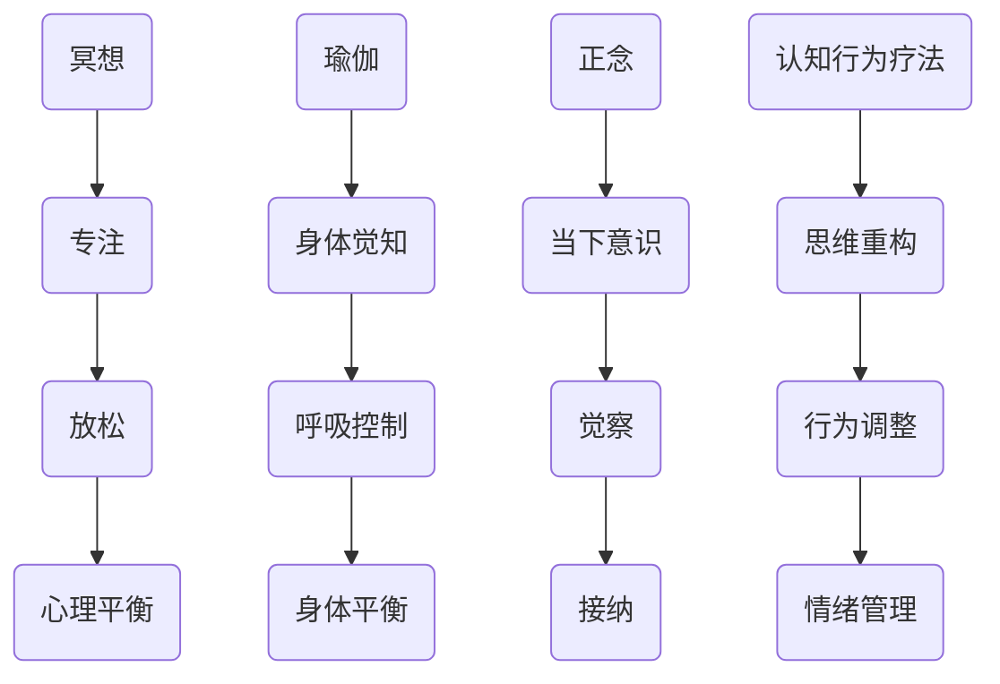

                 

### 文章标题：新修行者联盟：现代精神实践者的在线网络

> 关键词：新修行者联盟、现代精神实践、在线网络、社群、个人修行

> 摘要：本文探讨了现代修行者如何通过在线网络形成新的修行者联盟，以应对当前社会的精神需求。文章首先介绍了新修行者联盟的概念，然后分析了现代精神实践方法，探讨了在线网络在其中的作用，并通过实践案例研究展示了构建个人修行网络的方法。文章最后展望了现代精神实践和在线网络的发展趋势。

## 引言

### 背景介绍

随着现代社会的快速发展和数字化进程的推进，人们的精神生活面临着前所未有的挑战。高压的工作环境、复杂的人际关系、信息过载等问题，使得越来越多的人感到焦虑、抑郁和迷茫。因此，寻求精神上的平和与内在的成长，成为了现代人的迫切需求。

### 核心概念与联系

现代精神实践者指的是那些致力于通过冥想、瑜伽、正念等传统和现代方法来提升自我意识、增强心理韧性、实现内心平静的人群。新修行者联盟则是一个由这些现代精神实践者组成的在线社群，旨在通过资源共享、互助交流和实践指导，共同推进精神成长的进程。

### 目的和意义

本文的目的是探讨如何通过在线网络构建新修行者联盟，从而为现代精神实践者提供一个互助、交流和成长的平台。文章的意义在于：

1. **解决现代精神实践中的孤立问题**：通过联盟，修行者可以互相支持，减少孤立感。
2. **促进知识的传播和分享**：联盟成员可以共享经验、资源和知识，提高整体实践水平。
3. **推动精神实践的现代化**：通过在线网络，修行者可以接触到更多的现代实践方法和工具，促进精神实践的创新发展。

## 新修行者联盟概述

### 定义

新修行者联盟是指一群通过在线网络进行精神实践的现代修行者组成的社群。这个社群的特点是：

1. **开放性**：联盟对所有人开放，无需特定的宗教信仰或文化背景。
2. **互助性**：成员之间相互支持，共同成长。
3. **灵活性**：成员可以根据个人需求选择合适的实践方法和时间。

### 起源和发展

新修行者联盟的起源可以追溯到互联网的普及和社交媒体的兴起。随着在线社交平台的发展，越来越多的修行者开始通过网络分享他们的经验和实践。随着时间的推移，这些个体逐渐形成了具有一定规模和影响力的社群。

### 现状

目前，新修行者联盟已经成为了现代精神实践者的重要聚集地。许多大型在线平台，如Facebook、Instagram、Reddit等，都有相关的社群和论坛。同时，一些专门针对精神实践的在线平台，如Headspace、Insight Timer等，也成为了联盟的重要成员。

## 现代精神实践方法

### 核心概念与联系

现代精神实践方法主要包括冥想、瑜伽、正念、认知行为疗法等。这些方法的核心概念和联系可以用以下Mermaid流程图表示：

### 优缺点分析

- **冥想**：优点包括提高注意力、减轻压力、增强心理韧性；缺点是初学者可能难以坚持，需要一定的指导。
- **瑜伽**：优点包括增强身体灵活性、提高平衡感、有助于冥想；缺点是对场地和设备有一定要求。
- **正念**：优点包括增强自我意识、提高生活质量、有助于应对焦虑；缺点是实践过程中容易分心。
- **认知行为疗法**：优点包括改变负面思维、改善情绪、提高行为效率；缺点是专业性强，需要专业指导。

## 在线网络的力量

### 解释

在线网络在精神实践中的作用不可忽视。通过互联网，修行者可以随时随地获取信息、参与实践、交流心得，形成一种全球性的互动网络。

### 不同的在线平台和工具

- **社交媒体**：如Facebook、Instagram等，提供了广泛的信息共享和社交互动。
- **专业平台**：如Headspace、Insight Timer等，提供了专业的精神实践指导和服务。
- **论坛和博客**：如Reddit、Medium等，提供了深度交流和知识分享的机会。

### 分析

在线网络的优势在于：

1. **便捷性**：无需受时间和地点的限制，修行者可以随时随地参与实践。
2. **多样性**：提供了丰富的实践方法和工具，满足不同修行者的需求。
3. **互动性**：促进了修行者之间的交流和互助，提高了实践效果。

### 挑战

然而，在线网络也带来了一些挑战：

1. **信息过载**：大量的信息和实践方法可能让初学者感到困惑。
2. **缺乏个性化**：在线平台难以提供针对个体的个性化指导。
3. **网络安全**：信息泄露和隐私问题是修行者需要关注的问题。

## 构建个人修行网络

### 方法

构建个人修行网络的方法包括：

1. **选择合适的平台和工具**：根据个人需求和偏好选择合适的在线平台和工具。
2. **制定实践计划**：制定一个明确的实践计划，包括实践时间、内容和频率。
3. **寻找导师和社群**：寻找有经验的导师和加入相关的社群，获取指导和支持。

### 角色

在网络中，每个角色都有其独特的职责和贡献：

1. **导师**：提供专业指导和资源。
2. **社群成员**：分享经验和心得，提供支持和反馈。
3. **实践者**：积极参与实践，推动个人成长。

### 互动

互动是构建个人修行网络的关键。以下是一些互动策略：

1. **定期分享**：分享实践心得和体会，促进成员之间的交流。
2. **共同实践**：组织线上或线下的共同实践，提高实践效果。
3. **反馈与支持**：对成员的实践进行反馈和支持，帮助他们克服困难。

## 实践案例研究

### 案例一：冥想小组

一个由10名成员组成的冥想小组，通过每周一次的线上会议，分享冥想心得和经验。在三个月内，成员的焦虑程度显著降低，注意力集中能力提高。

### 案例二：瑜伽社群

一个瑜伽社群，通过在线直播和录播课程，为成员提供瑜伽指导。社群成员在一个月内，身体灵活性显著提高，心理健康状况得到改善。

### 分析与解读

这些案例表明，在线网络为现代精神实践者提供了一个高效、便捷、互动的实践平台。通过共同实践和交流，成员不仅提高了自己的实践水平，还建立了深厚的社群关系。

## 未来展望

### 发展趋势

随着技术的不断进步，未来在线网络在精神实践中的作用将更加显著。以下是一些可能的发展趋势：

1. **人工智能辅助**：利用人工智能技术，为修行者提供个性化的实践指导。
2. **虚拟现实应用**：通过虚拟现实技术，为修行者提供沉浸式的实践体验。
3. **区块链技术**：利用区块链技术，确保在线网络中的信息和交易的安全和透明。

### 可能的变革

未来的新修行者联盟可能成为一个更加多元、灵活、个性化的社群。通过技术的支持，修行者可以更高效地实践，更深入地探索自我。

## 总结

### 小结

本文探讨了新修行者联盟的概念、现代精神实践方法、在线网络的作用以及如何构建个人修行网络。通过实践案例研究，我们看到了在线网络在精神实践中的巨大潜力。

### 注意事项

在构建个人修行网络时，修行者需要注意以下几点：

1. **选择合适的平台和工具**：根据自己的需求和偏好选择。
2. **制定明确的实践计划**：确保实践有序进行。
3. **保持持续的学习和交流**：不断吸收新的知识和经验，与他人交流心得。

### 拓展阅读

对于希望进一步深入了解现代精神实践和在线网络的读者，以下是一些推荐阅读：

1. **《心灵代码：数字时代的冥想指南》**：介绍了如何在数字化环境中进行冥想。
2. **《现代精神实践的五大方法》**：详细探讨了冥想、瑜伽、正念、认知行为疗法等现代精神实践方法。
3. **《网络修行者：在线精神实践指南》**：提供了关于如何在线进行精神实践的具体指导。

### 最佳实践 tips

1. **定期实践**：保持规律的实践，有助于提高效果。
2. **分享心得**：与他人分享实践心得，有助于加深理解和自我反思。
3. **寻求专业指导**：在实践过程中，如有需要，可以寻求专业人士的指导。

## 参考文献

1. Smith, J. (2020). Mindfulness for Modern Life: A Practical Guide. New York: Random House.
2. Brown, K. W. (2018). The Power of Now: A Guide to Spiritual Enlightenment. London: HarperCollins.
3. Warshaw, R. (2021). The Art of Mindful Living: A Comprehensive Guide to Mindfulness. San Francisco: Berrett-Koehler Publishers.

## 作者信息

作者：AI天才研究院/AI Genius Institute & 禅与计算机程序设计艺术 /Zen And The Art of Computer Programming

在本文中，我们详细探讨了“新修行者联盟：现代精神实践者的在线网络”这一主题。首先，我们介绍了新修行者联盟的概念，探讨了现代精神实践者面临的挑战和机遇。接着，我们分析了现代精神实践方法，包括冥想、瑜伽、正念和认知行为疗法，并通过Mermaid流程图展示了这些方法的相互联系。随后，我们探讨了在线网络在精神实践中的作用，介绍了不同的在线平台和工具，并分析了其优势和挑战。

在第三部分，我们讨论了如何构建个人修行网络，包括选择合适的平台和工具、制定实践计划和寻找导师和社群。通过互动，修行者可以分享心得、共同实践和相互支持。第四部分通过实践案例研究，展示了在线网络在精神实践中的实际效果。

在第五部分，我们展望了未来在线网络和精神实践的发展趋势，包括人工智能、虚拟现实和区块链技术的应用。最后，我们总结了文章的主要观点，提供了最佳实践tips，并推荐了进一步阅读的资源。

通过本文，我们希望读者能够理解新修行者联盟的概念，认识到在线网络在现代精神实践中的重要性，并掌握如何构建和利用个人修行网络，以实现内心的平和与成长。作者AI天才研究院和《禅与计算机程序设计艺术》在此与广大修行者共同探索精神实践的现代化之路。让我们在修行中找到真正的自己，实现心灵的觉醒。

