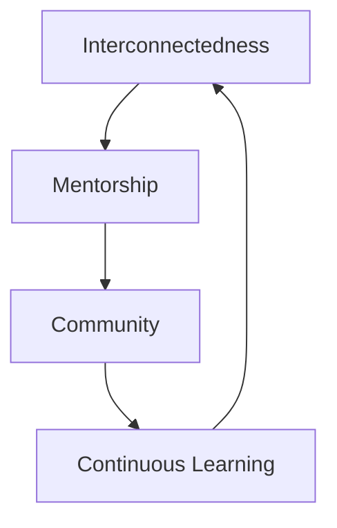

                 

### Step 1: Introduction to the New Spiritual Practitioners' Alliance

The New Spiritual Practitioners' Alliance (NSPA) represents a modern approach to spiritual development and community building in the digital age. Traditional spiritual practices have long emphasized personal introspection, meditation, and community support. However, with the rise of digital technology and the interconnectedness of our modern world, the nature of spiritual practice has evolved. The NSPA brings together spiritual practitioners, mentors, and scholars to create a networked environment for learning, growth, and collaboration.

**Background Introduction:**

In the past, spiritual seekers would often embark on solitary journeys, seeking enlightenment through ascetic practices and meditation in isolated settings. This approach, while powerful in its own right, limited the opportunities for community engagement and mutual support. Today, the NSPA leverages digital platforms to bridge these gaps, creating an ecosystem where individuals can share their experiences, gain insights from mentors, and contribute to the collective growth of the community.

**Core Concepts and Connection:**

The core concepts of the NSPA include:

1. **Interconnectedness:** The belief that all individuals are interconnected, not just on a physical level but also spiritually and energetically.
2. **Collaboration:** The importance of working together to achieve common goals, fostering a sense of unity and shared purpose.
3. **Continuous Learning:** Emphasis on the pursuit of knowledge and self-improvement as essential components of spiritual growth.

To illustrate these concepts, let's consider the following Mermaid diagram:

In this diagram, the interconnectedness of individuals (A) is shown to be a foundation for mentorship (B), which in turn supports the development of a vibrant community (C). This community then fosters a culture of continuous learning (D), which reinforces the interconnectedness and drives the cycle forward.

**Connection to Modern Spiritual Seekers:**

For modern spiritual seekers, the NSPA offers a unique opportunity to connect with like-minded individuals, share their experiences, and gain insights from experienced mentors. This networked approach allows for a more dynamic and interactive form of spiritual practice, one that is adaptable to the fast-paced and interconnected nature of modern life.

### Step 2: Understanding the Principles and Architecture of Spiritual Networks

To fully grasp the NSPA, it's essential to delve into its principles and architecture. Spiritual networks are built on several foundational principles that guide their structure and function. These principles include:

**1. Openness and Inclusivity:**

One of the core principles of the NSPA is openness and inclusivity. The network is designed to be accessible to anyone, regardless of their background, beliefs, or level of spiritual experience. This inclusivity fosters a diverse and vibrant community, allowing for a rich exchange of ideas and perspectives.

**2. Collaboration and Mentorship:**

Collaboration and mentorship are integral to the NSPA. The network encourages individuals to work together, share their knowledge, and support each other's growth. Mentors play a crucial role in guiding newcomers, offering insights, and providing guidance based on their own experiences.

**3. Continuous Learning and Growth:**

The principle of continuous learning emphasizes the importance of ongoing education and self-improvement. The NSPA provides a platform for spiritual seekers to access a wealth of resources, from online courses to live workshops and webinars. This commitment to continuous growth helps individuals deepen their understanding and practice of spirituality.

**4. Personalization and Adaptability:**

Another key principle is personalization and adaptability. The NSPA recognizes that each individual's spiritual journey is unique. The network offers personalized guidance and resources tailored to the needs and preferences of each member, ensuring that their path is as individualized as possible.

**5. Technology-Enhanced Interaction:**

The use of digital technology is a defining feature of the NSPA. These tools facilitate communication, collaboration, and resource sharing among members. From online forums and chat groups to virtual events and live streams, technology enhances the connectivity and interactivity of the spiritual network.

### Step 3: The Structure and Function of Spiritual Networks

The structure of a spiritual network can be likened to a living organism, with multiple interconnected components working together to create a harmonious and dynamic environment. Let's explore the main components and how they interact within the NSPA:

**1. Members:**

At the heart of any spiritual network are the members. These individuals come from diverse backgrounds, bringing with them a wide range of experiences, insights, and perspectives. Members are the lifeblood of the network, contributing to its growth and vitality through their participation and engagement.

**2. Mentors and Teachers:**

Mentors and teachers play a crucial role in guiding and nurturing the spiritual growth of members. They offer their wisdom, experience, and insights, helping others navigate their own paths. Mentors may lead workshops, host webinars, or offer one-on-one guidance, providing the necessary support to help members deepen their practice.

**3. Resources and Content:**

The NSPA offers a wealth of resources and content, including articles, videos, courses, and interactive workshops. These resources are designed to support members' spiritual journeys, providing them with the knowledge and tools they need to grow and evolve.

**4. Community Forums and Platforms:**

Community forums and platforms are vital for fostering interaction and collaboration among members. These spaces provide opportunities for members to share their experiences, ask questions, and engage in meaningful discussions. They also serve as a platform for mentors and teachers to share insights and guidance.

**5. Virtual Events and Meetups:**

Virtual events and meetups are a cornerstone of the NSPA's community-building efforts. These events may include live Q&A sessions with mentors, interactive workshops, and spiritual retreats. They offer members the chance to connect with each other in real-time, fostering a sense of community and belonging.

### Conclusion

In summary, the NSPA represents a modern approach to spiritual development and community building. By leveraging digital technology and a networked structure, the NSPA creates a dynamic and supportive environment for spiritual seekers to connect, learn, and grow. The principles of openness, collaboration, continuous learning, personalization, and technology-enhanced interaction are at the core of this network, driving its growth and evolution. As we move forward, the NSPA has the potential to become a powerful force for spiritual transformation, empowering individuals to discover their true potential and contribute to the greater good.

