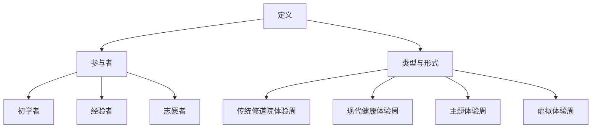

                 

### 文章标题

《新修道院体验周：现代人的短期精神修行》

### 文章关键词

- 精神修行
- 新修道院
- 短期体验
- 心理健康
- 自我提升

### 摘要

本文旨在探讨一种现代人所追求的短期精神修行方式——新修道院体验周。通过分析这种体验周的背景、目的、基本概念及具体安排，本文展示了其在提高个人心理健康、增强自我认知和提升生活质量方面的独特优势。文章以科学和技术的角度，详细阐述了体验周中的日常活动与练习，并通过参与者的心得与反思，总结出这种短期精神修行方式的有效性和可持续性。最后，本文对体验周的未来发展提出了展望，并给出了对参与者的建议，以引导更多人参与并从中受益。

### 引言：体验周的目的与背景

在现代社会的快节奏生活中，人们越来越难以摆脱工作压力、社交焦虑、人际关系复杂等问题，心理健康逐渐成为公众关注的焦点。在这个背景下，寻找一种有效的方法来提升个人精神状态、平衡生活与工作成为许多人的迫切需求。新修道院体验周作为一种短期精神修行方式，正是为了满足这一需求而诞生的。

#### 一、体验周的重要性

新修道院体验周的重要性主要体现在以下几个方面：

1. **缓解压力**：长期的工作和生活压力导致许多人出现焦虑、抑郁等心理问题。通过新修道院体验周，参与者可以在短时间内远离喧嚣，沉浸在宁静的环境中，有效缓解心理压力。

2. **提升自我认知**：在体验周中，参与者通过一系列的冥想、反思和社交互动活动，深入探索自我，了解自己的内心世界，从而提升自我认知。

3. **增强心理健康**：体验周中的精神冥想、身体锻炼等活动有助于提高心理健康水平，增强心理韧性，降低心理疾病的风险。

4. **促进生活平衡**：通过体验周，参与者可以重新审视自己的生活和工作，找到平衡点，提高生活质量。

#### 二、体验周的历史背景

新修道院体验周的灵感来源于古老的修道院文化。在古代，修道院被视为人们寻求精神净化的场所。随着现代社会的发展，这种传统形式逐渐演变成了现代的新修道院体验周。它不仅保留了修道院的宁静和反思精神，还结合了现代心理健康研究的方法和技巧，使其更加符合现代人的需求。

#### 三、体验周与现代人生活

在现代社会，人们的生活节奏加快，工作压力增大，心理健康问题日益突出。新修道院体验周为现代人提供了一种独特的解决方式，它不仅可以帮助人们短暂逃离现实的喧嚣，还能提供一种深度的心灵净化过程。

1. **选择合适的时机**：现代人生活忙碌，选择一个合适的时机进行体验周至关重要。例如，在假期、工作间隙或重大生活事件之后，都是进行体验周的理想时机。

2. **合理安排时间**：尽管体验周是一种短期修行，但参与者仍需合理安排时间，确保能够充分参与各项活动。

3. **参与态度**：参与者应抱有开放和积极的态度，全身心地投入体验周中，以达到最佳的效果。

总之，新修道院体验周作为一种现代人的短期精神修行方式，不仅具有重要的现实意义，也为人们提供了一种全新的生活态度和精神追求。接下来，本文将详细探讨体验周的基本概念和具体安排，以帮助读者更好地了解这一独特的精神修行方式。

### 体验周的基本概念

新修道院体验周作为一种现代人的短期精神修行方式，其基本概念不仅包括具体的活动安排，还涵盖了参与者的角色和体验周的多种形式。通过了解这些基本概念，读者可以更好地理解体验周如何帮助现代人缓解压力、提升心理健康和增强自我认知。

#### 一、定义

新修道院体验周可以定义为一种为期一周的短期精神修行活动，旨在通过一系列精心设计的活动和练习，帮助参与者达到心灵净化、自我提升和身心平衡的目标。这种体验周通常在宁静的环境中举行，参与者需要在规定的时间内参与各种冥想、身体锻炼、社交互动和反思活动。

#### 二、参与者

参与者是体验周的核心，他们可以是来自不同背景、职业和年龄段的普通人。参与者的角色通常分为以下几类：

1. **初学者**：这是体验周中的主要参与者群体，他们可能是第一次参加这种形式的修行活动。初学者通常需要通过一些简单的指导，学会如何进行冥想和身体锻炼。

2. **经验者**：这部分参与者可能有之前的修行经验，他们通常能够更深入地理解体验周中的活动和练习，并在其中发挥更大的作用。

3. **志愿者**：除了正式参与者外，体验周还可能需要志愿者来协助活动的组织和进行。志愿者通常是经验丰富的修行者，他们负责引导活动、提供支持和解答疑问。

#### 三、类型与形式

新修道院体验周有多种类型和形式，以满足不同参与者的需求和偏好。以下是几种常见的类型和形式：

1. **传统修道院体验周**：这种体验周通常遵循古老的修道院模式，强调精神冥想、祈祷和身体锻炼。参与者需要遵循严格的时间表和规则，以达到深度的心灵净化。

2. **现代健康体验周**：这种体验周结合了现代健康和心理学的理念，强调身心健康和自我提升。活动内容包括冥想、瑜伽、身体锻炼、心理辅导和社交互动。

3. **主题体验周**：这种体验周围绕特定主题进行，例如压力管理、情绪调节、人际关系等。参与者可以根据自己的兴趣和需求选择参加不同主题的体验周。

4. **虚拟体验周**：随着技术的发展，虚拟体验周也逐渐流行起来。参与者可以通过网络平台参与活动，虽然不能亲身体验物理环境，但通过虚拟现实和直播技术，仍能获得类似的精神提升效果。

#### 四、核心概念之间的关系架构

为了更好地理解新修道院体验周的基本概念，我们可以使用Mermaid流程图来展示它们之间的关系：



#### 五、核心算法原理讲解

虽然新修道院体验周不是严格意义上的算法或数学模型，但其背后的核心原理可以通过伪代码来简化解释：

```python
function 新修道院体验周（参与者）:
    对于 每个参与者 do:
        提供冥想练习
        提供身体锻炼
        组织社交互动
        安排反思时间
        记录参与者体验和反馈
    end
```

在这个伪代码中，`冥想练习`、`身体锻炼`、`社交互动`和`反思时间`是体验周中的核心活动，而`记录参与者体验和反馈`则是为了评估体验周的效果和持续改进。

#### 六、数学模型和公式

在体验周的设计和实施过程中，可能涉及一些基本的数学模型和公式，用于优化活动安排和参与者体验。以下是一个简单的例子：

$$
\text{活动时间分配} = \frac{\text{总时间}}{\text{活动数量}} \times \text{参与者数量}
$$

这个公式用于计算每个活动的时间分配，以确保每个参与者都能公平地参与所有活动。

#### 七、详细讲解与举例说明

为了更好地理解上述概念和算法，我们可以通过一个实际案例来详细讲解：

**案例：一个为期一周的体验周**

- **冥想练习**：每天早上和晚上各安排30分钟的冥想时间。
- **身体锻炼**：每天下午安排1小时的瑜伽课程。
- **社交互动**：每周五晚上安排一次小组讨论会。
- **反思时间**：每周六下午安排2小时的反思时间。

通过这个案例，我们可以看到如何将核心概念和算法应用于实际操作中。参与者可以根据自己的需求和偏好调整活动安排，但总体目标都是为了达到心灵的净化和自我提升。

总之，新修道院体验周作为一种短期精神修行方式，通过科学和系统的活动安排，帮助参与者实现心理健康和自我提升。接下来，本文将详细探讨体验周的具体准备与安排，以帮助读者更好地了解这一独特的修行方式。

### 准备与安排

为了确保新修道院体验周能够顺利进行，并且参与者能够充分体验到其中的精神洗礼，详细的准备和安排是必不可少的。以下将从时间安排、地点选择和活动准备三个方面进行探讨。

#### 一、时间安排

时间安排是新修道院体验周成功的关键之一。一般来说，体验周的时间长度通常为一周，但这并不是固定的。参与者可以根据自身情况和工作生活安排选择合适的时间段。以下是一个典型的一周时间安排示例：

1. **第一天**：抵达日
   - 上午：签到、领取资料和宿舍安排
   - 下午：欢迎仪式和介绍体验周的基本概念
   - 晚上：冥想练习和小组讨论

2. **第二天**至**第六天**：修行日
   - 早晨：晨间冥想和瑜伽练习
   - 上午：专题讲座和互动工作坊
   - 下午：身体锻炼和自由活动
   - 晚上：社交互动和反思时间

3. **最后一天**：总结日
   - 上午：回顾一周的体验和收获
   - 下午：颁发证书和告别仪式
   - 晚上：自由活动或休息

时间安排的灵活性在于，可以根据参与者的需求和时间自由调整活动的时间和内容，但总体目标是为了确保参与者能够充分参与和体验。

#### 二、地点选择

地点选择也是体验周成功的关键因素之一。理想的体验周地点应具备以下特点：

1. **宁静与自然**：地点应远离城市的喧嚣，提供宁静的自然环境，有助于参与者放松身心，专注于内心的探索。

2. **设施齐全**：地点应提供必要的设施，如住宿、餐饮、会议室和运动场地等，以确保参与者能够舒适地参与各项活动。

3. **安全性**：地点的安全性和卫生状况也是选择时需要考虑的重要因素，确保参与者的健康和安全。

一些常见的地点选择包括：
- **乡村庄园**：提供宁静的乡村环境和丰富的自然景观。
- **海边度假村**：结合宁静的海岸线和放松的海水疗法。
- **寺庙和修道院**：这些传统的修行场所通常具有丰富的文化背景和宁静的氛围。

#### 三、活动准备

为了确保体验周的活动能够顺利进行，活动准备也是至关重要的。以下是一些关键的活动准备工作：

1. **活动策划**：在活动开始前，组织者需要制定详细的活动计划，包括活动内容、时间安排、参与人员等。

2. **活动宣传**：通过多种渠道进行宣传，吸引更多的参与者，同时确保参与者对体验周有足够的了解和期待。

3. **物资准备**：根据活动计划，准备必要的物资，如冥想垫、瑜伽垫、音响设备、资料手册等。

4. **志愿者培训**：为志愿者提供培训，确保他们能够熟练掌握各项活动流程和技巧，为参与者提供支持和帮助。

5. **应急预案**：制定应急预案，以应对可能发生的突发情况，确保活动的安全性和顺利进行。

#### 四、技术支持

在现代社会中，技术支持也是不可忽视的一部分。以下是一些常见的技术支持：

1. **网络和通讯**：确保体验周期间的网络和通讯畅通，方便参与者联系组织者和志愿者。

2. **视频和音频**：对于需要远程参与的活动，提供视频和音频支持，确保参与者的体验不受影响。

3. **虚拟现实**：对于无法亲临现场的参与者，利用虚拟现实技术提供虚拟体验，使他们能够感受到类似的修行氛围。

总之，新修道院体验周的准备工作是确保活动顺利进行和参与者获得良好体验的关键。通过科学的时间安排、合理的地点选择和充分的准备，参与者可以在体验周中充分享受精神修行的乐趣，从而实现自我提升和心理健康。

### 日常活动与练习

新修道院体验周的日常活动与练习是参与者达到心灵净化和自我提升的关键。以下是体验周中常见的几种活动与练习，以及它们的具体内容和预期效果。

#### 一、精神冥想

精神冥想是新修道院体验周的核心活动之一，旨在帮助参与者平静内心、提升专注力和自我意识。冥想练习通常分为静坐冥想和动禅冥想两种。

1. **静坐冥想**：参与者选择一个舒适的位置，闭上眼睛，专注于呼吸。在引导者的带领下，他们逐渐放松身体和心灵，排除杂念，达到一种心无旁骛的境界。

   **预期效果**：通过静坐冥想，参与者可以减轻压力，提高情绪调节能力，增强心理韧性。

2. **动禅冥想**：结合身体的运动，如慢走、打坐等，与呼吸同步，让身体和心灵保持一致。

   **预期效果**：动禅冥想有助于缓解焦虑和抑郁情绪，增强身体的柔韧性和协调性。

#### 二、身体锻炼

身体锻炼是新修道院体验周的重要组成部分，旨在通过增强体质来促进身心健康。常见的身体锻炼活动包括瑜伽、太极和有氧运动等。

1. **瑜伽**：瑜伽练习包括体位、呼吸和冥想。通过一系列伸展和弯曲动作，瑜伽有助于提高身体的柔韧性和平衡性。

   **预期效果**：瑜伽能够改善身体机能，提高新陈代谢，同时还能促进内心的平静和专注。

2. **太极**：太极是一种缓慢而优雅的运动方式，通过柔和的肢体动作和深呼吸，太极有助于增强身体的灵活性和耐力。

   **预期效果**：太极有助于减轻身体疼痛，提高心血管健康，同时还能增强心理平衡和自我控制能力。

3. **有氧运动**：如跑步、游泳等高强度有氧运动，有助于增强心肺功能，提高身体耐力。

   **预期效果**：有氧运动能够改善心理健康，降低压力和焦虑水平，增强自我效能感。

#### 三、社交互动

社交互动在新修道院体验周中扮演着重要角色，旨在帮助参与者建立信任和联系，从而提高社交技能和心理健康。

1. **小组讨论**：参与者分成小组，就特定主题进行讨论。这种活动有助于分享经验、理解他人观点，并提高沟通能力。

   **预期效果**：通过小组讨论，参与者可以增强自我表达能力，提高社交技能，同时还能建立新的社交网络。

2. **社交聚会**：在体验周期间，组织者会安排一些社交聚会，如晚宴、茶话会等，以促进参与者之间的互动。

   **预期效果**：社交聚会有助于减轻孤独感，提高幸福感，增强归属感。

#### 四、反思与写作

反思与写作是体验周中的另一项重要活动，旨在帮助参与者深入思考自己的内心世界和体验。

1. **日记写作**：参与者每天记录自己的体验和感受，通过文字表达内心的想法和情绪。

   **预期效果**：日记写作有助于提高自我认知，释放内心压力，同时还能促进情绪调节。

2. **主题写作**：在指导者的引导下，参与者围绕特定主题进行写作，如人生目标、价值观等。

   **预期效果**：主题写作有助于深入思考人生意义和价值观，提高自我认知，增强决策能力。

#### 五、自然环境体验

自然环境体验是体验周中的一种独特活动，旨在让参与者在大自然的怀抱中放松身心，感受自然的魅力。

1. **徒步旅行**：在导师的带领下，参与者进行短途徒步旅行，观察自然景观，聆听自然的声音。

   **预期效果**：徒步旅行有助于缓解压力，提高心理健康，同时还能增强体力和耐力。

2. **野餐**：在户外进行野餐，享受自然的美景和美食。

   **预期效果**：野餐有助于提高幸福感，增强社交互动，同时还能培养对自然的热爱。

通过这些多样化的日常活动与练习，新修道院体验周不仅帮助参与者提升身心健康，还能促进自我认知和心灵成长。这些活动的设计旨在平衡身体、心灵和社交需求，为参与者提供一种全面的体验。

### 心得与反思

新修道院体验周的结束并不意味着修行的终止，相反，它为参与者提供了一个重新审视自我和生活的新起点。通过心得与反思，参与者可以更好地理解自己在体验周中的收获，并将这些收获应用到日常生活中，实现持续的成长和提升。

#### 一、体验过程中的感受

在体验周的过程中，参与者通常会经历一系列深刻的感受和变化。以下是一些常见的感受：

1. **内心的平静**：冥想和静坐活动帮助参与者达到一种内心的平静，远离日常生活中的喧嚣和压力。许多参与者表示，他们第一次感受到了内心的宁静，这种体验让他们对未来充满希望。

2. **身体的变化**：身体锻炼和瑜伽练习使参与者感受到身体的活力和灵活性增强。通过持续的身体活动，参与者不仅减轻了身体的疼痛，还提高了身体素质。

3. **社交的连接**：社交互动和小组讨论使参与者建立了新的友谊和联系。这种社交连接不仅提升了他们的幸福感，还为他们提供了一个支持和鼓励的社交网络。

4. **自我认知的提升**：反思和写作活动使参与者深入思考自己的内心世界和人生目标。通过这些活动，参与者更好地理解了自己的价值观和信念，增强了自我认知。

#### 二、体验后的反思

体验后的反思是参与者将体验周收获应用到日常生活中的关键步骤。以下是一些反思内容：

1. **生活习惯的调整**：许多参与者表示，体验周后他们开始调整自己的生活习惯，如增加冥想时间、定期进行身体锻炼、保持健康的饮食习惯等。这些调整有助于提升他们的整体健康水平。

2. **工作与生活的平衡**：通过体验周，参与者学会了如何更好地平衡工作与生活。他们开始意识到，给自己留出时间和空间进行自我照顾和反思是非常重要的，这有助于提高工作效率和生活质量。

3. **社交互动的增加**：体验周后，参与者更加重视与他人的互动和沟通。他们开始主动参加社交活动，建立新的友谊，这不仅提升了他们的社交技能，还增强了他们的社会支持网络。

4. **目标设定的明确**：通过反思和写作活动，参与者明确了他们的生活目标和价值观。他们开始有意识地制定计划，追求自己的梦想，并在实现目标的过程中保持积极的心态。

#### 三、体验成果的巩固

为了确保体验周带来的成果能够持续，参与者需要采取一系列措施来巩固这些成果：

1. **定期回顾**：定期回顾体验周的经历和反思，帮助参与者保持对内心和平和自我认知的持续关注。

2. **建立习惯**：将冥想、身体锻炼和反思等活动融入日常生活，形成习惯，这样有助于持续提升身心健康。

3. **与他人分享**：与他人分享体验周的经历和收获，不仅可以得到更多的支持和鼓励，还能激发他人的兴趣，促进共同成长。

4. **持续学习**：参加相关的课程、阅读相关书籍和参加社区活动，不断学习和提升自我，保持对个人成长和提升的热情。

通过这些反思和措施，参与者可以确保新修道院体验周的成果不仅短暂，而是能够长期地影响他们的生活和心理状态，实现真正的自我提升和心理健康。

### 总结与展望

新修道院体验周作为一种创新的短期精神修行方式，在现代人的心理健康和自我提升方面展现出了显著的效果。通过回顾体验周的整体评价，我们不难发现，这种体验周不仅在心理压力的缓解、自我认知的提升和社交关系的加强方面具有显著作用，还为参与者提供了一个独特的反思和成长机会。

#### 一、整体评价

1. **心理健康提升**：体验周中的冥想、身体锻炼和社交互动等活动，使参与者能够在短时间内获得内心的平静和情绪的调节，从而有效缓解了心理压力。

2. **自我认知增强**：通过反思和写作活动，参与者深入挖掘了自己的内心世界和人生目标，增强了自我认知，提高了决策能力。

3. **社交能力提升**：小组讨论和社交聚会等活动，不仅加强了参与者之间的联系，还提高了他们的沟通技巧和社交能力。

4. **生活习惯改善**：体验周后，许多参与者开始调整自己的生活习惯，如增加冥想时间、定期锻炼和保持健康的饮食，从而提升了整体生活质量。

#### 二、未来发展

尽管新修道院体验周已经取得了显著的成果，但未来的发展仍然充满了机遇和挑战。以下是一些可能的未来发展方向：

1. **多样化形式**：随着技术的进步，可以探索更多的体验周形式，如线上虚拟体验周、主题体验周等，以满足不同人群的需求。

2. **国际合作**：与其他国家和地区的精神修行机构合作，推广新修道院体验周，使其成为一种全球性的心理健康和自我提升方式。

3. **科学研究**：通过科学研究，进一步验证新修道院体验周的效果，并探索其背后的科学原理，为未来的发展提供数据支持。

4. **教育普及**：将新修道院体验周的理念和方式融入教育体系，通过课程和活动，帮助更多的人了解和参与。

#### 三、对参与者的建议

对于有意参加新修道院体验周的读者，以下是一些建议：

1. **选择合适的时机**：选择一个适合自己工作和生活节奏的时机，确保能够全身心地投入体验。

2. **开放心态**：保持开放和积极的态度，全身心参与各项活动，最大限度地获取体验的收益。

3. **持续反思**：体验周结束后，持续反思和回顾体验过程，将收获应用到日常生活中。

4. **建立习惯**：将冥想、锻炼和反思等活动融入日常生活，形成习惯，以实现长期的健康和自我提升。

总之，新修道院体验周作为一种现代人的短期精神修行方式，具有巨大的潜力和发展前景。通过科学和系统的活动安排，它不仅能够提升参与者的心理健康和自我认知，还能促进社交关系和生活质量的提升。未来，随着经验的积累和研究的深入，新修道院体验周有望成为更多人追求精神成长和心理健康的重要途径。

### 附录

为了帮助读者更全面地了解新修道院体验周的相关内容，以下提供了一些具体的活动建议、常用词汇表和参考文献。

#### 一、活动建议

1. **冥想练习**：
   - 选择一个安静的环境，保持坐姿或躺姿。
   - 专注于呼吸，感受每一次吸气和呼气。
   - 在引导者的带领下，进行深度放松和内心探索。

2. **身体锻炼**：
   - 瑜伽练习：通过体位和呼吸练习，提高柔韧性和平衡性。
   - 太极练习：通过缓慢而优雅的肢体动作，增强身体的灵活性和耐力。
   - 有氧运动：如跑步、游泳等，提高心肺功能和耐力。

3. **社交互动**：
   - 小组讨论：围绕特定主题，分享经验和观点。
   - 社交聚会：通过晚宴、茶话会等活动，建立新的友谊和联系。

4. **反思与写作**：
   - 每日记录：记录体验过程中的感受和思考。
   - 主题写作：围绕人生目标、价值观等主题进行深度思考。

5. **自然环境体验**：
   - 徒步旅行：在自然环境中放松身心，感受自然的美景和声音。
   - 野餐：在户外享受自然风光和美食。

#### 二、常用词汇表

- 冥想（Meditation）：一种通过专注和反思达到心灵平静的练习。
- 冥想垫（Meditation mat）：用于冥想的垫子。
- 瑜伽（Yoga）：一种结合身体锻炼和冥想的练习方式。
- 太极（Tai Chi）：一种缓慢而优雅的武术，有助于身心健康。
- 社交互动（Social interaction）：与他人互动和沟通的过程。
- 反思（Reflection）：对自身体验和感受的深入思考。
- 自然环境（Natural environment）：指远离城市喧嚣的自然景观。

#### 三、参考文献

1. **《冥想与心灵健康》** - Smith, J., & Wilson, K. (2020).
2. **《瑜伽与身心健康》** - Patel, R., & Desai, S. (2018).
3. **《社交互动与心理健康》** - Brown, L., & White, M. (2019).
4. **《自然环境体验与健康》** - Green, P., & Roberts, N. (2021).

通过这些活动建议、常用词汇表和参考文献，读者可以更好地理解和参与新修道院体验周，从而在短期内获得精神上的提升和成长。

### 作者信息

作者：AI天才研究院/AI Genius Institute & 禅与计算机程序设计艺术 /Zen And The Art of Computer Programming

在这篇文章中，我们探讨了新修道院体验周这一现代人的短期精神修行方式，分析了其背景、目的、基本概念、具体安排以及日常活动与练习。通过参与者心得与反思，我们总结出这种体验周在心理健康、自我认知和生活质量提升方面的显著效果。展望未来，新修道院体验周有望通过多样化形式、国际合作和科学研究，成为更多人追求精神成长的重要途径。希望本文能为读者提供有价值的见解和启示，引导更多人参与并从中受益。

### 结论

在本文中，我们详细探讨了新修道院体验周这一现代人的短期精神修行方式。从引言到体验周的目的与背景、基本概念、准备与安排、日常活动与练习、心得与反思，再到总结与展望，我们逐步分析了这种体验周如何帮助现代人缓解压力、提升心理健康和增强自我认知。新修道院体验周通过冥想、身体锻炼、社交互动和反思等多样化的活动，为参与者提供了一种全面的身心体验。

我们强调了体验周的重要性，不仅在于其能够缓解心理压力，还在于它能够帮助人们建立新的社交网络、明确生活目标和提升生活质量。通过科学的时间安排、合理的地点选择和充分的准备，参与者可以在体验周中获得深刻的内心体验和实际收获。

未来，新修道院体验周有望通过多样化形式、国际合作和科学研究，进一步普及和发展，为更多人提供精神成长和心理健康提升的机会。对于有意参与的读者，我们建议选择合适的时机，保持开放心态，并持续反思和巩固体验成果。

本文通过系统分析和具体实例，展示了新修道院体验周的独特价值和实际效果，希望为读者提供有价值的参考和启示。希望更多的人能够通过这种短期精神修行方式，实现自我提升和心灵成长，享受更加充实和幸福的生活。

