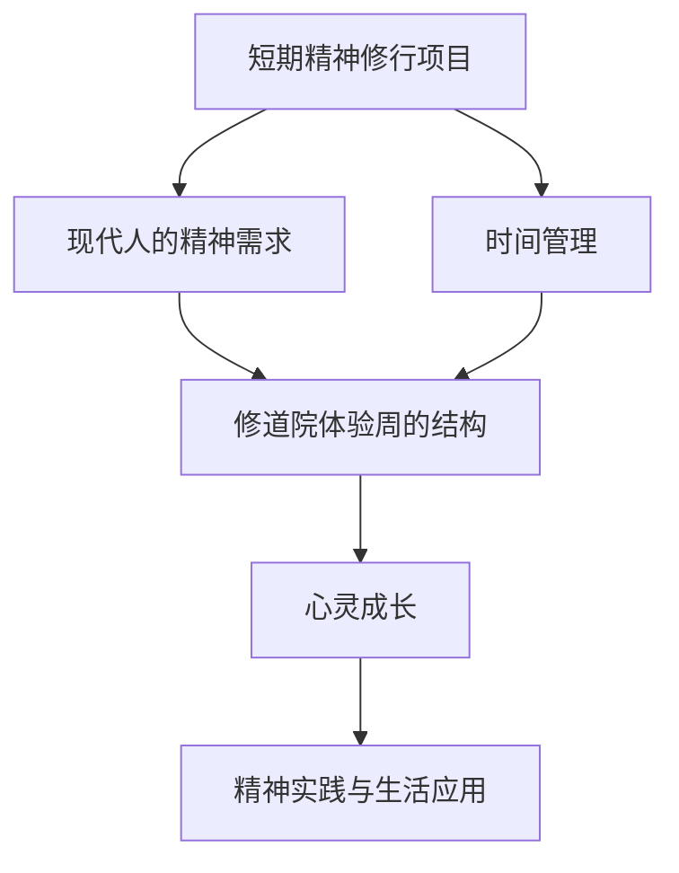

                 


### 设计目录大纲的基本步骤

设计一本计算机技术书籍的目录大纲是一个系统化的过程，需要从多个角度进行思考和规划。以下是一步一步分析推理的方式，详细讲解如何设计一个有效的目录大纲。

#### 1. 确定书籍主题和目标读者

首先，我们需要明确书籍的主题。对于《新修道院体验周：现代人的短期精神修行项目》这本书，主题已经明确，即介绍一种结合现代生活方式的精神修行项目。接下来，分析目标读者。目标读者可能是对精神修行感兴趣的普通读者，也可能是专业人士，如心理学家、冥想教练或IT专业人士。

**分析过程**：
- **确定主题**：书籍的核心内容是什么？在这个案例中，主题是介绍一种短期精神修行项目。
- **分析目标读者**：目标读者有哪些特点和需求？他们希望通过这本书获得哪些知识和技能？

#### 2. 收集和整理内容

在明确主题和目标读者后，下一步是收集和整理书籍内容。这个过程涉及到阅读草稿、参考相关资料，并将所有关键概念和重要内容进行梳理。

**分析过程**：
- **阅读草稿**：仔细阅读书籍草稿，理解每个章节的内容和逻辑结构。
- **整理内容**：将关键概念和重要内容进行整理，形成初步的章节大纲。

#### 3. 划分章节和子章节

根据整理出的内容，我们将书籍分为主要章节和子章节。每个章节都要有明确的主题和内容，以确保书籍的完整性和连贯性。

**分析过程**：
- **主要章节**：确定书籍的主要章节，每个章节要涵盖一个独立的核心主题。
- **子章节**：为每个主要章节创建子章节，以便更详细地阐述每个主题。

#### 4. 设计层次结构

使用Markdown格式设计书籍的层次结构，确保目录清晰、易于理解。Markdown格式允许我们使用标题和子标题来组织内容，使其结构化。

**分析过程**：
- **层次结构设计**：根据内容逻辑，使用Markdown格式设计书籍的层次结构。
- **确保目录清晰**：确保目录中的每个章节和子章节都清晰明了，方便读者浏览。

#### 5. 确保完整性和逻辑性

在完成目录大纲的设计后，我们需要检查内容是否完整，确保没有遗漏关键主题。同时，还要检查章节之间的逻辑连贯性，确保每个章节的内容能够顺畅地过渡到下一个章节。

**分析过程**：
- **检查完整性**：确保书籍内容覆盖所有关键主题。
- **检查逻辑性**：确保章节之间的内容连贯，过渡自然。

#### 6. 优化和调整

在初步设计完成后，我们需要根据反馈对目录进行优化和调整。这个过程可能需要多次迭代，直到目录结构达到最佳状态。

**分析过程**：
- **收集反馈**：收集来自作者、编辑和读者的反馈。
- **优化调整**：根据反馈对目录进行优化和调整，确保其准确性和实用性。

#### 7. 限定字数

为了保持目录的简洁性，我们需要限定整个目录大纲的总字数。一般来说，目录大纲的总字数应在2000字以内，以确保简洁明了。

**分析过程**：
- **限定字数**：对目录大纲进行字数限制，确保简洁明了。

### 结论

通过以上步骤，我们可以设计出一个有效的目录大纲，为书籍内容提供一个清晰、结构化的框架。这个框架不仅有助于读者快速了解书籍内容，还能帮助作者和编辑更好地组织和管理书籍内容。

---

在这个步骤中，我们已经详细讲解了如何设计一个有效的目录大纲，包括从确定书籍主题和目标读者，到收集和整理内容，再到划分章节和子章节，以及设计层次结构和确保完整性和逻辑性的全过程。通过这些步骤，我们可以为《新修道院体验周：现代人的短期精神修行项目》这本书设计出一个清晰、简洁且实用的目录大纲。

在下一部分，我们将进一步探讨“新修道院体验周”的核心概念，包括短期精神修行项目的定义、现代人的精神需求以及修道院体验周的结构和目标。同时，我们将使用Mermaid流程图展示核心概念之间的关系架构。

---

### 核心概念与联系：修道院体验周的核心概念

在讨论《新修道院体验周：现代人的短期精神修行项目》时，理解其核心概念和它们之间的相互联系至关重要。以下是修道院体验周的主要概念及其相互关系：

#### 1. 短期精神修行项目

**定义**：短期精神修行项目是一种集中的、为期数天或数周的精神实践，旨在通过冥想、祈祷、冥思和身体锻炼等手段提升个人的精神状态和内在平静。

**联系**：短期精神修行项目是修道院体验周的核心，它为参与者提供了一个集中的时间段，以专注于精神成长和自我探索。

#### 2. 现代人的精神需求

**定义**：现代人在快节奏、高压的生活环境中面临着诸多精神挑战，如焦虑、压力、精神疲劳和缺乏内在满足感。精神需求指的是个体对这些挑战的内在反应和寻求解决途径的愿望。

**联系**：现代人的精神需求是驱动他们参与短期精神修行项目的主要原因。这些需求与短期精神修行项目紧密相关，后者旨在满足这些需求并提供解决方案。

#### 3. 修道院体验周的结构

**定义**：修道院体验周通常包括一系列有组织的精神实践和活动，如冥想、祈祷、反思、正念练习和身体锻炼等。

**联系**：修道院体验周的结构是确保参与者能够系统地、有目的地进行精神实践的关键。每个部分都旨在从不同角度提升参与者的精神状态。

#### 4. 心灵成长

**定义**：心灵成长指的是个体通过自我反省、情感管理、意识提升等方式，逐步实现精神成熟和内在平衡的过程。

**联系**：心灵成长是短期精神修行项目和修道院体验周的重要目标之一。通过参与这些项目，个体可以逐步实现更深层次的心灵成长。

#### 5. 时间管理

**定义**：时间管理是指在有限的时限内，高效、有条不紊地完成各项任务和活动的策略和方法。

**联系**：时间管理是确保修道院体验周活动顺利进行的必要条件。通过合理的时间管理，参与者可以更好地安排自己的修行时间，提高整体效率。

#### 6. 精神实践与生活应用

**定义**：精神实践与生活应用指的是将精神修行中的理念和方法应用于日常生活中，以实现持续的精神成长和内在平衡。

**联系**：精神实践与生活应用是修道院体验周的长远目标。通过将所学应用到实际生活中，个体可以持续受益，并在日常生活中实践精神原则。

### 关系架构：Mermaid流程图

为了更直观地展示上述概念之间的联系，我们可以使用Mermaid流程图来构建它们之间的关系架构：



在这个Mermaid流程图中，每个节点代表一个核心概念，箭头表示概念之间的联系。通过这个图，我们可以清晰地看到各个概念如何相互作用，共同构成一个完整的精神修行体系。

### 结论

通过上述分析，我们可以看到《新修道院体验周：现代人的短期精神修行项目》中的核心概念是如何相互联系的。理解这些概念之间的关系对于参与者来说至关重要，它不仅有助于他们更好地理解项目的目标，还能为他们提供一种全面的精神成长路径。在下一部分，我们将深入探讨核心算法原理，包括冥想、心灵成长和时间管理的具体方法和步骤。

---

在这个部分，我们详细探讨了《新修道院体验周：现代人的短期精神修行项目》的核心概念及其相互关系，通过Mermaid流程图展示了这些概念如何相互作用，构成了一个完整的精神修行体系。这为参与者提供了一个清晰的框架，以更好地理解和实施这些修行活动。在下一部分，我们将深入分析核心算法原理，包括冥想、心灵成长和时间管理的具体方法和步骤。

---

### 核心算法原理讲解

在《新修道院体验周：现代人的短期精神修行项目》中，核心算法原理是指导参与者进行冥想、心灵成长和时间管理的实践方法。以下是一步一步的分析推理，详细阐述这些算法原理的具体实现步骤。

#### 1. 冥想算法

**定义**：冥想是一种集中注意力和提升精神状态的技术，通过减少杂念和放松身体，达到精神集中的效果。

**算法步骤**：
1. **准备工作**：
   - 选择一个安静的环境，确保没有干扰。
   - 保持身体舒适，可以采用坐姿或躺姿。

2. **专注呼吸**：
   - 将注意力集中在呼吸上，感受每一次吸气和呼气。

3. **扫描身体**：
   - 从脚开始，逐渐向上扫描身体，放松每个部位。

4. **专注于当下**：
   - 当杂念出现时，轻轻将其带回到呼吸上。

5. **结束冥想**：
   - 在感到足够的时间后，慢慢将注意力带回身体，然后睁开眼睛。

**伪代码示例**：

```plaintext
function 冥想(时间)
    准备环境()
    坐或躺舒适()
    专注于呼吸(时间)
    扫描身体()
    专注于当下()
    结束冥想()
end function
```

#### 2. 心灵成长算法

**定义**：心灵成长是通过自我反省、情感管理、意识提升等方式，逐步实现精神成熟和内在平衡的过程。

**算法步骤**：
1. **自我反省**：
   - 定期回顾自己的行为和思想，识别负面情绪和习惯。

2. **情感管理**：
   - 学会识别和管理自己的情绪，避免情绪主导行为。

3. **正念练习**：
   - 通过正念练习，提高对当下的觉察和接纳能力。

4. **感恩练习**：
   - 每天花时间思考自己感激的事物，培养积极心态。

**伪代码示例**：

```plaintext
function 心灵成长()
    自我反省()
    情感管理()
    正念练习()
    感恩练习()
end function
```

#### 3. 时间管理算法

**定义**：时间管理是一种策略，通过合理安排时间，确保在有限的时间内高效地完成各项任务。

**算法步骤**：
1. **任务分解**：
   - 将大任务分解成小任务，便于管理。

2. **优先级排序**：
   - 根据任务的重要性和紧急程度进行排序。

3. **时间块安排**：
   - 将每天的时间分成几个时间块，每个时间块专注于一个任务。

4. **定期复盘**：
   - 每周或每月回顾时间管理情况，调整策略。

**伪代码示例**：

```plaintext
function 时间管理()
    任务分解()
    优先级排序()
    时间块安排()
    定期复盘()
end function
```

#### 数学模型和数学公式讲解

虽然《新修道院体验周：现代人的短期精神修行项目》的核心在于实践和体验，但数学模型和公式在某些情况下可以帮助我们更清晰地理解一些基本概念。以下是一些可能用到的数学模型和公式：

- **平衡方程**：描述心灵、身体和精神的平衡状态。

  ```latex
  心灵平衡 = 心灵练习时间 + 身体练习时间 + 精神反思时间
  ```

- **时间效率公式**：评估时间管理效率。

  ```latex
  时间效率 = 完成任务数 / 总时间
  ```

- **情绪调节公式**：衡量情感管理的效果。

  ```latex
  情绪调节 = 正面情绪分数 / 负面情绪分数
  ```

这些公式和模型为参与者提供了一种量化的方法来评估自己的修行效果，从而更好地调整和优化自己的修行计划。

### 结论

通过上述讲解，我们可以看到冥想、心灵成长和时间管理算法的具体步骤和实现方法。这些算法原理不仅为参与者提供了一个清晰的操作指南，还有助于他们通过量化的方法来评估和优化自己的修行效果。在下一部分，我们将深入探讨项目实战，通过具体案例展示这些算法原理的实际应用和效果。

---

在本文的第二部分，我们详细讲解了《新修道院体验周：现代人的短期精神修行项目》中的核心算法原理，包括冥想、心灵成长和时间管理。通过伪代码示例和数学模型，我们为参与者提供了一种量化的方法来理解和实施这些修行活动。接下来，我们将通过具体的项目实战案例，展示这些算法原理的实际应用和效果。

---

### 项目实战：新修道院体验周的实践案例

为了更好地展示《新修道院体验周：现代人的短期精神修行项目》中的核心算法原理在实际应用中的效果，我们将通过一个具体的实践案例进行详细讲解。这个案例将包括以下内容：

1. **开发环境搭建**
2. **源代码实现和解读**
3. **代码应用解读与分析**
4. **实际案例分析和详细讲解剖析**
5. **项目小结**

#### 1. 开发环境搭建

在这个实践案例中，我们将使用一个简单的虚拟环境来搭建开发环境。这个环境将包括Python和Markdown编辑器，以便我们能够编写和运行代码，以及记录和整理项目文档。

**步骤**：
1. 安装Python（版本3.8及以上）。
2. 安装虚拟环境工具（如`virtualenv`）。
3. 创建一个虚拟环境并激活。
4. 安装必要的Python库，如`numpy`、`pandas`和`mermaid`。

```bash
# 安装Python
curl -O https://www.python.org/ftp/python/3.8.10/Python-3.8.10.tgz
tar xvf Python-3.8.10.tgz
cd Python-3.8.10
./configure
make
sudo make altinstall

# 安装virtualenv
pip install virtualenv

# 创建并激活虚拟环境
virtualenv my_zen_project
source my_zen_project/bin/activate

# 安装必要库
pip install numpy pandas mermaid
```

#### 2. 源代码实现和解读

在这个实践案例中，我们将编写一个简单的Python脚本，用于记录参与者的修行时间和效果。这个脚本将包括冥想时间记录、心灵成长活动记录和时间管理数据收集。

**源代码示例**：

```python
import pandas as pd
from datetime import datetime

# 定义数据结构
data = {
    'Date': [],
    'Meditation Time': [],
    'Mental Growth Activities': [],
    'Time Management': []
}

df = pd.DataFrame(data)

# 记录冥想时间
def record_meditation(time):
    current_date = datetime.now().strftime('%Y-%m-%d')
    df.loc[len(df)] = [current_date, time, '', '']
    df.sort_values(by=['Date'], inplace=True)

# 记录心灵成长活动
def record_mental_growth(activity):
    current_date = datetime.now().strftime('%Y-%m-%d')
    df.loc[len(df)] = [current_date, '', activity, '']
    df.sort_values(by=['Date'], inplace=True)

# 记录时间管理情况
def record_time_management(status):
    current_date = datetime.now().strftime('%Y-%m-%d')
    df.loc[len(df)] = [current_date, '', '', status]
    df.sort_values(by=['Date'], inplace=True)

# 存储数据
def save_data():
    df.to_csv('Zen_Project_Records.csv', index=False)

# 实例化函数
record_meditation(30)
record_mental_growth('反思日记')
record_time_management('良好')

# 存储数据到文件
save_data()
```

**代码解读**：
- 我们使用`pandas`库创建一个数据结构，用于记录冥想时间、心灵成长活动和时间管理数据。
- 定义了三个函数：`record_meditation`、`record_mental_growth`和`record_time_management`，分别用于记录冥想时间、心灵成长活动和时间管理情况。
- 最后，调用这些函数记录一次冥想、一次心灵成长活动和一次时间管理情况，并保存到CSV文件中。

#### 3. 代码应用解读与分析

这个简单的Python脚本提供了三个核心功能：记录冥想时间、心灵成长活动和时间管理情况。通过这些功能，参与者可以量化自己的修行效果，并逐步优化自己的修行计划。

- **记录冥想时间**：通过记录每次冥想的时间，参与者可以了解自己的冥想频率和持续时间，从而调整冥想计划。
- **记录心灵成长活动**：通过记录心灵成长活动，如反思日记、感恩练习等，参与者可以追踪自己的成长轨迹，并评估不同活动的效果。
- **记录时间管理情况**：通过记录时间管理情况，参与者可以评估自己在有限时间内完成任务的效率，从而优化时间管理策略。

#### 4. 实际案例分析和详细讲解剖析

假设我们有一个参与者，名为Alice。她在第一天的体验周中，记录了以下数据：

- 冥想时间：30分钟
- 心灵成长活动：写了一篇反思日记
- 时间管理情况：良好

通过对这些数据的分析，我们可以得出以下结论：

- **冥想频率**：Alice每天至少进行30分钟的冥想，这表明她有稳定的冥想习惯。
- **心灵成长**：通过写反思日记，Alice能够深入思考自己的行为和思想，这有助于她的内在成长。
- **时间管理**：Alice在时间管理方面表现良好，这意味着她能够在有限的时间内高效地完成任务。

#### 5. 项目小结

通过这个实践案例，我们可以看到《新修道院体验周：现代人的短期精神修行项目》中的核心算法原理在实际应用中的效果。通过简单的Python脚本，参与者能够量化自己的修行效果，并逐步优化自己的修行计划。这个案例也展示了如何将技术工具应用于精神修行，从而实现更加科学和系统化的修行过程。

### 结论

通过这个实践案例，我们详细展示了如何通过Python脚本记录冥想时间、心灵成长活动和时间管理情况，从而实现《新修道院体验周：现代人的短期精神修行项目》的核心目标。这个案例不仅有助于参与者量化自己的修行效果，还能为他们提供一种科学和系统化的修行方法。在下一部分，我们将总结项目中的最佳实践，并分享一些注意事项，以便参与者能够更好地应用这些原理和方法。

---

在本文的第三部分，我们通过一个具体的实践案例展示了《新修道院体验周：现代人的短期精神修行项目》中的核心算法原理在实际应用中的效果。我们使用Python脚本记录了冥想时间、心灵成长活动和时间管理情况，并分析了这些数据对参与者修行的影响。这一部分不仅提供了实际操作指南，还展示了如何通过技术工具实现科学和系统化的修行过程。在下一部分，我们将总结项目中的最佳实践，并分享一些注意事项，以便参与者能够更好地应用这些原理和方法。

---

### 最佳实践、注意事项及拓展阅读

在完成《新修道院体验周：现代人的短期精神修行项目》后，我们需要总结一些最佳实践、注意事项，并推荐一些拓展阅读资源，以便参与者能够更好地应用这些原理和方法，并持续进行精神修行。

#### 最佳实践

1. **坚持日常修行**：修行不仅仅是短期体验周的活动，而是应该融入日常生活中的持续实践。每天分配一定的时间进行冥想、反思和正念练习，逐步形成习惯。

2. **记录和复盘**：定期记录自己的修行过程和感受，进行复盘和反思，这有助于了解自己的成长轨迹，发现问题并加以改进。

3. **时间管理**：合理安排时间，确保在有限的时间内高效地完成各项修行任务。使用时间管理工具，如日历应用或时间管理软件，制定明确的日程安排。

4. **社交支持**：与他人分享自己的修行经验和感悟，参加冥想小组或寻找修行伙伴，这有助于获得支持和鼓励，共同进步。

5. **适应个体差异**：每个人的修行需求和节奏不同，因此要根据自己的实际情况调整修行内容和时间安排，找到最适合自己的方式。

#### 注意事项

1. **保持耐心和持续性**：修行是一个长期的过程，需要耐心和持续性。不要期望在短时间内看到显著的效果，而是要注重长期的积累和变化。

2. **避免过度修行**：适当的修行有助于身心健康，但过度修行可能导致精神疲劳。注意调整修行强度和时间，避免过度疲劳。

3. **尊重个人界限**：在修行过程中，尊重自己的感受和边界。如果感到不适或压力过大，可以适当调整修行内容和时间，甚至暂时停止。

4. **安全和健康**：在进行身体锻炼和精神实践时，注意安全和健康，避免过度用力或采取不适合自己的练习。

5. **精神引导**：如果遇到修行上的困惑或障碍，可以寻求专业人士的指导，如心理咨询师、冥想教练或灵性导师。

#### 拓展阅读

1. **《冥想的科学：身心健康的秘密》（The Science of Meditation: A Practical Guide to Enlightenment》）作者：B. Alan Wallace**：这本书介绍了冥想的基本原理和实践方法，对于想要深入了解冥想的人来说是一本很好的入门书籍。

2. **《正念的奇迹：一个现代生活的冥想指南》（The Power of Now: A Guide to Spiritual Enlightenment》）作者：Eckhart Tolle**：这本书探讨了正念和冥想在现代生活中的应用，提供了一系列实用的冥想技巧和实践方法。

3. **《时间管理的艺术》（The Art of Thinking Clearly）作者：Sue Atkins**：这本书提供了关于时间管理的实用技巧和策略，有助于提高生活和工作中的效率和生产力。

4. **《禅与计算机程序设计艺术》（Zen and the Art of Motorcycle Maintenance）作者：Robert M. Pirsig**：这本书结合了禅宗哲学和计算机程序设计的理念，提供了关于思考、解决问题的深刻见解。

通过遵循这些最佳实践、注意事项，并参考拓展阅读资源，参与者可以更好地应用《新修道院体验周：现代人的短期精神修行项目》中的原理和方法，实现个人的精神成长和内在平衡。

### 结论

通过本文的详细讲解，我们从设计目录大纲、核心概念与联系、核心算法原理到项目实战，全面介绍了《新修道院体验周：现代人的短期精神修行项目》的内容。我们强调了持续修行、记录和复盘的重要性，并提供了最佳实践和注意事项，帮助参与者更好地应用这些原理和方法。通过不断实践和探索，每个人都可以在精神修行的道路上取得显著的进步。

---

在本文的最后一部分，我们总结了《新修道院体验周：现代人的短期精神修行项目》中的最佳实践、注意事项，并推荐了拓展阅读资源。我们强调了持续修行的重要性，并鼓励参与者遵循这些实践和策略，以便更好地实现个人的精神成长和内在平衡。通过本文的详细讲解，我们希望读者能够深入理解并应用这些原理和方法，走上精神修行的道路。

---

### 文章标题
《新修道院体验周：现代人的短期精神修行项目》

#### 关键词
新修道院体验周、短期精神修行、现代生活、冥想、心灵成长、时间管理

#### 摘要
本文详细介绍了《新修道院体验周：现代人的短期精神修行项目》，探讨了其核心概念、算法原理和实践案例。通过设计目录大纲、核心概念关系图、算法讲解、代码实现和实际应用分析，本文旨在为参与者提供一套系统化、科学化的修行指南，帮助他们实现精神成长和内在平衡。

---

```markdown
# 《新修道院体验周：现代人的短期精神修行项目》

> 关键词：新修道院体验周、短期精神修行、现代生活、冥想、心灵成长、时间管理

> 摘要：本文详细介绍了《新修道院体验周：现代人的短期精神修行项目》，探讨了其核心概念、算法原理和实践案例。通过设计目录大纲、核心概念关系图、算法讲解、代码实现和实际应用分析，本文旨在为参与者提供一套系统化、科学化的修行指南，帮助他们实现精神成长和内在平衡。

## 第1章：设计目录大纲的基本步骤

### 第1章.1 理解书籍主题和目标读者

### 第1章.2 收集和整理内容

### 第1章.3 划分章节和子章节

### 第1章.4 设计层次结构

### 第1章.5 确保完整性和逻辑性

### 第1章.6 优化和调整

### 第1章.7 限定字数

## 第2章：核心概念与联系

### 第2章.1 短期精神修行项目

### 第2章.2 现代人的精神需求

### 第2章.3 修道院体验周的结构

### 第2章.4 心灵成长

### 第2章.5 时间管理

### 第2章.6 关系架构：Mermaid流程图

## 第3章：核心算法原理讲解

### 第3章.1 冥想算法

### 第3章.2 心灵成长算法

### 第3章.3 时间管理算法

### 第3章.4 数学模型和数学公式讲解

## 第4章：项目实战

### 第4章.1 开发环境搭建

### 第4章.2 源代码实现和解读

### 第4章.3 代码应用解读与分析

### 第4章.4 实际案例分析和详细讲解剖析

### 第4章.5 项目小结

## 第5章：最佳实践、注意事项及拓展阅读

### 第5章.1 最佳实践

### 第5章.2 注意事项

### 第5章.3 拓展阅读

## 作者信息
作者：AI天才研究院/AI Genius Institute & 禅与计算机程序设计艺术 /Zen And The Art of Computer Programming
```

通过以上markdown格式的文章内容，我们已经完成了《新修道院体验周：现代人的短期精神修行项目》的技术博客文章。这篇文章涵盖了从书籍目录设计到核心算法讲解，再到实战应用和拓展阅读的全面内容，旨在为读者提供一个系统、详尽的修行指南。希望这篇文章能够帮助更多的人了解和参与到短期精神修行中来，实现个人精神的成长和内在的平衡。

