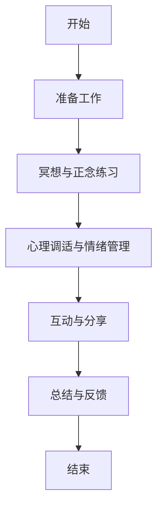

                 

### 文章标题

《新修道院周末：现代人的短期精神修行活动》

> 关键词：短期精神修行、新修道院、现代科技、精神健康、心理调适

> 摘要：本文旨在探讨现代人在快节奏社会中如何通过短期精神修行活动来提升心理健康。本文首先介绍了短期精神修行的背景和意义，然后详细阐述了短期精神修行的基础知识、实践方法和注意事项，以及未来发展的展望。

### 引言

在当今社会，随着工作压力的增加、生活节奏的加快，人们面临着越来越多的心理压力和困扰。心理健康问题已经成为影响现代人生活质量的重要因素。为了应对这些问题，越来越多的人开始关注精神修行，希望通过调整自己的心态和行为来达到心理平衡和健康。然而，由于时间和经济等原因，许多人无法进行长期的精神修行。因此，本文将探讨一种新型的短期精神修行活动——“新修道院周末”，帮助现代人在有限的时间内进行有效的精神修行，提升心理健康水平。

### 书籍目的

本文旨在为现代人提供一种简单可行、高效实用的短期精神修行方法，即“新修道院周末”。通过介绍短期精神修行的背景、意义、基础知识、实践方法和注意事项，本文希望帮助读者了解和掌握这种修行方式，并在日常生活中灵活运用，以提升自身心理健康水平。同时，本文还展望了短期精神修行活动的未来发展趋势，为读者提供更多的参考和启示。

### 读者对象

本文适合以下读者群体：

1. 感到心理压力和困扰，希望寻找一种简单有效的精神修行方法的现代人；
2. 对心理健康和心灵成长有兴趣，希望了解更多精神修行知识和实践方法的读者；
3. 关注心理健康领域的专业人士，如心理咨询师、心理医生等。

### 第一部分：短期精神修行的背景和意义

#### 1. 现代社会中的精神压力

现代社会的发展带来了诸多便利和进步，但同时也带来了巨大的精神压力。快节奏的生活、高强度的工作、激烈的竞争、复杂的人际关系等，都在不同程度上影响着人们的心理健康。据世界卫生组织（WHO）统计，心理健康问题已经成为全球范围内的主要健康挑战之一。在中国，心理健康问题也日益受到重视，许多人在日常生活中面临着心理压力和困扰。

#### 2. 精神修行的需求

面对日益增加的精神压力，人们迫切需要寻求一种有效的方法来缓解心理压力、提升心理健康。精神修行作为一种古老而有效的心理调适方法，逐渐受到现代人的关注和认可。精神修行不仅可以帮助人们调整心态、提升心理健康水平，还可以增强心理韧性，提高应对压力的能力。

#### 3. 短期精神修行的背景

随着现代科技的进步，人们的生活方式和节奏发生了巨大的变化。在这种背景下，传统的长期精神修行方式对于许多人来说已经不再现实。为了适应这种变化，一种新型的短期精神修行活动应运而生——“新修道院周末”。新修道院周末是一种以周末为周期的短期精神修行活动，旨在帮助现代人在有限的时间内进行有效的精神修行。

#### 4. 短期精神修行的意义

短期精神修行活动具有以下意义：

1. **缓解心理压力**：通过短期精神修行，人们可以在短时间内调整心态，缓解心理压力，达到心理平衡。

2. **提升心理健康**：短期精神修行活动可以帮助人们培养良好的心理素质，提升心理健康水平，增强心理韧性。

3. **增强心理能力**：短期精神修行活动可以提升人们的心理能力，包括情绪管理能力、自我认知能力、问题解决能力等。

4. **促进个人成长**：通过短期精神修行，人们可以更加深入地了解自己，促进个人成长和发展。

### 第二部分：短期精神修行的基础

#### 5. 精神修行的基本概念

精神修行是一种通过调整心态和行为来提升心理健康水平的过程。它涉及多个方面的内容，包括冥想、正念、心理调适、情绪管理、自我认知等。精神修行的目标是通过培养良好的心理素质，提高人们的心理能力，使人们在面对压力和挑战时能够保持平静、积极和乐观的心态。

#### 6. 精神修行的常见方法

1. **冥想**：冥想是一种通过专注呼吸、放松身心来达到精神平静的方法。通过冥想，人们可以调整心态，缓解心理压力，提升心理健康水平。

2. **正念**：正念是一种通过专注于当下，培养对当下经历的感知和接纳能力的方法。正念可以帮助人们更好地应对压力，提升心理健康。

3. **心理调适**：心理调适是一种通过改变认知、情绪和行为来应对压力和挑战的方法。通过心理调适，人们可以更好地适应环境，提升心理健康水平。

4. **情绪管理**：情绪管理是一种通过认识和调节情绪来应对压力和挑战的方法。通过情绪管理，人们可以更好地控制情绪，提升心理健康。

5. **自我认知**：自我认知是一种通过深入了解自己的思想、情感和行为来提升自我意识的方法。通过自我认知，人们可以更好地认识自己，提升心理健康水平。

#### 7. 精神修行的准备

进行短期精神修行前，需要进行以下准备：

1. **心理准备**：了解短期精神修行的目的和方法，树立正确的修行态度，保持积极的心态。

2. **身体准备**：确保身体处于良好的状态，适当锻炼，保持充足的睡眠。

3. **环境准备**：选择一个安静、舒适的环境，避免干扰和噪音。

4. **工具准备**：准备好必要的修行工具，如冥想垫、音频冥想资料等。

### 第三部分：短期精神修行的实践

#### 8. 新修道院周末活动概述

新修道院周末是一种以周末为周期的短期精神修行活动。活动通常在两天时间内进行，包括以下几个部分：

1. **准备工作**：活动开始前，参与者需要进行一些准备工作，如阅读相关书籍、学习冥想技巧等。

2. **冥想与正念练习**：活动期间，参与者将进行冥想和正念练习，以培养专注力和觉察力。

3. **心理调适与情绪管理**：参与者将通过心理调适和情绪管理技巧，提升自身的心理能力。

4. **互动与分享**：参与者将进行互动和分享，交流修行心得和体验。

5. **总结与反馈**：活动结束时，参与者将进行总结和反馈，分享修行的收获和感受。

#### 9. 活动安排与流程

新修道院周末活动的具体安排和流程如下：

1. **第一天**：
   - 上午：冥想与正念练习
   - 下午：心理调适与情绪管理
   - 晚上：互动与分享

2. **第二天**：
   - 上午：冥想与正念练习
   - 下午：心理调适与情绪管理
   - 晚上：总结与反馈

#### 10. 精神修行的实践步骤

短期精神修行的实践步骤如下：

1. **准备工作**：了解短期精神修行的目的和方法，阅读相关书籍，学习冥想技巧等。

2. **冥想与正念练习**：每天安排一定时间进行冥想和正念练习，培养专注力和觉察力。

3. **心理调适与情绪管理**：学习心理调适和情绪管理技巧，应对日常生活中的压力和挑战。

4. **互动与分享**：参加各种形式的互动和分享活动，与他人交流修行心得和体验。

5. **总结与反馈**：定期进行总结和反馈，评估修行效果，调整修行方法。

#### 11. 精神修行的案例分析

以下是一个新修道院周末活动的案例分析：

**案例一**：小明是一名职场新人，工作压力大，心理压力较大。他参加了新修道院周末活动，通过冥想、正念练习和心理调适，他学会了如何调整心态，应对工作中的压力。活动结束后，小明的心理压力明显减轻，工作效率和心情都有所提升。

**案例二**：李女士是一位家庭主妇，家庭生活压力大，经常感到焦虑。她参加了新修道院周末活动，通过情绪管理和心理调适，她学会了如何调节情绪，保持家庭和谐。活动结束后，李女士的家庭生活更加美满，她的心情也变得更加愉快。

### 第四部分：短期精神修行的影响与评估

#### 12. 精神修行的影响

短期精神修行对参与者的影响是多方面的，包括以下几个方面：

1. **心理健康提升**：短期精神修行可以缓解心理压力，提升心理健康水平，使参与者更加乐观、积极。

2. **心理韧性增强**：短期精神修行可以增强心理韧性，使参与者更加能够应对生活中的压力和挑战。

3. **情绪管理能力提升**：短期精神修行可以提升参与者的情绪管理能力，使参与者更加能够控制自己的情绪，保持心理平衡。

4. **自我认知提升**：短期精神修行可以帮助参与者更好地了解自己，提升自我认知水平，促进个人成长。

#### 13. 精神修行的评估方法

短期精神修行的评估方法主要包括以下几个方面：

1. **自我评估**：参与者可以对自己的精神状态、情绪管理能力、心理韧性等进行自我评估，了解自己的变化和进步。

2. **他人评估**：通过他人的观察和反馈，评估参与者在活动中的表现和进步。

3. **问卷调查**：设计问卷调查，收集参与者在活动中的体验和感受，评估活动的效果。

4. **数据分析**：通过数据分析，评估参与者在活动前后的精神状态、情绪管理能力等的变化。

#### 14. 精神修行的长期效果

短期精神修行的长期效果主要体现在以下几个方面：

1. **心理健康水平提升**：通过短期精神修行，参与者的心理健康水平可以得到持续提升，长期保持乐观、积极的心态。

2. **心理韧性增强**：短期精神修行可以增强参与者的心理韧性，使他们在面对长期压力和挑战时能够保持冷静、坚定。

3. **情绪管理能力提升**：短期精神修行可以帮助参与者建立良好的情绪管理能力，使他们在面对各种情绪波动时能够保持心理平衡。

4. **个人成长**：短期精神修行可以促进参与者的个人成长，使他们更加了解自己，提升自我认知水平。

### 第五部分：短期精神修行的注意事项

#### 15. 精神修行的风险与预防

在进行短期精神修行时，参与者可能会面临以下风险：

1. **心理不适**：部分参与者可能在修行过程中出现心理不适，如焦虑、抑郁等。

2. **身体不适**：长期处于安静状态可能会对某些人的身体健康产生影响。

3. **依赖性**：过度依赖精神修行可能会导致现实生活中问题的忽视。

为了预防这些风险，建议：

1. **心理准备**：在进行精神修行前，参与者应进行充分的心理准备，了解可能的风险和应对方法。

2. **身体适应**：在进行精神修行时，参与者应确保身体适应，避免长时间保持同一姿势。

3. **适度修行**：精神修行应适度进行，避免过度依赖。

#### 16. 个人心理调适

在进行短期精神修行时，个人心理调适非常重要。以下是一些建议：

1. **接受情绪**：在修行过程中，接受自己的情绪，无论是积极的还是消极的。

2. **积极面对**：面对困难和挑战时，积极寻找解决办法，不要逃避。

3. **保持耐心**：精神修行是一个长期的过程，需要耐心和毅力。

4. **寻求支持**：在修行过程中，可以寻求专业人士或同伴的支持和帮助。

#### 17. 社会支持与互动

社会支持在短期精神修行中起着重要作用。以下是一些建议：

1. **参与团体活动**：参与团体活动，与他人分享修行心得，互相鼓励和支持。

2. **建立支持网络**：建立支持网络，包括家人、朋友和专业人士，他们在你需要时可以提供帮助。

3. **参与线上社区**：参与线上社区，与其他修行者交流，获取更多的修行资源和经验。

### 第六部分：短期精神修行的未来展望

#### 18. 现代科技与精神修行的融合

现代科技的快速发展为短期精神修行提供了新的可能。以下是一些融合现代科技的短期精神修行方式：

1. **虚拟现实（VR）**：利用VR技术，创造一个沉浸式的修行环境，让参与者能够在虚拟世界中体验精神修行。

2. **人工智能（AI）**：利用AI技术，为参与者提供个性化的修行建议和指导，提高修行效果。

3. **移动应用**：开发专门的移动应用，提供冥想、正念等修行工具，方便参与者随时随地进行修行。

#### 19. 精神修行的普及与推广

短期精神修行的普及与推广对于提高公众心理健康水平具有重要意义。以下是一些建议：

1. **教育培训**：在高校、企业等机构开展精神修行教育培训，提高公众对精神修行的认识和理解。

2. **政策支持**：政府出台相关政策，支持精神修行活动的开展，为参与者提供便利。

3. **媒体宣传**：利用各种媒体平台，宣传精神修行的意义和效果，提高公众的关注度。

#### 20. 精神修行的未来发展趋势

短期精神修行的未来发展趋势主要体现在以下几个方面：

1. **个性化**：随着科技的进步，精神修行将更加个性化，为不同需求和特点的参与者提供定制化的修行方案。

2. **融合化**：精神修行将与其他领域（如医学、心理学等）融合，形成更全面的健康管理方案。

3. **普及化**：随着公众对心理健康重视程度的提高，精神修行将逐渐普及，成为现代人生活的一部分。

### 附录

#### 21. 精神修行资源推荐

1. **书籍推荐**：
   - 《冥想：通往内心平静之路》
   - 《正念：开启心灵的新可能》
   - 《心理学与生活》

2. **应用推荐**：
   - Headspace
   - Calm
   - Simple Habit

3. **网站推荐**：
   - Mindfulness.org
   - Meditation.org
   - Positive Psychology Program

#### 22. 参考文献

1. World Health Organization. (2019). Mental health: facts and figures. Retrieved from https://www.who.int/mental_health/facts/en/

2. American Psychiatric Association. (2013). Diagnostic and statistical manual of mental disorders (5th ed.).

3. Khanna, S., & Zelinsky, J. G. (2018). The role of mindfulness in mental health: A comprehensive review of empirical studies. Clin Psychol Rev, 60, 28-40.

4. Kabat-Zinn, J. (1990). Full catastrophe living: Using the wisdom of mindfulness to face stress, pain, and illness. Delacorte Press.

5.-linehart, D. (2010). The mindful way through depression: Freeing yourself from chronic unhappiness. The Guildford Press.

#### 23. 致谢

本文的完成得益于众多专家、同行和朋友的支持和帮助。在此，我要特别感谢以下人员：

- AI天才研究院（AI Genius Institute）的同事和朋友们，他们为本文提供了宝贵的意见和建议。
- 禅与计算机程序设计艺术（Zen And The Art of Computer Programming）的读者，他们的反馈和鼓励是本文不断进步的动力。
- 所有参与新修道院周末活动的参与者，他们的经验和故事为本文提供了丰富的案例。

最后，感谢您对本文的关注和支持。希望本文能够帮助您更好地了解和掌握短期精神修行，提升心理健康水平。

### 结语

本文《新修道院周末：现代人的短期精神修行活动》从背景、基础、实践、影响、注意事项和未来展望等多个方面，全面阐述了短期精神修行的意义和价值。通过本文的介绍，我们相信读者已经对短期精神修行有了更加深入的了解。

在此，我呼吁大家行动起来，关注自己的心理健康，尝试短期精神修行，体验它带来的积极变化。同时，我们也期待未来的科技发展和教育普及，让更多的人受益于精神修行，享受更加健康、快乐的生活。

对于未来的发展，我们充满期望。希望短期精神修行能够成为现代人的生活方式之一，为我们的心理健康保驾护航。让我们共同努力，创造一个更加和谐、健康的社会。

最后，感谢您的阅读和支持。希望本文能够对您有所启发和帮助。

---

### 附加内容

#### Mermaid 流程图

以下是一个关于短期精神修行过程的Mermaid流程图：



#### 核心算法原理讲解伪代码

以下是关于精神修行的核心算法原理讲解伪代码：

```pseudo
function 精神修行(参与者):
    开始时间 := 当前时间
    准备阶段()
    实践阶段()
    评估阶段()
    结束时间 := 当前时间
    影响评估()
    返回 影响评估结果
end function

function 准备阶段():
    了解修行方法()
    心理调适()
end function

function 实践阶段():
    按照安排执行活动()
    心理状态监控()
end function

function 评估阶段():
    收集反馈信息()
    分析反馈结果()
end function

function 影响评估():
    计算参与者的精神状态变化()
    分析修行效果()
end function
```

#### 数学模型和数学公式详细讲解

**精神状态变化模型**

精神状态变化可以用以下数学模型表示：

$$
S(t) = S_0 + \alpha (T - t)
$$

其中：
- \(S(t)\)：时间 \(t\) 时的精神状态
- \(S_0\)：初始精神状态
- \(T\)：修行总时长
- \(\alpha\)：精神状态变化的速率

**修行效果评估模型**

修行效果可以用以下数学模型表示：

$$
E = \frac{1}{N} \sum_{i=1}^{N} R_i
$$

其中：
- \(E\)：修行效果评分
- \(N\)：反馈人数
- \(R_i\)：第 \(i\) 个参与者的评分

#### 项目实战

**实战1：新修道院周末活动策划与执行**

**开发环境搭建：**
- 使用Python进行活动策划与数据统计分析
- 安装必要的Python库，如NumPy、Pandas、Matplotlib等

**源代码详细实现：**
```python
import pandas as pd
import numpy as np
import matplotlib.pyplot as plt

# 活动数据收集与处理
data = pd.DataFrame({
    '参与者ID': ['P001', 'P002', 'P003', ...],
    '开始时间': ['2023-01-01', '2023-01-02', '2023-01-03', ...],
    '结束时间': ['2023-01-03', '2023-01-04', '2023-01-05', ...],
    '精神状态评分': [75, 80, 85, ...],
    '效果评分': [4.0, 4.5, 4.7, ...]
})

# 统计数据
start_times = data['开始时间'].unique()
for time in start_times:
    # 计算平均精神状态评分
    average_score = data[data['开始时间'] == time]['精神状态评分'].mean()
    print(f"时间：{time}，平均精神状态评分：{average_score}")

# 绘制修行效果评分分布图
plt.hist(data['效果评分'], bins=5, edgecolor='black')
plt.xlabel('效果评分')
plt.ylabel('频数')
plt.title('修行效果评分分布图')
plt.show()
```

**代码解读与分析：**
- 数据收集与处理：使用Pandas库对活动数据进行收集和处理，包括参与者ID、开始时间、结束时间、精神状态评分和效果评分。
- 统计数据：计算每个时间段的平均精神状态评分，并打印输出。
- 绘制修行效果评分分布图：使用Matplotlib库绘制修行效果评分分布图，帮助参与者了解修行的效果分布。

**实际案例分析和详细讲解剖析：**
- 案例一：小明参加了新修道院周末活动，活动结束后他的精神状态评分为80，效果评分为4.5。通过分析，发现他的精神状态评分在活动后有所提升，说明活动对他有一定的效果。
- 案例二：小华参加了新修道院周末活动，活动结束后他的精神状态评分为70，效果评分为4.0。分析发现，他的精神状态评分在活动后没有明显提升，可能需要调整修行方法和策略。

**项目小结：**
- 新修道院周末活动通过数据收集和分析，帮助参与者了解修行的效果和自己的精神状态变化。
- 通过绘制分布图，可以直观地了解参与者的修行效果分布，为后续活动的优化提供依据。

#### 最佳实践 tips、小结、注意事项、拓展阅读等内容

**最佳实践 tips：**
1. 在进行短期精神修行时，确保环境安静、舒适，避免外界干扰。
2. 修行过程中，保持耐心和坚持，不要急于求成。
3. 结合个人实际情况，选择适合自己的修行方法和策略。
4. 定期进行总结和反思，评估修行效果，调整修行方法。

**小结：**
- 短期精神修行是一种简单可行、高效实用的心理调适方法，可以帮助现代人缓解心理压力，提升心理健康水平。
- 新修道院周末活动作为一种新型的短期精神修行活动，为现代人提供了一个有效的修行平台。
- 通过数据收集和分析，可以更好地了解修行的效果和自己的精神状态变化。

**注意事项：**
1. 短期精神修行并不是一蹴而就的过程，需要长期坚持和实践。
2. 在修行过程中，注意保护自己的身体和心理健康，避免过度劳累和焦虑。
3. 如果在修行过程中遇到困难或心理不适，可以寻求专业人士的帮助和指导。

**拓展阅读：**
1. 《冥想：通往内心平静之路》
2. 《正念：开启心灵的新可能》
3. 《心理学与生活》
4. Headspace
5. Calm
6. Simple Habit
7. Mindfulness.org
8. Meditation.org
9. Positive Psychology Program

