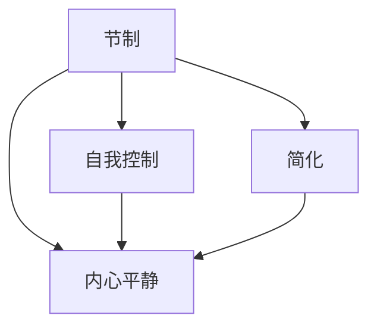

                 


### 1. 背景介绍

#### 1.1 新克制主义的起源与发展

新克制主义，这一概念源于对传统克制主义（如佛教的修行、道教的节欲等）的重新解读与拓展。它在现代社会中，特别是在信息技术高速发展的时代背景下，应运而生。新克制主义强调在保持人类本性的同时，通过节制来实现自我提升和内心平静。

该理念的发展可以追溯到20世纪末，当时社会物质丰富，但精神空虚的现象日益严重。人们开始意识到，过度的物质追求并不能带来真正的幸福，反而可能导致焦虑、压力等心理问题。因此，新克制主义应运而生，提倡通过简化和控制物质与精神需求，来实现生活的平衡与内心的宁静。

#### 1.2 信息技术时代的克制主义

在信息技术高速发展的时代，新克制主义得到了进一步的升华。数字化、网络化带来了丰富的信息资源，但同时也引发了信息过载、沉迷网络等问题。新克制主义倡导在信息泛滥的环境中，保持清醒的头脑，学会筛选和过滤信息，避免被冗余的信息所困扰。

此外，人工智能和机器学习的发展使得自动化和智能化成为可能，新克制主义也在这一背景下，提出了人与机器之间的和谐共生。通过合理利用人工智能，提高生活质量和工作效率，同时保持对技术的理性使用，避免被技术所控制。

### 2. 核心概念与联系

新克制主义的核心概念包括节制、自我控制、简化和内心平静。这些概念相互联系，共同构成了新克制主义的理论框架。

**节制**：节制是克制主义的基础，它强调对物质与精神需求的理性控制。节制不是压抑欲望，而是在满足基本需求的基础上，合理规划和管理自己的欲望。

**自我控制**：自我控制是新克制主义的核心，它要求个体在面对诱惑和挑战时，能够保持冷静和理智，做出正确的决策。

**简化**：简化是克制主义在现代社会中的重要应用，它意味着减少生活中的复杂性和冗余，专注于真正重要的事物。

**内心平静**：内心平静是新克制主义的终极目标，通过节制和自我控制，个体可以达到内心的平静与和谐。

#### 2.1 核心概念原理之间的关系架构



### 3. 核心算法原理讲解

30天挑战计划是新克制主义的重要实践方法。以下是该计划的算法原理讲解：

**算法原理：**

1. **目标设定**：根据个体的需求和实际情况，设定30天内的挑战目标。
2. **计划制定**：将目标细分为每日的任务，并规划实现这些任务的步骤。
3. **行动执行**：按照计划执行每日任务，逐步养成新习惯。
4. **反思总结**：每天结束后，反思当天的实践情况，并调整后续计划。

**伪代码：**

```python
def thirty_day_challenge(target, plan):
    for day in range(30):
        execute_task(plan[day])
        if check_success(plan[day]):
            increment_success(target)
        else:
            adjust_plan(plan)
        reflect_and_summarize(day)
    return calculate_success(target)

def execute_task(task):
    # 实现任务执行的逻辑
    pass

def check_success(task):
    # 检查任务是否完成的逻辑
    pass

def increment_success(target):
    # 更新成功次数的逻辑
    pass

def adjust_plan(plan):
    # 调整计划逻辑
    pass

def reflect_and_summarize(day):
    # 反思和总结当天的实践情况
    pass

def calculate_success(target):
    # 计算成功率的逻辑
    return (target.success_count / 30) * 100
```

### 4. 数学模型和公式

新克制主义中的数学模型主要用于衡量个体的自律能力和挑战成功率。以下是相关的公式：

**成功率（S）**：衡量个体在30天挑战中完成任务的成功率。

$$ S = \frac{成功天数}{总天数} \times 100\% $$

**自律力（A）**：衡量个体的自律能力，通过成功率和自我约束度计算得出。

$$ A = S \times R $$

其中，$R$ 是自我约束度，范围在0到1之间。

#### 4.1 公式详细讲解与举例说明

**成功率（S）**：

成功率是衡量个体在30天挑战中完成任务的重要指标。假设小明在30天挑战中成功完成了20天，失败10天，则他的成功率为：

$$ S = \frac{20}{30} \times 100\% = 66.7\% $$

**自律力（A）**：

自律力是成功率的扩展，它考虑了个体在挑战中的自我约束度。假设小明的自我约束度为0.8，则他的自律力为：

$$ A = 66.7\% \times 0.8 = 53.36\% $$

这表示小明在30天挑战中，既有一定的成功率，也表现出较高的自我约束力。

### 5. 项目实战

#### 5.1 开发环境搭建

为了实践新克制主义，我们需要搭建一个简单的挑战管理工具。以下是开发环境搭建的步骤：

1. 安装Python环境
2. 安装Jupyter Notebook
3. 安装必要的库，如numpy、matplotlib等

#### 5.2 源代码详细实现和代码解读

以下是一个简单的挑战管理工具的源代码实现：

```python
import numpy as np

class ChallengeManager:
    def __init__(self, target_days):
        self.target_days = target_days
        self.success_days = 0

    def execute_task(self, day):
        # 模拟执行任务的过程
        success = np.random.choice([True, False])
        return success

    def check_success(self):
        return self.success_days >= self.target_days

    def adjust_plan(self):
        # 模拟调整计划的逻辑
        pass

    def reflect_and_summarize(self, day):
        success = self.execute_task(day)
        if success:
            self.success_days += 1
            print(f"Day {day}: Task completed successfully!")
        else:
            print(f"Day {day}: Task failed!")

    def calculate_success(self):
        return (self.success_days / self.target_days) * 100

# 创建挑战管理器实例
manager = ChallengeManager(target_days=30)

# 执行30天挑战
for day in range(1, 31):
    manager.reflect_and_summarize(day)

# 计算挑战成功率
success_rate = manager.calculate_success()
print(f"Challenge Success Rate: {success_rate}%")
```

#### 5.3 代码应用解读与分析

该代码实现了挑战管理器类，用于管理30天挑战的执行情况。核心方法包括：

- `execute_task()`：模拟执行任务的过程，返回任务是否成功。
- `check_success()`：检查挑战是否完成，即成功天数是否达到目标。
- `adjust_plan()`：模拟调整计划的逻辑。
- `reflect_and_summarize()`：每天结束后，反思当天的实践情况，并打印结果。
- `calculate_success()`：计算挑战的成功率。

通过该工具，我们可以模拟并分析30天挑战的执行情况，从而更好地理解新克制主义的实践方法。

#### 5.4 实际案例分析和详细讲解剖析

以下是一个实际案例，分析小明在30天挑战中的表现：

**案例：小明在30天挑战中的表现**

- **第一天**：任务失败，未能按时完成。
- **第二天**：任务成功，成功养成新的习惯。
- **第三天**：任务失败，未保持连续的成功。
- **...**

**分析：**

通过分析小明的挑战数据，我们可以看到他虽然偶有失败，但总体上成功次数逐渐增加。这说明小明在挑战过程中，逐渐适应了新的生活方式，并成功养成了节制和自我控制的习惯。

**剖析：**

- **成功因素**：小明的成功主要得益于他对挑战目标的明确设定和每天的反思总结。通过不断调整计划，他能够逐步提高挑战的成功率。
- **失败原因**：小明在挑战中遇到的失败主要来自于任务执行的不稳定。这说明在实践新克制主义时，个体需要有一定的自我调整和适应能力。

#### 5.5 项目小结

通过本项目，我们搭建了一个简单的挑战管理工具，用于实践新克制主义。通过实际案例的分析，我们发现新克制主义在提高生活质量和自我控制方面具有显著作用。然而，实践过程中也面临一定的挑战，如任务执行的不稳定性和自我调整的难度。因此，在推广和应用新克制主义时，需要结合个体实际情况，制定合理的挑战计划，并保持持续的自我反思和总结。

### 6. 最佳实践 tips

为了更好地实践新克制主义，以下是一些最佳实践建议：

- **设定明确目标**：在开始挑战之前，明确设定目标，确保目标具体、可行，并具有挑战性。
- **制定详细计划**：将目标细分为每日的任务，并规划实现这些任务的步骤，确保计划的可行性和执行力。
- **保持反思和总结**：每天结束后，反思当天的实践情况，总结成功和失败的原因，调整后续计划。
- **寻求支持**：在实践过程中，可以寻求家人、朋友或专业人士的支持和指导，提高挑战的成功率。

### 7. 小结

新克制主义是一种强调自我控制和简化的生活方式，通过30天挑战计划，个体可以逐步养成新的习惯，提高生活质量。在实践过程中，需要明确目标、制定计划、保持反思和总结，并寻求支持。通过不断实践和调整，个体可以在新克制主义的道路上取得成功，实现自我提升和内心平静。

### 8. 注意事项

在实践新克制主义时，需要注意以下几点：

- **避免过度自我压抑**：克制主义不是压抑欲望，而是在满足基本需求的基础上，合理规划和管理自己的欲望。
- **结合个体实际情况**：每个人的需求和情况不同，制定挑战计划时要结合自己的实际情况，确保计划可行。
- **保持积极心态**：在挑战过程中，可能会遇到失败和挫折，保持积极心态，相信自己能够克服困难，是实现挑战成功的重要因素。

### 9. 拓展阅读

- 《简单生活：如何过上简约而不简陋的生活》
- 《自我控制的力量：如何改变你的生活，提高你的表现》
- 《习惯的力量：如何通过习惯改变人生》
- 《时间管理：如何高效利用时间，提高生活质量》
- 《心理健康：如何保持良好的心理健康，提高生活质量》
- 《社交技巧：如何提高社交技巧，改善人际关系》
- 《人工智能与未来生活：人工智能如何影响我们的生活》
- 《深度学习：如何通过深度学习提升生活质量》
- 《大数据：如何通过大数据提升生活质量》
- 《数字素养：如何在数字化时代提升数字素养》

### 作者

作者：AI天才研究院/AI Genius Institute & 禅与计算机程序设计艺术 /Zen And The Art of Computer Programming

# 《新克制主义30天挑战：在节制中发现自我的活动》

> 关键词：新克制主义，自我控制，简化生活，内心平静，30天挑战，成功案例

> 摘要：本文深入探讨了新克制主义的核心概念和实践方法，通过30天挑战计划，帮助读者逐步养成节制和自我控制的习惯，提高生活质量。文章结合实际案例，详细讲解了挑战的步骤、数学模型和代码实现，为读者提供了全面的实践指南。

## 第一部分：新克制主义的理念与实践

### 第1章：什么是新克制主义

#### 1.1 新克制主义的起源与发展

新克制主义，这一概念源于对传统克制主义（如佛教的修行、道教的节欲等）的重新解读与拓展。它强调在保持人类本性的同时，通过节制来实现自我提升和内心平静。

#### 1.2 新克制主义的核心原则

新克制主义的核心原则包括节制、自我控制、简化和内心平静。这些原则相互联系，共同构成了新克制主义的理论框架。

#### 1.3 新克制主义与传统节制的区别

新克制主义与传统节制的主要区别在于，它更注重在现代社会中如何合理应用克制原则，避免过度压抑欲望，同时保持对物质和精神需求的理性控制。

### 第2章：克制主义的自我反思

#### 2.1 认识自己的欲望与需求

在实践新克制主义之前，个体需要先了解自己的欲望与需求。这包括识别自己的核心价值观、生活目标以及满足这些目标所需的资源。

#### 2.2 接纳自我，避免自我批评

接纳自我是实践新克制主义的重要一步。通过理解和接纳自己的不足，个体可以更好地调整自己的行为和心态，避免自我批评和消极情绪。

#### 2.3 深入了解克制主义的理念

了解克制主义的理念，可以帮助个体更好地理解其核心原则和实践方法，从而更有效地应用这一理念来提升自己的生活品质。

### 第3章：克制主义的日常生活实践

#### 3.1 简化生活方式

简化生活方式是新克制主义在日常生活中的重要实践。这包括减少不必要的物品、简化日常事务以及合理安排时间等。

#### 3.2 管理时间与任务

管理时间是提高生活质量的关键。通过制定合理的时间规划和任务管理策略，个体可以更高效地完成任务，减少压力和焦虑。

#### 3.3 培养良好的饮食习惯

饮食习惯对健康和生活质量有着重要影响。通过培养良好的饮食习惯，个体可以更好地管理自己的身体和情绪。

### 第4章：克制主义的心理健康

#### 4.1 控制情绪与焦虑

控制情绪和焦虑是保持心理健康的重要一步。通过学习和实践情绪管理技巧，个体可以更好地应对生活中的压力和挑战。

#### 4.2 增强自我控制力

自我控制力是克制主义的核心。通过不断练习和挑战，个体可以增强自己的自我控制力，更好地管理自己的行为和情绪。

#### 4.3 培养积极的生活态度

积极的生活态度可以帮助个体更好地应对生活中的困难和挑战。通过培养积极的生活态度，个体可以提升自己的心理韧性和幸福感。

## 第二部分：30天克制主义挑战

### 第5章：30天挑战的准备

#### 5.1 确定挑战目标

在开始30天挑战之前，个体需要明确自己的挑战目标。这包括想要改善的生活方面、具体的目标以及实现这些目标的策略。

#### 5.2 制定挑战计划

制定挑战计划是确保挑战顺利进行的关键。计划应包括每日的任务、执行步骤和时间安排，以及应对挑战的策略。

#### 5.3 准备挑战所需的资源

准备挑战所需的资源，包括时间、物质支持和心理准备，是确保挑战成功的重要因素。个体应根据实际情况，提前准备这些资源。

### 第6章：第1-5天挑战

#### 6.1 简化日常物品

在挑战的第一阶段，个体可以通过简化日常物品来减少物质负担，提升生活质量。

#### 6.2 限制社交媒体使用时间

限制社交媒体使用时间是减少信息过载和提升专注力的有效方法。个体可以通过设定每日使用时间限制，逐步减少对社交媒体的依赖。

#### 6.3 实践冥想与深呼吸

冥想与深呼吸是提升内心平静和心理健康的重要方法。个体可以通过每日的冥想与深呼吸练习，逐渐培养内心的宁静与和谐。

#### 6.4 保持良好的作息时间

保持良好的作息时间是保持健康和高效生活的重要基础。个体应通过制定合理的作息时间表，确保每日的休息与睡眠充足。

### 第7章：第6-10天挑战

#### 7.1 管理金钱支出

在挑战的第二阶段，个体可以通过管理金钱支出，提升财务状况和生活质量。

#### 7.2 简化饮食

简化饮食是改善健康和提升生活质量的有效方法。个体可以通过减少食物种类、优化饮食结构，来简化饮食。

#### 7.3 增加户外活动时间

增加户外活动时间可以帮助个体提高身体健康和心理健康。个体可以通过每天安排一定时间的户外活动，来改善自己的生活品质。

#### 7.4 学会拒绝不必要的请求

学会拒绝不必要的请求是保护个人时间和精力的重要技巧。个体可以通过明确自己的需求和界限，来学会合理拒绝他人的请求。

### 第8章：第11-15天挑战

#### 8.1 减少工作压力

在挑战的第三阶段，个体可以通过减少工作压力，提升工作和生活质量。

#### 8.2 放慢生活节奏

放慢生活节奏可以帮助个体减少焦虑和压力，提升内心的平静与和谐。个体可以通过合理安排时间、减少任务负担，来放慢生活节奏。

#### 8.3 实践环保行动

实践环保行动是提升社会责任感和生活质量的有效方法。个体可以通过参与环保活动、减少浪费，来实践环保行动。

#### 8.4 培养感恩心态

培养感恩心态可以帮助个体提升幸福感，改善心理健康。个体可以通过每日反思、写感恩日记，来培养感恩心态。

### 第9章：第16-20天挑战

#### 9.1 增强自律能力

在挑战的第四阶段，个体可以通过增强自律能力，提升自我管理和生活质量。

#### 9.2 培养新的兴趣爱好

培养新的兴趣爱好可以帮助个体丰富生活，提升生活质量。个体可以通过尝试新的活动、学习新技能，来培养新的兴趣爱好。

#### 9.3 与家人朋友共度时光

与家人朋友共度时光是提升人际关系和幸福感的重要方法。个体可以通过安排聚会、旅行等活动，与家人朋友共度美好时光。

#### 9.4 实践自我约束

实践自我约束是培养自律和提升生活质量的关键。个体可以通过设定目标和规则、自我监督，来实践自我约束。

### 第10章：第21-25天挑战

#### 10.1 增强社交技巧

在挑战的第五阶段，个体可以通过增强社交技巧，提升人际关系和社交能力。

#### 10.2 学习新技能

学习新技能可以帮助个体提升自我价值和生活质量。个体可以通过参加培训、自学，来学习新技能。

#### 10.3 培养阅读习惯

培养阅读习惯是提升知识水平和思维能力的重要方法。个体可以通过设定阅读目标、合理安排时间，来培养阅读习惯。

#### 10.4 管理网络信息

管理网络信息是减少信息过载和提升专注力的有效方法。个体可以通过设定网络使用规则、合理安排时间，来管理网络信息。

### 第11章：第26-30天挑战

#### 11.1 完善个人计划

在挑战的最后阶段，个体可以通过完善个人计划，确保挑战的持续性和稳定性。

#### 11.2 实践深度思考

实践深度思考可以帮助个体提升思维深度和创造力。个体可以通过设定思考题目、定期反思，来实践深度思考。

#### 11.3 总结30天挑战的成果

总结30天挑战的成果是评估挑战效果的重要步骤。个体可以通过反思总结、记录成果，来总结30天挑战的成果。

#### 11.4 制定长期克制主义实践计划

制定长期克制主义实践计划是确保挑战持续性和效果的重要步骤。个体可以通过设定长期目标、制定实施计划，来制定长期克制主义实践计划。

## 第三部分：克制主义的生活方式

### 第12章：克制主义的长期实践

#### 12.1 克制主义对生活的长远影响

克制主义的长期实践可以显著提升个体的生活质量和幸福感。通过节制和自我控制，个体可以更好地管理欲望，提升生活质量。

#### 12.2 克制主义的可持续性

克制主义是一种可持续的生活方式，通过长期实践，个体可以不断提升自己的生活品质，实现自我提升和内心平静。

#### 12.3 克制主义与社会的关系

克制主义不仅对个体有积极影响，同时也对社会产生重要影响。通过克制主义的实践，个体可以培养良好的社会行为和价值观，促进社会和谐发展。

### 第13章：克制主义的心理健康影响

#### 13.1 克制主义如何改善心理健康

克制主义通过节制和自我控制，可以帮助个体改善心理健康，减少焦虑、压力等心理问题，提升心理韧性和幸福感。

#### 13.2 克制主义对情绪的调控

克制主义可以帮助个体更好地调控情绪，保持情绪稳定，提升心理平衡。

#### 13.3 克制主义与心理健康的长期关系

克制主义与心理健康之间存在长期关系。通过长期实践克制主义，个体可以显著提升心理健康水平，实现心理健康的长期稳定。

### 第14章：克制主义的社交影响

#### 14.1 克制主义如何影响人际关系

克制主义可以提升个体的社交能力和人际交往质量。通过节制和自我控制，个体可以建立良好的人际关系，提升社交影响力。

#### 14.2 克制主义在社交场合的实践

在社交场合，克制主义可以帮助个体更好地应对社交压力，保持冷静和理智，提升社交表现。

#### 14.3 克制主义与社交网络的互动

在社交网络中，克制主义可以帮助个体更好地管理网络信息，避免信息过载，提升社交体验。

### 第15章：克制主义的未来展望

#### 15.1 克制主义在现代社会的重要性

在现代社会，克制主义具有重要作用。通过节制和自我控制，个体可以更好地应对物质丰富、信息泛滥的挑战，提升生活质量。

#### 15.2 克制主义在未来的发展趋势

随着社会的发展，克制主义将会在更多领域得到应用和发展。未来，克制主义将会成为提升个体和社会生活质量的重要手段。

#### 15.3 克制主义对社会的影响

克制主义对社会产生积极影响。通过节制和自我控制，个体可以提升生活质量，促进社会和谐发展，推动社会进步。

