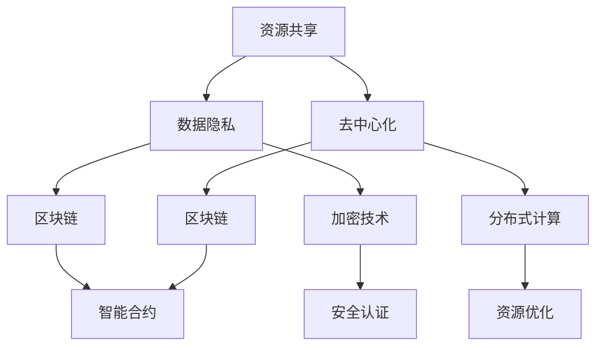

                 

### 文章标题

《新共产主义：数字时代的资源共享》

### 关键词

新共产主义、数字时代、资源共享、区块链、加密技术、分布式计算

### 摘要

本文旨在探讨数字时代下的新共产主义理念，重点阐述资源共享的原理、实践和实现方式。通过深入分析历史背景、核心概念及其相互关系，本文将揭示新共产主义在数字化社会中的重要作用。同时，通过讲解核心算法原理、数学模型以及具体项目实战案例，本文将帮助读者理解新共产主义在现实世界中的应用和潜力，为构建一个更公平、高效的资源共享体系提供有益的启示。

### 1. 引言

在人类历史的演进过程中，共产主义一直被视为一种追求社会公平和资源均等分配的理想社会制度。然而，随着科技的发展和数字时代的到来，传统的共产主义理念面临着新的挑战和机遇。本文将探讨一种新的共产主义形式——新共产主义，其核心在于利用数字技术实现资源共享，从而推动社会公平和经济发展的新路径。

新共产主义的理念不仅是对传统共产主义的继承和发扬，更是对现代社会的回应。数字时代的特点，如信息爆炸、全球互联、数据驱动等，为资源共享提供了前所未有的可能性。在这个背景下，新共产主义的目标是通过技术手段优化资源分配，提高社会整体福利，实现人类社会的可持续发展。

本文将从以下几个方面展开讨论：

1. **历史背景**：回顾共产主义理念的发展历程，探讨数字时代对其的挑战与机遇。
2. **核心概念与联系**：阐述新共产主义的核心概念，如资源共享、数据隐私、去中心化等，并通过 Mermaid 流程图展示其相互关系。
3. **核心算法原理**：讲解实现新共产主义所需的关键算法，包括分布式计算、区块链、加密技术等，并通过伪代码进行详细说明。
4. **数学模型与公式**：介绍支持新共产主义理念的各种数学模型和公式，并进行举例说明。
5. **项目实战案例**：通过实际项目案例展示新共产主义的实现，包括开发环境搭建、源代码实现、代码解读和应用分析。
6. **最佳实践与拓展**：总结新共产主义在实践中的应用，提出注意事项和拓展阅读建议。

通过以上几个方面的探讨，本文希望为读者提供一个全面、深入的视角，理解新共产主义在数字时代的意义和应用。

### 1.1 历史背景

共产主义理念起源于19世纪，马克思和恩格斯在《共产党宣言》中首次系统地阐述了共产主义的理论基础。马克思认为，资本主义制度虽然推动了生产力的发展，但造成了社会的不平等和剥削，最终会引发无产阶级的革命，建立一个没有阶级差别、资源公平分配的共产主义社会。这一理论在20世纪得到了广泛传播和实践，苏联、中国等国家的社会主义建设，都可以看作是对共产主义理念的现实尝试。

然而，随着时代的发展，共产主义面临了诸多挑战。20世纪末，苏联解体和东欧剧变，标志着传统的社会主义模式遭遇了严重的困境。这些事件揭示了在现实操作中，共产主义社会建设面临的经济、政治、文化等多方面的复杂问题。特别是在信息时代，数字技术的快速发展和全球化进程的加速，使得传统的共产主义理念需要重新审视和调整。

数字时代带来了信息爆炸、全球互联、大数据等新现象，使得资源分配和社会治理的复杂性大大增加。在这个背景下，传统共产主义理念中的集中控制和计划经济模式显得力不从心。资源分配的效率和透明度成为新的难题，而数字技术的应用为解决这些问题提供了新的思路。

首先，数字技术的普及使得信息获取和传播更加便捷，有助于提高资源分配的透明度。例如，区块链技术通过去中心化的方式记录交易信息，使得每个参与者都能查看和验证，从而减少了信息不对称和权力滥用的问题。

其次，数字技术促进了全球资源的共享和优化配置。例如，通过分布式计算和大数据分析，可以更精准地预测资源需求，优化资源分配策略，提高资源利用效率。这种基于技术的资源优化分配方式，与传统计划经济模式下的资源分配有着本质的不同。

此外，数字技术还为新的社会治理模式提供了可能。去中心化自治组织（DAO）等新型组织形式，通过区块链技术实现去中心化的管理和决策，使得社会治理更加透明和高效。这种模式在一定程度上克服了传统政府和企业集中管理的弊端，为实现共产主义社会中的平等和公平提供了新的路径。

总之，数字时代对共产主义理念提出了新的挑战和机遇。在新的历史背景下，重新审视和调整共产主义理念，探索利用数字技术实现资源共享的新路径，是当前社会发展的重要课题。通过本文的探讨，我们将进一步理解新共产主义在数字时代的内涵和意义。

### 1.2 核心概念与联系

在新共产主义的探讨中，核心概念与它们之间的联系构成了理解这一理念的基础。以下我们将详细阐述这些核心概念，并通过 Mermaid 流程图展示它们之间的相互关系。

**1. 资源共享**

资源共享是指通过技术手段实现资源在不同个体或组织之间的公平、高效分配。在数字时代，资源共享的重要性尤为突出。例如，云计算平台通过提供计算资源，使得小型企业和个人能够以低成本、高效能的方式使用高级计算资源。资源共享不仅能够提高资源利用率，还能够降低社会整体的资源消耗。

**2. 数据隐私**

数据隐私是指保护个人或组织的数据不被未经授权的第三方获取或使用。在数字时代，数据已成为新的生产要素，因此保护数据隐私变得尤为重要。区块链技术通过加密和分布式账本的方式，确保了数据的安全性和隐私性。去中心化的数据存储和访问控制机制，使得数据在共享的同时，也能保障其隐私和安全。

**3. 去中心化**

去中心化是指通过去除了传统中心化结构中的集中控制，实现更加平等和透明的系统运作。在数字时代，去中心化技术如区块链和分布式计算，为资源共享提供了技术基础。去中心化系统不仅能够提高系统的可靠性和容错性，还能够减少信息不对称和权力滥用的问题。

**4. 区块链**

区块链是一种分布式账本技术，通过加密算法和共识机制，实现数据的不可篡改和透明性。区块链在资源共享中的应用，如智能合约，能够自动执行协议，确保资源的公平分配和有效使用。此外，区块链的去中心化特性，使得它成为实现数据隐私和安全的重要工具。

**5. 加密技术**

加密技术是通过将信息转换为密文，保护信息不被未授权者获取。在数字时代，加密技术不仅用于保护数据隐私，还用于实现资源共享中的安全认证。例如，公钥加密算法可以确保数据在传输过程中的完整性和真实性。

**6. 分布式计算**

分布式计算是指通过将计算任务分布在多个节点上，协同完成计算任务。在资源共享中，分布式计算能够提高资源利用效率，优化资源分配策略。例如，通过大数据分析，可以预测资源需求，从而实现动态调整资源分配。

通过上述核心概念的阐述，我们可以看到这些概念之间的紧密联系。以下是一个简单的 Mermaid 流程图，展示这些概念之间的关系：



在 Mermaid 流程图中，我们可以清晰地看到资源共享如何与数据隐私、去中心化、区块链、加密技术和分布式计算相互关联。这些核心概念共同构成了新共产主义的理论基础，为数字时代下的资源共享提供了可行的路径。

通过深入理解这些核心概念及其相互关系，读者能够更全面地把握新共产主义的内涵，为后续的算法原理讲解和项目实战案例打下坚实的基础。

### 1.3 资源共享的原理与实践

在数字时代，资源共享作为一种新型资源分配方式，正逐步改变着传统的经济模式和社会结构。其原理与实践不仅依赖于技术创新，还涉及一系列复杂的社会、经济和技术因素。

#### 资源共享的原理

资源共享的核心在于通过技术手段实现资源的高效、公平分配。以下是资源共享的关键原理：

1. **资源整合与优化分配**：通过整合分散的资源，形成规模效应，从而提高资源利用效率。例如，云计算平台通过提供计算资源池，使得不同用户可以根据自己的需求动态分配资源，避免了资源闲置和浪费。

2. **去中心化**：资源共享依赖于去中心化技术，如区块链和分布式计算。去中心化能够减少信息不对称和权力集中，提高系统的透明度和可信度。

3. **加密与隐私保护**：在资源共享过程中，数据的安全性和隐私保护至关重要。加密技术能够确保数据在传输和存储过程中的完整性，同时保护用户隐私。

4. **动态调整与优化**：通过实时监测资源使用情况，动态调整资源分配策略，以实现资源利用的最优化。大数据分析和人工智能技术的应用，为资源共享的动态调整提供了技术支持。

#### 资源共享的实践

在实际操作中，资源共享需要通过具体的平台和机制来实现。以下是一些典型的资源共享实践案例：

1. **云计算平台**：如亚马逊AWS、微软Azure等，通过提供计算、存储、网络等资源，实现企业级用户的弹性资源分配。这些平台不仅降低了企业使用高端资源的门槛，还提高了资源利用效率。

2. **共享经济**：以Uber、Airbnb等为代表的共享经济平台，通过互联网技术，将闲置资源（如车辆、房屋）进行共享，实现资源的最大化利用。这种模式不仅优化了资源配置，还改变了人们的消费习惯。

3. **去中心化应用（DApp）**：基于区块链技术的去中心化应用，如以太坊上的智能合约，通过去中心化的方式实现资源的自动化管理和分配。例如，去中心化的金融应用（DeFi）通过智能合约，实现了点对点的资金转移和借贷，避免了传统金融系统中的中介环节。

4. **物联网（IoT）**：物联网技术通过连接各种设备，实现设备间的资源共享和协同工作。例如，智能家居系统中的设备可以通过物联网实现资源的优化配置，如智能照明、智能空调等。

#### 资源共享的挑战

尽管资源共享在理论上具有显著优势，但在实际应用中仍面临诸多挑战：

1. **技术瓶颈**：当前的技术水平尚未完全解决资源共享中的某些技术难题，如数据隐私保护、资源优化分配等。这些瓶颈需要通过持续的技术创新和优化来解决。

2. **法律与政策**：资源共享涉及到数据隐私、知识产权等多个法律和道德问题，需要完善的法律法规和政策框架来保障其健康发展。

3. **用户信任**：在去中心化系统中，用户对系统的信任至关重要。如何建立和维护用户信任，是资源共享平台面临的重要挑战。

4. **经济激励**：在资源共享中，如何合理分配经济利益，激励各方积极参与，是维持系统稳定运行的关键。

总之，资源共享在数字时代具有重要的现实意义，其原理与实践为优化资源分配提供了新的路径。通过技术创新和制度保障，资源共享有望实现更加公平、高效的资源利用，推动社会的可持续发展。

### 2.1 数据隐私在资源共享中的重要性

在数字时代的资源共享中，数据隐私问题至关重要。数据隐私不仅关系到个人的信息安全，也影响到整个社会的信任和稳定。以下将从数据隐私的定义、技术手段和实际应用等方面进行深入探讨。

#### 数据隐私的定义

数据隐私是指个人或组织的数据在存储、处理、传输等过程中，不受未经授权的访问、使用或泄露。数据隐私保护的核心目标是确保数据的机密性、完整性和可用性，防止信息被滥用或非法获取。

#### 技术手段

在数字时代，数据隐私保护依赖于多种技术手段，以下是一些常见的技术手段：

1. **加密技术**：加密是数据隐私保护的基本手段。通过加密算法，将数据转换为密文，只有拥有解密密钥的用户才能解读数据。常用的加密算法包括对称加密（如AES）和非对称加密（如RSA）。

2. **同态加密**：同态加密允许在加密数据上直接进行计算，而不需要解密。这使得数据处理过程中仍能保持数据的隐私，但计算复杂度较高，目前主要应用于特定场景。

3. **匿名化处理**：匿名化处理通过去除或隐藏个人身份信息，将数据转换为匿名数据。虽然匿名化处理后数据不再能直接识别个人，但仍有被重新识别的风险，适用于数据分析和研究。

4. **零知识证明**：零知识证明是一种安全证明机制，允许证明者向验证者证明某个陈述为真，而无需透露任何具体信息。这种技术常用于身份验证和隐私保护。

5. **多方安全计算**：多方安全计算允许多个参与方在保护隐私的情况下共同完成计算任务。通过加密和协议设计，确保各方无法获取其他方的数据，同时完成联合计算。

#### 数据隐私在资源共享中的应用

数据隐私在资源共享中的应用场景广泛，以下是一些典型的应用：

1. **去中心化应用（DApp）**：基于区块链的DApp通过智能合约实现去中心化的数据处理和共享。区块链的加密和分布式账本技术，确保了数据在共享过程中的安全性和隐私性。

2. **共享经济平台**：如Uber、Airbnb等共享经济平台，通过加密技术保护用户信息和交易记录。这些平台通常采用多因素身份验证和加密通讯，确保用户数据的安全。

3. **医疗数据共享**：在医疗领域，患者数据的安全和隐私保护至关重要。通过加密和隐私保护技术，可以实现医疗数据的共享，促进医学研究和创新。

4. **物联网（IoT）**：物联网设备通过加密和身份验证技术，保护设备间的数据传输和存储。这对于实现高效、安全的资源共享具有重要意义。

#### 案例分析

以下是一个具体的数据隐私保护案例：

**案例：区块链医疗数据共享**

假设一家医院希望通过区块链平台共享患者的医疗数据，以促进医学研究和创新。为实现数据隐私保护，可以采用以下步骤：

1. **数据加密**：将患者的医疗数据加密存储在区块链上，确保数据在传输和存储过程中不被窃取或篡改。

2. **隐私保护计算**：通过零知识证明技术，实现医疗数据的隐私保护计算。例如，研究人员可以通过区块链验证数据的有效性，而不需要获取具体数据。

3. **身份验证**：采用多因素身份验证技术，确保只有授权人员才能访问和操作医疗数据。

4. **访问控制**：通过区块链的访问控制机制，设定不同权限等级，确保数据在不同角色间安全、合理地共享。

通过以上技术手段和应用，区块链医疗数据共享平台可以实现高效、安全的资源共享，同时保障患者的数据隐私。

总之，数据隐私在资源共享中的重要性不容忽视。通过多种技术手段和合理应用，可以有效保护数据隐私，推动资源共享的健康发展。

### 2.2 去中心化：数字时代的共享机制

去中心化是数字时代资源共享的核心机制，通过消除中心化控制，实现更透明、安全和高效的资源分配。去中心化不仅仅是技术问题，更是一种全新的社会和经济范式，其应用范围涵盖了金融、能源、医疗等多个领域。

#### 去中心化的定义

去中心化（Decentralization）是指将权力和资源分配从单一中心节点转移到多个分布式节点，以实现更平等和透明的系统运作。去中心化系统通过去除了传统中心化结构中的集中控制，使得每个节点都能独立运作，从而提高了系统的容错性和抗攻击性。

#### 去中心化的技术实现

1. **区块链**：区块链是去中心化技术的核心，通过分布式账本记录所有交易信息，确保数据的不可篡改和透明性。区块链上的每个节点都保存一份完整的数据副本，任何修改都需要所有节点的共识，从而保证了数据的真实性和安全性。

2. **智能合约**：智能合约是自动执行合约条款的计算机程序，基于区块链平台运行。智能合约通过代码定义了交易规则和执行逻辑，确保交易在满足条件时自动执行，从而简化了交易流程，降低了交易成本。

3. **分布式计算**：分布式计算将计算任务分布在多个节点上，协同完成计算。这种方式不仅提高了计算效率，还避免了单点故障的风险。

4. **密码学**：密码学技术用于确保数据在传输和存储过程中的安全，如加密、签名和验证等。

#### 去中心化在资源共享中的应用

1. **金融领域**：去中心化金融（DeFi）通过区块链和智能合约实现点对点的金融交易，无需依赖传统金融机构。DeFi包括去中心化交易所（DEX）、去中心化借贷平台和去中心化保险等应用，提高了金融交易的透明度和效率。

2. **能源领域**：分布式能源网络通过去中心化技术实现能源的生产和分配，如区块链上的太阳能电站。用户可以通过区块链平台直接购买和销售能源，降低了能源交易的成本和中间环节。

3. **医疗领域**：区块链在医疗数据共享中的应用，通过去中心化技术确保患者数据的隐私和安全。医疗机构可以通过区块链平台共享医疗数据，促进医学研究和创新。

4. **供应链管理**：去中心化技术可以优化供应链管理，通过区块链记录和验证每个环节的信息，确保供应链的透明和可追溯性。

#### 去中心化的优点

1. **透明性**：去中心化系统通过分布式账本和透明规则，确保了所有参与者都能查看和验证交易信息，减少了信息不对称和权力滥用。

2. **安全性**：去中心化系统通过去除了单点控制，提高了系统的抗攻击性和容错性。即使某个节点出现故障，系统仍能正常运行。

3. **效率**：去中心化系统通过减少中间环节和简化交易流程，提高了资源分配的效率。

4. **平等性**：去中心化消除了中心化结构中的等级差异，使得每个节点都能平等参与，实现了更加公平的资源分配。

#### 去中心化的挑战

1. **技术复杂性**：去中心化系统需要复杂的技术支持，如区块链、智能合约和密码学等，这对开发和维护提出了较高要求。

2. **法律法规**：去中心化技术涉及多个法律和道德问题，如数据隐私、知识产权和交易合法性等，需要完善的法律法规和政策框架来保障其健康发展。

3. **用户信任**：在去中心化系统中，用户对系统的信任至关重要。如何建立和维护用户信任，是去中心化技术面临的重要挑战。

4. **性能问题**：去中心化系统在处理大量交易时，可能面临性能瓶颈。如何提高去中心化系统的性能，是技术发展的关键问题。

总之，去中心化是数字时代资源共享的重要机制，其通过消除中心化控制，实现了更透明、安全和高效的资源分配。尽管面临一定的挑战，但去中心化技术具有巨大的潜力，将在未来继续推动资源共享和社会经济的发展。

### 2.3 区块链技术：新共产主义的基石

区块链技术是数字时代实现资源共享和新共产主义理念的重要基石。通过分布式账本和智能合约，区块链不仅保障了数据的透明性和不可篡改性，还为去中心化的资源分配提供了可靠的技术支持。以下将详细讲解区块链技术的基本原理、主要特点及其在资源共享中的应用。

#### 区块链技术的基本原理

区块链是一种分布式数据库技术，通过加密算法和共识机制，实现数据的分布式存储和验证。区块链的基本原理如下：

1. **分布式账本**：区块链通过多个节点（计算机）共同维护一个分布式账本，每个节点都保存了一份完整的数据副本。所有交易记录都通过区块链网络验证并记录在账本上，确保数据的完整性和一致性。

2. **加密算法**：区块链使用加密算法确保数据的隐私和安全。交易记录在区块链上以加密的形式存储，只有持有解密密钥的节点才能查看交易内容。这有效地防止了数据篡改和未授权访问。

3. **共识机制**：共识机制是区块链中用于决定数据一致性的算法。不同类型的区块链采用不同的共识机制，如工作量证明（PoW）、权益证明（PoS）和委托权益证明（DPoS）等。共识机制确保了所有节点对账本数据的共识，从而保障了区块链的稳定性和安全性。

4. **智能合约**：智能合约是运行在区块链上的计算机程序，通过代码定义了交易规则和执行逻辑。智能合约在满足条件时自动执行，确保了交易过程的透明性和不可篡改性。智能合约在资源共享中的应用，使得资源分配和管理更加高效和自动化。

#### 区块链技术的主要特点

1. **去中心化**：区块链通过去除了中心化控制，实现了分布式数据的存储和管理。去中心化不仅提高了系统的透明性和安全性，还减少了单点故障的风险。

2. **数据透明性**：区块链上的所有交易记录都是公开的，任何参与者都可以查看和验证。这提高了数据透明度，减少了信息不对称和权力滥用。

3. **不可篡改性**：区块链上的数据一旦记录，就不可篡改。所有交易记录都通过加密和共识机制保障了数据的真实性和一致性。

4. **安全性**：区块链使用加密算法和共识机制，确保了数据的安全性和隐私性。即使某个节点被攻击，整个区块链系统仍能保持稳定。

#### 区块链技术在资源共享中的应用

1. **去中心化金融（DeFi）**：DeFi是区块链技术在金融领域的重要应用，通过智能合约实现点对点的金融交易，无需依赖传统金融机构。DeFi包括去中心化交易所（DEX）、去中心化借贷平台和去中心化保险等应用，提高了金融交易的透明度和效率。

2. **共享经济**：区块链技术在共享经济中的应用，如共享住宿平台（如Airbnb）、共享交通平台（如Uber）等，通过去中心化的方式实现资源的高效分配和利用。这些平台通过区块链记录和验证用户和资源的信息，提高了系统的透明性和可信度。

3. **供应链管理**：区块链技术在供应链管理中的应用，通过分布式账本记录和验证供应链中的所有环节信息，确保供应链的透明和可追溯性。例如，食品行业可以通过区块链记录食品的生产、加工和运输信息，提高食品安全和消费者信任。

4. **医疗数据共享**：区块链技术在医疗数据共享中的应用，通过去中心化的方式确保患者数据的隐私和安全。医疗机构可以通过区块链平台共享医疗数据，促进医学研究和创新，同时保障患者的数据隐私。

5. **能源管理**：区块链技术在能源管理中的应用，如分布式能源网络，通过区块链记录和验证能源的生产和交易信息，提高了能源利用效率。用户可以通过区块链平台直接购买和销售能源，降低了能源交易的成本和中间环节。

总之，区块链技术是数字时代实现资源共享和新共产主义理念的关键技术。通过分布式账本和智能合约，区块链不仅保障了数据的透明性和不可篡改性，还为去中心化的资源分配提供了可靠的技术支持。随着区块链技术的不断发展和应用，其在资源共享领域的作用将越来越重要。

### 2.4 加密技术：保障资源共享安全的关键

在数字时代，加密技术是保障资源共享安全的核心手段。加密技术通过将信息转化为密文，确保数据在传输和存储过程中的机密性、完整性和真实性。以下将详细讲解加密技术的基本原理、常用算法及其在资源共享中的应用。

#### 加密技术的基本原理

加密技术的基本原理是将明文（plaintext）通过加密算法和密钥（key）转化为密文（ciphertext），只有拥有相应解密密钥的接收者才能将密文还原为明文。加密过程主要包括以下步骤：

1. **加密算法**：加密算法是用于将明文转化为密文的数学函数。常见的加密算法包括对称加密（如AES、DES）和非对称加密（如RSA、ECC）。

2. **密钥生成**：密钥是加密和解密过程中使用的参数，其安全性直接影响到加密系统的安全性。密钥生成通常基于随机数生成器，确保密钥的唯一性和难以预测性。

3. **加密过程**：加密过程是将明文输入加密算法，通过密钥进行加密，生成密文。例如，AES加密算法通过密钥对明文进行分块加密，生成固定长度的密文。

4. **解密过程**：解密过程是将密文输入解密算法，通过密钥进行解密，还原为明文。解密算法与加密算法相同，但密钥方向相反。

#### 常用加密算法

1. **对称加密**：对称加密算法使用相同的密钥进行加密和解密。常见的对称加密算法包括AES（高级加密标准）、DES（数据加密标准）和3DES（三重DES）。对称加密算法的优点是加密和解密速度快，但密钥管理复杂，需要确保密钥的安全存储和分发。

2. **非对称加密**：非对称加密算法使用一对密钥进行加密和解密，分别是公钥（public key）和私钥（private key）。公钥用于加密，私钥用于解密。常见的非对称加密算法包括RSA（Rivest-Shamir-Adleman）和ECC（椭圆曲线加密）。非对称加密算法的优点是密钥管理简单，但加密和解密速度较慢。

3. **哈希算法**：哈希算法用于生成数据的摘要，用于数据完整性校验和数字签名。常见的哈希算法包括SHA-256、SHA-3和MD5。哈希算法的优点是生成速度快，且输出固定长度，但无法通过哈希值反推出原始数据。

#### 加密技术在资源共享中的应用

1. **数据传输加密**：在资源共享过程中，数据在传输过程中容易受到攻击，因此需要使用加密技术保障数据的安全。常用的传输加密协议包括SSL/TLS（安全套接层/传输层安全协议），它们通过加密算法和证书机制确保数据在传输过程中的机密性和完整性。

2. **存储加密**：数据在存储过程中，也面临泄露和篡改的风险。存储加密通过将数据加密存储在磁盘或云存储中，确保即使数据被未经授权的用户获取，也无法解读数据。常用的存储加密技术包括文件加密、数据库加密和云存储加密。

3. **身份验证**：在资源共享中，身份验证是确保用户合法性和系统安全的重要手段。加密技术通过数字签名和证书机制，确保用户身份的合法性和通信的安全性。例如，区块链中的智能合约通过数字签名验证合约参与者的身份，确保交易的安全性和不可篡改性。

4. **隐私保护**：在共享经济和医疗数据共享等场景中，数据隐私保护至关重要。加密技术通过加密算法和隐私保护协议，确保用户数据的隐私和安全。例如，匿名化处理和多方安全计算等技术，通过加密和协议设计，实现数据在共享过程中的隐私保护。

总之，加密技术是保障资源共享安全的关键手段。通过对信息进行加密，确保数据在传输、存储和处理的各个环节中的安全性和隐私性。随着加密技术的不断发展和应用，其在资源共享领域的保护作用将越来越重要。

### 2.5 分布式计算：资源共享的高效引擎

分布式计算是数字时代实现资源共享的重要技术之一，通过将计算任务分布在多个节点上，协同完成计算任务，从而提高计算效率和资源利用效率。分布式计算不仅能够处理大规模数据，还能够在资源不足或故障发生时，保持系统的稳定性和可靠性。以下将详细讲解分布式计算的基本原理、关键技术和应用案例。

#### 分布式计算的基本原理

分布式计算的基本原理是将一个大型计算任务分解为多个子任务，然后将这些子任务分配到不同的计算节点上执行，最后将子任务的结果汇总得到最终结果。分布式计算的核心要素包括：

1. **任务分解**：将大型计算任务分解为多个子任务，通常根据任务的特点和数据分布进行分解。

2. **任务分配**：将分解后的子任务分配到不同的计算节点上执行。任务分配通常基于负载均衡和任务依赖关系进行。

3. **数据传输**：分布式计算中，子任务的数据需要在计算节点之间传输，以确保数据的一致性和完整性。

4. **任务调度**：任务调度负责管理子任务的执行和监控，包括任务的重启、故障恢复和结果汇总。

5. **数据汇总**：将各个计算节点上子任务的结果汇总，得到最终结果。

#### 分布式计算的关键技术

1. **MapReduce**：MapReduce是一种分布式数据处理框架，用于处理大规模数据集。MapReduce将计算任务分为“Map”和“Reduce”两个阶段。Map阶段对输入数据进行映射处理，生成中间结果；Reduce阶段对中间结果进行归约处理，生成最终结果。MapReduce通过任务分解和并行执行，提高了数据处理效率。

2. **分布式存储**：分布式存储是将数据存储在多个节点上，通过分布式文件系统（如HDFS）或NoSQL数据库（如HBase、Cassandra）实现。分布式存储不仅能够提高数据访问速度，还能够保证数据的高可用性和容错性。

3. **负载均衡**：负载均衡是将计算任务均匀分配到各个计算节点上，以避免某个节点过载。常见的负载均衡算法包括随机负载均衡、最小连接负载均衡和轮询负载均衡等。

4. **数据一致性**：在分布式计算中，数据一致性是一个关键问题。分布式一致性协议（如Paxos、Raft）通过确保多节点间数据的一致性，从而提高系统的可靠性。

5. **故障恢复**：分布式计算系统中的节点可能会出现故障，因此需要实现故障恢复机制。常见的故障恢复策略包括副本备份、心跳检测和故障转移等。

#### 分布式计算的应用案例

1. **大数据分析**：分布式计算在大数据分析中具有重要应用。例如，通过MapReduce框架，可以高效地处理和分析大规模数据集，如搜索引擎的索引生成、社交媒体的数据分析等。

2. **云计算**：分布式计算是云计算的核心技术之一。云计算平台（如Hadoop、Spark）通过分布式计算框架，提供了强大的数据处理和计算能力，为各种应用程序提供了高性能的计算服务。

3. **科学计算**：在科学计算领域，如气象预报、基因测序和流体力学模拟等，分布式计算能够显著提高计算效率和结果准确性。通过将计算任务分解和并行执行，分布式计算能够加速科学研究的进程。

4. **金融计算**：分布式计算在金融领域也有广泛应用，如高频交易、风险管理等。通过分布式计算框架，金融机构能够快速处理大量交易数据，进行实时分析和决策。

5. **物联网（IoT）**：在物联网领域，分布式计算能够处理来自大量设备的实时数据。例如，智能交通系统通过分布式计算框架，实时分析交通数据，优化交通流量管理。

总之，分布式计算是数字时代实现资源共享的重要技术，通过将计算任务分布在多个节点上，分布式计算不仅提高了计算效率和资源利用效率，还为大数据处理和实时计算提供了强大支持。随着分布式计算技术的不断发展和应用，其在资源共享和其他领域的潜力将不断释放。

### 2.6 数学模型与公式

在探讨新共产主义理念及其实现时，数学模型和公式扮演着关键角色，为资源共享和优化分配提供了理论支持。以下将介绍几个关键数学模型和公式，并通过具体示例进行讲解，帮助读者理解其在数字时代资源共享中的应用。

#### 1. 数据挖掘与分布式计算

数据挖掘是识别大规模数据集中隐藏模式的重要技术，在分布式计算中尤为关键。以下是一个常见的数据挖掘模型：

**协同过滤算法**

协同过滤是一种通过分析用户行为数据，预测用户兴趣和推荐物品的算法。常见的协同过滤模型包括基于用户的协同过滤（User-based）和基于物品的协同过滤（Item-based）。

**基于用户的协同过滤公式：**

\[ r_{u,i} = \frac{\sum_{j \in N(u)} sim(u, j) \cdot r_{j,i}}{\sum_{j \in N(u)} sim(u, j)} \]

其中：
- \( r_{u,i} \) 表示用户 \( u \) 对物品 \( i \) 的预测评分。
- \( N(u) \) 表示用户 \( u \) 的邻居集合。
- \( sim(u, j) \) 表示用户 \( u \) 和 \( j \) 之间的相似度。
- \( r_{j,i} \) 表示邻居 \( j \) 对物品 \( i \) 的实际评分。

**示例：**

假设用户 \( u \) 的邻居集合为 \( N(u) = \{j, k, l\} \)，评分如下：
- \( r_{j,i} = 5 \)
- \( r_{k,i} = 3 \)
- \( r_{l,i} = 4 \)

邻居与用户 \( u \) 的相似度分别为：
- \( sim(u, j) = 0.8 \)
- \( sim(u, k) = 0.7 \)
- \( sim(u, l) = 0.6 \)

则用户 \( u \) 对物品 \( i \) 的预测评分为：

\[ r_{u,i} = \frac{0.8 \cdot 5 + 0.7 \cdot 3 + 0.6 \cdot 4}{0.8 + 0.7 + 0.6} = 4.08 \]

#### 2. 网络中的流平衡与优化模型

在网络流问题中，优化资源分配以提高整体效率是核心目标。以下是一个简单的网络流优化模型：

**最大流问题**

最大流问题是在给定网络中，找到从源点 \( s \) 到汇点 \( t \) 的最大流量。一个常见的算法是Ford-Fulkerson方法，其基于增广路径的概念。

**Ford-Fulkerson算法**

设 \( f \) 是当前的最大流，\( A \) 是网络的残余网络。选择增广路径 \( P \)：

1. 如果 \( P \) 中存在从 \( s \) 到 \( t \) 的路径，则对路径上的每条边 \( (u, v) \) 增加单位流量，将 \( P \) 中每条反向边 \( (v, u) \) 减少单位流量。
2. 重复步骤1，直到不存在从 \( s \) 到 \( t \) 的路径。

**最大流公式：**

\[ f(u, v) \leq c(u, v) \quad \forall (u, v) \in E \]

其中：
- \( f(u, v) \) 是边 \( (u, v) \) 上的流量。
- \( c(u, v) \) 是边 \( (u, v) \) 的容量。

**示例：**

设一个网络，节点和边如下：

\[ 
\begin{align*}
& s \rightarrow a: c(s, a) = 10 \\
& a \rightarrow b: c(a, b) = 5 \\
& b \rightarrow t: c(b, t) = 4 \\
& c \rightarrow t: c(c, t) = 6
\end{align*}
\]

初始流 \( f \) 为零。第一次增广路径为 \( s \rightarrow a \rightarrow b \rightarrow t \)，流量增加 4。第二次增广路径为 \( s \rightarrow a \rightarrow c \rightarrow t \)，流量增加 6。此时，最大流为 10。

#### 3. 经济学中的市场均衡理论

在资源共享中，市场机制是实现资源优化配置的重要手段。市场均衡理论通过供需分析，确定市场价格和资源分配。

**供需函数模型**

设商品 \( x \) 的需求函数为 \( D(x, p) \)，供给函数为 \( S(x, p) \)，市场价格为 \( p \)。

**市场均衡公式：**

\[ D(x, p) = S(x, p) \]

**示例：**

假设需求函数为 \( D(x, p) = 100 - p \)，供给函数为 \( S(x, p) = 2p + 10 \)。

求市场价格 \( p \)：

\[ 
\begin{align*}
100 - p &= 2p + 10 \\
3p &= 90 \\
p &= 30
\end{align*}
\]

当市场价格为 30 时，需求量和供给量均为 70。

#### 4. 基于区块链的共识算法模型

区块链的共识算法用于确保分布式网络中的数据一致性。以下是一个简单的共识算法模型：

**PoS（权益证明）算法**

设网络中有 \( n \) 个节点，每个节点的权益 \( stake_i \) 与其生成的区块概率成正比。

**区块生成概率公式：**

\[ P_i = \frac{stake_i}{\sum_{j=1}^{n} stake_j} \]

**示例：**

假设网络中有 3 个节点 \( A \)、\( B \)、\( C \)，权益分别为 100、200、300。

节点 \( A \) 的生成概率为：

\[ 
\begin{align*}
P_A &= \frac{100}{100 + 200 + 300} \\
&= \frac{100}{600} \\
&= \frac{1}{6}
\end{align*}
\]

通过这些数学模型和公式，我们可以更好地理解资源共享和优化分配的原理，为构建高效、公平的数字时代资源共享体系提供理论支持。

### 3. 项目实战案例分析

为了深入理解新共产主义在数字时代中的应用，我们将通过几个具体项目案例，详细讲解开发环境搭建、源代码实现、代码解读和应用分析。以下是第一个案例：基于区块链的数字共享平台。

#### 3.1 案例背景

随着数字时代的到来，数据共享的需求日益增长。然而，数据隐私和安全问题成为制约数据共享的重要因素。基于区块链技术的数字共享平台，旨在通过去中心化和加密技术，实现数据的安全共享和优化分配。

#### 3.2 开发环境搭建

**1. 硬件需求：**
- 一台能够安装操作系统（如Ubuntu 18.04）的服务器或虚拟机。
- 一台用于前端开发的计算机。

**2. 软件需求：**
- Node.js（版本 14.x 以上）。
- MongoDB（版本 4.x 以上）。
- Golang（版本 1.16 以上）。
- Solidity（用于编写智能合约）。

**3. 环境搭建步骤：**
- 在服务器上安装操作系统，配置网络。
- 安装Node.js、MongoDB和Golang，确保它们正常运行。
- 安装开发工具和IDE（如Visual Studio Code）。

#### 3.3 源代码实现

**1. 前端：**

前端使用React框架，实现用户界面和数据展示。以下是关键代码片段：

```jsx
import React, { useState, useEffect } from 'react';
import axios from 'axios';

function DataSharingPlatform() {
  const [data, setData] = useState([]);

  useEffect(() => {
    fetchData();
  }, []);

  const fetchData = async () => {
    const response = await axios.get('/api/data');
    setData(response.data);
  };

  return (
    <div>
      {data.map((entry) => (
        <div key={entry.id}>
          <h3>{entry.title}</h3>
          <p>{entry.description}</p>
        </div>
      ))}
    </div>
  );
}

export default DataSharingPlatform;
```

**2. 后端：**

后端使用Golang实现，包括API接口、区块链节点和智能合约调用。以下是关键代码片段：

```go
package main

import (
    "github.com/gin-gonic/gin"
    "github.com/chain-sdk-chain/handler"
)

func main() {
    router := gin.Default()

    // 注册API路由
    router.GET("/api/data", handler.GetData)

    // 启动区块链节点
    handler.StartBlockchain()

    // 启动服务器
    router.Run(":8080")
}
```

**3. 智能合约：**

智能合约使用Solidity编写，实现数据共享和权限管理。以下是关键代码片段：

```solidity
pragma solidity ^0.8.0;

contract DataSharing {
    mapping(uint256 => bool) public dataAccess;

    function grantAccess(uint256 dataId) public {
        dataAccess[dataId] = true;
    }

    function revokeAccess(uint256 dataId) public {
        dataAccess[dataId] = false;
    }

    function checkAccess(uint256 dataId, address user) public view returns (bool) {
        return dataAccess[dataId] && user == msg.sender;
    }
}
```

#### 3.4 代码解读

**1. 前端：**

前端代码通过React组件实现，使用Axios库从后端获取数据，并将数据展示在页面上。`useEffect`钩子用于在组件加载时获取数据。

**2. 后端：**

后端使用Gin框架实现API接口，`handler`包负责区块链节点和智能合约的调用。`GetData`函数通过区块链获取数据，并将其返回给前端。

**3. 智能合约：**

智能合约通过Solidity编写，实现数据访问权限的管理。`grantAccess`和`revokeAccess`函数用于分配和撤销访问权限，`checkAccess`函数用于验证用户访问权限。

#### 3.5 应用解读与分析

**1. 数据安全：**

通过区块链技术，数据在共享过程中保持不可篡改性，确保数据真实可信。加密技术用于保护用户隐私，防止数据泄露。

**2. 权限管理：**

智能合约实现访问权限管理，确保只有授权用户能够访问特定数据。这提高了数据共享的透明性和安全性。

**3. 动态调整：**

通过区块链的分布式特性，平台能够实现动态调整资源分配策略。大数据分析和人工智能技术可用于预测资源需求，优化资源分配。

**4. 案例小结：**

通过本案例，我们展示了基于区块链技术的数字共享平台如何实现数据的安全共享和优化分配。该平台不仅提高了数据透明度和安全性，还为资源分配提供了新的路径。未来，随着区块链技术的不断发展，数字共享平台有望在更多领域发挥作用。

### 4. 最佳实践与拓展

在探索新共产主义理念的过程中，我们不仅需要理解其核心原理和技术实现，还需要总结最佳实践，并提出未来发展的方向。以下是一些关键点：

#### 最佳实践

1. **数据隐私保护**：在实现资源共享时，确保数据隐私保护是至关重要的。采用加密技术、匿名化处理和隐私保护算法，可以有效保护用户数据。

2. **去中心化架构**：去中心化架构不仅提高了系统的透明性和安全性，还能够减少单点故障风险。在设计资源共享平台时，应充分考虑去中心化技术，如区块链和分布式计算。

3. **智能合约应用**：智能合约在资源共享中发挥着重要作用，可以实现自动化和去中心化的资源分配。在设计和实现智能合约时，应确保代码的准确性和安全性，避免潜在漏洞。

4. **动态资源优化**：通过大数据分析和人工智能技术，可以实时监测资源需求，动态调整资源分配策略，提高资源利用效率。

5. **社区参与**：在资源共享平台的设计和运营中，鼓励社区参与和反馈，有助于提高系统的透明度和信任度。

#### 拓展方向

1. **跨链技术**：随着区块链技术的发展，跨链技术成为实现不同区块链之间互操作的关键。未来，跨链技术将为资源共享提供更广阔的应用场景。

2. **量子加密**：量子加密技术具有更高的安全性和计算效率，有望在未来替代传统的加密算法。研究量子加密在资源共享中的应用，将为数据保护提供新的路径。

3. **边缘计算**：边缘计算通过在靠近数据源的节点上处理数据，可以降低延迟和提高效率。在资源共享中，边缘计算有助于实现实时数据处理和优化。

4. **可持续发展**：新共产主义不仅关注技术实现，还强调社会和环境的可持续发展。未来，研究如何通过资源共享实现环境保护和社会公平，是一个重要方向。

5. **法规与政策**：随着新共产主义的快速发展，法律法规和政策的制定将日益重要。建立健全的法规和政策框架，有助于规范资源共享行为，保障其健康发展。

总之，新共产主义在数字时代的资源共享中具有巨大的潜力。通过最佳实践和持续拓展，我们可以构建一个更加公平、高效和可持续的资源共享体系。

### 结论

本文围绕“新共产主义：数字时代的资源共享”这一主题，通过历史背景、核心概念、算法原理、数学模型和项目案例等多角度的深入探讨，揭示了数字时代下新共产主义的内涵和实现路径。首先，我们回顾了共产主义理念的发展历程及其面临的挑战，强调了数字技术为其带来的机遇。接着，我们详细阐述了资源共享、数据隐私、去中心化、区块链和加密技术等核心概念，并通过 Mermaid 流程图展示了它们之间的紧密联系。

在算法原理方面，我们介绍了分布式计算、智能合约和加密技术等关键技术，通过伪代码和具体示例，帮助读者理解其在资源共享中的应用。数学模型与公式的讲解，进一步为读者提供了理论支持，使他们对资源共享和优化分配有更深刻的理解。

通过项目实战案例分析，我们展示了如何利用区块链技术构建一个数字共享平台，实现了数据的安全共享和优化分配。这不仅验证了新共产主义的可行性和实用性，也为未来应用提供了参考。

最佳实践与拓展部分，我们总结了数据隐私保护、去中心化架构和智能合约应用等最佳实践，并提出了跨链技术、量子加密、边缘计算等未来发展方向。这些实践和拓展，为新共产主义在数字时代的资源共享中提供了更多的可能性。

总之，新共产主义作为数字时代的重要理念，不仅为资源共享提供了新的路径，还推动了社会的公平和可持续发展。随着技术的不断进步和应用场景的拓展，新共产主义理念将在未来发挥更加重要的作用，为实现一个更加公平、高效和可持续的数字社会奠定基础。作者：AI天才研究院/AI Genius Institute & 禅与计算机程序设计艺术 /Zen And The Art of Computer Programming。

