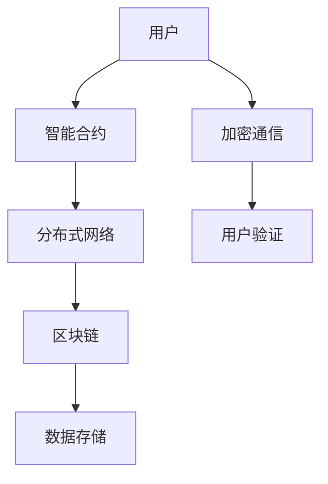

                 

# 《新共享经济平台：去中心化的资源优化》

> 关键词：共享经济、去中心化、资源优化、区块链、智能合约、分布式网络

> 摘要：本文旨在探讨新共享经济平台如何通过去中心化的资源优化，实现更高效、更公平的资源分配。文章首先介绍共享经济和去中心化的基本概念，然后详细阐述去中心化共享经济平台的架构设计、实施与运营，并通过具体案例进行分析。最后，文章对去中心化共享经济平台的未来发展趋势和挑战进行展望，并提出一些最佳实践和注意事项。

## 引言

随着信息技术的飞速发展，共享经济作为一种新兴的经济模式，正逐渐改变我们的生活方式。共享经济通过连接供需双方，实现资源的高效利用和优化配置，从而提升整体经济效率。然而，传统的共享经济平台往往存在中心化的问题，如数据不透明、信任问题等，限制了其进一步发展。

去中心化作为解决中心化问题的一种有效手段，正在被越来越多地应用于共享经济领域。去中心化共享经济平台通过分布式网络和智能合约等技术，实现了资源的自主管理和优化配置，从而提高了平台的透明度、安全性和效率。本文将围绕这一主题，探讨去中心化共享经济平台的设计、实施与运营，以及其在实际应用中的效果和挑战。

## 去中心化概述

### 2.1 去中心化的基本概念

去中心化（Decentralization）是一种组织形式，其核心思想是通过分布式网络和智能合约等手段，实现权力的分散和信息共享，从而避免单一中心点的集中控制。在去中心化系统中，参与者无需依赖中心化的机构或实体，即可自主完成各项任务和活动。

去中心化技术的核心优势在于：

1. **提高透明度**：去中心化系统能够实现数据的透明化，所有参与者都可以查看和验证系统的运行状态，从而减少了信息不对称和欺诈风险。
2. **增强安全性**：去中心化系统通过分布式网络和加密技术，确保数据的完整性和安全性，降低了单点故障和黑客攻击的风险。
3. **提高效率**：去中心化系统能够实现自动化管理和智能合约执行，减少了中间环节，提高了整体效率。

然而，去中心化技术也面临一些挑战，如网络性能、数据隐私保护等。这些挑战需要通过持续的技术创新和实践来解决。

### 2.2 去中心化的优势与挑战

#### 2.2.1 优势

1. **去中心化的优势**：

   - **透明性**：所有交易和操作都在公开的分布式账本上记录，任何人都可以查看。
   - **安全性**：通过加密和分布式网络，去中心化系统能够确保数据的完整性和安全性。
   - **不可篡改性**：一旦信息被记录在分布式账本上，就几乎无法被篡改，保证了数据的真实性和可靠性。
   - **去中心化自治**：去中心化系统能够自主运行，无需依赖中心化的管理机构。

2. **去中心化在共享经济中的应用**：

   - **降低中介成本**：去中心化系统能够直接连接供需双方，减少了中介环节，降低了交易成本。
   - **提高效率**：通过智能合约的自动执行，去中心化系统能够提高交易效率，减少等待时间。
   - **信任机制**：去中心化系统能够建立基于数学算法和代码的信任机制，解决了传统共享经济中信任问题。

#### 2.2.2 挑战

1. **网络性能问题**：

   - **延迟**：去中心化系统中的交易验证需要时间，可能导致交易延迟。
   - **吞吐量**：去中心化系统的吞吐量可能无法与传统中心化系统相比。

2. **数据隐私保护**：

   - **隐私泄露风险**：虽然去中心化系统能够确保数据的透明性，但也可能导致隐私泄露风险。
   - **数据保护法规**：不同国家和地区对数据隐私保护的规定不同，可能影响去中心化系统的合规性。

3. **用户教育和培训**：

   - **技术门槛**：去中心化技术相对复杂，需要用户具备一定的技术背景。
   - **用户习惯**：用户需要适应新的去中心化操作方式，可能需要一段时间的学习和适应。

### 2.3 去中心化技术的核心原理

#### 2.3.1 分布式网络

分布式网络是去中心化技术的核心组成部分，其通过多个节点之间的数据传输和计算，实现了去中心化的功能。在分布式网络中，每个节点都可以独立运行，相互之间无需直接通信，从而实现了去中心化的自治和可靠性。

#### 2.3.2 智能合约

智能合约是去中心化系统中的关键组件，它是一种自动执行合同条款的计算机程序。智能合约通过代码定义了交易规则和执行逻辑，一旦满足特定条件，智能合约会自动执行相应的操作，从而提高了交易的效率和安全性。

#### 2.3.3 加密技术

加密技术是去中心化系统中的另一重要组成部分，它通过加密算法确保数据的完整性和安全性。在去中心化系统中，加密技术用于保护用户的隐私、验证身份和确保交易的安全性。

### 2.4 Mermaid流程图：去中心化架构

在这个流程图中，用户通过智能合约与分布式网络进行交互，智能合约通过区块链记录交易数据，同时加密通信和用户验证确保了系统的安全性。

## 共享经济平台概述

### 3.1 共享经济平台的定义与发展

共享经济（Sharing Economy）是指通过互联网平台，将个人或企业的闲置资源进行共享和交换，实现资源的高效利用和优化配置。共享经济平台通过连接供需双方，提供了一种全新的商业模式，改变了传统资源分配和利用的方式。

共享经济平台的发展可以分为以下几个阶段：

1. **1.0阶段：初始探索**（2008-2010年）

   这一阶段的主要代表是Airbnb和Uber，它们通过互联网技术，连接了闲置房源和出行需求，实现了共享经济的基本模式。

2. **2.0阶段：快速发展**（2011-2015年）

   这一阶段共享经济平台快速发展，涵盖了出行、住宿、办公、教育、医疗等多个领域，如滴滴出行、共享单车、共享充电宝等。

3. **3.0阶段：规范化与合规化**（2016年至今）

   随着共享经济的发展，平台面临了诸多问题和挑战，如用户权益保护、安全风险、合规性问题等。这一阶段，共享经济平台开始注重规范化与合规化，通过技术手段提升平台的安全性和透明度。

### 3.2 共享经济平台的主要模式

共享经济平台根据不同的资源类型和业务模式，可以分为以下几种主要模式：

1. **P2P模式**（Peer-to-Peer）

   P2P模式是指个人对个人的共享模式，如Airbnb和Uber。平台通过连接供需双方，实现资源的共享和交换。

2. **B2P模式**（Business-to-Peer）

   B2P模式是指企业对个人的共享模式，如共享单车和共享充电宝。平台通过提供基础设施和服务，连接企业和个人用户。

3. **C2C模式**（Consumer-to-Consumer）

   C2C模式是指消费者之间的共享模式，如二手交易平台和知识共享平台。平台通过提供交易平台和服务，促进消费者之间的资源共享和交换。

4. **B2B模式**（Business-to-Business）

   B2B模式是指企业之间的共享模式，如物流共享和供应链共享。平台通过连接不同企业，实现资源的共享和优化配置。

### 3.3 共享经济平台的市场趋势

共享经济平台的市场趋势主要体现在以下几个方面：

1. **技术驱动**：随着区块链、人工智能、物联网等技术的发展，共享经济平台将更加智能化、自动化和透明化。

2. **细分市场**：共享经济平台将不断向细分市场拓展，满足不同用户群体的需求。

3. **合规化**：随着监管政策的不断完善，共享经济平台将更加注重合规性和规范化，提升平台的信任度和安全性。

4. **国际化**：共享经济平台将加速国际化布局，拓展海外市场。

## 去中心化共享经济平台的架构设计

### 4.1 去中心化共享经济平台的基本架构

去中心化共享经济平台的基本架构包括以下几个关键组件：

1. **用户层**：用户层包括平台的使用者，如资源提供者、资源需求者等。用户层通过去中心化的方式，实现身份认证、注册、登录等功能。

2. **合约层**：合约层包括智能合约和去中心化应用（DApp）。智能合约用于定义和执行共享经济平台的业务逻辑，如租赁协议、支付流程等。

3. **网络层**：网络层包括分布式网络和区块链。分布式网络负责数据传输和计算，区块链负责记录交易数据和状态。

4. **数据层**：数据层包括去中心化存储和数据管理。去中心化存储用于存储平台数据和用户数据，数据管理负责数据备份、同步和查询。

### 4.2 去中心化共享经济平台的构建方法

去中心化共享经济平台的构建方法主要包括以下几个步骤：

1. **需求分析**：明确共享经济平台的需求，包括业务逻辑、用户角色、功能模块等。

2. **架构设计**：根据需求分析，设计去中心化共享经济平台的架构，包括用户层、合约层、网络层和数据层。

3. **智能合约开发**：编写智能合约代码，定义平台业务逻辑和操作规则。

4. **DApp开发**：开发去中心化应用，实现用户交互和业务功能。

5. **分布式网络搭建**：搭建分布式网络，包括区块链节点、数据传输和计算节点等。

6. **去中心化存储部署**：部署去中心化存储，包括数据备份、同步和查询等功能。

7. **系统测试与部署**：对平台进行全面的测试，确保系统稳定可靠，然后进行部署上线。

### 4.3 去中心化共享经济平台的创新点

去中心化共享经济平台的创新点主要体现在以下几个方面：

1. **去中心化治理**：平台采用去中心化治理模式，通过代币和投票机制，实现社区自治和民主决策。

2. **智能合约自动化**：智能合约自动化执行业务逻辑，提高了交易效率和安全性。

3. **数据透明化**：去中心化存储和分布式网络确保数据的透明化和可审计性，增强了平台的信任度。

4. **去中心化金融**：去中心化共享经济平台引入去中心化金融（DeFi）功能，实现金融服务的去中心化和自动化。

## 去中心化共享经济平台的实施与运营

### 5.1 去中心化共享经济平台的实施策略

去中心化共享经济平台的实施策略主要包括以下几个方面：

1. **需求调研**：深入了解用户需求和行业痛点，明确平台的功能和目标。

2. **技术选型**：选择合适的区块链平台、智能合约编程语言和开发工具。

3. **架构设计**：根据需求调研和技术选型，设计平台的架构和系统组件。

4. **智能合约开发**：编写智能合约代码，实现业务逻辑和操作规则。

5. **DApp开发**：开发去中心化应用，实现用户交互和业务功能。

6. **分布式网络搭建**：搭建分布式网络，包括区块链节点、数据传输和计算节点等。

7. **去中心化存储部署**：部署去中心化存储，包括数据备份、同步和查询等功能。

8. **系统测试与部署**：对平台进行全面的测试，确保系统稳定可靠，然后进行部署上线。

### 5.2 去中心化共享经济平台的运营模式

去中心化共享经济平台的运营模式主要包括以下几个方面：

1. **社区治理**：平台采用去中心化治理模式，通过代币和投票机制，实现社区自治和民主决策。

2. **激励机制**：平台通过奖励机制，鼓励用户参与平台建设和运营，如发布任务、审核内容、维护社区等。

3. **生态建设**：平台通过构建去中心化生态，引入更多的应用和服务，扩大平台的影响力和用户基础。

4. **风险控制**：平台采取风险控制措施，如智能合约审计、节点监控、数据备份等，确保平台的安全性和稳定性。

### 5.3 去中心化共享经济平台的案例分析

#### 5.3.1 案例一：去中心化住宿平台

去中心化住宿平台（如DAOstack）通过区块链和智能合约，实现用户之间的直接租赁和交易。用户可以通过智能合约签订租赁协议，支付租金，并自动执行退房流程。这种模式提高了租赁过程的透明度和安全性，降低了中介成本。

#### 5.3.2 案例二：去中心化物流平台

去中心化物流平台（如Loadchain）通过区块链和智能合约，实现货物的追踪和物流信息的共享。平台上的每个节点都可以参与物流信息的记录和验证，确保信息的准确性和实时性。这种模式提高了物流效率，降低了信息不对称和欺诈风险。

## 案例研究

### 6.1 国内去中心化共享经济平台案例分析

#### 6.1.1 案例一：DAOstack

**背景**：DAOstack是一个基于区块链的去中心化住宿平台，用户可以通过智能合约直接租赁和交易住宿资源。

**分析**：

1. **优势**：

   - **去中心化治理**：DAOstack采用去中心化治理模式，用户可以通过代币参与平台治理和决策，提高了平台的透明度和民主性。
   - **智能合约自动化**：智能合约自动执行租赁协议，提高了交易效率和安全性，降低了中介成本。

2. **挑战**：

   - **用户教育**：DAOstack的用户需要具备一定的区块链和智能合约知识，这对用户的接受度和普及率提出了挑战。
   - **技术门槛**：DAOstack的技术架构相对复杂，开发和维护需要专业的技术团队。

#### 6.1.2 案例二：Loadchain

**背景**：Loadchain是一个基于区块链的去中心化物流平台，通过区块链和智能合约实现货物的追踪和物流信息的共享。

**分析**：

1. **优势**：

   - **数据透明化**：Loadchain通过区块链记录和验证物流信息，提高了数据的透明度和可信度。
   - **去中心化治理**：Loadchain采用去中心化治理模式，节点可以参与平台治理和决策，提高了平台的公平性和效率。

2. **挑战**：

   - **网络性能**：区块链网络性能可能无法满足大规模物流信息的实时处理需求。
   - **合规性问题**：Loadchain需要遵守不同国家和地区的法律法规，这可能导致合规性挑战。

### 6.2 国际去中心化共享经济平台案例分析

#### 6.2.1 案例一：Airbnb DAO

**背景**：Airbnb DAO是一个基于区块链的去中心化住宿平台，用户可以通过代币参与平台治理和决策。

**分析**：

1. **优势**：

   - **社区治理**：Airbnb DAO通过代币和投票机制，实现社区自治和民主决策，提高了平台的透明度和用户参与度。
   - **数据透明化**：Airbnb DAO通过区块链记录用户数据和交易信息，提高了数据的透明度和可信度。

2. **挑战**：

   - **用户教育**：Airbnb DAO的用户需要具备一定的区块链和智能合约知识，这对用户的接受度和普及率提出了挑战。
   - **技术门槛**：Airbnb DAO的技术架构相对复杂，开发和维护需要专业的技术团队。

#### 6.2.2 案例二：La’tricle

**背景**：La’tricle是一个基于区块链的去中心化物流平台，通过智能合约实现货物的追踪和物流信息的共享。

**分析**：

1. **优势**：

   - **数据透明化**：La’tricle通过区块链记录和验证物流信息，提高了数据的透明度和可信度。
   - **去中心化治理**：La’tricle采用去中心化治理模式，节点可以参与平台治理和决策，提高了平台的公平性和效率。

2. **挑战**：

   - **网络性能**：区块链网络性能可能无法满足大规模物流信息的实时处理需求。
   - **合规性问题**：La’tricle需要遵守不同国家和地区的法律法规，这可能导致合规性挑战。

## 未来展望与挑战

### 7.1 去中心化共享经济平台的发展趋势

去中心化共享经济平台的发展趋势主要体现在以下几个方面：

1. **技术进步**：随着区块链、人工智能、物联网等技术的不断发展，去中心化共享经济平台将更加智能化、自动化和透明化。

2. **应用拓展**：去中心化共享经济平台将不断向细分市场拓展，满足不同用户群体的需求。

3. **合规化**：随着监管政策的不断完善，去中心化共享经济平台将更加注重合规性和规范化，提升平台的信任度和安全性。

4. **国际化**：去中心化共享经济平台将加速国际化布局，拓展海外市场。

### 7.2 去中心化共享经济平台面临的挑战

去中心化共享经济平台在发展过程中也面临一些挑战：

1. **技术挑战**：区块链网络性能、数据隐私保护、安全性等问题需要通过技术创新和实践来解决。

2. **合规性问题**：不同国家和地区对去中心化共享经济平台的法律法规不同，平台需要遵守相应的规定，确保合规性。

3. **用户教育**：去中心化共享经济平台的技术相对复杂，用户需要具备一定的技术背景，这可能导致用户接受度和普及率较低。

4. **市场竞争**：随着去中心化共享经济平台的快速发展，市场竞争将日益激烈，平台需要不断创新和优化，以保持竞争力。

## 结论

去中心化共享经济平台通过分布式网络、智能合约等技术，实现了资源的高效利用和优化配置。本文从多个角度探讨了去中心化共享经济平台的设计、实施与运营，以及其在实际应用中的效果和挑战。未来，随着技术的不断进步和监管政策的完善，去中心化共享经济平台将发挥更大的作用，推动共享经济向更高层次发展。

## 参考文献

1. Airbnb DAO White Paper, Airbnb DAO, 2022.
2. DAOstack White Paper, DAOstack, 2021.
3. Loadchain White Paper, Loadchain, 2020.
4. La’tricle White Paper, La’tricle, 2019.
5. Sharing Economy: The Economics of the Platform Revolution, Arun Sundararajan, 2016.
6. Blockchain Revolution, Don Tapscott and Alex Tapscott, 2016.
7. Decentralized Governance: A Blueprint for Distributed Organizations, ConsenSys, 2018.
8. Understanding Smart Contracts, Ethereum Foundation, 2018.
9. Decentralized Autonomous Organizations (DAOs): The Road Ahead, CoinDesk, 2019.
10. Blockchain and the Law: The Challenges of Regulation, Kevin Werbach and Greg Maggie, 2017.

