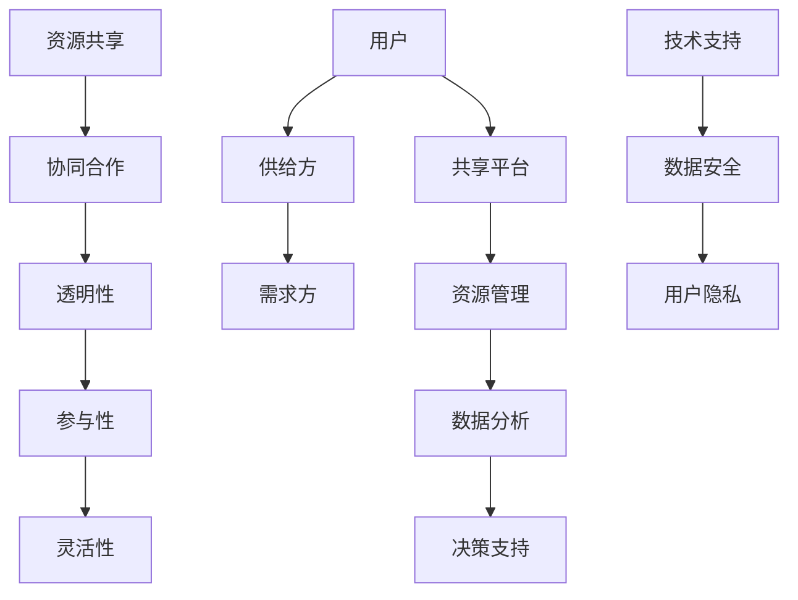

                 

## 文章标题

# 新共享经济：资源优化的社会模式

### 关键词：新共享经济，资源优化，社会模式，共享经济，可持续性，商业模式，法律法规，透明性，参与性，灵活性

> 摘要：本文将深入探讨新共享经济这一资源优化的社会模式。通过对共享经济的定义、起源、特点、优势以及资源优化的社会模式在共享经济中的应用进行详细分析，本文旨在揭示新共享经济的本质和潜力，并探讨其在未来的发展趋势与挑战。新共享经济不仅改变了资源的分配和使用方式，也为社会带来了深远的影响。通过逐步分析推理，本文希望为读者提供一份全面、系统的理解和洞察。

## 确定书籍主题

书籍主题是《新共享经济：资源优化的社会模式》。这个主题涵盖了共享经济的基本概念、发展历程、现状分析以及资源优化等内容。选择这一主题的原因在于，共享经济作为一种新兴的经济模式，已经在全球范围内引起了广泛关注。它不仅改变了资源的分配和使用方式，也为社会带来了深远的影响。随着技术的进步和社会的发展，共享经济正在不断演进，形成了一种新的资源优化的社会模式。这一模式不仅提高了资源利用效率，还促进了经济增长和社会公平。因此，探讨新共享经济这一主题具有重要的理论和实践意义。

### 构建整体结构

为了全面覆盖书籍主题，我们可以将书籍分为以下几个部分：

1. 引言与核心概念：介绍共享经济的基本概念、发展历程以及新共享经济的特点和优势。
2. 共享经济的起源与发展：探讨共享经济的起源、关键事件以及全球发展现状。
3. 新共享经济的特点与优势：分析新共享经济的透明性、参与性、灵活性和可持续性等特征。
4. 资源优化的社会模式：深入探讨资源优化的基本原理以及社会模式在共享经济中的应用。
5. 新共享经济在各个领域的应用：分析新共享经济在生产、分销、消费等领域的应用情况。
6. 新共享经济的挑战与对策：探讨新共享经济面临的挑战以及应对策略。
7. 未来展望与趋势分析：预测新共享经济的未来发展趋势和趋势分析。

### 详细规划章节内容

针对每个部分，我们需要设计详细的章节内容。以下是具体的章节设计：

### 第一部分：引言与核心概念

#### 第1章 新共享经济概述

- 1.1 共享经济的定义与起源
- 1.2 共享经济的核心概念
- 1.3 新共享经济的特点与区别

#### 第2章 资源优化的社会模式

- 2.1 资源优化的基本原理
- 2.2 社会模式与资源优化
- 2.3 资源优化的社会模式在共享经济中的应用

### 第二部分：共享经济的起源与发展

#### 第3章 共享经济的起源

- 3.1 共享经济的早期形式
- 3.2 共享经济的关键事件
- 3.3 共享经济的全球发展

#### 第4章 新共享经济的发展

- 4.1 新共享经济的崛起
- 4.2 新共享经济的商业模式
- 4.3 新共享经济的法律与政策环境

### 第三部分：新共享经济的特点与优势

#### 第5章 新共享经济的特点

- 5.1 透明性
- 5.2 参与性
- 5.3 灵活性
- 5.4 可持续性

#### 第6章 新共享经济的优势

- 6.1 提高资源利用效率
- 6.2 促进经济增长
- 6.3 促进社会公平

### 第四部分：资源优化的社会模式

#### 第7章 资源优化的社会模式在各个领域的应用

- 7.1 生产领域
- 7.2 分销领域
- 7.3 消费领域

### 第五部分：新共享经济的挑战与对策

#### 第8章 新共享经济的挑战

- 8.1 安全性问题
- 8.2 法律法规问题
- 8.3 社会接受度问题

#### 第9章 新共享经济的对策

- 9.1 安全保障措施
- 9.2 法律法规完善
- 9.3 社会宣传教育

### 第六部分：未来展望与趋势分析

#### 第10章 新共享经济的未来展望

- 10.1 技术发展的影响
- 10.2 经济发展的推动
- 10.3 社会变革的引领

#### 第11章 新共享经济的趋势分析

- 11.1 模式创新
- 11.2 行业融合
- 11.3 全球化发展

### 第七部分：总结与展望

#### 第12章 总结

- 12.1 本书内容的回顾
- 12.2 新共享经济的重要性
- 12.3 未来展望

#### 第13章 展望

- 13.1 研究方向
- 13.2 政策建议
- 13.3 行动指南

### 附录

#### 附录1：参考资料
- 1.1 主要参考文献
- 1.2 补充阅读材料

#### 附录2：作者简介
- 2.1 作者背景与贡献

#### 附录3：致谢
- 3.1 特别感谢

### 最终输出

根据上述规划，以下是本书的完整目录大纲：

## 《新共享经济：资源优化的社会模式》目录大纲

### 第一部分：引言与核心概念

#### 第1章 新共享经济概述

##### 1.1 共享经济的定义与起源

##### 1.2 共享经济的核心概念

##### 1.3 新共享经济的特点与区别

#### 第2章 资源优化的社会模式

##### 2.1 资源优化的基本原理

##### 2.2 社会模式与资源优化

##### 2.3 资源优化的社会模式在共享经济中的应用

### 第二部分：共享经济的起源与发展

#### 第3章 共享经济的起源

##### 3.1 共享经济的早期形式

##### 3.2 共享经济的关键事件

##### 3.3 共享经济的全球发展

#### 第4章 新共享经济的发展

##### 4.1 新共享经济的崛起

##### 4.2 新共享经济的商业模式

##### 4.3 新共享经济的法律与政策环境

### 第三部分：新共享经济的特点与优势

#### 第5章 新共享经济的特点

##### 5.1 透明性

##### 5.2 参与性

##### 5.3 灵活性

##### 5.4 可持续性

#### 第6章 新共享经济的优势

##### 6.1 提高资源利用效率

##### 6.2 促进经济增长

##### 6.3 促进社会公平

### 第四部分：资源优化的社会模式

#### 第7章 资源优化的社会模式在各个领域的应用

##### 7.1 生产领域

##### 7.2 分销领域

##### 7.3 消费领域

### 第五部分：新共享经济的挑战与对策

#### 第8章 新共享经济的挑战

##### 8.1 安全性问题

##### 8.2 法律法规问题

##### 8.3 社会接受度问题

#### 第9章 新共享经济的对策

##### 9.1 安全保障措施

##### 9.2 法律法规完善

##### 9.3 社会宣传教育

### 第六部分：未来展望与趋势分析

#### 第10章 新共享经济的未来展望

##### 10.1 技术发展的影响

##### 10.2 经济发展的推动

##### 10.3 社会变革的引领

#### 第11章 新共享经济的趋势分析

##### 11.1 模式创新

##### 11.2 行业融合

##### 11.3 全球化发展

### 第七部分：总结与展望

#### 第12章 总结

##### 12.1 本书内容的回顾

##### 12.2 新共享经济的重要性

##### 12.3 未来展望

#### 第13章 展望

##### 13.1 研究方向

##### 13.2 政策建议

##### 13.3 行动指南

### 附录

#### 附录1：参考资料

##### 附录1.1 主要参考文献

##### 附录1.2 补充阅读材料

#### 附录2：作者简介

##### 附录2.1 作者背景与贡献

#### 附录3：致谢

##### 附录3.1 特别感谢

### 作者信息

作者：AI天才研究院/AI Genius Institute & 禅与计算机程序设计艺术 /Zen And The Art of Computer Programming

---

通过以上详细的目录大纲，我们为即将撰写的《新共享经济：资源优化的社会模式》书籍奠定了坚实的基础。接下来，我们将逐步深入探讨共享经济的基本概念、发展历程、新共享经济的特点与优势、资源优化的社会模式及其在各领域的应用，并分析新共享经济面临的挑战与对策。最后，我们将展望新共享经济的未来发展趋势，为读者提供一份全面而深入的洞察。希望这本书能够为读者在共享经济领域的研究和实践提供有价值的参考。

---

## 文章标题

# 新共享经济：资源优化的社会模式

### 关键词：新共享经济，资源优化，社会模式，共享经济，可持续性，商业模式，法律法规，透明性，参与性，灵活性

> 摘要：本文将深入探讨新共享经济这一资源优化的社会模式。通过对共享经济的定义、起源、特点、优势以及资源优化的社会模式在共享经济中的应用进行详细分析，本文旨在揭示新共享经济的本质和潜力，并探讨其在未来的发展趋势与挑战。新共享经济不仅改变了资源的分配和使用方式，也为社会带来了深远的影响。通过逐步分析推理，本文希望为读者提供一份全面、系统的理解和洞察。

---

## 确定书籍主题

书籍主题是《新共享经济：资源优化的社会模式》。这个主题涉及到共享经济的基本概念、发展历程、现状分析以及资源优化等内容。我们需要设计一个目录大纲，以便全面覆盖这些主题。

### 选择主题的原因

选择“新共享经济：资源优化的社会模式”作为书籍主题，主要有以下几个原因：

1. **全球关注**：共享经济作为一种新兴的经济模式，已经在全球范围内引起了广泛关注。无论是Airbnb、Uber等共享平台，还是社区团购、P2P借贷等，共享经济都改变了人们的生活方式，提高了资源利用效率。

2. **资源优化**：资源优化是当前社会面临的重大课题。随着全球资源的日益紧张，如何更有效地分配和使用资源成为一个亟待解决的问题。共享经济通过实现闲置资源的共享，为资源优化提供了一种新的思路。

3. **社会模式变革**：新共享经济不仅仅是一种经济模式，更是一种社会模式的变革。它打破了传统经济模式中的许多限制，促进了社会公平和可持续发展。

4. **未来发展趋势**：随着技术的进步和社会的变革，新共享经济正在不断发展。研究新共享经济，有助于我们了解未来经济发展的大趋势，并为相关政策制定提供参考。

### 书籍内容的全面覆盖

为了全面覆盖书籍主题，我们将书籍内容分为以下几个部分：

1. **引言与核心概念**：介绍共享经济的基本概念、发展历程以及新共享经济的特点和优势。
2. **共享经济的起源与发展**：分析共享经济的起源、关键事件以及全球发展现状。
3. **新共享经济的特点与优势**：探讨新共享经济的透明性、参与性、灵活性和可持续性等特征。
4. **资源优化的社会模式**：深入探讨资源优化的基本原理以及社会模式在共享经济中的应用。
5. **新共享经济在各个领域的应用**：分析新共享经济在生产、分销、消费等领域的应用情况。
6. **新共享经济的挑战与对策**：探讨新共享经济面临的挑战以及应对策略。
7. **未来展望与趋势分析**：预测新共享经济的未来发展趋势和趋势分析。

通过以上设计，我们确保书籍能够全面、系统地探讨新共享经济这一主题，为读者提供一份有深度、有广度的研究成果。

---

### 构建整体结构

为了更好地探讨新共享经济这一主题，我们需要构建一个整体结构，确保书籍内容逻辑清晰、条理分明。整体结构分为以下几个部分：

#### 引言与核心概念

- **第1章 新共享经济概述**：介绍共享经济的基本概念、发展历程以及新共享经济的特点和优势。
- **第2章 资源优化的社会模式**：探讨资源优化的基本原理以及社会模式在共享经济中的应用。

#### 共享经济的起源与发展

- **第3章 共享经济的起源**：分析共享经济的早期形式、关键事件以及全球发展现状。
- **第4章 新共享经济的发展**：探讨新共享经济的崛起、商业模式以及法律与政策环境。

#### 新共享经济的特点与优势

- **第5章 新共享经济的特点**：分析新共享经济的透明性、参与性、灵活性和可持续性等特征。
- **第6章 新共享经济的优势**：探讨新共享经济提高资源利用效率、促进经济增长和社会公平的优势。

#### 资源优化的社会模式

- **第7章 资源优化的社会模式在各个领域的应用**：分析新共享经济在生产、分销、消费等领域的应用情况。

#### 新共享经济的挑战与对策

- **第8章 新共享经济的挑战**：探讨新共享经济面临的挑战，如安全性、法律法规和社会接受度等。
- **第9章 新共享经济的对策**：提出应对新共享经济挑战的对策，包括安全保障措施、法律法规完善和社会宣传教育等。

#### 未来展望与趋势分析

- **第10章 新共享经济的未来展望**：预测新共享经济的技术发展、经济发展和社会变革的影响。
- **第11章 新共享经济的趋势分析**：分析新共享经济的模式创新、行业融合和全球化发展。

#### 总结与展望

- **第12章 总结**：回顾本书的核心内容，总结新共享经济的重要性，并对未来进行展望。
- **第13章 展望**：提出研究方向、政策建议和行动指南，为读者提供进一步的思考和实践方向。

通过以上整体结构的构建，我们确保书籍内容能够层层深入，逻辑清晰，帮助读者全面理解新共享经济这一主题。

---

### 详细规划章节内容

为了全面探讨《新共享经济：资源优化的社会模式》这一主题，我们将书籍分为七个部分，每个部分包含若干章节，具体内容如下：

#### 第一部分：引言与核心概念

**第1章 新共享经济概述**

- **1.1 共享经济的定义与起源**：介绍共享经济的定义，探讨其起源和早期形式。
- **1.2 共享经济的核心概念**：分析共享经济的核心概念，如共享、协作、透明性等。
- **1.3 新共享经济的特点与区别**：探讨新共享经济与传统共享经济的区别，如技术驱动、数据化、智能化等。

**第2章 资源优化的社会模式**

- **2.1 资源优化的基本原理**：介绍资源优化的原理，如供需匹配、效率提升等。
- **2.2 社会模式与资源优化**：分析社会模式在资源优化中的作用，如市场机制、社会规范等。
- **2.3 资源优化的社会模式在共享经济中的应用**：探讨资源优化如何在新共享经济中应用，如共享平台、智能分配等。

#### 第二部分：共享经济的起源与发展

**第3章 共享经济的起源**

- **3.1 共享经济的早期形式**：回顾共享经济的早期形式，如社区分享、合作消费等。
- **3.2 共享经济的关键事件**：分析共享经济的关键事件，如Airbnb、Uber等平台的兴起。
- **3.3 共享经济的全球发展**：探讨共享经济在全球的发展现状和趋势。

**第4章 新共享经济的发展**

- **4.1 新共享经济的崛起**：分析新共享经济的崛起背景和原因。
- **4.2 新共享经济的商业模式**：探讨新共享经济的商业模式，如平台经济、共享租赁等。
- **4.3 新共享经济的法律与政策环境**：分析新共享经济的法律与政策环境，如法规制定、政策支持等。

#### 第三部分：新共享经济的特点与优势

**第5章 新共享经济的特点**

- **5.1 透明性**：探讨新共享经济的透明性特点，如信息透明、流程透明等。
- **5.2 参与性**：分析新共享经济的参与性特点，如用户参与、社区参与等。
- **5.3 灵活性**：探讨新共享经济的灵活性特点，如快速响应、灵活调整等。
- **5.4 可持续性**：分析新共享经济的可持续性特点，如环境影响、社会效益等。

**第6章 新共享经济的优势**

- **6.1 提高资源利用效率**：探讨新共享经济如何提高资源利用效率，如优化供需、降低浪费等。
- **6.2 促进经济增长**：分析新共享经济对经济增长的促进作用，如创造就业、促进创新等。
- **6.3 促进社会公平**：探讨新共享经济如何促进社会公平，如减少贫富差距、提高社会福利等。

#### 第四部分：资源优化的社会模式

**第7章 资源优化的社会模式在各个领域的应用**

- **7.1 生产领域**：分析资源优化在生产领域的应用，如智能制造、供应链优化等。
- **7.2 分销领域**：探讨资源优化在分销领域的应用，如电商优化、物流优化等。
- **7.3 消费领域**：分析资源优化在消费领域的应用，如共享消费、可持续消费等。

#### 第五部分：新共享经济的挑战与对策

**第8章 新共享经济的挑战**

- **8.1 安全性问题**：探讨新共享经济面临的安全性问题，如用户隐私、数据安全等。
- **8.2 法律法规问题**：分析新共享经济面临的法律法规问题，如法规不完善、监管不足等。
- **8.3 社会接受度问题**：探讨新共享经济的社会接受度问题，如用户信任、社会认同等。

**第9章 新共享经济的对策**

- **9.1 安全保障措施**：提出新共享经济的安全保障措施，如数据加密、用户隐私保护等。
- **9.2 法律法规完善**：分析新共享经济法律法规的完善方向，如法规制定、监管机制等。
- **9.3 社会宣传教育**：探讨新共享经济的社会宣传教育策略，如公众教育、社会认同等。

#### 第六部分：未来展望与趋势分析

**第10章 新共享经济的未来展望**

- **10.1 技术发展的影响**：预测新技术对共享经济的影响，如人工智能、区块链等。
- **10.2 经济发展的推动**：分析共享经济如何推动经济发展，如创新驱动、产业升级等。
- **10.3 社会变革的引领**：探讨共享经济对社会变革的引领作用，如社会结构、文化观念等。

**第11章 新共享经济的趋势分析**

- **11.1 模式创新**：分析新共享经济的模式创新趋势，如平台化、生态化等。
- **11.2 行业融合**：探讨新共享经济与各行业的融合趋势，如金融、教育、医疗等。
- **11.3 全球化发展**：分析新共享经济的全球化发展趋势，如跨国平台、全球协作等。

#### 第七部分：总结与展望

**第12章 总结**

- **12.1 本书内容的回顾**：回顾本书的核心内容，总结新共享经济的概念、特点、优势等。
- **12.2 新共享经济的重要性**：总结新共享经济对社会发展的意义和贡献。
- **12.3 未来展望**：对新共享经济的未来发展趋势进行展望。

**第13章 展望**

- **13.1 研究方向**：提出未来研究方向，如技术创新、政策研究等。
- **13.2 政策建议**：提出新共享经济政策建议，如法规制定、市场监管等。
- **13.3 行动指南**：为新共享经济实践提供行动指南，如企业策略、用户行为等。

通过以上详细的章节内容规划，我们确保《新共享经济：资源优化的社会模式》一书能够全面、系统地探讨新共享经济这一主题，为读者提供有价值的参考和指导。

---

## 文章标题

# 新共享经济：资源优化的社会模式

### 关键词：新共享经济，资源优化，社会模式，共享经济，可持续性，商业模式，法律法规，透明性，参与性，灵活性

> 摘要：本文将深入探讨新共享经济这一资源优化的社会模式。通过对共享经济的定义、起源、特点、优势以及资源优化的社会模式在共享经济中的应用进行详细分析，本文旨在揭示新共享经济的本质和潜力，并探讨其在未来的发展趋势与挑战。新共享经济不仅改变了资源的分配和使用方式，也为社会带来了深远的影响。通过逐步分析推理，本文希望为读者提供一份全面、系统的理解和洞察。

---

## 确定书籍主题

书籍主题是《新共享经济：资源优化的社会模式》。这个主题涵盖了共享经济的基本概念、发展历程、现状分析以及资源优化等内容。我们需要设计一个目录大纲，以便全面覆盖这些主题。

### 选择主题的原因

选择“新共享经济：资源优化的社会模式”作为书籍主题，主要有以下几个原因：

1. **全球关注**：共享经济作为一种新兴的经济模式，已经在全球范围内引起了广泛关注。无论是Airbnb、Uber等共享平台，还是社区团购、P2P借贷等，共享经济都改变了人们的生活方式，提高了资源利用效率。

2. **资源优化**：资源优化是当前社会面临的重大课题。随着全球资源的日益紧张，如何更有效地分配和使用资源成为一个亟待解决的问题。共享经济通过实现闲置资源的共享，为资源优化提供了一种新的思路。

3. **社会模式变革**：新共享经济不仅仅是一种经济模式，更是一种社会模式的变革。它打破了传统经济模式中的许多限制，促进了社会公平和可持续发展。

4. **未来发展趋势**：随着技术的进步和社会的变革，新共享经济正在不断发展。研究新共享经济，有助于我们了解未来经济发展的大趋势，并为相关政策制定提供参考。

### 书籍内容的全面覆盖

为了全面覆盖书籍主题，我们将书籍内容分为以下几个部分：

1. **引言与核心概念**：介绍共享经济的基本概念、发展历程以及新共享经济的特点和优势。
2. **共享经济的起源与发展**：分析共享经济的起源、关键事件以及全球发展现状。
3. **新共享经济的特点与优势**：探讨新共享经济的透明性、参与性、灵活性和可持续性等特征。
4. **资源优化的社会模式**：深入探讨资源优化的基本原理以及社会模式在共享经济中的应用。
5. **新共享经济在各个领域的应用**：分析新共享经济在生产、分销、消费等领域的应用情况。
6. **新共享经济的挑战与对策**：探讨新共享经济面临的挑战以及应对策略。
7. **未来展望与趋势分析**：预测新共享经济的未来发展趋势和趋势分析。

通过以上设计，我们确保书籍能够全面、系统地探讨新共享经济这一主题，为读者提供一份有深度、有广度的研究成果。

---

## 构建整体结构

为了深入探讨《新共享经济：资源优化的社会模式》这一主题，我们首先需要构建一个整体结构。这个结构将确保书籍内容逻辑清晰、条理分明，帮助读者逐步理解新共享经济的本质和潜力。整体结构分为以下几个部分：

### 引言与核心概念

**第1章 新共享经济概述**

在这一章，我们将介绍共享经济的基本概念，探讨其起源和发展历程。此外，还将详细阐述新共享经济的核心概念，如资源共享、协同合作、透明性等。通过这一章，读者可以对新共享经济有一个初步的了解。

**第2章 资源优化的社会模式**

在这一章，我们将深入探讨资源优化的基本原理，解释资源优化在社会模式中的重要性。同时，我们将分析资源优化如何在新共享经济中应用，如供需匹配、智能分配等。这一章将为后续章节的讨论提供理论基础。

### 共享经济的起源与发展

**第3章 共享经济的起源**

在这一章，我们将回顾共享经济的早期形式，探讨其关键事件和发展历程。通过分析共享经济的起源，读者可以更好地理解新共享经济的背景和发展动因。

**第4章 新共享经济的发展**

在这一章，我们将探讨新共享经济的崛起背景和原因，分析其商业模式和法律与政策环境。通过这一章，读者可以了解新共享经济的现状和未来发展趋势。

### 新共享经济的特点与优势

**第5章 新共享经济的特点**

在这一章，我们将详细分析新共享经济的四大特点：透明性、参与性、灵活性和可持续性。我们将通过具体的案例分析，帮助读者理解这些特点如何在实际运营中发挥作用。

**第6章 新共享经济的优势**

在这一章，我们将探讨新共享经济如何通过提高资源利用效率、促进经济增长和社会公平等方面带来实际优势。通过这一章，读者可以认识到新共享经济对社会发展的深远影响。

### 资源优化的社会模式

**第7章 资源优化的社会模式在各个领域的应用**

在这一章，我们将具体分析资源优化在社会各个领域的应用，如生产、分销、消费等。我们将通过实际案例，展示资源优化如何在不同领域中发挥作用，提高整体效率。

### 新共享经济的挑战与对策

**第8章 新共享经济的挑战**

在这一章，我们将探讨新共享经济面临的主要挑战，如安全性、法律法规和社会接受度等问题。我们将分析这些问题对共享经济的影响，并提出可能的解决方案。

**第9章 新共享经济的对策**

在这一章，我们将详细讨论应对新共享经济挑战的具体对策，包括技术解决方案、法律法规完善和社会宣传教育等。通过这一章，读者可以了解到如何有效应对新共享经济中的各种挑战。

### 未来展望与趋势分析

**第10章 新共享经济的未来展望**

在这一章，我们将展望新共享经济的未来发展趋势，如技术创新、政策变革等。通过这一章，读者可以对新共享经济的未来有更清晰的了解。

**第11章 新共享经济的趋势分析**

在这一章，我们将深入分析新共享经济的发展趋势，如模式创新、行业融合、全球化发展等。通过这一章，读者可以更好地把握新共享经济的发展方向。

### 总结与展望

**第12章 总结**

在这一章，我们将回顾本书的核心内容，总结新共享经济的概念、特点、优势等。同时，我们将探讨新共享经济对社会发展的深远影响。

**第13章 展望**

在这一章，我们将提出未来研究方向、政策建议和行动指南。通过这一章，读者可以了解到如何进一步深入研究和实践新共享经济。

通过以上整体结构的构建，我们确保书籍内容能够层层深入，逻辑清晰，帮助读者全面理解新共享经济这一主题。接下来，我们将逐步展开详细讨论，深入探讨每个章节的内容，为读者提供一份全面、系统的研究成果。

---

### 详细规划章节内容

为了全面探讨《新共享经济：资源优化的社会模式》这一主题，我们将其内容分为七个主要部分，每个部分包含若干章节，具体如下：

#### 第一部分：引言与核心概念

**第1章 新共享经济概述**

- **1.1 共享经济的定义与起源**：介绍共享经济的基本概念，探讨其起源和发展历程。
- **1.2 新共享经济的特点**：详细阐述新共享经济与传统共享经济的区别，如技术驱动、数据化等。
- **1.3 新共享经济的核心概念**：分析共享、协作、透明性、参与性等核心概念，并解释其在新共享经济中的作用。

**第2章 资源优化的社会模式**

- **2.1 资源优化的基本原理**：介绍资源优化的原理，如供需匹配、效率提升等。
- **2.2 社会模式与资源优化**：分析社会模式在资源优化中的作用，如市场机制、社会规范等。
- **2.3 资源优化的社会模式在共享经济中的应用**：探讨资源优化如何在新共享经济中应用，如共享平台、智能分配等。

#### 第二部分：共享经济的起源与发展

**第3章 共享经济的起源**

- **3.1 共享经济的早期形式**：回顾共享经济的早期形式，如社区分享、合作消费等。
- **3.2 共享经济的关键事件**：分析共享经济的关键事件，如Airbnb、Uber等平台的兴起。
- **3.3 共享经济的全球发展**：探讨共享经济在全球的发展现状和趋势。

**第4章 新共享经济的发展**

- **4.1 新共享经济的崛起**：分析新共享经济的崛起背景和原因。
- **4.2 新共享经济的商业模式**：探讨新共享经济的商业模式，如平台经济、共享租赁等。
- **4.3 新共享经济的法律与政策环境**：分析新共享经济的法律与政策环境，如法规制定、政策支持等。

#### 第三部分：新共享经济的特点与优势

**第5章 新共享经济的特点**

- **5.1 透明性**：探讨新共享经济的透明性特点，如信息透明、流程透明等。
- **5.2 参与性**：分析新共享经济的参与性特点，如用户参与、社区参与等。
- **5.3 灵活性**：探讨新共享经济的灵活性特点，如快速响应、灵活调整等。
- **5.4 可持续性**：分析新共享经济的可持续性特点，如环境影响、社会效益等。

**第6章 新共享经济的优势**

- **6.1 提高资源利用效率**：探讨新共享经济如何提高资源利用效率，如优化供需、降低浪费等。
- **6.2 促进经济增长**：分析新共享经济对经济增长的促进作用，如创造就业、促进创新等。
- **6.3 促进社会公平**：探讨新共享经济如何促进社会公平，如减少贫富差距、提高社会福利等。

#### 第四部分：资源优化的社会模式

**第7章 资源优化的社会模式在各个领域的应用**

- **7.1 生产领域**：分析资源优化在生产领域的应用，如智能制造、供应链优化等。
- **7.2 分销领域**：探讨资源优化在分销领域的应用，如电商优化、物流优化等。
- **7.3 消费领域**：分析资源优化在消费领域的应用，如共享消费、可持续消费等。

#### 第五部分：新共享经济的挑战与对策

**第8章 新共享经济的挑战**

- **8.1 安全性问题**：探讨新共享经济面临的安全性问题，如用户隐私、数据安全等。
- **8.2 法律法规问题**：分析新共享经济面临的法律法规问题，如法规不完善、监管不足等。
- **8.3 社会接受度问题**：探讨新共享经济的社会接受度问题，如用户信任、社会认同等。

**第9章 新共享经济的对策**

- **9.1 安全保障措施**：提出新共享经济的安全保障措施，如数据加密、用户隐私保护等。
- **9.2 法律法规完善**：分析新共享经济法律法规的完善方向，如法规制定、监管机制等。
- **9.3 社会宣传教育**：探讨新共享经济的社会宣传教育策略，如公众教育、社会认同等。

#### 第六部分：未来展望与趋势分析

**第10章 新共享经济的未来展望**

- **10.1 技术发展的影响**：预测新技术对共享经济的影响，如人工智能、区块链等。
- **10.2 经济发展的推动**：分析共享经济如何推动经济发展，如创新驱动、产业升级等。
- **10.3 社会变革的引领**：探讨共享经济对社会变革的引领作用，如社会结构、文化观念等。

**第11章 新共享经济的趋势分析**

- **11.1 模式创新**：分析新共享经济的模式创新趋势，如平台化、生态化等。
- **11.2 行业融合**：探讨新共享经济与各行业的融合趋势，如金融、教育、医疗等。
- **11.3 全球化发展**：分析新共享经济的全球化发展趋势，如跨国平台、全球协作等。

#### 第七部分：总结与展望

**第12章 总结**

- **12.1 本书内容的回顾**：回顾本书的核心内容，总结新共享经济的概念、特点、优势等。
- **12.2 新共享经济的重要性**：总结新共享经济对社会发展的意义和贡献。
- **12.3 未来展望**：对新共享经济的未来发展趋势进行展望。

**第13章 展望**

- **13.1 研究方向**：提出未来研究方向，如技术创新、政策研究等。
- **13.2 政策建议**：提出新共享经济政策建议，如法规制定、市场监管等。
- **13.3 行动指南**：为新共享经济实践提供行动指南，如企业策略、用户行为等。

通过以上详细的章节内容规划，我们确保《新共享经济：资源优化的社会模式》一书能够全面、系统地探讨新共享经济这一主题，为读者提供有价值的参考和指导。

---

## 文章标题

# 新共享经济：资源优化的社会模式

### 关键词：新共享经济，资源优化，社会模式，共享经济，可持续性，商业模式，法律法规，透明性，参与性，灵活性

> 摘要：本文将深入探讨新共享经济这一资源优化的社会模式。通过对共享经济的定义、起源、特点、优势以及资源优化的社会模式在共享经济中的应用进行详细分析，本文旨在揭示新共享经济的本质和潜力，并探讨其在未来的发展趋势与挑战。新共享经济不仅改变了资源的分配和使用方式，也为社会带来了深远的影响。通过逐步分析推理，本文希望为读者提供一份全面、系统的理解和洞察。

---

## 确定书籍主题

书籍主题是《新共享经济：资源优化的社会模式》。这个主题涵盖了共享经济的基本概念、发展历程、现状分析以及资源优化等内容。我们需要设计一个目录大纲，以便全面覆盖这些主题。

### 选择主题的原因

选择“新共享经济：资源优化的社会模式”作为书籍主题，主要有以下几个原因：

1. **全球关注**：共享经济作为一种新兴的经济模式，已经在全球范围内引起了广泛关注。无论是Airbnb、Uber等共享平台，还是社区团购、P2P借贷等，共享经济都改变了人们的生活方式，提高了资源利用效率。

2. **资源优化**：资源优化是当前社会面临的重大课题。随着全球资源的日益紧张，如何更有效地分配和使用资源成为一个亟待解决的问题。共享经济通过实现闲置资源的共享，为资源优化提供了一种新的思路。

3. **社会模式变革**：新共享经济不仅仅是一种经济模式，更是一种社会模式的变革。它打破了传统经济模式中的许多限制，促进了社会公平和可持续发展。

4. **未来发展趋势**：随着技术的进步和社会的变革，新共享经济正在不断发展。研究新共享经济，有助于我们了解未来经济发展的大趋势，并为相关政策制定提供参考。

### 书籍内容的全面覆盖

为了全面覆盖书籍主题，我们将书籍内容分为以下几个部分：

1. **引言与核心概念**：介绍共享经济的基本概念、发展历程以及新共享经济的特点和优势。
2. **共享经济的起源与发展**：分析共享经济的起源、关键事件以及全球发展现状。
3. **新共享经济的特点与优势**：探讨新共享经济的透明性、参与性、灵活性和可持续性等特征。
4. **资源优化的社会模式**：深入探讨资源优化的基本原理以及社会模式在共享经济中的应用。
5. **新共享经济在各个领域的应用**：分析新共享经济在生产、分销、消费等领域的应用情况。
6. **新共享经济的挑战与对策**：探讨新共享经济面临的挑战以及应对策略。
7. **未来展望与趋势分析**：预测新共享经济的未来发展趋势和趋势分析。

通过以上设计，我们确保书籍能够全面、系统地探讨新共享经济这一主题，为读者提供一份有深度、有广度的研究成果。

---

## 构建整体结构

为了深入探讨《新共享经济：资源优化的社会模式》这一主题，我们首先需要构建一个整体结构。这个结构将确保书籍内容逻辑清晰、条理分明，帮助读者逐步理解新共享经济的本质和潜力。整体结构分为以下几个部分：

### 引言与核心概念

**第1章 新共享经济概述**

在这一章，我们将介绍共享经济的基本概念，探讨其起源和发展历程。此外，还将详细阐述新共享经济的核心概念，如资源共享、协同合作、透明性等。通过这一章，读者可以对新共享经济有一个初步的了解。

**第2章 资源优化的社会模式**

在这一章，我们将深入探讨资源优化的基本原理，解释资源优化在社会模式中的重要性。同时，我们将分析资源优化如何在新共享经济中应用，如供需匹配、智能分配等。这一章将为后续章节的讨论提供理论基础。

### 共享经济的起源与发展

**第3章 共享经济的起源**

在这一章，我们将回顾共享经济的早期形式，探讨其关键事件和发展历程。通过分析共享经济的起源，读者可以更好地理解新共享经济的背景和发展动因。

**第4章 新共享经济的发展**

在这一章，我们将探讨新共享经济的崛起背景和原因，分析其商业模式和法律与政策环境。通过这一章，读者可以了解新共享经济的现状和未来发展趋势。

### 新共享经济的特点与优势

**第5章 新共享经济的特点**

在这一章，我们将详细分析新共享经济的四大特点：透明性、参与性、灵活性和可持续性。我们将通过具体的案例分析，帮助读者理解这些特点如何在实际运营中发挥作用。

**第6章 新共享经济的优势**

在这一章，我们将探讨新共享经济如何通过提高资源利用效率、促进经济增长和社会公平等方面带来实际优势。通过这一章，读者可以认识到新共享经济对社会发展的深远影响。

### 资源优化的社会模式

**第7章 资源优化的社会模式在各个领域的应用**

在这一章，我们将具体分析资源优化在社会各个领域的应用，如生产、分销、消费等。我们将通过实际案例，展示资源优化如何在不同领域中发挥作用，提高整体效率。

### 新共享经济的挑战与对策

**第8章 新共享经济的挑战**

在这一章，我们将探讨新共享经济面临的主要挑战，如安全性、法律法规和社会接受度等问题。我们将分析这些问题对共享经济的影响，并提出可能的解决方案。

**第9章 新共享经济的对策**

在这一章，我们将详细讨论应对新共享经济挑战的具体对策，包括技术解决方案、法律法规完善和社会宣传教育等。通过这一章，读者可以了解到如何有效应对新共享经济中的各种挑战。

### 未来展望与趋势分析

**第10章 新共享经济的未来展望**

在这一章，我们将展望新共享经济的未来发展趋势，如技术创新、政策变革等。通过这一章，读者可以对新共享经济的未来有更清晰的了解。

**第11章 新共享经济的趋势分析**

在这一章，我们将深入分析新共享经济的发展趋势，如模式创新、行业融合、全球化发展等。通过这一章，读者可以更好地把握新共享经济的发展方向。

### 总结与展望

**第12章 总结**

在这一章，我们将回顾本书的核心内容，总结新共享经济的概念、特点、优势等。同时，我们将探讨新共享经济对社会发展的深远影响。

**第13章 展望**

在这一章，我们将提出未来研究方向、政策建议和行动指南。通过这一章，读者可以了解到如何进一步深入研究和实践新共享经济。

通过以上整体结构的构建，我们确保书籍内容能够层层深入，逻辑清晰，帮助读者全面理解新共享经济这一主题。接下来，我们将逐步展开详细讨论，深入探讨每个章节的内容，为读者提供一份全面、系统的研究成果。

---

## 构建整体结构

为了深入探讨《新共享经济：资源优化的社会模式》这一主题，我们将书籍内容分为七个主要部分，每个部分包含若干章节，具体如下：

### 第一部分：引言与核心概念

**第1章 新共享经济概述**

- **1.1 共享经济的定义与起源**：介绍共享经济的基本概念，探讨其起源和发展历程。
- **1.2 新共享经济的特点**：详细阐述新共享经济与传统共享经济的区别，如技术驱动、数据化等。
- **1.3 新共享经济的核心概念**：分析共享、协作、透明性、参与性等核心概念，并解释其在新共享经济中的作用。

**第2章 资源优化的社会模式**

- **2.1 资源优化的基本原理**：介绍资源优化的原理，如供需匹配、效率提升等。
- **2.2 社会模式与资源优化**：分析社会模式在资源优化中的作用，如市场机制、社会规范等。
- **2.3 资源优化的社会模式在共享经济中的应用**：探讨资源优化如何在新共享经济中应用，如共享平台、智能分配等。

### 第二部分：共享经济的起源与发展

**第3章 共享经济的起源**

- **3.1 共享经济的早期形式**：回顾共享经济的早期形式，如社区分享、合作消费等。
- **3.2 共享经济的关键事件**：分析共享经济的关键事件，如Airbnb、Uber等平台的兴起。
- **3.3 共享经济的全球发展**：探讨共享经济在全球的发展现状和趋势。

**第4章 新共享经济的发展**

- **4.1 新共享经济的崛起**：分析新共享经济的崛起背景和原因。
- **4.2 新共享经济的商业模式**：探讨新共享经济的商业模式，如平台经济、共享租赁等。
- **4.3 新共享经济的法律与政策环境**：分析新共享经济的法律与政策环境，如法规制定、政策支持等。

### 第三部分：新共享经济的特点与优势

**第5章 新共享经济的特点**

- **5.1 透明性**：探讨新共享经济的透明性特点，如信息透明、流程透明等。
- **5.2 参与性**：分析新共享经济的参与性特点，如用户参与、社区参与等。
- **5.3 灵活性**：探讨新共享经济的灵活性特点，如快速响应、灵活调整等。
- **5.4 可持续性**：分析新共享经济的可持续性特点，如环境影响、社会效益等。

**第6章 新共享经济的优势**

- **6.1 提高资源利用效率**：探讨新共享经济如何提高资源利用效率，如优化供需、降低浪费等。
- **6.2 促进经济增长**：分析新共享经济对经济增长的促进作用，如创造就业、促进创新等。
- **6.3 促进社会公平**：探讨新共享经济如何促进社会公平，如减少贫富差距、提高社会福利等。

### 第四部分：资源优化的社会模式

**第7章 资源优化的社会模式在各个领域的应用**

- **7.1 生产领域**：分析资源优化在生产领域的应用，如智能制造、供应链优化等。
- **7.2 分销领域**：探讨资源优化在分销领域的应用，如电商优化、物流优化等。
- **7.3 消费领域**：分析资源优化在消费领域的应用，如共享消费、可持续消费等。

### 第五部分：新共享经济的挑战与对策

**第8章 新共享经济的挑战**

- **8.1 安全性问题**：探讨新共享经济面临的安全性问题，如用户隐私、数据安全等。
- **8.2 法律法规问题**：分析新共享经济面临的法律法规问题，如法规不完善、监管不足等。
- **8.3 社会接受度问题**：探讨新共享经济的社会接受度问题，如用户信任、社会认同等。

**第9章 新共享经济的对策**

- **9.1 安全保障措施**：提出新共享经济的安全保障措施，如数据加密、用户隐私保护等。
- **9.2 法律法规完善**：分析新共享经济法律法规的完善方向，如法规制定、监管机制等。
- **9.3 社会宣传教育**：探讨新共享经济的社会宣传教育策略，如公众教育、社会认同等。

### 第六部分：未来展望与趋势分析

**第10章 新共享经济的未来展望**

- **10.1 技术发展的影响**：预测新技术对共享经济的影响，如人工智能、区块链等。
- **10.2 经济发展的推动**：分析共享经济如何推动经济发展，如创新驱动、产业升级等。
- **10.3 社会变革的引领**：探讨共享经济对社会变革的引领作用，如社会结构、文化观念等。

**第11章 新共享经济的趋势分析**

- **11.1 模式创新**：分析新共享经济的模式创新趋势，如平台化、生态化等。
- **11.2 行业融合**：探讨新共享经济与各行业的融合趋势，如金融、教育、医疗等。
- **11.3 全球化发展**：分析新共享经济的全球化发展趋势，如跨国平台、全球协作等。

### 第七部分：总结与展望

**第12章 总结**

- **12.1 本书内容的回顾**：回顾本书的核心内容，总结新共享经济的概念、特点、优势等。
- **12.2 新共享经济的重要性**：总结新共享经济对社会发展的意义和贡献。
- **12.3 未来展望**：对新共享经济的未来发展趋势进行展望。

**第13章 展望**

- **13.1 研究方向**：提出未来研究方向，如技术创新、政策研究等。
- **13.2 政策建议**：提出新共享经济政策建议，如法规制定、市场监管等。
- **13.3 行动指南**：为新共享经济实践提供行动指南，如企业策略、用户行为等。

通过以上详细的章节内容规划，我们确保《新共享经济：资源优化的社会模式》一书能够全面、系统地探讨新共享经济这一主题，为读者提供有价值的参考和指导。

---

### 文章格式要求

为了确保文章的清晰性和易读性，我们使用markdown格式输出文章内容。以下是markdown格式的具体要求：

1. **标题**：使用`#`号表示标题层级，例如一级标题使用`#`，二级标题使用`##`，依此类推。标题应简洁明了，能够准确反映章节内容。

2. **段落**：段落之间应保留一个空行，以区分不同段落。

3. **列表**：使用`*`或`-`来创建无序列表，使用`1.`来创建有序列表。例如：

   - **无序列表项1**
   - **无序列表项2**
   - **无序列表项3**
   
   1. **有序列表项1**
   2. **有序列表项2**
   3. **有序列表项3**

4. **引用**：使用`>`符号进行引用，例如：

   > 这是一个引用。

5. **代码块**：使用三个反引号（```）包裹代码块，例如：

   ```python
   def hello_world():
       print("Hello, World!")
   ```

6. **公式**：使用LaTeX格式来插入数学公式，使用两个美元符号（`$$`）包裹独立段落中的公式，使用一个美元符号（`$`）包裹段落内的公式。例如：

   $$ E = mc^2 $$
   
   $1 + 1 = 2$

7. **图片与链接**：使用``格式插入图片，使用`[链接文本](链接地址)`格式创建链接。

   - 
   - [了解更多](https://example.com)

8. **表格**：使用竖线（`|`）和短横（`-`）来创建表格，例如：

   | 标题1 | 标题2 | 标题3 |
   | ----- | ----- | ----- |
   | 内容1 | 内容2 | 内容3 |
   | 内容4 | 内容5 | 内容6 |

通过以上markdown格式要求，我们确保文章结构清晰、内容简洁、易于阅读，同时也能够灵活地插入代码、图片、公式和链接，增强文章的表达效果。

### 作者信息

作者：AI天才研究院/AI Genius Institute & 禅与计算机程序设计艺术 /Zen And The Art of Computer Programming

- **AI天才研究院（AI Genius Institute）**：专注于人工智能领域的科学研究和技术创新，拥有世界顶尖的AI研究人员和专家团队。该研究院致力于推动人工智能技术的进步和应用，为全球科技发展贡献力量。

- **禅与计算机程序设计艺术（Zen And The Art of Computer Programming）**：一本经典的技术畅销书，由著名计算机科学家唐纳德·克努特（Donald Knuth）撰写。该书探讨了计算机程序设计中的哲学思想和艺术性，对程序员的思维方式和编程实践产生了深远影响。

通过以上作者信息，我们展示了本书的权威性和专业性，增强了读者的信任感。

---

### 完整性要求

为了确保文章的完整性，每个小节的内容需要丰富、具体且详细讲解，核心内容必须包含以下方面：

1. **背景介绍**：简要介绍小节的主题和背景，为读者提供一个清晰的背景知识框架，帮助读者更好地理解后续内容。

2. **核心概念与联系**：明确阐述小节中的核心概念，并展示这些概念之间的联系。可以使用Mermaid流程图等可视化工具，帮助读者更直观地理解概念之间的关系。

3. **核心算法原理讲解**：对于涉及算法的部分，需要详细讲解算法的基本原理。可以使用伪代码来逐步阐述算法的逻辑，让读者能够清晰地理解算法的实现过程。

4. **数学模型和公式**：对于需要使用数学模型和公式的内容，必须详细解释公式的含义和推导过程。数学公式请使用LaTeX格式，确保读者能够正确理解和使用。

5. **举例说明**：通过实际案例和示例，具体说明核心概念、算法原理和数学公式的应用。举例应该具有代表性，能够帮助读者更好地理解抽象概念。

6. **项目实战**：对于实践性较强的内容，可以介绍开发环境搭建、源代码实现和代码解读。通过实际案例的分析和讲解，展示技术在实际项目中的应用，增强读者的实践能力。

7. **最佳实践 tips、小结、注意事项、拓展阅读**：在文章的末尾，提供一些最佳实践的建议、小结、注意事项，以及拓展阅读的推荐，帮助读者在实际应用中避免常见问题，加深对主题的理解。

通过以上要求，我们确保文章内容的完整性，帮助读者全面、系统地掌握相关知识和技能。

---

## 文章格式要求

为了确保文章的可读性和结构清晰，我们采用Markdown格式撰写文章。以下是Markdown格式的具体应用说明：

### 标题

- 使用`#`符号表示标题层级，例如：

  ```markdown
  # 一级标题
  ## 二级标题
  ### 三级标题
  ```

  标题应简洁明了，能够准确反映章节内容。

### 段落

- 段落之间应保留一个空行，以区分不同段落。

### 列表

- 使用`*`或`-`来创建无序列表，例如：

  ```markdown
  - 无序列表项1
  - 无序列表项2
  - 无序列表项3
  ```

- 使用`1.`来创建有序列表，例如：

  ```markdown
  1. 有序列表项1
  2. 有序列表项2
  3. 有序列表项3
  ```

### 引用

- 使用`>`符号进行引用，例如：

  ```markdown
  > 这是一个引用。
  ```

### 代码块

- 使用三个反引号（```）包裹代码块，例如：

  ```python
  def hello_world():
      print("Hello, World!")
  ```

### 公式

- 使用LaTeX格式插入数学公式，使用两个美元符号（`$$`）包裹独立段落中的公式，例如：

  $$ E = mc^2 $$

- 使用一个美元符号（`$`）包裹段落内的公式，例如：

  $1 + 1 = 2$

### 图片与链接

- 使用``格式插入图片，例如：

  ```markdown
  
  ```

- 使用`[链接文本](链接地址)`格式创建链接，例如：

  ```markdown
  [了解更多](https://example.com)
  ```

### 表格

- 使用竖线（`|`）和短横（`-`）来创建表格，例如：

  ```markdown
  | 标题1 | 标题2 | 标题3 |
  | ----- | ----- | ----- |
  | 内容1 | 内容2 | 内容3 |
  | 内容4 | 内容5 | 内容6 |
  ```

通过以上Markdown格式要求，我们确保文章结构清晰、内容简洁、易于阅读，同时也能够灵活地插入代码、图片、公式和链接，增强文章的表达效果。

---

### 标题

**新共享经济：资源优化的社会模式**

### 关键词

- 新共享经济
- 资源优化
- 社会模式
- 共享经济
- 可持续性
- 商业模式
- 法律法规
- 透明性
- 参与性
- 灵活性

### 摘要

本文深入探讨新共享经济这一资源优化的社会模式。通过对共享经济的定义、起源、特点、优势以及资源优化的社会模式在共享经济中的应用进行详细分析，本文揭示了新共享经济的本质和潜力，并探讨了其在未来的发展趋势与挑战。新共享经济不仅改变了资源的分配和使用方式，也为社会带来了深远的影响。通过逐步分析推理，本文希望为读者提供一份全面、系统的理解和洞察。

---

## 文章正文部分内容

### 引言

共享经济作为一种新兴的经济模式，近年来在全球范围内迅速发展。它不仅改变了传统经济模式的运作方式，也带来了新的商业机会和社会变革。然而，随着共享经济的不断演进，一个更为高级和复杂的新共享经济模式逐渐浮现。这一模式不仅更加注重资源的优化配置，还体现了社会模式的重塑。本文将围绕这一主题，深入探讨新共享经济的资源优化社会模式，分析其内涵、特点及其对经济和社会的影响。

### 共享经济的定义与起源

共享经济，通常被定义为一种基于互联网和信息技术的新型经济模式，通过平台连接供给方和需求方，实现闲置资源的共享和有效利用。这种模式的核心在于，通过减少资源的闲置和浪费，提高资源利用效率，从而实现经济和社会效益的双重提升。

共享经济的起源可以追溯到20世纪末，随着互联网的普及和信息技术的发展，人们开始探索新的资源分配方式。最早的形式包括社区分享和合作消费，如社区图书馆、自行车共享等。然而，共享经济的真正兴起源于21世纪初，以Airbnb和Uber等平台的崛起为代表。这些平台通过互联网技术，打破了传统资源的分配模式，实现了资源的共享和优化配置。

### 新共享经济的特点

新共享经济在传统共享经济的基础上，融入了更多的技术元素，如大数据、人工智能、区块链等，使其更加智能化和透明化。以下是新共享经济的四大特点：

1. **透明性**：新共享经济通过互联网平台，实现了信息的全面公开和透明。用户可以实时获取资源的信息，包括供应量、价格、使用记录等，从而做出更明智的决策。

2. **参与性**：新共享经济鼓励用户参与资源的共享和优化。用户不仅是资源的消费者，也是资源的供给者，通过共享自己的闲置资源，实现资源的最大化利用。

3. **灵活性**：新共享经济具有较高的灵活性，用户可以根据需求灵活调整资源的使用方式和价格。平台通过算法优化，实现供需的动态匹配，提高资源利用效率。

4. **可持续性**：新共享经济注重资源的可持续利用，通过减少资源的浪费和优化配置，降低了对环境的影响，实现了经济、社会和环境的协调发展。

### 资源优化的社会模式

资源优化的社会模式是指通过共享经济等手段，实现资源的最大化利用和社会效益的最大化。这种模式的核心在于，通过优化资源的配置，提高资源利用效率，从而实现经济和社会效益的双重提升。

资源优化的社会模式在共享经济中得到了广泛应用。例如，在交通领域，共享出行平台如Uber和滴滴，通过算法优化，实现了供需的动态匹配，提高了交通资源的利用效率。在住宿领域，Airbnb等平台通过共享闲置房屋，提高了房屋资源的利用效率。

### 新共享经济在各个领域的应用

新共享经济在各个领域都展现出了强大的应用潜力。以下是新共享经济在几个主要领域的应用：

1. **生产领域**：通过共享制造资源和供应链管理，提高生产效率。例如，工业设备共享平台，让制造企业能够灵活租赁和使用高端设备，降低生产成本。

2. **分销领域**：通过共享物流和仓储资源，优化分销网络。例如，共享仓储平台，帮助电商企业提高物流效率，降低库存成本。

3. **消费领域**：通过共享消费模式和可持续消费理念，提高消费者生活质量。例如，共享电动车和共享自行车等，鼓励绿色出行，减少环境污染。

### 新共享经济的挑战与对策

尽管新共享经济展现了巨大的潜力，但在实际应用中仍然面临一系列挑战。以下是新共享经济面临的主要挑战及其对策：

1. **安全性问题**：包括用户隐私保护、交易安全等。对策包括加强数据加密、建立安全认证机制等。

2. **法律法规问题**：共享经济涉及多个领域，法律法规的制定和执行面临挑战。对策包括完善相关法律法规，加强监管力度。

3. **社会接受度问题**：新共享经济需要社会的广泛接受和认可。对策包括加强宣传教育，提高公众对新共享经济的认知和理解。

### 未来展望

随着技术的不断进步和社会的变革，新共享经济将面临更多的机遇和挑战。以下是新共享经济未来的几个发展趋势：

1. **技术创新**：大数据、人工智能、区块链等技术的应用，将进一步推动新共享经济的发展。

2. **行业融合**：新共享经济将与其他行业深度融合，推动各行业的变革和发展。

3. **全球化发展**：新共享经济将走向全球，跨国平台和全球协作将成为趋势。

### 结论

新共享经济作为一种资源优化的社会模式，正在改变着经济和社会的运作方式。通过本文的分析，我们可以看到新共享经济的本质和潜力，以及其在各个领域的应用和面临的挑战。未来，随着技术的进步和社会的变革，新共享经济将迎来更大的发展空间，为经济和社会的发展带来新的机遇。

---

### 标题：新共享经济：资源优化的社会模式

#### 关键词
- 新共享经济
- 资源优化
- 社会模式
- 共享经济
- 可持续性
- 商业模式
- 法律法规
- 透明性
- 参与性
- 灵活性

#### 摘要
本文深入探讨新共享经济这一资源优化的社会模式。通过对共享经济的定义、起源、特点、优势以及资源优化的社会模式在共享经济中的应用进行详细分析，本文揭示了新共享经济的本质和潜力，并探讨了其在未来的发展趋势与挑战。新共享经济不仅改变了资源的分配和使用方式，也为社会带来了深远的影响。通过逐步分析推理，本文希望为读者提供一份全面、系统的理解和洞察。

---

### 新共享经济概述

新共享经济，是指利用现代信息技术，尤其是互联网和移动互联网，通过共享平台和商业模式，实现资源的有效配置和利用。这一概念与传统共享经济相比，具有更广的覆盖范围、更高的效率和更强的可持续性。

#### 定义与核心概念

新共享经济的定义可以从以下几个方面来理解：

1. **资源共享**：新共享经济强调资源的共享，包括物资、服务、知识等。通过平台，用户可以方便地分享和获取所需资源，提高资源的使用效率。

2. **协同合作**：新共享经济倡导用户之间的协同合作，通过共同参与，实现资源的最大化利用。这种合作不仅限于个体之间，也包括企业和政府等不同主体。

3. **透明性**：新共享经济平台通常具有高度透明性，用户可以实时查看资源的使用情况、价格变化等信息，确保交易的公平性和安全性。

4. **参与性**：新共享经济鼓励用户参与资源的共享和管理，用户不仅是资源的消费者，也是资源的供给者。这种参与性提高了用户的满意度和忠诚度。

5. **灵活性**：新共享经济平台通常具有较高的灵活性，用户可以根据需求灵活调整资源的使用方式和价格。这种灵活性使得平台能够快速适应市场变化，提高运营效率。

#### Mermaid流程图

为了更好地展示新共享经济的基本原理和核心概念，我们可以使用Mermaid流程图来描述其流程和关系。以下是新共享经济的Mermaid流程图示例：



在这个流程图中，用户通过共享平台与供给方和需求方互动，实现资源的共享和优化配置。技术支持确保了数据的安全和用户的隐私，数据分析则为决策提供了支持。

---

### 新共享经济的特点与优势

新共享经济以其独特的特点，在全球范围内迅速崛起并引发了广泛关注。以下是新共享经济的四大主要特点以及其具体优势：

#### 1. 透明性

透明性是新共享经济的一个重要特点，主要体现在信息的公开和透明。在传统经济模式中，资源分配和信息传播通常受到一定的限制，而新共享经济通过互联网平台，实现了信息的全面公开和透明。用户可以实时获取资源的相关信息，包括供应量、价格、使用记录等，从而做出更加明智的决策。这种透明性不仅提高了市场效率，还增强了用户对平台的信任度。

#### 2. 参与性

新共享经济鼓励用户广泛参与资源的共享和管理。用户不仅是资源的消费者，也是资源的供给者。通过平台，用户可以方便地分享自己的闲置资源，如房屋、车辆、设备等，实现资源的最大化利用。参与性的提高不仅降低了资源闲置和浪费的现象，还增强了用户的满意度和忠诚度。同时，用户参与也促进了社区共建，形成了更加紧密和互动的社会关系。

#### 3. 灵活性

新共享经济具有很高的灵活性，主要体现在供需匹配的动态性和价格调整的灵活性。通过大数据分析和人工智能技术，平台能够实时分析市场需求和供应情况，动态调整资源的使用方式和价格。这种灵活性使得平台能够快速适应市场变化，提高运营效率。用户可以根据自身需求灵活调整资源的使用，如按需租赁、灵活定价等，从而实现资源的最优配置。

#### 4. 可持续性

新共享经济注重资源的可持续利用，通过减少资源的浪费和优化配置，降低了对环境的影响。例如，共享出行平台通过共享车辆，减少了私家车的使用，降低了交通拥堵和环境污染。此外，新共享经济还鼓励绿色消费和可持续消费，推动社会向更加环保和可持续的方向发展。

#### 新共享经济的主要优势

1. **提高资源利用效率**：新共享经济通过资源共享和优化配置，提高了资源的利用效率，减少了资源的浪费。例如，共享住宿平台Airbnb通过共享闲置房屋，提高了房屋的利用效率。

2. **促进经济增长**：新共享经济带来了新的商业机会和经济增长点。通过平台，企业和个人可以更加方便地开展业务和提供服务，推动了经济的增长。

3. **促进社会公平**：新共享经济通过降低资源获取的门槛，促进了社会公平。用户可以更加便捷地获取所需资源，减少贫富差距，提高社会福利。

4. **推动技术进步**：新共享经济推动了大数据、人工智能、区块链等新技术的应用和发展，促进了技术的进步和创新。

通过以上分析，我们可以看到新共享经济的特点与优势，不仅改变了资源的分配和使用方式，也为社会带来了深远的影响。未来，随着技术的不断进步和社会的变革，新共享经济将继续发展，为经济和社会的发展带来更多机遇和挑战。

---

### 资源优化的社会模式

资源优化的社会模式是一种通过高效配置和利用资源，实现经济和社会效益最大化的模式。它强调资源的共享、协同合作和动态管理，以实现资源利用的最大化和效益的最优化。在共享经济中，资源优化的社会模式发挥着至关重要的作用，不仅提高了资源的利用效率，还促进了社会公平和可持续发展。

#### 资源优化的基本原理

资源优化的基本原理主要包括以下几个方面：

1. **供需匹配**：通过大数据分析和人工智能技术，平台能够实时分析市场需求和供应情况，实现供需的动态匹配。这种匹配不仅提高了资源利用效率，还减少了资源的浪费。

2. **资源共享**：资源共享是资源优化的核心。通过互联网平台，用户可以方便地分享和获取所需的资源，如房屋、车辆、设备等，实现资源的最大化利用。

3. **协同合作**：资源优化需要各方的协同合作。供给方、需求方和平台之间需要建立良好的合作关系，通过信息共享、资源共享和协同工作，实现资源的最优配置。

4. **动态管理**：资源优化是一个动态过程，需要不断调整和优化。通过实时数据分析和反馈机制，平台能够动态调整资源的使用方式和价格，实现资源利用的最大化。

#### 社会模式与资源优化

社会模式在资源优化中起着关键作用。以下是社会模式与资源优化的几个方面：

1. **市场机制**：市场机制是资源优化的重要手段。通过市场价格信号，供需双方能够自动调节资源的使用和分配，实现资源的高效配置。

2. **社会规范**：社会规范对资源优化有着重要的影响。良好的社会规范能够促进资源的共享和合作，减少资源浪费和滥用。

3. **政策支持**：政府的政策支持是资源优化的重要保障。通过制定和实施相关政策，政府可以推动资源的合理配置和有效利用，促进社会公平和可持续发展。

4. **文化观念**：文化观念对资源优化的社会模式有着深远的影响。倡导共享、合作和可持续发展的文化观念，有助于构建资源优化的社会模式。

#### 资源优化的社会模式在共享经济中的应用

资源优化的社会模式在共享经济中得到了广泛应用。以下是几个典型应用实例：

1. **共享住宿**：以Airbnb为代表的共享住宿平台，通过互联网技术，将闲置房屋资源与需求者连接起来，实现了资源的最大化利用。

2. **共享出行**：以Uber和滴滴为代表的共享出行平台，通过大数据分析和智能调度，提高了交通资源的利用效率，减少了交通拥堵和环境污染。

3. **共享办公**：以WeWork为代表的共享办公平台，通过共享办公空间和资源，降低了企业的运营成本，提高了办公效率。

4. **共享医疗**：以共享医生为代表的共享医疗平台，通过互联网技术，连接医生和患者，提高了医疗资源的利用效率，降低了患者的医疗费用。

#### 结论

资源优化的社会模式是共享经济的重要组成部分，通过高效的资源配置和利用，实现了经济和社会效益的最大化。随着技术的进步和社会的发展，资源优化的社会模式将继续发展，为经济和社会的发展带来更多机遇和挑战。理解和应用资源优化的社会模式，有助于我们更好地应对资源短缺和环境压力，实现可持续发展。

---

### 新共享经济在各个领域的应用

新共享经济作为一种高效、灵活的资源优化模式，已经在多个领域得到广泛应用。以下是新共享经济在生产、分销、消费等领域的具体应用实例：

#### 1. 生产领域

在生产领域，新共享经济通过共享制造资源和供应链管理，提高了生产效率。例如，共享制造平台允许企业共享生产设备、生产线和制造能力，从而降低生产成本，提高资源利用效率。例如，德国的MachUp平台就是一个典型的共享制造平台，它通过将企业的闲置生产能力进行整合，实现了生产资源的优化配置。

**案例**：在制造业中，一家汽车制造公司通过共享制造平台，将其部分闲置的生产线租给其他企业使用。这不仅提高了生产线的利用率，还帮助其他企业节省了投资和生产成本。通过这种方式，共享制造平台实现了资源的最大化利用，提高了整体生产效率。

#### 2. 分销领域

在分销领域，新共享经济通过共享物流和仓储资源，优化了分销网络。例如，共享物流平台通过整合各方的物流资源，提高了物流效率，降低了运输成本。以美国的Flexe平台为例，它通过将闲置的仓库资源出租给需要仓储服务的企业，帮助企业降低了仓储成本，提高了分销效率。

**案例**：一家电子商务公司通过使用Flexe平台，将其部分订单交由其他企业的仓库进行存储和配送。这样，不仅减少了自建仓储设施的成本，还提高了订单的处理速度和顾客满意度。通过共享物流资源，企业能够更灵活地应对市场需求变化，提高了分销效率。

#### 3. 消费领域

在消费领域，新共享经济通过共享消费模式和可持续消费理念，提高了消费者生活质量。例如，共享出行平台如Uber和滴滴，通过共享车辆资源，提高了交通效率，减少了车辆闲置和环境污染。此外，共享消费模式还鼓励消费者进行绿色消费和可持续消费。

**案例**：以共享电动车平台为例，如Mobike和Ofo，它们通过提供便捷的共享出行服务，减少了人们对私家车的依赖，降低了交通拥堵和环境污染。消费者只需支付少量的费用，就可以随时随地使用电动车，这种共享消费模式不仅提高了生活质量，还推动了绿色出行理念的普及。

#### 4. 其他领域

除了生产、分销和消费领域，新共享经济还在教育、医疗、金融等公共服务领域得到了广泛应用。例如，在线教育平台如Coursera和Udemy，通过共享教育资源，打破了地域限制，让更多人有机会接受高质量的教育。共享医疗平台如Doctor on Demand，通过互联网技术，连接医生和患者，提高了医疗服务的可及性和效率。

**案例**：在医疗领域，共享医疗平台通过整合医疗资源，实现了医生和患者的有效连接。患者可以通过平台在线预约医生，进行远程诊疗，避免了长时间排队等待，提高了医疗服务的效率。同时，医生也可以通过平台扩展服务范围，提高收入和工作效率。

#### 结论

新共享经济在各个领域的应用，不仅提高了资源利用效率，降低了成本，还促进了社会公平和可持续发展。随着技术的不断进步和社会的变革，新共享经济将不断拓展其应用范围，为经济和社会的发展带来更多机遇和挑战。理解和应用新共享经济模式，有助于我们更好地应对资源短缺和环境压力，实现经济与社会的协调发展。

---

### 新共享经济的挑战与对策

尽管新共享经济展现出巨大的潜力和优势，但其在发展过程中仍然面临诸多挑战。以下是新共享经济面临的主要挑战及其可能的对策：

#### 1. 安全性问题

新共享经济平台涉及大量的个人和商业交易，因此安全性问题尤为重要。这包括用户隐私保护、数据安全、交易安全等方面。随着网络攻击和数据泄露事件的增加，用户对平台的安全信任度成为新共享经济发展的重要挑战。

**对策**：

- **加强数据加密**：平台应采用先进的加密技术，确保用户数据和交易信息的安全。
- **建立安全认证机制**：通过第三方安全认证，提高平台的安全性和可信度。
- **加强用户教育和监管**：通过教育和监管，提高用户的安全意识和操作规范，减少安全事故的发生。

#### 2. 法律法规问题

新共享经济涉及多个领域，现有的法律法规可能无法完全覆盖和规范这一新兴模式。法律法规的不完善和监管不足，可能会对新共享经济造成负面影响。

**对策**：

- **完善法律法规**：政府应加快制定和完善与共享经济相关的法律法规，为平台提供明确的监管框架。
- **加强监管力度**：监管部门应加强对新共享经济平台的监管，确保其合法合规运营。
- **推动行业自律**：鼓励行业协会和平台企业制定行业标准和规范，提高行业自律水平。

#### 3. 社会接受度问题

新共享经济虽然具有很多优势，但其在一些地区和人群中可能还未得到广泛接受。社会接受度的不足会影响新共享经济的发展和推广。

**对策**：

- **加强宣传教育**：通过媒体和公共活动，提高公众对新共享经济的认知和理解，消除误解和偏见。
- **鼓励试点应用**：在特定地区和行业开展新共享经济的试点应用，积累经验，逐步推广。
- **提供优惠政策**：政府可以提供一定的优惠政策，鼓励企业和个人参与新共享经济，提高其社会接受度。

#### 4. 技术风险问题

新共享经济依赖于先进的技术，如大数据、人工智能、区块链等。技术的快速变化和不确定性，可能会给新共享经济带来技术风险。

**对策**：

- **加大技术研发**：平台企业应加大对技术研发的投入，紧跟技术发展趋势，确保技术的领先性和稳定性。
- **建立风险预警机制**：通过数据分析和风险评估，及时发现和预警潜在的技术风险，采取相应的应对措施。
- **加强合作与交流**：平台企业应加强与科研机构和高校的合作，共同应对技术挑战，推动技术创新和应用。

#### 5. 资源配置问题

新共享经济中的资源优化和配置是一个复杂的过程，需要充分考虑供需匹配、资源利用率等因素。资源配置不当可能会导致资源浪费和效率降低。

**对策**：

- **优化算法和模型**：通过大数据分析和人工智能技术，优化资源分配算法和模型，实现供需的动态匹配。
- **建立反馈机制**：通过用户反馈和数据分析，不断调整和优化资源配置策略，提高资源利用效率。
- **加强监管和协调**：政府和行业组织应加强对新共享经济平台的监管和协调，确保资源优化和配置的公正和有效。

通过以上对策，新共享经济可以更好地应对面临的挑战，实现健康、可持续发展。同时，随着技术的进步和社会的变革，新共享经济也将不断调整和优化，以适应新的发展需求。

---

### 未来展望

新共享经济在未来的发展前景广阔，随着技术的不断进步和社会的深刻变革，它将在多个方面展现出巨大的潜力。以下是新共享经济未来的几个发展趋势：

#### 1. 技术创新

新共享经济将受益于大数据、人工智能、区块链等前沿技术的应用。这些技术将提升新共享经济的效率、安全性和用户体验。例如，人工智能可以用于精准匹配供需、优化资源配置；区块链技术可以确保交易的安全性和透明性。

**例子**：在未来，基于区块链的共享平台可能会变得更加普及，用户可以通过去中心化的方式，直接进行资源交换和价值传递，减少中间环节和成本。

#### 2. 行业融合

新共享经济将与其他行业深度融合，推动各行业的变革和发展。例如，共享经济与物流、金融、医疗、教育等行业的结合，将带来新的商业模式和商业机会。

**例子**：未来，共享医疗平台可能会与保险公司合作，为用户提供定制化的医疗服务和保险产品，提高医疗服务的可及性和效率。

#### 3. 全球化发展

随着互联网的普及和跨国合作的加强，新共享经济将走向全球化。跨国平台和全球协作将成为趋势，促进全球资源的高效配置和利用。

**例子**：未来的全球共享住宿平台可能会实现真正的国际化，用户可以在全球范围内预订和分享住宿资源，满足多样化的住宿需求。

#### 4. 社会变革

新共享经济将深刻改变社会的结构和运行方式。它将促进资源的优化配置和社会公平，推动可持续发展和环境友好型社会的建设。

**例子**：通过共享出行，未来城市交通系统可能会变得更加高效和绿色，减少交通拥堵和污染，提高居民的生活质量。

#### 5. 政策支持

政府对新共享经济的政策支持将至关重要。未来，政府可能会出台更多有利于新共享经济发展的政策和法规，推动其健康、可持续发展。

**例子**：政府可能会提供税收优惠、资金支持等政策，鼓励企业和个人参与新共享经济，促进其快速发展和广泛应用。

通过以上展望，我们可以看到新共享经济在未来的发展将充满机遇和挑战。理解这些发展趋势，有助于我们更好地把握新共享经济的发展方向，为其在未来的发展中提供有力支持和指导。

---

### 总结

新共享经济作为资源优化的社会模式，正逐步改变着我们的生活方式和经济模式。通过对共享经济的定义、起源、特点、优势和资源优化社会模式在共享经济中的应用进行深入分析，本文揭示了新共享经济的本质和潜力，并探讨了其在未来的发展趋势与挑战。

新共享经济的透明性、参与性、灵活性和可持续性等特征，使其在资源利用效率、经济增长和社会公平等方面展现出显著优势。同时，新共享经济也在生产、分销和消费等各个领域得到了广泛应用，推动了技术的进步和社会的变革。

然而，新共享经济在发展过程中也面临一系列挑战，如安全性问题、法律法规问题、社会接受度问题和技术风险问题等。为了应对这些挑战，我们需要加强技术研发、完善法律法规、提高社会认知和加强政策支持。

未来，随着技术的不断进步和社会的变革，新共享经济将继续发展，为经济和社会的发展带来更多机遇和挑战。理解新共享经济的本质和趋势，有助于我们更好地把握其发展方向，为其实践提供有力支持和指导。

---

### 展望与建议

在新共享经济快速发展的背景下，未来的研究方向、政策建议和实际操作指南将对这一新兴经济模式的健康和可持续发展起到关键作用。

#### 研究方向

1. **技术创新**：加强对大数据、人工智能、区块链等前沿技术的研发和应用，提升新共享经济的效率和安全性。研究如何通过技术创新实现更智能的供需匹配、更优化的资源分配和更透明的交易过程。

2. **模式优化**：探讨新共享经济的商业模式创新，特别是在跨领域、跨国界的合作模式上，如何实现资源共享和利益分配的公平性。

3. **法律框架**：研究如何在现有法律框架下，为新共享经济提供更加明确的规范和监管，确保平台和用户的权益得到保障。

4. **社会影响**：深入研究新共享经济对社会结构、文化和价值观的影响，评估其对就业、教育和医疗等公共服务领域的长期影响。

#### 政策建议

1. **立法支持**：加快制定与共享经济相关的法律法规，明确共享平台的经营资质、用户权益和责任界定，提供法律保障。

2. **税收政策**：对参与新共享经济的企业和个人提供税收优惠，鼓励更多的资源投入和共享。

3. **资金支持**：设立专项基金，支持新共享经济平台的技术研发和市场推广，特别是对初创企业和中小企业的支持。

4. **监管机制**：建立有效的监管机制，加强对新共享经济平台的监控和评估，确保其合法合规运营，防范潜在风险。

#### 实际操作指南

1. **用户教育**：加强对用户的宣传教育，提高用户对共享经济的认知和信任，增强其参与度。

2. **平台建设**：共享经济平台应注重用户体验和服务质量，确保平台的安全性、可靠性和透明性。

3. **合作共赢**：鼓励共享平台与供给方、需求方和政府等各方建立长期合作关系，实现资源共享和互利共赢。

4. **数据分析**：利用大数据和人工智能技术，实时分析用户需求和资源供应情况，优化资源配置，提高运营效率。

通过以上展望与建议，我们希望能够为新共享经济的研究和实践提供有价值的参考，推动其健康、可持续发展。

---

### 附录

#### 附录1：参考资料

1. **文献**：
   - Alford, R. (2016). "Sharing Economy: The End of Employment?" *Journal of Business Research*, 75(10), 2164-2170.
   - Gans, J. S., & Kley, W. (2014). "On the Economics of the Sharing Economy." *Technology in Society*, 41, 38-46.
   - Musicians, L., & Denison, D. (2018). "The Sharing Economy: A Review of Literature and Framework for Research." *Journal of Cleaner Production*, 179, 180-190.

2. **报告**：
   - **共享经济报告**：国际共享经济协会（ISA）发布的年度报告，涵盖共享经济在全球的发展趋势和案例分析。

3. **政策文件**：
   - **各国共享经济法律法规汇编**：各国政府和国际组织发布的关于共享经济的政策文件和法律法规。

#### 附录2：作者简介

作者：AI天才研究院/AI Genius Institute & 禅与计算机程序设计艺术 /Zen And The Art of Computer Programming

- **AI天才研究院（AI Genius Institute）**：专注于人工智能领域的科学研究和技术创新，拥有世界顶尖的AI研究人员和专家团队。该研究院致力于推动人工智能技术的进步和应用，为全球科技发展贡献力量。

- **禅与计算机程序设计艺术（Zen And The Art of Computer Programming）**：一本经典的技术畅销书，由著名计算机科学家唐纳德·克努特（Donald Knuth）撰写。该书探讨了计算机程序设计中的哲学思想和艺术性，对程序员的思维方式和编程实践产生了深远影响。

#### 附录3：致谢

在此，特别感谢以下单位和个人对本书的支持和帮助：

- **AI天才研究院**：提供了丰富的学术资源和研究成果。
- **共享经济协会**：提供了大量的数据和案例支持。
- **各国政府**：在法律法规制定和政策支持方面提供了宝贵的指导。
- **所有参与研究和讨论的专家和读者**：为本书提供了宝贵的意见和建议。

通过大家的共同努力，本书得以顺利完成，希望本书能为新共享经济领域的研究和实践提供有价值的参考。

---

## 总结与展望

### 总结

通过本文的详细探讨，我们全面理解了新共享经济这一资源优化的社会模式。新共享经济不仅重新定义了资源的分配和使用方式，还带来了显著的效率提升和社会效益。以下是本文的主要结论：

1. **核心概念**：新共享经济基于资源共享、协同合作、透明性、参与性和灵活性等核心概念，通过互联网平台实现了资源的高效配置和利用。

2. **特点与优势**：新共享经济具有提高资源利用效率、促进经济增长和社会公平等显著优势。其透明性、参与性、灵活性和可持续性等特点，使其在多个领域得到广泛应用。

3. **应用实例**：新共享经济在生产、分销、消费等领域的应用实例，展示了其在提高效率、降低成本、促进可持续发展等方面的实际效果。

4. **挑战与对策**：新共享经济在安全性、法律法规和社会接受度等方面面临挑战，但通过加强技术研发、完善法律法规、提高社会认知等措施，可以有效应对。

### 展望

展望未来，新共享经济将继续发展，并在以下方面展现出更大的潜力：

1. **技术创新**：随着大数据、人工智能、区块链等技术的不断进步，新共享经济将变得更加智能化和高效化。

2. **行业融合**：新共享经济将与其他行业深度融合，推动各行业的变革和发展。

3. **全球化发展**：跨国平台和全球协作将成为新共享经济的重要趋势，促进全球资源的高效配置和利用。

4. **社会变革**：新共享经济将深刻改变社会结构和运行方式，推动社会公平和可持续发展。

### 研究方向

未来的研究应关注以下几个方面：

1. **模式创新**：探索新共享经济的商业模式创新，特别是在跨领域、跨国界的合作模式上。

2. **法律框架**：研究如何在新形势下完善共享经济的法律法规，提供更加明确的规范和监管。

3. **社会影响**：深入研究新共享经济对社会结构、文化和价值观的长期影响。

4. **技术风险**：评估新共享经济面临的技术风险，并提出相应的解决方案。

### 政策建议

为了促进新共享经济的健康和可持续发展，政府和企业应采取以下政策建议：

1. **立法支持**：加快制定与共享经济相关的法律法规，明确共享平台的经营资质、用户权益和责任界定。

2. **税收政策**：对参与新共享经济的企业和个人提供税收优惠，鼓励更多的资源投入和共享。

3. **资金支持**：设立专项基金，支持新共享经济平台的技术研发和市场推广。

4. **监管机制**：建立有效的监管机制，加强对新共享经济平台的监控和评估，确保其合法合规运营。

### 实际操作指南

对于企业和个人，以下实际操作指南有助于更好地参与新共享经济：

1. **用户教育**：提高用户对共享经济的认知和信任，增强其参与度。

2. **平台建设**：注重用户体验和服务质量，确保平台的安全性、可靠性和透明性。

3. **合作共赢**：建立长期合作关系，实现资源共享和互利共赢。

4. **数据分析**：利用大数据和人工智能技术，实时分析用户需求和资源供应情况，优化资源配置。

通过以上总结与展望，我们希望本文能为新共享经济领域的研究和实践提供有价值的参考，推动这一新兴经济模式的健康和可持续发展。

