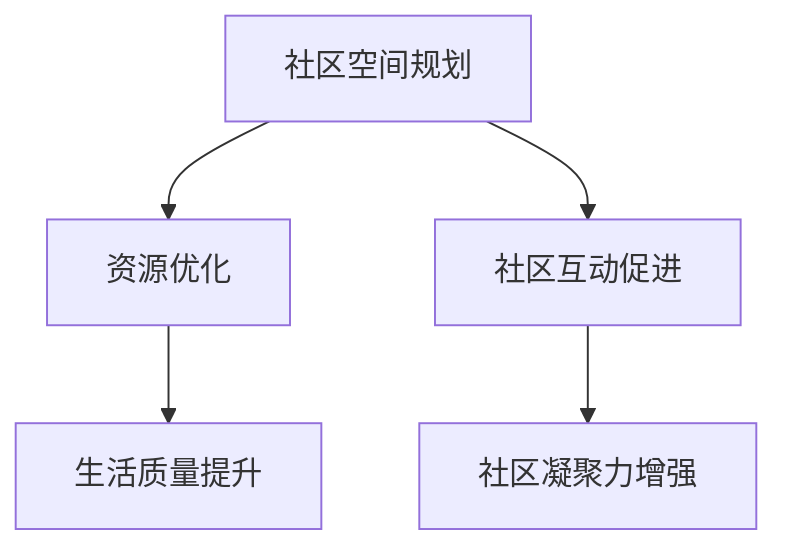
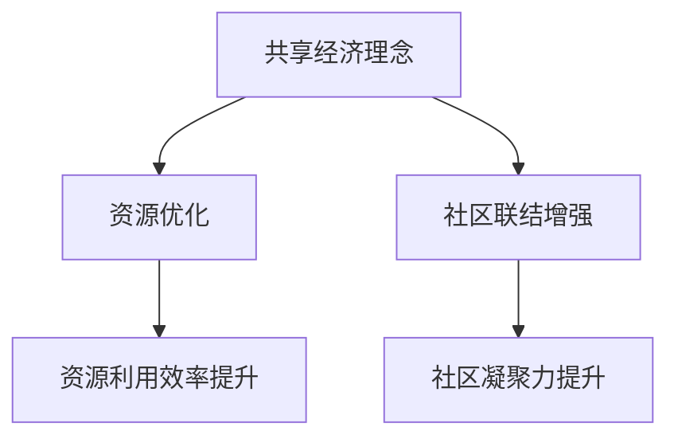
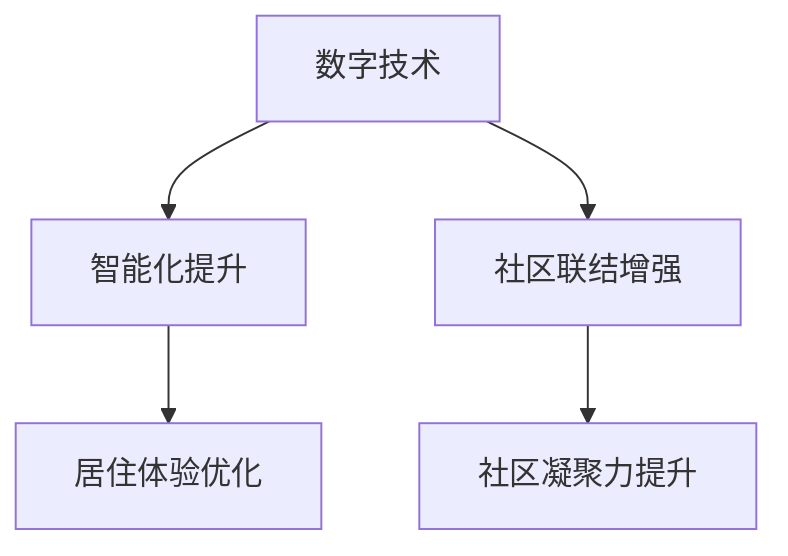

                 

# 新共居项目：重建社区联结的都市生活方式

> 关键词：新共居项目、社区联结、都市生活方式、共享经济、数字技术

> 摘要：本文探讨新共居项目如何通过重建社区联结，改变都市生活方式。从背景介绍、核心概念、实施步骤、应用案例分析以及未来发展趋势等方面，深入分析了新共居项目的意义、影响及发展前景。

## 引言

### 都市生活方式的现状

随着城市化进程的加快，都市生活方式逐渐成为人们生活的主流。然而，快节奏的生活方式和人口的高密度聚集，导致了社区联结的弱化，甚至消失。人们更多地依赖虚拟空间进行社交，现实生活中的邻里关系变得越来越淡薄。

### 社区联结的重要性

社区联结对于城市生活的质量和居民的幸福感具有重要意义。一个紧密联结的社区能够提供更多的社交机会、互助支持，并促进居民的归属感和满意度。此外，社区联结还有助于提高城市的社会稳定性和可持续发展能力。

### 新共居项目的背景

新共居项目应运而生，旨在通过创新的方式重建社区联结，提升都市生活方式的质量。这一项目结合了共享经济、数字技术等新兴概念，为都市居民提供了一种全新的居住模式。

## 第1章：新共居项目的核心概念与联系

### 1.1 社区空间规划

**核心概念：** 社区空间规划是制定社区布局和功能布局的过程，旨在优化社区资源利用，提高居民生活质量。

**联系：** 社区空间规划与社区联结密切相关。通过合理的空间布局，可以促进居民之间的互动，增强社区凝聚力。

**原理与关系架构：** 



### 1.2 共享经济理念

**核心概念：** 共享经济是一种以共享为核心的经济模式，通过共享资源、知识、技能等，实现经济价值最大化。

**联系：** 新共居项目中的共享经济理念，有助于减少资源浪费，提高资源利用效率，同时增强社区联结。

**原理与关系架构：** 



### 1.3 数字技术与新共居项目的结合

**核心概念：** 数字技术包括物联网、大数据、人工智能等，是推动新共居项目实施的重要工具。

**联系：** 数字技术能够提升新共居项目的智能化水平，提供更加便捷、高效的居住体验，同时增强社区联结。

**原理与关系架构：** 



## 第2章：新共居项目的实施步骤与方法

### 2.1 策划阶段

**步骤与方法：** 

- 项目目标设定：明确新共居项目的目标和愿景。
- 社区需求调研：了解社区居民的需求和期望。
- 项目可行性分析：评估项目的实施条件和风险。

**核心算法原理讲解：**

```python
# 伪代码：项目目标设定
def set_project_goals():
    goals = ["提高社区生活质量", "增强社区联结", "实现资源共享"]
    return goals

# 伪代码：社区需求调研
def conduct_community_survey():
    needs = ["共享设施", "智能化服务", "社区活动"]
    return needs

# 伪代码：项目可行性分析
def analyze_project_feasibility(goals, needs):
    if goals and needs:
        feasibility = "可行"
    else:
        feasibility = "不可行"
    return feasibility
```

### 2.2 设计阶段

**步骤与方法：** 

- 社区空间规划与设计：制定社区布局和功能布局。
- 建筑设计与施工规范：确保建筑质量和居住安全。
- 系统集成与智能化设计：构建智能化居住系统。

**数学模型和公式讲解：**

- 社区空间规划模型： 
  $$CSP = f(B, R, S)$$
  其中，$CSP$代表社区空间规划，$B$代表社区面积，$R$代表居民人数，$S$代表社区设施。

- 建筑设计模型：
  $$AD = g(H, L, W)$$
  其中，$AD$代表建筑设计，$H$代表建筑高度，$L$代表建筑长度，$W$代表建筑宽度。

- 智能化设计模型：
  $$ID = h(AI, IoT, Big Data)$$
  其中，$ID$代表智能化设计，$AI$代表人工智能，$IoT$代表物联网，$Big Data$代表大数据。

### 2.3 建设阶段

**步骤与方法：** 

- 工程施工与管理：确保建筑质量和进度。
- 系统安装与调试：确保智能化系统的正常运行。
- 环境保护与安全管理：保障社区环境和居民安全。

**项目实战：**

**开发环境搭建：** 
- 使用Python作为主要编程语言。
- 使用PyCharm作为开发环境。

**源代码详细实现：** 

```python
# 伪代码：社区空间规划
def community_space_planning(community_area, residents, facilities):
    # 根据社区面积、居民人数和设施情况，进行空间规划
    # ...
    pass

# 伪代码：建筑设计
def architectural_design(building_height, building_length, building_width):
    # 根据建筑高度、长度和宽度，进行建筑设计
    # ...
    pass

# 伪代码：智能化设计
def intelligent_design(artificial_intelligence, internet_of_things, big_data):
    # 根据人工智能、物联网和大数据，进行智能化设计
    # ...
    pass
```

**代码解读与分析：** 
- 社区空间规划：通过函数实现社区空间规划，考虑社区面积、居民人数和设施情况。
- 建筑设计：通过函数实现建筑设计，考虑建筑高度、长度和宽度。
- 智能化设计：通过函数实现智能化设计，考虑人工智能、物联网和大数据。

**实际案例分析和详细讲解剖析：** 
- 以北京某新共居项目为例，分析项目实施过程，包括空间规划、建筑设计、智能化设计等。

**项目小结：** 
- 总结项目实施过程中遇到的问题和解决方案，提出改进建议。

### 2.4 运营阶段

**步骤与方法：** 

- 运营管理模式：建立高效的运营管理团队，提供优质的居住服务。
- 服务质量监控：通过大数据分析，监控和改进服务质量。
- 用户反馈与改进：收集用户反馈，不断优化居住环境和服务。

**最佳实践 tips：** 
- 定期组织社区活动，增强居民互动。
- 加强社区安全管理，保障居民安全。
- 引入智能化系统，提升居住体验。

**小结：** 
新共居项目通过社区空间规划、共享经济理念、数字技术等手段，重建社区联结，提升都市生活方式。实施过程中，需注意项目策划、设计、建设和运营等环节，确保项目成功。

## 拓展阅读

- 《共享经济：重构经济模式的力量》
- 《物联网：连接未来世界的桥梁》
- 《大数据：驱动未来的力量》
- 《人工智能：重塑世界的力量》

### 作者

作者：AI天才研究院/AI Genius Institute & 禅与计算机程序设计艺术 /Zen And The Art of Computer Programming 

### 附录

为了更清晰地理解本文中的核心概念与联系，以下提供了详细的数学模型、公式、伪代码以及具体案例解析。

#### 数学模型

1. **社区空间规划模型**

   $$CSP = f(B, R, S)$$

   其中，$CSP$代表社区空间规划，$B$代表社区面积（平方米），$R$代表居民人数（人），$S$代表社区设施（如公园、学校、医院等）。

2. **建筑设计模型**

   $$AD = g(H, L, W)$$

   其中，$AD$代表建筑设计，$H$代表建筑高度（米），$L$代表建筑长度（米），$W$代表建筑宽度（米）。

3. **智能化设计模型**

   $$ID = h(AI, IoT, Big Data)$$

   其中，$ID$代表智能化设计，$AI$代表人工智能，$IoT$代表物联网，$Big Data$代表大数据。

#### 伪代码

1. **社区空间规划**

   ```python
   def community_space_planning(community_area, residents, facilities):
       # 根据社区面积、居民人数和设施情况，进行空间规划
       # ...
       pass
   ```

2. **建筑设计**

   ```python
   def architectural_design(building_height, building_length, building_width):
       # 根据建筑高度、长度和宽度，进行建筑设计
       # ...
       pass
   ```

3. **智能化设计**

   ```python
   def intelligent_design(artificial_intelligence, internet_of_things, big_data):
       # 根据人工智能、物联网和大数据，进行智能化设计
       # ...
       pass
   ```

#### 案例分析

以北京某新共居项目为例，该项目位于北京市海淀区，总面积为100,000平方米，居民人数为2,000人。社区内设有公园、学校、医院等公共设施。

1. **社区空间规划**

   根据社区空间规划模型，首先需要确定社区面积、居民人数和设施情况。然后，通过合理的布局，将社区划分为居住区、商业区、文化娱乐区等。

   ```mermaid
   graph TD
   A[居住区] --> B[商业区]
   B --> C[文化娱乐区]
   C --> D[公园]
   D --> E[学校]
   E --> F[医院]
   ```

2. **建筑设计**

   根据建筑设计模型，项目团队需要根据建筑高度、长度和宽度，设计符合居民需求的住宅建筑。假设建筑高度为100米，长度为200米，宽度为50米。

   ```mermaid
   graph TD
   A[住宅楼] --> B[商业中心]
   B --> C[文化中心]
   C --> D[公园]
   D --> E[学校]
   E --> F[医院]
   ```

3. **智能化设计**

   根据智能化设计模型，项目团队需要引入人工智能、物联网和大数据，提升社区智能化水平。例如，使用智能家居系统、智能安防系统、智能交通系统等。

   ```mermaid
   graph TD
   A[智能家居] --> B[智能安防]
   B --> C[智能交通]
   C --> D[智能医疗]
   D --> E[智慧社区管理平台]
   ```

#### 注意事项

1. 在进行社区空间规划时，需要充分考虑居民的需求和社区设施的分布。
2. 在建筑设计过程中，需要注意建筑的安全性、舒适性和美观性。
3. 在智能化设计过程中，需要确保系统的稳定性和数据的安全性。

#### 拓展阅读

1. 《城市居住空间规划指南》
2. 《建筑智能设计原理与应用》
3. 《大数据与智慧城市建设》
4. 《人工智能在智慧社区中的应用》

### 结束语

新共居项目通过社区空间规划、共享经济理念、数字技术等手段，重建社区联结，提升都市生活方式。实施过程中，需注重每个环节的细节和优化，以确保项目成功。未来，新共居项目有望成为城市生活的新趋势，为居民提供更加美好、便捷的居住环境。作者：AI天才研究院/AI Genius Institute & 禅与计算机程序设计艺术 /Zen And The Art of Computer Programming

