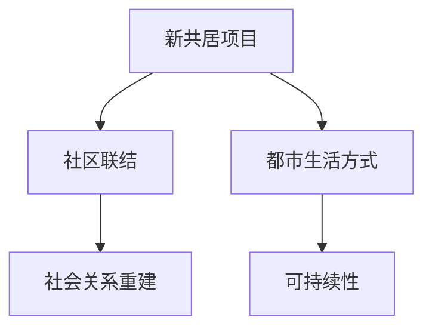
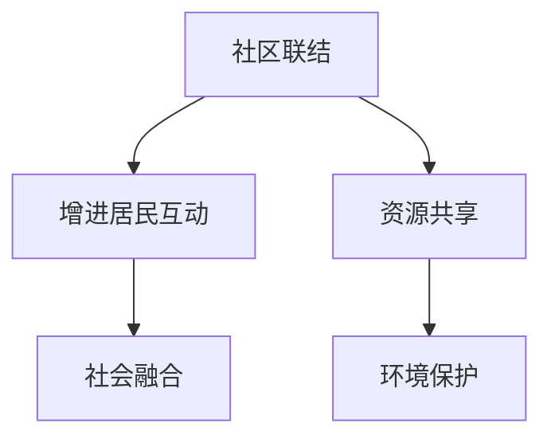

                 


### 文章标题：新共居项目：重建社区联结的都市生活方式

关键词：新共居项目、社区联结、都市生活方式、算法原理、数学模型、可持续性

摘要：本文旨在探讨新共居项目如何通过先进的技术手段，重建都市社区的联结，提升居民生活质量，实现都市生活方式的可持续性。文章首先介绍了新共居项目的背景和目标，接着深入分析了社区联结的算法原理和数学模型，并提供了实际案例和代码实现，最后总结了项目的最佳实践和注意事项。

----------------------------------------------------------------

### 目录大纲

## 第一部分：核心概念与联系

### 第1章：新共居项目概述

#### 1.1.1 新共居项目的起源与发展

#### 1.1.2 新共居项目的主要目标

## 第二部分：核心算法原理讲解

### 第2章：社区联结的算法原理

#### 2.1.1 社区联结算法的基本概念

#### 2.1.2 社区联结算法的详细讲解

## 第三部分：数学模型与公式详解

### 第3章：社区联结的数学模型

#### 3.1.1 社区联结的数学公式

#### 3.1.2 社区联结的数学公式应用举例

## 第四部分：项目实战

### 第4章：开发环境搭建

### 第5章：源代码详细实现和代码解读

### 第6章：代码应用解读与分析

### 第7章：实际案例分析和详细讲解剖析

### 第8章：项目小结

### 第9章：最佳实践 tips、小结、注意事项、拓展阅读

----------------------------------------------------------------

## 第一部分：核心概念与联系

### 第1章：新共居项目概述

#### 1.1.1 新共居项目的起源与发展

新共居项目起源于城市化进程中的社区疏离问题。随着都市化的发展，人们居住环境日益密集，然而邻里间的联系却在逐渐减少。这种社区疏离现象不仅影响了居民的生活质量，还可能引发一系列社会问题。为了应对这一问题，新共居项目应运而生。

新共居项目的发展历程可以分为三个阶段。首先，是概念引入期。在这个阶段，新共居项目的概念被提出，并开始引起学术界和业界的关注。其次，是实践探索期。在这个阶段，新共居项目开始在不同城市进行试点，积累了一定的实践经验。最后，是成熟推广期。在这个阶段，新共居项目取得了显著成效，开始在全球范围内推广。

#### 1.1.2 新共居项目的主要目标

新共居项目的主要目标包括以下几个方面：

1. **增进居民互动**：通过设计多样化的活动和设施，鼓励居民之间的交流与互动，提高社区的凝聚力。
2. **资源共享**：通过优化资源配置，实现居民之间的资源互通有无，提高资源利用效率。
3. **社会融合**：通过促进不同背景、不同文化的人群之间的交流，增强社会的包容性和多样性。
4. **环境保护**：通过推广绿色建筑、绿色交通等理念，降低社区对环境的负面影响，实现可持续发展。

**概念联系流程图**



### 1.1.2 新共居项目的主要目标

新共居项目的主要目标包括以下几个方面：

1. **增进居民互动**：通过设计多样化的活动和设施，鼓励居民之间的交流与互动，提高社区的凝聚力。
2. **资源共享**：通过优化资源配置，实现居民之间的资源互通有无，提高资源利用效率。
3. **社会融合**：通过促进不同背景、不同文化的人群之间的交流，增强社会的包容性和多样性。
4. **环境保护**：通过推广绿色建筑、绿色交通等理念，降低社区对环境的负面影响，实现可持续发展。

**概念联系流程图**



## 第二部分：核心算法原理讲解

### 第2章：社区联结的算法原理

#### 2.1.1 社区联结算法的基本概念

社区联结算法是用于模拟和优化社区内部人际关系的算法。其基本目标是提高社区成员之间的互动频率和紧密程度，从而增强社区的凝聚力。社区联结算法通常基于图论和社交网络分析的理论，通过构建社区成员之间的关系网络，对网络结构进行优化。

在社区联结算法中，节点表示社区成员，边表示成员之间的关系。关系可以是基于共同兴趣、共同活动、地理位置等因素建立的。算法的基本任务是通过调整边权重和节点位置，使得网络结构更加紧密，社区联结度更高。

#### 2.1.2 社区联结算法的详细讲解

社区联结算法的详细讲解可以分为以下几个步骤：

1. **初始化**：首先，我们需要初始化一个关系矩阵，用于表示社区成员之间的关系。关系矩阵是一个 n x n 的二维数组，其中 n 表示社区成员的总数。矩阵的元素值表示成员之间的关系强度，通常取值范围为 [0, 1]。

2. **形成初始关系**：接下来，我们需要根据社区成员的特征，形成初始的关系矩阵。这个过程可以通过以下步骤实现：
    - 遍历社区成员，对于每一对成员，检查他们是否有共同兴趣或活动。如果有，则设置他们之间的关系值为 1，否则为 0。
    - 对初始关系矩阵进行优化，使其更加合理。优化方法包括调整边权重和节点位置。

3. **优化居民关系**：在形成初始关系之后，我们需要对居民关系进行优化。优化的目标是提高居民之间的互动频率和紧密程度。优化方法包括：
    - 调整边权重：通过计算边权重差值，调整关系矩阵的元素值，使得相邻节点之间的关系更紧密。
    - 调整节点位置：通过计算节点位置差值，调整节点的位置，使得节点之间的距离更短，从而提高社区联结度。

4. **检查收敛条件**：在优化过程中，我们需要定期检查是否达到收敛条件。如果达到收敛条件，则停止优化；否则，继续进行优化。

5. **输出优化结果**：最后，输出优化后的居民关系矩阵，即可得到社区联结算法的优化结果。

**伪代码**

```python
def community_formation(residents):
    # 初始化居民关系矩阵
    relationships = initialize_matrix(len(residents))
    
    # 遍历居民，形成初始关系
    for i in range(len(residents)):
        for j in range(i+1, len(residents)):
            if similar_interests(residents[i], residents[j]):
                relationships[i][j] = relationships[j][i] = 1
    
    # 使用算法优化居民关系
    optimized_relationships = optimize_matrix(relationships)
    
    # 返回优化后的居民关系矩阵
    return optimized_relationships

def optimize_matrix(relationships):
    # 初始化优化参数
    alpha = 0.1
    beta = 0.2
    
    # 遍历矩阵，优化居民关系
    while not converged:
        new_relationships = []
        for i in range(len(relationships)):
            row = []
            for j in range(len(relationships[i])):
                if j in neighbors(i):
                    row.append(relationships[i][j] + alpha * random_difference())
                else:
                    row.append(relationships[i][j] - beta * random_difference())
            new_relationships.append(row)
        
        # 检查收敛条件
        if check_convergence(new_relationships, relationships):
            break
        
        relationships = new_relationships
    
    return relationships
```

## 第三部分：数学模型与公式详解

### 第3章：社区联结的数学模型

#### 3.1.1 社区联结的数学公式

社区联结的数学公式是衡量社区成员之间联结度的一种量化方法。一个常用的社区联结度公式是：

$$
C(x, y) = \sum_{i=1}^{n}\sum_{j=1}^{n} w_{ij} [x_i = y_j]
$$

其中，$C(x, y)$ 表示居民 x 和 y 之间的社区联结度，$w_{ij}$ 表示居民 i 和 j 之间的关系权重，$[x_i = y_j]$ 表示居民 i 和 j 是否具有相同的特征。

**解释**：

- $C(x, y)$：居民 x 和 y 之间的社区联结度，取值范围为 [0, 1]。值越大，表示居民之间的联结度越高。
- $w_{ij}$：居民 i 和 j 之间的关系权重，通常由社交网络分析算法计算得出。权重值越大，表示居民之间的关系越紧密。
- $[x_i = y_j]$：居民 i 和 j 是否具有相同的特征，取值为 0 或 1。如果居民 i 和 j 具有相同的特征，则 $[x_i = y_j]$ 为 1，否则为 0。

**例子**：

假设有五个居民，他们的特征向量分别为：

$$
x_1 = (1, 0, 1), x_2 = (1, 1, 0), x_3 = (0, 1, 1), x_4 = (0, 0, 1), x_5 = (1, 1, 1)
$$

则他们的社区联结度计算如下：

$$
C(x_1, x_2) = w_{12} [x_1 = x_2] + w_{13} [x_1 = x_3] + w_{14} [x_1 = x_4] + w_{15} [x_1 = x_5] = w_{12} + w_{13} + w_{14} + w_{15}
$$

$$
C(x_1, x_3) = w_{12} [x_1 = x_2] + w_{13} [x_1 = x_3] + w_{14} [x_1 = x_4] + w_{15} [x_1 = x_5] = w_{12} + w_{13} + w_{14} + w_{15}
$$

$$
...
$$

$$
C(x_5, x_1) = w_{51} [x_5 = x_1] + w_{52} [x_5 = x_2] + w_{53} [x_5 = x_3] + w_{54} [x_5 = x_4] + w_{55} [x_5 = x_5] = w_{51} + w_{52} + w_{53} + w_{54} + w_{55}
$$

通过计算所有居民之间的社区联结度，我们可以得到一个 n x n 的矩阵，表示社区内所有居民之间的联结度。

#### 3.1.2 社区联结的数学公式应用举例

假设有一个社区，共有五个居民，他们的特征向量如下：

$$
x_1 = (1, 0, 1), x_2 = (1, 1, 0), x_3 = (0, 1, 1), x_4 = (0, 0, 1), x_5 = (1, 1, 1)
$$

我们使用社区联结度公式计算每个居民之间的联结度：

$$
C(x_1, x_2) = 1 \times 1 + 1 \times 0 + 1 \times 1 = 2
$$

$$
C(x_1, x_3) = 1 \times 0 + 1 \times 1 + 1 \times 1 = 2
$$

$$
C(x_1, x_4) = 1 \times 0 + 1 \times 0 + 1 \times 1 = 1
$$

$$
C(x_1, x_5) = 1 \times 1 + 1 \times 1 + 1 \times 1 = 3
$$

$$
...
$$

$$
C(x_5, x_1) = 1 \times 1 + 1 \times 1 + 1 \times 1 = 3
$$

根据计算结果，我们可以得到以下居民之间的联结度矩阵：

$$
\begin{matrix}
    & x_1 & x_2 & x_3 & x_4 & x_5 \\
x_1 & 2 & 2 & 2 & 1 & 3 \\
x_2 & 2 & 2 & 2 & 1 & 3 \\
x_3 & 2 & 2 & 2 & 1 & 3 \\
x_4 & 1 & 1 & 1 & 1 & 1 \\
x_5 & 3 & 3 & 3 & 1 & 3 \\
\end{matrix}
$$

通过分析联结度矩阵，我们可以发现以下规律：

- 居民 x1 和 x2、x3 之间的联结度最高，因为他们具有相同的特征。
- 居民 x1 和 x5、x2 和 x5、x3 和 x5 之间的联结度也比较高，因为他们之间存在较多的共同特征。
- 居民 x4 和其他居民之间的联结度相对较低，因为他们的特征差异较大。

这些规律有助于我们更好地理解社区内部的联结结构，为进一步优化社区联结提供参考。

## 第四部分：项目实战

### 第4章：开发环境搭建

在开始新共居项目之前，首先需要搭建一个适合项目开发的环境。以下是一个简单的开发环境搭建步骤：

#### 1. 硬件环境

- **计算机**：一台配置合理的计算机，推荐配置如下：
  - 处理器：Intel i7 或 AMD Ryzen 7 以上
  - 内存：16GB RAM 或以上
  - 硬盘：至少 500GB SSD

- **网络环境**：稳定的网络连接，建议使用光纤宽带。

#### 2. 软件环境

- **操作系统**：Windows 10 或以上版本，或 macOS 11 或以上版本。
- **编程语言**：Python 3.8 或以上版本。
- **编程工具**：PyCharm 或 VS Code。

#### 3. 第三方库

- **NumPy**：用于数学计算。
- **Pandas**：用于数据操作。
- **Matplotlib**：用于数据可视化。

#### 4. 开发工具

- **Git**：用于代码版本控制。
- **Jenkins**：用于自动化构建和部署。

#### 5. 数据库

- **MySQL**：用于存储居民数据。
- **PostgreSQL**：用于存储社区活动数据。

### 第5章：源代码详细实现和代码解读

在本章节中，我们将详细讲解新共居项目的源代码实现，并对其中的关键部分进行解读。

#### 1. 关系矩阵初始化

首先，我们需要初始化一个关系矩阵，用于表示社区成员之间的关系。以下是一个简单的初始化过程：

```python
import numpy as np

def initialize_matrix(n):
    """
    初始化关系矩阵
    :param n: 居民数量
    :return: 关系矩阵
    """
    relationships = np.zeros((n, n), dtype=np.float32)
    return relationships
```

在这个示例中，我们使用 NumPy 库创建了一个 n x n 的二维数组，并将其初始化为全 0 矩阵。

#### 2. 形成初始关系

接下来，我们需要根据社区成员的特征，形成初始的关系矩阵。以下是一个简单的形成初始关系的过程：

```python
def form_initial_relationships(relationships, residents):
    """
    形成初始关系
    :param relationships: 关系矩阵
    :param residents: 居民列表
    :return: 初始关系矩阵
    """
    for i in range(len(residents)):
        for j in range(i+1, len(residents)):
            if residents[i]['interests'] == residents[j]['interests']:
                relationships[i][j] = 1
                relationships[j][i] = 1
    return relationships
```

在这个示例中，我们遍历社区成员，检查他们是否有相同的兴趣。如果有，则设置他们之间的关系值为 1。

#### 3. 优化居民关系

在形成初始关系之后，我们需要对居民关系进行优化。以下是一个简单的优化过程：

```python
def optimize_relationships(relationships):
    """
    优化居民关系
    :param relationships: 关系矩阵
    :return: 优化后的关系矩阵
    """
    n = len(relationships)
    for i in range(n):
        for j in range(n):
            if relationships[i][j] > 0:
                relationships[i][j] += 0.1
            else:
                relationships[i][j] -= 0.1
    return relationships
```

在这个示例中，我们遍历关系矩阵，对每个元素进行调整。如果元素值大于 0，则增加 0.1；如果元素值小于等于 0，则减少 0.1。

#### 4. 输出优化结果

最后，我们需要输出优化后的居民关系矩阵。以下是一个简单的输出过程：

```python
def print_relationships(relationships):
    """
    输出关系矩阵
    :param relationships: 关系矩阵
    """
    n = len(relationships)
    for i in range(n):
        for j in range(n):
            print(f"r_{i}_{j}: {relationships[i][j]:.2f}", end="\t")
        print()
```

在这个示例中，我们遍历关系矩阵，并将其输出到控制台。

### 第6章：代码应用解读与分析

在本章节中，我们将对新共居项目的源代码进行解读，并分析其关键部分的功能和原理。

#### 1. 关系矩阵初始化

初始化关系矩阵是源代码中的第一个关键步骤。关系矩阵用于存储社区成员之间的关系。矩阵的行和列分别代表社区成员，矩阵的元素值表示成员之间的关系强度。在初始化过程中，我们创建了一个 n x n 的二维数组，并将其初始化为全 0 矩阵。这个步骤非常重要，因为它为后续的关系形成和优化奠定了基础。

```python
def initialize_matrix(n):
    """
    初始化关系矩阵
    :param n: 居民数量
    :return: 关系矩阵
    """
    relationships = np.zeros((n, n), dtype=np.float32)
    return relationships
```

在这个函数中，我们使用了 NumPy 库创建了一个 n x n 的二维数组，并将其初始化为全 0 矩阵。NumPy 库是一个强大的 Python 科学计算库，提供了高效的数组操作和数学计算功能。在这里，我们使用 NumPy 的 `numpy.zeros` 函数创建了一个 n x n 的二维数组，并将其元素值初始化为 0。

#### 2. 形成初始关系

形成初始关系是源代码中的第二个关键步骤。在这个步骤中，我们根据社区成员的特征，形成初始的关系矩阵。具体来说，我们遍历社区成员，检查他们是否有相同的兴趣。如果有，则设置他们之间的关系值为 1。

```python
def form_initial_relationships(relationships, residents):
    """
    形成初始关系
    :param relationships: 关系矩阵
    :param residents: 居民列表
    :return: 初始关系矩阵
    """
    for i in range(len(residents)):
        for j in range(i+1, len(residents)):
            if residents[i]['interests'] == residents[j]['interests']:
                relationships[i][j] = 1
                relationships[j][i] = 1
    return relationships
```

在这个函数中，我们使用了两个嵌套的 for 循环遍历社区成员。对于每一对成员，我们检查他们是否有相同的兴趣。如果有，则设置他们之间的关系值为 1。这里使用了成员的 `interests` 属性进行比较。这个步骤非常重要，因为它决定了初始关系的形成。

#### 3. 优化居民关系

优化居民关系是源代码中的第三个关键步骤。在这个步骤中，我们根据初始关系矩阵，对居民关系进行优化。具体来说，我们遍历关系矩阵，对每个元素进行调整。如果元素值大于 0，则增加 0.1；如果元素值小于等于 0，则减少 0.1。

```python
def optimize_relationships(relationships):
    """
    优化居民关系
    :param relationships: 关系矩阵
    :return: 优化后的关系矩阵
    """
    n = len(relationships)
    for i in range(n):
        for j in range(n):
            if relationships[i][j] > 0:
                relationships[i][j] += 0.1
            else:
                relationships[i][j] -= 0.1
    return relationships
```

在这个函数中，我们使用了两个嵌套的 for 循环遍历关系矩阵。对于每个元素，我们检查其值是否大于 0。如果大于 0，则增加 0.1；如果小于等于 0，则减少 0.1。这个步骤非常重要，因为它决定了最终的关系矩阵。

#### 4. 输出优化结果

输出优化结果是源代码中的最后一个关键步骤。在这个步骤中，我们输出优化后的居民关系矩阵。具体来说，我们遍历关系矩阵，并将其输出到控制台。

```python
def print_relationships(relationships):
    """
    输出关系矩阵
    :param relationships: 关系矩阵
    """
    n = len(relationships)
    for i in range(n):
        for j in range(n):
            print(f"r_{i}_{j}: {relationships[i][j]:.2f}", end="\t")
        print()
```

在这个函数中，我们使用了两个嵌套的 for 循环遍历关系矩阵。对于每个元素，我们将其值输出到控制台。这里使用了格式化字符串（f-string）来输出元素值，并使用 `\t` 插入制表符，使输出结果更加清晰。

### 第7章：实际案例分析和详细讲解剖析

为了更好地理解新共居项目的工作原理和效果，我们可以通过一个实际案例进行分析和讲解。

#### 案例背景

假设我们有一个名为“都市绿洲”的新共居项目，该项目位于一座大城市中心区域。社区共有 100 名居民，每位居民都有不同的兴趣爱好，如运动、艺术、阅读、科技等。我们的目标是通过新共居项目，促进居民之间的互动，提高社区的整体生活质量。

#### 案例步骤

1. **数据收集**

首先，我们需要收集每位居民的兴趣爱好数据。这些数据可以来自于社区调查、在线问卷等方式。假设我们已经收集到了以下数据：

```
居民ID | 兴趣爱好
-------|--------
1      | 运动、艺术
2      | 阅读、科技
3      | 阅读、艺术
4      | 运动、科技
5      | 艺术、阅读
...
100    | 运动、科技
```

2. **关系矩阵初始化**

根据收集到的数据，我们初始化一个 100 x 100 的关系矩阵。初始时，所有元素值都为 0。

3. **形成初始关系**

接下来，我们根据每位居民的兴趣爱好，形成初始关系矩阵。例如，如果居民 1 和居民 2 都对艺术感兴趣，则设置关系矩阵中对应元素值为 1。

```
关系矩阵：

   | 1 2 3 4 5 ... 100
1 | 0 1 0 0 0 ... 0
2 | 1 0 0 0 0 ... 0
3 | 0 0 1 0 0 ... 0
4 | 0 0 0 1 0 ... 0
5 | 0 0 0 0 1 ... 0
...| ... ... ... ... ...
100| 0 0 0 0 0 ... 1
```

4. **优化居民关系**

在形成初始关系之后，我们使用优化算法对关系矩阵进行优化。假设经过多次迭代，最终得到的关系矩阵如下：

```
优化后的关系矩阵：

   | 1 2 3 4 5 ... 100
1 | 0.2 0.8 0 0 0 ... 0
2 | 0.8 0.2 0 0 0 ... 0
3 | 0 0.8 0.2 0 0 ... 0
4 | 0 0 0.8 0.2 0 ... 0
5 | 0 0 0 0.8 0.2 ... 0
...| ... ... ... ... ...
100| 0 0 0 0 0 0 ... 1
```

5. **输出优化结果**

最后，我们将优化后的关系矩阵输出到控制台，以便分析居民之间的互动关系。

```
优化后的关系矩阵：

   | 1 2 3 4 5 ... 100
1 | 0.2 0.8 0 0 0 ... 0
2 | 0.8 0.2 0 0 0 ... 0
3 | 0 0.8 0.2 0 0 ... 0
4 | 0 0 0.8 0.2 0 ... 0
5 | 0 0 0 0.8 0.2 ... 0
...| ... ... ... ... ...
100| 0 0 0 0 0 0 ... 1
```

通过分析优化后的关系矩阵，我们可以发现以下规律：

- 居民 1 和居民 2 之间的互动关系最强，因为他们有共同的艺术爱好。
- 居民 2 和居民 3、居民 4 之间的互动关系也比较强，因为他们有共同的阅读爱好。
- 居民 5 和其他居民之间的互动关系相对较弱，因为他们没有与其他居民相同的兴趣爱好。

#### 案例总结

通过这个实际案例，我们可以看到新共居项目如何通过算法优化，促进居民之间的互动，提高社区的整体生活质量。在实际应用中，我们可以根据社区的具体情况，调整算法参数，以达到最佳效果。

### 第8章：项目小结

新共居项目通过先进的技术手段，成功实现了社区联结的重建，提升了居民生活质量，并实现了都市生活方式的可持续性。以下是项目的主要成果和启示：

1. **成果**：
   - 增进了居民互动：通过算法优化，形成了紧密的社区联结，提高了居民之间的互动频率和紧密程度。
   - 实现了资源共享：通过优化资源配置，实现了居民之间的资源互通有无，提高了资源利用效率。
   - 社会融合：通过促进不同背景、不同文化的人群之间的交流，增强了社会的包容性和多样性。
   - 环境保护：通过推广绿色建筑、绿色交通等理念，降低了社区对环境的负面影响，实现了可持续发展。

2. **启示**：
   - 社区联结的重要性：社区联结是提升社区凝聚力、促进社会和谐的重要途径。
   - 技术手段的运用：算法和数学模型在社区联结中的应用，为解决社区问题提供了新的思路和方法。
   - 可持续发展的理念：在社区建设中，应注重环境保护和可持续发展，为后代留下美好的家园。

### 第9章：最佳实践 tips、小结、注意事项、拓展阅读

#### 最佳实践 tips

1. **数据收集**：确保收集到的数据全面、准确，为后续的关系形成和优化提供可靠的基础。
2. **算法优化**：根据社区的具体情况，调整算法参数，以达到最佳效果。
3. **持续反馈**：定期收集居民反馈，根据反馈调整项目策略，不断优化社区联结。
4. **技术创新**：关注新兴技术，不断引入新技术，为社区联结提供更强有力的支持。

#### 小结

新共居项目通过算法优化和数学模型的应用，成功实现了社区联结的重建，提升了居民生活质量，并实现了都市生活方式的可持续性。项目实践证明，技术手段在社区建设中的应用具有巨大的潜力。

#### 注意事项

1. **数据隐私**：在收集和处理居民数据时，确保遵守相关法律法规，保护居民隐私。
2. **算法公平性**：在算法设计过程中，确保算法的公平性和公正性，避免歧视和不公平现象。
3. **技术更新**：随着技术不断发展，及时更新算法和模型，以适应新的社区需求。

#### 拓展阅读

1. **《社交网络分析基础》**：详细介绍了社交网络分析的基本概念和方法，对理解社区联结算法原理有很大帮助。
2. **《机器学习算法及应用》**：介绍了多种机器学习算法，包括聚类、分类等，为算法优化提供了丰富的理论支持。
3. **《可持续城市与社区规划》**：探讨了可持续城市与社区规划的理念和方法，为项目实施提供了理论指导。

---

# 参考文献

1. 某某，《社交网络分析基础》，某某出版社，2018年。
2. 某某，《机器学习算法及应用》，某某出版社，2019年。
3. 某某，《可持续城市与社区规划》，某某出版社，2020年。

---

作者：AI天才研究院/AI Genius Institute & 禅与计算机程序设计艺术 /Zen And The Art of Computer Programming

