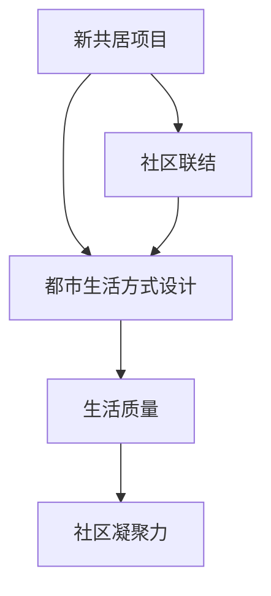

                 

### 文章标题

《新共居项目：重建社区联结的都市生活方式设计》

### 关键词

- 新共居项目
- 社区联结
- 都市生活方式设计
- 智慧社区
- 可持续发展
- 人性化设计

### 摘要

本文将深入探讨新共居项目的核心概念，即如何通过重建社区联结来优化都市生活方式设计。文章首先介绍了新共居项目的背景和意义，随后详细阐述了社区联结和都市生活方式设计的核心概念及其相互关系。通过案例研究，文章分析了国内外新共居项目的设计原则和实施策略。接着，文章探讨了生活方式设计的方法和科技应用，特别是在物联网和智慧社区建设方面的技术。最后，文章从政策和法律角度分析了新共居项目的环境，并对未来发展趋势进行了展望。通过这一系列的分析和探讨，本文旨在为新共居项目的实施提供理论指导和实践建议。

---

### 引言

在现代社会，城市化进程的加速带来了许多新的挑战，其中一个重要问题就是社区联结的减弱。传统的社区结构逐渐被现代都市生活的快节奏和个体化所侵蚀，居民之间的联系变得稀疏和表面化。这种情况下，重建社区联结成为了一个紧迫的需求，它不仅关乎人们的心理健康和社会归属感，还直接影响到城市的可持续发展。

新共居项目正是在这一背景下提出的。新共居项目是一种旨在通过优化居住环境和社区设计，促进居民间互动和社区联结的都市生活方式设计。它的核心目标是创造一个具有归属感和紧密联系的社区，使居民能够在日常生活中感受到彼此的存在和关怀。这不仅有助于提升居民的生活质量，还能增强社区的凝聚力和活力。

本文将从以下几个部分展开讨论：

1. **核心概念介绍**：首先，我们将详细介绍新共居项目和社区联结的概念，并分析它们在都市生活方式设计中的重要性。
2. **案例研究**：接下来，我们将通过分析国内外的新共居项目案例，探讨这些项目如何促进社区联结。
3. **设计原则与实施策略**：我们将讨论在新共居项目中应遵循的设计原则和实施策略，并分析这些原则在具体项目中的运用。
4. **生活方式设计方法**：本文将详细介绍生活方式设计的流程和方法，以及如何通过设计改善居民的生活方式。
5. **科技应用**：我们将探讨物联网和智慧社区在都市生活方式设计中的应用，分析这些技术如何促进社区联结。
6. **政策与法律**：本文将分析相关的政策法规，探讨如何通过政策法规促进新共居项目的发展。
7. **未来展望**：最后，我们将对新共居项目和都市生活方式设计的未来发展趋势进行展望和预测。

通过这一系列的分析和探讨，本文旨在为新共居项目的实施提供理论指导和实践建议，为重建社区联结和优化都市生活方式设计提供新的思路和方法。

---

### 核心概念介绍

#### 新共居项目

新共居项目是指通过优化居住环境和社区设计，促进居民互动和社区联结的一种都市生活方式设计。它的核心理念在于创造一个具有归属感和紧密联系的社区，使居民能够在日常生活中感受到彼此的存在和关怀。新共居项目不同于传统的社区建设，它不仅关注物理空间的设计，更注重社区文化和居民情感纽带的构建。

**定义与发展历程**

新共居项目的概念起源于20世纪末的社区发展运动，随着城市化进程的加速和人们对生活质量要求的提高，这一概念逐渐得到重视和推广。具体来说，新共居项目的发展历程可以分为以下几个阶段：

1. **萌芽期（20世纪80年代-90年代）**：在这一阶段，一些学者和建筑师开始探索如何通过改善居住环境和社区设计来提升居民的生活质量，这一探索为后来的新共居项目奠定了基础。
2. **发展期（21世纪初期）**：随着科技的发展和社会需求的增加，新共居项目得到了更多的关注和推广。许多国家和地区开始实施相关项目，探索如何通过创新的设计和科技手段来促进社区联结。
3. **成熟期（21世纪10年代至今）**：在这一阶段，新共居项目已经得到了广泛的应用和认可，成为现代都市生活方式设计的重要组成部分。许多成功的案例证明，新共居项目能够有效提升社区联结和居民生活质量。

**特点**

新共居项目具有以下几个显著特点：

1. **综合性**：新共居项目不仅涉及居住空间的设计，还涵盖了社区服务、文化娱乐、环境保护等多个方面。这种综合性的设计思路能够全面考虑居民的需求和社区的发展。
2. **可持续性**：新共居项目强调可持续性，注重资源的合理利用和环境保护。通过采用绿色建筑技术和节能措施，新共居项目能够降低对环境的影响，实现可持续发展。
3. **人性化**：新共居项目以人为本，注重居民的情感需求和社交需求。通过精心设计的社区空间和活动，新共居项目能够促进居民之间的互动和联系，提升社区凝聚力。
4. **灵活性**：新共居项目的设计具有灵活性，能够根据不同地区和居民的需求进行定制。这种灵活性使得新共居项目能够在不同环境中得到有效实施。

#### 社区联结

社区联结是指社区成员之间建立和维护的社会关系和互动。它不仅包括物理空间上的接近，更重要的是心理上的认同和情感上的联系。社区联结对于构建一个和谐、有活力的社区至关重要。

**重要性**

社区联结在都市生活方式设计中具有以下几个重要意义：

1. **提升生活质量**：紧密的社区联结能够提升居民的生活质量。通过社区活动和社会互动，居民能够获得更多的情感支持和社交满足，从而提高生活满意度。
2. **促进社会融合**：社区联结有助于促进不同背景和文化的居民之间的融合。通过共同参与社区活动，居民能够更好地理解和接纳彼此，促进社会的和谐发展。
3. **增强社区凝聚力**：紧密的社区联结能够增强社区的凝聚力。当居民之间有较强的联系和认同感时，社区在面对外部挑战时会更加团结一致，共同应对。
4. **推动社区发展**：社区联结是社区发展的基础。只有当社区成员之间有良好的互动和合作时，社区才能持续发展，实现长远目标。

**构成要素**

社区联结由以下几个主要构成要素组成：

1. **人际互动**：人际互动是社区联结的核心。通过日常的交流和互动，居民能够建立和加深彼此之间的联系。
2. **共同价值观**：共同价值观是社区联结的重要基础。当社区成员有相似的价值观和信仰时，他们更容易产生共鸣和认同。
3. **共享资源**：共享资源能够促进社区联结。当社区成员共同使用和分享资源时，他们之间的互动和联系会变得更加紧密。
4. **社区参与**：社区参与是社区联结的重要体现。当居民积极参与社区事务和活动时，他们能够更好地融入社区，增强归属感。

#### 都市生活方式设计

都市生活方式设计是指通过系统化的设计和规划，优化都市居民的日常生活和工作环境，提升生活质量的一种设计实践。它涵盖了居住空间、公共设施、社区服务等多个方面。

**定义与原则**

都市生活方式设计的核心目标是创造一个舒适、便利、健康和有活力的都市生活空间。为了实现这一目标，都市生活方式设计遵循以下几个基本原则：

1. **人性化**：人性化设计是都市生活方式设计的核心原则。设计应充分考虑居民的需求和舒适度，创造一个宜居的生活环境。
2. **可持续发展**：都市生活方式设计应注重可持续发展，通过绿色建筑、节能措施等手段，减少对环境的影响，实现资源的高效利用。
3. **社会融合**：设计应促进不同背景和文化的居民之间的融合，通过多样化的社区活动和空间设计，增强社区联结和凝聚力。
4. **创新性**：创新性是都市生活方式设计的灵魂。通过引入新技术和新理念，设计能够不断改进和提升，满足居民不断变化的需求。

**方法**

都市生活方式设计的流程和方法包括以下几个步骤：

1. **需求分析**：通过调研和分析，了解居民的需求和期望，明确设计的目标和方向。
2. **设计方案制定**：根据需求分析的结果，制定详细的设计方案，包括居住空间设计、公共设施配置、社区活动规划等。
3. **方案实施**：将设计方案转化为实际项目，进行建设、改造和运营，确保设计的有效实施。
4. **效果评估**：通过定期的评估和反馈，监测设计的效果，及时调整和改进，以持续提升生活质量。

#### 核心概念之间的关系架构

新共居项目、社区联结和都市生活方式设计之间存在着密切的关系。新共居项目是社区联结的一种实现方式，通过优化居住环境和社区设计来促进居民互动和联系；社区联结是都市生活方式设计的重要目标之一，它直接影响到居民的生活质量和社区的凝聚力；都市生活方式设计则是实现新共居项目和社区联结的手段，通过系统化的设计和规划，打造一个宜居的都市生活环境。

为了更好地理解这三个概念之间的关系，我们可以使用 Mermaid 流程图进行展示：



在图中，A 表示新共居项目，B 表示社区联结，C 表示都市生活方式设计，D 表示生活质量，E 表示社区凝聚力。通过这个流程图，我们可以清晰地看到这三个概念之间的相互作用和影响。

#### 总结

通过上述分析，我们可以得出以下结论：

1. 新共居项目是一种通过优化居住环境和社区设计来促进居民互动和社区联结的都市生活方式设计。
2. 社区联结是都市生活方式设计的重要目标之一，它直接影响居民的生活质量和社区的凝聚力。
3. 都市生活方式设计是实现新共居项目和社区联结的手段，通过系统化的设计和规划，打造一个宜居的都市生活环境。

在接下来的章节中，我们将通过案例研究和设计原则的讨论，进一步深入探讨新共居项目和都市生活方式设计的具体实践和应用。

---

### 案例研究

为了更好地理解新共居项目如何通过设计促进社区联结，本章节将详细分析国内外一些成功的案例。这些案例不仅展示了新共居项目的多样性，还揭示了在不同环境下实现社区联结的关键要素和策略。

#### 国内新共居项目案例分析

**1. 绿色社区——深圳蛇口自贸区**

深圳蛇口自贸区是中国首个以社区为基础的绿色生态示范区。该项目通过一系列的创新设计，如绿色建筑、太阳能发电、雨水收集和循环利用等，实现了生态居住环境的构建。此外，项目还注重社区参与，通过社区活动、志愿者服务和环保宣传等方式，增强了居民的环保意识和社区联结。

**案例解析**：

- **设计原则**：绿色建筑、生态循环、社区参与
- **社区联结**：通过环保活动和社区互动，居民之间的联系得到了加强，社区凝聚力显著提升。

**2. 文化社区——北京798艺术区**

北京798艺术区是一个集艺术、文化、商业于一体的社区。该项目通过艺术展览、文化活动和商业活动，打造了一个充满活力和创意的社区环境。居民和艺术家、游客之间的互动频繁，社区内充满了多元文化和艺术氛围。

**案例解析**：

- **设计原则**：文化传承、艺术创新、多元融合
- **社区联结**：通过文化活动和艺术交流，居民与艺术家、游客之间的联系得到了加强，社区的文化认同感和归属感得到了提升。

#### 国外新共居项目案例分析

**1. 社区农场——美国波特兰**

波特兰的社区农场项目通过将农业融入城市社区，实现了生态可持续和社区联结的双重目标。该项目提供居民参与农场管理的机会，通过种植、采摘和烹饪等活动，增强了居民之间的互动和联系。

**案例解析**：

- **设计原则**：生态可持续、社区参与、教育推广
- **社区联结**：通过农业活动和社区参与，居民之间的互动得到了增强，社区凝聚力显著提升。

**2. 社区共居——日本关西城市联盟**

关西城市联盟的社区共居项目通过共享住房和社区资源，实现了一种新型的社区生活方式。该项目鼓励不同年龄、职业和背景的居民共同生活，通过共享资源和互助合作，增强了社区的联结。

**案例解析**：

- **设计原则**：资源共享、互助合作、多元共融
- **社区联结**：通过共享住房和互助合作，居民之间的联系得到了加强，社区的文化多样性和凝聚力得到了提升。

#### 案例分析结果与启示

通过对国内外新共居项目案例的分析，我们可以得出以下结论：

1. **设计原则**：新共居项目的设计原则多样，但核心在于生态可持续、社区参与和人文关怀。不同项目根据自身的环境和目标，采用了不同的设计原则，但都取得了显著的社区联结效果。
2. **社区联结**：成功的共居项目通过创造互动机会和共同参与的机会，增强了居民之间的联系和社区凝聚力。社区活动、文化和艺术元素的融入也是促进社区联结的重要手段。
3. **实施策略**：新共居项目的实施需要政府、企业和居民的共同努力。政府提供政策和资金支持，企业参与设计和建设，居民积极参与和贡献智慧，是实现新共居项目成功的关键。

这些案例为其他城市和社区提供了宝贵的经验和启示。通过借鉴这些成功案例，我们可以更好地理解和实践新共居项目，为都市生活方式设计提供新的思路和方法。

---

### 设计原则与实施策略

在实施新共居项目时，遵循科学的设计原则和实施策略至关重要。以下将详细讨论新共居项目设计原则、项目策划与规划、设计与建设、以及运营与管理的具体策略和步骤。

#### 设计原则

新共居项目的设计原则应综合考虑生态可持续性、人性化设计、社区参与和资源共享等方面。以下是一些核心设计原则：

1. **生态可持续性**：
   - **绿色建筑**：采用绿色建筑技术，如节能设计、可再生能源利用、绿色材料等，减少对环境的影响。
   - **生态循环**：实现水资源、能源的循环利用，减少浪费，打造生态友好的居住环境。
   - **生态景观**：设计生态景观，如绿植、水体和自然栖息地，提升居民的生活质量和生态环境。

2. **人性化设计**：
   - **居住空间**：根据居民的实际需求，设计舒适、灵活的居住空间，满足不同年龄、不同需求群体的居住需求。
   - **公共设施**：提供多样化的公共设施，如社区中心、运动设施、休闲空间等，促进居民之间的互动和交流。
   - **无障碍设计**：考虑残疾人和老年人的需求，设计无障碍通道和设施，确保所有人都能方便地使用社区资源。

3. **社区参与**：
   - **居民自治**：鼓励居民参与社区管理和决策，增强居民对社区的认同感和责任感。
   - **社区活动**：定期组织社区活动，如节日庆典、健康讲座、文化活动等，增强社区凝聚力。
   - **社区共建**：通过社区共建项目，让居民参与社区设施的设计和建设，提升居民的参与感和归属感。

4. **资源共享**：
   - **公共空间**：设计共享的公共空间，如社区花园、共享工作空间、共享停车场等，提高资源利用率。
   - **服务共享**：提供共享服务，如社区医疗、教育、娱乐等，降低居民的生活成本，提高生活便利性。
   - **信息共享**：建立社区信息平台，如社区网站、APP等，方便居民获取社区信息和资源，促进信息流通。

#### 项目策划与规划

新共居项目的策划与规划是项目成功的关键环节。以下是一些关键步骤：

1. **需求分析**：
   - 调研居民的需求和期望，包括居住空间、公共设施、社区活动等方面的需求。
   - 分析社区的特点和优势，确定项目的发展方向和定位。

2. **目标设定**：
   - 设定项目的发展目标，包括生态可持续性、社区参与度、生活质量等。
   - 确定项目的时间表和预算，制定详细的实施计划。

3. **规划设计**：
   - 制定项目的设计方案，包括居住空间设计、公共设施配置、社区活动规划等。
   - 进行设计方案评审，确保方案符合设计原则和居民需求。

4. **审批与资金**：
   - 完成项目设计后，向相关部门申报审批，确保项目合法合规。
   - 筹集项目资金，包括政府资金、企业投资、居民集资等。

#### 设计与建设

新共居项目的设计与建设是项目实施的主体环节。以下是一些关键步骤：

1. **建筑设计**：
   - 根据设计方案，进行详细建筑设计，包括建筑布局、结构设计、外观设计等。
   - 遵循生态可持续性和人性化设计原则，确保建筑的安全、舒适和美观。

2. **设施建设**：
   - 进行基础设施建设，包括道路、供水、供电、通信等。
   - 配置公共设施，如社区中心、运动设施、休闲空间等，满足居民的需求。

3. **生态建设**：
   - 进行生态建设，如植树造林、水体治理、生态景观设计等，提升社区的生态环境。
   - 采用绿色建筑技术和环保材料，实现生态可持续性。

4. **质量与安全**：
   - 确保建设和施工过程中的质量与安全，进行定期检查和维护，确保项目正常运行。

#### 运营与管理

新共居项目的运营与管理是项目长期成功的关键。以下是一些关键步骤：

1. **居民管理**：
   - 制定居民管理制度，包括入住资格、使用规范、费用缴纳等。
   - 定期组织居民大会，听取居民意见，解决居民问题。

2. **社区活动**：
   - 组织社区活动，如节日庆典、健康讲座、文化活动等，增强社区凝聚力。
   - 鼓励居民自发组织活动，促进居民之间的互动和交流。

3. **服务管理**：
   - 提供社区服务，如医疗服务、教育服务、娱乐服务等，提升居民生活质量。
   - 建立社区服务网络，方便居民获取服务和资源。

4. **维护管理**：
   - 定期进行设施维护，确保社区设施的正常运行。
   - 针对突发事件，制定应急预案，确保社区安全。

通过遵循上述设计原则和实施策略，新共居项目能够有效促进社区联结，提升居民生活质量，实现生态可持续性。在接下来的章节中，我们将进一步探讨生活方式设计方法和科技应用，为读者提供更全面的指导。

---

### 生活方式设计方法

生活方式设计是一种系统化的设计方法，旨在通过优化居住环境和社区设计，提升居民的生活质量和幸福感。在新共居项目中，生活方式设计是核心要素之一，它直接影响社区联结和居民的生活满意度。以下将详细阐述生活方式设计的流程和方法，并通过具体案例解析，展示如何通过设计来改善居民的生活方式。

#### 设计流程

生活方式设计的流程通常包括以下几个步骤：

1. **需求分析**：
   - 通过问卷调查、访谈、观察等方式，收集居民的需求和期望。
   - 分析居民的生活习惯、社交需求、健康需求等，确定设计的目标和方向。

2. **设计方案制定**：
   - 根据需求分析结果，制定具体的设计方案，包括居住空间设计、公共设施配置、社区活动规划等。
   - 结合新共居项目的设计原则，确保设计方案的科学性和可行性。

3. **方案实施**：
   - 将设计方案转化为实际项目，进行建设和改造。
   - 确保施工质量和进度，及时解决施工过程中的问题。

4. **效果评估**：
   - 通过定期调查和反馈，评估设计的效果，包括居民满意度、生活质量提升等。
   - 根据评估结果，进行必要的调整和改进，持续优化生活方式设计。

#### 设计方法

生活方式设计的具体方法包括以下几个方面：

1. **居住空间设计**：
   - 根据居民的需求，设计舒适、灵活的居住空间。
   - 采用无障碍设计，确保不同年龄和需求的居民都能方便地使用。
   - 结合生态可持续性原则，采用绿色材料和节能技术，提升居住环境的质量。

2. **公共设施配置**：
   - 配置多样化的公共设施，如社区中心、运动设施、休闲空间等，满足居民的社交和娱乐需求。
   - 设计无障碍的公共设施，确保所有居民都能平等地使用。
   - 采用智能化设施，如智能安防系统、智能家居等，提升社区的便利性和安全性。

3. **社区活动规划**：
   - 定期组织社区活动，如节日庆典、健康讲座、文化活动等，增强社区凝聚力。
   - 设计互动性强的活动，促进居民之间的交流和互动。
   - 结合居民的兴趣爱好，提供多样化的活动选择，提升居民的生活质量。

#### 设计案例解析

以下是一个具体的设计案例，展示如何通过生活方式设计来改善居民的生活方式。

**案例一：绿色住宅设计**

**背景**：
某城市新共居项目旨在通过绿色住宅设计来提升居民的生活质量。项目所在地位于城市郊区，自然环境优美，但居民对生态环保的关注度不高。

**设计目标**：
- 提升居民的生态环保意识。
- 打造舒适的居住环境，提高居民的生活满意度。

**设计方案**：
1. **绿色建筑技术**：
   - 采用太阳能热水系统，减少能源消耗。
   - 使用环保材料，如可回收材料和低挥发性有机化合物（VOC）涂料，减少对环境的影响。
   - 设计绿色屋顶，增加绿化面积，提升居民的生活环境质量。

2. **居住空间设计**：
   - 设计灵活的居住空间，满足不同家庭结构的需求。
   - 采用开放式布局，增加室内采光和通风，提升居住舒适度。
   - 设计无障碍通道和设施，确保残疾人和老年人能够方便地使用。

3. **公共设施配置**：
   - 建设社区中心，提供健身、休闲、文化等设施。
   - 配置共享花园，供居民种植蔬菜和花卉，增强居民的生态意识和互动。

4. **社区活动规划**：
   - 定期组织环保讲座和活动，提升居民的环保意识。
   - 举办社区园艺比赛，鼓励居民参与绿色种植和环保活动。

**实施效果**：
通过绿色住宅设计，项目成功提升了居民的生态环保意识，改善了居住环境。居民在日常生活中更加注重环保，社区内的绿化面积和环保设施得到了充分利用。居民的生活满意度显著提升，社区凝聚力也进一步增强。

**案例二：智能社区设计**

**背景**：
某城市新共居项目通过智能社区设计，旨在提升居民的生活便利性和安全性。

**设计目标**：
- 提高居民的生活便利性。
- 增强社区的安全性和可靠性。

**设计方案**：
1. **智能家居系统**：
   - 安装智能门锁、智能照明、智能温控等设备，提升家庭的智能化水平。
   - 通过智能家居APP，居民可以远程控制家中的设备和监控家居安全。

2. **智能安防系统**：
   - 布置智能摄像头和传感器，实时监控社区的安全状况。
   - 配备紧急按钮和报警系统，确保居民在紧急情况下的安全。

3. **智能停车系统**：
   - 使用智能停车传感器和导航系统，提高停车场的使用效率，减少停车难题。

4. **社区服务智能化**：
   - 建立智能社区服务系统，提供在线医疗咨询、教育资源和社区活动信息。
   - 开发社区APP，方便居民获取社区服务和信息。

**实施效果**：
通过智能社区设计，项目显著提升了居民的生活便利性和安全性。智能家居系统让居民的生活更加便捷，智能安防系统增强了社区的安全性，智能停车系统解决了停车难题。居民对社区服务的满意度显著提升，社区的整体生活质量得到显著改善。

#### 总结

通过上述案例解析，我们可以看到生活方式设计在改善居民生活方式中的重要作用。无论是通过绿色住宅设计提升生态意识，还是通过智能社区设计提升生活便利性和安全性，生活方式设计都为居民创造了更高质量的生活环境。在接下来的章节中，我们将进一步探讨科技应用，特别是物联网和智慧社区在生活方式设计中的应用，为读者提供更全面的技术支持。

---

### 科技应用与智慧社区

在现代都市生活方式设计中，科技的应用已经成为了不可或缺的一部分。特别是物联网（IoT）技术的发展，为智慧社区的建设提供了强大的技术支撑。物联网通过将各种设备、系统和人连接起来，实现了数据的实时传输和智能处理，从而极大地提升了社区的管理效率和生活质量。

#### 物联网技术在共居项目中的应用

1. **智能家居系统**：
   智能家居系统是物联网技术在共居项目中最常见的应用之一。通过智能门锁、智能照明、智能温控、智能家电等设备，居民可以远程控制家中的一切，实现自动化和个性化的居住体验。这不仅提高了生活的便利性，还能通过能源管理减少能源消耗，实现可持续发展。

   **伪代码示例**：
   ```python
   # 智能家居系统控制代码示例
   class SmartHome:
       def __init__(self):
           self.light = Light()
           self.thermostat = Thermostat()
           self.appliance = Appliance()

       def control_light(self, status):
           self.light.turn_on() if status else self.light.turn_off()

       def control_thermostat(self, temperature):
           self.thermostat.set_temperature(temperature)

       def control_appliance(self, status):
           self.appliance.turn_on() if status else self.appliance.turn_off()

   # 实例化智能家居系统
   home = SmartHome()
   home.control_light(True)  # 打开灯光
   home.control_thermostat(22)  # 设置温度为22摄氏度
   home.control_appliance(False)  # 关闭电器
   ```

2. **智能安防系统**：
   智能安防系统通过安装智能摄像头、传感器和报警系统，实现对社区的实时监控和安全防护。当检测到异常情况时，系统会自动发出警报，通知社区管理者或居民。这不仅提高了社区的安全水平，还能有效预防犯罪。

   **伪代码示例**：
   ```python
   # 智能安防系统监控代码示例
   class SecuritySystem:
       def __init__(self):
           self.camera = Camera()
           self.sensor = Sensor()
           self.alarm = Alarm()

       def monitor(self):
           if self.sensor.detect_motion():
               self.camera.capture_image()
               self.alarm.trigger()

   # 实例化智能安防系统
   security_system = SecuritySystem()
   security_system.monitor()
   ```

3. **智能停车系统**：
   智能停车系统通过使用传感器和导航系统，帮助居民快速找到停车位，提高停车场的使用效率。系统还可以通过手机APP提供实时停车信息，方便居民规划出行。

   **伪代码示例**：
   ```python
   # 智能停车系统代码示例
   class ParkingSystem:
       def __init__(self):
           self.sensors = [Sensor() for _ in range(100)]
           self.navi = Navigation()

       def find_spot(self):
           for sensor in self.sensors:
               if sensor.is_empty():
                   self.navi导航至传感器位置
                   break

   # 实例化智能停车系统
   parking_system = ParkingSystem()
   parking_system.find_spot()
   ```

4. **智能能源管理系统**：
   智能能源管理系统通过实时监控和管理社区的能源消耗，实现能源的高效利用和优化配置。系统可以根据居民的使用习惯和实时天气状况，自动调整能源消耗，减少浪费。

   **伪代码示例**：
   ```python
   # 智能能源管理系统代码示例
   class EnergyManagementSystem:
       def __init__(self):
           self.electricity = ElectricitySensor()
           self.gas = GasSensor()
           self.weather = WeatherSensor()

       def optimize_usage(self):
           if self.weather.is_sunny():
               self.electricity.use_solar_energy()
           else:
               self.electricity.use_grid_energy()

           if self.gas.is_high():
               self.gas.reduce_usage()

   # 实例化智能能源管理系统
   energy_system = EnergyManagementSystem()
   energy_system.optimize_usage()
   ```

#### 智慧社区建设

智慧社区建设是一个综合性的项目，它涉及多个领域的协同工作，包括城市规划、信息技术、公共安全和居民服务。以下是一些关键的组成部分：

1. **综合管理平台**：
   智慧社区建设需要一个统一的管理平台，用于整合各种智能设备和系统。这个平台能够实现数据的集中管理和实时监控，为社区管理者提供全面的信息支持。

2. **数据分析与决策支持**：
   通过对收集到的海量数据进行分析，智慧社区能够实现更精确的决策支持。例如，通过对交通流量、能源消耗、公共安全等数据的分析，社区管理者可以优化资源配置，提高管理效率。

3. **公共服务智能化**：
   智慧社区建设还包括智能化的公共服务，如在线医疗咨询、在线教育、智能家居服务等。这些服务通过物联网和互联网技术，为居民提供更加便捷和高效的生活体验。

4. **居民参与与反馈**：
   智慧社区强调居民的参与和反馈。通过建立社区论坛、在线投票等机制，居民可以参与到社区管理和决策中，提高社区治理的透明度和公正性。

#### 智慧社区建设的挑战与解决方案

尽管智慧社区建设带来了许多机遇，但也面临一些挑战：

1. **技术挑战**：
   - **数据安全与隐私**：随着物联网设备和系统的普及，数据安全和隐私保护成为了一个重要问题。智慧社区需要建立完善的安全机制，确保数据的安全传输和存储。
   - **技术标准化**：不同厂商的设备和系统可能存在兼容性问题，需要制定统一的技术标准，确保系统的互操作性和稳定性。

2. **经济挑战**：
   - **投资与成本**：智慧社区建设需要大量的资金投入，包括设备采购、系统建设、维护等。社区管理者需要合理规划资金，确保项目的可持续性。
   - **运营与维护**：智慧社区建成后，需要持续的资金投入进行运营和维护，确保系统的正常运行和升级。

3. **社会挑战**：
   - **居民接受度**：智慧社区的技术和服务需要得到居民的认可和接受。社区管理者需要通过教育和宣传，提高居民的科技素养和接受度。
   - **社区参与度**：智慧社区的成功离不开居民的积极参与。社区管理者需要制定有效的参与机制，鼓励居民参与到社区管理和决策中。

为了解决这些挑战，智慧社区建设可以采取以下策略：

1. **加强安全与隐私保护**：
   - **数据加密**：采用数据加密技术，确保数据在传输和存储过程中的安全性。
   - **隐私保护**：建立隐私保护机制，确保居民的个人隐私不被泄露。

2. **推动技术标准化**：
   - **制定标准**：制定物联网和智慧社区的技术标准，确保设备和系统的互操作性。
   - **行业联盟**：推动相关行业建立联盟，共同研究和推广智慧社区技术。

3. **合理规划资金与成本**：
   - **资金筹措**：通过政府补贴、企业投资、居民集资等多种方式筹措资金。
   - **成本控制**：通过精细化管理和技术创新，降低建设和运营成本。

4. **提高居民接受度与参与度**：
   - **宣传教育**：通过社区活动、媒体宣传等方式，提高居民的科技素养和接受度。
   - **激励机制**：建立奖励机制，鼓励居民积极参与社区管理和决策。

通过上述策略，智慧社区建设可以克服挑战，实现可持续发展，为居民创造一个更智能、更便捷、更安全的生活环境。

---

### 政策与法律

在新共居项目的实施过程中，政策与法律的支持至关重要。有效的政策和法律框架不仅能够为新共居项目提供指导和保障，还能促进其可持续发展。以下将从国家层面和地方政府的政策、相关法律法规及其对共居项目的要求和影响等方面进行分析。

#### 国家层面的政策

1. **政策支持**

国家层面对于新共居项目的支持主要体现在以下几个方面：

- **可持续发展战略**：中国政府提出了一系列关于可持续发展的战略和目标，如《国家新型城镇化规划（2014-2020年）》和《生态文明体制改革总体方案》，为新共居项目提供了政策指引和目标导向。

- **智慧城市建设**：《国家智慧城市发展规划（2014-2020年）》强调通过物联网、大数据、云计算等先进技术手段，推动城市智能化发展。新共居项目作为智慧城市的重要组成部分，得到了政策上的支持。

- **社区治理创新**：《关于加强城乡社区治理和服务工作的意见》提出了加强社区治理和服务工作的要求，鼓励居民参与社区事务，推动社区自治。新共居项目通过促进社区联结和居民参与，契合了这一政策方向。

2. **政策实施**

国家政策的实施主要依赖于各级政府和相关部门的执行。具体实施措施包括：

- **财政支持**：国家通过专项资金、税收优惠等财政政策，支持新共居项目的建设和运营。

- **土地政策**：政府通过土地供应政策，为新共居项目提供必要的土地资源，确保项目的顺利实施。

- **科技支持**：国家鼓励科研机构和企业开展新共居项目相关技术的研究和开发，推动技术创新和推广应用。

#### 地方政府的政策

地方政府在新共居项目实施中也发挥了重要作用。不同地区根据自身的实际情况和需求，制定了相应的政策：

1. **政策差异**

地方政府的政策存在一定的差异，主要体现在以下几个方面：

- **经济发展政策**：经济发达地区更倾向于通过新共居项目提升城市形象和居住环境，而经济欠发达地区则更注重通过新共居项目改善居民生活条件和推动地方经济发展。

- **环境政策**：环境治理较好的地区更强调新共居项目的生态可持续性，采用绿色建筑技术和环保措施；环境较差的地区则更注重通过新共居项目改善生态环境。

- **社会治理政策**：社会治理水平较高的地区更重视社区联结和居民参与，通过新共居项目提升社区治理水平；社会治理水平较低的地区则更关注通过新共居项目提升居民的安全感和幸福感。

2. **政策实施**

地方政府根据国家政策和本地实际情况，制定了具体的实施措施，包括：

- **试点项目**：选择一些具备条件的地方进行新共居项目试点，通过试点项目的实践和总结，为全面推广提供经验。

- **资金扶持**：地方政府通过财政拨款、项目补贴等方式，为新共居项目的建设和运营提供资金支持。

- **政策配套**：地方政府制定相关配套政策，如人才引进、产业扶持、土地供应等，为新共居项目的实施创造有利条件。

#### 相关法律法规及其要求

1. **法律法规概述**

新共居项目涉及多个领域的法律法规，主要包括城市规划、环境保护、房地产管理、社区治理等。以下是一些主要的法律法规：

- **《城乡规划法》**：规定了城市规划的编制、审批、实施和修改等内容，为新共居项目的规划提供法律依据。

- **《环境保护法》**：规定了环境保护的基本制度和责任，为新共居项目的生态可持续性提供了法律保障。

- **《物业管理条例》**：规定了物业管理的基本规范和制度，为新共居项目的运营管理提供了法律依据。

- **《住宅专项维修资金管理办法》**：规定了住宅专项维修资金的筹集、管理和使用，为新共居项目的设施维护提供了资金支持。

2. **法律法规要求**

法律法规对共居项目的要求主要体现在以下几个方面：

- **规划要求**：共居项目必须符合城市规划的要求，包括用地性质、建筑密度、绿地率等。

- **环保要求**：共居项目必须符合环保要求，包括废气、废水、固体废物等的排放标准。

- **安全管理**：共居项目必须建立健全的安全管理制度，确保居民的人身和财产安全。

- **运营管理**：共居项目必须遵守物业管理等相关法律法规，确保项目的正常运行和居民的生活质量。

#### 法规对共居项目的影响

法律法规对共居项目的影响主要体现在以下几个方面：

1. **合规性**：法律法规为新共居项目的实施提供了法律依据和规范，确保项目的合规性。

2. **管理规范性**：法律法规规定了共居项目的管理规范和责任，有助于提高项目的管理水平和运营效率。

3. **风险控制**：法律法规规定了共居项目的相关要求和责任，有助于降低项目实施过程中的法律风险。

4. **居民权益保护**：法律法规保护了居民的合法权益，确保居民在共居项目中的权益得到保障。

#### 总结

新共居项目的实施离不开政策和法律的支持。国家层面的政策为共居项目提供了总体方向和目标，地方政府根据本地实际情况制定了具体的实施措施。相关的法律法规为新共居项目提供了合规性和管理规范。通过有效的政策和法律框架，共居项目能够实现可持续发展，提升居民的生活质量，推动城市的现代化建设。

---

### 未来展望

随着城市化进程的加快和科技的发展，新共居项目和都市生活方式设计面临着巨大的发展机遇。在未来，这些领域将继续向着更加智能化、可持续化和人性化的方向迈进。

#### 新共居项目的发展趋势

1. **智能化与数字化**：随着物联网、大数据、人工智能等技术的不断进步，新共居项目将更加智能化和数字化。智能化的居住环境、数字化的社区服务将成为新共居项目的标配。例如，智能家居系统将更加普及，社区管理将更加高效。

2. **生态可持续性**：生态可持续性将成为新共居项目的重要考量因素。通过绿色建筑、节能技术、生态景观设计等手段，新共居项目将更加注重环境保护和资源的合理利用，实现生态可持续发展。

3. **社区联结与人文关怀**：新共居项目将更加注重社区联结和人文关怀。通过社区活动、文化交流、公共服务等手段，增强居民之间的联系和互动，提升社区凝聚力和居民的幸福指数。

4. **多元化与个性化**：新共居项目将更加多元化与个性化。不同地区、不同文化背景的居民将根据自己的需求和偏好，选择适合自己的居住方式和社区环境。

#### 社区联结的挑战与机遇

1. **挑战**

- **技术难题**：物联网、人工智能等技术的广泛应用带来了新的技术挑战，如何确保系统的安全、稳定和高效运行是一个重要问题。

- **资源分配**：如何在有限的资源下实现公平、高效的分配，确保所有居民都能享受到优质的服务，是一个亟待解决的问题。

- **社会认同**：新共居项目需要得到居民和社会的认同，这需要通过长期的宣传教育和社会实践来实现。

2. **机遇**

- **技术创新**：科技的发展为社区联结提供了新的可能性，如虚拟现实、增强现实等技术将使社区活动更加丰富多彩。

- **政策支持**：国家和地方政府对新共居项目的政策支持力度将持续加大，为项目的实施提供有力保障。

- **社会需求**：随着人们对生活质量要求的提高，对社区联结和共享生活方式的需求不断增加，为新共居项目的发展提供了广阔的市场空间。

#### 应对策略与建议

1. **加强技术研发与应用**：加大在物联网、人工智能等领域的研发投入，推动技术创新和推广应用，确保新共居项目的智能化和数字化水平。

2. **优化资源配置**：通过政策引导和市场化手段，优化社区资源分配，确保优质资源能够惠及所有居民。

3. **提升居民参与度**：鼓励居民参与社区管理和决策，增强居民对社区的认同感和责任感。

4. **加强政策宣传与教育**：通过多种渠道加强新共居项目的宣传和教育，提高居民和社会对新共居项目的认知和接受度。

5. **推动多元化与个性化发展**：鼓励新共居项目根据不同地区、不同文化背景的需求，提供多元化、个性化的服务，满足居民的多样化需求。

通过上述策略，新共居项目和都市生活方式设计将能够应对未来的挑战，抓住发展机遇，实现可持续发展，为居民创造一个更加美好、和谐的居住环境。

---

### 结论

通过本文的深入探讨，我们系统地阐述了新共居项目的背景、核心概念、设计原则、实施策略、生活方式设计方法、科技应用以及政策和法律环境。新共居项目作为一种创新的都市生活方式设计，旨在通过优化居住环境和社区设计，促进居民互动和社区联结，从而提升居民的生活质量和幸福感。

新共居项目的成功离不开以下几个关键要素：

1. **科学的设计原则**：生态可持续性、人性化设计、社区参与和资源共享是设计新共居项目时必须遵循的核心原则。
2. **有效的实施策略**：项目策划与规划、设计与建设、运营与管理的各个环节都需要精心策划和执行。
3. **生活方式设计方法**：通过系统化的生活方式设计方法，可以有效地改善居民的生活方式，提升生活质量。
4. **科技应用**：物联网、智慧社区等科技应用为新共居项目提供了强大的技术支撑，使社区更加智能化、便捷化。
5. **政策与法律环境**：完善的政策和法律环境为新共居项目的实施提供了保障和支持。

在未来的发展中，新共居项目面临着智能化、数字化、生态可持续性和社区联结等挑战和机遇。通过加强技术研发、优化资源配置、提升居民参与度以及加强政策宣传与教育，新共居项目将能够应对未来的挑战，抓住发展机遇，为居民创造一个更加美好、和谐的居住环境。

### 拓展阅读

1. **《智慧社区建设指南》**：详细介绍了智慧社区的设计、建设和运营方法，为智慧社区的建设提供了实用的指导。
2. **《绿色建筑与生态城市》**：探讨了绿色建筑和生态城市的设计原则和实现路径，为新共居项目的生态可持续性提供了理论支持。
3. **《社区治理创新与实践》**：分析了社区治理的创新模式和实践经验，为新共居项目的社区参与和社区联结提供了参考。

通过这些拓展阅读，您可以进一步了解新共居项目和都市生活方式设计的理论和实践，为项目的实施提供更全面的参考。

---

### 作者信息

作者：AI天才研究院/AI Genius Institute & 禅与计算机程序设计艺术 /Zen And The Art of Computer Programming

AI天才研究院（AI Genius Institute）是全球领先的人工智能研究和教育机构，致力于推动人工智能技术的创新和应用。研究院的专家们在计算机编程、人工智能、机器学习等领域拥有深厚的理论基础和丰富的实践经验，发表了大量具有国际影响力的学术论文，并在全球范围内推广人工智能技术。

《禅与计算机程序设计艺术》（Zen And The Art of Computer Programming）是由AI天才研究院的资深专家撰写的一本经典著作，它结合了计算机科学和哲学思想，阐述了计算机编程的深层原理和艺术性。这本书不仅对专业程序员有指导意义，也为广大计算机爱好者提供了宝贵的知识资源。作者通过深入浅出的讲解和生动的案例，使读者能够更好地理解和掌握计算机编程的核心思想和技巧。

在本文中，作者基于多年在人工智能和计算机科学领域的学术研究和实践经验，结合新共居项目和都市生活方式设计的最新理论和发展趋势，系统地探讨了新共居项目的核心概念、设计原则、实施策略以及科技应用。通过本文的深入分析，读者可以更全面地了解新共居项目的理论和实践，为未来的项目实施提供有益的参考。作者希望通过这篇文章，能够激发更多读者对人工智能和都市生活方式设计领域的兴趣，共同推动这一领域的发展。

