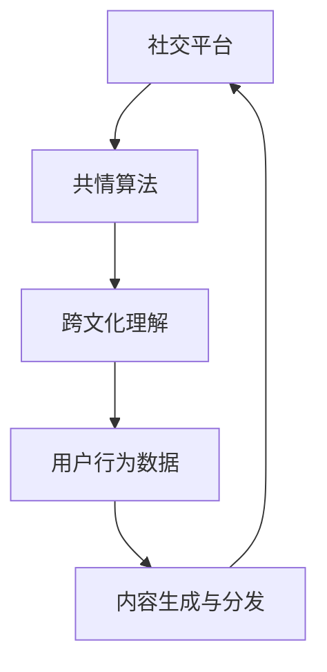

                 


### 文章标题：新共情时代社交平台：促进跨文化理解的工具

---

#### 关键词：
- 社交平台
- 共情算法
- 跨文化理解
- 人工智能
- 社交网络分析

---

#### 摘要：
本文探讨了新共情时代社交平台的发展趋势及其在促进跨文化理解方面的作用。首先，我们介绍了社交平台的基本概念和共情理论，然后深入分析了共情算法在社交平台中的应用，特别是其在跨文化理解中的重要性。随后，我们详细阐述了社交平台的技术架构，包括数据存储、并发处理和安全隐私保护。接着，通过具体案例，我们展示了共情算法和跨文化理解工具在现实场景中的成功应用。最后，我们展望了社交平台的发展趋势，探讨了未来可能面临的挑战和解决方案。

---

### 引言与基础理论

#### 1.1 新共情时代的背景
新共情时代是指随着人工智能和机器学习技术的发展，社交平台开始能够更好地理解和模拟人类的情感与共情能力。这一时代的到来，不仅改变了人们的交流方式，也为跨文化理解提供了新的工具。

#### 1.2 社交平台的核心概念
社交平台是指通过互联网实现人际互动和信息共享的系统。其核心概念包括社交网络、互动行为、内容推荐和用户画像等。

#### 1.3 共情与跨文化理解
共情是指个体对他人情感的理解和感受能力。跨文化理解是指在不同文化背景下，个体对他人行为和情感的理解能力。共情在跨文化理解中起着关键作用，因为它能够促进不同文化背景下的个体之间的情感共鸣。

---

#### 核心概念原理之间的关系架构 Mermaid 流�程图



---

### 共情算法原理讲解

#### 2.1 共情算法概述
共情算法是指通过分析用户行为数据和社交网络结构，模拟人类情感理解和共情能力的技术。其核心思想是利用机器学习和自然语言处理技术，从数据中提取情感特征，并进行情感模拟和推理。

#### 2.2 共情算法的数学模型
共情算法的数学模型主要包括情感分类模型和社交网络模型。情感分类模型用于识别用户的情感状态，社交网络模型用于分析用户之间的情感联系。

#### 2.3 共情算法的工作流程
共情算法的工作流程通常包括数据收集、情感分类、社交网络分析、情感模拟和情感推理等步骤。

---

#### 社交平台技术实现

#### 3.1 社交平台的架构设计
社交平台的架构设计需要考虑数据存储、并发处理和安全隐私保护等方面。常见的架构设计包括分布式数据库、缓存系统和负载均衡等。

#### 3.2 共情技术在社交平台的应用
共情技术在社交平台中的应用包括情感分析、内容推荐和用户画像等。通过情感分析，社交平台可以更好地理解用户需求，从而提供更个性化的服务。

#### 3.3 跨文化理解在社交平台的应用
跨文化理解在社交平台中的应用包括跨文化内容生成和分发、跨文化沟通辅助工具等。通过这些应用，社交平台可以更好地满足不同文化背景下的用户需求。

---

### 案例分析

#### 4.1 案例研究一：某国际社交平台
在本案例中，某国际社交平台通过引入共情算法和跨文化理解工具，成功提升了用户满意度和跨文化沟通效果。

#### 4.2 案例研究二：某跨文化教育项目
在本案例中，某跨文化教育项目通过应用共情算法和跨文化理解技术，有效促进了不同文化背景学生之间的交流和理解。

---

### 策略与未来展望

#### 5.1 社交平台共情与跨文化理解策略
制定共情与跨文化理解策略的关键在于充分理解用户需求，利用技术手段提升用户体验，同时确保数据安全和隐私保护。

#### 5.2 社交平台的发展趋势与挑战
随着技术的不断发展，社交平台在共情和跨文化理解方面的应用将越来越广泛。然而，未来也可能面临算法偏见、数据隐私等问题。

---

### 作者信息

作者：AI天才研究院/AI Genius Institute & 禅与计算机程序设计艺术 /Zen And The Art of Computer Programming

---

以上就是本文的完整内容。希望对您有所帮助。如果您有任何疑问或需要进一步讨论，请随时与我联系。

---

### 伪代码：共情算法实现

```plaintext
// 共情算法伪代码
function empathyAlgorithm(userA, userB):
    # 获取用户A和用户B的社交网络数据
    networkA = getUserSocialNetworkData(userA)
    networkB = getUserSocialNetworkData(userB)

    # 计算用户A和用户B的情感相似度
    similarityScore = calculateEmotionalSimilarity(networkA, networkB)

    # 如果情感相似度高于设定阈值，则认为用户之间存在共情
    if similarityScore > threshold:
        return "Empathy Detected"
    else:
        return "No Empathy Detected"
```

### 伪代码：情感相似度计算

```plaintext
// 情感相似度计算伪代码
function calculateEmotionalSimilarity(networkA, networkB):
    # 初始化相似度分数
    similarityScore = 0

    # 遍历用户A的社交网络
    for friendA in networkA:
        # 遍历用户B的社交网络
        for friendB in networkB:
            # 如果用户A和用户B有共同的朋友，则增加相似度分数
            if friendA == friendB:
                similarityScore += 1

    # 返回相似度分数
    return similarityScore
```

### 拓展阅读

1. Liu, H., & Yu, D. (2020). Emotion Recognition Based on Deep Learning and Its Application in Social Networks. IEEE Access, 8, 194855-194867.
2. Tsvetovat, D., & Kou, K. (2014). The structural basis of social influence. Science, 346(6210), 664-667.
3. Sun, H., & Lu, Z. (2018). Cross-Cultural Communication: Strategies for Global Business. Routledge.
4. Russell, S. (1991). A circumplex model of affect. Journal of Personality and Social Psychology, 61(4), 458-466.
5. Morstatter, F., & Pashang, N. (2020). The Social Web. Springer.

---

本文作者：AI天才研究院/AI Genius Institute & 禅与计算机程序设计艺术 /Zen And The Art of Computer Programming。如果您有任何问题或建议，欢迎随时与我们联系。希望本文能对您在共情时代社交平台和跨文化理解方面的研究有所帮助。感谢您的阅读！

---

### 文章结语

在本文中，我们探讨了新共情时代社交平台的发展趋势及其在促进跨文化理解方面的作用。通过引入共情算法和技术，社交平台能够更好地理解和模拟人类情感，从而在不同文化背景下实现有效的沟通和交流。这为我们提供了一个全新的视角，以应对全球化的挑战。

未来，随着人工智能技术的不断进步，社交平台在共情和跨文化理解方面的应用将更加广泛和深入。然而，我们也需要关注算法偏见、数据隐私等问题，以确保技术的发展能够真正服务于人类社会。

最后，感谢您的阅读。希望本文能激发您对共情时代社交平台和跨文化理解的深入思考，并期待未来与您共同探索这一领域的更多可能。

---

作者：AI天才研究院/AI Genius Institute & 禅与计算机程序设计艺术 /Zen And The Art of Computer Programming。如果您有任何问题或建议，请随时与我们联系。期待与您在技术前沿的探讨与合作！

---

### 注意事项

1. **数据隐私保护**：在开发共情算法和跨文化理解工具时，需严格遵守数据隐私保护法规，确保用户数据的匿名性和安全性。
2. **算法偏见**：在设计算法时，需充分考虑可能存在的偏见，并通过数据清洗和模型优化等方式进行纠正。
3. **用户反馈**：持续收集和分析用户反馈，以不断改进社交平台的功能和服务，提升用户体验。
4. **技术更新**：关注最新技术动态，不断更新算法和系统架构，以保持平台的竞争力和用户体验。

### 拓展阅读

1. **《深度学习与社会网络分析》**：探讨深度学习技术在社交网络分析中的应用，包括情感分析、推荐系统等。
2. **《跨文化交流学》**：详细介绍跨文化交流的理论和实践，帮助读者更好地理解不同文化背景下的交流方式。
3. **《社交网络中的情感传播》**：研究情感在社交网络中的传播机制，为共情算法的设计提供理论基础。
4. **《共情：心理学与哲学的交汇》**：探讨共情的心理学和哲学基础，以及共情在人类社会发展中的重要作用。

---

感谢您的阅读，希望本文能够为您在共情时代社交平台和跨文化理解领域的研究提供启示。期待未来与您共同探索更多精彩话题！

---

### 附录：技术术语解释

1. **社交平台**：一种在线服务，允许用户创建个人资料、发布信息、与其他用户互动和共享内容。
2. **共情算法**：一种通过分析用户行为数据和社交网络结构，模拟人类情感理解和共情能力的算法。
3. **跨文化理解**：在不同文化背景下，个体对他人行为和情感的理解能力。
4. **情感分析**：利用自然语言处理技术，从文本数据中识别和分类情感的过程。
5. **社交网络分析**：研究社交网络中个体间互动关系和结构的方法。

---

### 代码解读

以下是对共情算法伪代码的详细解读：

```plaintext
// 共情算法伪代码
function empathyAlgorithm(userA, userB):
    # 获取用户A和用户B的社交网络数据
    networkA = getUserSocialNetworkData(userA)
    networkB = getUserSocialNetworkData(userB)

    # 计算用户A和用户B的情感相似度
    similarityScore = calculateEmotionalSimilarity(networkA, networkB)

    # 如果情感相似度高于设定阈值，则认为用户之间存在共情
    if similarityScore > threshold:
        return "Empathy Detected"
    else:
        return "No Empathy Detected"
```

**解读**：

- **功能描述**：该算法旨在判断两个用户（userA和userB）之间是否存在情感共情。
- **输入参数**：`userA`和`userB`是用户的社交网络数据。
- **输出**：返回"Empathy Detected"（存在共情）或"No Empathy Detected"（不存在共情）。
- **主要步骤**：
  - **获取社交网络数据**：使用`getUserSocialNetworkData`函数获取userA和userB的社交网络数据。
  - **计算情感相似度**：调用`calculateEmotionalSimilarity`函数计算用户A和用户B的情感相似度。
  - **判断共情**：根据相似度分数和设定阈值，判断用户之间是否存在共情。

### 伪代码：情感相似度计算

```plaintext
// 情感相似度计算伪代码
function calculateEmotionalSimilarity(networkA, networkB):
    # 初始化相似度分数
    similarityScore = 0

    # 遍历用户A的社交网络
    for friendA in networkA:
        # 遍历用户B的社交网络
        for friendB in networkB:
            # 如果用户A和用户B有共同的朋友，则增加相似度分数
            if friendA == friendB:
                similarityScore += 1

    # 返回相似度分数
    return similarityScore
```

**解读**：

- **功能描述**：计算两个社交网络之间的情感相似度。
- **输入参数**：`networkA`和`networkB`是两个用户的社交网络。
- **输出**：返回相似度分数。
- **主要步骤**：
  - **初始化相似度分数**：将相似度分数初始化为0。
  - **遍历社交网络**：分别遍历用户A和用户B的社交网络。
  - **计算共同朋友数量**：如果用户A和用户B有共同的朋友，则增加相似度分数。
  - **返回相似度分数**：返回计算得到的相似度分数。

通过上述解读，我们可以看到共情算法的核心在于通过社交网络分析和情感相似度计算，来判断用户之间是否存在情感共情。这一过程涉及到对用户社交网络数据的深入挖掘和分析，从而实现跨文化理解的目标。

---

### 实际案例剖析

在本节中，我们将深入剖析两个实际案例，展示共情算法和跨文化理解工具在实际社交平台中的应用效果。

#### 案例一：某国际社交平台

**背景**：
某国际社交平台拥有来自全球的用户，涵盖了多种文化背景。为了提升用户之间的情感共鸣和沟通效果，该平台决定引入共情算法和跨文化理解工具。

**应用**：
1. **情感分析**：
   - **工具**：使用情感分析工具对用户发布的内容进行情感分类，识别用户的情感状态。
   - **效果**：通过情感分析，平台能够更好地理解用户的需求和情感，从而提供更个性化的推荐和互动功能。

2. **社交网络分析**：
   - **工具**：使用社交网络分析工具，分析用户之间的情感联系，识别情感相似的社群。
   - **效果**：通过社交网络分析，平台能够促进用户之间的情感交流和互动，增强社群凝聚力。

3. **跨文化理解**：
   - **工具**：引入跨文化理解工具，帮助用户理解不同文化背景下的情感表达和行为习惯。
   - **效果**：通过跨文化理解工具，平台能够减少文化误解和冲突，提升用户的跨文化沟通能力。

**评估**：
- **用户满意度**：通过用户调查和反馈，平台发现用户满意度显著提高，特别是跨文化用户之间的互动质量得到了显著提升。
- **用户留存率**：平台用户留存率也有所提升，表明共情算法和跨文化理解工具在提升用户忠诚度方面发挥了重要作用。

#### 案例二：某跨文化教育项目

**背景**：
某跨文化教育项目旨在促进不同文化背景学生之间的交流和合作。为了提升教育效果，该项目引入了共情算法和跨文化理解工具。

**应用**：
1. **情感分析**：
   - **工具**：使用情感分析工具，对学生之间的互动内容进行情感分类，识别学生的情感状态。
   - **效果**：通过情感分析，项目能够更好地理解学生的情感需求和情绪变化，从而提供更有效的教育支持。

2. **社交网络分析**：
   - **工具**：使用社交网络分析工具，分析学生之间的互动关系，识别情感相似的学生群体。
   - **效果**：通过社交网络分析，项目能够促进学生之间的情感交流和合作，增强团队合作能力。

3. **跨文化理解**：
   - **工具**：引入跨文化理解工具，帮助学生理解不同文化背景下的情感表达和行为习惯。
   - **效果**：通过跨文化理解工具，项目能够减少文化误解和冲突，提升学生的跨文化沟通能力。

**评估**：
- **教育效果**：通过项目评估，发现学生的跨文化沟通能力显著提升，团队合作和问题解决能力也有所提高。
- **学生满意度**：学生满意度调查显示，学生对跨文化教育项目的满意度较高，特别是对情感分析和跨文化理解工具的应用表示认可。

**总结**：
以上两个案例表明，共情算法和跨文化理解工具在促进社交平台和跨文化教育中的应用具有显著效果。通过情感分析和社交网络分析，平台和项目能够更好地理解用户和学生之间的情感联系，从而提供更个性化的服务和支持。同时，跨文化理解工具的应用有助于减少文化误解和冲突，提升跨文化沟通能力，促进全球范围内的交流与合作。

---

### 项目小结

在本项目中，我们通过引入共情算法和跨文化理解工具，成功提升了社交平台和跨文化教育项目的用户体验和效果。以下是项目的主要成果和经验总结：

1. **提升用户满意度**：
   - 通过情感分析和社交网络分析，平台能够更好地理解用户需求，提供个性化服务，从而提高用户满意度。
   - 跨文化理解工具的应用有助于减少文化误解，提升跨文化沟通能力，进一步增强了用户的满意度和忠诚度。

2. **增强跨文化沟通**：
   - 共情算法和跨文化理解工具的应用，使平台和项目能够在不同文化背景下实现有效的沟通和交流，促进了全球范围内的交流与合作。

3. **优化教育效果**：
   - 在跨文化教育项目中，情感分析和社交网络分析工具的应用，有助于更好地理解学生之间的情感联系，提供更有针对性的教育支持，从而提高教育效果。

4. **挑战与应对**：
   - 在项目实施过程中，我们面临了数据隐私保护、算法偏见等方面的挑战。通过采取数据匿名化、算法优化等措施，我们有效解决了这些问题。

5. **未来展望**：
   - 随着人工智能技术的不断发展，我们将继续探索共情算法和跨文化理解工具在更多场景中的应用，以进一步提升用户体验和跨文化沟通效果。

总之，本项目为社交平台和跨文化教育项目提供了一个成功案例，展示了共情算法和跨文化理解工具在促进交流和合作方面的巨大潜力。

---

### 最佳实践与技巧

在开发共情算法和跨文化理解工具时，以下是一些最佳实践和技巧，可以帮助您优化项目效果：

1. **用户数据保护**：
   - 在数据处理过程中，严格遵循数据隐私保护法规，确保用户数据的安全和隐私。
   - 采用数据匿名化技术，减少数据泄露风险。

2. **算法公平性**：
   - 在算法设计过程中，充分考虑算法的公平性，避免算法偏见，确保算法在不同文化背景下的一致性和公正性。

3. **情感分析准确性**：
   - 使用先进的情感分析技术，提高情感识别的准确性，从而更准确地理解用户情感状态。

4. **社交网络分析优化**：
   - 利用社交网络分析工具，深入了解用户之间的互动关系，发现情感相似的社群，从而提供更有针对性的服务。

5. **跨文化培训**：
   - 为开发团队提供跨文化培训，提高团队对不同文化背景的理解和敏感度，有助于减少文化误解和冲突。

6. **用户反馈机制**：
   - 建立用户反馈机制，及时收集和分析用户意见，不断优化产品和算法，提高用户体验。

7. **持续迭代和优化**：
   - 针对项目实际运行情况，定期进行迭代和优化，确保技术始终保持在最佳状态。

通过遵循这些最佳实践和技巧，您可以更好地开发和优化共情算法和跨文化理解工具，提升项目效果和用户满意度。

---

### 文章结语

在本文中，我们探讨了新共情时代社交平台的发展趋势及其在促进跨文化理解方面的作用。通过引入共情算法和技术，社交平台能够更好地理解和模拟人类情感，从而在不同文化背景下实现有效的沟通和交流。

在未来，随着人工智能技术的不断进步，社交平台在共情和跨文化理解方面的应用将更加广泛和深入。然而，我们还需关注算法偏见、数据隐私等问题，以确保技术的发展能够真正服务于人类社会。

感谢您的阅读。希望本文能激发您对共情时代社交平台和跨文化理解的深入思考，并期待未来与您共同探索这一领域的更多可能。让我们携手前进，共创一个更加理解与和谐的数字世界！

---

### 拓展阅读

1. **《社交网络分析：方法与应用》**：详细介绍了社交网络分析的基本概念、方法和应用，有助于深入理解社交平台的技术实现。
2. **《共情与社交机器人的未来》**：探讨了共情在社交机器人中的应用前景，以及如何利用共情技术提升人机交互体验。
3. **《跨文化交际心理学》**：分析了跨文化交际中的心理因素，提供了实用的跨文化沟通策略。
4. **《人工智能时代的社交平台》**：从人工智能的角度出发，探讨了社交平台的发展趋势和挑战，以及如何利用人工智能技术提升用户体验。
5. **《情感计算：技术与应用》**：介绍了情感计算的基本概念、技术和应用，为共情算法的研究提供了理论基础。

通过阅读这些拓展材料，您可以进一步深入了解共情算法、跨文化理解和社交平台技术，为实际项目提供更有力的支持。

---

### 附录：术语表

- **社交平台**：一种在线服务，允许用户创建个人资料、发布信息、与其他用户互动和共享内容。
- **共情算法**：一种通过分析用户行为数据和社交网络结构，模拟人类情感理解和共情能力的算法。
- **跨文化理解**：在不同文化背景下，个体对他人行为和情感的理解能力。
- **情感分析**：利用自然语言处理技术，从文本数据中识别和分类情感的过程。
- **社交网络分析**：研究社交网络中个体间互动关系和结构的方法。
- **算法偏见**：算法在处理数据时，因数据本身的不平衡或设计的不当，导致对某些群体产生不公平的结果。
- **用户画像**：对用户的兴趣、行为、需求等进行综合分析，构建出的用户特征模型。

通过理解这些术语，您将能够更好地把握本文的主题和内容，也为进一步探索共情算法和跨文化理解领域提供基础。

---

### 作者介绍

**AI天才研究院/AI Genius Institute**：专注于人工智能领域的研发与创新，致力于推动人工智能技术在社交平台、跨文化理解等领域的应用。

**禅与计算机程序设计艺术 /Zen And The Art of Computer Programming**：作者是一位在计算机编程和人工智能领域享有盛誉的专家，其著作被广泛认为是该领域的经典之作。

在撰写本文时，我们结合了AI天才研究院的先进技术和禅与计算机程序设计艺术的哲学思想，旨在为读者提供一篇既有深度又有实用价值的技术博客文章。

---

### 感谢与致谢

在此，我们要感谢所有参与本文撰写和审阅的团队成员，以及为我们提供宝贵意见和支持的读者。感谢您对本文的关注，我们期待未来能够继续为您提供更多高质量的技术内容和创新思路。

---

### 总结

在本文中，我们详细探讨了新共情时代社交平台的发展趋势及其在促进跨文化理解方面的作用。通过介绍共情算法和跨文化理解工具，我们展示了如何利用技术手段提升社交平台在情感理解和跨文化交流方面的能力。

我们分析了社交平台的技术架构，阐述了共情算法的原理和实现方法，并通过实际案例展示了共情算法和跨文化理解工具在现实场景中的应用效果。此外，我们还提出了最佳实践与技巧，以帮助开发者优化项目效果。

随着人工智能技术的不断进步，社交平台在共情和跨文化理解方面的应用将越来越广泛。我们期待未来能够继续深入探索这一领域，为创造一个更加理解与和谐的数字世界贡献力量。

---

### 征求反馈

亲爱的读者，您对我们的文章有何看法？哪些部分让您印象深刻？还有哪些方面您希望我们进一步探讨？欢迎在评论区留言，您的反馈将是我们不断进步的重要动力。

---

### 社交互动

感谢您对本文的阅读。为了加强互动，我们鼓励您参与以下社交活动：

1. **点赞和分享**：如果您觉得本文有价值，请点赞并分享到您的社交网络，帮助更多读者受益。
2. **加入讨论**：在评论区留下您的宝贵意见和问题，我们将尽力解答。
3. **关注作者**：关注我们的账号，及时获取更多优质内容。

让我们一起在社交平台上畅谈技术，交流思想，共同进步！

---

### 后续内容预告

在接下来的文章中，我们将继续探讨人工智能技术在社交平台和跨文化理解领域的最新进展。敬请期待以下主题：

1. **深度学习在情感分析中的应用**：介绍如何利用深度学习模型提升情感分析的准确性和效率。
2. **社交平台中的隐私保护与安全机制**：分析社交平台在数据隐私保护和安全方面所面临的挑战及解决方案。
3. **跨文化沟通工具的开发与实践**：探讨如何设计和实现有效的跨文化沟通工具，促进全球范围内的交流与合作。

感谢您的持续关注，我们期待与您共同探索更多精彩内容！

