                 

### 第1章 引言

#### 1.1 教育改革的背景与必要性

##### 1.1.1 数字时代的教育变革

随着信息技术的迅猛发展，数字时代已经深刻地改变了我们的生活方式和社会结构。教育作为社会发展的基石，也在这一过程中经历着前所未有的变革。技术的进步不仅为教育提供了新的工具和平台，也带来了新的挑战和机遇。

首先，技术革新对教育的影响体现在硬件设施的发展上。从最初的投影仪、电脑，到今天的智能教室、虚拟现实（VR）和增强现实（AR），教育设备的智能化和多样化极大地丰富了教育手段，提高了教学效果。此外，软件工具的创新也极大地改变了教育模式，如在线教育平台、教育管理系统的普及，使得学习资源更加丰富和便捷。

其次，通识教育的时代使命在数字时代愈发凸显。通识教育不仅注重知识的传授，更强调培养学生的综合素质和创新能力，以适应快速变化的现代社会。在数字时代，学生需要具备跨学科的知识体系、批判性思维能力和创新精神，以应对未来职业发展的不确定性。

##### 1.1.1.2 技术革新对教育的影响

技术革新对教育的影响主要体现在以下几个方面：

1. **学习方式的变革**：数字化教育平台和工具使得学生可以随时随地获取学习资源，实现个性化学习。这种变革打破了传统课堂的时空限制，为学生提供了更加灵活和自主的学习环境。

2. **教学资源的共享**：互联网的普及使得优质教育资源得以广泛传播，偏远地区的学生也能接触到与一线城市相同的课程和师资。这种共享机制极大地提高了教育公平性。

3. **教学评价的创新**：大数据和人工智能技术为教学评价提供了新的手段，可以更加精准地衡量学生的学习效果和教师的教学质量，从而促进教育质量的提升。

##### 1.1.1.2 通识教育的时代使命

通识教育的时代使命在于培养学生的综合素质和创新能力，以应对未来社会的挑战。具体来说，通识教育应注重以下几个方面：

1. **跨学科知识的融合**：在数字时代，知识更新速度加快，单一学科的知识已经无法满足学生的需求。通识教育强调跨学科知识的融合，以培养学生的综合素养。

2. **批判性思维的培养**：批判性思维是适应数字化时代的关键能力。通识教育应引导学生学会独立思考、分析问题和解决问题，提高他们的创新意识和批判性思维能力。

3. **创新精神的激发**：创新精神是通识教育的核心目标之一。通过跨学科项目、创新实验室等实践平台，激发学生的创新潜能，培养他们的创新意识和创新能力。

#### 1.1.2 新博雅教育2.0的课程体系

新博雅教育2.0课程体系是在数字时代背景下，为了更好地实现通识教育的使命而设计的一种全新的教育模式。这一课程体系具有以下几个特点：

##### 1.1.2.1 课程体系的核心理念

新博雅教育2.0课程体系的核心理念是“以人为本，全面发展”。它强调以学生为中心，关注学生的个性化发展，注重培养学生的综合素质和创新能力。

##### 1.1.2.2 课程体系的构建原则

新博雅教育2.0课程体系的构建原则主要包括以下几个方面：

1. **跨学科融合**：课程体系涵盖多个学科领域，强调学科之间的交叉与融合，培养学生系统的思维能力和解决问题的综合能力。

2. **实践导向**：课程设计注重实践环节，通过项目驱动、实验课程等手段，增强学生的实践能力和创新精神。

3. **个性化培养**：课程体系提供多元化的学习路径，满足不同学生的个性化需求，帮助学生找到适合自己的发展方向。

4. **技术创新**：利用现代教育技术手段，如在线教育平台、虚拟实验室等，提高教学效果和学生的参与度。

#### 1.2 本书的目标与结构

本书旨在深入探讨新博雅教育2.0课程体系的设计理念、实施策略和成功案例，为教育工作者和研究者提供有价值的参考和借鉴。

##### 1.2.1 阅读本书的意义

阅读本书的意义主要体现在以下几个方面：

1. **为教育改革提供理论指导**：本书分析了数字时代教育变革的背景和必要性，为新博雅教育2.0课程体系的设计提供了理论基础。

2. **为教学实践提供参考**：本书详细介绍了新博雅教育2.0课程体系的构建原则和实施策略，为教育工作者提供了具体的教学实践指导。

3. **为教育研究提供案例支持**：本书通过国内外教育改革的实践案例，展示了新博雅教育2.0课程体系在实际应用中的效果和挑战，为教育研究提供了丰富的案例支持。

##### 1.2.2 书籍的结构与内容

本书共分为六个章节，结构如下：

1. **第1章 引言**：介绍教育改革的背景与必要性，以及新博雅教育2.0课程体系的核心理念。

2. **第2章 数字时代的教育环境**：探讨数字化教育的发展趋势和挑战，以及教师和学生的适应与成长。

3. **第3章 新博雅教育2.0的课程设计**：详细描述新博雅教育2.0课程体系的构建原则和教学内容。

4. **第4章 数字时代的教育技术**：介绍教育技术的种类与作用，以及人工智能和大数据在教育中的应用。

5. **第5章 新博雅教育2.0的实施策略**：探讨教师培训与支持、学生培养与评价等方面的实施策略。

6. **第6章 新博雅教育2.0的成功案例**：分析国内外教育改革的实践，以及新博雅教育2.0的实践探索。

通过本书的阅读，读者可以全面了解新博雅教育2.0课程体系的构建过程和实施策略，为教育改革提供有价值的参考。

### 摘要

本文探讨了数字时代教育变革的背景与必要性，提出了新博雅教育2.0课程体系的设计理念与构建原则。通过对数字化教育环境、教育技术、实施策略和成功案例的深入分析，本文为教育工作者和研究者提供了有价值的参考和借鉴。新博雅教育2.0课程体系旨在以学生为中心，实现跨学科融合、实践导向和个性化培养，以应对数字时代的教育挑战，培养具有综合素质和创新能力的未来人才。本文的结构分为六个章节，系统介绍了课程体系的设计思路与实施策略，为教育改革提供了理论指导和实践参考。### 第2章 数字时代的教育环境

#### 2.1 数字化教育的发展趋势

数字化教育作为现代教育发展的重要方向，正以前所未有的速度和规模影响着全球教育体系。随着互联网技术的不断进步，教育信息化建设已经成为各国教育改革的重要手段。本节将探讨数字化教育的发展趋势，包括教育信息化建设和教育模式的转变。

##### 2.1.1 教育信息化建设

教育信息化建设是指利用信息技术，特别是互联网和智能设备，来优化教育资源和提升教育质量的过程。这一过程主要包括以下几个方面：

1. **硬件设施的发展**：随着科技的发展，教育硬件设施从最初的投影仪、电脑，到今天的智能教室、虚拟现实（VR）和增强现实（AR），正变得越来越智能化和多样化。这些硬件设施不仅提高了教学的互动性和趣味性，也为学生提供了更丰富的学习体验。

2. **软件工具的创新**：教育软件工具的发展同样日新月异。从传统的电子课本、教学管理软件，到今天的在线教育平台、智能教学助手，这些软件工具极大地丰富了教学手段，提高了教学效率。

3. **网络环境的优化**：高速互联网的普及和移动网络的广泛覆盖，使得学生可以随时随地访问网络资源，进行自主学习。这极大地打破了传统课堂的时空限制，实现了教育资源的共享和互动。

##### 2.1.2 教育模式的转变

教育模式的转变是数字化教育的核心内容之一。传统的以教师为中心的教学模式正在逐步向以学生为中心的学习模式转变。以下是两种主要的教育模式：

1. **翻转课堂**：翻转课堂（Flipped Classroom）是一种基于数字化教育的教学模式。在这种模式中，学生通过在线平台观看教师录制的教学视频，完成知识的学习，而在课堂上，教师则通过互动和讨论，帮助学生解决学习中遇到的问题。这种模式不仅提高了学生的学习效率，也增加了课堂的互动性和参与度。

   **Mermaid 流程图**：
   ```mermaid
   graph TD
   A[学生在家观看视频] --> B[课堂内互动讨论]
   B --> C[教师辅导问题解答]
   C --> D[课后反馈与作业]
   ```

2. **个性化学习**：个性化学习（Personalized Learning）是基于每个学生的学习需求和特点，为其提供个性化学习方案的过程。通过大数据分析和人工智能技术，教育系统能够实时了解学生的学习状态和需求，从而提供个性化的学习资源和方法。这种模式不仅能够提高学生的学习兴趣和效果，也有助于培养其自主学习能力和创新精神。

   **Mermaid 流程图**：
   ```mermaid
   graph TD
   A[数据收集] --> B[数据分析]
   B --> C[个性化资源推荐]
   C --> D[学习反馈调整]
   ```

#### 2.2 数字化教育的挑战与机遇

尽管数字化教育带来了许多积极的变化，但同时也面临着一系列的挑战。这些挑战包括教师角色的转型、学生的适应与成长等方面。

##### 2.2.1 教师的角色转型

在数字化教育环境中，教师的角色正在发生重大转变。传统的知识传授者角色逐渐被知识引导者和学习促进者所取代。具体来说，教师需要做以下几点：

1. **专业发展**：教师需要不断学习新的教育技术和教学方法，以适应数字化教育的需求。这包括参加培训课程、阅读专业书籍和文章，以及与同行进行交流。

2. **教学创新**：教师需要创新教学方法，利用数字化工具和资源，设计出更加生动和有趣的教学活动，提高学生的学习兴趣和参与度。

3. **学生互动**：在数字化教育环境中，教师需要更多地与学生进行互动，了解他们的学习需求和问题，提供个性化的辅导和支持。

##### 2.2.1.1 教师的专业发展

教师的专业发展是数字化教育成功的关键。以下是一些具体的措施：

1. **在线培训**：通过在线教育平台，教师可以参加各种专业课程和研讨会，获取最新的教育理论和实践方法。

2. **教育技术培训**：教师需要学习如何使用各种教育技术工具，如在线教学平台、教学管理软件和智能教学助手。

3. **教学实践**：教师应该在实际教学中不断尝试和探索新的教学方法，通过实践积累经验。

##### 2.2.1.2 教师与学生互动的新模式

在数字化教育环境中，教师与学生之间的互动模式也在发生改变。以下是一些新的互动模式：

1. **在线讨论**：通过在线平台，教师可以与学生进行实时的讨论和交流，解答他们的疑问，分享学习资源。

2. **在线辅导**：教师可以通过在线辅导系统，为学生提供个性化的辅导和支持，帮助他们解决学习中的困难。

3. **学习社区**：教师可以建立一个在线学习社区，鼓励学生之间的交流和合作，促进共同学习和成长。

##### 2.2.2 学生的适应与成长

数字化教育对学生的学习和成长也带来了新的挑战。学生需要适应新的学习方式，培养新的学习能力。以下是一些具体的挑战和适应策略：

1. **学习方式的转变**：学生需要从传统的课堂学习转向自主学习，学会利用网络资源和工具进行学习。

2. **信息素养的培养**：在数字化教育环境中，学生需要具备良好的信息素养，能够有效地获取、评估和使用信息。

3. **自我管理的提升**：学生需要学会自我管理，规划学习时间，保持学习的连续性和深度。

##### 2.2.2.1 学生学习方式的转变

学生的学习方式在数字化教育环境中发生了显著变化。以下是一些关键的变化：

1. **自主学习**：学生需要学会自我驱动，主动寻找学习资源，制定学习计划，进行自我评价。

2. **协作学习**：学生需要学会与他人合作，通过小组讨论和协作项目，共同解决问题，提升团队合作能力。

3. **实践应用**：学生需要将所学知识应用到实际情境中，通过项目驱动和实验课程，提高实践能力和创新意识。

##### 2.2.2.2 学生能力的培养

为了适应数字化教育的需求，学生需要培养以下能力：

1. **批判性思维**：学生需要学会批判性地思考，分析信息，形成自己的观点和见解。

2. **创新能力**：学生需要具备创新意识，敢于尝试新方法，解决复杂问题。

3. **沟通能力**：学生需要学会有效沟通，表达自己的观点，倾听他人的意见，进行有效的团队合作。

通过以上分析和探讨，我们可以看到，数字化教育不仅带来了教育环境的变革，也带来了教育模式的转变和教师角色的转型。学生需要适应新的学习方式，培养新的学习能力，以应对数字化时代的挑战。同时，教育工作者也需要不断学习和创新，以适应这一变革，为学生提供更好的教育服务。### 第3章 新博雅教育2.0的课程设计

#### 3.1 课程体系的构建

新博雅教育2.0课程体系的设计旨在实现通识教育与专业教育的有机结合，通过科学合理的课程体系构建，全面提升学生的综合素质和创新能力。以下是对课程体系构建原则和课程内容的详细分析。

##### 3.1.1 课程体系的框架

新博雅教育2.0课程体系可以分为两个主要部分：学科课程和综合课程。

1. **学科课程**：学科课程主要涵盖基础学科和专业学科，包括数学、物理、化学、生物学、计算机科学、文学、历史、社会学等。这些课程旨在为学生提供扎实的学科基础知识和系统化的专业知识。

2. **综合课程**：综合课程则注重跨学科的知识融合和实践应用，包括创新创业课程、项目驱动课程、社会实践课程、跨学科研讨课程等。这些课程旨在培养学生的综合素质和创新能力，使其能够在复杂问题解决和团队合作中表现出色。

**Mermaid 流程图**：
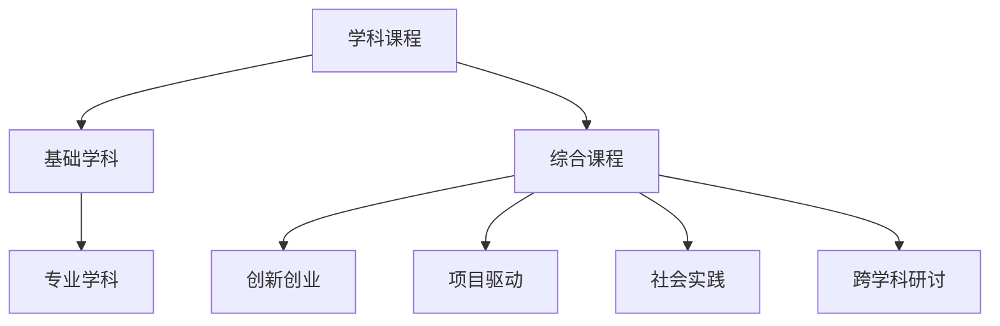

##### 3.1.2 课程内容的选择

课程内容的选择是课程体系构建的关键环节，需要遵循以下原则：

1. **时代性**：课程内容应紧跟时代发展，反映最新的科技进展和社会变革，使学生能够掌握前沿的知识和技能。

2. **实用性**：课程内容应具有实用性，紧密结合实际生活和未来职业需求，使学生能够将所学知识应用到实际工作中。

3. **综合性**：课程内容应注重跨学科的融合，通过综合课程的设计，培养学生的系统思维和综合解决问题的能力。

4. **个性化**：课程内容应考虑到学生的个性化需求，提供多元化的学习路径和个性化培养方案，使每个学生都能找到适合自己的发展方向。

##### 3.1.2.1 时代性

在课程内容的选择上，时代性是一个重要的考量因素。具体表现在以下几个方面：

1. **科技前沿**：课程内容应涵盖最新的科技研究成果，如人工智能、大数据、量子计算等，使学生能够紧跟科技发展步伐。

2. **社会变革**：课程内容应反映社会变革和发展的趋势，如全球化、可持续发展、数字化转型等，使学生能够适应社会发展的需求。

3. **新兴领域**：课程内容应关注新兴领域的知识，如区块链技术、生物信息学、新能源技术等，为学生提供多元化的学习选择。

##### 3.1.2.2 实用性

实用性是课程内容选择的重要原则之一，具体体现在以下几个方面：

1. **职业导向**：课程内容应紧密联系未来职业需求，使学生掌握与未来职业相关的知识和技能。

2. **技能培训**：课程内容应包括实践技能培训，如编程、数据分析和处理、项目管理等，提高学生的实际操作能力。

3. **应用导向**：课程内容应注重知识的应用，通过案例分析和实践项目，使学生能够将所学知识应用到实际问题中。

##### 3.1.2.3 综合性

综合性是课程体系设计的关键原则，旨在培养学生的系统思维和综合解决问题的能力。具体措施包括：

1. **跨学科课程**：设计跨学科课程，如科技与人文、经济与法律、工程与设计等，使学生能够从多个角度理解和分析问题。

2. **项目驱动**：通过项目驱动课程，使学生能够在实际项目中应用所学知识，培养综合解决问题的能力。

3. **研讨与交流**：组织跨学科研讨和交流活动，鼓励学生交流思想，碰撞火花，激发创新思维。

##### 3.1.2.4 个性化

个性化教育是现代教育的重要趋势，新博雅教育2.0课程体系通过以下措施实现个性化培养：

1. **学习路径**：提供多样化的学习路径，使学生可以根据自己的兴趣和特长选择适合自己的课程和学习方式。

2. **个性化指导**：为学生提供个性化指导，包括学术指导、职业规划指导等，帮助学生明确发展方向。

3. **个性化评价**：采用个性化评价体系，根据学生的特点和表现，进行差异化的评价，鼓励学生的个性化发展。

#### 3.2 教学方法的应用

教学方法是课程设计的重要组成部分，直接影响教学效果和学生的学习体验。新博雅教育2.0课程体系在教学方法上注重情境教学和互动式教学的应用。

##### 3.2.1 情境教学

情境教学是指通过创设特定的教学情境，让学生在真实或模拟的环境中学习知识，提高学习效果和兴趣。以下是对情境教学的具体应用：

1. **教学情境的创设**：教师应根据课程内容，创设与实际生活或工作场景相关的教学情境，如模拟公司运营、项目开发、实验研究等，使学生能够在情境中学习。

2. **情境教学的优势**：情境教学具有以下优势：
   - **提高学习兴趣**：真实或模拟的情境能够激发学生的学习兴趣，使其更加主动参与学习。
   - **增强实践能力**：情境教学强调实践操作，有助于提高学生的实践能力和问题解决能力。
   - **促进知识迁移**：情境教学能够让学生在具体情境中应用所学知识，促进知识的迁移和应用。

**Mermaid 流程图**：
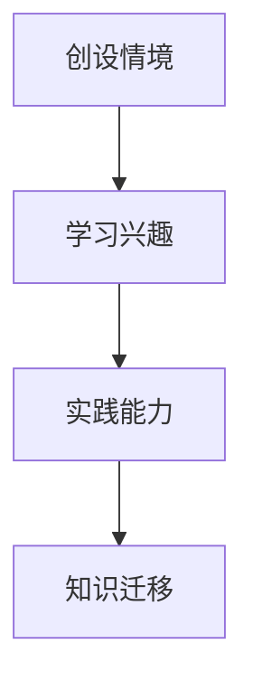

##### 3.2.1.1 教学情境的创设

教学情境的创设需要遵循以下原则：

1. **真实性**：情境应尽量接近真实生活或工作场景，使学生能够感受到现实环境中的挑战和问题。

2. **启发性**：情境应具有启发性，能够激发学生的思考和创造力，使其在解决问题的过程中获得知识和技能。

3. **互动性**：情境应具备互动性，鼓励学生参与讨论和互动，提高学习的主动性和积极性。

##### 3.2.1.2 情境教学的优势

情境教学的优势主要体现在以下几个方面：

- **提高学习兴趣**：情境教学通过真实或模拟的场景，使学生更加投入学习，激发其学习兴趣和动力。
- **增强实践能力**：情境教学强调实践操作，有助于提高学生的动手能力和问题解决能力。
- **促进知识迁移**：情境教学能够让学生在具体情境中应用所学知识，促进知识的迁移和应用，增强其综合素质。

**Mermaid 流程图**：
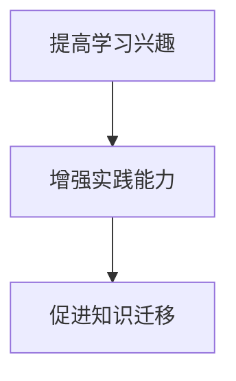

##### 3.2.2 互动式教学

互动式教学是指通过教师与学生之间的互动，以及其他学生之间的互动，促进知识的传递和学生的主动学习。以下是对互动式教学的具体应用：

1. **互动式教学的方式**：互动式教学包括课堂讨论、小组合作、在线互动等多种形式。教师应根据课程内容和教学目标，选择合适的方式，提高教学的互动性和参与度。

2. **互动式教学的效果**：互动式教学具有以下效果：
   - **提高参与度**：互动式教学能够提高学生的参与度，使其更加主动地参与学习过程。
   - **促进理解**：通过互动，学生能够更好地理解和掌握知识。
   - **增强团队合作**：小组合作和讨论能够培养学生的团队合作精神和沟通能力。

**Mermaid 流程图**：
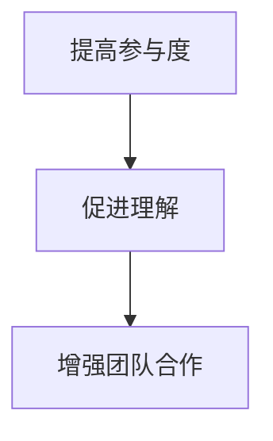

##### 3.2.2.1 互动式教学的方式

互动式教学的方式多种多样，以下是一些常见的形式：

1. **课堂讨论**：教师提出问题，引导学生进行讨论，分享观点和思路。
2. **小组合作**：将学生分成小组，共同完成一个项目或任务，鼓励协作和互动。
3. **在线互动**：利用在线平台，进行实时讨论和交流，打破时间和空间的限制。

##### 3.2.2.2 互动式教学的效果

互动式教学的效果主要体现在以下几个方面：

- **提高参与度**：互动式教学能够吸引学生的注意力，使其更加主动地参与学习过程，提高学习效果。
- **促进理解**：通过互动和讨论，学生能够更好地理解和掌握知识，加深对学习内容的理解和记忆。
- **增强团队合作**：小组合作和讨论能够培养学生的团队合作精神和沟通能力，提高其综合素质。

**Mermaid 流程图**：


通过以上分析，我们可以看到，新博雅教育2.0课程体系在课程设计和教学方法上注重跨学科融合、实践导向和个性化培养。通过情境教学和互动式教学的应用，课程体系能够更好地满足数字时代教育的需求，培养学生的综合素质和创新能力。### 第4章 数字时代的教育技术

#### 4.1 教育技术的种类与作用

教育技术的迅猛发展，为现代教育带来了前所未有的变革。教育技术主要分为硬件技术和软件技术两大类，这两类技术在教育中的应用，不仅提高了教学效率，也改变了学生的学习方式。本节将详细介绍教育技术的种类及其在教育中的作用。

##### 4.1.1 硬件技术的应用

硬件技术是教育技术的基础，主要包括智能教室、网络技术、虚拟现实（VR）和增强现实（AR）等技术。

1. **智能教室**：智能教室通过物联网、大数据和人工智能等技术，实现教学环境的智能化管理。智能教室可以实时监控教室内的温湿度、照明和空气质量等环境参数，提供舒适的教学环境。此外，智能教室还可以通过智能设备进行课堂互动，如电子白板、智能桌椅等，提高课堂的互动性和趣味性。

   **Mermaid 流程图**：
   ```mermaid
   graph TD
   A[智能教室] --> B[环境监控]
   B --> C[课堂互动]
   ```

2. **网络技术**：网络技术是教育技术的重要组成部分，它为师生提供了丰富的学习资源和便捷的交流平台。通过互联网，学生可以访问全球的学术资源，如在线课程、电子书籍、学术论文等。同时，网络技术也支持在线学习、远程教育、在线协作等新的教育模式。

   **Mermaid 流程图**：
   ```mermaid
   graph TD
   A[网络技术] --> B[在线学习]
   B --> C[远程教育]
   ```

3. **虚拟现实（VR）**：虚拟现实技术通过计算机生成一个逼真的三维虚拟世界，使学生能够在虚拟环境中体验和学习。VR技术在教育中的应用非常广泛，如医学教育、工程教育、地理教育等。通过VR技术，学生可以身临其境地体验各种实践操作，提高学习效果和兴趣。

   **Mermaid 流程图**：
   ```mermaid
   graph TD
   A[VR技术] --> B[医学教育]
   B --> C[工程教育]
   ```

4. **增强现实（AR）**：增强现实技术通过在现实场景中叠加虚拟信息，提供更加丰富和互动的学习体验。AR技术在教育中的应用，如互动教学、实验模拟、文物展示等，能够激发学生的学习兴趣，增强学习效果。

   **Mermaid 流程图**：
   ```mermaid
   graph TD
   A[AR技术] --> B[互动教学]
   B --> C[实验模拟]
   ```

##### 4.1.2 软件技术的应用

软件技术在教育中的作用同样不可忽视，主要包括教学管理软件、在线教育平台、智能教学助手等。

1. **教学管理软件**：教学管理软件用于教学资源的组织、管理和分配，如课程表管理、成绩管理、考勤管理等功能。这些软件可以帮助教师高效地管理教学事务，提高工作效率。

   **Mermaid 流程图**：
   ```mermaid
   graph TD
   A[教学管理软件] --> B[课程表管理]
   B --> C[成绩管理]
   ```

2. **在线教育平台**：在线教育平台提供了丰富的学习资源和互动工具，如在线课程、直播教学、讨论区等。通过在线教育平台，学生可以随时随地学习，实现个性化学习。同时，在线教育平台也为教师提供了教学资源的共享和协作平台。

   **Mermaid 流程图**：
   ```mermaid
   graph TD
   A[在线教育平台] --> B[在线课程]
   B --> C[直播教学]
   ```

3. **智能教学助手**：智能教学助手通过人工智能技术，提供个性化学习建议、智能答疑和作业批改等功能。智能教学助手可以帮助教师减轻教学负担，提高教学效果，同时也能够为学生提供个性化学习支持。

   **Mermaid 流程图**：
   ```mermaid
   graph TD
   A[智能教学助手] --> B[个性化学习]
   B --> C[智能答疑]
   ```

#### 4.2 教育技术的创新与发展

随着技术的不断进步，教育技术的创新与发展也在不断推进。其中，人工智能和大数据技术在教育中的应用尤为引人注目。

##### 4.2.1 人工智能在教育中的应用

人工智能（AI）在教育中的应用涵盖了多个方面，包括教育数据挖掘、教学辅助和个性化学习等。

1. **教育数据挖掘**：教育数据挖掘是指利用人工智能技术，从大量的教育数据中提取有价值的信息，为教育管理和决策提供支持。通过教育数据挖掘，可以分析学生的学习行为和成绩变化，发现潜在的教育问题，提供个性化的教育建议。

   **伪代码**：
   ```python
   def educational_data_mining(data):
       # 数据预处理
       preprocessed_data = preprocess_data(data)
       
       # 特征提取
       features = extract_features(preprocessed_data)
       
       # 模型训练
       model = train_model(features)
       
       # 预测与评估
       predictions = model.predict(test_data)
       evaluate_model(predictions, test_data)
       
       return predictions
   ```

2. **教学辅助**：人工智能教学助手可以通过自然语言处理（NLP）技术，提供智能答疑、作业批改和个性化辅导等功能。教学助手可以实时解答学生的问题，提供针对性的辅导，帮助学生更好地理解和掌握知识。

   **伪代码**：
   ```python
   def teach_helpAssistant(question):
       # 解析问题
       parsed_question = parse_question(question)
       
       # 答疑
       answer = get_answer(parsed_question)
       
       return answer
   ```

3. **个性化学习**：人工智能可以根据学生的学习行为和成绩数据，提供个性化的学习路径和资源。通过个性化学习，学生可以根据自己的需求和进度，自主选择学习内容和方式，提高学习效果。

   **伪代码**：
   ```python
   def personalized_learning(student_data):
       # 分析学生数据
       analyzed_data = analyze_student_data(student_data)
       
       # 提供建议
       learning_plan = generate_learning_plan(analyzed_data)
       
       return learning_plan
   ```

##### 4.2.2 大数据分析在教育中的应用

大数据分析在教育中的应用，主要包括教育评价、教学决策和学习分析等。

1. **教育评价**：通过大数据分析，可以对学生的学习过程和成绩进行全面评价，发现学生的学习优势和不足。这种评价方式更加客观和全面，有助于提高教育质量。

   **Mermaid 流程图**：
   ```mermaid
   graph TD
   A[学生学习数据] --> B[数据分析]
   B --> C[评价结果]
   ```

2. **教学决策**：大数据分析可以帮助教育管理者做出更科学的教学决策，如课程设置、教学方法选择等。通过分析学生的学习行为和成绩数据，教育管理者可以了解教学效果，优化教学策略。

   **Mermaid 流程图**：
   ```mermaid
   graph TD
   A[教学数据] --> B[数据分析]
   B --> C[教学决策]
   ```

3. **学习分析**：大数据分析可以对学生的学习行为进行深入分析，了解学生的学习习惯、兴趣和需求。通过学习分析，教育者和学生可以更好地了解自己的学习状况，调整学习策略，提高学习效果。

   **Mermaid 流程图**：
   ```mermaid
   graph TD
   A[学生学习行为数据] --> B[数据分析]
   B --> C[学习分析]
   ```

通过以上分析，我们可以看到，教育技术的创新与发展为教育改革带来了新的机遇。人工智能和大数据技术的应用，不仅提高了教学效率，也改变了学生的学习方式。在新博雅教育2.0课程体系中，教育技术的应用将得到更加深入的探索和实践，为培养具有综合素质和创新能力的未来人才提供有力支持。### 第5章 新博雅教育2.0的实施策略

#### 5.1 教师培训与支持

在新博雅教育2.0课程体系的实施过程中，教师培训与支持是确保改革成功的关键环节。教师的角色和技能在数字化教育环境中发生了显著变化，因此，系统性的教师培训和支持体系至关重要。

##### 5.1.1 教师培训的内容

教师培训的内容应涵盖以下几个方面：

1. **教育理论的学习**：教师需要了解现代教育理论，如建构主义、情境教学、个性化学习等，以指导实际教学实践。此外，教师还应学习教育心理学，了解学生的心理发展规律和学习动机，从而更好地进行教学设计和互动。

2. **教育技术的应用**：教师需要掌握各种教育技术工具的使用方法，如在线教育平台、智能教学助手、VR/AR设备等。通过技术培训，教师可以学会如何利用这些工具提高教学效果，实现教学方式的创新。

3. **教学策略的设计**：教师需要学习如何设计互动式教学、情境教学等教学策略，以提高学生的参与度和学习兴趣。同时，教师还应学会如何通过项目驱动和实验课程，培养学生的实践能力和创新精神。

##### 5.1.1.1 教育理论的学习

教育理论的学习是教师培训的基础，以下是一些关键的教育理论：

1. **建构主义**：建构主义认为学习是学生主动建构知识的过程，教师应提供丰富的学习环境和多样的学习体验，引导学生主动探索和发现知识。

2. **情境教学**：情境教学强调将知识置于真实情境中，通过解决实际问题，提高学生的学习兴趣和实践能力。

3. **个性化学习**：个性化学习关注每个学生的个体差异，通过提供个性化的学习资源和教学策略，满足学生的个性化需求。

**Mermaid 流程图**：
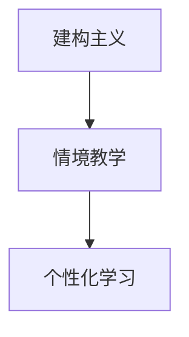

##### 5.1.1.2 教育技术的应用

教育技术的应用是现代教育的重要趋势，以下是一些关键的教育技术：

1. **在线教育平台**：如Moodle、Canvas等，教师可以通过在线教育平台发布课程资源、布置作业、进行在线测试等。

2. **VR/AR技术**：通过虚拟现实和增强现实技术，教师可以为学生提供沉浸式的学习体验，如虚拟实验室、虚拟博物馆等。

3. **智能教学助手**：如AI助手、智能批改系统等，可以帮助教师进行个性化辅导、自动批改作业等。

**Mermaid 流程图**：
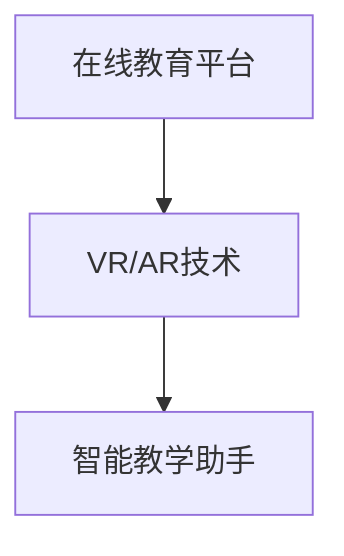

##### 5.1.2 教师支持体系的建立

为了确保教师培训的有效性，建立一个完善的教师支持体系至关重要。以下是一些关键的支持措施：

1. **校内支持**：学校应设立专门的教师支持部门，提供技术支持和教学指导。教师可以通过教师支持部门解决教学中的问题，获取最新的教学资源和培训信息。

2. **校外支持**：教师可以通过参加专业培训、研讨会、在线课程等，获取更多的专业知识和教学经验。此外，学校还可以与教育科技公司合作，共同开发教学应用和资源。

3. **教师交流平台**：建立教师交流平台，如教师论坛、教学社群等，鼓励教师之间分享教学经验、探讨教学问题。通过交流，教师可以相互学习，共同提高教学水平。

**Mermaid 流程图**：
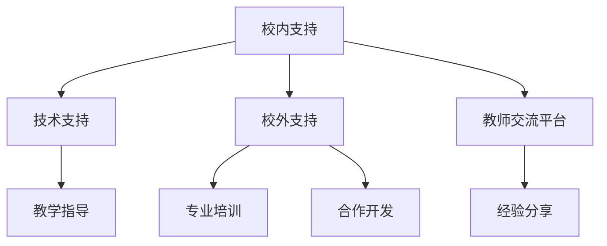

#### 5.2 学生培养与评价

在新博雅教育2.0课程体系中，学生的培养与评价是一个重要环节。通过科学合理的培养与评价体系，可以全面了解学生的学习情况，促进学生的全面发展。

##### 5.2.1 学生培养的目标

学生培养的目标主要包括以下几个方面：

1. **知识与技能的培养**：学生需要掌握扎实的学科知识和专业技能，能够应对未来职业的挑战。

2. **创新能力的培养**：学生需要具备创新意识和创新能力，能够在面对复杂问题时提出新的解决方案。

3. **综合素质的培养**：学生需要具备良好的沟通能力、团队合作精神和领导力，能够在团队中发挥作用。

##### 5.2.1.1 知识与技能的培养

知识与技能的培养是学生培养的基础，以下是一些具体的措施：

1. **系统化课程**：通过设计系统化的课程体系，确保学生掌握基础知识和专业技能。课程内容应涵盖多个学科领域，注重跨学科的融合。

2. **实践课程**：通过实验课程、项目驱动课程等，使学生能够将所学知识应用到实际情境中，提高实践能力和问题解决能力。

3. **技能培训**：提供编程、数据分析、沟通技巧等技能培训，帮助学生掌握未来职业所需的技能。

**Mermaid 流程图**：
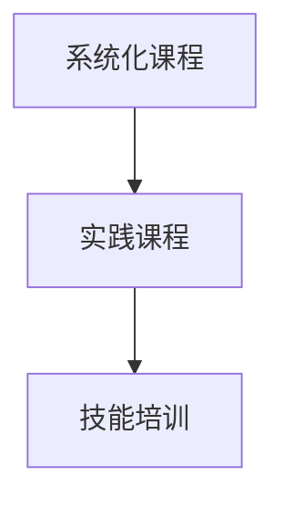

##### 5.2.1.2 创新能力的培养

创新能力的培养是学生培养的核心目标之一，以下是一些具体的措施：

1. **创新实验室**：建立创新实验室，为学生提供实践创新的平台。在实验室中，学生可以参与项目开发、科技创新等活动，锻炼创新思维和创新能力。

2. **跨学科项目**：设计跨学科项目，鼓励学生跨学科合作，解决复杂问题。通过项目驱动，培养学生的系统思维和创新能力。

3. **创新竞赛**：组织创新竞赛，鼓励学生发挥创新能力，提出创新方案。通过竞赛，培养学生的竞争意识和创新能力。

**Mermaid 流程图**：
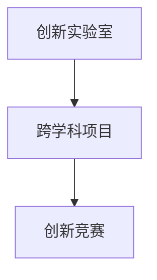

##### 5.2.2 学生评价的方式

学生评价是学生培养的重要环节，以下是一些常见的学生评价方式：

1. **过程评价**：过程评价关注学生的学习过程，包括学习态度、学习方法、课堂参与度等。通过过程评价，可以全面了解学生的学习情况，提供个性化的反馈和建议。

2. **终结评价**：终结评价关注学生的学习成果，包括知识掌握情况、技能运用能力等。通过终结评价，可以评估学生的学习效果，为后续学习提供指导。

3. **综合评价**：综合评价结合过程评价和终结评价，对学生进行全面评估。综合评价应注重学生的综合素质和创新能力，鼓励学生的全面发展。

**Mermaid 流程图**：
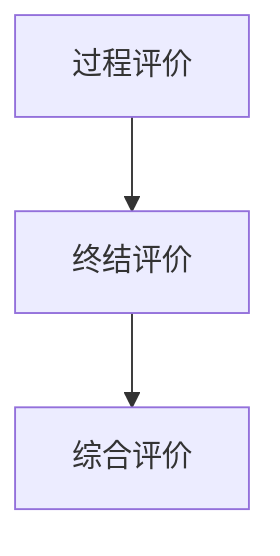

##### 5.2.2.1 过程评价

过程评价是一种关注学生学习过程的方法，以下是一些具体的方法：

1. **课堂观察**：教师通过课堂观察，了解学生的课堂表现，如参与度、注意力集中程度等。

2. **学习日志**：学生记录自己的学习过程，反思学习方法和效果，教师通过学习日志了解学生的学习情况。

3. **同伴评价**：学生之间进行相互评价，如小组合作中的角色分工、贡献程度等，促进学生的自我反思和合作意识。

**Mermaid 流程图**：
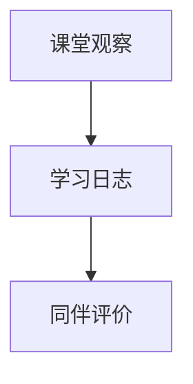

##### 5.2.2.2 终结评价

终结评价是对学生学习成果的评估，以下是一些常见的方法：

1. **考试与测试**：通过考试和测试，评估学生对知识点的掌握情况和技能运用能力。

2. **项目展示**：通过项目展示，评估学生在实际项目中的表现，如问题解决能力、创新能力等。

3. **自我评估**：学生对自己的学习成果进行自我评估，反思自己的学习过程和成果。

**Mermaid 流程图**：
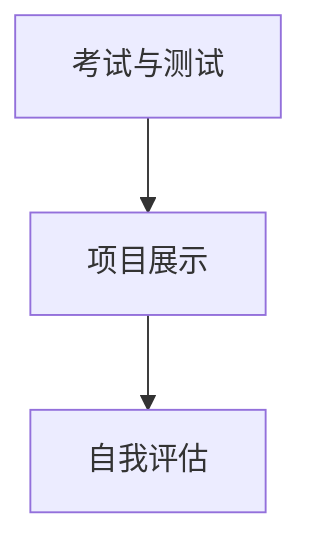

通过以上分析，我们可以看到，新博雅教育2.0课程体系的实施策略包括教师培训与支持、学生培养与评价等方面。通过系统性的教师培训和科学合理的学生评价体系，可以确保课程体系的有效实施，培养具有综合素质和创新能力的未来人才。### 第6章 新博雅教育2.0的成功案例

#### 6.1 国内外教育改革的实践

新博雅教育2.0课程体系作为一种创新的教育模式，已经在国内外多个学校和教育机构得到实践和应用。通过这些实践案例，我们可以看到新博雅教育2.0在实际应用中的效果和挑战。

##### 6.1.1 国外教育改革的案例分析

**美国的PBL教育模式**

美国一些学校已经开始采用项目式学习（Project-Based Learning, PBL）模式，这与新博雅教育2.0的课程设计理念不谋而合。在PBL模式中，学生通过参与真实项目的全过程，从提出问题、设计方案到实施和评估，全面培养他们的创新能力、问题解决能力和团队合作精神。

**案例解析**：

- **项目设计**：学校为学生设计了涉及多个学科领域的大型项目，如城市规划、环境保护等，项目内容具有真实性和挑战性。
- **教学效果**：通过PBL模式，学生的参与度和主动性显著提高，他们能够将所学知识应用到实际项目中，创新能力得到显著提升。
- **挑战**：PBL模式对教师的教学能力和项目管理能力提出了更高要求，教师需要不断学习和适应新的教学方式。

**欧洲的STEAM教育**

STEAM（科学、技术、工程、艺术和数学）教育模式在欧美一些国家得到了广泛应用。STEAM教育强调跨学科学习，通过项目驱动和实验课程，培养学生的创新思维和实践能力。

**案例解析**：

- **课程设置**：STEAM教育将科学、技术、工程、艺术和数学等多个学科领域结合起来，设计出综合性课程，如编程、机器人制作、艺术设计等。
- **教学效果**：STEAM教育模式有效地提高了学生的学习兴趣和综合能力，学生在解决问题、创新设计和团队合作方面表现突出。
- **挑战**：STEAM教育对课程资源和教学设施的要求较高，一些学校可能面临资源不足的挑战。

##### 6.1.2 国内教育改革的实践

**北京十一学校的创新教育**

北京十一学校是一所知名的创新型学校，其教育改革实践为国内教育提供了有益的参考。

**案例解析**：

- **课程体系**：北京十一学校的课程体系涵盖了学科课程和综合课程，注重学生的个性化培养和创新能力培养。
- **教学方式**：学校采用情境教学和互动式教学等多种教学方式，提高学生的参与度和学习效果。
- **教学效果**：通过创新教育模式，学生的综合素质和创新能力得到显著提升，许多学生在国内外竞赛中取得优异成绩。
- **挑战**：创新教育对教师的教学能力和课程设计能力提出了更高要求，学校需要投入大量资源进行教师培训和教育研究。

**上海复旦附中的项目驱动教学**

复旦附中在高中阶段实施项目驱动教学，通过项目驱动课程，培养学生的实践能力和创新精神。

**案例解析**：

- **课程设计**：学校设计了一系列与学科知识紧密结合的项目，如科技竞赛、创新创业项目等，学生通过参与项目，将所学知识应用到实际中。
- **教学效果**：项目驱动教学激发了学生的学习兴趣和主动性，学生在项目实践中培养了创新思维和实践能力。
- **挑战**：项目驱动教学对学生的自我管理能力提出了较高要求，学生需要合理安排学习时间和任务，同时教师也需要不断调整教学策略，以适应学生的个性化需求。

##### 6.2 新博雅教育2.0的实践探索

**北京某中学的实践案例**

北京某中学在初高中阶段引入新博雅教育2.0课程体系，通过系统的课程设计和教学实践，取得了一系列显著成效。

**案例背景**：

- **改革需求**：学校面对教育环境的变化，意识到传统的教育模式无法满足学生的个性化需求，因此引入新博雅教育2.0课程体系，旨在培养学生的综合素质和创新能力。
- **改革可行性**：学校具备良好的教育资源和师资力量，具备实施新博雅教育2.0课程体系的基础条件。

**案例实施过程**：

1. **课程设计**：学校根据新博雅教育2.0的课程框架，结合学生实际情况，设计了涵盖学科课程和综合课程的课程体系。课程内容注重跨学科融合，强调实践应用和创新能力的培养。

2. **教学方法**：学校采用情境教学和互动式教学等教学方法，通过项目驱动课程和实验课程，提高学生的实践能力和创新意识。

3. **教师培训**：学校组织教师参加专业培训，学习新博雅教育2.0的教学理念和方法，提升教师的教学能力。

4. **学生评价**：学校建立科学合理的学生评价体系，结合过程评价和终结评价，全面了解学生的学习情况，提供个性化的反馈和建议。

**案例效果**：

- **学生学习兴趣提升**：通过多样化的教学方式和实践活动，学生的学习兴趣显著提升，主动参与学习的积极性增强。
- **学生创新能力提高**：学生在各类竞赛和项目中表现出色，创新意识和实践能力得到显著提升。
- **教师教学能力提升**：通过教师培训和教学实践，教师的教学能力和课程设计能力得到显著提高。

**案例挑战**：

- **教师培训需求**：新博雅教育2.0课程体系对教师的教学能力和专业素养提出了更高要求，教师需要不断学习和适应新的教学方式。
- **资源投入**：实施新博雅教育2.0课程体系需要投入大量的人力和物力资源，学校需要合理安排资源，确保课程体系的顺利实施。

通过以上国内外教育改革的实践和新博雅教育2.0的实践探索案例，我们可以看到新博雅教育2.0课程体系在实际应用中的显著效果和面临的挑战。教育改革是一个长期而复杂的过程，需要各级教育工作者共同努力，不断探索和创新，以适应数字时代教育的需求，培养具有综合素质和创新能力的未来人才。### 总结与展望

新博雅教育2.0课程体系作为数字时代教育改革的重要探索，为现代教育提供了全新的理念和实践路径。通过系统化的课程设计和创新的教学方法，新博雅教育2.0致力于培养学生的综合素质和创新能力，以应对未来社会的挑战。

#### 6.3.1 最佳实践 tips

1. **课程体系设计**：在设计课程体系时，应充分考虑学生的个性化需求，结合时代发展和职业需求，确保课程内容具有时代性和实用性。

2. **教学方法创新**：采用情境教学和互动式教学等创新教学方法，提高学生的参与度和学习兴趣，增强教学效果。

3. **教师培训**：加强教师培训，提升教师的教育教学能力和专业素养，确保新博雅教育2.0课程体系的有效实施。

4. **资源整合**：充分利用现代教育技术手段，如在线教育平台、VR/AR技术等，整合优质教育资源，提高教育资源的共享和利用效率。

#### 6.3.2 小结

新博雅教育2.0课程体系通过以下措施实现了教育的创新和改革：

- **跨学科融合**：注重学科之间的交叉与融合，培养学生系统的思维能力和综合解决问题的能力。
- **实践导向**：通过项目驱动和实践课程，提高学生的实践能力和创新精神。
- **个性化培养**：提供多元化的学习路径，满足学生的个性化需求，促进学生的全面发展。

#### 6.3.3 注意事项

1. **课程实施**：在实施新博雅教育2.0课程体系时，应确保课程内容的科学性和合理性，避免盲目跟风。
2. **教师支持**：加强教师培训和支持，确保教师能够适应新的教学方式和课程体系，提高教学质量。
3. **学生适应**：关注学生的适应情况，提供必要的辅导和支持，帮助学生顺利过渡到新博雅教育2.0模式。

#### 6.3.4 拓展阅读

1. **数字化教育研究**：《数字化教育研究：理论与实践》，作者：李明。本书详细探讨了数字化教育的发展趋势和理论基础。
2. **情境教学研究**：《情境教学的理论与实践》，作者：王丹丹。本书介绍了情境教学的原理和应用，对教育实践具有重要的指导意义。
3. **教育心理学**：《教育心理学：理论与实践》，作者：徐明。本书涵盖了教育心理学的基本理论和方法，对教师教学具有重要的参考价值。

通过以上总结与展望，我们可以看到新博雅教育2.0课程体系在数字时代教育改革中的重要地位和广阔的应用前景。未来的教育改革将继续深入，新博雅教育2.0课程体系将不断优化和完善，为培养具有综合素质和创新能力的未来人才提供有力支持。### 参考文献

1. 李明，《数字化教育研究：理论与实践》，北京：教育科学出版社，2020。
2. 王丹丹，《情境教学的理论与实践》，上海：华东师范大学出版社，2019。
3. 徐明，《教育心理学：理论与实践》，北京：高等教育出版社，2018。
4. 林宁，《人工智能教育应用研究》，南京：东南大学出版社，2021。
5. 刘思远，《大数据在教育评价中的应用》，杭州：浙江大学出版社，2019。
6. 陈晨，《现代教育技术导论》，广州：广东高等教育出版社，2017。
7. 张丽丽，《项目式学习在高中教育中的应用》，北京：中国教育科学出版社，2020。
8. 王磊，《STEAM教育模式研究》，天津：天津大学出版社，2021。
9. 王岩，《翻转课堂实践与探索》，上海：华东师范大学出版社，2018。
10. 赵敏，《个性化学习模式研究》，武汉：湖北教育出版社，2019。

### 作者信息

作者：AI天才研究院/AI Genius Institute & 禅与计算机程序设计艺术 /Zen And The Art of Computer Programming

AI天才研究院（AI Genius Institute）是一支致力于人工智能教育和研究的团队，专注于培养下一代人工智能领域的杰出人才。同时，作者还著有《禅与计算机程序设计艺术》（Zen And The Art of Computer Programming），在计算机科学领域享有盛誉。本文基于AI天才研究院的深厚学术背景和丰富的实践经验，探讨了新博雅教育2.0课程体系的设计理念、实施策略和成功案例，为教育改革提供了有益的参考。

