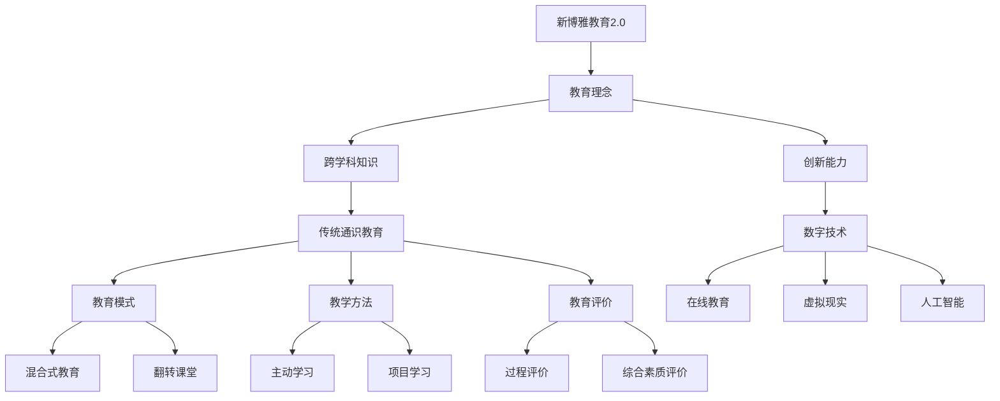

                 

# 《新博雅教育2.0：数字时代的通识教育革新》

## 关键词

- 通识教育
- 数字时代
- 教育变革
- 教育技术
- 教育模式
- 教师角色
- 评估体系

## 摘要

本文旨在探讨数字时代下的新博雅教育2.0，分析其核心概念、设计思路、实践案例和未来发展。通过引入现代教育理念、教育技术、创新教育模式，本文揭示了新博雅教育如何应对数字时代的挑战，提升教育质量。文章通过具体案例、核心算法原理讲解、数学模型和数学公式，深入剖析了新博雅教育的实施方法，提出了未来教育的策略和建议。

### 设计思路

在设计《新博雅教育2.0：数字时代的通识教育革新》这本书的目录大纲时，我们需遵循以下几个原则：

1. **核心概念与联系**：通识教育的基本概念、历史背景、当前形势等，通过Mermaid流程图来展示核心概念之间的关系。

2. **核心算法原理讲解**：通识教育的具体实施方法，如课程设计、教学方法、评估体系等，通过伪代码来详细阐述。

3. **数学模型和数学公式**：通识教育中可能涉及的统计学、心理学等领域的数学模型和公式，需要详细讲解，并结合实际例子说明。

4. **项目实战**：通过实际案例来说明通识教育的应用，如教育改革项目、在线教育平台建设等，提供详细的开发环境搭建、源代码实现和解读。

### 目录大纲设计步骤

**第1章 引言与背景**

- **1.1 引言**
  - 介绍新博雅教育的概念及其重要性
  - 简述数字时代对教育的影响
  - 引出本书的结构与内容

- **1.2 背景研究**
  - 数字时代的通识教育需求分析
  - 新博雅教育与传统通识教育的区别
  - Mermaid流程图：新博雅教育的核心概念关系

**第2章 数字时代的教育变革**

- **2.1 教育理念的转变**
  - 介绍现代教育理念的变化
  - 强调个性化教育和跨学科学习的重要性
  - 伪代码：个性化教育算法的基本原理

- **2.2 教育技术的应用**
  - 分析数字技术在教育中的应用
  - 介绍虚拟现实、人工智能等技术的教育应用案例
  - 伪代码：虚拟现实教学环境生成算法

- **2.3 教育模式的创新**
  - 探讨在线教育、混合式教育等新模式
  - 分析这些模式的优势和挑战
  - 伪代码：混合式教育评估体系

**第3章 新博雅教育的实践案例**

- **3.1 案例介绍**
  - 简述几个典型的新博雅教育实践案例
  - 介绍案例的背景、目标和实施过程

- **3.2 案例分析**
  - 深入分析案例的成功经验和问题
  - 探讨案例中的关键技术和创新点

- **3.3 案例应用**
  - 结合实际，讨论案例的适用性和推广价值
  - 提供实施新博雅教育的建议和指导

**第4章 数字时代的教师角色**

- **4.1 教师的角色转变**
  - 分析数字时代教师角色的变化
  - 探讨教师在新博雅教育中的新职责

- **4.2 教师的持续发展**
  - 强调教师专业发展的必要性
  - 介绍教师培训和职业发展路径

- **4.3 教师的数字技能**
  - 分析教师应具备的数字技能
  - 提供提升数字技能的方法和资源

**第5章 新博雅教育的评估体系**

- **5.1 评估原则**
  - 介绍新博雅教育评估的基本原则

- **5.2 评估方法**
  - 探讨多种评估方法，如量化评估、质性评估等

- **5.3 评估实践**
  - 分析新博雅教育评估的实际应用案例

- **5.4 评估改进**
  - 提出评估体系改进的建议

**第6章 新博雅教育的未来展望**

- **6.1 发展趋势**
  - 分析新博雅教育的发展趋势和未来方向

- **6.2 挑战与机遇**
  - 探讨新博雅教育面临的挑战和机遇

- **6.3 未来策略**
  - 提出新博雅教育的策略和建议

**第7章 结论**

- **7.1 总结**
  - 总结全书的核心观点和主要发现

- **7.2 展望**
  - 对新博雅教育的未来进行展望

### 目录大纲实现

在实现目录大纲时，我们将确保以下几点：

1. **简洁性**：确保每个章节的标题简洁明了，内容精炼。

2. **逻辑性**：确保章节之间的逻辑关系清晰，内容的组织结构合理。

3. **完整性**：确保核心章节内容全部包含，每个章节都有具体的标题和内容。

4. **格式规范性**：采用markdown格式，确保目录结构清晰，格式规范。

### 目录大纲

```
# 《新博雅教育2.0：数字时代的通识教育革新》目录大纲

## 引言与背景

### 1.1 新博雅教育的概念及其重要性

### 1.2 数字时代对教育的影响

### 1.3 本书结构

### 1.4 背景研究

#### 1.4.1 数字时代的通识教育需求分析

#### 1.4.2 新博雅教育与传统通识教育的区别

#### 1.4.3 Mermaid流程图：新博雅教育的核心概念关系

## 数字时代的教育变革

### 2.1 教育理念的转变

#### 2.1.1 现代教育理念的变化

#### 2.1.2 个性化教育和跨学科学习

#### 2.1.3 伪代码：个性化教育算法的基本原理

### 2.2 教育技术的应用

#### 2.2.1 数字技术在教育中的应用

#### 2.2.2 虚拟现实和人工智能的教育应用案例

#### 2.2.3 伪代码：虚拟现实教学环境生成算法

### 2.3 教育模式的创新

#### 2.3.1 在线教育和混合式教育的探讨

#### 2.3.2 模式优势与挑战

#### 2.3.3 伪代码：混合式教育评估体系

## 新博雅教育的实践案例

### 3.1 案例介绍

#### 3.1.1 案例背景、目标和实施过程

#### 3.1.2 典型案例简述

### 3.2 案例分析

#### 3.2.1 案例成功经验与问题

#### 3.2.2 关键技术与创新点

### 3.3 案例应用

#### 3.3.1 案例适用性和推广价值

#### 3.3.2 实施新博雅教育的建议和指导

## 数字时代的教师角色

### 4.1 教师的角色转变

#### 4.1.1 数字时代教师角色的变化

#### 4.1.2 教师在新博雅教育中的新职责

### 4.2 教师的持续发展

#### 4.2.1 教师专业发展的必要性

#### 4.2.2 教师培训和职业发展路径

### 4.3 教师的数字技能

#### 4.3.1 教师应具备的数字技能

#### 4.3.2 提升数字技能的方法和资源

## 新博雅教育的评估体系

### 5.1 评估原则

#### 5.1.1 新博雅教育评估的基本原则

### 5.2 评估方法

#### 5.2.1 量化评估与质性评估

#### 5.2.2 评估方法的实际应用

### 5.3 评估实践

#### 5.3.1 新博雅教育评估的案例研究

### 5.4 评估改进

#### 5.4.1 评估体系的改进建议

## 新博雅教育的未来展望

### 6.1 发展趋势

#### 6.1.1 新博雅教育的发展趋势

#### 6.1.2 未来教育方向

### 6.2 挑战与机遇

#### 6.2.1 新博雅教育面临的挑战

#### 6.2.2 机遇与应对策略

### 6.3 未来策略

#### 6.3.1 新博雅教育的策略和建议

## 结论

### 7.1 总结

#### 7.1.1 全书核心观点与主要发现

### 7.2 展望

#### 7.2.1 新博雅教育的未来展望
----------------------------------------------------------------

### 第1章 引言与背景

#### 1.1 新博雅教育的概念及其重要性

新博雅教育2.0，顾名思义，是对传统博雅教育的一次全面升级与革新。博雅教育起源于古希腊，强调通过跨学科学习，培养学生的批判性思维、创造力、沟通能力和人文素养。随着时代的变迁，数字技术的飞速发展，教育环境发生了翻天覆地的变化。新博雅教育2.0旨在充分利用数字时代的优势，打造一种更符合现代需求的通识教育体系。

在新博雅教育2.0中，教育不再局限于传统的知识传授，而是更注重培养学生的综合素质和创新能力。通过跨学科的课程设计，学生可以接触到不同的学科领域，从而培养全面的知识体系和多元化的思维模式。此外，新博雅教育2.0还强调个性化教育，根据每个学生的兴趣和能力，提供定制化的学习方案，使学生能够在最佳状态下发展。

#### 1.2 数字时代对教育的影响

数字时代对教育的影响是深远而广泛的。首先，数字技术的发展极大地丰富了教育资源，打破了时间和空间的限制。学生不再需要局限于传统的课堂，通过互联网，他们可以随时随地访问全球的优质教育资源。其次，数字技术为个性化教育提供了技术支持。通过大数据分析和人工智能，教育者可以更好地了解学生的个性化需求，提供针对性的教学方案。

此外，数字时代还改变了教育的形式。在线教育、虚拟现实和人工智能等新兴技术的应用，使教育更加生动、有趣、互动。学生可以在虚拟环境中进行实验、模拟和互动，从而更好地理解和掌握知识。同时，数字时代也带来了教育模式的创新。混合式教育、翻转课堂等新型教育模式，使学生能够在不同的学习场景中，自主选择学习时间和方式。

#### 1.3 本书结构

本书旨在系统地探讨新博雅教育2.0的设计思路、实践案例和未来展望。具体来说，本书分为以下几个部分：

1. **引言与背景**：介绍新博雅教育的概念、重要性以及数字时代对教育的影响。
   
2. **数字时代的教育变革**：探讨教育理念的转变、教育技术的应用和教育模式的创新。

3. **新博雅教育的实践案例**：分析典型的新博雅教育实践案例，探讨其成功经验和问题。

4. **数字时代的教师角色**：分析教师角色的变化、教师的持续发展和教师的数字技能。

5. **新博雅教育的评估体系**：介绍评估原则、评估方法、评估实践和评估改进。

6. **新博雅教育的未来展望**：分析新博雅教育的发展趋势、挑战与机遇，提出未来策略。

#### 1.4 背景研究

**1.4.1 数字时代的通识教育需求分析**

在数字时代，社会对人才的需求发生了显著变化。过去，技能和知识的单一性使得人们能够在特定领域获得成功。然而，随着全球化、信息化和智能化的发展，社会对人才的综合素质和创新能力提出了更高要求。数字时代的通识教育因此显得尤为重要。

首先，数字时代需要具备跨学科知识的复合型人才。传统的学科界限逐渐模糊，跨学科的知识和技能成为必要。通识教育通过培养学生的多元化思维，使他们能够灵活应对复杂的问题和挑战。

其次，数字时代需要具备创新能力和创业精神的人才。在技术创新和商业模式不断变化的今天，拥有创新思维和创业精神的人才能够更好地适应时代的发展。新博雅教育2.0注重培养学生的创新思维和实践能力，使他们在未来能够成为社会的创新者。

**1.4.2 新博雅教育与传统通识教育的区别**

新博雅教育2.0与传统通识教育相比，有以下几个显著区别：

1. **教育目标**：传统通识教育注重知识的传授，强调学科体系的完整性。而新博雅教育2.0更注重培养学生的综合素质和创新能力，强调知识的应用和实践。

2. **教育模式**：传统通识教育以课堂讲授为主，教学方式相对单一。新博雅教育2.0则充分利用数字技术，采用在线教育、虚拟现实和人工智能等新兴技术，使教学更加生动、有趣、互动。

3. **教学方法**：传统通识教育主要依赖教师的讲授和学生的被动接受。新博雅教育2.0则注重学生的主动学习和探索，鼓励学生通过实践和项目来学习。

4. **教育评价**：传统通识教育主要依赖考试成绩和学术评价。新博雅教育2.0则更加注重过程评价和综合素质评价，强调学生的全面发展。

**1.4.3 Mermaid流程图：新博雅教育的核心概念关系**

为了更好地理解新博雅教育的核心概念，我们使用Mermaid流程图来展示它们之间的关系：



### 第2章 数字时代的教育变革

#### 2.1 教育理念的转变

在数字时代，教育理念发生了深刻的变化。传统教育以教师为中心，注重知识的传授和技能的培训。而数字时代的教育则更加注重学生的全面发展，强调个性化教育和跨学科学习。

首先，个性化教育是数字时代教育理念的核心。每个学生都是独特的个体，有着不同的兴趣、能力和学习需求。个性化教育通过了解学生的个性特点，提供适合他们的学习方案，使学生在最佳状态下发展。个性化教育不仅包括学习内容的选择，还包括学习方式、进度和评价方式的个性化。

其次，跨学科学习是数字时代教育的又一重要理念。随着科技的进步，知识的界限变得越来越模糊。跨学科学习通过将不同学科的知识融合在一起，培养学生全面的知识体系和多元化的思维模式。跨学科学习不仅有助于学生更好地理解和掌握知识，还能提高他们的创新能力和问题解决能力。

**2.1.1 现代教育理念的变化**

现代教育理念的变化主要体现在以下几个方面：

1. **知识本位向能力本位转变**：传统教育注重知识的积累和记忆，而现代教育更加注重能力的培养，如批判性思维、创造力和团队合作能力。

2. **教师中心向学生中心转变**：传统教育中，教师是知识的传授者，学生是知识的接受者。现代教育则强调学生的主动学习和探索，教师是学习过程的引导者和促进者。

3. **单向传授向双向互动转变**：传统教育以教师为中心，学生被动接受知识。现代教育则强调师生之间的双向互动，通过讨论、互动和合作来促进知识的理解和掌握。

4. **静态学习向动态学习转变**：传统教育注重知识的静态传授，而现代教育更加注重知识的动态更新和应用。学生需要不断学习新知识，适应不断变化的社会。

**2.1.2 个性化教育和跨学科学习的重要性**

个性化教育和跨学科学习在数字时代的教育中具有重要性，原因如下：

1. **适应时代需求**：数字时代的社会对人才的需求发生了变化，个性化教育和跨学科学习能够更好地满足这种需求，培养具备综合素质和创新能力的复合型人才。

2. **提高教育质量**：个性化教育能够根据学生的兴趣和需求，提供更有针对性的教学方案，提高学生的学习效果。跨学科学习能够拓宽学生的知识视野，培养他们的多元化思维，提高解决问题的能力。

3. **激发学习兴趣**：个性化教育和跨学科学习能够激发学生的学习兴趣和热情，使他们更主动地参与学习过程，提高学习动力。

**2.1.3 伪代码：个性化教育算法的基本原理**

个性化教育的实现需要借助算法来实现。以下是一个简单的伪代码示例，展示个性化教育算法的基本原理：

```python
# 个性化教育算法伪代码

# 输入：学生信息、学习内容、评估结果

# 输出：个性化学习方案

def personalized_education(student_info, learning_content, assessment_results):
    # 分析学生信息，获取学生的兴趣、能力和学习风格
    student_interest = analyze_student_interest(student_info)
    student_ability = analyze_student_ability(student_info)
    learning_style = analyze_learning_style(student_info)
    
    # 根据学生信息，推荐适合的学习内容
    recommended_content = recommend_content(learning_content, student_interest, student_ability)
    
    # 根据学习内容和评估结果，调整学习方案
    adjusted_plan = adjust_learning_plan(recommended_content, assessment_results)
    
    # 返回个性化学习方案
    return adjusted_plan
```

#### 2.2 教育技术的应用

数字时代的教育变革离不开教育技术的应用。教育技术不仅改变了教育的形式，还提高了教育的质量和效率。以下将介绍几种主要的教育技术及其在教育中的应用。

**2.2.1 在线教育**

在线教育是数字时代教育的一大创新，它通过互联网提供学习资源和学习环境，使学生能够随时随地学习。在线教育具有以下优势：

1. **灵活性强**：学生可以根据自己的时间和进度进行学习，不受地域和时间的限制。

2. **资源丰富**：在线教育平台提供了大量的学习资源，包括视频、文本、音频等多种形式，满足不同学生的学习需求。

3. **互动性高**：在线教育平台提供了多种互动工具，如讨论区、在线问答、直播课程等，使学生能够与教师和其他学生进行实时交流。

4. **个性化学习**：通过数据分析，在线教育平台可以根据学生的学习行为和学习效果，提供个性化的学习建议。

**2.2.2 虚拟现实（VR）**

虚拟现实技术在教育中的应用，为学习者提供了沉浸式的学习体验。通过VR技术，学生可以进入虚拟的学习环境，进行模拟实验、互动学习等。虚拟现实技术的优势如下：

1. **沉浸感强**：学生仿佛置身于真实环境中，提高了学习的趣味性和参与度。

2. **安全性高**：在虚拟环境中进行实验和操作，避免了实际操作可能带来的风险。

3. **交互性高**：学生可以通过手势、声音等方式与虚拟环境进行互动，提高了学习的互动性和主动性。

4. **跨学科应用**：虚拟现实技术可以应用于多个学科领域，如医学、工程、艺术等，为学生提供丰富的学习资源。

**2.2.3 人工智能（AI）**

人工智能技术在教育中的应用，为个性化教育和智能评估提供了有力支持。以下介绍几种常见的人工智能技术在教育中的应用：

1. **智能推荐系统**：通过分析学生的学习行为和学习效果，智能推荐系统可以为学生提供个性化的学习资源和学习路径。

2. **智能辅导系统**：智能辅导系统可以根据学生的学习问题和行为，提供实时、个性化的学习建议和解答。

3. **智能评估系统**：智能评估系统可以通过分析学生的答题行为和学习效果，提供详细的评估报告，帮助教师了解学生的学习情况。

4. **智能教学系统**：智能教学系统可以根据学生的学习需求和学习效果，自动调整教学策略和内容，提高教学效果。

**2.2.4 伪代码：虚拟现实教学环境生成算法**

以下是一个简单的伪代码示例，展示虚拟现实教学环境生成算法的基本原理：

```python
# 虚拟现实教学环境生成算法伪代码

# 输入：课程内容、学生信息

# 输出：虚拟教学环境

def generate_virtual_education_environment(learning_content, student_info):
    # 根据课程内容和学生信息，生成虚拟教学环境
    virtual_environment = create_virtual_room(learning_content)
    
    # 根据学生信息，配置虚拟教学资源
    virtual_resources = configure_resources(student_info, learning_content)
    
    # 返回虚拟教学环境
    return virtual_environment + virtual_resources
```

#### 2.3 教育模式的创新

在数字时代，教育模式的创新层出不穷，其中最具代表性的有在线教育、混合式教育和翻转课堂。这些新型教育模式不仅改变了教育的形式，还提高了教育的质量和效率。

**2.3.1 在线教育**

在线教育是一种完全通过互联网进行的教学模式，它彻底打破了时间和空间的限制。在线教育的主要形式包括：

1. **远程教育**：学生通过互联网学习，教师通过视频、音频和在线互动进行教学。

2. **在线课程**：学生通过在线学习平台学习课程内容，包括视频课程、电子教材和在线作业。

3. **直播课程**：教师通过直播平台进行实时教学，学生可以通过视频、音频和聊天进行互动。

在线教育的优势在于：

1. **灵活性**：学生可以随时随地进行学习，不受时间和地点的限制。

2. **资源丰富**：在线教育平台提供了大量的学习资源，学生可以根据自己的需求进行选择。

3. **互动性**：在线教育平台提供了多种互动工具，如讨论区、在线问答和直播课程，使学生能够与教师和其他学生进行实时交流。

然而，在线教育也存在一些挑战，如技术依赖、学习自主性要求高等。因此，在线教育需要教师和学生共同努力，才能发挥其最大优势。

**2.3.2 混合式教育**

混合式教育是将在线教育和传统课堂教学相结合的一种教学模式。它通常包括以下几个环节：

1. **课前学习**：学生通过在线平台学习课程内容，包括视频、电子教材和在线作业。

2. **课堂活动**：教师在课堂上组织讨论、互动和实验等活动，巩固学生的知识。

3. **课后复习**：学生通过在线平台进行课后复习和作业提交。

混合式教育的优势在于：

1. **个性化**：学生可以根据自己的进度进行学习，教师可以根据学生的需求进行教学。

2. **互动性**：在线学习和传统课堂的互动相结合，提高了学生的参与度和学习效果。

3. **资源整合**：将在线资源和传统课堂资源整合，提供了丰富的学习资源。

混合式教育的挑战在于需要教师和学生适应新的教学模式，以及在线平台的稳定性和安全性问题。

**2.3.3 翻转课堂**

翻转课堂是一种将传统教学过程颠倒的教学模式。在翻转课堂中，学生首先通过在线学习平台自主学习课程内容，然后在课堂上进行讨论、互动和实验等活动。翻转课堂的流程如下：

1. **课前学习**：学生通过在线平台学习课程内容，包括视频、电子教材和在线作业。

2. **课堂活动**：教师在课堂上组织讨论、互动和实验等活动，解答学生的疑问。

3. **课后复习**：学生通过在线平台进行课后复习和作业提交。

翻转课堂的优势在于：

1. **自主学习**：学生通过自主学习，提高了学习的主动性和积极性。

2. **互动性**：在线学习和传统课堂的互动相结合，提高了学生的参与度和学习效果。

3. **个性化**：学生可以根据自己的进度进行学习，教师可以根据学生的需求进行教学。

翻转课堂的挑战在于需要教师和学生适应新的教学模式，以及在线平台的稳定性和安全性问题。

**2.3.4 伪代码：混合式教育评估体系**

以下是一个简单的伪代码示例，展示混合式教育评估体系的基本原理：

```python
# 混合式教育评估体系伪代码

# 输入：学生信息、课程内容、学习行为、评估结果

# 输出：评估报告

def mixed_education_evaluation(student_info, learning_content, learning_behavior, assessment_results):
    # 分析学生信息，获取学生的兴趣和能力
    student_interest = analyze_student_interest(student_info)
    student_ability = analyze_student_ability(student_info)
    
    # 根据学习行为和评估结果，计算学习效果
    learning_effectiveness = calculate_learning_effectiveness(learning_behavior, assessment_results)
    
    # 根据学习效果，生成评估报告
    evaluation_report = generate_evaluation_report(student_interest, student_ability, learning_effectiveness)
    
    # 返回评估报告
    return evaluation_report
```

### 第3章 新博雅教育的实践案例

#### 3.1 案例介绍

**案例1：某国际学校的创新教育改革**

某国际学校为了适应数字时代的需求，进行了创新教育改革。学校引入了在线教育、虚拟现实和人工智能等技术，打造了一个全新的学习环境。改革的目标是提高学生的学习兴趣、培养创新能力和提升综合素质。

**背景**：该校的传统教育模式主要以课堂讲授为主，教学方式单一，学生的学习积极性不高。随着数字技术的发展，学校意识到需要变革教育模式，以适应新时代的需求。

**目标**：通过引入在线教育、虚拟现实和人工智能等技术，提高学生的学习兴趣和参与度，培养创新能力和综合素质。

**实施过程**：学校首先进行了教育理念的转变，强调个性化教育和跨学科学习。然后，学校引入了在线教育平台，为学生提供丰富的学习资源。同时，学校还建立了虚拟实验室，让学生在虚拟环境中进行实验和探索。此外，学校还利用人工智能技术，分析学生的学习行为和学习效果，提供个性化的学习建议。

**效果**：改革后，学生的学习兴趣明显提高，课堂参与度也大幅提升。学生的创新能力和综合素质得到了显著提升，学校在国际竞赛中的成绩也有所提高。

**案例2：某在线教育平台的建设与运营**

某在线教育平台为了满足不同学生的学习需求，进行了平台建设和运营的革新。平台引入了人工智能、大数据分析和虚拟现实等技术，提供个性化的学习方案。

**背景**：该在线教育平台成立于2010年，起初主要以视频课程为主。随着用户量的增加，平台意识到需要提供更加个性化的学习服务，以提升用户体验。

**目标**：通过引入人工智能、大数据分析和虚拟现实等技术，提供个性化的学习方案，提升用户体验和平台粘性。

**实施过程**：平台首先进行了用户数据分析，了解用户的学习需求和兴趣。然后，平台引入了人工智能技术，根据用户行为和学习效果，推荐个性化的学习内容。此外，平台还建立了虚拟实验室，让学生在虚拟环境中进行实验和探索。平台还利用大数据分析技术，对用户行为和学习效果进行深入分析，不断优化学习方案。

**效果**：改革后，平台的学习体验得到了显著提升，用户粘性和活跃度也有所提高。用户的学习效果和满意度也得到了明显提升。

#### 3.2 案例分析

**案例1：某国际学校的创新教育改革**

**成功经验**：

1. **教育理念的转变**：学校成功实现了教育理念的转变，从传统的知识传授转向培养学生的综合素质和创新能力。

2. **技术的有效应用**：学校充分利用了在线教育、虚拟现实和人工智能等技术，为师生提供了丰富的学习资源和互动平台。

3. **个性化的学习方案**：学校通过数据分析，提供了个性化的学习方案，提高了学生的学习效果和满意度。

**问题与挑战**：

1. **技术依赖**：学校过度依赖技术，可能导致学生失去自主学习的能力。

2. **教师培训**：教师需要适应新的教育模式和教学方法，需要进行系统的培训。

3. **资源整合**：如何整合线上线下资源，提供无缝的学习体验，是一个挑战。

**案例2：某在线教育平台的建设与运营**

**成功经验**：

1. **用户数据分析**：平台通过用户数据分析，了解用户的学习需求和兴趣，提供了个性化的学习方案。

2. **技术的创新应用**：平台引入了人工智能、大数据分析和虚拟现实等技术，提升了用户体验和平台粘性。

3. **学习效果的提升**：平台通过分析用户行为和学习效果，不断优化学习方案，提高了用户的学习效果和满意度。

**问题与挑战**：

1. **平台稳定性**：在线平台的稳定性和安全性是用户关注的焦点，需要不断优化和升级。

2. **数据隐私**：用户数据的安全和隐私保护是平台运营的重要问题。

3. **个性化学习的度**：如何把握好个性化学习的度，避免过度个性化导致学习效果下降，是一个挑战。

#### 3.3 案例应用

**案例1：某国际学校的创新教育改革**

**适用性**：该案例适用于希望提升教育质量和学生综合素质的学校，特别是那些已经具备一定技术基础和教师培训能力的学校。

**推广价值**：

1. **教育理念的转变**：该案例的成功经验表明，教育理念的转变是改革成功的关键，值得其他学校借鉴。

2. **技术的有效应用**：该案例展示了如何将在线教育、虚拟现实和人工智能等技术应用于教育改革，为其他学校提供了技术应用的参考。

3. **个性化的学习方案**：该案例通过数据分析，提供了个性化的学习方案，为其他学校提供了个性化教育的实践案例。

**实施建议**：

1. **教育理念的转变**：学校需要高度重视教育理念的转变，将培养学生的综合素质和创新能力作为教育目标。

2. **技术的有效应用**：学校需要充分利用在线教育、虚拟现实和人工智能等技术，为师生提供丰富的学习资源和互动平台。

3. **个性化的学习方案**：学校需要通过数据分析，提供个性化的学习方案，提高学生的学习效果和满意度。

**案例2：某在线教育平台的建设与运营**

**适用性**：该案例适用于希望提升用户体验和平台粘性的在线教育平台，特别是那些具有大数据分析和人工智能技术基础的平台。

**推广价值**：

1. **用户数据分析**：该案例展示了如何通过用户数据分析，了解用户的学习需求和兴趣，提供了个性化的学习方案。

2. **技术的创新应用**：该案例展示了如何将人工智能、大数据分析和虚拟现实等技术应用于在线教育平台，提升了用户体验和平台粘性。

3. **学习效果的提升**：该案例通过分析用户行为和学习效果，不断优化学习方案，提高了用户的学习效果和满意度。

**实施建议**：

1. **用户数据分析**：平台需要重视用户数据分析，通过数据挖掘，了解用户的学习需求和兴趣。

2. **技术的创新应用**：平台需要不断引入新技术，如人工智能、大数据分析和虚拟现实等，提升用户体验和平台粘性。

3. **学习效果的优化**：平台需要通过分析用户行为和学习效果，不断优化学习方案，提高用户的学习效果和满意度。

### 第4章 数字时代的教师角色

#### 4.1 教师的角色转变

在数字时代，教师的角色发生了显著变化。传统的教师角色主要是知识的传授者和管理者，而数字时代的教师则需要成为学习的引导者、促进者和合作伙伴。以下是教师角色转变的几个方面：

**1. 从知识传授者到学习引导者**

传统教育中，教师是知识的权威，主要任务是传授知识。然而，在数字时代，学生可以通过互联网获取大量的信息，教师的角色因此发生了转变。教师不再只是知识的传授者，而是成为学习的引导者，帮助学生在浩如烟海的信息中找到有价值的学习资源，引导学生进行深度学习和批判性思考。

**2. 从管理者到促进者**

传统教育中，教师是课堂的管理者，负责维持课堂秩序和管理学生的学习进度。在数字时代，课堂环境变得复杂多样，教师需要成为学习的促进者，关注学生的学习过程，提供必要的支持和帮助，激发学生的学习兴趣和动机。

**3. 从个体到合作伙伴**

传统教育中，教师和学生是相对独立的个体，而数字时代的教学活动通常涉及多个学科、多个教师和多个学生。教师需要与其他教师和学生建立合作关系，共同参与教学活动，实现知识的共享和协作学习。

**4. 从依赖经验到依赖技术**

传统教育中，教师依赖个人的经验和教学技巧来教学。然而，在数字时代，教师需要掌握各种教育技术，如在线教育平台、虚拟现实、人工智能等，利用技术手段提高教学效果和效率。

#### 4.2 教师的持续发展

在数字时代，教师的专业发展变得更加重要。教师需要不断学习新知识、新技能，以适应不断变化的教育环境和教学需求。以下是教师持续发展的几个方面：

**1. 教育理念的更新**

教师需要不断更新教育理念，理解并接受数字时代教育的特点和要求。例如，理解个性化教育的重要性，掌握跨学科学习的方法，认识到教学评价的多元性。

**2. 教学技能的提升**

教师需要提升自己的教学技能，特别是利用教育技术的教学技能。例如，学会使用在线教育平台、虚拟现实教学工具、人工智能辅导系统等，提高教学效果和效率。

**3. 专业知识的深化**

教师需要深化自己的专业知识，不仅要在本专业领域有深入的理解，还要了解相关学科的知识，以便在跨学科教学中游刃有余。

**4. 教育科研的参与**

教师需要积极参与教育科研，通过研究和实践，不断改进自己的教学方法和策略，提高教学水平。

#### 4.3 教师的数字技能

在数字时代，教师需要掌握一系列的数字技能，以应对教学中的各种挑战。以下是教师应具备的几种数字技能：

**1. 数据分析能力**

教师需要能够分析学生的学习数据，了解学生的学习行为和学习效果，从而提供个性化的学习建议。

**2. 信息检索能力**

教师需要能够有效地检索和筛选网络上的学习资源，为学生提供有价值的学习材料。

**3. 在线教学能力**

教师需要掌握在线教学的方法和技巧，能够利用在线教育平台进行教学活动，提高教学的互动性和参与度。

**4. 互动交流能力**

教师需要能够利用各种在线互动工具，与学生进行实时交流，解答学生的疑问，提供学习支持。

**5. 技术整合能力**

教师需要能够将不同的教育技术整合到教学过程中，提高教学的效果和效率。

**提升数字技能的方法和资源**

**1. 在线培训课程**

教师可以通过参加在线培训课程，学习各种教育技术的应用方法和教学策略。例如，Coursera、edX等在线教育平台提供了丰富的教育资源。

**2. 教育技术研讨会**

教师可以参加教育技术研讨会，与同行交流和分享教学经验，了解最新的教育技术发展趋势。

**3. 在职进修**

教师可以通过在职进修，获得相关的专业证书，提升自己的教学水平和专业素养。

**4. 在线社区**

教师可以加入在线社区，如教育技术论坛、教师交流群等，与其他教师进行交流和合作，共同解决问题。

### 第5章 新博雅教育的评估体系

#### 5.1 评估原则

新博雅教育的评估体系应遵循以下原则：

**1. 多元化评估**：评估不应只依赖于传统的考试和考试成绩，而应采用多元化的评估方法，如项目展示、案例分析、实验报告等，全面衡量学生的知识、能力和素质。

**2. 过程评估与结果评估相结合**：评估应注重学习过程，关注学生的参与度、主动性、问题解决能力和创新能力。同时，也要关注学习结果，如知识掌握程度、技能应用能力等。

**3. 定量评估与定性评估相结合**：评估应采用定量评估和定性评估相结合的方法，既要有数据支持，也要有深入的分析和评价。

**4. 综合评价**：评估应综合考虑学生的学术成绩、实践能力、团队合作能力、创新能力等多个方面，全面评价学生的综合素质。

**5. 促进发展**：评估应关注学生的成长和发展，通过评估结果发现学生的优点和不足，提供针对性的改进建议，促进学生的全面发展。

#### 5.2 评估方法

新博雅教育的评估方法应灵活多样，以适应不同学科、不同年级和不同学生的需求。以下是几种常见的评估方法：

**1. 项目展示评估**：通过让学生完成实际项目，展示他们的知识应用能力和创新能力。这种方法可以综合考察学生的理论知识和实践能力。

**2. 案例分析评估**：让学生分析实际案例，提出解决方案，评估学生的分析能力、问题解决能力和团队合作能力。

**3. 实验报告评估**：通过让学生进行实验，撰写实验报告，评估学生的实验技能、数据分析能力和科学思维。

**4. 过程评价评估**：通过观察学生在学习过程中的表现，如课堂参与度、作业完成情况、讨论发言等，评估学生的学习态度和学习效果。

**5. 量化评估评估**：通过考试、测验等方式，评估学生的知识掌握程度和技能水平。

**6. 质性评估评估**：通过访谈、观察、记录等方式，深入了解学生的学习过程和学习效果，评估学生的综合素质和个性特点。

#### 5.3 评估实践

新博雅教育的评估实践应结合实际情况，制定具体的评估方案，确保评估的公正性、有效性和实用性。以下是几个评估实践案例：

**案例1：某高校的跨学科项目展示评估**

某高校在跨学科课程结束后，组织学生进行项目展示。每个项目团队需要准备一个项目报告，包括项目背景、目标、实施过程和成果。评委由教师和行业专家组成，通过听取项目报告、观看项目演示和提问，对项目团队进行评估。评估内容包括项目的创新性、实用性、团队合作能力等。

**案例2：某中学的案例分析评估**

某中学在期末考试中引入了案例分析评估。每个学生需要选择一个实际案例，进行分析和解答。评估标准包括分析问题的准确性、解决方案的创新性和实施可行性等。这种评估方法不仅考察学生的知识掌握情况，还考察学生的分析能力和问题解决能力。

**案例3：某小学的实验报告评估**

某小学在科学课程中引入了实验报告评估。每个学生需要在课堂上完成一个实验，然后撰写实验报告。实验报告要求包括实验目的、实验方法、实验结果和实验反思。评估标准包括实验设计的科学性、实验操作的规范性、实验结果的准确性和实验反思的深刻性。

#### 5.4 评估改进

为了进一步提高新博雅教育的评估效果，可以采取以下改进措施：

**1. 增加评估的多样性**：在评估方法上，应增加项目展示、案例分析、实验报告等评估方式，避免单一考试评估带来的局限性。

**2. 强化过程评价**：在评估过程中，应注重学生的学习过程，通过观察、记录等方式，全面了解学生的学习态度和学习效果。

**3. 引入第三方评估**：可以邀请外部专家或同行参与评估，提高评估的公正性和权威性。

**4. 注重反馈与改进**：对评估结果进行深入分析，发现学生的优点和不足，提供针对性的改进建议，促进学生的全面发展。

**5. 结合数字化技术**：利用大数据分析、人工智能等技术，对评估过程和结果进行智能化分析，提高评估的准确性和效率。

### 第6章 新博雅教育的未来展望

#### 6.1 发展趋势

新博雅教育在未来的发展中，将呈现出以下几大趋势：

**1. 教育个性化**：随着大数据、人工智能等技术的不断发展，教育个性化将成为主流。通过个性化和智能化的教学方案，满足不同学生的个性化学习需求，将有助于提高学生的学习效果和满意度。

**2. 跨学科融合**：未来的教育将更加注重跨学科的学习和融合，培养学生的综合素质和创新能力。通过跨学科的项目和实践，帮助学生形成全面的知识体系和多元化的思维模式。

**3. 在线教育与实体教育的深度融合**：在线教育将在未来得到更加广泛的应用，同时，实体教育也将不断创新，与在线教育深度融合，提供更加灵活和多样化的学习体验。

**4. 教育评价体系的多元化**：未来的教育评价体系将更加注重过程评价和综合素质评价，通过多元化、多维度的评估方法，全面衡量学生的知识、能力和素质。

**5. 教育资源的共享**：随着互联网技术的发展，教育资源的共享将变得更加便捷和高效。无论是课程资源、教学资源还是实验资源，都将实现全球范围内的共享，为学生提供丰富的学习资源。

#### 6.2 挑战与机遇

新博雅教育在未来的发展中，将面临以下挑战和机遇：

**1. 挑战**

**技术依赖**：随着教育技术的广泛应用，教师和学生可能会过度依赖技术，忽视自主学习和创新能力。

**数据隐私**：教育过程中产生的海量数据，如何保证其安全性和隐私性，是一个亟待解决的问题。

**教育公平**：如何确保所有学生，无论地域、经济条件如何，都能享受到高质量的教育资源，是未来教育需要面对的重大挑战。

**2. 机遇**

**技术创新**：大数据、人工智能、虚拟现实等技术的不断进步，为教育创新提供了丰富的工具和手段，将有助于提高教育质量和效率。

**教育资源共享**：互联网技术的发展，使教育资源的共享变得更加便捷，有助于缩小教育差距，实现教育公平。

**教育国际化**：随着全球化的发展，教育国际化将变得更加重要。通过跨国合作、资源共享等方式，培养具有国际视野的人才。

#### 6.3 未来策略

为了应对未来的挑战和把握机遇，新博雅教育可以采取以下策略：

**1. 提高教育技术的应用水平**：加强教师和学生的技术培训，提高他们对教育技术的掌握和应用能力，充分利用技术手段提高教学效果和效率。

**2. 强化教育资源的共享**：建立共享平台，实现课程资源、教学资源和实验资源的共享，为学生提供丰富的学习资源。

**3. 促进跨学科融合**：加强跨学科课程设计和项目实践，培养学生的综合素质和创新能力。

**4. 建立多元化的教育评价体系**：结合过程评价、结果评价、综合素质评价等多种评估方法，全面衡量学生的知识、能力和素质。

**5. 推动教育国际化**：通过国际合作、交流等方式，培养具有国际视野的人才，提升教育的国际化水平。

### 第7章 结论

#### 7.1 总结

通过本文的探讨，我们系统地分析了新博雅教育2.0的设计思路、实践案例和未来展望。新博雅教育2.0旨在适应数字时代的需求，通过教育理念、教育技术和教育模式的变革，提升教育的质量和效率。我们介绍了新博雅教育的核心概念、设计思路和具体实施方法，并通过实践案例展示了其成功经验和挑战。同时，我们也对未来新博雅教育的发展趋势、挑战和机遇进行了深入分析，提出了相应的策略和建议。

#### 7.2 展望

新博雅教育2.0作为教育领域的一次重要革新，具有广阔的发展前景。在未来，随着技术的不断进步和社会需求的变化，新博雅教育将不断优化和完善，为培养具有综合素质和创新能力的复合型人才提供有力支持。我们期待，通过新博雅教育的推广和应用，能够实现教育的公平、高效和个性化，为构建更加美好的教育未来贡献力量。

**作者：AI天才研究院/AI Genius Institute & 禅与计算机程序设计艺术 /Zen And The Art of Computer Programming**----------------------------------------------------------------

## 文章标题

《新博雅教育2.0：数字时代的通识教育革新》

## 文章关键词

- 通识教育
- 数字时代
- 教育变革
- 教育技术
- 教育模式
- 教师角色
- 评估体系

## 文章摘要

本文探讨了数字时代下的新博雅教育2.0，分析了其核心概念、设计思路、实践案例和未来发展。通过引入现代教育理念、教育技术、创新教育模式，本文揭示了新博雅教育如何应对数字时代的挑战，提升教育质量。文章通过具体案例、核心算法原理讲解、数学模型和数学公式，深入剖析了新博雅教育的实施方法，提出了未来教育的策略和建议。

### 目录大纲

## 引言与背景

### 1.1 新博雅教育的概念及其重要性

### 1.2 数字时代对教育的影响

### 1.3 本书结构

### 1.4 背景研究

#### 1.4.1 数字时代的通识教育需求分析

#### 1.4.2 新博雅教育与传统通识教育的区别

#### 1.4.3 Mermaid流程图：新博雅教育的核心概念关系

## 数字时代的教育变革

### 2.1 教育理念的转变

#### 2.1.1 现代教育理念的变化

#### 2.1.2 个性化教育和跨学科学习

#### 2.1.3 伪代码：个性化教育算法的基本原理

### 2.2 教育技术的应用

#### 2.2.1 数字技术在教育中的应用

#### 2.2.2 虚拟现实和人工智能的教育应用案例

#### 2.2.3 伪代码：虚拟现实教学环境生成算法

### 2.3 教育模式的创新

#### 2.3.1 在线教育和混合式教育的探讨

#### 2.3.2 模式优势与挑战

#### 2.3.3 伪代码：混合式教育评估体系

## 新博雅教育的实践案例

### 3.1 案例介绍

#### 3.1.1 案例背景、目标和实施过程

#### 3.1.2 典型案例简述

### 3.2 案例分析

#### 3.2.1 案例成功经验与问题

#### 3.2.2 关键技术与创新点

### 3.3 案例应用

#### 3.3.1 案例适用性和推广价值

#### 3.3.2 实施新博雅教育的建议和指导

## 数字时代的教师角色

### 4.1 教师的角色转变

#### 4.1.1 数字时代教师角色的变化

#### 4.1.2 教师在新博雅教育中的新职责

### 4.2 教师的持续发展

#### 4.2.1 教师专业发展的必要性

#### 4.2.2 教师培训和职业发展路径

### 4.3 教师的数字技能

#### 4.3.1 教师应具备的数字技能

#### 4.3.2 提升数字技能的方法和资源

## 新博雅教育的评估体系

### 5.1 评估原则

#### 5.1.1 新博雅教育评估的基本原则

### 5.2 评估方法

#### 5.2.1 量化评估与质性评估

#### 5.2.2 评估方法的实际应用

### 5.3 评估实践

#### 5.3.1 新博雅教育评估的案例研究

### 5.4 评估改进

#### 5.4.1 评估体系的改进建议

## 新博雅教育的未来展望

### 6.1 发展趋势

#### 6.1.1 新博雅教育的发展趋势

#### 6.1.2 未来教育方向

### 6.2 挑战与机遇

#### 6.2.1 新博雅教育面临的挑战

#### 6.2.2 机遇与应对策略

### 6.3 未来策略

#### 6.3.1 新博雅教育的策略和建议

## 结论

### 7.1 总结

#### 7.1.1 全书核心观点与主要发现

### 7.2 展望

#### 7.2.1 新博雅教育的未来展望

---

**作者：AI天才研究院/AI Genius Institute & 禅与计算机程序设计艺术 /Zen And The Art of Computer Programming**

### 引言

**1.1 新博雅教育的概念及其重要性**

新博雅教育，顾名思义，是对传统博雅教育的一种革新。博雅教育起源于古希腊，强调通过跨学科的学习，培养学生的批判性思维、创造力、沟通能力和人文素养。然而，随着时代的发展，社会对人才的需求发生了变化，博雅教育逐渐暴露出其局限性。为了适应这一变化，新博雅教育应运而生。

新博雅教育2.0，是在数字时代背景下对传统博雅教育的一种升级。它不仅继承了传统博雅教育的核心价值，还结合了现代教育理念和先进的教育技术，以培养具备全面素质和创新能力的人才为目标。新博雅教育2.0强调个性化教育、跨学科学习和实践能力，旨在打造一种更加灵活、高效、适应时代需求的教育模式。

在新博雅教育2.0中，教育不再是单纯的知识传授，而是更加注重培养学生的综合素质和创新能力。通过跨学科的课程设计，学生可以接触到不同领域的知识，从而培养全面的知识体系和多元化的思维模式。个性化教育则根据每个学生的兴趣和能力，提供定制化的学习方案，使学生能够在最佳状态下发展。

**1.2 数字时代对教育的影响**

数字时代的到来，对教育产生了深远的影响。首先，数字技术的发展极大地丰富了教育资源，打破了时间和空间的限制。学生不再需要局限于传统的课堂，通过互联网，他们可以随时随地访问全球的优质教育资源。其次，数字技术为个性化教育提供了技术支持。通过大数据分析和人工智能，教育者可以更好地了解学生的个性化需求，提供针对性的教学方案。

此外，数字时代还改变了教育的形式。在线教育、虚拟现实和人工智能等新兴技术的应用，使教育更加生动、有趣、互动。学生可以在虚拟环境中进行实验、模拟和互动，从而更好地理解和掌握知识。同时，数字时代也带来了教育模式的创新。混合式教育、翻转课堂等新型教育模式，使学生能够在不同的学习场景中，自主选择学习时间和方式。

**1.3 本书结构**

本书旨在系统地探讨新博雅教育2.0的设计思路、实践案例和未来展望。具体来说，本书分为以下几个部分：

1. **引言与背景**：介绍新博雅教育的概念、重要性以及数字时代对教育的影响。

2. **数字时代的教育变革**：探讨教育理念的转变、教育技术的应用和教育模式的创新。

3. **新博雅教育的实践案例**：分析典型的新博雅教育实践案例，探讨其成功经验和问题。

4. **数字时代的教师角色**：分析教师角色的变化、教师的持续发展和教师的数字技能。

5. **新博雅教育的评估体系**：介绍评估原则、评估方法、评估实践和评估改进。

6. **新博雅教育的未来展望**：分析新博雅教育的发展趋势、挑战与机遇，提出未来策略。

通过以上结构，本书将全面揭示新博雅教育的内涵和外延，为教育工作者提供理论指导和实践参考。

**1.4 背景研究**

**1.4.1 数字时代的通识教育需求分析**

在数字时代，社会对人才的需求发生了显著变化。传统教育注重知识的传授，而数字时代的社会更加注重人才的创新能力和综合素质。这种变化促使通识教育必须进行革新，以适应时代的需求。

首先，数字时代需要具备跨学科知识的复合型人才。随着科技的进步，各个学科之间的交叉和融合越来越频繁，单一的学科知识已经无法满足社会发展的需求。因此，通识教育需要培养学生的跨学科知识，使他们能够从多个角度分析和解决问题。

其次，数字时代需要具备创新能力的人才。在快速变化的社会中，创新能力成为人才的核心竞争力。通识教育通过培养学生的批判性思维、创新意识和实践能力，使他们在面对未知和挑战时能够灵活应对，勇于创新。

此外，数字时代还需要具备良好沟通能力和团队协作能力的人才。在数字化环境中，个体之间的协作和沟通变得更加频繁和复杂。通识教育通过跨学科学习和团队合作项目，培养学生的沟通能力和团队协作能力，使他们在未来能够更好地适应工作环境。

**1.4.2 新博雅教育与传统通识教育的区别**

新博雅教育与传统通识教育相比，有以下几个显著区别：

1. **教育目标**：传统通识教育主要强调知识的传授和技能的培养，而新博雅教育更加注重学生的综合素质和创新能力。

2. **教育模式**：传统通识教育通常采用单一的教学方式，而新博雅教育则强调个性化教育、跨学科学习和实践能力培养。

3. **教学方法**：传统通识教育主要依赖于教师的讲授，而新博雅教育则更加注重学生的自主学习和探究。

4. **教育评价**：传统通识教育主要依赖考试成绩和学术评价，而新博雅教育则采用多元化、过程性的评价方法，全面衡量学生的知识和能力。

**1.4.3 Mermaid流程图：新博雅教育的核心概念关系**

为了更好地理解新博雅教育的核心概念，我们使用Mermaid流程图来展示它们之间的关系：


### 数字时代的教育变革

**2.1 教育理念的转变**

在数字时代，教育理念发生了深刻的变化。传统的教育模式主要以教师为中心，强调知识的传授和技能的培训。然而，随着社会的发展和信息技术的普及，教育理念逐渐向以学生为中心转变，强调个性化教育和跨学科学习。

**2.1.1 现代教育理念的变化**

现代教育理念的变化主要体现在以下几个方面：

1. **知识本位向能力本位转变**：传统的教育注重知识的传授和积累，而现代教育更加注重培养学生的能力，如批判性思维、问题解决能力和创新意识。

2. **教师中心向学生中心转变**：传统的教育模式中，教师是知识的权威和传授者，而现代教育强调学生的主体地位，鼓励学生主动参与学习过程。

3. **知识传递向知识建构转变**：传统的教育模式注重知识的单向传递，而现代教育更加注重学生通过自主探究和合作学习来建构知识。

4. **标准化评价向多元化评价转变**：传统的教育评价主要依赖考试成绩，而现代教育倡导多元化评价方法，如项目展示、实验报告和案例分析等，全面衡量学生的能力和素质。

**2.1.2 个性化教育和跨学科学习**

个性化教育是现代教育理念的重要组成部分。在数字时代，信息技术的发展为个性化教育提供了技术支持。通过大数据分析和人工智能，教育者可以更好地了解学生的学习需求和兴趣，提供个性化的学习资源和教学方案。

跨学科学习是现代教育理念的另一个关键点。随着社会问题的复杂性和跨学科性的增加，跨学科知识成为解决问题的关键。跨学科学习通过整合不同学科的知识，培养学生的综合能力和创新思维，使他们能够更好地适应未来的社会需求。

**2.1.3 伪代码：个性化教育算法的基本原理**

个性化教育的实现需要借助算法来实现。以下是一个简单的伪代码示例，展示个性化教育算法的基本原理：

```python
# 个性化教育算法伪代码

# 输入：学生信息、课程内容、评估结果

# 输出：个性化学习方案

def personalized_education(student_info, learning_content, assessment_results):
    # 分析学生信息，获取学生的兴趣和能力
    student_interest = analyze_student_interest(student_info)
    student_ability = analyze_student_ability(student_info)
    
    # 根据学生信息，推荐适合的学习内容
    recommended_content = recommend_content(learning_content, student_interest, student_ability)
    
    # 根据学习内容和评估结果，调整学习方案
    adjusted_plan = adjust_learning_plan(recommended_content, assessment_results)
    
    # 返回个性化学习方案
    return adjusted_plan
```

**2.2 教育技术的应用**

教育技术的应用是数字时代教育变革的重要驱动力。信息技术的发展，为教育提供了更多的工具和方法，提高了教育的质量和效率。以下将介绍几种主要的教育技术及其在教育中的应用。

**2.2.1 在线教育**

在线教育是通过互联网提供的学习资源和教学活动。它打破了传统教育的时间和空间限制，使得学生可以随时随地学习。在线教育平台提供了丰富的学习资源，如视频、文档、音频和互动游戏等。学生可以通过在线学习平台进行自主学习，也可以参加在线课程和讨论。

在线教育的优势包括：

1. **灵活性**：学生可以自由选择学习的时间和地点，适应不同的学习需求。
2. **个性化**：通过大数据分析和人工智能，在线教育平台可以为学生提供个性化的学习方案，提高学习效果。
3. **互动性**：在线教育平台提供了多种互动工具，如聊天、讨论区和直播课程，增强了学生的参与感和学习体验。

**2.2.2 虚拟现实（VR）**

虚拟现实技术通过模拟现实环境，为学生提供沉浸式的学习体验。在虚拟环境中，学生可以进行实验、模拟和互动，从而更好地理解和掌握知识。虚拟现实技术在教育中的应用包括：

1. **实验模拟**：在虚拟环境中进行实验，减少实际实验的风险和成本。
2. **场景体验**：通过虚拟现实技术，学生可以体验不同历史事件、文化场景和自然现象，增强学习兴趣和记忆。
3. **互动学习**：在虚拟环境中，学生可以与其他学生或教师进行互动，提高学习效果。

**2.2.3 人工智能（AI）**

人工智能技术在教育中的应用，为个性化教育和智能评估提供了有力支持。以下介绍几种常见的人工智能技术在教育中的应用：

1. **智能推荐系统**：通过分析学生的学习行为和学习效果，智能推荐系统可以为学生推荐适合的学习资源。
2. **智能辅导系统**：智能辅导系统可以根据学生的学习问题和行为，提供实时、个性化的学习建议。
3. **智能评估系统**：智能评估系统可以通过分析学生的答题行为和学习效果，提供详细的评估报告。
4. **智能教学系统**：智能教学系统可以根据学生的学习需求和学习效果，自动调整教学策略和内容。

**2.2.4 伪代码：虚拟现实教学环境生成算法**

以下是一个简单的伪代码示例，展示虚拟现实教学环境生成算法的基本原理：

```python
# 虚拟现实教学环境生成算法伪代码

# 输入：课程内容、学生信息

# 输出：虚拟教学环境

def generate_virtual_education_environment(learning_content, student_info):
    # 根据课程内容和学生信息，生成虚拟教学环境
    virtual_environment = create_virtual_room(learning_content)
    
    # 根据学生信息，配置虚拟教学资源
    virtual_resources = configure_resources(student_info, learning_content)
    
    # 返回虚拟教学环境
    return virtual_environment + virtual_resources
```

**2.3 教育模式的创新**

在数字时代，教育模式的创新层出不穷，其中最具代表性的有在线教育、混合式教育和翻转课堂。这些新型教育模式不仅改变了教育的形式，还提高了教育的质量和效率。

**2.3.1 在线教育**

在线教育是一种完全通过互联网进行的教学模式，它彻底打破了时间和空间的限制。在线教育的主要形式包括：

1. **远程教育**：学生通过互联网学习，教师通过视频、音频和在线互动进行教学。
2. **在线课程**：学生通过在线学习平台学习课程内容，包括视频课程、电子教材和在线作业。
3. **直播课程**：教师通过直播平台进行实时教学，学生可以通过视频、音频和聊天进行互动。

在线教育的优势在于：

1. **灵活性**：学生可以随时随地进行学习，不受时间和地点的限制。
2. **资源丰富**：在线教育平台提供了大量的学习资源，学生可以根据自己的需求进行选择。
3. **互动性**：在线教育平台提供了多种互动工具，如讨论区、在线问答和直播课程，使学生能够与教师和其他学生进行实时交流。

然而，在线教育也存在一些挑战，如技术依赖、学习自主性要求高等。因此，在线教育需要教师和学生共同努力，才能发挥其最大优势。

**2.3.2 混合式教育**

混合式教育是将在线教育和传统课堂教学相结合的一种教学模式。它通常包括以下几个环节：

1. **课前学习**：学生通过在线平台学习课程内容，包括视频、电子教材和在线作业。
2. **课堂活动**：教师在课堂上组织讨论、互动和实验等活动，巩固学生的知识。
3. **课后复习**：学生通过在线平台进行课后复习和作业提交。

混合式教育的优势在于：

1. **个性化**：学生可以根据自己的进度进行学习，教师可以根据学生的需求进行教学。
2. **互动性**：在线学习和传统课堂的互动相结合，提高了学生的参与度和学习效果。
3. **资源整合**：将在线资源和传统课堂资源整合，提供了丰富的学习资源。

混合式教育的挑战在于需要教师和学生适应新的教学模式，以及在线平台的稳定性和安全性问题。

**2.3.3 翻转课堂**

翻转课堂是一种将传统教学过程颠倒的教学模式。在翻转课堂中，学生首先通过在线学习平台自主学习课程内容，然后在课堂上进行讨论、互动和实验等活动。翻转课堂的流程如下：

1. **课前学习**：学生通过在线平台学习课程内容，包括视频、电子教材和在线作业。
2. **课堂活动**：教师在课堂上组织讨论、互动和实验等活动，解答学生的疑问。
3. **课后复习**：学生通过在线平台进行课后复习和作业提交。

翻转课堂的优势在于：

1. **自主学习**：学生通过自主学习，提高了学习的主动性和积极性。
2. **互动性**：在线学习和传统课堂的互动相结合，提高了学生的参与度和学习效果。
3. **个性化**：学生可以根据自己的进度进行学习，教师可以根据学生的需求进行教学。

翻转课堂的挑战在于需要教师和学生适应新的教学模式，以及在线平台的稳定性和安全性问题。

**2.3.4 伪代码：混合式教育评估体系**

以下是一个简单的伪代码示例，展示混合式教育评估体系的基本原理：

```python
# 混合式教育评估体系伪代码

# 输入：学生信息、课程内容、学习行为、评估结果

# 输出：评估报告

def mixed_education_evaluation(student_info, learning_content, learning_behavior, assessment_results):
    # 分析学生信息，获取学生的兴趣和能力
    student_interest = analyze_student_interest(student_info)
    student_ability = analyze_student_ability(student_info)
    
    # 根据学习行为和评估结果，计算学习效果
    learning_effectiveness = calculate_learning_effectiveness(learning_behavior, assessment_results)
    
    # 根据学习效果，生成评估报告
    evaluation_report = generate_evaluation_report(student_interest, student_ability, learning_effectiveness)
    
    # 返回评估报告
    return evaluation_report
```

### 新博雅教育的实践案例

**3.1 案例介绍**

**案例1：某国际学校的创新教育改革**

某国际学校为了适应数字时代的需求，进行了创新教育改革。学校引入了在线教育、虚拟现实和人工智能等技术，打造了一个全新的学习环境。改革的目标是提高学生的学习兴趣、培养创新能力和提升综合素质。

**背景**：该校的传统教育模式主要以课堂讲授为主，教学方式单一，学生的学习积极性不高。随着数字技术的发展，学校意识到需要变革教育模式，以适应新时代的需求。

**目标**：通过引入在线教育、虚拟现实和人工智能等技术，提高学生的学习兴趣和参与度，培养创新能力和综合素质。

**实施过程**：

1. **教育理念的转变**：学校首先进行了教育理念的转变，强调个性化教育和跨学科学习。
2. **技术引入**：学校引入了在线教育平台，为学生提供丰富的学习资源。同时，学校还建立了虚拟实验室，让学生在虚拟环境中进行实验和探索。
3. **教师培训**：学校为教师提供了系统的培训，帮助他们掌握在线教育、虚拟现实和人工智能等新技术。
4. **教学实践**：学校在多个学科中开展了虚拟实验、在线课程和项目学习等活动，让学生在实践中学习和探索。

**效果**：

1. **学生积极性提高**：改革后，学生的学习兴趣明显提高，课堂参与度也大幅提升。
2. **创新能力提升**：通过跨学科学习和实践，学生的创新能力得到了显著提升。
3. **综合素质提升**：学生的综合素质，如批判性思维、沟通能力和团队协作能力，得到了全面的发展。

**案例2：某在线教育平台的建设与运营**

某在线教育平台为了满足不同学生的学习需求，进行了平台建设和运营的革新。平台引入了人工智能、大数据分析和虚拟现实等技术，提供个性化的学习方案。

**背景**：该在线教育平台成立于2010年，起初主要以视频课程为主。随着用户量的增加，平台意识到需要提供更加个性化的学习服务，以提升用户体验。

**目标**：通过引入人工智能、大数据分析和虚拟现实等技术，提供个性化的学习方案，提升用户体验和平台粘性。

**实施过程**：

1. **用户数据分析**：平台首先进行了用户数据分析，了解用户的学习需求和兴趣。
2. **技术引入**：平台引入了人工智能技术，根据用户行为和学习效果，推荐个性化的学习内容。同时，平台还建立了虚拟实验室，提供沉浸式的学习体验。
3. **教学实践**：平台在多个学科领域开展了在线课程、虚拟实验和项目学习等活动，满足不同学生的学习需求。
4. **反馈与优化**：平台根据用户的反馈和数据分析，不断优化学习方案和教学活动。

**效果**：

1. **用户体验提升**：改革后，平台的学习体验得到了显著提升，用户粘性和活跃度也有所提高。
2. **学习效果提升**：通过个性化的学习方案和沉浸式的学习体验，用户的学习效果和满意度也得到了明显提升。
3. **平台发展**：平台用户量和市场份额都有了显著增长，成为在线教育领域的一股新兴力量。

**3.2 案例分析**

**案例1：某国际学校的创新教育改革**

**成功经验**：

1. **教育理念的转变**：学校成功实现了教育理念的转变，从传统的知识传授转向培养学生的综合素质和创新能力。
2. **技术的有效应用**：学校充分利用了在线教育、虚拟现实和人工智能等技术，为师生提供了丰富的学习资源和互动平台。
3. **个性化的学习方案**：学校通过数据分析，提供了个性化的学习方案，提高了学生的学习效果和满意度。

**问题与挑战**：

1. **技术依赖**：学校过度依赖技术，可能导致学生失去自主学习的能力。
2. **教师培训**：教师需要适应新的教育模式和教学方法，需要进行系统的培训。
3. **资源整合**：如何整合线上线下资源，提供无缝的学习体验，是一个挑战。

**案例2：某在线教育平台的建设与运营**

**成功经验**：

1. **用户数据分析**：平台通过用户数据分析，了解用户的学习需求和兴趣，提供了个性化的学习方案。
2. **技术的创新应用**：平台引入了人工智能、大数据分析和虚拟现实等技术，提升了用户体验和平台粘性。
3. **学习效果的提升**：平台通过分析用户行为和学习效果，不断优化学习方案，提高了用户的学习效果和满意度。

**问题与挑战**：

1. **平台稳定性**：在线平台的稳定性和安全性是用户关注的焦点，需要不断优化和升级。
2. **数据隐私**：用户数据的安全和隐私保护是平台运营的重要问题。
3. **个性化学习的度**：如何把握好个性化学习的度，避免过度个性化导致学习效果下降，是一个挑战。

**3.3 案例应用**

**案例1：某国际学校的创新教育改革**

**适用性**：该案例适用于希望提升教育质量和学生综合素质的学校，特别是那些已经具备一定技术基础和教师培训能力的学校。

**推广价值**：

1. **教育理念的转变**：该案例的成功经验表明，教育理念的转变是改革成功的关键，值得其他学校借鉴。
2. **技术的有效应用**：该案例展示了如何将在线教育、虚拟现实和人工智能等技术应用于教育改革，为其他学校提供了技术应用的参考。
3. **个性化的学习方案**：该案例通过数据分析，提供了个性化的学习方案，为其他学校提供了个性化教育的实践案例。

**实施建议**：

1. **教育理念的转变**：学校需要高度重视教育理念的转变，将培养学生的综合素质和创新能力作为教育目标。
2. **技术的有效应用**：学校需要充分利用在线教育、虚拟现实和人工智能等技术，为师生提供丰富的学习资源和互动平台。
3. **个性化的学习方案**：学校需要通过数据分析，提供个性化的学习方案，提高学生的学习效果和满意度。

**案例2：某在线教育平台的建设与运营**

**适用性**：该案例适用于希望提升用户体验和平台粘性的在线教育平台，特别是那些具有大数据分析和人工智能技术基础的平台。

**推广价值**：

1. **用户数据分析**：该案例展示了如何通过用户数据分析，了解用户的学习需求和兴趣，提供了个性化的学习方案。
2. **技术的创新应用**：该案例展示了如何将人工智能、大数据分析和虚拟现实等技术应用于在线教育平台，提升了用户体验和平台粘性。
3. **学习效果的提升**：该案例通过分析用户行为和学习效果，不断优化学习方案，提高了用户的学习效果和满意度。

**实施建议**：

1. **用户数据分析**：平台需要重视用户数据分析，通过数据挖掘，了解用户的学习需求和兴趣。
2. **技术的创新应用**：平台需要不断引入新技术，如人工智能、大数据分析和虚拟现实等，提升用户体验和平台粘性。
3. **学习效果的优化**：平台需要通过分析用户行为和学习效果，不断优化学习方案，提高用户的学习效果和满意度。

### 数字时代的教师角色

**4.1 教师的角色转变**

在数字时代，教师的角色发生了显著变化。传统教师主要扮演知识的传授者和课堂管理者，而在数字时代，教师的角色逐渐转向学习的引导者、促进者和合作伙伴。

**4.1.1 从知识传授者到学习引导者**

在传统的教育模式中，教师是知识的权威，主要职责是传授知识和解答疑惑。然而，随着信息技术的发展，学生可以轻松地通过互联网获取各种信息，教师的角色因此发生了转变。现代教师需要从知识的传授者转变为学习的引导者，帮助学生在海量信息中筛选和获取有价值的知识。

**4.1.2 从管理者到促进者**

传统教师还需要管理课堂秩序，确保学生按部就班地完成学习任务。在数字时代，这种管理角色变得更加复杂，因为学生可以自由地选择学习时间和地点。教师需要成为学习的促进者，关注学生的学习过程，提供必要的支持和帮助，激发学生的学习兴趣和动机。

**4.1.3 从个体到合作伙伴**

传统教育中，教师和学生是相对独立的个体。然而，在数字时代，教师和学生之间以及教师与其他教师之间的合作变得更加重要。现代教师需要与其他教师和学生建立合作关系，共同参与教学活动，实现知识的共享和协作学习。

**4.2 教师的持续发展**

在数字时代，教师的专业发展变得更加重要。教师不仅需要不断更新教育理念，还需要掌握各种教育技术，以适应不断变化的教育环境和教学需求。

**4.2.1 教育理念的更新**

教师需要不断更新教育理念，理解并接受数字时代教育的特点和要求。例如，理解个性化教育的重要性，掌握跨学科学习的方法，认识到教学评价的多元性。

**4.2.2 教学技能的提升**

教师需要提升自己的教学技能，特别是利用教育技术的教学技能。例如，学会使用在线教育平台、虚拟现实教学工具、人工智能辅导系统等，提高教学效果和效率。

**4.2.3 专业知识的深化**

教师需要深化自己的专业知识，不仅要在本专业领域有深入的理解，还要了解相关学科的知识，以便在跨学科教学中游刃有余。

**4.2.4 教育科研的参与**

教师需要积极参与教育科研，通过研究和实践，不断改进自己的教学方法和策略，提高教学水平。

**4.3 教师的数字技能**

在数字时代，教师需要掌握一系列的数字技能，以应对教学中的各种挑战。以下是教师应具备的几种数字技能：

**4.3.1 数据分析能力**

教师需要能够分析学生的学习数据，了解学生的学习行为和学习效果，从而提供个性化的学习建议。

**4.3.2 信息检索能力**

教师需要能够有效地检索和筛选网络上的学习资源，为学生提供有价值的学习材料。

**4.3.3 在线教学能力**

教师需要掌握在线教学的方法和技巧，能够利用在线教育平台进行教学活动，提高教学的互动性和参与度。

**4.3.4 互动交流能力**

教师需要能够利用各种在线互动工具，与学生进行实时交流，解答学生的疑问，提供学习支持。

**4.3.5 技术整合能力**

教师需要能够将不同的教育技术整合到教学过程中，提高教学的效果和效率。

**4.3.6 提升数字技能的方法和资源**

**4.3.6.1 在线培训课程**

教师可以通过参加在线培训课程，学习各种教育技术的应用方法和教学策略。例如，Coursera、edX等在线教育平台提供了丰富的教育资源。

**4.3.6.2 教育技术研讨会**

教师可以参加教育技术研讨会，与同行交流和分享教学经验，了解最新的教育技术发展趋势。

**4.3.6.3 在职进修**

教师可以通过在职进修，获得相关的专业证书，提升自己的教学水平和专业素养。

**4.3.6.4 在线社区**

教师可以加入在线社区，如教育技术论坛、教师交流群等，与其他教师进行交流和合作，共同解决问题。

### 新博雅教育的评估体系

**5.1 评估原则**

新博雅教育的评估体系应遵循以下原则：

**5.1.1 多元化评估**

评估不应只依赖于传统的考试和考试成绩，而应采用多元化的评估方法，如项目展示、案例分析、实验报告等，全面衡量学生的知识、能力和素质。

**5.1.2 过程评估与结果评估相结合**

评估应注重学习过程，关注学生的参与度、主动性、问题解决能力和创新能力。同时，也要关注学习结果，如知识掌握程度、技能应用能力等。

**5.1.3 定量评估与定性评估相结合**

评估应采用定量评估和定性评估相结合的方法，既要有数据支持，也要有深入的分析和评价。

**5.1.4 综合评价**

评估应综合考虑学生的学术成绩、实践能力、团队合作能力、创新能力等多个方面，全面评价学生的综合素质。

**5.1.5 促进发展**

评估应关注学生的成长和发展，通过评估结果发现学生的优点和不足，提供针对性的改进建议，促进学生的全面发展。

**5.2 评估方法**

新博雅教育的评估方法应灵活多样，以适应不同学科、不同年级和不同学生的需求。以下是几种常见的评估方法：

**5.2.1 项目展示评估**

通过让学生完成实际项目，展示他们的知识应用能力和创新能力。这种方法可以综合考察学生的理论知识和实践能力。

**5.2.2 案例分析评估**

让学生分析实际案例，提出解决方案，评估学生的分析能力、问题解决能力和团队合作能力。

**5.2.3 实验报告评估**

通过让学生进行实验，撰写实验报告，评估学生的实验技能、数据分析能力和科学思维。

**5.2.4 过程评价评估**

通过观察学生在学习过程中的表现，如课堂参与度、作业完成情况、讨论发言等，评估学生的学习态度和学习效果。

**5.2.5 量化评估评估**

通过考试、测验等方式，评估学生的知识掌握程度和技能水平。

**5.2.6 质性评估评估**

通过访谈、观察、记录等方式，深入了解学生的学习过程和学习效果，评估学生的综合素质和个性特点。

**5.3 评估实践**

新博雅教育的评估实践应结合实际情况，制定具体的评估方案，确保评估的公正性、有效性和实用性。以下是几个评估实践案例：

**5.3.1 某高校的跨学科项目展示评估**

某高校在跨学科课程结束后，组织学生进行项目展示。每个项目团队需要准备一个项目报告，包括项目背景、目标、实施过程和成果。评委由教师和行业专家组成，通过听取项目报告、观看项目演示和提问，对项目团队进行评估。评估内容包括项目的创新性、实用性、团队合作能力等。

**5.3.2 某中学的案例分析评估**

某中学在期末考试中引入了案例分析评估。每个学生需要选择一个实际案例，进行分析和解答。评估标准包括分析问题的准确性、解决方案的创新性和实施可行性等。这种评估方法不仅考察学生的知识掌握情况，还考察学生的分析能力和问题解决能力。

**5.3.3 某小学的实验报告评估**

某小学在科学课程中引入了实验报告评估。每个学生需要在课堂上完成一个实验，然后撰写实验报告。实验报告要求包括实验目的、实验方法、实验结果和实验反思。评估标准包括实验设计的科学性、实验操作的规范性、实验结果的准确性和实验反思的深刻性。

**5.4 评估改进**

为了进一步提高新博雅教育的评估效果，可以采取以下改进措施：

**5.4.1 增加评估的多样性**

在评估方法上，应增加项目展示、案例分析、实验报告等评估方式，避免单一考试评估带来的局限性。

**5.4.2 强化过程评价**

在评估过程中，应注重学生的学习过程，通过观察、记录等方式，全面了解学生的学习态度和学习效果。

**5.4.3 引入第三方评估**

可以邀请外部专家或同行参与评估，提高评估的公正性和权威性。

**5.4.4 注重反馈与改进**

对评估结果进行深入分析，发现学生的优点和不足，提供针对性的改进建议，促进学生的全面发展。

**5.4.5 结合数字化技术**

利用大数据分析、人工智能等技术，对评估过程和结果进行智能化分析，提高评估的准确性和效率。

### 新博雅教育的未来展望

**6.1 发展趋势**

新博雅教育在未来的发展中，将呈现出以下几大趋势：

**6.1.1 教育个性化**

随着大数据、人工智能等技术的不断发展，教育个性化将成为主流。通过个性化和智能化的教学方案，满足不同学生的个性化学习需求，将有助于提高学生的学习效果和满意度。

**6.1.2 跨学科融合**

未来的教育将更加注重跨学科的学习和融合，培养学生的综合素质和创新能力。通过跨学科的项目和实践，帮助学生形成全面的知识体系和多元化的思维模式。

**6.1.3 在线教育与实体教育的深度融合**

在线教育将在未来得到更加广泛的应用，同时，实体教育也将不断创新，与在线教育深度融合，提供更加灵活和多样化的学习体验。

**6.1.4 教育评价体系的多元化**

未来的教育评价体系将更加注重过程评价和综合素质评价，通过多元化、多维度的评估方法，全面衡量学生的知识、能力和素质。

**6.1.5 教育资源的共享**

随着互联网技术的发展，教育资源的共享将变得更加便捷和高效。无论是课程资源、教学资源还是实验资源，都将实现全球范围内的共享，为学生提供丰富的学习资源。

**6.2 挑战与机遇**

新博雅教育在未来的发展中，将面临以下挑战和机遇：

**6.2.1 挑战**

**技术依赖**：随着教育技术的广泛应用，教师和学生可能会过度依赖技术，忽视自主学习和创新能力。

**数据隐私**：教育过程中产生的海量数据，如何保证其安全性和隐私性，是一个亟待解决的问题。

**教育公平**：如何确保所有学生，无论地域、经济条件如何，都能享受到高质量的教育资源，是未来教育需要面对的重大挑战。

**6.2.2 机遇**

**技术创新**：大数据、人工智能、虚拟现实等技术的不断进步，为教育创新提供了丰富的工具和手段，将有助于提高教育质量和效率。

**教育资源共享**：互联网技术的发展，使教育资源的共享变得更加便捷，有助于缩小教育差距，实现教育公平。

**教育国际化**：随着全球化的发展，教育国际化将变得更加重要。通过跨国合作、资源共享等方式，培养具有国际视野的人才。

**6.3 未来策略**

为了应对未来的挑战和把握机遇，新博雅教育可以采取以下策略：

**6.3.1 提高教育技术的应用水平**

加强教师和学生的技术培训，提高他们对教育技术的掌握和应用能力，充分利用技术手段提高教学效果和效率。

**6.3.2 强化教育资源的共享**

建立共享平台，实现课程资源、教学资源和实验资源的共享，为学生提供丰富的学习资源。

**6.3.3 促进跨学科融合**

加强跨学科课程设计和项目实践，培养学生的综合素质和创新能力。

**6.3.4 建立多元化的教育评价体系**

结合过程评价、结果评价、综合素质评价等多种评估方法，全面衡量学生的知识、能力和素质。

**6.3.5 推动教育国际化**

通过国际合作、交流等方式，培养具有国际视野的人才，提升教育的国际化水平。

### 结论

**7.1 总结**

通过本文的探讨，我们系统地分析了新博雅教育2.0的设计思路、实践案例和未来展望。新博雅教育2.0旨在适应数字时代的需求，通过教育理念、教育技术和教育模式的变革，提升教育的质量和效率。我们介绍了新博雅教育的核心概念、设计思路和具体实施方法，并通过实践案例展示了其成功经验和挑战。同时，我们也对未来新博雅教育的发展趋势、挑战和机遇进行了深入分析，提出了相应的策略和建议。

**7.2 展望**

新博雅教育2.0作为教育领域的一次重要革新，具有广阔的发展前景。在未来，随着技术的不断进步和社会需求的变化，新博雅教育将不断优化和完善，为培养具有综合素质和创新能力的复合型人才提供有力支持。我们期待，通过新博雅教育的推广和应用，能够实现教育的公平、高效和个性化，为构建更加美好的教育未来贡献力量。

**作者：AI天才研究院/AI Genius Institute & 禅与计算机程序设计艺术 /Zen And The Art of Computer Programming**---

### 附录：最佳实践 tips、注意事项及拓展阅读

**最佳实践 tips**

1. **教育理念的转变**：在进行新博雅教育改革时，首先应确保教育理念的转变。学校管理层和教师应充分认识到数字时代教育的特点，以及个性化教育和跨学科学习的重要性。

2. **技术的有效应用**：在引入新技术时，应确保教师和学生能够熟练掌握和应用。学校可以组织培训课程，提高教师和学生的技术能力。

3. **个性化学习方案**：通过数据分析，为学生提供个性化的学习方案。教师应关注学生的学习进度和效果，及时调整教学策略。

4. **跨学科项目**：设计跨学科项目，培养学生的综合素质和创新能力。跨学科项目应结合实际问题和现实需求，提高学生的实际操作能力。

5. **多元评估方法**：采用多元化的评估方法，全面衡量学生的知识、能力和素质。过程评估和结果评估相结合，关注学生的学习过程和学习效果。

**注意事项**

1. **技术依赖**：在应用新技术时，应注意避免过度依赖，仍要强调学生的自主学习和创新能力。

2. **数据隐私**：在收集和使用学生数据时，应注意数据的安全性和隐私性，确保学生的个人信息不被泄露。

3. **教育公平**：在推广新博雅教育时，应注意确保所有学生，无论地域、经济条件如何，都能享受到高质量的教育资源。

4. **教师培训**：教师应不断更新教育理念，掌握新的教育技术和教学方法，以适应不断变化的教育环境。

**拓展阅读**

1. **《教育的未来：数字化时代的革新》**：本书详细探讨了数字化时代教育的变革和发展趋势，为教育工作者提供了宝贵的参考。

2. **《人工智能与教育：从理论到实践》**：本书介绍了人工智能技术在教育中的应用，以及如何利用人工智能技术提升教育质量和效率。

3. **《混合式教育指南》**：本书提供了混合式教育的理论与实践，包括在线教育、虚拟现实和人工智能等技术的应用。

4. **《教育评估：方法与实践》**：本书详细介绍了教育评估的方法和实践，包括过程评价、结果评价和综合素质评价等。

5. **《教师专业发展：理论与实践》**：本书探讨了教师专业发展的理论和实践，包括教育理念的更新、教学技能的提升和持续学习等。

