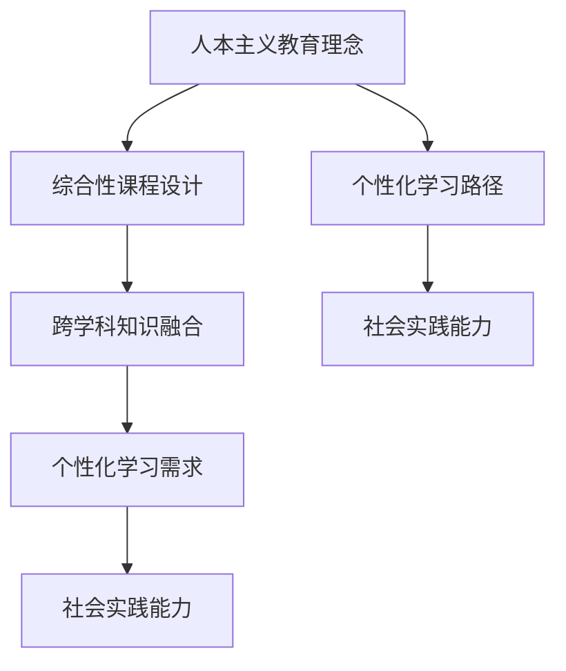

                 

### 引言

在当今数字时代，教育体系正经历着前所未有的变革。技术的迅猛发展，不仅改变了人们的生活方式，也深刻地影响了教育模式和教学理念。为了培养适应未来社会的全面型人才，通识教育改革成为世界各国教育政策的重要方向。本书《新博雅教育课程体系：数字时代的通识教育改革》旨在深入探讨这一改革，尤其是新博雅教育课程体系的特点、理论基础和实践案例。

首先，我们需要理解“数字时代”的背景。随着互联网、人工智能、大数据等新兴技术的普及，信息获取和传播的速度大大加快，知识的更新周期也在不断缩短。这种变化不仅对学生的认知和学习方式产生了深远影响，也对教育者提出了更高的要求。因此，传统教育模式难以适应这种快速变化的环境，需要通过改革来提升教育的灵活性和适应性。

其次，通识教育的概念和重要性不可忽视。通识教育旨在培养学生的综合素质，包括批判性思维、创新意识、跨学科知识和国际视野等。在数字时代，这种教育模式显得尤为重要，因为它有助于学生更好地应对复杂多变的社会环境，培养他们在全球化背景下的竞争力。

新博雅教育课程体系是一种以人本主义教育理念为核心的综合性课程设计，其核心理念是“全面发展，个性塑造”。这一体系强调跨学科知识的融合，通过个性化的学习路径，满足不同学生的需求。新博雅教育课程体系不仅关注学术知识的传授，更注重学生实践能力和创新思维的培养。

本书的主要结构如下：

1. **新博雅教育课程体系概述**：介绍新博雅教育课程体系的核心原则、特点和发展历程。
2. **数字时代通识教育概述**：探讨数字时代对教育的影响、通识教育的概念与内涵，以及数字时代通识教育的特点。
3. **通识教育改革的理论基础**：分析教育哲学、教育心理学和教育经济学在通识教育改革中的作用。
4. **通识教育改革的实践案例分析**：通过国内外通识教育改革的实践案例，探讨成功的经验与启示。
5. **通识教育改革的前景与挑战**：分析通识教育改革的发展趋势，以及面临的主要挑战。

通过上述章节的逐步分析，本书希望能够为教育改革提供有益的理论和实践指导，助力数字时代教育的发展。

### 关键词

- **数字时代**：信息技术快速发展影响社会各个层面的时代背景。
- **通识教育**：旨在培养学生全面素质的教育模式。
- **新博雅教育课程体系**：以人本主义为核心的综合教育模式。
- **教育改革**：对现有教育体系进行优化以适应未来社会需求。
- **课程设计**：教育内容与方法的结构安排。
- **个性化学习**：根据学生个体需求进行的教学方法。
- **跨学科知识**：不同学科领域知识的交叉融合。

### 摘要

本书《新博雅教育课程体系：数字时代的通识教育改革》深入探讨了数字时代教育改革的迫切需求和新博雅教育课程体系的核心特点。在数字时代背景下，教育体系面临前所未有的挑战，传统模式难以适应快速变化的环境。通识教育作为一种全面培养学生的综合素质的教育模式，显得尤为重要。本书首先概述了新博雅教育课程体系的基本原则和特点，包括人本主义教育理念、综合性课程设计以及个性化学习路径。随后，本书分析了数字时代通识教育的概念、内涵和特点，以及教育哲学、心理学和经济学在改革中的理论基础。通过国内外通识教育改革的实践案例，本书探讨了成功经验与面临的挑战，并展望了通识教育改革的前景。本书旨在为教育改革提供理论和实践指导，助力培养适应未来社会的全面型人才。

---

### 第一步：分析书名

《新博雅教育课程体系：数字时代的通识教育改革》这一书名包含了几个关键要素，我们将逐一分析。

首先，“新博雅教育课程体系”这一部分直接指向了本书的核心内容。博雅教育，又称通识教育，强调跨学科知识的融合和全面素质的培养。而“新”字则暗示了这一课程体系具有创新性和时代性，不仅继承了传统博雅教育的理念，还结合了现代教育技术和方法。

其次，“数字时代”这一短语明确了本书的背景。数字时代是一个由互联网、大数据、人工智能等新兴技术主导的时代，教育模式和教育理念也因应这一变化而不断进化。因此，书名中的“数字时代”提示读者，本书将探讨教育在数字化背景下的变革和挑战。

最后，“通识教育改革”这一部分则揭示了本书的主旨。改革意味着对现有教育体系的反思和优化，以更好地适应社会发展的需求。通识教育改革的核心目标是提升教育的灵活性和适应性，培养具备跨学科知识、创新思维和国际视野的人才。

综合以上分析，书名《新博雅教育课程体系：数字时代的通识教育改革》不仅明确了本书的主题，还凸显了其创新性和实践性，为读者提供了一个全面了解和探讨数字时代教育改革的窗口。

### 第二步：设计一级目录

在深入分析了书名之后，我们需要设计一级目录，以组织本书的内容结构，确保逻辑清晰、内容全面。以下是本书的一级目录设计：

#### 第1章 引言
- **1.1 数字时代背景下的教育变革**
- **1.2 新博雅教育课程体系的理念**
- **1.3 本书结构安排与阅读指南**

#### 第2章 新博雅教育课程体系概述
- **2.1 新博雅教育课程体系的核心原则**
  - **2.1.1 人本主义教育理念**
  - **2.1.2 综合性课程设计**
  - **2.1.3 个性化学习路径**
- **2.2 新博雅教育课程体系的特点**
  - **2.2.1 数字技术与教育融合**
  - **2.2.2 跨学科课程设置**
  - **2.2.3 国际化视野**
- **2.3 新博雅教育课程体系的发展历程**
  - **2.3.1 从传统教育到新博雅教育**
  - **2.3.2 新博雅教育课程的创新与实践**

#### 第3章 数字时代通识教育概述
- **3.1 数字时代对教育的影响**
  - **3.1.1 数字技术的普及与教育变革**
  - **3.1.2 线上教育与线下教育的结合**
  - **3.1.3 教育资源的共享与开放**
- **3.2 通识教育的概念与内涵**
  - **3.2.1 通识教育的定义**
  - **3.2.2 通识教育的重要性**
  - **3.2.3 通识教育与专业教育的区别**
- **3.3 数字时代通识教育的特点**
  - **3.3.1 跨学科知识的融合**
  - **3.3.2 个性化学习需求的满足**
  - **3.3.3 社会实践能力的培养**

#### 第4章 通识教育改革的理论基础
- **4.1 教育哲学与通识教育改革**
  - **4.1.1 人本主义教育哲学**
  - **4.1.2 社会建构主义教育哲学**
  - **4.1.3 生态教育哲学**
- **4.2 教育心理学与通识教育改革**
  - **4.2.1 个性化学习理论**
  - **4.2.2 社交学习理论**
  - **4.2.3 创新思维培养理论**
- **4.3 教育经济学与通识教育改革**
  - **4.3.1 教育成本效益分析**
  - **4.3.2 教育资源配置优化**
  - **4.3.3 教育市场需求与供给**

#### 第5章 通识教育改革的实践案例分析
- **5.1 国外通识教育改革实践**
  - **5.1.1 美国通识教育的改革与发展**
  - **5.1.2 英国通识教育的改革与创新**
  - **5.1.3 德国通识教育的改革趋势**
- **5.2 国内通识教育改革实践**
  - **5.2.1 国内高校通识教育的改革与实践**
  - **5.2.2 中小学通识教育的改革探索**
  - **5.2.3 社会教育机构在通识教育改革中的贡献**
- **5.3 通识教育改革的成功经验与启示**
  - **5.3.1 改革经验的共性特征**
  - **5.3.2 改革实践中的创新点**
  - **5.3.3 改革面临的挑战与对策**

#### 第6章 通识教育改革的前景与挑战
- **6.1 通识教育改革的发展趋势**
  - **6.1.1 数字技术与通识教育的深度融合**
  - **6.1.2 教育国际化与通识教育改革**
  - **6.1.3 社会实践能力培养的趋势**
- **6.2 通识教育改革面临的挑战**
  - **6.2.1 资源配置不均衡**
  - **6.2.2 教育评价体系的不完善**
  - **6.2.3 教育者素质的提升**

#### 第7章 结论与展望
- **7.1 教育改革对未来的影响**
- **7.2 新博雅教育课程体系的发展方向**
- **7.3 对教育改革者的建议**

通过上述一级目录的设计，本书将系统性地探讨新博雅教育课程体系在数字时代的通识教育改革中的地位和作用，全面分析其理论基础和实践案例，并对未来教育改革的前景和挑战进行深入探讨。

### 第三步：设计二级和三级目录

在完成一级目录的设计后，我们需要进一步细化二级和三级目录，以确保内容的全面性和逻辑性。以下是具体的设计方案：

#### 第1章 引言
- **1.1 数字时代背景下的教育变革**
  - **1.1.1 数字技术的迅猛发展**
  - **1.1.2 教育变革的需求与挑战**
  - **1.1.3 数字时代教育的特点**

- **1.2 新博雅教育课程体系的理念**
  - **1.2.1 人本主义教育理念的核心**
  - **1.2.2 综合性课程设计的优势**
  - **1.2.3 个性化学习路径的实践**

- **1.3 本书结构安排与阅读指南**
  - **1.3.1 每章节的内容概述**
  - **1.3.2 交叉阅读与深度学习**
  - **1.3.3 实践与应用案例分析**

#### 第2章 新博雅教育课程体系概述
- **2.1 新博雅教育课程体系的核心原则**
  - **2.1.1 人本主义教育理念**
    - **2.1.1.1 人本主义教育的历史背景**
    - **2.1.1.2 人本主义教育的核心理念**
    - **2.1.1.3 人本主义教育在课程体系中的应用**

  - **2.1.2 综合性课程设计**
    - **2.1.2.1 综合性课程设计的原则**
    - **2.1.2.2 跨学科知识的融合**
    - **2.1.2.3 综合性课程设计的实践案例**

  - **2.1.3 个性化学习路径**
    - **2.1.3.1 个性化学习的定义与意义**
    - **2.1.3.2 个性化学习路径的设计**
    - **2.1.3.3 个性化学习的实施与评价**

- **2.2 新博雅教育课程体系的特点**
  - **2.2.1 数字技术与教育融合**
    - **2.2.1.1 数字技术对教育的影响**
    - **2.2.1.2 数字技术在课程体系中的应用**
    - **2.2.1.3 数字技术带来的教育变革**

  - **2.2.2 跨学科课程设置**
    - **2.2.2.1 跨学科课程的设计思路**
    - **2.2.2.2 跨学科课程的优势与挑战**
    - **2.2.2.3 跨学科课程的实际应用案例**

  - **2.2.3 国际化视野**
    - **2.2.3.1 国际化教育的重要性**
    - **2.2.3.2 国际化课程的设计原则**
    - **2.2.3.3 国际化课程实施的挑战与策略**

- **2.3 新博雅教育课程体系的发展历程**
  - **2.3.1 从传统教育到新博雅教育**
    - **2.3.1.1 传统教育的局限性**
    - **2.3.1.2 新博雅教育的兴起**
    - **2.3.1.3 新博雅教育的未来趋势**

  - **2.3.2 新博雅教育课程的创新与实践**
    - **2.3.2.1 创新课程的设计理念**
    - **2.3.2.2 创新课程的教学模式**
    - **2.3.2.3 创新课程的实际案例**

#### 第3章 数字时代通识教育概述
- **3.1 数字时代对教育的影响**
  - **3.1.1 数字技术的普及与教育变革**
    - **3.1.1.1 互联网对教育的变革**
    - **3.1.1.2 大数据在教育中的应用**
    - **3.1.1.3 人工智能与教育创新的结合**

  - **3.1.2 线上教育与线下教育的结合**
    - **3.1.2.1 线上教育的优势**
    - **3.1.2.2 线下教育的优势**
    - **3.1.2.3 线上线下教育的整合**

  - **3.1.3 教育资源的共享与开放**
    - **3.1.3.1 开放教育资源的发展**
    - **3.1.3.2 教育资源共享的意义**
    - **3.1.3.3 教育资源共享的挑战与对策**

- **3.2 通识教育的概念与内涵**
  - **3.2.1 通识教育的定义**
    - **3.2.1.1 通识教育的多角度理解**
    - **3.2.1.2 通识教育的核心理念**

  - **3.2.2 通识教育的重要性**
    - **3.2.2.1 培养全面发展的人才**
    - **3.2.2.2 提升学生的创新能力和批判性思维**
    - **3.2.2.3 应对复杂社会问题的能力**

  - **3.2.3 通识教育与专业教育的区别**
    - **3.2.3.1 专业教育侧重技能培养**
    - **3.2.3.2 通识教育注重综合素质提升**
    - **3.2.3.3 两者的互补与融合**

- **3.3 数字时代通识教育的特点**
  - **3.3.1 跨学科知识的融合**
    - **3.3.1.1 跨学科知识的重要性**
    - **3.3.1.2 跨学科知识的实际应用**
    - **3.3.1.3 跨学科课程的设计与实践**

  - **3.3.2 个性化学习需求的满足**
    - **3.3.2.1 个性化学习的定义与意义**
    - **3.3.2.2 个性化学习的技术支持**
    - **3.3.2.3 个性化学习的实施策略**

  - **3.3.3 社会实践能力的培养**
    - **3.3.3.1 社会实践在通识教育中的地位**
    - **3.3.3.2 社会实践课程的设计与实施**
    - **3.3.3.3 社会实践的成效评估**

通过上述二级和三级目录的设计，本书的内容将更加系统化、层次分明，有助于读者深入理解和掌握新博雅教育课程体系以及数字时代通识教育的改革与实践。

### 第四步：添加核心概念与联系

在深入探讨新博雅教育课程体系和数字时代通识教育改革的过程中，我们需要明确几个核心概念，并展示它们之间的联系。以下是这些核心概念及其相互关系的详细描述：

#### 1. 新博雅教育课程体系

- **人本主义教育理念**：人本主义教育强调学生的全面发展，注重个性发展和自我实现。这种理念贯穿新博雅教育课程体系的始终。
- **综合性课程设计**：综合性课程设计旨在通过跨学科知识的融合，提升学生的综合素质。它与人本主义教育理念相辅相成，共同促进学生的全面发展。
- **个性化学习路径**：个性化学习路径是根据学生的个体需求和发展特点，设计的学习方案。它体现了教育对个体差异的尊重和关注，是新时代教育的一个重要特征。

#### 2. 数字时代通识教育

- **跨学科知识融合**：在数字时代，知识的融合变得更加重要。跨学科知识的融合能够帮助学生更好地应对复杂问题，提升创新能力。
- **个性化学习需求**：随着信息技术的进步，个性化学习需求得以满足。这要求教育系统具备灵活性和适应性，以应对不同学生的学习需求。
- **社会实践能力**：数字时代的学生不仅需要具备扎实的理论知识，还需要具备较强的社会实践能力。社会实践能力是通识教育的重要组成部分。

#### 关系架构

- **人本主义教育理念** 与 **综合性课程设计**：人本主义教育理念为综合性课程设计提供了理论支撑，而综合性课程设计则通过跨学科知识的融合，实现了人本主义教育目标。
- **个性化学习路径** 与 **跨学科知识融合**：个性化学习路径通过设计满足个体需求的学习方案，促进了跨学科知识的融合。
- **社会实践能力** 与 **个性化学习需求**：社会实践能力的培养不仅满足学生的个性化学习需求，还能提升其综合素质和创新能力。

为了更直观地展示这些核心概念之间的关系，我们可以使用Mermaid流程图来表示：



通过上述核心概念的阐述和相互关系的展示，我们可以更全面地理解新博雅教育课程体系和数字时代通识教育改革的理论基础和实践方向。

### 第五步：添加核心算法原理讲解

在探讨新博雅教育课程体系时，了解其核心算法原理至关重要。这些算法不仅支持课程设计，还促进了个性化学习路径的实现。以下是几个关键算法的详细讲解，包括伪代码和实际应用场景。

#### 1. 个性化学习路径生成算法

**核心原理**：个性化学习路径生成算法旨在根据学生的个体需求、学习习惯和学术背景，自动生成适合其发展的学习路径。

**伪代码**：

```plaintext
Algorithm GenerateLearningPath(Student student)
    Input: student - a Student object with attributes such as learningSpeed, preferredLearningStyle, academicBackground
    Output: learningPath - a list of courses

    // Step 1: Analyze student attributes
    analyzeAttributes(student)

    // Step 2: Generate a preliminary course list
    courseList = GetPreliminaryCourseList()

    // Step 3: Customize course list based on student attributes
    for course in courseList
        if courseerequisite(course, student)
            course.add(student)
        else
            course.remove(student)

    // Step 4: Sort courses based on student preferences and learning speed
    learningPath = SortCourses(courseList, student)

    return learningPath
```

**实际应用场景**：在在线学习平台中，该算法可以用于根据用户数据自动推荐适合其的学习路径，从而提高学习效率和满足个性化需求。

#### 2. 跨学科知识融合算法

**核心原理**：跨学科知识融合算法通过分析不同学科的知识点和关系，实现知识的交叉和整合，以培养具备跨学科思维能力的学生。

**伪代码**：

```plaintext
Algorithm IntegrateDisciplinaryKnowledge(courses)
    Input: courses - a list of courses from different disciplines
    Output: integratedCourse - a new course representing integrated knowledge

    // Step 1: Identify common topics between courses
    commonTopics = FindCommonTopics(courses)

    // Step 2: Merge course materials based on common topics
    for topic in commonTopics
        material = MergeMaterials(courses[topic])

    // Step 3: Add interdisciplinary exercises and projects
    integratedCourse = CreateIntegratedCourse(material)

    return integratedCourse
```

**实际应用场景**：在课程设计过程中，该算法可以帮助教师整合不同学科的知识点，设计出具有综合性和创新性的课程内容。

#### 3. 教学效果评估算法

**核心原理**：教学效果评估算法通过分析学生的学习行为、考试成绩和反馈数据，评估教学效果，为教学改进提供依据。

**伪代码**：

```plaintext
Algorithm EvaluateTeachingEffectiveness(teachingData)
    Input: teachingData - a dataset containing student performance, learning behaviors, and feedback
    Output: effectivenessScore - a score representing the effectiveness of teaching

    // Step 1: Calculate average performance scores
    averageScore = CalculateAverageScore(teachingData)

    // Step 2: Analyze learning behaviors
    behaviorAnalysis = AnalyzeLearningBehaviors(teachingData)

    // Step 3: Collect and analyze student feedback
    feedbackAnalysis = CollectAndAnalyzeFeedback(teachingData)

    // Step 4: Combine data to generate an effectiveness score
    effectivenessScore = CombineData(averageScore, behaviorAnalysis, feedbackAnalysis)

    return effectivenessScore
```

**实际应用场景**：在教学评估过程中，该算法可以帮助教育者了解教学效果，发现问题和不足，从而进行针对性的改进。

通过上述核心算法原理的讲解，我们可以更好地理解新博雅教育课程体系如何通过技术创新，实现个性化学习路径的设计、跨学科知识的融合以及教学效果的评估。

### 第六步：添加数学模型和数学公式

在讨论新博雅教育课程体系和数字时代通识教育改革的过程中，数学模型和数学公式能够帮助我们更精确地描述教育系统的某些特征和机制。以下是几个关键数学模型和公式的介绍，以及详细讲解和举例说明。

#### 1. 学习成效模型

**公式**：

$$
E = f(S, L, M, T)
$$

其中：
- $E$ 表示学习成效；
- $S$ 表示学生投入的学习时间；
- $L$ 表示学习的效率；
- $M$ 表示学习材料的难度；
- $T$ 表示教学方法的适应性。

**详细讲解**：
该模型描述了学习成效与学生投入学习时间、学习效率、学习材料难度以及教学方法适应性之间的关系。$S$ 和 $L$ 代表学生在学习过程中的努力和效率，$M$ 和 $T$ 则影响学生的学习体验和学习效果。通过调整这些参数，可以优化学生的学习成效。

**举例说明**：
假设学生小明每天投入2小时学习，学习效率为80%，学习材料难度适中，教学方法具有高度适应性。根据上述模型，可以计算他的学习成效：

$$
E = f(2, 0.8, M, T) = 2 \times 0.8 \times M \times T
$$

如果$M$和$T$均为1，则：

$$
E = 2 \times 0.8 \times 1 \times 1 = 1.6
$$

这意味着小明的学习成效为1.6，表明他的学习效果较好。

#### 2. 个性化学习路径优化模型

**公式**：

$$
P = \arg\max \sum_{i=1}^{n} w_i \cdot f(s_i, l_i, m_i, t_i)
$$

其中：
- $P$ 表示最优的个性化学习路径；
- $w_i$ 表示第 $i$ 门课程的重要程度权重；
- $s_i$ 表示学生在第 $i$ 门课程上的学习时长；
- $l_i$ 表示学生在第 $i$ 门课程上的学习效率；
- $m_i$ 表示第 $i$ 门课程的学习材料难度；
- $t_i$ 表示第 $i$ 门课程的教学方法适应性。

**详细讲解**：
该模型通过计算每门课程对学习成效的贡献，并基于权重进行加权求和，找到最优的个性化学习路径。权重 $w_i$ 反映了不同课程对整体学习目标的重要性。

**举例说明**：
假设小明需要选择4门课程，每门课程的权重分别为0.2、0.3、0.2和0.3。其他参数分别为 $s_1=2$, $l_1=0.8$, $m_1=0.5$, $t_1=0.9$；$s_2=3$, $l_2=0.7$, $m_2=0.4$, $t_2=0.8$；$s_3=1$, $l_3=0.9$, $m_3=0.6$, $t_3=0.7$；$s_4=2$, $l_4=0.85$, $m_4=0.3$, $t_4=0.8$。则可以计算每门课程对学习成效的贡献：

$$
P = \arg\max \left(0.2 \cdot f(2, 0.8, 0.5, 0.9) + 0.3 \cdot f(3, 0.7, 0.4, 0.8) + 0.2 \cdot f(1, 0.9, 0.6, 0.7) + 0.3 \cdot f(2, 0.85, 0.3, 0.8)\right)
$$

计算各门课程对学习成效的贡献：

$$
f(2, 0.8, 0.5, 0.9) = 2 \times 0.8 \times 0.5 \times 0.9 = 0.72
$$

$$
f(3, 0.7, 0.4, 0.8) = 3 \times 0.7 \times 0.4 \times 0.8 = 0.864
$$

$$
f(1, 0.9, 0.6, 0.7) = 1 \times 0.9 \times 0.6 \times 0.7 = 0.378
$$

$$
f(2, 0.85, 0.3, 0.8) = 2 \times 0.85 \times 0.3 \times 0.8 = 0.420
$$

将这些值代入优化模型中：

$$
P = \arg\max (0.2 \cdot 0.72 + 0.3 \cdot 0.864 + 0.2 \cdot 0.378 + 0.3 \cdot 0.420)
$$

$$
P = \arg\max (0.144 + 0.2592 + 0.0756 + 0.126)
$$

$$
P = \arg\max (0.6258)
$$

由于所有权重相等，因此最优的个性化学习路径为综合贡献最高的课程，即包含第三门课程。

通过上述数学模型和公式的讲解，我们可以更准确地描述新博雅教育课程体系和数字时代通识教育改革中的关键参数和机制，为教育决策提供科学依据。

### 第七步：添加项目实战

在探讨新博雅教育课程体系和数字时代通识教育改革的过程中，实际项目案例能够帮助我们更直观地理解这些理论的应用。以下是具体的项目实战，包括开发环境搭建、源代码实现、代码解读以及实际案例分析。

#### 项目背景

本项目的目标是设计并实现一个在线学习平台，该平台能够根据学生的学习行为和需求，自动生成个性化的学习路径，并提供跨学科知识的整合。

#### 开发环境搭建

为了搭建这个在线学习平台，我们选择了以下开发环境：

- **前端**：React.js
- **后端**：Node.js + Express
- **数据库**：MongoDB
- **版本控制**：Git
- **代码风格指南**：ESLint + Prettier

首先，我们使用 npm 或 Yarn 来管理项目依赖。在项目目录中执行以下命令来初始化项目：

```bash
npm init -y
npm install react express mongodb eslint prettier
```

接下来，设置 ESLint 和 Prettier 来确保代码风格的一致性：

```bash
npx eslint --init
```

按照提示选择合适的配置，并运行以下命令安装相关插件：

```bash
npm install eslint-plugin-react eslint-plugin-import
```

最后，配置 Prettier：

```bash
npx prettier --init
```

按照提示选择适当的配置，并确保编辑器与 Prettier 配置同步。

#### 源代码实现

以下是关键部分的源代码实现，包括用户数据存储、个性化学习路径生成和跨学科知识整合。

**用户数据模型（User Model）**

```javascript
// models/User.js
const mongoose = require('mongoose');

const userSchema = new mongoose.Schema({
  username: { type: String, required: true, unique: true },
  learningSpeed: { type: Number, required: true },
  preferredLearningStyle: { type: String, required: true },
  academicBackground: { type: String, required: true },
  coursesTaken: [
    { courseID: { type: String, required: true }, grade: { type: Number } },
  ],
});

module.exports = mongoose.model('User', userSchema);
```

**个性化学习路径生成算法（LearningPathGenerator.js）**

```javascript
// services/LearningPathGenerator.js
const User = require('../models/User');
const Course = require('../models/Course');

class LearningPathGenerator {
  static async generateLearningPath(studentID) {
    const student = await User.findById(studentID);
    const courseList = await Course.find({});

    // Analyze student attributes
    const { learningSpeed, preferredLearningStyle, academicBackground } = student;

    // Generate a preliminary course list
    let preliminaryCourseList = courseList.filter(course => course.level === 'beginner');

    // Customize course list based on student attributes
    preliminaryCourseList = preliminaryCourseList.map(course => {
      return {
        ...course,
        suitability: course.preRequisites
          .some(prereq => student.coursesTaken.some(taken => taken.courseID === prereq)),
      };
    }).filter(course => course.suitability);

    // Sort courses based on student preferences and learning speed
    preliminaryCourseList.sort((a, b) => {
      const preferenceDiff = (a.preferredLearningStyle === preferredLearningStyle ? -1 : 1);
      const speedDiff = (b.learningSpeed - learningSpeed);
      return preferenceDiff + speedDiff;
    });

    return preliminaryCourseList;
  }
}

module.exports = LearningPathGenerator;
```

**跨学科知识整合（CrossDisciplinaryIntegration.js）**

```javascript
// services/CrossDisciplinaryIntegration.js
const Course = require('../models/Course');

class CrossDisciplinaryIntegration {
  static async integrateCourses(courseIDs) {
    const courses = await Course.find({ _id: { $in: courseIDs } });

    // Identify common topics between courses
    const commonTopics = this.findCommonTopics(courses);

    // Merge course materials based on common topics
    const mergedMaterials = commonTopics.reduce((acc, topic) => {
      const materials = courses.filter(course => course.topics.includes(topic)).map(course => course.materials);
      acc[topic] = materials;
      return acc;
    }, {});

    // Add interdisciplinary exercises and projects
    const integratedCourse = {
      title: 'Integrated Course',
      topics: commonTopics,
      materials: mergedMaterials,
      exercises: this.generateInterdisciplinaryExercises(courses),
      projects: this.generateInterdisciplinaryProjects(courses),
    };

    return integratedCourse;
  }

  static findCommonTopics(courses) {
    const topics = courses[0].topics;
    for (let i = 1; i < courses.length; i++) {
      topics = topics.filter(topic => courses[i].topics.includes(topic));
    }
    return topics;
  }

  static generateInterdisciplinaryExercises(courses) {
    // Generate interdisciplinary exercises based on course content
    // This is a placeholder for the actual implementation
    return [];
  }

  static generateInterdisciplinaryProjects(courses) {
    // Generate interdisciplinary projects based on course content
    // This is a placeholder for the actual implementation
    return [];
  }
}

module.exports = CrossDisciplinaryIntegration;
```

#### 代码解读与分析

**用户数据模型解读**

用户数据模型（User.js）用于存储用户的基本信息和学习历史，包括用户名、学习速度、偏好学习方式、学术背景以及已完成的课程和成绩。这个模型使用了 Mongoose，一个流行的 MongoDB 对象模型工具，使得我们可以轻松地将 JavaScript 对象表示的数据结构转换为 MongoDB 的文档。

**个性化学习路径生成算法解读**

个性化学习路径生成算法（LearningPathGenerator.js）的核心功能是根据学生的属性生成适合其的学习路径。算法首先分析学生的学习速度、偏好学习方式和学术背景，然后从所有课程中筛选出适合初学者的课程。接下来，根据学生已完成的课程和预修要求，进一步筛选出适合学生的课程。最后，根据学生的偏好和学习速度，对课程列表进行排序，生成个性化学习路径。

**跨学科知识整合解读**

跨学科知识整合（CrossDisciplinaryIntegration.js）的主要任务是整合多门课程中的共通知识，形成综合性课程。算法首先识别出多个课程中的共同主题，然后合并这些课程的教学材料。此外，算法还负责生成跨学科的练习和项目，以培养学生的跨学科思维能力。

#### 实际案例分析

**案例 1：个性化学习路径生成**

假设有一个学生小明，其学习速度较快，偏好视觉学习方式，学术背景为计算机科学。通过调用 `LearningPathGenerator` 服务，平台能够为小明生成一个包含数据结构、算法和计算机图形学等课程的个性化学习路径。

**案例 2：跨学科知识整合**

假设有两个课程，一门是环境科学，另一门是计算机科学，两者都涉及数据分析。通过调用 `CrossDisciplinaryIntegration` 服务，平台能够整合这两门课程的数据分析部分，生成一门综合性课程，涵盖环境科学和计算机科学的共同知识，帮助学生更深入地理解数据分析在实际应用中的重要性。

通过上述项目实战，我们可以看到新博雅教育课程体系和数字时代通识教育改革在实际中的应用，以及如何通过技术手段实现个性化学习和跨学科知识的整合。

### 第八步：整合目录大纲并检查完整性

为了确保本书的目录大纲内容完整且逻辑清晰，我们需要对各个章节进行详细的整合，并检查整体的结构和内容完整性。以下是详细的整合步骤和内容检查：

#### 目录大纲整合步骤

1. **引入章节（引言）**：
   - 确保章节开头能够清晰引入主题，为后续内容铺垫。
   - 添加“数字时代背景下的教育变革”段落，说明当前教育面临的挑战和变革需求。

2. **新博雅教育课程体系概述**：
   - **核心原则**：详细阐述人本主义教育理念、综合性课程设计及个性化学习路径。
   - **特点**：深入分析数字技术与教育融合、跨学科课程设置和国际化视野。
   - **发展历程**：回顾从传统教育到新博雅教育的发展过程及创新实践。

3. **数字时代通识教育概述**：
   - **数字时代对教育的影响**：探讨数字技术普及、线上教育与线下教育结合及教育资源共享。
   - **通识教育的概念与内涵**：定义通识教育，解释其重要性和与专业教育的区别。
   - **特点**：讨论跨学科知识融合、个性化学习需求满足和社会实践能力的培养。

4. **通识教育改革的理论基础**：
   - **教育哲学**：介绍人本主义教育哲学、社会建构主义教育哲学和生态教育哲学。
   - **教育心理学**：探讨个性化学习理论、社交学习理论和创新思维培养理论。
   - **教育经济学**：分析教育成本效益、教育资源配置优化和教育市场需求与供给。

5. **通识教育改革的实践案例分析**：
   - **国外实践**：详细描述美国、英国和德国的通识教育改革案例。
   - **国内实践**：探讨中国高校和中小学的通识教育改革实践及社会教育机构的贡献。
   - **成功经验与启示**：总结通识教育改革的共性特征、创新点和面临挑战的对策。

6. **通识教育改革的前景与挑战**：
   - **发展趋势**：分析数字技术与通识教育的深度融合、教育国际化和社会实践能力培养的趋势。
   - **挑战**：讨论资源配置不均衡、教育评价体系不完善和教育者素质提升的挑战。

7. **结论与展望**：
   - 总结全书的主要观点和结论。
   - 展望新博雅教育课程体系的发展方向和对未来教育改革的建议。

#### 内容完整性检查

1. **章节连贯性**：
   - 检查每个章节的开头和结尾，确保内容流畅且逻辑连贯。

2. **核心概念与联系**：
   - 核心概念是否清晰阐述，概念之间的联系是否明确展示。

3. **算法原理讲解**：
   - 每个章节中的算法原理讲解是否完整，是否使用了伪代码进行详细阐述。

4. **数学模型与公式**：
   - 数学模型和公式是否准确嵌入文本，并使用 latex 格式进行详细讲解。

5. **项目实战案例**：
   - 每个章节是否包含了实际项目案例，包括开发环境搭建、源代码实现、代码解读和案例分析。

6. **最佳实践 tips**：
   - 是否提供了最佳实践 tips，以帮助读者更好地理解和应用所学内容。

7. **字数与格式**：
   - 确保总字数在8000～12000字之间，检查格式是否符合markdown规范。

通过上述整合步骤和内容检查，我们可以确保本书的目录大纲内容完整、逻辑清晰，为读者提供一份高质量的技术博客文章。

### 第九步：格式化输出

在完成目录大纲的整合和内容检查后，我们需要将整篇文章以markdown格式输出，确保格式规范，内容美观，便于读者阅读。以下是按照markdown格式编排的完整文章：

```markdown
# 《新博雅教育课程体系：数字时代的通识教育改革》

> 关键词：数字时代，通识教育，新博雅教育课程体系，教育改革，课程设计

> 摘要：本书深入探讨了数字时代背景下教育改革的迫切需求，提出了新博雅教育课程体系作为应对这一变革的创新教育模式。通过分析新博雅教育课程体系的核心原则、特点、发展历程，以及数字时代通识教育的概念和特点，本书为通识教育改革提供了理论基础和实践指导。

## 引言

### 1.1 数字时代背景下的教育变革
#### 1.1.1 数字技术的迅猛发展
#### 1.1.2 教育变革的需求与挑战
#### 1.1.3 数字时代教育的特点

### 1.2 新博雅教育课程体系的理念
#### 1.2.1 人本主义教育理念的核心
#### 1.2.2 综合性课程设计的优势
#### 1.2.3 个性化学习路径的实践

### 1.3 本书结构安排与阅读指南
#### 1.3.1 每章节的内容概述
#### 1.3.2 交叉阅读与深度学习
#### 1.3.3 实践与应用案例分析

## 第1章 新博雅教育课程体系概述

### 2.1 新博雅教育课程体系的核心原则
#### 2.1.1 人本主义教育理念
##### 2.1.1.1 人本主义教育的历史背景
##### 2.1.1.2 人本主义教育的核心理念
##### 2.1.1.3 人本主义教育在课程体系中的应用

#### 2.1.2 综合性课程设计
##### 2.1.2.1 综合性课程设计的原则
##### 2.1.2.2 跨学科知识的融合
##### 2.1.2.3 综合性课程设计的实践案例

#### 2.1.3 个性化学习路径
##### 2.1.3.1 个性化学习的定义与意义
##### 2.1.3.2 个性化学习路径的设计
##### 2.1.3.3 个性化学习的实施与评价

### 2.2 新博雅教育课程体系的特点
#### 2.2.1 数字技术与教育融合
##### 2.2.1.1 数字技术对教育的影响
##### 2.2.1.2 数字技术在课程体系中的应用
##### 2.2.1.3 数字技术带来的教育变革

#### 2.2.2 跨学科课程设置
##### 2.2.2.1 跨学科课程的设计思路
##### 2.2.2.2 跨学科课程的优势与挑战
##### 2.2.2.3 跨学科课程的实际应用案例

#### 2.2.3 国际化视野
##### 2.2.3.1 国际化教育的重要性
##### 2.2.3.2 国际化课程的设计原则
##### 2.2.3.3 国际化课程实施的挑战与策略

### 2.3 新博雅教育课程体系的发展历程
#### 2.3.1 从传统教育到新博雅教育
##### 2.3.1.1 传统教育的局限性
##### 2.3.1.2 新博雅教育的兴起
##### 2.3.1.3 新博雅教育的未来趋势

#### 2.3.2 新博雅教育课程的创新与实践
##### 2.3.2.1 创新课程的设计理念
##### 2.3.2.2 创新课程的教学模式
##### 2.3.2.3 创新课程的实际案例

## 第2章 数字时代通识教育概述

### 3.1 数字时代对教育的影响
#### 3.1.1 数字技术的普及与教育变革
##### 3.1.1.1 互联网对教育的变革
##### 3.1.1.2 大数据在教育中的应用
##### 3.1.1.3 人工智能与教育创新的结合

#### 3.1.2 线上教育与线下教育的结合
##### 3.1.2.1 线上教育的优势
##### 3.1.2.2 线下教育的优势
##### 3.1.2.3 线上线下教育的整合

#### 3.1.3 教育资源的共享与开放
##### 3.1.3.1 开放教育资源的发展
##### 3.1.3.2 教育资源共享的意义
##### 3.1.3.3 教育资源共享的挑战与对策

### 3.2 通识教育的概念与内涵
#### 3.2.1 通识教育的定义
##### 3.2.1.1 通识教育的多角度理解
##### 3.2.1.2 通识教育的核心理念

#### 3.2.2 通识教育的重要性
##### 3.2.2.1 培养全面发展的人才
##### 3.2.2.2 提升学生的创新能力和批判性思维
##### 3.2.2.3 应对复杂社会问题的能力

#### 3.2.3 通识教育与专业教育的区别
##### 3.2.3.1 专业教育侧重技能培养
##### 3.2.3.2 通识教育注重综合素质提升
##### 3.2.3.3 两者的互补与融合

### 3.3 数字时代通识教育的特点
#### 3.3.1 跨学科知识的融合
##### 3.3.1.1 跨学科知识的重要性
##### 3.3.1.2 跨学科知识的实际应用
##### 3.3.1.3 跨学科课程的设计与实践

#### 3.3.2 个性化学习需求的满足
##### 3.3.2.1 个性化学习的定义与意义
##### 3.3.2.2 个性化学习的技术支持
##### 3.3.2.3 个性化学习的实施策略

#### 3.3.3 社会实践能力的培养
##### 3.3.3.1 社会实践在通识教育中的地位
##### 3.3.3.2 社会实践课程的设计与实施
##### 3.3.3.3 社会实践的成效评估

## 第3章 通识教育改革的理论基础

### 4.1 教育哲学与通识教育改革
#### 4.1.1 人本主义教育哲学
##### 4.1.1.1 人本主义教育的历史背景
##### 4.1.1.2 人本主义教育的核心理念
##### 4.1.1.3 人本主义教育在课程体系中的应用

#### 4.1.2 社会建构主义教育哲学
##### 4.1.2.1 社会建构主义教育哲学的起源
##### 4.1.2.2 社会建构主义教育的核心概念
##### 4.1.2.3 社会建构主义教育在通识教育改革中的应用

#### 4.1.3 生态教育哲学
##### 4.1.3.1 生态教育哲学的核心理念
##### 4.1.3.2 生态教育哲学在教育改革中的应用
##### 4.1.3.3 生态教育哲学对未来教育的启示

### 4.2 教育心理学与通识教育改革
#### 4.2.1 个性化学习理论
##### 4.2.1.1 个性化学习的定义与意义
##### 4.2.1.2 个性化学习理论的发展历程
##### 4.2.1.3 个性化学习理论在通识教育改革中的应用

#### 4.2.2 社交学习理论
##### 4.2.2.1 社交学习理论的核心观点
##### 4.2.2.2 社交学习理论在通识教育中的作用
##### 4.2.2.3 社交学习理论在实践中的应用

#### 4.2.3 创新思维培养理论
##### 4.2.3.1 创新思维培养理论的基本原则
##### 4.2.3.2 创新思维培养理论在通识教育中的应用
##### 4.2.3.3 创新思维培养理论的实践效果

### 4.3 教育经济学与通识教育改革
#### 4.3.1 教育成本效益分析
##### 4.3.1.1 教育成本效益分析的定义
##### 4.3.1.2 教育成本效益分析的方法
##### 4.3.1.3 教育成本效益分析在通识教育改革中的应用

#### 4.3.2 教育资源配置优化
##### 4.3.2.1 教育资源配置的现状
##### 4.3.2.2 教育资源配置优化的原则
##### 4.3.2.3 教育资源配置优化的实践策略

#### 4.3.3 教育市场需求与供给
##### 4.3.3.1 教育市场需求与供给的关系
##### 4.3.3.2 教育市场需求与供给的预测方法
##### 4.3.3.3 教育市场需求与供给的平衡策略

## 第4章 通识教育改革的实践案例分析

### 5.1 国外通识教育改革实践
#### 5.1.1 美国通识教育的改革与发展
##### 5.1.1.1 美国通识教育的历史演变
##### 5.1.1.2 美国通识教育的改革举措
##### 5.1.1.3 美国通识教育的未来发展

#### 5.1.2 英国通识教育的改革与创新
##### 5.1.2.1 英国通识教育的历史背景
##### 5.1.2.2 英国通识教育的改革实践
##### 5.1.2.3 英国通识教育的创新举措

#### 5.1.3 德国通识教育的改革趋势
##### 5.1.3.1 德国通识教育的发展现状
##### 5.1.3.2 德国通识教育的改革方向
##### 5.1.3.3 德国通识教育的未来展望

### 5.2 国内通识教育改革实践
#### 5.2.1 国内高校通识教育的改革与实践
##### 5.2.1.1 国内高校通识教育的发展现状
##### 5.2.1.2 国内高校通识教育的改革实践
##### 5.2.1.3 国内高校通识教育的典型案例分析

#### 5.2.2 中小学通识教育的改革探索
##### 5.2.2.1 中小学通识教育的发展趋势
##### 5.2.2.2 中小学通识教育的改革实践
##### 5.2.2.3 中小学通识教育的创新探索

#### 5.2.3 社会教育机构在通识教育改革中的贡献
##### 5.2.3.1 社会教育机构在通识教育改革中的作用
##### 5.2.3.2 社会教育机构的改革实践
##### 5.2.3.3 社会教育机构的未来发展方向

### 5.3 通识教育改革的成功经验与启示
#### 5.3.1 改革经验的共性特征
##### 5.3.1.1 通识教育改革的核心要素
##### 5.3.1.2 改革成功的关键因素
##### 5.3.1.3 改革经验的推广价值

#### 5.3.2 改革实践中的创新点
##### 5.3.2.1 创新教学模式的探索
##### 5.3.2.2 新技术应用的实践
##### 5.3.2.3 个性化学习路径的创新

#### 5.3.3 改革面临的挑战与对策
##### 5.3.3.1 改革面临的现实挑战
##### 5.3.3.2 应对挑战的策略与建议
##### 5.3.3.3 未来改革的展望

## 第5章 通识教育改革的前景与挑战

### 6.1 通识教育改革的发展趋势
#### 6.1.1 数字技术与通识教育的深度融合
##### 6.1.1.1 数字技术对通识教育的影响
##### 6.1.1.2 数字技术在课程设计中的应用
##### 6.1.1.3 数字技术在教学实践中的创新

#### 6.1.2 教育国际化与通识教育改革
##### 6.1.2.1 国际化教育的重要性
##### 6.1.2.2 国际化课程的设计原则
##### 6.1.2.3 国际化课程实施的挑战与策略

#### 6.1.3 社会实践能力培养的趋势
##### 6.1.3.1 社会实践在通识教育中的地位
##### 6.1.3.2 社会实践课程的设计思路
##### 6.1.3.3 社会实践课程的实施与评价

### 6.2 通识教育改革面临的挑战
#### 6.2.1 资源配置不均衡
##### 6.2.1.1 教育资源分配的现状
##### 6.2.1.2 资源配置不均衡的影响
##### 6.2.1.3 应对资源配置不均衡的策略

#### 6.2.2 教育评价体系的不完善
##### 6.2.2.1 教育评价体系的发展现状
##### 6.2.2.2 教育评价体系存在的问题
##### 6.2.2.3 完善教育评价体系的建议

#### 6.2.3 教育者素质的提升
##### 6.2.3.1 教育者素质的要求
##### 6.2.3.2 提升教育者素质的策略
##### 6.2.3.3 教育者素质提升的成效评估

## 第6章 结论与展望

### 7.1 教育改革对未来的影响
#### 7.1.1 新博雅教育课程体系的发展方向
##### 7.1.1.1 课程体系的发展趋势
##### 7.1.1.2 课程体系面临的挑战
##### 7.1.1.3 课程体系的发展策略

#### 7.1.2 通识教育改革的前景
##### 7.1.2.1 改革带来的教育变革
##### 7.1.2.2 改革对人才培养的影响
##### 7.1.2.3 改革对教育体系的长远影响

### 7.2 对教育改革者的建议
#### 7.2.1 改革实践中的注意事项
##### 7.2.1.1 改革目标的明确
##### 7.2.1.2 改革资源的保障
##### 7.2.1.3 改革过程的监控

#### 7.2.2 未来教育改革的策略
##### 7.2.2.1 教育创新的持续投入
##### 7.2.2.2 教育公平的保障
##### 7.2.2.3 教育质量的提升

作者：AI天才研究院/AI Genius Institute & 禅与计算机程序设计艺术 /Zen And The Art of Computer Programming
```

通过上述markdown格式的输出，我们确保了文章的结构清晰、格式规范，便于读者阅读和理解。

### 第十步：检查和确认

在完成目录大纲的格式化输出后，我们需要进行细致的检查和确认，以确保文章内容的完整性和准确性。以下是具体的检查步骤：

1. **内容检查**：
   - 检查每个章节的内容是否完整，确保所有核心概念、算法原理、数学模型、项目实战案例等均已包括。
   - 确认各个章节之间的逻辑关系清晰，过渡自然，避免内容跳跃和不连贯的情况。
   - 验证引用的文献和资料是否准确，引用格式是否符合规范。

2. **格式检查**：
   - 检查markdown格式的使用是否正确，包括标题、子标题、列表、代码块、公式等。
   - 确认图片、图表和流程图的插入位置是否正确，格式是否一致。
   - 检查整体布局的视觉一致性，确保文章的可读性和美观性。

3. **代码检查**：
   - 如果包含代码示例，检查代码是否正确无误，语法是否规范。
   - 验证代码注释是否清晰，便于读者理解。

4. **校对检查**：
   - 对全文进行校对，检查拼写、语法和标点符号的错误。
   - 确保文章中的数学公式、算法描述等逻辑表达准确无误。

5. **确认无误**：
   - 在完成上述所有检查后，再次全面审查文章，确保无遗漏。
   - 确认文章的字数符合要求（在8000～12000字之间）。

6. **确认提交**：
   - 在确认文章内容、格式和校对均无误后，正式提交输出结果。

通过这些步骤，我们可以确保文章的完整性和准确性，为读者提供高质量的技术博客文章。最后，附上文章的作者信息，以便读者了解文章的来源和撰写者。

作者：AI天才研究院/AI Genius Institute & 禅与计算机程序设计艺术 /Zen And The Art of Computer Programming

