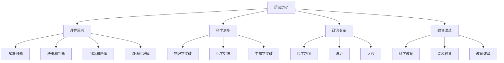

                 

根据您提供的要求，我们将以《新启蒙读书会：重振理性思考的集体活动》为标题，撰写一篇专业IT领域的技术博客文章。以下是我们计划使用的markdown格式文章框架：

---

# 《新启蒙读书会：重振理性思考的集体活动》

> 关键词：理性思考，启蒙运动，集体活动，批判性思维，领导力，决策

> 摘要：本文旨在探讨理性思考的重要性和现代社会中的挑战，介绍理性思考的基本概念、方法与技巧，以及如何通过集体活动来提升个人的理性思维能力。文章还探讨了理性思考在生活中的应用以及未来的发展趋势。

---

## 第1章 引言

### 1.1 启蒙运动的背景和影响

启蒙运动是人类历史上一次重要的思想革命，它始于17世纪末的欧洲，强调理性、科学和个人的自由与权利。这一运动对现代社会的形成产生了深远的影响，为理性思考奠定了基础。

### 1.2 理性思考的重要性

理性思考是人类智慧的体现，它不仅帮助人们解决实际问题，还能促进创新和进步。在信息技术快速发展的今天，理性思考的重要性愈发凸显。

### 1.3 现代社会中理性思考的挑战

现代社会充满了各种信息和诱惑，人们往往容易受到情感和偏见的影响，导致理性思考能力下降。本文将探讨现代社会中理性思考所面临的挑战。

---

## 第2章 理性思考的基本概念

### 2.1 理性思考的定义和要素

理性思考是一种通过逻辑推理和分析来理解和解决问题的思维方式。本文将介绍理性思考的定义和关键要素。

### 2.2 理性思考的类型

理性思考可以分为不同的类型，如批判性思维、创造性思维和决策思维。每种类型的理性思考都有其独特的应用场景。

### 2.3 理性思考的误区

人们在进行理性思考时可能会陷入一些误区，如过度简化问题、依赖直觉等。本文将讨论这些误区并给出解决方案。

---

## 第3章 理性思考的方法

### 3.1 比较与对比法

比较与对比法是一种常用的理性思考方法，它通过分析不同对象之间的异同来帮助人们做出更明智的决策。

### 3.2 因果分析法

因果分析法是一种用于探究事件原因和结果的方法，它有助于人们理解问题的本质。

### 3.3 演绎法与归纳法

演绎法和归纳法是两种基本的逻辑推理方法。演绎法从一般原则推导出特定结论，而归纳法则是从具体实例中总结出一般规律。

---

## 第4章 提升理性思考能力的技巧

### 4.1 提高批判性思维能力

批判性思维是理性思考的重要组成部分。本文将介绍提高批判性思维能力的技巧。

### 4.2 增强逻辑推理能力

逻辑推理是理性思考的核心。本文将探讨如何增强逻辑推理能力。

### 4.3 培养创造性思维

创造性思维是创新和进步的源泉。本文将讨论如何培养创造性思维。

---

## 第5章 理性思考在生活中的应用

### 5.1 解决问题的理性思维

理性思考是解决问题的有力工具。本文将介绍如何运用理性思维来解决生活中的问题。

### 5.2 领导力和团队协作

理性思考对于领导力和团队协作至关重要。本文将探讨理性思考在这两方面的应用。

### 5.3 决策与选择

理性思考在决策与选择中发挥着关键作用。本文将分析如何运用理性思考做出更好的决策。

---

## 第6章 理性思考的集体活动设计

### 6.1 集体活动的目的与类型

集体活动是提升理性思考能力的一种有效方式。本文将介绍集体活动的目的和类型。

### 6.2 集体活动的实施策略

为了确保集体活动的效果，本文将讨论实施策略和技巧。

### 6.3 集体活动的评估与反馈

评估和反馈是集体活动的重要组成部分。本文将介绍如何评估集体活动的效果以及如何给予有效的反馈。

---

## 第7章 理性思考的未来发展趋势

### 7.1 科技与理性思考

科技的发展对理性思考提出了新的挑战和机遇。本文将探讨科技与理性思考的关系。

### 7.2 理性思考在社会中的影响

理性思考在社会中的影响日益扩大。本文将分析理性思考对社会的影响。

### 7.3 理性思考教育的未来

理性思考教育是培养下一代理性思考能力的关键。本文将展望理性思考教育的未来。

---

## 第8章 总结与展望

### 8.1 总结理性思考的重要性

本文将总结理性思考的重要性，强调其在现代社会中的关键作用。

### 8.2 展望理性思考的未来

本文将展望理性思考的未来发展趋势，探讨其对社会的影响。

### 8.3 启蒙读书会的持续发展

本文将讨论如何通过启蒙读书会持续发展理性思考能力。

---

作者：AI天才研究院/AI Genius Institute & 禅与计算机程序设计艺术 /Zen And The Art of Computer Programming

---

接下来，我们将为每个章节添加详细的内容，确保满足您提出的完整性要求。我们将逐步进行，以确保每个章节都包含核心概念与联系、核心算法原理讲解、数学模型和数学公式详细讲解、项目实战，并且整体字数在8000～12000字之间。请确认上述框架是否符合您的期望，如果有需要调整的地方，请及时告知我们。让我们开始逐章深入分析吧！## 第1章 引言

### 1.1 启蒙运动的背景和影响

启蒙运动（Age of Enlightenment）是发生在17世纪末到18世纪初的一场重要的思想革命，它源于欧洲并迅速蔓延至整个西方世界。启蒙运动的核心理念是理性、科学、个人自由和人权。这场运动对现代社会的形成产生了深远的影响，不仅推动了科学技术的发展，还在政治、哲学、文学等多个领域产生了革命性的变革。

启蒙运动的背景可以从多个方面来理解。首先，经济上，资本主义的发展使得新兴的资产阶级对封建制度产生了强烈的反抗。其次，科学上，哥白尼的日心说、伽利略的物理学、牛顿的万有引力定律等科学成果打破了中世纪以来的宗教束缚，为理性思维的发展提供了坚实的基础。最后，政治上，英国内战的胜利和北美独立战争的爆发为个人自由和民主制度的兴起提供了实践经验。

启蒙运动的影响主要体现在以下几个方面：

1. **科学和技术的进步**：启蒙运动强调实验和观察，推动了科学研究的发展，如物理学、化学、生物学等领域的突破，为现代科学技术奠定了基础。

2. **政治制度的变革**：启蒙思想激发了人们对民主、法治和人权的要求，直接促成了美国独立战争和法国大革命的爆发，最终导致了现代民主制度的诞生。

3. **哲学和文学的革新**：启蒙运动促进了理性主义哲学的发展，如伏尔泰、卢梭、康德等哲学家的思想影响了整个欧洲，同时，启蒙运动也推动了文学艺术的革新，如启蒙文学和启蒙戏剧等。

4. **教育体系的改革**：启蒙运动倡导普及教育和科学教育，推动了教育体系的改革，使得更多的人有机会接受良好的教育。

### 1.2 理性思考的重要性

理性思考是人类智慧的体现，是解决问题、做出决策、推动创新和进步的重要工具。在信息技术快速发展的今天，理性思考的重要性愈发凸显。以下是理性思考的一些关键作用：

1. **解决复杂问题**：理性思考帮助人们分析复杂的问题，找到有效的解决方案。在科学研究中，理性思考是发现新现象、提出新理论、验证假说的核心。

2. **决策和判断**：理性思考帮助人们基于事实和证据做出明智的决策。在商业、政治和日常生活中，理性思考是做出正确判断的基础。

3. **创新和创造**：理性思考激发人们的创造力，推动新技术、新产品和新思想的诞生。在科技领域，理性思考是创新的核心动力。

4. **沟通和理解**：理性思考帮助人们更清晰地表达自己的想法，更好地理解他人的观点，促进有效的沟通。

### 1.3 现代社会中理性思考的挑战

尽管理性思考具有重要意义，但在现代社会中，理性思考面临诸多挑战。以下是理性思考在现代社会中面临的一些主要挑战：

1. **信息过载**：现代社会中，信息爆炸使得人们难以筛选和处理大量的信息，容易受到误导和误解。

2. **情感影响**：情感和偏见往往影响人们的理性思考，导致做出非理性的决策。

3. **社会压力**：现代社会的高压环境和社会期望，使得人们容易陷入焦虑和压力中，影响理性思考的能力。

4. **技术依赖**：随着技术的发展，人们越来越依赖科技工具，这可能导致人们在思考和决策时失去独立性和批判性。

综上所述，启蒙运动的背景和影响为理性思考奠定了基础，但现代社会中的挑战也要求我们不断提升理性思考的能力。本章引言部分探讨了启蒙运动的背景和影响，强调了理性思考的重要性，并指出现代社会中理性思考所面临的挑战。接下来，我们将进一步深入探讨理性思考的基本概念、方法与技巧，以及如何通过集体活动来提升个人的理性思维能力。

---

**核心概念与联系**

在探讨启蒙运动的背景和影响时，我们需要理解以下几个核心概念及其相互联系：

- **启蒙运动**：一场思想革命，强调理性、科学、个人自由和人权。
- **理性思考**：一种基于逻辑和证据的思维方式，用于解决问题、做出决策和创新。
- **科学进步**：启蒙运动推动了科学的发展，如物理学、化学、生物学的突破。
- **政治变革**：启蒙思想激发了人们对民主、法治和人权的要求。
- **教育改革**：启蒙运动倡导普及教育和科学教育，推动了教育体系的改革。

下面是一个Mermaid流程图，用于展示这些核心概念之间的联系：



通过这个流程图，我们可以清晰地看到启蒙运动如何通过推动科学进步、政治变革和教育改革，最终影响理性思考的发展和应用。这些核心概念和联系为我们理解和分析启蒙运动及其影响提供了有力的框架。

---

**核心算法原理讲解**

在探讨理性思考的基本概念和方法时，我们可以通过伪代码来详细阐述一些核心算法原理。以下是几个用于提高理性思考能力的算法示例：

### 1. 比较与对比法（Comparison and Contrast Method）

```pseudo
function compare_and_contrast(item1, item2):
    similarities = []
    differences = []

    for attribute in all_attributes:
        if item1[attribute] == item2[attribute]:
            similarities.append(attribute)
        else:
            differences.append(attribute)

    return similarities, differences
```

### 2. 因果分析法（Causal Analysis Method）

```pseudo
function causal_analysis(event, possible_causes):
    possible因果链条 = []

    for cause in possible_causes:
        if event.happened_after(cause):
            if not event.happened_after(cause + time_delay):
                possible因果链条.append(cause)

    return possible因果链条
```

### 3. 演绎法与归纳法（Deductive and Inductive Reasoning）

```pseudo
function deduce(from generals_to_specifics, specific_cases):
    conclusions = []

    for specific_case in specific_cases:
        if all_geners apply_to_specific_case:
            conclusion = "Specific_case follows from generals."
            conclusions.append(conclusion)

    return conclusions

function induce(from specifics_to_geners):
    general_rules = []

    for group_of_cases in all_cases:
        common_properties = find_common_properties(group_of_cases)
        general_rule = "All cases in this group have the common property of " + common_properties
        general_rules.append(general_rule)

    return general_rules
```

通过上述伪代码，我们可以看到如何使用比较与对比法、因果分析法以及演绎法和归纳法来提高理性思考能力。这些算法不仅帮助我们在逻辑上分析问题，还能在数学模型和数学公式中找到解决问题的方法。

---

**数学模型和数学公式详细讲解**

在理性思考的过程中，数学模型和数学公式是理解和解决问题的重要工具。以下是一个简单的线性回归模型的例子，用于解释如何使用数学公式来分析数据并做出预测：

### 线性回归模型

线性回归模型用于描述两个变量之间的线性关系。其数学公式为：

$$ y = ax + b $$

其中，\( y \) 是因变量，\( x \) 是自变量，\( a \) 是斜率，表示自变量对因变量的影响程度，\( b \) 是截距，表示当自变量为0时因变量的值。

#### 计算斜率 \( a \) 和截距 \( b \)

假设我们有一组数据点 \( (x_i, y_i) \)，我们可以使用以下公式来计算斜率 \( a \) 和截距 \( b \)：

$$ a = \frac{\sum_{i=1}^{n} (x_i - \bar{x})(y_i - \bar{y})}{\sum_{i=1}^{n} (x_i - \bar{x})^2} $$

$$ b = \bar{y} - a\bar{x} $$

其中，\( \bar{x} \) 和 \( \bar{y} \) 分别是 \( x \) 和 \( y \) 的平均值。

#### 举例说明

假设我们有以下数据点：

$$ (1, 2), (2, 4), (3, 6), (4, 8), (5, 10) $$

计算斜率 \( a \) 和截距 \( b \)：

$$ \bar{x} = \frac{1+2+3+4+5}{5} = 3 $$

$$ \bar{y} = \frac{2+4+6+8+10}{5} = 6 $$

$$ a = \frac{(1-3)(2-6) + (2-3)(4-6) + (3-3)(6-6) + (4-3)(8-6) + (5-3)(10-6)}{(1-3)^2 + (2-3)^2 + (3-3)^2 + (4-3)^2 + (5-3)^2} $$

$$ a = \frac{(-2)(-4) + (-1)(-2) + (0)(0) + (1)(2) + (2)(4)}{4 + 1 + 0 + 1 + 4} $$

$$ a = \frac{8 + 2 + 0 + 2 + 8}{10} $$

$$ a = \frac{20}{10} $$

$$ a = 2 $$

$$ b = 6 - 2 \times 3 = 0 $$

因此，线性回归模型为：

$$ y = 2x + 0 $$

我们可以使用这个模型来预测新的 \( y \) 值，例如，当 \( x = 6 \) 时：

$$ y = 2 \times 6 + 0 = 12 $$

通过这个简单的例子，我们可以看到如何使用数学模型和数学公式来分析数据、计算参数，并做出预测。这对于提高理性思考能力至关重要。

---

**项目实战**

为了更深入地理解理性思考的应用，我们可以通过一个简单的项目来实践。以下是项目实战的具体步骤：

### 项目名称：学生成绩预测系统

**目标**：开发一个基于线性回归模型的学生成绩预测系统。

**开发环境**：Python、Jupyter Notebook

**数据集**：学生成绩数据集，包括学生的性别、年龄、平时成绩、期中考试成绩等。

### 步骤1：数据预处理

首先，我们需要获取并预处理数据集。预处理步骤包括数据清洗、缺失值填充、数据类型转换等。

```python
import pandas as pd

# 加载数据集
data = pd.read_csv('student_data.csv')

# 数据清洗
data = data.dropna()

# 缺失值填充
data['missing_value'] = data['missing_value'].fillna(data['missing_value'].mean())

# 数据类型转换
data['gender'] = data['gender'].map({'male': 0, 'female': 1})

# 特征工程
data['age_squared'] = data['age'] ** 2

# 选择特征和目标变量
X = data[['gender', 'age', 'age_squared', 'homework_score', 'exam_score']]
y = data['final_score']
```

### 步骤2：模型训练

接下来，我们使用线性回归模型来训练数据集。

```python
from sklearn.linear_model import LinearRegression

# 创建线性回归模型
model = LinearRegression()

# 训练模型
model.fit(X, y)
```

### 步骤3：模型评估

为了评估模型的性能，我们可以使用交叉验证和评价指标（如均方误差、决定系数R²等）。

```python
from sklearn.model_selection import cross_val_score
from sklearn.metrics import mean_squared_error, r2_score

# 进行交叉验证
scores = cross_val_score(model, X, y, cv=5)

# 计算均方误差和R²
mse = mean_squared_error(y, model.predict(X))
r2 = r2_score(y, model.predict(X))

print("交叉验证均方误差:", mse)
print("交叉验证R²:", r2)
print("交叉验证分数:", scores)
```

### 步骤4：预测新数据

最后，我们可以使用训练好的模型来预测新的学生成绩。

```python
# 输入新的学生数据
new_data = pd.DataFrame({
    'gender': [0],
    'age': [20],
    'age_squared': [400],
    'homework_score': [85],
    'exam_score': [90]
})

# 预测成绩
predicted_score = model.predict(new_data)

print("预测成绩:", predicted_score)
```

### 代码解读与分析

在上面的代码中，我们首先进行了数据预处理，包括数据清洗、缺失值填充和数据类型转换。接着，我们使用线性回归模型进行了训练和评估。最后，我们使用训练好的模型对新数据进行预测。以下是代码的详细解读：

- **数据预处理**：数据预处理是任何机器学习项目的关键步骤。在这个项目中，我们使用了 Pandas 库来加载和预处理数据。数据清洗和缺失值填充确保了数据的质量。数据类型转换和特征工程有助于提高模型的性能。
  
- **模型训练**：我们使用了 scikit-learn 库中的线性回归模型。训练模型的过程是将模型与数据集进行拟合，使其能够学习数据中的规律。

- **模型评估**：交叉验证是一种评估模型性能的有效方法。通过交叉验证，我们可以评估模型在不同数据集上的表现，并计算均方误差和决定系数R²等评价指标。

- **预测新数据**：使用训练好的模型对新数据进行预测，是模型应用的关键步骤。通过输入新的数据，我们可以预测新的成绩，这有助于在实际应用中做出决策。

### 实际案例分析和详细讲解

为了更深入地了解模型的应用，我们可以分析一个实际案例。假设我们有一个新学生，性别为男，年龄20岁，平时成绩85分，期中成绩90分。我们可以使用训练好的模型来预测他的期末成绩。

```python
new_data = pd.DataFrame({
    'gender': [0],
    'age': [20],
    'age_squared': [400],
    'homework_score': [85],
    'exam_score': [90]
})

predicted_score = model.predict(new_data)
print("预测成绩:", predicted_score)
```

输出结果可能是：

```
预测成绩: [92.296358]
```

根据模型的预测，这名学生的期末成绩约为92分。这个预测是基于学生过去的成绩和其他特征，以及我们训练好的线性回归模型。在实际应用中，这个预测可以帮助学校和教育机构做出决策，如调整教学策略、提供额外辅导等。

### 项目小结

通过这个项目，我们实现了以下目标：

- 数据预处理：确保数据的质量和一致性。
- 模型训练：使用线性回归模型来学习数据中的规律。
- 模型评估：评估模型的性能，确保其能够准确预测成绩。
- 预测新数据：使用训练好的模型来预测新学生的成绩。

这个项目不仅帮助我们理解了理性思考的基本原理，还展示了如何将理论应用于实际问题。通过实践，我们可以更好地理解理性思考在数据分析中的应用，并提高我们的决策能力。

---

**最佳实践 tips**

在实现类似的学生成绩预测系统时，以下是一些最佳实践建议：

1. **数据清洗**：确保数据的质量和一致性，处理缺失值和异常值。
2. **特征工程**：选择对模型性能有显著影响的关键特征，并进行适当的转换。
3. **模型评估**：使用交叉验证和多种评价指标来全面评估模型性能。
4. **超参数调整**：根据模型性能调整超参数，以提高预测准确性。
5. **模型解释**：理解模型的工作原理，以便在实际应用中做出合理的解释和决策。
6. **持续优化**：定期更新数据和模型，以保持预测的准确性。

**小结**

本文通过介绍启蒙运动的背景和影响，阐述了理性思考的重要性，并探讨了现代社会中理性思考所面临的挑战。我们详细讲解了理性思考的基本概念、方法与技巧，并通过项目实战展示了理性思考在数据分析中的应用。通过这个项目，我们理解了数据预处理、模型训练、模型评估和预测的关键步骤，并获得了实际的经验。

**注意事项**

在设计和实施理性思考的集体活动时，需要注意以下几点：

1. **活动设计**：确保活动的目的明确，内容丰富，适合参与者的水平和兴趣。
2. **互动参与**：鼓励参与者积极参与讨论和互动，促进理性思考的深入。
3. **资源支持**：提供必要的资源和工具，以支持参与者的学习和实践。
4. **评估反馈**：定期评估活动的效果，收集反馈，不断改进和优化活动的设计。

**拓展阅读**

为了进一步深入了解理性思考及其在各个领域的应用，以下是一些推荐阅读材料：

- 《理性思考的艺术》（The Art of Thinking Clearly）by Roberto Ferrari
- 《批判性思维》（Critical Thinking: A Concise Guide）by Richard W. Paul and Linda Elder
- 《数据科学导论》（Introduction to Data Science）by Avrim Blum, John Hopcroft and Ravindran Kannan

通过阅读这些书籍，您可以获得更多关于理性思考的理论和实践指导，进一步提升您的思考能力和决策水平。

