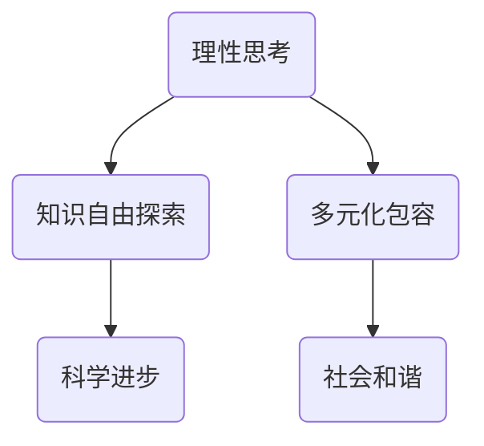

                 

### 1. 新启蒙运动2.0：重振理性思考的社会运动

#### 1.1 背景介绍

在当今全球化的信息时代，理性思考的重要性愈发凸显。然而，面对纷繁复杂的信息环境和层出不穷的科技变革，人们往往容易陷入情绪化的决策和盲目的追随。这种现状引发了对于重振理性思考的强烈需求，从而催生了新启蒙运动2.0的兴起。新启蒙运动2.0不仅是对启蒙运动的一次继承和深化，更是在现代科技背景下对理性思考和社会运动的全新探索。

启蒙运动始于17世纪的欧洲，它提倡通过理性和科学方法来解决问题，强调个体自由和人类理性的重要性。这场运动在18世纪达到了巅峰，对现代社会的形成产生了深远的影响。然而，随着时间的推移，理性思考在社会中的地位逐渐式微，被情感化、个人主义和功利主义所取代。新启蒙运动2.0正是为了重新确立理性思考在社会中的核心地位，以应对现代社会面临的诸多挑战。

新启蒙运动2.0的提出，源于对现代社会问题的深刻反思。首先，信息爆炸和媒体环境的变化使得信息真假难辨，谣言和虚假信息的传播对社会造成了巨大的危害。其次，科技发展带来的伦理和道德问题日益突出，如人工智能、生物科技等领域的应用引发了广泛的争议。最后，社会分歧和政治极化使得理性对话和协商变得困难，进一步加剧了社会的分裂和动荡。

#### 1.2 新启蒙运动2.0的核心概念与联系

新启蒙运动2.0的核心概念包括理性思考、知识自由探索、多元化包容等。这些概念之间相互联系，共同构成了新启蒙运动2.0的理论框架。

首先，理性思考是新启蒙运动2.0的基础。理性思考强调通过逻辑推理、证据分析和实证研究来解决问题，而不是依赖情感、信仰或权威。理性思考不仅有助于提高个体的决策质量，还能够促进社会整体的科学素质和创新能力。

其次，知识自由探索是新启蒙运动2.0的核心动力。知识自由探索鼓励个体在不受限制的环境中追求真理，通过开放性和合作性的方式分享和传播知识。知识自由探索不仅有助于推动科学进步，还能够激发社会的创造力和创新能力。

最后，多元化包容是新启蒙运动2.0的重要目标。多元化包容强调尊重个体的差异和多样性，倡导平等和公正的社会环境。多元化包容不仅有助于消除社会歧视和偏见，还能够促进社会的和谐与进步。

图1.1 新启蒙运动2.0的核心概念关系架构

#### 1.3 新启蒙运动2.0的重要性

新启蒙运动2.0在现代社会中具有重要的意义。首先，它有助于提升个体的理性素养和批判性思维。通过理性思考和知识自由探索，个体能够更好地理解复杂的社会问题，做出更明智的决策，避免盲目跟风和情绪化行为。

其次，新启蒙运动2.0有助于推动科学进步和社会发展。理性思考能够促进科学研究和技术创新，推动社会的科技进步和经济发展。知识自由探索则能够激发社会的创造力，推动文化的多样性和繁荣。

最后，新启蒙运动2.0有助于构建一个和谐公正的社会。多元化包容能够消除社会歧视和偏见，促进社会的包容性和平等性。理性思考和知识自由探索则有助于提高社会的整体素质和文明程度，推动社会的和谐发展。

总之，新启蒙运动2.0是一场旨在重振理性思考的社会运动，它不仅关注个体的理性素养和批判性思维，更致力于推动科学进步和社会发展。通过理性思考、知识自由探索和多元化包容，新启蒙运动2.0有望为现代社会带来深远的影响，推动人类文明迈向新的高度。

---

#### 关键词

- **新启蒙运动2.0**
- **理性思考**
- **知识自由探索**
- **多元化包容**
- **社会发展**
- **科技进步**
- **批判性思维**

#### 摘要

本文介绍了新启蒙运动2.0的概念和重要性。在现代社会，理性思考的重要性愈发凸显，而新启蒙运动2.0正是为了重振理性思考而在现代科技背景下提出的。本文探讨了新启蒙运动2.0的核心概念，包括理性思考、知识自由探索和多元化包容，并分析了这些概念之间的关系。同时，本文阐述了新启蒙运动2.0在提升个体理性素养、推动科学进步和社会发展以及构建和谐社会中的重要作用。通过理性思考、知识自由探索和多元化包容，新启蒙运动2.0有望为现代社会带来深远的影响，推动人类文明迈向新的高度。

