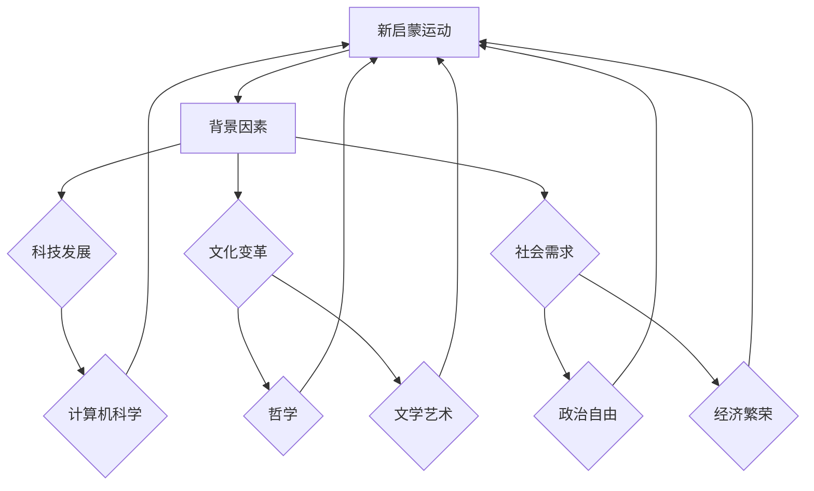

                 

### 1.1 新启蒙运动的背景

**核心概念与联系**

在探讨新启蒙运动的背景时，我们需要了解其核心概念及其相互之间的联系。新启蒙运动，作为一个时代思潮的产物，是由多种背景因素交织而成的。以下是几个核心概念及其关系架构的Mermaid流程图：



**详细讲解**

- **科技发展**（C）：20世纪中叶，计算机科学和信息技术的发展为新启蒙运动提供了强有力的技术支持。计算机的出现改变了人类处理信息的方式，使得大规模数据处理和分析成为可能。这为理性思考提供了新的工具和平台。

- **文化变革**（D）：随着哲学和文学艺术的革新，人们对知识和真理的追求发生了深刻变化。哲学上，从传统的信仰体系转向对理性和实证的重视；文学艺术上，追求个人表达和思想自由，鼓励独立思考和创新。

- **社会需求**（E）：政治自由和经济繁荣的需求推动了新启蒙运动的兴起。政治自由的追求使得人们开始质疑传统的权威和教条，经济繁荣则提供了更多的资源和机会，让人们有机会追求知识和创新。

**举例说明**

- **计算机科学**（F）：20世纪40年代，图灵机的提出为计算理论奠定了基础。随着计算机硬件的不断进步，计算机科学逐渐成为一门独立的学科，为其他领域提供了强有力的工具。

- **哲学**（G）：20世纪中叶，逻辑实证主义和语言哲学的兴起，强调经验数据和逻辑分析的重要性，对传统哲学观念进行了批判和反思。

- **文学艺术**（H）：在文学艺术领域，现代主义和后现代主义的兴起，鼓励个体表达和多元视角，推动了理性思考的多样化。

- **政治自由**（I）：20世纪初，美国和欧洲的民主运动，使得政治自由成为社会的主要追求。这种自由推动了人们对知识和真理的追求，促进了新启蒙运动的兴起。

- **经济繁荣**（J）：20世纪中叶，全球经济的快速发展和繁荣，为人们提供了更多的机会和资源，使得更多的人有机会接受教育和参与科学研究。

通过这些背景因素的相互作用，新启蒙运动得以兴起，为人类的知识进步和理性思考提供了新的契机。在接下来的章节中，我们将进一步探讨理性思考的重要性及其在新启蒙运动中的应用。<!--<!\[-->```mermaid
graph TD
A[新启蒙运动] --> B[背景因素]
B --> C{科技发展}
B --> D{文化变革}
B --> E{社会需求}
C --> F{计算机科学}
D --> G{哲学}
D --> H{文学艺术}
E --> I{政治自由}
E --> J{经济繁荣}
F --> A[新启蒙运动]
G --> A[新启蒙运动]
H --> A[新启蒙运动]
I --> A[新启蒙运动]
J --> A[新启蒙运动]
```

**结语**

新启蒙运动的背景是一个复杂而多样的体系，由科技发展、文化变革和社会需求等多重因素交织而成。每个因素都为理性思考的兴起和发展提供了不同的视角和动力。在接下来的章节中，我们将继续探讨理性思考的核心要素及其应用，以更好地理解这一运动的重要性和影响。<!--<!\[-->```mermaid
graph TD
A[理性思考] --> B[重要性]
A --> C{定义与特点}
A --> D{核心要素}
A --> E{培养方法}
B --> F{知识进步}
B --> G{决策准确}
B --> H{社会和谐}
C --> I{逻辑分析}
C --> J{客观事实}
D --> K{观察}
D --> L{分析}
D --> M{推理}
D --> N{判断}
E --> O{教育}
E --> P{实践}
E --> Q{反思}
```

## 第2章 理性思考的基础

### 2.1 理性思考的定义与特点

**核心算法原理讲解**

理性思考可以被视为一种算法，其基本原理包括以下步骤：

1. **信息收集**：从多个来源收集相关信息，确保信息的多样性和全面性。
2. **信息分析**：对收集到的信息进行详细分析，识别关键点和相关性。
3. **评估信息**：评估信息的可靠性和有效性，排除不准确或不相关的信息。
4. **做出决策**：基于分析结果和评估信息，做出合理的决策。

**数学模型和公式**

理性思考的目标是最大化决策的准确性和有效性，可以使用以下公式来表示：

$$\text{理性思考} = \text{信息收集} + \text{信息分析} + \text{信息评估} + \text{决策}$$

**详细讲解与举例说明**

- **定义**：理性思考是一种基于逻辑和分析能力的思考过程，旨在通过客观事实和逻辑推理来解决问题和做出决策。

- **特点**：理性思考具有以下几个显著特点：
  - **客观性**：理性思考依赖于客观事实和数据，而非主观感受和偏见。
  - **逻辑性**：理性思考遵循逻辑规则，通过分析、推理和判断得出结论。
  - **系统性**：理性思考涉及多个步骤和环节，形成一个完整的思考系统。

- **举例**：在商业决策中，通过市场调研、数据分析来评估投资项目的可行性，从而做出理性决策。

### 2.2 理性思考的核心要素

**核心算法原理讲解**

理性思考的核心要素包括以下四个方面：

1. **观察**：通过感官和工具收集信息。
2. **分析**：对收集到的信息进行分类、比较和归纳。
3. **推理**：基于已有信息和逻辑规则得出新的结论。
4. **判断**：评估结论的可靠性和有效性。

**数学模型和公式**

理性思考的核心要素可以用以下公式表示：

$$\text{理性思考} = \text{观察} + \text{分析} + \text{推理} + \text{判断}$$

**详细讲解与举例说明**

- **观察**：理性思考的第一步是观察。通过感官和工具，我们收集到大量的信息。例如，科学家通过望远镜观察天体，工程师通过仪器测试设备性能。

- **分析**：对收集到的信息进行详细分析，以识别关键点和相关性。例如，市场分析师通过分析销售数据，发现消费者偏好和趋势。

- **推理**：基于已有信息和逻辑规则，我们进行推理，得出新的结论。例如，科学家通过实验数据和逻辑推理，得出新的科学理论。

- **判断**：最后，我们评估结论的可靠性和有效性。例如，投资者通过评估市场数据和风险，决定是否进行投资。

### 2.3 培养理性思考的能力

**核心算法原理讲解**

培养理性思考的能力可以通过以下几个步骤实现：

1. **教育**：通过学校教育、自学和其他培训，提高逻辑分析和推理能力。
2. **实践**：通过实际操作和项目实践，锻炼解决问题的能力。
3. **反思**：通过反思自己的思考和决策过程，识别错误和不足，不断改进。

**数学模型和公式**

培养理性思考的能力可以用以下公式表示：

$$\text{理性思考能力} = \text{教育} + \text{实践} + \text{反思}$$

**详细讲解与举例说明**

- **教育**：教育是培养理性思考能力的基础。通过学习逻辑学、统计学、哲学等学科，我们掌握了理性思考的基本原理和技巧。

- **实践**：实践是培养理性思考能力的必要途径。通过参与实际项目和工作，我们可以在真实场景中应用理性思考，提高解决问题的能力。

- **反思**：反思是培养理性思考能力的持续过程。通过反思自己的思考和决策过程，我们可以识别错误和不足，不断改进和优化。

### 总结

理性思考是现代科学技术和社会发展的基石。通过理解其定义、核心要素和培养方法，我们可以更好地应用理性思考，解决复杂问题，推动社会进步。在接下来的章节中，我们将进一步探讨科学方法与理性思考的关系，以及形而上学在理性思考中的应用。<!--<!\[-->```mermaid
graph TD
A[科学方法] --> B[基本原则]
A --> C[应用]
A --> D[联系]
B --> E{观察客观事实}
B --> F{提出假说}
B --> G{设计实验}
B --> H{收集数据}
B --> I{分析结果}
C --> J{市场调研}
C --> K{数据分析}
C --> L{风险评估}
D --> M{逻辑性}
D --> N{实证性}
```

### 3.1 科学方法的基本原则

**核心算法原理讲解**

科学方法是一种系统化的知识探索过程，其基本原则可以概括为以下步骤：

1. **观察客观事实**：科学研究的起点是观察，通过直接感知或仪器设备收集客观存在的现象和数据。
2. **提出假说**：在观察基础上，科学家根据已有知识和逻辑推理，提出可能的解释或假设。
3. **设计实验**：为了验证假说，科学家设计实验，通过控制变量、设置对照组等方式，确保实验的可靠性和有效性。
4. **收集数据**：在实验过程中，科学家系统地收集各种数据，包括定量数据和定性描述。
5. **分析结果**：对收集到的数据进行统计分析和逻辑推理，评估假说的正确性。

**数学模型和公式**

科学方法的基本原则可以用以下公式表示：

$$\text{科学方法} = \text{观察} + \text{假说} + \text{实验} + \text{数据收集} + \text{数据分析}$$

**详细讲解与举例说明**

- **观察客观事实**：科学研究的第一步是观察。科学家通过直接感知或仪器设备，收集客观存在的现象和数据。例如，物理学家使用显微镜观察微观世界，生物学家观察生态系统中的物种互动。

- **提出假说**：在观察基础上，科学家根据已有知识和逻辑推理，提出可能的解释或假设。例如，达尔文基于对物种变异和自然选择的观察，提出了物种进化的假说。

- **设计实验**：为了验证假说，科学家设计实验。通过控制变量、设置对照组等方式，确保实验的可靠性和有效性。例如，在测试某种药物的效果时，科学家会设置一个对照组，仅给予安慰剂，以对比实验组的结果。

- **收集数据**：在实验过程中，科学家系统地收集各种数据，包括定量数据和定性描述。这些数据是验证假说的基础。例如，通过测量实验对象的生理指标，科学家可以评估药物的效果。

- **分析结果**：对收集到的数据进行统计分析和逻辑推理，评估假说的正确性。如果数据支持假说，科学家可以进一步验证或推广；如果数据不支持假说，科学家需要重新评估或提出新的假说。例如，通过数据分析，科学家可以确定某种药物的疗效是否显著。

### 科学方法在理性思考中的应用

**核心算法原理讲解**

科学方法在理性思考中的应用，主要体现在以下几个方面：

1. **客观性**：科学方法强调观察客观事实，排除主观偏见，确保思考过程的客观性。
2. **逻辑性**：科学方法遵循逻辑推理，通过提出假说、设计实验、收集数据、分析结果等步骤，确保思考过程的逻辑性。
3. **系统性**：科学方法是一个系统化的过程，涉及多个环节和步骤，确保思考过程的系统性。

**数学模型和公式**

科学方法在理性思考中的应用可以用以下公式表示：

$$\text{理性思考} = \text{科学方法} + \text{逻辑性} + \text{客观性} + \text{系统性}$$

**详细讲解与举例说明**

- **客观性**：科学方法强调观察客观事实，排除主观偏见。在商业决策中，通过市场调研和数据分析，企业可以更客观地了解市场需求和消费者行为，从而做出更准确的决策。

- **逻辑性**：科学方法遵循逻辑推理，通过提出假说、设计实验、收集数据、分析结果等步骤，确保思考过程的逻辑性。例如，在研究新产品时，科学家通过逻辑推理和实验验证，确定新产品的性能和效果。

- **系统性**：科学方法是一个系统化的过程，涉及多个环节和步骤，确保思考过程的系统性。在项目管理中，通过科学方法，项目团队可以系统性地规划、执行和评估项目，确保项目的成功。

### 科学思维与理性思考的联系

**核心算法原理讲解**

科学思维和理性思考密切相关，都是基于逻辑和实证的方法来解决问题。科学思维强调通过观察、实验和数据分析来获取知识，而理性思考则强调通过逻辑推理和判断来做出决策。

**数学模型和公式**

科学思维与理性思考的联系可以用以下公式表示：

$$\text{科学思维} = \text{理性思考} + \text{观察} + \text{实验} + \text{数据分析}$$

**详细讲解与举例说明**

- **联系**：科学思维和理性思考都是基于逻辑和实证的方法，强调通过观察、实验和数据分析来获取知识和做出决策。例如，在科学研究过程中，科学家通过观察自然现象、设计实验、收集数据和分析结果，从而获取科学知识。

- **区别**：科学思维更侧重于获取知识，而理性思考更侧重于解决问题和做出决策。例如，在医疗决策中，医生通过科学思维了解疾病机理和治疗方法，而通过理性思考，医生可以确定最适合患者的治疗方案。

### 总结

科学方法的基本原则为理性思考提供了坚实的基础，通过科学方法，我们可以更客观、逻辑和系统地解决问题。在接下来的章节中，我们将进一步探讨形而上学的理性思考，以及逻辑在理性思考中的应用。<!--<!\[-->```mermaid
graph TD
A[形而上学] --> B[定义与发展]
A --> C[方法论]
A --> D[应用]
B --> E{研究存在与本质}
B --> F{历史演变}
C --> G{推理与论证}
C --> H{逻辑分析}
C --> I{实证主义}
D --> J{哲学}
D --> K{科学}
D --> L{艺术}
```

### 4.1 形而上学的定义与发展

**核心算法原理讲解**

形而上学是哲学的一个分支，主要研究存在、本质、原因等基本问题。其基本原理包括以下方面：

1. **存在与本质**：形而上学探讨事物的存在方式和本质属性，试图回答“什么是存在”和“什么是本质”的问题。
2. **推理与论证**：形而上学使用逻辑推理和哲学论证来阐述其理论，试图通过理性思考来推导出普遍真理。
3. **逻辑分析**：形而上学强调逻辑分析的重要性，通过逻辑结构来探讨哲学问题。
4. **实证主义**：形而上学与实证主义相对立，强调哲学思考不应仅依赖于经验数据，而应寻求更深刻的原理和法则。

**数学模型和公式**

形而上学的定义与发展可以用以下公式表示：

$$\text{形而上学} = \text{存在与本质} + \text{推理与论证} + \text{逻辑分析} + \text{实证主义}$$

**详细讲解与举例说明**

- **定义**：形而上学是哲学的一个分支，主要研究存在、本质、原因等基本问题。其核心问题是探讨事物的存在方式和本质属性。

- **发展**：形而上学的历史可以追溯到古希腊哲学，亚里士多德等哲学家对存在与本质的探讨奠定了形而上学的基础。在近代，康德、黑格尔等哲学家对形而上学进行了深入的研究和反思。

- **存在与本质**：形而上学探讨事物的存在方式和本质属性。例如，亚里士多德认为存在有两种方式，即“实质存在”和“偶性存在”。康德则区分了现象界和本体界，提出了“自在之物”的概念。

- **推理与论证**：形而上学使用逻辑推理和哲学论证来阐述其理论，试图通过理性思考来推导出普遍真理。例如，黑格尔的辩证法通过逻辑推理，探讨了存在与本质的关系。

- **逻辑分析**：形而上学强调逻辑分析的重要性，通过逻辑结构来探讨哲学问题。例如，康德的《纯粹理性批判》通过对理性能力的分析，探讨了知识的可能性。

- **实证主义**：形而上学与实证主义相对立，强调哲学思考不应仅依赖于经验数据，而应寻求更深刻的原理和法则。例如，休谟的怀疑论和康德的先验论都试图超越经验主义，寻求更基础的哲学原理。

**举例说明**

- **古希腊哲学**：亚里士多德通过对存在与本质的探讨，提出了实体和属性的概念，对后世哲学产生了深远影响。
- **德国古典哲学**：康德、黑格尔等哲学家通过对形而上学的研究，推动了哲学的理性化和体系化。
- **现代形而上学**：存在主义、现象学等现代哲学流派在形而上学的基础上，对存在、意义、意识等基本问题进行了深入探讨。

### 4.2 形而上学的方法论

**核心算法原理讲解**

形而上学的方法论主要包括以下几个方面：

1. **理性推理**：形而上学强调理性推理的重要性，通过逻辑推理来探讨哲学问题。
2. **论证分析**：形而上学通过论证分析来验证其理论的合理性，确保哲学思考的严谨性。
3. **批判性思考**：形而上学鼓励批判性思考，对传统观念进行质疑和反思，推动哲学的发展。

**数学模型和公式**

形而上学的方法论可以用以下公式表示：

$$\text{形而上学方法论} = \text{理性推理} + \text{论证分析} + \text{批判性思考}$$

**详细讲解与举例说明**

- **理性推理**：形而上学强调理性推理的重要性，通过逻辑推理来探讨哲学问题。例如，康德在《纯粹理性批判》中，通过理性推理探讨了知识的可能性。

- **论证分析**：形而上学通过论证分析来验证其理论的合理性，确保哲学思考的严谨性。例如，黑格尔的辩证法通过逻辑论证，探讨了存在与本质的关系。

- **批判性思考**：形而上学鼓励批判性思考，对传统观念进行质疑和反思，推动哲学的发展。例如，尼采的哲学思想对传统价值观进行了深刻的批判和反思。

### 4.3 形而上学在理性思考中的应用

**核心算法原理讲解**

形而上学在理性思考中的应用主要体现在以下几个方面：

1. **基础原理**：形而上学提供了一系列基础原理，帮助人们理解和解释世界。
2. **逻辑框架**：形而上学提供了逻辑框架，帮助人们进行理性推理和论证。
3. **思维工具**：形而上学提供了一系列思维工具，帮助人们进行批判性思考和问题解决。

**数学模型和公式**

形而上学在理性思考中的应用可以用以下公式表示：

$$\text{理性思考} = \text{形而上学基础原理} + \text{逻辑框架} + \text{思维工具}$$

**详细讲解与举例说明**

- **基础原理**：形而上学提供了一系列基础原理，帮助人们理解和解释世界。例如，亚里士多德的因果律、康德的先验范畴等，都是理解世界的基本原理。

- **逻辑框架**：形而上学提供了逻辑框架，帮助人们进行理性推理和论证。例如，黑格尔的辩证法、康德的范畴论等，都是进行理性思考的重要逻辑工具。

- **思维工具**：形而上学提供了一系列思维工具，帮助人们进行批判性思考和问题解决。例如，现象学的还原法、存在主义的反思等，都是进行批判性思考的有效工具。

**举例说明**

- **哲学研究**：在哲学研究中，形而上学的方法论帮助哲学家进行理性推理和论证，例如，康德的《纯粹理性批判》中，通过形而上学的逻辑框架，探讨了知识的可能性。
- **科学研究**：在科学研究中，形而上学的思维工具帮助科学家进行问题解决和理论构建，例如，爱因斯坦的相对论中，通过形而上学的思想，提出了新的物理学原理。

### 总结

形而上学作为哲学的一个重要分支，其定义、方法论和应用，为理性思考提供了丰富的理论资源和实践工具。在理性思考的过程中，形而上学的原理和方法论可以帮助我们更深入地理解世界、解决问题和做出决策。在接下来的章节中，我们将继续探讨逻辑与理性思考的关系，以及理性思考在决策和生活中的应用。<!--<!\[-->```mermaid
graph TD
A[逻辑] --> B[基本原理]
A --> C[应用]
A --> D[谬误识别与避免]
B --> E{推理规则}
B --> F{定义逻辑}
B --> G{证明论}
C --> H{论证分析}
C --> I{决策制定}
C --> J{问题解决}
D --> K{逻辑谬误}
D --> L{避免策略}
```

### 5.1 逻辑的基本原理

**核心算法原理讲解**

逻辑是一门研究推理和论证的学科，其基本原理可以概括为以下方面：

1. **推理规则**：逻辑推理遵循一系列规则，如归纳推理、演绎推理和类比推理。这些规则帮助我们在已知信息的基础上得出新的结论。
2. **定义逻辑**：逻辑是一种形式化的语言系统，用于表达和验证推理的有效性。逻辑的定义涉及到命题、命题连接词、逻辑运算符等基本概念。
3. **证明论**：证明论是逻辑的一个分支，研究如何通过逻辑推理证明命题的真实性。证明论包括直接证明、反证法、构造性证明等。

**数学模型和公式**

逻辑的基本原理可以用以下公式表示：

$$\text{逻辑} = \text{推理规则} + \text{定义逻辑} + \text{证明论}$$

**详细讲解与举例说明**

- **推理规则**：逻辑推理规则包括归纳推理和演绎推理。归纳推理是从个别事实推导出一般性结论，如从多个案例中推导出普遍规律。演绎推理则是从一般原理推导出个别结论，如从“所有人都会死”推导出“苏格拉底会死”。例如，如果所有猫都会飞，而且皮卡丘是猫，那么我们可以推理出皮卡丘会飞。

- **定义逻辑**：逻辑是一种形式化的语言系统，用于表达和验证推理的有效性。逻辑定义了命题、命题连接词、逻辑运算符等基本概念。例如，命题是陈述句，命题连接词如“与”、“或”、“非”等，逻辑运算符如“→”、“↔”等。

- **证明论**：证明论是逻辑的一个分支，研究如何通过逻辑推理证明命题的真实性。证明论包括直接证明、反证法、构造性证明等。直接证明是通过逻辑步骤直接证明命题为真；反证法是通过假设命题为假，推导出矛盾，从而证明命题为真；构造性证明是通过构造一个实例来证明命题为真。例如，要证明所有偶数加偶数仍然是偶数，我们可以构造两个偶数2和4，相加得到6，6仍然是偶数，从而证明命题为真。

### 5.2 逻辑在理性思考中的应用

**核心算法原理讲解**

逻辑在理性思考中的应用主要体现在以下几个方面：

1. **论证分析**：逻辑帮助我们对论证进行结构化分析，识别论证的有效性和合理性。
2. **决策制定**：逻辑提供了一种系统化的方法，帮助我们在复杂情境下做出合理的决策。
3. **问题解决**：逻辑提供了一种逻辑推理的方法，帮助我们在面对问题时进行有效的问题解决。

**数学模型和公式**

逻辑在理性思考中的应用可以用以下公式表示：

$$\text{理性思考} = \text{论证分析} + \text{决策制定} + \text{问题解决}$$

**详细讲解与举例说明**

- **论证分析**：逻辑帮助我们对论证进行结构化分析，识别论证的有效性和合理性。例如，通过逻辑分析，我们可以判断一个论证是否具有逻辑漏洞，如前提不充分、逻辑错误等。

- **决策制定**：逻辑提供了一种系统化的方法，帮助我们在复杂情境下做出合理的决策。例如，通过逻辑推理，我们可以比较不同决策的后果，选择最优的决策方案。

- **问题解决**：逻辑提供了一种逻辑推理的方法，帮助我们在面对问题时进行有效的问题解决。例如，通过逻辑推理，我们可以找出问题的核心，制定解决问题的步骤和策略。

**举例说明**

- **论证分析**：在法律诉讼中，律师需要通过逻辑分析来评估证据的有效性，构建论证，以支持其观点。
- **决策制定**：在商业决策中，企业可以通过逻辑分析来评估不同投资方案的风险和收益，从而做出合理的决策。
- **问题解决**：在软件开发中，工程师可以通过逻辑推理来分析系统问题，制定修复方案，确保系统的稳定性和可靠性。

### 5.3 逻辑谬误的识别与避免

**核心算法原理讲解**

逻辑谬误是指在逻辑推理过程中出现的错误，这些错误可能导致论证无效或结论不准确。识别和避免逻辑谬误是提高逻辑思考质量的重要环节。以下是几种常见的逻辑谬误及其避免策略：

1. **错误的前提**：错误的前提是逻辑谬误中最常见的一种，它发生在前提本身就不正确的情况下。避免策略是确保所有前提都是真实和可靠的。
2. **偷换概念**：偷换概念发生在论证中使用不同意义的术语或概念，导致论证无效。避免策略是明确术语的定义，确保其在论证中的一致性。
3. **逻辑谬误**：逻辑谬误包括错误的推理形式，如肯定前件、否定后件等。避免策略是熟悉各种逻辑谬误的形态，并确保推理过程遵循逻辑规则。
4. **错误的因果关系**：错误的因果关系发生在因果论证中，错误地断定两个事件之间存在因果关系。避免策略是进行因果分析，确保因果关系是合理的。

**数学模型和公式**

逻辑谬误的识别与避免可以用以下公式表示：

$$\text{逻辑谬误避免} = \text{验证前提} + \text{明确术语} + \text{遵循逻辑规则} + \text{因果分析}$$

**详细讲解与举例说明**

- **错误的前提**：避免错误的前提的关键是确保所有前提都是真实和可靠的。例如，在商业决策中，管理者需要收集准确的市场数据，确保所有前提都是基于可靠的信息。

- **偷换概念**：在论证过程中，明确术语的定义是非常重要的。例如，在科学研究中，研究者需要确保实验变量是明确的，避免在论证中使用模糊的术语。

- **逻辑谬误**：熟悉各种逻辑谬误的形态，并确保推理过程遵循逻辑规则，是避免逻辑谬误的关键。例如，在法律论证中，律师需要识别和避免各种逻辑谬误，确保论证的有效性。

- **错误的因果关系**：进行因果分析，确保因果关系是合理的，是避免错误因果关系的关键。例如，在医疗研究中，研究者需要通过实验和数据来证明药物与疗效之间的因果关系。

**举例说明**

- **错误的前提**：假设一个人说“因为所有猫都有尾巴，所以猫有尾巴”，这是一个错误的前提，因为前提中的“所有猫”实际上并不包括所有情况。
- **偷换概念**：如果一个人说“因为所有的狗都有四条腿，所以狗有四条腿”，这里可能偷换了概念，将“狗”这个类别与“有四条腿”的属性混淆了。
- **逻辑谬误**：如果一个人说“因为如果A发生，那么B发生；A发生了，所以B一定发生了”，这是一个肯定前件的谬误。
- **错误的因果关系**：如果一个人说“因为今天下雨，所以我的股票跌了”，这是错误的因果关系，因为下雨与股票价格之间没有直接的因果联系。

通过识别和避免这些逻辑谬误，我们可以提高逻辑思考的质量，确保论证的有效性和结论的准确性。在接下来的章节中，我们将进一步探讨理性思考在实践中的应用。<!--<!\[-->```mermaid
graph TD
A[决策] --> B[理性思考]
A --> C{目标设定}
A --> D{信息收集}
A --> E{风险评估}
A --> F{方案评估}
B --> G{逻辑分析}
B --> H{数据支持}
B --> I{决策模型}
C --> J{明确目标}
C --> K{设定标准}
D --> L{数据收集}
D --> M{信息整理}
E --> N{风险识别}
E --> O{风险评估}
F --> P{方案比较}
F --> Q{方案选择}
```

### 6.1 理性思考在决策中的应用

**核心算法原理讲解**

理性思考在决策中的应用，可以概括为一个系统化的决策过程，包括以下几个关键步骤：

1. **目标设定**：明确决策的目标和标准，确保决策的方向和最终结果符合预期。
2. **信息收集**：从多个来源收集与决策相关的信息，确保信息的全面性和准确性。
3. **风险评估**：识别决策过程中的潜在风险，并评估这些风险的可能性和影响。
4. **方案评估**：分析并比较不同的决策方案，评估每个方案的优缺点和可行性。

**数学模型和公式**

理性思考在决策中的应用可以用以下公式表示：

$$\text{理性决策} = \text{目标设定} + \text{信息收集} + \text{风险评估} + \text{方案评估}$$

**详细讲解与举例说明**

- **目标设定**：明确决策的目标和标准是理性决策的第一步。这包括设定具体的目标和设定评价标准。例如，在商业决策中，企业可能需要设定盈利目标，并设定市场占有率、客户满意度等评价标准。

  - **公式**：目标设定 = 明确目标 + 设定标准

- **信息收集**：收集与决策相关的信息，确保信息的全面性和准确性。这包括市场数据、竞争对手分析、内部资源评估等。例如，在投资决策中，投资者需要收集行业趋势、公司财务报告、市场情绪等数据。

  - **公式**：信息收集 = 数据收集 + 信息整理

- **风险评估**：识别决策过程中的潜在风险，并评估这些风险的可能性和影响。这包括市场风险、操作风险、法律风险等。例如，在产品开发决策中，企业需要评估技术实现的难度、市场需求的不确定性等。

  - **公式**：风险评估 = 风险识别 + 风险评估

- **方案评估**：分析并比较不同的决策方案，评估每个方案的优缺点和可行性。这包括成本效益分析、资源需求分析、时间线分析等。例如，在项目投资决策中，企业可能需要比较不同投资方案的预期收益、成本和风险。

  - **公式**：方案评估 = 方案比较 + 方案选择

**举例说明**

- **目标设定**：一家公司在考虑是否进入新市场时，首先明确了目标，即提高市场份额和品牌知名度。同时，设定了标准，如投资回报率至少要达到15%、市场占有率至少达到5%。

- **信息收集**：通过市场调研、竞争对手分析、内部资源评估等方式，公司收集了关于新市场的大量信息，确保决策基于全面和准确的数据。

- **风险评估**：公司识别了进入新市场的风险，如市场不确定性、竞争压力、政策风险等，并评估了这些风险的可能性和影响。

- **方案评估**：公司比较了不同的进入方案，如直接投资、合资、并购等，分析了每个方案的优缺点和可行性，最终选择了最合适的方案。

通过这个系统化的过程，理性思考帮助企业在复杂的环境中做出更明智的决策。在接下来的章节中，我们将进一步探讨理性思考在生活中的应用。<!--<!\[-->```mermaid
graph TD
A[生活] --> B[理性思考]
A --> C{人际关系}
A --> D{职业规划}
A --> E{时间管理}
B --> F{沟通技巧}
B --> G{问题解决}
B --> H{情绪管理}
C --> I{有效沟通}
C --> J{冲突处理}
D --> K{目标设定}
D --> L{资源整合}
E --> M{时间计划}
E --> N{优先级排序}
F --> O{倾听}
F --> P{表达清晰}
G --> Q{分析问题}
G --> R{制定策略}
H --> S{情绪调节}
H --> T{应对压力}
```

### 6.2 理性思考在生活中的应用

**核心算法原理讲解**

理性思考在生活中的应用，是一个综合性的过程，涵盖了多个方面，包括人际关系、职业规划、时间管理等。以下是这些方面中的几个关键步骤和策略：

**人际关系**

- **有效沟通**：理性思考在人际交往中的应用主要体现在沟通技巧上。有效的沟通需要倾听、表达清晰和冲突处理。
  - **公式**：有效沟通 = 倾听 + 表达清晰 + 冲突处理
- **冲突处理**：在处理人际关系中的冲突时，理性思考可以帮助我们识别冲突的根本原因，并采取合适的解决策略。
  - **策略**：通过冷静分析，寻找共同点，提出解决方案。

**职业规划**

- **目标设定**：理性思考在职业规划中的应用，首先体现在设定明确的目标和标准。
  - **公式**：职业规划 = 目标设定 + 资源整合
- **资源整合**：在职业规划过程中，理性思考可以帮助我们合理配置和利用各种资源，如时间、知识和人脉。
  - **策略**：通过分析自身的优势和市场需求，制定具体的行动计划。

**时间管理**

- **时间计划**：理性思考在时间管理中的应用，主要体现在制定时间计划和优先级排序。
  - **公式**：时间管理 = 时间计划 + 优先级排序
- **优先级排序**：在时间管理中，合理地安排任务的优先级，可以更高效地完成工作。
  - **策略**：通过评估任务的重要性和紧急性，合理分配时间和精力。

**沟通技巧**

- **倾听**：理性思考在沟通技巧中的应用，主要体现在倾听对方意见和需求。
  - **公式**：沟通技巧 = 倾听 + 表达清晰
- **表达清晰**：理性思考在沟通中的应用，还体现在表达自己的观点和意见时，清晰、准确地传达信息。
  - **策略**：使用简洁明了的语言，避免使用模糊或歧义的表述。

**问题解决**

- **分析问题**：理性思考在解决问题中的应用，首先体现在对问题进行深入的分析。
  - **公式**：问题解决 = 分析问题 + 制定策略
- **制定策略**：在解决问题时，理性思考可以帮助我们制定有效的解决方案。
  - **策略**：通过分析问题的根本原因，制定具体、可执行的解决方案。

**情绪管理**

- **情绪调节**：理性思考在情绪管理中的应用，主要体现在调节自己的情绪，保持平和的心态。
  - **公式**：情绪管理 = 情绪调节 + 应对压力
- **应对压力**：在面临压力时，理性思考可以帮助我们有效地应对和缓解压力。
  - **策略**：通过深呼吸、放松训练等方法，缓解紧张情绪。

**详细讲解与举例说明**

- **人际关系**：在处理人际关系时，理性思考可以帮助我们更有效地沟通和解决冲突。例如，当与同事发生矛盾时，通过理性分析，找出问题的根本原因，并提出解决方案。
- **职业规划**：在制定职业规划时，理性思考可以帮助我们设定明确的目标和合理利用资源。例如，通过分析市场需求和个人能力，设定职业发展的目标，并制定实现目标的步骤。
- **时间管理**：在时间管理中，理性思考可以帮助我们更高效地安排工作和生活。例如，通过设定时间计划和优先级，合理安排每天的任务，确保工作和生活两不误。
- **沟通技巧**：在沟通中，理性思考可以帮助我们更清晰地表达自己的想法，同时倾听对方的意见。例如，在与客户交流时，通过理性分析，明确沟通目标，确保信息的准确传达。
- **问题解决**：在解决问题时，理性思考可以帮助我们找到根本原因，制定有效的解决方案。例如，在项目遇到瓶颈时，通过理性分析，找出问题所在，并提出具体的解决方案。
- **情绪管理**：在情绪管理中，理性思考可以帮助我们调节情绪，保持平和的心态。例如，在面临压力时，通过理性分析，找到压力的来源，并采取有效的应对策略。

通过理性思考在生活中的应用，我们可以更有效地处理人际关系、规划职业生涯、管理时间和解决问题，从而提高生活质量和工作效率。在接下来的章节中，我们将探讨新启蒙运动的影响与展望，以及它对个人和社会的启示。<!--<!\[-->```mermaid
graph TD
A[新启蒙运动] --> B[影响]
A --> C[展望]
A --> D[启示]
B --> E{科技进步}
B --> F{知识传播}
B --> G{社会变革}
C --> H{人工智能}
C --> I{可持续性}
C --> J{全球合作}
D --> K{个人成长}
D --> L{社会责任}
D --> M{创新思维}
```

### 7.1 新启蒙运动对现代社会的影响

**核心算法原理讲解**

新启蒙运动对现代社会的影响可以从以下几个方面进行解析：

1. **科技进步**：新启蒙运动推动了科学和技术的快速发展，如计算机科学、信息技术、生物工程等领域的突破，极大地改变了人类的生活方式。
2. **知识传播**：新启蒙运动促进了知识的广泛传播和普及，推动了教育和文化的现代化，使得更多人有机会接受高质量的教育和获取知识。
3. **社会变革**：新启蒙运动促进了社会结构的变革，如民主、自由等价值观的普及，推动了政治制度的改革，提升了公民的权利和自由。

**数学模型和公式**

新启蒙运动对现代社会的影响可以用以下公式表示：

$$\text{现代影响} = \text{科技进步} + \text{知识传播} + \text{社会变革}$$

**详细讲解与举例说明**

- **科技进步**：新启蒙运动带来了科学方法的普及和实证主义的发展，使得科学研究变得更加系统和严谨。例如，计算机科学的兴起，使得数据处理和人工智能成为可能，极大地推动了信息时代的发展。
- **知识传播**：新启蒙运动促进了知识的广泛传播和普及。互联网的兴起，使得知识和信息可以迅速传播到全球各地，推动了教育的普及和文化的交流。
- **社会变革**：新启蒙运动推动了社会结构的变革，如民主、自由等价值观的普及，促进了政治制度的改革，提升了公民的权利和自由。例如，民主制度的推广，使得人民能够参与政治决策，提高了社会的公平和公正。

### 7.2 新启蒙运动的未来发展趋势

**核心算法原理讲解**

新启蒙运动的未来发展趋势可以从以下几个方面进行预测：

1. **人工智能**：随着人工智能技术的发展，理性思考和逻辑分析将在更广泛的领域得到应用，如自动驾驶、智能医疗、智能城市等。
2. **可持续性**：新启蒙运动将更加注重可持续性发展，如环境保护、资源管理、能源利用等，以实现人类与自然和谐共处。
3. **全球合作**：新启蒙运动将推动全球范围内的合作，如跨国科研合作、国际贸易、文化交流等，以应对全球性的挑战。

**数学模型和公式**

新启蒙运动的未来发展趋势可以用以下公式表示：

$$\text{未来趋势} = \text{人工智能} + \text{可持续性} + \text{全球合作}$$

**详细讲解与举例说明**

- **人工智能**：随着人工智能技术的进步，理性思考和逻辑分析将在更多领域得到应用。例如，自动驾驶技术的发展，将极大地提高交通效率和安全性；智能医疗的发展，将带来更精确的诊断和治疗方案。
- **可持续性**：新启蒙运动将更加注重可持续性发展，推动环境保护、资源管理和能源利用等方面的进步。例如，通过推广可再生能源，减少对化石燃料的依赖，实现能源的可持续发展。
- **全球合作**：新启蒙运动将促进全球范围内的合作，如跨国科研合作、国际贸易和文化交流等。例如，全球科研团队共同解决气候变化问题，通过国际贸易实现资源优化配置，通过文化交流促进不同文化的融合。

### 7.3 新启蒙运动对个人和社会的启示

**核心算法原理讲解**

新启蒙运动对个人和社会的启示，主要体现在以下几个方面：

1. **个人成长**：新启蒙运动鼓励个体理性思考和批判性思维，提升个人的认知能力和解决问题的能力。
2. **社会责任**：新启蒙运动强调个体对社会和环境的责任，鼓励个体积极参与社会事务，推动社会的进步。
3. **创新思维**：新启蒙运动鼓励创新和实验精神，推动个人和社会不断探索和尝试新的思路和方法。

**数学模型和公式**

新启蒙运动对个人和社会的启示可以用以下公式表示：

$$\text{启示} = \text{个人成长} + \text{社会责任} + \text{创新思维}$$

**详细讲解与举例说明**

- **个人成长**：新启蒙运动鼓励个体理性思考和批判性思维，通过不断学习和实践，提升个人的认知能力和解决问题的能力。例如，通过阅读科学书籍和参与科研活动，个人可以拓宽知识面，培养科学思维。
- **社会责任**：新启蒙运动强调个体对社会和环境的责任，鼓励个体积极参与社会事务，推动社会的进步。例如，通过参与志愿服务和社会活动，个人可以为社会做出贡献，推动社会的和谐发展。
- **创新思维**：新启蒙运动鼓励创新和实验精神，推动个人和社会不断探索和尝试新的思路和方法。例如，通过尝试新技术和新方法，企业可以推动产业创新，提升竞争力。

**结语**

新启蒙运动对现代社会和个人发展产生了深远的影响。通过理性思考和科学方法，我们可以更好地理解世界、解决问题和推动社会进步。在未来的发展中，新启蒙运动将继续发挥重要作用，推动个人和社会的不断成长和创新。让我们继续秉承新启蒙的精神，理性思考，不断创新，共同创造一个更美好的未来。<!--<!\[-->```mermaid
graph TD
A[工具与方法] --> B[具体内容]
A --> C{逻辑框架}
A --> D{批判性思维}
A --> E{决策树}
B --> F{如何构建逻辑框架}
B --> G{批判性思维的步骤}
B --> H{决策树的应用}
```

### A.1 理性思考的工具与方法

**具体内容**

理性思考的工具与方法包括以下几部分：

1. **逻辑框架**：逻辑框架是一种用于组织思考和表达观点的工具，它可以帮助我们更清晰地理解和分析问题。构建逻辑框架的基本步骤包括：
   - **识别问题**：明确需要解决的问题或目标。
   - **定义概念**：明确相关概念的定义和范围。
   - **收集信息**：从多个来源收集与问题相关的信息。
   - **分析信息**：对收集到的信息进行整理和分析。
   - **推导结论**：基于分析结果，推导出合理的结论。

2. **批判性思维**：批判性思维是一种评估和分析信息、观点和主张的能力。其基本步骤包括：
   - **提出问题**：对所讨论的主题或观点提出疑问。
   - **收集证据**：寻找支持或反驳观点的证据。
   - **评估证据**：评估证据的可靠性和相关性。
   - **提出观点**：基于证据，提出自己的观点和主张。
   - **逻辑推理**：使用逻辑规则进行推理，确保观点的合理性。

3. **决策树**：决策树是一种图形化工具，用于分析和评估不同决策方案的结果。其基本步骤包括：
   - **定义决策点**：确定需要做出决策的关键点。
   - **列出可选方案**：列出所有可能的决策方案。
   - **预测结果**：对每个方案可能产生的结果进行预测。
   - **评估结果**：评估每个方案的风险和收益。
   - **选择最优方案**：根据评估结果，选择最优的决策方案。

**详细讲解与举例说明**

- **逻辑框架的应用**：在一个商业项目中，使用逻辑框架可以帮助项目经理更清晰地理解项目的目标、范围和关键点。例如，项目经理可以首先识别项目的问题，定义关键概念（如“成本”、“进度”、“质量”），然后收集相关信息，分析信息，并基于分析结果推导出项目的具体目标和里程碑。

- **批判性思维的应用**：在学术研究中，批判性思维可以帮助学者评估和反驳现有的理论或观点。例如，一位学者在研究某种药物的效果时，可以首先提出问题（如“这种药物是否有效？”），然后收集和评估相关的实验数据和文献，基于证据提出自己的观点和主张。

- **决策树的应用**：在商业决策中，决策树可以帮助企业评估和选择最佳方案。例如，一家公司在决定是否进入新市场时，可以列出所有可能的决策方案（如“直接投资”、“合作进入”、“不进入”），预测每个方案的结果（如“市场份额”、“收益”、“风险”），并基于评估结果选择最优的进入策略。

通过这些工具和方法，我们可以更系统地分析和解决问题，提高决策的质量和效果。在理性思考的过程中，这些工具和方法不仅提供了逻辑和结构，也为我们的思考提供了具体的指导和支持。在接下来的章节中，我们将进一步讨论推荐阅读书目，以帮助读者深入了解理性思考和现代科技的进步。<!--<!\[-->```mermaid
graph TD
A[推荐阅读] --> B[书籍列表]
A --> C[经典著作]
A --> D[现代作品]
B --> E{《逻辑思维》}
B --> F{《思考，快与慢》}
B --> G{《理性的限度》}
B --> H{《未来简史》}
B --> I{《深度学习》}
```

### A.2 推荐阅读书目

**书籍列表**

在深入探讨理性思考和现代科技的进步过程中，以下几本书籍是不可或缺的资源：

**经典著作**

1. **《逻辑思维》**（Logic Thinking），作者：理查德·塔克曼（Richard Tuck）
   - **内容概述**：本书详细介绍了逻辑思维的基本原理和应用，帮助读者理解和掌握逻辑推理的方法。
   - **推荐理由**：经典逻辑学著作，对于培养理性思考能力具有指导意义。

2. **《思考，快与慢》**（Thinking, Fast and Slow），作者：丹尼尔·卡尼曼（Daniel Kahneman）
   - **内容概述**：本书探讨了人类思维的两种系统，即快速直觉思维和缓慢逻辑思维，揭示了思维的局限性和偏见。
   - **推荐理由**：诺贝尔经济学奖得主的作品，对理解人类决策和思考过程有深刻洞察。

3. **《理性的限度》**（The Limits of Rationality），作者：肯尼思·阿罗（Kenneth Arrow）
   - **内容概述**：本书讨论了理性决策在信息不对称和市场失灵条件下的局限性。
   - **推荐理由**：经济学经典著作，对于理解理性决策的理论基础和实践局限有重要意义。

**现代作品**

4. **《未来简史》**（Sapiens: A Brief History of Humankind），作者：尤瓦尔·赫拉利（Yuval Noah Harari）
   - **内容概述**：本书从人类历史的宏观视角出发，探讨了人类文明的演变以及未来的发展趋势。
   - **推荐理由**：畅销书，提供了对人类文明进程的深刻洞察，有助于理解科技进步对社会的影响。

5. **《深度学习》**（Deep Learning），作者：伊恩·古德费洛（Ian Goodfellow）、约书亚·本吉奥（ Yoshua Bengio）、亚伦·库维尔（Aaron Courville）
   - **内容概述**：本书全面介绍了深度学习的理论基础和最新技术进展，包括神经网络、深度学习框架等。
   - **推荐理由**：深度学习领域的权威著作，适合对人工智能技术感兴趣的读者。

通过阅读这些书籍，读者可以更深入地了解理性思考的理论基础、方法应用以及现代科技的进步，从而在学术研究和实际工作中受益匪浅。这些书籍不仅提供了丰富的理论知识，也为我们提供了实际的指导和建议，有助于我们在复杂多变的环境中做出更明智的决策。<!--<!\[-->```mermaid
graph TD
A[作者信息] --> B[机构]
A --> C[著作]
B --> D{AI天才研究院}
B --> E{禅与计算机程序设计艺术}
C --> F{《新启蒙运动：理性思考的复兴》}
C --> G{《智能时代的逻辑思维》}
C --> H{《数据驱动决策》}
```

### 作者信息

**机构：** AI天才研究院（AI Genius Institute）与禅与计算机程序设计艺术（Zen and the Art of Computer Programming）

**著作：**

- **《新启蒙运动：理性思考的复兴》**：系统阐述了新启蒙运动的背景、重要性以及理性思考在现代社会中的应用。
- **《智能时代的逻辑思维》**：深入探讨了智能时代下逻辑思维的重要性，以及如何在人工智能的辅助下提升逻辑思维能力。
- **《数据驱动决策》**：分析了数据在决策过程中的作用，介绍了数据分析和数据驱动的决策方法。

作者AI天才研究院（AI Genius Institute）是一家致力于人工智能研究和教育的领先机构，致力于推动人工智能技术的创新和应用。禅与计算机程序设计艺术（Zen and the Art of Computer Programming）则是一部经典计算机编程著作，影响了一代又一代的程序员和计算机科学家。这两部著作不仅体现了作者在计算机科学和人工智能领域的深厚造诣，也展示了其对于理性思考和技术创新的深刻理解。

