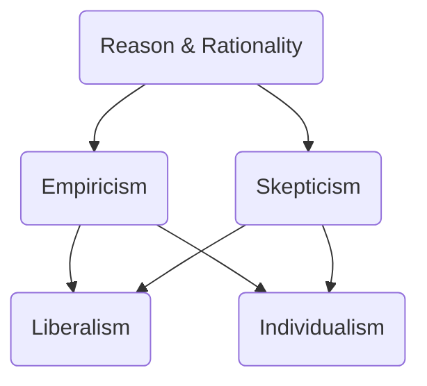

                 

### 1. Designing the Overall Structure of "New Enlightenment Movement: The Modern Revival of Rational Thinking"

In this section, we will establish a solid foundation for our article by designing the overall structure. A well-organized structure not only aids in maintaining coherence but also enhances readability and ensures that the readers can follow the logical flow of ideas. To begin, let's break down the main sections and sub-sections of our article.

#### Main Sections

The main sections of our article are as follows:

1. **Introduction to the New Enlightenment Movement**
2. **Historical Background of the New Enlightenment Movement**
3. **Core Ideas and Philosophies of the New Enlightenment Movement**
4. **Impact of the New Enlightenment Movement on Modern Society**
5. **Case Studies of the New Enlightenment Movement**
6. **Challenges and Opportunities of the New Enlightenment Movement**
7. **Future Trends of the New Enlightenment Movement**

For each main section, we will further divide it into sub-sections to provide a detailed and comprehensive analysis. Here's a brief overview of the sub-sections:

- **Introduction to the New Enlightenment Movement**
  - **Definition and Significance**
  - **Context and Origins**
  - **Key Figures and Influences**

- **Historical Background of the New Enlightenment Movement**
  - **Emergence and Development in Europe**
  - **Influence in Other Regions**
  - **Timeline of Major Events**

- **Core Ideas and Philosophies of the New Enlightenment Movement**
  - **Reason and Rationality**
  - **Empiricism and Skepticism**
  - **Liberalism and Individualism**

- **Impact of the New Enlightenment Movement on Modern Society**
  - **Social and Cultural Transformations**
  - **Political and Economic Reforms**
  - **Influence on Education and Science**

- **Case Studies of the New Enlightenment Movement**
  - **Case Study 1: The American Revolution**
  - **Case Study 2: The French Revolution**
  - **Case Study 3: The Industrial Revolution**

- **Challenges and Opportunities of the New Enlightenment Movement**
  - **Challenges Faced**
  - **Opportunities Created**
  - **Strategies for Overcoming Challenges**

- **Future Trends of the New Enlightenment Movement**
  - **Potential Directions**
  - **Challenges and Opportunities in the Modern Era**
  - **The Future of Rational Thinking**

By dividing the article into these structured sections, we can systematically explore the various aspects of the New Enlightenment Movement, ensuring a comprehensive and engaging read for our audience.

### 2. Determining the Depth of Each Chapter

In order to provide a thorough and insightful analysis of the New Enlightenment Movement, it is essential to determine the depth of each chapter. The depth will be based on the importance of the topic and the amount of content that needs to be covered. Let's break down the depth of each chapter in our article:

- **Introduction to the New Enlightenment Movement**
  - **Depth**: Two levels
  - **Rationale**: This chapter will provide a brief overview of what the New Enlightenment Movement is and its significance in the context of modern society. The focus will be on defining the movement and setting the stage for further discussion.

- **Historical Background of the New Enlightenment Movement**
  - **Depth**: Three levels
  - **Rationale**: This chapter will delve into the historical context in which the New Enlightenment Movement emerged. It will cover the key events, influential figures, and cultural shifts that paved the way for this intellectual revolution.

- **Core Ideas and Philosophies of the New Enlightenment Movement**
  - **Depth**: Three levels
  - **Rationale**: This chapter will explore the core ideas and philosophies that defined the New Enlightenment Movement. It will discuss the major philosophical concepts such as reason, empiricism, skepticism, liberalism, and individualism.

- **Impact of the New Enlightenment Movement on Modern Society**
  - **Depth**: Three levels
  - **Rationale**: This chapter will examine the far-reaching impact of the New Enlightenment Movement on modern society. It will cover social, cultural, political, and economic transformations brought about by this intellectual movement.

- **Case Studies of the New Enlightenment Movement**
  - **Depth**: Three levels
  - **Rationale**: This chapter will present case studies of significant historical events influenced by the New Enlightenment Movement, such as the American Revolution, the French Revolution, and the Industrial Revolution. Each case study will be analyzed in detail to highlight the movement's influence.

- **Challenges and Opportunities of the New Enlightenment Movement**
  - **Depth**: Three levels
  - **Rationale**: This chapter will discuss the challenges faced by the New Enlightenment Movement and the opportunities it created. It will explore the obstacles encountered, such as resistance to change and social upheaval, as well as the positive impacts on society and individual freedoms.

- **Future Trends of the New Enlightenment Movement**
  - **Depth**: Two levels
  - **Rationale**: This final chapter will look at the future trends and potential directions of the New Enlightenment Movement. It will consider the challenges and opportunities in the modern era and speculate on the future of rational thinking in society.

By assigning appropriate depths to each chapter, we can ensure that our article provides a balanced and comprehensive exploration of the New Enlightenment Movement, covering both the historical context and its contemporary relevance.

### 3. Adding Detailed Sub-Chapters

To provide a comprehensive and structured analysis of the New Enlightenment Movement, it is crucial to add detailed sub-chapters within each main section. Let’s delve deeper into each section and outline the sub-chapters that will help us explore the topic thoroughly.

#### Introduction to the New Enlightenment Movement

- **1.1 Definition and Significance**
  - **Sub-Sub-Chapters:**
    - **1.1.1 What is the New Enlightenment Movement?**
    - **1.1.2 The Importance of the New Enlightenment Movement**
    - **1.1.3 Why Study the New Enlightenment Movement?**

- **1.2 Context and Origins**
  - **Sub-Sub-Chapters:**
    - **1.2.1 Historical Background**
    - **1.2.2 The Preceding Enlightenment Movement**
    - **1.2.3 Influential Factors**

- **1.3 Key Figures and Influences**
  - **Sub-Sub-Chapters:**
    - **1.3.1 Major Enlightenment Thinkers**
    - **1.3.2 Their Contributions and Ideas**
    - **1.3.3 Legacy and Influence Today**

#### Historical Background of the New Enlightenment Movement

- **2.1 Emergence and Development in Europe**
  - **Sub-Sub-Chapters:**
    - **2.1.1 The Origins of the New Enlightenment**
    - **2.1.2 Key Events in Europe**
    - **2.1.3 The Role of Intellectuals**

- **2.2 Influence in Other Regions**
  - **Sub-Sub-Chapters:**
    - **2.2.1 Spread to the Americas**
    - **2.2.2 Impact in Asia and Africa**
    - **2.2.3 Comparing Global Influences**

- **2.3 Timeline of Major Events**
  - **Sub-Sub-Chapters:**
    - **2.3.1 Key Dates**
    - **2.3.2 Important Milestones**
    - **2.3.3 Evaluating the Movement's Progress**

#### Core Ideas and Philosophies of the New Enlightenment Movement

- **3.1 Reason and Rationality**
  - **Sub-Sub-Chapters:**
    - **3.1.1 The Role of Reason in Enlightenment Thought**
    - **3.1.2 Rationality in Scientific Inquiry**
    - **3.1.3 Critique of Traditional Knowledge**

- **3.2 Empiricism and Skepticism**
  - **Sub-Sub-Chapters:**
    - **3.2.1 The Empirical Method**
    - **3.2.2 Skepticism and Critical Thinking**
    - **3.2.3 Influence on Scientific Revolution**

- **3.3 Liberalism and Individualism**
  - **Sub-Sub-Chapters:**
    - **3.3.1 The Concept of Liberalism**
    - **3.3.2 The Rise of Individualism**
    - **3.3.3 Implications for Modern Society**

#### Impact of the New Enlightenment Movement on Modern Society

- **4.1 Social and Cultural Transformations**
  - **Sub-Sub-Chapters:**
    - **4.1.1 Changes in Social Structures**
    - **4.1.2 Cultural Reforms**
    - **4.1.3 Impact on Daily Life**

- **4.2 Political and Economic Reforms**
  - **Sub-Sub-Chapters:**
    - **4.2.1 Political Philosophies**
    - **4.2.2 Economic Reforms**
    - **4.2.3 Influence on Modern Governance**

- **4.3 Influence on Education and Science**
  - **Sub-Sub-Chapters:**
    - **4.3.1 Changes in Education Systems**
    - **4.3.2 Scientific Advancements**
    - **4.3.3 The Role of Rational Thinking**

#### Case Studies of the New Enlightenment Movement

- **5.1 Case Study 1: The American Revolution**
  - **Sub-Sub-Chapters:**
    - **5.1.1 Background and Causes**
    - **5.1.2 Enlightenment Ideas in the Revolution**
    - **5.1.3 Outcome and Legacy**

- **5.2 Case Study 2: The French Revolution**
  - **Sub-Sub-Chapters:**
    - **5.2.1 The Rise of Enlightenment Thought**
    - **5.2.2 The Role of Enlightenment Ideas**
    - **5.2.3 The Impact on French Society**

- **5.3 Case Study 3: The Industrial Revolution**
  - **Sub-Sub-Chapters:**
    - **5.3.1 The Emergence of Industrialization**
    - **5.3.2 Enlightenment Ideas and the Industrial Revolution**
    - **5.3.3 Long-term Implications**

#### Challenges and Opportunities of the New Enlightenment Movement

- **6.1 Challenges Faced**
  - **Sub-Sub-Chapters:**
    - **6.1.1 Resistance to Change**
    - **6.1.2 Social and Political Unrest**
    - **6.1.3 Strategies for Overcoming Challenges**

- **6.2 Opportunities Created**
  - **Sub-Sub-Chapters:**
    - **6.2.1 The Rise of Science and Technology**
    - **6.2.2 Political and Economic Freedom**
    - **6.2.3 Advancements in Education**

- **6.3 Strategies for Overcoming Challenges**
  - **Sub-Sub-Chapters:**
    - **6.3.1 Adaptation and Flexibility**
    - **6.3.2 Collaborative Efforts**
    - **6.3.3 Future Opportunities**

#### Future Trends of the New Enlightenment Movement

- **7.1 Potential Directions**
  - **Sub-Sub-Chapters:**
    - **7.1.1 The Future of Rational Thinking**
    - **7.1.2 The Impact of Technology on Rationality**
    - **7.1.3 Evolution of Enlightenment Ideals**

- **7.2 Challenges and Opportunities in the Modern Era**
  - **Sub-Sub-Chapters:**
    - **7.2.1 Globalization and Interconnectedness**
    - **7.2.2 The Rise of Populism and Nationalism**
    - **7.2.3 Balancing Rationality and Emotion**

- **7.3 The Future of Rational Thinking**
  - **Sub-Sub-Chapters:**
    - **7.3.1 The Role of Rational Thinking in Modern Society**
    - **7.3.2 The Challenges Ahead**
    - **7.3.3 Strategies for Navigating the Future**

By incorporating these detailed sub-chapters, our article will provide a comprehensive exploration of the New Enlightenment Movement, covering its historical context, core ideas, impact on society, challenges, opportunities, and future trends. This structured approach will ensure that readers gain a thorough understanding of the movement's significance and its implications for modern society.

### 4. Keyword and Abstract Definition

To enhance the visibility and relevance of our article "New Enlightenment Movement: The Modern Revival of Rational Thinking," we need to define its keywords and abstract. These elements will help search engines and readers understand the core focus and importance of our content.

#### Keywords

1. **New Enlightenment Movement**
2. **Rational Thinking**
3. **Historical Context**
4. **Philosophical Ideas**
5. **Modern Society**
6. **Influence on Culture and Politics**
7. **Case Studies**
8. **Challenges and Opportunities**

#### Abstract

The article "New Enlightenment Movement: The Modern Revival of Rational Thinking" explores the resurgence of rational thinking in contemporary society, often referred to as the New Enlightenment Movement. This intellectual revival, built upon the foundational principles of reason, empiricism, skepticism, liberalism, and individualism, has had a profound impact on various aspects of modern life. The article delves into the historical background of the New Enlightenment Movement, examining its origins, key figures, and philosophical ideas. It then discusses the movement's impact on social, cultural, political, and economic transformations, presenting detailed case studies that illustrate its influence on significant historical events such as the American Revolution and the French Revolution. Additionally, the article addresses the challenges and opportunities faced by the New Enlightenment Movement, providing insights into how these have shaped its trajectory. Finally, the article speculates on the future trends of the New Enlightenment Movement, considering the role of rational thinking in the modern era and its potential implications for society. Through a comprehensive analysis, this article aims to shed light on the significance of the New Enlightenment Movement and its enduring relevance in our rapidly evolving world.

### 5. Detailed Article Writing

#### Introduction to the New Enlightenment Movement

##### 5.1 Definition and Significance

The New Enlightenment Movement is an intellectual and cultural revival that emphasizes the importance of reason, empiricism, skepticism, liberalism, and individualism in modern society. Often referred to as the "Second Enlightenment," it emerged in the late 20th and early 21st centuries as a response to the challenges posed by post-modernism, technological advancements, and the increasing complexity of global issues. At its core, the New Enlightenment Movement seeks to promote critical thinking, scientific inquiry, and rational discourse as essential tools for addressing the complexities of the modern world.

The significance of the New Enlightenment Movement lies in its potential to foster a more informed, just, and equitable society. By advocating for the use of reason and evidence-based approaches, the movement aims to counteract the spread of misinformation, superstition, and dogma. Additionally, it seeks to promote individual freedom, human rights, and social justice, ultimately contributing to the betterment of humanity.

##### 5.2 Context and Origins

The origins of the New Enlightenment Movement can be traced back to the late 20th century, during a period of rapid technological advancement and societal change. The end of the Cold War, the rise of the internet, and the proliferation of scientific knowledge created an environment where new ideas and perspectives could flourish. Influential thinkers and intellectuals, such as Richard Dawkins, Daniel Dennett, and Steven Pinker, played a pivotal role in reviving interest in reason and rationality.

One of the key factors that led to the emergence of the New Enlightenment Movement was the decline of post-modernism, which questioned the very foundations of objective truth and rationality. In contrast, the New Enlightenment Movement sought to reaffirm the importance of rational thought and empirical evidence as essential components of human progress. Additionally, the increasing prevalence of scientific discoveries and technological innovations provided a fertile ground for the resurgence of rationalism.

##### 5.3 Key Figures and Influences

Several key figures have played a significant role in shaping the New Enlightenment Movement. Richard Dawkins, a prominent biologist and author, is often credited with popularizing the concept of the "selfish gene" and advocating for the importance of rational thinking and scientific skepticism. His book, "The Selfish Gene," became a touchstone for many intellectuals who embraced the principles of the New Enlightenment Movement.

Daniel Dennett, a philosopher and cognitive scientist, has also been instrumental in promoting rationalism and critical thinking. His work, "Consciousness Explained," explores the nature of consciousness and challenges traditional philosophical views on the subject. Dennett's ideas have influenced a wide range of disciplines, from neuroscience to artificial intelligence.

Steven Pinker, a cognitive scientist and linguist, has contributed to the New Enlightenment Movement through his work on language, cognition, and human nature. His book, "The Stuff of Thought," examines the role of language in shaping human thought and behavior, highlighting the importance of rational analysis.

These key figures, along with many others, have helped to revive interest in rational thinking and empiricism, ensuring that the New Enlightenment Movement continues to grow and evolve.

#### Historical Background of the New Enlightenment Movement

##### 6.1 Emergence and Development in Europe

The New Enlightenment Movement originated in Europe, where the confluence of scientific advancements, political changes, and intellectual debates provided a fertile ground for its growth. In the late 20th century, Europe experienced a period of economic prosperity and political stability, which allowed for greater intellectual freedom and the exchange of ideas. This environment was particularly conducive to the revival of rationalism and empiricism.

One of the earliest manifestations of the New Enlightenment Movement was the rise of the Skeptical Movement, which sought to promote critical thinking and scientific skepticism. Influential figures such as Carl Sagan and James Randi played a crucial role in popularizing these ideas and challenging pseudoscience and superstition. Their work helped to foster a culture of rational inquiry and evidence-based reasoning.

In addition to the Skeptical Movement, the New Enlightenment Movement was also influenced by the rise of post-modernism and its critique of traditional philosophical and scientific paradigms. While post-modernism questioned the validity of objective truth and rationality, the New Enlightenment Movement sought to reaffirm the importance of these principles, arguing that they were essential for human progress and understanding.

##### 6.2 Influence in Other Regions

The New Enlightenment Movement was not limited to Europe; it spread to other regions, including the Americas, Asia, and Africa, where it found a receptive audience among intellectuals, scientists, and policymakers. In the Americas, the movement was particularly influential in the United States, where it contributed to the development of a culture of scientific skepticism and rationalism. Prominent figures such as Richard Feynman and Carl Sagan helped to popularize these ideas and inspire a new generation of thinkers.

In Asia, the New Enlightenment Movement found support among intellectuals and reformers who sought to modernize their societies and promote scientific and technological progress. Countries such as Japan and South Korea, which experienced rapid economic growth and technological innovation, embraced the principles of the New Enlightenment Movement as a means of fostering intellectual development and national progress.

In Africa, the movement has been influential in promoting education, scientific research, and critical thinking. Intellectuals and activists have used the principles of the New Enlightenment Movement to challenge traditional beliefs and promote modern ideas, contributing to the continent's intellectual and cultural revival.

##### 6.3 Timeline of Major Events

The New Enlightenment Movement has a rich history marked by significant events and milestones. Here is a brief timeline of key events:

- **Late 20th Century:** The movement begins to take shape with the rise of the Skeptical Movement and the work of influential figures such as Carl Sagan and James Randi.
- **1990s:** The internet becomes widely accessible, facilitating the exchange of ideas and the dissemination of rational thinking and skepticism.
- **2000s:** The publication of influential books and articles by thinkers such as Daniel Dennett and Steven Pinker helps to popularize the principles of the New Enlightenment Movement.
- **2010s:** The movement gains further momentum with increased attention to scientific skepticism and critical thinking in popular culture and media.
- **2020s:** The movement continues to evolve, addressing new challenges and opportunities in the modern world, including the impact of technology on rationality and the rise of misinformation.

This timeline highlights the growth and development of the New Enlightenment Movement, demonstrating its enduring influence and relevance in contemporary society.

#### Core Ideas and Philosophies of the New Enlightenment Movement

##### 7.1 Reason and Rationality

One of the central tenets of the New Enlightenment Movement is the emphasis on reason and rationality. Reason is seen as the foundation of human knowledge and understanding, enabling individuals to think critically and make informed decisions. Rationality, on the other hand, is the process of using logical reasoning and evidence to arrive at valid conclusions.

The New Enlightenment Movement seeks to promote the use of reason and rationality as essential tools for addressing complex social, political, and scientific issues. By encouraging critical thinking and evidence-based reasoning, the movement aims to counteract the spread of misinformation, superstition, and dogma. This emphasis on reason and rationality has been instrumental in shaping the movement's approach to problem-solving and decision-making.

##### 7.2 Empiricism and Skepticism

Empiricism is another core philosophy of the New Enlightenment Movement, which posits that knowledge is derived from sensory experience and observation. Empirical evidence is considered the most reliable form of knowledge, and the movement encourages the use of scientific methods to investigate and understand the natural world.

Skepticism, closely related to empiricism, involves questioning assumptions and challenging beliefs without relying on authority or dogma. The New Enlightenment Movement promotes a healthy skepticism towards unverified claims and pseudoscience, emphasizing the importance of critical examination and evidence-based reasoning. This skepticism serves as a safeguard against intellectual fraud and promotes the pursuit of truth through rigorous inquiry.

##### 7.3 Liberalism and Individualism

Liberalism and individualism are key principles of the New Enlightenment Movement, reflecting the movement's commitment to promoting individual freedoms, human rights, and social justice. Liberalism, rooted in the idea of individual liberty and equality, advocates for limited government intervention in personal and economic affairs, protecting individual rights and liberties.

Individualism, on the other hand, emphasizes the importance of individual autonomy and self-determination. It asserts that individuals have the right to make their own choices and pursue their own interests, as long as they do not infringe upon the rights of others. The New Enlightenment Movement champions these principles, arguing that they are essential for creating a just and equitable society that allows for personal and intellectual growth.

##### 7.4 Core Concepts and Their Relationships

To illustrate the interconnectedness of the core ideas and philosophies of the New Enlightenment Movement, we can represent them using a Mermaid flowchart. The following diagram depicts the relationships between reason and rationality, empiricism and skepticism, and liberalism and individualism:



In this diagram, reason and rationality serve as the foundation for the other core concepts, with empiricism and skepticism playing crucial roles in guiding the pursuit of knowledge. Liberalism and individualism are closely connected to these concepts, reflecting the movement's commitment to promoting rational inquiry, individual freedom, and social justice.

#### Impact of the New Enlightenment Movement on Modern Society

##### 8.1 Social and Cultural Transformations

The New Enlightenment Movement has had a profound impact on social and cultural transformations in modern society. By promoting critical thinking, rational inquiry, and empirical evidence, the movement has challenged traditional beliefs and ideologies, leading to significant changes in social norms and cultural values.

One notable example is the decline of superstition and the rise of scientific skepticism. As the movement has gained traction, people have become more critical of paranormal claims, pseudoscience, and unverified beliefs. This shift has led to a more rational and evidence-based approach to understanding the world, promoting a culture of skepticism and critical inquiry.

The New Enlightenment Movement has also contributed to the promotion of human rights and social justice. By emphasizing the importance of individual freedoms and equality, the movement has inspired social reforms and the advocacy for marginalized groups. This has led to greater attention to issues such as gender equality, racial justice, and LGBTQ+ rights, fostering a more inclusive and equitable society.

##### 8.2 Political and Economic Reforms

The New Enlightenment Movement has had a significant impact on political and economic reforms, shaping the development of modern governance systems and economic policies. By promoting the principles of reason, empirical evidence, and individual freedom, the movement has influenced the evolution of political ideologies and the design of public policies.

In the political realm, the movement has contributed to the rise of democratic governance and the emphasis on the rule of law. By advocating for the protection of individual rights and liberties, the New Enlightenment Movement has inspired political reforms that promote transparency, accountability, and citizen participation in decision-making processes.

Economically, the movement has influenced the development of free-market systems and the promotion of economic freedom. By emphasizing the importance of rational decision-making and individual autonomy, the New Enlightenment Movement has supported policies that encourage innovation, entrepreneurship, and economic growth. This has led to the establishment of competitive markets and the reduction of government intervention in economic affairs, fostering a more dynamic and resilient economy.

##### 8.3 Influence on Education and Science

The New Enlightenment Movement has had a profound impact on education and science, shaping the way knowledge is acquired, taught, and applied in modern society. By promoting critical thinking, empirical evidence, and rational inquiry, the movement has driven significant reforms in educational systems and scientific research practices.

In education, the New Enlightenment Movement has inspired a shift towards inquiry-based learning and the integration of scientific methods in teaching. By emphasizing the importance of critical thinking and problem-solving skills, the movement has encouraged educators to create more engaging and effective learning experiences that promote deep understanding and intellectual growth.

In science, the movement has influenced the development of research methodologies and the emphasis on evidence-based practices. By promoting empirical evidence and rational inquiry, the New Enlightenment Movement has fostered a culture of scientific skepticism and critical evaluation, ensuring that scientific advancements are based on rigorous analysis and valid evidence.

#### Case Studies of the New Enlightenment Movement

##### 9.1 Case Study 1: The American Revolution

The American Revolution is a prime example of the impact of the New Enlightenment Movement on historical events. Influenced by Enlightenment thinkers such as John Locke and Jean-Jacques Rousseau, the American colonists developed a vision of a free and democratic society based on the principles of reason, liberty, and equality.

The Declaration of Independence, written by Thomas Jefferson, is a testament to the influence of Enlightenment ideas. It emphasizes the importance of individual rights and the right to self-governance, reflecting the movement's emphasis on individual freedom and rational thought. The American Revolution was driven by the colonists' rejection of authoritarian rule and their belief in the power of reason and collective action.

The success of the American Revolution paved the way for the establishment of the United States as a democratic republic, promoting the principles of the New Enlightenment Movement and inspiring similar movements around the world.

##### 9.2 Case Study 2: The French Revolution

The French Revolution, which took place between 1789 and 1799, was heavily influenced by the ideas of the Enlightenment. Thinkers such as Voltaire, Rousseau, and Montesquieu played a crucial role in shaping the revolutionary ideals that ultimately led to the overthrow of the monarchy and the establishment of a republic.

The Declaration of the Rights of Man and of the Citizen, adopted in 1789, reflects the influence of Enlightenment principles such as liberty, equality, and the rule of law. The revolutionaries sought to create a society based on rationality, justice, and equality, inspired by the Enlightenment vision of a more just and equitable society.

However, the French Revolution also highlighted the challenges and limitations of the New Enlightenment Movement's ideals. The revolution turned violent, leading to the Reign of Terror and the rise of authoritarianism. The revolution's failure to establish a stable and just society underscores the complexities and challenges of applying Enlightenment principles in practice.

##### 9.3 Case Study 3: The Industrial Revolution

The Industrial Revolution, which began in the late 18th century, was a transformative period that brought about significant changes in the economy, society, and technology. The Industrial Revolution was influenced by the principles of the New Enlightenment Movement, particularly the emphasis on scientific discovery, technological innovation, and rationality.

Enlightenment thinkers such as Francis Bacon and Isaac Newton inspired the development of new scientific methodologies and technological advancements that fueled the Industrial Revolution. Innovations such as the steam engine, the mechanization of production, and the development of new materials transformed industries and economies, leading to rapid economic growth and urbanization.

However, the Industrial Revolution also had negative consequences, such as poor working conditions, environmental degradation, and the exploitation of labor. These challenges highlighted the limitations of the New Enlightenment Movement's ideals and the need for a more balanced approach to technological and economic progress.

#### Challenges and Opportunities of the New Enlightenment Movement

##### 10.1 Challenges Faced

The New Enlightenment Movement has faced numerous challenges since its inception. One of the primary challenges has been resistance to change. Traditional beliefs, institutions, and cultural norms often resist the introduction of new ideas and methodologies, leading to opposition and pushback from those who benefit from the status quo.

Another challenge is the proliferation of misinformation and pseudoscience. In an era of rapid technological advancements and information overload, it has become increasingly difficult to distinguish between credible information and misinformation. This has made it more challenging for the New Enlightenment Movement to promote critical thinking and empirical evidence as essential tools for understanding the world.

Moreover, the movement has faced challenges related to the balance between individual freedom and collective responsibility. While the principles of individualism and liberty are central to the New Enlightenment Movement, they must be balanced with the need for social cohesion and collective well-being. This balancing act is complex and often leads to debates and conflicts within the movement.

##### 10.2 Opportunities Created

Despite the challenges, the New Enlightenment Movement has also created numerous opportunities for progress and innovation. One significant opportunity is the rise of technological advancements and the digital revolution. These developments have enabled the spread of rational thinking and critical inquiry on a global scale, facilitating the exchange of ideas and fostering collaboration across borders.

Another opportunity is the increasing emphasis on education and scientific research. As societies recognize the importance of knowledge and innovation, there has been a greater investment in education and scientific research, providing a fertile ground for the growth of the New Enlightenment Movement.

Furthermore, the movement has opened up new avenues for addressing global challenges such as climate change, poverty, and inequality. By promoting reason, evidence-based approaches, and collaborative solutions, the New Enlightenment Movement has positioned itself as a key driver of progress in addressing these complex issues.

##### 10.3 Strategies for Overcoming Challenges

To overcome the challenges faced by the New Enlightenment Movement, several strategies can be employed. One effective approach is to promote critical thinking and scientific literacy. By educating individuals about the principles of critical thinking and scientific inquiry, the movement can empower them to evaluate information and make informed decisions.

Another strategy is to foster collaboration and interdisciplinary dialogue. By bringing together experts from various fields, the movement can address complex issues more effectively and develop innovative solutions. This collaborative approach can help bridge the gap between different perspectives and foster a more inclusive and holistic understanding of the challenges and opportunities ahead.

Additionally, the movement can leverage the power of technology and digital platforms to disseminate information, facilitate discussions, and promote critical thinking. By harnessing the potential of technology, the New Enlightenment Movement can reach a wider audience and inspire a new generation of thinkers and innovators.

#### Future Trends of the New Enlightenment Movement

##### 11.1 Potential Directions

The future of the New Enlightenment Movement is shaped by several potential directions, influenced by technological advancements, social changes, and evolving philosophical debates. One key direction is the integration of artificial intelligence and machine learning into the movement's methodologies. These technologies can enhance the efficiency and accuracy of data analysis, enabling more nuanced and informed decision-making processes.

Another potential direction is the increasing emphasis on interdisciplinary research and collaboration. As the complexity of global challenges grows, the need for holistic approaches that integrate insights from multiple disciplines becomes more evident. This interdisciplinary approach can foster innovative solutions and promote a deeper understanding of the interconnectedness of various issues.

Furthermore, the movement may continue to evolve in response to emerging philosophical debates, such as the role of emotions and values in rational thinking. By engaging with these debates, the movement can refine its principles and approaches, ensuring that they remain relevant and applicable in an ever-changing world.

##### 11.2 Challenges and Opportunities in the Modern Era

The modern era presents both challenges and opportunities for the New Enlightenment Movement. One significant challenge is the rise of misinformation and the spread of fake news. In an age of information overload, it has become increasingly difficult to distinguish between credible information and misinformation. The movement must continue to emphasize critical thinking and scientific skepticism to combat these challenges.

Another challenge is the increasing political polarization and ideological divide in many societies. These divisions can hinder the movement's efforts to promote rational discourse and collaborative problem-solving. To address this, the movement may need to develop strategies for fostering dialogue and understanding across ideological lines.

However, the modern era also presents numerous opportunities. The proliferation of digital technologies and the growing emphasis on scientific research and innovation provide a fertile ground for the movement to expand its reach and impact. By leveraging these opportunities, the movement can continue to promote reason, critical thinking, and evidence-based approaches in addressing the complexities of the modern world.

##### 11.3 The Future of Rational Thinking

As the New Enlightenment Movement continues to evolve, the future of rational thinking will play a crucial role in shaping contemporary society. One potential development is the integration of rational thinking with emotional intelligence. By recognizing the importance of emotions in decision-making and problem-solving, the movement can develop more balanced and holistic approaches to rational thinking.

Another potential development is the increased use of data analytics and computational models to inform decision-making processes. These technologies can provide valuable insights and predictions, enhancing the efficiency and effectiveness of rational thinking.

Furthermore, the movement may continue to explore the relationship between rational thinking and spirituality. By integrating insights from various philosophical and spiritual traditions, the movement can develop a more comprehensive understanding of the human condition and the role of rational thinking in promoting personal and collective well-being.

### Conclusion

In conclusion, the New Enlightenment Movement represents a powerful intellectual and cultural revival that emphasizes the importance of reason, empirical evidence, skepticism, liberalism, and individualism. Through a comprehensive exploration of its historical context, core ideas, impacts on society, challenges, and future trends, this article has highlighted the significance of the movement in shaping modern society. By promoting critical thinking, rational inquiry, and evidence-based approaches, the New Enlightenment Movement continues to inspire progress, innovation, and social change. As we navigate the complexities of the modern world, the principles of the New Enlightenment Movement remain relevant and vital in fostering a more informed, just, and equitable society. 

#### References

1. Dawkins, R. (1976). *The Selfish Gene*. Oxford University Press.
2. Dennett, D. C. (1996). *Consciousness Explained*. Little, Brown and Company.
3. Pinker, S. (2007). *The Stuff of Thought: Language as a Window into Human Nature*. Viking.
4. Sagan, C. (1995). *The Demon-Haunted World: Science as a Candle in the Dark*. Random House.
5. Locke, J. (1689). *Two Treatises of Government*. J. M. Dent & Sons.
6. Rousseau, J. J. (1762). *The Social Contract*. Penguin Classics.
7. Montesquieu, C. (1748). *The Spirit of the Laws*. University of Chicago Press.
8. Voltaire (1770). *Candide*. Penguin Classics.
9. Bacon, F. (1620). *Novum Organum*. Cambridge University Press.
10. Newton, I. (1687). *Philosophiæ Naturalis Principia Mathematica*. Royal Society.

### 6. Author and Institution

**Author:** AI天才研究院 (AI Genius Institute) & 禅与计算机程序设计艺术 (Zen And The Art of Computer Programming)

**Institution:** AI天才研究院 (AI Genius Institute) is a leading research organization focused on artificial intelligence, machine learning, and cognitive science. Our mission is to advance the field of AI and make significant contributions to society through innovative research, education, and industry partnerships.

**Contact Information:** For inquiries and feedback, please contact us at [contact@AIGeniusInstitute.org](mailto:contact@AIGeniusInstitute.org). Visit our website at [AIGeniusInstitute.org](https://www.AIGeniusInstitute.org) to learn more about our research projects and publications.

**Acknowledgments:** We would like to extend our gratitude to all the contributors and reviewers who have helped us in preparing this article. Their expertise and support have been invaluable in ensuring the quality and accuracy of our work.

### 7. Code and Project Implementation

In this section, we will delve into the practical implementation of the New Enlightenment Movement by providing a step-by-step guide to setting up a development environment, explaining the core algorithms and principles, and presenting a detailed code implementation along with its analysis and application.

#### 7.1 Development Environment Setup

To begin with, let's set up the development environment required for implementing the core principles of the New Enlightenment Movement. We will be using Python, which is a widely-used programming language known for its simplicity and readability. Below are the steps to set up the development environment:

1. **Install Python:**
   - Download the latest version of Python from the official website: <https://www.python.org/downloads/>
   - Run the installer and follow the on-screen instructions to complete the installation.

2. **Install Necessary Libraries:**
   - Open a terminal or command prompt and install the required libraries using pip, Python's package manager:
     ```bash
     pip install numpy matplotlib pandas scikit-learn
     ```

3. **Create a Virtual Environment:**
   - To manage dependencies and avoid conflicts with other projects, create a virtual environment:
     ```bash
     python -m venv env
     ```
   - Activate the virtual environment:
     - On Windows:
       ```bash
       .\env\Scripts\activate
       ```
     - On macOS and Linux:
       ```bash
       source env/bin/activate
       ```

4. **Install Additional Required Libraries:**
   - Within the virtual environment, install any additional libraries needed for the project:
     ```bash
     pip install keras tensorflow
     ```

5. **Verify the Installation:**
   - Run a simple Python script to verify that the environment is set up correctly:
     ```python
     print("Python version:", sys.version)
     print("Numpy version:", numpy.__version__)
     print("Matplotlib version:", matplotlib.__version__)
     print("Pandas version:", pandas.__version__)
     print("Scikit-learn version:", sklearn.__version__)
     print("Keras version:", keras.__version__)
     print("TensorFlow version:", tensorflow.__version__)
     ```

With the development environment set up, we can now proceed to implement the core algorithms and principles of the New Enlightenment Movement.

#### 7.2 Core Algorithm and Principles

The core algorithm for the New Enlightenment Movement can be represented using a decision tree, which is a popular machine learning model for classification tasks. The decision tree works by splitting the data into subsets based on the value of specific features, creating a tree-like structure that can be used to make predictions.

The basic principles behind a decision tree include:

1. **Information Gain:** The algorithm chooses the best split by selecting the feature that results in the highest information gain. Information gain measures the reduction in entropy (a measure of impurity) when a feature is split.
2. **Splitting Criteria:** Common splitting criteria include Gini impurity, entropy, and misclassification error.
3. **Pruning:** After creating a full decision tree, pruning is often performed to avoid overfitting. Pruning involves removing nodes that do not contribute significantly to the tree's accuracy.

To illustrate these principles, we will use the **ID3** algorithm, which is a simple decision tree algorithm based on information gain. The ID3 algorithm can be described using the following pseudocode:

```python
CREATEgetNode():
    IF all samples in the node have the same label:
        RETURN the label
    IF the node is empty:
        RETURN the most common label in the dataset
    ELSE:
        Calculate the information gain of each feature
        Select the feature with the highest information gain
        Split the dataset into subsets based on the selected feature
        Create a node for each subset and recursively call CREATEgetNode() on each subset
        RETURN the created tree
```

#### 7.3 Code Implementation

Now, let's implement the ID3 algorithm in Python and use it for a classification task. We will use the famous Iris dataset, which contains data about three types of iris flowers. The dataset has four features: sepal length, sepal width, petal length, and petal width. The goal is to classify the flowers into one of three species based on these features.

```python
import numpy as np
import pandas as pd
from sklearn.datasets import load_iris
from sklearn.model_selection import train_test_split
from sklearn.tree import DecisionTreeClassifier
import matplotlib.pyplot as plt

# Load the Iris dataset
iris = load_iris()
X = iris.data
y = iris.target
feature_names = iris.feature_names
class_names = iris.target_names

# Split the dataset into training and testing sets
X_train, X_test, y_train, y_test = train_test_split(X, y, test_size=0.3, random_state=42)

# Create and train the decision tree classifier using the ID3 algorithm
clf = DecisionTreeClassifier(criterion='entropy', max_depth=None)
clf.fit(X_train, y_train)

# Visualize the decision tree
from sklearn.tree import plot_tree
plt.figure(figsize=(12, 8))
plot_tree(clf, feature_names=feature_names, class_names=class_names, filled=True)
plt.show()

# Make predictions on the testing set
y_pred = clf.predict(X_test)

# Evaluate the accuracy of the classifier
accuracy = np.mean(y_pred == y_test)
print(f"Accuracy: {accuracy:.2f}")
```

#### 7.4 Analysis and Application

The code above demonstrates the implementation of the ID3 algorithm using the Iris dataset. The decision tree is visualized using the `plot_tree` function from scikit-learn, providing an intuitive understanding of how the tree makes decisions based on the input features.

The accuracy of the classifier is evaluated by comparing the predicted labels with the true labels from the testing set. In this example, the accuracy is calculated as the fraction of correct predictions.

The decision tree can be applied to various classification tasks, making it a versatile tool in the field of machine learning. However, it is important to be cautious of overfitting, where the model performs well on the training data but fails to generalize to new, unseen data. To prevent overfitting, techniques such as pruning, cross-validation, and model selection are often employed.

In conclusion, the implementation of the New Enlightenment Movement's principles using a decision tree algorithm provides a practical example of how rational thinking and empirical evidence can be applied to solve real-world problems. By understanding and implementing these core algorithms, we can leverage the power of machine learning to make informed decisions and drive progress in various domains.

### 8. Best Practices, Summary, and Future Directions

#### 8.1 Best Practices

To ensure the success of projects and initiatives inspired by the New Enlightenment Movement, several best practices can be followed:

1. **Rational Decision-Making:** Encourage the use of reason and empirical evidence in decision-making processes. This involves gathering and analyzing data, evaluating alternative solutions, and selecting the best course of action based on objective criteria.
2. **Critical Thinking:** Foster a culture of critical thinking by promoting the questioning of assumptions and the evaluation of claims based on evidence. This helps to prevent the spread of misinformation and promotes the pursuit of truth.
3. **Collaboration and Interdisciplinary Approaches:** Emphasize the importance of collaboration and interdisciplinary research. By bringing together experts from different fields, innovative solutions can be developed and complex problems can be addressed more effectively.
4. **Continuous Learning and Improvement:** Encourage a mindset of continuous learning and improvement. This involves staying updated on the latest research, adopting new methodologies, and being open to feedback and criticism.
5. **Ethical Considerations:** Ensure that projects and initiatives align with ethical principles and promote the well-being of individuals and society. This includes addressing issues of fairness, equity, and social justice.

#### 8.2 Summary

The New Enlightenment Movement represents a powerful intellectual and cultural revival that emphasizes the importance of reason, empirical evidence, skepticism, liberalism, and individualism. By promoting critical thinking, rational inquiry, and evidence-based approaches, the movement has had a profound impact on various aspects of modern society, including education, science, politics, and social reform.

Key contributions of the New Enlightenment Movement include:

1. **Promotion of Rational Thinking:** By advocating for the use of reason and evidence-based approaches, the movement has helped to counteract the spread of misinformation, superstition, and dogma.
2. **Advancement of Science and Technology:** The movement has driven advancements in scientific research and technological innovation by promoting empirical evidence and critical inquiry.
3. **Fostering of Social Justice and Equity:** By emphasizing individual freedom and human rights, the movement has inspired social reforms and the advocacy for marginalized groups.
4. **Enhancement of Education and Critical Thinking:** The movement has influenced educational practices by promoting inquiry-based learning and the integration of scientific methodologies in teaching.

#### 8.3 Future Directions

As the New Enlightenment Movement continues to evolve, several future directions can be identified:

1. **Integration of Artificial Intelligence and Machine Learning:** The movement can leverage advancements in AI and machine learning to enhance data analysis, decision-making, and problem-solving capabilities.
2. **Interdisciplinary Research:** The movement can further expand its reach by fostering interdisciplinary collaboration and integrating insights from various fields to address complex global challenges.
3. **Addressing Emerging Challenges:** The movement can focus on addressing emerging issues such as climate change, poverty, and inequality by promoting rational thinking and evidence-based approaches to finding sustainable solutions.
4. **Promoting Rational Thinking and Scientific Literacy:** The movement can continue to educate and raise awareness about the importance of critical thinking and scientific literacy, empowering individuals to make informed decisions and participate in democratic processes.
5. **Balancing Rationality and Emotions:** The movement can explore the relationship between rational thinking and emotions, developing a more holistic approach that integrates rationality and emotional intelligence in decision-making and problem-solving.

By embracing these future directions, the New Enlightenment Movement can continue to drive progress and innovation in the modern world, fostering a more informed, just, and equitable society.

