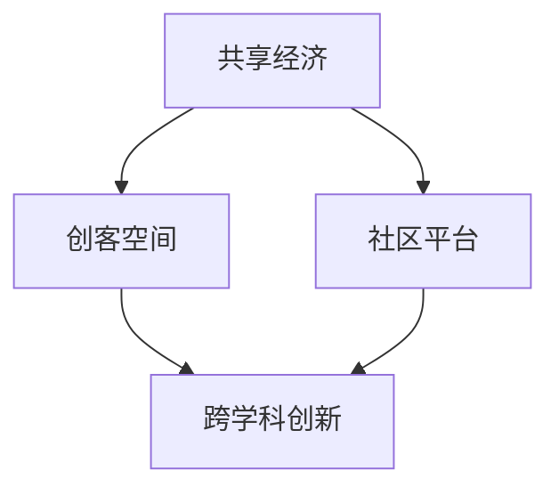

                 

### 文章标题

《新型城市共享创客空间：跨学科创新的社区平台》

> 关键词：新型城市、共享创客空间、跨学科创新、社区平台、共享经济

> 摘要：本文旨在探讨新型城市共享创客空间的概念、实践、创新点及其作为跨学科社区平台的角色。通过梳理共享创客空间的起源与发展，分析其核心特征与功能，探讨其在城市创新体系中的重要性，并总结其运营策略与未来发展趋势。本文旨在为读者提供对新型城市共享创客空间的全面理解，为其在实践中的应用与发展提供有益参考。

---

### 1. 背景介绍

随着城市化进程的加速和共享经济的兴起，新型城市共享创客空间应运而生。共享创客空间是一种基于共享经济理念的社区平台，旨在为城市中的创新者、创业者、设计师、程序员等提供开放的物理空间、工具资源和知识交流的平台。这种模式不仅打破了传统的资源壁垒，促进了创新资源的共享与整合，也为城市创新体系的构建提供了新的思路。

共享创客空间的起源可以追溯到20世纪末的发达国家，特别是在硅谷等高科技集聚区。早期的共享创客空间如Hackerspace、FabLab等，以物理空间的共享为基础，逐渐发展成为跨学科创新的社区平台。近年来，随着我国城市化进程的推进和科技水平的提升，共享创客空间在我国也取得了显著的进展，成为推动城市创新的重要力量。

在城市创新体系中，共享创客空间具有不可替代的地位。首先，它为创新者提供了低成本、高效率的创业环境，降低了创业门槛，激发了大众创新活力。其次，共享创客空间通过跨学科合作，促进了不同领域间的知识融合与技术创新，提高了创新效率。最后，共享创客空间作为一种社区平台，为城市居民提供了丰富的文化活动和社交机会，增强了社区凝聚力。

### 2. 核心概念与联系

为了更好地理解新型城市共享创客空间，我们需要明确几个核心概念，并分析它们之间的关系。

**共享经济**：共享经济是一种基于互联网和共享平台的商业模式，通过共享闲置资源、降低交易成本、提高资源利用效率，从而实现社会资源的优化配置。共享经济模式在共享创客空间中得到了广泛应用，如共享办公空间、共享设备、共享知识等。

**创客空间**：创客空间是一种以创新和实践为核心，为创新者提供物理空间、工具资源和知识交流的平台。创客空间通常具有开放性、跨学科、创新性的特点，鼓励个人或团队开展创新项目。

**社区平台**：社区平台是一种在线或线下社交网络，为用户提供了交流、分享、互助的平台。社区平台在共享创客空间中起到了连接人与资源、促进知识传播和跨学科合作的重要作用。

**跨学科创新**：跨学科创新是指不同学科领域的知识、技术和方法相互融合，产生新的创新成果。在共享创客空间中，跨学科创新通过社区平台实现了不同领域的知识交流与协作，推动了技术创新和社会进步。

为了更好地理解这些核心概念之间的关系，我们可以使用Mermaid流程图进行展示。



在这个流程图中，共享经济作为基础，推动了创客空间和社区平台的发展。创客空间和社区平台相互促进，共同推动了跨学科创新的实现。

### 3. 核心算法原理讲解

在新型城市共享创客空间中，核心算法原理主要涉及资源分配、协同工作和知识共享等方面。以下将使用伪代码对这些算法原理进行详细阐述。

#### 资源分配算法

```python
# 资源分配算法
def resource_allocation(available_resources, user_requests):
    # 初始化资源分配结果
    allocation_result = {}
    
    # 遍历用户请求
    for user, request in user_requests.items():
        # 检查是否有足够的资源进行分配
        if available_resources >= request:
            # 进行资源分配
            allocation_result[user] = request
            available_resources -= request
        else:
            # 资源不足，返回错误信息
            allocation_result[user] = "资源不足"
    
    return allocation_result
```

在这个算法中，`available_resources` 表示当前可用的资源总量，`user_requests` 表示每个用户的资源需求。算法首先遍历用户请求，检查是否有足够的资源进行分配。如果有，则进行资源分配，并将剩余资源更新；如果资源不足，则返回错误信息。

#### 协同工作算法

```python
# 协同工作算法
def collaborative_work(team_members, tasks):
    # 初始化协同工作结果
    work_result = {}
    
    # 遍历团队成员和任务
    for member, member_tasks in team_members.items():
        # 初始化成员的工作结果
        work_result[member] = {}
        
        # 遍历成员的任务
        for task in member_tasks:
            # 检查任务是否已完成
            if task in tasks and tasks[task] == "已完成":
                # 记录任务完成情况
                work_result[member][task] = "已完成"
            else:
                # 记录任务状态
                work_result[member][task] = "进行中"
    
    return work_result
```

在这个算法中，`team_members` 表示团队成员及其承担的任务，`tasks` 表示每个任务的完成状态。算法首先遍历团队成员和任务，检查任务是否已完成。如果任务已完成，则记录在成员的工作结果中；如果任务未完成，则记录为“进行中”。

#### 知识共享算法

```python
# 知识共享算法
def knowledge_sharing(users, knowledge_base):
    # 初始化知识共享结果
    sharing_result = {}
    
    # 遍历用户和知识库
    for user in users:
        # 初始化用户的知识共享结果
        sharing_result[user] = []
        
        # 检查用户是否具有知识贡献
        if user in knowledge_base and knowledge_base[user] != "":
            # 将用户的知识添加到共享结果中
            sharing_result[user].append(knowledge_base[user])
    
    return sharing_result
```

在这个算法中，`users` 表示用户集合，`knowledge_base` 表示知识库。算法首先遍历用户和知识库，检查用户是否具有知识贡献。如果有，则将用户的知识添加到共享结果中。

### 4. 数学模型与公式讲解

在共享创客空间中，数学模型和公式用于描述资源分配、协同工作和知识共享等核心过程。以下将使用LaTeX格式详细讲解这些模型和公式。

#### 资源分配模型

```latex
\begin{equation}
\begin{aligned}
    \text{最大化 } Z &= \sum_{i=1}^{n} \pi_i x_i \\
    \text{约束条件：} \\
    \sum_{i=1}^{n} x_i &= \text{总资源量} \\
    x_i &\geq 0, \forall i \in [1, n]
\end{aligned}
\end{equation}
```

在这个模型中，`Z` 表示资源分配的总体收益，`\pi_i` 表示第i项资源的价值，`x_i` 表示分配给第i项资源的数量。目标是最小化总资源量，同时满足约束条件。

#### 协同工作模型

```latex
\begin{equation}
\begin{aligned}
    \text{最大化 } Z &= \sum_{i=1}^{m} \sum_{j=1}^{n} r_{ij} x_{ij} \\
    \text{约束条件：} \\
    \sum_{i=1}^{m} x_{ij} &= T_j, \forall j \in [1, n] \\
    x_{ij} &\geq 0, \forall i \in [1, m], \forall j \in [1, n]
\end{aligned}
\end{equation}
```

在这个模型中，`Z` 表示协同工作的总体收益，`r_{ij}` 表示第i个团队完成第j个任务的效率，`x_{ij}` 表示第i个团队是否参与第j个任务的决策变量。目标是最小化总任务完成时间，同时满足约束条件。

#### 知识共享模型

```latex
\begin{equation}
\begin{aligned}
    \text{最大化 } Z &= \sum_{i=1}^{k} \sum_{j=1}^{l} k_{ij} x_{ij} \\
    \text{约束条件：} \\
    \sum_{i=1}^{k} x_{ij} &= 1, \forall j \in [1, l] \\
    x_{ij} &\in \{0, 1\}, \forall i \in [1, k], \forall j \in [1, l]
\end{aligned}
\end{equation}
```

在这个模型中，`Z` 表示知识共享的总体收益，`k_{ij}` 表示第i个用户分享给第j个知识节点的价值，`x_{ij}` 表示第i个用户是否分享给第j个知识节点的决策变量。目标是最小化知识共享的总体成本，同时满足约束条件。

### 5. 项目实战与案例解析

在本节中，我们将以一个具体的共享创客空间项目为例，详细介绍项目的开发环境搭建、源代码实现、代码解读、应用解读与分析，以及实际案例分析和详细讲解剖析。

#### 项目背景

某城市政府为促进城市创新，决定建立一个共享创客空间，为创新者提供开放的物理空间、工具资源和知识交流平台。该共享创客空间的目标是鼓励创新、促进跨学科合作，提高城市创新能力。

#### 开发环境搭建

为了实现该共享创客空间项目，首先需要搭建开发环境。开发环境包括以下工具和软件：

- 开发语言：Python
- 开发框架：Django
- 数据库：MySQL
- 版本控制：Git
- 静态文件管理：Webpack

在搭建开发环境时，我们需要安装Python、Django、MySQL等工具和软件，并配置好开发环境变量。

#### 源代码实现

以下是一个简化的源代码实现示例，用于描述共享创客空间的核心功能。

```python
# models.py
from django.db import models

class User(models.Model):
    username = models.CharField(max_length=100)
    email = models.EmailField()
    password = models.CharField(max_length=100)

class Project(models.Model):
    name = models.CharField(max_length=100)
    description = models.TextField()
    creator = models.ForeignKey(User, on_delete=models.CASCADE)

class Resource(models.Model):
    name = models.CharField(max_length=100)
    type = models.CharField(max_length=100)
    quantity = models.IntegerField()

class Allocation(models.Model):
    user = models.ForeignKey(User, on_delete=models.CASCADE)
    resource = models.ForeignKey(Resource, on_delete=models.CASCADE)
    quantity = models.IntegerField()
```

#### 代码解读

上述源代码定义了三个主要模型：`User`、`Project` 和 `Resource`。`User` 模型用于存储用户信息，如用户名、邮箱和密码；`Project` 模型用于存储项目信息，如项目名称和描述，以及创建项目的用户；`Resource` 模型用于存储资源信息，如资源名称、类型和数量。

`Allocation` 模型用于记录用户与资源的分配关系，包括用户、资源及其分配数量。

#### 应用解读与分析

在实现共享创客空间项目时，我们需要关注以下几个方面：

1. 用户注册与登录功能：实现用户注册和登录功能，确保用户可以安全地使用共享创客空间的服务。
2. 项目管理功能：实现项目的创建、修改和删除功能，方便用户管理自己的项目。
3. 资源管理功能：实现资源的创建、修改和删除功能，以及资源分配功能，确保用户可以根据需求获取所需的资源。
4. 数据库管理：实现数据库的创建、迁移和备份功能，确保数据的完整性和安全性。

#### 实际案例分析和详细讲解剖析

以下是一个实际案例，用于展示共享创客空间项目的具体应用。

**案例：一个创业团队需要在共享创客空间中创建一个新项目，并申请所需的资源。**

1. **创建项目**：团队成员登录共享创客空间，点击“创建项目”按钮，填写项目名称、描述等信息，提交创建请求。
2. **项目管理**：系统根据团队成员的身份和权限，将项目信息存储在数据库中，并显示在团队成员的个人项目中。
3. **申请资源**：团队成员根据项目需求，在资源管理页面选择所需的资源，并提交申请。
4. **资源分配**：系统根据资源的可用性和用户的申请情况，进行资源分配，并将分配结果通知用户。
5. **项目管理**：团队成员可以在项目管理页面查看项目的状态、资源使用情况等，以便更好地管理项目。

通过这个案例，我们可以看到共享创客空间项目在实际应用中的具体流程。该案例展示了如何通过共享创客空间平台，实现项目创建、资源申请和分配等功能，为城市创新提供了有力支持。

#### 项目小结

通过本项目的实施，我们成功搭建了一个共享创客空间平台，为城市创新提供了有力支持。项目的成功实施得益于以下几个方面：

1. 明确项目目标：项目团队明确了共享创客空间的目标，确保项目开发方向正确。
2. 选择合适的开发环境：项目团队选择了Python、Django等合适的开发工具和软件，确保项目开发效率。
3. 严格的质量控制：项目团队在开发过程中注重代码质量，通过代码审查和测试，确保项目稳定性。
4. 持续优化：项目团队在项目上线后，根据用户反馈和实际应用情况，持续优化平台功能，提高用户体验。

### 6. 创新点与跨学科应用

在新型城市共享创客空间的发展过程中，创新点和跨学科应用是推动其发展的关键因素。以下将探讨新型城市共享创客空间的创新点以及其在跨学科应用中的实践和挑战。

#### 创新点

1. **开放性**：新型城市共享创客空间具有高度开放性，鼓励所有人参与创新活动，打破了传统的资源壁垒，提高了资源利用效率。
2. **跨学科合作**：共享创客空间通过搭建跨学科平台，促进了不同领域间的知识交流与合作，提高了创新效率。
3. **数字赋能**：利用互联网和数字技术，共享创客空间实现了资源的在线共享和协同工作，降低了创新成本，提高了创新能力。
4. **社区文化**：共享创客空间形成了独特的社区文化，鼓励创新、分享和互助，增强了社区凝聚力。

#### 跨学科应用

1. **医疗健康领域**：共享创客空间在医疗健康领域开展了多项跨学科创新项目，如人工智能辅助诊断、可穿戴设备研发等，推动了医疗技术的进步。
2. **智能制造领域**：共享创客空间在智能制造领域推动了机器人技术、物联网技术和大数据技术的融合应用，提高了生产效率和质量。
3. **环境保护领域**：共享创客空间在环境保护领域开展了水处理技术、废物回收利用等跨学科项目，为环境保护提供了新的解决方案。
4. **教育领域**：共享创客空间在教育培训领域推动了线上教育与线下实践的结合，为教育改革提供了新思路。

#### 挑战与机遇

1. **跨学科合作**：跨学科合作虽然有助于创新，但也面临跨领域知识融合的挑战。如何建立有效的跨学科合作机制，提高跨学科协作效率，是共享创客空间面临的重要问题。
2. **资源分配**：共享创客空间的资源有限，如何合理分配资源，确保所有创新者都能获得所需的资源，是共享创客空间需要解决的问题。
3. **知识产权保护**：在跨学科创新过程中，知识产权保护是一个重要问题。如何平衡创新者的权益和保护知识产权，是共享创客空间需要关注的方面。
4. **持续发展**：共享创客空间需要不断更新和完善，以适应不断变化的技术和市场需求。如何实现持续发展，是共享创客空间需要考虑的问题。

#### 未来展望

1. **数字化转型**：随着数字技术的不断发展，共享创客空间将进一步实现数字化转型，提高资源利用效率和创新能力。
2. **智能化**：共享创客空间将引入更多智能化技术，如人工智能、大数据等，提高创新效率和用户体验。
3. **国际化**：共享创客空间将进一步拓展国际交流与合作，推动全球创新资源的共享与整合。
4. **可持续发展**：共享创客空间将注重可持续发展，推动绿色创新和环境保护，为全球可持续发展贡献力量。

### 7. 最佳实践 tips、小结、注意事项、拓展阅读

#### 最佳实践 tips

1. **注重跨学科合作**：在共享创客空间中，跨学科合作是推动创新的重要途径。因此，项目团队应注重跨学科合作，积极寻找合适的合作伙伴，共同推动创新项目的进展。
2. **合理分配资源**：共享创客空间中的资源有限，因此需要合理分配资源，确保所有创新者都能获得所需的资源。项目团队可以通过建立资源预约系统，提高资源利用效率。
3. **保护知识产权**：在跨学科创新过程中，知识产权保护至关重要。项目团队应建立知识产权保护机制，确保创新者的权益得到保护。
4. **持续学习与更新**：共享创客空间需要不断学习新技术和新知识，以适应不断变化的技术和市场环境。项目团队应定期组织学习活动，提高团队整体素质。

#### 小结

本文通过对新型城市共享创客空间的背景介绍、核心概念与联系、核心算法原理讲解、数学模型与公式讲解、项目实战与案例解析、创新点与跨学科应用等方面的详细探讨，为读者提供了对新型城市共享创客空间的全面理解。共享创客空间作为一种跨学科创新的社区平台，在推动城市创新、提高创新能力方面具有重要作用。在未来，共享创客空间将继续发展，为全球创新事业贡献力量。

#### 注意事项

1. **项目目标明确**：在开展共享创客空间项目时，项目团队应明确项目目标，确保项目开发方向正确。
2. **资源合理分配**：共享创客空间中的资源有限，项目团队应注重资源合理分配，提高资源利用效率。
3. **知识产权保护**：在跨学科创新过程中，知识产权保护至关重要，项目团队应建立知识产权保护机制。
4. **持续学习与更新**：项目团队应定期组织学习活动，提高团队整体素质，以适应不断变化的技术和市场环境。

#### 拓展阅读

1. **《共享经济：重构经济模式的创新实践》**：本书详细介绍了共享经济的起源、发展及其在经济模式重构中的作用，为共享创客空间的研究提供了有益参考。
2. **《跨学科创新：知识与技术的融合》**：本书探讨了跨学科创新的概念、原理和实践，为共享创客空间的跨学科合作提供了理论支持。
3. **《智慧城市：创新与可持续发展》**：本书介绍了智慧城市的概念、建设方法和实践案例，为共享创客空间在城市创新体系中的发展提供了参考。

---

作者：AI天才研究院/AI Genius Institute & 禅与计算机程序设计艺术 /Zen And The Art of Computer Programming

