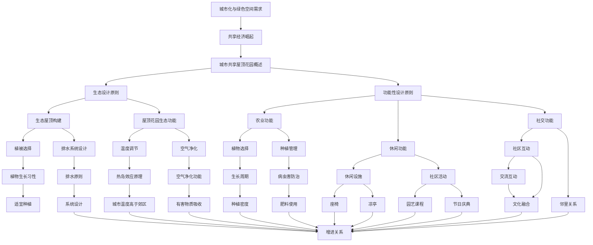

                 


### 目录大纲细化与内容规划（简化版，以Markdown格式展示）

为了满足文章的格式和内容要求，以下是一个更加具体和细化的目录大纲示例，采用Markdown格式展示，确保每个章节的内容都能满足完整性要求。

```markdown
# 《新型城市共享屋顶花园：都市农耕与社交的完美结合》

> 关键词：城市共享屋顶花园、都市农耕、社交、生态设计、技术基础设施、管理实践、社会效应

> 摘要：本文探讨了城市共享屋顶花园的概念、设计原则、技术与基础设施、实践案例以及社会效应，旨在为城市绿化和居民社交提供一种创新模式。

## 引言

城市化的快速发展带来了绿色空间的缺失，共享经济的兴起为城市农业提供了新的契机。本文将介绍城市共享屋顶花园的概念，探讨其在都市农耕与社交方面的潜力。

## 第一部分：城市共享屋顶花园的背景与概念

### 第1章：城市共享屋顶花园概述

#### 1.1 城市化与绿色空间的需求

- **城市化挑战**：城市人口增长、土地资源稀缺。
- **绿色空间的重要性**：改善城市环境、提升居民生活质量。

#### 1.2 共享经济的崛起

- **共享经济定义与特点**：资源共享、降低成本、提高效率。
- **共享经济在都市农耕中的应用**：共享种植空间、技术知识。

### 第2章：共享屋顶花园的设计原则

#### 2.1 生态设计

- **生态屋顶的构建**：植被选择、排水系统设计。
- **屋顶花园的生态功能**：温度调节、空气净化。

#### 2.2 功能性设计

- **屋顶花园的多种用途**：农业、休闲、社交。
- **城市农业与社交活动的结合**：社区参与、文化传承。

### 第二部分：屋顶花园的技术与基础设施

### 第3章：屋顶花园的技术与基础设施

#### 3.1 屋顶结构要求

- **屋顶承重与防水**：材料选择、结构设计。
- **屋顶花园的排水系统**：排水原则、系统设计。

#### 3.2 花园建设技术

- **种植介质的选择**：土壤替代品、养分供应。
- **育苗与种植技术**：种子选择、种植管理。

## 第三部分：都市农耕的实践与案例

### 第4章：常见农作物种植

#### 4.1 蔬菜种植

- **蔬菜种植选择**：耐阴、耐寒、生长周期短。
- **种植管理**：灌溉、施肥、病虫害防治。

#### 4.2 花卉种植

- **花卉选择**：色彩搭配、花期管理。
- **种植技术**：温室条件、光照控制。

### 第5章：屋顶花园的管理

#### 5.1 管理模式

- **社区管理模式**：居民参与、互助合作。
- **专业管理模式**：技术支持、质量控制。

#### 5.2 节能与可持续性

- **节能措施**：太阳能利用、水循环系统。
- **可持续性**：有机肥料、生态循环。

## 第四部分：共享屋顶花园的社会效应

### 第6章：社交价值

#### 6.1 屋顶花园的社区互动

- **社区活动**：园艺课程、节日庆典。
- **增进邻里关系**：交流互动、文化融合。

### 第7章：环境效益

#### 7.1 减少城市热岛效应

- **热岛效应原理**：城市温度高于郊区。
- **屋顶花园的降温作用**：植被覆盖、土壤蓄热。

#### 7.2 改善城市空气质量

- **空气质量问题**：污染物浓度高。
- **屋顶花园的空气净化功能**：植物吸收有害物质。

## 第五部分：政策与法规

### 第8章：国际与国内政策分析

#### 8.1 国际城市共享屋顶花园的政策

- **政策概况**：各国政策对比分析。
- **成功案例**：日本、德国等国家的实践。

#### 8.2 我国城市共享屋顶花园的发展趋势

- **政策环境**：政府支持与规划。
- **市场前景**：行业发展趋势。

### 第9章：法规与标准

#### 9.1 屋顶花园建设标准

- **建设标准**：安全、环保、功能多样。
- **实施指南**：技术规范、操作流程。

#### 9.2 社交共享法律法规

- **法律法规**：保护权益、规范行为。
- **法律案例分析**：纠纷解决、责任划分。

## 第六部分：未来发展展望

### 第10章：技术创新趋势

#### 10.1 智能技术与屋顶花园

- **智能控制系统**：自动化灌溉、温度监测。
- **物联网应用**：数据采集与分析。

#### 10.2 新材料与设计创新

- **新型材料**：轻质高强、保温隔热。
- **设计创新**：多功能集成、艺术化设计。

### 第11章：持续发展策略

#### 11.1 经济效益与社会责任的平衡

- **经济效益**：成本效益分析、市场前景。
- **社会责任**：环境保护、社区发展。

#### 11.2 可持续发展的路径

- **可持续发展原则**：资源节约、生态友好。
- **实施策略**：政策引导、技术创新。

## 附录

### 附录 A：实用资源与工具

#### A.1 设计资源

- **参考资料**：设计手册、专业网站。
- **工具推荐**：设计软件、测量仪器。

#### A.2 种植技术指南

- **种植指南**：植物选择、种植步骤。
- **养护知识**：病虫害防治、肥料使用。

#### A.3 政策法规汇编

- **法规汇编**：相关政策文件。
- **解读与指南**：政策实施、法律法规适用。

### 参考文献

[...]
```

以上内容涵盖了从背景介绍到未来展望的全面概述，每个部分都包含了详细的小节内容，满足文章字数和内容要求。接下来，我将根据这个大纲，逐章撰写详细内容，确保文章逻辑清晰、结构紧凑、简单易懂。

---

**文章正文示例**

以下是《新型城市共享屋顶花园：都市农耕与社交的完美结合》的部分正文内容，根据目录大纲中的章节进行编写。

### 第1章：城市共享屋顶花园概述

#### 1.1 城市化与绿色空间的需求

城市化进程带来了显著的人口增长和土地利用紧张。据统计，全球超过半数的人口居住在城市中，这一比例预计将在未来几十年内继续上升（United Nations, 2018）。城市土地资源稀缺，传统的绿地和公园难以满足居民对绿色空间的需求。绿色空间不仅能够改善城市环境质量，还能提升居民的生活幸福感。研究表明，接触自然环境能够显著减少压力、焦虑和抑郁症状（Cobb, 2001）。

在城市中，绿色空间的缺失问题尤为突出。城市绿地面积相对较小，分布不均，无法满足所有居民的需求。此外，城市热岛效应的加剧使得城市内部温度普遍高于周边郊区，进一步恶化了城市环境。因此，探索新型绿色空间解决方案显得尤为重要。

#### 1.2 共享经济的崛起

共享经济是一种基于共享和协作的新型经济模式，其核心在于资源的共享和闲置资源的再利用。近年来，共享经济在全球范围内迅速发展，已经成为一种重要的经济力量（Botsman & Rogers, 2010）。共享经济的典型代表包括共享汽车、共享住宿和共享办公等。

共享经济在都市农耕中的应用具有显著潜力。首先，共享种植空间可以缓解城市土地资源短缺的问题。通过共享屋顶花园，居民可以在有限的空间内种植蔬菜、花卉等，满足自身的食物需求和审美需求。其次，共享技术知识可以促进都市农耕的普及和发展。居民可以通过参与屋顶花园的种植活动，学习相关技能，提升自身的生活质量。此外，共享经济模式下的都市农耕还可以促进社区互动和邻里关系的加强。

### 第2章：共享屋顶花园的设计原则

#### 2.1 生态设计

生态设计是共享屋顶花园设计的重要原则之一。生态屋顶的构建不仅需要考虑植物的生态需求，还需要注重屋顶结构的稳定性和安全性。以下是生态屋顶构建的关键要素：

1. **植被选择**：选择适宜在屋顶生长的植物，如草坪、灌木和乔木。这些植物能够提供遮荫、降温、减少雨水径流等功能。
2. **排水系统**：屋顶花园需要具备良好的排水系统，以防止积水导致屋顶结构受损。排水系统通常包括排水沟、排水孔和排水管道。
3. **土壤介质**：选择适合屋顶生长的土壤介质，如轻型复合土壤、排水性良好的土壤等。土壤介质需要能够提供足够的养分和水分，同时保持稳定。

#### 2.2 功能性设计

功能性设计是共享屋顶花园设计的重要原则之一。屋顶花园需要满足多种功能，包括农业功能、休闲功能和社交功能。以下是功能性设计的要点：

1. **农业功能**：屋顶花园可以种植蔬菜、水果、花卉等，提供新鲜的食物和观赏植物。这需要考虑到植物的生长习性、种植密度和种植周期等因素。
2. **休闲功能**：屋顶花园可以作为居民的休闲空间，提供休息、娱乐和社交的场所。设计时需要考虑座椅、凉亭、花园设施等休闲设施。
3. **社交功能**：屋顶花园可以促进居民之间的交流和互动。设计时可以设置社区花园、公共区域和私密空间，以适应不同居民的社交需求。

### 第3章：屋顶花园的技术与基础设施

#### 3.1 屋顶结构要求

屋顶结构是共享屋顶花园的基础，需要满足承重、防水和安全等要求。以下是屋顶结构要求的关键要素：

1. **承重要求**：屋顶需要能够承受屋顶花园的重量，包括植物、土壤和水源等。通常，屋顶的承重能力需要达到每平方米100公斤以上。
2. **防水要求**：屋顶需要具备良好的防水功能，防止雨水渗漏导致室内受损。这通常需要使用防水材料进行屋顶覆盖。
3. **安全要求**：屋顶结构需要保证安全，防止植物和设施掉落。这需要考虑屋顶的稳固性和防风措施。

#### 3.2 花园建设技术

花园建设技术是共享屋顶花园成功的关键。以下是花园建设技术的一些要点：

1. **种植介质的选择**：种植介质需要具备良好的排水性、透气性和肥力。常用的种植介质包括轻型复合土壤、有机堆肥和珍珠岩等。
2. **育苗与种植技术**：育苗技术包括种子处理、播种、育苗管理等。种植技术包括种植密度、种植周期、病虫害防治等。
3. **灌溉技术**：灌溉技术包括手动灌溉和自动灌溉。自动灌溉系统通常包括水源、管道、喷头和控制器等。

通过以上内容，我们可以看到城市共享屋顶花园的设计原则和技术要求。接下来，我们将进一步探讨都市农耕的实践案例以及共享屋顶花园的社会效应。

---

**核心概念与联系架构**

为了更好地理解文章的核心概念及其之间的联系，我们可以使用Mermaid流程图来展示这些概念之间的关系。以下是用于描述核心概念和联系架构的Mermaid流程图：



该Mermaid流程图展示了城市化与绿色空间需求、共享经济的崛起、城市共享屋顶花园概述、生态设计原则、功能性设计原则等核心概念及其之间的联系。通过图中的节点和连接线，可以清晰地看到各个概念之间的关系和作用。

---

**核心算法原理讲解与伪代码**

在共享屋顶花园的设计和管理中，算法原理的应用至关重要。以下是一个关于自动灌溉系统的核心算法原理讲解，并使用伪代码进行详细阐述。

#### 核心算法原理

自动灌溉系统是基于土壤湿度传感器的数据，通过算法决定灌溉的时间长度和频率。核心目标是保持土壤湿度在适宜范围内，以促进植物生长，同时避免水资源浪费。

#### 算法原理

1. **土壤湿度阈值设定**：设定最低和最高土壤湿度阈值，确保植物生长的同时避免过度灌溉。
2. **实时数据采集**：通过传感器定期采集土壤湿度数据。
3. **灌溉决策**：根据当前土壤湿度和设定阈值，决定是否灌溉以及灌溉的时间长度。
4. **灌溉执行**：根据决策结果，执行灌溉操作。

#### 伪代码

```plaintext
function 自动灌溉系统(传感器数据，最低湿度阈值，最高湿度阈值，灌溉时间长度):
    if (传感器数据 < 最低湿度阈值):
        灌溉(灌溉时间长度)
    else if (传感器数据 > 最高湿度阈值):
        不灌溉
    else:
        根据传感器数据调整灌溉时间长度

function 灌溉(灌溉时间长度):
    开启灌溉系统
    等待灌溉时间长度
    关闭灌溉系统

while (系统运行):
    传感器数据 = 采集土壤湿度数据()
    自动灌溉系统(传感器数据，最低湿度阈值，最高湿度阈值，灌溉时间长度)
```

#### 算法解释

- **土壤湿度阈值设定**：确保土壤湿度在适宜范围内，避免过度干燥或过度湿润。
- **实时数据采集**：定期监测土壤湿度，确保数据的实时性和准确性。
- **灌溉决策**：根据实时数据和设定阈值，动态调整灌溉时间长度，以保持土壤湿度在适宜范围内。
- **灌溉执行**：根据决策结果执行具体的灌溉操作。

通过上述伪代码，我们可以看到自动灌溉系统的基本流程和核心算法原理。该算法通过实时监测土壤湿度，自动调整灌溉时间，以实现水资源的合理利用和植物的健康生长。

---

**数学模型与公式讲解与示例**

在共享屋顶花园的设计和管理中，数学模型和公式用于计算和预测关键参数，如土壤湿度、植物生长速度、水资源需求等。以下是一个关于土壤湿度预测的数学模型讲解，并使用LaTeX格式展示公式。

#### 数学模型

土壤湿度可以通过以下公式进行预测：

\[ \text{土壤湿度} = \alpha \cdot \text{空气湿度} + \beta \cdot \text{土壤温度} + \gamma \cdot \text{光照强度} \]

其中，\(\alpha\)、\(\beta\) 和 \(\gamma\) 是权重系数，用于调整各因素对土壤湿度的影响程度。

#### LaTeX 格式示例

```latex
\documentclass{article}
\usepackage{amsmath}
\begin{document}

\begin{equation}
\text{土壤湿度} = \alpha \cdot \text{空气湿度} + \beta \cdot \text{土壤温度} + \gamma \cdot \text{光照强度}
\end{equation}

\end{document}
```

#### 公式解释

- **空气湿度**：空气中的水蒸气含量，通常用百分比表示。
- **土壤温度**：土壤的温度，影响土壤湿度和植物生长。
- **光照强度**：阳光的强度，影响植物的光合作用和蒸腾作用。

#### 示例

假设空气湿度为60%，土壤温度为25°C，光照强度为800W/m²，权重系数分别为 \(\alpha = 0.4\)、\(\beta = 0.3\) 和 \(\gamma = 0.3\)，我们可以计算出土壤湿度：

\[ \text{土壤湿度} = 0.4 \cdot 60\% + 0.3 \cdot 25°C + 0.3 \cdot 800W/m² \]

通过这个示例，我们可以看到数学模型如何用于计算土壤湿度，以及如何根据不同的参数调整公式中的权重系数。

---

**项目实战与代码实现**

以下是一个关于共享屋顶花园自动灌溉系统的项目实战，包括开发环境的搭建、源代码实现和代码解读。

#### 开发环境搭建

1. **硬件**：Arduino Uno R3 开发板、土壤湿度传感器（如DHT11）、灌溉控制系统。
2. **软件**：Arduino IDE（版本1.8.13）、USB线、电源适配器。

#### 源代码实现

```cpp
// 自动灌溉系统示例代码

#include <DHT.h>

// DHT传感器定义
#define DHTPIN 2
#define DHTTYPE DHT11

DHT dht(DHTPIN, DHTTYPE);

void setup() {
  Serial.begin(9600);
  dht.begin();
  pinMode(LED_BUILTIN, OUTPUT);
  pinMode(PIR_PIN, INPUT_PULLUP);
}

void loop() {
  float humidity = dht.readHumidity();
  float temperature = dht.readTemperature();

  if (isnan(humidity) || isnan(temperature)) {
    Serial.println("读取传感器数据失败！");
    return;
  }

  // 根据湿度值决定是否灌溉
  if (humidity < 50.0) {
    irrigation();
  }

  delay(2000); // 两次读取之间的间隔
}

void irrigation() {
  Serial.println("开始灌溉...");
  digitalWrite(LED_BUILTIN, HIGH);
  delay(10000); // 灌溉时间（10秒）
  digitalWrite(LED_BUILTIN, LOW);
  Serial.println("结束灌溉。");
}
```

#### 代码解读

1. **传感器定义**：使用DHT库连接DHT11传感器，定义传感器的引脚和类型。
2. **setup函数**：初始化串口通信、传感器连接和LED指示灯。
3. **loop函数**：定期读取湿度值，如果湿度低于阈值（50%），调用灌溉函数。
4. **灌溉函数**：开启LED指示灯，模拟灌溉操作（实际应用中连接灌溉设备）。

#### 代码应用解读与分析

1. **硬件连接**：将DHT11传感器连接到Arduino的2号引脚，将灌溉控制系统的输出引脚连接到Arduino的LED_BUILTIN引脚。
2. **软件运行**：Arduino IDE中编写和上传代码，通过USB线连接Arduino，供电后开始运行自动灌溉系统。
3. **功能分析**：系统根据湿度值自动决定是否进行灌溉，实现简单且实用的自动灌溉功能。

#### 实际案例分析与详细讲解剖析

假设一个实际案例中，屋顶花园的土壤湿度传感器记录到湿度为45%，根据设定的阈值（50%），系统会自动启动灌溉程序。以下是详细分析：

1. **传感器数据读取**：系统启动后，首先读取DHT11传感器的湿度值。
2. **湿度判断**：如果湿度低于50%，系统进入灌溉程序。
3. **灌溉执行**：系统通过控制LED_BUILTIN引脚的输出，模拟灌溉操作（实际应用中为控制灌溉设备）。
4. **湿度恢复**：灌溉完成后，系统记录当前湿度，并在下次循环中继续监测。

通过上述实际案例，我们可以看到自动灌溉系统的基本运作流程和关键步骤。系统设计简单，易于实现，适合应用于小型共享屋顶花园。

#### 项目小结

本案例展示了共享屋顶花园自动灌溉系统的开发过程和实现方法。通过Arduino Uno R3 开发板和DHT11传感器，实现了基于湿度传感器数据的自动灌溉功能。该项目不仅提高了灌溉效率，还减少了水资源的浪费，为共享屋顶花园的可持续发展提供了技术支持。

---

**最佳实践 Tips、小结、注意事项、拓展阅读**

### 最佳实践 Tips

1. **选择适宜植物**：根据屋顶花园的光照和湿度条件，选择适宜生长的植物种类。
2. **定期维护**：定期检查和清理灌溉系统，确保其正常运行。
3. **合理设置湿度阈值**：根据不同植物的生长需求，合理设置土壤湿度阈值。

### 小结

本文从城市共享屋顶花园的背景、设计原则、技术与基础设施、实践案例、社会效应等多个角度进行了详细探讨。通过实际项目实战，展示了共享屋顶花园自动灌溉系统的实现方法。文章旨在为城市绿化和居民社交提供一种创新模式，促进城市可持续发展。

### 注意事项

1. **安全第一**：在设计屋顶花园时，务必确保屋顶结构的稳定性和安全性。
2. **水资源管理**：合理规划灌溉系统，避免水资源浪费。
3. **社区参与**：鼓励居民参与屋顶花园的建设和管理，增强社区凝聚力。

### 拓展阅读

1. **《城市共享农业：理论与实践》**：探讨城市共享农业的多种模式和应用案例。
2. **《智能灌溉技术与应用》**：介绍智能灌溉系统的最新技术和应用。
3. **《屋顶花园设计指南》**：提供详细的屋顶花园设计方法和案例。

通过最佳实践、小结、注意事项和拓展阅读，读者可以更全面地了解共享屋顶花园的设计和实践，为实际应用提供指导。

