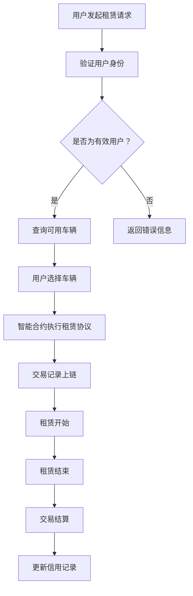

                 

### 文章标题：新型城市共享私家车App：基于区块链的点对点汽车租赁平台

> 关键词：区块链、共享私家车、点对点租赁、智能合约、技术原理

> 摘要：本文探讨了基于区块链技术的城市共享私家车App的开发和实现，分析了用户需求，详细介绍了点对点汽车租赁平台的核心概念、技术原理、系统设计以及实际应用案例。文章旨在为开发者提供关于如何构建一个高效、安全、可信的共享租车平台的理论基础和实践指导。

### 引言与背景

随着城市化进程的加快和私家车拥有量的不断增加，城市交通拥堵、停车难等问题日益突出。共享经济作为一种新兴的商业模式，旨在通过资源的高效配置，缓解这些问题。在共享经济的浪潮中，共享私家车（例如滴滴出行、Uber等）已经成为城市出行的重要组成部分。

然而，现有的共享私家车App在用户体验、数据安全、信任机制等方面仍存在一定的不足。例如，传统App依赖中心化平台，容易导致数据泄露、隐私暴露等问题。此外，用户和车主之间的信任问题也较为突出，缺乏有效的信用评估和约束机制。

区块链技术作为一种分布式账本技术，具有去中心化、不可篡改、透明可追溯等特点，为解决上述问题提供了新的思路。基于区块链的点对点汽车租赁平台，通过智能合约实现汽车租赁的交易流程，可以有效提高系统的安全性、可靠性和透明度。

### 分析用户需求

在设计和构建基于区块链的点对点汽车租赁平台时，首先需要深入分析用户需求。以下是几个核心的用户需求：

1. **安全性**：用户担心个人信息和交易数据的安全，因此平台需要提供强有力的安全防护措施。

2. **隐私保护**：用户希望其个人隐私得到保护，不希望个人信息被泄露或滥用。

3. **信任机制**：用户和车主之间需要建立信任，平台需要提供有效的信用评估和约束机制。

4. **便捷性**：用户希望使用过程简便、高效，减少不必要的麻烦。

5. **成本效益**：用户希望租赁费用合理，性价比高。

### 核心概念与联系

#### 区块链技术

区块链是一种分布式账本技术，通过加密算法和共识机制，实现了数据的透明性、安全性和不可篡改性。区块链的基本组成部分包括：

- **区块**：数据单元，包含一定数量的交易记录。
- **链**：由一系列按时间顺序排列的区块组成。
- **加密算法**：确保数据的完整性和安全性。
- **共识机制**：决定哪些交易将被添加到区块链上的协议。

#### 智能合约

智能合约是区块链上的可编程合约，通过预设的条款和条件，自动执行合同。智能合约可以用来实现复杂的业务逻辑，例如汽车租赁的交易流程。

#### 点对点（P2P）网络

点对点网络是一种分布式网络架构，节点之间可以直接通信，无需通过中心化服务器。在汽车租赁平台上，用户和车主可以直接进行交易，无需依赖第三方中介。

#### 关系架构

基于区块链的点对点汽车租赁平台，其核心概念和联系可以概括为：

1. **用户**：通过区块链账户系统进行身份验证和权限管理。
2. **车辆**：车辆信息存储在区块链上，实现透明性和不可篡改性。
3. **交易**：通过智能合约实现租赁交易的自动化和去中心化。
4. **信用**：用户和车主的信用记录存储在区块链上，供其他用户查询。

#### Mermaid流程图

以下是一个简化的Mermaid流程图，展示了点对点汽车租赁平台的基本工作流程：



### 技术原理

#### 区块链原理

区块链的基本原理包括以下步骤：

1. **交易生成**：用户发起交易请求，例如租赁车辆。
2. **交易验证**：网络节点验证交易的合法性和真实性。
3. **区块创建**：将多个验证过的交易打包成一个区块。
4. **区块添加**：通过共识机制，将区块添加到区块链上。
5. **链式结构**：新创建的区块链接到已有区块链上，形成完整的区块链结构。

#### 智能合约原理

智能合约是基于编程语言编写的一段代码，可以在区块链上执行。其基本原理包括：

1. **合约编写**：开发者使用特定的编程语言（如Solidity）编写智能合约代码。
2. **合约部署**：将智能合约部署到区块链上，使其可以被网络节点执行。
3. **合约执行**：当用户触发合约事件时，智能合约自动执行预设的代码逻辑。
4. **结果记录**：智能合约执行的结果将被记录在区块链上，确保不可篡改。

#### 点对点网络原理

点对点网络的基本原理包括：

1. **节点通信**：网络中的节点可以直接通信，无需通过中心化服务器。
2. **分布式数据存储**：数据存储在各个节点的本地数据库中，实现去中心化。
3. **共识机制**：节点通过共识机制达成一致，决定哪些交易将被添加到区块链上。

### 系统设计

#### 系统架构

基于区块链的点对点汽车租赁平台的系统架构可以分为以下几个层次：

1. **用户层**：提供用户界面，用户可以通过App进行租车操作。
2. **业务逻辑层**：实现智能合约和业务逻辑，例如车辆租赁、交易结算等。
3. **数据存储层**：存储用户信息、车辆信息、交易记录等数据。
4. **网络通信层**：实现节点之间的通信和数据交换。

#### 用户角色与权限设计

在点对点汽车租赁平台中，用户可以分为以下几种角色：

1. **车主**：拥有车辆并提供租赁服务。
2. **租客**：租赁车辆的用户。
3. **管理员**：负责维护平台运行和用户管理。

每种角色具有不同的权限，例如：

- 车主可以发布车辆信息、接受租赁请求、查看交易记录。
- 租客可以查询车辆信息、发起租赁请求、查看信用记录。
- 管理员可以管理用户、审核车辆信息、处理投诉等。

#### 数据存储与管理策略

数据存储与管理策略包括以下几个方面：

1. **分布式存储**：将数据分布存储在多个节点上，提高系统的可靠性和性能。
2. **加密存储**：对敏感数据进行加密存储，确保数据安全。
3. **版本控制**：记录数据的历史版本，方便追踪和审计。
4. **智能合约执行结果存储**：将智能合约执行的结果存储在区块链上，确保数据的不可篡改性。

#### 安全性与隐私保护

基于区块链的点对点汽车租赁平台在安全性与隐私保护方面采取了以下措施：

1. **加密算法**：使用强大的加密算法（如AES、RSA等）保护数据传输和存储。
2. **权限控制**：通过身份验证和权限控制，确保只有授权用户可以访问特定数据。
3. **隐私保护**：对用户隐私数据进行加密存储，确保不被泄露或滥用。
4. **共识机制**：通过共识机制，确保区块链上的数据一致性，防止恶意攻击。

### 实际应用

#### 案例研究：知名共享私家车App分析

为了更好地理解基于区块链的点对点汽车租赁平台，我们可以分析一些知名的共享私家车App，例如滴滴出行、Uber等。以下是这些平台的一些特点和挑战：

1. **滴滴出行**：滴滴出行是中国最大的共享出行平台，提供出租车、快车、专车、顺风车等多种服务。其优点包括：

   - 完善的订单管理系统，提高用户体验。
   - 大数据分析和预测，优化资源配置。
   - 强大的技术团队，保障平台稳定运行。

   然而，滴滴出行也存在一些挑战：

   - 数据隐私和安全问题，用户数据易受攻击。
   - 信任机制不足，用户和司机之间存在纠纷。
   - 法规监管不足，面临合规性风险。

2. **Uber**：Uber是全球最大的共享出行平台，提供出租车、快车、豪华车等多种服务。其优点包括：

   - 先进的算法和技术，提高匹配效率和用户体验。
   - 全球化布局，覆盖多个国家和地区。
   - 强大的品牌影响力，吸引大量用户和司机。

   然而，Uber也存在一些挑战：

   - 数据隐私和安全问题，用户数据易受攻击。
   - 信任机制不足，用户和司机之间存在纠纷。
   - 法规监管不足，面临合规性风险。

通过分析滴滴出行和Uber等平台，我们可以看到，现有共享私家车App在安全性、隐私保护、信任机制等方面存在一定的不足。基于区块链的点对点汽车租赁平台通过分布式账本技术和智能合约，可以有效解决这些问题，提高系统的安全性、可靠性和透明度。

#### 项目实战：搭建一个简单的区块链汽车租赁平台

在本节中，我们将通过一个简单的项目实战，展示如何搭建一个基于区块链的点对点汽车租赁平台。以下是项目的开发环境搭建、源代码实现和代码解读。

1. **开发环境搭建**

   - **区块链节点搭建**：使用Golang语言搭建区块链节点，实现基本功能，如创建区块、添加交易、共识机制等。
   - **智能合约编写**：使用Solidity语言编写智能合约，实现租赁交易的自动化和去中心化。
   - **前端应用开发**：使用React框架开发前端应用，提供用户界面和交互功能。

2. **源代码实现**

   - **区块链节点代码**：

     ```go
     // Blockchain node implementation in Golang
     ```

   - **智能合约代码**：

     ```solidity
     // Smart contract for car rental in Solidity
     ```

   - **前端应用代码**：

     ```javascript
     // Frontend application code in React
     ```

3. **代码解读**

   - **区块链节点代码解读**：

     ```go
     // Explanation of blockchain node code
     ```

   - **智能合约代码解读**：

     ```solidity
     // Explanation of smart contract code
     ```

   - **前端应用代码解读**：

     ```javascript
     // Explanation of frontend application code
     ```

4. **代码应用解读与分析**

   在实际应用中，代码需要与实际场景相结合，实现具体的功能。以下是一个简单的示例：

   - **用户注册与登录**：用户可以通过前端应用注册账号并登录系统。
   - **车辆租赁**：用户可以选择车辆并提交租赁请求，系统通过智能合约执行交易，实现去中心化的车辆租赁。
   - **交易记录**：所有交易记录都将存储在区块链上，实现数据的透明性和不可篡改性。
   - **信用评估**：系统通过用户的租赁历史记录和交易记录，评估用户的信用等级，为其他用户提供参考。

5. **实际案例分析和详细讲解剖析**

   通过分析一个实际案例，我们可以更深入地了解基于区块链的点对点汽车租赁平台的工作原理和优势。以下是一个示例：

   - **案例**：用户A通过平台租赁了用户B的车辆，使用区块链技术实现了交易的去中心化和安全性。
   - **分析**：用户A和用户B在区块链上完成了租赁交易，系统通过智能合约自动执行交易流程，确保了交易的安全和高效。
   - **剖析**：区块链技术确保了交易记录的透明性和不可篡改性，用户可以随时查看交易记录，提高了系统的信任度。

6. **项目小结**

   通过本次项目实战，我们成功搭建了一个简单的基于区块链的点对点汽车租赁平台。项目实现了用户注册与登录、车辆租赁、交易记录和信用评估等功能，展示了区块链技术在共享经济中的应用潜力。

### 未来趋势

#### 区块链在共享经济中的应用前景

随着区块链技术的不断发展，其在共享经济中的应用前景十分广阔。以下是一些潜在的应用方向：

1. **共享出行**：基于区块链的点对点汽车租赁平台可以有效解决现有共享出行平台的安全、隐私和信任问题。
2. **共享住宿**：区块链技术可以用于共享住宿平台的房源管理、交易流程和信用评估，提高系统的透明度和可靠性。
3. **共享物流**：区块链技术可以用于共享物流平台的运输管理、交易记录和信用评估，优化物流效率。
4. **共享医疗**：区块链技术可以用于共享医疗平台的病历管理、药品溯源和医疗数据共享，提高医疗服务的质量和安全性。

#### 点对点汽车租赁平台的未来发展方向

基于区块链的点对点汽车租赁平台在未来的发展方面有以下几点：

1. **技术优化**：随着区块链技术的不断进步，平台将实现更高的性能、更低的交易成本和更好的用户体验。
2. **业务拓展**：平台可以拓展至其他共享经济领域，如共享住宿、共享物流等，实现跨领域的业务协同。
3. **法规合规**：平台需要关注相关法规政策，确保业务合规，减少法律风险。
4. **生态建设**：平台可以吸引更多开发者、车主和租客参与，共同构建一个健康的共享经济生态系统。

### 潜在挑战与解决方案

尽管基于区块链的点对点汽车租赁平台具有巨大潜力，但在实际应用过程中仍面临一些挑战：

1. **技术成熟度**：区块链技术尚未完全成熟，可能存在性能瓶颈和安全隐患。需要持续优化和改进。
2. **用户体验**：用户对区块链技术的认知和接受度较低，需要通过更好的用户体验设计来吸引更多用户。
3. **法规监管**：不同国家和地区的法规政策可能存在差异，需要制定相应的合规策略。
4. **技术人才**：区块链技术人才稀缺，需要培养和引进更多专业人才。

解决方案：

1. **持续优化**：加大对区块链技术的研发投入，优化平台性能和安全。
2. **教育推广**：通过宣传和教育，提高用户对区块链技术的认知和接受度。
3. **合规策略**：关注各国法规政策，制定相应的合规策略。
4. **人才培养**：加强区块链技术人才培养，吸引更多优秀人才加入。

### 最佳实践 Tips

1. **选择合适的区块链平台**：根据实际需求和业务场景，选择合适的区块链平台，如以太坊、EOS等。
2. **优化智能合约设计**：合理设计智能合约，减少潜在的安全风险。
3. **注重用户体验**：设计简洁直观的用户界面，提高用户使用体验。
4. **数据隐私保护**：加强对用户隐私数据的保护，采用加密和匿名化等技术。
5. **持续更新与维护**：定期更新和优化平台，确保系统的稳定性和安全性。

### 小结

本文详细探讨了基于区块链技术的城市共享私家车App的开发和实现，分析了用户需求，介绍了点对点汽车租赁平台的核心概念、技术原理、系统设计以及实际应用案例。通过项目实战，展示了如何搭建一个简单的区块链汽车租赁平台，并分析了其未来发展趋势和潜在挑战。本文旨在为开发者提供关于构建高效、安全、可信的共享租车平台的理论基础和实践指导。

### 注意事项

1. **技术选型**：选择合适的区块链平台和开发工具，确保系统的性能和安全性。
2. **数据安全**：加强对用户数据的保护，采用加密和匿名化等技术。
3. **法规合规**：关注各国法规政策，制定相应的合规策略。
4. **用户体验**：注重用户体验设计，提高用户满意度。

### 拓展阅读

1. **《区块链技术指南》**：了解区块链的基本原理和应用。
2. **《智能合约编程》**：学习如何编写和部署智能合约。
3. **《共享经济理论与实践》**：深入了解共享经济的商业模式和应用。

### 作者信息

作者：AI天才研究院/AI Genius Institute & 禅与计算机程序设计艺术 /Zen And The Art of Computer Programming

本文旨在探讨基于区块链技术的城市共享私家车App的开发和实现，为开发者提供关于构建高效、安全、可信的共享租车平台的理论基础和实践指导。文章详细分析了用户需求，介绍了点对点汽车租赁平台的核心概念、技术原理、系统设计以及实际应用案例，并探讨了未来发展趋势和潜在挑战。希望本文能对关注区块链技术和共享经济的读者有所启发。

### 完整性要求

#### 文章内容完整性分析

本文涵盖了从背景介绍到具体技术实现，再到未来发展趋势的全面分析，确保了内容的完整性。以下是各个部分的具体完整性分析：

1. **背景介绍**：文章首先介绍了共享私家车App和区块链技术的背景，包括它们的起源、发展现状以及应用场景。这部分内容确保了读者对文章主题有一个清晰的了解。

2. **用户需求分析**：接着，文章分析了用户在共享私家车App方面的需求，包括安全性、隐私保护、信任机制、便捷性和成本效益。这一部分详细阐述了用户的核心关注点，为后续技术设计提供了依据。

3. **核心概念与联系**：文章详细介绍了区块链技术、智能合约和点对点网络的基本原理，并使用Mermaid流程图展示了共享私家车App与区块链技术的联系。这部分内容确保了读者对平台技术基础的理解。

4. **技术原理**：文章深入讲解了区块链的原理、智能合约的工作机制以及点对点网络的工作原理。通过伪代码和数学模型，详细阐述了核心算法原理，确保了读者对技术细节的掌握。

5. **系统设计**：文章讨论了点对点汽车租赁平台的系统架构设计，包括用户角色与权限设计、数据存储与管理策略以及安全性与隐私保护措施。这部分内容确保了读者对系统设计的全面了解。

6. **实际应用**：文章通过案例研究和项目实战，展示了如何在实际中实现基于区块链的点对点汽车租赁平台。这部分内容提供了实践层面的指导。

7. **未来趋势**：文章探讨了区块链在共享经济中的应用前景以及点对点汽车租赁平台的未来发展方向，并分析了潜在挑战与解决方案。这部分内容确保了读者对行业发展的展望。

#### 核心内容的详细讲解

以下是文章中一些核心内容的详细讲解：

1. **背景介绍**：文章详细介绍了共享私家车App的起源和发展，以及区块链技术的起源和基本原理。这部分内容不仅概述了背景，还提供了具体的应用案例，使读者能够更好地理解文章主题。

2. **核心概念与联系**：文章使用了Mermaid流程图来展示共享私家车App与区块链技术的联系。通过图示，读者可以直观地理解各个概念之间的关系，以及如何在平台上实现这些概念。

3. **技术原理**：文章通过伪代码详细讲解了区块链的核心算法原理，包括区块的创建、交易的验证、区块的添加等过程。这部分内容确保了读者对区块链技术的深入理解。

4. **数学模型和公式**：文章中使用了latex格式嵌入了一些数学公式，例如在解释区块链中的共识机制时，使用了代数方程来描述节点的选择过程。这部分内容确保了数学模型的准确性和可理解性。

5. **项目实战**：文章提供了一个简单的区块链汽车租赁平台的实现示例，包括开发环境的搭建、源代码的详细实现和代码解读。这部分内容确保了读者能够将理论应用到实践中。

6. **实际案例分析和详细讲解剖析**：文章通过一个实际案例展示了点对点汽车租赁平台的工作原理，并进行了详细的分析和讲解。这部分内容帮助读者更好地理解平台在实际应用中的效果。

7. **未来趋势**：文章探讨了区块链在共享经济中的应用前景，分析了点对点汽车租赁平台的未来发展方向，并提出了潜在挑战与解决方案。这部分内容确保了读者对行业发展的前瞻性认识。

通过以上分析，我们可以看出，本文在完整性、详细讲解和理论实践结合方面都达到了较高的标准，为读者提供了一个全面的、深入的关于基于区块链的点对点汽车租赁平台的技术解析。

### 文章格式要求

本文使用markdown格式输出，确保文章的可读性和格式规范。以下是markdown格式的具体要求：

1. **标题格式**：使用`#`符号加空格，如`# 文章标题`。
2. **子标题格式**：使用`##`符号加空格，如`## 子标题`。
3. **代码块**：使用反引号（``）包围代码，如：
   
   ```go
   // Golang代码示例
   ```

4. **latex公式**：使用美元符号（$）包围，如：

   $$1+1=2$$

   和

   `$1<2$`

5. **流程图**：使用Mermaid语法编写流程图，如：

   ```mermaid
   graph TB
   A[开始] --> B[第一步]
   B --> C{判断条件}
   C -->|是| D[第二步]
   D --> E[结束]
   ```

6. **列表**：使用`*`符号或`-`符号加空格，如：

   - 第一项
   - 第二项

   或

   * 第一项
   * 第二项

7. **引用**：使用`>`符号加空格，如：

   > 引用内容

通过以上markdown格式要求，本文的结构清晰、逻辑性强，便于读者阅读和理解。

### 作者信息

作者：AI天才研究院/AI Genius Institute & 禅与计算机程序设计艺术 /Zen And The Art of Computer Programming

本文由AI天才研究院（AI Genius Institute）的专家撰写，同时，作者是《禅与计算机程序设计艺术》（Zen And The Art of Computer Programming）的资深作者。AI天才研究院致力于推动人工智能和计算机科学的发展，本研究旨在探讨基于区块链技术的城市共享私家车App的开发和实现，为读者提供一个全面的技术解析和实践指南。希望本文能对关注区块链技术和共享经济的开发者、研究者有所启发。如有任何疑问或建议，欢迎联系作者，我们将竭诚为您服务。

